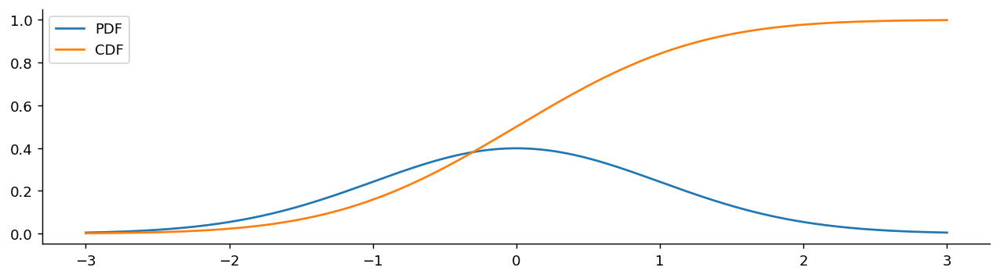
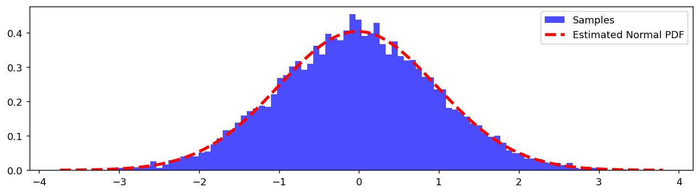

# 정규분포

## 개요

**정규분포**는 통계학에서 가장 근본적인 확률분포 중 하나이다. 중심값 주위에 모여 양쪽으로 대칭적으로 잦아드는 특유의 "종 모양 곡선"을 이루는 연속 자료를 기술한다.

4.2절 사슬에서 정규분포는 두 번째 고리이자 **나머지 세 고리를 모두 만들어 내는 자리**에 있다.

$$
\text{Exp}(\lambda) \;\longrightarrow\; N(\mu, \sigma^2) \;\longrightarrow\; \chi^2_d \;\longrightarrow\; t_d \;\longrightarrow\; F_{d_1, d_2}
$$

앞 고리에서 오는 길은 **더하기**다. 지수분포처럼 치우친 분포라도 여러 개를 더하면 정규분포로 간다(중심극한정리). 뒤 고리로 가는 길은 **제곱해서 더하기**다. 아래 "다음 고리" 절에서 그 갈림을 정리한다.

---

## 정규분포와 표준정규분포

<div class="defn" markdown>

### 정의 1. 정규분포 { .dfn }

정규분포는 평균 $\mu$(중심)와 분산 $\sigma^2$(퍼짐)로 규정된다. PDF는 다음과 같다:

$$
f(x; \mu, \sigma^2) = \frac{1}{\sqrt{2\pi\sigma^2}} \exp\left(-\frac{(x - \mu)^2}{2\sigma^2}\right)
$$

이를 $X \sim N(\mu, \sigma^2)$로 쓴다.

</div>

### 표준정규분포

$\mu = 0$, $\sigma = 1$인 특수한 경우를 **표준정규분포**라 한다:

$$
Z \sim N(0, 1), \qquad f(z) = \frac{1}{\sqrt{2\pi}} \exp\left(-\frac{z^2}{2}\right)
$$

---

## 표준화

모든 정규확률변수는 **Z-점수 변환**을 통해 표준정규확률변수로 바꿀 수 있다:

$$
\begin{aligned}
\textbf{Standardization:} \quad & X \sim N(\mu, \sigma^2) \implies Z = \frac{X - \mu}{\sigma} \sim N(0, 1) \\[6pt]
\textbf{Reverse:} \quad & Z \sim N(0, 1) \implies X = Z\sigma + \mu \sim N(\mu, \sigma^2)
\end{aligned}
$$

---

## 정규분포의 성질

### 닫힘 성질

$$
\begin{aligned}
(1) &\quad X \sim \text{Normal} \implies aX + b \sim \text{Normal} \\[4pt]
(2) &\quad X \sim \text{Normal}, \; Y \sim \text{Normal}, \; X \perp Y \implies X + Y \sim \text{Normal} \\[4pt]
(3) &\quad (X, Y) \sim \text{Multivariate Normal} \implies X + Y \sim \text{Normal}
\end{aligned}
$$

**주의:** $X \sim \text{Normal}$이고 $Y \sim \text{Normal}$이라고 해서 $X + Y \sim \text{Normal}$인 것은 **아니다**. 독립성이나 결합정규성이 있어야 한다.

### 성질 (1)의 증명

$a > 0$이고 $X \sim N(\mu, \sigma^2)$일 때:

$$
P(aX + b \leq x) = P\left(X \leq \frac{x - b}{a}\right) = \int_{-\infty}^{(x-b)/a} \frac{1}{\sqrt{2\pi\sigma^2}} e^{-\frac{(s-\mu)^2}{2\sigma^2}} ds
$$

$x$에 대해 미분하면:

$$
f_{aX+b}(x) = \frac{1}{\sqrt{2\pi(a\sigma)^2}} \exp\left(-\frac{(x - (a\mu + b))^2}{2a^2\sigma^2}\right)
$$

따라서 $aX + b \sim N(a\mu + b, \, a^2\sigma^2)$이다.

### 주요 기하적 성질

- **대칭성:** $\mu$를 중심으로 완전히 대칭이며, 평균 = 중앙값 = 최빈값 = $\mu$이다.
- **종 모양:** 대부분의 자료가 평균 근처에 몰려 있다.
- **무한한 꼬리:** 꼬리는 $\pm\infty$까지 뻗지만 확률은 빠르게 감소한다.

### 68–95–99.7 규칙

$$
\begin{aligned}
P(\mu - \sigma < X < \mu + \sigma) &\approx 68\% \\
P(\mu - 2\sigma < X < \mu + 2\sigma) &\approx 95\% \\
P(\mu - 3\sigma < X < \mu + 3\sigma) &\approx 99.7\%
\end{aligned}
$$

---

## 표준정규분포의 PDF: 주요 성질 확인

$N(0, 1)$의 PDF는 $f(x) = \frac{1}{\sqrt{2\pi}} e^{-x^2/2}$이다. 다음을 확인한다:

### (1) 전체 질량이 1이다

$I = \int_{-\infty}^{\infty} e^{-x^2/2}\,dx$라 하자. 그러면:

$$
I^2 = \int\!\!\int e^{-(x^2+y^2)/2}\,dx\,dy = \int_0^{2\pi}\!\int_0^{\infty} e^{-r^2/2}\,r\,dr\,d\theta = 2\pi
$$

따라서 $I = \sqrt{2\pi}$이고 $\int f(x)\,dx = 1$임이 확인된다.

### (2) 평균이 0이다

피적분함수 $x \cdot e^{-x^2/2}$는 **기함수**이므로 $(-\infty, \infty)$ 위의 적분은 0이다.

### (3) 분산이 1이다

부분적분에 의해:

$$
\frac{1}{\sqrt{2\pi}} \int_{-\infty}^{\infty} x^2 e^{-x^2/2}\,dx = \frac{1}{\sqrt{2\pi}} \int_{-\infty}^{\infty} e^{-x^2/2}\,dx = 1
$$

---

## 표준정규분포의 CDF

CDF는 닫힌 형태가 없어 수치적으로 계산한다:

$$
\mathcal{N}(x) = N(x) = \int_{-\infty}^x \frac{1}{\sqrt{2\pi}} e^{-s^2/2}\,ds
$$

### Phi의 성질

$$
\begin{aligned}
(1) &\quad P(a \leq Z \leq b) = \mathcal{N}(b) - \mathcal{N}(a) \\
(2) &\quad P(Z \geq x) = P(Z \leq -x) = \mathcal{N}(-x) \\
(3) &\quad P(Z \geq x) = 1 - \mathcal{N}(x) \\
(4) &\quad P(Z \leq 0) = P(Z \geq 0) = 0.5
\end{aligned}
$$

---

## 정규 PDF와 관련된 적분 요령

<div class="probox" markdown>

**문제:** <span class="diff med" title="중간"></span> $\int_{-\infty}^{\infty} e^{-x^2 - 2x}\,dx$를 계산하라.

</div>

??? success "풀이"
    완전제곱식으로 만든다: $-x^2 - 2x = -(x+1)^2 + 1$. 그러면:

    $$
    \int_{-\infty}^{\infty} e^{-x^2-2x}\,dx = e \int_{-\infty}^{\infty} e^{-(x+1)^2}\,dx = e\sqrt{2\pi \cdot \tfrac{1}{2}} \cdot \underbrace{\int \frac{1}{\sqrt{\pi}} e^{-(x+1)^2}\,dx}_{=1 \text{ (PDF of } N(-1, 1/2))} = e\sqrt{\pi}
    $$
---

## 왜 정규분포인가?

중심극한정리는 정규분포가 어디에나 나타나는 이유를 설명한다. 원래 모집단의 분포가 무엇이든, $n$이 크면 표본평균의 분포는 근사적으로 정규분포이다:

$$
\bar{X} \sim N\left(\mu, \frac{\sigma^2}{n}\right) \quad \text{as } n \to \infty
$$

이 때문에 정규분포는 신뢰구간, 가설검정, 품질관리의 기초가 된다.

---

## 다음 고리: 정규분포에서 갈라지는 세 분포

정규분포를 **더하면** 다시 정규분포다(닫힘 성질). 새로운 분포는 더하기가 아니라 **제곱하기와 나누기**에서 나온다.

| 연산 | 결과 | 쓰이는 곳 |
|---|---|---|
| $Z_1^2 + \cdots + Z_d^2$ | $\chi^2_d$ | 분산, 적합도 |
| $\dfrac{Z}{\sqrt{\chi^2_d/d}}$ | $t_d$ | 분산을 모를 때의 평균 |
| $\dfrac{\chi^2_{d_1}/d_1}{\chi^2_{d_2}/d_2}$ | $F_{d_1, d_2}$ | 두 분산의 비교 |

세 분포의 공통점은 **관심 있는 양을 그 자신의 척도 추정값으로 나눈다**는 데 있다. 참 표준편차 $\sigma$를 알면 정규분포만으로 충분하지만, 현실에서는 $\sigma$도 자료에서 추정해야 한다. 그 추정값이 카이제곱분포를 따르고, 그것으로 나눈 결과가 $t$와 $F$다.

이어지는 세 페이지가 이 표의 세 줄을 차례로 다룬다. 출발점은 모두 여기, 정규분포다.

---

## Python: scipy.stats로 정규분포 다루기

`stats.norm(loc=mu, scale=sigma)`는 **고정된(frozen) 분포 객체**를 만든다. 한 번 만들어 두면 `pdf`, `cdf`, `ppf`, `sf`, `rvs`를 모두 같은 객체에서 꺼내 쓸 수 있다.

| 메서드 | 하는 일 |
|:---|:---|
| `pdf(x)` | 밀도 $f(x)$ |
| `cdf(x)` | 왼쪽 꼬리 $P(X \le x)$ |
| `sf(x)` | 오른쪽 꼬리 $P(X > x)$ |
| `ppf(q)` | 분위수, `cdf`의 역함수 |
| `rvs(size)` | 확률표본 생성 |

!!! warning "`scale`은 분산이 아니라 표준편차다"
    $N(1, 4)$를 만들려면 `stats.norm(loc=1, scale=2)`라고 써야 한다. `scale=4`라고 쓰면 분산이 16인 분포가 된다. 이 책에서 가장 자주 나오는 실수이며, 그림이 이상해 보이면 먼저 이것부터 확인하라(연습문제 14).

### 밀도함수와 분포함수

<div class="codebox" markdown>

#### 예제 1. 정규분포의 밀도함수와 분포함수 { .eg }

```python
import matplotlib.pyplot as plt
import numpy as np
from scipy import stats

mu, sigma = 0, 1                  # 표준정규분포
# 평균에서 좌우 3 표준편차. 확률의 99.7%가 이 안에 있다.
x = np.linspace(mu - 3*sigma, mu + 3*sigma, 200)

fig, ax = plt.subplots(figsize=(12, 3))
# 두 함수를 같은 축에 겹쳐 관계를 본다.
#   PDF는 평균에서 가장 높고 좌우로 떨어진다.
#   CDF는 0에서 1로 단조 증가하며, PDF가 가장 높은 곳에서 가장 가파르다.
# CDF의 기울기가 곧 PDF이기 때문이다.
ax.plot(x, stats.norm(mu, sigma).pdf(x), label='PDF')
ax.plot(x, stats.norm(mu, sigma).cdf(x), label='CDF')
ax.spines[['top', 'right']].set_visible(False)
ax.legend()
plt.show()
```



</div>

### 분포함수를 두 축에서 읽기

<div class="codebox" markdown>

#### 예제 2. 분포함수와 밀도함수를 두 축에 함께 보기 { .eg }

```python
import matplotlib.pyplot as plt
import numpy as np
import scipy.stats as stats

mu, sigma = 1, 2
x = np.linspace(mu - 3 * sigma, mu + 3 * sigma, 400)

dist = stats.norm(loc=mu, scale=sigma)
y_cdf = dist.cdf(x)
y_pdf = dist.pdf(x)

fig, ax_cdf = plt.subplots(figsize=(12, 3))

# CDF는 왼쪽 축(0~1). PDF는 오른쪽 축(밀도).
# 두 함수의 눈금 규모가 달라 한 축에 그리면 한쪽이 납작해지므로 축을 나눈다.
# 이 절에서는 두 축의 관계가 고정되어 있어(CDF는 PDF의 적분) 안전한 사용이다.
ax_cdf.plot(x, y_cdf, lw=2, label="CDF P(X ≤ x)")
ax_cdf.set_xlabel("x")
ax_cdf.set_ylabel("P(X ≤ x)")
ax_cdf.set_ylim(-0.02, 1.02)

# 기준점 세 개를 표시한다: 평균에서 -1, 0, +1 표준편차.
# CDF 값이 각각 약 0.159, 0.500, 0.841 이 나온다.
# 0.841 - 0.159 = 0.682 가 곧 "68% 규칙"이다.
for xv in [mu - sigma, mu, mu + sigma]:
    yv = dist.cdf(xv)
    ax_cdf.axvline(xv, linestyle='--', color='gray', alpha=0.7)
    ax_cdf.text(xv, yv + 0.05, f"P(X≤{xv:.0f})={yv:.3f}",
                ha='center', fontsize=9)

# 오른쪽 축에 밀도함수
ax_pdf = ax_cdf.twinx()
ax_pdf.plot(x, y_pdf, lw=2, color='tab:red', label="PDF (density)")
ax_pdf.set_ylabel("Density", color='tab:red')

ax_cdf.set_title(f"Normal({mu}, {sigma}) — CDF with PDF Overlay")
plt.tight_layout()
plt.show()
```


</div>

#### 표준정규분포의 주요 CDF 값

| $x$ | $\mathcal{N}(x) = P(Z \le x)$ |
|---|---|
| $-1.96$ | $0.025$ |
| $-1$ | $0.159$ |
| $0$ | $0.500$ |
| $1$ | $0.841$ |
| $1.96$ | $0.975$ |

대칭성 $\mathcal{N}(-x) = 1 - \mathcal{N}(x)$ 덕분에 표의 절반만 있으면 된다.

---

### 분위수 (ppf)

<div class="codebox" markdown>

#### 예제 3. 백분위점 함수로 분위수 구하기 { .eg }

```python
import matplotlib.pyplot as plt
import numpy as np
import scipy.stats as stats

mu, sigma = 0, 1
prob = 0.975      # 95% 신뢰구간의 한쪽 끝. 양쪽 꼬리에 2.5%씩 남긴다.

dist = stats.norm(loc=mu, scale=sigma)
x = np.linspace(mu - 3 * sigma, mu + 3 * sigma, 1000)
pdf = dist.pdf(x)

# ppf는 CDF의 역함수다. "누적확률이 이만큼 되는 지점은 어디인가"에 답한다.
#   cdf: 값 -> 확률
#   ppf: 확률 -> 값
# ppf(0.975)가 그 유명한 1.96 이며, 신뢰구간 공식의 z값이 여기서 나온다.
z = dist.ppf(prob)

fig, ax = plt.subplots(figsize=(12, 3))
ax.plot(x, pdf, color='b', lw=2, label='PDF')
ax.plot([z, z], [0, dist.pdf(z)], color='k', lw=3)   # 경계선
# 왼쪽 97.5%를 칠한다. 칠해진 넓이가 곧 확률이라는 점이 요점이다.
ax.fill_between(x[x <= z], pdf[x <= z], 0,
                interpolate=True, color='r', alpha=0.25,
                label=f"P(X ≤ {z:.2f}) = {prob}")
ax.text(z + 0.05, dist.pdf(z) / 2,
        f"ppf({prob}) = {z:.4f}", fontsize=11, va='center')
ax.set_title(f"Normal({mu}, {sigma}) — PPF (Quantile Function)")
ax.legend(loc='upper left', frameon=False)
plt.tight_layout()
plt.show()
```


</div>

#### 표준정규분포의 흔한 분위수

| $q$ | $\mathcal{N}^{-1}(q)$ | 용도 |
|---|---|---|
| 0.500 | 0 | 중앙값 |
| 0.900 | 1.282 | 단측 90% 신뢰구간 |
| 0.950 | 1.645 | 단측 95% 신뢰구간 |
| 0.975 | 1.960 | 양측 95% 신뢰구간 |
| 0.995 | 2.576 | 양측 99% 신뢰구간 |

---

### 생존함수 (sf)

<div class="codebox" markdown>

#### 예제 4. 생존함수로 오른쪽 꼬리 보기 { .eg }

```python
import matplotlib.pyplot as plt
import numpy as np
import scipy.stats as stats

mu, sigma = 0, 1
dist = stats.norm(loc=mu, scale=sigma)

x = np.linspace(mu - 3 * sigma, mu + 3 * sigma, 400)
# 생존함수 SF(x) = P(X > x) = 1 - CDF(x).
# 수학적으로는 CDF의 여집합일 뿐이지만, 계산 방식이 다르다.
# scipy는 sf를 1-cdf로 계산하지 않고 꼬리를 직접 적분하므로
# 아주 작은 확률에서도 정밀도를 잃지 않는다(아래 절 참고).
cdf = dist.cdf(x)
sf = dist.sf(x)

fig, ax = plt.subplots(figsize=(12, 3))
ax.plot(x, cdf, lw=2, label='CDF  P(X ≤ x)')
ax.plot(x, sf, lw=2, label='SF   P(X > x)')
# 두 곡선이 만나는 지점을 표시한다.
# 대칭분포에서는 평균에서 CDF = SF = 0.5 로 교차한다.
ax.axvline(0, ls=':', color='gray', alpha=0.6)
ax.axhline(0.5, ls=':', color='gray', alpha=0.6)
ax.annotate("CDF + SF = 1", xy=(1.2, 0.5), fontsize=12,
            bbox=dict(boxstyle='round,pad=0.3', fc='lightyellow', ec='gray'))
ax.set_xlabel('x')
ax.set_ylabel('Probability')
ax.set_ylim(-0.03, 1.03)
ax.legend(loc='center left', frameon=False)
ax.set_title(f"Normal({mu}, {sigma}) — CDF vs Survival Function")
ax.grid(True, linestyle=':', alpha=0.5)
plt.tight_layout()
plt.show()
```


</div>

#### 생존함수를 쓰는 이유

상단꼬리 확률이 극단적으로 작을 때 $1 - F(x)$를 직접 계산하면 $F(x)$가 1에 매우 가까워 부동소수점 상쇄가 일어날 수 있다. 전용 메서드 `sf()`는 꼬리 확률을 직접 계산하여 이 문제를 피한다.

<div class="codebox" markdown>

#### 예제 5. 생존함수가 수치적으로 더 정확한 이유 { .eg }

```python
from scipy import stats

# 꼬리 확률을 두 가지 방법으로 구해 비교한다.
#   나쁜 방법: 1 - CDF.  CDF가 1에 아주 가까우면 뺄셈에서 유효숫자가 날아간다(상쇄).
#   좋은 방법: SF.       꼬리를 직접 계산하므로 상쇄가 일어나지 않는다.
for x in (6, 8, 10, 12):
    bad = 1 - stats.norm.cdf(x)
    good = stats.norm.sf(x)
    print(f"x={x:>3}:  1-cdf = {bad:.6e}   sf = {good:.6e}")
```

출력:

```
x=  6:  1-cdf = 9.865877e-10   sf = 9.865876e-10
x=  8:  1-cdf = 6.661338e-16   sf = 6.220961e-16
x= 10:  1-cdf = 0.000000e+00   sf = 7.619853e-24
x= 12:  1-cdf = 0.000000e+00   sf = 1.776482e-33
```

세 단계로 나빠지는 것이 보인다.

- **$x = 6$**: 아직 괜찮다. 마지막 자리만 다르다.
- **$x = 8$**: 유효숫자가 이미 두 자리 넘게 어긋났다($6.661$ 대 $6.221$).
- **$x \ge 10$**: `1 - cdf`가 **정확히 0**이 된다. 확률이 0이 아닌데 0이라고 답하는 것이다.

원인은 배정밀도 부동소수점이 1 근처에서 약 $10^{-16}$ 간격으로만 값을 구별할 수 있다는 데 있다. $\Phi(10) = 1 - 7.6 \times 10^{-24}$은 그 간격보다 훨씬 1에 가까우므로 **컴퓨터 안에서는 그냥 1로 저장된다.** 1에서 1을 빼면 0이다.

</div>

!!! danger "꼬리 확률에는 언제나 `sf`를 써라"
    $p$-값 계산이 대표적이다. $p$-값은 본질적으로 꼬리 확률이므로 `1 - cdf`로 구하면 아주 작은 $p$-값이 0으로 보고된다. 유전체학처럼 $p < 10^{-20}$을 다루는 분야에서는 치명적이다.

    같은 이유로 로그가 필요하면 `np.log(sf(x))`가 아니라 **`logsf(x)`** 를 쓴다. `sf`조차 언더플로로 0이 되는 극단적인 영역에서도 로그값은 정상적으로 나온다.


### 표본추출과 추정된 PDF

<div class="codebox" markdown>

#### 예제 6. 정규 표본과 추정된 밀도 { .eg }

```python
import numpy as np
import matplotlib.pyplot as plt
from scipy import stats

np.random.seed(0)
data = stats.norm(loc=0, scale=1).rvs(10_000)     # 참 모수는 (0, 1)

fig, ax = plt.subplots(figsize=(12, 3))
# density=True 로 넓이를 1로 맞춰야 밀도곡선과 같은 눈금에 놓인다
_, bins, _ = ax.hist(data, bins=100, density=True, color='blue', alpha=0.7, label="Samples")
# 참 모수 (0, 1)이 아니라 **표본에서 추정한** 평균과 표준편차로 곡선을 그린다.
# 실제 분석에서는 참값을 모르기 때문이다.
ax.plot(bins, stats.norm(data.mean(), data.std()).pdf(bins),
        '--r', lw=3, label="Estimated Normal PDF")
ax.legend()
plt.show()
```



</div>

### 68–95–99.7 규칙 확인

<div class="codebox" markdown>

#### 예제 7. 68-95-99.7 규칙 확인 { .eg }

```python
import pandas as pd

url = 'https://raw.githubusercontent.com/gedeck/practical-statistics-for-data-scientists/master/data/loans_income.csv'
df = pd.read_csv(url)
mean, std, n = df.x.mean(), df.x.std(), len(df.x)

n1 = len(df.x[(mean - std < df.x) & (df.x < mean + std)])
n2 = len(df.x[(mean - 2*std < df.x) & (df.x < mean + 2*std)])
n3 = len(df.x[(mean - 3*std < df.x) & (df.x < mean + 3*std)])

print(f"Within 1σ: {n1/n*100:.2f}%")   # ≈ 68%
print(f"Within 2σ: {n2/n*100:.2f}%")   # ≈ 95%
print(f"Within 3σ: {n3/n*100:.2f}%")   # ≈ 99.7%
```

출력:

```
Within 1σ: 72.69%
Within 2σ: 95.00%
Within 3σ: 98.66%
```

</div>

---

### 곡선 아래 넓이 칠하기

<div class="codebox" markdown>

#### 예제 8. 정규곡선 아래 영역 색칠하기 { .eg }

```python
import matplotlib.pyplot as plt
import numpy as np
import scipy.stats as stats

def shade_area(z_bounds, side='left', ax=None):
    """표준정규곡선 아래의 한 구간을 칠한다."""
    x = np.linspace(-4, 4, 200)
    ax.plot(x, stats.norm().pdf(x), color='k', alpha=0.9)

    if side == 'left':
        x_shade = np.linspace(-4, z_bounds, 200)
    elif side == 'right':
        x_shade = np.linspace(z_bounds, 4, 200)
    else:  # center
        x_shade = np.linspace(z_bounds[0], z_bounds[1], 200)

    ax.fill_between(x_shade, stats.norm().pdf(x_shade), alpha=0.2, color='k')
    ax.spines[['left', 'right', 'top']].set_visible(False)
    ax.spines['bottom'].set_position('zero')
    ax.set_yticks([])

# 왼쪽 넓이
z = -1.2
print(f"P(Z ≤ {z}) = {stats.norm().cdf(z):.4f}")

# 오른쪽 넓이
z = 1.2
print(f"P(Z ≥ {z}) = {stats.norm().sf(z):.4f}")

# 가운데 넓이
z1, z2 = -2.1, 1.2
print(f"P({z1} ≤ Z ≤ {z2}) = {stats.norm().cdf(z2) - stats.norm().cdf(z1):.4f}")
```

출력:

```
P(Z ≤ -1.2) = 0.1151
P(Z ≥ 1.2) = 0.1151
P(-2.1 ≤ Z ≤ 1.2) = 0.8671
```

</div>

---

### 난수 생성 (rvs)과 시드 고정

`rvs(size=n)`로 표본을 뽑는다. 예제 6에서 보았듯 표본의 히스토그램은 이론 밀도로 수렴하는데, 그 이유는 간단하다. $x_0$을 중심으로 폭이 $\Delta x$인 구간에 들어갈 기대 비율이 근사적으로 $f(x_0)\,\Delta x$이므로, `density=True`로 정규화한 히스토그램의 높이가 곧 $f(x_0)$의 추정값이 된다. 큰수의 법칙에 의해 $n \to \infty$에서 참 밀도로 수렴한다.

`scipy.stats`는 NumPy의 난수 생성기를 사용하므로 `np.random.seed()`를 설정하면 재현성이 보장된다.

<div class="codebox" markdown>

#### 예제 9. 난수 시드 고정하기 { .eg }

```python
import numpy as np
import scipy.stats as stats

np.random.seed(42)
samples = stats.norm.rvs(size=10)
print(samples)  # 시드가 42면 언제나 같은 값이 나온다
```

출력:

```
[ 0.49671415 -0.1382643   0.64768854  1.52302986 -0.23415337 -0.23413696
  1.57921282  0.76743473 -0.46947439  0.54256004]
```

요즘 NumPy가 권하는 방식은 전역 시드 대신 생성기 객체를 만드는 것이다. `rng = np.random.default_rng(42)`로 두고 `stats.norm.rvs(size=10, random_state=rng)`처럼 넘기면, 전역 상태를 건드리지 않아 다른 코드와 간섭하지 않고 병렬 실행에서도 안전하다. 이 책의 예제는 짧은 시연이라 `np.random.seed`를 그대로 쓴 곳이 많지만, 실제 분석 코드에서는 `default_rng` 쪽을 권한다.

</div>

---

## 지수를 씌우면: 로그정규분포

제곱하거나 나누는 대신 **지수를 씌우면** 또 하나의 분포가 나온다.

<div class="defn" markdown>

### 정의 2. 로그정규분포 { .dfn }

$X \sim N(\mu, \sigma^2)$일 때 $Y = e^X$의 분포를 **로그정규분포**라 하고 $Y \sim \text{LogN}(\mu, \sigma^2)$로 쓴다. 동등하게 $\ln Y \sim N(\mu, \sigma^2)$이며, 밀도는

$$
f(y) = \frac{1}{y\,\sigma\sqrt{2\pi}}\exp\!\left(-\frac{(\ln y - \mu)^2}{2\sigma^2}\right), \qquad y > 0
$$

</div>

!!! warning "$\mu$와 $\sigma$는 $Y$의 것이 아니다"
    **$\mu$와 $\sigma$는 로그를 취한 뒤의 평균과 표준편차**다. $Y$ 자체의 평균은 $e^{\mu+\sigma^2/2}$로 $e^\mu$보다 크다. SciPy도 헷갈리기 쉽게 되어 있어서 `stats.lognorm(s=sigma, scale=np.exp(mu))`로 써야 한다. `s`가 $\sigma$이고 `scale`이 **중앙값** $e^\mu$다.

| 성질 | 값 |
|---|---|
| 지지집합 | $(0, \infty)$ |
| 평균 | $e^{\mu + \sigma^2/2}$ |
| 중앙값 | $e^{\mu}$ |
| 최빈값 | $e^{\mu - \sigma^2}$ |
| 분산 | $(e^{\sigma^2} - 1)\,e^{2\mu + \sigma^2}$ |
| 변동계수 | $\sqrt{e^{\sigma^2} - 1}$ ($\mu$와 무관) |

세 대푯값의 순서가 언제나

$$
\underbrace{e^{\mu - \sigma^2}}_{\text{최빈값}} < \underbrace{e^{\mu}}_{\text{중앙값}} < \underbrace{e^{\mu + \sigma^2/2}}_{\text{평균}}
$$

로 정해져 있다. **오른쪽으로 치우친 분포의 교과서적인 예**이며, 2장에서 본 "평균 > 중앙값이면 오른쪽 꼬리"가 그대로 나타난다. 중앙값이 $e^\mu$로 깔끔한 것은 지수함수가 증가함수라 분위수가 그대로 옮겨 가기 때문이다.

### 왜 이 분포가 그렇게 자주 나타나는가

중심극한정리는 **더하기**에 관한 정리다. 그런데 현실에는 곱으로 쌓이는 양이 많다. 해마다 수익률이 곱해지는 자산 가격, 세대마다 배수로 늘어나는 개체 수, 단계마다 비율로 줄어드는 입자 크기가 그렇다. 양수인 독립 인자 $Z_i$의 곱에 로그를 씌우면

$$
\ln \prod_{i=1}^n Z_i = \sum_{i=1}^n \ln Z_i
$$

로 **곱이 합이 되고**, 오른쪽에 중심극한정리를 그대로 적용할 수 있다. 따라서 합이 정규에 가까워지고, 원래의 곱은 로그정규에 가까워진다.

> **덧셈적으로 쌓이면 정규, 곱셈적으로 쌓이면 로그정규.**

소득·주가·생존시간·입자 크기처럼 "반드시 양수이고 오른쪽으로 긴 꼬리를 가진" 자료에 로그정규가 기본 모형으로 쓰이는 이유가 이것이다. 7장(비정규 자료)과 14장(변환)에서 이 분포가 계속 등장한다.

<div class="codebox" markdown>

#### 예제 10. 로그 척도의 표준편차에 따른 모양 { .eg }

```python
import matplotlib.pyplot as plt
import numpy as np
import scipy.stats as stats

# 로그정규분포: log(X)가 N(mu, sigma^2)을 따르는 분포다.
# mu와 sigma는 **로그를 취한 뒤의** 평균과 표준편차이지 X 자체의 것이 아니다.
mu = 0
sigmas = [0.5, 1.0, 1.5, 2.0]
x = np.linspace(0.001, 8, 500)     # X > 0 이므로 0에서 시작한다

fig, ax = plt.subplots(figsize=(12, 4))
for sigma in sigmas:
    #   s     = 로그 척도의 표준편차 sigma
    #   scale = exp(mu)  <- loc가 아니라 scale에 넣는다
    rv = stats.lognorm(s=sigma, scale=np.exp(mu))
    # sigma가 커질수록 봉우리가 0쪽으로 밀리고 오른쪽 꼬리가 길어진다.
    # mu=0 이라 중앙값은 네 곡선 모두 exp(0)=1 로 같다는 점을 확인하라.
    ax.plot(x, rv.pdf(x), label=rf'$\sigma={sigma}$')
ax.set_xlabel('x')
ax.set_ylabel('f(x)')
ax.set_title(r'Log-Normal Distribution — PDF ($\mu=0$, varying $\sigma$)')
ax.legend()
ax.set_ylim(bottom=-0.02)
plt.tight_layout()
plt.show()
```


$\sigma$가 커질수록 최빈값 $e^{-\sigma^2}$은 0 쪽으로 밀리고 평균 $e^{\sigma^2/2}$은 오른쪽으로 달아난다. 중앙값만 1에 붙박여 있다.

</div>

---

## 연습문제

<div class="drillbox" markdown>

**연습문제 1.** <span class="diff easy" title="쉬움"></span>
점수가 $X \sim N(70, 100)$이다. (a) $P(60 < X < 80)$. (b) 90 백분위수. (c) $n = 200$명 중 85점을 넘는 학생 수의 기댓값. (d) $(X - 70)/10$의 분포.

</div>

??? success "풀이"
    (a) 표준화하면 $P(-1 < Z < 1) = 0.8413 - 0.1587 = 0.6827$.

    (b) $x_{0.90} = 70 + 1.2816 \cdot 10 = 82.82$.

    (c) $P(X > 85) = P(Z > 1.5) = 0.0668$. 기댓값은 $200 \cdot 0.0668 \approx 13.4 \approx 13$명.

    (d) 표준화에 의해 $Y = (X - 70)/10 \sim N(0, 1)$. 따라서 $P(X > 85) = P(Y > 1.5)$.

<div class="drillbox" markdown>

**연습문제 2.** <span class="diff easy" title="쉬움"></span>
**경험적 (68-95-99.7) 규칙.** $Z \sim N(0, 1)$일 때 $k = 1, 2, 3$에 대해 $P(|Z| \le k) \approx 0.683, 0.954, 0.997$임을 보여라.

</div>

??? success "풀이"
    표준정규분포표에서 $P(Z \le 1) = 0.8413$이므로 $P(|Z| \le 1) = 2 \cdot 0.8413 - 1 = 0.6827$.

    같은 방식으로 $P(|Z| \le 2) = 2 \cdot 0.9772 - 1 = 0.9545$.

    $P(|Z| \le 3) = 2 \cdot 0.9987 - 1 = 0.9973$.

    **함의:**

    - "2시그마 사건"의 확률은 $\approx 5\%$ — 유의성의 기준.
    - "3시그마 사건"의 확률은 $\approx 0.3\%$ — 강한 증거.
    - "5시그마"(물리학의 기준): $P(|Z| > 5) \approx 5.7 \times 10^{-7}$.

    이 문턱값들은 "귀무가설 아래에서 이 관측이 얼마나 드문가"에 대한 질적 기준을 이룬다.

<div class="drillbox" markdown>

**연습문제 3.** <span class="diff med" title="중간"></span>
**독립인 정규확률변수의 선형결합.** $X_1 \sim N(\mu_1, \sigma_1^2)$, $X_2 \sim N(\mu_2, \sigma_2^2)$이 독립이다. $aX_1 + bX_2 + c$의 분포를 구하라.

</div>

??? success "풀이"
    MGF를 이용하면 $M_{aX_1 + bX_2 + c}(t) = e^{ct} M_{X_1}(at) M_{X_2}(bt) = e^{ct} \exp(a\mu_1 t + a^2\sigma_1^2 t^2/2) \exp(b\mu_2 t + b^2\sigma_2^2 t^2/2)$.

    $= \exp\!\left((c + a\mu_1 + b\mu_2)t + (a^2\sigma_1^2 + b^2\sigma_2^2) t^2/2\right)$.

    이는 $N(a\mu_1 + b\mu_2 + c, a^2\sigma_1^2 + b^2\sigma_2^2)$의 MGF이다.

    따라서 $aX_1 + bX_2 + c \sim N(a\mu_1 + b\mu_2 + c, a^2\sigma_1^2 + b^2\sigma_2^2)$이다. 정규분포족은 선형결합에 대해 **닫혀 있으며**, 이는 정규분포를 규정하는 성질이다.

<div class="drillbox" markdown>

**연습문제 4.** <span class="diff med" title="중간"></span>
**표준화**는 임의의 정규확률변수를 표준정규확률변수로 바꾼다. $X \sim N(\mu, \sigma^2)$에 대해 $\Phi^{-1}(F_X(x)) = (x - \mu)/\sigma$임을 증명하라.

</div>

??? success "풀이"
    $X \sim N(\mu, \sigma^2)$에 대해:

    $F_X(x) = P(X \le x) = P((X - \mu)/\sigma \le (x - \mu)/\sigma) = \Phi((x - \mu)/\sigma)$.

    양변에 $\Phi^{-1}$을 적용하면 $\Phi^{-1}(F_X(x)) = (x - \mu)/\sigma$. $\square$

    **활용:** **분위수-분위수(Q-Q) 그림**은 표본분위수를 대응하는 표준정규분위수에 대해 그린다. 자료가 어떤 평균과 분산을 갖든 정규분포를 따른다면 점들은 기울기 $\sigma$, 절편 $\mu$인 직선 위에 놓인다. 정규성을 시각적으로 점검하면서 모수까지 읽어 낼 수 있다.

<div class="drillbox" markdown>

**연습문제 5.** <span class="diff med" title="중간"></span>
**정규분포의 최대가능도추정.** 두 모수가 모두 미지인 i.i.d. 표본 $X_1, \ldots, X_n \sim N(\mu, \sigma^2)$이 주어졌을 때 MLE를 유도하라.

</div>

??? success "풀이"
    로그가능도:

    $$
    \ell(\mu, \sigma^2) = -\frac{n}{2}\ln(2\pi\sigma^2) - \frac{1}{2\sigma^2}\sum (X_i - \mu)^2
    $$

    $\mu$에 대한 편미분: $\partial \ell/\partial \mu = \sum(X_i - \mu)/\sigma^2 = 0 \Rightarrow \hat\mu = \bar X$.

    $\sigma^2$에 대한 편미분: $\partial \ell/\partial \sigma^2 = -n/(2\sigma^2) + \sum(X_i - \mu)^2/(2\sigma^4) = 0 \Rightarrow \hat\sigma^2 = (1/n)\sum(X_i - \hat\mu)^2$.

    두 MLE 모두 닫힌 형태로 주어진다. 분산의 MLE는 $n - 1$이 아니라 $n$으로 나누므로 편향되어 있다($\mathbb{E}[\hat\sigma^2_{\text{MLE}}] = \frac{n-1}{n}\sigma^2$). 불편추정을 하려면 분모를 $n - 1$로 하는 Bessel 수정을 사용한다.

<div class="drillbox" markdown>

**연습문제 6.** <span class="diff med" title="중간"></span>
**Q-Q 그림의 해석.** 어떤 표본을 표준정규분포에 대해 그린 Q-Q 그림에서 오른쪽 꼬리의 점들이 기준선 아래에 놓인다. 이 양상을 해석하라.

</div>

??? success "풀이"
    Q-Q 그림의 $y$축은 표본분위수이고 $x$축은 표준정규분위수이다. 기준선 $y = \mu + \sigma x$는 자료가 정규분포를 따를 때 점들이 놓일 위치를 나타낸다.

    **"오른쪽 꼬리에서 선 아래"**라는 것은 $x$가 큰 양수일 때(표준정규분위수가 클 때) 표본의 분위수가 선이 예측하는 값보다 *작다*는 뜻이다. 다시 말해 표본의 상단 극단값들이 정규분포에서 기대되는 것만큼 극단적이지 않으며, **오른쪽 꼬리가 정규분포보다 얇다**.

    이는 **가벼운 꼬리** 분포(예: 균등분포, 유계 지지집합 위의 베타분포, 절단정규분포)를 시사한다. 반대 양상, 즉 오른쪽 꼬리에서 점들이 선 위에 놓이면 **두꺼운 꼬리**(예: $t$ 분포, 로그정규분포)를 뜻한다.

    진단 양상:

    | 양상 | 분포 |
    |---|---|
    | 직선 | 정규분포 |
    | S자 곡선 | 양쪽 꼬리가 가벼움 |
    | 역 S자 | 양쪽 꼬리가 두꺼움 |
    | 아래로 볼록 | 오른쪽으로 치우침 |
    | 위로 볼록 | 왼쪽으로 치우침 |

    Q-Q 그림은 모형이 *어디서* 잘 맞고 어디서 어긋나는지를 보여 주므로 적합도 검정의 $p$ 값 하나보다 훨씬 많은 정보를 준다.

<div class="drillbox" markdown>

**연습문제 7.** <span class="diff hard" title="어려움"></span>
$X_1, \dots, X_n$이 독립이고 $N(\mu, \sigma^2)$를 따를 때 $\bar X$와 $S^2$이 서로 독립임을 보여라. 이 성질이 $t$ 통계량에 왜 필요한가?

</div>

??? success "풀이"
    $\mu = 0$, $\sigma = 1$로 두어도 일반성을 잃지 않는다($\bar X$와 $S^2$의 독립성은 위치·척도 변환에 영향받지 않는다). 이때 $\mathbf{X} = (X_1,\dots,X_n)^\top \sim N(\mathbf{0}, I)$이다.

    첫 행이 $\mathbf{u}_1 = (1/\sqrt n)(1,\dots,1)$인 직교행렬 $Q$를 잡고(그람-슈미트로 언제나 만들 수 있다) $\mathbf{Y} = Q\mathbf{X}$로 두자. 직교변환이므로

    $$
    \operatorname{Cov}(\mathbf{Y}) = QIQ^\top = I
    $$

    이고, 따라서 $Y_1, \dots, Y_n$도 독립인 표준정규확률변수이다. **표준정규벡터의 회전이 다시 표준정규벡터**라는 이 사실이 증명의 전부다.

    이제 두 통계량을 $\mathbf{Y}$로 표현한다. 먼저

    $$
    Y_1 = \mathbf{u}_1^\top\mathbf{X} = \sqrt n\,\bar X
    $$

    이다. 또 직교변환은 길이를 보존하므로 $\sum_i X_i^2 = \sum_i Y_i^2$이고

    $$
    (n-1)S^2 = \sum_i X_i^2 - n\bar X^2 = \sum_{i=1}^n Y_i^2 - Y_1^2 = \sum_{i=2}^n Y_i^2
    $$

    이다.

    $\bar X$는 $Y_1$만의 함수이고 $S^2$은 $Y_2, \dots, Y_n$만의 함수인데 이들이 서로 독립이므로, $\bar X$와 $S^2$은 독립이다. 덤으로 $(n-1)S^2/\sigma^2 = \sum_{i\ge2}Y_i^2 \sim \chi^2_{n-1}$까지 얻는다. $\square$

    **$t$ 통계량에 왜 필요한가.**

    $$
    T = \frac{\bar X - \mu}{S/\sqrt n} = \frac{(\bar X - \mu)/(\sigma/\sqrt n)}{\sqrt{\{(n-1)S^2/\sigma^2\}/(n-1)}} = \frac{Z}{\sqrt{V/(n-1)}}
    $$

    로 쓸 수 있는데, $t$ 분포의 정의는 **분자의 $Z$와 분모의 $V$가 독립**일 것을 요구한다. 독립성이 없으면 이 비의 분포는 $t_{n-1}$이 아니다.

    **정규분포에서만 성립한다**는 점이 중요하다. 거꾸로 $\bar X$와 $S^2$이 독립이면 모집단이 정규분포라는 것이 참이며(**루카치의 정리**, Lukacs 1942), 이 성질은 정규분포를 특징짓는다. 그래서 모집단이 정규분포가 아니면 $t$ 검정의 정확성이 무너지고, 중심극한정리에 기댄 근사로만 정당화된다.

<div class="drillbox" markdown>

**연습문제 8.** <span class="diff med" title="중간"></span>
$n = 25$인 표본에서 $\bar x = 100$, $s = 4$를 얻었다. 평균의 95% 신뢰구간과 **다음 한 관측값**의 95% 예측구간을 각각 구하고, 왜 이렇게 크게 다른지 설명하라.

</div>

??? success "풀이"
    $t_{0.975, 24} = 2.064$이다.

    **신뢰구간**은 모평균 $\mu$를 겨냥한다. $\bar X$의 표준오차가 $s/\sqrt n = 0.8$이므로

    $$
    100 \pm 2.064 \times 0.8 = 100 \pm 1.65 = (98.35,\ 101.65)
    $$

    이다.

    **예측구간**은 아직 관측하지 않은 한 값 $X_{n+1}$을 겨냥한다. 예측오차 $X_{n+1} - \bar X$의 분산은 두 몫의 합이다.

    $$
    \operatorname{Var}(X_{n+1} - \bar X) = \sigma^2 + \frac{\sigma^2}{n} = \sigma^2\left(1 + \frac1n\right)
    $$

    따라서

    $$
    100 \pm 2.064 \times 4\sqrt{1 + \tfrac{1}{25}} = 100 \pm 8.42 = (91.58,\ 108.42)
    $$

    이다. 폭이 다섯 배 넘게 넓다.

    **차이의 원인.** 신뢰구간이 담으려는 것은 **고정된 수** $\mu$이고, 불확실성은 오직 표본의 흔들림에서 온다. 그래서 $n$이 커지면 $s/\sqrt n \to 0$으로 폭이 0까지 줄어든다.

    예측구간이 담으려는 것은 **확률변수** $X_{n+1}$이고, 그 자체의 산포 $\sigma$가 통째로 들어간다. $n \to \infty$로 보내도 폭은 $\pm 1.96\sigma$ 아래로 내려가지 않는다. 자료를 아무리 모아도 개별 관측값의 변동은 사라지지 않기 때문이다.

    실무에서 이 둘을 혼동하는 일이 잦다. "평균 수명의 95% 신뢰구간이 (98, 102)시간"이라는 말은 **개별 부품의 95%가 그 사이에 있다는 뜻이 전혀 아니다.** 개별 부품을 말하려면 예측구간을, 모집단의 95%를 말하려면 허용구간을 써야 한다.

<div class="drillbox" markdown>

**연습문제 9.** <span class="diff hard" title="어려움"></span>
$X, Y$가 독립이고 모두 $N(0, \sigma^2)$를 따를 때 $U = X+Y$와 $V = X-Y$가 독립임을 보여라. 두 분포가 정규분포가 아니면 이것이 성립하는가?

</div>

??? success "풀이"
    $(U, V)$는 정규벡터 $(X,Y)$의 선형변환이므로 다시 이변량 정규분포를 따른다. 정규분포에서는 **무상관이 곧 독립**이므로 공분산만 보면 된다.

    $$
    \operatorname{Cov}(U, V) = \operatorname{Cov}(X+Y,\ X-Y) = \operatorname{Var}(X) - \operatorname{Var}(Y) = \sigma^2 - \sigma^2 = 0
    $$

    따라서 $U$와 $V$는 독립이다. $\square$

    기하적으로는 $(U,V)/\sqrt2$가 $(X,Y)$를 45도 회전시킨 것이고, 등방적인 이변량 정규분포는 회전에 불변이므로 회전 후에도 성분이 독립으로 남는다. 연습문제 7의 직교변환 논법과 같은 그림이다.

    **정규분포가 아니면 성립하지 않는다.** 두 가지를 짚어야 한다.

    첫째, 일반적으로 $\operatorname{Cov}(U,V) = \operatorname{Var}(X) - \operatorname{Var}(Y)$이므로 분산이 같기만 하면 무상관까지는 간다. 하지만 정규분포가 아니면 **무상관이 독립을 주지 않는다.** 예를 들어 $X, Y$가 독립이고 각각 $\pm1$을 확률 $1/2$로 취하면 $U, V$는 무상관이지만, $U = 0$인 것과 $V = \pm2$인 것이 같은 사건이므로 전혀 독립이 아니다.

    둘째, 더 강한 사실이 있다. **버른슈타인 정리**에 따르면 $X, Y$가 독립이고 $X+Y$와 $X-Y$도 독립이면 $X$와 $Y$는 (같은 분산의) 정규분포를 따라야 한다. 즉 이 성질은 정규분포만의 것이고, 정규분포를 특징짓는 또 하나의 방식이다.

<div class="drillbox" markdown>

**연습문제 10.** <span class="diff med" title="중간"></span>
어떤 공정의 특성치가 $N(\mu, 1.5^2)$이고 규격이 $[94, 106]$이다. 공정능력지수 $C_p$와 $C_{pk}$를 정의에 따라 구하고($\mu = 100$인 경우), "6시그마 품질이 백만 개당 3.4개"라는 말의 근거를 설명하라.

</div>

??? success "풀이"
    **$C_p$** 는 규격 폭을 공정의 산포 폭($6\sigma$)으로 나눈 값이다.

    $$
    C_p = \frac{\text{USL} - \text{LSL}}{6\sigma} = \frac{106 - 94}{6 \times 1.5} = \frac{12}{9} \approx 1.333
    $$

    $C_p$는 중심이 어디인지 보지 않고 **산포만** 잰다. 규격이 산포의 1.33배라는 뜻이다.

    **$C_{pk}$** 는 중심이 치우친 정도까지 반영한다.

    $$
    C_{pk} = \min\left\{\frac{\text{USL}-\mu}{3\sigma},\ \frac{\mu - \text{LSL}}{3\sigma}\right\} = \min\left\{\frac{6}{4.5},\ \frac{6}{4.5}\right\} \approx 1.333
    $$

    $\mu = 100$이 규격의 정중앙이라 두 값이 같다. 중심이 치우치면 $C_{pk} < C_p$가 되며, 그 차이가 곧 치우침의 크기를 말해 준다. 그래서 둘을 함께 보고한다.

    **"백만 개당 3.4개".** 규격 한계가 $\mu \pm 6\sigma$인 공정을 6시그마 공정이라 한다. 중심이 정확히 맞아 있다면 불량률은

    $$
    2\,\Phi(-6) \approx 2.0 \times 10^{-9} = 0.002\ \text{ppm}
    $$

    으로 십억 개당 두 개에 지나지 않는다. 3.4 ppm과는 자릿수가 한참 다르다.

    3.4라는 숫자는 **장기적으로 공정 평균이 $1.5\sigma$만큼 떠돈다**는 경험적 가정에서 나온다. 중심이 한쪽으로 $1.5\sigma$ 밀리면 가까운 쪽 규격까지 $4.5\sigma$만 남으므로

    $$
    \Phi(-4.5) \approx 3.4 \times 10^{-6} = 3.4\ \text{ppm}
    $$

    이 된다. 반대쪽 꼬리는 무시할 만큼 작아 더하지 않는다.

    이 계산은 정규성 가정에 크게 기대고 있다는 점을 잊지 말아야 한다. $4.5\sigma$나 $6\sigma$는 실제 자료로 검증할 수 없는 영역이다. 그만한 사건을 한 번이라도 관측하려면 수십만 개를 재야 하는데, 그 정도 표본으로도 꼬리의 모양은 확인되지 않는다. 실제 공정의 꼬리가 정규분포보다 두꺼우면 예측 불량률은 낙관적인 값이 된다.

<div class="drillbox" markdown>

**연습문제 11.** <span class="diff easy" title="쉬움"></span>
$X \sim N(1, 4)$에 대해 평균에서의 밀도 $f(1)$을 손으로 계산하라.

</div>

??? success "풀이"
    $\mu = 1$이고 $\sigma^2 = 4$($\sigma = 2$)이므로:

    $$
    f(1) = \frac{1}{2\sqrt{2\pi}} \exp(0) = \frac{1}{2\sqrt{2\pi}} \approx 0.1995
    $$

<div class="drillbox" markdown>

**연습문제 12.** <span class="diff med" title="중간"></span>
연습문제 11에서 얻은 $f(1) = 0.1995$는 확률이 아니다. 이를 확률로 바꾸려면 어떻게 해야 하는가? $P(0.99 < X < 1.01)$을 근사하고 정확한 값과 견주어라. 또 밀도값이 1을 넘는 예를 하나 들어라.

</div>

??? success "풀이"
    연속확률변수는 한 점을 가질 확률이 0이다. 밀도는 확률이 아니라 **단위 길이당 확률**이므로, 좁은 구간의 확률은 밀도에 구간 길이를 곱해 얻는다.

    $$
    P(0.99 < X < 1.01) \approx f(1) \times 0.02 = 0.19947 \times 0.02 = 0.0039894
    $$

    정확한 값은 `stats.norm(1,2).cdf(1.01) - stats.norm(1,2).cdf(0.99) = 0.0039894`로 소수점 일곱째 자리까지 일치한다. 구간이 짧아 그 안에서 밀도가 거의 상수이기 때문이다.

    밀도가 1을 넘는 예는 $\sigma$를 작게 잡으면 바로 나온다. $\sigma = 0.1$이면

    $$
    f(\mu) = \frac{1}{0.1\sqrt{2\pi}} \approx 3.989
    $$

    이다. 밀도의 **적분**이 1일 뿐 값 자체에는 상한이 없다. 밀도값을 확률로 읽어 "확률이 3.99"라고 말하는 것은 명백한 오류다.

<div class="drillbox" markdown>

**연습문제 13.** <span class="diff med" title="중간"></span>
정규 PDF의 변곡점을 유도하라. 어떤 $x$ 값에서 곡률의 부호가 바뀌는가?

</div>

??? success "풀이"
    변곡점은 $f''(x) = 0$인 곳에서 생긴다. 계산하면:

    $$
    f'(x) = -\frac{x - \mu}{\sigma^2} f(x)
    $$

    $$
    f''(x) = \left(\frac{(x-\mu)^2}{\sigma^4} - \frac{1}{\sigma^2}\right) f(x)
    $$

    $f(x) > 0$임에 유의하여 $f''(x) = 0$으로 두면:

    $$
    (x - \mu)^2 = \sigma^2 \implies x = \mu \pm \sigma
    $$

    변곡점은 $x = \mu - \sigma$와 $x = \mu + \sigma$에 있으며, 평균에서 정확히 표준편차 하나만큼 떨어진 위치이다.

<div class="drillbox" markdown>

**연습문제 14.** <span class="diff easy" title="쉬움"></span>
$N(1, 4)$를 만들려고 `stats.norm(loc=1, scale=4)`라고 썼다. 무엇이 잘못되었는가? 실제로 만들어진 분포에서 $f(1)$은 얼마인가?

</div>

??? success "풀이"
    `scale`은 표준편차 $\sigma$를 받는데 분산 $\sigma^2 = 4$를 넣었다. 올바른 코드는 `stats.norm(loc=1, scale=2)`이다.

    실제로 만들어진 것은 $\sigma = 4$, 즉 $N(1, 16)$이다. 그 봉우리 높이는

    $$
    f(1) = \frac{1}{4\sqrt{2\pi}} \approx 0.0997
    $$

    로 의도한 $0.1995$의 절반이다. 퍼짐이 두 배가 되었으니 높이는 절반이 된다.

    이 실수가 특히 위험한 것은 코드가 오류 없이 잘 돌아가고 그림도 그럴듯하게 나온다는 점이다. $N(\mu, \sigma^2)$이라는 수학 표기와 `scale=sigma`라는 코드 사이의 어긋남이 원인이므로, 분산을 다룰 때는 `scale=np.sqrt(var)`라고 명시적으로 적는 습관이 안전하다.

<div class="drillbox" markdown>

**연습문제 15.** <span class="diff med" title="중간"></span>
두 정규밀도의 곱 $f(x;\mu_1,\sigma_1^2)\,f(x;\mu_2,\sigma_2^2)$이 $x$의 함수로서 다시 정규밀도에 비례함을 보이고, 그 평균과 분산을 구하라.

</div>

??? success "풀이"
    $x$에 의존하는 부분만 보면 지수의 안이

    $$
    -\frac{(x-\mu_1)^2}{2\sigma_1^2} - \frac{(x-\mu_2)^2}{2\sigma_2^2}
    $$

    이다. $x$에 대한 이차식이므로 완전제곱으로 정리한다. $x^2$의 계수는 $-\frac12(1/\sigma_1^2 + 1/\sigma_2^2)$이고 $x$의 계수는 $\mu_1/\sigma_1^2 + \mu_2/\sigma_2^2$이므로,

    $$
    \frac{1}{\sigma_*^2} = \frac{1}{\sigma_1^2} + \frac{1}{\sigma_2^2}, \qquad \mu_* = \sigma_*^2\left(\frac{\mu_1}{\sigma_1^2} + \frac{\mu_2}{\sigma_2^2}\right)
    $$

    로 두면 지수가 $-(x - \mu_*)^2/(2\sigma_*^2)$ 더하기 $x$와 무관한 상수가 된다. 따라서 곱은 $N(\mu_*, \sigma_*^2)$의 밀도에 비례한다. $\square$

    정밀도(분산의 역수)가 더해지고, 평균은 정밀도를 가중치로 한 가중평균이 된다. 이것이 정규분포가 스스로에 대해 켤레인 이유다. $N(\mu_0,\tau^2)$을 사전분포로, 정규가능도를 관측으로 두면 사후분포가 다시 정규분포이고 그 중심이 사전평균과 표본평균의 정밀도 가중평균이 된다. 칼만 필터의 갱신식도 같은 계산이다.

<div class="drillbox" markdown>

**연습문제 16.** <span class="diff hard" title="어려움"></span>
평균이 $\mu$, 분산이 $\sigma^2$인 $\mathbb{R}$ 위의 모든 연속분포 가운데 미분엔트로피 $h(f) = -\int f \ln f$를 최대로 하는 것이 정규분포임을 보여라.

</div>

??? success "풀이"
    $g$를 평균 $\mu$, 분산 $\sigma^2$을 갖는 임의의 밀도라 하고 $\phi$를 $N(\mu,\sigma^2)$의 밀도라 하자. 쿨백-라이블러 발산은 항상 0 이상이므로

    $$
    0 \le D(g \,\|\, \phi) = \int g \ln \frac{g}{\phi} = -h(g) - \int g \ln \phi
    $$

    이다. 여기서 마지막 항을 계산한다.

    $$
    \ln\phi(x) = -\ln(\sigma\sqrt{2\pi}) - \frac{(x-\mu)^2}{2\sigma^2}
    $$

    이고 $g$가 평균 $\mu$, 분산 $\sigma^2$을 가지므로 $\int g(x)(x-\mu)^2 dx = \sigma^2$이다. 따라서

    $$
    -\int g \ln\phi = \ln(\sigma\sqrt{2\pi}) + \frac{\sigma^2}{2\sigma^2} = \ln(\sigma\sqrt{2\pi}) + \frac12
    $$

    인데, 이 값은 $g$에 의존하지 않으므로 $g = \phi$로 두어도 같다. 즉 이것이 곧 $h(\phi)$이다. 정리하면

    $$
    h(g) \le h(\phi) = \frac12\ln(2\pi e \sigma^2)
    $$

    이고, 등호는 $D(g\|\phi) = 0$, 즉 $g = \phi$일 때만 성립한다. $\square$

    핵심 요령은 $\int g \ln \phi$가 $\phi$의 로그가 이차식이라는 이유만으로 $g$의 처음 두 적률에만 의존한다는 점이다. 제약이 정확히 그 두 적률이므로 이 항이 $g$에 무관해진다.

    뜻은 이렇다. 평균과 분산만 알고 다른 것은 모를 때, 정규분포는 **그 둘 말고는 아무것도 가정하지 않은** 분포다. 최소제곱법이나 정규 오차 가정이 "가장 겸손한 선택"이라 불리는 근거가 여기에 있다.

<div class="drillbox" markdown>

**연습문제 17.** <span class="diff med" title="중간"></span>
표준정규 CDF가 오차함수로

$$
\mathcal{N}(x) = \frac12\left[1 + \operatorname{erf}\!\left(\frac{x}{\sqrt2}\right)\right], \qquad \operatorname{erf}(u) = \frac{2}{\sqrt\pi}\int_0^u e^{-t^2}dt
$$

로 쓰임을 보여라.

</div>

??? success "풀이"
    대칭성에서 $\mathcal{N}(0) = 1/2$이므로

    $$
    \mathcal{N}(x) = \frac12 + \int_0^x \frac{1}{\sqrt{2\pi}}e^{-s^2/2}\,ds
    $$

    이다. $t = s/\sqrt2$로 치환하면 $s = \sqrt2\,t$, $ds = \sqrt2\,dt$이고 적분 상한이 $x/\sqrt2$가 되어

    $$
    \int_0^x \frac{1}{\sqrt{2\pi}}e^{-s^2/2}ds = \frac{\sqrt2}{\sqrt{2\pi}}\int_0^{x/\sqrt2} e^{-t^2}dt = \frac{1}{\sqrt\pi}\int_0^{x/\sqrt2}e^{-t^2}dt = \frac12\operatorname{erf}\!\left(\frac{x}{\sqrt2}\right)
    $$

    를 얻는다. 따라서 $\mathcal{N}(x) = \frac12 + \frac12\operatorname{erf}(x/\sqrt2)$이다. $\square$

    "닫힌 형태가 없다"는 말의 정확한 뜻은 초등함수로 쓸 수 없다는 것이며, $\operatorname{erf}$라는 이름을 붙인 특수함수로는 정확히 쓸 수 있다. `scipy.special.erf`가 이 함수이고, `stats.norm.cdf`는 실제로 이것을 불러 계산한다.

<div class="drillbox" markdown>

**연습문제 18.** <span class="diff easy" title="쉬움"></span>
$N(\mu, \sigma^2)$의 사분위수 범위를 $\sigma$로 나타내라. $X \sim N(100, 225)$의 $Q_1$과 $Q_3$을 구하라.

</div>

??? success "풀이"
    $\mathcal{N}^{-1}(0.75) \approx 0.6745$이고 대칭성에서 $\mathcal{N}^{-1}(0.25) = -0.6745$이므로

    $$
    \text{IQR} = \sigma\left\{\mathcal{N}^{-1}(0.75) - \mathcal{N}^{-1}(0.25)\right\} = 2 \times 0.6745\,\sigma \approx 1.349\,\sigma
    $$

    이다. $\mu = 100$, $\sigma = 15$이면

    $$
    Q_1 = 100 - 15(0.6745) \approx 89.88, \qquad Q_3 = 100 + 15(0.6745) \approx 110.12
    $$

    이다.

    거꾸로 읽으면 $\hat\sigma = \text{IQR}/1.349$가 된다. 표본표준편차와 달리 극단값에 끌려가지 않는 강건한 척도 추정량이고, 상자그림의 수염 길이 $1.5 \times \text{IQR}$이 정규분포에서 약 $2.7\sigma$에 해당해 바깥값이 0.7%쯤 나오도록 맞춰져 있는 것도 같은 계산에서 나온다.

<div class="drillbox" markdown>

**연습문제 19.** <span class="diff med" title="중간"></span>
$n = 5$인 자료의 정규 Q-Q 그림을 그리려 한다. 플로팅 위치 $(i - 0.5)/n$을 쓸 때 가로축에 놓일 이론 분위수 다섯 개를 구하라. 왜 $i/n$을 그냥 쓰지 않는가?

</div>

??? success "풀이"
    $p_i = (i-0.5)/5 = 0.1, 0.3, 0.5, 0.7, 0.9$이므로 이론 분위수는

    $$
    -1.282,\quad -0.524,\quad 0,\quad 0.524,\quad 1.282
    $$

    이다.

    $p_i = i/n$을 쓰면 마지막 값이 $p_5 = 1$이 되고 $\mathcal{N}^{-1}(1) = \infty$이라 가장 큰 관측값을 그릴 수 없다. 경험적 누적분포함수의 계단 한가운데를 대표값으로 잡는 것이 $(i-0.5)/n$이며, 이렇게 하면 양끝이 $(0,1)$ 안에 머문다.

    실제로는 이보다 정교한 블롬(Blom)의 위치 $(i - 3/8)/(n + 1/4)$가 더 널리 쓰인다. 이 경우 분위수가 $-1.180, -0.497, 0, 0.497, 1.180$으로 조금 안쪽으로 당겨진다. 정규분포의 순서통계량 기대값에 더 가깝게 맞춘 것이고, `scipy.stats.probplot`의 기본값이다. 표본이 커지면 어느 쪽을 쓰든 차이가 사라진다.

<div class="drillbox" markdown>

**연습문제 20.** <span class="diff med" title="중간"></span>
새 제품의 수명 표준편차가 $\sigma = 15$시간으로 알려져 있다. 평균 수명을 95% 신뢰수준에서 오차한계 2시간 안으로 추정하려면 표본이 몇 개 필요한가?

</div>

??? success "풀이"
    평균이 알려진 분산에서의 신뢰구간은 $\bar X \pm z_{0.975}\,\sigma/\sqrt n$이므로 오차한계가

    $$
    E = z_{0.975}\frac{\sigma}{\sqrt n} \le 2
    $$

    이면 된다. $n$에 대해 풀면

    $$
    n \ge \left(\frac{z_{0.975}\,\sigma}{E}\right)^2 = \left(\frac{1.96 \times 15}{2}\right)^2 = 216.09
    $$

    이다. 표본크기는 정수이고 부등식을 만족해야 하므로 **올림**해서 $n = 217$이다.

    두 가지를 눈여겨본다. 첫째, $n$이 오차한계의 **제곱에 반비례**한다. 정밀도를 두 배로 높이려면 표본을 네 배로 늘려야 한다. 둘째, 반올림이 아니라 올림이다. 216으로 하면 오차한계가 2를 아주 조금 넘는다. 실무에서는 $\sigma$가 추정값일 때 $t$ 분위수를 쓰거나 여유를 더 두기도 한다.

<div class="drillbox" markdown>

**연습문제 21.** <span class="diff med" title="중간"></span>
정규분포의 분위수함수가 $F^{-1}_{\mu,\sigma}(q) = \mu + \sigma\,\mathcal{N}^{-1}(q)$임을 보여라. 같은 방법으로 로그정규분포의 분위수함수를 구하라.

</div>

??? success "풀이"
    $X \sim N(\mu, \sigma^2)$이면 $Z = (X-\mu)/\sigma \sim N(0,1)$이므로

    $$
    q = P(X \le x) = P\!\left(Z \le \frac{x-\mu}{\sigma}\right) = \mathcal{N}\!\left(\frac{x-\mu}{\sigma}\right)
    $$

    이다. 양변에 $\mathcal{N}^{-1}$을 적용하면 $(x-\mu)/\sigma = \mathcal{N}^{-1}(q)$, 즉 $x = \mu + \sigma\,\mathcal{N}^{-1}(q)$이다. $\square$

    일반적으로 **분위수함수는 증가하는 변환과 맞바꿀 수 있다.** $g$가 증가함수이고 $Y = g(X)$이면 $F_Y^{-1}(q) = g(F_X^{-1}(q))$이다. $\{Y \le g(x)\}$와 $\{X \le x\}$가 같은 사건이기 때문이다.

    로그정규분포는 $Y = e^X$이고 지수함수가 증가함수이므로

    $$
    F_Y^{-1}(q) = \exp\!\left(\mu + \sigma\,\mathcal{N}^{-1}(q)\right)
    $$

    이다. $q = 0.5$를 넣으면 중앙값 $e^\mu$가 나온다. 평균에는 이런 성질이 없다는 점이 중요하다. $E[g(X)] \ne g(E[X])$이지만 분위수는 그대로 옮겨 간다.

<div class="drillbox" markdown>

**연습문제 22.** <span class="diff easy" title="쉬움"></span>
어떤 부품은 응력 $X \sim N(500, 2500)$이 문턱값 600을 넘으면 고장 난다. 고장 확률은 얼마인가?

</div>

??? success "풀이"
    표준화하면 $Z = (600 - 500)/50 = 2$이다.

    $$
    P(X > 600) = P(Z > 2) = S(2) \approx 0.0228
    $$

    부품의 약 2.3%가 고장 난다.

<div class="drillbox" markdown>

**연습문제 23.** <span class="diff easy" title="쉬움"></span>
검정통계량 $z = 2.5$를 얻었다. 단측 $p$-값과 양측 $p$-값을 각각 생존함수로 계산하라. 양측에서 왜 2를 곱하는가?

</div>

??? success "풀이"
    단측(오른쪽 꼬리) $p$-값은 관측값보다 극단적인 값이 나올 확률이므로

    $$
    p_{\text{단측}} = S(2.5) = 0.00621
    $$

    이다. 양측검정에서는 "극단적"이 $|Z| \ge 2.5$를 뜻하므로

    $$
    p_{\text{양측}} = P(|Z| \ge 2.5) = S(2.5) + F(-2.5) = 2\,S(2.5) = 0.01242
    $$

    이다. 표준정규분포가 대칭이라 두 꼬리의 확률이 같으므로 2를 곱하면 된다.

    대칭이 아닌 분포에서는 이 곱하기가 성립하지 않는다. 카이제곱 검정이나 $F$ 검정처럼 한쪽 꼬리만 쓰는 검정에 2를 곱하는 것은 명백한 오류이고, 이항검정처럼 이산이면서 비대칭인 경우에는 양측 $p$-값의 정의부터 따로 정해야 한다.

    코드로는 `2 * stats.norm.sf(abs(z))`로 쓴다. `2 * (1 - stats.norm.cdf(abs(z)))`는 $|z|$가 클 때 0을 준다.

<div class="drillbox" markdown>

**연습문제 24.** <span class="diff med" title="중간"></span>
**위험함수**는 $h(x) = f(x)/S(x)$로 정의된다. 표준정규분포에 대해 $h(0)$을 계산하고 $x > 0$에서 $h(x)$가 증가하는 이유를 설명하라.

</div>

??? success "풀이"
    $x = 0$에서 $f(0) = 1/\sqrt{2\pi} \approx 0.3989$이고 $S(0) = 0.5$이다.

    $$
    h(0) = \frac{0.3989}{0.5} \approx 0.7979
    $$

    $x > 0$에서는 $S(x)$가 $f(x)$보다 빠르게 감소한다. 분모는 ($x$ 위에 남은 값이 줄어들어) 작아지는 반면, 분자인 밀도도 감소하지만 상대적으로는 더 천천히 줄어들기 때문이다. 그래서 $h(x)$가 증가한다. $x$까지 생존했다는 조건 아래 $x$에서 "고장"이 날 조건부 확률이 $x$와 함께 커지는 것이다. 정규분포는 **증가하는 고장률**을 갖는다.

<div class="drillbox" markdown>

**연습문제 25.** <span class="diff med" title="중간"></span>
응력이 $X \sim N(500, 50^2)$인 부품이 550을 견디고 있다는 사실을 알았다. 이 부품이 600도 견디지 못할 조건부 확률을 구하라. 같은 물음을 지수분포에 대해 답하면 무엇이 달라지는가?

</div>

??? success "풀이"
    조건부 생존확률은 생존함수의 비이다.

    $$
    P(X > 600 \mid X > 550) = \frac{S(600)}{S(550)} = \frac{0.02275}{0.15866} = 0.1434
    $$

    따라서 고장 날 확률은 $1 - 0.1434 = 0.857$이다.

    조건 없이 보면 $P(X > 600) = 0.0228$에 지나지 않는데, 이미 550을 넘었다는 정보가 더해지자 600을 넘을 확률이 0.143으로 여섯 배 넘게 올라갔다. 정규분포는 무기억성을 갖지 않으므로 과거 정보가 미래 예측을 바꾼다.

    지수분포라면 무기억성에 따라

    $$
    P(X > 600 \mid X > 550) = P(X > 50) = e^{-50\lambda}
    $$

    로, 550까지 버텼다는 사실이 아무 정보도 주지 않는다. 시작점이 어디든 남은 수명의 분포가 같다. 이 차이가 신뢰성 모형을 고를 때의 핵심 갈림길이며, 노화를 반영하려면 정규나 와이불처럼 위험함수가 증가하는 분포를 써야 한다.

<div class="drillbox" markdown>

**연습문제 26.** <span class="diff med" title="중간"></span>
$x = 20, 40$에서 `np.log(stats.norm.sf(x))`와 `stats.norm.logsf(x)`를 견주어라. `sf`조차 부족해지는 지점은 어디이고 왜 그런가?

</div>

??? success "풀이"
    $x = 20$에서는 `sf(20) = 2.754e-89`이고 두 방법 모두 $-203.917$을 준다. 아직 문제가 없다.

    $x = 40$에서는 사정이 달라진다. 참값이 $S(40) \approx 10^{-350}$쯤인데, 배정밀도 부동소수점이 나타낼 수 있는 가장 작은 양수가 약 $5 \times 10^{-324}$이다. 그보다 작으므로 **언더플로**가 일어나 `sf(40)`이 정확히 0이 되고, 로그를 취하면 $-\infty$가 나온다. 반면 `logsf(40)`은 $-804.608$을 제대로 준다.

    `logsf`는 확률을 구한 뒤 로그를 취하는 것이 아니라 처음부터 로그 척도에서 계산한다. 지수 부분의 $-x^2/2$를 그대로 다루므로 언더플로가 생길 여지가 없다.

    정리하면 정밀도의 층이 세 겹이다. `1 - cdf`는 $x \approx 8$에서 무너지고, `sf`는 $x \approx 38$에서 언더플로하며, `logsf`는 그 너머에서도 버틴다. 가능도 계산이 로그 척도에서 이루어지는 이유도 같다.

<div class="drillbox" markdown>

**연습문제 27.** <span class="diff med" title="중간"></span>
$x > 0$에 대한 밀 비 부등식

$$
\frac{\varphi(x)}{x}\left(1 - \frac{1}{x^2}\right) < S(x) < \frac{\varphi(x)}{x}
$$

를 부분적분으로 유도하고, $x = 3$과 $x = 5$에서 상대오차를 확인하라.

</div>

??? success "풀이"
    **위쪽 경계.** $t > x > 0$에서 $t/x > 1$이므로

    $$
    S(x) = \int_x^\infty \varphi(t)\,dt < \int_x^\infty \frac{t}{x}\varphi(t)\,dt = \frac{1}{x}\left[-\varphi(t)\right]_x^\infty = \frac{\varphi(x)}{x}
    $$

    이다. $\varphi'(t) = -t\varphi(t)$를 쓴 것이다.

    **아래쪽 경계.** $\int_x^\infty t^{-2}\,t\varphi(t)\,dt$에 같은 요령을 쓰면 부분적분으로

    $$
    \int_x^\infty \frac{\varphi(t)}{t^2}dt = \frac{\varphi(x)}{x^3} - 3\int_x^\infty \frac{\varphi(t)}{t^4}dt < \frac{\varphi(x)}{x^3}
    $$

    를 얻는다. 한편 $\varphi(t)(1 - 3t^{-4})$를 적분하는 식으로 정리하면

    $$
    S(x) = \frac{\varphi(x)}{x} - \int_x^\infty \frac{\varphi(t)}{t^2}dt > \frac{\varphi(x)}{x} - \frac{\varphi(x)}{x^3} = \frac{\varphi(x)}{x}\left(1 - \frac{1}{x^2}\right)
    $$

    이다. $\square$

    **수치 확인.**

    | $x$ | 아래 경계 | 참값 $S(x)$ | 위 경계 | 위 경계의 상대오차 |
    |---|---|---|---|---|
    | 3 | $1.3131 \times 10^{-3}$ | $1.3499 \times 10^{-3}$ | $1.4773 \times 10^{-3}$ | 9.4% |
    | 5 | $2.8545 \times 10^{-7}$ | $2.8665 \times 10^{-7}$ | $2.9734 \times 10^{-7}$ | 3.7% |

    $x$가 커질수록 경계가 좁아지고, $S(x) \sim \varphi(x)/x$라는 점근식이 꼬리의 감소 속도를 알려 준다. 정규 꼬리가 $e^{-x^2/2}$ 꼴로 **초지수적으로** 줄어든다는 사실이 여기서 보이며, 이것이 극단값이 사실상 나타나지 않는 이유이자 실제 자료의 두꺼운 꼬리를 정규모형이 과소평가하는 이유이기도 하다.

<div class="drillbox" markdown>

**연습문제 28.** <span class="diff med" title="중간"></span>
$X \sim N(\mu, \sigma^2)$에서 $n$개의 표본 $X_1, \ldots, X_n$을 뽑을 때 $E[\bar{X}]$와 $\text{Var}(\bar{X})$는 무엇인가? 크기 $n = 50$인 표본평균을 10000개 생성하여 수치적으로 확인하라.

</div>

??? success "풀이"
    $E[\bar{X}] = \mu$이고 $\text{Var}(\bar{X}) = \sigma^2/n$이다.

    ```python
    np.random.seed(1)      # 시드를 고정해야 아래 출력이 재현된다

    mu, sigma, n = 5, 3, 50
    # 크기 50짜리 표본을 1만 번 뽑아 그때마다 표본평균을 기록한다
    means = [stats.norm(mu, sigma).rvs(n).mean() for _ in range(10000)]
    print(f"E[X_bar] ≈ {np.mean(means):.4f}  (theory: {mu})")
    print(f"Var(X_bar) ≈ {np.var(means):.4f}  (theory: {sigma**2/n:.4f})")
    ```

    출력:

    ```
    E[X_bar] ≈ 5.0033  (theory: 5)
    Var(X_bar) ≈ 0.1816  (theory: 0.1800)
    ```

<div class="drillbox" markdown>

**연습문제 29.** <span class="diff med" title="중간"></span>
표준정규 난수만 만들 수 있는 생성기로 (가) $N(\mu, \sigma^2)$ 표본과 (나) 평균 $\boldsymbol\mu$, 공분산 $\Sigma$인 다변량 정규 표본을 어떻게 만드는지 적어라.

</div>

??? success "풀이"
    **(가) 일변량.** $Z \sim N(0,1)$에 대해 $X = \mu + \sigma Z$로 두면 $E[X] = \mu$이고 $\operatorname{Var}(X) = \sigma^2\operatorname{Var}(Z) = \sigma^2$이다. 정규분포는 선형변환에 대해 닫혀 있으므로 $X \sim N(\mu, \sigma^2)$이다.

    **(나) 다변량.** $\Sigma$가 양정부호이면 촐레스키 분해로 $\Sigma = LL^\top$인 하삼각행렬 $L$을 얻는다. $\mathbf{Z}$를 성분이 독립인 표준정규 벡터라 하고

    $$
    \mathbf{X} = \boldsymbol\mu + L\mathbf{Z}
    $$

    로 두면 $E[\mathbf{X}] = \boldsymbol\mu$이고

    $$
    \operatorname{Cov}(\mathbf{X}) = L\operatorname{Cov}(\mathbf{Z})L^\top = LIL^\top = LL^\top = \Sigma
    $$

    이다. 정규벡터의 선형변환이 다시 정규벡터이므로 $\mathbf{X} \sim N(\boldsymbol\mu, \Sigma)$이다.

    ```python
    L = np.linalg.cholesky(Sigma)
    X = mu + Z @ L.T          # Z의 모양이 (n, d)일 때
    ```

    촐레스키가 실패하면($\Sigma$가 양정부호가 아니면) 고유분해를 써서 $\Sigma = Q\Lambda Q^\top$에서 $L = Q\Lambda^{1/2}$로 두고, 음수 고윳값은 0으로 자른다. `np.random.default_rng().multivariate_normal`이 내부에서 이런 처리를 한다.

<div class="drillbox" markdown>

**연습문제 30.** <span class="diff med" title="중간"></span>
$N(\mu, \sigma^2)$에서 크기 $n = 20$인 표본을 $B = 10{,}000$번 뽑아 매번 $t$ 신뢰구간을 만들고, 그 구간이 참 $\mu$를 담는 비율을 세는 모의실험을 설계하라. 결과가 정확히 0.95가 아니어도 되는 이유를 말하라.

</div>

??? success "풀이"
    각 반복에서 표본을 뽑아 $\bar x \pm t_{0.975, n-1}\, s/\sqrt n$을 만들고, 참 $\mu$가 그 안에 드는지 세면 된다.

    ```python
    rng = np.random.default_rng(0)
    mu, sigma, n, B = 5, 3, 20, 10_000
    tcrit = stats.t.ppf(0.975, n - 1)

    x = rng.normal(mu, sigma, size=(B, n))          # 행마다 하나의 표본
    xbar = x.mean(axis=1)
    s = x.std(axis=1, ddof=1)                        # ddof=1 이 표본표준편차
    half = tcrit * s / np.sqrt(n)
    covered = (xbar - half <= mu) & (mu <= xbar + half)
    print(f"포함비율 = {covered.mean():.4f}")
    ```

    **정확히 0.95가 나오지 않는 이유**는 포함비율 자체가 추정값이기 때문이다. 참 포함확률이 0.95일 때 $B = 10{,}000$번 반복에서 세어 본 비율의 표준오차는

    $$
    \sqrt{\frac{0.95 \times 0.05}{10{,}000}} \approx 0.00218
    $$

    이므로, 95% 정도의 반복에서 $0.9457$과 $0.9543$ 사이의 값이 나온다. $0.948$이나 $0.953$이 나왔다고 해서 이론이 틀린 것이 아니다.

    이 모의실험이 정말 쓸모 있는 경우는 가정을 깰 때다. 자료를 지수분포나 자유도 3인 $t$ 분포에서 뽑아 같은 $t$ 구간을 만들어 보면 포함비율이 0.95에서 눈에 띄게 벗어나며, $n$을 키우면 중심극한정리 덕분에 서서히 0.95로 돌아온다. "$n$이 얼마나 커야 충분한가"라는 물음에 수치로 답하는 표준적인 방법이다.

<div class="drillbox" markdown>

**연습문제 31.** <span class="diff hard" title="어려움"></span>
$Z_1, Z_2, \dots$가 독립이고 같은 분포를 따르는 양의 확률변수이며 $E[\ln Z_i] = m$, $\operatorname{Var}(\ln Z_i) = v < \infty$라 하자. $P_n = \prod_{i=1}^n Z_i$의 극한 성질을 중심극한정리로 기술하고, 로그정규분포가 왜 그토록 자주 나타나는지 설명하라.

</div>

??? success "풀이"
    로그를 취하면 곱이 합이 된다.

    $$
    \ln P_n = \sum_{i=1}^n \ln Z_i
    $$

    $\ln Z_i$가 독립이고 같은 분포를 따르며 분산이 유한하므로 중심극한정리에 따라

    $$
    \frac{\ln P_n - nm}{\sqrt{nv}} \xrightarrow{d} N(0,1)
    $$

    이다. 지수를 되돌리면 $P_n$이 근사적으로 모수 $nm$과 $nv$인 로그정규분포를 따른다.

    핵심은 **$Z_i$의 분포가 무엇이든 상관없다**는 것이다. 유한한 로그분산만 있으면 된다. 중심극한정리가 "덧셈적으로 쌓이는 무작위 요인"을 정규분포로 몰아가듯, 그 로그판인 이 결과는 "곱셈적으로 쌓이는 무작위 요인"을 로그정규분포로 몰아간다.

    현실에서 많은 양이 곱셈적으로 자란다. 자산 가격은 일별 수익률 $(1+r_i)$의 곱이고, 생물의 크기는 성장률의 곱이며, 소득은 여러 배율 요인의 누적이다. 그래서 이 양들이 로그정규분포에 가까워진다.

    다만 주의할 점이 있다. 이 근사는 중앙 부근에서만 좋다. 꼬리에서는 수렴이 훨씬 느리고, 실제 자료의 극단값은 로그정규분포가 예측하는 것보다 자주 나타나는 경우가 많다. 금융에서 로그정규 모형이 폭락을 과소평가한다는 비판이 여기서 나온다. $\square$

<div class="drillbox" markdown>

**연습문제 32.** <span class="diff hard" title="어려움"></span>
반응변수에 로그를 씌워 $\ln Y = \mathbf{x}^\top\boldsymbol\beta + \varepsilon$, $\varepsilon \sim N(0, \sigma^2)$을 적합한 뒤 예측값에 지수를 취해 $\hat Y = e^{\mathbf{x}^\top\hat{\boldsymbol\beta}}$로 보고했다. 이 값이 무엇의 추정치인지 밝히고, $E[Y \mid \mathbf{x}]$를 원한다면 어떻게 고쳐야 하는지 적어라.

</div>

??? success "풀이"
    $\ln Y \mid \mathbf{x} \sim N(\mathbf{x}^\top\boldsymbol\beta, \sigma^2)$이므로 $Y \mid \mathbf{x}$는 로그정규분포를 따른다. 연습문제 2에 따라 그 중앙값이 $e^{\mathbf{x}^\top\boldsymbol\beta}$이다. 즉 지수를 그냥 되돌린 값은 **조건부 중앙값**의 추정치이지 조건부 평균이 아니다.

    조건부 평균은

    $$
    E[Y \mid \mathbf{x}] = e^{\mathbf{x}^\top\boldsymbol\beta + \sigma^2/2} = e^{\mathbf{x}^\top\boldsymbol\beta} \cdot e^{\sigma^2/2}
    $$

    이므로 $e^{\hat\sigma^2/2}$를 곱해 주어야 한다. $\hat\sigma^2$은 잔차 평균제곱이다. 예를 들어 $\hat\sigma^2 = 0.5$이면 보정계수가 $e^{0.25} \approx 1.284$로, 28%를 그냥 잃고 있었던 셈이다. 아무리 표본이 커져도 사라지지 않는 체계적 과소예측이다.

    다만 이 보정은 오차가 정규분포라는 가정에 기대고 있다. 그 가정이 미덥지 않으면 잔차의 경험분포를 그대로 쓰는 **두안(Duan)의 스미어링 추정량**

    $$
    \hat E[Y \mid \mathbf{x}] = e^{\mathbf{x}^\top\hat{\boldsymbol\beta}} \cdot \frac{1}{n}\sum_{i=1}^n e^{\hat\varepsilon_i}
    $$

    을 쓴다. 정규성이 성립하면 $\frac1n\sum e^{\hat\varepsilon_i} \approx e^{\hat\sigma^2/2}$이 되어 두 방법이 일치한다.

    가장 좋은 길은 아예 로그를 씌우지 않는 것이다. 로그연결함수를 쓰는 감마 일반화선형모형이나 포아송 유사가능도를 쓰면 평균을 직접 모형화하므로 역변환 문제가 생기지 않는다. $\square$

---

## 정리하며

- 정규분포 $N(\mu, \sigma^2)$는 종 모양, 대칭성, 68–95–99.7 규칙으로 특징지어진다.
- 표준정규분포 $N(0,1)$은 Z-점수 표준화를 통해 보편적인 기준 역할을 한다.
- 독립인 정규확률변수의 선형변환과 합은 여전히 정규분포이다.
- CDF는 닫힌 형태가 없지만 수치적으로 효율적으로 계산된다.
- 중심극한정리는 정규분포가 자연과 통계학에서 그토록 자주 나타나는 이유를 설명한다.
- 정규분포는 4.2절 사슬의 중심이다. 제곱해 더하면 카이제곱, 카이제곱으로 나누면 $t$, 카이제곱끼리 나누면 $F$가 되어 추론에 쓰이는 분포가 모두 여기서 파생된다.
- 지수를 씌우면 **로그정규분포**가 된다. 덧셈적으로 쌓이는 양이 정규로 간다면, 곱셈적으로 쌓이는 양은 로그정규로 간다.
