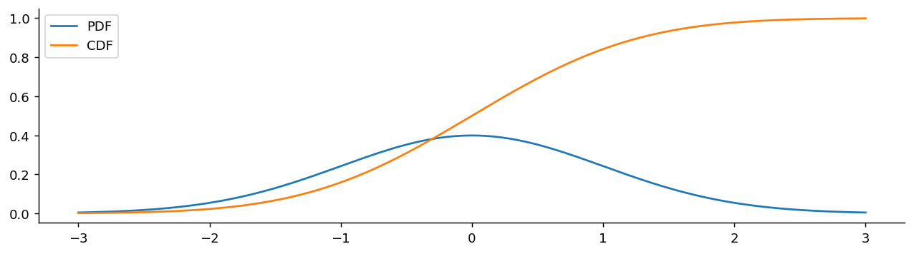
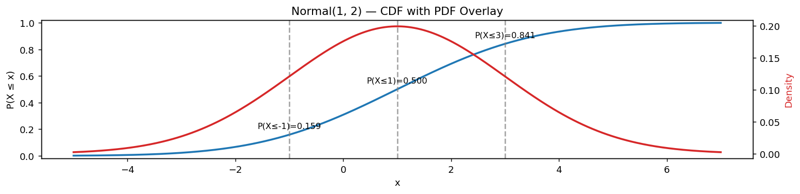
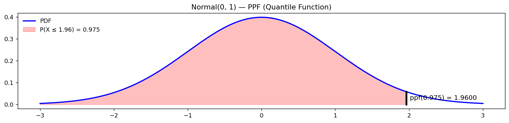
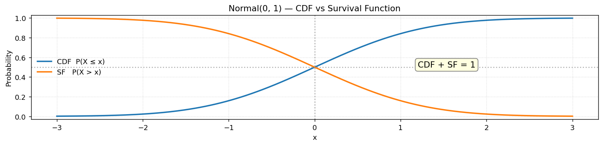
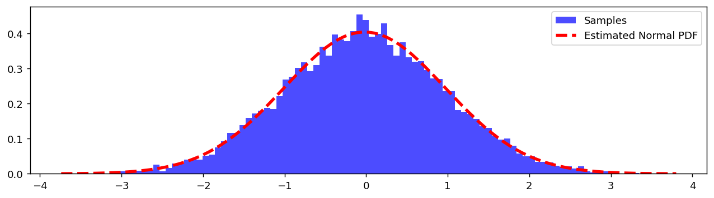
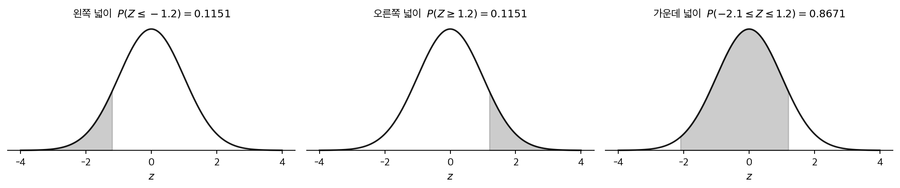
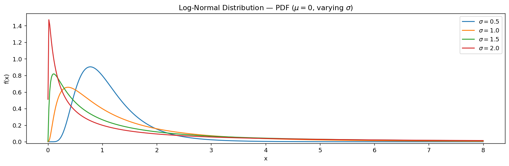

# 정규분포

## 개요

**정규분포**는 통계학에서 가장 근본적인 확률분포 중 하나이다. 중심값 주위에 모여 양쪽으로 대칭적으로 잦아드는 특유의 "종 모양 곡선"을 이루는 연속 자료를 기술한다.

4.2절 사슬에서 정규분포는 두 번째 고리이자 **나머지 세 고리를 모두 만들어 내는 자리**에 있다.

$$
\text{Exp}(\lambda) \;\longrightarrow\; N(\mu, \sigma^2) \;\longrightarrow\; \chi^2_d \;\longrightarrow\; t_d \;\longrightarrow\; F_{d_1, d_2}
$$

앞 고리에서 오는 길은 **더하기**다. 지수분포처럼 치우친 분포라도 여러 개를 더하면 정규분포로 간다(중심극한정리). 뒤 고리로 가는 길은 **제곱해서 더하기**다. 아래 "다음 고리" 절에서 그 갈림을 정리한다.

---

## 정규분포와 표준정규분포

<div class="defn" markdown>

### 정의 1. 정규분포 { .dfn }

정규분포는 평균 $\mu$(중심)와 분산 $\sigma^2$(퍼짐)로 규정된다. PDF는 다음과 같다:

$$
f(x; \mu, \sigma^2) = \frac{1}{\sqrt{2\pi\sigma^2}} \exp\left(-\frac{(x - \mu)^2}{2\sigma^2}\right)
$$

이를 $X \sim N(\mu, \sigma^2)$로 쓴다.

</div>

### 표준정규분포

$\mu = 0$, $\sigma = 1$인 특수한 경우를 **표준정규분포**라 한다:

$$
Z \sim N(0, 1), \qquad f(z) = \frac{1}{\sqrt{2\pi}} \exp\left(-\frac{z^2}{2}\right)
$$

---

## 표준화

모든 정규확률변수는 **Z-점수 변환**을 통해 표준정규확률변수로 바꿀 수 있다:

$$
\begin{aligned}
\textbf{Standardization:} \quad & X \sim N(\mu, \sigma^2) \implies Z = \frac{X - \mu}{\sigma} \sim N(0, 1) \\[6pt]
\textbf{Reverse:} \quad & Z \sim N(0, 1) \implies X = Z\sigma + \mu \sim N(\mu, \sigma^2)
\end{aligned}
$$

---

## 정규분포의 성질

### 닫힘 성질

$$
\begin{aligned}
(1) &\quad X \sim \text{Normal} \implies aX + b \sim \text{Normal} \\[4pt]
(2) &\quad X \sim \text{Normal}, \; Y \sim \text{Normal}, \; X \perp Y \implies X + Y \sim \text{Normal} \\[4pt]
(3) &\quad (X, Y) \sim \text{Multivariate Normal} \implies X + Y \sim \text{Normal}
\end{aligned}
$$

**주의:** $X \sim \text{Normal}$이고 $Y \sim \text{Normal}$이라고 해서 $X + Y \sim \text{Normal}$인 것은 **아니다**. 독립성이나 결합정규성이 있어야 한다.

### 성질 (1)의 증명

$a > 0$이고 $X \sim N(\mu, \sigma^2)$일 때:

$$
P(aX + b \leq x) = P\left(X \leq \frac{x - b}{a}\right) = \int_{-\infty}^{(x-b)/a} \frac{1}{\sqrt{2\pi\sigma^2}} e^{-\frac{(s-\mu)^2}{2\sigma^2}} ds
$$

$x$에 대해 미분하면:

$$
f_{aX+b}(x) = \frac{1}{\sqrt{2\pi(a\sigma)^2}} \exp\left(-\frac{(x - (a\mu + b))^2}{2a^2\sigma^2}\right)
$$

따라서 $aX + b \sim N(a\mu + b, \, a^2\sigma^2)$이다.

### 주요 기하적 성질

- **대칭성:** $\mu$를 중심으로 완전히 대칭이며, 평균 = 중앙값 = 최빈값 = $\mu$이다.
- **종 모양:** 대부분의 자료가 평균 근처에 몰려 있다.
- **무한한 꼬리:** 꼬리는 $\pm\infty$까지 뻗지만 확률은 빠르게 감소한다.

### 68–95–99.7 규칙

$$
\begin{aligned}
P(\mu - \sigma < X < \mu + \sigma) &\approx 68\% \\
P(\mu - 2\sigma < X < \mu + 2\sigma) &\approx 95\% \\
P(\mu - 3\sigma < X < \mu + 3\sigma) &\approx 99.7\%
\end{aligned}
$$

---

## 표준정규분포의 PDF: 주요 성질 확인

$N(0, 1)$의 PDF는 $f(x) = \frac{1}{\sqrt{2\pi}} e^{-x^2/2}$이다. 다음을 확인한다:

### (1) 전체 질량이 1이다

$I = \int_{-\infty}^{\infty} e^{-x^2/2}\,dx$라 하자. 그러면:

$$
I^2 = \int\!\!\int e^{-(x^2+y^2)/2}\,dx\,dy = \int_0^{2\pi}\!\int_0^{\infty} e^{-r^2/2}\,r\,dr\,d\theta = 2\pi
$$

따라서 $I = \sqrt{2\pi}$이고 $\int f(x)\,dx = 1$임이 확인된다.

### (2) 평균이 0이다

피적분함수 $x \cdot e^{-x^2/2}$는 **기함수**이므로 $(-\infty, \infty)$ 위의 적분은 0이다.

### (3) 분산이 1이다

부분적분에 의해:

$$
\frac{1}{\sqrt{2\pi}} \int_{-\infty}^{\infty} x^2 e^{-x^2/2}\,dx = \frac{1}{\sqrt{2\pi}} \int_{-\infty}^{\infty} e^{-x^2/2}\,dx = 1
$$

---

## 표준정규분포의 CDF

CDF는 닫힌 형태가 없어 수치적으로 계산한다:

$$
\mathcal{N}(x) = N(x) = \int_{-\infty}^x \frac{1}{\sqrt{2\pi}} e^{-s^2/2}\,ds
$$

### Phi의 성질

$$
\begin{aligned}
(1) &\quad P(a \leq Z \leq b) = \mathcal{N}(b) - \mathcal{N}(a) \\
(2) &\quad P(Z \geq x) = P(Z \leq -x) = \mathcal{N}(-x) \\
(3) &\quad P(Z \geq x) = 1 - \mathcal{N}(x) \\
(4) &\quad P(Z \leq 0) = P(Z \geq 0) = 0.5
\end{aligned}
$$

---

## 정규 PDF와 관련된 적분 요령

<div class="probox" markdown>

**문제:** <span class="diff med" title="중간"></span> $\int_{-\infty}^{\infty} e^{-x^2 - 2x}\,dx$를 계산하라.

</div>

??? success "풀이"
    완전제곱식으로 만든다: $-x^2 - 2x = -(x+1)^2 + 1$. 그러면:

    $$
    \int_{-\infty}^{\infty} e^{-x^2-2x}\,dx = e \int_{-\infty}^{\infty} e^{-(x+1)^2}\,dx = e\sqrt{2\pi \cdot \tfrac{1}{2}} \cdot \underbrace{\int \frac{1}{\sqrt{\pi}} e^{-(x+1)^2}\,dx}_{=1 \text{ (PDF of } N(-1, 1/2))} = e\sqrt{\pi}
    $$
---

## 왜 정규분포인가?

중심극한정리는 정규분포가 어디에나 나타나는 이유를 설명한다. 원래 모집단의 분포가 무엇이든, $n$이 크면 표본평균의 분포는 근사적으로 정규분포이다:

$$
\bar{X} \sim N\left(\mu, \frac{\sigma^2}{n}\right) \quad \text{as } n \to \infty
$$

이 때문에 정규분포는 신뢰구간, 가설검정, 품질관리의 기초가 된다.

---

## 다음 고리: 정규분포에서 갈라지는 세 분포

정규분포를 **더하면** 다시 정규분포다(닫힘 성질). 새로운 분포는 더하기가 아니라 **제곱하기와 나누기**에서 나온다.

| 연산 | 결과 | 쓰이는 곳 |
|---|---|---|
| $Z_1^2 + \cdots + Z_d^2$ | $\chi^2_d$ | 분산, 적합도 |
| $\dfrac{Z}{\sqrt{\chi^2_d/d}}$ | $t_d$ | 분산을 모를 때의 평균 |
| $\dfrac{\chi^2_{d_1}/d_1}{\chi^2_{d_2}/d_2}$ | $F_{d_1, d_2}$ | 두 분산의 비교 |

세 분포의 공통점은 **관심 있는 양을 그 자신의 척도 추정값으로 나눈다**는 데 있다. 참 표준편차 $\sigma$를 알면 정규분포만으로 충분하지만, 현실에서는 $\sigma$도 자료에서 추정해야 한다. 그 추정값이 카이제곱분포를 따르고, 그것으로 나눈 결과가 $t$와 $F$다.

이어지는 세 페이지가 이 표의 세 줄을 차례로 다룬다. 출발점은 모두 여기, 정규분포다.

---

## Python: scipy.stats로 정규분포 다루기

`stats.norm(loc=mu, scale=sigma)`는 **고정된(frozen) 분포 객체**를 만든다. 한 번 만들어 두면 `pdf`, `cdf`, `ppf`, `sf`, `rvs`를 모두 같은 객체에서 꺼내 쓸 수 있다.

| 메서드 | 하는 일 |
|:---|:---|
| `pdf(x)` | 밀도 $f(x)$ |
| `cdf(x)` | 왼쪽 꼬리 $P(X \le x)$ |
| `sf(x)` | 오른쪽 꼬리 $P(X > x)$ |
| `ppf(q)` | 분위수, `cdf`의 역함수 |
| `rvs(size)` | 확률표본 생성 |

!!! warning "`scale`은 분산이 아니라 표준편차다"
    $N(1, 4)$를 만들려면 `stats.norm(loc=1, scale=2)`라고 써야 한다. `scale=4`라고 쓰면 분산이 16인 분포가 된다. 이 책에서 가장 자주 나오는 실수이며, 그림이 이상해 보이면 먼저 이것부터 확인하라(연습문제 14).

### 밀도함수와 분포함수

<div class="exbox" markdown>

**보기 1.** <span class="diff easy" title="쉬움"></span> 정규분포의 밀도함수와 분포함수. $N(0,1)$의 밀도 $\varphi$와 분포함수 $\Phi$를 $[-3, 3]$에서 같은 축에 겹쳐 그린다.

**(1)** $\varphi$를 두 번 미분해 봉우리와 변곡점의 자리를 구하고, 봉우리의 높이를 적으시오.

**(2)** 그림에서 두 곡선이 만나는 자리를 수치로 구하고, 만나는 횟수가 한 번뿐인 까닭을 말하시오. 한 축에 겹쳐 그렸을 때 밀도가 납작해 보이는 것은 왜인가.

</div>

??? success "풀이"

    **(1) 해석적으로.** $\varphi(x) = (2\pi)^{-1/2}e^{-x^2/2}$를 미분하면 지수의 미분이 $-x$를 내놓으므로

    $$
    \varphi'(x) = -x\,\varphi(x)
    $$

    이다. **밀도함수가 자기 자신의 도함수에 다시 나타난다**는 이 식이 정규분포 계산의 거의 모든 요령의 출발점이다(위 "적분 요령" 절과 연습문제 27의 밀 비 부등식이 모두 이것을 쓴다). $\varphi > 0$이므로 $\varphi'(x) = 0$은 $x = 0$ 하나뿐이고, 부호는 $x < 0$에서 양수, $x > 0$에서 음수다. 따라서 $x = 0$이 유일한 최대점이다. 그 높이는

    $$
    \varphi(0) = \frac{1}{\sqrt{2\pi}} = 0.3989423
    $$

    이다. **밀도의 봉우리가 $0.4$를 넘지 않는다**는 이 수가 (2)에서 그림의 모양을 설명한다.

    한 번 더 미분한다. 곱의 미분으로

    $$
    \varphi''(x) = -\varphi(x) - x\,\varphi'(x) = -\varphi(x) + x^2\varphi(x) = (x^2 - 1)\,\varphi(x)
    $$

    이다. 부호가 $x^2 - 1$로 정해지므로 $\varphi''$는 $|x| < 1$에서 음수(위로 오목), $|x| > 1$에서 양수(아래로 오목)이고 **변곡점은 $x = \pm 1$**이다. 일반적인 $N(\mu, \sigma^2)$에서는 $\mu \pm \sigma$이며, 이것이 연습문제 13의 답이다.

    변곡점이 $\pm\sigma$에 있다는 사실은 눈으로 $\sigma$를 재는 방법을 준다. **종 모양 곡선에서 휘는 방향이 바뀌는 자리까지의 거리가 표준편차다.** 그 자리의 높이는 $\varphi(1) = e^{-1/2}/\sqrt{2\pi} = 0.2419707$로 봉우리의 $e^{-1/2} = 0.6065$배다.

    **(2) 수치적으로.** 먼저 쪽의 그림을 그대로 본다.

    ```python
    import matplotlib.pyplot as plt
    import numpy as np
    from scipy import stats

    mu, sigma = 0, 1                  # 표준정규분포
    # 평균에서 좌우 3 표준편차. 확률의 99.7%가 이 안에 있다.
    x = np.linspace(mu - 3*sigma, mu + 3*sigma, 200)

    fig, ax = plt.subplots(figsize=(12, 3))
    # 두 함수를 같은 축에 겹쳐 관계를 본다.
    #   PDF는 평균에서 가장 높고 좌우로 떨어진다.
    #   CDF는 0에서 1로 단조 증가하며, PDF가 가장 높은 곳에서 가장 가파르다.
    # CDF의 기울기가 곧 PDF이기 때문이다.
    ax.plot(x, stats.norm(mu, sigma).pdf(x), label='PDF')
    ax.plot(x, stats.norm(mu, sigma).cdf(x), label='CDF')
    ax.spines[['top', 'right']].set_visible(False)
    ax.legend()
    plt.show()
    ```

    

    이제 (1)이 유도한 세 가지와 교차점을 하나씩 확인한다.

    ```python
    import numpy as np
    from scipy import integrate, optimize, stats

    phi, Phi = stats.norm.pdf, stats.norm.cdf

    # 봉우리 높이가 1/sqrt(2pi) 인가.
    print(f"phi(0)        = {phi(0):.9f}")
    print(f"1/sqrt(2*pi)  = {1 / np.sqrt(2 * np.pi):.9f}")

    # phi'' = (x^2 - 1) phi 를 중심차분으로 맞춰 본다. 부호가 |x|=1 에서 바뀐다.
    h = 1e-5
    print(f"{'x':>6}{'phi_xx':>14}{'(x^2-1)phi':>14}")
    for x in (-2.0, -1.0, -0.5, 0.0, 0.5, 1.0, 2.0):
        num = (phi(x + h) - 2 * phi(x) + phi(x - h)) / h**2
        print(f"{x:>6.1f}{num:>14.7f}{(x*x - 1) * phi(x):>14.7f}")

    # 변곡점의 높이는 봉우리의 exp(-1/2) 배다.
    print(f"phi(1)/phi(0) = {phi(1) / phi(0):.6f},  exp(-1/2) = {np.exp(-0.5):.6f}")

    # 두 곡선이 만나는 곳: Phi(x) = phi(x).
    x_star = optimize.brentq(lambda x: Phi(x) - phi(x), -3, 0)
    print(f"교차점 x* = {x_star:.6f},  공통값 = {phi(x_star):.6f}")

    # 교차가 한 번뿐인지 격자에서 부호변화를 세어 확인한다.
    g = np.linspace(-3, 3, 600_001)
    d = Phi(g) - phi(g)
    print(f"[-3,3] 에서 부호변화 횟수 = {int(np.sum(np.sign(d[:-1]) != np.sign(d[1:])))}")

    # 그림이 쓰는 세로 범위. CDF 는 0~1 을 다 쓰고 PDF 는 0.4 아래에 갇힌다.
    print(f"PDF 의 최댓값 = {phi(0):.4f},  CDF 의 범위 = {Phi(-3):.4f} ~ {Phi(3):.4f}")
    print(f"phi(3)/phi(0) = {phi(3) / phi(0):.4f}   <- 그림 양끝에서 밀도는 봉우리의 1% 남짓")
    print(f"quad 로 잰 전체 질량 = {integrate.quad(phi, -np.inf, np.inf)[0]:.12f}")
    ```

    출력:

    ```
    phi(0)        = 0.398942280
    1/sqrt(2*pi)  = 0.398942280
         x        phi_xx    (x^2-1)phi
      -2.0     0.1619729     0.1619729
      -1.0    -0.0000003     0.0000000
      -0.5    -0.2640488    -0.2640490
       0.0    -0.3989420    -0.3989423
       0.5    -0.2640488    -0.2640490
       1.0    -0.0000003     0.0000000
       2.0     0.1619729     0.1619729
    phi(1)/phi(0) = 0.606531,  exp(-1/2) = 0.606531
    교차점 x* = -0.302631,  공통값 = 0.381086
    [-3,3] 에서 부호변화 횟수 = 1
    PDF 의 최댓값 = 0.3989,  CDF 의 범위 = 0.0013 ~ 0.9987
    phi(3)/phi(0) = 0.0111   <- 그림 양끝에서 밀도는 봉우리의 1% 남짓
    quad 로 잰 전체 질량 = 1.000000000000
    ```

    **(1)의 유도가 모두 맞는다.** 봉우리 높이는 아홉째 자리까지 $1/\sqrt{2\pi}$와 같고, 중심차분으로 잰 $\varphi''$는 $(x^2-1)\varphi(x)$와 일곱째 자리까지 일치하며 $x = \pm 1$에서만 $0$을 지난다. 변곡점의 높이 비도 $e^{-1/2}$와 여섯째 자리까지 같다. ($x = \pm 1$에서 수치값이 $-3\times10^{-7}$인 것은 중심차분의 절단오차이지 어긋남이 아니다. 참값 $0$에 그만큼 가깝다는 뜻이다.)

    **교차는 $x^* = -0.302631$ 한 번뿐이다.** 까닭은 두 함수의 단조성이 서로 다른 데 있다. $\Phi$는 $0$에서 $1$로 **단조증가**하고 $\varphi$는 $x > 0$에서 **감소**하므로, $x \ge 0$에서는 $\Phi(x) \ge 1/2 > 0.3989 \ge \varphi(x)$로 만날 수 없다. $x < 0$에서는 $\Phi$가 올라오고 $\varphi$도 올라가지만 $\Phi(-3) = 0.0013$이 $\varphi(-3) = 0.0044$보다 작고 $\Phi(0) = 0.5$가 $\varphi(0) = 0.3989$보다 크므로 그 사이에 영점이 적어도 하나 있고, 격자가 센 부호변화가 한 번이니 정확히 하나다.

    **밀도가 납작해 보이는 것은 세로축을 CDF와 나눠 쓰기 때문이다.** CDF는 $0$부터 $1$까지를 꽉 채우는데 PDF는 (1)에서 본 대로 $0.3989$를 넘을 수 없다. 그림의 세로 높이 가운데 밀도가 쓰는 몫이 $40\%$뿐이니 종 모양이 눌려 보이는 것이 당연하다. 게다가 양끝 $x = \pm 3$에서 밀도는 봉우리의 $1.11\%$라 바닥에 붙어 버린다.

    **이 그림이 가리는 것은 "CDF의 기울기가 PDF"라는 관계 자체다.** 두 곡선이 한 축에 있으니 기울기를 눈으로 재어 다른 곡선의 높이와 맞춰 볼 길이 없다. 보기 2가 축을 둘로 나누어 그 관계를 되살린다. 반대로 **이 그림만이 보여 주는 것**도 있다. 두 곡선이 실제로 교차하는 모습인데, 축을 나누면 교차점은 축의 눈금을 어떻게 잡느냐에 따라 아무 데로나 옮겨 가는 허상이 된다.

### 분포함수를 두 축에서 읽기

<div class="exbox" markdown>

**보기 2.** <span class="diff easy" title="쉬움"></span> 분포함수와 밀도함수를 두 축에 함께 보기. $X \sim N(1, 4)$의 분포함수를 왼쪽 축(확률)에, 밀도함수를 오른쪽 축(밀도)에 그리고 $\mu - \sigma$, $\mu$, $\mu + \sigma$ 세 자리를 표시한다.

**(1)** $F$가 가장 가파른 자리와 그때의 기울기를 구하고, $F$의 변곡점이 어디인지 밝히시오.

**(2)** $F(\mu - \sigma)$와 $F(\mu + \sigma)$가 $\mu$와 $\sigma$에 **전혀 의존하지 않는다**는 것을 보이고, 그 값을 수치로 확인하시오. 축을 둘로 나눌 때 조심할 점은 무엇인가.

</div>

??? success "풀이"

    **(1) 해석적으로.** 미적분학의 기본정리에 따라

    $$
    F(x) = \int_{-\infty}^{x} f(s)\,ds \quad\Longrightarrow\quad F'(x) = f(x)
    $$

    이다. **분포함수의 기울기가 곧 밀도함수다.** 그러므로 $F$가 가장 가파른 자리를 묻는 것은 $f$의 봉우리를 묻는 것과 같은 물음이고, 보기 1에서 그 답이 $x = \mu$임을 이미 보았다. 그때의 기울기는 밀도의 봉우리값

    $$
    F'(\mu) = f(\mu) = \frac{1}{\sigma\sqrt{2\pi}}
    $$

    이며 $\sigma = 2$이면 $1/(2\sqrt{2\pi}) = 0.199471$이다. $\sigma$가 분모에 있으므로 **퍼짐이 작을수록 분포함수가 가파르게 선다.** 극단으로 $\sigma \to 0$이면 $F$가 $\mu$에서 수직으로 뛰어오르는 계단이 된다.

    한 번 더 미분하면 보기 1의 식을 그대로 쓸 수 있다.

    $$
    F''(x) = f'(x) = -\frac{x-\mu}{\sigma^2}\,f(x)
    $$

    이것이 $0$이 되는 곳은 $x = \mu$ 하나뿐이고 부호가 거기서 양에서 음으로 바뀐다. 따라서 **$F$의 변곡점은 평균 하나**다. $\mu$ 왼쪽에서는 아래로 오목하게 휘어 올라가고 오른쪽에서는 위로 오목하게 눕는, S자 곡선의 전형이다. 밀도의 변곡점이 $\mu \pm \sigma$ 둘인 것과 헷갈리지 말아야 한다.

    **(2) 해석적으로.** 표준화가 답을 준다. $Z = (X-\mu)/\sigma \sim N(0,1)$이므로

    $$
    F(\mu + k\sigma) = P(X \le \mu + k\sigma) = P\!\left(\frac{X-\mu}{\sigma} \le k\right) = \Phi(k)
    $$

    이다. 오른쪽에 $\mu$도 $\sigma$도 남아 있지 않다. **$\mu \pm \sigma$처럼 "평균에서 표준편차 몇 개"로 자리를 재면 분포함수 값이 모수와 무관해진다.** 68–95–99.7 규칙이 어떤 정규분포에나 똑같이 통하는 까닭이 이것이고, 표준정규분포표 한 장으로 모든 정규분포를 다루는 까닭도 이것이다.

    $k = \pm 1$을 넣으면

    $$
    F(\mu - \sigma) = \Phi(-1) = 0.158655, \qquad F(\mu + \sigma) = \Phi(1) = 0.841345
    $$

    이고, 대칭성 $\Phi(-1) = 1 - \Phi(1)$ 때문에 두 수의 합이 정확히 $1$이다. 차는

    $$
    \Phi(1) - \Phi(-1) = 2\Phi(1) - 1 = 0.682689
    $$

    로 **68% 규칙의 참값**이다. 또 $F(\mu) = \Phi(0) = 1/2$이니 정규분포에서는 평균이 곧 중앙값이다.

    **(2) 수치적으로.** 먼저 쪽의 그림을 그대로 본다.

    ```python
    import matplotlib.pyplot as plt
    import numpy as np
    import scipy.stats as stats

    mu, sigma = 1, 2
    x = np.linspace(mu - 3 * sigma, mu + 3 * sigma, 400)

    dist = stats.norm(loc=mu, scale=sigma)
    y_cdf = dist.cdf(x)
    y_pdf = dist.pdf(x)

    fig, ax_cdf = plt.subplots(figsize=(12, 3))

    # CDF는 왼쪽 축(0~1). PDF는 오른쪽 축(밀도).
    # 두 함수의 눈금 규모가 달라 한 축에 그리면 한쪽이 납작해지므로 축을 나눈다.
    # 이 절에서는 두 축의 관계가 고정되어 있어(CDF는 PDF의 적분) 안전한 사용이다.
    ax_cdf.plot(x, y_cdf, lw=2, label="CDF P(X ≤ x)")
    ax_cdf.set_xlabel("x")
    ax_cdf.set_ylabel("P(X ≤ x)")
    ax_cdf.set_ylim(-0.02, 1.02)

    # 기준점 세 개를 표시한다: 평균에서 -1, 0, +1 표준편차.
    # CDF 값이 각각 약 0.159, 0.500, 0.841 이 나온다.
    # 0.841 - 0.159 = 0.682 가 곧 "68% 규칙"이다.
    for xv in [mu - sigma, mu, mu + sigma]:
        yv = dist.cdf(xv)
        ax_cdf.axvline(xv, linestyle='--', color='gray', alpha=0.7)
        ax_cdf.text(xv, yv + 0.05, f"P(X≤{xv:.0f})={yv:.3f}",
                    ha='center', fontsize=9)

    # 오른쪽 축에 밀도함수
    ax_pdf = ax_cdf.twinx()
    ax_pdf.plot(x, y_pdf, lw=2, color='tab:red', label="PDF (density)")
    ax_pdf.set_ylabel("Density", color='tab:red')

    ax_cdf.set_title(f"Normal({mu}, {sigma}) — CDF with PDF Overlay")
    plt.tight_layout()
    plt.show()
    ```

    

    이제 (1)과 (2)가 유도한 것을 확인한다.

    ```python
    import numpy as np
    from scipy import optimize, stats

    mu, sigma = 1, 2
    dist = stats.norm(loc=mu, scale=sigma)

    # (1) F 가 가장 가파른 자리를 격자로 찾아 평균과 맞춰 본다.
    g = np.linspace(mu - 3*sigma, mu + 3*sigma, 600_001)
    slope = np.gradient(dist.cdf(g), g)
    print(f"기울기가 최대인 자리 = {g[slope.argmax()]:.5f}   (mu = {mu})")
    print(f"그때의 기울기        = {slope.max():.6f}")
    print(f"f(mu) = 1/(sigma*sqrt(2*pi)) = {1 / (sigma * np.sqrt(2 * np.pi)):.6f}")

    # F'' = 0 인 자리, 곧 밀도의 봉우리. 중심차분으로 F'' 를 재어 영점을 찾는다.
    h = 1e-4
    F2 = lambda x: (dist.cdf(x + h) - 2 * dist.cdf(x) + dist.cdf(x - h)) / h**2
    print(f"F'' 의 영점 = {optimize.brentq(F2, mu - sigma, mu + sigma):.6f}   (변곡점은 평균 하나)")

    # (2) 그림이 표시한 세 자리의 CDF 값.
    print()
    for xv in (mu - sigma, mu, mu + sigma):
        print(f"F({xv:+.0f}) = {dist.cdf(xv):.6f}   Phi({(xv - mu)/sigma:+.0f}) = "
              f"{stats.norm.cdf((xv - mu)/sigma):.6f}")
    print(f"F(mu+sigma) - F(mu-sigma) = {dist.cdf(mu+sigma) - dist.cdf(mu-sigma):.6f}"
          f"   <- 68% 규칙의 참값")

    # 모수와 무관하다는 것을 네 쌍에서 확인한다.
    print()
    print(f"{'mu':>6}{'sigma':>8}{'F(mu-sigma)':>14}{'F(mu+sigma)':>14}")
    for m, s in ((0, 1), (1, 2), (-5, 0.3), (100, 15)):
        d = stats.norm(loc=m, scale=s)
        print(f"{m:>6}{s:>8}{d.cdf(m - s):>14.9f}{d.cdf(m + s):>14.9f}")
    ```

    출력:

    ```
    기울기가 최대인 자리 = 1.00000   (mu = 1)
    그때의 기울기        = 0.199471
    f(mu) = 1/(sigma*sqrt(2*pi)) = 0.199471
    F'' 의 영점 = 1.000000   (변곡점은 평균 하나)

    F(-1) = 0.158655   Phi(-1) = 0.158655
    F(+1) = 0.500000   Phi(+0) = 0.500000
    F(+3) = 0.841345   Phi(+1) = 0.841345
    F(mu+sigma) - F(mu-sigma) = 0.682689   <- 68% 규칙의 참값

        mu   sigma   F(mu-sigma)   F(mu+sigma)
         0       1   0.158655254   0.841344746
         1       2   0.158655254   0.841344746
        -5     0.3   0.158655254   0.841344746
       100      15   0.158655254   0.841344746
    ```

    **유도가 모두 맞는다.** 격자가 찾은 최대기울기 자리는 $1.00000$으로 평균과 같고, 그 기울기 $0.199471$은 $1/(\sigma\sqrt{2\pi})$와 여섯째 자리까지 일치한다. $F''$의 영점도 $1.000000$ 하나다. 그림이 표시한 세 값 $0.159$, $0.500$, $0.841$은 각각 $\Phi(-1)$, $\Phi(0)$, $\Phi(1)$이고, 모수를 네 쌍으로 바꾸어도 $F(\mu \pm \sigma)$가 아홉째 자리까지 꼼짝하지 않는다. **(2)의 "모수와 무관하다"는 말이 근사가 아니라 등식이라는 뜻이다.**

    **축을 둘로 나눌 때 조심할 점.** 오른쪽 축의 눈금은 `twinx`가 밀도의 최댓값에 맞추어 **제멋대로** 잡은 것이다. 그래서 이 그림에서 두 곡선이 교차하는 자리는 아무런 뜻이 없다. `set_ylim`을 한 번 건드리면 교차점이 통째로 옮겨 간다. 보기 1의 그림에서는 두 곡선이 같은 눈금 위에 있어 교차점 $x^* = -0.302631$이 실제로 $\Phi(x) = \varphi(x)$를 푼 자리였는데, 여기서는 그 성질이 사라졌다.

    **그 대가로 얻은 것**이 "$F$의 기울기가 $f$"라는 관계다. 보기 1에서는 밀도가 세로 높이의 $40\%$에 눌려 봉우리 모양이 제대로 보이지 않았으나, 여기서는 밀도가 오른쪽 축을 꽉 채우므로 밀도의 봉우리가 $F$의 변곡점과 같은 세로선 위에 놓인 것을 눈으로 확인할 수 있다. **두 축을 쓰는 것이 정당한 경우는 이처럼 두 곡선의 관계가 세로 눈금과 무관할 때뿐이다.** 서로 다른 두 시계열을 같은 그림에 겹쳐 "함께 움직인다"고 주장하는 흔한 오용은 바로 이 조건을 어긴다.

#### 표준정규분포의 주요 CDF 값

| $x$ | $\mathcal{N}(x) = P(Z \le x)$ |
|---|---|
| $-1.96$ | $0.025$ |
| $-1$ | $0.159$ |
| $0$ | $0.500$ |
| $1$ | $0.841$ |
| $1.96$ | $0.975$ |

대칭성 $\mathcal{N}(-x) = 1 - \mathcal{N}(x)$ 덕분에 표의 절반만 있으면 된다.

---

### 분위수 (ppf)

<div class="exbox" markdown>

**보기 3.** <span class="diff easy" title="쉬움"></span> 백분위점 함수로 분위수 구하기. $N(0,1)$에서 $\Phi^{-1}(0.975)$를 구하고, 그 왼쪽 $97.5\%$를 칠한 그림을 그린다.

**(1)** $\Phi^{-1}$의 도함수를 구하고, 그것으로 "꼬리의 분위수는 추정하기 어렵다"는 말을 설명하시오. 대칭성 $\Phi^{-1}(1-p) = -\Phi^{-1}(p)$도 보이시오.

**(2)** $z_{0.975}$를 소수 아래 아홉째 자리까지 구하시오. 신뢰구간 공식에 흔히 쓰는 어림수 $1.96$은 실제로 몇 퍼센트 신뢰구간을 주는가.

</div>

??? success "풀이"

    **(1) 해석적으로.** $\Phi$가 연속이고 **엄격히** 증가하므로($\Phi' = \varphi > 0$) 역함수 $\Phi^{-1}: (0,1) \to \mathbb{R}$가 존재한다. 항등식 $\Phi(\Phi^{-1}(p)) = p$의 양변을 $p$로 미분하고 연쇄법칙을 쓰면

    $$
    \varphi\!\left(\Phi^{-1}(p)\right) \cdot \left(\Phi^{-1}\right)'(p) = 1
    \quad\Longrightarrow\quad
    \left(\Phi^{-1}\right)'(p) = \frac{1}{\varphi\!\left(\Phi^{-1}(p)\right)}
    $$

    을 얻는다. 오른쪽 분모는 $p$가 $0$이나 $1$에 다가갈 때 $\Phi^{-1}(p) \to \mp\infty$이므로 $0$으로 간다. 따라서

    $$
    \left(\Phi^{-1}\right)'(p) \longrightarrow \infty \qquad (p \to 0^+ \text{ 또는 } p \to 1^-)
    $$

    이다. **분위수함수는 양끝에서 수직으로 솟는다.** 이것이 꼬리의 분위수를 다루기 어려운 이유를 그대로 말해 준다. $p$를 아주 조금만 잘못 알아도 분위수는 크게 틀어지고, 그 증폭률이 바로 $1/\varphi(z)$다. 가운데서는 $(\Phi^{-1})'(1/2) = \sqrt{2\pi} = 2.5066$으로 점잖지만, $p = 0.99999$에서는 $2.2 \times 10^4$까지 커진다. 자료에서 $99.999$ 백분위수를 읽어 내려는 시도가 무망한 까닭이다.

    $\Phi$ 자체가 초등함수로 적히지 않으므로 $\Phi^{-1}$에도 닫힌 꼴이 없다. SciPy의 `ppf`는 전용 수치 루틴을 부른다. **그러나 닫힌 꼴이 없다는 것이 성질이 없다는 뜻은 아니다.** 대칭성이 그 예다. $z = \Phi^{-1}(p)$로 두면 $\Phi(z) = p$이고, $\varphi$가 우함수라 $\Phi(-z) = 1 - \Phi(z) = 1 - p$이므로 양변에 $\Phi^{-1}$을 씌워

    $$
    \Phi^{-1}(1-p) = -z = -\Phi^{-1}(p)
    $$

    를 얻는다. $\square$ 그래서 분위수표도 절반만 있으면 되고, 양측 신뢰구간이 $\pm z_{1-\alpha/2}$라는 **대칭꼴**로 적히는 것이다.

    **(2) 해석적으로.** $z_{0.975}$는 닫힌 꼴로 적을 수 없으니 수치로만 답할 수 있다. 다만 어림수 $1.96$이 주는 신뢰수준은 정의대로 계산된다. $1.96$을 쓰면 양쪽 꼬리에 남는 확률이

    $$
    2\left(1 - \Phi(1.96)\right)
    $$

    이고, 이 값이 $0.05$보다 작으면 실제 신뢰수준은 $95\%$보다 **높다**. 아래에서 수로 확인한다.

    **(2) 수치적으로.** 먼저 쪽의 그림을 그대로 본다.

    ```python
    import matplotlib.pyplot as plt
    import numpy as np
    import scipy.stats as stats

    mu, sigma = 0, 1
    prob = 0.975      # 95% 신뢰구간의 한쪽 끝. 양쪽 꼬리에 2.5%씩 남긴다.

    dist = stats.norm(loc=mu, scale=sigma)
    x = np.linspace(mu - 3 * sigma, mu + 3 * sigma, 1000)
    pdf = dist.pdf(x)

    # ppf는 CDF의 역함수다. "누적확률이 이만큼 되는 지점은 어디인가"에 답한다.
    #   cdf: 값 -> 확률
    #   ppf: 확률 -> 값
    # ppf(0.975)가 그 유명한 1.96 이며, 신뢰구간 공식의 z값이 여기서 나온다.
    z = dist.ppf(prob)

    fig, ax = plt.subplots(figsize=(12, 3))
    ax.plot(x, pdf, color='b', lw=2, label='PDF')
    ax.plot([z, z], [0, dist.pdf(z)], color='k', lw=3)   # 경계선
    # 왼쪽 97.5%를 칠한다. 칠해진 넓이가 곧 확률이라는 점이 요점이다.
    ax.fill_between(x[x <= z], pdf[x <= z], 0,
                    interpolate=True, color='r', alpha=0.25,
                    label=f"P(X ≤ {z:.2f}) = {prob}")
    ax.text(z + 0.05, dist.pdf(z) / 2,
            f"ppf({prob}) = {z:.4f}", fontsize=11, va='center')
    ax.set_title(f"Normal({mu}, {sigma}) — PPF (Quantile Function)")
    ax.legend(loc='upper left', frameon=False)
    plt.tight_layout()
    plt.show()
    ```

    

    이제 (1)의 세 가지와 (2)를 확인한다.

    ```python
    import numpy as np
    from scipy import integrate, stats

    ppf, cdf, pdf = stats.norm.ppf, stats.norm.cdf, stats.norm.pdf

    # (2) z_{0.975} 와 어림수 1.96 의 신뢰수준.
    z975 = ppf(0.975)
    print(f"z_0.975              = {z975:.9f}")
    print(f"Phi(1.96)            = {cdf(1.96):.9f}")
    print(f"1.96 의 양측 꼬리확률 = {2 * (1 - cdf(1.96)):.9f}")
    print(f"1.96 의 신뢰수준      = {100 * (2 * cdf(1.96) - 1):.6f}%")
    print(f"quad 로 잰 Phi(z975) = {integrate.quad(pdf, -np.inf, z975)[0]:.12f}")

    # (1) 분위수함수가 역함수임을 왕복으로 확인한다. 오차가 기계오차 수준이어야 한다.
    print()
    print("ppf(cdf(x)) - x :", [f"{ppf(cdf(x)) - x:.1e}" for x in (-3, -1, 0, 1, 2.5)])
    print("ppf(1-p) + ppf(p):", [f"{ppf(1 - p) + ppf(p):.1e}" for p in (0.9, 0.975, 0.999)])

    # (1) 도함수 1/phi(z) 가 꼬리에서 터지는 모습. 중심차분과 닫힌 꼴을 나란히 둔다.
    print()
    print(f"{'p':>9}{'z=ppf(p)':>12}{'1/phi(z)':>14}{'수치 도함수':>16}")
    h = 1e-7
    for p in (0.5, 0.75, 0.9, 0.975, 0.999, 0.99999):
        num = (ppf(p + h) - ppf(p - h)) / (2 * h)
        print(f"{p:>9}{ppf(p):>12.6f}{1 / pdf(ppf(p)):>14.4f}{num:>16.4f}")

    # 쪽의 분위수 표를 다시 계산한다.
    print()
    for q in (0.500, 0.900, 0.950, 0.975, 0.995):
        print(f"ppf({q:.3f}) = {ppf(q):.6f}")
    ```

    출력:

    ```
    z_0.975              = 1.959963985
    Phi(1.96)            = 0.975002105
    1.96 의 양측 꼬리확률 = 0.049995790
    1.96 의 신뢰수준      = 95.000421%
    quad 로 잰 Phi(z975) = 0.975000000000

    ppf(cdf(x)) - x : ['-4.4e-16', '1.1e-16', '0.0e+00', '-1.1e-16', '-1.3e-15']
    ppf(1-p) + ppf(p): ['0.0e+00', '0.0e+00', '0.0e+00']

            p    z=ppf(p)      1/phi(z)          수치 도함수
          0.5    0.000000        2.5066          2.5066
         0.75    0.674490        3.1469          3.1469
          0.9    1.281552        5.6981          5.6981
        0.975    1.959964       17.1101         17.1101
        0.999    3.090232      296.9924        296.9924
      0.99999    4.264891    22327.7432      22328.4367

    ppf(0.500) = 0.000000
    ppf(0.900) = 1.281552
    ppf(0.950) = 1.644854
    ppf(0.975) = 1.959964
    ppf(0.995) = 2.575829
    ```

    **(1)의 유도가 맞는다.** 왕복 오차 `ppf(cdf(x)) - x`가 $10^{-15}$ 이하이고, 대칭성은 **정확히 0**으로 성립한다(`ppf`가 대칭을 쓰도록 구현되어 있어 비트까지 같다). 도함수도 $p \le 0.999$에서는 중심차분과 $1/\varphi(z)$가 소수 넷째 자리까지 똑같다. $p = 0.99999$에서만 $22327.7432$ 대 $22328.4367$로 어긋나는데, 이는 차분 간격 $h = 10^{-7}$의 절단오차다. 중심차분의 오차가 $h^2(\Phi^{-1})'''(p)/6$ 꼴이고 삼계도함수가 이 자리에서 엄청나게 크기 때문이다. 상대오차는 $3.1 \times 10^{-5}$에 머물러 유도가 틀린 것이 아니다. 오히려 **같은 $h$로 가운데서는 넷째 자리까지 맞던 차분이 꼬리에서만 무너진다는 것**이 (1)의 결론을 한 번 더 보여 준다. **그 자리에서 도함수가 $2.2\times 10^4$라는 것 자체가 (1)이 말한 "양끝에서 수직으로 솟는다"는 결론이다.**

    **$1.96$은 $95\%$가 아니라 $95.000421\%$를 준다.** 참값은 $z_{0.975} = 1.959963985$이고 $1.96$은 그보다 $3.6 \times 10^{-5}$만큼 크므로 구간이 약간 넓어지고 신뢰수준도 약간 높아진다. 차이가 $4.2 \times 10^{-6}$에 지나지 않아 실무에서는 아무 문제가 없으며, 그래서 교과서가 $1.96$을 그냥 쓴다. 그림의 설명문이 `P(X ≤ 1.96) = 0.975`라고 적은 것도 이 뜻이다. 한편 **$2$를 쓰면 $95.45\%$가 된다**는 점은 구별해 두어야 한다. 보기 7에서 이 수를 다시 만난다.

    쪽의 분위수 표 다섯 줄도 모두 다시 계산해 맞았다. 표의 $1.960$은 $1.959964$를 소수 셋째 자리에서 반올림한 것이다.

#### 표준정규분포의 흔한 분위수

| $q$ | $\mathcal{N}^{-1}(q)$ | 용도 |
|---|---|---|
| 0.500 | 0 | 중앙값 |
| 0.900 | 1.282 | 단측 90% 신뢰구간 |
| 0.950 | 1.645 | 단측 95% 신뢰구간 |
| 0.975 | 1.960 | 양측 95% 신뢰구간 |
| 0.995 | 2.576 | 양측 99% 신뢰구간 |

---

### 생존함수 (sf)

<div class="exbox" markdown>

**보기 4.** <span class="diff easy" title="쉬움"></span> 생존함수로 오른쪽 꼬리 보기. $N(0,1)$의 분포함수 $\Phi$와 생존함수 $S(x) = P(X > x)$를 $[-3, 3]$에 함께 그린다.

**(1)** $S(x) = \Phi(-x)$임을 보이고, 그림의 두 곡선이 만나는 자리와 그때의 값을 구하시오. 교차가 한 번뿐인 까닭도 밝히시오.

**(2)** 정규 꼬리가 **초지수적으로** 줄어든다는 말을 비 $S(x+1)/S(x)$로 재어 지수분포와 견주시오. 그림이 꼬리에 대해 보여 주지 못하는 것은 무엇인가.

</div>

??? success "풀이"

    **(1) 해석적으로.** 정의대로 쓰고 적분변수를 $t = -s$로 바꾼다. $dt = -ds$이고 적분 구간의 양끝이 뒤집히므로

    $$
    S(x) = \int_x^{\infty} \varphi(t)\,dt
    = \int_{-\infty}^{-x} \varphi(-s)\,ds
    = \int_{-\infty}^{-x} \varphi(s)\,ds
    = \Phi(-x)
    $$

    이다. 가운데 등식에서 $\varphi$가 **우함수**($\varphi(-s) = \varphi(s)$)라는 것만 썼다. $\square$

    이 한 줄이 쪽의 "Phi의 성질" 표에 있는 $P(Z \ge x) = P(Z \le -x) = \mathcal{N}(-x)$를 증명한 것이고, 동시에 **그림의 두 곡선이 서로의 거울상**이라는 말이다. $S$의 그래프는 $\Phi$의 그래프를 세로축에 대해 접은 것이다.

    교차점은 $\Phi(x) = S(x)$를 푸는 것이다. $S = 1 - \Phi$이므로

    $$
    \Phi(x) = 1 - \Phi(x) \quad\Longleftrightarrow\quad \Phi(x) = \tfrac12
    $$

    이고, $\Phi$가 엄격히 증가하므로 해는 **하나뿐**이다. 그 해는 정의상 중앙값이고 정규분포에서는 $x = 0$이다. 공통값은 $1/2$다. 그림에 그어 둔 두 점선 $x = 0$과 $y = 0.5$가 바로 그 자리를 가리킨다.

    **대칭분포라면 어떤 분포에서나** 교차가 중앙값에서 한 번임을 같은 논증이 준다. 정규분포에 특수한 것은 그 중앙값이 평균과 같다는 점뿐이다.

    **(2) 해석적으로.** 연습문제 27의 밀 비 부등식이 $x \to \infty$에서

    $$
    S(x) \sim \frac{\varphi(x)}{x}
    $$

    를 준다. 이것을 비에 넣으면 지수부가 $-\frac{(x+1)^2}{2} + \frac{x^2}{2} = -\left(x + \frac12\right)$로 정리되어

    $$
    \frac{S(x+1)}{S(x)} \sim \frac{x}{x+1}\,\exp\!\left(-x - \tfrac12\right) \longrightarrow 0
    $$

    이다. **"한 칸 더 가면 확률이 몇 배로 줄어드는가"가 갈수록 커진다.** 지수분포와 견주면 차이가 선명하다. $X \sim \text{Exp}(\lambda)$이면 $S(x) = e^{-\lambda x}$이므로

    $$
    \frac{S(x+1)}{S(x)} = e^{-\lambda} \qquad (\text{$x$와 무관한 상수})
    $$

    이고, 이 "비가 자리에 무관하다"는 것이 곧 지수분포의 **무기억성**이다. 정규분포에서는 그 비가 $0$으로 가므로 무기억성이 깨지며, 이것이 "초지수적"이라는 말의 정확한 뜻이다. 지수보다 빨리 줄어든다.

    **(2) 수치적으로.** 먼저 쪽의 그림을 그대로 본다.

    ```python
    import matplotlib.pyplot as plt
    import numpy as np
    import scipy.stats as stats

    mu, sigma = 0, 1
    dist = stats.norm(loc=mu, scale=sigma)

    x = np.linspace(mu - 3 * sigma, mu + 3 * sigma, 400)
    # 생존함수 SF(x) = P(X > x) = 1 - CDF(x).
    # 수학적으로는 CDF의 여집합일 뿐이지만, 계산 방식이 다르다.
    # scipy는 sf를 1-cdf로 계산하지 않고 꼬리를 직접 적분하므로
    # 아주 작은 확률에서도 정밀도를 잃지 않는다(아래 절 참고).
    cdf = dist.cdf(x)
    sf = dist.sf(x)

    fig, ax = plt.subplots(figsize=(12, 3))
    ax.plot(x, cdf, lw=2, label='CDF  P(X ≤ x)')
    ax.plot(x, sf, lw=2, label='SF   P(X > x)')
    # 두 곡선이 만나는 지점을 표시한다.
    # 대칭분포에서는 평균에서 CDF = SF = 0.5 로 교차한다.
    ax.axvline(0, ls=':', color='gray', alpha=0.6)
    ax.axhline(0.5, ls=':', color='gray', alpha=0.6)
    ax.annotate("CDF + SF = 1", xy=(1.2, 0.5), fontsize=12,
                bbox=dict(boxstyle='round,pad=0.3', fc='lightyellow', ec='gray'))
    ax.set_xlabel('x')
    ax.set_ylabel('Probability')
    ax.set_ylim(-0.03, 1.03)
    ax.legend(loc='center left', frameon=False)
    ax.set_title(f"Normal({mu}, {sigma}) — CDF vs Survival Function")
    ax.grid(True, linestyle=':', alpha=0.5)
    plt.tight_layout()
    plt.show()
    ```

    

    이제 (1)의 등식과 교차점, (2)의 비를 확인한다.

    ```python
    import numpy as np
    from scipy import optimize, stats

    sf, cdf, pdf = stats.norm.sf, stats.norm.cdf, stats.norm.pdf

    # (1) S(x) = Phi(-x) 를 격자 전체에서 확인한다. 비트까지 같은지도 본다.
    g = np.linspace(-6, 6, 2001)
    print(f"max |S(x) - Phi(-x)| = {max(abs(sf(x) - cdf(-x)) for x in g):.3e}")
    print(f"비트까지 같은가       = {all(sf(x) == cdf(-x) for x in g)}")

    # (1) 교차점 Phi(x) = S(x).
    print(f"교차점 = {optimize.brentq(lambda x: cdf(x) - sf(x), -2, 2):.6f},"
          f"  공통값 = {cdf(0):.6f}")

    # (2) 비 S(x+1)/S(x) 와 점근식. 지수분포 Exp(1) 의 비는 상수다.
    print()
    print(f"{'x':>4}{'S(x)':>13}{'S(x+1)/S(x)':>14}{'점근식':>12}{'Exp(1) 의 비':>14}")
    for x in (1, 2, 3, 4, 5):
        ratio = sf(x + 1) / sf(x)
        approx = x / (x + 1) * np.exp(-x - 0.5)
        print(f"{x:>4}{sf(x):>13.4e}{ratio:>14.6f}{approx:>12.6f}{np.exp(-1):>14.6f}")

    # 그림이 쓰는 세로축에서 꼬리가 차지하는 몫.
    print()
    print(f"S(3) = {sf(3):.9f}  ->  세로축 눈금(1.06)의 {sf(3) / 1.06 * 100:.4f}%")
    print(f"S(6) = {sf(6):.4e}  ->  세로축 눈금의 {sf(6) / 1.06 * 100:.2e}%")
    ```

    출력:

    ```
    max |S(x) - Phi(-x)| = 0.000e+00
    비트까지 같은가       = True
    교차점 = 0.000000,  공통값 = 0.500000

       x         S(x)   S(x+1)/S(x)         점근식    Exp(1) 의 비
       1   1.5866e-01      0.143393    0.111565      0.367879
       2   2.2750e-02      0.059336    0.054723      0.367879
       3   1.3499e-03      0.023462    0.022648      0.367879
       4   3.1671e-05      0.009051    0.008887      0.367879
       5   2.8665e-07      0.003442    0.003406      0.367879

    S(3) = 0.001349898  ->  세로축 눈금(1.06)의 0.1273%
    S(6) = 9.8659e-10  ->  세로축 눈금의 9.31e-08%
    ```

    **(1)이 등식으로 확인되었다.** $S(x)$와 $\Phi(-x)$가 격자 2001점에서 **비트까지 같다.** 근사가 아니라 등식이라는 유도와 맞으며, SciPy가 대칭을 그대로 구현해 두었다는 뜻이기도 하다. 교차점도 $0.000000$에 공통값 $0.500000$ 하나다.

    **(2)의 비가 실제로 $0$으로 간다.** $x = 1$에서 $0.143$이던 것이 $x = 5$에서 $0.0034$가 되어 $42$배 작아졌다. 같은 자리에서 $\text{Exp}(1)$의 비는 $0.367879$로 꼼짝하지 않는다. 점근식 $\frac{x}{x+1}e^{-x-1/2}$도 $x$가 커지면서 참값에 붙는다. $x = 1$에서 $22\%$ 어긋났던 것이 $x = 5$에서 $1\%$로 줄었으니, $x \to \infty$에서만 성립하는 점근식이 제 몫을 하는 모습이다.

    **그림이 꼬리를 전혀 보여 주지 못한다.** $S(3) = 0.00135$는 그림의 세로축 눈금($-0.03$부터 $1.03$까지, 폭 $1.06$)의 **$0.13\%$**다. 선의 두께에 묻혀 $x = 2$쯤부터 $S$는 바닥에 붙은 직선으로 보이고, 그 뒤로 확률이 $2.3$배든 $42$배든 줄어드는 일은 한 화소도 차지하지 못한다. $x = 6$까지 늘려 그려도 $9 \times 10^{-8}\%$다.

    **선형 세로축에 그린 꼬리는 읽을 수 없다**는 것이 요점이고, 그래서 꼬리를 볼 때는 세로축을 로그로 바꾸거나 애초에 확률을 수로 적는다. 보기 5가 그 수를 다루는 일에서 또 다른 함정을 보여 준다. 반대로 **이 그림이 제대로 보여 주는 것**은 가운데다. $\Phi + S = 1$이라는 관계와 $x = 0$에서의 교차, 그리고 두 곡선이 거울상이라는 (1)의 결론은 모두 이 눈금에서 또렷하다.

#### 생존함수를 쓰는 이유

상단꼬리 확률이 극단적으로 작을 때 $1 - F(x)$를 직접 계산하면 $F(x)$가 1에 매우 가까워 부동소수점 상쇄가 일어날 수 있다. 전용 메서드 `sf()`는 꼬리 확률을 직접 계산하여 이 문제를 피한다.

<div class="exbox" markdown>

**보기 5.** <span class="diff easy" title="쉬움"></span> 생존함수가 수치적으로 더 정확한 이유. 꼬리확률 $P(X > x)$를 `1 - cdf(x)`와 `sf(x)` 두 방법으로 구해 견준다.

**(1)** 배정밀도 부동소수점의 눈금만으로, `1 - cdf(x)`가 **정확히 $0$**이 되기 시작하는 $x$를 유도하시오.

**(2)** 그 자리를 수치로 찾아 (1)과 맞추고, `sf`는 어디까지 버티는지도 재시오.

</div>

??? success "풀이"

    **(1) 해석적으로.** 문제는 뺄셈이 아니라 그 **앞 단계**에 있다. 계산기가 하는 일은

    $$
    \texttt{1 - cdf(x)} \;=\; \mathrm{fl}\!\left(1 - \mathrm{fl}(\Phi(x))\right)
    $$

    인데, 안쪽의 $\mathrm{fl}(\Phi(x))$가 이미 정보를 버린다. 배정밀도에서 $1$ 바로 아래 이웃은

    $$
    1 - 2^{-53} = 1 - 1.1102230 \times 10^{-16}
    $$

    이므로 $[1-2^{-53},\,1]$ 사이에는 표현 가능한 수가 **아예 없다.** 반올림은 가장 가까운 쪽으로 가니, 참값 $\Phi(x) = 1 - S(x)$가 두 이웃의 중점보다 $1$에 가까우면 통째로 $1$로 접힌다. 그 조건이

    $$
    S(x) \le 2^{-54} = 5.5511151 \times 10^{-17}
    $$

    이다. 이때 $\mathrm{fl}(\Phi(x)) = 1$이 되고 $1 - 1 = 0$이므로 `1 - cdf(x)`가 **정확히 $0$**을 내놓는다. 경계는 $S(x) = 2^{-54}$를 푸는 자리, 곧

    $$
    x^{\ast} = S^{-1}\!\left(2^{-54}\right)
    $$

    다. 아래에서 이 값이 $8.2923611$임을 확인한다. **임계점이 "약 $10^{-16}$" 같은 어림이 아니라 $2^{-54}$라는 정확한 수에서 나온다**는 것이 요점이다.

    상쇄는 그 전부터 서서히 시작된다. $\Phi(x)$를 $1$ 근처에서 반올림할 때 생기는 절대오차가 최대 $2^{-54}$이고 참값은 $S(x)$이므로, `1 - cdf`의 **상대**오차는 대략

    $$
    \frac{2^{-54}}{S(x)}
    $$

    까지 커진다. $S(x)$가 작아질수록 이 몫이 커지다가 $S(x) = 2^{-54}$에서 $1$, 곧 $100\%$에 닿는다. 그 뒤로는 답이 $0$이다.

    `sf`는 $\Phi$를 거치지 않고 꼬리를 직접 계산하므로 $1$ 근처의 눈금과 아무 상관이 없다. 다만 **무한히 버티지는 못한다.** 배정밀도가 나타낼 수 있는 가장 작은 양수(비정규수까지 써서) 가 약 $5 \times 10^{-324}$이므로, $S(x)$가 그보다 작아지면 `sf`도 언더플로로 $0$이 된다.

    **(2) 수치적으로.** 먼저 쪽의 코드를 그대로 돌린다.

    ```python
    from scipy import stats

    # 꼬리 확률을 두 가지 방법으로 구해 비교한다.
    #   나쁜 방법: 1 - CDF.  CDF가 1에 아주 가까우면 뺄셈에서 유효숫자가 날아간다(상쇄).
    #   좋은 방법: SF.       꼬리를 직접 계산하므로 상쇄가 일어나지 않는다.
    for x in (6, 8, 10, 12):
        bad = 1 - stats.norm.cdf(x)
        good = stats.norm.sf(x)
        print(f"x={x:>3}:  1-cdf = {bad:.6e}   sf = {good:.6e}")
    ```

    출력:

    ```
    x=  6:  1-cdf = 9.865877e-10   sf = 9.865876e-10
    x=  8:  1-cdf = 6.661338e-16   sf = 6.220961e-16
    x= 10:  1-cdf = 0.000000e+00   sf = 7.619853e-24
    x= 12:  1-cdf = 0.000000e+00   sf = 1.776482e-33
    ```

    세 단계로 나빠지는 것이 보인다.

    - **$x = 6$**: 아직 괜찮다. 마지막 자리만 다르다.
    - **$x = 8$**: 유효숫자가 이미 두 자리 넘게 어긋났다($6.661$ 대 $6.221$).
    - **$x \ge 10$**: `1 - cdf`가 **정확히 0**이 된다. 확률이 0이 아닌데 0이라고 답하는 것이다.

    이제 (1)이 예측한 경계 $x^{\ast} = S^{-1}(2^{-54})$를 이분법으로 직접 찾아 맞춰 본다.

    ```python
    import numpy as np
    from scipy import optimize, stats

    sf, cdf = stats.norm.sf, stats.norm.cdf
    eps = np.finfo(float).eps        # = 2^-52

    print(f"eps          = {eps!r}")
    print(f"1 의 아래 이웃 = {np.nextafter(1.0, 0.0)!r}")
    print(f"그 간격        = {1 - np.nextafter(1.0, 0.0)!r}   (= 2^-53)")
    print(f"접히는 문턱    = {2.0**-54!r}   (= 2^-54)")

    # (1) 의 예측: S(x) = 2^-54 인 자리.
    x_pred = stats.norm.isf(2.0**-54)

    # 실제 경계: (1 - cdf(x)) == 0 이 되는 가장 작은 double 을 이분법으로 찾는다.
    lo, hi = 8.0, 9.0
    while hi != np.nextafter(lo, hi):
        mid = (lo + hi) / 2
        if (1 - cdf(mid)) == 0.0:
            hi = mid
        else:
            lo = mid

    print()
    print(f"예측 경계 isf(2^-54) = {x_pred!r}")
    print(f"실제 경계            = {hi!r}")
    print(f"차이                 = {hi - x_pred!r}")

    # sf 가 언더플로하는 자리도 같은 방법으로 찾는다.
    lo2, hi2 = 30.0, 45.0
    while hi2 != np.nextafter(lo2, hi2):
        mid = (lo2 + hi2) / 2
        if sf(mid) == 0.0:
            hi2 = mid
        else:
            lo2 = mid
    print(f"sf 가 0 이 되는 경계 = {hi2:.6f}   (그 직전 sf = {sf(lo2):.3e})")
    print(f"배정밀도 최소 양수   = {5e-324!r}")
    print(f"S(x) = 5e-324 가 되는 자리 = "
          f"{optimize.brentq(lambda x: stats.norm.logsf(x) - np.log(5e-324), 30, 50):.6f}")
    print(f"sf(38) = {sf(38)!r},  logsf(38) = {stats.norm.logsf(38):.6f},"
          f"  exp(logsf(38)) = {np.exp(stats.norm.logsf(38)):.3e}")

    # 상대오차가 2^-54/S(x) 를 따라 커지는지 표로 본다.
    print()
    print(f"{'x':>6}{'sf(x)':>13}{'1-cdf 의 상대오차':>20}{'2^-54/S(x)':>14}")
    for x in (2, 4, 6, 7, 8, 8.2, 8.3, 10):
        good = sf(x)
        rel = abs((1 - cdf(x)) - good) / good
        print(f"{x:>6}{good:>13.3e}{rel:>20.2e}{2.0**-54 / good:>14.2e}")
    ```

    출력:

    ```
    eps          = 2.220446049250313e-16
    1 의 아래 이웃 = 0.9999999999999999
    그 간격        = 1.1102230246251565e-16   (= 2^-53)
    접히는 문턱    = 5.551115123125783e-17   (= 2^-54)

    예측 경계 isf(2^-54) = 8.292361075813597
    실제 경계            = 8.292361075813597
    차이                 = 0.0
    sf 가 0 이 되는 경계 = 37.677121   (그 직전 sf = 5.886e-311)
    배정밀도 최소 양수   = 5e-324
    S(x) = 5e-324 가 되는 자리 = 38.467406
    sf(38) = 0.0,  logsf(38) = -726.557216,  exp(logsf(38)) = 2.885e-316

         x        sf(x)        1-cdf 의 상대오차    2^-54/S(x)
         2    2.275e-02            4.58e-16      2.44e-15
         4    3.167e-05            3.64e-15      1.75e-12
         6    9.866e-10            5.61e-08      5.63e-08
         7    1.280e-12            4.11e-05      4.34e-05
         8    6.221e-16            7.08e-02      8.92e-02
       8.2    1.202e-16            7.63e-02      4.62e-01
       8.3    5.206e-17            1.00e+00      1.07e+00
        10    7.620e-24            1.00e+00      7.29e+06
    ```

    **(1)의 유도가 마지막 비트까지 맞는다.** 예측한 경계 $S^{-1}(2^{-54}) = 8.292361075813597$과 이분법이 찾은 실제 경계가 **차이 $0.0$으로 같은 double**이다. "약 $10^{-16}$" 같은 어림이 아니라 $2^{-54}$라는 정확한 문턱이 원인이라는 뜻이다. 쪽의 출력에서 $x = 10$부터 $0$이 보이는 것은 $10$이 이 경계를 이미 넘었기 때문이고, 참 경계는 $8.2924$다.

    상대오차 표도 유도와 맞는다. 상대오차가 $2^{-54}/S(x)$를 거의 그대로 따라가다가($x = 6$에서 $5.61\times10^{-8}$ 대 $5.63\times10^{-8}$, $x = 7$에서 $4.11\times10^{-5}$ 대 $4.34\times10^{-5}$) $x = 8.3$에서 $1.00$에 닿는다. 작은 $x$에서 실제 오차가 상한보다 훨씬 작은 것은 그 영역에서 $\Phi(x)$가 $1$에서 멀어 반올림이 최악에 이르지 않기 때문이다. **상한은 상한이지 예측이 아니다.**

    **`sf`도 $x = 37.677121$에서 $0$으로 주저앉는다.** 다만 그 방식이 뜻밖이다. 직전 값이 $5.886 \times 10^{-311}$이어서, 배정밀도의 최소 양수 $5 \times 10^{-324}$에 **닿기도 전에** 뚝 떨어진다. $5 \times 10^{-324}$에 해당하는 자리는 $x \approx 38.467$이므로 `sf`는 배정밀도가 허락하는 것보다 $13$ 자릿수쯤 일찍 손을 든다. 표현 범위가 모자라서가 아니라 **내부 계산의 중간값**이 먼저 언더플로하기 때문이다. 그러니 "`sf`는 늘 안전하다"고 말하면 안 된다. 세 겹의 층이 있다.

    | 방법 | 무너지는 자리 | 까닭 |
    |---|---|---|
    | `1 - cdf(x)` | $x \ge 8.292361$ | $1$ 근처의 눈금($2^{-54}$)에 접힌다 |
    | `sf(x)` | $x \ge 37.677121$ | 중간값이 언더플로한다 |
    | `logsf(x)` | 훨씬 더 멀리 | 지수 $-x^2/2$를 로그 척도에서 그대로 다룬다 |

    셋째 줄은 바로 확인된다. `sf(38)`은 $0$이지만 `logsf(38)`은 $-726.557216$을 주고, 지수를 되씌운 $e^{-726.557216} = 2.885 \times 10^{-316}$이 비정규수 범위에서 제대로 살아 있다.

    연습문제 26이 이 표의 둘째·셋째 줄을 $x = 20, 40$에서 다시 짚는다.

!!! danger "꼬리 확률에는 언제나 `sf`를 써라"
    $p$-값 계산이 대표적이다. $p$-값은 본질적으로 꼬리 확률이므로 `1 - cdf`로 구하면 아주 작은 $p$-값이 0으로 보고된다. 유전체학처럼 $p < 10^{-20}$을 다루는 분야에서는 치명적이다.

    같은 이유로 로그가 필요하면 `np.log(sf(x))`가 아니라 **`logsf(x)`** 를 쓴다. `sf`조차 언더플로로 0이 되는 극단적인 영역에서도 로그값은 정상적으로 나온다.


### 표본추출과 추정된 PDF

<div class="exbox" markdown>

**보기 6.** <span class="diff easy" title="쉬움"></span> 정규 표본과 추정된 밀도. $N(0,1)$에서 $n = 10{,}000$개를 뽑아 밀도 히스토그램(칸 100개)을 그리고, 그 위에 **표본에서 추정한** 모수로 정규곡선을 겹친다.

**(1)** 코드가 쓴 `data.mean()`과 `data.std()`가 각각 무엇의 추정값인지 밝히고, 두 값의 **기댓값과 표준오차**를 이론으로 구하시오.

**(2)** 밀도 히스토그램의 막대 하나가 참 밀도에서 얼마나 흔들리는지 이론 표준오차를 구하고, 막대 100개의 표준화잔차가 그 예측과 맞는지 확인하시오.

</div>

??? success "풀이"

    이 보기에는 닫힌 꼴로 적을 "답"이 없다. 히스토그램은 자료의 모습일 뿐이다. 그러나 **이론이 예측하는 값은 정확히 있다.** 그것을 먼저 적고 모의자료가 재현하는지 보는 것이 이 보기의 일이다.

    **(1) 이론값.** 연습문제 5가 정규분포의 최대가능도추정값을 준다.

    $$
    \hat\mu = \bar X, \qquad
    \hat\sigma^2 = \frac1n\sum_{i=1}^n (X_i - \bar X)^2
    $$

    NumPy의 `.std()`는 `ddof=0`이 기본이므로 **코드가 그린 곡선의 모수는 정확히 이 두 최대가능도추정값**이다. 표본표준편차 $s$($n-1$로 나눈 것)가 아니다.

    평균 쪽은 쉽다. 닫힘 성질에 따라 $\bar X \sim N(\mu, \sigma^2/n)$이므로

    $$
    E[\hat\mu] = 0, \qquad \mathrm{SE}(\hat\mu) = \frac{\sigma}{\sqrt{n}} = \frac{1}{\sqrt{10^4}} = 0.01
    $$

    이다. 분산 쪽은 $(n-1)S^2/\sigma^2 \sim \chi^2_{n-1}$을 쓴다. $\hat\sigma^2 = \sigma^2\chi^2_{n-1}/n$이므로 $E[\chi^2_{n-1}] = n-1$과 $\operatorname{Var}(\chi^2_{n-1}) = 2(n-1)$에서

    $$
    E[\hat\sigma^2] = \frac{n-1}{n}\sigma^2 = 0.9999,
    \qquad
    \mathrm{SE}(\hat\sigma^2) = \frac{\sqrt{2(n-1)}}{n}\sigma^2 = 0.014141
    $$

    을 얻는다. **최대가능도 분산추정값은 아래로 편향되어 있다**($-\sigma^2/n$). 다만 그 편향 $-10^{-4}$이 표준오차 $0.0141$의 $1/140$에 지나지 않아 $n = 10^4$에서는 잡음에 묻힌다.

    표준편차 자체의 기댓값은 제곱근 때문에 한 겹 더 간다. 옌센 부등식에 따라 $E[\hat\sigma] < \sqrt{E[\hat\sigma^2]}$이고, 정확히는 편향상수

    $$
    E[\hat\sigma] = c_4\sqrt{\frac{n-1}{n}}\,\sigma,
    \qquad
    c_4 = \sqrt{\frac{2}{n-1}}\,\frac{\Gamma(n/2)}{\Gamma((n-1)/2)}
    $$

    이다. $n = 10^4$에서 $c_4 = 0.999975$이므로 $E[\hat\sigma] = 0.999925$다. 표준오차는 델타법으로 $\mathrm{SE}(\hat\sigma) \approx \mathrm{SE}(\hat\sigma^2)/(2\sigma) = 1/\sqrt{2n} = 0.007071$이다.

    **(2) 이론값.** 칸 $j$의 경계를 $[b_j, b_{j+1})$, 폭을 $\Delta$라 하자. 관측값이 그 칸에 들어갈 확률은

    $$
    p_j = \Phi(b_{j+1}) - \Phi(b_j)
    $$

    이고, 들어간 개수 $C_j$는 $\text{Binomial}(n, p_j)$를 따른다. `density=True`가 그리는 막대 높이는 $H_j = C_j/(n\Delta)$이므로

    $$
    E[H_j] = \frac{p_j}{\Delta},
    \qquad
    \mathrm{SE}(H_j) = \frac{1}{\Delta}\sqrt{\frac{p_j(1-p_j)}{n}}
    $$

    이다. 여기서 $E[H_j]$가 **칸 중앙의 밀도가 아니라 칸 위에서의 밀도 평균**임을 짚어 두어야 한다. 정확히는 $p_j/\Delta$다. 칸이 좁으면 둘이 가까워지지만 같지는 않다.

    $p_j$가 작을 때 $\mathrm{SE}(H_j) \approx \sqrt{f(x)/(n\Delta)}$이므로 **밀도가 높은 칸이 절대오차도 크고, 상대오차 $\sqrt{1/(n\Delta f)}$는 반대로 밀도가 낮은 꼬리에서 커진다.** 그러므로 표준화잔차

    $$
    z_j = \frac{H_j - p_j/\Delta}{\mathrm{SE}(H_j)}
    $$

    가 근사적으로 $N(0,1)$을 따를 것으로 예상된다. 막대 100개면 $\lvert z_j \rvert \le 2$인 것이 약 95개, 최댓값은 $2.5$ 안팎이어야 한다.

    **수치적으로.** 먼저 쪽의 그림을 그대로 본다.

    ```python
    import numpy as np
    import matplotlib.pyplot as plt
    from scipy import stats

    np.random.seed(0)
    data = stats.norm(loc=0, scale=1).rvs(10_000)     # 참 모수는 (0, 1)

    fig, ax = plt.subplots(figsize=(12, 3))
    # density=True 로 넓이를 1로 맞춰야 밀도곡선과 같은 눈금에 놓인다
    _, bins, _ = ax.hist(data, bins=100, density=True, color='blue', alpha=0.7, label="Samples")
    # 참 모수 (0, 1)이 아니라 **표본에서 추정한** 평균과 표준편차로 곡선을 그린다.
    # 실제 분석에서는 참값을 모르기 때문이다.
    ax.plot(bins, stats.norm(data.mean(), data.std()).pdf(bins),
            '--r', lw=3, label="Estimated Normal PDF")
    ax.legend()
    plt.show()
    ```

    

    같은 씨앗의 표본으로 이론값과 모의값을 나란히 둔다.

    ```python
    import numpy as np
    from scipy import special, stats

    np.random.seed(0)
    data = stats.norm(loc=0, scale=1).rvs(10_000)
    n = len(data)

    # (1) 두 추정값과 그 이론 기댓값·표준오차.
    #     numpy 의 .std() 는 ddof=0 이 기본이므로 최대가능도추정값이다.
    c4 = np.exp(0.5 * np.log(2 / (n - 1))
                + special.gammaln(n / 2) - special.gammaln((n - 1) / 2))
    E_sd = c4 * np.sqrt((n - 1) / n)        # E[std(ddof=0)]

    print(f"n = {n}")
    print(f"mu-hat  = {data.mean():+.6f}   이론 E = {0:+.6f}   이론 SE = {1/np.sqrt(n):.6f}"
          f"   z = {data.mean()*np.sqrt(n):+.3f}")
    print(f"sig-hat = {data.std():.6f}   이론 E = {E_sd:.6f}   이론 SE = {1/np.sqrt(2*n):.6f}"
          f"   z = {(data.std()-E_sd)/(1/np.sqrt(2*n)):+.3f}")
    print(f"sig-hat^2 = {data.var():.6f}  이론 E = (n-1)/n = {(n-1)/n:.6f}"
          f"   이론 SE = {np.sqrt(2*(n-1))/n:.6f}")

    # 적합곡선의 봉우리가 참 봉우리보다 얼마나 높은가.
    print(f"적합 봉우리 = {1/(data.std()*np.sqrt(2*np.pi)):.6f},"
          f"  참 봉우리 = {1/np.sqrt(2*np.pi):.6f},"
          f"  차이 = {100*(1/data.std() - 1):+.2f}%")

    # (2) 밀도 히스토그램 막대의 이론 기댓값과 표준오차.
    counts, edges = np.histogram(data, bins=100)
    D = edges[1] - edges[0]
    height = counts / (n * D)
    p = stats.norm.cdf(edges[1:]) - stats.norm.cdf(edges[:-1])   # 칸 확률
    exp_h = p / D                                                # 칸 평균 밀도
    se_h = np.sqrt(p * (1 - p) / n) / D                          # 이항 표준오차

    print()
    print(f"칸 폭 Delta = {D:.6f},  범위 = [{edges[0]:.4f}, {edges[-1]:.4f}]")
    print(f"{'칸 중앙':>10}{'관측 높이':>12}{'이론 E':>11}{'이론 SE':>10}{'z':>8}")
    for i in (10, 30, 45, 50, 55, 70, 90):
        mid = (edges[i] + edges[i + 1]) / 2
        z = (height[i] - exp_h[i]) / se_h[i]
        print(f"{mid:>10.4f}{height[i]:>12.5f}{exp_h[i]:>11.5f}{se_h[i]:>10.5f}{z:>8.3f}")

    z = (height - exp_h) / se_h
    print()
    print(f"100 개 막대의 표준화잔차:  평균 {z.mean():+.4f}   표준편차 {z.std():.4f}")
    print(f"|z| <= 2 인 비율 = {np.mean(np.abs(z) <= 2):.3f}   max|z| = {np.abs(z).max():.3f}")
    ```

    출력:

    ```
    n = 10000
    mu-hat  = -0.018434   이론 E = +0.000000   이론 SE = 0.010000   z = -1.843
    sig-hat = 0.987557   이론 E = 0.999925   이론 SE = 0.007071   z = -1.749
    sig-hat^2 = 0.975268  이론 E = (n-1)/n = 0.999900   이론 SE = 0.014141
    적합 봉우리 = 0.403969,  참 봉우리 = 0.398942,  차이 = +1.26%

    칸 폭 Delta = 0.075418,  범위 = [-3.7401, 3.8017]
          칸 중앙       관측 높이       이론 E     이론 SE       z
       -2.9482     0.00663    0.00518   0.00262   0.554
       -1.4399     0.15911    0.14152   0.01363   1.291
       -0.3086     0.38320    0.38031   0.02213   0.131
        0.0685     0.39116    0.39791   0.02262  -0.299
        0.4456     0.37524    0.36117   0.02158   0.652
        1.5768     0.10873    0.11512   0.01230  -0.519
        3.0852     0.00133    0.00343   0.00213  -0.986

    100 개 막대의 표준화잔차:  평균 -0.0878   표준편차 0.9426
    |z| <= 2 인 비율 = 0.960   max|z| = 2.476
    ```

    **(1)의 이론값이 모두 재현되었다.** 두 추정값 모두 이론 기댓값에서 표준오차의 $1.8$배 안에 있다($z = -1.843$, $z = -1.749$). 둘 다 같은 쪽으로 치우친 것은 우연이 아니다. 평균이 참값보다 아래로 나오면 표본이 왼쪽으로 쏠렸다는 뜻이고, 그만큼 중심에 몰려 흩어짐도 작게 나온다. 한 표본에서 두 추정값이 함께 움직인 것일 뿐이며, 둘 다 $2$ 표준오차 안이니 **어긋남이 아니다.**

    여기서 짚어야 할 것은 **씨앗을 고정해도 표본오차가 사라지지 않는다**는 점이다. $\hat\mu = -0.0184$는 $0$이 아니다. 고정된 것은 "어떤 표본을 뽑을지"이고 "그 표본이 참값과 얼마나 다른지"는 여전히 $\sigma/\sqrt{n}$만큼 흔들린다. 보기 9에서 이 이야기를 다시 한다.

    **(2)의 예측도 맞는다.** 100개 막대의 표준화잔차가 평균 $-0.0878$, 표준편차 $0.9426$으로 $N(0,1)$에 가깝고, $\lvert z \rvert \le 2$인 비율이 $0.960$으로 예측한 $0.95$와 가까우며, 최댓값도 $2.476$으로 "$2.5$ 안팎"에 들어온다. **막대의 들쭉날쭉함이 눈대중의 문제가 아니라 이항분포가 정한 크기만큼 흔들리는 것**이라는 뜻이다.

    표준편차가 $1$보다 조금 작게($0.9426$) 나온 것에도 까닭이 있다. 칸별 개수 $C_j$는 서로 독립이 아니라 합이 $n$으로 묶인 **다항분포**를 따르므로 음의 상관이 생기고, 그만큼 잔차의 퍼짐이 줄어든다. 한 칸이 많으면 다른 칸이 적어야 하기 때문이다. 잔차 평균이 $0$이 아닌 것도 같은 제약의 결과다.

    **그림이 가리는 것이 둘 있다.** 하나는 적합곡선과 참곡선의 차이다. 적합 봉우리가 $0.403969$로 참값 $0.398942$보다 $1.26\%$ 높은데, 이는 $\hat\sigma = 0.9876$이 $1$보다 작아 곡선이 좁고 높게 세워졌기 때문이다. 그림에서는 구별이 불가능하다. 다른 하나는 꼬리다. 칸 범위가 $[-3.74, 3.80]$에서 끊기므로 **표본에 없는 영역은 히스토그램에 아예 나타나지 않는다.** 꼬리의 상대오차가 가장 큰 곳인데도 그렇다. $x = 3.0852$ 칸에서 관측 높이 $0.00133$이 이론값 $0.00343$의 **$39\%$**에 지나지 않는 것이 그 예이며, 이 칸의 기대 개수가 겨우 $2.6$개라 상대오차가 클 수밖에 없다. 그래도 표준화하면 $z = -0.986$으로 평범하다. **큰 상대오차가 반드시 어긋남은 아니다.**

### 68–95–99.7 규칙 확인

<div class="exbox" markdown>

**보기 7.** <span class="diff easy" title="쉬움"></span> 68-95-99.7 규칙 확인. 대출 신청자 $50{,}000$명의 소득 자료에서 $\bar x \pm k s$ 안에 드는 비율을 $k = 1, 2, 3$에 대해 센다.

**(1)** $P(\lvert Z \rvert \le k)$의 참값을 소수 아래 여섯째 자리까지 적으시오. 흔히 말하는 "$95\%$"는 $k = 2$에 붙는 수인가.

**(2)** 코드가 센 세 비율은 $72.69\%$, $95.00\%$, $98.66\%$다. 정규분포의 참값과 어긋나는 **방향**을 읽고, 그 까닭을 자료의 모양으로 설명하시오.

</div>

??? success "풀이"

    **(1) 해석적으로.** $Z \sim N(0,1)$이 대칭이므로

    $$
    P(\lvert Z \rvert \le k) = \Phi(k) - \Phi(-k) = \Phi(k) - \left(1 - \Phi(k)\right) = 2\Phi(k) - 1
    $$

    이다. 보기 2에서 본 대로 $\bar x \pm k s$ 꼴로 자리를 재면 이 값이 **$\mu$와 $\sigma$에 전혀 의존하지 않는다.** 그래서 한 줄의 규칙이 모든 정규분포에 통한다. 값은

    $$
    \begin{aligned}
    k = 1: &\quad 2\Phi(1) - 1 = 0.682689 \\
    k = 2: &\quad 2\Phi(2) - 1 = 0.954500 \\
    k = 3: &\quad 2\Phi(3) - 1 = 0.997300
    \end{aligned}
    $$

    이다. **"$95\%$"는 $k = 2$에 붙는 수가 아니다.** $k = 2$는 $95.45\%$를 주고, 정확히 $95\%$를 주는 것은 보기 3에서 본 $k = 1.959964$다. 둘을 섞어 쓰는 일이 흔한데 쓰임이 다르다. 신뢰구간을 만들 때는 $95\%$를 먼저 정하고 $k$를 구하므로 $1.96$을 쓰고, 공정관리에서 "$3\sigma$ 관리한계"처럼 자리를 먼저 정할 때는 $k$를 정하고 확률을 계산하므로 $99.73\%$를 쓴다.

    **(2) 수치적으로.** 먼저 쪽의 코드를 그대로 돌린다.

    ```python
    import pandas as pd

    url = 'https://raw.githubusercontent.com/gedeck/practical-statistics-for-data-scientists/8a6d3bb6468e979c861d4b37215e1413702dfdfa/data/loans_income.csv'
    df = pd.read_csv(url)
    mean, std, n = df.x.mean(), df.x.std(), len(df.x)

    n1 = len(df.x[(mean - std < df.x) & (df.x < mean + std)])
    n2 = len(df.x[(mean - 2*std < df.x) & (df.x < mean + 2*std)])
    n3 = len(df.x[(mean - 3*std < df.x) & (df.x < mean + 3*std)])

    print(f"Within 1σ: {n1/n*100:.2f}%")   # ≈ 68%
    print(f"Within 2σ: {n2/n*100:.2f}%")   # ≈ 95%
    print(f"Within 3σ: {n3/n*100:.2f}%")   # ≈ 99.7%
    ```

    출력:

    ```
    Within 1σ: 72.69%
    Within 2σ: 95.00%
    Within 3σ: 98.66%
    ```

    세 수가 모두 참값과 다르다. 어긋나는 방향을 읽으려면 **어느 쪽 꼬리에서 어긋나는지**를 따로 세어야 한다.

    ```python
    import numpy as np
    import pandas as pd
    from scipy import integrate, stats

    # (1) 정규분포의 참값. cdf 와 quad 두 가지로 낸다.
    print(f"{'k':>4}{'2*Phi(k)-1':>14}{'quad':>14}")
    for k in (1, 2, 3):
        exact = 2 * stats.norm.cdf(k) - 1
        num = integrate.quad(stats.norm.pdf, -k, k)[0]
        print(f"{k:>4}{exact:>14.9f}{num:>14.9f}")
    print(f"95% 를 정확히 주는 k = {stats.norm.ppf(0.975):.6f}")
    print(f"k = 2 가 주는 확률    = {2 * stats.norm.cdf(2) - 1:.6f}")

    # (2) 자료는 무엇이 다른가.
    url = ('https://raw.githubusercontent.com/gedeck/'
           'practical-statistics-for-data-scientists/8a6d3bb6468e979c861d4b37215e1413702dfdfa/data/loans_income.csv')
    x = pd.read_csv(url).x
    m, s = x.mean(), x.std()

    print()
    print(f"n = {len(x)},  평균 = {m:,.0f},  표준편차 = {s:,.0f},  중앙값 = {x.median():,.0f}")
    print(f"왜도 = {stats.skew(x):.4f},  초과첨도 = {stats.kurtosis(x):.4f}")
    print(f"자료 범위 = [{x.min():,}, {x.max():,}]")

    print()
    print(f"{'k':>4}{'자료':>10}{'정규':>10}{'차':>9}{'아래 밖':>10}{'위 밖':>9}")
    for k in (1, 2, 3):
        emp = np.mean((m - k*s < x) & (x < m + k*s))
        thy = 2 * stats.norm.cdf(k) - 1
        print(f"{k:>4}{100*emp:>9.2f}%{100*thy:>9.2f}%{100*(emp-thy):>+8.2f}%"
              f"{100*np.mean(x <= m - k*s):>9.3f}%{100*np.mean(x >= m + k*s):>8.3f}%")

    print()
    print(f"평균 - 3*표준편차 = {m - 3*s:,.0f}   <- 소득이 음수일 수 없으므로 아래쪽은 비어 있다")
    print(f"정규분포라면 위쪽 3 시그마 밖이 {100*stats.norm.sf(3):.3f}% 인데"
          f" 자료는 {100*np.mean(x >= m + 3*s):.3f}%")
    ```

    출력:

    ```
       k    2*Phi(k)-1          quad
       1   0.682689492   0.682689492
       2   0.954499736   0.954499736
       3   0.997300204   0.997300204
    95% 를 정확히 주는 k = 1.959964
    k = 2 가 주는 확률    = 0.954500

    n = 50000,  평균 = 68,761,  표준편차 = 32,872,  중앙값 = 62,000
    왜도 = 1.0488,  초과첨도 = 1.0808
    자료 범위 = [4,000, 199,000]

       k        자료        정규        차      아래 밖      위 밖
       1    72.69%    68.27%   +4.42%   12.746%  14.564%
       2    95.00%    95.45%   -0.45%    0.000%   5.002%
       3    98.66%    99.73%   -1.07%    0.000%   1.338%

    평균 - 3*표준편차 = -29,856   <- 소득이 음수일 수 없으므로 아래쪽은 비어 있다
    정규분포라면 위쪽 3 시그마 밖이 0.135% 인데 자료는 1.338%
    ```

    **(1)은 맞는다.** `cdf`로 낸 값과 `quad`로 적분한 값이 아홉째 자리까지 같다. $k = 2$가 주는 것은 $0.954500$이고 $95\%$를 정확히 주는 것은 $k = 1.959964$다.

    **(2)의 어긋남이 이 보기에서 가장 쓸모 있는 부분이다.** 세 수가 틀어진 방향이 서로 다르다.

    - $k = 1$: 자료가 $+4.42\%$ **많다.** 가운데에 몰려 있다는 뜻이다.
    - $k = 3$: 자료가 $-1.07\%$ **적다.** 꼬리가 두껍다는 뜻이다.

    가운데가 더 높고 꼬리도 더 두꺼우면 그 사이 어깨가 얇아야 한다. 이것이 **초과첨도가 양수**($1.0808$)라는 말의 뜻이고, 정규분포($0$)보다 봉우리가 뾰족하고 꼬리가 무겁다는 바로 그 모양이다.

    왜도 $1.0488$은 그 두꺼운 꼬리가 **오른쪽에만** 있다고 말한다. 표의 마지막 두 칸이 이를 그대로 보인다. $k = 3$에서 밖에 있는 $1.338\%$가 **전부 위쪽**이고 아래쪽은 $0.000\%$다. 까닭은 간단하다.

    $$
    \bar x - 3s = 68{,}761 - 3 \times 32{,}872 = -29{,}856 < 0
    $$

    **소득은 음수가 될 수 없으므로 아래쪽 $3\sigma$ 한계는 자료가 존재할 수 없는 자리에 놓인다.** 정규모형이 $0.135\%$를 할당한 그 영역이 실제로는 비어 있다. 반대로 위쪽 꼬리는 $1.338\%$로 정규분포가 예측한 $0.135\%$의 **열 배**다.

    **$k = 2$에서 $95.00\%$가 나온 것은 맞은 것이 아니다.** 아래쪽이 $0.000\%$(정규 예측 $2.275\%$보다 그만큼 적다)이고 위쪽이 $5.002\%$(예측 $2.275\%$의 두 배가 넘는다)여서, **반대 방향의 두 오차가 우연히 상쇄된 결과**다. $\bar x - 2s = 3{,}016$이 자료의 최솟값 $4{,}000$보다 작으니 아래쪽이 비는 것은 당연하다. 코드의 주석 `# ≈ 95%`가 참값 $95.45\%$가 아니라 어림수 $95\%$를 적어 둔 탓에 이 상쇄가 "잘 맞는다"로 보이기 쉽다.

    **정리하면 이 자료는 정규분포가 아니다.** 평균 $68{,}761$과 중앙값 $62{,}000$의 간격, 범위 $[4{,}000,\ 199{,}000]$의 비대칭, 왜도 $1.05$, 초과첨도 $1.08$이 모두 같은 말을 한다. 68–95–99.7 규칙은 **정규분포의 성질이지 자료의 성질이 아니므로**, 이 규칙으로 자료를 요약하면 아래쪽 꼬리를 있지도 않은 곳까지 늘려 잡고 위쪽 꼬리는 열 배로 과소평가한다. 이런 자료에는 로그를 씌워 다루는 쪽이 맞고, 그것이 아래 로그정규분포 절과 보기 10의 이야기다.

---

### 곡선 아래 넓이 칠하기

<div class="exbox" markdown>

**보기 8.** <span class="diff easy" title="쉬움"></span> 정규곡선 아래 영역 색칠하기. 표준정규곡선 아래의 왼쪽·오른쪽·가운데 세 구간을 칠하고 그 넓이를 구한다.

**(1)** $P(Z \le -1.2)$, $P(Z \ge 1.2)$, $P(-2.1 \le Z \le 1.2)$를 $\Phi$로 적으시오. 앞의 두 값이 같은 것은 우연인가.

**(2)** 세 값을 수치적분으로 다시 재어 맞추시오. 쪽의 코드를 그대로 돌리면 왜 그림이 나오지 않는가. 칠한 그림이 보여 주지 못하는 것은 무엇인가.

</div>

??? success "풀이"

    **(1) 해석적으로.** 칠한 넓이가 곧 확률이고, 확률은 분포함수의 차다.

    $$
    \begin{aligned}
    P(Z \le -1.2) &= \Phi(-1.2) \\
    P(Z \ge 1.2) &= 1 - \Phi(1.2) = \Phi(-1.2) \\
    P(-2.1 \le Z \le 1.2) &= \Phi(1.2) - \Phi(-2.1)
    \end{aligned}
    $$

    **둘째 줄의 마지막 등식이 "우연이 아니다"의 답이다.** 보기 4에서 $S(x) = \Phi(-x)$를 증명했고, $x = 1.2$를 넣은 것이 바로 이 줄이다. $\varphi$가 우함수라는 사실 하나에서 나오는 등식이므로 **두 값은 근사적으로가 아니라 정확히 같다.** 왼쪽 칸과 오른쪽 칸은 같은 그림을 뒤집어 놓은 것이다.

    가운데 넓이는 두 가지로 적을 수 있다. 위처럼 분포함수의 차로 적어도 되고, 전체에서 두 꼬리를 빼도 된다.

    $$
    \Phi(1.2) - \Phi(-2.1) = 1 - \underbrace{\Phi(-2.1)}_{\text{왼쪽 꼬리}} - \underbrace{\left(1-\Phi(1.2)\right)}_{\text{오른쪽 꼬리}}
    $$

    구간이 **대칭이 아니라는 점**($-2.1$과 $1.2$)을 눈여겨볼 만하다. 왼쪽 꼬리 $\Phi(-2.1) = 0.0179$가 오른쪽 꼬리 $0.1151$보다 훨씬 얇으므로 가운데 넓이가 $0.8671$로 꽤 크다.

    **(2) 수치적으로.** 먼저 쪽의 코드를 그대로 돌린다.

    ```python
    import matplotlib.pyplot as plt
    import numpy as np
    import scipy.stats as stats

    def shade_area(z_bounds, side='left', ax=None):
        """표준정규곡선 아래의 한 구간을 칠한다."""
        x = np.linspace(-4, 4, 200)
        ax.plot(x, stats.norm().pdf(x), color='k', alpha=0.9)

        if side == 'left':
            x_shade = np.linspace(-4, z_bounds, 200)
        elif side == 'right':
            x_shade = np.linspace(z_bounds, 4, 200)
        else:  # center
            x_shade = np.linspace(z_bounds[0], z_bounds[1], 200)

        ax.fill_between(x_shade, stats.norm().pdf(x_shade), alpha=0.2, color='k')
        ax.spines[['left', 'right', 'top']].set_visible(False)
        ax.spines['bottom'].set_position('zero')
        ax.set_yticks([])

    # 왼쪽 넓이
    z = -1.2
    print(f"P(Z ≤ {z}) = {stats.norm().cdf(z):.4f}")

    # 오른쪽 넓이
    z = 1.2
    print(f"P(Z ≥ {z}) = {stats.norm().sf(z):.4f}")

    # 가운데 넓이
    z1, z2 = -2.1, 1.2
    print(f"P({z1} ≤ Z ≤ {z2}) = {stats.norm().cdf(z2) - stats.norm().cdf(z1):.4f}")
    ```

    출력:

    ```
    P(Z ≤ -1.2) = 0.1151
    P(Z ≥ 1.2) = 0.1151
    P(-2.1 ≤ Z ≤ 1.2) = 0.8671
    ```

    **그림은 나오지 않는다.** 코드가 `shade_area`를 **정의만 해 두고 한 번도 부르지 않기** 때문이다. `plt.subplots`도 `plt.show`도 없으니 세 줄의 확률만 출력되고 끝난다. 함수에 `ax=None`이 기본값으로 걸려 있는데 그대로 부르면 `None.plot(...)`에서 멈추므로, 쓰려면 축을 만들어 넘겨야 한다. 그렇게 세 번 불러 보면 이렇다.

    ```python
    plt.rcParams["font.family"] = "Apple SD Gothic Neo"   # 제목에 한글을 쓴다
    plt.rcParams["axes.unicode_minus"] = False

    fig, axes = plt.subplots(1, 3, figsize=(12, 2.6))

    shade_area(-1.2, side='left', ax=axes[0])
    axes[0].set_title("왼쪽 넓이  $P(Z \\leq -1.2) = 0.1151$", fontsize=10)

    shade_area(1.2, side='right', ax=axes[1])
    axes[1].set_title("오른쪽 넓이  $P(Z \\geq 1.2) = 0.1151$", fontsize=10)

    shade_area((-2.1, 1.2), side='center', ax=axes[2])
    axes[2].set_title("가운데 넓이  $P(-2.1 \\leq Z \\leq 1.2) = 0.8671$", fontsize=10)

    for ax in axes:
        ax.set_xticks([-4, -2, 0, 2, 4])
        ax.set_xlabel("$z$")

    plt.tight_layout()
    plt.show()
    ```

    

    이제 세 값을 수치적분으로 다시 재어 (1)과 맞춘다.

    ```python
    import numpy as np
    from scipy import integrate, stats

    cdf, sf, pdf = stats.norm.cdf, stats.norm.sf, stats.norm.pdf

    # 세 넓이를 닫힌 꼴(Phi)과 수치적분(quad)으로 각각 구해 맞춰 본다.
    rows = [
        ("P(Z <= -1.2)", cdf(-1.2), integrate.quad(pdf, -np.inf, -1.2)),
        ("P(Z >=  1.2)", sf(1.2), integrate.quad(pdf, 1.2, np.inf)),
        ("P(-2.1<=Z<=1.2)", cdf(1.2) - cdf(-2.1), integrate.quad(pdf, -2.1, 1.2)),
    ]
    print(f"{'넓이':>17}{'Phi 로':>14}{'quad 로':>14}{'quad 오차한계':>16}")
    for name, closed, (num, err) in rows:
        print(f"{name:>17}{closed:>14.9f}{num:>14.9f}{err:>16.2e}")

    # 앞의 두 값이 같은 것은 우연이 아니다. 비트까지 같은지 본다.
    print()
    print(f"cdf(-1.2) == sf(1.2) ?  {cdf(-1.2) == sf(1.2)}")

    # 가운데 넓이는 두 꼬리를 뺀 것이기도 하다.
    print(f"1 - P(Z<-2.1) - P(Z>1.2) = {1 - cdf(-2.1) - sf(1.2):.9f}")

    # 그림이 그리는 구간 [-4, 4] 밖의 확률. 칠한 넓이에 들어가지 않는다.
    print(f"[-4, 4] 밖의 확률 = {2 * sf(4):.3e}")
    print(f"왼쪽 칸이 실제로 칠한 넓이 = {cdf(-1.2) - cdf(-4):.9f}"
          f"  (참값 {cdf(-1.2):.9f} 보다 {cdf(-4):.2e} 작다)")
    ```

    출력:

    ```
                   넓이         Phi 로        quad 로       quad 오차한계
         P(Z <= -1.2)   0.115069670   0.115069670        1.31e-10
         P(Z >=  1.2)   0.115069670   0.115069670        1.31e-10
      P(-2.1<=Z<=1.2)   0.867065909   0.867065909        1.75e-14

    cdf(-1.2) == sf(1.2) ?  True
    1 - P(Z<-2.1) - P(Z>1.2) = 0.867065909
    [-4, 4] 밖의 확률 = 6.334e-05
    왼쪽 칸이 실제로 칠한 넓이 = 0.115037999  (참값 0.115069670 보다 3.17e-05 작다)
    ```

    **세 값 모두 닫힌 꼴과 수치적분이 아홉째 자리까지 같다.** 그리고 $\Phi(-1.2)$와 $S(1.2)$는 **비트까지 같다.** (1)이 말한 대로 근사가 아니라 등식이기 때문이다. 가운데 넓이도 "분포함수의 차"로 구한 값과 "전체에서 두 꼬리를 뺀" 값이 아홉째 자리까지 일치한다.

    **그림이 보여 주지 못하는 것이 둘 있다.** 첫째는 $[-4, 4]$ 바깥이다. 함수가 $x$를 $-4$에서 $4$까지만 잡으므로 왼쪽 칸이 실제로 칠하는 것은 $P(-4 \le Z \le -1.2) = 0.115038$이지 $P(Z \le -1.2) = 0.115070$이 아니다. 차이가 $3.17 \times 10^{-5}$라 눈으로는 물론 소수 넷째 자리까지도 보이지 않지만, **"칠한 넓이"와 "구한 확률"이 같은 것이 아니라는 점**은 분명히 해 둘 필요가 있다. 꼬리가 무한히 뻗는 분포를 유한한 종이에 그리는 한 늘 생기는 틈이다.

    둘째는 넓이 자체를 눈으로 비교하기 어렵다는 것이다. 왼쪽 칸의 $0.1151$과 가운데 칸의 $0.8671$은 $7.5$배 차이인데, 그림에서는 칠한 영역의 **가로 길이**가 각각 $2.8$과 $3.3$으로 비슷해 보인다. 넓이는 세로 높이가 결정하는데 꼬리 쪽은 곡선이 바닥에 붙어 있기 때문이다. **칠한 그림은 "어느 쪽을 재는가"를 보여 주는 데 쓰는 것이지 "얼마인가"를 읽는 데 쓰는 것이 아니다.** 그래서 코드가 그림과 함께 수를 찍어 주는 것이다.

---

### 난수 생성 (rvs)과 시드 고정

`rvs(size=n)`로 표본을 뽑는다. 보기 6에서 보았듯 표본의 히스토그램은 이론 밀도로 수렴하는데, 그 이유는 간단하다. $x_0$을 중심으로 폭이 $\Delta x$인 구간에 들어갈 기대 비율이 근사적으로 $f(x_0)\,\Delta x$이므로, `density=True`로 정규화한 히스토그램의 높이가 곧 $f(x_0)$의 추정값이 된다. 큰수의 법칙에 의해 $n \to \infty$에서 참 밀도로 수렴한다.

`scipy.stats`는 NumPy의 난수 생성기를 사용하므로 `np.random.seed()`를 설정하면 재현성이 보장된다.

<div class="exbox" markdown>

**보기 9.** <span class="diff easy" title="쉬움"></span> 난수 시드 고정하기. `np.random.seed(42)`를 두고 표준정규 난수 열 개를 뽑는다.

**(1)** 씨앗을 고정하면 무엇이 똑같아지고 **무엇은 똑같아지지 않는지** 출력된 열 개의 수로 보이시오.

**(2)** `np.random.seed(42)`와 `np.random.default_rng(42)`는 같은 수열을 주는가.

</div>

??? success "풀이"

    **이 보기에는 유도할 답이 없다.** 씨앗 고정은 수학의 성질이 아니라 구현의 약속이다. 그러니 할 일은 **무엇을 보아야 하는가**를 수와 함께 적는 것이다. 다만 (1)의 뒷부분, 곧 "똑같아지지 않는 것"에는 이론값이 있다. 표본평균의 표준오차 $\sigma/\sqrt{n} = 1/\sqrt{10} = 0.316228$이다.

    **수치적으로.** 먼저 쪽의 코드를 그대로 돌린다.

    ```python
    import numpy as np
    import scipy.stats as stats

    np.random.seed(42)
    samples = stats.norm.rvs(size=10)
    print(samples)  # 시드가 42면 언제나 같은 값이 나온다
    ```

    출력:

    ```
    [ 0.49671415 -0.1382643   0.64768854  1.52302986 -0.23415337 -0.23413696
      1.57921282  0.76743473 -0.46947439  0.54256004]
    ```

    이제 (1)과 (2)를 확인한다.

    ```python
    import numpy as np
    import scipy.stats as stats

    # (1) 같은 씨앗은 같은 배열을, 다른 씨앗은 다른 배열을 준다.
    np.random.seed(42); a = stats.norm.rvs(size=10)
    np.random.seed(42); b = stats.norm.rvs(size=10)
    np.random.seed(43); c = stats.norm.rvs(size=10)
    print(f"seed(42) 를 두 번:  비트까지 같은가 = {np.array_equal(a, b)}")
    print(f"seed(42) 대 seed(43): 비트까지 같은가 = {np.array_equal(a, c)}")

    # 그러나 표본오차는 그대로 남아 있다.
    print()
    print(f"seed(42) 표본의 평균 = {a.mean():+.6f}   (참 평균은 0)")
    print(f"seed(43) 표본의 평균 = {c.mean():+.6f}")
    print(f"이론 SE = 1/sqrt(10) = {1/np.sqrt(10):.6f}"
          f"   seed(42) 의 z = {a.mean()*np.sqrt(10):+.3f}")

    # 씨앗을 1000 개 바꿔 보면 표본평균이 이론 SE 만큼 흩어진다.
    means = []
    for s in range(1000):
        np.random.seed(s)
        means.append(stats.norm.rvs(size=10).mean())
    means = np.array(means)
    print(f"씨앗 1000 개의 표본평균:  평균 {means.mean():+.4f}"
          f"   표준편차 {means.std(ddof=1):.4f}   (이론 {1/np.sqrt(10):.4f})")
    print(f"|평균| <= 2*SE 인 비율 = {np.mean(np.abs(means) <= 2/np.sqrt(10)):.3f}")

    # (2) 전역 시드와 새 생성기는 같은 씨앗이라도 다른 수열을 준다.
    rng = np.random.default_rng(42)
    d = stats.norm.rvs(size=10, random_state=rng)
    print()
    print(f"seed(42)        앞 세 개 = {np.round(a[:3], 8)}")
    print(f"default_rng(42) 앞 세 개 = {np.round(d[:3], 8)}")
    print(f"같은가 = {np.array_equal(a, d)}")
    ```

    출력:

    ```
    seed(42) 를 두 번:  비트까지 같은가 = True
    seed(42) 대 seed(43): 비트까지 같은가 = False

    seed(42) 표본의 평균 = +0.448061   (참 평균은 0)
    seed(43) 표본의 평균 = +0.221260
    이론 SE = 1/sqrt(10) = 0.316228   seed(42) 의 z = +1.417
    씨앗 1000 개의 표본평균:  평균 -0.0071   표준편차 0.3105   (이론 0.3162)
    |평균| <= 2*SE 인 비율 = 0.962

    seed(42)        앞 세 개 = [ 0.49671415 -0.1382643   0.64768854]
    default_rng(42) 앞 세 개 = [ 0.30471708 -1.03998411  0.7504512 ]
    같은가 = False
    ```

    **(1) 똑같아지는 것은 "어떤 표본을 뽑을지"다.** `seed(42)`를 두 번 두면 열 개의 수가 **비트까지** 같고, 씨앗을 $43$으로 바꾸면 전혀 다른 배열이 나온다. 그래서 책과 강의 자료가 씨앗을 박아 둔다. 독자가 돌린 결과와 지면의 출력이 한 글자도 다르지 않아야 하기 때문이다.

    **똑같아지지 않는 것은 "그 표본이 참값과 얼마나 다른가"다.** 출력된 열 개의 평균이 $+0.448061$이지 $0$이 아니다. 참 평균이 $0$인 분포에서 뽑았는데도 그렇다. 씨앗을 고정해도 표본오차는 한 푼도 줄지 않으며, 다만 **그 오차가 매번 같은 값으로 고정될 뿐**이다. 이론 표준오차가 $0.316228$이므로 $+0.448$은 $z = +1.417$, 곧 흔히 있을 만한 어긋남이다.

    씨앗을 $1000$개 바꿔 보면 이 점이 더 분명해진다. 표본평균들이 평균 $-0.0071$, 표준편차 $0.3105$로 흩어지고 이는 이론 SE $0.3162$와 가깝다($1000$번의 몬테카를로이므로 이 정도 차이는 당연하다). $\lvert \bar x \rvert \le 2\,\mathrm{SE}$인 비율도 $0.962$로 예상한 $0.95$ 언저리다. **씨앗은 이 분포에서 어느 점을 뽑을지만 정할 뿐, 분포 자체를 좁히지 못한다.**

    여기에 흔한 오해가 하나 있다. 씨앗을 바꿔 가며 돌려 보고 "가장 보기 좋은" 결과를 고르는 일이다. 위 $1000$개 가운데 평균이 $0$에 가장 가까운 씨앗을 찾아 그것만 보고하면 $n = 10$으로 $n = 10^4$ 같은 정밀도를 얻은 듯한 그림이 나온다. **씨앗 선택은 결과 선택이다.**

    **(2) 둘은 다른 수열을 준다.** 같은 숫자 $42$를 넣었는데도 앞 세 개가 $(0.4967, -0.1383, 0.6477)$과 $(0.3047, -1.0400, 0.7505)$로 완전히 다르다. 바탕이 되는 비트생성기가 다르기 때문이다. `np.random.seed`는 전역 레거시 상태를 건드리고 `default_rng`는 독립된 새 생성기 객체를 만든다. 그러므로 **"씨앗 42"만 적어 둔 것으로는 재현되지 않는다.** 어느 방식으로 뽑았는지까지 함께 적어야 한다.

    아래 본문이 권하는 대로 실제 분석 코드에서는 `default_rng` 쪽이 낫다. 전역 상태를 건드리지 않으므로 남의 코드가 중간에 난수를 뽑아 가도 내 결과가 흔들리지 않고, 생성기를 여러 개 만들어 병렬로 돌릴 수도 있다. 이 책의 보기가 `np.random.seed`를 그대로 쓰는 것은 짧은 시연이어서이지 그것이 더 나아서가 아니다.

요즘 NumPy가 권하는 방식은 전역 시드 대신 생성기 객체를 만드는 것이다. `rng = np.random.default_rng(42)`로 두고 `stats.norm.rvs(size=10, random_state=rng)`처럼 넘기면, 전역 상태를 건드리지 않아 다른 코드와 간섭하지 않고 병렬 실행에서도 안전하다. 이 책의 보기는 짧은 시연이라 `np.random.seed`를 그대로 쓴 곳이 많지만, 실제 분석 코드에서는 `default_rng` 쪽을 권한다.

---

## 지수를 씌우면: 로그정규분포

제곱하거나 나누는 대신 **지수를 씌우면** 또 하나의 분포가 나온다.

<div class="defn" markdown>

### 정의 2. 로그정규분포 { .dfn }

$X \sim N(\mu, \sigma^2)$일 때 $Y = e^X$의 분포를 **로그정규분포**라 하고 $Y \sim \text{LogN}(\mu, \sigma^2)$로 쓴다. 동등하게 $\ln Y \sim N(\mu, \sigma^2)$이며, 밀도는

$$
f(y) = \frac{1}{y\,\sigma\sqrt{2\pi}}\exp\!\left(-\frac{(\ln y - \mu)^2}{2\sigma^2}\right), \qquad y > 0
$$

</div>

!!! warning "$\mu$와 $\sigma$는 $Y$의 것이 아니다"
    **$\mu$와 $\sigma$는 로그를 취한 뒤의 평균과 표준편차**다. $Y$ 자체의 평균은 $e^{\mu+\sigma^2/2}$로 $e^\mu$보다 크다. SciPy도 헷갈리기 쉽게 되어 있어서 `stats.lognorm(s=sigma, scale=np.exp(mu))`로 써야 한다. `s`가 $\sigma$이고 `scale`이 **중앙값** $e^\mu$다.

| 성질 | 값 |
|---|---|
| 지지집합 | $(0, \infty)$ |
| 평균 | $e^{\mu + \sigma^2/2}$ |
| 중앙값 | $e^{\mu}$ |
| 최빈값 | $e^{\mu - \sigma^2}$ |
| 분산 | $(e^{\sigma^2} - 1)\,e^{2\mu + \sigma^2}$ |
| 변동계수 | $\sqrt{e^{\sigma^2} - 1}$ ($\mu$와 무관) |

세 대푯값의 순서가 언제나

$$
\underbrace{e^{\mu - \sigma^2}}_{\text{최빈값}} < \underbrace{e^{\mu}}_{\text{중앙값}} < \underbrace{e^{\mu + \sigma^2/2}}_{\text{평균}}
$$

로 정해져 있다. **오른쪽으로 치우친 분포의 교과서적인 예**이며, 2장에서 본 "평균 > 중앙값이면 오른쪽 꼬리"가 그대로 나타난다. 중앙값이 $e^\mu$로 깔끔한 것은 지수함수가 증가함수라 분위수가 그대로 옮겨 가기 때문이다.

### 왜 이 분포가 그렇게 자주 나타나는가

중심극한정리는 **더하기**에 관한 정리다. 그런데 현실에는 곱으로 쌓이는 양이 많다. 해마다 수익률이 곱해지는 자산 가격, 세대마다 배수로 늘어나는 개체 수, 단계마다 비율로 줄어드는 입자 크기가 그렇다. 양수인 독립 인자 $Z_i$의 곱에 로그를 씌우면

$$
\ln \prod_{i=1}^n Z_i = \sum_{i=1}^n \ln Z_i
$$

로 **곱이 합이 되고**, 오른쪽에 중심극한정리를 그대로 적용할 수 있다. 따라서 합이 정규에 가까워지고, 원래의 곱은 로그정규에 가까워진다.

> **덧셈적으로 쌓이면 정규, 곱셈적으로 쌓이면 로그정규.**

소득·주가·생존시간·입자 크기처럼 "반드시 양수이고 오른쪽으로 긴 꼬리를 가진" 자료에 로그정규가 기본 모형으로 쓰이는 이유가 이것이다. 7장(비정규 자료)과 14장(변환)에서 이 분포가 계속 등장한다.

<div class="exbox" markdown>

**보기 10.** <span class="diff easy" title="쉬움"></span> 로그 척도의 표준편차에 따른 모양. $\mu = 0$으로 두고 $\sigma = 0.5, 1.0, 1.5, 2.0$인 로그정규 밀도를 $(0, 8]$에 겹쳐 그린다.

**(1)** $Y = e^X$($X \sim N(\mu, \sigma^2)$)의 중앙값·평균·최빈값을 유도하고, $\sigma$가 커질 때 세 값이 어떻게 벌어지는지 말하시오.

**(2)** 봉우리의 **높이**는 $\sigma$에 따라 어떻게 움직이는가. 그림이 네 곡선에 대해 보여 주지 못하는 것은 무엇인가.

</div>

??? success "풀이"

    **(1) 해석적으로.** 세 대푯값이 각각 다른 방법으로 나온다.

    **중앙값은 변환이 그대로 옮겨 준다.** $y \mapsto e^y$가 **엄격히 증가**하므로 사건 $\{Y \le e^{\mu}\}$와 $\{X \le \mu\}$가 같은 사건이고, 따라서

    $$
    P(Y \le e^{\mu}) = P(X \le \mu) = \tfrac12
    \quad\Longrightarrow\quad
    \text{중앙값} = e^{\mu}
    $$

    이다. 같은 논증이 모든 분위수에 통하므로 $Q_Y(p) = e^{Q_X(p)}$이며, 이것이 연습문제 21이 묻는 로그정규 분위수함수다. **단조변환은 분위수를 보존한다.**

    **평균은 적률생성함수가 준다.** $M_X(t) = e^{\mu t + \sigma^2 t^2/2}$에 $t = 1$을 넣으면

    $$
    E[Y] = E\!\left[e^{X}\right] = M_X(1) = e^{\mu + \sigma^2/2}
    $$

    이다. $t = 2$를 넣으면 $E[Y^2] = e^{2\mu + 2\sigma^2}$이므로

    $$
    \operatorname{Var}(Y) = e^{2\mu+2\sigma^2} - e^{2\mu+\sigma^2} = e^{2\mu+\sigma^2}\left(e^{\sigma^2}-1\right)
    $$

    이고 변동계수는 $\sqrt{e^{\sigma^2}-1}$로 $\mu$와 무관하다. **평균이 중앙값보다 큰 것은 옌센 부등식의 직접적인 결과다.** $e^x$가 볼록이므로 $E[e^X] > e^{E[X]}$, 곧 $e^{\mu+\sigma^2/2} > e^{\mu}$이다.

    **최빈값은 미분해서 얻는다.** $u = \ln y$로 바꾸면 로그밀도가

    $$
    \ln f(y) = -u - \ln\!\left(\sigma\sqrt{2\pi}\right) - \frac{(u-\mu)^2}{2\sigma^2}
    $$

    이다($1/y$에서 $-u$가 나온다). $u$로 미분하면

    $$
    \frac{d}{du}\ln f = -1 - \frac{u-\mu}{\sigma^2} = 0
    \quad\Longrightarrow\quad
    u = \mu - \sigma^2
    $$

    이고 이계도함수가 $-1/\sigma^2 < 0$이라 유일한 최대다. $y = e^u$이므로

    $$
    \text{최빈값} = e^{\mu - \sigma^2}
    $$

    이다. **$-1$이라는 항이 핵심이고, 그것은 밀도의 $1/y$ 인자에서 나온다.** 정규밀도만 있었다면 최빈값이 $e^{\mu}$였을 텐데, 변수변환의 야코비안이 봉우리를 $\sigma^2$만큼 왼쪽으로 민 것이다.

    세 값을 모으면 쪽의 본문이 적어 둔 순서

    $$
    \underbrace{e^{\mu-\sigma^2}}_{\text{최빈값}}
    < \underbrace{e^{\mu}}_{\text{중앙값}}
    < \underbrace{e^{\mu+\sigma^2/2}}_{\text{평균}}
    $$

    가 나온다. $\mu = 0$이면 중앙값은 $\sigma$와 무관하게 $1$에 붙박이고, 최빈값은 $e^{-\sigma^2}$로 $0$을 향해, 평균은 $e^{\sigma^2/2}$로 무한대를 향해 간다. 벌어지는 속도는 비로 재면 깔끔하다.

    $$
    \frac{\text{평균}}{\text{최빈값}} = e^{3\sigma^2/2}
    $$

    **$\sigma$의 제곱이 지수에 들어가므로 아주 빠르게 벌어진다.** $\sigma = 0.5$에서 $1.46$배이던 것이 $\sigma = 2$에서는 $e^6 = 403$배가 된다.

    **(2) 해석적으로.** 최빈값을 밀도에 도로 넣는다. $\ln(\text{최빈값}) = \mu - \sigma^2$이므로 지수부가 $-(\mu-\sigma^2-\mu)^2/(2\sigma^2) = -\sigma^2/2$가 되고

    $$
    f(\text{최빈값})
    = \frac{1}{e^{\mu-\sigma^2}\,\sigma\sqrt{2\pi}}\,e^{-\sigma^2/2}
    = \frac{e^{\sigma^2/2 - \mu}}{\sigma\sqrt{2\pi}}
    $$

    이다. 이 높이는 $\sigma$에 대해 **단조가 아니다.** $\mu = 0$에서 로그를 잡아 미분하면

    $$
    \frac{d}{d\sigma}\left(\frac{\sigma^2}{2} - \ln\sigma\right) = \sigma - \frac{1}{\sigma} = 0
    \quad\Longrightarrow\quad
    \sigma = 1
    $$

    이고 이계도함수가 $1 + 1/\sigma^2 > 0$이라 최소다. 그 최솟값은

    $$
    f_{\min} = \frac{e^{1/2}}{\sqrt{2\pi}} = \sqrt{\frac{e}{2\pi}} = 0.657745
    $$

    다. **$\sigma$가 커지면 봉우리가 낮아질 것 같지만 $\sigma = 1$을 지나면 다시 높아진다.** 분포가 $0$ 쪽으로 밀리면서 좁은 구간에 질량이 쌓이기 때문이다.

    **(2) 수치적으로.** 먼저 쪽의 그림을 그대로 본다.

    ```python
    import matplotlib.pyplot as plt
    import numpy as np
    import scipy.stats as stats

    # 로그정규분포: log(X)가 N(mu, sigma^2)을 따르는 분포다.
    # mu와 sigma는 **로그를 취한 뒤의** 평균과 표준편차이지 X 자체의 것이 아니다.
    mu = 0
    sigmas = [0.5, 1.0, 1.5, 2.0]
    x = np.linspace(0.001, 8, 500)     # X > 0 이므로 0에서 시작한다

    fig, ax = plt.subplots(figsize=(12, 4))
    for sigma in sigmas:
        #   s     = 로그 척도의 표준편차 sigma
        #   scale = exp(mu)  <- loc가 아니라 scale에 넣는다
        rv = stats.lognorm(s=sigma, scale=np.exp(mu))
        # sigma가 커질수록 봉우리가 0쪽으로 밀리고 오른쪽 꼬리가 길어진다.
        # mu=0 이라 중앙값은 네 곡선 모두 exp(0)=1 로 같다는 점을 확인하라.
        ax.plot(x, rv.pdf(x), label=rf'$\sigma={sigma}$')
    ax.set_xlabel('x')
    ax.set_ylabel('f(x)')
    ax.set_title(r'Log-Normal Distribution — PDF ($\mu=0$, varying $\sigma$)')
    ax.legend()
    ax.set_ylim(bottom=-0.02)
    plt.tight_layout()
    plt.show()
    ```

    

    이제 (1)의 세 대푯값과 분산, (2)의 봉우리 높이를 확인한다.

    ```python
    import numpy as np
    from scipy import integrate, optimize, stats

    mu = 0
    sigmas = [0.5, 1.0, 1.5, 2.0]

    # (1) 세 대푯값의 닫힌 꼴과 수치값.
    print(f"{'sigma':>6}{'최빈값':>11}{'중앙값':>10}{'평균':>11}"
          f"{'격자 최빈':>12}{'quad 평균':>12}")
    for s in sigmas:
        rv = stats.lognorm(s=s, scale=np.exp(mu))
        g = np.linspace(1e-6, 20, 2_000_001)
        mode_num = g[rv.pdf(g).argmax()]
        mean_num = integrate.quad(lambda y: y * rv.pdf(y), 0, np.inf, limit=200)[0]
        print(f"{s:>6}{np.exp(mu - s*s):>11.6f}{np.exp(mu):>10.6f}{np.exp(mu + s*s/2):>11.6f}"
              f"{mode_num:>12.6f}{mean_num:>12.6f}")

    # 분산도 맞춰 본다.
    print()
    for s in sigmas:
        rv = stats.lognorm(s=s, scale=np.exp(mu))
        m = integrate.quad(lambda y: y * rv.pdf(y), 0, np.inf, limit=200)[0]
        m2 = integrate.quad(lambda y: y*y * rv.pdf(y), 0, np.inf, limit=200)[0]
        closed = np.exp(2*mu + s*s) * (np.exp(s*s) - 1)
        print(f"sigma={s}: Var quad = {m2 - m*m:>12.6f}   닫힌 꼴 = {closed:>12.6f}"
              f"   CV = {np.sqrt(np.exp(s*s) - 1):.4f}")

    # (2) 봉우리 높이. 닫힌 꼴 exp(s^2/2 - mu)/(s*sqrt(2pi)) 와 실제 pdf 를 맞춘다.
    print()
    print(f"{'sigma':>6}{'봉우리 높이':>14}{'닫힌 꼴':>12}{'그림에 보이는 최대':>20}{'P(Y>8)':>10}")
    x = np.linspace(0.001, 8, 500)          # 쪽의 그림이 쓰는 격자
    for s in sigmas:
        rv = stats.lognorm(s=s, scale=np.exp(mu))
        peak = rv.pdf(np.exp(mu - s*s))
        closed = np.exp(s*s/2 - mu) / (s * np.sqrt(2*np.pi))
        print(f"{s:>6}{peak:>14.6f}{closed:>12.6f}{rv.pdf(x).max():>20.6f}{rv.sf(8):>10.4f}")

    r = optimize.minimize_scalar(lambda s: np.exp(s*s/2) / (s*np.sqrt(2*np.pi)),
                                 bounds=(0.1, 3), method='bounded')
    print(f"봉우리가 가장 낮아지는 sigma = {r.x:.6f}   그 높이 = {r.fun:.6f}"
          f"   sqrt(e/(2*pi)) = {np.sqrt(np.e/(2*np.pi)):.6f}")
    ```

    출력:

    ```
     sigma        최빈값       중앙값         평균       격자 최빈     quad 평균
       0.5   0.778801  1.000000   1.133148    0.778801    1.133148
       1.0   0.367879  1.000000   1.648721    0.367881    1.648721
       1.5   0.105399  1.000000   3.080217    0.105401    3.080217
       2.0   0.018316  1.000000   7.389056    0.018311    7.389056

    sigma=0.5: Var quad =     0.364696   닫힌 꼴 =     0.364696   CV = 0.5329
    sigma=1.0: Var quad =     4.670774   닫힌 꼴 =     4.670774   CV = 1.3108
    sigma=1.5: Var quad =    80.529395   닫힌 꼴 =    80.529395   CV = 2.9134
    sigma=2.0: Var quad =  2926.359837   닫힌 꼴 =  2926.359837   CV = 7.3211

     sigma        봉우리 높이        닫힌 꼴          그림에 보이는 최대    P(Y>8)
       0.5      0.904122    0.904122            0.903948    0.0000
       1.0      0.657745    0.657745            0.657737    0.0188
       1.5      0.819219    0.819219            0.818289    0.0828
       2.0      1.473903    1.473903            1.472928    0.1492
    봉우리가 가장 낮아지는 sigma = 1.000000   그 높이 = 0.657745   sqrt(e/(2*pi)) = 0.657745
    ```

    **(1)의 유도가 모두 맞는다.** 격자가 찾은 최빈값이 $e^{-\sigma^2}$과 소수 다섯째 자리까지 같고(남은 차이는 격자 간격 $10^{-5}$ 때문이다), `quad`로 적분한 평균이 $e^{\sigma^2/2}$와 여섯째 자리까지 같으며, 분산도 닫힌 꼴과 여섯째 자리까지 일치한다. 중앙값은 네 경우 모두 정확히 $1$이다.

    세 값이 벌어지는 속도가 표에 그대로 보인다. $\sigma = 0.5$에서 $(0.779,\ 1,\ 1.133)$으로 옹기종기 모여 있던 것이 $\sigma = 2$에서는 $(0.018,\ 1,\ 7.389)$로 흩어진다. 평균과 최빈값의 비가 $403$배이니 **"대푯값"이라는 말이 무색해진다.** 변동계수도 $0.53$에서 $7.32$로 커진다. 소득이나 주가처럼 $\sigma$가 큰 자료에서 평균 하나로 요약하면 안 되는 이유가 이것이고, 중앙값을 함께 보고하는 관행도 여기서 나온다.

    **(2)의 비단조성도 확인되었다.** 봉우리 높이가 $0.904 \to 0.658 \to 0.819 \to 1.474$로 **내려갔다가 올라간다.** 수치최적화가 찾은 최저점은 $\sigma = 1.000000$이고 그 높이 $0.657745$는 $\sqrt{e/(2\pi)}$와 여섯째 자리까지 같다. 유도한 대로다.

    **그림이 보여 주지 못하는 것이 둘 있다.** 하나는 $\sigma$가 큰 곡선의 봉우리다. $\sigma = 2$의 최빈값 $0.018316$은 그림의 격자 간격 $0.016$과 비슷한 크기여서 **왼쪽 가장자리에 짓눌려** 있다. 값 자체는 $1.4739$로 네 곡선 가운데 가장 높은데도 세로축을 가득 채운 가느다란 선으로만 보인다. $\sigma = 1.5$도 마찬가지다. 그림만 보면 "$\sigma$가 커질수록 납작해진다"고 읽기 쉽지만 **사실은 반대**다.

    다른 하나는 오른쪽 꼬리다. $x$를 $8$에서 끊었으므로 $\sigma = 2$ 곡선은 질량의 $14.92\%$를, $\sigma = 1.5$는 $8.28\%$를 그림 밖에 두고 있다. 평균 $7.389$가 그림의 오른쪽 끝 바로 앞이라는 것도 그 때문이다. **긴 꼬리를 가진 분포는 선형 가로축에 제대로 그릴 수 없다.** 가로축을 로그로 바꾸면 네 곡선이 모두 $\ln y \sim N(0, \sigma^2)$의 종 모양으로 돌아오며, 그것이 애초에 "로그정규"라는 이름의 뜻이다.

---

## 연습문제

<div class="drillbox" markdown>

**연습문제 1.** <span class="diff easy" title="쉬움"></span>
점수가 $X \sim N(70, 100)$이다. (a) $P(60 < X < 80)$. (b) 90 백분위수. (c) $n = 200$명 중 85점을 넘는 학생 수의 기댓값. (d) $(X - 70)/10$의 분포.

</div>

??? success "풀이"
    (a) 표준화하면 $P(-1 < Z < 1) = 0.8413 - 0.1587 = 0.6827$.

    (b) $x_{0.90} = 70 + 1.2816 \cdot 10 = 82.82$.

    (c) $P(X > 85) = P(Z > 1.5) = 0.0668$. 기댓값은 $200 \cdot 0.0668 \approx 13.4 \approx 13$명.

    (d) 표준화에 의해 $Y = (X - 70)/10 \sim N(0, 1)$. 따라서 $P(X > 85) = P(Y > 1.5)$.

<div class="drillbox" markdown>

**연습문제 2.** <span class="diff easy" title="쉬움"></span>
**경험적 (68-95-99.7) 규칙.** $Z \sim N(0, 1)$일 때 $k = 1, 2, 3$에 대해 $P(|Z| \le k) \approx 0.683, 0.954, 0.997$임을 보여라.

</div>

??? success "풀이"
    표준정규분포표에서 $P(Z \le 1) = 0.8413$이므로 $P(|Z| \le 1) = 2 \cdot 0.8413 - 1 = 0.6827$.

    같은 방식으로 $P(|Z| \le 2) = 2 \cdot 0.9772 - 1 = 0.9545$.

    $P(|Z| \le 3) = 2 \cdot 0.9987 - 1 = 0.9973$.

    **함의:**

    - "2시그마 사건"의 확률은 $\approx 5\%$ — 유의성의 기준.
    - "3시그마 사건"의 확률은 $\approx 0.3\%$ — 강한 증거.
    - "5시그마"(물리학의 기준): $P(|Z| > 5) \approx 5.7 \times 10^{-7}$.

    이 문턱값들은 "귀무가설 아래에서 이 관측이 얼마나 드문가"에 대한 질적 기준을 이룬다.

<div class="drillbox" markdown>

**연습문제 3.** <span class="diff med" title="중간"></span>
**독립인 정규확률변수의 선형결합.** $X_1 \sim N(\mu_1, \sigma_1^2)$, $X_2 \sim N(\mu_2, \sigma_2^2)$이 독립이다. $aX_1 + bX_2 + c$의 분포를 구하라.

</div>

??? success "풀이"
    MGF를 이용하면 $M_{aX_1 + bX_2 + c}(t) = e^{ct} M_{X_1}(at) M_{X_2}(bt) = e^{ct} \exp(a\mu_1 t + a^2\sigma_1^2 t^2/2) \exp(b\mu_2 t + b^2\sigma_2^2 t^2/2)$.

    $= \exp\!\left((c + a\mu_1 + b\mu_2)t + (a^2\sigma_1^2 + b^2\sigma_2^2) t^2/2\right)$.

    이는 $N(a\mu_1 + b\mu_2 + c, a^2\sigma_1^2 + b^2\sigma_2^2)$의 MGF이다.

    따라서 $aX_1 + bX_2 + c \sim N(a\mu_1 + b\mu_2 + c, a^2\sigma_1^2 + b^2\sigma_2^2)$이다. 정규분포족은 선형결합에 대해 **닫혀 있으며**, 이는 정규분포를 규정하는 성질이다.

<div class="drillbox" markdown>

**연습문제 4.** <span class="diff med" title="중간"></span>
**표준화**는 임의의 정규확률변수를 표준정규확률변수로 바꾼다. $X \sim N(\mu, \sigma^2)$에 대해 $\Phi^{-1}(F_X(x)) = (x - \mu)/\sigma$임을 증명하라.

</div>

??? success "풀이"
    $X \sim N(\mu, \sigma^2)$에 대해:

    $F_X(x) = P(X \le x) = P((X - \mu)/\sigma \le (x - \mu)/\sigma) = \Phi((x - \mu)/\sigma)$.

    양변에 $\Phi^{-1}$을 적용하면 $\Phi^{-1}(F_X(x)) = (x - \mu)/\sigma$. $\square$

    **활용:** **분위수-분위수(Q-Q) 그림**은 표본분위수를 대응하는 표준정규분위수에 대해 그린다. 자료가 어떤 평균과 분산을 갖든 정규분포를 따른다면 점들은 기울기 $\sigma$, 절편 $\mu$인 직선 위에 놓인다. 정규성을 시각적으로 점검하면서 모수까지 읽어 낼 수 있다.

<div class="drillbox" markdown>

**연습문제 5.** <span class="diff med" title="중간"></span>
**정규분포의 최대가능도추정.** 두 모수가 모두 미지인 i.i.d. 표본 $X_1, \ldots, X_n \sim N(\mu, \sigma^2)$이 주어졌을 때 MLE를 유도하라.

</div>

??? success "풀이"
    로그가능도:

    $$
    \ell(\mu, \sigma^2) = -\frac{n}{2}\ln(2\pi\sigma^2) - \frac{1}{2\sigma^2}\sum (X_i - \mu)^2
    $$

    $\mu$에 대한 편미분: $\partial \ell/\partial \mu = \sum(X_i - \mu)/\sigma^2 = 0 \Rightarrow \hat\mu = \bar X$.

    $\sigma^2$에 대한 편미분: $\partial \ell/\partial \sigma^2 = -n/(2\sigma^2) + \sum(X_i - \mu)^2/(2\sigma^4) = 0 \Rightarrow \hat\sigma^2 = (1/n)\sum(X_i - \hat\mu)^2$.

    두 MLE 모두 닫힌 형태로 주어진다. 분산의 MLE는 $n - 1$이 아니라 $n$으로 나누므로 편향되어 있다($\mathbb{E}[\hat\sigma^2_{\text{MLE}}] = \frac{n-1}{n}\sigma^2$). 불편추정을 하려면 분모를 $n - 1$로 하는 Bessel 수정을 사용한다.

<div class="drillbox" markdown>

**연습문제 6.** <span class="diff med" title="중간"></span>
**Q-Q 그림의 해석.** 어떤 표본을 표준정규분포에 대해 그린 Q-Q 그림에서 오른쪽 꼬리의 점들이 기준선 아래에 놓인다. 이 양상을 해석하라.

</div>

??? success "풀이"
    Q-Q 그림의 $y$축은 표본분위수이고 $x$축은 표준정규분위수이다. 기준선 $y = \mu + \sigma x$는 자료가 정규분포를 따를 때 점들이 놓일 위치를 나타낸다.

    **"오른쪽 꼬리에서 선 아래"**라는 것은 $x$가 큰 양수일 때(표준정규분위수가 클 때) 표본의 분위수가 선이 예측하는 값보다 *작다*는 뜻이다. 다시 말해 표본의 상단 극단값들이 정규분포에서 기대되는 것만큼 극단적이지 않으며, **오른쪽 꼬리가 정규분포보다 얇다**.

    이는 **가벼운 꼬리** 분포(예: 균등분포, 유계 지지집합 위의 베타분포, 절단정규분포)를 시사한다. 반대 양상, 즉 오른쪽 꼬리에서 점들이 선 위에 놓이면 **두꺼운 꼬리**(예: $t$ 분포, 로그정규분포)를 뜻한다.

    진단 양상:

    | 양상 | 분포 |
    |---|---|
    | 직선 | 정규분포 |
    | S자 곡선 | 양쪽 꼬리가 가벼움 |
    | 역 S자 | 양쪽 꼬리가 두꺼움 |
    | 아래로 볼록 | 오른쪽으로 치우침 |
    | 위로 볼록 | 왼쪽으로 치우침 |

    Q-Q 그림은 모형이 *어디서* 잘 맞고 어디서 어긋나는지를 보여 주므로 적합도 검정의 $p$ 값 하나보다 훨씬 많은 정보를 준다.

<div class="drillbox" markdown>

**연습문제 7.** <span class="diff hard" title="어려움"></span>
$X_1, \dots, X_n$이 독립이고 $N(\mu, \sigma^2)$를 따를 때 $\bar X$와 $S^2$이 서로 독립임을 보여라. 이 성질이 $t$ 통계량에 왜 필요한가?

</div>

??? success "풀이"
    $\mu = 0$, $\sigma = 1$로 두어도 일반성을 잃지 않는다($\bar X$와 $S^2$의 독립성은 위치·척도 변환에 영향받지 않는다). 이때 $\mathbf{X} = (X_1,\dots,X_n)^\top \sim N(\mathbf{0}, I)$이다.

    첫 행이 $\mathbf{u}_1 = (1/\sqrt n)(1,\dots,1)$인 직교행렬 $Q$를 잡고(그람-슈미트로 언제나 만들 수 있다) $\mathbf{Y} = Q\mathbf{X}$로 두자. 직교변환이므로

    $$
    \operatorname{Cov}(\mathbf{Y}) = QIQ^\top = I
    $$

    이고, 따라서 $Y_1, \dots, Y_n$도 독립인 표준정규확률변수이다. **표준정규벡터의 회전이 다시 표준정규벡터**라는 이 사실이 증명의 전부다.

    이제 두 통계량을 $\mathbf{Y}$로 표현한다. 먼저

    $$
    Y_1 = \mathbf{u}_1^\top\mathbf{X} = \sqrt n\,\bar X
    $$

    이다. 또 직교변환은 길이를 보존하므로 $\sum_i X_i^2 = \sum_i Y_i^2$이고

    $$
    (n-1)S^2 = \sum_i X_i^2 - n\bar X^2 = \sum_{i=1}^n Y_i^2 - Y_1^2 = \sum_{i=2}^n Y_i^2
    $$

    이다.

    $\bar X$는 $Y_1$만의 함수이고 $S^2$은 $Y_2, \dots, Y_n$만의 함수인데 이들이 서로 독립이므로, $\bar X$와 $S^2$은 독립이다. 덤으로 $(n-1)S^2/\sigma^2 = \sum_{i\ge2}Y_i^2 \sim \chi^2_{n-1}$까지 얻는다. $\square$

    **$t$ 통계량에 왜 필요한가.**

    $$
    T = \frac{\bar X - \mu}{S/\sqrt n} = \frac{(\bar X - \mu)/(\sigma/\sqrt n)}{\sqrt{\{(n-1)S^2/\sigma^2\}/(n-1)}} = \frac{Z}{\sqrt{V/(n-1)}}
    $$

    로 쓸 수 있는데, $t$ 분포의 정의는 **분자의 $Z$와 분모의 $V$가 독립**일 것을 요구한다. 독립성이 없으면 이 비의 분포는 $t_{n-1}$이 아니다.

    **정규분포에서만 성립한다**는 점이 중요하다. 거꾸로 $\bar X$와 $S^2$이 독립이면 모집단이 정규분포라는 것이 참이며(**루카치의 정리**, Lukacs 1942), 이 성질은 정규분포를 특징짓는다. 그래서 모집단이 정규분포가 아니면 $t$ 검정의 정확성이 무너지고, 중심극한정리에 기댄 근사로만 정당화된다.

<div class="drillbox" markdown>

**연습문제 8.** <span class="diff med" title="중간"></span>
$n = 25$인 표본에서 $\bar x = 100$, $s = 4$를 얻었다. 평균의 95% 신뢰구간과 **다음 한 관측값**의 95% 예측구간을 각각 구하고, 왜 이렇게 크게 다른지 설명하라.

</div>

??? success "풀이"
    $t_{0.975, 24} = 2.064$이다.

    **신뢰구간**은 모평균 $\mu$를 겨냥한다. $\bar X$의 표준오차가 $s/\sqrt n = 0.8$이므로

    $$
    100 \pm 2.064 \times 0.8 = 100 \pm 1.65 = (98.35,\ 101.65)
    $$

    이다.

    **예측구간**은 아직 관측하지 않은 한 값 $X_{n+1}$을 겨냥한다. 예측오차 $X_{n+1} - \bar X$의 분산은 두 몫의 합이다.

    $$
    \operatorname{Var}(X_{n+1} - \bar X) = \sigma^2 + \frac{\sigma^2}{n} = \sigma^2\left(1 + \frac1n\right)
    $$

    따라서

    $$
    100 \pm 2.064 \times 4\sqrt{1 + \tfrac{1}{25}} = 100 \pm 8.42 = (91.58,\ 108.42)
    $$

    이다. 폭이 다섯 배 넘게 넓다.

    **차이의 원인.** 신뢰구간이 담으려는 것은 **고정된 수** $\mu$이고, 불확실성은 오직 표본의 흔들림에서 온다. 그래서 $n$이 커지면 $s/\sqrt n \to 0$으로 폭이 0까지 줄어든다.

    예측구간이 담으려는 것은 **확률변수** $X_{n+1}$이고, 그 자체의 산포 $\sigma$가 통째로 들어간다. $n \to \infty$로 보내도 폭은 $\pm 1.96\sigma$ 아래로 내려가지 않는다. 자료를 아무리 모아도 개별 관측값의 변동은 사라지지 않기 때문이다.

    실무에서 이 둘을 혼동하는 일이 잦다. "평균 수명의 95% 신뢰구간이 (98, 102)시간"이라는 말은 **개별 부품의 95%가 그 사이에 있다는 뜻이 전혀 아니다.** 개별 부품을 말하려면 예측구간을, 모집단의 95%를 말하려면 허용구간을 써야 한다.

<div class="drillbox" markdown>

**연습문제 9.** <span class="diff hard" title="어려움"></span>
$X, Y$가 독립이고 모두 $N(0, \sigma^2)$를 따를 때 $U = X+Y$와 $V = X-Y$가 독립임을 보여라. 두 분포가 정규분포가 아니면 이것이 성립하는가?

</div>

??? success "풀이"
    $(U, V)$는 정규벡터 $(X,Y)$의 선형변환이므로 다시 이변량 정규분포를 따른다. 정규분포에서는 **무상관이 곧 독립**이므로 공분산만 보면 된다.

    $$
    \operatorname{Cov}(U, V) = \operatorname{Cov}(X+Y,\ X-Y) = \operatorname{Var}(X) - \operatorname{Var}(Y) = \sigma^2 - \sigma^2 = 0
    $$

    따라서 $U$와 $V$는 독립이다. $\square$

    기하적으로는 $(U,V)/\sqrt2$가 $(X,Y)$를 45도 회전시킨 것이고, 등방적인 이변량 정규분포는 회전에 불변이므로 회전 후에도 성분이 독립으로 남는다. 연습문제 7의 직교변환 논법과 같은 그림이다.

    **정규분포가 아니면 성립하지 않는다.** 두 가지를 짚어야 한다.

    첫째, 일반적으로 $\operatorname{Cov}(U,V) = \operatorname{Var}(X) - \operatorname{Var}(Y)$이므로 분산이 같기만 하면 무상관까지는 간다. 하지만 정규분포가 아니면 **무상관이 독립을 주지 않는다.** 예를 들어 $X, Y$가 독립이고 각각 $\pm1$을 확률 $1/2$로 취하면 $U, V$는 무상관이지만, $U = 0$인 것과 $V = \pm2$인 것이 같은 사건이므로 전혀 독립이 아니다.

    둘째, 더 강한 사실이 있다. **버른슈타인 정리**에 따르면 $X, Y$가 독립이고 $X+Y$와 $X-Y$도 독립이면 $X$와 $Y$는 (같은 분산의) 정규분포를 따라야 한다. 즉 이 성질은 정규분포만의 것이고, 정규분포를 특징짓는 또 하나의 방식이다.

<div class="drillbox" markdown>

**연습문제 10.** <span class="diff med" title="중간"></span>
어떤 공정의 특성치가 $N(\mu, 1.5^2)$이고 규격이 $[94, 106]$이다. 공정능력지수 $C_p$와 $C_{pk}$를 정의에 따라 구하고($\mu = 100$인 경우), "6시그마 품질이 백만 개당 3.4개"라는 말의 근거를 설명하라.

</div>

??? success "풀이"
    **$C_p$** 는 규격 폭을 공정의 산포 폭($6\sigma$)으로 나눈 값이다.

    $$
    C_p = \frac{\text{USL} - \text{LSL}}{6\sigma} = \frac{106 - 94}{6 \times 1.5} = \frac{12}{9} \approx 1.333
    $$

    $C_p$는 중심이 어디인지 보지 않고 **산포만** 잰다. 규격이 산포의 1.33배라는 뜻이다.

    **$C_{pk}$** 는 중심이 치우친 정도까지 반영한다.

    $$
    C_{pk} = \min\left\{\frac{\text{USL}-\mu}{3\sigma},\ \frac{\mu - \text{LSL}}{3\sigma}\right\} = \min\left\{\frac{6}{4.5},\ \frac{6}{4.5}\right\} \approx 1.333
    $$

    $\mu = 100$이 규격의 정중앙이라 두 값이 같다. 중심이 치우치면 $C_{pk} < C_p$가 되며, 그 차이가 곧 치우침의 크기를 말해 준다. 그래서 둘을 함께 보고한다.

    **"백만 개당 3.4개".** 규격 한계가 $\mu \pm 6\sigma$인 공정을 6시그마 공정이라 한다. 중심이 정확히 맞아 있다면 불량률은

    $$
    2\,\Phi(-6) \approx 2.0 \times 10^{-9} = 0.002\ \text{ppm}
    $$

    으로 십억 개당 두 개에 지나지 않는다. 3.4 ppm과는 자릿수가 한참 다르다.

    3.4라는 숫자는 **장기적으로 공정 평균이 $1.5\sigma$만큼 떠돈다**는 경험적 가정에서 나온다. 중심이 한쪽으로 $1.5\sigma$ 밀리면 가까운 쪽 규격까지 $4.5\sigma$만 남으므로

    $$
    \Phi(-4.5) \approx 3.4 \times 10^{-6} = 3.4\ \text{ppm}
    $$

    이 된다. 반대쪽 꼬리는 무시할 만큼 작아 더하지 않는다.

    이 계산은 정규성 가정에 크게 기대고 있다는 점을 잊지 말아야 한다. $4.5\sigma$나 $6\sigma$는 실제 자료로 검증할 수 없는 영역이다. 그만한 사건을 한 번이라도 관측하려면 수십만 개를 재야 하는데, 그 정도 표본으로도 꼬리의 모양은 확인되지 않는다. 실제 공정의 꼬리가 정규분포보다 두꺼우면 예측 불량률은 낙관적인 값이 된다.

<div class="drillbox" markdown>

**연습문제 11.** <span class="diff easy" title="쉬움"></span>
$X \sim N(1, 4)$에 대해 평균에서의 밀도 $f(1)$을 손으로 계산하라.

</div>

??? success "풀이"
    $\mu = 1$이고 $\sigma^2 = 4$($\sigma = 2$)이므로:

    $$
    f(1) = \frac{1}{2\sqrt{2\pi}} \exp(0) = \frac{1}{2\sqrt{2\pi}} \approx 0.1995
    $$

<div class="drillbox" markdown>

**연습문제 12.** <span class="diff med" title="중간"></span>
연습문제 11에서 얻은 $f(1) = 0.1995$는 확률이 아니다. 이를 확률로 바꾸려면 어떻게 해야 하는가? $P(0.99 < X < 1.01)$을 근사하고 정확한 값과 견주어라. 또 밀도값이 1을 넘는 예를 하나 들어라.

</div>

??? success "풀이"
    연속확률변수는 한 점을 가질 확률이 0이다. 밀도는 확률이 아니라 **단위 길이당 확률**이므로, 좁은 구간의 확률은 밀도에 구간 길이를 곱해 얻는다.

    $$
    P(0.99 < X < 1.01) \approx f(1) \times 0.02 = 0.19947 \times 0.02 = 0.0039894
    $$

    정확한 값은 `stats.norm(1,2).cdf(1.01) - stats.norm(1,2).cdf(0.99) = 0.0039894`로 소수점 일곱째 자리까지 일치한다. 구간이 짧아 그 안에서 밀도가 거의 상수이기 때문이다.

    밀도가 1을 넘는 예는 $\sigma$를 작게 잡으면 바로 나온다. $\sigma = 0.1$이면

    $$
    f(\mu) = \frac{1}{0.1\sqrt{2\pi}} \approx 3.989
    $$

    이다. 밀도의 **적분**이 1일 뿐 값 자체에는 상한이 없다. 밀도값을 확률로 읽어 "확률이 3.99"라고 말하는 것은 명백한 오류다.

<div class="drillbox" markdown>

**연습문제 13.** <span class="diff med" title="중간"></span>
정규 PDF의 변곡점을 유도하라. 어떤 $x$ 값에서 곡률의 부호가 바뀌는가?

</div>

??? success "풀이"
    변곡점은 $f''(x) = 0$인 곳에서 생긴다. 계산하면:

    $$
    f'(x) = -\frac{x - \mu}{\sigma^2} f(x)
    $$

    $$
    f''(x) = \left(\frac{(x-\mu)^2}{\sigma^4} - \frac{1}{\sigma^2}\right) f(x)
    $$

    $f(x) > 0$임에 유의하여 $f''(x) = 0$으로 두면:

    $$
    (x - \mu)^2 = \sigma^2 \implies x = \mu \pm \sigma
    $$

    변곡점은 $x = \mu - \sigma$와 $x = \mu + \sigma$에 있으며, 평균에서 정확히 표준편차 하나만큼 떨어진 위치이다.

<div class="drillbox" markdown>

**연습문제 14.** <span class="diff easy" title="쉬움"></span>
$N(1, 4)$를 만들려고 `stats.norm(loc=1, scale=4)`라고 썼다. 무엇이 잘못되었는가? 실제로 만들어진 분포에서 $f(1)$은 얼마인가?

</div>

??? success "풀이"
    `scale`은 표준편차 $\sigma$를 받는데 분산 $\sigma^2 = 4$를 넣었다. 올바른 코드는 `stats.norm(loc=1, scale=2)`이다.

    실제로 만들어진 것은 $\sigma = 4$, 즉 $N(1, 16)$이다. 그 봉우리 높이는

    $$
    f(1) = \frac{1}{4\sqrt{2\pi}} \approx 0.0997
    $$

    로 의도한 $0.1995$의 절반이다. 퍼짐이 두 배가 되었으니 높이는 절반이 된다.

    이 실수가 특히 위험한 것은 코드가 오류 없이 잘 돌아가고 그림도 그럴듯하게 나온다는 점이다. $N(\mu, \sigma^2)$이라는 수학 표기와 `scale=sigma`라는 코드 사이의 어긋남이 원인이므로, 분산을 다룰 때는 `scale=np.sqrt(var)`라고 명시적으로 적는 습관이 안전하다.

<div class="drillbox" markdown>

**연습문제 15.** <span class="diff med" title="중간"></span>
두 정규밀도의 곱 $f(x;\mu_1,\sigma_1^2)\,f(x;\mu_2,\sigma_2^2)$이 $x$의 함수로서 다시 정규밀도에 비례함을 보이고, 그 평균과 분산을 구하라.

</div>

??? success "풀이"
    $x$에 의존하는 부분만 보면 지수의 안이

    $$
    -\frac{(x-\mu_1)^2}{2\sigma_1^2} - \frac{(x-\mu_2)^2}{2\sigma_2^2}
    $$

    이다. $x$에 대한 이차식이므로 완전제곱으로 정리한다. $x^2$의 계수는 $-\frac12(1/\sigma_1^2 + 1/\sigma_2^2)$이고 $x$의 계수는 $\mu_1/\sigma_1^2 + \mu_2/\sigma_2^2$이므로,

    $$
    \frac{1}{\sigma_*^2} = \frac{1}{\sigma_1^2} + \frac{1}{\sigma_2^2}, \qquad \mu_* = \sigma_*^2\left(\frac{\mu_1}{\sigma_1^2} + \frac{\mu_2}{\sigma_2^2}\right)
    $$

    로 두면 지수가 $-(x - \mu_*)^2/(2\sigma_*^2)$ 더하기 $x$와 무관한 상수가 된다. 따라서 곱은 $N(\mu_*, \sigma_*^2)$의 밀도에 비례한다. $\square$

    정밀도(분산의 역수)가 더해지고, 평균은 정밀도를 가중치로 한 가중평균이 된다. 이것이 정규분포가 스스로에 대해 켤레인 이유다. $N(\mu_0,\tau^2)$을 사전분포로, 정규가능도를 관측으로 두면 사후분포가 다시 정규분포이고 그 중심이 사전평균과 표본평균의 정밀도 가중평균이 된다. 칼만 필터의 갱신식도 같은 계산이다.

<div class="drillbox" markdown>

**연습문제 16.** <span class="diff hard" title="어려움"></span>
평균이 $\mu$, 분산이 $\sigma^2$인 $\mathbb{R}$ 위의 모든 연속분포 가운데 미분엔트로피 $h(f) = -\int f \ln f$를 최대로 하는 것이 정규분포임을 보여라.

</div>

??? success "풀이"
    $g$를 평균 $\mu$, 분산 $\sigma^2$을 갖는 임의의 밀도라 하고 $\phi$를 $N(\mu,\sigma^2)$의 밀도라 하자. 쿨백-라이블러 발산은 항상 0 이상이므로

    $$
    0 \le D(g \,\|\, \phi) = \int g \ln \frac{g}{\phi} = -h(g) - \int g \ln \phi
    $$

    이다. 여기서 마지막 항을 계산한다.

    $$
    \ln\phi(x) = -\ln(\sigma\sqrt{2\pi}) - \frac{(x-\mu)^2}{2\sigma^2}
    $$

    이고 $g$가 평균 $\mu$, 분산 $\sigma^2$을 가지므로 $\int g(x)(x-\mu)^2 dx = \sigma^2$이다. 따라서

    $$
    -\int g \ln\phi = \ln(\sigma\sqrt{2\pi}) + \frac{\sigma^2}{2\sigma^2} = \ln(\sigma\sqrt{2\pi}) + \frac12
    $$

    인데, 이 값은 $g$에 의존하지 않으므로 $g = \phi$로 두어도 같다. 즉 이것이 곧 $h(\phi)$이다. 정리하면

    $$
    h(g) \le h(\phi) = \frac12\ln(2\pi e \sigma^2)
    $$

    이고, 등호는 $D(g\|\phi) = 0$, 즉 $g = \phi$일 때만 성립한다. $\square$

    핵심 요령은 $\int g \ln \phi$가 $\phi$의 로그가 이차식이라는 이유만으로 $g$의 처음 두 적률에만 의존한다는 점이다. 제약이 정확히 그 두 적률이므로 이 항이 $g$에 무관해진다.

    뜻은 이렇다. 평균과 분산만 알고 다른 것은 모를 때, 정규분포는 **그 둘 말고는 아무것도 가정하지 않은** 분포다. 최소제곱법이나 정규 오차 가정이 "가장 겸손한 선택"이라 불리는 근거가 여기에 있다.

<div class="drillbox" markdown>

**연습문제 17.** <span class="diff med" title="중간"></span>
표준정규 CDF가 오차함수로

$$
\mathcal{N}(x) = \frac12\left[1 + \operatorname{erf}\!\left(\frac{x}{\sqrt2}\right)\right], \qquad \operatorname{erf}(u) = \frac{2}{\sqrt\pi}\int_0^u e^{-t^2}dt
$$

로 쓰임을 보여라.

</div>

??? success "풀이"
    대칭성에서 $\mathcal{N}(0) = 1/2$이므로

    $$
    \mathcal{N}(x) = \frac12 + \int_0^x \frac{1}{\sqrt{2\pi}}e^{-s^2/2}\,ds
    $$

    이다. $t = s/\sqrt2$로 치환하면 $s = \sqrt2\,t$, $ds = \sqrt2\,dt$이고 적분 상한이 $x/\sqrt2$가 되어

    $$
    \int_0^x \frac{1}{\sqrt{2\pi}}e^{-s^2/2}ds = \frac{\sqrt2}{\sqrt{2\pi}}\int_0^{x/\sqrt2} e^{-t^2}dt = \frac{1}{\sqrt\pi}\int_0^{x/\sqrt2}e^{-t^2}dt = \frac12\operatorname{erf}\!\left(\frac{x}{\sqrt2}\right)
    $$

    를 얻는다. 따라서 $\mathcal{N}(x) = \frac12 + \frac12\operatorname{erf}(x/\sqrt2)$이다. $\square$

    "닫힌 형태가 없다"는 말의 정확한 뜻은 초등함수로 쓸 수 없다는 것이며, $\operatorname{erf}$라는 이름을 붙인 특수함수로는 정확히 쓸 수 있다. `scipy.special.erf`가 이 함수이고, `stats.norm.cdf`는 실제로 이것을 불러 계산한다.

<div class="drillbox" markdown>

**연습문제 18.** <span class="diff easy" title="쉬움"></span>
$N(\mu, \sigma^2)$의 사분위수 범위를 $\sigma$로 나타내라. $X \sim N(100, 225)$의 $Q_1$과 $Q_3$을 구하라.

</div>

??? success "풀이"
    $\mathcal{N}^{-1}(0.75) \approx 0.6745$이고 대칭성에서 $\mathcal{N}^{-1}(0.25) = -0.6745$이므로

    $$
    \text{IQR} = \sigma\left\{\mathcal{N}^{-1}(0.75) - \mathcal{N}^{-1}(0.25)\right\} = 2 \times 0.6745\,\sigma \approx 1.349\,\sigma
    $$

    이다. $\mu = 100$, $\sigma = 15$이면

    $$
    Q_1 = 100 - 15(0.6745) \approx 89.88, \qquad Q_3 = 100 + 15(0.6745) \approx 110.12
    $$

    이다.

    거꾸로 읽으면 $\hat\sigma = \text{IQR}/1.349$가 된다. 표본표준편차와 달리 극단값에 끌려가지 않는 강건한 척도 추정량이고, 상자그림의 수염 길이 $1.5 \times \text{IQR}$이 정규분포에서 약 $2.7\sigma$에 해당해 바깥값이 0.7%쯤 나오도록 맞춰져 있는 것도 같은 계산에서 나온다.

<div class="drillbox" markdown>

**연습문제 19.** <span class="diff med" title="중간"></span>
$n = 5$인 자료의 정규 Q-Q 그림을 그리려 한다. 플로팅 위치 $(i - 0.5)/n$을 쓸 때 가로축에 놓일 이론 분위수 다섯 개를 구하라. 왜 $i/n$을 그냥 쓰지 않는가?

</div>

??? success "풀이"
    $p_i = (i-0.5)/5 = 0.1, 0.3, 0.5, 0.7, 0.9$이므로 이론 분위수는

    $$
    -1.282,\quad -0.524,\quad 0,\quad 0.524,\quad 1.282
    $$

    이다.

    $p_i = i/n$을 쓰면 마지막 값이 $p_5 = 1$이 되고 $\mathcal{N}^{-1}(1) = \infty$이라 가장 큰 관측값을 그릴 수 없다. 경험적 누적분포함수의 계단 한가운데를 대표값으로 잡는 것이 $(i-0.5)/n$이며, 이렇게 하면 양끝이 $(0,1)$ 안에 머문다.

    실제로는 이보다 정교한 블롬(Blom)의 위치 $(i - 3/8)/(n + 1/4)$가 더 널리 쓰인다. 이 경우 분위수가 $-1.180, -0.497, 0, 0.497, 1.180$으로 조금 안쪽으로 당겨진다. 정규분포의 순서통계량 기대값에 더 가깝게 맞춘 것이고, `scipy.stats.probplot`의 기본값이다. 표본이 커지면 어느 쪽을 쓰든 차이가 사라진다.

<div class="drillbox" markdown>

**연습문제 20.** <span class="diff med" title="중간"></span>
새 제품의 수명 표준편차가 $\sigma = 15$시간으로 알려져 있다. 평균 수명을 95% 신뢰수준에서 오차한계 2시간 안으로 추정하려면 표본이 몇 개 필요한가?

</div>

??? success "풀이"
    평균이 알려진 분산에서의 신뢰구간은 $\bar X \pm z_{0.975}\,\sigma/\sqrt n$이므로 오차한계가

    $$
    E = z_{0.975}\frac{\sigma}{\sqrt n} \le 2
    $$

    이면 된다. $n$에 대해 풀면

    $$
    n \ge \left(\frac{z_{0.975}\,\sigma}{E}\right)^2 = \left(\frac{1.96 \times 15}{2}\right)^2 = 216.09
    $$

    이다. 표본크기는 정수이고 부등식을 만족해야 하므로 **올림**해서 $n = 217$이다.

    두 가지를 눈여겨본다. 첫째, $n$이 오차한계의 **제곱에 반비례**한다. 정밀도를 두 배로 높이려면 표본을 네 배로 늘려야 한다. 둘째, 반올림이 아니라 올림이다. 216으로 하면 오차한계가 2를 아주 조금 넘는다. 실무에서는 $\sigma$가 추정값일 때 $t$ 분위수를 쓰거나 여유를 더 두기도 한다.

<div class="drillbox" markdown>

**연습문제 21.** <span class="diff med" title="중간"></span>
정규분포의 분위수함수가 $F^{-1}_{\mu,\sigma}(q) = \mu + \sigma\,\mathcal{N}^{-1}(q)$임을 보여라. 같은 방법으로 로그정규분포의 분위수함수를 구하라.

</div>

??? success "풀이"
    $X \sim N(\mu, \sigma^2)$이면 $Z = (X-\mu)/\sigma \sim N(0,1)$이므로

    $$
    q = P(X \le x) = P\!\left(Z \le \frac{x-\mu}{\sigma}\right) = \mathcal{N}\!\left(\frac{x-\mu}{\sigma}\right)
    $$

    이다. 양변에 $\mathcal{N}^{-1}$을 적용하면 $(x-\mu)/\sigma = \mathcal{N}^{-1}(q)$, 즉 $x = \mu + \sigma\,\mathcal{N}^{-1}(q)$이다. $\square$

    일반적으로 **분위수함수는 증가하는 변환과 맞바꿀 수 있다.** $g$가 증가함수이고 $Y = g(X)$이면 $F_Y^{-1}(q) = g(F_X^{-1}(q))$이다. $\{Y \le g(x)\}$와 $\{X \le x\}$가 같은 사건이기 때문이다.

    로그정규분포는 $Y = e^X$이고 지수함수가 증가함수이므로

    $$
    F_Y^{-1}(q) = \exp\!\left(\mu + \sigma\,\mathcal{N}^{-1}(q)\right)
    $$

    이다. $q = 0.5$를 넣으면 중앙값 $e^\mu$가 나온다. 평균에는 이런 성질이 없다는 점이 중요하다. $E[g(X)] \ne g(E[X])$이지만 분위수는 그대로 옮겨 간다.

<div class="drillbox" markdown>

**연습문제 22.** <span class="diff easy" title="쉬움"></span>
어떤 부품은 응력 $X \sim N(500, 2500)$이 문턱값 600을 넘으면 고장 난다. 고장 확률은 얼마인가?

</div>

??? success "풀이"
    표준화하면 $Z = (600 - 500)/50 = 2$이다.

    $$
    P(X > 600) = P(Z > 2) = S(2) \approx 0.0228
    $$

    부품의 약 2.3%가 고장 난다.

<div class="drillbox" markdown>

**연습문제 23.** <span class="diff easy" title="쉬움"></span>
검정통계량 $z = 2.5$를 얻었다. 단측 $p$-값과 양측 $p$-값을 각각 생존함수로 계산하라. 양측에서 왜 2를 곱하는가?

</div>

??? success "풀이"
    단측(오른쪽 꼬리) $p$-값은 관측값보다 극단적인 값이 나올 확률이므로

    $$
    p_{\text{단측}} = S(2.5) = 0.00621
    $$

    이다. 양측검정에서는 "극단적"이 $|Z| \ge 2.5$를 뜻하므로

    $$
    p_{\text{양측}} = P(|Z| \ge 2.5) = S(2.5) + F(-2.5) = 2\,S(2.5) = 0.01242
    $$

    이다. 표준정규분포가 대칭이라 두 꼬리의 확률이 같으므로 2를 곱하면 된다.

    대칭이 아닌 분포에서는 이 곱하기가 성립하지 않는다. 카이제곱 검정이나 $F$ 검정처럼 한쪽 꼬리만 쓰는 검정에 2를 곱하는 것은 명백한 오류이고, 이항검정처럼 이산이면서 비대칭인 경우에는 양측 $p$-값의 정의부터 따로 정해야 한다.

    코드로는 `2 * stats.norm.sf(abs(z))`로 쓴다. `2 * (1 - stats.norm.cdf(abs(z)))`는 $|z|$가 클 때 0을 준다.

<div class="drillbox" markdown>

**연습문제 24.** <span class="diff med" title="중간"></span>
**위험함수**는 $h(x) = f(x)/S(x)$로 정의된다. 표준정규분포에 대해 $h(0)$을 계산하고 $x > 0$에서 $h(x)$가 증가하는 이유를 설명하라.

</div>

??? success "풀이"
    $x = 0$에서 $f(0) = 1/\sqrt{2\pi} \approx 0.3989$이고 $S(0) = 0.5$이다.

    $$
    h(0) = \frac{0.3989}{0.5} \approx 0.7979
    $$

    $x > 0$에서는 $S(x)$가 $f(x)$보다 빠르게 감소한다. 분모는 ($x$ 위에 남은 값이 줄어들어) 작아지는 반면, 분자인 밀도도 감소하지만 상대적으로는 더 천천히 줄어들기 때문이다. 그래서 $h(x)$가 증가한다. $x$까지 생존했다는 조건 아래 $x$에서 "고장"이 날 조건부 확률이 $x$와 함께 커지는 것이다. 정규분포는 **증가하는 고장률**을 갖는다.

<div class="drillbox" markdown>

**연습문제 25.** <span class="diff med" title="중간"></span>
응력이 $X \sim N(500, 50^2)$인 부품이 550을 견디고 있다는 사실을 알았다. 이 부품이 600도 견디지 못할 조건부 확률을 구하라. 같은 물음을 지수분포에 대해 답하면 무엇이 달라지는가?

</div>

??? success "풀이"
    조건부 생존확률은 생존함수의 비이다.

    $$
    P(X > 600 \mid X > 550) = \frac{S(600)}{S(550)} = \frac{0.02275}{0.15866} = 0.1434
    $$

    따라서 고장 날 확률은 $1 - 0.1434 = 0.857$이다.

    조건 없이 보면 $P(X > 600) = 0.0228$에 지나지 않는데, 이미 550을 넘었다는 정보가 더해지자 600을 넘을 확률이 0.143으로 여섯 배 넘게 올라갔다. 정규분포는 무기억성을 갖지 않으므로 과거 정보가 미래 예측을 바꾼다.

    지수분포라면 무기억성에 따라

    $$
    P(X > 600 \mid X > 550) = P(X > 50) = e^{-50\lambda}
    $$

    로, 550까지 버텼다는 사실이 아무 정보도 주지 않는다. 시작점이 어디든 남은 수명의 분포가 같다. 이 차이가 신뢰성 모형을 고를 때의 핵심 갈림길이며, 노화를 반영하려면 정규나 와이불처럼 위험함수가 증가하는 분포를 써야 한다.

<div class="drillbox" markdown>

**연습문제 26.** <span class="diff med" title="중간"></span>
$x = 20, 40$에서 `np.log(stats.norm.sf(x))`와 `stats.norm.logsf(x)`를 견주어라. `sf`조차 부족해지는 지점은 어디이고 왜 그런가?

</div>

??? success "풀이"
    $x = 20$에서는 `sf(20) = 2.754e-89`이고 두 방법 모두 $-203.917$을 준다. 아직 문제가 없다.

    $x = 40$에서는 사정이 달라진다. 참값이 $S(40) \approx 10^{-350}$쯤인데, 배정밀도 부동소수점이 나타낼 수 있는 가장 작은 양수가 약 $5 \times 10^{-324}$이다. 그보다 작으므로 **언더플로**가 일어나 `sf(40)`이 정확히 0이 되고, 로그를 취하면 $-\infty$가 나온다. 반면 `logsf(40)`은 $-804.608$을 제대로 준다.

    `logsf`는 확률을 구한 뒤 로그를 취하는 것이 아니라 처음부터 로그 척도에서 계산한다. 지수 부분의 $-x^2/2$를 그대로 다루므로 언더플로가 생길 여지가 없다.

    정리하면 정밀도의 층이 세 겹이다. `1 - cdf`는 $x \approx 8$에서 무너지고, `sf`는 $x \approx 38$에서 언더플로하며, `logsf`는 그 너머에서도 버틴다. 가능도 계산이 로그 척도에서 이루어지는 이유도 같다.

<div class="drillbox" markdown>

**연습문제 27.** <span class="diff med" title="중간"></span>
$x > 0$에 대한 밀 비 부등식

$$
\frac{\varphi(x)}{x}\left(1 - \frac{1}{x^2}\right) < S(x) < \frac{\varphi(x)}{x}
$$

를 부분적분으로 유도하고, $x = 3$과 $x = 5$에서 상대오차를 확인하라.

</div>

??? success "풀이"
    **위쪽 경계.** $t > x > 0$에서 $t/x > 1$이므로

    $$
    S(x) = \int_x^\infty \varphi(t)\,dt < \int_x^\infty \frac{t}{x}\varphi(t)\,dt = \frac{1}{x}\left[-\varphi(t)\right]_x^\infty = \frac{\varphi(x)}{x}
    $$

    이다. $\varphi'(t) = -t\varphi(t)$를 쓴 것이다.

    **아래쪽 경계.** $\int_x^\infty t^{-2}\,t\varphi(t)\,dt$에 같은 요령을 쓰면 부분적분으로

    $$
    \int_x^\infty \frac{\varphi(t)}{t^2}dt = \frac{\varphi(x)}{x^3} - 3\int_x^\infty \frac{\varphi(t)}{t^4}dt < \frac{\varphi(x)}{x^3}
    $$

    를 얻는다. 한편 $\varphi(t)(1 - 3t^{-4})$를 적분하는 식으로 정리하면

    $$
    S(x) = \frac{\varphi(x)}{x} - \int_x^\infty \frac{\varphi(t)}{t^2}dt > \frac{\varphi(x)}{x} - \frac{\varphi(x)}{x^3} = \frac{\varphi(x)}{x}\left(1 - \frac{1}{x^2}\right)
    $$

    이다. $\square$

    **수치 확인.**

    | $x$ | 아래 경계 | 참값 $S(x)$ | 위 경계 | 위 경계의 상대오차 |
    |---|---|---|---|---|
    | 3 | $1.3131 \times 10^{-3}$ | $1.3499 \times 10^{-3}$ | $1.4773 \times 10^{-3}$ | 9.4% |
    | 5 | $2.8545 \times 10^{-7}$ | $2.8665 \times 10^{-7}$ | $2.9734 \times 10^{-7}$ | 3.7% |

    $x$가 커질수록 경계가 좁아지고, $S(x) \sim \varphi(x)/x$라는 점근식이 꼬리의 감소 속도를 알려 준다. 정규 꼬리가 $e^{-x^2/2}$ 꼴로 **초지수적으로** 줄어든다는 사실이 여기서 보이며, 이것이 극단값이 사실상 나타나지 않는 이유이자 실제 자료의 두꺼운 꼬리를 정규모형이 과소평가하는 이유이기도 하다.

<div class="drillbox" markdown>

**연습문제 28.** <span class="diff med" title="중간"></span>
$X \sim N(\mu, \sigma^2)$에서 $n$개의 표본 $X_1, \ldots, X_n$을 뽑을 때 $E[\bar{X}]$와 $\text{Var}(\bar{X})$는 무엇인가? 크기 $n = 50$인 표본평균을 10000개 생성하여 수치적으로 확인하라.

</div>

??? success "풀이"
    $E[\bar{X}] = \mu$이고 $\text{Var}(\bar{X}) = \sigma^2/n$이다.

    ```python
    np.random.seed(1)      # 시드를 고정해야 아래 출력이 재현된다

    mu, sigma, n = 5, 3, 50
    # 크기 50짜리 표본을 1만 번 뽑아 그때마다 표본평균을 기록한다
    means = [stats.norm(mu, sigma).rvs(n).mean() for _ in range(10000)]
    print(f"E[X_bar] ≈ {np.mean(means):.4f}  (theory: {mu})")
    print(f"Var(X_bar) ≈ {np.var(means):.4f}  (theory: {sigma**2/n:.4f})")
    ```

    출력:

    ```
    E[X_bar] ≈ 5.0033  (theory: 5)
    Var(X_bar) ≈ 0.1816  (theory: 0.1800)
    ```

<div class="drillbox" markdown>

**연습문제 29.** <span class="diff med" title="중간"></span>
표준정규 난수만 만들 수 있는 생성기로 (가) $N(\mu, \sigma^2)$ 표본과 (나) 평균 $\boldsymbol\mu$, 공분산 $\Sigma$인 다변량 정규 표본을 어떻게 만드는지 적어라.

</div>

??? success "풀이"
    **(가) 일변량.** $Z \sim N(0,1)$에 대해 $X = \mu + \sigma Z$로 두면 $E[X] = \mu$이고 $\operatorname{Var}(X) = \sigma^2\operatorname{Var}(Z) = \sigma^2$이다. 정규분포는 선형변환에 대해 닫혀 있으므로 $X \sim N(\mu, \sigma^2)$이다.

    **(나) 다변량.** $\Sigma$가 양정부호이면 촐레스키 분해로 $\Sigma = LL^\top$인 하삼각행렬 $L$을 얻는다. $\mathbf{Z}$를 성분이 독립인 표준정규 벡터라 하고

    $$
    \mathbf{X} = \boldsymbol\mu + L\mathbf{Z}
    $$

    로 두면 $E[\mathbf{X}] = \boldsymbol\mu$이고

    $$
    \operatorname{Cov}(\mathbf{X}) = L\operatorname{Cov}(\mathbf{Z})L^\top = LIL^\top = LL^\top = \Sigma
    $$

    이다. 정규벡터의 선형변환이 다시 정규벡터이므로 $\mathbf{X} \sim N(\boldsymbol\mu, \Sigma)$이다.

    ```python
    L = np.linalg.cholesky(Sigma)
    X = mu + Z @ L.T          # Z의 모양이 (n, d)일 때
    ```

    촐레스키가 실패하면($\Sigma$가 양정부호가 아니면) 고유분해를 써서 $\Sigma = Q\Lambda Q^\top$에서 $L = Q\Lambda^{1/2}$로 두고, 음수 고윳값은 0으로 자른다. `np.random.default_rng().multivariate_normal`이 내부에서 이런 처리를 한다.

<div class="drillbox" markdown>

**연습문제 30.** <span class="diff med" title="중간"></span>
$N(\mu, \sigma^2)$에서 크기 $n = 20$인 표본을 $B = 10{,}000$번 뽑아 매번 $t$ 신뢰구간을 만들고, 그 구간이 참 $\mu$를 담는 비율을 세는 모의실험을 설계하라. 결과가 정확히 0.95가 아니어도 되는 이유를 말하라.

</div>

??? success "풀이"
    각 반복에서 표본을 뽑아 $\bar x \pm t_{0.975, n-1}\, s/\sqrt n$을 만들고, 참 $\mu$가 그 안에 드는지 세면 된다.

    ```python
    rng = np.random.default_rng(0)
    mu, sigma, n, B = 5, 3, 20, 10_000
    tcrit = stats.t.ppf(0.975, n - 1)

    x = rng.normal(mu, sigma, size=(B, n))          # 행마다 하나의 표본
    xbar = x.mean(axis=1)
    s = x.std(axis=1, ddof=1)                        # ddof=1 이 표본표준편차
    half = tcrit * s / np.sqrt(n)
    covered = (xbar - half <= mu) & (mu <= xbar + half)
    print(f"포함비율 = {covered.mean():.4f}")
    ```

    **정확히 0.95가 나오지 않는 이유**는 포함비율 자체가 추정값이기 때문이다. 참 포함확률이 0.95일 때 $B = 10{,}000$번 반복에서 세어 본 비율의 표준오차는

    $$
    \sqrt{\frac{0.95 \times 0.05}{10{,}000}} \approx 0.00218
    $$

    이므로, 95% 정도의 반복에서 $0.9457$과 $0.9543$ 사이의 값이 나온다. $0.948$이나 $0.953$이 나왔다고 해서 이론이 틀린 것이 아니다.

    이 모의실험이 정말 쓸모 있는 경우는 가정을 깰 때다. 자료를 지수분포나 자유도 3인 $t$ 분포에서 뽑아 같은 $t$ 구간을 만들어 보면 포함비율이 0.95에서 눈에 띄게 벗어나며, $n$을 키우면 중심극한정리 덕분에 서서히 0.95로 돌아온다. "$n$이 얼마나 커야 충분한가"라는 물음에 수치로 답하는 표준적인 방법이다.

<div class="drillbox" markdown>

**연습문제 31.** <span class="diff hard" title="어려움"></span>
$Z_1, Z_2, \dots$가 독립이고 같은 분포를 따르는 양의 확률변수이며 $E[\ln Z_i] = m$, $\operatorname{Var}(\ln Z_i) = v < \infty$라 하자. $P_n = \prod_{i=1}^n Z_i$의 극한 성질을 중심극한정리로 기술하고, 로그정규분포가 왜 그토록 자주 나타나는지 설명하라.

</div>

??? success "풀이"
    로그를 취하면 곱이 합이 된다.

    $$
    \ln P_n = \sum_{i=1}^n \ln Z_i
    $$

    $\ln Z_i$가 독립이고 같은 분포를 따르며 분산이 유한하므로 중심극한정리에 따라

    $$
    \frac{\ln P_n - nm}{\sqrt{nv}} \xrightarrow{d} N(0,1)
    $$

    이다. 지수를 되돌리면 $P_n$이 근사적으로 모수 $nm$과 $nv$인 로그정규분포를 따른다.

    핵심은 **$Z_i$의 분포가 무엇이든 상관없다**는 것이다. 유한한 로그분산만 있으면 된다. 중심극한정리가 "덧셈적으로 쌓이는 무작위 요인"을 정규분포로 몰아가듯, 그 로그판인 이 결과는 "곱셈적으로 쌓이는 무작위 요인"을 로그정규분포로 몰아간다.

    현실에서 많은 양이 곱셈적으로 자란다. 자산 가격은 일별 수익률 $(1+r_i)$의 곱이고, 생물의 크기는 성장률의 곱이며, 소득은 여러 배율 요인의 누적이다. 그래서 이 양들이 로그정규분포에 가까워진다.

    다만 주의할 점이 있다. 이 근사는 중앙 부근에서만 좋다. 꼬리에서는 수렴이 훨씬 느리고, 실제 자료의 극단값은 로그정규분포가 예측하는 것보다 자주 나타나는 경우가 많다. 금융에서 로그정규 모형이 폭락을 과소평가한다는 비판이 여기서 나온다. $\square$

<div class="drillbox" markdown>

**연습문제 32.** <span class="diff hard" title="어려움"></span>
반응변수에 로그를 씌워 $\ln Y = \mathbf{x}^\top\boldsymbol\beta + \varepsilon$, $\varepsilon \sim N(0, \sigma^2)$을 적합한 뒤 예측값에 지수를 취해 $\hat Y = e^{\mathbf{x}^\top\hat{\boldsymbol\beta}}$로 보고했다. 이 값이 무엇의 추정치인지 밝히고, $E[Y \mid \mathbf{x}]$를 원한다면 어떻게 고쳐야 하는지 적어라.

</div>

??? success "풀이"
    $\ln Y \mid \mathbf{x} \sim N(\mathbf{x}^\top\boldsymbol\beta, \sigma^2)$이므로 $Y \mid \mathbf{x}$는 로그정규분포를 따른다. 연습문제 21에 따라 그 중앙값이 $e^{\mathbf{x}^\top\boldsymbol\beta}$이다. 즉 지수를 그냥 되돌린 값은 **조건부 중앙값**의 추정치이지 조건부 평균이 아니다.

    조건부 평균은

    $$
    E[Y \mid \mathbf{x}] = e^{\mathbf{x}^\top\boldsymbol\beta + \sigma^2/2} = e^{\mathbf{x}^\top\boldsymbol\beta} \cdot e^{\sigma^2/2}
    $$

    이므로 $e^{\hat\sigma^2/2}$를 곱해 주어야 한다. $\hat\sigma^2$은 잔차 평균제곱이다. 예를 들어 $\hat\sigma^2 = 0.5$이면 보정계수가 $e^{0.25} \approx 1.284$로, 28%를 그냥 잃고 있었던 셈이다. 아무리 표본이 커져도 사라지지 않는 체계적 과소예측이다.

    다만 이 보정은 오차가 정규분포라는 가정에 기대고 있다. 그 가정이 미덥지 않으면 잔차의 경험분포를 그대로 쓰는 **두안(Duan)의 스미어링 추정량**

    $$
    \hat E[Y \mid \mathbf{x}] = e^{\mathbf{x}^\top\hat{\boldsymbol\beta}} \cdot \frac{1}{n}\sum_{i=1}^n e^{\hat\varepsilon_i}
    $$

    을 쓴다. 정규성이 성립하면 $\frac1n\sum e^{\hat\varepsilon_i} \approx e^{\hat\sigma^2/2}$이 되어 두 방법이 일치한다.

    가장 좋은 길은 아예 로그를 씌우지 않는 것이다. 로그연결함수를 쓰는 감마 일반화선형모형이나 포아송 유사가능도를 쓰면 평균을 직접 모형화하므로 역변환 문제가 생기지 않는다. $\square$

---

## 정리하며

- 정규분포 $N(\mu, \sigma^2)$는 종 모양, 대칭성, 68–95–99.7 규칙으로 특징지어진다.
- 표준정규분포 $N(0,1)$은 Z-점수 표준화를 통해 보편적인 기준 역할을 한다.
- 독립인 정규확률변수의 선형변환과 합은 여전히 정규분포이다.
- CDF는 닫힌 형태가 없지만 수치적으로 효율적으로 계산된다.
- 중심극한정리는 정규분포가 자연과 통계학에서 그토록 자주 나타나는 이유를 설명한다.
- 정규분포는 4.2절 사슬의 중심이다. 제곱해 더하면 카이제곱, 카이제곱으로 나누면 $t$, 카이제곱끼리 나누면 $F$가 되어 추론에 쓰이는 분포가 모두 여기서 파생된다.
- 지수를 씌우면 **로그정규분포**가 된다. 덧셈적으로 쌓이는 양이 정규로 간다면, 곱셈적으로 쌓이는 양은 로그정규로 간다.
