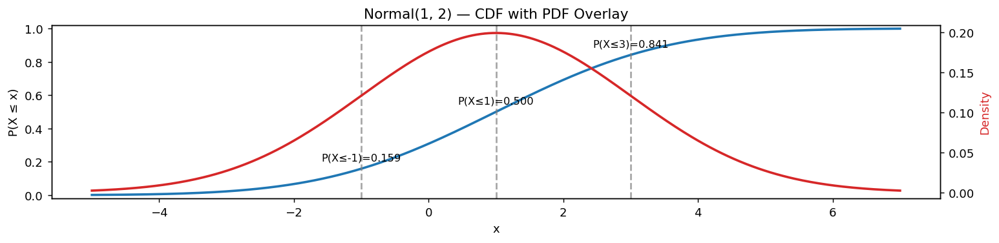

# 정규 누적분포함수와 분위수

## 개요

확률변수 $X$의 **누적분포함수**(CDF)는 $X$가 $x$ 이하의 값을 취할 확률을 준다:

$$
F(x) = P(X \le x) = \int_{-\infty}^{x} f(t)\,dt
$$

정규분포에서는 이 적분에 닫힌 형태의 표현이 없어 수치적으로 계산해야 한다. SciPy는 이를 위해 `stats.norm.cdf()`를 제공한다.

---

## CDF와 PDF를 함께 보기

(이중 y축을 써서) CDF와 PDF를 같은 그림에 그리면 둘의 관계가 분명해진다. 임의의 점에서의 CDF 값은 그 점 왼쪽의 PDF 아래 넓이와 같다.

```python
import matplotlib.pyplot as plt
import numpy as np
import scipy.stats as stats

mu, sigma = 1, 2
x = np.linspace(mu - 3 * sigma, mu + 3 * sigma, 400)

dist = stats.norm(loc=mu, scale=sigma)
y_cdf = dist.cdf(x)
y_pdf = dist.pdf(x)

fig, ax_cdf = plt.subplots(figsize=(12, 3))

# CDF는 왼쪽 축(0~1). PDF는 오른쪽 축(밀도).
# 두 함수의 눈금 규모가 달라 한 축에 그리면 한쪽이 납작해지므로 축을 나눈다.
# 이 절에서는 두 축의 관계가 고정되어 있어(CDF는 PDF의 적분) 안전한 사용이다.
ax_cdf.plot(x, y_cdf, lw=2, label="CDF P(X ≤ x)")
ax_cdf.set_xlabel("x")
ax_cdf.set_ylabel("P(X ≤ x)")
ax_cdf.set_ylim(-0.02, 1.02)

# 기준점 세 개를 표시한다: 평균에서 -1, 0, +1 표준편차.
# CDF 값이 각각 약 0.159, 0.500, 0.841 이 나온다.
# 0.841 - 0.159 = 0.682 가 곧 "68% 규칙"이다.
for xv in [mu - sigma, mu, mu + sigma]:
    yv = dist.cdf(xv)
    ax_cdf.axvline(xv, linestyle='--', color='gray', alpha=0.7)
    ax_cdf.text(xv, yv + 0.05, f"P(X≤{xv:.0f})={yv:.3f}",
                ha='center', fontsize=9)

# PDF on right axis
ax_pdf = ax_cdf.twinx()
ax_pdf.plot(x, y_pdf, lw=2, color='tab:red', label="PDF (density)")
ax_pdf.set_ylabel("Density", color='tab:red')

ax_cdf.set_title(f"Normal({mu}, {sigma}) — CDF with PDF Overlay")
plt.tight_layout()
plt.show()
```



---

## 표준정규분포의 주요 CDF 값

| $x$ | $\mathcal{N}(x) = P(Z \le x)$ |
|---|---|
| $-1.96$ | $0.025$ |
| $-1$ | $0.159$ |
| $0$ | $0.500$ |
| $1$ | $0.841$ |
| $1.96$ | $0.975$ |

대칭성 $\mathcal{N}(-x) = 1 - \mathcal{N}(x)$ 덕분에 표의 절반만 있으면 된다.

---

## 연습문제

<div class="drillbox" markdown>

**연습문제 1.**
$X \sim N(0, 1)$에 대해 CDF를 사용하여 $P(-1.96 \le X \le 1.96)$을 계산하라.

</div>

??? success "풀이"
    $$
    P(-1.96 \le X \le 1.96) = \mathcal{N}(1.96) - \mathcal{N}(-1.96) = 0.975 - 0.025 = 0.950
    $$

    이것이 95% 신뢰구간의 근거이다. 표준정규분포의 가운데 95%가 $\pm 1.96$ 사이에 놓인다.

<div class="drillbox" markdown>

**연습문제 2.**
표준정규 CDF의 대칭성 $\mathcal{N}(-x) = 1 - \mathcal{N}(x)$를 증명하라.

</div>

??? success "풀이"
    표준정규 PDF는 $\varphi(-t) = \varphi(t)$를 만족한다(0을 중심으로 대칭). 그러면:

    $$
    \mathcal{N}(-x) = \int_{-\infty}^{-x} \varphi(t)\,dt
    $$

    $u = -t$로 치환하면($du = -dt$):

    $$
    \mathcal{N}(-x) = \int_{\infty}^{x} \varphi(-u)(-du) = \int_x^{\infty} \varphi(u)\,du = 1 - \mathcal{N}(x)
    $$

    $\square$

<div class="drillbox" markdown>

**연습문제 3.**
$X \sim N(5, 9)$일 때 표준화하여 $P(X > 8)$을 구하라.

</div>

??? success "풀이"
    표준화하면 $Z = (X - 5)/3$이다. 그러면:

    $$
    P(X > 8) = P\!\left(Z > \frac{8-5}{3}\right) = P(Z > 1) = 1 - \mathcal{N}(1) \approx 1 - 0.8413 = 0.1587
    $$

<div class="drillbox" markdown>

**연습문제 4.**
미적분학의 기본정리를 사용하여 $F'(x) = f(x)$(CDF의 도함수가 PDF임)를 보여라. 이것이 그래프에서 무엇을 뜻하는지 설명하라.

</div>

??? success "풀이"
    정의에 의해 $F(x) = \int_{-\infty}^x f(t)\,dt$이다. 미적분학의 기본정리에 의해:

    $$
    F'(x) = \frac{d}{dx}\int_{-\infty}^x f(t)\,dt = f(x)
    $$

    그래프로 보면, 임의의 점 $x$에서 CDF의 기울기가 그 점에서의 PDF 높이와 같다. PDF가 가장 높은 곳(최빈값)에서 CDF가 가장 가파르고, PDF가 0에 가까운 곳(꼬리)에서 CDF는 거의 평평하다.
