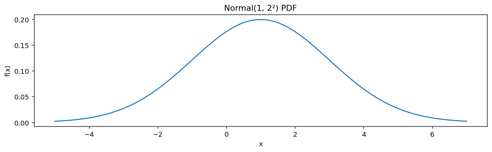

# scipy.stats로 그리는 정규 밀도함수

## 개요

**정규(Gaussian) 분포**는 통계학에서 가장 중요한 연속분포이다. 확률밀도함수(PDF)는 익숙한 종 모양 곡선으로, 평균 $\mu$를 중심으로 대칭이고 퍼짐은 표준편차 $\sigma$가 결정한다.

$$
f(x) = \frac{1}{\sigma\sqrt{2\pi}} \exp\!\left(-\frac{(x - \mu)^2}{2\sigma^2}\right)
$$

확률질량의 약 99.7%가 $\mu \pm 3\sigma$ 안에 있다(68–95–99.7 규칙).

---

## scipy.stats 인터페이스

SciPy는 `stats.norm(loc=mu, scale=sigma)`로 정규분포를 나타내며, 이는 **고정된(frozen)** 분포 객체를 만든다. `loc` 모수가 $\mu$이고 `scale`이 $\sigma$이다($\sigma^2$이 아니다).

```python
import matplotlib.pyplot as plt
import numpy as np
import scipy.stats as stats

mu = 1       # mean
sigma = 2    # standard deviation

# x-grid covering mu +/- 3*sigma
x = np.linspace(mu - 3 * sigma, mu + 3 * sigma, 100)

# Evaluate PDF
y = stats.norm(loc=mu, scale=sigma).pdf(x)

fig, ax = plt.subplots(figsize=(12, 3))
ax.plot(x, y)
ax.set_xlabel("x")
ax.set_ylabel("f(x)")
ax.set_title(f"Normal({mu}, {sigma}²) PDF")
plt.show()
```



---

## 주요 성질

| 성질 | 값 |
|---|---|
| 지지집합 | $(-\infty, \infty)$ |
| 평균 | $\mu$ |
| 분산 | $\sigma^2$ |
| 최빈값 | $\mu$ |
| 왜도 | 0 |
| 첨도 (초과) | 0 |

정규분포는 대칭성(왜도 0)과 꼬리 두께(초과첨도 0)의 기준이 된다. 다른 모든 분포는 정규분포와 비교된다.

---

## 연습문제

**연습문제 1.**
$X \sim N(1, 4)$에 대해 평균에서의 밀도 $f(1)$을 손으로 계산하라.

??? success "풀이"
    $\mu = 1$이고 $\sigma^2 = 4$($\sigma = 2$)이므로:

    $$
    f(1) = \frac{1}{2\sqrt{2\pi}} \exp(0) = \frac{1}{2\sqrt{2\pi}} \approx 0.1995
    $$

---

**연습문제 2.**
정규 PDF의 적분이 1임을 보여라. (힌트: $I = \int_{-\infty}^{\infty} e^{-x^2/2}\,dx$에 대해 $I^2$을 극좌표에서 계산하라.)

??? success "풀이"
    $I = \int_{-\infty}^{\infty} e^{-x^2/2}\,dx$라 하자. 그러면:

    $$
    I^2 = \int_{-\infty}^{\infty}\int_{-\infty}^{\infty} e^{-(x^2+y^2)/2}\,dx\,dy
    $$

    극좌표 $x = r\cos\theta$, $y = r\sin\theta$로 바꾸면:

    $$
    I^2 = \int_0^{2\pi}\int_0^{\infty} e^{-r^2/2}\,r\,dr\,d\theta = 2\pi \cdot \left[-e^{-r^2/2}\right]_0^{\infty} = 2\pi
    $$

    따라서 $I = \sqrt{2\pi}$이고 $\frac{1}{\sigma\sqrt{2\pi}}\int_{-\infty}^{\infty} e^{-(x-\mu)^2/(2\sigma^2)}\,dx = 1$이다. $\square$

---

**연습문제 3.**
정규 PDF의 변곡점을 유도하라. 어떤 $x$ 값에서 곡률의 부호가 바뀌는가?

??? success "풀이"
    변곡점은 $f''(x) = 0$인 곳에서 생긴다. 계산하면:

    $$
    f'(x) = -\frac{x - \mu}{\sigma^2} f(x)
    $$

    $$
    f''(x) = \left(\frac{(x-\mu)^2}{\sigma^4} - \frac{1}{\sigma^2}\right) f(x)
    $$

    $f(x) > 0$임에 유의하여 $f''(x) = 0$으로 두면:

    $$
    (x - \mu)^2 = \sigma^2 \implies x = \mu \pm \sigma
    $$

    변곡점은 $x = \mu - \sigma$와 $x = \mu + \sigma$에 있으며, 평균에서 정확히 표준편차 하나만큼 떨어진 위치이다.

---

**연습문제 4.**
SciPy를 사용하여 표준정규분포에 대해 68–95–99.7 규칙을 수치적으로 확인하라.

??? success "풀이"
    ```python
    dist = stats.norm(0, 1)
    for k in [1, 2, 3]:
        prob = dist.cdf(k) - dist.cdf(-k)
        print(f"P(-{k} < Z < {k}) = {prob:.4f}")
    ```

    출력:

    ```
    P(-1 < Z < 1) = 0.6827
    P(-2 < Z < 2) = 0.9545
    P(-3 < Z < 3) = 0.9973
    ```

    즉

    - $P(-1 < Z < 1) = 0.6827$ (약 68%)
    - $P(-2 < Z < 2) = 0.9545$ (약 95%)
    - $P(-3 < Z < 3) = 0.9973$ (약 99.7%)
