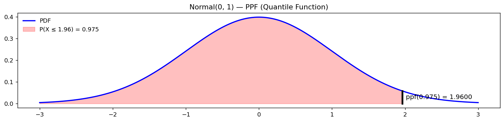

# 정규분포의 백분위점 함수 (분위수 함수)

## 개요

**백분위점 함수**(PPF)는 **분위수 함수** 또는 **역 CDF**라고도 하며, 다음 물음에 답한다. 누적확률 $q$가 주어졌을 때 $P(X \le x) = q$를 만족하는 값 $x$는 무엇인가?

$$
\text{ppf}(q) = F^{-1}(q) = \inf\{x : F(x) \ge q\}
$$

표준정규분포에서 가장 중요한 분위수는 $\mathcal{N}^{-1}(0.975) \approx 1.96$이며, 양측 95% 신뢰구간의 임계값이다.

---

## 코드

```python
import matplotlib.pyplot as plt
import numpy as np
import scipy.stats as stats

mu, sigma = 0, 1
prob = 0.975      # 95% 신뢰구간의 한쪽 끝. 양쪽 꼬리에 2.5%씩 남긴다.

dist = stats.norm(loc=mu, scale=sigma)
x = np.linspace(mu - 3 * sigma, mu + 3 * sigma, 1000)
pdf = dist.pdf(x)

# ppf는 CDF의 역함수다. "누적확률이 이만큼 되는 지점은 어디인가"에 답한다.
#   cdf: 값 -> 확률
#   ppf: 확률 -> 값
# ppf(0.975)가 그 유명한 1.96 이며, 신뢰구간 공식의 z값이 여기서 나온다.
z = dist.ppf(prob)

fig, ax = plt.subplots(figsize=(12, 3))
ax.plot(x, pdf, color='b', lw=2, label='PDF')
ax.plot([z, z], [0, dist.pdf(z)], color='k', lw=3)   # 경계선
# 왼쪽 97.5%를 칠한다. 칠해진 넓이가 곧 확률이라는 점이 요점이다.
ax.fill_between(x[x <= z], pdf[x <= z], 0,
                interpolate=True, color='r', alpha=0.25,
                label=f"P(X ≤ {z:.2f}) = {prob}")
ax.text(z + 0.05, dist.pdf(z) / 2,
        f"ppf({prob}) = {z:.4f}", fontsize=11, va='center')
ax.set_title(f"Normal({mu}, {sigma}) — PPF (Quantile Function)")
ax.legend(loc='upper left', frameon=False)
plt.tight_layout()
plt.show()
```



---

## 표준정규분포의 흔한 분위수

| $q$ | $\mathcal{N}^{-1}(q)$ | 용도 |
|---|---|---|
| 0.500 | 0 | 중앙값 |
| 0.900 | 1.282 | 단측 90% 신뢰구간 |
| 0.950 | 1.645 | 단측 95% 신뢰구간 |
| 0.975 | 1.960 | 양측 95% 신뢰구간 |
| 0.995 | 2.576 | 양측 99% 신뢰구간 |

---

## 연습문제

<div class="drillbox" markdown>

**연습문제 1.**
PPF를 사용하여 $Z \sim N(0,1)$에 대해 $P(-z \le Z \le z) = 0.99$를 만족하는 $z$를 구하라.

</div>

??? success "풀이"
    양쪽 꼬리에 각각 0.5%를 남기므로 $P(Z \le z) = 0.995$가 필요하다:

    $$
    z = \mathcal{N}^{-1}(0.995) \approx 2.576
    $$

    따라서 표준정규분포의 99%가 $\pm 2.576$ 사이에 놓인다.

<div class="drillbox" markdown>

**연습문제 2.**
$X \sim N(100, 225)$일 때 $X$의 90 백분위수를 구하라.

</div>

??? success "풀이"
    여기서 $\mu = 100$, $\sigma = 15$이다. 90 백분위수는:

    $$
    x_{0.90} = \mu + \sigma \cdot \mathcal{N}^{-1}(0.90) = 100 + 15 \times 1.282 \approx 119.2
    $$

<div class="drillbox" markdown>

**연습문제 3.**
연속분포에 대해 모든 $q \in (0, 1)$에서 $F(F^{-1}(q)) = q$임을 증명하라.

</div>

??? success "풀이"
    $x_q = F^{-1}(q) = \inf\{x : F(x) \ge q\}$라 하자. $F$가 연속이고 비감소이며 치역이 $(0,1)$이므로 집합 $\{x : F(x) \ge q\}$는 닫힌 반직선 $[x_q, \infty)$이다. $F$의 연속성에 의해 $F(x_q) = q$이다(하한이 달성된다). 따라서 $F(F^{-1}(q)) = F(x_q) = q$이다. $\square$

<div class="drillbox" markdown>

**연습문제 4.**
PPF와 생존함수의 관계를 설명하라. $P(X > z) = 0.05$를 만족하는 $z$는 어떻게 계산하겠는가?

</div>

??? success "풀이"
    생존함수는 $S(x) = 1 - F(x)$이다. $P(X > z) = 0.05$이면 $P(X \le z) = 0.95$이므로 $z = F^{-1}(0.95)$이다.

    SciPy에서는 `z = stats.norm.ppf(0.95)`이며, 동등하게 `z = stats.norm.isf(0.05)`로도 구할 수 있다. 여기서 `isf`는 역생존함수이다.
