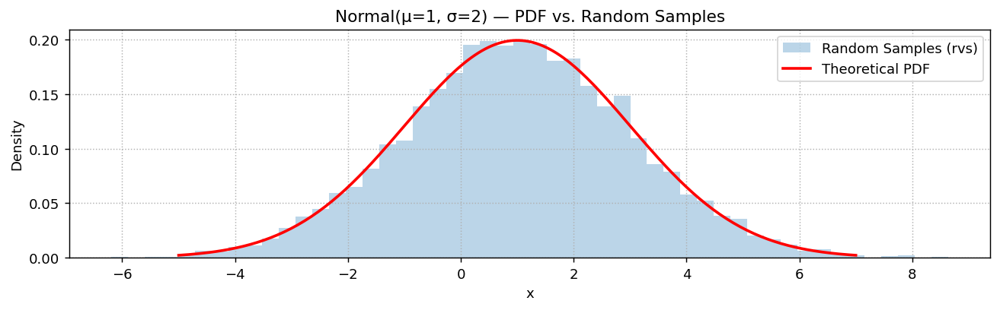
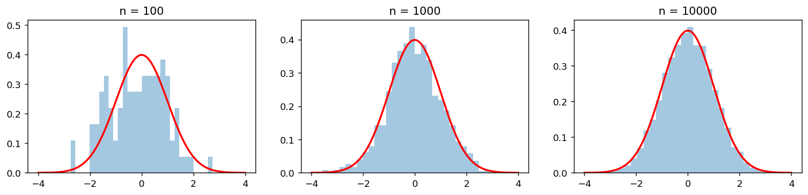

# 정규 난수 생성

## 개요

분포로부터 **난수(확률표본)**를 뽑는 것은 모의실험에 기반한 통계학의 기본이다. 정규분포에서는 `stats.norm.rvs()`가 $N(\mu, \sigma^2)$로부터 표본을 생성한다. 표본크기가 커질수록 표본의 히스토그램은 이론적 PDF로 수렴하며, 이는 큰수의 법칙을 직접 보여 주는 예이다.

---

## 표본 생성하기

```python
import matplotlib.pyplot as plt
import numpy as np
import scipy.stats as stats

mu = 1
sigma = 2       # scipy의 scale은 분산이 아니라 **표준편차**다

# 이론적 밀도함수. 우리가 참값을 알고 있는 곡선이다.
x = np.linspace(mu - 3 * sigma, mu + 3 * sigma, 200)
y = stats.norm(loc=mu, scale=sigma).pdf(x)

# 같은 분포에서 난수 1만 개를 뽑는다.
n_samples = 10_000
samples = stats.norm(loc=mu, scale=sigma).rvs(size=n_samples)

fig, ax = plt.subplots(figsize=(12, 3))
# density=True 가 필수다. 이것이 없으면 y축이 도수(개수)가 되어
# 밀도곡선과 눈금이 달라 겹쳐 그릴 수 없다.
ax.hist(samples, bins=50, density=True, alpha=0.3, color='C0',
        label='Random Samples (rvs)')
# 히스토그램이 이 곡선을 얼마나 잘 따라가는지가 표본의 충실도다
ax.plot(x, y, 'r-', lw=2, label='Theoretical PDF')
ax.set_title(f"Normal(μ={mu}, σ={sigma}) — PDF vs. Random Samples")
ax.set_xlabel("x")
ax.set_ylabel("Density")
ax.legend()
ax.grid(True, linestyle=':')
plt.show()
```



핵심 옵션은 `hist()`의 `density=True`이다. 히스토그램을 정규화하여 전체 넓이를 1로 만들어 주므로 PDF 곡선과 직접 비교할 수 있다.

---

## 히스토그램이 PDF를 근사하는 이유

$x_0$을 중심으로 폭이 $\Delta x$인 구간에 대해, 그 구간에 들어가는 표본의 기대 비율은 근사적으로 $f(x_0)\,\Delta x$이며 $f$는 PDF이다. `density=True`로 두면 $x_0$에서의 히스토그램 높이가 $f(x_0)$을 추정한다. 큰수의 법칙에 의해 이 추정값은 $n \to \infty$일 때 참 밀도로 수렴한다.

---

## 연습문제

**연습문제 1.**
$N(0, 1)$에서 100개, 1000개, 10000개의 표본을 생성하고 히스토그램을 같은 그림에 겹쳐 그려라. 표본크기가 커질수록 적합이 어떻게 좋아지는지 서술하라.

??? success "풀이"
    ```python
    fig, axes = plt.subplots(1, 3, figsize=(15, 3))
    x = np.linspace(-4, 4, 200)
    pdf = stats.norm.pdf(x)
    # 표본 크기만 10배씩 키우고 나머지는 모두 같게 둔다.
    # 구간 수(bins=30)를 고정했으므로 구간당 평균 도수가 3.3 -> 33 -> 333 으로
    # 늘어나고, 그만큼 막대 높이의 상대적 잡음이 줄어든다.
    for ax, n in zip(axes, [100, 1000, 10000]):
        samples = stats.norm.rvs(size=n)
        ax.hist(samples, bins=30, density=True, alpha=0.4)
        ax.plot(x, pdf, 'r-', lw=2)
        ax.set_title(f"n = {n}")
    ```

    

    $n = 100$에서는 히스토그램이 들쭉날쭉하고 눈에 띄게 벗어난다. $n = 1000$에서는 종 모양을 알아볼 수 있지만 여전히 울퉁불퉁하다. $n = 10000$에서는 히스토그램이 PDF를 바짝 따라간다. 수렴 속도는 대략 $O(1/\sqrt{n})$이다.

---

**연습문제 2.**
$X \sim N(\mu, \sigma^2)$에서 $n$개의 표본 $X_1, \ldots, X_n$을 뽑을 때 $E[\bar{X}]$와 $\text{Var}(\bar{X})$는 무엇인가? 크기 $n = 50$인 표본평균을 10000개 생성하여 수치적으로 확인하라.

??? success "풀이"
    $E[\bar{X}] = \mu$이고 $\text{Var}(\bar{X}) = \sigma^2/n$이다.

    ```python
    np.random.seed(1)      # 시드를 고정해야 아래 출력이 재현된다

    mu, sigma, n = 5, 3, 50
    # 크기 50짜리 표본을 1만 번 뽑아 그때마다 표본평균을 기록한다
    means = [stats.norm(mu, sigma).rvs(n).mean() for _ in range(10000)]
    print(f"E[X_bar] ≈ {np.mean(means):.4f}  (theory: {mu})")
    print(f"Var(X_bar) ≈ {np.var(means):.4f}  (theory: {sigma**2/n:.4f})")
    ```

    출력:

    ```
    E[X_bar] ≈ 5.0033  (theory: 5)
    Var(X_bar) ≈ 0.1816  (theory: 0.1800)
    ```

---

**연습문제 3.**
`stats.norm.rvs(size=n)`과 `np.random.normal(0, 1, n)`의 차이를 설명하라. 어느 쪽을 언제 선호하겠는가?

??? success "풀이"
    둘 다 표준정규 난수를 생성한다. `np.random.normal`은 NumPy의 난수 생성기를 직접 호출하므로 단순한 경우 약간 더 빠르다. `stats.norm.rvs`는 고정된 분포 인터페이스를 사용하여 더 유연하다. 분포 객체를 한 번 만들어 두고 같은 객체에 `.rvs()`, `.pdf()`, `.cdf()` 등을 호출할 수 있다. 같은 분포에 여러 메서드가 필요하면 SciPy 인터페이스를, 촘촘한 반복문에서 속도를 최대로 내려면 NumPy 직접 호출을 사용하라.

---

**연습문제 4.**
Box-Muller 변환으로 균등확률변수로부터 표준정규 표본을 생성하라. 변환은 다음과 같다. $U_1, U_2 \sim \text{Uniform}(0,1)$이 독립일 때,

$$
Z_1 = \sqrt{-2\ln U_1}\,\cos(2\pi U_2), \qquad Z_2 = \sqrt{-2\ln U_1}\,\sin(2\pi U_2)
$$

$Z_1$과 $Z_2$가 근사적으로 $N(0,1)$임을 확인하라.

??? success "풀이"
    ```python
    import numpy as np

    np.random.seed(0)
    n = 10000

    # 균등난수 두 개로 독립인 표준정규난수 두 개를 만든다.
    #   U1 -> 반지름 R = sqrt(-2 ln U1)   (레일리 분포)
    #   U2 -> 각도  theta = 2*pi*U2       (0~2pi 균등)
    # 극좌표 (R, theta)를 직교좌표로 옮기면 두 성분이 각각 N(0,1)이 된다.
    U1 = np.random.uniform(0, 1, n)
    U2 = np.random.uniform(0, 1, n)
    Z1 = np.sqrt(-2 * np.log(U1)) * np.cos(2 * np.pi * U2)
    Z2 = np.sqrt(-2 * np.log(U1)) * np.sin(2 * np.pi * U2)

    print(f"Z1: 평균 {Z1.mean():+.4f}  표준편차 {Z1.std():.4f}")
    print(f"Z2: 평균 {Z2.mean():+.4f}  표준편차 {Z2.std():.4f}")
    # 같은 U1을 공유하는데도 두 출력은 독립이다. 상관계수로 확인한다.
    print(f"corr(Z1, Z2) = {np.corrcoef(Z1, Z2)[0, 1]:+.4f}")
    ```

    출력:

    ```
    Z1: 평균 +0.0126  표준편차 1.0169
    Z2: 평균 +0.0163  표준편차 1.0013
    corr(Z1, Z2) = -0.0084
    ```

    평균은 0, 표준편차는 1에 가깝고 상관계수도 0에 가깝다. **같은 `U1`을 쓰는데도 독립**이라는 점이 이 변환의 묘미다. `U1`은 반지름만 정하고 `U2`가 각도를 정하는데, 등방적인 2차원 정규분포에서는 반지름과 각도가 서로 독립이기 때문이다.
