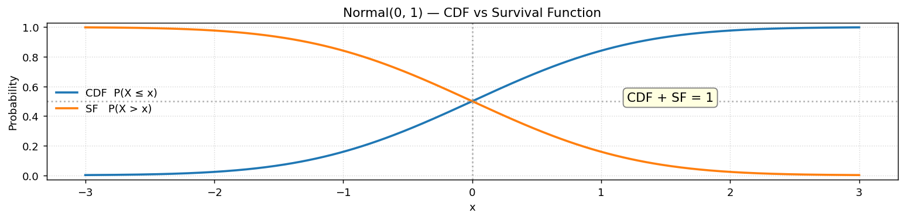

# 정규분포의 생존함수

## 개요

**생존함수**(SF)는 CDF의 여집합에 해당한다:

$$
S(x) = P(X > x) = 1 - F(x)
$$

$X$가 주어진 문턱값을 넘을 확률을 준다. 생존함수는 신뢰성 공학, 보험계리학, 임상시험처럼 사건 발생까지의 시간이나 초과 확률이 관심 대상인 분야에서 널리 쓰인다.

---

## 코드

<div class="codebox" markdown>

**예제 1.** 생존함수로 오른쪽 꼬리 보기

```python
import matplotlib.pyplot as plt
import numpy as np
import scipy.stats as stats

mu, sigma = 0, 1
dist = stats.norm(loc=mu, scale=sigma)

x = np.linspace(mu - 3 * sigma, mu + 3 * sigma, 400)
# 생존함수 SF(x) = P(X > x) = 1 - CDF(x).
# 수학적으로는 CDF의 여집합일 뿐이지만, 계산 방식이 다르다.
# scipy는 sf를 1-cdf로 계산하지 않고 꼬리를 직접 적분하므로
# 아주 작은 확률에서도 정밀도를 잃지 않는다(아래 절 참고).
cdf = dist.cdf(x)
sf = dist.sf(x)

fig, ax = plt.subplots(figsize=(12, 3))
ax.plot(x, cdf, lw=2, label='CDF  P(X ≤ x)')
ax.plot(x, sf, lw=2, label='SF   P(X > x)')
# 두 곡선이 만나는 지점을 표시한다.
# 대칭분포에서는 평균에서 CDF = SF = 0.5 로 교차한다.
ax.axvline(0, ls=':', color='gray', alpha=0.6)
ax.axhline(0.5, ls=':', color='gray', alpha=0.6)
ax.annotate("CDF + SF = 1", xy=(1.2, 0.5), fontsize=12,
            bbox=dict(boxstyle='round,pad=0.3', fc='lightyellow', ec='gray'))
ax.set_xlabel('x')
ax.set_ylabel('Probability')
ax.set_ylim(-0.03, 1.03)
ax.legend(loc='center left', frameon=False)
ax.set_title(f"Normal({mu}, {sigma}) — CDF vs Survival Function")
ax.grid(True, linestyle=':', alpha=0.5)
plt.tight_layout()
plt.show()
```



</div>

---

## 생존함수를 쓰는 이유

상단꼬리 확률이 극단적으로 작을 때 $1 - F(x)$를 직접 계산하면 $F(x)$가 1에 매우 가까워 부동소수점 상쇄가 일어날 수 있다. 전용 메서드 `sf()`는 꼬리 확률을 직접 계산하여 이 문제를 피한다.

<div class="codebox" markdown>

**예제 2.** 생존함수가 수치적으로 더 정확한 이유

```python
from scipy import stats

# 꼬리 확률을 두 가지 방법으로 구해 비교한다.
#   나쁜 방법: 1 - CDF.  CDF가 1에 아주 가까우면 뺄셈에서 유효숫자가 날아간다(상쇄).
#   좋은 방법: SF.       꼬리를 직접 계산하므로 상쇄가 일어나지 않는다.
for x in (6, 8, 10, 12):
    bad = 1 - stats.norm.cdf(x)
    good = stats.norm.sf(x)
    print(f"x={x:>3}:  1-cdf = {bad:.6e}   sf = {good:.6e}")
```

출력:

```
x=  6:  1-cdf = 9.865877e-10   sf = 9.865876e-10
x=  8:  1-cdf = 6.661338e-16   sf = 6.220961e-16
x= 10:  1-cdf = 0.000000e+00   sf = 7.619853e-24
x= 12:  1-cdf = 0.000000e+00   sf = 1.776482e-33
```

</div>

세 단계로 나빠지는 것이 보인다.

- **$x = 6$**: 아직 괜찮다. 마지막 자리만 다르다.
- **$x = 8$**: 유효숫자가 이미 두 자리 넘게 어긋났다($6.661$ 대 $6.221$).
- **$x \ge 10$**: `1 - cdf`가 **정확히 0**이 된다. 확률이 0이 아닌데 0이라고 답하는 것이다.

원인은 배정밀도 부동소수점이 1 근처에서 약 $10^{-16}$ 간격으로만 값을 구별할 수 있다는 데 있다. $\Phi(10) = 1 - 7.6 \times 10^{-24}$은 그 간격보다 훨씬 1에 가까우므로 **컴퓨터 안에서는 그냥 1로 저장된다.** 1에서 1을 빼면 0이다.

!!! danger "꼬리 확률에는 언제나 `sf`를 써라"
    $p$-값 계산이 대표적이다. $p$-값은 본질적으로 꼬리 확률이므로 `1 - cdf`로 구하면 아주 작은 $p$-값이 0으로 보고된다. 유전체학처럼 $p < 10^{-20}$을 다루는 분야에서는 치명적이다.

    같은 이유로 로그가 필요하면 `np.log(sf(x))`가 아니라 **`logsf(x)`** 를 쓴다. `sf`조차 언더플로로 0이 되는 극단적인 영역에서도 로그값은 정상적으로 나온다.

---

## 연습문제

<div class="drillbox" markdown>

**연습문제 1.** <span class="diff easy" title="쉬움"></span>
$Z \sim N(0,1)$에 대해 CDF와 SF를 각각 사용하여 $P(Z > 2)$를 계산하고 두 결과가 일치함을 확인하라.

</div>

??? success "풀이"
    CDF로: $P(Z > 2) = 1 - \mathcal{N}(2) = 1 - 0.9772 = 0.0228$.

    SF로: `stats.norm.sf(2) = 0.0228`.

    둘 다 같은 결과를 준다. $P(Z > 8)$처럼 극단적인 값에서는 SF 방식이 수치적으로 더 낫다.

<div class="drillbox" markdown>

**연습문제 2.** <span class="diff easy" title="쉬움"></span>
임의의 연속확률변수에 대해 모든 $x$에서 $S(x) + F(x) = 1$임을 보여라.

</div>

??? success "풀이"
    정의에 의해:

    $$
    F(x) + S(x) = P(X \le x) + P(X > x) = P(X \in (-\infty, x]) + P(X \in (x, \infty))
    $$

    $(-\infty, x]$와 $(x, \infty)$는 $\mathbb{R}$의 분할이므로 두 확률의 합은 1이다. $\square$

<div class="drillbox" markdown>

**연습문제 3.** <span class="diff easy" title="쉬움"></span>
어떤 부품은 응력 $X \sim N(500, 2500)$이 문턱값 600을 넘으면 고장 난다. 고장 확률은 얼마인가?

</div>

??? success "풀이"
    표준화하면 $Z = (600 - 500)/50 = 2$이다.

    $$
    P(X > 600) = P(Z > 2) = S(2) \approx 0.0228
    $$

    부품의 약 2.3%가 고장 난다.

<div class="drillbox" markdown>

**연습문제 4.** <span class="diff med" title="중간"></span>
**위험함수**는 $h(x) = f(x)/S(x)$로 정의된다. 표준정규분포에 대해 $h(0)$을 계산하고 $x > 0$에서 $h(x)$가 증가하는 이유를 설명하라.

</div>

??? success "풀이"
    $x = 0$에서 $f(0) = 1/\sqrt{2\pi} \approx 0.3989$이고 $S(0) = 0.5$이다.

    $$
    h(0) = \frac{0.3989}{0.5} \approx 0.7979
    $$

    $x > 0$에서는 $S(x)$가 $f(x)$보다 빠르게 감소한다. 분모는 ($x$ 위에 남은 값이 줄어들어) 작아지는 반면, 분자인 밀도도 감소하지만 상대적으로는 더 천천히 줄어들기 때문이다. 그래서 $h(x)$가 증가한다. $x$까지 생존했다는 조건 아래 $x$에서 "고장"이 날 조건부 확률이 $x$와 함께 커지는 것이다. 정규분포는 **증가하는 고장률**을 갖는다.

---

## 정리하며

생존함수 $S(x)=P(X>x)=1-F(x)$ 는 **오른쪽 꼬리**의 확률이다.

- **왜 따로 두는가.** 꼬리로 갈수록 $F(x)$ 가 $1$ 에 붙으므로 `1 - cdf(x)` 는 **자리올림 소실**로 정밀도를 잃는다. $x=10$ 에서 `1 - norm.cdf(10)` 은 $0$ 을 주지만 `norm.sf(10)` 은 $7.6\times10^{-24}$ 를 제대로 준다. **작은 $p$ 값을 계산할 때는 반드시 `sf` 를 쓴다.**
- 대응되는 역함수가 `isf` 이며, 상위 $q$ 를 가르는 값을 준다.
- 신뢰성 공학·보험계리·생존분석에서 기본 언어다. 21장의 생존함수와 위험함수가 이 개념의 확장이다.
- 단측 검정의 $p$ 값이 곧 관측된 통계량에서의 생존함수 값이다.

다음 절 **정규분포 난수 생성**으로 이 분포의 네 가지 창을 마무리한다. 이론적 밀도와 실제 표본이 얼마나 맞아떨어지는지 눈으로 확인한다.
