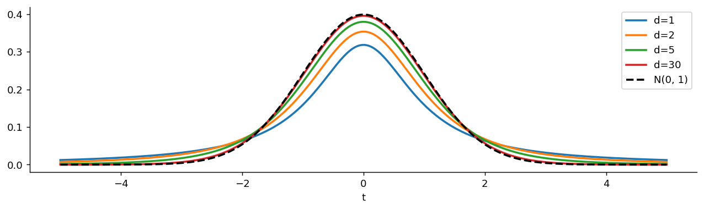
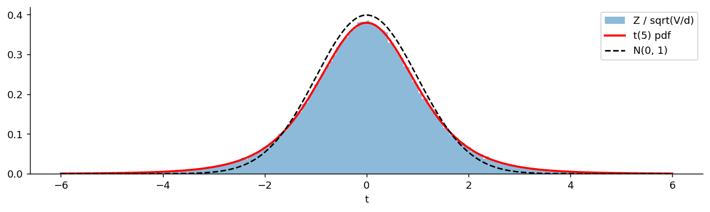

# t 분포

## 개요

**$t$ 분포**는 표준정규확률변수를, 그와 독립인 카이제곱확률변수로 만든 척도로 나눈 것의 분포다. 정규분포를 **자기 자신의 크기 추정값으로 나누면** 무엇이 나오는가에 대한 답이라고 할 수 있다.

4.2절의 사슬에서 네 번째 고리다.

$$
\text{Exp}(\lambda) \to N(\mu, \sigma^2) \to \chi^2_d \;\longrightarrow\; t_d \;\longrightarrow\; F_{d_1, d_2}
$$

앞 페이지에서 정규를 제곱해 더해 카이제곱을 만들었다. 이제 그 카이제곱으로 정규를 **나눈다.** 나누는 쪽도 확률변수이므로 분모 자체가 흔들리고, 그 흔들림이 분포의 꼬리를 두껍게 만든다. $t$ 분포가 정규분포보다 퍼져 있는 이유가 이것 하나로 설명된다.

이 페이지에서는 자유도를 $d$로 쓴다.

---

## 정의

<div class="defn" markdown>

### 정의 1. $t$ 분포 { .dfn }

$Z \sim N(0, 1)$과 $V \sim \chi^2_d$가 **서로 독립**일 때

$$
T = \frac{Z}{\sqrt{V/d}}
$$

의 분포를 **자유도 $d$인 $t$ 분포**라 하고 $T \sim t_d$로 쓴다.

</div>

세 가지 조건이 모두 필요하다. 분자가 표준정규, 분모 안이 카이제곱, 그리고 **둘이 독립**이어야 한다. 독립성이 빠지면 전혀 다른 분포가 나온다. 정규모집단에서 표본평균과 표본분산이 독립이라는 사실(5장)이 결정적으로 쓰이는 지점이다.

### 왜 $V$를 $d$로 나누는가

$E[V] = d$이므로 $V/d$는 평균이 1이다. 즉 $\sqrt{V/d}$는 **평균적으로 1인 척도**이고, $T$는 대체로 $Z$ 근처에 놓인다. $d$로 나누지 않으면 자유도가 커질수록 분모가 함께 커져 $T$가 0으로 쪼그라든다. 나눠 주기 때문에 자유도를 키울 때 $T$가 $Z$로 수렴한다.

---

## 밀도

<div class="defn" markdown>

### 정리 1. $t$ 분포의 밀도 { .dfn }

$T \sim t_d$의 밀도는

$$
f(t; d) = \frac{\Gamma\!\left(\frac{d+1}{2}\right)}{\sqrt{d\pi}\;\Gamma\!\left(\frac d2\right)}\left(1 + \frac{t^2}{d}\right)^{-\frac{d+1}{2}}, \qquad t \in \mathbb{R}
$$

</div>

??? proof "증명"

    **1단계: $V$를 고정한다.** $V = v$가 주어지면 $T = Z/\sqrt{v/d}$는 상수를 곱한 정규확률변수이므로

    $$
    T \mid V = v \;\sim\; N\!\left(0,\ \frac dv\right)
    $$

    이다. 여기서 독립성이 쓰였다. $Z$의 분포가 $V$의 값에 영향을 받지 않아야 이 조건부분포가 성립한다.

    **2단계: $V$에 대해 적분한다.** 조건부밀도와 $V$의 밀도를 곱해 적분한다.

    $$
    f_T(t) = \int_0^\infty \underbrace{\sqrt{\frac{v}{2\pi d}}\,e^{-\frac{t^2 v}{2d}}}_{N(0,\, d/v)\text{의 밀도}}\cdot\underbrace{\frac{v^{d/2 - 1}e^{-v/2}}{2^{d/2}\Gamma(d/2)}}_{\chi^2_d\text{의 밀도}}\,dv
    $$

    상수를 밖으로 빼내고 $v$의 지수를 모으면

    $$
    f_T(t) = \frac{1}{\sqrt{2\pi d}\;2^{d/2}\Gamma(d/2)}\int_0^\infty v^{\frac{d+1}{2} - 1}\exp\!\left[-\frac v2\left(1 + \frac{t^2}{d}\right)\right]dv
    $$

    **3단계: 감마적분.** $\int_0^\infty v^{a-1}e^{-bv}dv = \Gamma(a)/b^a$를 $a = \frac{d+1}{2}$, $b = \frac12\left(1 + \frac{t^2}{d}\right)$에 적용하면 적분값은

    $$
    \Gamma\!\left(\frac{d+1}{2}\right)\left[\frac{2}{1 + t^2/d}\right]^{\frac{d+1}{2}}
    $$

    이다. 대입하고 2의 거듭제곱을 정리하면 $2^{(d+1)/2}/2^{d/2} = \sqrt2$이므로

    $$
    f_T(t) = \frac{\sqrt2\,\Gamma\!\left(\frac{d+1}{2}\right)}{\sqrt{2\pi d}\,\Gamma(d/2)}\left(1 + \frac{t^2}{d}\right)^{-\frac{d+1}{2}} = \frac{\Gamma\!\left(\frac{d+1}{2}\right)}{\sqrt{d\pi}\,\Gamma(d/2)}\left(1 + \frac{t^2}{d}\right)^{-\frac{d+1}{2}}
    $$

    이다. $\square$

### 밀도를 읽는 법

정규밀도와 나란히 놓으면 차이가 한눈에 보인다.

$$
\varphi(t) = \frac{1}{\sqrt{2\pi}}\,e^{-t^2/2}, \qquad f(t; d) = c_d\left(1 + \frac{t^2}{d}\right)^{-\frac{d+1}{2}}
$$

정규밀도는 $t^2$에 대해 **지수적으로** 떨어지고, $t$ 밀도는 **다항식의 거듭제곱**으로 떨어진다. $|t|$가 크면

$$
f(t; d) \approx c_d\, d^{\frac{d+1}{2}}\,|t|^{-(d+1)}
$$

로 멱함수 꼬리를 갖는다. 지수함수가 멱함수보다 훨씬 빨리 0에 가까워지므로, 멀리 나갈수록 $t$ 쪽 꼬리가 압도적으로 두껍다. 이 한 줄이 $t$ 분포의 모든 특이한 성질(적률이 유한개만 존재한다, MGF가 없다, 이상점이 자주 나온다)의 뿌리다.

---

## 성질

| 성질 | 조건 | 값 |
|---|---|---|
| 지지집합 | — | $(-\infty, \infty)$ |
| 대칭성 | — | 0에 대해 대칭 |
| 최빈값 | — | $0$ |
| 평균 | $d > 1$ | $0$ |
| 평균 | $d \le 1$ | 존재하지 않음 |
| 분산 | $d > 2$ | $\dfrac{d}{d-2}$ |
| 분산 | $1 < d \le 2$ | $\infty$ |
| 적률 $E[|T|^k]$ | $k < d$ | 유한 |
| MGF | — | **존재하지 않음** |

### 분산의 유도

정의와 독립성을 쓰면 계산이 짧다.

$$
\text{Var}(T) = E[T^2] = E\!\left[\frac{Z^2}{V/d}\right] = d\,E[Z^2]\,E\!\left[\frac1V\right] = d\,E\!\left[\frac1V\right]
$$

두 번째 등호에서 독립성 덕분에 기댓값이 쪼개졌다. 이제 $V \sim \chi^2_d$의 역수의 기댓값을 구한다.

$$
E\!\left[\frac1V\right] = \frac{1}{2^{d/2}\Gamma(d/2)}\int_0^\infty v^{\frac d2 - 2}e^{-v/2}dv = \frac{2^{\frac d2 - 1}\Gamma\!\left(\frac d2 - 1\right)}{2^{d/2}\Gamma\!\left(\frac d2\right)} = \frac{1}{d - 2}
$$

마지막 등호는 $\Gamma(a) = (a-1)\Gamma(a-1)$을 $a = d/2$에 적용한 것이다. 따라서

$$
\text{Var}(T) = \frac{d}{d-2}, \qquad d > 2
$$

$\square$

$d \le 2$이면 위 적분이 발산한다. **분모가 0에 가까워질 수 있다는 것**이 원인이다. $V$가 아주 작은 값을 가질 확률이 충분히 크면 $1/V$의 기댓값이 무한대가 된다. 자유도가 작을수록 분모의 추정이 불안정하다는 사실이 여기에 그대로 반영되어 있다.

### 위치와 척도를 붙인 판

지금까지 다룬 $T \sim t_d$는 위치 0, 척도 1인 표준형이다. 실무에서는 여기에 위치 $\mu$와 척도 $\sigma$를 붙여 $\mu + \sigma T$를 쓰며, 그 밀도는

$$
f(x) = \frac{\Gamma\!\left(\frac{d+1}{2}\right)}{\sigma\sqrt{d\pi}\;\Gamma\!\left(\frac d2\right)}\left(1 + \frac1d\left(\frac{x-\mu}{\sigma}\right)^2\right)^{-\frac{d+1}{2}}
$$

이다. 적률은 $d > 1$이면 평균 $\mu$, $d > 2$이면 분산 $\frac{d}{d-2}\sigma^2$이다.

**주의할 점은 $\sigma$가 표준편차가 아니라는 것이다.** 표준편차는 $\sigma\sqrt{d/(d-2)}$로 언제나 $\sigma$보다 크다. SciPy의 `stats.t(df, loc, scale)`에서 `scale`도 이 $\sigma$를 뜻하므로, 표준편차를 넣으면 분포가 필요 이상으로 퍼진다. 꼬리가 두꺼운 잡음을 모형화할 때 흔히 저지르는 실수다.

### 분산이 항상 1보다 크다

$$
\frac{d}{d-2} = 1 + \frac{2}{d-2} > 1
$$

$t$ 분포는 표준정규보다 **언제나 퍼져 있고**, 자유도가 커지면 그 초과분 $2/(d-2)$가 0으로 줄어든다. $d = 10$이면 분산이 1.25, $d = 30$이면 1.07, $d = 100$이면 1.02다.

### MGF가 없다

$E[e^{sT}] = \int e^{st}f(t;d)\,dt$에서 피적분함수가 $|t| \to \infty$일 때 $e^{st}|t|^{-(d+1)}$처럼 행동하므로, $s \ne 0$이면 적분이 발산한다. 즉 **0이 아닌 어떤 $s$에서도 MGF가 존재하지 않는다.**

앞 페이지에서 카이제곱의 성질을 MGF로 손쉽게 유도했던 것과 대조적이다. $t$ 분포에서는 그 도구를 쓸 수 없고, 정의로 돌아가 조건부 논법이나 직접 적분을 해야 한다. 꼬리가 두꺼운 분포를 다룰 때 흔히 겪는 일이다.

---

## 두 끝: 코시분포와 정규분포

### $d = 1$: 코시분포

$\Gamma(1) = 1$, $\Gamma(1/2) = \sqrt\pi$를 넣으면

$$
f(t; 1) = \frac{1}{\sqrt\pi \cdot \sqrt\pi}\,(1 + t^2)^{-1} = \frac{1}{\pi(1 + t^2)}
$$

로 **코시분포**가 된다. 평균조차 존재하지 않는 분포다. 정의로 보면 $t_1 = Z_1/|Z_2|$로 독립인 두 정규의 비이며, 분모가 0 근처를 자주 지나가므로 엄청나게 큰 값이 심심찮게 나온다.

코시분포에서는 큰수의 법칙이 통하지 않는다. 표본평균이 표본크기와 무관하게 **다시 코시분포**를 따르기 때문에, 자료를 아무리 많이 모아도 평균이 한 점으로 수렴하지 않는다.

### $d \to \infty$: 표준정규분포

<div class="defn" markdown>

### 정리 2. 정규분포로의 수렴 { .dfn }

모든 $t$에 대해

$$
\lim_{d \to \infty} f(t; d) = \frac{1}{\sqrt{2\pi}}\,e^{-t^2/2}
$$

</div>

??? proof "증명"

    밀도를 상수 부분과 $t$에 의존하는 부분으로 나눈다.

    **$t$에 의존하는 부분.** 로그를 취하면

    $$
    -\frac{d+1}{2}\ln\!\left(1 + \frac{t^2}{d}\right) = -\frac{d+1}{2}\left(\frac{t^2}{d} - \frac{t^4}{2d^2} + \cdots\right) \longrightarrow -\frac{t^2}{2}
    $$

    이므로 그 부분은 $e^{-t^2/2}$로 수렴한다. 익숙한 극한 $(1 + x/d)^d \to e^x$의 변형이다.

    **상수 부분.** 스털링 근사 $\Gamma(a + 1/2)/\Gamma(a) \sim \sqrt a$를 $a = d/2$에 쓰면

    $$
    \frac{\Gamma\!\left(\frac{d+1}{2}\right)}{\sqrt{d\pi}\,\Gamma\!\left(\frac d2\right)} \sim \frac{\sqrt{d/2}}{\sqrt{d\pi}} = \frac{1}{\sqrt{2\pi}}
    $$

    두 부분을 곱하면 표준정규밀도다. $\square$

    정의 쪽에서 보면 더 직관적이다. 큰수의 법칙에 의해 $V/d \to 1$이므로 분모가 상수 1로 굳어지고, 남는 것은 $Z$뿐이다.

### 언제 정규분포로 갈음해도 되는가

| $d$ | 97.5백분위점 | 정규분포 대비 |
|---|---|---|
| 5 | 2.571 | 31% 크다 |
| 10 | 2.228 | 14% 크다 |
| 30 | 2.042 | 4.2% 크다 |
| 100 | 1.984 | 1.2% 크다 |
| $\infty$ | 1.960 | — |

흔히 말하는 "$n \ge 30$이면 정규분포로 봐도 된다"는 규칙은 이 표의 넷째 줄에서 나온다. 다만 이것은 **중앙 부근의 신뢰구간**에 대한 이야기다. 꼬리로 갈수록 상대오차가 커지므로, 99.9백분위점 같은 극단 분위수를 다룰 때는 자유도 30으로도 충분하지 않다.

---

## 문제

<div class="probox" markdown>

**문제:** <span class="diff easy" title="쉬움"></span> $T \sim t_4$일 때 $P(T^2 > 3)$을 구하려 한다. $T^2$은 어떤 분포를 따르는가?

</div>

??? success "풀이"

    정의에서 $T = Z/\sqrt{V/4}$이므로

    $$
    T^2 = \frac{Z^2}{V/4} = \frac{Z^2/1}{V/4}
    $$

    이다. 분자 $Z^2 \sim \chi^2_1$이고 분모의 $V \sim \chi^2_4$이며 둘이 독립이다. 각각을 자기 자유도로 나눈 비이므로, 다음 페이지에서 볼 정의에 따라

    $$
    T^2 \sim F_{1, 4}
    $$

    이다. 일반적으로 $t_d^2 = F_{1, d}$다.

    수치로는 `stats.f(1, 4).sf(3) = 0.1583`이고, 직접 계산해도 $P(|T| > \sqrt3) = 2 \times 0.0791 = 0.1583$으로 같다. **양측 $t$ 검정과 분자 자유도 1인 $F$ 검정은 같은 검정**이라는 사실이 여기서 나온다. 카이제곱 페이지에서 본 "양측 $z$ 검정 = 자유도 1인 카이제곱검정"과 똑같은 구조다.

---

## Python: 밀도, 표본추출, 꼬리

### 자유도에 따른 밀도

<div class="codebox" markdown>

#### 예제 1. 자유도에 따른 t 밀도와 정규밀도 { .eg }

```python
import matplotlib.pyplot as plt
import numpy as np
from scipy import stats

x = np.linspace(-5, 5, 400)

fig, ax = plt.subplots(figsize=(12, 3))
# 자유도가 커질수록 정규분포에 가까워진다.
#   d=1  : 코시분포. 평균조차 없다.
#   d=2  : 평균은 있지만 분산이 무한대다.
#   d=5  : 분산 5/3 = 1.67
#   d=30 : 분산 30/28 = 1.07. 검은 점선과 거의 겹친다.
# 가운데가 정규분포보다 **낮다**는 점에 주의하라. 전체 넓이가 1로 같으므로
# 꼬리로 나간 질량만큼 봉우리가 내려앉는다.
for d in [1, 2, 5, 30]:
    ax.plot(x, stats.t(d).pdf(x), lw=2, label=f'd={d}')
ax.plot(x, stats.norm.pdf(x), 'k--', lw=2, label='N(0, 1)')
ax.set_xlabel('t')
ax.spines[['top', 'right']].set_visible(False)
ax.legend()
plt.show()
```



</div>

### 정의대로 만들어 보기

<div class="codebox" markdown>

#### 예제 2. Z를 카이제곱으로 나누면 t가 나오는가 { .eg }

```python
import matplotlib.pyplot as plt
import numpy as np
from scipy import stats

np.random.seed(42)
d = 5
# 정의를 그대로 실행한다. 분자와 분모를 **따로** 뽑아야 독립이 보장된다.
z = stats.norm.rvs(size=200_000)
v = stats.chi2(d).rvs(size=200_000)
t = z / np.sqrt(v / d)

x = np.linspace(-6, 6, 400)
fig, ax = plt.subplots(figsize=(12, 3))
# 구간을 [-6, 6]으로 고정한다. 꼬리가 두꺼워 |t| > 50 인 값도 나오는데,
# 자동 구간에 맡기면 그 이상점 때문에 가운데가 한두 칸으로 뭉개진다.
ax.hist(t, bins=200, range=(-6, 6), density=True, alpha=0.5, label='Z / sqrt(V/d)')
ax.plot(x, stats.t(d).pdf(x), 'r-', lw=2, label='t(5) pdf')
ax.plot(x, stats.norm.pdf(x), 'k--', lw=1.5, label='N(0, 1)')
ax.set_xlabel('t')
ax.spines[['top', 'right']].set_visible(False)
ax.legend()
plt.show()

print(f"|t| > 3  : sample {np.mean(np.abs(t) > 3):.4f},  normal {2*stats.norm.sf(3):.4f}")
print(f"max |t|  : {np.abs(t).max():.1f}")
```

출력:

```
|t| > 3  : sample 0.0303,  normal 0.0027
max |t|  : 20.8
```

정규분포라면 1만 번에 27번 나올 사건이 $t_5$에서는 303번 나온다. **꼬리가 11배 두껍다.** 20만 개를 뽑았더니 $|t|$의 최댓값이 20.8까지 올라갔다. 표준정규였다면 20만 개로는 4.5 언저리가 한계다.



</div>

### 분산과 분위수 확인

<div class="codebox" markdown>

#### 예제 3. 분산 d/(d-2)와 임계값 { .eg }

```python
from scipy import stats

print(f"{'d':>5}  {'Var = d/(d-2)':>14}  {'97.5 pct':>9}")
for d in [3, 5, 10, 30, 100]:
    print(f"{d:>5}  {d/(d-2):>14.4f}  {stats.t(d).ppf(0.975):>9.4f}")
print(f"{'inf':>5}  {1.0:>14.4f}  {stats.norm.ppf(0.975):>9.4f}")
```

출력:

```
    d   Var = d/(d-2)   97.5 pct
    3          3.0000     3.1824
    5          1.6667     2.5706
   10          1.2500     2.2281
   30          1.0714     2.0423
  100          1.0204     1.9840
  inf          1.0000     1.9600
```

분산과 임계값이 나란히 1과 1.96으로 내려간다. 자유도 3에서 분산이 3이나 된다는 점이 눈에 띈다. 작은 표본에서 $t$ 임계값이 훌쩍 커지는 까닭이다.

</div>

---

## 왜 나누는가

정의만 보면 "정규를 카이제곱으로 나눈다"는 조작이 인위적으로 보일 수 있다. 그러나 이 꼴은 추론에서 저절로 나타난다.

정규모집단 $N(\mu, \sigma^2)$에서 크기 $n$인 표본을 뽑았다고 하자. 표본평균을 참 표준편차로 표준화하면 정확히 표준정규를 따른다.

$$
\frac{\bar X - \mu}{\sigma/\sqrt n} \sim N(0, 1)
$$

문제는 $\sigma$를 모른다는 것이다. 표본표준편차 $S$로 갈음하면

$$
\frac{\bar X - \mu}{S/\sqrt n} = \frac{(\bar X - \mu)/(\sigma/\sqrt n)}{S/\sigma} = \frac{Z}{\sqrt{\frac{(n-1)S^2/\sigma^2}{n-1}}}
$$

가 되는데, 분자는 표준정규이고 분모 안의 $(n-1)S^2/\sigma^2$은 $\chi^2_{n-1}$을 따르며 둘이 독립이다. **정의 1이 그대로 나타난 것**이므로 이 통계량은 $t_{n-1}$을 따른다.

즉 $t$ 분포는 "분모를 추정해서 쓰는 대가"를 정확히 기술한다. 분모가 확률변수이므로 전체가 더 흔들리고, 그 흔들림을 반영해 꼬리가 두꺼워진다. 자세한 이야기(왜 자유도가 $n-1$인지, $\bar X$와 $S^2$이 왜 독립인지)는 5장에서 다룬다.

---

## 다른 분포와의 관계

$$
\begin{aligned}
t_1 &= \text{Cauchy}(0, 1) \\[4pt]
t_d &\;\xrightarrow{\;d \to \infty\;}\; N(0, 1) \\[4pt]
t_d^2 &= F_{1, d} \\[4pt]
t_d &= \frac{Z}{\sqrt{V/d}} \quad (Z \perp V,\ V \sim \chi^2_d)
\end{aligned}
$$

마지막으로 자주 쓰이는 관점 하나. $W = d/V$로 두면 $T = Z\sqrt W$이므로, $t$ 분포는 **정규분포의 척도를 확률변수로 섞은 것**(정규 척도혼합)이다. 4.1절에서 포아송의 비율을 감마로 섞어 음이항분포를 얻었던 것과 같은 구조다. 모수를 확률변수로 두고 섞으면 산포가 커진다는 원리가 이산과 연속 양쪽에서 똑같이 작동한다.

---

## 연습문제

<div class="drillbox" markdown>

**연습문제 1.** <span class="diff easy" title="쉬움"></span>
$T \sim t_8$이다. (a) 평균과 분산은? (b) 95% 양측 임계값은 2.306인데, 정규분포의 1.96보다 큰 이유를 설명하라. (c) 자유도가 8에서 80으로 늘면 이 임계값은 어떻게 되는가?

</div>

??? success "풀이"
    (a) $d = 8 > 2$이므로 평균은 0, 분산은 $8/6 = 1.333$이다.

    (b) $t$ 분포가 정규분포보다 퍼져 있기 때문이다. 같은 95%의 확률을 담으려면 더 넓게 잡아야 한다. 퍼진 원인은 분모의 $S$가 확률변수라는 데 있다. 참 $\sigma$를 안다면 1.96으로 충분하지만, 추정해서 쓰는 이상 그 추정의 불확실성만큼 구간을 넓혀야 한다.

    (c) $d = 80$이면 임계값이 1.990으로 내려간다. 자유도가 10배가 되었는데 임계값은 2.306에서 1.990으로 14%만 줄었고, 정규분포의 1.96에는 1.5% 차이로 다가섰다. **이득이 빠르게 줄어든다**는 점이 요점이다. 표본을 늘려 얻는 임계값 개선은 곧 한계에 이르고, 남는 것은 $\sqrt n$에서 오는 표준오차 감소뿐이다.

<div class="drillbox" markdown>

**연습문제 2.** <span class="diff med" title="중간"></span>
정의 1과 독립성을 써서 $\text{Var}(T) = d/(d-2)$를 유도하라. $d = 2$에서 무슨 일이 일어나는가?

</div>

??? success "풀이"
    독립이므로 기댓값이 쪼개진다.

    $$
    E[T^2] = E\!\left[\frac{Z^2 d}{V}\right] = d\,E[Z^2]\,E\!\left[\frac1V\right] = d\,E\!\left[\frac1V\right]
    $$

    $V \sim \chi^2_d$에 대해

    $$
    E\!\left[\frac1V\right] = \frac{1}{2^{d/2}\Gamma(d/2)}\int_0^\infty v^{\frac d2 - 2}e^{-v/2}\,dv = \frac{2^{\frac d2 -1}\Gamma\!\left(\frac d2 - 1\right)}{2^{\frac d2}\Gamma\!\left(\frac d2\right)} = \frac{1}{2\left(\frac d2 - 1\right)} = \frac{1}{d-2}
    $$

    이므로 $\text{Var}(T) = d/(d-2)$이다. $\square$

    **$d = 2$에서.** 적분 $\int_0^\infty v^{-1}e^{-v/2}dv$가 $v \to 0$에서 발산한다. $\ln v$ 꼴이 되어 로그발산이므로 아슬아슬하게 무한대다. 분모 $V$가 0 근처를 너무 자주 방문하면 $1/V$의 기댓값이 존재하지 않는다는 것이 핵심이고, 그것이 곧 "자유도 2에서는 분산이 무한대"라는 말이다.

    평균은 $d > 1$이면 존재하므로 $d = 2$에서 **평균은 0으로 있는데 분산만 무한대**인 상태다. 이런 분포가 실제로 존재한다는 사실 자체가 기억해 둘 만하다.

<div class="drillbox" markdown>

**연습문제 3.** <span class="diff med" title="중간"></span>
$t_1$이 코시분포임을 밀도식에서 확인하고, $E[|T|] = \infty$임을 보여라.

</div>

??? success "풀이"
    **밀도.** $d = 1$을 넣으면 $\Gamma(1) = 1$, $\Gamma(1/2) = \sqrt\pi$이므로

    $$
    f(t; 1) = \frac{1}{\sqrt{1\cdot\pi}\cdot\sqrt\pi}(1 + t^2)^{-1} = \frac{1}{\pi(1+t^2)}
    $$

    로 코시밀도다.

    **적률.** 대칭이므로 절댓값의 적분을 본다.

    $$
    E[|T|] = 2\int_0^\infty \frac{t}{\pi(1+t^2)}dt = \frac{1}{\pi}\Big[\ln(1+t^2)\Big]_0^\infty = \infty
    $$

    로그발산이다. $\square$

    $E[|T|] = \infty$이므로 $E[T]$는 **존재하지 않는다.** 대칭이니 0이라고 말하고 싶지만, 양쪽 꼬리의 적분이 각각 무한대라 $\infty - \infty$ 꼴이 되어 정의되지 않는다. 대칭성만으로는 평균의 존재를 보장하지 못한다는 교훈이다.

    실용적으로는 코시 자료에서 표본평균을 쓰면 안 된다는 뜻이다. **표본중앙값**은 잘 작동한다. 중앙값은 꼬리의 크기에 영향을 받지 않기 때문이다.

<div class="drillbox" markdown>

**연습문제 4.** <span class="diff med" title="중간"></span>
$E[|T|^k] < \infty$가 $k < d$일 때만 성립함을 꼬리의 모양으로 설명하라. $d = 3$인 경우 어떤 적률이 존재하는가?

</div>

??? success "풀이"
    큰 $|t|$에서 $f(t;d) \asymp |t|^{-(d+1)}$이므로

    $$
    \int^\infty |t|^k f(t;d)\,dt \asymp \int^\infty |t|^{k - d - 1}\,dt
    $$

    이다. 이 적분은 지수 $k - d - 1 < -1$, 즉 $k < d$일 때만 수렴한다. $\square$

    **$d = 3$.** 평균($k=1$)과 분산($k=2$)은 존재하고 분산은 $3/(3-2) = 3$이다. 그러나 $k = 3$인 왜도부터는 존재하지 않는다. 왜도를 계산하려 들면 표본값이 표본크기에 따라 제멋대로 튄다.

    **자유도가 곧 "존재하는 적률의 개수"**라고 기억하면 편하다. 금융 수익률 자료에 $t$ 분포를 적합하면 자유도가 대개 3에서 6 사이로 나오는데, 이는 분산은 있지만 첨도는 없을 수도 있다는 뜻이다. 첨도를 표본에서 계산해 보고하는 관행이 위험한 이유다.

<div class="drillbox" markdown>

**연습문제 5.** <span class="diff med" title="중간"></span>
$T \sim t_d$일 때 $T^2 \sim F_{1, d}$임을 정의에서 보여라. 이것이 검정 실무에서 무엇을 뜻하는가?

</div>

??? success "풀이"
    $T = Z/\sqrt{V/d}$를 제곱하면

    $$
    T^2 = \frac{Z^2}{V/d} = \frac{Z^2/1}{V/d}
    $$

    이다. $Z^2 \sim \chi^2_1$이고 $V \sim \chi^2_d$이며 둘이 독립이므로, 이는 자유도 1인 카이제곱을 자기 자유도 1로 나눈 것과 자유도 $d$인 카이제곱을 $d$로 나눈 것의 비다. $F$ 분포의 정의에 의해 $T^2 \sim F_{1,d}$다. $\square$

    **실무적 의미.** 회귀분석에서 계수 하나에 대한 양측 $t$ 검정과, 그 계수만 뺀 모형과 비교하는 $F$ 검정은 **완전히 같은 검정**이다. $p$-값도 정확히 같게 나온다. 소프트웨어 출력에서 계수 표의 $t$ 값을 제곱하면 부분 $F$ 값이 되는 것을 확인할 수 있다.

    같은 구조가 한 단계 위에도 있다. 카이제곱 페이지에서 본 $Z^2 = \chi^2_1$이 그것이다. **제곱하면 부호를 버리고 단측이 되며, 양측 검정이 단측 검정으로 바뀐다.**

<div class="drillbox" markdown>

**연습문제 6.** <span class="diff med" title="중간"></span>
$t$ 분포에는 MGF가 없다. (a) 이유를 설명하라. (b) 그럼에도 $d$가 크면 실무에서 정규 MGF로 근사해도 되는가?

</div>

??? success "풀이"
    **(a)** $s > 0$일 때 $|t| \to \infty$에서 피적분함수가

    $$
    e^{st}f(t;d) \asymp e^{st}t^{-(d+1)} \longrightarrow \infty
    $$

    로 발산한다. 지수함수가 어떤 멱함수보다도 빨리 커지므로 적분이 수렴할 수 없다. $s < 0$이면 왼쪽 꼬리에서 같은 일이 일어난다. 따라서 $s = 0$을 빼면 MGF가 아무 데서도 존재하지 않는다.

    **(b) 안 된다.** 자유도가 아무리 커도 $t$ 분포의 MGF는 여전히 존재하지 않는다. 존재하지 않는 것은 근사의 대상이 되지 못한다. "$d$가 크면 $t$가 정규에 가깝다"는 말은 **밀도와 분포함수의 수렴**을 뜻하지, 모든 함수량이 수렴한다는 뜻이 아니다.

    이런 구별이 실제로 문제가 되는 곳이 있다. 대편차 이론이나 체르노프 한계처럼 MGF에 기대는 도구들은 $t$ 분포에 그대로 적용할 수 없고, 꼬리 확률의 근사도 정규근사보다 훨씬 보수적으로 잡아야 한다. **중앙이 비슷하다고 꼬리가 비슷한 것은 아니다.**

    분포함수의 수렴만 필요한 신뢰구간 계산에서는 물론 정규근사를 써도 된다.

<div class="drillbox" markdown>

**연습문제 7.** <span class="diff med" title="중간"></span>
$Z \sim N(0,1)$과 $V \sim \chi^2_d$의 **독립성**이 정의에서 왜 필수인지 보여라. 극단적으로 $V = dZ^2$(완전 종속)이면 $Z/\sqrt{V/d}$는 무엇이 되는가?

</div>

??? success "풀이"
    $V = dZ^2$로 두면 $V \sim d\chi^2_1$이므로 자유도 1짜리 카이제곱의 상수배이긴 하다. 그런데

    $$
    \frac{Z}{\sqrt{V/d}} = \frac{Z}{\sqrt{Z^2}} = \frac{Z}{|Z|} = \text{sign}(Z)
    $$

    로, $\pm1$만 갖는 이산확률변수가 된다. 밀도가 아예 없다. $\square$

    주변분포가 각각 정규와 카이제곱이어도 **결합분포가 다르면 비의 분포가 전혀 달라진다.** 정의 1이 요구하는 것은 주변분포 두 개가 아니라 독립성까지 포함한 결합구조 전체다.

    이 때문에 5장에서 $\bar X$와 $S^2$의 독립성을 증명하는 일이 단순한 형식이 아니라 $t$ 분포를 쓸 자격을 얻는 핵심 단계가 된다. 참고로 이 독립성은 **정규모집단에서만** 성립한다. 모집단이 정규가 아니면 $\bar X$와 $S^2$이 상관을 가지며, $t$ 통계량이 $t$ 분포를 따르지 않는다.

<div class="drillbox" markdown>

**연습문제 8.** <span class="diff hard" title="어려움"></span>
$t$ 분포를 정규 척도혼합으로 보는 관점을 써서, 꼬리가 두꺼워지는 이유를 전체분산 정리로 설명하라.

</div>

??? success "풀이"
    $W = d/V$로 두면 $T \mid W = w \sim N(0, w)$이고 $W$는 역카이제곱을 척도조정한 확률변수다. 즉 $t$ 분포는 **분산이 확률변수인 정규분포**다.

    전체분산 정리를 쓰면($d > 2$일 때)

    $$
    \text{Var}(T) = \underbrace{E[\text{Var}(T \mid W)]}_{E[W]} + \underbrace{\text{Var}(E[T \mid W])}_{\text{Var}(0) = 0} = E[W] = \frac{d}{d-2}
    $$

    이다. 조건부평균이 항상 0이므로 둘째 항이 사라지고, 분산은 순전히 **척도의 평균**에서 온다.

    꼬리가 두꺼워지는 것은 분산의 크기가 아니라 **섞였다는 사실 자체**에서 나온다. 분산이 $w$인 정규분포들을 여러 개 섞으면, 큰 $w$를 가진 성분이 극단값을 만들어 내고 작은 $w$를 가진 성분이 가운데를 높인다. 그 결과 같은 분산을 가진 단일 정규분포보다 **가운데가 뾰족하고 꼬리가 두꺼운** 모양이 된다. 실제로 $t_5$를 분산이 같은 정규분포와 겹쳐 그리면 곡선이 세 번 교차한다.

    이 관점은 실무에서 곧바로 쓰인다. 금융 수익률의 변동성이 시기마다 다르다는 사실(변동성 군집)을 "분산이 확률변수"로 모형화하면, 조건부로는 정규여도 주변분포는 꼬리가 두꺼운 $t$ 꼴이 된다. GARCH 모형이나 확률변동성 모형이 정규 오차를 쓰면서도 두꺼운 꼬리를 설명하는 원리가 이것이다. 혼합이 꼬리를 만든다.

    계산에도 쓰인다. $t$ 잡음을 쓰는 모형은 $W$를 잠재변수로 두면 EM 알고리즘으로 적합할 수 있고, 각 단계가 가중최소제곱이 되어 잔차가 큰 관측값이 작은 가중치를 받는다(연습문제 10). 베이즈 쪽에서는 정규가능도에 역감마 사전분포를 준 사후 예측분포가 정확히 $t$ 분포가 되는데, "분산을 모른다"는 사실이 곧 분산을 적분해 없앤 혼합분포로 나타나기 때문이다.

<div class="drillbox" markdown>

**연습문제 9.** <span class="diff med" title="중간"></span>
어떤 부품 12개의 인장강도를 재어 $\bar x = 48.3$, $s = 5.6$을 얻었다. 규격이 45라고 할 때, 평균이 규격과 다른지 유의수준 5%로 검정하고 95% 신뢰구간을 구하라.

</div>

??? success "풀이"
    **검정.** $H_0 : \mu = 45$, $H_1 : \mu \ne 45$이다. 표준오차는

    $$
    \operatorname{SE} = \frac{s}{\sqrt n} = \frac{5.6}{\sqrt{12}} = 1.617
    $$

    이고 검정통계량은

    $$
    t = \frac{48.3 - 45}{1.617} = 2.041, \qquad \text{자유도 } 11
    $$

    이다. 임계값이 $t_{0.975, 11} = 2.201$이고 $2.041 < 2.201$이므로 $H_0$을 기각하지 못한다. $p$-값은 $2 \times P(T_{11} > 2.041) = 0.066$이다.

    **신뢰구간.**

    $$
    48.3 \pm 2.201 \times 1.617 = 48.3 \pm 3.558 = (44.74,\ 51.86)
    $$

    구간이 45를 담고 있다. 검정과 신뢰구간이 같은 결론을 주는 것은 우연이 아니라 둘이 같은 계산이기 때문이다. **양측 유의수준 $\alpha$에서 $H_0: \mu = \mu_0$을 기각하지 못한다는 것과 $100(1-\alpha)\%$ 신뢰구간이 $\mu_0$을 담는다는 것은 언제나 동치다.**

    $p$-값이 0.066이라는 것은 "평균이 45라는 증거"가 아니라 "45가 아니라고 말할 만큼의 증거가 없다"는 뜻일 뿐이다. 신뢰구간의 폭이 7을 넘는 것에서 보듯 표본 12개로는 애초에 정밀한 판단이 어렵다.

    만약 $\sigma = 5.6$을 안다고 잘못 가정해 $z$ 임계값 1.96을 썼다면 $2.041 > 1.96$이라 기각했을 것이다. **자유도 11에서 $t$와 $z$의 차이가 결론을 뒤집는다.**

<div class="drillbox" markdown>

**연습문제 10.** <span class="diff hard" title="어려움"></span>
잡음을 $t_d$로 두고 최대가능도로 회귀계수를 추정하면 이상점에 강건해진다. 점수함수를 구해 그 이유를 설명하라.

</div>

??? success "풀이"
    잔차를 $r = y - \mathbf{x}^\top\boldsymbol\beta$라 하면 $t_d$(척도 $\sigma = 1$) 잡음의 음의 로그가능도는 상수를 빼고

    $$
    \rho(r) = \frac{d+1}{2}\ln\!\left(1 + \frac{r^2}{d}\right)
    $$

    이다. 미분하면

    $$
    \psi(r) = \rho'(r) = \frac{(d+1)\,r}{d + r^2}
    $$

    이고, 정규방정식은 $\sum_i \psi(r_i)\,\mathbf{x}_i = \mathbf{0}$이 된다.

    **핵심은 $\psi$가 유계라는 점이다.** $|r| \to \infty$이면 $\psi(r) \to 0$이다. 잔차가 클수록 그 관측값이 추정식에 미치는 영향이 오히려 **줄어든다.** 최대로 커지는 지점은 $|r| = \sqrt d$ 근처이고 그 너머로는 감소한다.

    정규 잡음이라면 $\rho(r) = r^2/2$이고 $\psi(r) = r$로, 잔차에 정비례해 영향이 무한정 커진다. 관측값 하나가 멀리 떨어져 있으면 그 하나가 직선 전체를 끌어당긴다. 최소제곱의 붕괴점이 0인 이유다.

    이 추정량은 $\psi$를 유계로 만든다는 점에서 후버 추정량과 같은 발상이지만, 후버의 $\psi$는 큰 잔차에서 상수로 머무는 반면 $t$의 $\psi$는 0으로 되돌아간다. 극단값을 아예 무시하는 셈이라 더 강하게 재하강하는 성질이고, 그만큼 국소 최소점이 생길 수 있어 초기값을 잘 주어야 한다. 실무에서는 $d$를 4 정도로 고정하거나 자료에서 함께 추정한다.

    연습문제 8의 척도혼합 관점으로 보면 같은 이야기가 다르게 읽힌다. 잔차가 큰 관측값은 "분산이 큰 성분에서 나왔을 것"으로 해석되어 자동으로 낮은 가중치를 받는다.

---

## 정리하며

- $t$ 분포는 표준정규를, 독립인 카이제곱으로 만든 척도 $\sqrt{V/d}$로 나눈 것이다. 분모가 확률변수라는 점이 모든 성질의 출발점이다.
- 밀도는 조건부 정규를 카이제곱에 대해 적분해서 얻어지며, 꼬리가 $|t|^{-(d+1)}$로 **멱함수**처럼 떨어진다. 지수적으로 떨어지는 정규와 근본적으로 다르다.
- 평균은 $d > 1$, 분산 $d/(d-2)$는 $d > 2$일 때만 존재한다. 자유도가 곧 존재하는 적률의 개수이며, MGF는 어떤 자유도에서도 존재하지 않는다.
- $d = 1$이면 코시분포, $d \to \infty$면 표준정규다. 양 끝이 극단적으로 다르다.
- $t_d^2 = F_{1,d}$이므로 양측 $t$ 검정은 분자 자유도 1인 $F$ 검정과 같은 검정이다. 다음 페이지에서 $F$ 분포를 그 자체로 다룬다.
- $t$ 분포는 분산을 확률변수로 섞은 정규분포로도 볼 수 있으며, 이 관점이 두꺼운 꼬리의 정체를 가장 잘 설명한다.
- 꼬리가 두꺼워 **이상점에 덜 민감한 모형**으로도 쓰인다. 자유도를 작게 잡은 $t$를 잡음 분포로 두면 점수함수가 유계가 되어 회귀가 자동으로 강건해진다.
