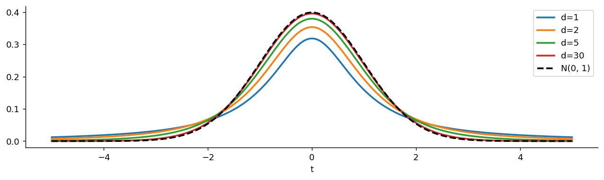
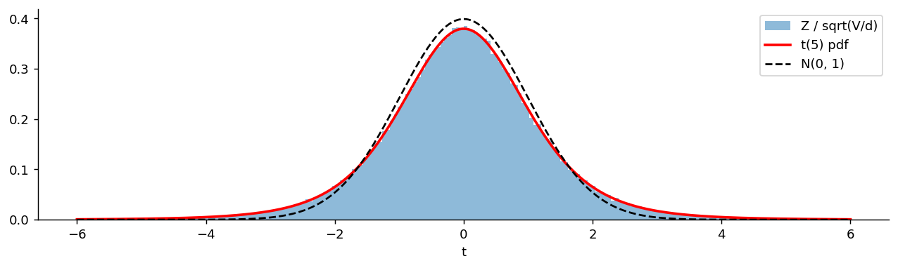

# t 분포

## 개요

**$t$ 분포**는 표준정규확률변수를, 그와 독립인 카이제곱확률변수로 만든 척도로 나눈 것의 분포다. 정규분포를 **자기 자신의 크기 추정값으로 나누면** 무엇이 나오는가에 대한 답이라고 할 수 있다.

4.2절의 사슬에서 네 번째 고리다.

$$
\text{Exp}(\lambda) \to N(\mu, \sigma^2) \to \chi^2_d \;\longrightarrow\; t_d \;\longrightarrow\; F_{d_1, d_2}
$$

앞 페이지에서 정규를 제곱해 더해 카이제곱을 만들었다. 이제 그 카이제곱으로 정규를 **나눈다.** 나누는 쪽도 확률변수이므로 분모 자체가 흔들리고, 그 흔들림이 분포의 꼬리를 두껍게 만든다. $t$ 분포가 정규분포보다 퍼져 있는 이유가 이것 하나로 설명된다.

이 페이지에서는 자유도를 $d$로 쓴다.

---

## 정의

<div class="defn" markdown>

### 정의 1. t 분포 { .dfn }

$Z \sim N(0, 1)$과 $V \sim \chi^2_d$가 **서로 독립**일 때

$$
T = \frac{Z}{\sqrt{V/d}}
$$

의 분포를 **자유도 $d$인 $t$ 분포**라 하고 $T \sim t_d$로 쓴다.

</div>

세 가지 조건이 모두 필요하다. 분자가 표준정규, 분모 안이 카이제곱, 그리고 **둘이 독립**이어야 한다. 독립성이 빠지면 전혀 다른 분포가 나온다. 정규모집단에서 표본평균과 표본분산이 독립이라는 사실(5장)이 결정적으로 쓰이는 지점이다.

### 왜 V를 d로 나누는가

$E[V] = d$이므로 $V/d$는 평균이 1이다. 즉 $\sqrt{V/d}$는 **평균적으로 1인 척도**이고, $T$는 대체로 $Z$ 근처에 놓인다. $d$로 나누지 않으면 자유도가 커질수록 분모가 함께 커져 $T$가 0으로 쪼그라든다. 나눠 주기 때문에 자유도를 키울 때 $T$가 $Z$로 수렴한다.

---

## 밀도

<div class="thmbox" markdown>

### 정리 1. t 분포의 밀도 { .thm }

$T \sim t_d$의 밀도는

$$
f(t; d) = \frac{\Gamma\!\left(\frac{d+1}{2}\right)}{\sqrt{d\pi}\;\Gamma\!\left(\frac d2\right)}\left(1 + \frac{t^2}{d}\right)^{-\frac{d+1}{2}}, \qquad t \in \mathbb{R}
$$

</div>

??? proof "증명"

    **1단계: $V$를 고정한다.** $V = v$가 주어지면 $T = Z/\sqrt{v/d}$는 상수를 곱한 정규확률변수이므로

    $$
    T \mid V = v \;\sim\; N\!\left(0,\ \frac dv\right)
    $$

    이다. 여기서 독립성이 쓰였다. $Z$의 분포가 $V$의 값에 영향을 받지 않아야 이 조건부분포가 성립한다.

    **2단계: $V$에 대해 적분한다.** 조건부밀도와 $V$의 밀도를 곱해 적분한다.

    $$
    f_T(t) = \int_0^\infty \underbrace{\sqrt{\frac{v}{2\pi d}}\,e^{-\frac{t^2 v}{2d}}}_{N(0,\, d/v)\text{의 밀도}}\cdot\underbrace{\frac{v^{d/2 - 1}e^{-v/2}}{2^{d/2}\Gamma(d/2)}}_{\chi^2_d\text{의 밀도}}\,dv
    $$

    상수를 밖으로 빼내고 $v$의 지수를 모으면

    $$
    f_T(t) = \frac{1}{\sqrt{2\pi d}\;2^{d/2}\Gamma(d/2)}\int_0^\infty v^{\frac{d+1}{2} - 1}\exp\!\left[-\frac v2\left(1 + \frac{t^2}{d}\right)\right]dv
    $$

    **3단계: 감마적분.** $\int_0^\infty v^{a-1}e^{-bv}dv = \Gamma(a)/b^a$를 $a = \frac{d+1}{2}$, $b = \frac12\left(1 + \frac{t^2}{d}\right)$에 적용하면 적분값은

    $$
    \Gamma\!\left(\frac{d+1}{2}\right)\left[\frac{2}{1 + t^2/d}\right]^{\frac{d+1}{2}}
    $$

    이다. 대입하고 2의 거듭제곱을 정리하면 $2^{(d+1)/2}/2^{d/2} = \sqrt2$이므로

    $$
    f_T(t) = \frac{\sqrt2\,\Gamma\!\left(\frac{d+1}{2}\right)}{\sqrt{2\pi d}\,\Gamma(d/2)}\left(1 + \frac{t^2}{d}\right)^{-\frac{d+1}{2}} = \frac{\Gamma\!\left(\frac{d+1}{2}\right)}{\sqrt{d\pi}\,\Gamma(d/2)}\left(1 + \frac{t^2}{d}\right)^{-\frac{d+1}{2}}
    $$

    이다. $\square$

### 밀도를 읽는 법

정규밀도와 나란히 놓으면 차이가 한눈에 보인다.

$$
\varphi(t) = \frac{1}{\sqrt{2\pi}}\,e^{-t^2/2}, \qquad f(t; d) = c_d\left(1 + \frac{t^2}{d}\right)^{-\frac{d+1}{2}}
$$

정규밀도는 $t^2$에 대해 **지수적으로** 떨어지고, $t$ 밀도는 **다항식의 거듭제곱**으로 떨어진다. $|t|$가 크면

$$
f(t; d) \approx c_d\, d^{\frac{d+1}{2}}\,|t|^{-(d+1)}
$$

로 멱함수 꼬리를 갖는다. 지수함수가 멱함수보다 훨씬 빨리 0에 가까워지므로, 멀리 나갈수록 $t$ 쪽 꼬리가 압도적으로 두껍다. 이 한 줄이 $t$ 분포의 모든 특이한 성질(적률이 유한개만 존재한다, MGF가 없다, 이상점이 자주 나온다)의 뿌리다.

---

## 성질

| 성질 | 조건 | 값 |
|---|---|---|
| 지지집합 | — | $(-\infty, \infty)$ |
| 대칭성 | — | 0에 대해 대칭 |
| 최빈값 | — | $0$ |
| 평균 | $d > 1$ | $0$ |
| 평균 | $d \le 1$ | 존재하지 않음 |
| 분산 | $d > 2$ | $\dfrac{d}{d-2}$ |
| 분산 | $1 < d \le 2$ | $\infty$ |
| 적률 $E[\lvert T\rvert^k]$ | $k < d$ | 유한 |
| MGF | — | **존재하지 않음** |

<div class="thmbox" markdown>

### 정리 2. t 분포의 분산 { .thm }

$T \sim t_d$이고 $d > 2$이면

$$
\text{Var}(T) = \frac{d}{d-2}
$$

이다. $1 < d \le 2$이면 분산이 무한대이고, $d \le 1$이면 평균조차 존재하지 않는다.

</div>

??? proof "증명"

    정의와 독립성을 쓰면 계산이 짧다.

    $$
    \text{Var}(T) = E[T^2] = E\!\left[\frac{Z^2}{V/d}\right] = d\,E[Z^2]\,E\!\left[\frac1V\right] = d\,E\!\left[\frac1V\right]
    $$

    두 번째 등호에서 독립성 덕분에 기댓값이 쪼개졌다. 이제 $V \sim \chi^2_d$의 역수의 기댓값을 구한다.

    $$
    E\!\left[\frac1V\right] = \frac{1}{2^{d/2}\Gamma(d/2)}\int_0^\infty v^{\frac d2 - 2}e^{-v/2}dv = \frac{2^{\frac d2 - 1}\Gamma\!\left(\frac d2 - 1\right)}{2^{d/2}\Gamma\!\left(\frac d2\right)} = \frac{1}{d - 2}
    $$

    마지막 등호는 $\Gamma(a) = (a-1)\Gamma(a-1)$을 $a = d/2$에 적용한 것이다. 따라서

    $$
    \text{Var}(T) = \frac{d}{d-2}, \qquad d > 2
    $$

    $\square$

    $d \le 2$이면 위 적분이 발산한다. **분모가 0에 가까워질 수 있다는 것**이 원인이다. $V$가 아주 작은 값을 가질 확률이 충분히 크면 $1/V$의 기댓값이 무한대가 된다. 자유도가 작을수록 분모의 추정이 불안정하다는 사실이 여기에 그대로 반영되어 있다.

### 위치와 척도를 붙인 판

지금까지 다룬 $T \sim t_d$는 위치 0, 척도 1인 표준형이다. 실무에서는 여기에 위치 $\mu$와 척도 $\sigma$를 붙여 $\mu + \sigma T$를 쓰며, 그 밀도는

$$
f(x) = \frac{\Gamma\!\left(\frac{d+1}{2}\right)}{\sigma\sqrt{d\pi}\;\Gamma\!\left(\frac d2\right)}\left(1 + \frac1d\left(\frac{x-\mu}{\sigma}\right)^2\right)^{-\frac{d+1}{2}}
$$

이다. 적률은 $d > 1$이면 평균 $\mu$, $d > 2$이면 분산 $\frac{d}{d-2}\sigma^2$이다.

**주의할 점은 $\sigma$가 표준편차가 아니라는 것이다.** 표준편차는 $\sigma\sqrt{d/(d-2)}$로 언제나 $\sigma$보다 크다. SciPy의 `stats.t(df, loc, scale)`에서 `scale`도 이 $\sigma$를 뜻하므로, 표준편차를 넣으면 분포가 필요 이상으로 퍼진다. 꼬리가 두꺼운 잡음을 모형화할 때 흔히 저지르는 실수다.

### 분산이 항상 1보다 크다

$$
\frac{d}{d-2} = 1 + \frac{2}{d-2} > 1
$$

$t$ 분포는 표준정규보다 **언제나 퍼져 있고**, 자유도가 커지면 그 초과분 $2/(d-2)$가 0으로 줄어든다. $d = 10$이면 분산이 1.25, $d = 30$이면 1.07, $d = 100$이면 1.02다.

### MGF가 없다

$E[e^{sT}] = \int e^{st}f(t;d)\,dt$에서 피적분함수가 $|t| \to \infty$일 때 $e^{st}|t|^{-(d+1)}$처럼 행동하므로, $s \ne 0$이면 적분이 발산한다. 즉 **0이 아닌 어떤 $s$에서도 MGF가 존재하지 않는다.**

앞 페이지에서 카이제곱의 성질을 MGF로 손쉽게 유도했던 것과 대조적이다. $t$ 분포에서는 그 도구를 쓸 수 없고, 정의로 돌아가 조건부 논법이나 직접 적분을 해야 한다. 꼬리가 두꺼운 분포를 다룰 때 흔히 겪는 일이다.

---

## 두 끝: 코시분포와 정규분포

### 자유도 1: 코시분포

$\Gamma(1) = 1$, $\Gamma(1/2) = \sqrt\pi$를 넣으면

$$
f(t; 1) = \frac{1}{\sqrt\pi \cdot \sqrt\pi}\,(1 + t^2)^{-1} = \frac{1}{\pi(1 + t^2)}
$$

로 **코시분포**가 된다. 평균조차 존재하지 않는 분포다. 정의로 보면 $t_1 = Z_1/|Z_2|$로 독립인 두 정규의 비이며, 분모가 0 근처를 자주 지나가므로 엄청나게 큰 값이 심심찮게 나온다.

코시분포에서는 큰수의 법칙이 통하지 않는다. 표본평균이 표본크기와 무관하게 **다시 코시분포**를 따르기 때문에, 자료를 아무리 많이 모아도 평균이 한 점으로 수렴하지 않는다.

### 자유도가 무한대로 갈 때: 표준정규분포

<div class="thmbox" markdown>

### 정리 3. 정규분포로의 수렴 { .thm }

모든 $t$에 대해

$$
\lim_{d \to \infty} f(t; d) = \frac{1}{\sqrt{2\pi}}\,e^{-t^2/2}
$$

</div>

??? proof "증명"

    밀도를 상수 부분과 $t$에 의존하는 부분으로 나눈다.

    **$t$에 의존하는 부분.** 로그를 취하면

    $$
    -\frac{d+1}{2}\ln\!\left(1 + \frac{t^2}{d}\right) = -\frac{d+1}{2}\left(\frac{t^2}{d} - \frac{t^4}{2d^2} + \cdots\right) \longrightarrow -\frac{t^2}{2}
    $$

    이므로 그 부분은 $e^{-t^2/2}$로 수렴한다. 익숙한 극한 $(1 + x/d)^d \to e^x$의 변형이다.

    **상수 부분.** 스털링 근사 $\Gamma(a + 1/2)/\Gamma(a) \sim \sqrt a$를 $a = d/2$에 쓰면

    $$
    \frac{\Gamma\!\left(\frac{d+1}{2}\right)}{\sqrt{d\pi}\,\Gamma\!\left(\frac d2\right)} \sim \frac{\sqrt{d/2}}{\sqrt{d\pi}} = \frac{1}{\sqrt{2\pi}}
    $$

    두 부분을 곱하면 표준정규밀도다. $\square$

    정의 쪽에서 보면 더 직관적이다. 큰수의 법칙에 의해 $V/d \to 1$이므로 분모가 상수 1로 굳어지고, 남는 것은 $Z$뿐이다.

### 언제 정규분포로 갈음해도 되는가

| $d$ | 97.5백분위점 | 정규분포 대비 |
|---|---|---|
| 5 | 2.571 | 31% 크다 |
| 10 | 2.228 | 14% 크다 |
| 30 | 2.042 | 4.2% 크다 |
| 100 | 1.984 | 1.2% 크다 |
| $\infty$ | 1.960 | — |

흔히 말하는 "$n \ge 30$이면 정규분포로 봐도 된다"는 규칙은 이 표의 넷째 줄에서 나온다. 다만 이것은 **중앙 부근의 신뢰구간**에 대한 이야기다. 꼬리로 갈수록 상대오차가 커지므로, 99.9백분위점 같은 극단 분위수를 다룰 때는 자유도 30으로도 충분하지 않다.

---

## 문제

<div class="probox" markdown>

**문제:** <span class="diff easy" title="쉬움"></span> $T \sim t_4$일 때 $P(T^2 > 3)$을 구하려 한다. $T^2$은 어떤 분포를 따르는가?

</div>

??? success "풀이"

    정의에서 $T = Z/\sqrt{V/4}$이므로

    $$
    T^2 = \frac{Z^2}{V/4} = \frac{Z^2/1}{V/4}
    $$

    이다. 분자 $Z^2 \sim \chi^2_1$이고 분모의 $V \sim \chi^2_4$이며 둘이 독립이다. 각각을 자기 자유도로 나눈 비이므로, 다음 페이지에서 볼 정의에 따라

    $$
    T^2 \sim F_{1, 4}
    $$

    이다. 일반적으로 $t_d^2 = F_{1, d}$다.

    수치로는 `stats.f(1, 4).sf(3) = 0.1583`이고, 직접 계산해도 $P(|T| > \sqrt3) = 2 \times 0.0791 = 0.1583$으로 같다. **양측 $t$ 검정과 분자 자유도 1인 $F$ 검정은 같은 검정**이라는 사실이 여기서 나온다. 카이제곱 페이지에서 본 "양측 $z$ 검정 = 자유도 1인 카이제곱검정"과 똑같은 구조다.

---

## Python: 밀도, 표본추출, 꼬리

### 자유도에 따른 밀도

<div class="exbox" markdown>

**보기 1.** <span class="diff easy" title="쉬움"></span> 정규밀도로 다가가는 속도. $t_d$의 밀도를 $d = 1, 2, 5, 30$에서 표준정규밀도와 겹쳐 그린다.

**(1)** 비 $f(t;d)/\varphi(t)$를 $1/d$의 멱으로 전개해 첫 보정항을 구하고, 그 항의 부호가 바뀌는 자리를 구하시오.

**(2)** 그림에서 $d = 30$인 곡선은 정규밀도에 붙어 보이는데 $d = 1, 2$는 또렷이 다르다. 그 차이의 크기를 (1)의 보정항으로 예측하고 수치와 맞춰 보시오. 봉우리 높이 $f(0;d)$가 어디로 가는지도 확인하시오.

</div>

??? success "풀이"

    **(1) 해석적으로.** 비의 로그를 잡는다. $f(t;d) = c_d\,(1+t^2/d)^{-(d+1)/2}$이고 $\sqrt{2\pi}\,c_d$를 $g(d)$라 쓰면

    $$
    g(d) = \sqrt{\frac2d}\,\frac{\Gamma\!\left(\frac{d+1}{2}\right)}{\Gamma\!\left(\frac d2\right)},
    \qquad
    R(t;d) = \log\frac{f(t;d)}{\varphi(t)}
    = \log g(d) - \frac{d+1}{2}\log\!\left(1 + \frac{t^2}{d}\right) + \frac{t^2}{2}
    $$

    이다. 두 덩어리를 각각 $1/d$로 전개한다.

    **상수 덩어리.** 스털링 전개 $\log\Gamma(z) = \left(z-\frac12\right)\log z - z + \frac12\log 2\pi + \frac{1}{12z} + O(z^{-3})$을 $z = x$와 $z = x + \frac12$에 쓰고 빼면, $x\log\left(x+\frac12\right) = x\log x + \frac12 - \frac{1}{8x} + \frac{1}{24x^2} + O(x^{-3})$과 $\frac{1}{12(x+1/2)} - \frac{1}{12x} = -\frac{1}{24x^2} + O(x^{-3})$에서 $x^{-2}$ 항이 서로 지워져

    $$
    \log\frac{\Gamma\!\left(x+\frac12\right)}{\Gamma(x)} = \frac12\log x - \frac{1}{8x} + O(x^{-3})
    $$

    가 남는다. $x = d/2$를 넣으면 $\frac12\log\frac d2$가 앞의 $\frac12\log\frac2d$와 상쇄되어

    $$
    \log g(d) = -\frac{1}{4d} + O(d^{-3}), \qquad \text{곧} \qquad g(d) = e^{-1/(4d)}\bigl(1 + O(d^{-3})\bigr)
    $$

    이다. 본문 정리 3의 증명은 $g(d) \to 1$만 썼는데, 한 항 더 가져온 것이 여기서 쓰인다.

    **$t$에 의존하는 덩어리.** $\log(1+u) = u - \frac{u^2}{2} + O(u^3)$을 $u = t^2/d$에 쓰면

    $$
    -\frac{d+1}{2}\log\!\left(1+\frac{t^2}{d}\right)
    = -\frac{d+1}{2}\left(\frac{t^2}{d} - \frac{t^4}{2d^2} + O(d^{-3})\right)
    = -\frac{t^2}{2} - \frac{t^2}{2d} + \frac{t^4}{4d} + O(d^{-2})
    $$

    이다. 둘을 더하면 $-t^2/2$가 $+t^2/2$와 지워지고 $1/d$ 항만 남는다.

    $$
    R(t;d) = \frac{1}{d}\cdot\frac{t^4 - 2t^2 - 1}{4} + O(d^{-2})
    \quad\Longrightarrow\quad
    \frac{f(t;d)}{\varphi(t)} = 1 + \frac{t^4 - 2t^2 - 1}{4d} + O(d^{-2})
    $$

    **보정항이 $1/d$에 비례한다**는 것이 첫째 결론이다. 자유도를 두 배로 하면 어긋남이 반으로 줄어든다.

    부호는 $t^4 - 2t^2 - 1$이 정한다. $u = t^2$로 두면 $u^2 - 2u - 1 = 0$에서 $u = 1 \pm \sqrt2$이고 $u \ge 0$인 근은 하나뿐이므로

    $$
    |t| = \sqrt{1+\sqrt2} = 1.5538
    $$

    에서 부호가 바뀐다. 안쪽에서는 음수여서 $t$ 밀도가 정규보다 **낮고**, 바깥에서는 양수여서 **높다.** 큰 $d$에서 두 곡선이 만나는 자리가 이 값으로 수렴하며, 두 밀도가 모두 대칭이므로 교차는 $\pm1.5538$ 근처에서 **두 번**이다(대칭인 두 밀도가 $0$에서 다르면 교차 횟수는 짝수여야 한다).

    봉우리에서는 $t = 0$을 넣어 $f(0;d) = \varphi(0)\,g(d)$를 얻는다. $g(d) = e^{-1/(4d)} < 1$이므로 봉우리는 언제나 정규보다 **낮고**, $1 - \frac{1}{4d}$의 속도로 $\varphi(0) = 0.3989$까지 올라간다.

    **(2) 수치적으로.** 먼저 그림이다.

    ```python
    import matplotlib.pyplot as plt
    import numpy as np
    from scipy import stats

    x = np.linspace(-5, 5, 400)

    fig, ax = plt.subplots(figsize=(12, 3))
    # 자유도가 커질수록 정규분포에 가까워진다.
    #   d=1  : 코시분포. 평균조차 없다.
    #   d=2  : 평균은 있지만 분산이 무한대다.
    #   d=5  : 분산 5/3 = 1.67
    #   d=30 : 분산 30/28 = 1.07. 검은 점선과 거의 겹친다.
    # 가운데가 정규분포보다 **낮다**는 점에 주의하라. 전체 넓이가 1로 같으므로
    # 꼬리로 나간 질량만큼 봉우리가 내려앉는다.
    for d in [1, 2, 5, 30]:
        ax.plot(x, stats.t(d).pdf(x), lw=2, label=f'd={d}')
    ax.plot(x, stats.norm.pdf(x), 'k--', lw=2, label='N(0, 1)')
    ax.set_xlabel('t')
    ax.spines[['top', 'right']].set_visible(False)
    ax.legend()
    plt.show()
    ```

    

    이제 (1)이 유도한 세 가지를 하나씩 확인한다. 봉우리 높이의 비가 $g(d)$와 같은가, $d\,(f/\varphi - 1)$이 $(t^4-2t^2-1)/4$로 가는가, 그리고 눈에 보이는 밀도차가 $1/d$에 비례하는가.

    ```python
    import numpy as np
    from scipy import optimize, special, stats

    # (1) 봉우리 높이의 비 g(d) = f(0;d)/phi(0) 와 그 근사 exp(-1/(4d)).
    # Gamma 는 d 가 크면 넘치므로 로그로 계산한다.
    g = lambda d: np.exp(0.5 * np.log(2 / d) + special.gammaln((d + 1) / 2) - special.gammaln(d / 2))

    print(f"{'d':>6}{'f(0;d)/phi(0)':>16}{'g(d)':>14}{'exp(-1/(4d))':>14}")
    for d in [1, 2, 5, 30, 100, 1000]:
        print(f"{d:>6}{stats.t(d).pdf(0) / stats.norm.pdf(0):>16.9f}{g(d):>14.9f}{np.exp(-1 / (4 * d)):>14.9f}")
    print("g 가 d 에 대해 단조증가:", all(g(d) < g(d + 1) for d in range(1, 5001)))

    # 보정항. d*(f/phi - 1) 이 (t^4 - 2t^2 - 1)/4 로 가는지 본다.
    print(f"\n{'t':>8}{'(t^4-2t^2-1)/4':>17}{'d=30':>11}{'d=300':>11}{'d=3000':>11}")
    for t in [0.0, 1.0, np.sqrt(1 + np.sqrt(2)), 2.0, 3.0]:
        row = f"{t:>8.4f}{(t**4 - 2 * t**2 - 1) / 4:>17.5f}"
        for d in [30, 300, 3000]:
            row += f"{d * (stats.t(d).pdf(t) / stats.norm.pdf(t) - 1):>11.5f}"
        print(row)

    # 보정항의 영점이 두 곡선이 실제로 만나는 자리인가.
    print(f"\n보정항의 영점  sqrt(1+sqrt2) = {np.sqrt(1 + np.sqrt(2)):.6f}")

    # (2) 눈에 보이는 것은 비가 아니라 밀도의 차다. 그림 구간에서 그 최댓값을 재고
    #     1차 보정이 주는 예측 max |phi(t)(t^4-2t^2-1)|/(4d) 와 견준다.
    t = np.linspace(-5, 5, 20_001)
    head = np.abs(stats.norm.pdf(t) * (t**4 - 2 * t**2 - 1)).max() / 4

    # 비의 로그를 쓴다. 꼬리에서 정규밀도가 0 으로 언더플로되어도 안전하다.
    logratio = lambda x, d: stats.t(d).logpdf(x) - stats.norm.logpdf(x)
    print(f"\n{'d':>6}{'실제 교차점 x*':>16}{'최대 밀도차':>14}{'1차 예측':>12}")
    for d in [1, 2, 5, 30, 100, 1000]:
        gap = np.abs(stats.t(d).pdf(t) - stats.norm.pdf(t)).max()
        print(f"{d:>6}{optimize.brentq(logratio, 1.05, 40, args=(d,)):>16.6f}"
              f"{gap:>14.6f}{head / d:>12.6f}")
    ```

    출력:

    ```
         d   f(0;d)/phi(0)          g(d)  exp(-1/(4d))
         1     0.797884561   0.797884561   0.778800783
         2     0.886226925   0.886226925   0.882496903
         5     0.951532862   0.951532862   0.951229425
        30     0.991702821   0.991702821   0.991701293
       100     0.997503164   0.997503164   0.997503122
      1000     0.999750031   0.999750031   0.999750031
    g 가 d 에 대해 단조증가: True

           t   (t^4-2t^2-1)/4       d=30      d=300     d=3000
      0.0000         -0.25000   -0.24892   -0.24990   -0.24999
      1.0000         -0.50000   -0.49312   -0.49931   -0.49993
      1.5538          0.00000   -0.02757   -0.00294   -0.00030
      2.0000          1.75000    1.58988    1.73300    1.74829
      3.0000         15.50000   15.88873   15.56018   15.50626

    보정항의 영점  sqrt(1+sqrt2) = 1.553774

         d       실제 교차점 x*        최대 밀도차       1차 예측
         1        1.851229      0.099265    0.136172
         2        1.725110      0.057797    0.068086
         5        1.629259      0.025493    0.027234
        30        1.567091      0.004489    0.004539
       100        1.557801      0.001357    0.001362
      1000        1.554178      0.000136    0.000136
    ```

    **셋 모두 유도와 맞는다.** 첫째 표에서 $f(0;d)/\varphi(0)$이 $g(d)$와 아홉째 자리까지 같고, $e^{-1/(4d)}$가 $d = 5$에서 벌써 넷째 자리까지 맞는다($0.951533$ 대 $0.951229$). 봉우리 높이가 $d$에 대해 단조증가한다는 것도 $d \le 5000$에서 확인되었다.

    둘째 표에서 $d\,(f/\varphi - 1)$이 $d$를 키우면 $(t^4-2t^2-1)/4$로 수렴한다. $t = 3$에서 $15.889 \to 15.560 \to 15.506$으로 목표 $15.5$에 다가가고, $t = 1.5538$에서는 $-0.0276 \to -0.0029 \to -0.0003$으로 0에 붙는다. 보정항의 영점이 실제 교차점의 **극한**이라는 뜻이고, 셋째 표가 그것을 직접 보여 준다. 교차점 $x^*(d)$가 $1.8512 \to 1.7251 \to 1.6293 \to 1.5671 \to 1.5578 \to 1.5542$로 $\sqrt{1+\sqrt2} = 1.5538$까지 내려온다. 유한한 $d$에서는 교차점이 극한보다 바깥에 있다.

    **(2)의 물음에 답하면 이렇다.** 눈이 보는 것은 비가 아니라 밀도의 차이고, 그 최댓값은 $1/d$에 반비례한다. $d = 30$이면 $0.00449$로 봉우리 높이 $0.3989$의 **1.1%**이므로 선 굵기에 묻힌다. $d = 1$이면 $0.0993$으로 **25%**나 되어 못 볼 수가 없다. 1차 예측 $\max_t \varphi(t)\lvert t^4-2t^2-1\rvert/(4d)$는 $d = 30$에서 $0.00454$로 실제 $0.00449$와 1%밖에 다르지 않고, $d = 5$에서도 $0.0272$ 대 $0.0255$로 쓸 만하다. $d = 1$에서는 $0.136$ 대 $0.099$로 37% 어긋나는데, $O(d^{-2})$로 버린 항이 $d = 1$에서는 작지 않다는 당연한 사정이다.

    **"꼬리가 두껍다"가 "어디서나 높다"는 뜻이 아니라는 점**을 보정항이 또렷이 말해 준다. $t^4 - 2t^2 - 1$은 $|t| < 1.5538$에서 음수다. 전체 넓이가 양쪽 다 1이니 꼬리로 보낸 질량만큼 가운데가 내려앉아야 하고, 그 내려앉은 구간이 하필 눈에 가장 잘 띄는 봉우리 근처다. 그림에서 $d = 1$ 곡선의 봉우리가 점선보다 뚜렷이 낮은 것이 그 모습이다.

### 정의대로 만들어 보기

<div class="exbox" markdown>

**보기 2.** <span class="diff easy" title="쉬움"></span> 정의대로 만든 표본의 꼬리. $Z \sim N(0,1)$과 $V \sim \chi^2_5$를 따로 20만 개 뽑아 $T = Z/\sqrt{V/5}$를 만들고, $t_5$ 밀도와 겹쳐 본다.

**(1)** $T \sim t_5$의 꼬리확률 $P(T > a)$를 초등함수만으로 닫힌 꼴로 유도하고, $P(\lvert T\rvert > 3)$이 표준정규의 몇 배인지 구하시오.

**(2)** 20만 개를 뽑으면 $\max_i \lvert T_i\rvert$가 얼마쯤 나올지 (1)의 꼬리식으로 예측하고, 모의실험 값과 맞는지 보시오. 같은 개수를 표준정규에서 뽑았다면 어땠겠는가.

</div>

??? success "풀이"

    **(1) 해석적으로.** $d = 5$는 밀도가 유리함수여서 적분이 끝까지 간다. $\Gamma(3) = 2$와 $\Gamma(5/2) = \frac32\cdot\frac12\sqrt\pi = \frac{3\sqrt\pi}{4}$를 정리 1에 넣으면

    $$
    c_5 = \frac{\Gamma(3)}{\sqrt{5\pi}\,\Gamma\!\left(\frac52\right)}
    = \frac{2}{\sqrt{5\pi}\cdot\frac{3\sqrt\pi}{4}}
    = \frac{8}{3\pi\sqrt5},
    \qquad
    f(t;5) = c_5\left(1+\frac{t^2}{5}\right)^{-3}
    $$

    이다. $t = \sqrt5\,\tan\theta$로 바꾸면 $dt = \sqrt5\sec^2\theta\,d\theta$이고 $1 + t^2/5 = \sec^2\theta$이므로 피적분함수가 $\cos^6\theta\cdot\sqrt5\sec^2\theta = \sqrt5\cos^4\theta$로 줄어든다.

    $$
    P(T > a) = c_5\sqrt5\int_{\theta_a}^{\pi/2}\cos^4\theta\,d\theta,
    \qquad \theta_a = \arctan\frac{a}{\sqrt5}
    $$

    배각공식을 두 번 쓰면 $\cos^4\theta = \frac38 + \frac{\cos2\theta}{2} + \frac{\cos4\theta}{8}$이고, 적분하면

    $$
    \int\cos^4\theta\,d\theta = \frac{3\theta}{8} + \frac{\sin 2\theta}{4} + \frac{\sin 4\theta}{32}
    $$

    이다. 위끝 $\theta = \pi/2$에서 두 사인이 모두 0이라 $\frac{3\pi}{16}$만 남고, $c_5\sqrt5 = \frac{8}{3\pi}$이므로

    $$
    \boxed{\;P(T > a) = \frac12 - \frac{\theta_a}{\pi} - \frac{2\sin 2\theta_a}{3\pi} - \frac{\sin 4\theta_a}{12\pi}\;}
    $$

    를 얻는다. $a = 0$에서 $\theta_0 = 0$이라 값이 $\frac12$이 되는 것이 첫 점검이다. $a = 3$이면 $\theta_3 = \arctan(3/\sqrt5) = 0.930274$이고, 대칭이므로

    $$
    P(\lvert T\rvert > 3) = 2\,P(T>3) = 0.0300993,
    \qquad
    P(\lvert Z\rvert > 3) = 0.0026998
    $$

    이다. **비는 $11.15$배다.**

    **꼬리의 모양.** 같은 적분에서 멱함수 꼬리도 바로 읽힌다. 큰 $s$에서 $(1+s^2/d)^{-(d+1)/2} \approx d^{(d+1)/2}s^{-(d+1)}$이고 $\int_t^\infty s^{-(d+1)}ds = t^{-d}/d$이므로

    $$
    P(T > t) \;\approx\; \frac{c_d\,d^{(d+1)/2}}{d}\,t^{-d}
    \;\overset{d=5}{=}\; 25\,c_5\,t^{-5} = \frac{200}{3\pi\sqrt5}\,t^{-5} = 9.4902\,t^{-5}
    $$

    다. 이것이 **(2)**의 예측에 쓰인다. $n$개를 뽑은 $\max_i\lvert T_i\rvert$를 $M_n$이라 하면 독립이므로

    $$
    P(M_n \le m) = \bigl[1 - 2\,P(T>m)\bigr]^n
    $$

    이고, 이것을 $\frac12$로 놓으면 $n\log\bigl[1-2P(T>m)\bigr] = -\log 2$, 곧 $P(T>m) \approx \frac{\log 2}{2n}$이다. 멱함수 꼬리 $A t^{-5}$를 넣으면

    $$
    M_n \text{의 중앙값} \approx \left(\frac{2An}{\log 2}\right)^{1/5}
    = \left(\frac{2 \times 9.4902 \times 200{,}000}{0.6931}\right)^{1/5} = 22.3
    $$

    을 얻는다. **지수가 $1/5$이라는 것**이 요점이다. 표본을 32배로 늘려야 최댓값이 두 배가 된다. 정규분포라면 꼬리가 $e^{-m^2/2}$이므로 같은 식이 $m \approx \sqrt{2\log(2n/\log 2)} \approx 4.6$을 주고, 표본을 늘려도 $\sqrt{\log n}$으로만 자란다.

    **(2) 수치적으로.** 먼저 정의를 그대로 실행해 표본을 만든다.

    ```python
    import matplotlib.pyplot as plt
    import numpy as np
    from scipy import stats

    np.random.seed(42)
    d = 5
    # 정의를 그대로 실행한다. 분자와 분모를 **따로** 뽑아야 독립이 보장된다.
    z = stats.norm.rvs(size=200_000)
    v = stats.chi2(d).rvs(size=200_000)
    t = z / np.sqrt(v / d)

    x = np.linspace(-6, 6, 400)
    fig, ax = plt.subplots(figsize=(12, 3))
    # 구간을 [-6, 6]으로 고정한다. 꼬리가 두꺼워 |t| > 50 인 값도 나오는데,
    # 자동 구간에 맡기면 그 이상점 때문에 가운데가 한두 칸으로 뭉개진다.
    ax.hist(t, bins=200, range=(-6, 6), density=True, alpha=0.5, label='Z / sqrt(V/d)')
    ax.plot(x, stats.t(d).pdf(x), 'r-', lw=2, label='t(5) pdf')
    ax.plot(x, stats.norm.pdf(x), 'k--', lw=1.5, label='N(0, 1)')
    ax.set_xlabel('t')
    ax.spines[['top', 'right']].set_visible(False)
    ax.legend()
    plt.show()

    print(f"|t| > 3  : sample {np.mean(np.abs(t) > 3):.4f},  normal {2*stats.norm.sf(3):.4f}")
    print(f"max |t|  : {np.abs(t).max():.1f}")
    ```

    출력:

    ```
    |t| > 3  : sample 0.0303,  normal 0.0027
    max |t|  : 20.8
    ```

    

    히스토그램이 빨간 $t_5$ 밀도를 따라가고 검은 점선과는 어긋난다. 정의가 제 몫을 했다는 뜻이다. 이제 (1)에서 유도한 닫힌 꼴과 최댓값 예측을 확인한다.

    ```python
    import numpy as np
    from scipy import integrate, stats

    d, n = 5, 200_000
    c5 = 8 / (3 * np.pi * np.sqrt(5))
    print(f"c_5 = 8/(3 pi sqrt5) = {c5:.12f}    scipy f(0;5) = {stats.t(d).pdf(0):.12f}")


    def tail(a):
        """(1) 에서 유도한 P(T > a) 의 닫힌 꼴. 초등함수뿐이다."""
        th = np.arctan(a / np.sqrt(5))
        return 0.5 - th / np.pi - 2 * np.sin(2 * th) / (3 * np.pi) - np.sin(4 * th) / (12 * np.pi)


    print(f"\n{'a':>8}{'닫힌 꼴':>16}{'scipy.sf':>16}{'quad':>16}")
    for a in [0.0, 1.0, 2.570582, 3.0, 10.0]:
        q = integrate.quad(lambda t: stats.t(d).pdf(t), a, np.inf)[0]
        print(f"{a:>8.4f}{tail(a):>16.12f}{stats.t(d).sf(a):>16.12f}{q:>16.12f}")

    p_t, p_z = 2 * tail(3), 2 * stats.norm.sf(3)
    se = np.sqrt(p_t * (1 - p_t) / n)
    print(f"\nP(|T|>3) 닫힌 꼴 = {p_t:.8f}   P(|Z|>3) = {p_z:.8f}   배수 = {p_t / p_z:.4f}")
    print(f"모의값 0.0303 과의 차 = {0.0303 - p_t:+.6f}  (몬테카를로 표준오차 {se:.6f} 의 {(0.0303 - p_t) / se:+.2f} 배)")

    # 멱함수 꼬리. P(T>t) ~ A t^-d,  A = c_d d^((d+1)/2) / d
    A = c5 * d ** ((d + 1) / 2) / d
    print(f"\nP(T>t) ~ A t^-5,  A = c_5 d^((d+1)/2)/d = {A:.6f}")
    print(f"{'t':>6}{'근사 A t^-5':>16}{'정확 sf':>16}{'비':>8}")
    for t in [10, 20, 50]:
        print(f"{t:>6}{A * t ** -5.0:>16.6e}{stats.t(d).sf(t):>16.6e}{A * t ** -5.0 / stats.t(d).sf(t):>8.4f}")

    # max |T| 의 중앙값.  P(max <= m) = (1 - 2 sf(m))^n = 1/2  =>  sf(m) = ln2/(2n)
    m_app = (2 * A * n / np.log(2)) ** (1 / 5)
    m_exact = stats.t(d).isf(np.log(2) / (2 * n))
    m_norm = stats.norm.isf(np.log(2) / (2 * n))
    print(f"\nmax|T| 의 중앙값 예측:  멱함수식 {m_app:.2f},  정확한 분위수 {m_exact:.2f}")
    print(f"정규였다면            :  {m_norm:.2f}")

    mx = [np.abs(stats.t(d).rvs(size=n, random_state=np.random.default_rng(s))).max() for s in range(200)]
    mx = np.array(mx)
    print(f"씨앗 200개로 본 max|T|: 중앙값 {np.median(mx):.2f},  1~99% [{np.percentile(mx, 1):.1f}, {np.percentile(mx, 99):.1f}]")
    print(f"쪽의 20.8 은 그 분포의 {100 * (mx < 20.8).mean():.0f} 백분위다")
    ```

    출력:

    ```
    c_5 = 8/(3 pi sqrt5) = 0.379606689822    scipy f(0;5) = 0.379606689822

           a            닫힌 꼴        scipy.sf            quad
      0.0000  0.500000000000  0.500000000000  0.500000000000
      1.0000  0.181608733825  0.181608733825  0.181608733825
      2.5706  0.024999995014  0.024999995014  0.024999995014
      3.0000  0.015049623949  0.015049623949  0.015049623949
     10.0000  0.000085473788  0.000085473788  0.000085473788

    P(|T|>3) 닫힌 꼴 = 0.03009925   P(|Z|>3) = 0.00269980   배수 = 11.1487
    모의값 0.0303 과의 차 = +0.000201  (몬테카를로 표준오차 0.000382 의 +0.53 배)

    P(T>t) ~ A t^-5,  A = c_5 d^((d+1)/2)/d = 9.490167
         t       근사 A t^-5           정확 sf       비
        10    9.490167e-05    8.547379e-05  1.1103
        20    2.965677e-06    2.887758e-06  1.0270
        50    3.036854e-08    3.023879e-08  1.0043

    max|T| 의 중앙값 예측:  멱함수식 22.27,  정확한 분위수 22.17
    정규였다면            :  4.64
    씨앗 200개로 본 max|T|: 중앙값 21.87,  1~99% [15.6, 47.9]
    쪽의 20.8 은 그 분포의 36 백분위다
    ```

    **닫힌 꼴이 맞는다.** $c_5 = 8/(3\pi\sqrt5)$가 SciPy의 $f(0;5)$와 열두째 자리까지 같고, 꼬리확률의 닫힌 꼴이 `sf`와 `quad` 양쪽과 열두째 자리까지 일치한다. $a = 2.5706$에서 값이 $0.025$로 나오는 것은 그 수가 바로 $97.5$백분위점이기 때문이다.

    **모의값과 참값의 차이는 몬테카를로 오차다.** $P(\lvert T\rvert>3)$의 참값은 $0.0300993$이고 모의값은 $0.0303$인데, 20만 개의 표준오차가 $0.000382$이므로 차이는 $0.53$ 표준오차에 지나지 않는다. **정규분포 대비 $11.15$배**라는 것이 (1)의 답이고, 쪽의 "11배"가 가리키던 수가 이것이다.

    **최댓값 예측도 맞는다.** 멱함수식이 $22.27$, 정확한 분위수가 $22.17$로 거의 같다. 멱함수 근사가 이렇게 잘 듣는 것은 $t = 20$에서 이미 참값의 $1.027$배까지 다가와 있기 때문이다($t = 10$에서는 $1.11$배로 아직 10% 넘친다).

    관측된 $20.8$은 예측 중앙값보다 조금 작은데, 씨앗 200개로 재어 보면 $20.8$은 최댓값 분포의 **36백분위**다. 어긋난 것이 아니라 중앙값 근처에서 흔히 나오는 값이다. 다만 이 분포가 1~99% 구간이 $[15.6,\ 47.9]$로 **엄청나게 넓다**는 점이 중요하다. 멱함수 꼬리를 가진 표본의 최댓값은 그 자체로 멱함수 꼬리를 갖기 때문에, 한 번 뽑아 본 최댓값으로는 아무것도 확정할 수 없다.

    정규분포와의 대비가 여기서 가장 또렷하다. 같은 20만 개로 표준정규의 최댓값은 $4.64$ 언저리에 머물고 변동도 작다. **$t_5$에서는 20을 넘는 값이 예상 범위 안이지만, 정규에서는 20이 나오면 자료나 코드를 의심해야 한다.** 꼬리가 멱함수인지 지수인지가 극단값의 해석을 완전히 갈라놓는다.

### 분산과 분위수 확인

<div class="exbox" markdown>

**보기 3.** <span class="diff easy" title="쉬움"></span> 분산 $d/(d-2)$와 임계값이 내려가는 속도. 자유도 $3, 5, 10, 30, 100$에서 분산과 $97.5$백분위점을 나란히 표로 만든다.

**(1)** 보기 1에서 얻은 밀도의 $1/d$ 전개로부터 꼬리확률의 보정항을 적분해 구하고, 그것을 뒤집어 임계값 $t_{p,d}$의 전개를 유도하시오.

**(2)** 분산의 초과분 $2/(d-2)$와 임계값의 초과분을 견주시오. 두 초과분이 왜 같지 않은가. "$d \ge 30$이면 정규분포로 갈음한다"는 규칙은 어디서 나오는가.

</div>

??? success "풀이"

    **(1) 해석적으로.** 분산은 정리 2가 이미 주었다. $\operatorname{Var}(T) = d/(d-2) = 1 + \frac{2}{d-2}$이므로 **분산의 초과분은 $2/(d-2) \approx 2/d$**다. 임계값 쪽은 유도가 남아 있다.

    보기 1에서 얻은

    $$
    f(t;d) = \varphi(t)\left[1 + \frac{t^4 - 2t^2 - 1}{4d}\right] + O(d^{-2})
    $$

    를 $x$에서 $\infty$까지 적분한다. 보정항의 적분은 원시함수가 한눈에 보인다. $\varphi' = -t\varphi$이므로

    $$
    \frac{d}{dt}\Bigl[-(t^3+t)\,\varphi(t)\Bigr]
    = -(3t^2+1)\varphi + (t^3+t)\,t\varphi
    = (t^4 - 2t^2 - 1)\,\varphi(t)
    $$

    이고, $t \to \infty$에서 $(t^3+t)\varphi(t) \to 0$이므로

    $$
    \int_x^\infty (t^4-2t^2-1)\,\varphi(t)\,dt = (x^3+x)\,\varphi(x)
    $$

    이다. **$\bar\Phi$ 항이 하나도 남지 않는다**는 것이 이 보정항의 좋은 성질이다. 따라서 꼬리확률은

    $$
    \bar F_d(x) = \bar\Phi(x) + \frac{(x^3+x)\,\varphi(x)}{4d} + O(d^{-2}), \qquad x > 0
    $$

    이다. 보정항이 양수이므로 **$t$의 오른쪽 꼬리는 모든 $x>0$에서 정규보다 두껍다**는 사실이 한 줄로 나온다. 보기 1에서는 밀도가 $\lvert t\rvert < 1.5538$에서 오히려 낮았는데, 꼬리확률 수준에서는 그런 뒤집힘이 없다.

    이제 뒤집는다. $t_{p,d}$를 $\bar F_d(t_{p,d}) = 1-p$로 정의하고, 정규 쪽 분위수를 $z_p$($\bar\Phi(z_p) = 1-p$)라 하자. $t_{p,d} = z_p + \delta$로 두면 $\delta = O(1/d)$이므로 $\bar\Phi$를 $z_p$에서 1차까지 펴고 보정항은 $z_p$에서 평가해도 된다.

    $$
    1-p = \bar\Phi(z_p) - \varphi(z_p)\,\delta + \frac{(z_p^3+z_p)\,\varphi(z_p)}{4d} + O(d^{-2})
    $$

    왼쪽과 $\bar\Phi(z_p)$가 같으므로 둘이 지워지고, 남은 식을 $\varphi(z_p) \ne 0$으로 나누면

    $$
    \boxed{\;t_{p,d} = z_p + \frac{z_p^3 + z_p}{4d} + O(d^{-2})\;}
    $$

    를 얻는다. $p = 0.975$에서 $z_p = 1.959964$이므로 계수가 $(z_p^3+z_p)/4 = 2.372271$이고

    $$
    t_{0.975,\,d} \approx 1.95996 + \frac{2.37227}{d}
    $$

    다. 상대초과분으로 적으면 $\dfrac{t_{p,d}}{z_p} - 1 \approx \dfrac{z_p^2+1}{4d} = \dfrac{1.21036}{d}$다.

    **(2)의 답이 여기서 나온다.** 분산의 초과분은 $2/d$이므로 **표준편차**의 초과분은 $\sqrt{1+2/d}-1 \approx 1/d$다. 그런데 임계값의 초과분은 $1.21/d$로 그보다 **21% 크다.** 두 수가 같지 않은 까닭은 분명하다. $t$ 분포는 정규분포를 그냥 $\sqrt{d/(d-2)}$배로 늘인 것이 아니다. 늘어난 산포가 꼬리에 쏠려 있어서, 꼬리에서 재는 임계값은 전체 산포가 말하는 것보다 더 많이 밀려난다. 그러므로 **$z_p\sqrt{d/(d-2)}$로 임계값을 근사하면 언제나 모자란다.**

    **(2) 수치적으로.** 먼저 표다.

    ```python
    from scipy import stats

    print(f"{'d':>5}  {'Var = d/(d-2)':>14}  {'97.5 pct':>9}")
    for d in [3, 5, 10, 30, 100]:
        print(f"{d:>5}  {d/(d-2):>14.4f}  {stats.t(d).ppf(0.975):>9.4f}")
    print(f"{'inf':>5}  {1.0:>14.4f}  {stats.norm.ppf(0.975):>9.4f}")
    ```

    출력:

    ```
        d   Var = d/(d-2)   97.5 pct
        3          3.0000     3.1824
        5          1.6667     2.5706
       10          1.2500     2.2281
       30          1.0714     2.0423
      100          1.0204     1.9840
      inf          1.0000     1.9600
    ```

    분산과 임계값이 나란히 1과 1.96으로 내려간다. 자유도 3에서 분산이 3이나 된다는 점이 눈에 띈다. 작은 표본에서 $t$ 임계값이 훌쩍 커지는 까닭이다.

    이제 (1)의 세 식을 차례로 확인한다. 원시함수가 맞는가, 꼬리확률의 보정이 맞는가, 임계값의 전개가 맞는가.

    ```python
    import numpy as np
    from scipy import integrate, stats

    # (1) 꼬리 보정의 원시함수:  d/dt[-(t^3+t)phi(t)] = (t^4 - 2t^2 - 1)phi(t)
    print("int_x^inf (t^4-2t^2-1) phi(t) dt  ==  (x^3+x) phi(x) ?")
    for x in [0.0, 1.0, 1.959964, 3.0]:
        q = integrate.quad(lambda t: (t**4 - 2 * t**2 - 1) * stats.norm.pdf(t), x, 60)[0]
        print(f"  x={x:8.6f}  quad={q:.12f}  (x^3+x)phi(x)={(x**3 + x) * stats.norm.pdf(x):.12f}")

    # 꼬리확률의 1/d 보정:  4d (sf_t - sf_norm) -> (x^3+x) phi(x)
    print(f"\n{'x':>9}{'(x^3+x)phi(x)':>16}{'d=100':>12}{'d=10^4':>12}{'d=10^6':>12}")
    for x in [1.0, 1.959964, 3.0]:
        row = f"{x:>9.6f}{(x**3 + x) * stats.norm.pdf(x):>16.6f}"
        for d in [100, 10_000, 1_000_000]:
            row += f"{4 * d * (stats.t(d).sf(x) - stats.norm.sf(x)):>12.6f}"
        print(row)

    # (2) 임계값의 전개.  t_{0.975,d} = z + (z^3+z)/(4d) + O(d^-2)
    z = stats.norm.ppf(0.975)
    k1 = (z**3 + z) / 4
    print(f"\nz_0.975 = {z:.6f},   (z^3+z)/4 = {k1:.6f}")
    print(f"{'d':>6}{'t_0.975,d':>12}{'z+k/d':>12}{'차':>11}"
          f"{'임계값 초과%':>14}{'(z^2+1)/(4d) %':>16}{'표준편차 초과%':>16}")
    for d in [3, 5, 10, 30, 50, 100, 500]:
        act = stats.t(d).ppf(0.975)
        sd = np.sqrt(d / (d - 2))
        print(f"{d:>6}{act:>12.6f}{z + k1 / d:>12.6f}{act - z - k1 / d:>+11.6f}"
              f"{100 * (act / z - 1):>14.3f}{100 * (z**2 + 1) / (4 * d):>16.3f}{100 * (sd - 1):>16.3f}")

    # 전개가 1/d 의 멱으로 간다는 확인. 잔차 x d^2 가 한 상수로 모이는가.
    k2 = (5 * z**5 + 16 * z**3 + 3 * z) / 96
    print(f"\n잔차 x d^2  ->  상수?   비교값 (5z^5+16z^3+3z)/96 = {k2:.6f}")
    for d in [100, 1_000, 10_000, 100_000, 1_000_000]:
        print(f"  d={d:>9}  {d**2 * (stats.t(d).ppf(0.975) - z - k1 / d):.6f}")

    # 분산만 맞춘 정규근사 z*sqrt(d/(d-2)) 는 임계값을 과소평가한다.
    print(f"\n{'d':>6}{'t_0.975,d':>12}{'z sqrt(d/(d-2))':>18}{'차':>11}")
    for d in [5, 10, 30, 100]:
        print(f"{d:>6}{stats.t(d).ppf(0.975):>12.6f}{z * np.sqrt(d / (d - 2)):>18.6f}"
              f"{stats.t(d).ppf(0.975) - z * np.sqrt(d / (d - 2)):>+11.6f}")
    ```

    출력:

    ```
    int_x^inf (t^4-2t^2-1) phi(t) dt  ==  (x^3+x) phi(x) ?
      x=0.000000  quad=-0.000000000000  (x^3+x)phi(x)=0.000000000000
      x=1.000000  quad=0.483941449038  (x^3+x)phi(x)=0.483941449038
      x=1.959964  quad=0.554590225117  (x^3+x)phi(x)=0.554590225117
      x=3.000000  quad=0.132955452358  (x^3+x)phi(x)=0.132955452358

            x   (x^3+x)phi(x)       d=100      d=10^4      d=10^6
     1.000000        0.483941    0.482730    0.483929    0.483941
     1.959964        0.554590    0.556635    0.554611    0.554590
     3.000000        0.132955    0.141624    0.133043    0.132956

    z_0.975 = 1.959964,   (z^3+z)/4 = 2.372271
         d   t_0.975,d       z+k/d          차       임계값 초과%  (z^2+1)/(4d) %        표준편차 초과%
         3    3.182446    2.750721  +0.431725        62.373          40.345          73.205
         5    2.570582    2.434418  +0.136164        31.155          24.207          29.099
        10    2.228139    2.197191  +0.030948        13.683          12.104          11.803
        30    2.042272    2.039040  +0.003233         4.199           4.035           3.510
        50    2.008559    2.007409  +0.001150         2.479           2.421           2.062
       100    1.983972    1.983687  +0.000285         1.225           1.210           1.015
       500    1.964720    1.964709  +0.000011         0.243           0.242           0.201

    잔차 x d^2  ->  상수?   비교값 (5z^5+16z^3+3z)/96 = 2.822499
      d=      100  2.848216
      d=     1000  2.825056
      d=    10000  2.822754
      d=   100000  2.822522
      d=  1000000  2.822233

         d   t_0.975,d   z sqrt(d/(d-2))          차
         5    2.570582          2.530303  +0.040279
        10    2.228139          2.191306  +0.036833
        30    2.042272          2.028755  +0.013517
       100    1.983972          1.979863  +0.004109
    ```

    **세 식 모두 맞는다.** 원시함수는 `quad`와 열두째 자리까지 같다. 꼬리확률의 보정은 $4d\,(\bar F_d - \bar\Phi)$가 $d$를 키우면 $(x^3+x)\varphi(x)$로 모인다. $x = 3$에서 $0.141624 \to 0.133043 \to 0.132956$으로 목표 $0.132955$에 다가가는데, 꼬리 쪽일수록 수렴이 늦다는 것도 보인다.

    임계값의 전개는 $d = 100$에서 오차가 $+0.000285$, $d = 500$에서 $+0.000011$이다. 잔차에 $d^2$을 곱하면 $2.848 \to 2.825 \to 2.8228 \to 2.8225 \to 2.8222$로 한 상수에 모이므로 **전개가 정말 $1/d$의 멱으로 간다**는 것이 확인된다. 그 상수가 $(5z^5+16z^3+3z)/96 = 2.8225$와 맞아떨어지는데, 다음 항의 이 닫힌 꼴은 여기서 **수치로만 확인했다.** 유도하려면 밀도를 $1/d^2$까지 펴야 한다.

    **분산과 임계값의 초과분을 견주면** (1)이 말한 $1.21$배가 보인다. $d = 100$에서 임계값이 $1.225\%$ 넘치고 표준편차가 $1.015\%$ 넘쳐 비가 $1.21$이며, $d = 30$에서도 $4.199$ 대 $3.510$으로 비가 $1.20$이다. 1차 근사 $(z^2+1)/(4d)$는 $d = 30$에서 $4.035\%$로 실제 $4.199\%$와 가깝다. 작은 자유도에서는 순서가 뒤집힌다. $d = 3$이면 표준편차 초과가 $73.2\%$인데 임계값 초과는 $62.4\%$밖에 안 된다. $1/d$ 전개가 그만큼 깨진 자리이므로 전개식으로 설명할 수 있는 영역이 아니다.

    마지막 표가 (1)의 경고를 확인한다. $z\sqrt{d/(d-2)}$는 어느 자유도에서도 참 임계값보다 **작다.** $d = 10$에서 $2.1913$ 대 $2.2281$로 $0.037$ 모자라고 $d = 30$에서도 $0.0135$ 모자란다. **분산만 맞추는 정규근사는 신뢰구간을 좁게 만들어 포함률을 떨어뜨린다.** 분산을 맞추는 것과 분위수를 맞추는 것은 다른 일이다.

    **"$d \ge 30$" 규칙의 출처도 분명해졌다.** 상대초과분이 $1.21/d$이므로 $d = 30$에서 약 $4\%$, $d = 100$에서 약 $1.2\%$다. 본문의 표에 적힌 "$4.2\%$ 크다", "$1.2\%$ 크다"가 바로 이 값이며, $4\%$를 감수할 만하다고 보는 관행이 그 규칙이다. 다만 분모가 $d$뿐이라는 점이 그 규칙의 한계도 함께 말해 준다. 더 바깥 분위수를 쓰면 계수 $(z_p^3+z_p)/4$가 $z_p^3$으로 불어난다. $p = 0.9995$에서 $z_p = 3.29$이면 계수가 $9.7$로 $97.5\%$일 때의 네 배가 넘으므로, 같은 자유도 $30$에서도 상대오차가 훨씬 커진다. **극단 분위수에는 자유도 30이 충분하지 않다.**

---

## 왜 나누는가

정의만 보면 "정규를 카이제곱으로 나눈다"는 조작이 인위적으로 보일 수 있다. 그러나 이 꼴은 추론에서 저절로 나타난다.

정규모집단 $N(\mu, \sigma^2)$에서 크기 $n$인 표본을 뽑았다고 하자. 표본평균을 참 표준편차로 표준화하면 정확히 표준정규를 따른다.

$$
\frac{\bar X - \mu}{\sigma/\sqrt n} \sim N(0, 1)
$$

문제는 $\sigma$를 모른다는 것이다. 표본표준편차 $S$로 갈음하면

$$
\frac{\bar X - \mu}{S/\sqrt n} = \frac{(\bar X - \mu)/(\sigma/\sqrt n)}{S/\sigma} = \frac{Z}{\sqrt{\frac{(n-1)S^2/\sigma^2}{n-1}}}
$$

가 되는데, 분자는 표준정규이고 분모 안의 $(n-1)S^2/\sigma^2$은 $\chi^2_{n-1}$을 따르며 둘이 독립이다. **정의 1이 그대로 나타난 것**이므로 이 통계량은 $t_{n-1}$을 따른다.

즉 $t$ 분포는 "분모를 추정해서 쓰는 대가"를 정확히 기술한다. 분모가 확률변수이므로 전체가 더 흔들리고, 그 흔들림을 반영해 꼬리가 두꺼워진다. 자세한 이야기(왜 자유도가 $n-1$인지, $\bar X$와 $S^2$이 왜 독립인지)는 5장에서 다룬다.

---

## 다른 분포와의 관계

$$
\begin{aligned}
t_1 &= \text{Cauchy}(0, 1) \\[4pt]
t_d &\;\xrightarrow{\;d \to \infty\;}\; N(0, 1) \\[4pt]
t_d^2 &= F_{1, d} \\[4pt]
t_d &= \frac{Z}{\sqrt{V/d}} \quad (Z \perp V,\ V \sim \chi^2_d)
\end{aligned}
$$

마지막으로 자주 쓰이는 관점 하나. $W = d/V$로 두면 $T = Z\sqrt W$이므로, $t$ 분포는 **정규분포의 척도를 확률변수로 섞은 것**(정규 척도혼합)이다. 4.1절에서 포아송의 비율을 감마로 섞어 음이항분포를 얻었던 것과 같은 구조다. 모수를 확률변수로 두고 섞으면 산포가 커진다는 원리가 이산과 연속 양쪽에서 똑같이 작동한다.

---

## 연습문제

<div class="drillbox" markdown>

**연습문제 1.** <span class="diff easy" title="쉬움"></span>
$T \sim t_8$이다. (a) 평균과 분산은? (b) 95% 양측 임계값은 2.306인데, 정규분포의 1.96보다 큰 이유를 설명하라. (c) 자유도가 8에서 80으로 늘면 이 임계값은 어떻게 되는가?

</div>

??? success "풀이"
    (a) $d = 8 > 2$이므로 평균은 0, 분산은 $8/6 = 1.333$이다.

    (b) $t$ 분포가 정규분포보다 퍼져 있기 때문이다. 같은 95%의 확률을 담으려면 더 넓게 잡아야 한다. 퍼진 원인은 분모의 $S$가 확률변수라는 데 있다. 참 $\sigma$를 안다면 1.96으로 충분하지만, 추정해서 쓰는 이상 그 추정의 불확실성만큼 구간을 넓혀야 한다.

    (c) $d = 80$이면 임계값이 1.990으로 내려간다. 자유도가 10배가 되었는데 임계값은 2.306에서 1.990으로 14%만 줄었고, 정규분포의 1.96에는 1.5% 차이로 다가섰다. **이득이 빠르게 줄어든다**는 점이 요점이다. 표본을 늘려 얻는 임계값 개선은 곧 한계에 이르고, 남는 것은 $\sqrt n$에서 오는 표준오차 감소뿐이다.

<div class="drillbox" markdown>

**연습문제 2.** <span class="diff med" title="중간"></span>
정의 1과 독립성을 써서 $\text{Var}(T) = d/(d-2)$를 유도하라. $d = 2$에서 무슨 일이 일어나는가?

</div>

??? success "풀이"
    독립이므로 기댓값이 쪼개진다.

    $$
    E[T^2] = E\!\left[\frac{Z^2 d}{V}\right] = d\,E[Z^2]\,E\!\left[\frac1V\right] = d\,E\!\left[\frac1V\right]
    $$

    $V \sim \chi^2_d$에 대해

    $$
    E\!\left[\frac1V\right] = \frac{1}{2^{d/2}\Gamma(d/2)}\int_0^\infty v^{\frac d2 - 2}e^{-v/2}\,dv = \frac{2^{\frac d2 -1}\Gamma\!\left(\frac d2 - 1\right)}{2^{\frac d2}\Gamma\!\left(\frac d2\right)} = \frac{1}{2\left(\frac d2 - 1\right)} = \frac{1}{d-2}
    $$

    이므로 $\text{Var}(T) = d/(d-2)$이다. $\square$

    **$d = 2$에서.** 적분 $\int_0^\infty v^{-1}e^{-v/2}dv$가 $v \to 0$에서 발산한다. $\ln v$ 꼴이 되어 로그발산이므로 아슬아슬하게 무한대다. 분모 $V$가 0 근처를 너무 자주 방문하면 $1/V$의 기댓값이 존재하지 않는다는 것이 핵심이고, 그것이 곧 "자유도 2에서는 분산이 무한대"라는 말이다.

    평균은 $d > 1$이면 존재하므로 $d = 2$에서 **평균은 0으로 있는데 분산만 무한대**인 상태다. 이런 분포가 실제로 존재한다는 사실 자체가 기억해 둘 만하다.

<div class="drillbox" markdown>

**연습문제 3.** <span class="diff med" title="중간"></span>
$t_1$이 코시분포임을 밀도식에서 확인하고, $E[|T|] = \infty$임을 보여라.

</div>

??? success "풀이"
    **밀도.** $d = 1$을 넣으면 $\Gamma(1) = 1$, $\Gamma(1/2) = \sqrt\pi$이므로

    $$
    f(t; 1) = \frac{1}{\sqrt{1\cdot\pi}\cdot\sqrt\pi}(1 + t^2)^{-1} = \frac{1}{\pi(1+t^2)}
    $$

    로 코시밀도다.

    **적률.** 대칭이므로 절댓값의 적분을 본다.

    $$
    E[|T|] = 2\int_0^\infty \frac{t}{\pi(1+t^2)}dt = \frac{1}{\pi}\Big[\ln(1+t^2)\Big]_0^\infty = \infty
    $$

    로그발산이다. $\square$

    $E[|T|] = \infty$이므로 $E[T]$는 **존재하지 않는다.** 대칭이니 0이라고 말하고 싶지만, 양쪽 꼬리의 적분이 각각 무한대라 $\infty - \infty$ 꼴이 되어 정의되지 않는다. 대칭성만으로는 평균의 존재를 보장하지 못한다는 교훈이다.

    실용적으로는 코시 자료에서 표본평균을 쓰면 안 된다는 뜻이다. **표본중앙값**은 잘 작동한다. 중앙값은 꼬리의 크기에 영향을 받지 않기 때문이다.

<div class="drillbox" markdown>

**연습문제 4.** <span class="diff med" title="중간"></span>
$E[|T|^k] < \infty$가 $k < d$일 때만 성립함을 꼬리의 모양으로 설명하라. $d = 3$인 경우 어떤 적률이 존재하는가?

</div>

??? success "풀이"
    큰 $|t|$에서 $f(t;d) \asymp |t|^{-(d+1)}$이므로

    $$
    \int^\infty |t|^k f(t;d)\,dt \asymp \int^\infty |t|^{k - d - 1}\,dt
    $$

    이다. 이 적분은 지수 $k - d - 1 < -1$, 즉 $k < d$일 때만 수렴한다. $\square$

    **$d = 3$.** 평균($k=1$)과 분산($k=2$)은 존재하고 분산은 $3/(3-2) = 3$이다. 그러나 $k = 3$인 왜도부터는 존재하지 않는다. 왜도를 계산하려 들면 표본값이 표본크기에 따라 제멋대로 튄다.

    **자유도가 곧 "존재하는 적률의 개수"**라고 기억하면 편하다. 금융 수익률 자료에 $t$ 분포를 적합하면 자유도가 대개 3에서 6 사이로 나오는데, 이는 분산은 있지만 첨도는 없을 수도 있다는 뜻이다. 첨도를 표본에서 계산해 보고하는 관행이 위험한 이유다.

<div class="drillbox" markdown>

**연습문제 5.** <span class="diff med" title="중간"></span>
$T \sim t_d$일 때 $T^2 \sim F_{1, d}$임을 정의에서 보여라. 이것이 검정 실무에서 무엇을 뜻하는가?

</div>

??? success "풀이"
    $T = Z/\sqrt{V/d}$를 제곱하면

    $$
    T^2 = \frac{Z^2}{V/d} = \frac{Z^2/1}{V/d}
    $$

    이다. $Z^2 \sim \chi^2_1$이고 $V \sim \chi^2_d$이며 둘이 독립이므로, 이는 자유도 1인 카이제곱을 자기 자유도 1로 나눈 것과 자유도 $d$인 카이제곱을 $d$로 나눈 것의 비다. $F$ 분포의 정의에 의해 $T^2 \sim F_{1,d}$다. $\square$

    **실무적 의미.** 회귀분석에서 계수 하나에 대한 양측 $t$ 검정과, 그 계수만 뺀 모형과 비교하는 $F$ 검정은 **완전히 같은 검정**이다. $p$-값도 정확히 같게 나온다. 소프트웨어 출력에서 계수 표의 $t$ 값을 제곱하면 부분 $F$ 값이 되는 것을 확인할 수 있다.

    같은 구조가 한 단계 위에도 있다. 카이제곱 페이지에서 본 $Z^2 = \chi^2_1$이 그것이다. **제곱하면 부호를 버리고 단측이 되며, 양측 검정이 단측 검정으로 바뀐다.**

<div class="drillbox" markdown>

**연습문제 6.** <span class="diff med" title="중간"></span>
$t$ 분포에는 MGF가 없다. (a) 이유를 설명하라. (b) 그럼에도 $d$가 크면 실무에서 정규 MGF로 근사해도 되는가?

</div>

??? success "풀이"
    **(a)** $s > 0$일 때 $|t| \to \infty$에서 피적분함수가

    $$
    e^{st}f(t;d) \asymp e^{st}t^{-(d+1)} \longrightarrow \infty
    $$

    로 발산한다. 지수함수가 어떤 멱함수보다도 빨리 커지므로 적분이 수렴할 수 없다. $s < 0$이면 왼쪽 꼬리에서 같은 일이 일어난다. 따라서 $s = 0$을 빼면 MGF가 아무 데서도 존재하지 않는다.

    **(b) 안 된다.** 자유도가 아무리 커도 $t$ 분포의 MGF는 여전히 존재하지 않는다. 존재하지 않는 것은 근사의 대상이 되지 못한다. "$d$가 크면 $t$가 정규에 가깝다"는 말은 **밀도와 분포함수의 수렴**을 뜻하지, 모든 함수량이 수렴한다는 뜻이 아니다.

    이런 구별이 실제로 문제가 되는 곳이 있다. 대편차 이론이나 체르노프 한계처럼 MGF에 기대는 도구들은 $t$ 분포에 그대로 적용할 수 없고, 꼬리 확률의 근사도 정규근사보다 훨씬 보수적으로 잡아야 한다. **중앙이 비슷하다고 꼬리가 비슷한 것은 아니다.**

    분포함수의 수렴만 필요한 신뢰구간 계산에서는 물론 정규근사를 써도 된다.

<div class="drillbox" markdown>

**연습문제 7.** <span class="diff med" title="중간"></span>
$Z \sim N(0,1)$과 $V \sim \chi^2_d$의 **독립성**이 정의에서 왜 필수인지 보여라. 극단적으로 $V = dZ^2$(완전 종속)이면 $Z/\sqrt{V/d}$는 무엇이 되는가?

</div>

??? success "풀이"
    $V = dZ^2$로 두면 $V \sim d\chi^2_1$이므로 자유도 1짜리 카이제곱의 상수배이긴 하다. 그런데

    $$
    \frac{Z}{\sqrt{V/d}} = \frac{Z}{\sqrt{Z^2}} = \frac{Z}{|Z|} = \text{sign}(Z)
    $$

    로, $\pm1$만 갖는 이산확률변수가 된다. 밀도가 아예 없다. $\square$

    주변분포가 각각 정규와 카이제곱이어도 **결합분포가 다르면 비의 분포가 전혀 달라진다.** 정의 1이 요구하는 것은 주변분포 두 개가 아니라 독립성까지 포함한 결합구조 전체다.

    이 때문에 5장에서 $\bar X$와 $S^2$의 독립성을 증명하는 일이 단순한 형식이 아니라 $t$ 분포를 쓸 자격을 얻는 핵심 단계가 된다. 참고로 이 독립성은 **정규모집단에서만** 성립한다. 모집단이 정규가 아니면 $\bar X$와 $S^2$이 상관을 가지며, $t$ 통계량이 $t$ 분포를 따르지 않는다.

<div class="drillbox" markdown>

**연습문제 8.** <span class="diff hard" title="어려움"></span>
$t$ 분포를 정규 척도혼합으로 보는 관점을 써서, 꼬리가 두꺼워지는 이유를 전체분산 정리로 설명하라.

</div>

??? success "풀이"
    $W = d/V$로 두면 $T \mid W = w \sim N(0, w)$이고 $W$는 역카이제곱을 척도조정한 확률변수다. 즉 $t$ 분포는 **분산이 확률변수인 정규분포**다.

    전체분산 정리를 쓰면($d > 2$일 때)

    $$
    \text{Var}(T) = \underbrace{E[\text{Var}(T \mid W)]}_{E[W]} + \underbrace{\text{Var}(E[T \mid W])}_{\text{Var}(0) = 0} = E[W] = \frac{d}{d-2}
    $$

    이다. 조건부평균이 항상 0이므로 둘째 항이 사라지고, 분산은 순전히 **척도의 평균**에서 온다.

    꼬리가 두꺼워지는 것은 분산의 크기가 아니라 **섞였다는 사실 자체**에서 나온다. 분산이 $w$인 정규분포들을 여러 개 섞으면, 큰 $w$를 가진 성분이 극단값을 만들어 내고 작은 $w$를 가진 성분이 가운데를 높인다. 그 결과 같은 분산을 가진 단일 정규분포보다 **가운데가 뾰족하고 꼬리가 두꺼운** 모양이 된다. 실제로 $t_5$를 분산이 같은 정규분포와 겹쳐 그리면 곡선이 네 번 교차한다($\pm 0.90$과 $\pm 3.29$ 근처).

    이 관점은 실무에서 곧바로 쓰인다. 금융 수익률의 변동성이 시기마다 다르다는 사실(변동성 군집)을 "분산이 확률변수"로 모형화하면, 조건부로는 정규여도 주변분포는 꼬리가 두꺼운 $t$ 꼴이 된다. GARCH 모형이나 확률변동성 모형이 정규 오차를 쓰면서도 두꺼운 꼬리를 설명하는 원리가 이것이다. 혼합이 꼬리를 만든다.

    계산에도 쓰인다. $t$ 잡음을 쓰는 모형은 $W$를 잠재변수로 두면 EM 알고리즘으로 적합할 수 있고, 각 단계가 가중최소제곱이 되어 잔차가 큰 관측값이 작은 가중치를 받는다(연습문제 10). 베이즈 쪽에서는 정규가능도에 역감마 사전분포를 준 사후 예측분포가 정확히 $t$ 분포가 되는데, "분산을 모른다"는 사실이 곧 분산을 적분해 없앤 혼합분포로 나타나기 때문이다.

<div class="drillbox" markdown>

**연습문제 9.** <span class="diff med" title="중간"></span>
어떤 부품 12개의 인장강도를 재어 $\bar x = 48.3$, $s = 5.6$을 얻었다. 규격이 45라고 할 때, 평균이 규격과 다른지 유의수준 5%로 검정하고 95% 신뢰구간을 구하라.

</div>

??? success "풀이"
    **검정.** $H_0 : \mu = 45$, $H_1 : \mu \ne 45$이다. 표준오차는

    $$
    \operatorname{SE} = \frac{s}{\sqrt n} = \frac{5.6}{\sqrt{12}} = 1.617
    $$

    이고 검정통계량은

    $$
    t = \frac{48.3 - 45}{1.617} = 2.041, \qquad \text{자유도 } 11
    $$

    이다. 임계값이 $t_{0.975, 11} = 2.201$이고 $2.041 < 2.201$이므로 $H_0$을 기각하지 못한다. $p$-값은 $2 \times P(T_{11} > 2.041) = 0.066$이다.

    **신뢰구간.**

    $$
    48.3 \pm 2.201 \times 1.617 = 48.3 \pm 3.558 = (44.74,\ 51.86)
    $$

    구간이 45를 담고 있다. 검정과 신뢰구간이 같은 결론을 주는 것은 우연이 아니라 둘이 같은 계산이기 때문이다. **양측 유의수준 $\alpha$에서 $H_0: \mu = \mu_0$을 기각하지 못한다는 것과 $100(1-\alpha)\%$ 신뢰구간이 $\mu_0$을 담는다는 것은 언제나 동치다.**

    $p$-값이 0.066이라는 것은 "평균이 45라는 증거"가 아니라 "45가 아니라고 말할 만큼의 증거가 없다"는 뜻일 뿐이다. 신뢰구간의 폭이 7을 넘는 것에서 보듯 표본 12개로는 애초에 정밀한 판단이 어렵다.

    만약 $\sigma = 5.6$을 안다고 잘못 가정해 $z$ 임계값 1.96을 썼다면 $2.041 > 1.96$이라 기각했을 것이다. **자유도 11에서 $t$와 $z$의 차이가 결론을 뒤집는다.**

<div class="drillbox" markdown>

**연습문제 10.** <span class="diff hard" title="어려움"></span>
잡음을 $t_d$로 두고 최대가능도로 회귀계수를 추정하면 이상점에 강건해진다. 점수함수를 구해 그 이유를 설명하라.

</div>

??? success "풀이"
    잔차를 $r = y - \mathbf{x}^\top\boldsymbol\beta$라 하면 $t_d$(척도 $\sigma = 1$) 잡음의 음의 로그가능도는 상수를 빼고

    $$
    \rho(r) = \frac{d+1}{2}\ln\!\left(1 + \frac{r^2}{d}\right)
    $$

    이다. 미분하면

    $$
    \psi(r) = \rho'(r) = \frac{(d+1)\,r}{d + r^2}
    $$

    이고, 정규방정식은 $\sum_i \psi(r_i)\,\mathbf{x}_i = \mathbf{0}$이 된다.

    **핵심은 $\psi$가 유계라는 점이다.** $|r| \to \infty$이면 $\psi(r) \to 0$이다. 잔차가 클수록 그 관측값이 추정식에 미치는 영향이 오히려 **줄어든다.** 최대로 커지는 지점은 $|r| = \sqrt d$ 근처이고 그 너머로는 감소한다.

    정규 잡음이라면 $\rho(r) = r^2/2$이고 $\psi(r) = r$로, 잔차에 정비례해 영향이 무한정 커진다. 관측값 하나가 멀리 떨어져 있으면 그 하나가 직선 전체를 끌어당긴다. 최소제곱의 붕괴점이 0인 이유다.

    이 추정량은 $\psi$를 유계로 만든다는 점에서 후버 추정량과 같은 발상이지만, 후버의 $\psi$는 큰 잔차에서 상수로 머무는 반면 $t$의 $\psi$는 0으로 되돌아간다. 극단값을 아예 무시하는 셈이라 더 강하게 재하강하는 성질이고, 그만큼 국소 최소점이 생길 수 있어 초기값을 잘 주어야 한다. 실무에서는 $d$를 4 정도로 고정하거나 자료에서 함께 추정한다.

    연습문제 8의 척도혼합 관점으로 보면 같은 이야기가 다르게 읽힌다. 잔차가 큰 관측값은 "분산이 큰 성분에서 나왔을 것"으로 해석되어 자동으로 낮은 가중치를 받는다.

---

## 정리하며

- $t$ 분포는 표준정규를, 독립인 카이제곱으로 만든 척도 $\sqrt{V/d}$로 나눈 것이다. 분모가 확률변수라는 점이 모든 성질의 출발점이다.
- 밀도는 조건부 정규를 카이제곱에 대해 적분해서 얻어지며, 꼬리가 $|t|^{-(d+1)}$로 **멱함수**처럼 떨어진다. 지수적으로 떨어지는 정규와 근본적으로 다르다.
- 평균은 $d > 1$, 분산 $d/(d-2)$는 $d > 2$일 때만 존재한다. 자유도가 곧 존재하는 적률의 개수이며, MGF는 어떤 자유도에서도 존재하지 않는다.
- $d = 1$이면 코시분포, $d \to \infty$면 표준정규다. 양 끝이 극단적으로 다르다.
- $t_d^2 = F_{1,d}$이므로 양측 $t$ 검정은 분자 자유도 1인 $F$ 검정과 같은 검정이다. 다음 페이지에서 $F$ 분포를 그 자체로 다룬다.
- $t$ 분포는 분산을 확률변수로 섞은 정규분포로도 볼 수 있으며, 이 관점이 두꺼운 꼬리의 정체를 가장 잘 설명한다.
- 꼬리가 두꺼워 **이상점에 덜 민감한 모형**으로도 쓰인다. 자유도를 작게 잡은 $t$를 잡음 분포로 두면 점수함수가 유계가 되어 회귀가 자동으로 강건해진다.
