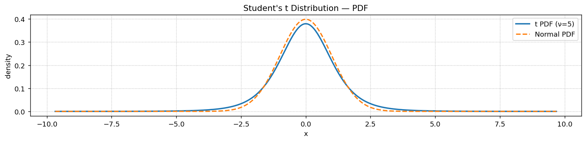
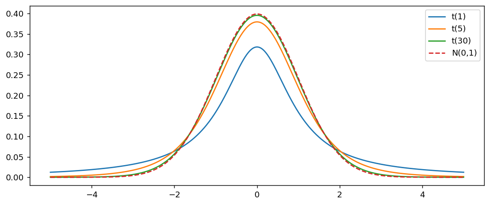

# Student-t 밀도함수

## 개요

**Student $t$ 분포**는 분산을 모르는 정규모집단의 평균을 추정할 때 자연스럽게 나타난다. 정규분포보다 꼬리가 두꺼워 이상점에 더 로버스트하며 작은 표본의 추론에 더 적합하다.

자유도 $\nu$, 위치 $\mu$, 척도 $\sigma$인 PDF는 다음과 같다:

$$
f(x) = \frac{\Gamma\!\left(\frac{\nu+1}{2}\right)}{\sigma\sqrt{\nu\pi}\;\Gamma\!\left(\frac{\nu}{2}\right)} \left(1 + \frac{1}{\nu}\left(\frac{x-\mu}{\sigma}\right)^2\right)^{-(\nu+1)/2}
$$

---

## 적률

| 성질 | 조건 | 값 |
|---|---|---|
| 평균 | $\nu > 1$ | $\mu$ |
| 분산 | $\nu > 2$ | $\dfrac{\nu}{\nu - 2}\,\sigma^2$ |
| 분산 | $1 < \nu \le 2$ | $\infty$ |
| 평균 | $\nu \le 1$ | 정의되지 않음 |

$\nu \to \infty$일 때 $t$ 분포는 $N(\mu, \sigma^2)$로 수렴한다.

---

## 코드: t 분포와 정규분포 비교

<div class="codebox" markdown>

**예제 1.** t 분포와 정규분포의 꼬리 비교

```python
import numpy as np
import matplotlib.pyplot as plt
import scipy.stats as stats

nu = 5       # 자유도. 작을수록 꼬리가 두껍고, 커지면 정규분포로 간다.
mu = 0
sigma = 1

t_dist = stats.t(df=nu, loc=mu, scale=sigma)
n_dist = stats.norm(loc=mu, scale=sigma)

# x 범위를 t 분포의 분위수로 잡는다.
# t는 꼬리가 두꺼우므로 정규분포 기준으로 범위를 잡으면 꼬리가 잘린다.
# 여기서 보려는 것이 바로 그 꼬리이므로 t 쪽에 맞춰야 한다.
x = np.linspace(t_dist.ppf(1e-4), t_dist.ppf(1 - 1e-4), 600)

fig, ax = plt.subplots(figsize=(12, 3))
ax.plot(x, t_dist.pdf(x), lw=2, label=f"t PDF (ν={nu})")
ax.plot(x, n_dist.pdf(x), lw=1.8, linestyle='--', label="Normal PDF")
ax.set_title("Student's t Distribution — PDF")
ax.set_xlabel("x")
ax.set_ylabel("density")
ax.legend()
ax.grid(True, linestyle=":")
plt.tight_layout()
plt.show()
```

</div>



그림을 보면 $t$ 분포는 정규분포보다 꼬리에 확률이 더 많고 중앙에 더 적으며, $\nu$가 작아질수록 차이가 뚜렷해진다.

---

## 연습문제

<div class="drillbox" markdown>

**연습문제 1.** <span class="diff easy" title="쉬움"></span>
$t_5$ 분포에 대해 공식 $\nu/(\nu-2)$로 분산을 계산하라. 표준정규분포의 분산보다 얼마나 큰가?

</div>

??? success "풀이"
    $$
    \text{Var}(T) = \frac{5}{5 - 2} = \frac{5}{3} \approx 1.667
    $$

    표준정규분포의 분산 1보다 67% 크다. 이 여분의 분산은 전적으로 두꺼운 꼬리에서 온다.

<div class="drillbox" markdown>

**연습문제 2.** <span class="diff med" title="중간"></span>
$\sigma$를 모르는 상태에서 평균의 신뢰구간을 구성할 때 정규분포 대신 $t$ 분포를 쓰는 이유를 설명하라. $n$이 커지면 무엇이 달라지는가?

</div>

??? success "풀이"
    $\sigma$를 모를 때는 이를 표본표준편차 $s$로 대체한다. 그 결과 얻는 추축량 $(\bar{X} - \mu)/(s/\sqrt{n})$은 표준정규분포가 아니라 $t_{n-1}$ 분포를 따르는데, $s$가 추가적인 무작위성을 들여오기 때문이다. $t$ 분포를 사용하면 이 여분의 불확실성이 반영되어 신뢰구간이 더 넓어진다.

    $n$이 커지면 $s \to \sigma$이고 $t_{n-1} \to N(0,1)$이므로 $t$ 기반 구간과 $z$ 기반 구간이 서로 수렴한다. $n > 30$이면 실질적인 차이는 작다.

<div class="drillbox" markdown>

**연습문제 3.** <span class="diff med" title="중간"></span>
$t_1$ 분포가 표준 Cauchy 분포임을 두 PDF가 같음을 보여 증명하라.

</div>

??? success "풀이"
    $\nu = 1$, $\mu = 0$, $\sigma = 1$인 $t_\nu$ PDF는:

    $$
    f(x) = \frac{\Gamma(1)}{\sqrt{\pi}\;\Gamma(1/2)} \left(1 + x^2\right)^{-1}
    $$

    $\Gamma(1) = 1$과 $\Gamma(1/2) = \sqrt{\pi}$를 사용하면:

    $$
    f(x) = \frac{1}{\pi(1 + x^2)}
    $$

    이는 정확히 표준 Cauchy PDF이다. 따라서 Cauchy 분포는 유한한 평균이나 분산을 갖지 않으며, 이는 $t$ 분포의 적률 조건($\nu \le 1$)과 일치한다. $\square$

<div class="drillbox" markdown>

**연습문제 4.** <span class="diff easy" title="쉬움"></span>
SciPy를 사용하여 $\nu = 1, 5, 30, \infty$인 $t$ 분포 PDF를 같은 축에 그려라($\infty$는 `stats.norm`을 사용). 수렴 양상을 서술하라.

</div>

??? success "풀이"
    ```python
    fig, ax = plt.subplots(figsize=(10, 4))
    x = np.linspace(-5, 5, 500)
    for nu in [1, 5, 30]:
        ax.plot(x, stats.t(nu).pdf(x), label=f"t({nu})")
    ax.plot(x, stats.norm.pdf(x), '--', label="N(0,1)")
    ax.legend()
    ```

    

    $\nu = 1$(Cauchy)에서는 꼬리가 극도로 두껍다. $\nu = 5$에서는 종 모양이 눈에 띄게 나타나지만 여전히 더 퍼져 있다. $\nu = 30$에서는 $t$ 곡선과 정규 곡선을 거의 구별할 수 없다. 수렴 $t_\nu \to N(0,1)$은 단조적이다. $\nu$가 커질 때마다 꼬리가 정규분포에 더 가까워진다.

---

## 정리하며

$t$ 분포는 **분산을 모르는 정규모집단의 평균을 추정할 때** 자연스럽게 나타난다.

- **정규분포보다 꼬리가 두껍다.** $\sigma$ 를 $s$ 로 바꾸면서 생긴 추가 불확실성이 꼬리를 두껍게 만든 것이며, 그래서 $t$ 임계값이 $z$ 임계값보다 크다.
- **적률이 자유도에 달려 있다.** 평균은 $\nu>1$ 일 때만 존재하고, 분산은 $\nu>2$ 일 때 $\frac{\nu}{\nu-2}\sigma^2$ 이며 $1<\nu\le2$ 이면 **무한**이다. $\nu=1$ 이면 코시분포이고 평균조차 정의되지 않는다.
- **$\nu\to\infty$ 이면 $N(\mu,\sigma^2)$ 로 간다.** 자유도 30 근처에서 이미 차이가 실무적으로 무시할 만해지며, "$n\ge30$ 이면 $z$ 를 써도 된다"는 규칙이 여기서 나온다.
- 꼬리가 두꺼워 **이상점에 덜 민감한 모형**으로도 쓰인다. 자유도를 작게 잡은 $t$ 를 잡음 분포로 두는 로버스트 회귀가 그 예다.

다음 절 **카이제곱분포**로 넘어간다. $t$ 분포의 분모에 들어 있던 $s^2$ 의 분포가 바로 그것이며, 두 분포가 한 쌍으로 움직인다.
