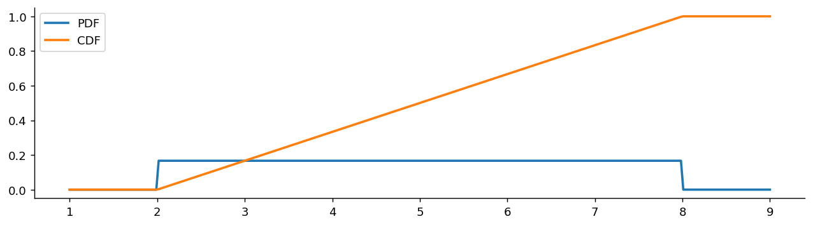
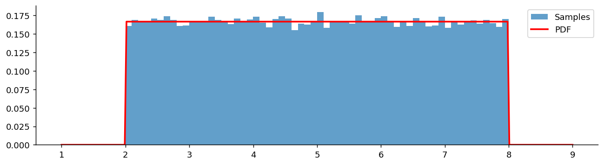
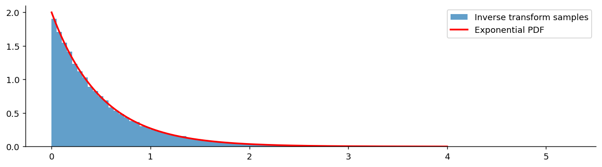

# Uniform 분포

## 개요

**Uniform 분포**는 구간 $[a, b]$의 모든 값에 동일한 확률을 부여한다. 가장 단순한 연속분포이며, 난수 생성, 시뮬레이션, 확률적분변환의 토대가 된다.

---

## 정의

확률변수 $X$가 $[a, b]$ 위의 연속 균등분포를 따른다는 것은 다음을 뜻한다:

$$
X \sim \text{Uniform}(a, b), \qquad f(x) = \begin{cases} \frac{1}{b - a} & \text{if } a \leq x \leq b \\ 0 & \text{otherwise} \end{cases}
$$

PDF는 구간에서 상수이며, 이는 모든 값이 동일하게 나타날 수 있음을 반영한다.

### CDF

$$
F(x) = \begin{cases} 0 & x < a \\ \frac{x - a}{b - a} & a \leq x \leq b \\ 1 & x > b \end{cases}
$$

---

## 성질

$$
\begin{aligned}
E[X] &= \frac{a + b}{2} \\[4pt]
\text{Var}(X) &= \frac{(b - a)^2}{12} \\[4pt]
\text{SD}(X) &= \frac{b - a}{2\sqrt{3}}
\end{aligned}
$$

### 평균의 유도

$$
E[X] = \int_a^b x \cdot \frac{1}{b-a}\,dx = \frac{1}{b-a} \cdot \frac{x^2}{2}\bigg|_a^b = \frac{b^2 - a^2}{2(b-a)} = \frac{a+b}{2}
$$

### 분산의 유도

$$
E[X^2] = \int_a^b x^2 \cdot \frac{1}{b-a}\,dx = \frac{1}{b-a} \cdot \frac{x^3}{3}\bigg|_a^b = \frac{a^2 + ab + b^2}{3}
$$

$$
\text{Var}(X) = E[X^2] - (E[X])^2 = \frac{a^2 + ab + b^2}{3} - \frac{(a+b)^2}{4} = \frac{(b-a)^2}{12}
$$

---

## 표준 균등분포

특수한 경우인 $U \sim \text{Uniform}(0, 1)$을 **표준 균등분포**라 한다. 모든 균등확률변수는 이것과 다음과 같이 연결된다:

$$
X = a + (b - a)U \sim \text{Uniform}(a, b) \quad \text{where } U \sim \text{Uniform}(0, 1)
$$

역으로:

$$
U = \frac{X - a}{b - a} \sim \text{Uniform}(0, 1) \quad \text{where } X \sim \text{Uniform}(a, b)
$$

---

## 확률적분변환

Uniform 분포는 **확률적분변환**을 통해 시뮬레이션에서 핵심적인 역할을 한다:

**정리:** $X$가 CDF $F$를 갖는 연속확률변수이면 $F(X) \sim \text{Uniform}(0, 1)$이다.

**역 (역변환 표본추출):** $U \sim \text{Uniform}(0, 1)$이면 $X = F^{-1}(U)$의 CDF는 $F$이다.

### 증명

$$
P(F(X) \leq u) = P(X \leq F^{-1}(u)) = F(F^{-1}(u)) = u
$$

이는 $\text{Uniform}(0, 1)$의 CDF이다.

이 정리는 균등난수 생성기만으로 임의의 분포에서 확률표본을 생성할 수 있게 하는 근거이다.

---

## 이산 균등분포

이산형 대응물은 유한집합 $\{a, a+1, \ldots, b\}$의 각 값에 동일한 확률을 부여한다:

$$
P(X = k) = \frac{1}{b - a + 1}, \quad k = a, a+1, \ldots, b
$$

$$
E[X] = \frac{a + b}{2}, \qquad \text{Var}(X) = \frac{(b - a + 1)^2 - 1}{12}
$$

---

## 예제

**문제:** 어떤 자산의 일간 수익률을 $-2\%$와 $+3\%$ 사이의 균등분포로 모형화한다. 수익률이 $1\%$를 넘을 확률은? 기대수익률은?

**풀이:**

$$
P(X > 1) = \frac{3 - 1}{3 - (-2)} = \frac{2}{5} = 0.40
$$

$$
E[X] = \frac{-2 + 3}{2} = 0.5\%
$$

---

## Python: PDF, CDF, 표본추출

### PDF와 CDF

```python
import matplotlib.pyplot as plt
import numpy as np
from scipy import stats

a, b = 2, 8
# 구간 바깥까지 그려야 "밖에서는 0"이라는 사실이 그림에 드러난다
x = np.linspace(a - 1, b + 1, 300)

fig, ax = plt.subplots(figsize=(12, 3))
# scale은 폭 b-a 이지 b가 아니다(loc=2, scale=6 이 [2, 8]을 뜻한다).
# PDF는 구간 안에서 1/(b-a) = 1/6 로 평평하다.
# CDF는 그 평평한 값을 적분한 것이므로 **기울기 1/6 의 직선**이 된다.
ax.plot(x, stats.uniform(loc=a, scale=b-a).pdf(x), label='PDF', lw=2)
ax.plot(x, stats.uniform(loc=a, scale=b-a).cdf(x), label='CDF', lw=2)
ax.spines[['top', 'right']].set_visible(False)
ax.legend()
plt.show()
```



### 표본추출과 히스토그램

```python
import numpy as np
import matplotlib.pyplot as plt
from scipy import stats

np.random.seed(42)
a, b = 2, 8
samples = stats.uniform(loc=a, scale=b-a).rvs(50_000)

fig, ax = plt.subplots(figsize=(12, 3))
# 5만 개를 60개 구간에 넣으면 구간마다 평균 833개다.
# 막대 높이가 들쭉날쭉한 것은 잡음이며, 표본을 늘리면 평평해진다.
ax.hist(samples, bins=60, density=True, alpha=0.7, label='Samples')
x = np.linspace(a - 1, b + 1, 300)
ax.plot(x, stats.uniform(loc=a, scale=b-a).pdf(x), 'r-', lw=2, label='PDF')
ax.spines[['top', 'right']].set_visible(False)
ax.legend()
plt.show()
```



### 역변환 표본추출

```python
import numpy as np
import matplotlib.pyplot as plt
from scipy import stats

np.random.seed(42)

# 균등난수로 지수분포 표본을 만든다(역변환 표집).
# 지수분포의 CDF는 F(x) = 1 - e^{-lam x} 이므로 이를 x에 대해 풀면
#   u = 1 - e^{-lam x}  ->  x = -ln(1-u) / lam
# 이 역함수가 아래 한 줄이다. 균등난수만 있으면 어떤 분포든 만들 수 있다는
# 사실이 몬테카를로 방법의 출발점이다.
u = np.random.uniform(0, 1, 50_000)
lam = 2.0
x_exp = -np.log(1 - u) / lam

fig, ax = plt.subplots(figsize=(12, 3))
ax.hist(x_exp, bins=100, density=True, alpha=0.7, label='Inverse transform samples')
t = np.linspace(0, 4, 200)
ax.plot(t, stats.expon(scale=1/lam).pdf(t), 'r-', lw=2, label='Exponential PDF')
ax.spines[['top', 'right']].set_visible(False)
ax.legend()
plt.show()
```



---

## 핵심 요약

- Uniform 분포는 구간의 모든 값에 동일한 확률을 부여하므로, 유계 구간 위에서 "최대로 정보가 없는" 분포이다.
- 표준 균등분포 $U(0,1)$은 역변환 방법을 통한 난수 생성의 기본 구성요소이다.
- 확률적분변환은 임의의 연속확률변수에 그 CDF를 적용하면 균등분포가 됨을 말해 준다.
- 단순함에도 불구하고 Uniform 분포는 Monte Carlo 시뮬레이션과 계산통계학의 기초를 이룬다.

## 연습문제

**연습문제 1.**
$U \sim \mathrm{Uniform}(0, 1)$이고 $X = -(1/\lambda)\ln(1 - U)$이다. (a) $X$의 CDF를 구하라. (b) 그 분포를 밝혀라. (c) 역변환 방법을 설명하라. (d) $1 - U \sim \mathrm{Uniform}(0, 1)$임을 보여라.

??? success "풀이"
    (a) $P(X \le x) = P(-(1/\lambda)\ln(1 - U) \le x) = P(U \le 1 - e^{-\lambda x}) = 1 - e^{-\lambda x}$.

    (b) 이는 $\mathrm{Exp}(\lambda)$의 CDF이다. 따라서 $X \sim \mathrm{Exp}(\lambda)$.

    (c) **역변환 방법:** CDF $F$가 역함수를 갖는 임의의 분포에 대해 $U \sim \mathrm{Uniform}(0, 1)$을 써서 $X = F^{-1}(U)$로 두면 $X$의 CDF는 $F$가 된다. 분위수 함수가 닫힌 형태로 주어지는 분포에서 표본을 뽑는 보편적인 방법이다.

    (d) $P(1 - U \le t) = P(U \ge 1 - t) = 1 - (1 - t) = t$. 따라서 $1 - U \sim \mathrm{Uniform}(0, 1)$이다. 그러므로 더 간단한 공식 $X = -(1/\lambda) \ln U$도 동등하다.

---

**연습문제 2.**
**Uniform$(a, b)$의 평균과 분산.** PDF로부터 둘 다 유도하라.

??? success "풀이"
    PDF: $[a, b]$ 위에서 $f(x) = 1/(b - a)$.

    $\mathbb{E}[X] = \int_a^b x/(b - a) dx = (b^2 - a^2)/(2(b - a)) = (a + b)/2$.

    $\mathbb{E}[X^2] = \int_a^b x^2/(b - a) dx = (b^3 - a^3)/(3(b - a)) = (a^2 + ab + b^2)/3$.

    $\mathrm{Var}(X) = \mathbb{E}[X^2] - (\mathbb{E}[X])^2 = (a^2 + ab + b^2)/3 - (a + b)^2/4 = (b - a)^2/12$.

    **표준적인 경우:** Uniform(0, 1)의 평균은 1/2, 분산은 1/12이다. Uniform(-1, 1)의 평균은 0, 분산은 1/3이다.

---

**연습문제 3.**
**두 균등확률변수의 합.** $U_1, U_2 \sim \mathrm{Uniform}(0, 1)$이 독립이면 $U_1 + U_2$가 $[0, 2]$ 위의 **삼각분포**를 따름을 보여라.

??? success "풀이"
    PDF를 합성곱한다:

    $$
    f_{U_1 + U_2}(s) = \int_{-\infty}^\infty f_{U_1}(s - u) f_{U_2}(u) du
    $$

    $u \in [0, 1]$이고 $s - u \in [0, 1]$일 때 피적분함수가 1이고, 그 밖에서는 0이다. 적분 영역은:

    - $s \in [0, 1]$일 때: $u \in [0, s]$이므로 적분값 = $s$.
    - $s \in [1, 2]$일 때: $u \in [s - 1, 1]$이므로 적분값 = $2 - s$.

    결과: $s \in [0, 2]$에 대해 $f_{U_1 + U_2}(s) = \min(s, 2 - s)$이며, $s = 1$에서 높이 1로 정점을 이루는 삼각형이다.

    균등확률변수의 합에 대한 중심극한정리는 6개 이상만 더해도 근사적으로 정규분포가 됨을 알려 준다. 수렴이 빠른 것이다. 이는 정규난수 생성을 위한 Marsaglia-Bray 알고리즘의 바탕이 된다.

---

**연습문제 4.**
**균등확률변수의 순서통계량.** $U_1, \ldots, U_n$이 i.i.d. $\mathrm{Uniform}(0, 1)$일 때 $k$번째 순서통계량 $U_{(k)}$는 $\mathrm{Beta}(k, n - k + 1)$ 분포를 따른다. CDF를 유도하라.

??? success "풀이"
    $U_{(k)} \le u$일 필요충분조건은 $U_i$들 중 적어도 $k$개가 $u$ 이하인 것이다. $u$ 이하인 $U_i$의 개수는 $\mathrm{Binomial}(n, u)$를 따른다(각각 독립적으로 확률 $u$).

    $$
    P(U_{(k)} \le u) = P(\mathrm{Binomial}(n, u) \ge k) = \sum_{j=k}^n \binom{n}{j} u^j (1 - u)^{n - j}
    $$

    불완전 베타함수 항등식에 의해 이는 정규화된 불완전 베타함수 $I_u(k, n - k + 1)$과 같다. 따라서 $U_{(k)} \sim \mathrm{Beta}(k, n - k + 1)$이다.

    베타분포의 잘 알려진 평균 공식에 의해 $\mathbb{E}[U_{(k)}] = k/(n + 1)$이다. 기대 순서통계량은 $[0, 1]$을 $n + 1$개의 동일한 조각으로 나누며, 이것이 Q-Q 그림에서 쓰는 **작도 위치**가 된다.

---

**연습문제 5.**
**최대 엔트로피 성질.** 유계 구간 $[a, b]$ 위의 모든 분포 중에서 Uniform 분포가 **미분 엔트로피**를 최대로 한다. 미분 엔트로피 공식을 쓰고 이를 확인하라.

??? success "풀이"
    미분 엔트로피: $h(X) = -\int f(x) \ln f(x) dx$.

    $X \sim \mathrm{Uniform}(a, b)$에 대해 $h(X) = -\int_a^b (1/(b-a)) \ln(1/(b-a)) dx = \ln(b - a)$.

    **주장:** $[a, b]$ 위의 다른 어떤 분포 $g$도 $h(g) \le \ln(b - a)$를 만족한다. KL 발산의 비음성으로 증명한다:

    $0 \le D_{KL}(g \| f) = \int g \ln(g/f) dx = -h(g) - \int g \ln f \, dx = -h(g) + \ln(b - a)$

    따라서 $h(g) \le \ln(b - a) = h(f)$이며, 등호는 거의 어디서나 $g = f$일 때만 성립한다.

    **해석:** 지지집합 외에 아무 정보가 없을 때 Uniform 분포는 "가장 정보가 적은" 분포로, 모든 곳에 동일한 질량을 부여한다. 이 때문에 유계 모수에 대한 무정보 베이즈 분석에서 자연스러운 사전분포가 된다.

---

**연습문제 6.**
**확률적분변환.** $X$가 연속 CDF $F$를 가지면 $U = F(X) \sim \mathrm{Uniform}(0, 1)$임을 증명하라.

??? success "풀이"
    $F$의 연속성(이 덕분에 $F^{-1}$이 잘 정의되고 $F \circ F^{-1} = \mathrm{id}$이다)을 이용하면 $P(U \le u) = P(F(X) \le u) = P(X \le F^{-1}(u)) = F(F^{-1}(u)) = u$이다.

    따라서 $U$의 CDF는 $[0, 1]$ 위에서 $u$이며, 즉 $U \sim \mathrm{Uniform}(0, 1)$이다.

    **활용:** 확률적분변환은 여러 통계 검정의 바탕이 된다:

    - **Kolmogorov-Smirnov 검정:** 가설로 세운 $F$로 자료를 변환하면 귀무가설 아래에서 변환된 자료는 균등분포를 따른다.
    - **코퓰러 모형:** 결합분포를 주변분포(확률적분변환으로 균등분포화)와 균등확률변수들을 잇는 코퓰러로 분해한다.
    - **분포 예측의 검증:** 예측분포가 올바르게 설정되었다면 변환된 관측값들은 균등분포를 따라야 한다.

    이는 역변환 표본추출의 쌍대이다. 하나는 균등확률변수를 다른 분포로 바꾸고, 다른 하나는 다른 분포를 균등분포로 바꾼다. 둘 다 같은 CDF/역 CDF 장치에 의존한다.
