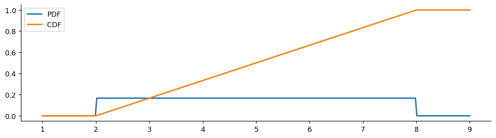
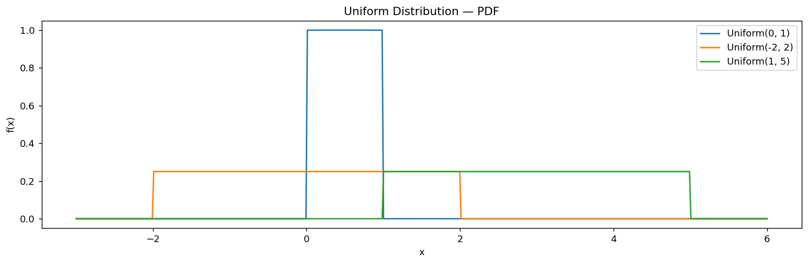
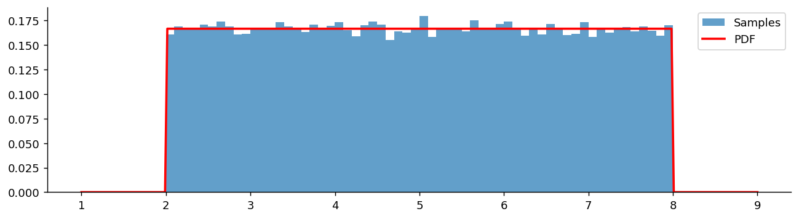
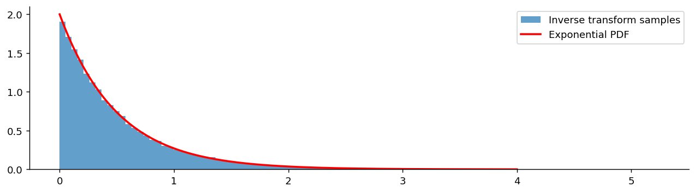

# 균등분포

## 개요

**균등분포**는 구간 $[a, b]$의 모든 값에 동일한 확률을 부여한다. 가장 단순한 연속분포이며, 난수 생성, 시뮬레이션, 확률적분변환의 토대가 된다.

균등분포는 유계 구간 위의 **최대 엔트로피 분포**이기도 하다. 값이 놓일 범위 말고는 아무것도 모를 때, 가장 적은 가정을 하는 분포가 균등분포다.

4.2절의 사슬 $\text{Exp}(\lambda) \to N(\mu,\sigma^2) \to \chi^2_d \to t_d \to F_{d_1,d_2}$ 은 지수분포에서 시작하지만, 그 문을 여는 것은 균등분포다. 아래에서 보는 **역변환 표본추출**을 통해 균등난수 하나로 어떤 분포든 만들 수 있기 때문이다.

---

## 연속 균등분포와 누적분포함수

<div class="defn" markdown>

### 정의 1. 연속 균등분포 { .dfn }

확률변수 $X$가 $[a, b]$ 위의 연속 균등분포를 따른다는 것은 다음을 뜻한다:

$$
X \sim \text{Uniform}(a, b), \qquad f(x) = \begin{cases} \frac{1}{b - a} & \text{if } a \leq x \leq b \\ 0 & \text{otherwise} \end{cases}
$$

PDF는 구간에서 상수이며, 이는 모든 값이 동일하게 나타날 수 있음을 반영한다.

</div>

### CDF

$$
F(x) = \begin{cases} 0 & x < a \\ \frac{x - a}{b - a} & a \leq x \leq b \\ 1 & x > b \end{cases}
$$

---

## 성질

$$
\begin{aligned}
E[X] &= \frac{a + b}{2} \\[4pt]
\text{Var}(X) &= \frac{(b - a)^2}{12} \\[4pt]
\text{SD}(X) &= \frac{b - a}{2\sqrt{3}}
\end{aligned}
$$

### 평균의 유도

$$
E[X] = \int_a^b x \cdot \frac{1}{b-a}\,dx = \frac{1}{b-a} \cdot \frac{x^2}{2}\bigg|_a^b = \frac{b^2 - a^2}{2(b-a)} = \frac{a+b}{2}
$$

### 분산의 유도

$$
E[X^2] = \int_a^b x^2 \cdot \frac{1}{b-a}\,dx = \frac{1}{b-a} \cdot \frac{x^3}{3}\bigg|_a^b = \frac{a^2 + ab + b^2}{3}
$$

$$
\text{Var}(X) = E[X^2] - (E[X])^2 = \frac{a^2 + ab + b^2}{3} - \frac{(a+b)^2}{4} = \frac{(b-a)^2}{12}
$$

---

## 표준 균등분포

특수한 경우인 $U \sim \text{Uniform}(0, 1)$을 **표준 균등분포**라 한다. 모든 균등확률변수는 이것과 다음과 같이 연결된다:

$$
X = a + (b - a)U \sim \text{Uniform}(a, b) \quad \text{where } U \sim \text{Uniform}(0, 1)
$$

역으로:

$$
U = \frac{X - a}{b - a} \sim \text{Uniform}(0, 1) \quad \text{where } X \sim \text{Uniform}(a, b)
$$

---

## 확률적분변환

균등분포는 **확률적분변환**을 통해 시뮬레이션에서 핵심적인 역할을 한다.

<div class="thmbox" markdown>

### 정리. 확률적분변환 { .thm }

$X$가 CDF $F$를 갖는 연속확률변수이면 $F(X) \sim \text{Uniform}(0, 1)$이다.

거꾸로(**역변환 표본추출**), $U \sim \text{Uniform}(0, 1)$이면 $X = F^{-1}(U)$의 CDF는 $F$이다.

</div>

??? proof "증명"

    $$
    P(F(X) \leq u) = P(X \leq F^{-1}(u)) = F(F^{-1}(u)) = u
    $$

    이는 $\text{Uniform}(0, 1)$의 CDF이다.

    이 정리는 균등난수 생성기만으로 임의의 분포에서 확률표본을 생성할 수 있게 하는 근거이다.

---

## 이산 균등분포

이산형 대응물은 유한집합 $\{a, a+1, \ldots, b\}$의 각 값에 동일한 확률을 부여한다:

$$
P(X = k) = \frac{1}{b - a + 1}, \quad k = a, a+1, \ldots, b
$$

$$
E[X] = \frac{a + b}{2}, \qquad \text{Var}(X) = \frac{(b - a + 1)^2 - 1}{12}
$$

---

## 문제

<div class="probox" markdown>

**문제:** <span class="diff easy" title="쉬움"></span> 어떤 자산의 일간 수익률을 $-2\%$와 $+3\%$ 사이의 균등분포로 모형화한다. 수익률이 $1\%$를 넘을 확률은? 기대수익률은?

</div>

??? success "풀이"

    $$
    P(X > 1) = \frac{3 - 1}{3 - (-2)} = \frac{2}{5} = 0.40
    $$

    $$
    E[X] = \frac{-2 + 3}{2} = 0.5\%
    $$
---

## Python: PDF, CDF, 표본추출

!!! warning "SciPy 모수화"
    `stats.uniform(loc=a, scale=b-a)`에서 `loc`은 왼쪽 끝점이고 `scale`은 **오른쪽 끝점이 아니라 구간의 폭**이다. `uniform(0, 5)`는 우연히 $[0,5]$가 맞지만 `uniform(1, 5)`는 $[1,5]$가 아니라 $[1,6]$이다. 코드에 `scale=b-a`라고 뺄셈을 드러내 적으면 실수를 줄일 수 있다(연습문제 12).

### PDF와 CDF

<div class="exbox" markdown>

**보기 1.** <span class="diff easy" title="쉬움"></span> 밀도를 적분하면 분포함수가 된다. $X \sim \text{Uniform}(a, b)$의 밀도와 분포함수를 한 축에 겹쳐 그린다.

**(1)** 밀도 $f$를 적분해 $F$를 구하시오. $f$는 $x = a$와 $x = b$에서 뛰는데 $F$는 그 자리에서 어떠한가.

**(2)** 그림에서 두 곡선이 꼭 한 번 만난다. 만나는 자리를 $a$, $b$로 나타내고, 만나지 않는 경우가 있다면 언제인지 밝히시오. $a = 2$, $b = 8$에서 수치로 확인하시오.

</div>

??? success "풀이"

    **(1) 해석적으로.** 먼저 밀도의 높이부터 따진다. 구간 안에서 상수 $h$라는 것만 요구하면 전체 넓이가

    $$
    \int_a^b h\,dx = h\,(b-a) = 1
    $$

    이어야 하므로 $h = 1/(b-a)$로 **정해져 버린다.** 균등분포에 고를 여지가 없는 까닭이다.

    분포함수는 이 밀도를 왼쪽부터 쌓은 것이다. $F(x) = \int_{-\infty}^{x} f(t)\,dt$에서 세 구간으로 나뉜다. $x < a$이면 피적분함수가 내내 $0$이라 $F(x) = 0$이고, $a \le x \le b$이면

    $$
    F(x) = \int_a^x \frac{dt}{b-a} = \frac{x-a}{b-a}
    $$

    이며, $x > b$이면 $[a, b]$ 전체를 다 쌓았으므로 $F(x) = 1$이다. 정리하면

    $$
    F(x) = \begin{cases} 0 & x < a \\[2pt] \dfrac{x-a}{b-a} & a \le x \le b \\[4pt] 1 & x > b\end{cases}
    $$

    이고, 이것이 위 **CDF** 절에 적어 둔 식이다. **상수를 적분했으므로 기울기 $1/(b-a)$인 직선**이 나온다.

    끝점에서 무슨 일이 일어나는지가 이 보기의 요점이다. 가운데 조각에 $x = a$를 넣으면 $0$, $x = b$를 넣으면 $1$이라 양옆 조각과 값이 이어진다. **$f$는 $a$와 $b$에서 $0$과 $1/(b-a)$ 사이를 뛰는데 $F$는 어디서도 뛰지 않는다.** 적분이 뜀을 한 단계 매끄럽게 만든 것이다. 그렇다고 완전히 매끄러워지지는 않아서, $F$의 기울기는 $a$에서 $0 \to 1/(b-a)$로, $b$에서 $1/(b-a) \to 0$으로 튄다. 곧 $F$는 **연속이지만 $a$와 $b$에서 미분불가**이고, 그 두 점을 뺀 곳에서 $F' = f$다.

    $F$가 연속이라는 데서 바로 따라 나오는 것이 있다.

    $$
    P(X = a) = F(a) - F(a^-) = 0
    $$

    이므로 정의 1의 $a \le x \le b$를 $a < x < b$로 바꿔 적어도 **같은 분포**다. 연속확률변수에서 끝점을 넣고 빼는 일에 신경 쓸 필요가 없는 이유가 이것이다.

    한 가지 더. $h = 1/(b-a)$는 **밀도이지 확률이 아니므로 $1$을 넘을 수 있다.** $b - a < 1$이면 그렇게 된다. 다음 보기의 $\text{Uniform}(0,1)$이 높이가 꼭 $1$인 경계 경우다.

    **(2) 해석적으로.** 두 곡선이 만나려면 $a \le x \le b$에서

    $$
    \frac{1}{b-a} = \frac{x-a}{b-a}
    $$

    이어야 하고, 양변에 $b-a$를 곱하면 $1 = x - a$, 곧

    $$
    x^{*} = a + 1
    $$

    이다. **오른쪽 끝점 $b$가 식에서 사라졌다.** 구간을 아무리 늘려도 교차점은 왼쪽 끝에서 $1$만큼 떨어진 곳에 붙박여 있다.

    단, 그 자리가 구간 안에 있어야 한다. $a + 1 \le b$, 곧 $b - a \ge 1$일 때만 교차가 생긴다. 폭이 $1$보다 좁으면 밀도의 높이가 $1/(b-a) > 1$인데 $F$는 어디서도 $1$을 넘지 못하므로 두 곡선은 **아예 만나지 않는다.** 폭이 정확히 $1$이면 오른쪽 끝점 $x = b$에서 스치듯 한 번 만난다.

    여기서 못박아 둘 것이 있다. **밀도와 확률은 단위가 다르다.** $f$의 단위는 $1/[x]$이고 $F$는 무차원이라 둘을 견주는 것은 원래 말이 되지 않는다. $x^{*} = a + 1$의 그 "$1$"도 순수한 수가 아니라 **길이 $1$**이어서, $x$를 다른 단위로 재면 교차점이 옮겨 간다. 두 곡선을 한 축에 그린 것은 모양을 나란히 보여 주려는 편의일 뿐이고, **교차점에 통계적인 뜻은 없다.** 유도가 깨끗하다고 해서 의미까지 생기지는 않는다는 예로 기억해 둘 만하다.

    **(3) 수치적으로.** 먼저 그림이다.

    ```python
    import matplotlib.pyplot as plt
    import numpy as np
    from scipy import stats

    plt.rcParams["font.sans-serif"] = ["NanumGothic", "Apple SD Gothic Neo", "Malgun Gothic"]
    plt.rcParams["font.family"] = "sans-serif"
    plt.rcParams["axes.unicode_minus"] = False

    a, b = 2, 8
    # 구간 바깥까지 그려야 "밖에서는 0"이라는 사실이 그림에 드러난다
    x = np.linspace(a - 1, b + 1, 300)

    fig, ax = plt.subplots(figsize=(12, 3))
    # scale은 폭 b-a 이지 b가 아니다(loc=2, scale=6 이 [2, 8]을 뜻한다).
    # PDF는 구간 안에서 1/(b-a) = 1/6 로 평평하다.
    # CDF는 그 평평한 값을 적분한 것이므로 **기울기 1/6 의 직선**이 된다.
    ax.plot(x, stats.uniform(loc=a, scale=b-a).pdf(x), label='PDF', lw=2)
    ax.plot(x, stats.uniform(loc=a, scale=b-a).cdf(x), label='CDF', lw=2)
    ax.spines[['top', 'right']].set_visible(False)
    ax.legend()
    plt.show()
    ```

    

    손으로 한 적분을 `quad`로 맞춰 보고, 교차점도 격자로 찾아 본다.

    ```python
    import numpy as np
    from scipy import integrate, stats

    a, b = 2, 8
    rv = stats.uniform(loc=a, scale=b - a)

    # 밀도를 직접 적어 두고 quad 로 적분한다. 닫힌 꼴 (x-a)/(b-a) 와 맞는지 본다.
    f = lambda t: 1.0 / (b - a) if a <= t <= b else 0.0

    total, _ = integrate.quad(f, a - 5, b + 5, points=[a, b])
    print(f"전체 적분 = {total:.12f}")

    print(f"{'x':>5}{'quad 적분':>14}{'(x-a)/(b-a)':>14}{'scipy cdf':>14}")
    for x in (1.0, 2.0, 3.0, 5.0, 8.0, 9.0):
        num, _ = integrate.quad(f, a - 5, x, points=[a, b], limit=200)
        closed = min(max((x - a) / (b - a), 0.0), 1.0)
        print(f"{x:>5.1f}{num:>14.10f}{closed:>14.10f}{rv.cdf(x):>14.10f}")

    # 유도대로라면 두 곡선은 x = a + 1 에서 만난다. b 와는 무관하다.
    xs = np.linspace(a, b, 600_001)
    gap = np.abs(rv.pdf(xs) - rv.cdf(xs))
    print(f"격자가 찾은 교차점 = {xs[gap.argmin()]:.6f},  유도한 a + 1 = {a + 1}")
    print(f"  그 자리에서 PDF = {rv.pdf(a + 1):.10f},  CDF = {rv.cdf(a + 1):.10f}")

    # F 는 끝점에서 이어지지만 기울기는 튄다.
    eps = 1e-9
    for x in (a, b):
        left = (rv.cdf(x) - rv.cdf(x - eps)) / eps
        right = (rv.cdf(x + eps) - rv.cdf(x)) / eps
        print(f"  x = {x}: F 는 연속(F = {rv.cdf(x):.4f}) 이지만 기울기가 "
              f"{left:.4f} -> {right:.4f} 로 튄다")
    ```

    출력:

    ```
    전체 적분 = 1.000000000000
        x       quad 적분   (x-a)/(b-a)     scipy cdf
      1.0  0.0000000000  0.0000000000  0.0000000000
      2.0  0.0000000000  0.0000000000  0.0000000000
      3.0  0.1666666667  0.1666666667  0.1666666667
      5.0  0.5000000000  0.5000000000  0.5000000000
      8.0  1.0000000000  1.0000000000  1.0000000000
      9.0  1.0000000000  1.0000000000  1.0000000000
    격자가 찾은 교차점 = 3.000000,  유도한 a + 1 = 3
      그 자리에서 PDF = 0.1666666667,  CDF = 0.1666666667
      x = 2: F 는 연속(F = 0.0000) 이지만 기울기가 0.0000 -> 0.1667 로 튄다
      x = 8: F 는 연속(F = 1.0000) 이지만 기울기가 0.1667 -> 0.0000 로 튄다
    ```

    **셋 다 유도와 맞는다.** `quad`가 낸 적분이 열째 자리까지 $(x-a)/(b-a)$와 같고, 격자가 찾은 교차점은 $3.000000$으로 $a + 1 = 3$이며, 그 자리의 두 값이 모두 $1/6 = 0.1666666667$이다. 끝점에서는 $F$ 값이 이어지는데 기울기만 $0$과 $1/6$ 사이를 오간다.

    그림을 다시 보면 유도한 것이 그대로 보인다. 파란 PDF는 $[2, 8]$ 밖에서 바닥에 붙어 있다가 두 끝점에서 수직으로 뛰고, 주황 CDF는 그 뜀을 전혀 따라 하지 않은 채 $x=2$에서 꺾여 올라가 $x=8$에서 다시 꺾이며 멈춘다. 두 선이 만나는 곳은 $x = 3$ 한 군데다.

    **그림이 가리는 것도 있다.** 수직으로 보이는 PDF의 양쪽 변은 사실 **선이 아니다.** 밀도는 $x = 2$에서 $0$ 아니면 $1/6$이지 그 사이 값을 갖지 않는데, `plot`이 격자점 $300$개를 선분으로 이어 붙이느라 없는 변을 그려 넣은 것이다. 같은 이유로 꼭짓점이 살짝 둥글게 보이기도 한다. 불연속함수를 꺾은선으로 그릴 때면 늘 따라붙는 군더더기다.

### 구간에 따른 비교

<div class="exbox" markdown>

**보기 2.** <span class="diff easy" title="쉬움"></span> 폭 하나가 모든 것을 정한다. 구간이 서로 다른 세 균등분포 $\text{Uniform}(0,1)$, $\text{Uniform}(-2,2)$, $\text{Uniform}(1,5)$의 밀도를 겹쳐 그린다.

**(1)** 밀도의 높이 $h$와 표준편차 $\sigma$가 둘 다 폭 $w = b - a$ 하나로 정해짐을 보이고, 곱 $h\sigma$가 구간과 무관한 상수임을 구하시오.

**(2)** 그 상수를 세 분포에서 수치로 확인하고, 그림에서 높이가 같은 두 곡선이 서로 무엇이 다른지 말하시오.

</div>

??? success "풀이"

    **(1) 해석적으로.** 보기 1에서 보았듯 전체 넓이가 $1$이라는 요구가 높이를 정한다.

    $$
    h = \frac{1}{w}, \qquad w = b - a
    $$

    **폭이 넓어지면 높이는 그에 반비례해 낮아진다.** 직사각형의 넓이가 언제나 $1$이어야 하기 때문이고, 그림에서 폭 $1$인 곡선만 혼자 높이 솟아 있는 까닭이 이것이다.

    표준편차도 폭 하나로 정해진다. 위 **성질** 절에서 $\operatorname{Var}(X) = w^2/12$였으므로

    $$
    \sigma = \frac{w}{2\sqrt3}
    $$

    이다. 둘을 곱하면 $w$가 지워진다.

    $$
    h\,\sigma = \frac{1}{w}\cdot\frac{w}{2\sqrt3} = \frac{1}{2\sqrt3} = \frac{\sqrt3}{6} \approx 0.288675
    $$

    **어떤 구간의 균등분포든 이 값이 같다.** 같은 식을 분산 쪽으로 돌려 적으면

    $$
    \operatorname{Var}(X) = \frac{1}{12\,h^2}
    $$

    이라, 밀도의 높이만 보면 분산을 알 수 있다는 뜻이 된다.

    이 상수가 뜻을 갖는 까닭은 **무차원**이기 때문이다. $h$의 단위는 $1/[x]$이고 $\sigma$의 단위는 $[x]$라 곱하면 단위가 사라진다. 그래서 $x$를 센티미터로 재든 인치로 재든 $0.288675$가 나온다. 보기 1의 교차점 $a+1$이 단위를 바꾸면 옮겨 가 버리던 것과 정반대이고, **이쪽이 분포의 모양에 관한 진짜 정보**다.

    모양에 관한 정보이므로 다른 분포와 견줄 수 있다. 봉우리 높이에 표준편차를 곱한 같은 양을 재 보면

    $$
    \text{균등} \frac{1}{2\sqrt3} \approx 0.2887, \qquad
    \text{정규 } \varphi(0)\,\sigma = \frac{1}{\sqrt{2\pi}} \approx 0.3989, \qquad
    \text{지수 } \lambda \cdot \frac1\lambda = 1
    $$

    이다. **같은 표준편차를 갖도록 맞춰 놓으면 균등분포의 봉우리가 셋 중 가장 낮다.** 균등분포는 질량을 가운데 쌓지 않고 끝까지 고르게 펴 놓으므로, 같은 퍼짐을 내는 데 높이가 덜 필요하다. 반대로 지수분포는 $0$ 근처에 몰아 두어 봉우리가 가장 높다.

    **(2) 수치적으로.** 먼저 그림이다.

    ```python
    import matplotlib.pyplot as plt
    import numpy as np
    import scipy.stats as stats

    # 구간 [a, b]를 셋 준비한다. 폭이 1, 4, 4로 다르다.
    intervals = [(0, 1), (-2, 2), (1, 5)]
    x = np.linspace(-3, 6, 500)

    fig, ax = plt.subplots(figsize=(12, 4))
    for a, b in intervals:
        # scipy의 균등분포 매개변수화에 주의하라.
        # loc = 시작점 a, scale = **폭** (b가 아니라 b - a) 이다.
        # stats.uniform(1, 5) 는 [1, 5]가 아니라 [1, 6]을 뜻한다.
        rv = stats.uniform(loc=a, scale=b - a)
        # 밀도는 구간 안에서 1/(b-a)로 일정하고 밖에서는 0이다.
        # 폭이 좁을수록 높이가 높아진다. 전체 넓이가 언제나 1이어야 하기 때문이다.
        ax.plot(x, rv.pdf(x), label=f'Uniform({a}, {b})')
    ax.set_xlabel('x')
    ax.set_ylabel('f(x)')
    ax.set_title('Uniform Distribution — PDF')
    ax.legend()
    ax.set_ylim(bottom=-0.05)
    plt.tight_layout()
    plt.show()
    ```

    

    평균과 분산을 손으로 한 적분 대신 `quad`로 다시 구해 닫힌 꼴과 맞추고, $h\sigma$도 재 본다.

    ```python
    import numpy as np
    from scipy import integrate, stats

    print(f"{'구간':>10}{'폭 w':>7}{'높이 h':>9}{'quad 평균':>12}{'quad 분산':>12}"
          f"{'w^2/12':>10}{'SD':>10}{'h*SD':>12}")
    for a, b in [(0, 1), (-2, 2), (1, 5)]:
        w = b - a
        h = 1 / w
        rv = stats.uniform(loc=a, scale=w)
        # 평균과 분산을 손이 아니라 quad 로 다시 구해 닫힌 꼴과 맞춘다.
        m1, _ = integrate.quad(lambda x: x * h, a, b)
        m2, _ = integrate.quad(lambda x: x * x * h, a, b)
        var = m2 - m1 ** 2
        sd = np.sqrt(var)
        print(f"{f'[{a}, {b}]':>10}{w:>7}{h:>9.4f}{m1:>12.6f}{var:>12.6f}"
              f"{w ** 2 / 12:>10.6f}{sd:>10.6f}{h * sd:>12.8f}")

    print(f"유도한 h*SD = 1/(2 sqrt(3)) = {1 / (2 * np.sqrt(3)):.8f}")

    # 같은 양을 다른 분포에서도 재 본다. 봉우리 높이 x 표준편차는 무차원이다.
    print()
    print("봉우리 높이 x 표준편차 (무차원)")
    print(f"  균등     : {1 / (2 * np.sqrt(3)):.6f}")
    nrm = stats.norm(loc=0, scale=2.5)
    print(f"  정규     : {nrm.pdf(0) * nrm.std():.6f}   (= 1/sqrt(2 pi) = {1 / np.sqrt(2 * np.pi):.6f})")
    exp = stats.expon(scale=1 / 3)
    print(f"  지수     : {exp.pdf(0) * exp.std():.6f}   (= 1)")
    ```

    출력:

    ```
            구간    폭 w     높이 h     quad 평균     quad 분산    w^2/12        SD        h*SD
        [0, 1]      1   1.0000    0.500000    0.083333  0.083333  0.288675  0.28867513
       [-2, 2]      4   0.2500    0.000000    1.333333  1.333333  1.154701  0.28867513
        [1, 5]      4   0.2500    3.000000    1.333333  1.333333  1.154701  0.28867513
    유도한 h*SD = 1/(2 sqrt(3)) = 0.28867513

    봉우리 높이 x 표준편차 (무차원)
      균등     : 0.288675
      정규     : 0.398942   (= 1/sqrt(2 pi) = 0.398942)
      지수     : 1.000000   (= 1)
    ```

    **맞는다.** `quad`가 낸 분산이 세 경우 모두 $w^2/12$와 소수 여섯째 자리까지 같고, $h\sigma$는 구간이 어디든 $0.28867513$으로 똑같다. 정규와 지수에서 잰 값도 각각 $1/\sqrt{2\pi}$와 $1$에 맞는다. 정규분포에 척도 $2.5$를, 지수분포에 $\lambda = 3$을 넣었는데도 그 수들이 결과에서 사라지는 것이 무차원 양의 성질이다.

    **그림에서 읽히는 것.** 세로축을 보면 $\text{Uniform}(0,1)$만 높이 $1.0$이고 나머지 둘은 $0.25$다. 폭이 $1$에서 $4$로 네 배가 되자 높이가 정확히 사분의 일이 되었고, 분산은 $0.0833$에서 $1.3333$으로 $16$배, 곧 폭의 제곱배가 되었다.

    **높이가 같은 두 곡선은 위치만 다르다.** $\text{Uniform}(-2,2)$와 $\text{Uniform}(1,5)$는 폭이 둘 다 $4$라 높이도 분산도 $1.3333$으로 같고, 평균만 $0$과 $3$으로 다르다. 뒤엣것은 앞엣것을 오른쪽으로 $3$만큼 민 것일 뿐이다. 표준 균등분포 절의 $X = a + (b-a)U$에서 $a$는 밀거나 당기기만 하고 $b-a$만 모양을 바꾼다는 사실이 그림에 그대로 나와 있다. **위치는 중점이, 퍼짐은 폭만이 결정한다.**

    눈으로 재기 어려운 것도 있다. $[1,2]$ 구간에서는 주황과 초록이 똑같은 높이로 겹쳐 있어 **선 하나만 보인다.** 겹친 자리에서 어느 곡선이 밑에 깔렸는지 그림만으로는 알 수 없고, 범례의 순서를 알아야 한다.

### 표본추출과 히스토그램

<div class="exbox" markdown>

**보기 3.** <span class="diff easy" title="쉬움"></span> 들쭉날쭉함도 크기가 정해져 있다. $\text{Uniform}(2, 8)$에서 $n = 50{,}000$개를 뽑아 $K = 60$칸짜리 히스토그램을 그리면 막대 높이가 고르지 않다.

**(1)** 칸 하나에 들어가는 도수의 평균과 표준편차를 유도하고, 이를 `density=True`의 밀도 눈금으로 옮겨 막대 높이가 들어야 할 $\pm 2\mathrm{SE}$ 띠를 구하시오.

**(2)** 씨앗 42의 표본이 그 띠에 들어가는지 확인하시오. 칸들이 흩어진 정도가 유도한 $\mathrm{SE}$와 맞는가.

</div>

??? success "풀이"

    **(1) 해석적으로.** 칸의 폭을 $w$라 하면, 표본 하나가 어떤 한 칸에 떨어질 확률은 밀도가 상수이므로 길이의 비 그대로다.

    $$
    p = \frac{w}{b-a} = \frac{1}{K}
    $$

    표본이 서로 독립이므로 그 칸의 도수 $N_j$는 **성공확률 $p$인 베르누이 시행을 $n$번 되풀이한 것의 성공 횟수**, 곧

    $$
    N_j \sim \text{Binomial}(n,\, p), \qquad
    E[N_j] = np, \qquad \mathrm{SD}(N_j) = \sqrt{np(1-p)}
    $$

    이다. $n = 50{,}000$, $K = 60$을 넣으면

    $$
    E[N_j] = \frac{50{,}000}{60} = 833.33, \qquad
    \mathrm{SD}(N_j) = \sqrt{50{,}000 \cdot \tfrac{1}{60}\cdot\tfrac{59}{60}} = 28.63
    $$

    이다. 상대적인 크기로는

    $$
    \frac{\mathrm{SD}(N_j)}{E[N_j]} = \sqrt{\frac{1-p}{np}} \approx \frac{1}{\sqrt{np}} = \frac{1}{\sqrt{833.33}} = 3.44\%
    $$

    다. **칸을 잘게 쪼갤수록 이 값이 커진다.** $K$를 두 배로 하면 칸마다 들어오는 수가 반으로 줄어 상대변동이 $\sqrt2$배가 된다. 히스토그램의 칸 수를 정하는 일이 늘 맞바꿈인 까닭이 이것이다. 칸이 성기면 모양을 뭉개고, 촘촘하면 잡음이 커진다.

    `density=True`는 막대 높이를 도수가 아니라

    $$
    \hat f_j = \frac{N_j}{n\,w}
    $$

    로 그린다. 상수 $nw$로 나눈 것뿐이므로 평균과 표준편차가 그대로 따라온다.

    $$
    E[\hat f_j] = \frac{np}{nw} = \frac{p}{w} = \frac{1}{b-a} = \frac16, \qquad
    \mathrm{SD}(\hat f_j) = \frac{\sqrt{np(1-p)}}{nw} = \frac{28.63}{5{,}000} = 0.005725
    $$

    **기댓값이 참 밀도와 정확히 같다.** 히스토그램이 밀도의 불편추정이라는 말이 이 한 줄이다. 따라서 막대가 들어야 할 띠는

    $$
    \frac16 \pm 2(0.005725) = [\,0.1552,\ 0.1781\,]
    $$

    이고, $60$칸 가운데 이 띠를 벗어나는 칸은 $60 \times 0.0455 \approx 2.7$개쯤이 **정상**이다. 하나도 안 벗어나는 쪽이 오히려 이상하다.

    **(2) 수치적으로.** 먼저 그림이다.

    ```python
    import numpy as np
    import matplotlib.pyplot as plt
    from scipy import stats

    np.random.seed(42)
    a, b = 2, 8
    samples = stats.uniform(loc=a, scale=b-a).rvs(50_000)

    fig, ax = plt.subplots(figsize=(12, 3))
    # 5만 개를 60개 구간에 넣으면 구간마다 평균 833개다.
    # 막대 높이가 들쭉날쭉한 것은 잡음이며, 표본을 늘리면 평평해진다.
    ax.hist(samples, bins=60, density=True, alpha=0.7, label='Samples')
    x = np.linspace(a - 1, b + 1, 300)
    ax.plot(x, stats.uniform(loc=a, scale=b-a).pdf(x), 'r-', lw=2, label='PDF')
    ax.spines[['top', 'right']].set_visible(False)
    ax.legend()
    plt.show()
    ```

    

    같은 표본의 도수를 꺼내어 유도한 값과 맞춰 본다.

    ```python
    import numpy as np
    from scipy import stats

    np.random.seed(42)
    a, b, n, K = 2, 8, 50_000, 60
    samples = stats.uniform(loc=a, scale=b - a).rvs(n)

    # hist 는 칸을 [min, max] 에 걸치므로 칸폭이 (b-a)/K 와 아주 조금 다르다.
    counts, edges = np.histogram(samples, bins=K)
    w = edges[1] - edges[0]
    print(f"표본 최소 {samples.min():.6f}  최대 {samples.max():.6f}")
    print(f"칸폭 {w:.8f}  (이론 (b-a)/K = {(b - a) / K:.8f})")

    # 칸 하나의 도수는 Binomial(n, 1/K) 다.
    p = 1 / K
    E, SE = n * p, np.sqrt(n * p * (1 - p))
    print(f"\n도수 눈금:  기대 np = {E:.4f},  SE = sqrt(np(1-p)) = {SE:.4f},"
          f"  상대변동 {SE / E:.4%}")
    print(f"  실제 도수 최소 {counts.min()}  최대 {counts.max()}"
          f"   (z = {(counts.min() - E) / SE:+.3f}, {(counts.max() - E) / SE:+.3f})")

    # density=True 는 높이를 count/(n*w) 로 그린다.
    dens, SEd, h = counts / (n * w), SE / (n * w), 1 / (b - a)
    print(f"\n밀도 눈금:  참 높이 1/(b-a) = {h:.6f},  SE = {SEd:.6f}")
    print(f"  ±2SE 띠 = [{h - 2 * SEd:.6f}, {h + 2 * SEd:.6f}]")
    print(f"  실제 막대 최소 {dens.min():.6f}  최대 {dens.max():.6f}")

    outside = int((np.abs((counts - E) / SE) > 2).sum())
    print(f"  띠 밖 칸 수 = {outside} / {K}   (기대 {K * 2 * stats.norm.sf(2):.2f})")

    # 칸 사이 흩어짐도 재 본다. 이 씨앗은 이론보다 얌전하다.
    chi2 = ((counts - E) ** 2 / E).sum()
    print(f"\n칸 도수의 표준편차 = {counts.std(ddof=1):.2f}  (이론 SE {SE:.2f})")
    print(f"카이제곱 적합도 = {chi2:.2f},  자유도 {K - 1},  위꼬리 p = {stats.chi2.sf(chi2, K - 1):.3f}")

    # 씨앗 하나로는 알 수 없으니 되풀이해 본다.
    rng = np.random.default_rng(0)
    sds = [np.histogram(rng.uniform(a, b, n), bins=K)[0].std(ddof=1) for _ in range(400)]
    sds = np.array(sds)
    print(f"400번 되풀이: 칸 도수 표준편차의 평균 = {sds.mean():.2f}  (이론 {SE:.2f})")
    print(f"              {counts.std(ddof=1):.2f} 보다 작게 나온 비율 = {np.mean(sds < counts.std(ddof=1)):.3f}")
    ```

    출력:

    ```
    표본 최소 2.000033  최대 7.999833
    칸폭 0.09999666  (이론 (b-a)/K = 0.10000000)

    도수 눈금:  기대 np = 833.3333,  SE = sqrt(np(1-p)) = 28.6259,  상대변동 3.4351%
      실제 도수 최소 775  최대 897   (z = -2.038, +2.224)

    밀도 눈금:  참 높이 1/(b-a) = 0.166667,  SE = 0.005725
      ±2SE 띠 = [0.155216, 0.178117]
      실제 막대 최소 0.155005  최대 0.179406
      띠 밖 칸 수 = 2 / 60   (기대 2.73)

    칸 도수의 표준편차 = 24.48  (이론 SE 28.63)
    카이제곱 적합도 = 42.41,  자유도 59,  위꼬리 p = 0.949
    400번 되풀이: 칸 도수 표준편차의 평균 = 28.98  (이론 28.63)
                  24.48 보다 작게 나온 비율 = 0.040
    ```

    **띠는 유도한 대로다.** 밀도 눈금의 평균이 $0.166667$로 참 밀도 $1/6$과 같고, $\mathrm{SE}$는 $0.005725$로 손으로 구한 값과 같다. 막대가 $0.155005$에서 $0.179406$ 사이에 있어 $\pm2\mathrm{SE}$ 띠 $[0.155216,\ 0.178117]$를 **양쪽으로 각각 한 칸씩 벗어났다.** 벗어난 칸이 $2$개이고 기대치가 $2.73$개이니 이것이 바로 정상이다. 도수로 보면 가장 적은 칸이 $775$개($z = -2.04$), 가장 많은 칸이 $897$개($z = +2.22$)다.

    **그런데 한 군데 어긋난다.** 칸 도수들이 흩어진 정도가 $24.48$로, 유도한 $\mathrm{SE} = 28.63$보다 눈에 띄게 **작다.** 카이제곱 적합도가 $42.41$인데 자유도는 $59$이니 같은 방향이다. 둘 중 하나가 틀렸는지 따져 볼 일이다.

    따져 보면 유도가 틀린 것이 아니다. 카이제곱의 위꼬리 $p = 0.949$는 "너무 잘 맞아서 이상한가"를 재는 쪽인데, $\chi^2_{59}$의 표준편차가 $\sqrt{2\cdot59} = 10.9$이므로 $42.41$은 평균에서 $1.5$ 표준편차 떨어진 자리일 뿐이다. 되풀이해 보면 확실해진다. 다른 씨앗으로 $400$번 다시 뽑으니 흩어짐의 평균이 $28.98$로 이론값 $28.63$에 맞고, $24.48$ 아래로 내려간 경우는 $4\%$뿐이었다. **씨앗 $42$의 표본이 우연히 유난히 고른 쪽 $4\%$에 들었던 것이다.** 모의실험 하나를 보고 이론이 틀렸다고 말하면 안 되는 이유가 여기 있다.

    칸폭이 $0.1$이 아니라 $0.09999666$인 것도 눈여겨볼 만하다. `hist(samples, bins=60)`은 칸을 $[2, 8]$이 아니라 **표본의 최솟값과 최댓값 사이**에 걸치기 때문이다. 차이가 $3\times10^{-5}$ 수준이라 그림으로는 보이지 않지만, 밀도 높이를 손으로 다시 계산할 때는 이 $w$를 써야 숫자가 맞는다.

    **그림이 가리는 것.** 막대가 들쭉날쭉한 것은 눈에 잘 띄지만, 그 들쭉날쭉함이 **얼마만큼이어야 정상인지는 그림에 적혀 있지 않다.** 세로축이 $0$부터 시작하는 탓에 $3.4\%$의 변동이 실제보다 작아 보이기도 한다. 막대 높이에 $\pm2\mathrm{SE}$ 띠를 함께 그려 넣지 않으면 "고르다/고르지 않다"는 인상은 눈금을 어떻게 잡았느냐에 좌우된다.

### 역변환 표본추출

<div class="exbox" markdown>

**보기 4.** <span class="diff easy" title="쉬움"></span> 균등난수 하나로 지수분포를 만든다. 위 **확률적분변환** 절의 역방향을 직접 써 본다.

**(1)** $\text{Exp}(\lambda)$의 분포함수를 뒤집어 $F^{-1}$을 구하고, $U \sim \text{Uniform}(0,1)$일 때 $X = F^{-1}(U)$의 분포함수가 정말 $F$임을 보이시오. 더 짧은 공식 $-\ln U/\lambda$도 같은 분포를 주는가.

**(2)** $\lambda = 2$, $n = 50{,}000$에서 두 공식을 모두 확인하시오. 두 공식은 **같은** $U$에서 같은 표본을 주는가.

</div>

??? success "풀이"

    **(1) 해석적으로.** 지수분포의 분포함수는 $x \ge 0$에서

    $$
    F(x) = 1 - e^{-\lambda x}
    $$

    이고, $[0,\infty)$에서 $0$부터 $1$까지 **순증가**하므로 역함수가 있다. $u = 1 - e^{-\lambda x}$를 $x$에 대해 푼다.

    $$
    e^{-\lambda x} = 1 - u
    \;\Longrightarrow\;
    -\lambda x = \ln(1-u)
    \;\Longrightarrow\;
    F^{-1}(u) = -\frac{\ln(1-u)}{\lambda}
    $$

    이것이 코드 한 줄의 정체다. 이제 $X = F^{-1}(U)$의 분포함수를 직접 구해 $F$가 맞는지 본다. $\ln$이 증가함수이고 $-1/\lambda$를 곱하면 부등호가 뒤집힌다는 것만 주의하면 된다.

    $$
    P(X \le x)
    = P\!\left(-\frac{\ln(1-U)}{\lambda} \le x\right)
    = P\big(\ln(1-U) \ge -\lambda x\big)
    = P\big(1-U \ge e^{-\lambda x}\big)
    $$

    이고, 이는 $P\big(U \le 1 - e^{-\lambda x}\big)$와 같다. $U$가 표준 균등분포라 $P(U \le t) = t$이므로

    $$
    P(X \le x) = 1 - e^{-\lambda x} = F(x) \qquad \square
    $$

    **짧은 공식도 된다.** 핵심은 $1-U$가 $U$와 같은 분포라는 것이다.

    $$
    P(1-U \le t) = P(U \ge 1-t) = 1 - (1-t) = t, \qquad 0 \le t \le 1
    $$

    이므로 $1-U \sim \text{Uniform}(0,1)$이고(연습문제 1의 (d)), 위 유도에서 $1-U$가 놓인 자리에 $U$를 그대로 넣어도 결론이 같다. 따라서

    $$
    -\frac{\ln U}{\lambda} \sim \text{Exp}(\lambda)
    $$

    도 성립한다. 뺄셈 한 번을 아낀 셈이다.

    다만 **이 둘이 완전히 맞바꿀 수 있는 것은 아니다.** `np.random.uniform(0, 1)`이 뽑는 구간은 $[0, 1)$이라 $U = 0$이 나올 수 있고, 그러면 $-\ln U$는 `inf`가 된다. 확률이 $2^{-53}$ 수준이라 좀처럼 보이지 않지만, $1-U \in (0, 1]$이므로 $-\ln(1-U)$ 쪽은 그런 걱정이 없다. **긴 쪽이 안전하다.**

    **(2) 수치적으로.** 먼저 그림이다.

    ```python
    import numpy as np
    import matplotlib.pyplot as plt
    from scipy import stats

    np.random.seed(42)

    # 균등난수로 지수분포 표본을 만든다(역변환 표집).
    # 지수분포의 CDF는 F(x) = 1 - e^{-lam x} 이므로 이를 x에 대해 풀면
    #   u = 1 - e^{-lam x}  ->  x = -ln(1-u) / lam
    # 이 역함수가 아래 한 줄이다. 균등난수만 있으면 어떤 분포든 만들 수 있다는
    # 사실이 몬테카를로 방법의 출발점이다.
    u = np.random.uniform(0, 1, 50_000)
    lam = 2.0
    x_exp = -np.log(1 - u) / lam

    fig, ax = plt.subplots(figsize=(12, 3))
    ax.hist(x_exp, bins=100, density=True, alpha=0.7, label='Inverse transform samples')
    t = np.linspace(0, 4, 200)
    ax.plot(t, stats.expon(scale=1/lam).pdf(t), 'r-', lw=2, label='Exponential PDF')
    ax.spines[['top', 'right']].set_visible(False)
    ax.legend()
    plt.show()
    ```

    

    두 공식을 나란히 돌려 적률과 콜모고로프–스미르노프 거리를 잰다.

    ```python
    import numpy as np
    from scipy import integrate, stats

    np.random.seed(42)
    lam, n = 2.0, 50_000
    u = np.random.uniform(0, 1, n)

    x1 = -np.log(1 - u) / lam   # F^{-1}(U)
    x2 = -np.log(u) / lam       # 1-U 도 균등이므로 같은 분포

    print(f"이론: 평균 = SD = 1/lam = {1 / lam:.6f}")
    target = stats.expon(scale=1 / lam)
    for name, x in (("-log(1-U)/lam", x1), ("-log(U)/lam", x2)):
        ks = stats.kstest(x, target.cdf)
        print(f"  {name:>14}: 평균 {x.mean():.6f}  SD {x.std(ddof=1):.6f}"
              f"  KS D = {ks.statistic:.8f}  p = {ks.pvalue:.3f}")

    # CDF 를 몇 점에서 직접 맞춰 본다.
    print(f"\n{'x':>6}{'모의 P(X<=x)':>15}{'1-exp(-lam x)':>16}")
    for xv in (0.25, 0.5, 1.0, 2.0):
        print(f"{xv:>6.2f}{np.mean(x1 <= xv):>15.5f}{1 - np.exp(-lam * xv):>16.5f}")

    # 두 공식은 같은 분포를 주지만 같은 수를 주지는 않는다.
    print(f"\n두 표본이 같은가? {np.allclose(x1, x2)}")
    print(f"corr(x1, x2) = {np.corrcoef(x1, x2)[0, 1]:.6f}")
    I, _ = integrate.quad(lambda t: np.log(t) * np.log(1 - t), 0, 1)
    print(f"  E[XY] = int_0^1 ln u ln(1-u) du = {I:.9f}"
          f"   (2 - pi^2/6 = {2 - np.pi ** 2 / 6:.9f})")
    print(f"  따라서 이론 상관 = 1 - pi^2/6 = {1 - np.pi ** 2 / 6:.6f}")
    ```

    출력:

    ```
    이론: 평균 = SD = 1/lam = 0.500000
       -log(1-U)/lam: 평균 0.498058  SD 0.498354  KS D = 0.00332721  p = 0.636
         -log(U)/lam: 평균 0.501022  SD 0.500021  KS D = 0.00332721  p = 0.636

         x     모의 P(X<=x)   1-exp(-lam x)
      0.25        0.39512         0.39347
      0.50        0.63420         0.63212
      1.00        0.86536         0.86466
      2.00        0.98160         0.98168

    두 표본이 같은가? False
    corr(x1, x2) = -0.644927
      E[XY] = int_0^1 ln u ln(1-u) du = 0.355065933   (2 - pi^2/6 = 0.355065933)
      따라서 이론 상관 = 1 - pi^2/6 = -0.644934
    ```

    **두 공식 다 맞는다.** 평균과 표준편차가 이론값 $1/\lambda = 0.5$에 셋째 자리까지 맞고, 콜모고로프–스미르노프 검정의 $p$값이 $0.636$이라 지수분포라는 것을 의심할 근거가 없다. 분포함수를 네 점에서 직접 맞춰 본 것도 차이가 $+0.00165$, $+0.00208$, $+0.00070$, $-0.00008$로, 모두 몬테카를로 표준오차 $\sqrt{p(1-p)/n} \approx 0.002$ 안쪽이다(차례로 $0.76$, $0.96$, $0.45$, $0.14$ 표준오차).

    **KS 거리가 둘이 같은 것은 우연이 아니다.** $x_1 = F^{-1}(u)$이므로 $F(x_1) = u$이고, $x_2 = -\ln u/\lambda$이므로 $F(x_2) = 1-u$다. 곧 두 표본을 $F$로 되돌리면 하나는 $\{u_i\}$, 다른 하나는 그것을 $0.5$ 기준으로 뒤집은 $\{1-u_i\}$다. 그런데 균등분포에 대한 KS 통계량은 $D = \max(D^+, D^-)$인데 이 뒤집기가 $D^+$와 $D^-$를 **맞바꾸기만** 하므로 $D$가 변하지 않는다. 실제로 둘이 열셋째 자리까지 같고, 그 아래의 차이는 부동소수점 반올림이다.

    **그러나 두 표본은 같은 수가 아니다.** `np.allclose`가 `False`를 주었고, 상관계수가 $-0.644927$로 **음수**다. 같은 $u$가 클수록 $x_1$은 커지고 $x_2$는 작아지기 때문이다. 이론값은 $E[XY]$를 적분해 얻는다. $\lambda = 1$로 두면 $X = -\ln U$, $Y = -\ln(1-U)$가 각각 평균 $1$, 분산 $1$이므로

    $$
    \operatorname{Corr}(X, Y) = E[XY] - 1 = \int_0^1 \ln u \ln(1-u)\,du - 1
    $$

    이고, 그 적분을 `quad`로 재면 $0.355065933$이다. 이는 $2 - \pi^2/6 = 0.355065933$과 아홉째 자리까지 같다. 따라서 이론 상관은

    $$
    1 - \frac{\pi^2}{6} \approx -0.644934
    $$

    이며, 모의값 $-0.644927$과 다섯째 자리까지 맞는다. $\lambda$로 나누는 것은 둘 다 같은 양수배이므로 상관계수를 바꾸지 않는다.

    이 음의 상관이 쓸모가 있다. 같은 균등난수에서 **같은 분포를 따르면서 서로 반대로 움직이는 두 표본**을 공짜로 얻은 셈이고, 둘의 평균을 쓰면 추정량의 분산이 독립인 두 표본을 쓸 때보다 작아진다. 이것이 몬테카를로 적분(연습문제 9)에서 쓰는 분산감소 기법의 하나인 **대조변량**이며, 역변환법이 그 바탕을 깔아 준다.

---

## 연습문제

<div class="drillbox" markdown>

**연습문제 1.** <span class="diff med" title="중간"></span>
$U \sim \mathrm{Uniform}(0, 1)$이고 $X = -(1/\lambda)\ln(1 - U)$이다. (a) $X$의 CDF를 구하라. (b) 그 분포를 밝혀라. (c) 역변환 방법을 설명하라. (d) $1 - U \sim \mathrm{Uniform}(0, 1)$임을 보여라.

</div>

??? success "풀이"
    (a) $P(X \le x) = P(-(1/\lambda)\ln(1 - U) \le x) = P(U \le 1 - e^{-\lambda x}) = 1 - e^{-\lambda x}$.

    (b) 이는 $\mathrm{Exp}(\lambda)$의 CDF이다. 따라서 $X \sim \mathrm{Exp}(\lambda)$.

    (c) **역변환 방법:** CDF $F$가 역함수를 갖는 임의의 분포에 대해 $U \sim \mathrm{Uniform}(0, 1)$을 써서 $X = F^{-1}(U)$로 두면 $X$의 CDF는 $F$가 된다. 분위수 함수가 닫힌 형태로 주어지는 분포에서 표본을 뽑는 보편적인 방법이다.

    (d) $P(1 - U \le t) = P(U \ge 1 - t) = 1 - (1 - t) = t$. 따라서 $1 - U \sim \mathrm{Uniform}(0, 1)$이다. 그러므로 더 간단한 공식 $X = -(1/\lambda) \ln U$도 동등하다.

<div class="drillbox" markdown>

**연습문제 2.** <span class="diff med" title="중간"></span>
**Uniform$(a, b)$의 평균과 분산.** PDF로부터 둘 다 유도하라.

</div>

??? success "풀이"
    PDF: $[a, b]$ 위에서 $f(x) = 1/(b - a)$.

    $\mathbb{E}[X] = \int_a^b x/(b - a) dx = (b^2 - a^2)/(2(b - a)) = (a + b)/2$.

    $\mathbb{E}[X^2] = \int_a^b x^2/(b - a) dx = (b^3 - a^3)/(3(b - a)) = (a^2 + ab + b^2)/3$.

    $\mathrm{Var}(X) = \mathbb{E}[X^2] - (\mathbb{E}[X])^2 = (a^2 + ab + b^2)/3 - (a + b)^2/4 = (b - a)^2/12$.

    **표준적인 경우:** Uniform(0, 1)의 평균은 1/2, 분산은 1/12이다. Uniform(-1, 1)의 평균은 0, 분산은 1/3이다.

<div class="drillbox" markdown>

**연습문제 3.** <span class="diff med" title="중간"></span>
**두 균등확률변수의 합.** $U_1, U_2 \sim \mathrm{Uniform}(0, 1)$이 독립이면 $U_1 + U_2$가 $[0, 2]$ 위의 **삼각분포**를 따름을 보여라.

</div>

??? success "풀이"
    PDF를 합성곱한다:

    $$
    f_{U_1 + U_2}(s) = \int_{-\infty}^\infty f_{U_1}(s - u) f_{U_2}(u) du
    $$

    $u \in [0, 1]$이고 $s - u \in [0, 1]$일 때 피적분함수가 1이고, 그 밖에서는 0이다. 적분 영역은:

    - $s \in [0, 1]$일 때: $u \in [0, s]$이므로 적분값 = $s$.
    - $s \in [1, 2]$일 때: $u \in [s - 1, 1]$이므로 적분값 = $2 - s$.

    결과: $s \in [0, 2]$에 대해 $f_{U_1 + U_2}(s) = \min(s, 2 - s)$이며, $s = 1$에서 높이 1로 정점을 이루는 삼각형이다.

    평평하던 밀도 둘을 더했을 뿐인데 봉우리가 생겼다. 합이 1 근처가 되는 조합은 많고 0이나 2가 되는 조합은 드물기 때문이다. 셋을 더하면 이차식 세 조각으로 이루어진 더 매끄러운 종 모양이 되고, 계속 더하면 중심극한정리에 따라 정규분포로 다가간다. 수렴이 아주 빨라서 6개만 더해도 눈으로는 정규분포와 구별하기 어렵다. 실제로 균등난수 12개를 더하고 6을 빼면 평균 0, 분산 1인 정규분포의 꽤 좋은 근사가 되어, 옛 컴퓨터에서 정규난수를 만드는 데 쓰였다.

<div class="drillbox" markdown>

**연습문제 4.** <span class="diff hard" title="어려움"></span>
**균등확률변수의 순서통계량.** $U_1, \ldots, U_n$이 i.i.d. $\mathrm{Uniform}(0, 1)$일 때 $k$번째 순서통계량 $U_{(k)}$는 $\mathrm{Beta}(k, n - k + 1)$ 분포를 따른다. CDF를 유도하라.

</div>

??? success "풀이"
    $U_{(k)} \le u$일 필요충분조건은 $U_i$들 중 적어도 $k$개가 $u$ 이하인 것이다. $u$ 이하인 $U_i$의 개수는 $\mathrm{Binomial}(n, u)$를 따른다(각각 독립적으로 확률 $u$).

    $$
    P(U_{(k)} \le u) = P(\mathrm{Binomial}(n, u) \ge k) = \sum_{j=k}^n \binom{n}{j} u^j (1 - u)^{n - j}
    $$

    불완전 베타함수 항등식에 의해 이는 정규화된 불완전 베타함수 $I_u(k, n - k + 1)$과 같다. 따라서 $U_{(k)} \sim \mathrm{Beta}(k, n - k + 1)$이다.

    베타분포의 잘 알려진 평균 공식에 의해 $\mathbb{E}[U_{(k)}] = k/(n + 1)$이다. 기대 순서통계량은 $[0, 1]$을 $n + 1$개의 동일한 조각으로 나누며, 이것이 Q-Q 그림에서 쓰는 **작도 위치**가 된다.

<div class="drillbox" markdown>

**연습문제 5.** <span class="diff hard" title="어려움"></span>
**최대 엔트로피 성질.** 유계 구간 $[a, b]$ 위의 모든 분포 중에서 균등분포가 **미분 엔트로피**를 최대로 한다. 미분 엔트로피 공식을 쓰고 이를 확인하라.

</div>

??? success "풀이"
    미분 엔트로피: $h(X) = -\int f(x) \ln f(x) dx$.

    $X \sim \mathrm{Uniform}(a, b)$에 대해 $h(X) = -\int_a^b (1/(b-a)) \ln(1/(b-a)) dx = \ln(b - a)$.

    **주장:** $[a, b]$ 위의 다른 어떤 분포 $g$도 $h(g) \le \ln(b - a)$를 만족한다. KL 발산의 비음성으로 증명한다:

    $0 \le D_{KL}(g \| f) = \int g \ln(g/f) dx = -h(g) - \int g \ln f \, dx = -h(g) + \ln(b - a)$

    따라서 $h(g) \le \ln(b - a) = h(f)$이며, 등호는 거의 어디서나 $g = f$일 때만 성립한다.

    **해석:** 지지집합 외에 아무 정보가 없을 때 균등분포는 "가장 정보가 적은" 분포로, 모든 곳에 동일한 질량을 부여한다. 이 때문에 유계 모수에 대한 무정보 베이즈 분석에서 자연스러운 사전분포가 된다.

    **왜 이 논법이 통하는가.** $\ln f$가 상수라는 점이 전부다. 그 덕분에 $\int g \ln f$가 $g$에 전혀 의존하지 않게 되고 부등식 하나로 끝난다. 정규분포의 최대엔트로피성을 증명할 때는 $\ln\varphi$가 이차식이라 $\int g\ln\varphi$가 $g$의 처음 두 적률에만 의존했고, 그 둘이 제약으로 고정되어 있어 같은 논법이 통했다.

    일반적인 원리는 이렇다. 제약이 $\int g\,T_j = c_j$ 꼴이면 최대엔트로피 분포는 $\exp(\sum_j \lambda_j T_j)$ 꼴의 지수족이 된다. 제약이 지지집합뿐이면 $T$가 없어 상수 밀도, 곧 균등분포가 된다.

<div class="drillbox" markdown>

**연습문제 6.** <span class="diff med" title="중간"></span>
**확률적분변환.** $X$가 연속 CDF $F$를 가지면 $U = F(X) \sim \mathrm{Uniform}(0, 1)$임을 증명하라.

</div>

??? success "풀이"
    $F$의 연속성(이 덕분에 $F^{-1}$이 잘 정의되고 $F \circ F^{-1} = \mathrm{id}$이다)을 이용하면 $P(U \le u) = P(F(X) \le u) = P(X \le F^{-1}(u)) = F(F^{-1}(u)) = u$이다.

    따라서 $U$의 CDF는 $[0, 1]$ 위에서 $u$이며, 즉 $U \sim \mathrm{Uniform}(0, 1)$이다.

    **활용:** 확률적분변환은 여러 통계 검정의 바탕이 된다:

    - **Kolmogorov-Smirnov 검정:** 가설로 세운 $F$로 자료를 변환하면 귀무가설 아래에서 변환된 자료는 균등분포를 따른다.
    - **코퓰러 모형:** 결합분포를 주변분포(확률적분변환으로 균등분포화)와 균등확률변수들을 잇는 코퓰러로 분해한다.
    - **분포 예측의 검증:** 예측분포가 올바르게 설정되었다면 변환된 관측값들은 균등분포를 따라야 한다.

    이는 역변환 표본추출의 쌍대이다. 하나는 균등확률변수를 다른 분포로 바꾸고, 다른 하나는 다른 분포를 균등분포로 바꾼다. 둘 다 같은 CDF/역 CDF 장치에 의존한다.

<div class="drillbox" markdown>

**연습문제 7.** <span class="diff med" title="중간"></span>
$\{1, 2, \dots, n\}$ 위의 이산 균등분포의 평균과 분산을 구하라. $n = 6$(공정한 주사위)일 때 값을 구하고, 연속 균등분포 $\text{Uniform}(0.5, 6.5)$의 분산과 견주어라.

</div>

??? success "풀이"
    각 값의 확률이 $1/n$이므로

    $$
    E[X] = \frac1n\sum_{k=1}^n k = \frac1n\cdot\frac{n(n+1)}{2} = \frac{n+1}{2}
    $$

    이고, $\sum k^2 = n(n+1)(2n+1)/6$을 쓰면

    $$
    E[X^2] = \frac{(n+1)(2n+1)}{6}, \qquad \operatorname{Var}(X) = \frac{(n+1)(2n+1)}{6} - \frac{(n+1)^2}{4} = \frac{n^2-1}{12}
    $$

    이다. $n = 6$이면 평균 $3.5$, 분산 $35/12 \approx 2.917$이다.

    연속판 $\text{Uniform}(0.5, 6.5)$는 평균이 같은 3.5이지만 분산이 $6^2/12 = 3$이다. 두 값의 차이가 정확히

    $$
    3 - \frac{35}{12} = \frac{1}{12}
    $$

    인데, 이것이 **반올림 보정** $w^2/12$($w=1$)이다. 우연이 아니다. 이산 균등분포는 연속 균등분포를 폭 1의 눈금으로 반올림한 것이고, 반올림은 산포를 **줄인다**. 각 칸 안의 변동이 사라지기 때문이다. 거꾸로 이미 반올림된 자료에서 원래 산포를 되살리려면 $w^2/12$를 더해야 하는데, 이것이 연습문제 14에서 볼 셰퍼드 보정이다.

<div class="drillbox" markdown>

**연습문제 8.** <span class="diff med" title="중간"></span>
선형합동생성기 $x_{k+1} = (a x_k + c) \bmod m$이 만드는 $u_k = x_k/m$은 진짜 균등난수가 아니다. 어떤 점에서 그러한지 두 가지를 들고, 그럼에도 왜 쓸 만한지 설명하라.

</div>

??? success "풀이"
    **(1) 주기가 유한하다.** 상태가 $\{0, 1, \dots, m-1\}$ 안의 정수 하나이므로 많아야 $m$번 만에 반드시 반복된다. 32비트 생성기라면 주기가 최대 $2^{32} \approx 4.3\times10^9$인데, 요즘 모의실험은 이 개수를 쉽게 넘긴다. 주기를 넘어서면 같은 수열을 되풀이하므로 "독립 표본"이 아니게 되고, 추정량의 분산이 실제보다 작게 보이는 함정이 생긴다.

    **(2) 격자 구조가 있다.** 연속한 값들을 묶어 $(u_k, u_{k+1}, \dots, u_{k+d-1})$로 $d$차원 점을 만들면, 점들이 공간에 고르게 흩어지지 않고 **몇 개의 평행한 초평면 위에만 놓인다**(마사글리아 정리). 1차원 히스토그램은 완벽히 평평한데 2차원 산점도에 줄무늬가 보이는 식이다. 악명 높은 `RANDU`는 3차원에서 점들이 겨우 15개 평면 위에 놓여, 이를 쓴 1970년대의 모의실험 결과들을 의심스럽게 만들었다.

    그 밖에 하위 비트의 주기가 짧다는 문제도 있다. $m = 2^{32}$인 생성기의 최하위 비트는 주기가 2다.

    **그럼에도 쓸 만한 이유.** 애초에 필요한 것은 "진짜 무작위"가 아니라 **통계적 성질이 무작위와 구별되지 않는 수열**이다. 그리고 결정론적이라는 점이 오히려 장점이 된다. 씨앗만 기록하면 결과가 완벽히 재현되고, 뒤에 나올 공통난수 같은 분산감소 기법도 재현성 위에서만 가능하다. 속도가 빠르고 상태가 작다는 것도 실용적 미덕이다.

    다만 현대의 기본값은 선형합동생성기가 아니다. NumPy의 `default_rng`가 쓰는 PCG64는 주기가 $2^{128}$이고 격자 구조 문제를 출력 함수로 흐트러뜨린다. 오래된 `np.random.seed` 계열이 쓰던 메르센 트위스터는 주기가 $2^{19937}-1$로 넉넉하지만 상태가 크고 몇몇 통계 검정을 통과하지 못한다. **암호학 용도로는 어느 쪽도 쓰면 안 된다.** 출력 몇 개를 보면 상태를 복원할 수 있기 때문이며, 그때는 `secrets` 모듈을 써야 한다.

<div class="drillbox" markdown>

**연습문제 9.** <span class="diff hard" title="어려움"></span>
$\int_a^b g(x)\,dx$를 균등난수로 추정하는 몬테카를로 적분의 추정량과 그 표준오차를 구하라. 오차가 $O(n^{-1/2})$인데도 고차원에서 사다리꼴 공식보다 나은 이유를 설명하라.

</div>

??? success "풀이"
    **추정량.** $U_i \sim \text{Uniform}(a,b)$가 독립일 때 밀도가 $1/(b-a)$이므로

    $$
    E[g(U)] = \int_a^b g(x)\frac{1}{b-a}dx = \frac{I}{b-a}, \qquad I := \int_a^b g(x)dx
    $$

    이다. 따라서

    $$
    \hat I_n = \frac{b-a}{n}\sum_{i=1}^n g(U_i)
    $$

    이 불편추정량이다. $\sigma_g^2 = \operatorname{Var}\{g(U)\}$라 하면

    $$
    \operatorname{Var}(\hat I_n) = \frac{(b-a)^2\sigma_g^2}{n}, \qquad \operatorname{SE}(\hat I_n) = \frac{(b-a)\sigma_g}{\sqrt n}
    $$

    이다. $\sigma_g$는 표본표준편차로 추정하며, 중심극한정리로 신뢰구간까지 붙일 수 있다는 것이 이 방법의 큰 장점이다. **오차의 크기를 추정값과 함께 얻는** 수치적분은 흔치 않다.

    **고차원에서의 우위.** 1차원에서는 몬테카를로가 형편없다. 사다리꼴 공식의 오차가 $O(n^{-2})$, 심프슨 공식이 $O(n^{-4})$인데 몬테카를로는 $O(n^{-1/2})$에 지나지 않는다.

    문제는 차원이다. $d$차원에서 격자법은 각 축을 $m$등분하므로 점의 개수가 $n = m^d$이고, 오차가 축 방향 간격 $h = m^{-1} = n^{-1/d}$의 거듭제곱이므로

    $$
    \text{사다리꼴 오차} = O(h^2) = O\!\left(n^{-2/d}\right)
    $$

    이 된다. **차원이 오르면 수렴 속도가 나빠진다.** $d = 4$에서 $n^{-1/2}$로 몬테카를로와 같아지고, $d > 4$부터는 몬테카를로가 이긴다.

    몬테카를로의 $O(n^{-1/2})$에는 $d$가 **전혀 들어 있지 않다**. 차원이 100이든 1000이든 같은 속도다. 상수 $\sigma_g$는 차원에 따라 커질 수 있지만 수렴 지수는 변하지 않는다. 베이즈 사후분포의 적분이나 금융 파생상품 가격처럼 차원이 수십에서 수백인 문제에서 몬테카를로 말고는 선택지가 없는 이유다.

    실제로는 순수 몬테카를로보다 나은 것들이 있다. 준몬테카를로는 난수 대신 저불일치 수열을 써서 매끄러운 피적분함수에 대해 거의 $O(n^{-1})$을 낸다. 중요도추출은 $g$가 큰 곳을 더 자주 뽑아 $\sigma_g$ 자체를 줄인다.

<div class="drillbox" markdown>

**연습문제 10.** <span class="diff med" title="중간"></span>
"원에 내접하는 정삼각형의 한 변보다 무작위 현이 더 길 확률"을 묻는 베르트랑의 역설에서 세 가지 다른 답이 나오는 이유를 균등분포의 관점에서 설명하라.

</div>

??? success "풀이"
    반지름 1인 원에서 내접 정삼각형의 한 변 길이는 $\sqrt3$이고, 이는 중심에서 거리 $1/2$인 현에 해당한다. 세 가지 자연스러운 "무작위"가 서로 다른 답을 준다.

    **(가) 끝점을 균등하게.** 한 끝점을 고정하고 다른 끝점의 각도를 $[0, 2\pi)$에서 균등하게 뽑는다. 현이 $\sqrt3$보다 길려면 각도가 가운데 $120^\circ$ 구간에 들어야 하므로 확률은 $1/3$이다.

    **(나) 중심까지의 거리를 균등하게.** 현의 방향을 고정하고 중심에서의 거리를 $[0,1]$에서 균등하게 뽑는다. 거리가 $1/2$ 미만이면 되므로 확률은 $1/2$이다.

    **(다) 중점을 원판 위에 균등하게.** 현의 중점을 원판 전체에서 넓이에 비례해 뽑는다. 중점이 반지름 $1/2$인 안쪽 원판에 들어가야 하므로 확률은 넓이의 비 $(1/2)^2 = 1/4$이다.

    **무엇이 문제인가.** 세 계산 모두 옳다. 틀린 것은 **"무작위 현"이라는 말 자체가 확률모형을 지정하지 않는다**는 점을 눈치채지 못한 것이다. 균등분포는 "무엇에 대해 균등한가"를 정해야 비로소 정의된다. 각도에 대해 균등한 것, 거리에 대해 균등한 것, 중점의 위치에 대해 균등한 것은 서로 다른 분포이며, 한 척도에서 균등한 분포를 비선형 변환하면 다른 척도에서는 균등하지 않다.

    이 역설은 두 가지를 가르쳐 준다. 첫째, **모수화가 바뀌면 "무정보 사전분포"도 바뀐다.** $\theta$에 균등한 사전분포는 $\theta^2$이나 $\log\theta$에 대해 균등하지 않으므로, 균등 사전분포를 "아무 정보도 넣지 않은 것"이라고 부르는 것은 정확하지 않다. 이 문제를 피하려고 고안된 것이 모수화 불변인 제프리스 사전분포다.

    둘째, 실제 문제에서는 물리적 절차가 모형을 결정한다. 원 위에 막대를 무작위로 던지는 방식이라면 (나)가 맞고(이 경우만 병진·회전 불변성을 만족한다), 원둘레에서 두 점을 고르는 방식이라면 (가)가 맞다. **"무작위"라고만 말하지 말고 어떻게 무작위인지를 적어야 한다**는 것이 실무적 교훈이다.

<div class="drillbox" markdown>

**연습문제 11.** <span class="diff easy" title="쉬움"></span>
$U \sim \text{Uniform}(0,1)$이면 $X = a + (b-a)U \sim \text{Uniform}(a,b)$임을 보여라.

</div>

??? success "풀이"
    $a \le x \le b$에서 $X$의 CDF는

    $$
    P(X \le x) = P(a + (b-a)U \le x) = P\!\left(U \le \frac{x-a}{b-a}\right) = \frac{x-a}{b-a}
    $$

    이고, 이는 $\text{Uniform}(a, b)$의 CDF다. $\square$

    이 한 줄이 실무에서 뜻하는 바는 분명하다. **표준 균등난수 생성기 하나만 있으면 어떤 구간의 균등분포도 만들 수 있다.** SciPy가 `loc`과 `scale`만 받는 것도 이 때문이다.

<div class="drillbox" markdown>

**연습문제 12.** <span class="diff easy" title="쉬움"></span>
`stats.uniform(1, 5)`가 나타내는 분포의 구간, 평균, 분산을 구하라. $[1, 5]$ 위의 균등분포를 만들려면 어떻게 써야 하는가?

</div>

??? success "풀이"
    `loc = 1`, `scale = 5`이므로 구간은 $[1, 1+5] = [1, 6]$이다. 오른쪽 끝점이 5가 아니다.

    $$
    E[X] = \frac{1+6}{2} = 3.5, \qquad \operatorname{Var}(X) = \frac{(6-1)^2}{12} = \frac{25}{12} \approx 2.083
    $$

    $[1, 5]$를 원하면 폭이 $5 - 1 = 4$이므로 `stats.uniform(loc=1, scale=4)`라고 써야 한다. 그때 평균은 3, 분산은 $16/12 \approx 1.333$이다.

    SciPy의 모든 분포가 `loc`과 `scale`이라는 같은 이름으로 위치와 척도를 받기 때문에 생긴 일이다. 일관성을 지키려다 균등분포에서만 직관과 어긋나게 되었다. 코드에 `stats.uniform(loc=a, scale=b-a)`라고 뺄셈을 드러내 적으면 실수를 줄일 수 있다.

<div class="drillbox" markdown>

**연습문제 13.** <span class="diff med" title="중간"></span>
$X_1, \dots, X_n$이 $\text{Uniform}(0, \theta)$에서 나왔다. $\theta$의 최대가능도추정량을 구하고 그 편향을 계산한 뒤, 불편추정량으로 고쳐라.

</div>

??? success "풀이"
    가능도는 모든 $x_i$가 $[0,\theta]$ 안에 있을 때만 0이 아니고, 그때

    $$
    L(\theta) = \frac{1}{\theta^n}, \qquad \theta \ge \max_i x_i
    $$

    이다. $\theta$에 대해 감소하므로 허용되는 가장 작은 $\theta$에서 최대가 된다. 따라서

    $$
    \hat\theta_{\text{MLE}} = \max_i X_i
    $$

    이다. 미분해서 0으로 두는 방법이 통하지 않는 대표적인 예다. 최대가 지지집합의 경계에서 일어나기 때문이다.

    **편향.** 연습문제 4에서 $U_{(n)} = \max_i U_i \sim \text{Beta}(n, 1)$이고 $E[U_{(n)}] = n/(n+1)$이었다. $X_i = \theta U_i$이므로

    $$
    E[\hat\theta_{\text{MLE}}] = \frac{n}{n+1}\theta, \qquad \text{편향} = -\frac{\theta}{n+1}
    $$

    이다. 항상 과소추정한다. 표본의 최댓값이 모집단의 최댓값을 넘을 수 없으니 당연한 일이다.

    **보정.**

    $$
    \tilde\theta = \frac{n+1}{n}\max_i X_i
    $$

    로 두면 불편이 된다. 이 추정량이 표본평균을 두 배 한 $2\bar X$보다 훨씬 낫다. $\operatorname{Var}(\tilde\theta) = \theta^2/\{n(n+2)\}$로 $n^{-2}$의 속도로 줄어드는 반면 $2\bar X$의 분산은 $\theta^2/(3n)$으로 $n^{-1}$로만 줄어든다. 보통의 $\sqrt n$ 속도보다 빠른 이 현상은 지지집합이 모수에 의존하는 비정칙 모형의 특징이며, 크라메르-라오 하한이 적용되지 않는 경우다.

<div class="drillbox" markdown>

**연습문제 14.** <span class="diff med" title="중간"></span>
측정값을 0.1 단위로 반올림해 기록했다. 반올림 오차의 분포와 그 분산을 구하고, 이것이 표본분산에 미치는 영향을 논하라.

</div>

??? success "풀이"
    참값을 $x$, 기록값을 $\tilde x$라 하면 오차 $e = \tilde x - x$는 $[-0.05, 0.05]$ 안에 있다. 참값이 눈금에 비해 매끄럽게 퍼져 있다면 오차는 그 구간 위의 균등분포로 볼 수 있다. 따라서

    $$
    E[e] = 0, \qquad \operatorname{Var}(e) = \frac{(0.1)^2}{12} = \frac{0.01}{12} \approx 0.000833
    $$

    이다. 눈금 폭을 $w$라 할 때 $w^2/12$이며, 이 값을 **양자화 잡음**이라 부른다.

    반올림 오차가 참값과 대략 독립이라고 보면 기록값의 분산이

    $$
    \operatorname{Var}(\tilde X) \approx \operatorname{Var}(X) + \frac{w^2}{12}
    $$

    로 부풀려진다. 이를 되돌리는 것이 **셰퍼드 보정** $s^2_{\text{보정}} = s^2 - w^2/12$이다.

    실제로 문제가 되는지는 비율에 달려 있다. 자료의 표준편차가 $s = 2$라면 $s^2 = 4$에 견주어 $0.00083$은 0.02%에 지나지 않아 무시해도 좋다. 그러나 $s = 0.15$처럼 눈금과 비슷한 규모라면 $s^2 = 0.0225$의 3.7%가 되어 무시할 수 없다. **눈금이 산포에 비해 성길 때만 보정을 생각하면 된다**는 것이 기준이고, 대략 $w < s/2$이면 안전하다.

    반대 방향의 활용도 있다. 디지털 신호처리에서는 이 잡음을 일부러 더한다. 반올림 오차가 신호와 상관될 때 생기는 체계적 왜곡을 없애려고 미세한 무작위 잡음(디더)을 섞어 오차를 진짜 균등분포로 만드는 기법이다.

---

## 정리하며

균등분포는 가장 단순한 연속분포이며, 단순하다는 것이 곧 쓸모다.

- **밀도가 상수** $1/(b-a)$이므로 확률이 곧 길이의 비다. 평균은 $(a+b)/2$, 분산은 $(b-a)^2/12$이며 **위치는 중점이, 퍼짐은 폭만이 결정한다.**
- **유계 구간 위의 최대 엔트로피 분포다.** 값이 어디 놓일지에 대해 가장 적은 가정을 하므로, 아는 것이 범위뿐일 때의 기본 선택이 된다.
- **확률적분변환**은 임의의 연속확률변수에 그 CDF를 적용하면 균등분포가 됨을 말해 주고, 그 역인 **역변환 표본추출** $X = F^{-1}(U)$는 균등난수로 임의의 분포를 만들어 낸다(보기 4, 연습문제 1). 몬테카를로 방법 전체가 이 한 쌍 위에 서 있다.
- **SciPy 모수화에 주의하라.** `stats.uniform(loc=a, scale=b-a)`에서 둘째 인자는 오른쪽 끝점이 아니라 **폭**이다.

다음은 **지수분포**다. 균등분포가 "아무 데나 고르게"라면 지수분포는 "사건이 일어날 때까지 기다리는 시간"이며, 무기억성이라는 특이한 성질을 갖는다. 4.2절의 사슬이 거기서 시작된다.
