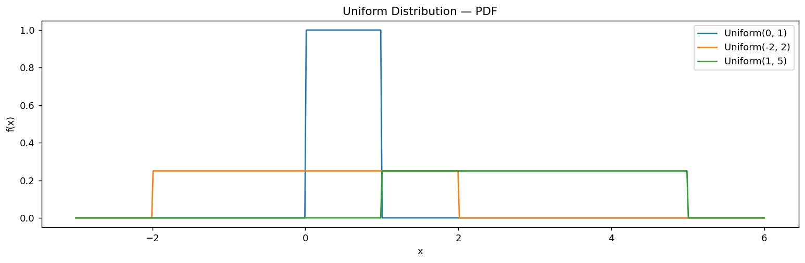

# 균등 밀도함수

## 개요

구간 $[a, b]$ 위의 **연속 균등분포**는 구간의 모든 점에 동일한 확률밀도를 부여한다:

$$
f(x) = \frac{1}{b - a}, \qquad a \le x \le b
$$

| 성질 | 값 |
|---|---|
| 지지집합 | $[a, b]$ |
| 평균 | $(a + b)/2$ |
| 분산 | $(b - a)^2/12$ |
| CDF | $x \in [a, b]$에서 $(x - a)/(b - a)$ |

균등분포는 유계 구간 위의 최대 엔트로피 분포이다. 값이 어디에 놓일지에 대해 가장 적은 가정을 한다.

---

## SciPy 모수화

SciPy는 `stats.uniform(loc=a, scale=b-a)`를 사용하며, `loc`은 왼쪽 끝점이고 `scale`은 구간의 폭이다.

```python
import matplotlib.pyplot as plt
import numpy as np
import scipy.stats as stats

# 구간 [a, b]를 셋 준비한다. 폭이 1, 4, 4로 다르다.
intervals = [(0, 1), (-2, 2), (1, 5)]
x = np.linspace(-3, 6, 500)

fig, ax = plt.subplots(figsize=(12, 4))
for a, b in intervals:
    # scipy의 균등분포 매개변수화에 주의하라.
    # loc = 시작점 a, scale = **폭** (b가 아니라 b - a) 이다.
    # stats.uniform(1, 5) 는 [1, 5]가 아니라 [1, 6]을 뜻한다.
    rv = stats.uniform(loc=a, scale=b - a)
    # 밀도는 구간 안에서 1/(b-a)로 일정하고 밖에서는 0이다.
    # 폭이 좁을수록 높이가 높아진다. 전체 넓이가 언제나 1이어야 하기 때문이다.
    ax.plot(x, rv.pdf(x), label=f'Uniform({a}, {b})')
ax.set_xlabel('x')
ax.set_ylabel('f(x)')
ax.set_title('Uniform Distribution — PDF')
ax.legend()
ax.set_ylim(bottom=-0.05)
plt.tight_layout()
plt.show()
```



전체 넓이가 1이어야 하므로 구간이 넓어질수록 직사각형은 (더 넓어지는 대신) 더 낮아진다.

---

## 연습문제

<div class="drillbox" markdown>

**연습문제 1.**
직접 적분하여 $X \sim \text{Uniform}(a, b)$의 평균과 분산을 유도하라.

</div>

??? success "풀이"
    **평균:**

    $$
    E[X] = \int_a^b \frac{x}{b-a}\,dx = \frac{1}{b-a}\cdot\frac{b^2 - a^2}{2} = \frac{a+b}{2}
    $$

    **2차 적률:**

    $$
    E[X^2] = \int_a^b \frac{x^2}{b-a}\,dx = \frac{b^3 - a^3}{3(b-a)} = \frac{a^2 + ab + b^2}{3}
    $$

    **분산:**

    $$
    \text{Var}(X) = E[X^2] - (E[X])^2 = \frac{a^2+ab+b^2}{3} - \frac{(a+b)^2}{4} = \frac{(b-a)^2}{12}
    $$

<div class="drillbox" markdown>

**연습문제 2.**
$U \sim \text{Uniform}(0,1)$이면 $X = a + (b-a)U \sim \text{Uniform}(a,b)$임을 보여라.

</div>

??? success "풀이"
    $a \le x \le b$에서 $X$의 CDF는:

    $$
    P(X \le x) = P(a + (b-a)U \le x) = P\!\left(U \le \frac{x-a}{b-a}\right) = \frac{x-a}{b-a}
    $$

    이는 $\text{Uniform}(a, b)$의 CDF이다. $\square$

<div class="drillbox" markdown>

**연습문제 3.**
균등분포는 $[a, b]$ 위의 최대 엔트로피 분포이다. 이것이 무슨 뜻인지 밝히고 직관적으로 왜 타당한지 설명하라.

</div>

??? success "풀이"
    $[a, b]$를 지지집합으로 하는 모든 연속분포 중에서 균등분포가 미분 엔트로피 $h(X) = \ln(b - a)$를 최대로 한다. 최대 엔트로피란 최대 불확실성을 뜻한다. 값의 범위는 알지만 값이 어디에 놓일지에 대해서는 그 외에 아무것도 모르는 상태이다. 직관적으로, 균등하지 않은 밀도라면 어떤 부분 영역에 확률을 몰아 준다는 뜻이고, 이는 지지집합 외에 분포에 대해 더 많이 안다는 것을 함의한다.

<div class="drillbox" markdown>

**연습문제 4.**
$X \sim \text{Uniform}(0, 1)$일 때 $Y = -\ln(X)$의 분포를 구하고 어떤 분포인지 밝혀라.

</div>

??? success "풀이"
    $y > 0$에 대해:

    $$
    P(Y \le y) = P(-\ln X \le y) = P(X \ge e^{-y}) = 1 - e^{-y}
    $$

    이는 $\text{Exponential}(\lambda = 1)$의 CDF이다. 따라서 $Y = -\ln(U) \sim \text{Exp}(1)$이며, 이것이 Exponential 분포에 대한 역변환 표본추출의 근거이다.

---

## 정리하며

균등분포는 가장 단순한 연속분포이며, 단순하다는 것이 곧 쓸모다.

- **밀도가 상수** $1/(b-a)$ 이므로 확률이 곧 길이의 비다. 평균은 $(a+b)/2$, 분산은 $(b-a)^2/12$ 이며 **위치는 중점이, 퍼짐은 폭만이 결정한다.**
- **유계 구간 위의 최대 엔트로피 분포다.** 값이 어디 놓일지에 대해 가장 적은 가정을 하므로, 아는 것이 범위뿐일 때의 기본 선택이 된다.
- **SciPy 모수화에 주의하라.** `stats.uniform(loc=a, scale=b-a)` 에서 둘째 인자는 오른쪽 끝점이 아니라 **폭**이다. `uniform(0, 5)` 는 $[0,5]$ 가 맞지만 `uniform(1, 5)` 는 $[1,5]$ 가 아니라 $[1,6]$ 이다.
- $U(0,1)$ 은 모든 난수 생성의 출발점이다. 뒤의 **역변환 표본추출**에서 $F^{-1}(U)$ 로 임의의 분포를 만들어 내는 데 쓰인다.

다음 절 **지수분포**로 넘어간다. 균등분포가 "아무 데나 고르게"라면 지수분포는 "사건이 일어날 때까지 기다리는 시간"이며, 무기억성이라는 특이한 성질을 갖는다.
