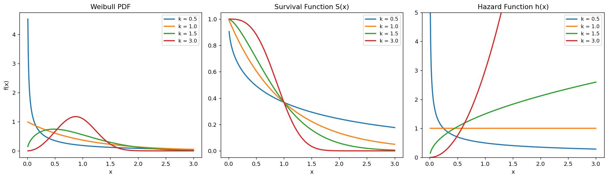

# Weibull 밀도함수와 위험함수

## 개요

**Weibull 분포**는 수명, 고장 시간, 생존 자료를 다루는 유연한 모형이다. 형상 모수 $k$가 위험률이 증가하는지, 감소하는지, 일정한지를 결정한다:

$$
f(x; k, \lambda) = \frac{k}{\lambda}\left(\frac{x}{\lambda}\right)^{k-1} \exp\!\left(-\left(\frac{x}{\lambda}\right)^k\right), \qquad x \ge 0
$$

| $k$ | 위험률 거동 | 특수한 경우 |
|---|---|---|
| $k < 1$ | 감소하는 위험률 (초기 고장) | — |
| $k = 1$ | 일정한 위험률 | Exponential($\lambda$) |
| $k > 1$ | 증가하는 위험률 (노화/마모) | — |
| $k \approx 3.6$ | 근사적으로 정규분포 모양 | — |

---

## 생존함수와 위험함수

$$
S(x) = \exp\!\left(-\left(\frac{x}{\lambda}\right)^k\right), \qquad h(x) = \frac{k}{\lambda}\left(\frac{x}{\lambda}\right)^{k-1}
$$

위험함수 $h(x) = f(x)/S(x)$는 시각 $x$까지 생존했다는 조건 아래 그 시점의 순간 고장률을 준다.

---

## 코드

<div class="codebox" markdown>

**예제 1.** 형상모수에 따른 와이불 밀도와 위험함수

```python
import matplotlib.pyplot as plt
import numpy as np
from scipy import stats

x = np.linspace(0.01, 3.0, 500)
lam = 1.0        # 척도모수. 시간의 단위를 정할 뿐 모양은 바꾸지 않는다.

# 형상모수 k가 이 분포의 성격을 전부 결정한다.
# 아래 세 번째 패널(위험함수)을 보면 그 뜻이 분명해진다.
#   k < 1 : 위험률이 시간에 따라 **감소** — 초기 불량. 살아남을수록 안전해진다.
#   k = 1 : 위험률이 **일정** — 지수분포와 같아진다. 무기억성.
#   k > 1 : 위험률이 시간에 따라 **증가** — 마모. 오래될수록 위험해진다.
params = [
    (0.5, "k=0.5 (decreasing hazard)"),
    (1.0, "k=1.0 (exponential)"),
    (1.5, "k=1.5 (increasing hazard)"),
    (3.0, "k=3.0 (near-normal shape)"),
]

fig, axes = plt.subplots(1, 3, figsize=(15, 4.5))

for k, desc in params:
    # 세 함수를 정의대로 직접 계산한다(scipy를 쓰지 않고).
    #   pdf : 밀도함수
    #   sf  : 생존함수 S(t) = P(T > t) = exp(-(t/lam)^k)
    #   haz : 위험함수 h(t) = pdf/sf.  "여기까지 살아남았다는 조건 하에
    #         지금 당장 고장 날 순간적인 비율"이다.
    # 바일불에서는 pdf/sf 를 계산하면 지수항이 정확히 약분되어
    # 아래처럼 아주 단순한 멱함수만 남는다. 이것이 이 분포가 널리 쓰이는 이유다.
    pdf = (k / lam) * (x / lam) ** (k - 1) * np.exp(-(x / lam) ** k)
    sf = np.exp(-(x / lam) ** k)
    haz = (k / lam) * (x / lam) ** (k - 1)

    axes[0].plot(x, pdf, lw=2, label=f'k = {k}')
    axes[1].plot(x, sf, lw=2, label=f'k = {k}')
    axes[2].plot(x, haz, lw=2, label=f'k = {k}')

axes[0].set_title('Weibull PDF')
axes[0].set_xlabel('x')
axes[0].set_ylabel('f(x)')
axes[1].set_title('Survival Function S(x)')
axes[1].set_xlabel('x')
axes[2].set_title('Hazard Function h(x)')
axes[2].set_xlabel('x')
axes[2].set_ylim(0, 5)

for ax in axes:
    ax.legend(fontsize=9)
plt.tight_layout()
plt.show()
```



</div>

---

## 연습문제

<div class="drillbox" markdown>

**연습문제 1.** <span class="diff easy" title="쉬움"></span>
$k = 1$인 Weibull 분포가 비율 $1/\lambda$인 Exponential 분포로 환원됨을 보여라.

</div>

??? success "풀이"
    $k = 1$로 두면:

    $$
    f(x) = \frac{1}{\lambda}\exp\!\left(-\frac{x}{\lambda}\right)
    $$

    이는 평균이 $\lambda$인 $\text{Exponential}(\text{rate} = 1/\lambda)$의 PDF이다. 위험률은 $h(x) = 1/\lambda$로 상수가 되며, 이는 무기억성과 일관된다. $\square$

<div class="drillbox" markdown>

**연습문제 2.** <span class="diff med" title="중간"></span>
Weibull 분포의 CDF와 중앙값을 유도하라.

</div>

??? success "풀이"
    **CDF:**

    $$
    F(x) = 1 - S(x) = 1 - \exp\!\left(-\left(\frac{x}{\lambda}\right)^k\right)
    $$

    **중앙값:** $F(m) = 0.5$를 풀면:

    $$
    \exp\!\left(-\left(\frac{m}{\lambda}\right)^k\right) = 0.5 \implies \left(\frac{m}{\lambda}\right)^k = \ln 2 \implies m = \lambda(\ln 2)^{1/k}
    $$

<div class="drillbox" markdown>

**연습문제 3.** <span class="diff easy" title="쉬움"></span>
어떤 부품의 수명이 $k = 2$, $\lambda = 1000$시간인 Weibull 분포를 따른다. 500시간을 넘겨 생존할 확률은? 1500시간은?

</div>

??? success "풀이"
    $$
    S(500) = \exp\!\left(-\left(\frac{500}{1000}\right)^2\right) = e^{-0.25} \approx 0.779
    $$

    $$
    S(1500) = \exp\!\left(-\left(\frac{1500}{1000}\right)^2\right) = e^{-2.25} \approx 0.105
    $$

    이 부품이 500시간을 견딜 확률은 77.9%이지만 1500시간을 견딜 확률은 10.5%에 불과하다. 위험률이 증가하므로($k = 2 > 1$) 부품이 나이를 먹을수록 고장이 더 잘 난다.

<div class="drillbox" markdown>

**연습문제 4.** <span class="diff med" title="중간"></span>
더 유연한 분포들이 있는데도 Weibull 분포가 신뢰성 공학에서 널리 쓰이는 이유를 설명하라.

</div>

??? success "풀이"
    Weibull 분포가 널리 쓰이는 데에는 몇 가지 실용적인 장점이 있다:

    1. **해석 가능한 위험률:** 모수 $k$ 하나가 고장률이 증가할지, 감소할지, 일정할지를 직접 결정한다.
    2. **닫힌 형태의 함수:** PDF, CDF, 생존함수, 위험함수가 모두 간단한 닫힌 형태로 주어져 수치적분이 필요 없다.
    3. **선형화 가능:** $\ln(-\ln(S(x)))$를 $\ln(x)$에 대해 그리면 직선이 되어 그래프로 모수를 추정할 수 있다(Weibull 확률지).
    4. **Exponential 분포를 포함:** $k=1$로 두면 가장 단순한 수명 모형이 복원되므로 Weibull은 그 자연스러운 일반화가 된다.

---

## 정리하며

와이불분포의 핵심은 형상 모수 $k$ 하나가 **위험률의 방향**을 정한다는 데 있다.

$$
S(x) = \exp\!\left(-\left(\frac{x}{\lambda}\right)^k\right), \qquad h(x) = \frac{k}{\lambda}\left(\frac{x}{\lambda}\right)^{k-1}
$$

| $k$ | 위험률 | 뜻 |
|---|---|---|
| $k<1$ | 감소 | 초기 고장 — 오래 버틸수록 안전해진다 |
| $k=1$ | 일정 | 지수분포, **무기억성** |
| $k>1$ | 증가 | 노화·마모 — 오래 쓸수록 위험해진다 |

- **$k=1$ 에서 지수분포가 되고, 그때에만 무기억성이 성립한다.** 앞 절의 지수분포가 "노화하지 않는 대상"에만 맞는다고 한 이유가 여기서 분명해진다.
- **위험함수 $h(x)=f(x)/S(x)$ 는 "지금까지 살아남았다는 조건 아래의 순간 고장률"** 이다. 밀도가 아니라 이 함수를 보아야 대상이 노화하는지가 드러난다.
- $k\approx3.6$ 이면 모양이 정규분포에 가까워진다. 하나의 형상 모수로 이만큼 다양한 모양을 낸다는 점이 이 분포가 신뢰성 공학의 기본 도구가 된 이유다.
- 21장의 생존분석이 이 위험함수 개념을 그대로 확장한다.

다음 절 **역변환 표본추출**로 4.2절을 마무리한다. 지금까지 본 분포들에서 실제로 난수를 뽑는 일반적인 방법이다.
