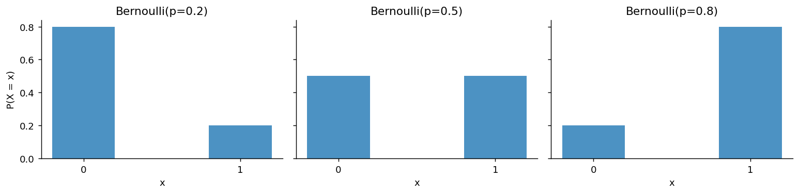
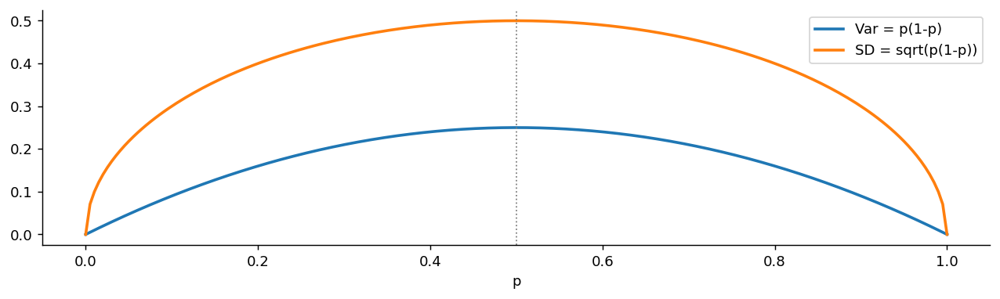

# 베르누이분포

## 개요

**베르누이분포**는 결과가 두 가지뿐인 단 한 번의 시행을 모형화한다. 동전 한 번, 검사 한 개, 클릭 한 번이다. 가장 단순한 확률분포이지만 4.1절의 모든 분포가 여기서 출발한다.

$$
\text{Bernoulli}(p) \;\longrightarrow\; B(n, p) \;\longrightarrow\; \text{HG}(n, N, M) \;\longrightarrow\; \text{Geo}(p) \;\longrightarrow\; \text{NB}(r, p) \;\longrightarrow\; \text{Poisson}(\lambda)
$$

뒤의 다섯 분포는 모두 **베르누이 시행을 어떻게 모으는가**에 대한 답이다. 몇 번 할지 정해 놓고 성공을 세면 이항, 항아리에서 비복원으로 꺼내면 초기하, 성공이 나올 때까지 기다리면 기하와 음이항, 무한히 잘게 쪼개면 포아송이다. 이 페이지는 그 모든 것의 벽돌 한 장을 다룬다.

---

## 정의

<div class="defn" markdown>

### 정의 1. 베르누이분포 { .dfn }

확률변수 $X$가 확률 $p$로 값 1(성공)을, 확률 $1 - p$로 값 0(실패)을 가지면 $X$는 **베르누이분포**를 따른다:

$$
X \sim \text{Bernoulli}(p), \qquad P(X = x) = p^x (1 - p)^{1-x}, \quad x \in \{0, 1\}
$$

</div>

PMF를 $p^x(1-p)^{1-x}$라는 한 줄로 쓴 것은 요령이다. $x = 1$을 넣으면 $p$, $x = 0$을 넣으면 $1-p$가 되어 두 경우가 한 식에 담긴다. 이렇게 써 두면 여러 시행의 결합 가능도를 곱으로 쓸 때 편하다.

### 무엇을 1이라 부를지는 우리가 정한다

"성공"이라는 이름에 뜻이 있는 것은 아니다. 불량품을 1로 두든 정상품을 1로 두든 모형은 같고, $p$가 $1-p$로 바뀔 뿐이다. 중요한 것은 **관심 있는 쪽을 1로 정해 두고 끝까지 일관되게 쓰는 것**이다. 부호를 도중에 바꾸면 평균은 $1-p$로, 이항분포의 성공 횟수는 실패 횟수로 뒤집힌다.

### 지시함수로서의 베르누이

사건 $A$에 대해 지시함수를 다음과 같이 정의하면

$$
\mathbb{1}_A = \begin{cases} 1 & A\text{가 일어나면} \\ 0 & \text{아니면} \end{cases}
$$

$\mathbb{1}_A \sim \text{Bernoulli}(P(A))$이고 따라서

$$
E[\mathbb{1}_A] = P(A)
$$

가 된다. **확률이 곧 기댓값**이라는 이 한 줄이 확률론에서 가장 자주 쓰이는 다리다. "몇 개나 일어나는가"를 묻는 문제를 지시함수의 합으로 바꾸면, 기댓값의 선형성만으로 답이 나온다. 이항분포의 평균(다음 페이지)과 초기하분포의 평균이 모두 이 방법으로 계산된다. 두 경우 모두 지시함수들이 독립인지 아닌지는 **상관이 없다.** 선형성은 독립을 요구하지 않기 때문이다.

---

## 성질

| 성질 | 값 |
|---|---|
| 지지집합 | $\{0, 1\}$ |
| 평균 | $p$ |
| 분산 | $p(1-p)$ |
| 표준편차 | $\sqrt{p(1-p)}$ |
| 최빈값 | $p > 1/2$이면 1, $p < 1/2$이면 0 |
| 왜도 | $\dfrac{1 - 2p}{\sqrt{p(1-p)}}$ |
| MGF | $1 - p + pe^t$ |

### 평균과 분산의 유도

값이 둘뿐이므로 정의대로 더하면 끝이다.

$$
E[X] = 0 \cdot (1-p) + 1 \cdot p = p
$$

$X$가 0 또는 1만 가지므로 $X^2 = X$라는 점이 요긴하다. 따라서

$$
E[X^2] = E[X] = p, \qquad \text{Var}(X) = E[X^2] - (E[X])^2 = p - p^2 = p(1-p)
$$

$\square$

$X^2 = X$는 **멱등성**이며, 0장에서 본 멱등행렬과 같은 성질이다. 사영과 지시함수는 "두 번 해도 한 번 한 것과 같다"는 구조를 공유한다.

### 분산은 p = 1/2에서 최대다

$$
\frac{d}{dp}\,p(1-p) = 1 - 2p = 0 \iff p = \frac12
$$

이계도함수가 $-2 < 0$이므로 최대점이고, 최대 분산은 $1/4$이다. **결과가 가장 불확실할 때 분산이 가장 크다**는 당연한 사실의 계산적 표현이다. $p$가 0이나 1에 가까우면 결과가 거의 정해져 있으므로 흔들릴 여지가 없다.

이 단순한 사실이 표본크기 계산에 그대로 쓰인다(연습문제 4).

---

## 베르누이 시행이라는 가정

이항분포부터 포아송분포까지가 기대는 전제는 "독립인 베르누이 시행의 열"이다. 이 말에는 두 가지 가정이 들어 있다.

1. **동일성:** 매 시행의 성공확률이 같은 $p$다.
2. **독립성:** 한 시행의 결과가 다른 시행에 영향을 주지 않는다.

현실에서는 둘 다 깨지기 쉽다. 생산라인이 시간이 지나며 마모되면 $p$가 변하고(동일성 위반), 같은 환자에게서 여러 번 측정하면 관측이 서로 닮는다(독립성 위반). 두 위반은 결과가 다르다.

| 깨지는 가정 | 나타나는 현상 | 대응하는 모형 |
|---|---|---|
| 동일성($p_i$가 다름) | 합이 이항이 아니다 | 포아송–이항분포 |
| 독립성(비복원추출) | 분산이 줄어든다 | 초기하분포 |
| 독립성(묶음 내 상관) | 분산이 커진다 | 베타–이항분포 |

**분산이 이항분포의 $np(1-p)$와 어긋나는지가 가정 위반의 신호**이며, 어느 쪽으로 어긋나는지가 원인을 가리킨다.

---

## 문제

<div class="probox" markdown>

**문제:** <span class="diff easy" title="쉬움"></span> 어떤 광고의 클릭률이 2%다. 방문자 한 명이 클릭하는지 여부를 $X$라 할 때 $E[X]$, $\text{Var}(X)$, $\text{SD}(X)$를 구하라. 표준편차가 평균보다 큰 것이 이상한가?

</div>

??? success "풀이"

    $X \sim \text{Bernoulli}(0.02)$이므로

    $$
    E[X] = 0.02, \qquad \text{Var}(X) = 0.02 \times 0.98 = 0.0196, \qquad \text{SD}(X) = 0.14
    $$

    이다.

    표준편차 0.14가 평균 0.02보다 일곱 배 크지만 전혀 이상하지 않다. $X$는 0 아니면 1만 가지는데 평균은 0.02로 둘 사이 어디에도 없는 값이다. **한 번의 관측으로는 평균 근처의 값이 아예 나올 수 없는** 분포이며, 이런 상황에서 변동계수 $\text{SD}/E = \sqrt{(1-p)/p} = 7$이 큰 것은 당연하다.

    실무적 함의는 분명하다. 클릭률처럼 $p$가 작은 양을 추정하려면 표본이 아주 많이 필요하다. 방문자 $n$명의 클릭률 추정값 $\hat p$의 표준오차가 $\sqrt{p(1-p)/n} = 0.14/\sqrt n$이므로, 오차를 0.002 안에 넣으려면 $n \approx 4{,}900$명이 필요하다.

---

## Python: PMF, 분산, 표본추출

### PMF

<div class="codebox" markdown>

#### 예제 1. 성공확률에 따른 베르누이 PMF { .eg }

```python
import matplotlib.pyplot as plt
import numpy as np
from scipy import stats

ps = [0.2, 0.5, 0.8]
x = np.array([0, 1])

fig, axes = plt.subplots(1, 3, figsize=(12, 3), sharey=True)
# 막대가 둘뿐인 분포다. 높이는 1-p 와 p 이고 합은 언제나 1이다.
# p가 커질수록 질량이 0에서 1로 옮겨 갈 뿐 모양이랄 것이 없다.
for ax, p in zip(axes, ps):
    ax.bar(x, stats.bernoulli(p).pmf(x), width=0.4, alpha=0.8)
    ax.set_title(f'Bernoulli(p={p})')
    ax.set_xticks(x)
    ax.set_xlabel('x')
    ax.spines[['top', 'right']].set_visible(False)
axes[0].set_ylabel('P(X = x)')
plt.tight_layout()
plt.show()
```



</div>

### 분산은 가운데에서 가장 크다

<div class="codebox" markdown>

#### 예제 2. p에 따른 분산과 표준편차 { .eg }

```python
import matplotlib.pyplot as plt
import numpy as np

p = np.linspace(0, 1, 200)

fig, ax = plt.subplots(figsize=(12, 3))
# 분산 p(1-p)는 위로 볼록한 포물선으로 p=0.5에서 최대 0.25 다.
# 표준편차는 그 제곱근이라 가운데가 더 평평하다.
#   -> p가 0.3이든 0.5든 표준편차가 0.458 대 0.5 로 10%밖에 차이 나지 않는다.
# 여론조사에서 p를 모르고도 표본크기를 정할 수 있는 근거가 이 평평함이다.
ax.plot(p, p * (1 - p), lw=2, label='Var = p(1-p)')
ax.plot(p, np.sqrt(p * (1 - p)), lw=2, label='SD = sqrt(p(1-p))')
ax.axvline(0.5, color='gray', ls=':', lw=1)
ax.set_xlabel('p')
ax.spines[['top', 'right']].set_visible(False)
ax.legend()
plt.show()
```



</div>

### 표본추출과 큰수의 법칙

<div class="codebox" markdown>

#### 예제 3. 표본평균이 p로 수렴하는 모습 { .eg }

```python
import numpy as np
from scipy import stats

np.random.seed(42)
p = 0.3
samples = stats.bernoulli(p).rvs(100_000)

# 베르누이 표본의 평균은 곧 성공 비율이다. 큰수의 법칙에 따라 p로 간다.
for n in (10, 100, 1_000, 10_000, 100_000):
    print(f"n = {n:>7}:  표본비율 = {samples[:n].mean():.4f}")
print(f"이론값 p = {p},  Var = {p*(1-p):.4f}")
```

출력:

```
n =      10:  표본비율 = 0.4000
n =     100:  표본비율 = 0.3000
n =    1000:  표본비율 = 0.2880
n =   10000:  표본비율 = 0.2887
n =  100000:  표본비율 = 0.2989
```

표본이 열 배가 될 때마다 오차가 **평균적으로** $\sqrt{10} \approx 3.2$배씩 줄어든다. 표준오차가 $\sqrt{p(1-p)/n}$이기 때문이다. 다만 한 번의 실행에서 수렴이 단조롭지는 않다. 위에서도 $n = 100$의 오차가 $n = 1000$보다 작은데, 우연히 잘 맞은 것일 뿐이다. **큰수의 법칙은 평균적인 경향이지 매 단계의 보장이 아니다.**

</div>

---

## 다른 분포와의 관계

$$
\begin{aligned}
\sum_{i=1}^n \text{Bernoulli}_i(p) &= B(n, p) \quad \text{(독립일 때)} \\[4pt]
\text{Bernoulli}(p) &= B(1, p) \\[4pt]
\text{Bernoulli}(N/M) &= \text{HG}(1, N, M) \\[4pt]
\mathbb{1}_A &\sim \text{Bernoulli}(P(A))
\end{aligned}
$$

베르누이분포는 이항분포의 $n = 1$인 경우이자 초기하분포의 $n = 1$인 경우다. 한 번만 뽑으면 복원이든 비복원이든 차이가 없으니 당연하다.

다음 페이지에서는 이 시행을 $n$번 모아 **이항분포**를 만든다.

---

## 연습문제

<div class="drillbox" markdown>

**연습문제 1.** <span class="diff easy" title="쉬움"></span>
$X \sim \text{Bernoulli}(p)$에 대해 (a) $E[X^k] = p$가 모든 정수 $k \ge 1$에서 성립함을 보여라. (b) 이를 이용해 3차 중심적률과 왜도를 구하라.

</div>

??? success "풀이"
    (a) $X$가 0 또는 1만 가지므로 $X^k = X$다. 따라서 $E[X^k] = E[X] = p$이다. $\square$

    (b) 중심적률은

    $$
    E[(X-p)^3] = E[X^3] - 3pE[X^2] + 3p^2E[X] - p^3 = p - 3p^2 + 3p^3 - p^3 = p(1-p)(1-2p)
    $$

    이다. 왜도는 이를 $\sigma^3 = \{p(1-p)\}^{3/2}$으로 나눈

    $$
    \gamma_1 = \frac{p(1-p)(1-2p)}{\{p(1-p)\}^{3/2}} = \frac{1-2p}{\sqrt{p(1-p)}}
    $$

    이다.

    $p = 1/2$에서 0(대칭)이고, $p < 1/2$이면 양수(오른쪽 꼬리), $p > 1/2$이면 음수다. $p$가 극단으로 갈수록 왜도의 절댓값이 무한대로 커지는데, 희귀사건일수록 분포가 한쪽으로 심하게 쏠린다는 뜻이다. 이항분포의 왜도 $\frac{1-2p}{\sqrt{np(1-p)}}$는 여기에 $\sqrt n$만 나눈 꼴이며, $n$이 커지면 0으로 가는 것이 정규근사가 작동하는 이유다.

<div class="drillbox" markdown>

**연습문제 2.** <span class="diff easy" title="쉬움"></span>
$X \sim \text{Bernoulli}(p)$의 적률생성함수 $M(t) = E[e^{tX}]$를 구하고, 미분하여 평균과 분산을 확인하라.

</div>

??? success "풀이"
    값이 둘뿐이므로 정의대로 더한다.

    $$
    M(t) = e^{t \cdot 0}(1-p) + e^{t \cdot 1}p = 1 - p + pe^t
    $$

    미분하면 $M'(t) = pe^t$, $M''(t) = pe^t$이므로

    $$
    E[X] = M'(0) = p, \qquad E[X^2] = M''(0) = p
    $$

    이고 $\text{Var}(X) = p - p^2 = p(1-p)$이다. $\square$

    모든 차수의 도함수가 $pe^t$로 같다는 점이 $E[X^k] = p$(연습문제 1)의 또 다른 표현이다.

    이 MGF가 중요한 이유는 곱으로 쌓인다는 데 있다. 독립인 $n$개를 더하면 MGF가 $(1-p+pe^t)^n$이 되는데, 이것이 바로 이항분포의 MGF다. **분포의 덧셈이 MGF의 곱셈이 된다**는 성질이 다음 페이지 전체를 떠받친다.

<div class="drillbox" markdown>

**연습문제 3.** <span class="diff med" title="중간"></span>
$X_1 \sim \text{Bernoulli}(p_1)$과 $X_2 \sim \text{Bernoulli}(p_2)$가 독립이다. (a) $X_1 + X_2$는 베르누이분포를 따르는가? (b) $X_1 X_2$는? (c) $\max(X_1, X_2)$는?

</div>

??? success "풀이"
    (a) **아니다.** 합이 0, 1, 2의 세 값을 가질 수 있으므로 지지집합부터 어긋난다. $p_1 = p_2 = p$이면 $B(2, p)$이고, 다르면 그것도 아니다(포아송–이항분포).

    (b) **그렇다.** 곱이 1이 되려면 둘 다 1이어야 하므로

    $$
    X_1X_2 \sim \text{Bernoulli}(p_1p_2)
    $$

    이다. 지시함수로 보면 $\mathbb{1}_A\mathbb{1}_B = \mathbb{1}_{A \cap B}$이고 독립이면 $P(A \cap B) = P(A)P(B)$라는 이야기와 같다.

    (c) **그렇다.** 최댓값이 1이 되려면 적어도 하나가 1이면 되므로

    $$
    \max(X_1, X_2) \sim \text{Bernoulli}(1 - (1-p_1)(1-p_2))
    $$

    이다. 이것도 지시함수로 보면 $\max(\mathbb{1}_A, \mathbb{1}_B) = \mathbb{1}_{A \cup B}$이고, 여사건의 곱으로 합집합 확률을 구하는 익숙한 계산이다.

    **정리하면 베르누이족은 곱과 최댓값·최솟값에 대해 닫혀 있지만 덧셈에 대해서는 닫혀 있지 않다.** 0과 1만 갖는 값에 논리 연산(그리고, 또는)을 하면 다시 0과 1이지만, 산술 덧셈은 그 울타리를 벗어나기 때문이다.

<div class="drillbox" markdown>

**연습문제 4.** <span class="diff med" title="중간"></span>
**베르누이 분산은 $p = 1/2$에서 최대가 된다.** 이를 해석적으로 증명하고 신뢰구간 계산에서 갖는 실용적 의미를 설명하라.

</div>

??? success "풀이"
    $\text{Var}(X) = p(1 - p)$를 $p$에 대해 미분하면

    $$
    \frac{d}{dp}\, p(1-p) = 1 - 2p
    $$

    이다. 0으로 두면 $p = 1/2$이다. 이계도함수가 $-2 < 0$이므로 최대점이며, 최대 분산은 $1/4$이다.

    **실용적 의미.** 이항 비율의 신뢰구간에서 최악의 경우 분산은 $p(1-p) \le 1/4$이다. 보수적인 표준오차는 $\sqrt{1/(4n)} = 1/(2\sqrt n)$이므로, 95% 오차한계는 최대 $1.96/(2\sqrt n) \approx 1/\sqrt n$이다.

    오차한계를 $\le 0.03$으로 두면 $n \ge 1/(0.03)^2 \approx 1111$이 되는데, 이것이 전국 여론조사에서 "n ≈ 1000" 규칙이 나온 배경이다. 실제 $p$는 대개 0.5에서 떨어져 있으므로 이 보수적 한계는 다소 느슨하지만, **$p$가 무엇이든 통하는** 표본크기 추정치를 준다는 것이 장점이다.

    예제 2의 그림에서 보듯 표준편차 곡선이 가운데에서 평평하다는 점도 함께 기억할 만하다. $p$를 0.3으로 잘못 짐작해도 표준편차는 0.458로 최댓값 0.5의 92%라 표본크기 계산이 크게 어긋나지 않는다.

<div class="drillbox" markdown>

**연습문제 5.** <span class="diff med" title="중간"></span>
$p$를 모르는 베르누이 시행을 $n$번 관측해 $\sum x_i = s$를 얻었다. $p$의 최대가능도추정량을 구하고, 그것이 불편임을 보여라.

</div>

??? success "풀이"
    PMF를 한 줄로 써 둔 덕분에 가능도가 곱으로 깔끔하게 정리된다.

    $$
    L(p) = \prod_{i=1}^n p^{x_i}(1-p)^{1-x_i} = p^{s}(1-p)^{n-s}
    $$

    로그를 취하고 미분하면

    $$
    \ell(p) = s\ln p + (n-s)\ln(1-p), \qquad \ell'(p) = \frac sp - \frac{n-s}{1-p} = 0
    $$

    이고, 정리하면 $s(1-p) = (n-s)p$에서

    $$
    \hat p = \frac sn = \bar x
    $$

    를 얻는다. **표본비율이 곧 최대가능도추정량**이다.

    불편성은 기댓값의 선형성에서 곧바로 나온다.

    $$
    E[\hat p] = \frac1n\sum_{i=1}^n E[X_i] = \frac1n \cdot np = p
    $$

    $\square$

    분산은 $\text{Var}(\hat p) = p(1-p)/n$이며, 이것이 크라메르–라오 하한과 일치하므로 $\hat p$는 **최소분산 불편추정량**이다. 피셔 정보량이 $I(p) = 1/\{p(1-p)\}$이므로 하한이 $1/\{nI(p)\} = p(1-p)/n$이 되는 것을 직접 확인할 수 있다.

<div class="drillbox" markdown>

**연습문제 6.** <span class="diff med" title="중간"></span>
$\mathbb{1}_A$가 베르누이확률변수라는 사실을 써서, 사건 $A_1, \ldots, A_n$ 가운데 일어나는 사건의 개수 $N$의 평균을 구하라. 사건들이 독립이 아니어도 되는가? 분산은 어떤가?

</div>

??? success "풀이"
    $N = \sum_{i=1}^n \mathbb{1}_{A_i}$로 쓰면 기댓값의 선형성에 의해

    $$
    E[N] = \sum_{i=1}^n E[\mathbb{1}_{A_i}] = \sum_{i=1}^n P(A_i)
    $$

    이다. **독립일 필요가 전혀 없다.** 선형성은 결합분포에 아무 조건도 요구하지 않기 때문이다.

    분산은 사정이 다르다.

    $$
    \text{Var}(N) = \sum_i P(A_i)\{1 - P(A_i)\} + \sum_{i \ne j}\{P(A_i \cap A_j) - P(A_i)P(A_j)\}
    $$

    둘째 항의 각 조각은 $\text{Cov}(\mathbb{1}_{A_i}, \mathbb{1}_{A_j})$이며, 사건들이 독립일 때만 0이 된다. **평균은 공짜로 얻지만 분산은 의존구조를 알아야 한다.**

    이 비대칭이 4장 전체에 되풀이해 나타난다. 초기하분포에서 평균이 이항분포와 같고 분산만 유한모집단 수정계수만큼 작았던 것이 바로 이 구조였다.

    지시함수 기법의 위력을 보여 주는 고전적인 예가 **일치 문제**다. $n$명이 모자를 무작위로 도로 집어 갈 때 자기 모자를 집는 사람 수의 평균은, 각자가 자기 모자를 집을 확률이 $1/n$이므로 $n \times (1/n) = 1$이다. $n$과 무관하게 언제나 1이며, 사건들이 서로 독립이 아닌데도 한 줄로 끝난다.

<div class="drillbox" markdown>

**연습문제 7.** <span class="diff hard" title="어려움"></span>
베르누이분포의 **엔트로피** $H(p) = -p\ln p - (1-p)\ln(1-p)$를 구하고 최대가 되는 $p$를 찾아라. 분산이 최대가 되는 지점과 같은 이유는 무엇이고, 두 양은 어떻게 다른가?

</div>

??? success "풀이"
    미분하면

    $$
    H'(p) = -\ln p - 1 + \ln(1-p) + 1 = \ln\frac{1-p}{p}
    $$

    이고 0으로 두면 $(1-p)/p = 1$, 즉 $p = 1/2$다. 이계도함수가 $-1/\{p(1-p)\} < 0$이므로 최대이며 최댓값은 $H(1/2) = \ln 2$(비트로 재면 1비트)다.

    **왜 같은 지점인가.** 둘 다 "결과가 얼마나 불확실한가"를 재는 양이고, 두 결과가 똑같이 일어날 법할 때 불확실성이 최대이기 때문이다. 대칭성만으로도 극점이 $p = 1/2$에 있으리라 짐작할 수 있다.

    **어떻게 다른가.** 끝점에서의 거동이 다르다. $p \to 0$일 때

    $$
    \text{Var} = p(1-p) \approx p, \qquad H(p) \approx p\ln\frac1p
    $$

    로 엔트로피가 분산보다 **느리게** 0으로 간다($\ln(1/p)$만큼 더 크다). 희귀사건에서 분산은 거의 사라지지만 엔트로피는 그만큼 빨리 줄지 않는다는 뜻이며, "거의 일어나지 않는 일이 일어났다"는 사건이 담는 정보가 크기 때문이다.

    또 분산은 값의 **척도**에 의존하지만 엔트로피는 그렇지 않다. $X$ 대신 $100X$를 재면 분산은 1만 배가 되지만 엔트로피는 그대로다. 엔트로피는 결과에 붙은 이름표를 바꿔도 변하지 않는 순수한 불확실성의 척도다.

    이 구별은 실무에서 나뉘는 지점이 있다. 의사결정나무의 분할 기준으로 쓰는 지니 불순도 $2p(1-p)$는 분산 쪽이고, 정보이득은 엔트로피 쪽이다. 둘 다 $p = 1/2$에서 최대라 실제 결과가 비슷하게 나오지만, 극단적으로 불균형한 자료에서는 엔트로피 쪽이 소수 범주를 더 크게 취급한다.

<div class="drillbox" markdown>

**연습문제 8.** <span class="diff med" title="중간"></span>
**피셔 정보량.** $X \sim \text{Bernoulli}(p)$의 피셔 정보량 $I(p) = -E\!\left[\partial_p^2 \log f(X;p)\right]$를 구하라. 이를 이용해 $n$개 표본에서 $p$의 불편추정량이 가질 수 있는 분산의 하한(크라메르–라오 하한)을 적고, 연습문제 5의 최대가능도추정량이 그 하한에 **도달**함을 보여라. $I(p)$가 $p \to 0$이나 $p \to 1$에서 어떻게 되는지도 해석하라.

</div>

??? success "풀이"
    **정보량.** PMF를 $f(x;p) = p^x(1-p)^{1-x}$로 쓰면

    $$
    \log f = x\log p + (1-x)\log(1-p),
    \qquad
    \frac{\partial \log f}{\partial p} = \frac{x}{p} - \frac{1-x}{1-p}
    $$

    이고 한 번 더 미분하면

    $$
    \frac{\partial^2 \log f}{\partial p^2} = -\frac{x}{p^2} - \frac{1-x}{(1-p)^2}
    $$

    이다. $E[X] = p$를 넣어 부호를 뒤집으면

    $$
    I(p) = \frac{p}{p^2} + \frac{1-p}{(1-p)^2} = \frac1p + \frac{1}{1-p} = \frac{1}{p(1-p)}
    $$

    를 얻는다. **분산의 역수**라는 점에 주목하라.

    **크라메르–라오 하한.** 독립인 $n$개 표본의 정보량은 더해지므로 $I_n(p) = n/\{p(1-p)\}$이고, $p$의 임의의 불편추정량 $\tilde p$에 대해

    $$
    \operatorname{Var}(\tilde p) \;\ge\; \frac{1}{I_n(p)} = \frac{p(1-p)}{n}
    $$

    이다. 그런데 연습문제 5의 최대가능도추정량 $\hat p = \bar X$는

    $$
    \operatorname{Var}(\hat p) = \frac{\operatorname{Var}(X)}{n} = \frac{p(1-p)}{n}
    $$

    로 **하한과 정확히 같다.** 즉 $\hat p$는 유효추정량이며, 불편추정량 중에서 이보다 분산이 작은 것은 존재하지 않는다. $\square$

    **$I(p)$의 모양을 읽어라.**

    | $p$ | $I(p) = 1/\{p(1-p)\}$ | 한 관측이 주는 정보 |
    |:---:|:---:|:---|
    | $0.5$ | $4$ | 가장 적다 |
    | $0.1$ | $11.1$ | 더 많다 |
    | $0.01$ | $101$ | 훨씬 많다 |
    | $\to 0$ 또는 $\to 1$ | $\to \infty$ | 발산 |

    **정보량이 가장 작은 곳이 $p = 1/2$**다. 동전이 공정할수록 한 번의 던지기가 $p$에 대해 알려 주는 것이 적다. 연습문제 4에서 분산이 $p = 1/2$에서 최대였던 것과 같은 사실을 반대편에서 본 것이다.

    **끝점에서 발산하는 것은 착시가 아니다.** $p$가 $0$에 가까우면 성공 한 번을 관측하는 것만으로 "$p$가 그렇게 작지는 않다"는 강한 정보가 들어온다. 다만 이 발산을 "희귀사건 추정이 쉽다"로 읽으면 안 된다. **상대적으로** 보면 정반대다. $\hat p$의 변동계수는

    $$
    \frac{\sqrt{\operatorname{Var}(\hat p)}}{p} = \sqrt{\frac{1-p}{np}}
    $$

    로 $p \to 0$에서 발산한다. 절대 오차는 작아지지만 **상대 오차는 커진다.** $p = 0.001$을 20% 이내로 추정하려면 $n$이 수만 단위여야 한다.

    이것이 8장에서 비율의 신뢰구간이 극단적인 $\hat p$에서 무너지는 이유의 뿌리다. $\hat p = 0$이면 왈드 구간의 폭이 $0$이 되어 버리는데, 정보량이 크다는 것과 구간이 좁아야 한다는 것은 전혀 다른 이야기다.

<div class="drillbox" markdown>

**연습문제 9.** <span class="diff med" title="중간"></span>
$X_1, \ldots, X_n \sim \text{Bernoulli}(p)$가 독립이고 $\hat p = \bar X$라 하자. 분산 $p(1-p)$의 자연스러운 추정량인 $\hat p(1-\hat p)$는 **불편이 아니다.** $E[\hat p(1-\hat p)]$를 정확히 구하고, 불편이 되도록 고쳐라. 어디서 본 보정인가?

</div>

??? success "풀이"
    $S = \sum_i X_i \sim B(n,p)$이고 $\hat p = S/n$이다. 이차적률부터 구한다.

    $$
    E[\hat p^{\,2}] = \operatorname{Var}(\hat p) + (E[\hat p])^2 = \frac{p(1-p)}{n} + p^2
    $$

    따라서

    $$
    E[\hat p(1-\hat p)] = E[\hat p] - E[\hat p^{\,2}]
    = p - p^2 - \frac{p(1-p)}{n}
    = p(1-p)\left(1 - \frac1n\right)
    = \frac{n-1}{n}\,p(1-p)
    $$

    이다. **체계적으로 과소추정한다.** 참값의 $\frac{n-1}{n}$배이므로

    $$
    \widehat{\operatorname{Var}} = \frac{n}{n-1}\,\hat p(1-\hat p)
    $$

    가 불편추정량이다. $\square$

    **$n-1$이 또 나왔다.** 2장에서 표본분산을 $n-1$로 나눈 것과 **정확히 같은 보정**이다. 우연이 아니다. 베르누이 자료에서 표본분산을 직접 계산해 보면

    $$
    \frac{1}{n-1}\sum_i (X_i - \bar X)^2 = \frac{1}{n-1}\left(\sum_i X_i^2 - n\bar X^2\right)
    \overset{X_i^2 = X_i}{=} \frac{n}{n-1}\,\hat p(1-\hat p)
    $$

    로 위의 보정과 같은 식이 나온다. 멱등성 $X_i^2 = X_i$가 둘을 잇는다. **일반적인 $n-1$ 보정의 베르누이 특수판**인 것이다.

    ```python
    import numpy as np
    rng = np.random.default_rng(0)
    p, reps = 0.3, 200_000
    print(f"참값 p(1-p) = {p*(1-p):.4f}\n")
    print(f"{'n':>5}{'E[phat(1-phat)]':>18}{'이론 (n-1)/n':>15}{'보정 후':>12}")
    for n in (2, 5, 10, 50):
        S = rng.binomial(n, p, reps)
        ph = S / n
        raw = np.mean(ph * (1 - ph))
        corr = np.mean(n / (n - 1) * ph * (1 - ph))
        print(f"{n:>5}{raw:>18.4f}{(n-1)/n*p*(1-p):>15.4f}{corr:>12.4f}")
    ```

    출력:

    ```
        n   E[phat(1-phat)]     이론 (n-1)/n        보정 후
        2            0.1049         0.1050      0.2097
        5            0.1679         0.1680      0.2099
       10            0.1891         0.1890      0.2102
       50            0.2058         0.2058      0.2100
    ```

    **$n = 2$에서 편향이 절반이나 된다.** 그리고 $n$이 커지면 $\frac{n-1}{n} \to 1$이라 편향이 사라진다. $n = 50$이면 이미 2% 차이라 실무에서는 대개 무시한다.

    **그래도 무시하면 안 되는 자리가 있다.** 비율의 표준오차 $\sqrt{\hat p(1-\hat p)/n}$는 이 편향된 추정량을 그대로 쓰므로 표준오차를 **과소평가**한다. 작은 표본에서 신뢰구간이 명목 신뢰수준보다 좁아지는 원인 하나가 여기에 있으며, 8장에서 윌슨 구간이 왈드 구간보다 나은 이유와도 얽혀 있다.

<div class="drillbox" markdown>

**연습문제 10.** <span class="diff hard" title="어려움"></span>
$X \sim \text{Bernoulli}(p_1)$, $Y \sim \text{Bernoulli}(p_2)$이지만 **독립이라고 가정하지 않는다.** 둘의 상관계수 $\rho$가 가질 수 있는 값의 범위를 $p_1, p_2$로 나타내라. 특히 $p_1 = 0.1$, $p_2 = 0.1$일 때 $\rho = -1$이 가능한가? 결과를 4.3절 결합분포의 관점에서 해석하라.

</div>

??? success "풀이"
    **자유도는 하나뿐이다.** 주변분포가 고정되어 있으므로 결합분포는 $\pi_{11} = P(X=1, Y=1)$ 하나로 완전히 결정된다.

    | | $Y=0$ | $Y=1$ | 합 |
    |:---:|:---:|:---:|:---:|
    | $X=0$ | $1-p_1-p_2+\pi_{11}$ | $p_2-\pi_{11}$ | $1-p_1$ |
    | $X=1$ | $p_1-\pi_{11}$ | $\pi_{11}$ | $p_1$ |
    | **합** | $1-p_2$ | $p_2$ | $1$ |

    네 칸이 모두 $0$ 이상이어야 하므로

    $$
    \max(0,\; p_1+p_2-1) \;\le\; \pi_{11} \;\le\; \min(p_1,\, p_2)
    $$

    이다. 이것이 **프레셰–회프딩 경계**다. 한편 $E[XY] = \pi_{11}$이므로

    $$
    \operatorname{Cov}(X,Y) = \pi_{11} - p_1p_2,
    \qquad
    \rho = \frac{\pi_{11}-p_1p_2}{\sqrt{p_1(1-p_1)\,p_2(1-p_2)}}
    $$

    이고, $\pi_{11}$의 양 끝을 넣으면 $\rho$의 범위가 그대로 나온다. $q_i = 1-p_i$로 쓰면 $p_1 \le p_2$이고 $p_1+p_2 \le 1$인 경우

    $$
    \rho_{\min} = -\sqrt{\frac{p_1p_2}{q_1q_2}},
    \qquad
    \rho_{\max} = \sqrt{\frac{p_1q_2}{q_1p_2}}
    $$

    이다. $\square$

    **$p_1 = p_2 = 0.1$이면 $\rho = -1$은 불가능하다.** 위 식에 넣으면

    $$
    \rho_{\min} = -\sqrt{\frac{0.01}{0.81}} = -\frac19 \approx -0.111
    $$

    이다. 아무리 강하게 음의 관계를 만들어도 $-0.111$보다 내려갈 수 없다. 이유는 표에서 바로 보인다. 완전한 음의 관계라면 $X=1$일 때 반드시 $Y=0$, $X=0$일 때 반드시 $Y=1$이어야 하는데, 그러려면 $P(Y=1) = P(X=0) = 0.9$여야 한다. $p_2 = 0.1$과 모순이다.

    | $p_1$ | $p_2$ | $\rho_{\min}$ | $\rho_{\max}$ |
    |:---:|:---:|:---:|:---:|
    | $0.5$ | $0.5$ | $-1.0000$ | $1.0000$ |
    | $0.3$ | $0.3$ | $-0.4286$ | $1.0000$ |
    | $0.1$ | $0.1$ | $-0.1111$ | $1.0000$ |
    | $0.2$ | $0.8$ | $-1.0000$ | $0.2500$ |
    | $0.1$ | $0.9$ | $-1.0000$ | $0.1111$ |
    | $0.05$ | $0.5$ | $-0.2294$ | $0.2294$ |

    규칙이 둘 보인다. **주변분포가 같으면($p_1 = p_2$) $\rho_{\max} = 1$이 언제나 가능**하다. $X = Y$로 두면 되기 때문이다. 그리고 **$p_1 + p_2 = 1$이면 $\rho_{\min} = -1$이 가능**하다. 그때는 $Y = 1-X$로 둘 수 있다.

    **4.3절과 이어 읽어라.** 결합분포 절에서 "주변분포는 결합분포를 결정하지 못한다"고 했는데, 이 연습문제는 그 말의 **반쪽**을 보여 준다. 주변분포가 결합분포를 정하지는 못하지만 **아무것이나 허용하지도 않는다.** 주변분포는 결합분포가 놓일 수 있는 구간의 양 끝을 정하고, 그 안에서 의존 구조가 자유로울 뿐이다.

    **실무적 함의.** 희귀사건 두 개의 상관계수는 구조적으로 $0$ 근처에 갇힌다. 부도, 희귀질환, 클릭처럼 $p$가 작은 이진 변수들 사이에서 $\rho = -0.05$를 보고 "관계가 거의 없다"고 읽으면 틀릴 수 있다. 가능한 최솟값이 $-0.111$인 상황이라면 $-0.05$는 **가능한 범위의 절반**에 해당하는 강한 음의 관계다. 이런 이유로 이진 자료에서는 상관계수 대신 **오즈비**를 쓰는 일이 많다. 오즈비는 주변분포에 따라 범위가 눌리지 않기 때문이다.

---

## 정리하며

- 베르누이분포는 결과가 두 가지인 한 번의 시행이다. 모수가 $p$ 하나뿐이고 평균도 $p$, 분산은 $p(1-p)$다.
- $X^2 = X$라는 멱등성 덕분에 모든 적률이 $p$로 같고, 분산 계산이 한 줄로 끝난다.
- 사건 $A$의 지시함수가 $\text{Bernoulli}(P(A))$이므로 $E[\mathbb{1}_A] = P(A)$다. **확률을 기댓값으로 바꿔 주는 이 다리**가 4장 전체에서 반복해 쓰인다.
- 분산은 $p = 1/2$에서 $1/4$로 최대이고, 이것이 여론조사의 "$n \approx 1000$" 규칙의 근거다.
- 베르누이족은 곱과 논리 연산에는 닫혀 있지만 덧셈에는 닫혀 있지 않다. 더하는 순간 이항분포로 넘어가며, 그것이 다음 페이지다.
