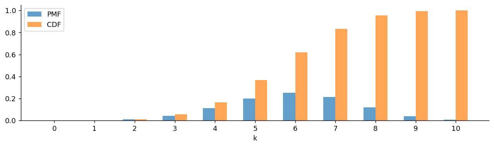
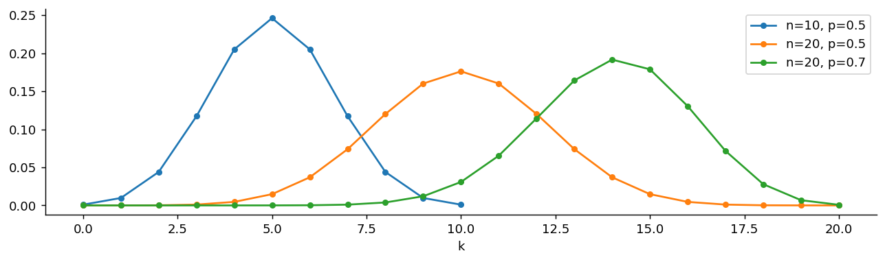
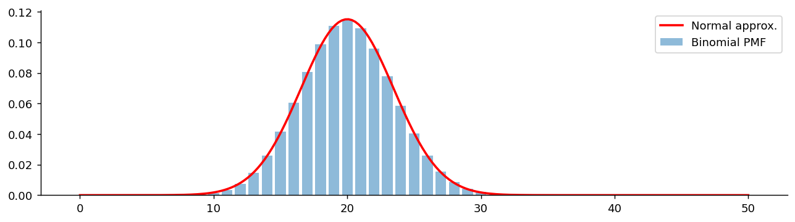

# 이항분포

## 개요

**이항분포**는 성공확률이 같은 독립 베르누이 시행을 $n$번 하고 성공 횟수를 센 것의 분포다. 앞 페이지의 벽돌 하나를 $n$개 쌓아 올린 첫 번째 건물이며, 이산확률모형의 기준점이 된다.

$$
\text{Bernoulli}(p) \;\longrightarrow\; B(n, p) \;\longrightarrow\; \text{HG}(n, N, M) \;\longrightarrow\; \text{Geo}(p) \;\longrightarrow\; \text{NB}(r, p) \;\longrightarrow\; \text{Poisson}(\lambda)
$$

사슬의 나머지는 모두 이항분포의 가정을 하나씩 바꾸어 얻어진다. 그 갈림길은 아래 "이항분포에서 갈라지는 길" 절에 정리해 두었다.

---

## 정의

<div class="defn" markdown>

### 정의 1. 이항분포 { .dfn }

$X_1, X_2, \ldots, X_n$이 독립인 [$\text{Bernoulli}(p)$](bernoulli.md) 확률변수이면, $Y = \sum_{i=1}^n X_i$는 **이항분포**를 따른다:

$$
Y \sim \text{Binomial}(n, p), \qquad P(Y = k) = \binom{n}{k} p^k (1 - p)^{n-k}, \quad k = 0, 1, \ldots, n
$$

이항계수 $\binom{n}{k} = \frac{n!}{k!(n-k)!}$는 $n$번의 시행에서 $k$번의 성공을 고르는 경우의 수를 센다.

</div>

### 성질

$$
\begin{aligned}
E[Y] &= np \\
\text{Var}(Y) &= np(1 - p) \\
\text{SD}(Y) &= \sqrt{np(1 - p)}
\end{aligned}
$$

### 평균과 분산의 유도

구하는 길이 두 갈래다. 하나는 이항분포를 베르누이의 합으로 쪼개는 길이고, 다른 하나는 확률질량함수에서 곧바로 계산하는 길이다.

**쪼개는 길.** $X_i \overset{\text{iid}}{\sim} \text{Bernoulli}(p)$에 대해 $Y = \sum_{i=1}^n X_i$이다. 여기서 $\text{iid}$는 independent and identically distributed의 줄임말로, $n$개의 시행이 서로 **독립**이고 **같은 분포**를 따른다는 두 가지를 한꺼번에 말한다. 두 조건이 각각 한 번씩 쓰인다.

먼저 기댓값은 선형이므로 독립성을 쓸 것도 없이 곧바로 더해진다.

$$
E[Y] = \sum_{i=1}^n E[X_i] = np
$$

분산은 사정이 다르다. 합의 분산에는 원래 공분산 항이 붙는데, 독립이라 그 항이 모두 사라진다.

$$
\text{Var}(Y) = \sum_{i=1}^n \text{Var}(X_i) = np(1 - p)
$$

**곧바로 계산하는 길.** 쪼개는 길은 깔끔하지만 쪼갤 수 있다는 것을 먼저 알아채야 쓸 수 있다. 확률질량함수만 주어졌을 때 쓰는 일반적인 방법이 따로 있고, 그 방법의 요령은 $E[Y^2]$을 직접 구하지 않는 데 있다.

$E[Y^2]$의 합에는 $k^2$이 들어가 이항계수와 잘 맞물리지 않는다. 대신 **하강계승적률** $E[Y(Y-1)]$을 구한다. $k(k-1)$이 이항계수의 앞 두 항과 약분되기 때문이다. 실제로

$$
k(k-1)\binom{n}{k} = k(k-1)\frac{n!}{k!\,(n-k)!} = \frac{n!}{(k-2)!\,(n-k)!} = n(n-1)\binom{n-2}{k-2}
$$

이므로, $k = 0, 1$인 항은 $k(k-1) = 0$이라 사라지고 남는 합은 다음과 같다.

$$
E[Y(Y-1)] = \sum_{k=2}^n n(n-1)\binom{n-2}{k-2} p^k (1-p)^{n-k}
= n(n-1)p^2 \sum_{j=0}^{n-2} \binom{n-2}{j} p^j (1-p)^{(n-2)-j}
$$

여기서 $j = k-2$로 바꿔 놓았다. 마지막 합은 $B(n-2, p)$의 확률을 모두 더한 것이므로 1이다. 따라서

$$
E[Y(Y-1)] = n(n-1)p^2
$$

이다. 이제 $Y^2 = Y(Y-1) + Y$이므로 2차 적률이 나온다.

$$
E[Y^2] = E[Y(Y-1)] + E[Y] = n(n-1)p^2 + np
$$

$$
\text{Var}(Y) = E[Y^2] - (E[Y])^2 = n(n-1)p^2 + np - n^2p^2 = np - np^2 = np(1-p)
$$

두 길이 같은 답에 닿는다. 하강계승적률은 이 쪽에서만 쓰는 요령이 아니다. [기하분포](geometric.md)와 [포아송분포](poisson.md)의 분산도 같은 방법으로 구하며, 계승과 거듭제곱이 섞인 합이 나올 때마다 먼저 꺼내 볼 도구다.

### PMF의 합이 1임을 확인하기

이항정리에 의해:

$$
\sum_{k=0}^n \binom{n}{k} p^k (1-p)^{n-k} = (p + (1-p))^n = 1^n = 1
$$

---

## 이항계수 항등식

이항분포를 다룰 때 유용한 항등식이 여럿 있다:

$$
\begin{aligned}
(1) &\quad \binom{n}{k} = \binom{n}{n-k} \quad \text{(대칭성)} \\[4pt]
(2) &\quad \binom{n}{k} = \binom{n-1}{k-1} + \binom{n-1}{k} \quad \text{(Pascal 규칙)} \\[4pt]
(3) &\quad k\binom{n}{k} = n\binom{n-1}{k-1} \quad \text{(흡수 항등식)}
\end{aligned}
$$

흡수 항등식은 PMF로부터 $E[Y]$를 직접 계산할 때 특히 유용하다:

$$
E[Y] = \sum_{k=0}^n k \binom{n}{k} p^k (1-p)^{n-k} = np \sum_{k=1}^n \binom{n-1}{k-1} p^{k-1} (1-p)^{n-k} = np
$$

---

## 문제

<div class="probox" markdown>

**문제:** <span class="diff easy" title="쉬움"></span> 어떤 주식이 하루에 상승할 확률이 60%이고 날짜별로 독립이라 하자. 10 거래일 동안 정확히 7일 상승할 확률은 얼마인가?

</div>

??? success "풀이"

    $$
    P(Y = 7) = \binom{10}{7} (0.6)^7 (0.4)^3 = 120 \cdot 0.0280 \cdot 0.064 = 0.2150
    $$

    상승일 수의 기댓값: $E[Y] = 10 \times 0.6 = 6$.
---

## Python: PMF, CDF, 표본추출

### PMF와 CDF

<div class="codebox" markdown>

#### 예제 1. 이항분포의 확률질량함수와 분포함수 { .eg }

```python
import matplotlib.pyplot as plt
import numpy as np
from scipy import stats

n, p = 10, 0.6                # 시행 10번, 각 시행의 성공확률 0.6
x = np.arange(0, n + 1)       # 가능한 성공 횟수 0~10

fig, ax = plt.subplots(figsize=(12, 3))
# 같은 k에 대해 PMF와 CDF 막대를 좌우로 조금씩 밀어 나란히 놓는다.
#   PMF: "정확히 k번 성공할 확률"        -> 봉우리 모양
#   CDF: "k번 이하로 성공할 확률"        -> 단조 증가해 1에 도달
# CDF 막대는 PMF 막대를 왼쪽부터 누적한 값이다.
ax.bar(x - 0.15, stats.binom(n, p).pmf(x), width=0.3, label='PMF', alpha=0.7)
ax.bar(x + 0.15, stats.binom(n, p).cdf(x), width=0.3, label='CDF', alpha=0.7)
ax.set_xlabel('k')
ax.set_xticks(x)
ax.spines[['top', 'right']].set_visible(False)
ax.legend()
plt.show()
```



</div>

### 모수에 따른 비교

<div class="codebox" markdown>

#### 예제 2. 모수에 따른 이항분포 비교 { .eg }

```python
import matplotlib.pyplot as plt
import numpy as np
from scipy import stats

fig, ax = plt.subplots(figsize=(12, 3))
# 두 모수가 각각 무엇을 바꾸는지 나누어 본다.
#   (10, 0.5) -> (20, 0.5): n만 바뀐다. 봉우리가 오른쪽으로 가고 넓어진다.
#   (20, 0.5) -> (20, 0.7): p만 바뀐다. 봉우리가 오른쪽으로 가고 좁아진다.
# p가 0.5에서 멀어지면 분산 np(1-p)가 줄어들기 때문이다.
for n, p in [(10, 0.5), (20, 0.5), (20, 0.7)]:
    x = np.arange(0, n + 1)
    # 이산분포이므로 원래는 막대가 맞지만, 여러 개를 겹쳐 비교할 때는
    # 점을 이어 그리는 편이 읽기 쉽다. 선 자체에 의미는 없다.
    ax.plot(x, stats.binom(n, p).pmf(x), 'o-', label=f'n={n}, p={p}', markersize=4)
ax.spines[['top', 'right']].set_visible(False)
ax.set_xlabel('k')
ax.legend()
plt.show()
```



</div>

### 표본추출과 검증

<div class="codebox" markdown>

#### 예제 3. 이항 표본추출과 검증 { .eg }

```python
import numpy as np
from scipy import stats

np.random.seed(42)
n, p = 10, 0.6
samples = stats.binom(n, p).rvs(100_000)

print(f"Theoretical mean: {n*p:.4f},  Sample mean: {samples.mean():.4f}")
print(f"Theoretical var:  {n*p*(1-p):.4f},  Sample var:  {samples.var():.4f}")
```

출력:

```
Theoretical mean: 6.0000,  Sample mean: 6.0030
Theoretical var:  2.4000,  Sample var:  2.3861
```

</div>

---

## 이항분포의 정규근사

$n$이 크면 이항분포는 정규분포로 잘 근사된다:

$$
Y \sim \text{Binomial}(n, p) \approx N(np, \, np(1-p)) \quad \text{when } np \geq 5 \text{ and } n(1-p) \geq 5
$$

연속성 수정을 적용하면 $P(Y \leq k) \approx \mathcal{N}\left(\frac{k + 0.5 - np}{\sqrt{np(1-p)}}\right)$이다.

<div class="codebox" markdown>

#### 예제 4. 이항분포의 정규근사 { .eg }

```python
import matplotlib.pyplot as plt
import numpy as np
from scipy import stats

n, p = 50, 0.4
# np = 20, n(1-p) = 30. 둘 다 5를 넉넉히 넘으므로 정규근사 조건을 만족한다.
x_disc = np.arange(0, n + 1)      # 이항분포는 정수에서만 값을 갖는다
x_cont = np.linspace(0, n, 200)   # 정규분포는 연속이므로 촘촘한 격자가 필요하다

fig, ax = plt.subplots(figsize=(12, 3))
ax.bar(x_disc, stats.binom(n, p).pmf(x_disc), alpha=0.5, label='Binomial PMF')
# 평균 np, 분산 np(1-p)를 그대로 맞춘 정규분포를 겹친다.
# scipy의 norm은 표준편차를 받으므로 분산에 제곱근을 씌워 넣는다.
ax.plot(x_cont, stats.norm(n*p, np.sqrt(n*p*(1-p))).pdf(x_cont),
        'r-', lw=2, label='Normal approx.')
ax.spines[['top', 'right']].set_visible(False)
ax.legend()
plt.show()
```



</div>

---

## 이항분포에서 갈라지는 길

이항분포는 네 가지 가정 위에 서 있다. **시행 횟수 $n$이 고정**이고, 각 시행이 **독립**이며, 성공확률 $p$가 **일정**하고, 세는 것은 **성공 횟수**다. 가정을 하나씩 바꾸면 4장의 다른 분포들이 차례로 나온다.

| 바꾸는 가정 | 얻어지는 분포 | 이 장의 위치 |
|---|---|---|
| 독립 → 비복원추출(종속) | $\text{HG}(n, N, M)$ | 다음 페이지 |
| 고정된 것을 $n$ 대신 성공 횟수로 | $\text{Geo}(p)$, $\text{NB}(r, p)$ | 4.1 |
| $n \to \infty$, $p \to 0$, $np \to \lambda$ | $\text{Poisson}(\lambda)$ | 4.1 |
| $n \to \infty$, $p$ 고정 | $N(np,\, np(1-p))$ | 4.2 |

바로 위 절에서 다룬 정규근사가 마지막 줄이고, 연습문제 8이 셋째 줄이며, 연습문제 9가 첫째 줄의 맛보기다. 다음 페이지에서 그 첫째 줄을 제대로 다룬다.

---

## 연습문제

<div class="drillbox" markdown>

**연습문제 1.** <span class="diff easy" title="쉬움"></span>
10개의 제품이 각각 독립적으로 확률 $p = 0.15$로 불량이다. (a) 불량품 개수 $X$의 분포는? (b) $P(X = 2)$. (c) $P(X \ge 3)$. (d) 평균과 분산.

</div>

??? success "풀이"
    (a) $X \sim \mathrm{Binomial}(10, 0.15)$.

    (b) $P(X = 2) = \binom{10}{2}(0.15)^2(0.85)^8 = 45 \cdot 0.0225 \cdot 0.2725 \approx 0.276$.

    (c) $P(X \ge 3) = 1 - P(X \le 2)$. $P(X = 0) = (0.85)^{10} \approx 0.197$, $P(X = 1) = 10 \cdot 0.15 \cdot (0.85)^9 \approx 0.347$, $P(X = 2) \approx 0.276$를 계산하면 $P(X \ge 3) = 1 - 0.820 = 0.180$.

    (d) $\mathbb{E}[X] = np = 1.5$. $\mathrm{Var}(X) = np(1-p) = 10 \cdot 0.15 \cdot 0.85 = 1.275$.

<div class="drillbox" markdown>

**연습문제 2.** <span class="diff med" title="중간"></span>
$Y \sim \mathrm{Binomial}(n, p)$에 대해 $X_i \sim \mathrm{Bernoulli}(p)$인 지시함수 표현 $Y = \sum_{i=1}^n X_i$를 사용하여 **$\mathbb{E}[Y] = np$와 $\mathrm{Var}(Y) = np(1-p)$를 증명하라.**

</div>

??? success "풀이"
    **평균.** 기댓값의 선형성에 의해:

    $$
    \mathbb{E}[Y] = \mathbb{E}\!\sum_{i=1}^n X_i = \sum_{i=1}^n \mathbb{E}[X_i] = \sum_{i=1}^n p = np
    $$

    **분산.** 독립성에 의해:

    $$
    \mathrm{Var}(Y) = \sum_{i=1}^n \mathrm{Var}(X_i) = \sum_{i=1}^n p(1-p) = np(1-p)
    $$

    지시함수의 합으로 나타내는 표현이 가장 깔끔한 유도이다. PMF로부터 직접 계산해도 되지만 흡수 항등식 $k\binom{n}{k} = n\binom{n-1}{k-1}$이 필요하다. $\square$

<div class="drillbox" markdown>

**연습문제 3.** <span class="diff med" title="중간"></span>
**독립인 두 이항 확률변수의 합.** $X \sim \mathrm{Binomial}(n_1, p)$와 $Y \sim \mathrm{Binomial}(n_2, p)$가 독립이라 하자. $X + Y \sim \mathrm{Binomial}(n_1 + n_2, p)$임을 보여라.

</div>

??? success "풀이"
    각 이항 확률변수는 그 자체가 i.i.d. Bernoulli($p$) 시행의 합이다. $X$는 $n_1$개의 Bernoulli($p$)의 합이고, $Y$는 $n_2$개의 합이다. $X$와 $Y$가 독립이라는 것은 두 그룹에 속한 베르누이 확률변수들이 서로 독립임을 뜻한다.

    따라서 $X + Y$는 $n_1 + n_2$개의 i.i.d. Bernoulli($p$) 시행의 합이므로 Binomial$(n_1 + n_2, p)$이다. $\square$

    **MGF를 통한 확인:** $M_{X+Y}(t) = M_X(t) M_Y(t) = (1 - p + pe^t)^{n_1}(1 - p + pe^t)^{n_2} = (1 - p + pe^t)^{n_1 + n_2}$이며, 이는 Binomial$(n_1 + n_2, p)$의 MGF이다.

    **주의:** *$p$가 공통이라는 점*이 본질적이다. $p$가 다르면 합은 이항이 아니다(Poisson-binomial 분포를 따른다).

<div class="drillbox" markdown>

**연습문제 4.** <span class="diff med" title="중간"></span>
**연속성 수정을 적용한 정규근사.** Binomial(100, 0.4)에 대해 연속성 수정을 적용한 경우와 적용하지 않은 경우 각각 정규근사로 $P(35 \le Y \le 45)$를 구하라. 정확한 이항 값(0.7287)과 비교하라.

</div>

??? success "풀이"
    $\mu = 40$, $\sigma = \sqrt{100 \cdot 0.4 \cdot 0.6} = \sqrt{24} \approx 4.899$.

    **연속성 수정 없이:**

    $$
    P(35 \le Y \le 45) \approx \Phi\!\left(\frac{45 - 40}{4.899}\right) - \Phi\!\left(\frac{35 - 40}{4.899}\right) = \Phi(1.021) - \Phi(-1.021) = 0.8463 - 0.1537 = 0.6926
    $$

    오차: $|0.6926 - 0.7287| = 0.036$.

    **연속성 수정을 적용하면:**

    $$
    P(35 \le Y \le 45) \approx \Phi\!\left(\frac{45.5 - 40}{4.899}\right) - \Phi\!\left(\frac{34.5 - 40}{4.899}\right) = \Phi(1.122) - \Phi(-1.122) = 0.8691 - 0.1309 = 0.7382
    $$

    오차: $|0.7382 - 0.7287| = 0.010$ — 세 배 작다.

    이산분포를 연속분포로 근사할 때는 항상 연속성 수정을 사용하라.

<div class="drillbox" markdown>

**연습문제 5.** <span class="diff med" title="중간"></span>
**역문제: 표본으로부터 $p$ 구하기.** $n = 100$번의 시행에서 $Y = 35$번의 성공을 관측했다. 두 가지 방법으로 $p$에 대한 근사 95% 신뢰구간을 구성하라: (a) **Wald** ($\hat p \pm 1.96 \sqrt{\hat p(1 - \hat p)/n}$); (b) **Wilson 점수 구간**. 둘을 비교하라.

</div>

??? success "풀이"
    $\hat p = 35/100 = 0.35$.

    **(a) Wald 구간:** $\hat p \pm 1.96 \sqrt{\hat p(1 - \hat p)/n} = 0.35 \pm 1.96 \sqrt{0.35 \cdot 0.65 / 100} = 0.35 \pm 1.96 \cdot 0.0477 = 0.35 \pm 0.094 = (0.256, 0.444)$.

    **(b) Wilson 구간** (부등식 $|\hat p - p|/\sqrt{p(1-p)/n} \le 1.96$을 $p$에 대해 푼다):

    $$
    p_{\text{Wilson}} = \frac{\hat p + z^2/(2n) \pm z\sqrt{\hat p(1-\hat p)/n + z^2/(4n^2)}}{1 + z^2/n}
    $$

    $z = 1.96$, $\hat p = 0.35$, $n = 100$일 때:

    분자의 중심: $0.35 + 0.0192 = 0.3692$. 분자의 반폭: $1.96 \sqrt{0.002275 + 9.6e-5} = 1.96 \sqrt{0.002371} \approx 0.0954$.

    분모: $1 + 0.0384 = 1.0384$.

    신뢰구간: $((0.3692 - 0.0954)/1.0384, (0.3692 + 0.0954)/1.0384) = (0.264, 0.448)$.

    **비교:** Wilson 구간은 $\hat p$를 중심으로 비대칭이며(0.5 쪽으로 약간 이동), $\hat p$가 0이나 1에 가까울 때도 포함확률이 보장된다. Wald 구간은 극단적인 $\hat p$에서 퇴화할 수 있지만(0 아래나 1 위로 뻗어 나간다) Wilson 구간은 결코 그렇지 않다. 현대적 관행에서는 특히 작은 표본에서 이항 신뢰구간으로 Wald보다 Wilson을 선호한다.

<div class="drillbox" markdown>

**연습문제 6.** <span class="diff med" title="중간"></span>
동전을 20번 던져 앞면이 15번 나왔다. $H_0: p = 0.5$를 양측으로 검정하라. 정확 이항검정과 정규근사(연속성 수정 유무 각각)를 견주어라.

</div>

??? success "풀이"
    **정확 이항검정.** 대칭인 귀무가설이므로 양측 $p$-값은 한쪽 꼬리를 두 배 한 값이다.

    $$
    p\text{-값} = 2\,P(X \ge 15) = 2 \times 0.02069 = 0.0414
    $$

    $0.0414 < 0.05$이므로 $H_0$을 기각한다. `stats.binomtest(15, 20, 0.5)`가 같은 값을 준다.

    **정규근사(수정 없이).** $E[X] = 10$, $\operatorname{SD}(X) = \sqrt{20(0.5)(0.5)} = \sqrt5 = 2.236$이므로

    $$
    z = \frac{15 - 10}{2.236} = 2.236, \qquad p\text{-값} = 2\Phi(-2.236) = 0.0253
    $$

    이다. 참값 0.0414의 **60%밖에 안 된다.** 유의성을 실제보다 강하게 보고하게 된다.

    **정규근사(연속성 수정).** $X \ge 15$를 $X \ge 14.5$로 바꾸면

    $$
    z = \frac{14.5 - 10}{2.236} = 2.012, \qquad p\text{-값} = 2\Phi(-2.012) = 0.0442
    $$

    로 참값 0.0414에 훨씬 가까워진다.

    $n = 20$이면 $np = n(1-p) = 10$으로 흔히 말하는 근사 조건을 만족하는데도 수정 없는 근사의 오차가 이만큼 크다. **$p$-값처럼 꼬리를 다루는 양에서는 근사의 오차가 상대적으로 훨씬 크게 나타난다.** 중앙 부근의 확률은 잘 맞아도 꼬리는 그렇지 않다. 요즘은 정확검정이 순식간에 계산되므로 이항검정에 정규근사를 쓸 이유가 거의 없다.

<div class="drillbox" markdown>

**연습문제 7.** <span class="diff med" title="중간"></span>
$\text{Binomial}(n, p)$의 최빈값이 $\lfloor (n+1)p \rfloor$임을 보여라(단 $(n+1)p$가 정수이면 봉우리가 둘이다). $n=20$, $p=0.5$일 때 확인하라.

</div>

??? success "풀이"
    이웃한 두 확률의 비를 본다.

    $$
    \frac{P(X=k)}{P(X=k-1)} = \frac{\binom{n}{k}p^k(1-p)^{n-k}}{\binom{n}{k-1}p^{k-1}(1-p)^{n-k+1}} = \frac{n-k+1}{k}\cdot\frac{p}{1-p}
    $$

    이 비가 1보다 큰지 작은지가 PMF가 아직 오르는 중인지 내리는 중인지를 말해 준다. 비가 1보다 크다는 조건을 정리하면

    $$
    (n-k+1)p > k(1-p) \iff np + p > k \iff k < (n+1)p
    $$

    이다. 즉 $k < (n+1)p$이면 $P(X=k) > P(X=k-1)$로 증가하고, $k > (n+1)p$이면 감소한다. 따라서 최대는 $k = \lfloor (n+1)p\rfloor$에서 일어난다.

    $(n+1)p$가 정수 $m$이면 $k=m$에서 비가 정확히 1이므로 $P(X=m) = P(X=m-1)$로 봉우리가 두 개다. $\square$

    $n=20$, $p=0.5$이면 $(n+1)p = 10.5$이므로 최빈값은 $\lfloor 10.5\rfloor = 10$이고, 평균 $np = 10$과 일치한다. $p = 0.3$이면 $(n+1)p = 6.3$으로 최빈값이 6이고 평균은 $6$이다. $p=0.15$, $n=10$이면 $(n+1)p = 1.65$로 최빈값 1, 평균 1.5로 서로 다르다.

    이 "이웃 비" 요령은 이산분포의 모양을 파악하는 표준적인 방법이며, 포아송분포($\lfloor\lambda\rfloor$)와 음이항분포에도 그대로 통한다.

<div class="drillbox" markdown>

**연습문제 8.** <span class="diff hard" title="어려움"></span>
$n \to \infty$, $p \to 0$이면서 $np \to \lambda$로 고정될 때 $\text{Binomial}(n,p)$의 PMF가 $\text{Poisson}(\lambda)$의 PMF로 수렴함을 보여라.

</div>

??? success "풀이"
    $p = \lambda/n$으로 두고 고정된 $k$에 대해

    $$
    P(X=k) = \binom{n}{k}\left(\frac{\lambda}{n}\right)^k\left(1-\frac{\lambda}{n}\right)^{n-k}
    $$

    를 세 조각으로 나눈다.

    $$
    = \underbrace{\frac{n(n-1)\cdots(n-k+1)}{n^k}}_{(\text{가})}\cdot\frac{\lambda^k}{k!}\cdot\underbrace{\left(1-\frac{\lambda}{n}\right)^{n}}_{(\text{나})}\cdot\underbrace{\left(1-\frac{\lambda}{n}\right)^{-k}}_{(\text{다})}
    $$

    - (가)는 $k$개의 인수를 각각 $n$으로 나눈 $\prod_{j=0}^{k-1}(1 - j/n)$이고, $k$가 고정이므로 $n\to\infty$에서 1로 간다.
    - (나)는 잘 알려진 극한 $(1-\lambda/n)^n \to e^{-\lambda}$이다.
    - (다)는 밑이 1로 가고 지수가 고정이므로 1로 간다.

    따라서

    $$
    P(X=k) \to \frac{\lambda^k e^{-\lambda}}{k!}
    $$

    이다. $\square$

    **뜻.** 시행 횟수는 아주 많고 각 시행의 성공확률은 아주 작은데 그 곱이 적당한 상황이 포아송분포를 낳는다. "희귀사건의 법칙"이라 불리는 까닭이다. 웹사이트의 분당 접속 수, 하루에 걸려 오는 응급 전화 수, 한 페이지의 오타 수가 모두 이 구조다. 무수한 기회 각각이 작은 확률로 사건을 일으킨다.

    실용적으로는 $n \ge 20$이고 $p \le 0.05$이면 근사가 쓸 만하고, $n \ge 100$이고 $np \le 10$이면 매우 좋다. 정규근사가 $p$가 0.5 근처일 때 잘 듣는 것과 정확히 반대 영역을 맡는다. **$p$가 극단적이면 포아송으로, 중간이면 정규분포로** 간다고 기억하면 된다.

<div class="drillbox" markdown>

**연습문제 9.** <span class="diff med" title="중간"></span>
크기 $M = 500$인 상자에 불량품이 $N = 100$개 들어 있다. 20개를 **비복원**으로 뽑을 때 불량품 개수의 분포는 무엇인가? 이항분포로 근사하면 분산이 얼마나 어긋나는가?

</div>

??? success "풀이"
    비복원추출이므로 **초기하분포** $\text{HG}(n, N, M) = \text{HG}(20, 100, 500)$을 따른다.

    $$
    P(X=k) = \frac{\binom{N}{k}\binom{M-N}{n-k}}{\binom{M}{n}}, \qquad E[X] = n\frac{N}{M} = 20 \times 0.2 = 4
    $$

    평균은 이항분포와 **똑같다.** 추출을 하나씩 볼 때 각 추출이 불량일 주변확률은 여전히 $N/M$이고, 기대값의 선형성은 독립을 요구하지 않기 때문이다.

    분산은 다르다.

    $$
    \operatorname{Var}(X) = n\frac{N}{M}\left(1-\frac{N}{M}\right)\cdot\frac{M-n}{M-1}
    $$

    마지막 인수가 **유한모집단 수정계수**다. 값을 넣으면

    $$
    \operatorname{Var}(X) = 20(0.2)(0.8)\times\frac{480}{499} = 3.2 \times 0.9619 = 3.078
    $$

    로, 이항분포의 3.2보다 3.8% 작다. 표준편차로는 1.9% 차이다.

    **왜 작아지는가.** 비복원추출에서는 추출들이 음으로 상관된다. 앞에서 불량을 뽑으면 상자에 남은 불량이 줄어 뒤에서 뽑을 확률이 내려간다. 이 자기교정 효과가 총합의 흔들림을 줄인다. 극단적으로 $n = M$이면 전부 뽑는 것이므로 $X = N$으로 분산이 0이 되고, 실제로 수정계수도 $(M-M)/(M-1) = 0$이 된다.

    **실무 규칙.** $n/M \le 0.05$이면 수정계수가 0.95 이상이라 이항근사를 써도 무방하다. 여기서는 $20/500 = 0.04$로 경계 근처다. 여론조사에서 유권자 수천만 중 1000명을 뽑을 때 수정계수를 무시하는 것은 이 규칙에 따른 것이고, 반대로 공장에서 한 상자 100개 중 30개를 검사한다면 반드시 초기하분포를 써야 한다.

    초기하분포의 유도와 성질은 다음 페이지에서 본격적으로 다룬다.

<div class="drillbox" markdown>

**연습문제 10.** <span class="diff med" title="중간"></span>
이항분포를 결과가 셋 이상인 경우로 넓힌 것이 **다항분포**이다. PMF를 적고, 각 성분의 주변분포와 두 성분의 공분산을 구하라.

</div>

??? success "풀이"
    $n$번의 독립 시행에서 각 시행이 범주 $1, \dots, m$ 중 하나를 확률 $p_1, \dots, p_m$($\sum p_j = 1$)으로 취할 때, 각 범주의 개수 $(X_1, \dots, X_m)$의 분포가 다항분포이다.

    $$
    P(X_1=k_1,\dots,X_m=k_m) = \frac{n!}{k_1!\cdots k_m!}p_1^{k_1}\cdots p_m^{k_m}, \qquad \sum_j k_j = n
    $$

    **주변분포.** 범주 $j$인지 아닌지만 보면 이항이므로

    $$
    X_j \sim \text{Binomial}(n, p_j), \qquad E[X_j] = np_j, \quad \operatorname{Var}(X_j) = np_j(1-p_j)
    $$

    이다.

    **공분산.** 지시함수로 쓰면 $X_j = \sum_i \mathbb{1}\{$시행 $i$가 범주 $j\}$이다. 같은 시행에서 두 범주가 동시에 일어날 수 없으므로 $E[\mathbb{1}_j\mathbb{1}_l] = 0$($j \ne l$)이고, 서로 다른 시행은 독립이라 공분산이 0이다. 따라서 한 시행당 공분산이 $0 - p_jp_l$이고

    $$
    \operatorname{Cov}(X_j, X_l) = -np_jp_l \quad (j \ne l)
    $$

    이다. 언제나 **음수**이며, $n$이 고정되어 있어 한 범주가 늘면 다른 범주가 줄어야 하기 때문이다.

    다항분포는 분할표 분석의 밑바탕이다. 카이제곱 적합도 검정의 통계량 $\sum (O_j - E_j)^2/E_j$가 근사적으로 $\chi^2_{m-1}$을 따르는데, 자유도가 $m$이 아니라 $m-1$인 이유가 바로 $\sum X_j = n$이라는 제약, 즉 위의 음의 공분산 구조 때문이다.

<div class="drillbox" markdown>

**연습문제 11.** <span class="diff hard" title="어려움"></span>
$n$번의 시행에서 성공확률 $p$가 시행마다 같지 않고 **묶음마다 다르다**고 하자. $P \sim \text{Beta}(a,b)$이고 $X \mid P = p \sim \text{Binomial}(n,p)$일 때 $X$의 평균과 분산을 구하고, 이항분포와 견주어라.

</div>

??? success "풀이"
    전체기대값 정리와 전체분산 정리를 쓴다. $\text{Beta}(a,b)$의 평균을 $\mu = a/(a+b)$, 분산을 $\sigma_P^2 = \mu(1-\mu)/(a+b+1)$이라 하자.

    **평균.**

    $$
    E[X] = E\{E[X \mid P]\} = E[nP] = n\mu
    $$

    이항분포와 같다.

    **분산.**

    $$
    \operatorname{Var}(X) = E\{\operatorname{Var}(X\mid P)\} + \operatorname{Var}\{E[X\mid P]\} = E[nP(1-P)] + \operatorname{Var}(nP)
    $$

    첫 항은 $n\{\mu - E[P^2]\} = n\{\mu(1-\mu) - \sigma_P^2\}$이고 둘째 항은 $n^2\sigma_P^2$이므로

    $$
    \operatorname{Var}(X) = n\mu(1-\mu) + n(n-1)\sigma_P^2 = n\mu(1-\mu)\left\{1 + \frac{n-1}{a+b+1}\right\}
    $$

    이다.

    **견주면.** 평균은 같은데 분산이 이항분포의 $\{1 + (n-1)/(a+b+1)\}$배다. 언제나 1보다 크므로 **과대산포**다. $a+b \to \infty$이면 $P$가 한 점으로 모여 이항분포로 돌아간다.

    이 분포를 **베타-이항분포**라 하며, [음이항분포](negative_binomial.md) 페이지에서 볼 감마–포아송 혼합과 정확히 같은 구조다. **모수를 확률변수로 두고 섞으면 산포가 커진다.** 일반적으로 전체분산 정리의 둘째 항 $\operatorname{Var}\{E[X\mid P]\}$이 양수인 한 그렇다.

    실제 자료에서 이런 구조가 흔하다. 같은 농장의 닭들, 같은 학급의 학생들, 같은 환자에게서 여러 번 잰 값은 묶음 안에서 닮아 있다. 이를 무시하고 이항 모형을 쓰면 표준오차가 과소평가되어 잘못된 유의성이 나온다. 묶음 자료의 유효 표본크기가 관측 수보다 훨씬 작다는 사실을 반영하려면 베타-이항, 혼합효과 로지스틱, 일반화추정방정식 같은 도구가 필요하다.

---

## 정리하며

- 이항분포는 독립인 베르누이 시행 $n$번의 성공 횟수를 센다. 모수는 시행 횟수 $n$과 성공확률 $p$ 둘이다.
- Binomial PMF는 성공이 나타날 수 있는 모든 순서를 반영하기 위해 이항계수를 사용한다.
- 평균 $np$와 분산 $np(1-p)$는 독립 베르누이 확률변수의 합이라는 표현에서 곧바로 따라 나온다.
- $n$이 크면 이항분포는 정규분포로 잘 근사되어 이산확률과 연속확률을 이어 준다.
