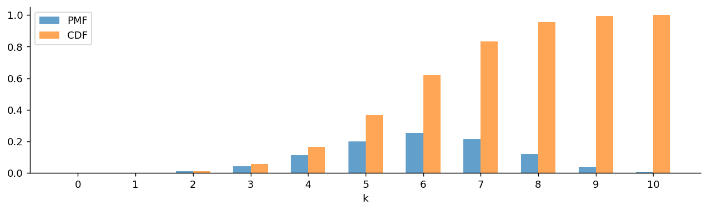
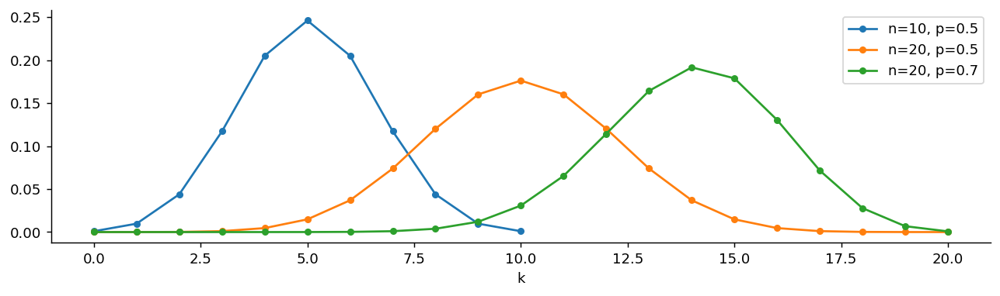
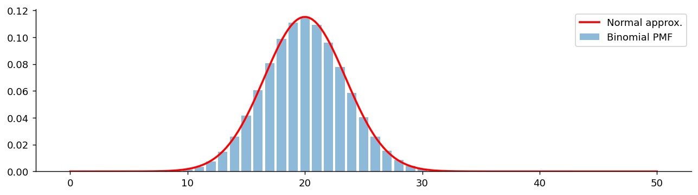

# 이항분포

## 개요

**이항분포**는 성공확률이 같은 독립 베르누이 시행을 $n$번 하고 성공 횟수를 센 것의 분포다. 앞 페이지의 벽돌 하나를 $n$개 쌓아 올린 첫 번째 건물이며, 이산확률모형의 기준점이 된다.

$$
\text{Bernoulli}(p) \;\longrightarrow\; B(n, p) \;\longrightarrow\; \text{HG}(n, N, M) \;\longrightarrow\; \text{Geo}(p) \;\longrightarrow\; \text{NB}(r, p) \;\longrightarrow\; \text{Poisson}(\lambda)
$$

사슬의 나머지는 모두 이항분포의 가정을 하나씩 바꾸어 얻어진다. 그 갈림길은 아래 "이항분포에서 갈라지는 길" 절에 정리해 두었다.

---

## 정의

<div class="defn" markdown>

### 정의 1. 이항분포 { .dfn }

$X_1, X_2, \ldots, X_n$이 독립인 [$\text{Bernoulli}(p)$](bernoulli.md) 확률변수이면, $Y = \sum_{i=1}^n X_i$는 **이항분포**를 따른다:

$$
Y \sim \text{Binomial}(n, p), \qquad P(Y = k) = \binom{n}{k} p^k (1 - p)^{n-k}, \quad k = 0, 1, \ldots, n
$$

이항계수 $\binom{n}{k} = \frac{n!}{k!(n-k)!}$는 $n$번의 시행에서 $k$번의 성공을 고르는 경우의 수를 센다.

</div>

### 성질

$$
\begin{aligned}
E[Y] &= np \\
\text{Var}(Y) &= np(1 - p) \\
\text{SD}(Y) &= \sqrt{np(1 - p)}
\end{aligned}
$$

### 평균과 분산의 유도

구하는 길이 두 갈래다. 하나는 이항분포를 베르누이의 합으로 쪼개는 길이고, 다른 하나는 확률질량함수에서 곧바로 계산하는 길이다.

**쪼개는 길.** $X_i \overset{\text{iid}}{\sim} \text{Bernoulli}(p)$에 대해 $Y = \sum_{i=1}^n X_i$이다. 여기서 $\text{iid}$는 independent and identically distributed의 줄임말로, $n$개의 시행이 서로 **독립**이고 **같은 분포**를 따른다는 두 가지를 한꺼번에 말한다. 두 조건이 각각 한 번씩 쓰인다.

먼저 기댓값은 선형이므로 독립성을 쓸 것도 없이 곧바로 더해진다.

$$
E[Y] = \sum_{i=1}^n E[X_i] = np
$$

분산은 사정이 다르다. 합의 분산에는 원래 공분산 항이 붙는데, 독립이라 그 항이 모두 사라진다.

$$
\text{Var}(Y) = \sum_{i=1}^n \text{Var}(X_i) = np(1 - p)
$$

**곧바로 계산하는 길.** 쪼개는 길은 깔끔하지만 쪼갤 수 있다는 것을 먼저 알아채야 쓸 수 있다. 확률질량함수만 주어졌을 때 쓰는 일반적인 방법이 따로 있고, 그 방법의 요령은 $E[Y^2]$을 직접 구하지 않는 데 있다.

$E[Y^2]$의 합에는 $k^2$이 들어가 이항계수와 잘 맞물리지 않는다. 대신 **하강계승적률** $E[Y(Y-1)]$을 구한다. $k(k-1)$이 이항계수의 앞 두 항과 약분되기 때문이다. 실제로

$$
k(k-1)\binom{n}{k} = k(k-1)\frac{n!}{k!\,(n-k)!} = \frac{n!}{(k-2)!\,(n-k)!} = n(n-1)\binom{n-2}{k-2}
$$

이므로, $k = 0, 1$인 항은 $k(k-1) = 0$이라 사라지고 남는 합은 다음과 같다.

$$
E[Y(Y-1)] = \sum_{k=2}^n n(n-1)\binom{n-2}{k-2} p^k (1-p)^{n-k}
= n(n-1)p^2 \sum_{j=0}^{n-2} \binom{n-2}{j} p^j (1-p)^{(n-2)-j}
$$

여기서 $j = k-2$로 바꿔 놓았다. 마지막 합은 $B(n-2, p)$의 확률을 모두 더한 것이므로 1이다. 따라서

$$
E[Y(Y-1)] = n(n-1)p^2
$$

이다. 이제 $Y^2 = Y(Y-1) + Y$이므로 2차 적률이 나온다.

$$
E[Y^2] = E[Y(Y-1)] + E[Y] = n(n-1)p^2 + np
$$

$$
\text{Var}(Y) = E[Y^2] - (E[Y])^2 = n(n-1)p^2 + np - n^2p^2 = np - np^2 = np(1-p)
$$

두 길이 같은 답에 닿는다. 하강계승적률은 이 쪽에서만 쓰는 요령이 아니다. [기하분포](geometric.md)와 [포아송분포](poisson.md)의 분산도 같은 방법으로 구하며, 계승과 거듭제곱이 섞인 합이 나올 때마다 먼저 꺼내 볼 도구다.

### PMF의 합이 1임을 확인하기

이항정리에 의해:

$$
\sum_{k=0}^n \binom{n}{k} p^k (1-p)^{n-k} = (p + (1-p))^n = 1^n = 1
$$

---

## 이항계수 항등식

이항분포를 다룰 때 유용한 항등식이 여럿 있다:

$$
\begin{aligned}
(1) &\quad \binom{n}{k} = \binom{n}{n-k} \quad \text{(대칭성)} \\[4pt]
(2) &\quad \binom{n}{k} = \binom{n-1}{k-1} + \binom{n-1}{k} \quad \text{(Pascal 규칙)} \\[4pt]
(3) &\quad k\binom{n}{k} = n\binom{n-1}{k-1} \quad \text{(흡수 항등식)}
\end{aligned}
$$

흡수 항등식은 PMF로부터 $E[Y]$를 직접 계산할 때 특히 유용하다:

$$
E[Y] = \sum_{k=0}^n k \binom{n}{k} p^k (1-p)^{n-k} = np \sum_{k=1}^n \binom{n-1}{k-1} p^{k-1} (1-p)^{n-k} = np
$$

---

## 문제

<div class="probox" markdown>

**문제:** <span class="diff easy" title="쉬움"></span> 어떤 주식이 하루에 상승할 확률이 60%이고 날짜별로 독립이라 하자. 10 거래일 동안 정확히 7일 상승할 확률은 얼마인가?

</div>

??? success "풀이"

    $$
    P(Y = 7) = \binom{10}{7} (0.6)^7 (0.4)^3 = 120 \cdot 0.0280 \cdot 0.064 = 0.2150
    $$

    상승일 수의 기댓값: $E[Y] = 10 \times 0.6 = 6$.

---

## Python: PMF, CDF, 표본추출

### PMF와 CDF

<div class="exbox" markdown>

**보기 1.** <span class="diff easy" title="쉬움"></span> 이항분포의 확률질량함수와 분포함수. $Y \sim B(10, 0.6)$의 PMF와 CDF를 $k = 0, \ldots, 10$에서 나란히 그린다.

**(1)** PMF를 가장 크게 만드는 $k$, 곧 최빈값을 구하시오. $(n+1)p$가 정수일 때는 무슨 일이 일어나는가.

**(2)** $n = 10$, $p = 0.6$에서 (1)의 답을 확인하고, $(n+1)p$가 정수가 되는 $n = 9$, $p = 0.6$에서 동점을 분수로 확인하시오.

</div>

??? success "풀이"

    **(1) 해석적으로.** $k$는 **정수**라 미분할 수 없다. 이웃한 두 확률의 비를 본다.

    $$
    \frac{p(k)}{p(k-1)}
    = \frac{\binom{n}{k}p^k(1-p)^{n-k}}{\binom{n}{k-1}p^{k-1}(1-p)^{n-k+1}}
    = \frac{n-k+1}{k}\cdot\frac{p}{1-p}
    $$

    $\binom{n}{k}\big/\binom{n}{k-1} = (n-k+1)/k$를 썼고, $p$와 $(1-p)$의 지수는 각각 하나씩만 남았다. 이 비가 $1$ 이상인 조건은

    $$
    (n-k+1)p \ge k(1-p)
    \qquad \Longleftrightarrow \qquad
    k \le (n+1)p
    $$

    다. 양변을 펼치면 $kp$ 항이 지워져 이렇게 깔끔해진다. 그리고 $\frac{n-k+1}{k}$는 $k$에 대해 **감소**하므로 비가 $1$을 지나는 자리는 단 한 곳이다. 즉 PMF는 $k \le (n+1)p$까지 오르다가 그 뒤로는 계속 내려가고, 봉우리는 하나다. 따라서

    $$
    \text{최빈값} = \lfloor (n+1)p \rfloor
    $$

    이다. 비가 주는 문턱 $(n+1)p$에 **바닥함수가 붙는다**는 것이 요점이고, 그 까닭은 $k$가 정수라는 것 하나다. 연습문제 7이 같은 유도를 다른 모수에서 되짚는다.

    $(n+1)p$가 정수 $m$이면 $k = m$에서 위 부등식이 **등호**가 되어 비가 정확히 $1$, 곧

    $$
    p(m) = p(m-1)
    $$

    이다. 최빈값이 **둘**이고 둘 중 어느 쪽도 더 그럴듯하지 않다. $n = 10$, $p = 0.6$은 $(n+1)p = 11 \times 0.6 = 6.6$으로 정수가 아니므로 최빈값은 $\lfloor 6.6 \rfloor = 6$ 하나다. 평균 $np = 6$과 같은데, 이것은 우연이다. $\lfloor (n+1)p \rfloor$와 $np$는 일반적으로 다르다.

    **(2) 수치적으로.** 먼저 쪽의 그림을 그린다.

    ```python
    import matplotlib.pyplot as plt
    import numpy as np
    from scipy import stats

    plt.rcParams["font.sans-serif"] = ["NanumGothic", "Apple SD Gothic Neo", "Malgun Gothic"]
    plt.rcParams["font.family"] = "sans-serif"
    plt.rcParams["axes.unicode_minus"] = False

    n, p = 10, 0.6                # 시행 10번, 각 시행의 성공확률 0.6
    x = np.arange(0, n + 1)       # 가능한 성공 횟수 0~10

    fig, ax = plt.subplots(figsize=(12, 3))
    # 같은 k에 대해 PMF와 CDF 막대를 좌우로 조금씩 밀어 나란히 놓는다.
    #   PMF: "정확히 k번 성공할 확률"        -> 봉우리 모양
    #   CDF: "k번 이하로 성공할 확률"        -> 단조 증가해 1에 도달
    # CDF 막대는 PMF 막대를 왼쪽부터 누적한 값이다.
    ax.bar(x - 0.15, stats.binom(n, p).pmf(x), width=0.3, label='PMF', alpha=0.7)
    ax.bar(x + 0.15, stats.binom(n, p).cdf(x), width=0.3, label='CDF', alpha=0.7)
    ax.set_xlabel('k')
    ax.set_xticks(x)
    ax.spines[['top', 'right']].set_visible(False)
    ax.legend()
    plt.show()
    ```

    

    왼쪽 막대가 $k = 6$에서 가장 높고 그 양쪽으로 주저앉는다. CDF 막대는 단조 증가해 $k = 10$에서 정확히 $1$에 닿는다. 포아송과 달리 이항분포는 상한이 **진짜로** $n$이므로 잘라 낸 꼬리가 없다.

    (1)이 유도한 것을 분수로 확인한다. 이산분포의 좋은 점은 **반올림 없이** 확인할 수 있다는 것이다.

    ```python
    from fractions import Fraction
    from math import comb
    import numpy as np
    from scipy import stats

    n, p = 10, Fraction(3, 5)        # p = 0.6 을 분수로 적는다

    # 비 p(k)/p(k-1) = (n-k+1)/k * p/(1-p). 1 을 넘는 동안 PMF 가 오른다.
    for k in range(1, n + 1):
        ratio = Fraction(n - k + 1, k) * p / (1 - p)
        mark = ">1 (오름)" if ratio > 1 else ("=1 (동점)" if ratio == 1 else "<1 (내림)")
        print(f"p({k})/p({k-1}) = {str(ratio):>7}   {mark}")

    print(f"(n+1)p = {(n + 1) * p} = {float((n+1)*p)},  floor = {int((n + 1) * p)}")
    print(f"argmax pmf = {stats.binom(10, 0.6).pmf(np.arange(11)).argmax()}")

    # (n+1)p 가 정수가 되는 자리를 하나 잡는다. n=9, p=3/5 이면 (n+1)p = 6.
    m, q = 9, Fraction(3, 5)
    a = Fraction(comb(m, 5)) * q**5 * (1 - q)**4
    b = Fraction(comb(m, 6)) * q**6 * (1 - q)**3
    print(f"n={m}: (n+1)p = {(m+1)*q}")
    print(f"P(5) = {a},  P(6) = {b},  같은가? {a == b}")

    pm = stats.binom(9, 0.6).pmf(np.arange(10))
    print(f"부동소수점: pmf(5) - pmf(6) = {pm[5]-pm[6]:+.3e}")
    print(f"동점으로 잡히는 자리 = {np.flatnonzero(pm == pm.max())}")
    ```

    출력:

    ```
    p(1)/p(0) =      15   >1 (오름)
    p(2)/p(1) =    27/4   >1 (오름)
    p(3)/p(2) =       4   >1 (오름)
    p(4)/p(3) =    21/8   >1 (오름)
    p(5)/p(4) =     9/5   >1 (오름)
    p(6)/p(5) =     5/4   >1 (오름)
    p(7)/p(6) =     6/7   <1 (내림)
    p(8)/p(7) =    9/16   <1 (내림)
    p(9)/p(8) =     1/3   <1 (내림)
    p(10)/p(9) =    3/20   <1 (내림)
    (n+1)p = 33/5 = 6.6,  floor = 6
    argmax pmf = 6
    n=9: (n+1)p = 6
    P(5) = 489888/1953125,  P(6) = 489888/1953125,  같은가? True
    부동소수점: pmf(5) - pmf(6) = -1.665e-16
    동점으로 잡히는 자리 = [6]
    ```

    비가 $k = 6$과 $k = 7$ 사이에서 $5/4$에서 $6/7$로 $1$을 넘어 내려간다. 넘는 자리가 한 곳뿐이고, 그 앞이 최빈값 $6$이다. 분수로만 보아도 등호가 걸리는 $k$가 없으니 동점이 아니다.

    $n = 9$로 바꾸면 $(n+1)p = 6$이 정수가 되고, $P(5)$와 $P(6)$이 분수로 **한 치도 다르지 않다**($489888/1953125$). 그런데 부동소수점으로는 $1.7 \times 10^{-16}$만큼 어긋나서 `flatnonzero(pmf == pmf.max())`가 동점을 못 보고 $6$ 하나만 집는다. **이 어긋남은 수학이 아니라 배정도 실수의 반올림이다.** 동점을 보려면 분수로 재야 한다.

### 모수에 따른 비교

<div class="exbox" markdown>

**보기 2.** <span class="diff easy" title="쉬움"></span> 모수에 따른 이항분포 비교. $(n, p) = (10, 0.5)$, $(20, 0.5)$, $(20, 0.7)$인 세 PMF를 한 그림에 겹쳐 그린다.

**(1)** 봉우리의 **자리**와 **높이**를 각각 $n$과 $p$의 식으로 적으시오. 높이에는 스털링 근사가 필요하다.

**(2)** 세 조합에서 최빈값과 봉우리 높이를 재어 (1)의 답과 견주시오. $n$만 키운 경우와 $p$만 바꾼 경우가 어떻게 다른가.

</div>

??? success "풀이"

    **(1) 해석적으로.** 자리는 보기 1에서 이미 나왔다. 최빈값은 $\lfloor (n+1)p \rfloor = \lfloor np + p \rfloor$이고, 세 조합 모두 $np$가 정수($5$, $10$, $14$)이며 $0 < p < 1$이므로 바닥함수가 소수부 $p$를 깎아 낸다. 곧 **최빈값이 평균 $np$와 정확히 같다.**

    $$
    \text{최빈값} = \lfloor np + p \rfloor = np \qquad (np \in \mathbb{Z})
    $$

    높이는 그 자리의 확률 $p(np) = \frac{n!}{(np)!\,(nq)!}p^{np}q^{nq}$($q = 1-p$)를 스털링 근사

    $$
    m! = \sqrt{2\pi m}\, m^m e^{-m}\left(1 + \frac{1}{12m} + \cdots\right)
    $$

    로 세 계승에 모두 적용해 얻는다. 거듭제곱 부분이 먼저 깨끗이 지워진다.

    $$
    \frac{n^n}{(np)^{np}(nq)^{nq}}\, p^{np} q^{nq}
    = \frac{n^n}{n^{np}n^{nq}} \cdot \frac{p^{np}q^{nq}}{p^{np}q^{nq}} = 1
    $$

    $np + nq = n$이라 $n$의 거듭제곱도 지워지고 $e^{-n}$도 $e^{-np}e^{-nq}$와 약분된다. 남는 것은 제곱근뿐이다.

    $$
    \frac{\sqrt{2\pi n}}{\sqrt{2\pi np}\sqrt{2\pi nq}} = \frac{1}{\sqrt{2\pi npq}}
    $$

    따라서

    $$
    p(np) \approx \frac{1}{\sqrt{2\pi n p q}} = \frac{1}{\sqrt{2\pi \text{Var}(Y)}}
    $$

    이다. **봉우리 높이는 분산의 제곱근에 반비례한다.** 넓이 $1$을 폭 $\sqrt{npq}$에 나누어 담는다고 읽으면 된다. 이 식은 $N(np, npq)$ 밀도의 봉우리 높이와 똑같아서, 뒤에 나올 정규근사가 한 점에서 미리 비친 셈이다.

    보정항까지 끌고 가면 어긋남의 **방향과 크기**까지 나온다. $\left(1+\frac{1}{12n}\right)\big/\left[\left(1+\frac{1}{12np}\right)\left(1+\frac{1}{12nq}\right)\right]$를 1차까지 펼치고 $p + q = 1$을 쓰면

    $$
    1 + \frac{1}{12n}\left(1 - \frac1p - \frac1q\right)
    = 1 + \frac{1}{12n}\cdot\frac{pq - 1}{pq}
    = 1 - \frac{1 - pq}{12npq}
    $$

    이다. $pq \le 1/4 < 1$이므로 보정은 **언제나 음수**다. 실제 봉우리는 $1/\sqrt{2\pi npq}$보다 늘 조금 낮고, 상대오차가 $-(1-pq)/(12npq)$로 예측된다.

    이제 두 모수의 몫이 갈린다. $n$을 $10 \to 20$으로 키우면($p = 0.5$ 고정) 분산이 $2.5 \to 5$로 **두 배**가 되어 봉우리가 $1/\sqrt2 = 0.707$배로 낮아진다. 반면 $p$를 $0.5 \to 0.7$로 옮기면($n = 20$ 고정) 분산이 $5 \to 4.2$로 **줄어들어** 봉우리가 $\sqrt{5/4.2} = 1.09$배로 오히려 **높아진다.** $pq$가 $p = 0.5$에서 최대이기 때문이다. 코드 주석의 "p가 0.5에서 멀어지면 분산이 줄어든다"가 가리키는 것이 이것이다.

    **(2) 수치적으로.** 먼저 쪽의 그림을 그린다.

    ```python
    import matplotlib.pyplot as plt
    import numpy as np
    from scipy import stats

    fig, ax = plt.subplots(figsize=(12, 3))
    # 두 모수가 각각 무엇을 바꾸는지 나누어 본다.
    #   (10, 0.5) -> (20, 0.5): n만 바뀐다. 봉우리가 오른쪽으로 가고 넓어진다.
    #   (20, 0.5) -> (20, 0.7): p만 바뀐다. 봉우리가 오른쪽으로 가고 좁아진다.
    # p가 0.5에서 멀어지면 분산 np(1-p)가 줄어들기 때문이다.
    for n, p in [(10, 0.5), (20, 0.5), (20, 0.7)]:
        x = np.arange(0, n + 1)
        # 이산분포이므로 원래는 막대가 맞지만, 여러 개를 겹쳐 비교할 때는
        # 점을 이어 그리는 편이 읽기 쉽다. 선 자체에 의미는 없다.
        ax.plot(x, stats.binom(n, p).pmf(x), 'o-', label=f'n={n}, p={p}', markersize=4)
    ax.spines[['top', 'right']].set_visible(False)
    ax.set_xlabel('k')
    ax.legend()
    plt.show()
    ```

    

    세 곡선의 봉우리가 $k = 5, 10, 14$에 차례로 서 있다. 가운데 곡선이 가장 낮고, 오른쪽으로 더 간 셋째 곡선이 그보다 **높다**. 봉우리의 자리와 높이를 재어 (1)과 맞춰 본다.

    ```python
    import numpy as np
    from math import pi, sqrt
    from scipy import stats

    print(f"{'(n, p)':>11}{'평균':>8}{'분산':>8}{'(n+1)p':>9}{'최빈값':>8}"
          f"{'봉우리':>9}{'1/sqrt(2pi npq)':>17}{'상대오차':>10}{'-(1-pq)/(12npq)':>17}")
    for n, p in ((10, 0.5), (20, 0.5), (20, 0.7)):
        q = 1 - p
        v = n * p * q                      # 분산 npq
        pmf = stats.binom(n, p).pmf(np.arange(n + 1))
        approx = 1 / sqrt(2 * pi * v)      # 봉우리 높이의 근사
        rel = (pmf.max() - approx) / approx
        pred = -(1 - p * q) / (12 * v)     # 스털링 1차 보정이 예측하는 상대오차
        print(f"{f'({n}, {p})':>11}{n*p:>8.2f}{v:>8.2f}{(n+1)*p:>9.1f}{pmf.argmax():>8d}"
              f"{pmf.max():>9.4f}{approx:>17.4f}{rel*100:>9.2f}%{pred*100:>16.2f}%")
    ```

    출력:

    ```
         (n, p)      평균      분산   (n+1)p     최빈값      봉우리  1/sqrt(2pi npq)      상대오차  -(1-pq)/(12npq)
      (10, 0.5)    5.00    2.50      5.5       5   0.2461           0.2523    -2.46%           -2.50%
      (20, 0.5)   10.00    5.00     10.5      10   0.1762           0.1784    -1.24%           -1.25%
      (20, 0.7)   14.00    4.20     14.7      14   0.1916           0.1947    -1.55%           -1.57%
    ```

    세 줄이 모두 (1)과 맞는다.

    **자리.** $(n+1)p$가 $5.5$, $10.5$, $14.7$이고 바닥함수를 씌운 $5$, $10$, $14$가 `argmax`와 일치한다. 세 경우 다 평균 $np$와 같은데, $np$가 정수라서 그렇다. 셋 모두 정수가 아니므로 동점은 없다.

    **높이.** $n$을 $10$에서 $20$으로 키우면 봉우리가 $0.2461 \to 0.1762$로 내려가는데 비가 $0.716$이고 예측한 $1/\sqrt2 = 0.707$에 가깝다. $p$를 $0.5$에서 $0.7$로 옮기면 $0.1762 \to 0.1916$으로 **올라가는데** 비가 $1.087$이고 예측한 $\sqrt{5/4.2} = 1.091$과 맞는다. **"오른쪽으로 가면 낮아진다"가 아니라 "분산이 커지면 낮아진다"**는 것이 올바른 읽기다. 포아송은 모수가 하나라 둘이 늘 같이 움직였지만, 이항은 모수가 둘이라 갈라진다.

    **보정항.** 마지막 두 열이 $-2.46$ 대 $-2.50$, $-1.24$ 대 $-1.25$, $-1.55$ 대 $-1.57$로 소수점 둘째 자리까지 맞는다. 셋 다 음수라는 것도 $pq < 1$에서 예측한 대로다. 버린 $O(1/n^2)$ 항이 $0.02$퍼센트포인트 남짓 남은 것이고, **근사가 어긋나는 쪽으로도 예측이 맞는다**는 것이 확인의 요점이다.

### 표본추출과 검증

<div class="exbox" markdown>

**보기 3.** <span class="diff easy" title="쉬움"></span> 이항 표본추출과 검증. $B(10, 0.6)$에서 $N = 10^5$개를 뽑아 표본평균과 표본분산을 이론값과 견준다.

**(1)** 표본평균과 표본분산이 각각 얼마나 흔들리는지, 곧 두 표준오차를 구하시오. 분산 쪽에는 이항분포의 4차 중심적률이 필요하다.

**(2)** 코드가 준 두 값이 (1)의 표준오차로 재어 몇 배 안에 들어오는지 확인하시오. 산포비 $s^2/\bar y$는 무엇으로 가는가.

</div>

??? success "풀이"

    **(1) 해석적으로.** 평균 쪽은 쉽다. $\text{Var}(Y) = npq$($q = 1-p$)이므로

    $$
    \text{SE}(\bar Y) = \frac{\text{SD}(Y)}{\sqrt N} = \sqrt{\frac{npq}{N}}
    = \sqrt{\frac{10 \cdot 0.6 \cdot 0.4}{10^5}} = \sqrt{2.4 \times 10^{-5}} = 0.004899
    $$

    이다. 분산 쪽은 큰 $N$에서

    $$
    \text{Var}(S^2) \approx \frac{\mu_4 - \sigma^4}{N}, \qquad
    \mu_4 = E\big[(Y - np)^4\big]
    $$

    이므로 4차 중심적률이 필요하다. $Y = \sum_{i=1}^n X_i$를 쓰면 구할 수 있다. $Z_i = X_i - p$라 두면 $Z_i$는 독립이고 평균이 $0$이며

    $$
    E[Z_i^2] = pq, \qquad E[Z_i^4] = pq(1 - 3pq)
    $$

    이다(둘째 것은 $q^4 p + p^4 q = pq(p^3 + q^3)$을 $p + q = 1$로 정리하면 나온다). $\left(\sum Z_i\right)^4$를 펼치면 평균이 $0$인 인수가 홀수 번 들어간 항은 모두 사라지고 $E[Z_i^4]$ 꼴 $n$개와 $E[Z_i^2]E[Z_j^2]$ 꼴 $3n(n-1)$개만 남는다. 따라서

    $$
    \mu_4 = n\,pq(1-3pq) + 3n(n-1)(pq)^2 = npq\big[1 + 3(n-2)pq\big]
    $$

    이다. $\sigma^4 = (npq)^2$를 빼면

    $$
    \mu_4 - \sigma^4 = 2(npq)^2 + npq(1 - 6pq)
    $$

    이고, $n = 10$, $p = 0.6$에서 $npq = 2.4$, $pq = 0.24$이므로

    $$
    \mu_4 = 2.4\big[1 + 3 \cdot 8 \cdot 0.24\big] = 2.4 \times 6.76 = 16.224,
    \qquad \mu_4 - \sigma^4 = 16.224 - 5.76 = 10.464
    $$

    $$
    \text{SE}(S^2) = \sqrt{\frac{10.464}{10^5}} = \sqrt{1.0464 \times 10^{-4}} = 0.01023
    $$

    이다. **분산이 평균보다 두 배 넘게 더 흔들린다.** 분산은 제곱을 평균하므로 꼬리의 큰 값에 훨씬 민감하다.

    **(2) 수치적으로.** 먼저 쪽의 코드를 그대로 돌린다.

    ```python
    import numpy as np
    from scipy import stats

    np.random.seed(42)
    n, p = 10, 0.6
    samples = stats.binom(n, p).rvs(100_000)

    print(f"Theoretical mean: {n*p:.4f},  Sample mean: {samples.mean():.4f}")
    print(f"Theoretical var:  {n*p*(1-p):.4f},  Sample var:  {samples.var():.4f}")
    ```

    출력:

    ```
    Theoretical mean: 6.0000,  Sample mean: 6.0030
    Theoretical var:  2.4000,  Sample var:  2.3861
    ```

    이 두 값이 "가깝다"고 말할 자격이 있는지 (1)의 표준오차로 재 본다.

    ```python
    import numpy as np
    from math import sqrt
    from scipy import stats

    n, p, N = 10, 0.6, 100_000
    q = 1 - p
    np.random.seed(42)
    samples = stats.binom(n, p).rvs(N)

    # 4차 중심적률이 정말 npq[1 + 3(n-2)pq] 인지 열거로 먼저 확인한다.
    k = np.arange(0, n + 1)
    mu4 = (((k - n * p) ** 4) * stats.binom(n, p).pmf(k)).sum()
    print(f"mu4 = {mu4:.4f},   npq[1+3(n-2)pq] = {n*p*q*(1 + 3*(n-2)*p*q):.4f}")

    se_mean = sqrt(n * p * q / N)                              # sqrt(npq/N)
    se_var = sqrt((2 * (n*p*q)**2 + n*p*q*(1 - 6*p*q)) / N)    # (mu4 - sigma^4)/N
    print(f"mu4 - sigma^4 = {mu4 - (n*p*q)**2:.4f},   "
          f"2(npq)^2 + npq(1-6pq) = {2*(n*p*q)**2 + n*p*q*(1-6*p*q):.4f}")

    for name, value, theo, se in (("표본평균", samples.mean(), n*p, se_mean),
                                  ("표본분산", samples.var(), n*p*q, se_var)):
        print(f"{name} {value:.4f}   이론값 {theo:.4f}   SE {se:.4f}   z = {(value - theo) / se:+.3f}")

    print(f"산포비 s^2/xbar = {samples.var() / samples.mean():.4f}   이론값 1-p = {q}")
    ```

    출력:

    ```
    mu4 = 16.2240,   npq[1+3(n-2)pq] = 16.2240
    mu4 - sigma^4 = 10.4640,   2(npq)^2 + npq(1-6pq) = 10.4640
    표본평균 6.0030   이론값 6.0000   SE 0.0049   z = +0.618
    표본분산 2.3861   이론값 2.4000   SE 0.0102   z = -1.359
    산포비 s^2/xbar = 0.3975   이론값 1-p = 0.4
    ```

    4차 중심적률이 열거로 잰 $16.2240$과 유도한 $npq[1+3(n-2)pq] = 2.4 \times 6.76 = 16.224$로 정확히 맞고, $\mu_4 - \sigma^4$도 두 식이 $10.4640$에서 일치한다. 표준오차 $0.0049$와 $0.0102$는 유도한 $0.004899$, $0.01023$을 그대로 재현한다.

    두 표본값은 각각 $+0.62$ SE, $-1.36$ SE 떨어져 있으니 **몬테카를로 오차 범위 안**이다. 표본분산이 이론값보다 작게 나온 것이 눈에 걸리지만 $1.4$ SE는 흔한 일이고(양측 $p$-값 약 $0.17$), $N$을 키우면 줄어들 흔들림이다. 이상적인 어긋남이 아니라 있어야 할 만큼의 어긋남이다.

    **산포비.** $s^2/\bar y = 0.3975$가 이론값 $\text{Var}(Y)/E[Y] = npq/np = 1 - p = 0.4$와 맞는다. $1 - p < 1$이므로 이항분포는 언제나 **과소산포**다. 포아송분포가 비 $1$이고 기하분포가 $1/p > 1$이므로, 계수 자료를 받았을 때 $s^2/\bar y$를 먼저 재면 세 모형 가운데 어느 쪽인지 가려낼 수 있다. 다만 여기서 $1 - p$를 쓰려면 **시행 횟수 $n$을 알아야** 하는데, 자료만 보고는 $n$을 모르는 경우가 많다는 것이 이항 쪽의 어려움이다.

---

## 이항분포의 정규근사

$n$이 크면 이항분포는 정규분포로 잘 근사된다.

$$
Y \sim \text{Binomial}(n, p) \;\approx\; N\big(np, \, np(1-p)\big)
$$

연속성 수정을 적용하면 $P(Y \leq k) \approx \Phi\!\left(\frac{k + 0.5 - np}{\sqrt{np(1-p)}}\right)$이다(여기서 $\Phi$는 표준정규분포의 누적분포함수다).

### 언제 쓸 수 있는가: 5와 10

"$n$이 크면"을 구체적인 문턱값으로 바꿔 놓은 것이 경험 법칙이다. 판단의 기준이 표본크기 $n$이 아니라 **기대 성공 횟수 $np$와 기대 실패 횟수 $n(1-p)$**라는 점이 먼저 중요하다. $n = 100$이면 큰 표본처럼 들리지만 $p = 0.02$면 $np = 2$에 불과해 근사가 듣지 않는다.

문제는 교과서마다 문턱값이 다르다는 것이다. 5를 쓰기도 하고 10을 쓰기도 한다. 둘 다 통용되는 이유가 있고, **두 기준이 사실 서로 다른 것을 보장한다.** 이 책은 다음과 같이 나누어 쓴다.

<div class="thmbox" markdown>

**느슨한 기준 — 모양을 본다.**

$$
np \ge 5 \quad \text{그리고} \quad n(1-p) \ge 5
$$

분포가 종 모양에 가까워져 **확률을 계산해도 될 만한** 수준이 되는 지점이다. 이 조건이 실제로 통제하는 양은 왜도다. 이항분포의 왜도가 $\gamma_1 = (1-2p)/\sqrt{np(1-p)}$이므로 $np \ge 5$는 왜도를 대략 $1/\sqrt 5 \approx 0.45$ 아래로 묶는다.

**보수적 기준 — 구간과 검정에 쓴다.**

$$
np \ge 10 \quad \text{그리고} \quad n(1-p) \ge 10
$$

신뢰구간의 실제 포함률이나 검정의 실제 오류율까지 명목값에 가까워지기를 요구할 때 쓴다.

</div>

왜 둘을 갈라야 하는지는 숫자로 보면 분명하다. 정확한 이항 열거로 잰 값이다.

| 조건 | 정규근사 CDF의 최대 오차 | 왈드 95% 구간의 실제 포함률 |
|---|---|---|
| $np = 5$ | 0.003 ~ 0.024 | 0.879 ~ 0.910 |
| $np = 10$ | 0.001 ~ 0.018 | 0.932 ~ 0.959 |

($p = 0.1, 0.3, 0.5$에 대한 범위다.)

$np = 5$에서 **모양은 이미 쓸 만하다.** 누적확률의 오차가 최대 0.024이니 $P(Y \le k)$ 같은 계산에 쓰기에 무리가 없다. 그런데 같은 조건에서 왈드 신뢰구간의 포함률은 88~91%로 주저앉는다. 95%를 약속한 구간이 그렇다. $np \ge 10$으로 올리면 93~96%로 올라온다.

말을 바꾸면, 확률 하나를 어림하는 일과 구간의 포함률을 보장하는 일은 **요구 수준이 다르다.** 앞의 것은 분포의 가운데만 대충 맞으면 되지만 뒤의 것은 꼬리까지 맞아야 하고, 게다가 구간을 만들 때는 $p$ 대신 추정값 $\hat p$를 표준오차에 넣는 2차 오차가 더해진다.

!!! warning "10을 넘겨도 왈드 구간은 짧다"

    위 표에서 $np = 10$일 때도 포함률이 93~96%로 95%에 정확히 앉지 않는다는 점에 주의할 것. 문턱값을 올리는 것만으로는 왈드 구간의 결함이 사라지지 않는다. 구간이 중요한 상황이라면 문턱값을 따지기보다 애초에 더 나은 구간을 쓰는 편이 낫다. 윌슨 구간이나 아그레스티–쿨 구간이 그것이며, 5.5절과 8장에서 다룬다.

<div class="exbox" markdown>

**보기 4.** <span class="diff easy" title="쉬움"></span> 이항분포의 정규근사. $B(50, 0.4)$의 PMF 막대 위에 $N(np,\, np(1-p))$의 밀도곡선을 겹쳐 그린다.

**(1)** 연속인 밀도곡선이 이산인 막대의 **높이**와 맞아도 되는 까닭을 설명하고, 봉우리에서 두 높이를 각각 식으로 적으시오. $B(50, 0.4)$의 왜도도 구해 본문의 느슨한 기준과 견주시오.

**(2)** 연속성 수정을 쓰지 않으면 CDF의 오차가 봉우리 근처에서 얼마나 되는지 예측하고 재어 보시오.

</div>

??? success "풀이"

    **(1) 해석적으로.** 밀도와 확률은 단위가 다르다. 그런데도 같은 축에 겹쳐 놓을 수 있는 까닭은 **막대의 폭이 $1$**이기 때문이다. $k$번째 막대가 덮는 구간 $[k - \tfrac12,\, k + \tfrac12]$에서 밀도가 거의 일정하다고 보면

    $$
    P(Y = k) \approx \int_{k - 1/2}^{k + 1/2} f(y)\,dy \approx f(k) \cdot 1 = f(k)
    $$

    이다. 폭이 $1$이라 밀도값이 그대로 확률값이 된다. 폭이 $1$이 아닌 이산분포라면 이 그림은 성립하지 않고, 바로 아래 (2)의 연속성 수정이 이 적분의 끝점 $k \pm \tfrac12$에서 나온다.

    두 높이를 적어 본다. 보기 2에서 봉우리 높이는

    $$
    P(Y = \lfloor (n+1)p \rfloor) \approx \frac{1}{\sqrt{2\pi npq}}\left(1 - \frac{1 - pq}{12npq}\right)
    $$

    였고, 정규밀도의 봉우리 높이는

    $$
    f(np) = \frac{1}{\sqrt{2\pi \cdot npq}}
    $$

    이다. **두 식의 주항이 같다.** 보기 2에서 스털링 근사로 얻은 $1/\sqrt{2\pi npq}$가 바로 정규밀도의 봉우리였던 것이고, 보정항이 둘 사이의 어긋남을 말해 준다. $n = 50$, $p = 0.4$에서 $npq = 12$, $pq = 0.24$이므로 상대차는

    $$
    -\frac{1 - 0.24}{12 \times 12} = -0.00528 = -0.528\%
    $$

    로 예측된다. 또 최빈값은 $\lfloor (n+1)p \rfloor = \lfloor 51 \times 0.4 \rfloor = \lfloor 20.4 \rfloor = 20$이고 평균 $np = 20$과 같으니, 봉우리가 어긋나서 생기는 오차는 없다.

    왜도는 본문 식에 넣으면

    $$
    \gamma_1 = \frac{1 - 2p}{\sqrt{npq}} = \frac{1 - 0.8}{\sqrt{12}} = \frac{0.2}{3.4641} = 0.0577
    $$

    이다. 본문의 느슨한 기준 $np \ge 5$는 왜도를 $1/\sqrt5 \approx 0.45$ 아래로 묶는 것이었는데, 여기서는 $np = 20$에 $p$도 $0.5$에 가까워 왜도가 그보다 **여덟 배 작다.** 거의 대칭이라는 뜻이다.

    **(2) 해석적으로.** 연속성 수정 없이 $P(Y \le k) \approx \Phi\!\left(\frac{k - np}{\sqrt{npq}}\right)$를 쓰면, 정규 적분이 $k$번째 막대의 **중심**에서 멈춘다. 그런데 $P(Y \le k)$는 그 막대를 **온전히** 포함한다. 곧 막대의 오른쪽 절반이 빠지고

    $$
    \Phi\!\left(\frac{k - np}{\sqrt{npq}}\right) - P(Y \le k) \approx -\frac{P(Y = k)}{2}
    $$

    이다. 오차가 $-$ 쪽이고 그 크기가 막대 높이의 절반이다. 봉우리에서 가장 클 것이고 그 값은

    $$
    \frac{1}{2}\cdot\frac{1}{\sqrt{2\pi npq}} = \frac{1}{2\sqrt{2\pi \cdot 12}} = 0.0576
    $$

    쯤이다. $k$를 $k + \tfrac12$로 바꾸면 이 반 칸이 메워지고, 남는 것은 정규근사 자체의 오차뿐이다. **연속성 수정이 고치는 것은 근사의 질이 아니라 눈금의 자리다.**

    **수치적으로.** 먼저 쪽의 그림을 그린다.

    ```python
    import matplotlib.pyplot as plt
    import numpy as np
    from scipy import stats

    n, p = 50, 0.4
    # np = 20, n(1-p) = 30. 둘 다 5를 넉넉히 넘으므로 정규근사 조건을 만족한다.
    x_disc = np.arange(0, n + 1)      # 이항분포는 정수에서만 값을 갖는다
    x_cont = np.linspace(0, n, 200)   # 정규분포는 연속이므로 촘촘한 격자가 필요하다

    fig, ax = plt.subplots(figsize=(12, 3))
    ax.bar(x_disc, stats.binom(n, p).pmf(x_disc), alpha=0.5, label='Binomial PMF')
    # 평균 np, 분산 np(1-p)를 그대로 맞춘 정규분포를 겹친다.
    # scipy의 norm은 표준편차를 받으므로 분산에 제곱근을 씌워 넣는다.
    ax.plot(x_cont, stats.norm(n*p, np.sqrt(n*p*(1-p))).pdf(x_cont),
            'r-', lw=2, label='Normal approx.')
    ax.spines[['top', 'right']].set_visible(False)
    ax.legend()
    plt.show()
    ```

    

    빨간 곡선이 막대 끝을 거의 그대로 따라간다. 눈으로는 어긋남이 보이지 않으니 수로 재야 한다.

    ```python
    import numpy as np
    from math import pi, sqrt
    from scipy import stats

    n, p = 50, 0.4
    q = 1 - p
    mu, sd = n * p, sqrt(n * p * q)
    k = np.arange(0, n + 1)
    binom, norm = stats.binom(n, p), stats.norm(mu, sd)

    print(f"SD = sqrt(npq) = {sd:.4f},   왜도 (1-2p)/sqrt(npq) = {(1 - 2*p) / sd:.4f}")
    print(f"최빈값 floor((n+1)p) = floor(20.4) = 20,   argmax = {binom.pmf(k).argmax()}")

    # 봉우리에서 막대 높이와 정규밀도를 견준다.
    peak, dens = binom.pmf(20), norm.pdf(20)
    print(f"PMF 봉우리 {peak:.6f}   정규밀도 {dens:.6f}   1/sqrt(2pi npq) = {1/sqrt(2*pi*n*p*q):.6f}")
    print(f"  상대차 {(peak - dens) / dens * 100:+.3f}%   예측 -(1-pq)/(12npq) = "
          f"{-(1 - p*q) / (12*n*p*q) * 100:+.3f}%")

    # CDF 오차. 연속성 수정은 k 를 k + 0.5 로 바꾸는 것뿐이다.
    cdf = binom.cdf(k)
    e_plain, e_corr = norm.cdf(k) - cdf, norm.cdf(k + 0.5) - cdf
    i, j = np.abs(e_plain).argmax(), np.abs(e_corr).argmax()
    print(f"CDF 오차 (수정 없이) 최대 {e_plain[i]:+.4f}  at k={i}")
    print(f"CDF 오차 (수정 적용) 최대 {e_corr[j]:+.4f}  at k={j}")
    print(f"  k=20: 수정 없이 {e_plain[20]:+.4f} = 수정 {e_corr[20]:+.4f} - 반 칸 {peak/2:.4f}")

    # 본문 표가 수정을 적용한 쪽임을 확인한다.
    for target in (5, 10):
        errs = []
        for pp in (0.1, 0.3, 0.5):
            m = int(round(target / pp))
            kk = np.arange(0, m + 1)
            s = sqrt(m * pp * (1 - pp))
            errs.append(np.abs(stats.norm(m*pp, s).cdf(kk + 0.5) - stats.binom(m, pp).cdf(kk)).max())
        print(f"np={target:2d}: 수정 후 최대오차 {[f'{e:.4f}' for e in errs]}  (p=0.1, 0.3, 0.5)")
    ```

    출력:

    ```
    SD = sqrt(npq) = 3.4641,   왜도 (1-2p)/sqrt(npq) = 0.0577
    최빈값 floor((n+1)p) = floor(20.4) = 20,   argmax = 20
    PMF 봉우리 0.114559   정규밀도 0.115165   1/sqrt(2pi npq) = 0.115165
      상대차 -0.526%   예측 -(1-pq)/(12npq) = -0.528%
    CDF 오차 (수정 없이) 최대 -0.0610  at k=20
    CDF 오차 (수정 적용) 최대 -0.0039  at k=19
      k=20: 수정 없이 -0.0610 = 수정 -0.0037 - 반 칸 0.0573
    np= 5: 수정 후 최대오차 ['0.0244', '0.0133', '0.0027']  (p=0.1, 0.3, 0.5)
    np=10: 수정 후 최대오차 ['0.0175', '0.0101', '0.0014']  (p=0.1, 0.3, 0.5)
    ```

    넷 다 맞는다.

    **봉우리.** 막대 $0.114559$와 정규밀도 $0.115165$의 상대차가 $-0.526\%$이고 예측한 $-0.528\%$와 소수점 셋째 자리까지 맞는다. 정규밀도가 $1/\sqrt{2\pi npq}$와 **완전히 같은 값**으로 찍혀 있는 것도 유도한 대로다.

    **반 칸.** 수정 없는 오차 $-0.0610$이 수정 후 오차 $-0.0037$과 반 칸 $-0.0573$의 합으로 **정확히 쪼개진다.** 예측한 $0.0576$은 봉우리 높이를 정규밀도로 어림한 값이고 실제 반 칸은 막대 높이의 절반 $0.0573$이다. 오차가 모두 $-$ 쪽이라는 것도 유도와 같다.

    **크기의 차이가 중요하다.** 수정하면 최대오차가 $0.0610$에서 $0.0039$로 **열다섯 배** 줄어든다. 연습문제 4에서 $B(100, 0.4)$의 구간확률 오차가 $0.046$에서 $0.0004$로 줄어든 것과 같은 일이다. 이항분포를 정규분포로 바꿀 때 연속성 수정을 빼먹으면, $n$을 아무리 키워도 반 칸만큼의 오차가 $1/\sqrt{npq}$ 속도로만 줄어들며 남는다.

    **본문 표와의 맞춤.** 마지막 두 줄이 $np = 5$에서 $0.0027 \sim 0.0244$, $np = 10$에서 $0.0014 \sim 0.0175$를 주어 위 표의 "0.003 ~ 0.024", "0.001 ~ 0.018"과 맞는다. 곧 **본문 표의 오차는 연속성 수정을 적용한 쪽**이다. 수정 없이 재면 같은 조건에서 $0.12$, $0.09$ 수준이 되어 표와 전혀 다른 이야기가 된다.

---

## 이항분포에서 갈라지는 길

이항분포는 네 가지 가정 위에 서 있다. **시행 횟수 $n$이 고정**이고, 각 시행이 **독립**이며, 성공확률 $p$가 **일정**하고, 세는 것은 **성공 횟수**다. 가정을 하나씩 바꾸면 4장의 다른 분포들이 차례로 나온다.

| 바꾸는 가정 | 얻어지는 분포 | 이 장의 위치 |
|---|---|---|
| 독립 → 비복원추출(종속) | $\text{HG}(n, N, M)$ | 다음 페이지 |
| 고정된 것을 $n$ 대신 성공 횟수로 | $\text{Geo}(p)$, $\text{NB}(r, p)$ | 4.1 |
| $n \to \infty$, $p \to 0$, $np \to \lambda$ | $\text{Poisson}(\lambda)$ | 4.1 |
| $n \to \infty$, $p$ 고정 | $N(np,\, np(1-p))$ | 4.2 |

바로 위 절에서 다룬 정규근사가 마지막 줄이고, 연습문제 8이 셋째 줄이며, 연습문제 9가 첫째 줄의 맛보기다. 다음 페이지에서 그 첫째 줄을 제대로 다룬다.

---

## 연습문제

<div class="drillbox" markdown>

**연습문제 1.** <span class="diff easy" title="쉬움"></span>
10개의 제품이 각각 독립적으로 확률 $p = 0.15$로 불량이다. (a) 불량품 개수 $X$의 분포는? (b) $P(X = 2)$. (c) $P(X \ge 3)$. (d) 평균과 분산.

</div>

??? success "풀이"
    (a) $X \sim \mathrm{Binomial}(10, 0.15)$.

    (b) $P(X = 2) = \binom{10}{2}(0.15)^2(0.85)^8 = 45 \cdot 0.0225 \cdot 0.2725 \approx 0.276$.

    (c) $P(X \ge 3) = 1 - P(X \le 2)$. $P(X = 0) = (0.85)^{10} \approx 0.197$, $P(X = 1) = 10 \cdot 0.15 \cdot (0.85)^9 \approx 0.347$, $P(X = 2) \approx 0.276$를 계산하면 $P(X \ge 3) = 1 - 0.820 = 0.180$.

    (d) $\mathbb{E}[X] = np = 1.5$. $\mathrm{Var}(X) = np(1-p) = 10 \cdot 0.15 \cdot 0.85 = 1.275$.

<div class="drillbox" markdown>

**연습문제 2.** <span class="diff med" title="중간"></span>
$Y \sim \mathrm{Binomial}(n, p)$에 대해 $X_i \sim \mathrm{Bernoulli}(p)$인 지시함수 표현 $Y = \sum_{i=1}^n X_i$를 사용하여 **$\mathbb{E}[Y] = np$와 $\mathrm{Var}(Y) = np(1-p)$를 증명하라.**

</div>

??? success "풀이"
    **평균.** 기댓값의 선형성에 의해:

    $$
    \mathbb{E}[Y] = \mathbb{E}\!\sum_{i=1}^n X_i = \sum_{i=1}^n \mathbb{E}[X_i] = \sum_{i=1}^n p = np
    $$

    **분산.** 독립성에 의해:

    $$
    \mathrm{Var}(Y) = \sum_{i=1}^n \mathrm{Var}(X_i) = \sum_{i=1}^n p(1-p) = np(1-p)
    $$

    지시함수의 합으로 나타내는 표현이 가장 깔끔한 유도이다. PMF로부터 직접 계산해도 되지만 흡수 항등식 $k\binom{n}{k} = n\binom{n-1}{k-1}$이 필요하다. $\square$

<div class="drillbox" markdown>

**연습문제 3.** <span class="diff med" title="중간"></span>
**독립인 두 이항 확률변수의 합.** $X \sim \mathrm{Binomial}(n_1, p)$와 $Y \sim \mathrm{Binomial}(n_2, p)$가 독립이라 하자. $X + Y \sim \mathrm{Binomial}(n_1 + n_2, p)$임을 보여라.

</div>

??? success "풀이"
    각 이항 확률변수는 그 자체가 i.i.d. Bernoulli($p$) 시행의 합이다. $X$는 $n_1$개의 Bernoulli($p$)의 합이고, $Y$는 $n_2$개의 합이다. $X$와 $Y$가 독립이라는 것은 두 그룹에 속한 베르누이 확률변수들이 서로 독립임을 뜻한다.

    따라서 $X + Y$는 $n_1 + n_2$개의 i.i.d. Bernoulli($p$) 시행의 합이므로 Binomial$(n_1 + n_2, p)$이다. $\square$

    **MGF를 통한 확인:** $M_{X+Y}(t) = M_X(t) M_Y(t) = (1 - p + pe^t)^{n_1}(1 - p + pe^t)^{n_2} = (1 - p + pe^t)^{n_1 + n_2}$이며, 이는 Binomial$(n_1 + n_2, p)$의 MGF이다.

    **주의:** *$p$가 공통이라는 점*이 본질적이다. $p$가 다르면 합은 이항이 아니다(Poisson-binomial 분포를 따른다).

<div class="drillbox" markdown>

**연습문제 4.** <span class="diff med" title="중간"></span>
**연속성 수정을 적용한 정규근사.** Binomial(100, 0.4)에 대해 연속성 수정을 적용한 경우와 적용하지 않은 경우 각각 정규근사로 $P(35 \le Y \le 45)$를 구하라. 정확한 이항 값(0.7386)과 비교하라.

</div>

??? success "풀이"
    $\mu = 40$, $\sigma = \sqrt{100 \cdot 0.4 \cdot 0.6} = \sqrt{24} \approx 4.899$.

    **연속성 수정 없이:**

    $$
    P(35 \le Y \le 45) \approx \Phi\!\left(\frac{45 - 40}{4.899}\right) - \Phi\!\left(\frac{35 - 40}{4.899}\right) = \Phi(1.021) - \Phi(-1.021) = 0.8463 - 0.1537 = 0.6926
    $$

    오차: $|0.6926 - 0.7386| = 0.046$.

    **연속성 수정을 적용하면:**

    $$
    P(35 \le Y \le 45) \approx \Phi\!\left(\frac{45.5 - 40}{4.899}\right) - \Phi\!\left(\frac{34.5 - 40}{4.899}\right) = \Phi(1.122) - \Phi(-1.122) = 0.8691 - 0.1309 = 0.7382
    $$

    오차: $|0.7382 - 0.7386| = 0.0004$ — 수정하지 않았을 때의 100분의 1 수준이다.

    이산분포를 연속분포로 근사할 때는 항상 연속성 수정을 사용하라.

<div class="drillbox" markdown>

**연습문제 5.** <span class="diff med" title="중간"></span>
**역문제: 표본으로부터 $p$ 구하기.** $n = 100$번의 시행에서 $Y = 35$번의 성공을 관측했다. 두 가지 방법으로 $p$에 대한 근사 95% 신뢰구간을 구성하라: (a) **Wald** ($\hat p \pm 1.96 \sqrt{\hat p(1 - \hat p)/n}$); (b) **Wilson 점수 구간**. 둘을 비교하라.

</div>

??? success "풀이"
    $\hat p = 35/100 = 0.35$.

    **(a) Wald 구간:** $\hat p \pm 1.96 \sqrt{\hat p(1 - \hat p)/n} = 0.35 \pm 1.96 \sqrt{0.35 \cdot 0.65 / 100} = 0.35 \pm 1.96 \cdot 0.0477 = 0.35 \pm 0.094 = (0.256, 0.444)$.

    **(b) Wilson 구간** (부등식 $|\hat p - p|/\sqrt{p(1-p)/n} \le 1.96$을 $p$에 대해 푼다):

    $$
    p_{\text{Wilson}} = \frac{\hat p + z^2/(2n) \pm z\sqrt{\hat p(1-\hat p)/n + z^2/(4n^2)}}{1 + z^2/n}
    $$

    $z = 1.96$, $\hat p = 0.35$, $n = 100$일 때:

    분자의 중심: $0.35 + 0.0192 = 0.3692$. 분자의 반폭: $1.96 \sqrt{0.002275 + 9.6e-5} = 1.96 \sqrt{0.002371} \approx 0.0954$.

    분모: $1 + 0.0384 = 1.0384$.

    신뢰구간: $((0.3692 - 0.0954)/1.0384, (0.3692 + 0.0954)/1.0384) = (0.264, 0.448)$.

    **비교:** Wilson 구간은 $\hat p$를 중심으로 비대칭이며(0.5 쪽으로 약간 이동), $\hat p$가 0이나 1에 가까울 때도 포함확률이 보장된다. Wald 구간은 극단적인 $\hat p$에서 퇴화할 수 있지만(0 아래나 1 위로 뻗어 나간다) Wilson 구간은 결코 그렇지 않다. 현대적 관행에서는 특히 작은 표본에서 이항 신뢰구간으로 Wald보다 Wilson을 선호한다.

<div class="drillbox" markdown>

**연습문제 6.** <span class="diff med" title="중간"></span>
동전을 20번 던져 앞면이 15번 나왔다. $H_0: p = 0.5$를 양측으로 검정하라. 정확 이항검정과 정규근사(연속성 수정 유무 각각)를 견주어라.

</div>

??? success "풀이"
    **정확 이항검정.** 대칭인 귀무가설이므로 양측 $p$-값은 한쪽 꼬리를 두 배 한 값이다.

    $$
    p\text{-값} = 2\,P(X \ge 15) = 2 \times 0.02069 = 0.0414
    $$

    $0.0414 < 0.05$이므로 $H_0$을 기각한다. `stats.binomtest(15, 20, 0.5)`가 같은 값을 준다.

    **정규근사(수정 없이).** $E[X] = 10$, $\operatorname{SD}(X) = \sqrt{20(0.5)(0.5)} = \sqrt5 = 2.236$이므로

    $$
    z = \frac{15 - 10}{2.236} = 2.236, \qquad p\text{-값} = 2\Phi(-2.236) = 0.0253
    $$

    이다. 참값 0.0414의 **60%밖에 안 된다.** 유의성을 실제보다 강하게 보고하게 된다.

    **정규근사(연속성 수정).** $X \ge 15$를 $X \ge 14.5$로 바꾸면

    $$
    z = \frac{14.5 - 10}{2.236} = 2.012, \qquad p\text{-값} = 2\Phi(-2.012) = 0.0442
    $$

    로 참값 0.0414에 훨씬 가까워진다.

    $n = 20$이면 $np = n(1-p) = 10$으로 흔히 말하는 근사 조건을 만족하는데도 수정 없는 근사의 오차가 이만큼 크다. **$p$-값처럼 꼬리를 다루는 양에서는 근사의 오차가 상대적으로 훨씬 크게 나타난다.** 중앙 부근의 확률은 잘 맞아도 꼬리는 그렇지 않다. 요즘은 정확검정이 순식간에 계산되므로 이항검정에 정규근사를 쓸 이유가 거의 없다.

<div class="drillbox" markdown>

**연습문제 7.** <span class="diff med" title="중간"></span>
$\text{Binomial}(n, p)$의 최빈값이 $\lfloor (n+1)p \rfloor$임을 보여라(단 $(n+1)p$가 정수이면 봉우리가 둘이다). $n=20$, $p=0.5$일 때 확인하라.

</div>

??? success "풀이"
    이웃한 두 확률의 비를 본다.

    $$
    \frac{P(X=k)}{P(X=k-1)} = \frac{\binom{n}{k}p^k(1-p)^{n-k}}{\binom{n}{k-1}p^{k-1}(1-p)^{n-k+1}} = \frac{n-k+1}{k}\cdot\frac{p}{1-p}
    $$

    이 비가 1보다 큰지 작은지가 PMF가 아직 오르는 중인지 내리는 중인지를 말해 준다. 비가 1보다 크다는 조건을 정리하면

    $$
    (n-k+1)p > k(1-p) \iff np + p > k \iff k < (n+1)p
    $$

    이다. 즉 $k < (n+1)p$이면 $P(X=k) > P(X=k-1)$로 증가하고, $k > (n+1)p$이면 감소한다. 따라서 최대는 $k = \lfloor (n+1)p\rfloor$에서 일어난다.

    $(n+1)p$가 정수 $m$이면 $k=m$에서 비가 정확히 1이므로 $P(X=m) = P(X=m-1)$로 봉우리가 두 개다. $\square$

    $n=20$, $p=0.5$이면 $(n+1)p = 10.5$이므로 최빈값은 $\lfloor 10.5\rfloor = 10$이고, 평균 $np = 10$과 일치한다. $p = 0.3$이면 $(n+1)p = 6.3$으로 최빈값이 6이고 평균은 $6$이다. $p=0.15$, $n=10$이면 $(n+1)p = 1.65$로 최빈값 1, 평균 1.5로 서로 다르다.

    이 "이웃 비" 요령은 이산분포의 모양을 파악하는 표준적인 방법이며, 포아송분포($\lfloor\lambda\rfloor$)와 음이항분포에도 그대로 통한다.

<div class="drillbox" markdown>

**연습문제 8.** <span class="diff hard" title="어려움"></span>
$n \to \infty$, $p \to 0$이면서 $np \to \lambda$로 고정될 때 $\text{Binomial}(n,p)$의 PMF가 $\text{Poisson}(\lambda)$의 PMF로 수렴함을 보여라.

</div>

??? success "풀이"
    $p = \lambda/n$으로 두고 고정된 $k$에 대해

    $$
    P(X=k) = \binom{n}{k}\left(\frac{\lambda}{n}\right)^k\left(1-\frac{\lambda}{n}\right)^{n-k}
    $$

    를 세 조각으로 나눈다.

    $$
    = \underbrace{\frac{n(n-1)\cdots(n-k+1)}{n^k}}_{(\text{가})}\cdot\frac{\lambda^k}{k!}\cdot\underbrace{\left(1-\frac{\lambda}{n}\right)^{n}}_{(\text{나})}\cdot\underbrace{\left(1-\frac{\lambda}{n}\right)^{-k}}_{(\text{다})}
    $$

    - (가)는 $k$개의 인수를 각각 $n$으로 나눈 $\prod_{j=0}^{k-1}(1 - j/n)$이고, $k$가 고정이므로 $n\to\infty$에서 1로 간다.
    - (나)는 잘 알려진 극한 $(1-\lambda/n)^n \to e^{-\lambda}$이다.
    - (다)는 밑이 1로 가고 지수가 고정이므로 1로 간다.

    따라서

    $$
    P(X=k) \to \frac{\lambda^k e^{-\lambda}}{k!}
    $$

    이다. $\square$

    **뜻.** 시행 횟수는 아주 많고 각 시행의 성공확률은 아주 작은데 그 곱이 적당한 상황이 포아송분포를 낳는다. "희귀사건의 법칙"이라 불리는 까닭이다. 웹사이트의 분당 접속 수, 하루에 걸려 오는 응급 전화 수, 한 페이지의 오타 수가 모두 이 구조다. 무수한 기회 각각이 작은 확률로 사건을 일으킨다.

    실용적으로는 $n \ge 20$이고 $p \le 0.05$이면 근사가 쓸 만하고, $n \ge 100$이고 $np \le 10$이면 매우 좋다. 정규근사가 $p$가 0.5 근처일 때 잘 듣는 것과 정확히 반대 영역을 맡는다. **$p$가 극단적이면 포아송으로, 중간이면 정규분포로** 간다고 기억하면 된다.

<div class="drillbox" markdown>

**연습문제 9.** <span class="diff med" title="중간"></span>
크기 $M = 500$인 상자에 불량품이 $N = 100$개 들어 있다. 20개를 **비복원**으로 뽑을 때 불량품 개수의 분포는 무엇인가? 이항분포로 근사하면 분산이 얼마나 어긋나는가?

</div>

??? success "풀이"
    비복원추출이므로 **초기하분포** $\text{HG}(n, N, M) = \text{HG}(20, 100, 500)$을 따른다.

    $$
    P(X=k) = \frac{\binom{N}{k}\binom{M-N}{n-k}}{\binom{M}{n}}, \qquad E[X] = n\frac{N}{M} = 20 \times 0.2 = 4
    $$

    평균은 이항분포와 **똑같다.** 추출을 하나씩 볼 때 각 추출이 불량일 주변확률은 여전히 $N/M$이고, 기대값의 선형성은 독립을 요구하지 않기 때문이다.

    분산은 다르다.

    $$
    \operatorname{Var}(X) = n\frac{N}{M}\left(1-\frac{N}{M}\right)\cdot\frac{M-n}{M-1}
    $$

    마지막 인수가 **유한모집단 수정계수**다. 값을 넣으면

    $$
    \operatorname{Var}(X) = 20(0.2)(0.8)\times\frac{480}{499} = 3.2 \times 0.9619 = 3.078
    $$

    로, 이항분포의 3.2보다 3.8% 작다. 표준편차로는 1.9% 차이다.

    **왜 작아지는가.** 비복원추출에서는 추출들이 음으로 상관된다. 앞에서 불량을 뽑으면 상자에 남은 불량이 줄어 뒤에서 뽑을 확률이 내려간다. 이 자기교정 효과가 총합의 흔들림을 줄인다. 극단적으로 $n = M$이면 전부 뽑는 것이므로 $X = N$으로 분산이 0이 되고, 실제로 수정계수도 $(M-M)/(M-1) = 0$이 된다.

    **실무 규칙.** $n/M \le 0.05$이면 수정계수가 0.95 이상이라 이항근사를 써도 무방하다. 여기서는 $20/500 = 0.04$로 경계 근처다. 여론조사에서 유권자 수천만 중 1000명을 뽑을 때 수정계수를 무시하는 것은 이 규칙에 따른 것이고, 반대로 공장에서 한 상자 100개 중 30개를 검사한다면 반드시 초기하분포를 써야 한다.

    초기하분포의 유도와 성질은 다음 페이지에서 본격적으로 다룬다.

<div class="drillbox" markdown>

**연습문제 10.** <span class="diff med" title="중간"></span>
이항분포를 결과가 셋 이상인 경우로 넓힌 것이 **다항분포**이다. PMF를 적고, 각 성분의 주변분포와 두 성분의 공분산을 구하라.

</div>

??? success "풀이"
    $n$번의 독립 시행에서 각 시행이 범주 $1, \dots, m$ 중 하나를 확률 $p_1, \dots, p_m$($\sum p_j = 1$)으로 취할 때, 각 범주의 개수 $(X_1, \dots, X_m)$의 분포가 다항분포이다.

    $$
    P(X_1=k_1,\dots,X_m=k_m) = \frac{n!}{k_1!\cdots k_m!}p_1^{k_1}\cdots p_m^{k_m}, \qquad \sum_j k_j = n
    $$

    **주변분포.** 범주 $j$인지 아닌지만 보면 이항이므로

    $$
    X_j \sim \text{Binomial}(n, p_j), \qquad E[X_j] = np_j, \quad \operatorname{Var}(X_j) = np_j(1-p_j)
    $$

    이다.

    **공분산.** 지시함수로 쓰면 $X_j = \sum_i \mathbb{1}\{$시행 $i$가 범주 $j\}$이다. 같은 시행에서 두 범주가 동시에 일어날 수 없으므로 $E[\mathbb{1}_j\mathbb{1}_l] = 0$($j \ne l$)이고, 서로 다른 시행은 독립이라 공분산이 0이다. 따라서 한 시행당 공분산이 $0 - p_jp_l$이고

    $$
    \operatorname{Cov}(X_j, X_l) = -np_jp_l \quad (j \ne l)
    $$

    이다. 언제나 **음수**이며, $n$이 고정되어 있어 한 범주가 늘면 다른 범주가 줄어야 하기 때문이다.

    다항분포는 분할표 분석의 밑바탕이다. 카이제곱 적합도 검정의 통계량 $\sum (O_j - E_j)^2/E_j$가 근사적으로 $\chi^2_{m-1}$을 따르는데, 자유도가 $m$이 아니라 $m-1$인 이유가 바로 $\sum X_j = n$이라는 제약, 즉 위의 음의 공분산 구조 때문이다.

<div class="drillbox" markdown>

**연습문제 11.** <span class="diff hard" title="어려움"></span>
$n$번의 시행에서 성공확률 $p$가 시행마다 같지 않고 **묶음마다 다르다**고 하자. $P \sim \text{Beta}(a,b)$이고 $X \mid P = p \sim \text{Binomial}(n,p)$일 때 $X$의 평균과 분산을 구하고, 이항분포와 견주어라.

</div>

??? success "풀이"
    전체기대값 정리와 전체분산 정리를 쓴다. $\text{Beta}(a,b)$의 평균을 $\mu = a/(a+b)$, 분산을 $\sigma_P^2 = \mu(1-\mu)/(a+b+1)$이라 하자.

    **평균.**

    $$
    E[X] = E\{E[X \mid P]\} = E[nP] = n\mu
    $$

    이항분포와 같다.

    **분산.**

    $$
    \operatorname{Var}(X) = E\{\operatorname{Var}(X\mid P)\} + \operatorname{Var}\{E[X\mid P]\} = E[nP(1-P)] + \operatorname{Var}(nP)
    $$

    첫 항은 $n\{\mu - E[P^2]\} = n\{\mu(1-\mu) - \sigma_P^2\}$이고 둘째 항은 $n^2\sigma_P^2$이므로

    $$
    \operatorname{Var}(X) = n\mu(1-\mu) + n(n-1)\sigma_P^2 = n\mu(1-\mu)\left\{1 + \frac{n-1}{a+b+1}\right\}
    $$

    이다.

    **견주면.** 평균은 같은데 분산이 이항분포의 $\{1 + (n-1)/(a+b+1)\}$배다. 언제나 1보다 크므로 **과대산포**다. $a+b \to \infty$이면 $P$가 한 점으로 모여 이항분포로 돌아간다.

    이 분포를 **베타-이항분포**라 하며, [음이항분포](negative_binomial.md) 페이지에서 볼 감마–포아송 혼합과 정확히 같은 구조다. **모수를 확률변수로 두고 섞으면 산포가 커진다.** 일반적으로 전체분산 정리의 둘째 항 $\operatorname{Var}\{E[X\mid P]\}$이 양수인 한 그렇다.

    실제 자료에서 이런 구조가 흔하다. 같은 농장의 닭들, 같은 학급의 학생들, 같은 환자에게서 여러 번 잰 값은 묶음 안에서 닮아 있다. 이를 무시하고 이항 모형을 쓰면 표준오차가 과소평가되어 잘못된 유의성이 나온다. 묶음 자료의 유효 표본크기가 관측 수보다 훨씬 작다는 사실을 반영하려면 베타-이항, 혼합효과 로지스틱, 일반화추정방정식 같은 도구가 필요하다.

---

## 정리하며

- 이항분포는 독립인 베르누이 시행 $n$번의 성공 횟수를 센다. 모수는 시행 횟수 $n$과 성공확률 $p$ 둘이다.
- Binomial PMF는 성공이 나타날 수 있는 모든 순서를 반영하기 위해 이항계수를 사용한다.
- 평균 $np$와 분산 $np(1-p)$는 독립 베르누이 확률변수의 합이라는 표현에서 곧바로 따라 나온다.
- $n$이 크면 이항분포는 정규분포로 잘 근사되어 이산확률과 연속확률을 이어 준다.
