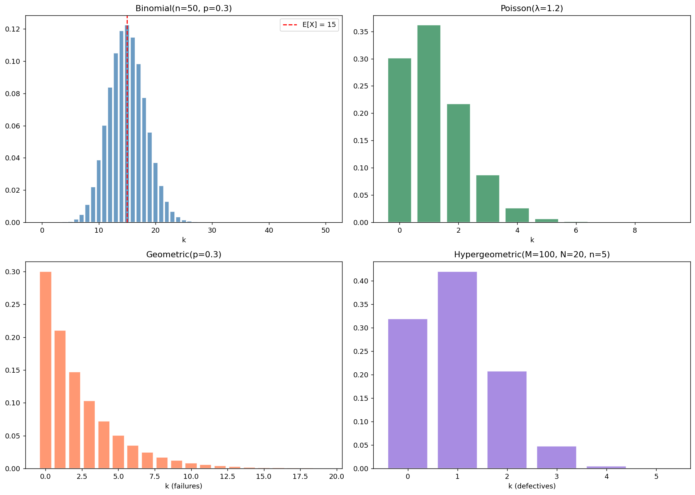

# 이산분포 모음

## 개요

이 페이지에서는 네 가지 주요 이산분포인 **Binomial**, **Poisson**, **Geometric**, **Hypergeometric** 분포를 실용적인 예와 함께 살펴본다. 각각은 서로 다른 유형의 계수 문제를 모형화하며, 언제 어느 것을 쓸지 아는 것이 응용통계학에서 필수적이다.

---

## 1. Binomial 분포

각각 성공확률이 $p$인 독립 Bernoulli 시행 $n$번에서의 성공 횟수:

$$
P(X = k) = \binom{n}{k} p^k (1-p)^{n-k}, \qquad k = 0, 1, \ldots, n
$$

**예:** 어떤 은행원이 한 달에 50명의 대출 신청자를 만난다. 그중 30%는 신용이 나쁘다.

<div class="codebox" markdown>

**예제 1.** 이항분포

```python
import numpy as np
from scipy import stats
import matplotlib.pyplot as plt

n, p = 50, 0.3                 # 시행 50번, 각 시행의 성공확률 0.3
k_vals = np.arange(0, n + 1)   # 가능한 성공 횟수 0~50
pmf = stats.binom.pmf(k_vals, n, p)

# pmf 는 "정확히" 그 값일 확률, cdf 는 "이하"일 확률이다.
# 이산분포에서 이 구분이 특히 중요하다. P(X <= 12) 에는 12가 포함된다.
print(f"P(X = 14) = {stats.binom.pmf(14, n, p):.4f}")
print(f"P(X <= 12) = {stats.binom.cdf(12, n, p):.4f}")
# 평균 np = 15, 분산 np(1-p) = 10.5
print(f"E[X] = {n*p:.1f}, Var(X) = {n*p*(1-p):.2f}")
```

출력:

```
P(X = 14) = 0.1189
P(X <= 12) = 0.2229
E[X] = 15.0, Var(X) = 10.50
```

</div>

---

## 2. Poisson 분포

평균 비율이 $\lambda$일 때 고정된 구간에서 일어나는 희귀 사건의 수:

$$
P(X = k) = \frac{\lambda^k e^{-\lambda}}{k!}, \qquad k = 0, 1, 2, \ldots
$$

**예:** 어떤 트레이더가 5년 동안 1200번 거래한다. 거래 한 번당 파산 확률이 1/1000이므로 $\lambda = 1.2$이다.

<div class="codebox" markdown>

**예제 2.** 포아송분포

```python
lam = 1.2
print(f"P(X = 2) = {stats.poisson.pmf(2, lam):.4f}")
print(f"P(X > 2) = {1 - stats.poisson.cdf(2, lam):.4f}")
```

출력:

```
P(X = 2) = 0.2169
P(X > 2) = 0.1205
```

</div>

---

## 3. Geometric 분포

독립 Bernoulli 시행에서 첫 성공 이전의 실패 횟수:

$$
P(X = k) = (1-p)^k \, p, \qquad k = 0, 1, 2, \ldots
$$

**예:** 성공확률이 $p = 0.3$이다. 첫 성공 이전의 기대 실패 횟수는 $(1-p)/p \approx 2.33$이다.

<div class="codebox" markdown>

**예제 3.** 기하분포

```python
p = 0.3
print(f"P(5 failures before 1st success) = {(1-p)**5 * p:.4f}")
print(f"E[failures] = {(1-p)/p:.2f}")
```

출력:

```
P(5 failures before 1st success) = 0.0504
E[failures] = 2.33
```

</div>

---

## 4. Hypergeometric 분포

성공이 $K$개 들어 있는 크기 $N$의 모집단에서 **비복원**으로 $n$개를 뽑을 때의 성공 개수:

$$
P(X = k) = \frac{\binom{K}{k}\binom{N-K}{n-k}}{\binom{N}{n}}
$$

**예:** 모집단 $N = 100$, 불량품 $K = 20$, 추출 $n = 5$.

<div class="codebox" markdown>

**예제 4.** 초기하분포

```python
from scipy import special

N, K, n = 100, 20, 5
p2 = stats.hypergeom.pmf(2, N, K, n)
p2_manual = (special.comb(K, 2) * special.comb(N-K, n-2)) / special.comb(N, n)
print(f"P(X = 2) = {p2:.4f}  (manual = {p2_manual:.4f})")
print(f"E[X] = {n*K/N:.2f}")
```

출력:

```
P(X = 2) = 0.2073  (manual = 0.2073)
E[X] = 1.00
```

</div>

---

## 시각화

<div class="codebox" markdown>

**예제 5.** 네 이산분포 한눈에 보기

```python
# 네 이산분포를 2x2 격자에 나란히 놓는다.
# 서로 어떻게 다른지가 아니라 **무엇을 세는지가** 다르다는 데 주목하라.
#   Binomial      : 시행 수를 정해 놓고 성공 횟수를 센다 (복원추출)
#   Poisson       : 정해진 구간에서 사건 발생 횟수를 센다 (상한 없음)
#   Geometric     : 첫 성공까지 걸린 시행 수를 센다
#   Hypergeometric: 유한 모집단에서 비복원추출했을 때의 성공 횟수
fig, axes = plt.subplots(2, 2, figsize=(14, 10))

axes[0, 0].bar(k_vals, pmf, color="steelblue", edgecolor="white", alpha=0.8)
axes[0, 0].axvline(n * p, color="red", linestyle="--", label=f"E[X] = {n*p:.0f}")
axes[0, 0].set_title("Binomial(n=50, p=0.3)")
axes[0, 0].set_xlabel("k")
axes[0, 0].legend()

pk = np.arange(0, 10)
axes[0, 1].bar(pk, stats.poisson.pmf(pk, lam), color="seagreen",
               edgecolor="white", alpha=0.8)
axes[0, 1].set_title(f"Poisson(λ={lam})")
axes[0, 1].set_xlabel("k")

gk = np.arange(0, 20)
# gk + 1 을 넣는 이유: scipy의 geom은 시행 번호(1부터)를 받는데
# 여기서는 실패 횟수(0부터)를 가로축으로 쓰고 싶기 때문이다.
axes[1, 0].bar(gk, stats.geom.pmf(gk + 1, 0.3), color="coral",
               edgecolor="white", alpha=0.8)
axes[1, 0].set_title("Geometric(p=0.3)")
axes[1, 0].set_xlabel("k (failures)")

hk = np.arange(0, n + 1)
# 초기하분포: 전체 N개 중 성공이 K개일 때, n개를 **비복원**으로 뽑아
# 성공이 몇 개 나오는가. 뽑을 때마다 남은 구성이 바뀌므로 시행이 독립이 아니다.
# 그 점이 이항분포와의 유일하면서도 결정적인 차이다.
axes[1, 1].bar(hk, stats.hypergeom.pmf(hk, N, K, n), color="mediumpurple",
               edgecolor="white", alpha=0.8)
axes[1, 1].set_title("Hypergeometric(N=100, K=20, n=5)")
axes[1, 1].set_xlabel("k (defectives)")

plt.tight_layout()
plt.show()
```

</div>



---

## 연습문제

<div class="drillbox" markdown>

**연습문제 1.** <span class="diff med" title="중간"></span>
$np = \lambda$를 고정한 채 $n \to \infty$, $p \to 0$일 때 Poisson 분포가 Binomial 분포의 극한임을 보여라.

</div>

??? success "풀이"
    $p = \lambda/n$인 $P(X = k) = \binom{n}{k}p^k(1-p)^{n-k}$에서 출발한다:

    $$
    \binom{n}{k}\left(\frac{\lambda}{n}\right)^k\left(1 - \frac{\lambda}{n}\right)^{n-k}
    $$

    $n \to \infty$일 때 $\binom{n}{k}/n^k \to 1/k!$, $(1-\lambda/n)^n \to e^{-\lambda}$, $(1-\lambda/n)^{-k} \to 1$이다. 따라서:

    $$
    P(X = k) \to \frac{\lambda^k}{k!} e^{-\lambda}
    $$

    이것이 Poisson PMF이다. $\square$

<div class="drillbox" markdown>

**연습문제 2.** <span class="diff med" title="중간"></span>
품질 검사원이 100개(불량 20개)로 이루어진 한 배치에서 5개를 뽑는다. Hypergeometric 분포(정확)와 Binomial 분포(근사)로 $P(X = 2)$를 각각 구해 비교하라. Binomial 근사는 언제 좋은가?

</div>

??? success "풀이"
    **Hypergeometric:** $P(X=2) = \binom{20}{2}\binom{80}{3}/\binom{100}{5} \approx 0.2075$.

    **Binomial** ($n=5$, $p=0.2$): $P(X=2) = \binom{5}{2}(0.2)^2(0.8)^3 = 10 \times 0.04 \times 0.512 = 0.2048$.

    $n/N = 5/100 = 5\%$로 작기 때문에 근사가 가깝다. 경험 법칙으로, 표본이 모집단의 5–10%보다 작으면 Binomial 분포가 Hypergeometric 분포를 잘 근사한다.

<div class="drillbox" markdown>

**연습문제 3.** <span class="diff med" title="중간"></span>
Geometric 분포가 무기억성을 가짐을 증명하라: $P(X > s + t \mid X > s) = P(X > t)$.

</div>

??? success "풀이"
    여기서 $X$는 첫 성공 이전의 실패 횟수를 센다(0부터 시작). 그러면 $P(X \ge k) = (1-p)^k$이다. 따라서:

    $$
    P(X \ge s+t \mid X \ge s) = \frac{(1-p)^{s+t}}{(1-p)^s} = (1-p)^t = P(X \ge t)
    $$

    $\square$

<div class="drillbox" markdown>

**연습문제 4.** <span class="diff med" title="중간"></span>
Hypergeometric 분포의 기댓값은 $E[X] = nK/N$이다. 이 결과를 유도하라.

</div>

??? success "풀이"
    $i$번째로 뽑은 물건이 불량이면 $X_i = 1$로 두고 $X = \sum_{i=1}^n X_i$로 쓰자. 대칭성에 의해 각 $i$에 대해 $P(X_i = 1) = K/N$이다(뽑힌 물건이 $N$개 중 어느 것일 확률이 모두 같다). 기댓값의 선형성에 의해:

    $$
    E[X] = \sum_{i=1}^n E[X_i] = n \cdot \frac{K}{N}
    $$

    참고: 비복원추출이므로 $X_i$들은 독립이 아니지만, 기댓값의 선형성에는 독립성이 필요하지 않다. $\square$

---

## 정리하며

네 이산분포는 각각 **다른 종류의 세기 문제**에 대응한다. 고르는 기준은 "무엇이 고정되어 있고 무엇이 확률변수인가"다.

| 분포 | 무엇을 세는가 | 고정된 것 |
|---|---|---|
| 이항 | 시행 $n$ 번의 성공 횟수 | 시행 수 $n$, 확률 $p$ |
| 포아송 | 일정 구간의 사건 수 | 평균 발생률 $\lambda$ |
| 기하 | 첫 성공까지의 시행 수 | 확률 $p$ |
| 초기하 | 비복원 추출에서의 성공 수 | 모집단 구성과 뽑는 수 |

- **이항과 초기하의 갈림길은 복원 여부다.** 모집단이 뽑는 수보다 훨씬 크면($n/N\le0.1$) 초기하가 이항에 가까워지므로 실무에서는 이항으로 근사한다.
- **이항과 포아송.** $n$ 이 크고 $p$ 가 작으며 $np=\lambda$ 가 중간 정도면 이항이 포아송으로 간다. 드문 사건을 셀 때 포아송이 등장하는 이유다.
- **기하분포의 무기억성.** 지금까지 실패했다는 사실이 앞으로 몇 번 더 해야 하는지에 아무 정보도 주지 않는다. 연속형 대응물이 지수분포다.
- **평균과 분산의 관계가 분포를 식별해 준다.** 이항은 분산이 평균보다 작고($np(1-p)<np$), 포아송은 같으며, 자료에서 분산이 평균보다 크면(과산포) 음이항 같은 다른 모형이 필요하다.

다음 절부터 **연속분포**로 넘어간다. 균등분포에서 시작해 지수·정규·$t$·카이제곱·$F$ 로 이어지며, 뒤의 셋은 추론에서 쓰이는 표집분포들이다.
