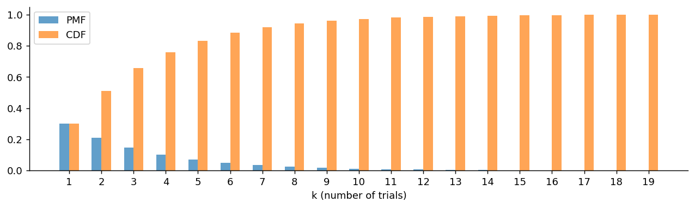
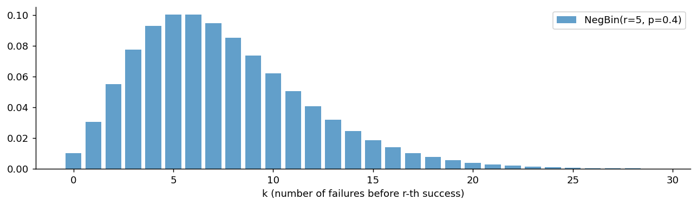
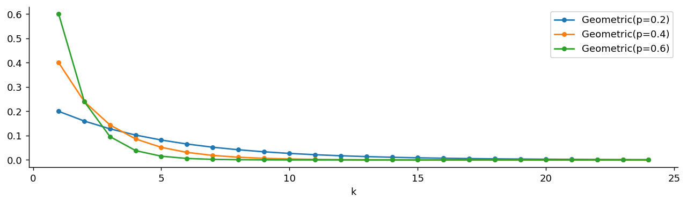

# 기하분포와 음이항분포

## 개요

**기하분포**는 첫 성공까지의 시행 횟수를 모형화하고, **음이항분포**는 이를 일반화하여 $r$번째 성공까지의 시행 횟수를 다룬다. 두 분포 모두 독립 베르누이 시행을 순차적으로 반복하는 실험에서 자연스럽게 나타난다.

4.1절의 사슬에서 이 페이지는 **무엇을 고정하는지를 뒤집는** 자리에 있다.

$$
\text{HG}(n, N, M) \;\longrightarrow\; \text{Geo}(p) \;\longrightarrow\; \text{NB}(r, p)
$$

앞의 두 분포(이항, 초기하)는 **시행 횟수를 정해 놓고 성공 횟수를 셌다.** 여기서는 반대로 **성공 횟수를 정해 놓고 시행 횟수를 센다.** 성공 1번이면 기하분포, $r$번이면 음이항분포다. 같은 베르누이 시행 열을 보면서 무엇을 세느냐만 바꾼 것이다.

---

## 기하분포

<div class="defn" markdown>

### 정의 1. 기하분포 { .dfn }

성공확률이 $p$인 독립 베르누이 시행을 첫 성공이 나올 때까지 반복할 때, 시행 횟수 $X$는 기하분포를 따른다:

$$
X \sim \text{Geometric}(p), \qquad P(X = k) = (1 - p)^{k-1} p, \quad k = 1, 2, 3, \ldots
$$

이 PMF는 처음 $k-1$번의 시행이 모두 실패이고 $k$번째 시행이 성공이어야 함을 나타낸다.

**다른 모수화:** 어떤 교재에서는 $Y$를 첫 성공 이전의 *실패* 횟수로 정의한다. 이때 $Y = X - 1$이고 $k = 0, 1, 2, \ldots$에 대해 $P(Y = k) = (1-p)^k p$이다.

</div>

### PMF의 합이 1임을 확인하기

$$
\sum_{k=1}^{\infty} (1-p)^{k-1} p = p \sum_{j=0}^{\infty} (1-p)^j = p \cdot \frac{1}{1 - (1-p)} = 1
$$

공비 $|1-p| < 1$인 등비급수 공식을 사용했다.

### 성질

$$
\begin{aligned}
E[X] &= \frac{1}{p} \\[4pt]
\text{Var}(X) &= \frac{1 - p}{p^2}
\end{aligned}
$$

### 평균의 유도

$$
E[X] = \sum_{k=1}^{\infty} k(1-p)^{k-1} p = p \cdot \frac{d}{dq}\left[\sum_{k=0}^{\infty} q^k \right]_{q=1-p} \!\!\!\!= p \cdot \frac{1}{(1-q)^2}\bigg|_{q=1-p} = \frac{1}{p}
$$

### 분산의 유도

$E[X(X-1)] = \sum_{k=2}^{\infty} k(k-1)(1-p)^{k-1}p = \frac{2(1-p)}{p^2}$를 이용하면:

$$
E[X^2] = E[X(X-1)] + E[X] = \frac{2(1-p)}{p^2} + \frac{1}{p}
$$

$$
\text{Var}(X) = E[X^2] - (E[X])^2 = \frac{2(1-p)}{p^2} + \frac{1}{p} - \frac{1}{p^2} = \frac{1-p}{p^2}
$$

---

## 무기억성

기하분포는 무기억성을 갖는 **유일한** 이산분포이다:

$$
P(X > s + t \mid X > s) = P(X > t) \quad \text{for all } s, t \geq 0
$$

??? proof "증명"


    $$
    P(X > s + t \mid X > s) = \frac{P(X > s + t)}{P(X > s)} = \frac{(1-p)^{s+t}}{(1-p)^s} = (1-p)^t = P(X > t)
    $$

    **해석:** 이미 $s$번의 시행 동안 성공하지 못했다고 해도, 앞으로 최소 $t$번 더 기다릴 확률은 처음부터 새로 시작하는 것과 같다. 과거의 실패는 미래의 성공에 관한 정보를 전혀 담고 있지 않다.

    ---

## 음이항분포

<div class="defn" markdown>

### 정의 2. 음이항분포 { .dfn }

독립 베르누이 시행에서 $r$번의 성공을 얻는 데 필요한 시행 횟수 $Y$는 **음이항분포**를 따른다:

$$
Y \sim \text{NegBin}(r, p), \qquad P(Y = k) = \binom{k-1}{r-1} p^r (1-p)^{k-r}, \quad k = r, r+1, r+2, \ldots
$$

이항계수 $\binom{k-1}{r-1}$은 처음 $k-1$번의 시행 중에 $r-1$번의 성공을 배치하는 경우의 수를 센다($k$번째 시행은 반드시 성공이어야 한다).

**참고:** $r = 1$이면 음이항분포는 기하분포로 환원된다.

</div>

### 성질

$$
\begin{aligned}
E[Y] &= \frac{r}{p} \\[4pt]
\text{Var}(Y) &= \frac{r(1-p)}{p^2}
\end{aligned}
$$

### 기하 확률변수의 합을 통한 유도

$X_1, X_2, \ldots, X_r$이 독립인 $\text{Geometric}(p)$ 확률변수이면 $Y = \sum_{i=1}^r X_i \sim \text{NegBin}(r, p)$이다. 따라서:

$$
E[Y] = \sum_{i=1}^r E[X_i] = \frac{r}{p}, \qquad \text{Var}(Y) = \sum_{i=1}^r \text{Var}(X_i) = \frac{r(1-p)}{p^2}
$$

---

## 문제

<div class="probox" markdown>

**문제:** <span class="diff easy" title="쉬움"></span> 어떤 트레이더의 전략은 각 거래에서 독립적으로 30%의 승률을 갖는다. 첫 승리까지 필요한 거래 횟수의 기댓값은 얼마인가? 첫 승리가 5번째 거래에서 일어날 확률은?

</div>

??? success "풀이"

    $$
    E[X] = \frac{1}{0.3} \approx 3.33 \text{ trades}
    $$

    $$
    P(X = 5) = (1 - 0.3)^{5-1} \cdot 0.3 = (0.7)^4 \cdot 0.3 = 0.2401 \cdot 0.3 = 0.0720
    $$
---

## Python: PMF, CDF, 표본추출

### 기하분포

<div class="codebox" markdown>

#### 예제 1. 기하분포의 확률질량함수 { .eg }

```python
import matplotlib.pyplot as plt
import numpy as np
from scipy import stats

p = 0.3
# x가 1부터 시작한다는 점에 주의하라.
# scipy의 geom은 "**첫 성공이 나온 시행 번호**"를 세는 판본이라 최솟값이 1이다.
# (첫 성공 **이전의 실패 횟수**를 세는 판본은 0부터 시작한다. 교재마다 다르다.)
x = np.arange(1, 20)

fig, ax = plt.subplots(figsize=(12, 3))
# PMF가 단조 감소한다. 성공은 빠를수록 확률이 높다.
# k번째에 처음 성공하려면 k-1번 연속 실패해야 하므로 (1-p)^(k-1) * p 다.
ax.bar(x - 0.15, stats.geom(p).pmf(x), width=0.3, label='PMF', alpha=0.7)
ax.bar(x + 0.15, stats.geom(p).cdf(x), width=0.3, label='CDF', alpha=0.7)
ax.set_xlabel('k (number of trials)')
ax.set_xticks(x)
ax.spines[['top', 'right']].set_visible(False)
ax.legend()
plt.show()
```



</div>

### 음이항분포

<div class="codebox" markdown>

#### 예제 2. 음이항분포의 SciPy 판본 { .eg }

```python
import matplotlib.pyplot as plt
import numpy as np
from scipy import stats

# scipy의 음이항분포는 **실패 횟수**를 세는 판본이다.
# nbinom(r, p).pmf(k) = "r번째 성공이 나오기까지 실패가 k번 일어날 확률"
# 따라서 총 시행 횟수는 k + r 이고, x가 0부터 시작한다.
# 기하분포는 r = 1 인 특수한 경우다.
r, p = 5, 0.4
x = np.arange(0, 30)

fig, ax = plt.subplots(figsize=(12, 3))
# 기하분포와 달리 봉우리가 생긴다. 실패가 너무 적어도(운이 좋아도)
# 너무 많아도 확률이 낮기 때문이다.
ax.bar(x, stats.nbinom(r, p).pmf(x), alpha=0.7, label=f'NegBin(r={r}, p={p})')
ax.set_xlabel('k (number of failures before r-th success)')
ax.spines[['top', 'right']].set_visible(False)
ax.legend()
plt.show()
```



</div>

### 무기억성 확인하기

<div class="codebox" markdown>

#### 예제 3. 기하분포의 무기억성 { .eg }

```python
import numpy as np
from scipy import stats

np.random.seed(42)
p = 0.3
samples = stats.geom(p).rvs(1_000_000)

s = 3
# 무기억성: P(X > s + t | X > s) = P(X > t)
# "이미 3번 실패했다"는 사실이 앞으로 몇 번 더 걸릴지에 아무 정보도 주지 않는다.
# 동전은 자기가 이미 몇 번 뒷면이 나왔는지 기억하지 못한다.
for t in [1, 3, 5]:
    # samples[samples > s] 로 "3번 넘게 걸린 시행들"만 골라 낸다(조건 걸기).
    # 그 안에서 s+t 를 넘는 비율이 조건부확률이다.
    conditional = np.mean(samples[samples > s] > s + t)
    unconditional = np.mean(samples > t)
    print(f"P(X>{s}+{t}|X>{s}) = {conditional:.4f},  P(X>{t}) = {unconditional:.4f}")
```

출력:

```
P(X>3+1|X>3) = 0.6996,  P(X>1) = 0.7005
P(X>3+3|X>3) = 0.3430,  P(X>3) = 0.3433
P(X>3+5|X>3) = 0.1690,  P(X>5) = 0.1681
```

</div>

### 모수에 따른 비교

<div class="codebox" markdown>

#### 예제 4. 성공확률에 따른 기하분포 비교 { .eg }

```python
import matplotlib.pyplot as plt
import numpy as np
from scipy import stats

fig, ax = plt.subplots(figsize=(12, 3))
# p가 클수록 첫 성공이 빨리 오므로 확률이 앞쪽에 몰리고 더 가파르게 떨어진다.
# 평균은 1/p 이므로 p=0.2면 평균 5번, p=0.6이면 평균 1.67번이다.
for p in [0.2, 0.4, 0.6]:
    x = np.arange(1, 25)
    ax.plot(x, stats.geom(p).pmf(x), 'o-', label=f'Geometric(p={p})', markersize=4)
ax.spines[['top', 'right']].set_visible(False)
ax.set_xlabel('k')
ax.legend()
plt.show()
```



</div>

---

## 다른 분포와의 관계

$$
\begin{aligned}
\text{Geometric}(p) &= \text{NegBin}(1, p) \\[4pt]
\text{NegBin}(r, p) &= \sum_{i=1}^r \text{Geometric}_i(p) \quad \text{(독립인 확률변수의 합)} \\[4pt]
\text{Geometric} &\leftrightarrow \text{Exponential} \quad \text{(이산형 vs 연속형 무기억 분포)}
\end{aligned}
$$

### 다음 고리: 음이항분포에서 포아송분포로

음이항분포는 두 가지 서로 다른 길로 포아송분포에 닿는다. 4.1절 사슬의 마지막 고리다.

- **극한으로서.** $r \to \infty$, $p \to 1$이면서 $r(1-p)/p \to \lambda$로 고정하면 실패 횟수를 세는 음이항분포가 $\text{Poisson}(\lambda)$로 수렴한다. 성공이 너무 흔해져서 실패가 드문 사건이 되는 상황이다.
- **혼합으로서.** 포아송분포의 비율 $\lambda$ 자체를 감마분포를 따르는 확률변수로 두고 섞으면 음이항분포가 나온다(연습문제 9). 방향을 거꾸로 읽으면, 음이항분포는 **포아송분포에 산포를 하나 더 얹은 것**이다. $\theta \to 0$이면 포아송으로 되돌아간다.

실제 계수 자료에서 분산이 평균보다 크면(과대산포) 포아송 대신 음이항을 쓰는 관행이 여기에서 나온다.

---

## 연습문제

<div class="drillbox" markdown>

**연습문제 1.** <span class="diff easy" title="쉬움"></span>
영업 전화의 성공확률이 $p = 0.1$이다. $Y$를 첫 계약까지의 전화 횟수라 하자. (a) 분포는? (b) $P(Y = 5)$, $P(Y > 10)$. (c) 8번 실패했다는 조건 아래 $P(Y > 15)$. (d) 평균과 분산.

</div>

??? success "풀이"
    (a) $Y \sim \mathrm{Geometric}(0.1)$.

    (b) $P(Y = 5) = (0.9)^4 \cdot 0.1 = 0.0656$. $P(Y > 10) = (0.9)^{10} \approx 0.349$.

    (c) 무기억성에 의해 $P(Y > 15 \mid Y > 8) = P(Y > 7) = (0.9)^7 \approx 0.478$. 과거의 실패는 미래의 성공을 예측하지 못한다.

    (d) $\mathbb{E}[Y] = 1/p = 10$. $\mathrm{Var}(Y) = (1-p)/p^2 = 0.9/0.01 = 90$.

<div class="drillbox" markdown>

**연습문제 2.** <span class="diff med" title="중간"></span>
기하분포의 **무기억성** $P(Y > m + n \mid Y > m) = P(Y > n)$을 증명하라.

</div>

??? success "풀이"
    생존함수는 $P(Y > k) = (1 - p)^k$이다.

    $$
    P(Y > m + n \mid Y > m) = \frac{P(Y > m + n)}{P(Y > m)} = \frac{(1-p)^{m+n}}{(1-p)^m} = (1-p)^n = P(Y > n)
    $$

    $\square$

    기하분포는 무기억성을 갖는 **유일한** 이산분포이다. 무기억성을 갖는 유일한 연속분포인 지수분포와 함께, 이 두 분포는 "완전히 무작위한" 대기 시간을 모형화한다.

<div class="drillbox" markdown>

**연습문제 3.** <span class="diff med" title="중간"></span>
**음이항분포.** i.i.d. Bernoulli($p$) 시행에서 $r$번째 성공까지의 시행 횟수를 $Z$라 하자. PMF, $\mathbb{E}[Z]$, $\mathrm{Var}(Z)$를 유도하라.

</div>

??? success "풀이"
    $Z = k$이려면 처음 $k - 1$번의 시행에서 정확히 $r - 1$번 성공하고 $k$번째 시행에서 성공해야 한다:

    $$
    P(Z = k) = \binom{k-1}{r-1} p^r (1-p)^{k-r}, \quad k = r, r+1, \ldots
    $$

    $Z$는 독립인 기하 확률변수 $Y_1, \ldots, Y_r$(각 성공까지의 대기 시간)의 합으로 쓸 수 있다. 따라서:

    $$
    \mathbb{E}[Z] = r/p, \qquad \mathrm{Var}(Z) = r(1-p)/p^2
    $$

    $r = 1$이면 기하분포로 환원된다. 음이항분포는 기하분포를 여러 번의 성공으로 일반화하며, 과대산포된 계수 자료의 모형에 바탕이 된다.

<div class="drillbox" markdown>

**연습문제 4.** <span class="diff hard" title="어려움"></span>
**쿠폰 수집가 문제.** $n$가지 종류의 쿠폰을 모두 모으려면 (복원추출로) 독립적인 무작위 추출을 몇 번 해야 하는가? 전체 추출 횟수 $T$에 대해 $\mathbb{E}[T]$를 구하라.

</div>

??? success "풀이"
    분해해서 생각하자. $T_i$를 $i - 1$가지를 이미 모은 상태에서 $i$번째 *새로운* 쿠폰 종류를 얻기까지의 추출 횟수라 하자. 각 $T_i$는 성공확률 $(n - i + 1)/n$인 기하분포를 따른다. $i - 1$가지를 모았다면 남은 $n - i + 1$가지 중 어느 것을 뽑아도 성공이기 때문이다.

    따라서 $\mathbb{E}[T_i] = n/(n - i + 1)$이다.

    전체는 $T = \sum_{i=1}^n T_i$이고, 선형성에 의해:

    $$
    \mathbb{E}[T] = \sum_{i=1}^n \frac{n}{n - i + 1} = n \sum_{j=1}^n \frac{1}{j} \approx n \ln n + n\gamma
    $$

    여기서 $\gamma \approx 0.5772$는 Euler 상수이다. $n = 365$(서로 다른 생일 날짜)이면 $\mathbb{E}[T] \approx 365 \cdot 6.49 \approx 2370$번 추출해야 한다.

    기하분포는 이 고전적 문제와 이와 유사한 여러 순차 탐색 문제의 기본 구성요소이다.

<div class="drillbox" markdown>

**연습문제 5.** <span class="diff med" title="중간"></span>
**이산화된 지수분포로서의 기하분포.** $\Delta t$가 작을 때 $p$가 $\lambda \Delta t$에 대응하는 방식으로, 기하분포가 지수분포의 이산시간 대응물로 나타남을 보여라.

</div>

??? success "풀이"
    비율 $\lambda$인 포아송 과정을 시각 $\Delta t, 2\Delta t, 3\Delta t, \ldots$에서 관측한다고 하자. 각 구간 $[(k-1)\Delta t, k\Delta t]$에서 사건이 일어날 확률은 $p = 1 - e^{-\lambda \Delta t} \approx \lambda \Delta t$이며, 마지막 근사는 $\Delta t$가 작을 때 성립한다.

    $K$를 사건이 처음 일어난 구간의 번호라 하자. 그러면 $p = 1 - e^{-\lambda \Delta t}$인 $K \sim \mathrm{Geometric}(p)$이고, 대기 시간은 $T_{\text{disc}} = K \cdot \Delta t$이다.

    $\Delta t \to 0$일 때:

    $\mathbb{E}[T_{\text{disc}}] = \Delta t / p = \Delta t / (1 - e^{-\lambda \Delta t}) \to 1/\lambda$이며, 이는 지수분포의 평균과 일치한다.

    연속 극한에서 지수분포가 복원된다. 기하분포는 이산시간 도착 과정이고, 지수분포는 그 연속시간 대응물이다.

<div class="drillbox" markdown>

**연습문제 6.** <span class="diff med" title="중간"></span>
**기하분포의 역변환 표본추출.** $U \sim \mathrm{Uniform}(0, 1)$이 주어졌을 때 $X \sim \mathrm{Geometric}(p)$를 생성하는 공식을 유도하라.

</div>

??? success "풀이"
    기하분포의 CDF는 $k = 1, 2, \ldots$에 대해 $F(k) = 1 - (1 - p)^k$이다.

    역 CDF: $F(k) \ge u$일 필요충분조건은 $(1 - p)^k \le 1 - u$이고, 이는 다시 $k \ge \ln(1 - u)/\ln(1 - p)$와 동치이다.

    따라서:

    $$
    X = \lceil \ln(1 - U)/\ln(1 - p) \rceil
    $$

    $1 - U$는 $U$와 같은 균등분포를 따르므로 다음과 동등하게 쓸 수 있다:

    $$
    X = \lceil \ln(U)/\ln(1 - p) \rceil
    $$

    이 방법은 닫힌 형태로 효율적이며, 첫 성공까지 개별 베르누이 시행을 하나씩 모사하는 방식을 대체한다. 후자는 $p$가 작을 때 느려질 수 있다.

    **Python:** `np.ceil(np.log(np.random.rand()) / np.log(1 - p)).astype(int)`.

<div class="drillbox" markdown>

**연습문제 7.** <span class="diff med" title="중간"></span>
기하분포에는 "첫 성공이 나온 **시행 번호**"를 세는 판본과 "첫 성공 **이전의 실패 횟수**"를 세는 판본이 있다. 두 판본의 지지집합, 평균, 분산을 각각 적고, SciPy에서 어느 함수가 어느 판본인지 확인하라.

</div>

??? success "풀이"
    두 판본을 $Y$(시행 번호)와 $X = Y - 1$(실패 횟수)이라 하자.

    | | $Y$ = 시행 번호 | $X$ = 실패 횟수 |
    |---|---|---|
    | 지지집합 | $1, 2, 3, \dots$ | $0, 1, 2, \dots$ |
    | PMF | $(1-p)^{k-1}p$ | $(1-p)^k p$ |
    | 평균 | $1/p$ | $(1-p)/p$ |
    | 분산 | $(1-p)/p^2$ | $(1-p)/p^2$ |

    평균만 1만큼 다르고 분산은 같다. 상수를 빼도 분산은 변하지 않기 때문이다.

    **SciPy.** `stats.geom(p)`은 **시행 번호** 판본이라 최솟값이 1이고 평균이 $1/p$이다. `stats.nbinom(1, p)`은 **실패 횟수** 판본이라 최솟값이 0이고 평균이 $(1-p)/p$이다. 이름이 다를 뿐 같은 분포족의 두 이동판이며, `stats.geom(p).pmf(k) == stats.nbinom(1, p).pmf(k-1)`이 성립한다.

    ```python
    from scipy import stats
    p = 0.25
    print(stats.geom(p).mean(), stats.nbinom(1, p).mean())   # 4.0  3.0
    ```

    실무에서 자주 겪는 사고가 여기서 나온다. 어떤 교재의 공식 $\operatorname{Var} = (1-p)/p^2$을 그대로 쓰면서 평균만 SciPy에서 가져오면 두 판본이 섞인다. **"무엇을 세는가"를 먼저 정하고 그에 맞는 공식과 함수를 짝지어야 한다.** 음이항분포에서도 똑같은 문제가 생기며, `stats.nbinom`은 언제나 실패 횟수를 센다.

<div class="drillbox" markdown>

**연습문제 8.** <span class="diff med" title="중간"></span>
$Y_1, \dots, Y_n$이 독립이고 $\text{Geometric}(p)$(시행 번호 판본)를 따를 때 $p$의 최대가능도추정량을 구하라. 이 추정량은 불편인가?

</div>

??? success "풀이"
    가능도는

    $$
    L(p) = \prod_{i=1}^n (1-p)^{y_i - 1}p = p^n (1-p)^{\sum y_i - n}
    $$

    이고 로그를 취하면

    $$
    \ell(p) = n\ln p + \left(\sum_i y_i - n\right)\ln(1-p)
    $$

    이다. 미분해 0으로 두면

    $$
    \frac{n}{p} - \frac{\sum y_i - n}{1-p} = 0 \implies \hat p = \frac{n}{\sum_i y_i} = \frac{1}{\bar Y}
    $$

    이다. $E[Y] = 1/p$이니 자연스러운 결과다.

    **불편이 아니다.** $1/x$가 볼록함수이므로 옌센 부등식에 따라

    $$
    E[\hat p] = E\!\left[\frac{1}{\bar Y}\right] > \frac{1}{E[\bar Y]} = p
    $$

    이다. 항상 $p$를 과대추정한다. 직관적으로도, 우연히 성공이 일찍 몰린 표본에서 $\bar Y$가 작아지고 그 역수가 크게 튀는데, 반대 방향으로는 $\bar Y$가 아무리 커져도 역수가 0 아래로는 못 내려가므로 위쪽으로 치우친다.

    편향의 크기는 $O(1/n)$이라 $n$이 커지면 사라진다. 최대가능도추정량은 일반적으로 **일치추정량이지만 유한표본에서 불편은 아니며**, 특히 이렇게 비선형 변환이 끼면 편향이 생긴다. 정규분포의 $\hat\sigma^2_{\text{MLE}}$가 편향된 것과 같은 종류의 현상이다.

<div class="drillbox" markdown>

**연습문제 9.** <span class="diff hard" title="어려움"></span>
$Y \mid \Lambda = \lambda \sim \text{Poisson}(\lambda)$이고 $\Lambda \sim \text{Gamma}(\text{형상}=r,\ \text{척도}=\theta)$일 때 $Y$의 주변분포가 음이항분포임을 보여라. 이것이 계수 자료 분석에서 왜 중요한가?

</div>

??? success "풀이"
    조건부 확률에 사전밀도를 곱해 적분한다.

    $$
    P(Y=y) = \int_0^\infty \frac{e^{-\lambda}\lambda^y}{y!}\cdot\frac{\lambda^{r-1}e^{-\lambda/\theta}}{\Gamma(r)\theta^r}\,d\lambda = \frac{1}{y!\,\Gamma(r)\theta^r}\int_0^\infty \lambda^{y+r-1}e^{-\lambda(1+1/\theta)}\,d\lambda
    $$

    남은 적분은 감마적분이므로 $\Gamma(y+r)\,(1+1/\theta)^{-(y+r)}$이다. $p = 1/(1+\theta)$로 두면 $1-p = \theta/(1+\theta)$이고, 정리하면

    $$
    P(Y=y) = \frac{\Gamma(y+r)}{y!\,\Gamma(r)}\,p^r(1-p)^y, \qquad y = 0, 1, 2, \dots
    $$

    를 얻는다. 이것이 (실패 횟수를 세는 판본의) 음이항분포이다. $\square$

    $r$이 정수일 필요도 없다. 이항계수 대신 감마함수로 쓴 덕분에 $r > 0$인 실수면 된다.

    **왜 중요한가.** 적률을 계산하면

    $$
    E[Y] = r\theta, \qquad \operatorname{Var}(Y) = r\theta(1+\theta) = E[Y]\,(1+\theta)
    $$

    이다. 분산이 평균보다 $(1+\theta)$배 크다. 포아송분포는 평균과 분산이 같아야 하는데, 실제 계수 자료는 거의 언제나 분산이 더 크다. 이를 **과대산포**라 한다.

    이 유도가 그 원인을 말해 준다. 개체마다 사건 발생률 $\lambda$가 다르면(관측되지 않은 이질성), 전체를 뭉뚱그린 분포는 포아송이 아니라 그 혼합이 되고 분산이 부풀어 오른다. 보험 가입자마다 사고 성향이 다르고, 지역마다 감염 위험이 다르며, 유전자마다 발현량이 다르다.

    실무적 귀결은 분명하다. 과대산포된 자료에 포아송 회귀를 쓰면 계수 추정은 그런대로 나와도 **표준오차가 심하게 과소평가**되어 있지도 않은 유의성이 쏟아진다. 음이항 회귀를 쓰면 $\theta$가 이 여분의 산포를 흡수한다. RNA 시퀀싱 자료 분석 도구들이 하나같이 음이항 모형을 쓰는 이유이며, $\theta \to 0$이면 포아송으로 돌아가므로 포아송을 특수한 경우로 포함한다.

<div class="drillbox" markdown>

**연습문제 10.** <span class="diff med" title="중간"></span>
기하분포(시행 번호 판본)의 확률생성함수 $G(s) = E[s^Y]$를 구하고, 이를 미분해 평균과 분산을 유도하라.

</div>

??? success "풀이"
    등비급수를 쓴다. $|s(1-p)| < 1$에서

    $$
    G(s) = \sum_{k=1}^\infty s^k (1-p)^{k-1}p = ps\sum_{k=1}^\infty \{s(1-p)\}^{k-1} = \frac{ps}{1 - s(1-p)}
    $$

    이다. $q = 1-p$로 줄여 쓰면 $G(s) = ps/(1-qs)$이다.

    **평균.** 몫의 미분법으로

    $$
    G'(s) = \frac{p(1-qs) - ps(-q)}{(1-qs)^2} = \frac{p}{(1-qs)^2}
    $$

    이므로 $E[Y] = G'(1) = p/p^2 = 1/p$이다.

    **분산.** 한 번 더 미분하면

    $$
    G''(s) = \frac{2pq}{(1-qs)^3} \implies E[Y(Y-1)] = G''(1) = \frac{2q}{p^2}
    $$

    이다. 따라서

    $$
    \operatorname{Var}(Y) = E[Y(Y-1)] + E[Y] - (E[Y])^2 = \frac{2q}{p^2} + \frac1p - \frac{1}{p^2} = \frac{2q + p - 1}{p^2} = \frac{q}{p^2}
    $$

    로 $(1-p)/p^2$을 얻는다. $\square$

    확률생성함수가 이산분포에서 특히 편리한 것은 $G^{(k)}(1)$이 **계승적률** $E[Y(Y-1)\cdots(Y-k+1)]$을 바로 준다는 점이다. 또 독립인 확률변수의 합에서는 생성함수가 곱해지므로, $r$개의 독립 기하분포를 더한 음이항분포의 생성함수가 $\{ps/(1-qs)\}^r$임을 즉시 알 수 있고 여기서 평균 $r/p$와 분산 $rq/p^2$이 따라 나온다.

---

## 정리하며

- 기하분포는 첫 성공까지의 대기 시간을 모형화하며, 무기억성을 갖는 유일한 이산분포이다.
- 음이항분포는 기하분포를 일반화하여 $r$번째 성공까지의 시행 횟수를 센다.
- 두 분포 모두 독립 베르누이 시행의 열에서 나온다.
- 기하분포의 평균 $1/p$는 직관적으로 해석된다. 성공확률이 낮을수록 기대 대기 시간이 길어진다.
- 기하분포는 지수분포의 이산형 대응물로, 무기억성을 공유한다.
