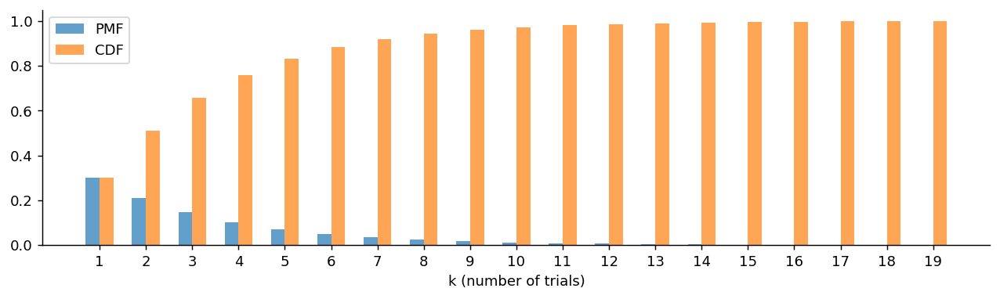
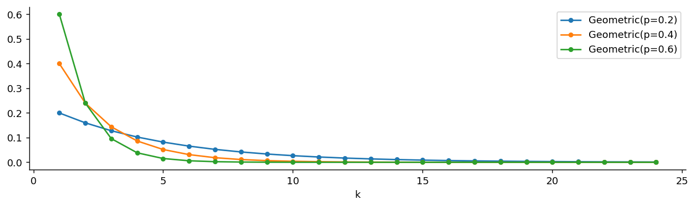

# 기하분포

## 개요

**기하분포**는 첫 성공이 나올 때까지 걸리는 시행 횟수를 모형화한다. 독립 베르누이 시행을 성공이 나올 때까지 되풀이하는 실험에서 자연스럽게 나타난다.

4.1절의 사슬에서 이 페이지는 **무엇을 고정하는지를 뒤집는** 자리에 있다.

$$
\text{Bernoulli}(p) \to B(n, p) \to \text{HG}(n, N, M) \;\longrightarrow\; \text{Geo}(p) \;\longrightarrow\; \text{NB}(r, p) \to \text{Poisson}(\lambda)
$$

앞의 두 분포(이항, 초기하)는 **시행 횟수를 정해 놓고 성공 횟수를 셌다.** 여기서는 반대로 **성공 횟수를 정해 놓고 시행 횟수를 센다.** 성공 1번이면 기하분포이고, $r$번으로 올리면 다음 페이지의 [음이항분포](negative_binomial.md)가 된다. 같은 베르누이 시행 열을 보면서 무엇을 세느냐만 바꾼 것이다.

---

## 1. 정의

<div class="defn" markdown>

### 정의 1. 기하분포 { .dfn }

성공확률이 $p$인 독립 베르누이 시행을 첫 성공이 나올 때까지 반복할 때, 시행 횟수 $X$는 기하분포를 따른다:

$$
X \sim \text{Geometric}(p), \qquad P(X = k) = (1 - p)^{k-1} p, \quad k = 1, 2, 3, \ldots
$$

이 PMF는 처음 $k-1$번의 시행이 모두 실패이고 $k$번째 시행이 성공이어야 함을 나타낸다.

**다른 모수화:** 어떤 교재에서는 $Y$를 첫 성공 이전의 *실패* 횟수로 정의한다. 이때 $Y = X - 1$이고 $k = 0, 1, 2, \ldots$에 대해 $P(Y = k) = (1-p)^k p$이다.

</div>

### PMF의 합이 1임을 확인하기

<div class="thmbox" markdown>

### 정리 1. 기하분포의 PMF 는 확률분포다 { .thm }

$0 < p \le 1$ 이면

$$
\sum_{k=1}^{\infty} (1-p)^{k-1} p = 1
$$

이다.

</div>

??? proof "증명"

    $j = k-1$ 로 놓으면 공비 $q = 1-p$ 인 등비급수가 된다. $0 < p \le 1$ 이므로 $|q| < 1$ 이고 급수가 수렴한다.

    $$
    \sum_{k=1}^{\infty} (1-p)^{k-1} p = p \sum_{j=0}^{\infty} (1-p)^j = p \cdot \frac{1}{1 - (1-p)} = \frac{p}{p} = 1
    $$

    $\square$

    **언젠가는 반드시 성공한다**는 말을 식으로 적은 것이다. $p > 0$ 이기만 하면 영원히 실패할 확률이 0 이다. 그 확률이 $\lim_{k\to\infty}(1-p)^k = 0$ 이기 때문이다.

<div class="thmbox" markdown>

### 정리 2. 기하분포의 평균과 분산 { .thm }

$X \sim \text{Geo}(p)$ 이면

$$
E[X] = \frac{1}{p}, \qquad \operatorname{Var}(X) = \frac{1-p}{p^2}
$$

이다.

</div>

??? proof "증명"

    **등비급수를 미분하는 것**이 두 적률을 모두 준다. 한 번 미분하면 평균, 두 번 미분하면 하강계승적률이다.

    **평균.** $\sum_{k=0}^{\infty} q^k = (1-q)^{-1}$ 을 $q$ 로 미분하면 $\sum_{k=1}^{\infty} kq^{k-1} = (1-q)^{-2}$ 다. $q = 1-p$ 를 넣고 $p$ 를 곱하면

    $$
    E[X] = \sum_{k=1}^{\infty} k(1-p)^{k-1} p = p \cdot \frac{1}{(1-q)^2}\bigg|_{q=1-p} = \frac{p}{p^2} = \frac{1}{p}
    $$

    이다. $1-q = p$ 라는 것만 챙기면 된다.

    **분산.** $E[X^2]$을 직접 구하려 하면 $k^2$ 때문에 급수가 다루기 나빠진다. 대신 **하강계승적률** $E[X(X-1)]$을 구한다. $k(k-1)$은 $q^k$를 두 번 미분할 때 그대로 나오는 계수이기 때문이다.

    $$
    \sum_{k=0}^{\infty} q^k = \frac{1}{1-q}
    \;\;\xrightarrow{\ \text{두 번 미분}\ }\;\;
    \sum_{k=2}^{\infty} k(k-1)q^{k-2} = \frac{2}{(1-q)^3}
    $$

    양변에 $q$를 곱해 지수를 $k-1$로 맞추고 $p$를 곱한 뒤 $q = 1-p$를 넣으면($1-q = p$이다)

    $$
    E[X(X-1)] = p\sum_{k=2}^{\infty} k(k-1)q^{k-1} = p \cdot \frac{2q}{(1-q)^3} = p\cdot\frac{2(1-p)}{p^3} = \frac{2(1-p)}{p^2}
    $$

    이다. 평균을 구할 때 한 번 미분했던 것을 한 번 더 미분한 것뿐이다. 이제 $X^2 = X(X-1) + X$를 쓰면

    $$
    E[X^2] = E[X(X-1)] + E[X] = \frac{2(1-p)}{p^2} + \frac{1}{p}
    $$

    $$
    \text{Var}(X) = E[X^2] - (E[X])^2 = \frac{2(1-p)}{p^2} + \frac{1}{p} - \frac{1}{p^2} = \frac{1-p}{p^2}
    $$

    $\square$

<div class="exbox" markdown>

**보기 1.** <span class="diff easy" title="쉬움"></span> 기하분포의 확률질량함수. $X \sim \text{Geometric}(0.3)$의 PMF와 CDF를 $k = 1, \ldots, 19$에서 나란히 그린다.

**(1)** 이웃한 두 확률의 비로 최빈값을 구하고, 이 분포에서는 최빈값의 **동점이 결코 생기지 않는** 까닭을 설명하시오.

**(2)** 최빈값·중앙값·평균을 나란히 구해 치우침을 보이고, $k \ge 20$을 잘라 버린 것이 정당한지 꼬리확률로 확인하시오.

</div>

??? success "풀이"

    **(1) 해석적으로.** 이항분포나 포아송분포에서처럼 이웃한 두 확률의 비를 본다.

    $$
    \frac{p(k)}{p(k-1)}
    = \frac{(1-p)^{k-1}p}{(1-p)^{k-2}p}
    = 1 - p
    $$

    $p$가 약분되고 $(1-p)$의 지수가 하나 차이이므로 **비가 $1-p$ 하나로 떨어진다.** 이것이 기하분포의 가장 중요한 특징이다. 비가 $k$에 전혀 의존하지 않는다.

    따라서 $0 < p < 1$이면 비가 언제나 $1-p < 1$이라 PMF는 **처음부터 끝까지 단조 감소**한다. 오르는 구간이 없으므로

    $$
    \text{최빈값} = 1
    $$

    이고 $p$가 무엇이든 그렇다. 바닥함수도 필요 없다.

    **동점이 생기지 않는 까닭도 같은 식에서 나온다.** 다른 분포에서 동점은 비가 정확히 $1$이 되는 자리에서 생겼다. 이항은 $(n+1)p$가 정수일 때, 포아송은 $\lambda$가 정수일 때였다. 여기서는 비가 $1 - p$로 **상수**이므로 $1$이 되려면 $p = 0$이어야 하는데, 그러면 성공이 영원히 오지 않아 분포가 아예 정의되지 않는다. 곧 모수를 어떻게 골라도 동점은 없다. **비가 $k$에 의존하지 않는다는 성질 하나가 단조성과 동점 없음을 동시에 준다.**

    **(2) 해석적으로.** 세 중심 측도를 구한다. 최빈값은 (1)에서 $1$이다. 중앙값은 $P(X \le k) = 1 - (1-p)^k \ge \tfrac12$을 만족하는 가장 작은 정수이므로

    $$
    (1-p)^k \le \tfrac12
    \quad \Longleftrightarrow \quad
    k \ge \frac{\log(1/2)}{\log(1-p)} = \frac{\log 0.5}{\log 0.7} = 1.9434
    \quad \Longrightarrow \quad
    \text{중앙값} = 2
    $$

    이다. 평균은 본문에서 $1/p = 3.3333$이다. 세 값을 나란히 놓으면

    $$
    \text{최빈값} = 1 \;<\; \text{중앙값} = 2 \;<\; \text{평균} = 3.33
    $$

    으로 **오른쪽으로 크게 치우친** 분포의 전형적인 순서다. 평균이 최빈값의 세 배가 넘는다. 긴 꼬리 쪽의 큰 값들이 평균을 끌어올리기 때문이고, "평균 $3.33$번"이라는 말이 "대개 $3$번쯤 걸린다"는 뜻이 아님을 보여 준다. 실제로 가장 흔한 결과는 **첫 시행에 성공**($30\%$)이다.

    잘라 낸 꼬리는 등비급수라 바로 적힌다.

    $$
    P(X \ge 20) = P(X > 19) = (1-p)^{19} = 0.7^{19} = 1.1399 \times 10^{-3}
    $$

    $0.1\%$ 남짓이니 그림에서 버려도 좋다. 다만 포아송의 $3.45 \times 10^{-7}$에 비하면 $3000$배 크다. **기하분포의 꼬리는 지수적으로만 줄어들어 두껍다.**

    **수치적으로.** 먼저 쪽의 그림을 그린다.

    ```python
    import matplotlib.pyplot as plt
    import numpy as np
    from scipy import stats

    plt.rcParams["font.sans-serif"] = ["NanumGothic", "Apple SD Gothic Neo", "Malgun Gothic"]
    plt.rcParams["font.family"] = "sans-serif"
    plt.rcParams["axes.unicode_minus"] = False

    p = 0.3
    # x가 1부터 시작한다는 점에 주의하라.
    # scipy의 geom은 "**첫 성공이 나온 시행 번호**"를 세는 판본이라 최솟값이 1이다.
    # (첫 성공 **이전의 실패 횟수**를 세는 판본은 0부터 시작한다. 교재마다 다르다.)
    x = np.arange(1, 20)

    fig, ax = plt.subplots(figsize=(12, 3))
    # PMF가 단조 감소한다. 성공은 빠를수록 확률이 높다.
    # k번째에 처음 성공하려면 k-1번 연속 실패해야 하므로 (1-p)^(k-1) * p 다.
    ax.bar(x - 0.15, stats.geom(p).pmf(x), width=0.3, label='PMF', alpha=0.7)
    ax.bar(x + 0.15, stats.geom(p).cdf(x), width=0.3, label='CDF', alpha=0.7)
    ax.set_xlabel('k (number of trials)')
    ax.set_xticks(x)
    ax.spines[['top', 'right']].set_visible(False)
    ax.legend()
    plt.show()
    ```

    

    PMF 막대가 $k = 1$에서 가장 높고 그 뒤로 **한 번도 오르지 않는다.** 봉우리가 가운데 있는 이항·포아송의 그림과 생긴 꼴이 전혀 다르다. CDF 막대는 $k = 2$에서 이미 $0.51$을 넘어 중앙값이 $2$라는 것이 눈으로도 읽힌다.

    수로 확인한다.

    ```python
    from fractions import Fraction as F
    from math import log
    import numpy as np
    from scipy import stats

    p = F(3, 10)
    q = 1 - p
    rv = stats.geom(0.3)
    k = np.arange(1, 20)

    # 비 p(k)/p(k-1) 은 k 에 의존하지 않고 늘 1-p 다. 분수로 확인한다.
    ratios = {F(round(rv.pmf(j) / rv.pmf(j - 1), 12)).limit_denominator(1000) for j in range(2, 20)}
    print(f"비 p(k)/p(k-1) = 1-p = {q} = {float(q)};  k=2..19 에서 모은 값 {ratios}")
    print(f"argmax = {k[rv.pmf(k).argmax()]},  pmf(1) = {rv.pmf(1):.4f} = p")

    med = int(np.ceil(log(0.5) / log(float(q))))
    print(f"중앙값: log0.5/log0.7 = {log(0.5)/log(float(q)):.4f} -> {med}"
          f"   (scipy median = {rv.median():.0f})")
    print(f"cdf(1) = {rv.cdf(1):.4f},  cdf(2) = {rv.cdf(2):.4f}")
    print(f"최빈값 1 < 중앙값 {med} < 평균 {1/float(p):.4f}")
    print(f"P(X >= 20) = 0.7^19 = {float(q)**19:.6e}   (scipy sf(19) = {rv.sf(19):.6e})")
    ```

    출력:

    ```
    비 p(k)/p(k-1) = 1-p = 7/10 = 0.7;  k=2..19 에서 모은 값 {Fraction(7, 10)}
    argmax = 1,  pmf(1) = 0.3000 = p
    중앙값: log0.5/log0.7 = 1.9434 -> 2   (scipy median = 2)
    cdf(1) = 0.3000,  cdf(2) = 0.5100
    최빈값 1 < 중앙값 2 < 평균 3.3333
    P(X >= 20) = 0.7^19 = 1.139890e-03   (scipy sf(19) = 1.139890e-03)
    ```

    (1)이 맞는다. $k = 2$부터 $19$까지 열여덟 개의 비를 모아 집합으로 만들었더니 원소가 **하나**, $7/10$뿐이다. 비가 $k$에 의존하지 않는다는 것을 열여덟 자리에서 한꺼번에 확인한 셈이고, $1$에 닿는 자리가 없으므로 동점도 없다. `argmax`도 $1$을 준다.

    (2)도 맞는다. $\text{CDF}(1) = 0.30 < 0.5 \le 0.51 = \text{CDF}(2)$이므로 중앙값이 $2$이고 scipy 의 `median()`도 같다. 꼬리 $1.14 \times 10^{-3}$은 등비급수로 손계산한 $0.7^{19}$과 `sf(19)`가 같은 값을 준다.

    가장 흔한 결과가 $k = 1$인데 평균은 $3.33$이라는 것이 **치우친 분포에서 "평균"이라는 말을 조심해야 하는 까닭**이다. 트레이더가 "평균 $3.33$번째에 첫 승리"라는 말을 듣고 세 번쯤 지는 것을 각오했다면, 실제로는 $30\%$의 확률로 첫 거래에서 이기고, $0.7^7 = 8.2\%$의 확률로 일곱 번을 내리 지고도 아직 못 이긴다.

<div class="exbox" markdown>

**보기 2.** <span class="diff easy" title="쉬움"></span> 성공확률에 따른 기하분포 비교. $p = 0.2, 0.4, 0.6$인 세 기하 PMF를 $k = 1, \ldots, 24$에서 한 그림에 겹쳐 그린다.

**(1)** 세 곡선의 **출발점 높이**와 **공비**를 적고, PMF가 절반으로 줄어드는 $k$ 간격(반감기)을 $p$의 식으로 구하시오.

**(2)** 세 경우의 평균·분산·중앙값과 반감기를 재어 (1)과 견주고, 그림에서 세 곡선의 **오른쪽 끝**이 어떻게 다른지 수로 적으시오.

</div>

??? success "풀이"

    **(1) 해석적으로.** 보기 1에서 비가 상수 $1-p$였으므로 PMF는 그냥 **등비수열**이다.

    $$
    p(k) = (1-p)^{k-1}p, \qquad k = 1, 2, 3, \ldots
    $$

    첫째 항이 $p(1) = p$이고 공비가 $1-p$인 등비수열이다. 따라서 세 곡선의 출발점 높이는 모수 $p$ 그 자체인 $0.2$, $0.4$, $0.6$이고, 공비는 $0.8$, $0.6$, $0.4$다. **$p$가 클수록 높이 출발해 빨리 떨어진다.** 두 효과가 같은 모수에서 나오므로 따로 조절할 수 없고, 총합이 $1$이어야 하므로 그럴 수밖에 없다.

    반감기는 공비를 $\tfrac12$로 만드는 지수다. $h$만큼 오른쪽으로 가면 PMF가 $(1-p)^h$배가 되므로

    $$
    (1-p)^h = \frac12
    \qquad \Longleftrightarrow \qquad
    h = \frac{\log 2}{\log\!\big(1/(1-p)\big)}
    $$

    이다. 값을 넣으면 $p = 0.2$에서 $h = 3.106$, $p = 0.4$에서 $1.357$, $p = 0.6$에서 $0.757$이다. $p = 0.6$의 반감기가 $1$보다 작다는 것은 **한 칸 갈 때마다 확률이 절반 이하로 떨어진다**는 뜻이다.

    로그 눈금으로 보면 등비수열은 **직선**이다.

    $$
    \log p(k) = \log p + (k-1)\log(1-p)
    $$

    기울기가 $\log(1-p)$인 직선이고, 세 곡선은 서로 다른 기울기의 세 직선이 된다. 선형 눈금에서 "가파르게 떨어진다"고 보이는 것은 이 기울기의 차이다.

    평균·분산·중앙값은 본문 식과 보기 1의 방법으로 바로 나온다.

    | $p$ | 평균 $1/p$ | 분산 $(1-p)/p^2$ | 분산/평균 $(1-p)/p$ | 중앙값 |
    |---|---|---|---|---|
    | $0.2$ | $5$ | $20$ | $4$ | $4$ |
    | $0.4$ | $2.5$ | $3.75$ | $1.5$ | $2$ |
    | $0.6$ | $1.667$ | $1.111$ | $0.667$ | $1$ |

    분산/평균 비가 $p$에 따라 $1$의 양쪽으로 갈린다는 점을 눈여겨볼 것. $(1-p)/p > 1$은 $p < 1/2$과 같으므로, **시행 번호를 세는 이 판본은 $p < 1/2$에서만 과대산포다.** 포아송 쪽에서 "기하는 과대산포"라 말할 때는 **실패 횟수**를 세는 판본($Y = X-1$)을 쓴 것이고, 그쪽은 평균이 $(1-p)/p$로 바뀌어 비가 $1/p > 1$이 되어 $p$와 무관하게 늘 과대산포다. 정의 1의 "다른 모수화" 주의가 여기서 실제로 수를 바꾼다.

    **(2) 수치적으로.** 먼저 쪽의 그림을 그린다.

    ```python
    import matplotlib.pyplot as plt
    import numpy as np
    from scipy import stats

    fig, ax = plt.subplots(figsize=(12, 3))
    # p가 클수록 첫 성공이 빨리 오므로 확률이 앞쪽에 몰리고 더 가파르게 떨어진다.
    # 평균은 1/p 이므로 p=0.2면 평균 5번, p=0.6이면 평균 1.67번이다.
    for p in [0.2, 0.4, 0.6]:
        x = np.arange(1, 25)
        ax.plot(x, stats.geom(p).pmf(x), 'o-', label=f'Geometric(p={p})', markersize=4)
    ax.spines[['top', 'right']].set_visible(False)
    ax.set_xlabel('k')
    ax.legend()
    plt.show()
    ```

    

    세 곡선이 각각 $k = 1$에서 $0.2$, $0.4$, $0.6$으로 출발해 모두 단조 감소한다. 봉우리가 가운데 있는 곡선은 하나도 없다. 수로 재 본다.

    ```python
    from math import log
    import numpy as np
    from scipy import stats

    print(f"{'p':>5}{'pmf(1)':>9}{'공비 1-p':>11}{'반감기':>9}{'평균 1/p':>10}"
          f"{'분산':>9}{'분산/평균':>11}{'중앙값':>8}{'pmf(24)/pmf(1)':>16}")
    for p in (0.2, 0.4, 0.6):
        q = 1 - p
        rv = stats.geom(p)
        half = log(2) / log(1 / q)                # 확률이 절반이 되는 k 간격
        med = int(np.ceil(log(0.5) / log(q)))
        print(f"{p:>5}{rv.pmf(1):>9.4f}{q:>11.1f}{half:>9.4f}{1/p:>10.4f}"
              f"{q/p**2:>9.4f}{q/p:>11.4f}{med:>8d}{rv.pmf(24)/rv.pmf(1):>16.3e}")

    # 반감기 예측을 직접 재 본다: pmf(1 + h) / pmf(1) 이 1/2 인가.
    for p in (0.2, 0.4, 0.6):
        q = 1 - p
        half = log(2) / log(1 / q)
        print(f"p={p}: (1-p)^반감기 = {q**half:.6f}  (0.5 여야 한다)")
    ```

    출력:

    ```
        p   pmf(1)     공비 1-p      반감기    평균 1/p       분산      분산/평균     중앙값  pmf(24)/pmf(1)
      0.2   0.2000        0.8   3.1063    5.0000  20.0000     4.0000       4       5.903e-03
      0.4   0.4000        0.6   1.3569    2.5000   3.7500     1.5000       2       7.897e-06
      0.6   0.6000        0.4   0.7565    1.6667   1.1111     0.6667       1       7.037e-10
    p=0.2: (1-p)^반감기 = 0.500000  (0.5 여야 한다)
    p=0.4: (1-p)^반감기 = 0.500000  (0.5 여야 한다)
    p=0.6: (1-p)^반감기 = 0.500000  (0.5 여야 한다)
    ```

    (1)의 표가 그대로 나온다. 출발점 높이가 $p$ 그 자체이고, 반감기 $3.1063$, $1.3569$, $0.7565$가 넣어 보면 정확히 $0.5$를 준다. 평균·분산·중앙값도 식과 맞고, 분산/평균 비 $4$, $1.5$, $0.667$이 $1$의 양쪽으로 갈린다.

    **오른쪽 끝의 차이가 그림에서 가장 안 보이는 것이다.** 마지막 열이 $k = 24$의 확률을 $k = 1$의 확률로 나눈 값인데, $5.9 \times 10^{-3}$, $7.9 \times 10^{-6}$, $7.0 \times 10^{-10}$으로 **일곱 자리에 걸쳐 흩어져 있다.** 선형 눈금의 그림에서는 세 곡선이 모두 $k = 10$ 무렵부터 바닥에 붙어 구별되지 않는다. 그러나 $p = 0.2$는 $k = 24$에서도 $k = 1$의 $170$분의 1이고, $p = 0.6$은 $14$억분의 1이다. **"둘 다 거의 0"이라는 인상은 $10^7$배 차이를 지운 것이다.**

    이 차이를 보려면 세로축을 로그로 바꾸어야 한다. (1)에서 본 대로 세 곡선이 기울기 $\log(1-p)$인 세 직선이 되어 끝까지 갈라진다. 기하분포의 꼬리가 중요한 문제 — 대기시간의 최악값, 재시도 횟수의 상한 — 에서는 선형 눈금 그림을 믿지 않는 것이 좋다.

<div class="probox" markdown>

**문제 1.** <span class="diff easy" title="쉬움"></span> 어떤 트레이더의 전략은 각 거래에서 독립적으로 30%의 승률을 갖는다. 첫 승리까지 필요한 거래 횟수의 기댓값은 얼마인가? 첫 승리가 5번째 거래에서 일어날 확률은?

</div>

??? success "풀이"

    $$
    E[X] = \frac{1}{0.3} \approx 3.33 \text{ trades}
    $$

    $$
    P(X = 5) = (1 - 0.3)^{5-1} \cdot 0.3 = (0.7)^4 \cdot 0.3 = 0.2401 \cdot 0.3 = 0.0720
    $$

---

## 2. 무기억성

<div class="thmbox" markdown>

### 정리 3. 기하분포의 무기억성 { .thm }

$X \sim \text{Geo}(p)$이면 모든 정수 $s, t \geq 0$에 대해

$$
P(X > s + t \mid X > s) = P(X > t)
$$

이다. 이산분포 가운데 이 성질을 갖는 것은 기하분포뿐이다.

</div>

??? proof "증명"

    $$
    P(X > s + t \mid X > s) = \frac{P(X > s + t)}{P(X > s)} = \frac{(1-p)^{s+t}}{(1-p)^s} = (1-p)^t = P(X > t)
    $$

    **해석:** 이미 $s$번의 시행 동안 성공하지 못했다고 해도, 앞으로 최소 $t$번 더 기다릴 확률은 처음부터 새로 시작하는 것과 같다. 과거의 실패는 미래의 성공에 관한 정보를 전혀 담고 있지 않다.

<div class="exbox" markdown>

**보기 3.** <span class="diff easy" title="쉬움"></span> 기하분포의 무기억성. $\text{Geometric}(0.3)$에서 $10^6$개를 뽑아 $s = 3$으로 조건을 걸고 $P(X > 3+t \mid X > 3)$을 $P(X > t)$와 견준다.

**(1)** 세 $t = 1, 3, 5$에서 두 확률의 **정확한** 값을 구하시오. 조건부 쪽을 추정하는 데 쓰이는 표본은 몇 개이고, 두 추정값의 표준오차는 각각 얼마인가.

**(2)** 코드가 준 여섯 값이 (1)의 정확한 값으로부터 몇 SE 떨어져 있는지 재시오. 두 추정값 가운데 어느 쪽이 더 믿을 만한가.

</div>

??? success "풀이"

    **(1) 해석적으로.** 생존확률이 등비급수의 꼬리이므로 깨끗하게 적힌다. $X > t$라는 것은 처음 $t$번이 모두 실패라는 것이므로

    $$
    P(X > t) = (1-p)^t = 0.7^t
    $$

    이다. 조건부 쪽은 본문 무기억성 증명에 따라 **같은 값**이다.

    $$
    P(X > 3+t \mid X > 3) = \frac{0.7^{3+t}}{0.7^3} = 0.7^t
    $$

    세 $t$에 넣으면

    $$
    0.7^1 = 0.7, \qquad 0.7^3 = 0.343, \qquad 0.7^5 = 0.16807
    $$

    이다. 이것이 코드의 여섯 숫자가 모두 겨누어야 하는 값이다.

    **표본 수가 다르다.** 비조건부 추정값은 $10^6$개 전부를 쓰지만, 조건부 추정값은 `samples > 3`을 만족하는 것만 쓴다. 그 개수는 평균적으로

    $$
    10^6 \times P(X > 3) = 10^6 \times 0.343 = 343000
    $$

    개다. 두 추정값은 모두 베르누이 비율이므로 표준오차가 $\sqrt{\theta(1-\theta)/n}$이고($\theta = 0.7^t$), 표본 수만 다르다. 곧

    $$
    \frac{\text{SE}(\text{조건부})}{\text{SE}(\text{비조건부})}
    = \sqrt{\frac{10^6}{343000}} = \sqrt{\frac{1}{0.343}} = 1.707
    $$

    로 **조건부 쪽이 1.7배 더 흔들린다.** 조건을 걸면 표본이 줄고, 표본이 줄면 추정이 거칠어진다. $t = 1$에서 두 표준오차를 적어 보면

    $$
    \text{SE}(\text{조건부}) = \sqrt{\frac{0.7 \times 0.3}{343000}} = 0.00078,
    \qquad
    \text{SE}(\text{비조건부}) = \sqrt{\frac{0.7 \times 0.3}{10^6}} = 0.00046
    $$

    이다. **무기억성이 두 확률을 같게 만들어도 두 추정값의 정밀도는 같지 않다.** 이것이 모의실험으로 무기억성을 "확인"할 때 반드시 함께 보아야 하는 점이다.

    **(2) 수치적으로.** 먼저 쪽의 코드를 그대로 돌린다.

    ```python
    import numpy as np
    from scipy import stats

    np.random.seed(42)
    p = 0.3
    samples = stats.geom(p).rvs(1_000_000)

    s = 3
    # 무기억성: P(X > s + t | X > s) = P(X > t)
    # "이미 3번 실패했다"는 사실이 앞으로 몇 번 더 걸릴지에 아무 정보도 주지 않는다.
    # 동전은 자기가 이미 몇 번 뒷면이 나왔는지 기억하지 못한다.
    for t in [1, 3, 5]:
        # samples[samples > s] 로 "3번 넘게 걸린 시행들"만 골라 낸다(조건 걸기).
        # 그 안에서 s+t 를 넘는 비율이 조건부확률이다.
        conditional = np.mean(samples[samples > s] > s + t)
        unconditional = np.mean(samples > t)
        print(f"P(X>{s}+{t}|X>{s}) = {conditional:.4f},  P(X>{t}) = {unconditional:.4f}")
    ```

    출력:

    ```
    P(X>3+1|X>3) = 0.6996,  P(X>1) = 0.7005
    P(X>3+3|X>3) = 0.3430,  P(X>3) = 0.3433
    P(X>3+5|X>3) = 0.1690,  P(X>5) = 0.1681
    ```

    여섯 값이 셋씩 서로 가깝다. 이 "가깝다"를 (1)의 표준오차로 재 본다.

    ```python
    import numpy as np
    from math import sqrt
    from scipy import stats

    np.random.seed(42)
    p, Nsim, s = 0.3, 1_000_000, 3
    samples = stats.geom(p).rvs(Nsim)
    n_cond = int((samples > s).sum())

    print(f"조건부 표본 수 {n_cond}   이론 Nsim*(1-p)^3 = {Nsim * (1-p)**3:.0f}")
    print(f"SE 비 sqrt(Nsim/n_cond) = {sqrt(Nsim / n_cond):.4f}   예측 1/sqrt(0.343) = {1/sqrt(0.343):.4f}")
    print(f"{'t':>3}{'정확한 값':>11}{'조건부':>10}{'SE':>9}{'z':>8}"
          f"{'비조건부':>11}{'SE':>9}{'z':>8}")
    for t in (1, 3, 5):
        th = (1 - p) ** t                       # 정확한 값 (1-p)^t
        c = np.mean(samples[samples > s] > s + t)
        u = np.mean(samples > t)
        se_c, se_u = sqrt(th * (1 - th) / n_cond), sqrt(th * (1 - th) / Nsim)
        print(f"{t:>3}{th:>11.5f}{c:>10.4f}{se_c:>9.5f}{(c-th)/se_c:>+8.3f}"
              f"{u:>11.4f}{se_u:>9.5f}{(u-th)/se_u:>+8.3f}")
    ```

    출력:

    ```
    조건부 표본 수 343292   이론 Nsim*(1-p)^3 = 343000
    SE 비 sqrt(Nsim/n_cond) = 1.7067   예측 1/sqrt(0.343) = 1.7075
      t      정확한 값       조건부       SE       z       비조건부       SE       z
      1    0.70000    0.6996  0.00078  -0.497     0.7005  0.00046  +1.047
      3    0.34300    0.3430  0.00081  +0.061     0.3433  0.00047  +0.615
      5    0.16807    0.1690  0.00064  +1.474     0.1681  0.00037  +0.013
    ```

    (1)이 다 맞는다.

    **표본 수.** 조건부 표본이 $343292$개로 예측한 $343000$개와 $0.09\%$ 차이다. $P(X>3) = 0.343$의 추정이니 표준오차가 $\sqrt{0.343 \times 0.657/10^6} \times 10^6 = 475$개이고, $292$개 차이는 $0.6$ SE에 해당한다. SE 비도 $1.7067$로 예측한 $1.7075$와 맞는다.

    **$z$ 여섯 개.** $-0.50$, $+0.06$, $+1.47$과 $+1.05$, $+0.62$, $+0.01$이다. 모두 $\lvert z \rvert < 2$이니 **무기억성이 표준오차 안에서 확인된다.** 특히 $t = 3$의 조건부 추정값은 $z = +0.06$으로 소수점 넷째 자리까지 정확한 값과 같다.

    **어느 쪽이 더 믿을 만한가.** 비조건부 쪽이다. 표준오차가 세 $t$ 모두에서 조건부의 약 $1/1.7$이다. 그런데 날 것의 숫자만 보면 그 반대로 읽기 쉽다. $t = 3$에서 조건부 $0.3430$이 정확한 값과 완벽히 맞고 비조건부 $0.3433$은 어긋나 보이지만, 표준오차로 재면 $+0.06$ SE 대 $+0.62$ SE로 **둘 다 흔들림 범위 안의 같은 품질**이다. 조건부가 더 정확해 보이는 것은 우연이다.

    **무기억성 자체는 모의실험이 증명할 수 없다.** 이 표가 보인 것은 "$10^6$개 표본으로는 $0.7^t$에서 벗어난 흔적을 찾지 못했다"는 것뿐이다. 증명은 본문의 세 줄짜리 계산에 있고, 모의실험의 몫은 그 계산을 옮겨 쓰는 과정에 실수가 없었는지를 보는 데 있다.

---


---

## 3. 다른 분포와의 관계

$$
\begin{aligned}
\text{Geometric}(p) &= \text{NegBin}(1, p) \\[4pt]
\text{NegBin}(r, p) &= \sum_{i=1}^r \text{Geometric}_i(p) \quad \text{(독립인 확률변수의 합)} \\[4pt]
\text{Geometric} &\leftrightarrow \text{Exponential} \quad \text{(이산형 vs 연속형 무기억 분포)}
\end{aligned}
$$

### 다음 고리: 목표를 r번으로 올리면

첫 성공까지가 아니라 $r$번째 성공까지 기다리면 음이항분포가 된다. 독립인 기하확률변수 $r$개의 합이므로 평균과 분산이 그대로 $r$배가 되며, 거기서 사슬은 포아송분포로 이어진다. 다음 페이지에서 다룬다.

---

## 연습문제

<div class="drillbox" markdown>

**연습문제 1.** <span class="diff easy" title="쉬움"></span>
영업 전화의 성공확률이 $p = 0.1$이다. $Y$를 첫 계약까지의 전화 횟수라 하자. (a) 분포는? (b) $P(Y = 5)$, $P(Y > 10)$. (c) 8번 실패했다는 조건 아래 $P(Y > 15)$. (d) 평균과 분산.

</div>

??? success "풀이"
    (a) $Y \sim \mathrm{Geometric}(0.1)$.

    (b) $P(Y = 5) = (0.9)^4 \cdot 0.1 = 0.0656$. $P(Y > 10) = (0.9)^{10} \approx 0.349$.

    (c) 무기억성에 의해 $P(Y > 15 \mid Y > 8) = P(Y > 7) = (0.9)^7 \approx 0.478$. 과거의 실패는 미래의 성공을 예측하지 못한다.

    (d) $\mathbb{E}[Y] = 1/p = 10$. $\mathrm{Var}(Y) = (1-p)/p^2 = 0.9/0.01 = 90$.

---

<div class="drillbox" markdown>

**연습문제 2.** <span class="diff med" title="중간"></span>
기하분포의 **무기억성** $P(Y > m + n \mid Y > m) = P(Y > n)$을 증명하라.

</div>

??? success "풀이"
    생존함수는 $P(Y > k) = (1 - p)^k$이다.

    $$
    P(Y > m + n \mid Y > m) = \frac{P(Y > m + n)}{P(Y > m)} = \frac{(1-p)^{m+n}}{(1-p)^m} = (1-p)^n = P(Y > n)
    $$

    $\square$

    기하분포는 무기억성을 갖는 **유일한** 이산분포이다. 무기억성을 갖는 유일한 연속분포인 지수분포와 함께, 이 두 분포는 "완전히 무작위한" 대기 시간을 모형화한다.

---

<div class="drillbox" markdown>

**연습문제 3.** <span class="diff med" title="중간"></span>
**이산화된 지수분포로서의 기하분포.** $\Delta t$가 작을 때 $p$가 $\lambda \Delta t$에 대응하는 방식으로, 기하분포가 지수분포의 이산시간 대응물로 나타남을 보여라.

</div>

??? success "풀이"
    비율 $\lambda$인 포아송 과정을 시각 $\Delta t, 2\Delta t, 3\Delta t, \ldots$에서 관측한다고 하자. 각 구간 $[(k-1)\Delta t, k\Delta t]$에서 사건이 일어날 확률은 $p = 1 - e^{-\lambda \Delta t} \approx \lambda \Delta t$이며, 마지막 근사는 $\Delta t$가 작을 때 성립한다.

    $K$를 사건이 처음 일어난 구간의 번호라 하자. 그러면 $p = 1 - e^{-\lambda \Delta t}$인 $K \sim \mathrm{Geometric}(p)$이고, 대기 시간은 $T_{\text{disc}} = K \cdot \Delta t$이다.

    $\Delta t \to 0$일 때:

    $\mathbb{E}[T_{\text{disc}}] = \Delta t / p = \Delta t / (1 - e^{-\lambda \Delta t}) \to 1/\lambda$이며, 이는 지수분포의 평균과 일치한다.

    연속 극한에서 지수분포가 복원된다. 기하분포는 이산시간 도착 과정이고, 지수분포는 그 연속시간 대응물이다.

---

<div class="drillbox" markdown>

**연습문제 4.** <span class="diff med" title="중간"></span>
**기하분포의 역변환 표본추출.** $U \sim \mathrm{Uniform}(0, 1)$이 주어졌을 때 $X \sim \mathrm{Geometric}(p)$를 생성하는 공식을 유도하라.

</div>

??? success "풀이"
    기하분포의 CDF는 $k = 1, 2, \ldots$에 대해 $F(k) = 1 - (1 - p)^k$이다.

    역 CDF: $F(k) \ge u$일 필요충분조건은 $(1 - p)^k \le 1 - u$이고, 이는 다시 $k \ge \ln(1 - u)/\ln(1 - p)$와 동치이다.

    따라서:

    $$
    X = \lceil \ln(1 - U)/\ln(1 - p) \rceil
    $$

    $1 - U$는 $U$와 같은 균등분포를 따르므로 다음과 동등하게 쓸 수 있다:

    $$
    X = \lceil \ln(U)/\ln(1 - p) \rceil
    $$

    이 방법은 닫힌 형태로 효율적이며, 첫 성공까지 개별 베르누이 시행을 하나씩 모사하는 방식을 대체한다. 후자는 $p$가 작을 때 느려질 수 있다.

    **Python:** `np.ceil(np.log(np.random.rand()) / np.log(1 - p)).astype(int)`.

---

<div class="drillbox" markdown>

**연습문제 5.** <span class="diff med" title="중간"></span>
기하분포에는 "첫 성공이 나온 **시행 번호**"를 세는 판본과 "첫 성공 **이전의 실패 횟수**"를 세는 판본이 있다. 두 판본의 지지집합, 평균, 분산을 각각 적고, SciPy에서 어느 함수가 어느 판본인지 확인하라.

</div>

??? success "풀이"
    두 판본을 $Y$(시행 번호)와 $X = Y - 1$(실패 횟수)이라 하자.

    | | $Y$ = 시행 번호 | $X$ = 실패 횟수 |
    |---|---|---|
    | 지지집합 | $1, 2, 3, \dots$ | $0, 1, 2, \dots$ |
    | PMF | $(1-p)^{k-1}p$ | $(1-p)^k p$ |
    | 평균 | $1/p$ | $(1-p)/p$ |
    | 분산 | $(1-p)/p^2$ | $(1-p)/p^2$ |

    평균만 1만큼 다르고 분산은 같다. 상수를 빼도 분산은 변하지 않기 때문이다.

    **SciPy.** `stats.geom(p)`은 **시행 번호** 판본이라 최솟값이 1이고 평균이 $1/p$이다. `stats.nbinom(1, p)`은 **실패 횟수** 판본이라 최솟값이 0이고 평균이 $(1-p)/p$이다. 이름이 다를 뿐 같은 분포족의 두 이동판이며, `stats.geom(p).pmf(k) == stats.nbinom(1, p).pmf(k-1)`이 성립한다.

    ```python
    from scipy import stats
    p = 0.25
    print(stats.geom(p).mean(), stats.nbinom(1, p).mean())   # 4.0  3.0
    ```

    실무에서 자주 겪는 사고가 여기서 나온다. 어떤 교재의 공식 $\operatorname{Var} = (1-p)/p^2$을 그대로 쓰면서 평균만 SciPy에서 가져오면 두 판본이 섞인다. **"무엇을 세는가"를 먼저 정하고 그에 맞는 공식과 함수를 짝지어야 한다.** 음이항분포에서도 똑같은 문제가 생기며, `stats.nbinom`은 언제나 실패 횟수를 센다.

---

<div class="drillbox" markdown>

**연습문제 6.** <span class="diff med" title="중간"></span>
$Y_1, \dots, Y_n$이 독립이고 $\text{Geometric}(p)$(시행 번호 판본)를 따를 때 $p$의 최대가능도추정량을 구하라. 이 추정량은 불편인가?

</div>

??? success "풀이"
    가능도는

    $$
    L(p) = \prod_{i=1}^n (1-p)^{y_i - 1}p = p^n (1-p)^{\sum y_i - n}
    $$

    이고 로그를 취하면

    $$
    \ell(p) = n\ln p + \left(\sum_i y_i - n\right)\ln(1-p)
    $$

    이다. 미분해 0으로 두면

    $$
    \frac{n}{p} - \frac{\sum y_i - n}{1-p} = 0 \implies \hat p = \frac{n}{\sum_i y_i} = \frac{1}{\bar Y}
    $$

    이다. $E[Y] = 1/p$이니 자연스러운 결과다.

    **불편이 아니다.** $1/x$가 볼록함수이므로 옌센 부등식에 따라

    $$
    E[\hat p] = E\!\left[\frac{1}{\bar Y}\right] > \frac{1}{E[\bar Y]} = p
    $$

    이다. 항상 $p$를 과대추정한다. 직관적으로도, 우연히 성공이 일찍 몰린 표본에서 $\bar Y$가 작아지고 그 역수가 크게 튀는데, 반대 방향으로는 $\bar Y$가 아무리 커져도 역수가 0 아래로는 못 내려가므로 위쪽으로 치우친다.

    편향의 크기는 $O(1/n)$이라 $n$이 커지면 사라진다. 최대가능도추정량은 일반적으로 **일치추정량이지만 유한표본에서 불편은 아니며**, 특히 이렇게 비선형 변환이 끼면 편향이 생긴다. 정규분포의 $\hat\sigma^2_{\text{MLE}}$가 편향된 것과 같은 종류의 현상이다.

---

<div class="drillbox" markdown>

**연습문제 7.** <span class="diff med" title="중간"></span>
기하분포(시행 번호 판본)의 확률생성함수 $G(s) = E[s^Y]$를 구하고, 이를 미분해 평균과 분산을 유도하라.

</div>

??? success "풀이"
    등비급수를 쓴다. $|s(1-p)| < 1$에서

    $$
    G(s) = \sum_{k=1}^\infty s^k (1-p)^{k-1}p = ps\sum_{k=1}^\infty \{s(1-p)\}^{k-1} = \frac{ps}{1 - s(1-p)}
    $$

    이다. $q = 1-p$로 줄여 쓰면 $G(s) = ps/(1-qs)$이다.

    **평균.** 몫의 미분법으로

    $$
    G'(s) = \frac{p(1-qs) - ps(-q)}{(1-qs)^2} = \frac{p}{(1-qs)^2}
    $$

    이므로 $E[Y] = G'(1) = p/p^2 = 1/p$이다.

    **분산.** 한 번 더 미분하면

    $$
    G''(s) = \frac{2pq}{(1-qs)^3} \implies E[Y(Y-1)] = G''(1) = \frac{2q}{p^2}
    $$

    이다. 따라서

    $$
    \operatorname{Var}(Y) = E[Y(Y-1)] + E[Y] - (E[Y])^2 = \frac{2q}{p^2} + \frac1p - \frac{1}{p^2} = \frac{2q + p - 1}{p^2} = \frac{q}{p^2}
    $$

    로 $(1-p)/p^2$을 얻는다. $\square$

    확률생성함수가 이산분포에서 특히 편리한 것은 $G^{(k)}(1)$이 **계승적률** $E[Y(Y-1)\cdots(Y-k+1)]$을 바로 준다는 점이다. 또 독립인 확률변수의 합에서는 생성함수가 곱해지므로, $r$개의 독립 기하분포를 더한 음이항분포의 생성함수가 $\{ps/(1-qs)\}^r$임을 즉시 알 수 있고 여기서 평균 $r/p$와 분산 $rq/p^2$이 따라 나온다.

---

<div class="drillbox" markdown>

**연습문제 8.** <span class="diff med" title="중간"></span>
$Y_1, \ldots, Y_k$가 독립이고 $Y_i \sim \text{Geometric}(p_i)$(시행 번호 판본)를 따른다. $T = \min_i Y_i$의 분포를 구하라. 서버 $k$대가 동시에 복구를 시도하는 상황으로 해석하고, 모든 $p_i$가 같을 때 어떻게 단순해지는지 적어라.

</div>

??? success "풀이"
    **최솟값은 꼬리확률로 다루는 것이 정석이다.** $\{T > n\}$은 "모두가 $n$을 넘는다"와 같으므로, 독립성에 의해

    $$
    P(T > n) = \prod_{i=1}^{k} P(Y_i > n) = \prod_{i=1}^{k}(1-p_i)^n = \left\{\prod_{i=1}^{k}(1-p_i)\right\}^{n}
    $$

    이다. 여기서

    $$
    p^{*} = 1 - \prod_{i=1}^{k}(1 - p_i)
    $$

    로 두면 $P(T > n) = (1 - p^{*})^n$이고, 이것은 정확히 $\text{Geometric}(p^{*})$의 꼬리확률이다. 연습문제 10에서 꼬리확률이 $q^n$ 꼴이면 기하분포임을 보았으므로

    $$
    T \sim \text{Geometric}(p^{*}), \qquad
    E[T] = \frac{1}{p^{*}}, \qquad
    \operatorname{Var}(T) = \frac{1-p^{*}}{(p^{*})^{2}}
    $$

    이다. $\square$

    **$p^{*}$의 뜻을 직접 읽을 수도 있다.** $1 - p^{*} = \prod_i (1-p_i)$는 "한 시행에서 **아무도** 성공하지 못할 확률"이다. 따라서 $p^{*}$는 "한 시행에서 **적어도 하나**가 성공할 확률"이며, $T$는 그 합동 성공까지의 대기 시간이다. 여러 개를 동시에 돌리는 문제가 **하나짜리 문제로 접힌다.**

    **모두 같은 경우.** $p_i = p$이면 $p^{*} = 1 - (1-p)^k$이고

    $$
    E[T] = \frac{1}{1 - (1-p)^k}
    $$

    이다. $k$가 커지면 $E[T] \to 1$로, 거의 첫 시행에 끝난다. $p$가 작을 때는 $(1-p)^k \approx e^{-kp}$이므로 $p^{*} \approx 1 - e^{-kp}$이고, $kp$가 작으면 다시 $p^{*} \approx kp$, 곧 $E[T] \approx 1/(kp)$다. **병렬로 $k$배 돌리면 대기 시간이 대략 $k$분의 1로 줄어든다**는 익숙한 결론이다.

    ```python
    import numpy as np
    from scipy import stats

    rng = np.random.default_rng(0)
    ps = [0.05, 0.10, 0.20]
    Y = np.array([rng.geometric(p, 400_000) for p in ps])   # 시행 번호 판본
    mn = Y.min(axis=0)

    p_star = 1 - np.prod([1 - p for p in ps])
    print(f"개별 p = {ps}")
    print(f"이론  p* = 1 - (0.95)(0.90)(0.80) = {p_star:.4f}\n")
    print(f"{'':>10}{'모의':>12}{'Geometric(p*) 이론':>22}")
    print(f"{'평균':>10}{mn.mean():>12.4f}{1/p_star:>22.4f}")
    print(f"{'분산':>10}{mn.var():>12.4f}{(1-p_star)/p_star**2:>22.4f}")
    print()
    print(f"{'k':>4}{'P(min=k) 모의':>16}{'이론':>12}")
    for k in range(1, 7):
        print(f"{k:>4}{np.mean(mn==k):>16.4f}{stats.geom(p_star).pmf(k):>12.4f}")
    ```

    출력:

    ```
    개별 p = [0.05, 0.1, 0.2]
    이론  p* = 1 - (0.95)(0.90)(0.80) = 0.3160

                        모의      Geometric(p*) 이론
            평균      3.1692                3.1646
            분산      6.8835                6.8499

       k     P(min=k) 모의          이론
       1          0.3161      0.3160
       2          0.2156      0.2161
       3          0.1469      0.1478
       4          0.1019      0.1011
       5          0.0693      0.0692
       6          0.0467      0.0473
    ```

    **최솟값은 기하분포를 유지하지만 최댓값은 그렇지 않다.** $\max_i Y_i$의 꼬리확률은 $1 - \prod_i\{1 - (1-p_i)^n\}$이라 $q^n$ 꼴로 정리되지 않는다. 쿠폰 수집가 문제(연습문제 9)에서 전체 대기 시간이 기하분포가 아니라 기하분포들의 **합**이었던 것과 같은 사정이다. "아무나 하나만 되면 끝"은 쉽고, "전부 다 돼야 끝"은 어렵다.

    지수분포에서도 대응이 정확하다. 독립인 $\text{Exp}(\lambda_i)$의 최솟값은 $\text{Exp}(\sum_i\lambda_i)$이며, 위의 $1 - \prod(1-p_i)$가 $p_i$가 작을 때 $\sum_i p_i$로 근사되는 것이 그 이산판이다.

---

<div class="drillbox" markdown>

**연습문제 9.** <span class="diff hard" title="어려움"></span>
**쿠폰 수집가 문제.** $n$가지 종류의 쿠폰을 모두 모으려면 (복원추출로) 독립적인 무작위 추출을 몇 번 해야 하는가? 전체 추출 횟수 $T$에 대해 $\mathbb{E}[T]$를 구하라.

</div>

??? success "풀이"
    분해해서 생각하자. $T_i$를 $i - 1$가지를 이미 모은 상태에서 $i$번째 *새로운* 쿠폰 종류를 얻기까지의 추출 횟수라 하자. 각 $T_i$는 성공확률 $(n - i + 1)/n$인 기하분포를 따른다. $i - 1$가지를 모았다면 남은 $n - i + 1$가지 중 어느 것을 뽑아도 성공이기 때문이다.

    따라서 $\mathbb{E}[T_i] = n/(n - i + 1)$이다.

    전체는 $T = \sum_{i=1}^n T_i$이고, 선형성에 의해:

    $$
    \mathbb{E}[T] = \sum_{i=1}^n \frac{n}{n - i + 1} = n \sum_{j=1}^n \frac{1}{j} \approx n \ln n + n\gamma
    $$

    여기서 $\gamma \approx 0.5772$는 Euler 상수이다. $n = 365$(서로 다른 생일 날짜)이면 $\mathbb{E}[T] \approx 365 \cdot 6.49 \approx 2370$번 추출해야 한다.

    기하분포는 이 고전적 문제와 이와 유사한 여러 순차 탐색 문제의 기본 구성요소이다.

---

<div class="drillbox" markdown>

**연습문제 10.** <span class="diff hard" title="어려움"></span>
연습문제 2는 기하분포가 무기억성을 **갖는다**는 것을 보였다. 이제 역을 증명하라. $\{1, 2, 3, \ldots\}$에 값을 갖는 확률변수 $Y$가 모든 정수 $m, n \ge 0$에 대해 $P(Y > m+n \mid Y > m) = P(Y > n)$을 만족하면 $Y$는 반드시 기하분포를 따름을 보여라.

</div>

??? success "풀이"
    **꼬리확률로 바꾸는 것이 전부다.** $G(n) = P(Y > n)$이라 하자. $\{Y > m+n\} \subseteq \{Y > m\}$이므로 조건부확률의 분자가 $P(Y > m+n)$이고, 무기억성 조건은

    $$
    \frac{G(m+n)}{G(m)} = G(n)
    \qquad\Longleftrightarrow\qquad
    G(m+n) = G(m)\,G(n)
    $$

    이 된다. 곱셈형 **코시 함수방정식**이다.

    **정수 위에서는 귀납법으로 곧바로 풀린다.** $G(0) = P(Y > 0) = 1$이고, $q := G(1)$이라 두면

    $$
    G(2) = G(1)G(1) = q^2, \quad G(3) = G(2)G(1) = q^3, \quad \ldots, \quad G(n) = q^n
    $$

    이다. 따라서 모든 $n \ge 0$에 대해 $P(Y > n) = q^n$이고, PMF는 차분으로 나온다.

    $$
    P(Y = n) = P(Y > n-1) - P(Y > n) = q^{n-1} - q^n = q^{n-1}(1-q)
    $$

    $p = 1 - q$로 두면 $P(Y = n) = (1-p)^{n-1}p$, 곧 $\text{Geometric}(p)$다. $\square$

    **퇴화하는 경우를 걸러 내야 한다.** $q = 0$이면 $P(Y = 1) = 1$로 $Y$가 상수이고, $q = 1$이면 모든 $n$에 대해 $P(Y > n) = 1$이라 $Y$가 유한한 값을 갖지 못한다. 그래서 $0 < q < 1$, 즉 $Y$가 **퇴화하지 않는다**는 조건이 필요하다. 경계를 기하분포의 $p = 1$과 $p = 0$으로 읽으면 자연스러운 양 끝이다.

    **왜 이 역이 중요한가.** "무기억성 $\Rightarrow$ 기하분포"는 **모형을 고르는 근거**가 된다. 어떤 대기 현상을 놓고 "지금까지 기다린 시간이 앞으로 기다릴 시간에 아무 정보도 주지 않는다"는 가정 하나만 세우면, 분포의 형태를 따로 가정할 필요 없이 기하분포가 강제된다. 모수 $p$ 하나만 자료에서 정하면 된다.

    뒤집어 말하면 **무기억성이 깨지는 자료에 기하분포를 쓰면 안 된다**는 뜻이기도 하다. 기계 부품의 고장까지 걸리는 시간은 대개 오래 쓸수록 고장 확률이 **올라가므로**(마모) 무기억성이 성립하지 않는다. 그런 자료에는 실패율이 시간에 따라 변하는 모형(이산형에서는 이산 와이불, 연속형에서는 와이불분포)이 필요하다.

    연속형에서도 같은 정리가 성립한다. $[0,\infty)$ 위에서 무기억성을 갖는 유일한 분포가 **지수분포**이며, 증명은 위와 같은 함수방정식을 실수 위에서 푸는 것이다. 연습문제 3에서 본 기하–지수 대응이 여기서 한 번 더 확인된다.

---

## 정리하며

- 기하분포는 첫 성공까지의 대기 시간을 모형화하며, **무기억성을 갖는 유일한 이산분포**다.
- 평균 $1/p$는 직관적으로 읽힌다. 성공확률이 낮을수록 기대 대기 시간이 길어진다.
- 분산 $(1-p)/p^2$은 평균보다 크다. 대기 문제는 원래 흔들림이 큰 현상이다.
- 지수분포의 이산형 대응물이며 무기억성을 공유한다. 시간을 잘게 쪼개면 기하분포가 지수분포로 간다.
- SciPy의 `geom`은 **시행 번호**를 세는 판본이라 최솟값이 1이다. 실패 횟수를 세는 판본과 평균이 1만큼 다르다.
- 목표를 $r$번째 성공으로 올리면 다음 페이지의 음이항분포가 된다.
