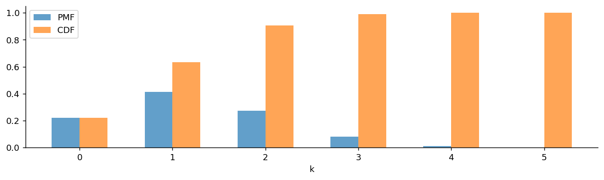
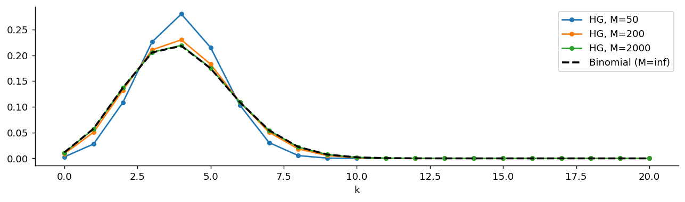

# 초기하분포

## 개요

**초기하분포**는 크기 $M$인 유한모집단에서 $n$개를 **비복원**으로 뽑을 때 나오는 성공의 개수를 모형화한다. 이항분포와 세는 대상은 같고 뽑는 방식만 다르다. 이항분포는 뽑은 것을 도로 넣고(복원), 초기하분포는 넣지 않는다(비복원). 그 한 가지 차이가 시행의 독립성을 깨뜨린다.

이 장에서 이 분포가 놓인 자리는 다음과 같다.

$$
\text{Bernoulli}(p) \;\longrightarrow\; B(n, p) \;\longrightarrow\; \text{HG}(n, N, M)
$$

베르누이 시행을 $n$번 모으면 이항분포가 되고, 그 $n$번을 **유한한 항아리에서 꺼내는 방식**으로 바꾸면 초기하분포가 된다. 항아리가 무한히 커지면 다시 이항분포로 돌아온다.

---

## 초기하분포

이 절에서는 다음 표기를 쓴다.

| 기호 | 뜻 |
|---|---|
| $M$ | 모집단의 크기 |
| $N$ | 모집단에 들어 있는 성공의 개수 |
| $n$ | 비복원으로 뽑는 표본의 크기 |
| $p = N/M$ | 모집단의 성공비율 |

<div class="defn" markdown>

### 정의 1. 초기하분포 { .dfn }

성공 $N$개와 실패 $M - N$개로 이루어진 크기 $M$의 모집단에서 $n$개를 비복원으로 뽑을 때, 표본에 든 성공의 개수 $X$는 **초기하분포**를 따른다:

$$
X \sim \text{HG}(n, N, M), \qquad P(X = k) = \frac{\dbinom{N}{k}\dbinom{M - N}{n - k}}{\dbinom{M}{n}}
$$

여기서 $k$는 다음 범위를 움직인다:

$$
\max(0,\, n - (M - N)) \;\le\; k \;\le\; \min(n,\, N)
$$

</div>

### PMF를 읽는 법

분모 $\binom{M}{n}$은 크기 $M$인 모집단에서 $n$개를 고르는 모든 방법의 수이고, 어느 방법이나 똑같이 일어날 법하다. 분자는 그중 성공이 정확히 $k$개인 방법의 수다. 성공 $N$개 중에서 $k$개를 고르는 방법이 $\binom{N}{k}$가지, 실패 $M-N$개 중에서 나머지 $n-k$개를 고르는 방법이 $\binom{M-N}{n-k}$가지이므로 둘을 곱한다. 고전적 확률의 정의를 그대로 옮긴 셈이다.

### 지지집합이 0부터 n까지가 아닌 까닭

성공이 $N$개밖에 없으므로 $k$는 $N$을 넘을 수 없다. 반대로 실패가 $M - N$개뿐이므로, 표본 $n$개 중 실패로 채울 수 있는 자리는 최대 $M - N$개다. 따라서 $k \ge n - (M - N)$이어야 한다. 예를 들어 $M = 10$, $N = 8$, $n = 5$이면 실패가 2개뿐이므로 성공은 적어도 3개가 들어온다.

범위 밖의 $k$에서는 이항계수가 0이 되므로 위의 PMF 식을 그대로 써도 자동으로 0이 나온다.

### PMF의 합이 1임을 확인하기

**방데르몽드 항등식**(Vandermonde's identity)이 필요하다:

$$
\sum_{k} \binom{N}{k}\binom{M - N}{n - k} = \binom{M}{n}
$$

좌변과 우변은 모두 "크기 $M$인 모집단에서 $n$개를 고르는 방법의 수"를 세고 있다. 우변은 한꺼번에 세고, 좌변은 고른 것 가운데 성공이 몇 개인지에 따라 경우를 나누어 센 것뿐이다. 양변을 $\binom{M}{n}$으로 나누면

$$
\sum_k P(X = k) = 1
$$

이 된다.

---

## 성질

$p = N/M$이라 두면:

$$
\begin{aligned}
E[X] &= n\,\frac{N}{M} = np \\[4pt]
\text{Var}(X) &= n\,\frac{N}{M}\left(1 - \frac{N}{M}\right)\frac{M - n}{M - 1} = np(1-p)\,\frac{M - n}{M - 1} \\[4pt]
\text{SD}(X) &= \sqrt{np(1-p)}\;\sqrt{\frac{M - n}{M - 1}}
\end{aligned}
$$

**평균은 이항분포와 완전히 같고, 분산만 인수 $\dfrac{M-n}{M-1}$만큼 작다.** 이 인수를 **유한모집단 수정계수**(finite population correction, FPC)라 부른다.

### 평균의 유도

$i$번째로 뽑은 것이 성공이면 $I_i = 1$, 아니면 $I_i = 0$인 지시함수를 두면

$$
X = I_1 + I_2 + \cdots + I_n
$$

이다. 여기서 핵심은 $I_i$들이 **독립은 아니지만 각각의 주변분포는 같다**는 점이다. 뽑는 순서에 대칭성이 있으므로, 세 번째로 뽑은 것이 성공일 확률도 첫 번째와 똑같이 $N/M$이다. 카드를 섞어 한 장씩 나눠 줄 때 몇 번째 자리에 앉든 좋은 패를 받을 확률이 같은 것과 같은 이치다.

기댓값의 선형성은 독립을 요구하지 않으므로

$$
E[X] = \sum_{i=1}^n E[I_i] = n\,\frac{N}{M} = np
$$

### 분산의 유도

독립이 아니므로 공분산 항을 빼놓을 수 없다:

$$
\text{Var}(X) = \sum_{i=1}^n \text{Var}(I_i) + \sum_{i \ne j} \text{Cov}(I_i, I_j)
$$

각 항을 계산한다. 먼저 $\text{Var}(I_i) = p(1-p)$이다. 다음으로 $i \ne j$이면

$$
E[I_i I_j] = P(I_i = 1,\, I_j = 1) = \frac{N}{M}\cdot\frac{N-1}{M-1}
$$

이므로

$$
\text{Cov}(I_i, I_j) = \frac{N(N-1)}{M(M-1)} - \frac{N^2}{M^2} = -\frac{N(M-N)}{M^2(M-1)} = -\frac{p(1-p)}{M - 1}
$$

**공분산이 음수**라는 사실이 이 분포의 성격을 결정한다. 앞에서 성공을 뽑으면 항아리에 남은 성공이 줄어 뒤에서 뽑힐 확률이 내려간다. 순서쌍 $(i, j)$가 $n(n-1)$개이므로

$$
\text{Var}(X) = np(1-p) - n(n-1)\frac{p(1-p)}{M-1} = np(1-p)\left(1 - \frac{n-1}{M-1}\right) = np(1-p)\,\frac{M-n}{M-1}
$$

$\square$

---

## 유한모집단 수정계수

$$
\text{FPC} = \frac{M - n}{M - 1}
$$

| 상황 | FPC | 뜻 |
|---|---|---|
| $n = 1$ | $1$ | 한 개만 뽑으면 복원이든 비복원이든 같다 |
| $n \ll M$ | $\approx 1$ | 모집단이 표본보다 훨씬 크면 이항분포와 사실상 같다 |
| $n = M$ | $0$ | 전부 뽑으면 $X = N$으로 확정되어 분산이 0이다 |

비복원추출은 **스스로를 교정한다.** 성공을 많이 뽑으면 남은 항아리는 실패가 짙어지고, 실패를 많이 뽑으면 그 반대가 된다. 이 되먹임이 총합의 흔들림을 줄이기 때문에 분산이 이항분포보다 작다. 극단적으로 모집단을 전부 뽑으면 결과가 하나로 정해져 흔들림이 사라진다.

!!! tip "실무 규칙"
    $n/M \le 0.05$이면 $\text{FPC} \ge 0.95$이므로 이항근사를 써도 무방하다. 유권자 수천만 명 중 1000명을 뽑는 여론조사에서 수정계수를 무시하는 것이 이 때문이다. 반대로 한 상자 100개 중 30개를 검사한다면 $\text{FPC} = 70/99 = 0.707$이므로 반드시 초기하분포를 써야 한다.

---

## 이항분포와의 관계

<div class="defn" markdown>

### 정리 1. 초기하분포의 이항극한 { .dfn }

$M \to \infty$, $N \to \infty$이면서 $N/M \to p$로 고정되면, 고정된 $n$과 $k$에 대해

$$
\frac{\dbinom{N}{k}\dbinom{M-N}{n-k}}{\dbinom{M}{n}} \;\longrightarrow\; \binom{n}{k} p^k (1-p)^{n-k}
$$

</div>

??? proof "증명"

    PMF를 이항계수의 정의로 풀어쓴 뒤 $\binom{n}{k}$를 분리한다.

    $$
    P(X = k) = \binom{n}{k}\cdot\frac{N(N-1)\cdots(N-k+1)\,\cdot\,(M-N)(M-N-1)\cdots(M-N-(n-k)+1)}{M(M-1)\cdots(M-n+1)}
    $$

    분자에는 $k$개와 $n-k$개, 분모에는 $n$개의 인수가 있으므로 개수가 맞는다. 분자와 분모를 각각 $M^k$, $M^{n-k}$, $M^n$으로 나누면

    $$
    P(X = k) = \binom{n}{k}\cdot\frac{\prod_{j=0}^{k-1}\left(\frac{N}{M} - \frac{j}{M}\right)\prod_{j=0}^{n-k-1}\left(1 - \frac{N}{M} - \frac{j}{M}\right)}{\prod_{j=0}^{n-1}\left(1 - \frac{j}{M}\right)}
    $$

    이다. $n$과 $k$가 고정이므로 $j/M \to 0$이고 $N/M \to p$이다. 따라서 분자는 $p^k (1-p)^{n-k}$로, 분모는 1로 간다. $\square$

### 언제 어느 쪽인가

| | 이항분포 $B(n, p)$ | 초기하분포 $\text{HG}(n, N, M)$ |
|---|---|---|
| 추출 | 복원 | 비복원 |
| 시행 | 독립 | 종속(음의 상관) |
| 성공확률 | 매 시행 $p$로 일정 | 주변확률은 $N/M$이나 조건부로는 변함 |
| 평균 | $np$ | $np$ (같다) |
| 분산 | $np(1-p)$ | $np(1-p)\dfrac{M-n}{M-1}$ (더 작다) |
| 모수 | 2개 | 3개 |

현실의 표본추출은 거의 언제나 비복원이므로 **원칙적으로는 초기하분포가 맞다.** 그런데도 이항분포를 훨씬 더 많이 쓰는 이유는 모집단이 표본보다 충분히 크면 둘의 차이가 무시할 만하고, 이항분포 쪽이 모수가 하나 적고 다루기 쉽기 때문이다.

### 대칭성

$$
P(X = k) = \frac{\dbinom{N}{k}\dbinom{M-N}{n-k}}{\dbinom{M}{n}} = \frac{\dbinom{n}{k}\dbinom{M-n}{N-k}}{\dbinom{M}{N}}
$$

즉 $\text{HG}(n, N, M)$의 PMF는 $n$과 $N$을 맞바꾸어도 변하지 않는다. "성공 $N$개에 표시를 해 두고 $n$개를 뽑는다"와 "$n$개에 표시를 해 두고 성공 $N$개를 뽑는다"가 같은 문제라는 뜻이다. 어느 쪽을 표본으로 볼지는 보는 사람의 관점일 뿐, 겹치는 개수의 분포는 하나다.

---

## 문제

<div class="probox" markdown>

**문제:** <span class="diff easy" title="쉬움"></span> 잘 섞은 카드 52장에서 5장을 뽑는다. 스페이드가 정확히 2장일 확률은 얼마인가?

</div>

??? success "풀이"

    카드를 뽑은 뒤 도로 넣지 않으므로 비복원이다. $M = 52$, $N = 13$(스페이드), $n = 5$이므로 $X \sim \text{HG}(5, 13, 52)$이다.

    $$
    P(X = 2) = \frac{\dbinom{13}{2}\dbinom{39}{3}}{\dbinom{52}{5}} = \frac{78 \times 9139}{2598960} = \frac{712842}{2598960} = 0.2743
    $$

    스페이드 장수의 기댓값은 $E[X] = 5 \times \frac{13}{52} = 1.25$이다.

    복원추출(한 장 뽑고 확인한 뒤 도로 넣어 다시 섞기)이라면 $B(5, 0.25)$이고 $P(X=2) = \binom{5}{2}(0.25)^2(0.75)^3 = 0.2637$이다. 표본이 모집단의 10%도 되지 않으므로 두 값이 가깝다.

---

## Python: PMF, CDF, 표본추출

!!! warning "scipy의 인수 순서"
    `scipy.stats.hypergeom(M, n, N)`에서 `M`은 모집단 크기, `n`은 성공 개수, `N`은 추출 개수다. 이 책의 표기 $\text{HG}(n, N, M)$과 **문자가 서로 반대로 대응**하므로, 아래 코드에서는 혼동을 막기 위해 `pop`, `succ`, `draw`라는 이름을 따로 두고 넘긴다.

### PMF와 CDF

<div class="codebox" markdown>

#### 예제 1. 초기하분포의 확률질량함수와 분포함수 { .eg }

```python
import matplotlib.pyplot as plt
import numpy as np
from scipy import stats

pop, succ, draw = 52, 13, 5      # M=52장, N=13장이 스페이드, n=5장 추출
x = np.arange(0, draw + 1)       # 가능한 성공 횟수 0~5

# scipy 인수는 (모집단, 성공 개수, 추출 개수) 순서다.
rv = stats.hypergeom(pop, succ, draw)

fig, ax = plt.subplots(figsize=(12, 3))
# PMF: "정확히 k장이 스페이드일 확률"
# CDF: "k장 이하가 스페이드일 확률" -> PMF를 왼쪽부터 누적한 값
ax.bar(x - 0.15, rv.pmf(x), width=0.3, label='PMF', alpha=0.7)
ax.bar(x + 0.15, rv.cdf(x), width=0.3, label='CDF', alpha=0.7)
ax.set_xlabel('k')
ax.set_xticks(x)
ax.spines[['top', 'right']].set_visible(False)
ax.legend()
plt.show()
```



</div>

### 이항분포와의 비교

<div class="codebox" markdown>

#### 예제 2. 모집단 크기에 따른 초기하와 이항의 차이 { .eg }

```python
import matplotlib.pyplot as plt
import numpy as np
from scipy import stats

draw, p = 20, 0.2                # 표본 20개, 모집단 성공비율은 셋 다 0.2로 같다
x = np.arange(0, draw + 1)

fig, ax = plt.subplots(figsize=(12, 3))
# 성공비율 p를 고정한 채 모집단 크기만 키운다.
#   M=50  -> n/M = 0.40. 표본이 모집단을 크게 갉아먹어 분포가 뚜렷이 좁다.
#   M=200 -> n/M = 0.10. 차이가 줄어든다.
#   M=2000-> n/M = 0.01. 이항분포와 거의 구별되지 않는다.
# 세 경우 모두 평균은 np = 4로 **같고**, 달라지는 것은 퍼짐뿐이다.
for pop in [50, 200, 2000]:
    rv = stats.hypergeom(pop, int(pop * p), draw)
    ax.plot(x, rv.pmf(x), 'o-', markersize=4, label=f'HG, M={pop}')
ax.plot(x, stats.binom(draw, p).pmf(x), 'k--', lw=2, label='Binomial (M=inf)')
ax.set_xlabel('k')
ax.spines[['top', 'right']].set_visible(False)
ax.legend()
plt.show()
```



</div>

### 표본추출과 검증

<div class="codebox" markdown>

#### 예제 3. 유한모집단 수정계수 확인 { .eg }

```python
import numpy as np
from scipy import stats

np.random.seed(42)
pop, succ, draw = 200, 40, 20    # M=200, N=40 (p=0.2), n=20
p = succ / pop
samples = stats.hypergeom(pop, succ, draw).rvs(100_000)

fpc = (pop - draw) / (pop - 1)   # 유한모집단 수정계수
print(f"mean  : theory {draw*p:.4f},  sample {samples.mean():.4f}")
print(f"var   : theory {draw*p*(1-p)*fpc:.4f},  sample {samples.var():.4f}")
print(f"binomial var (no FPC): {draw*p*(1-p):.4f},  FPC = {fpc:.4f}")
```

출력:

```
mean  : theory 4.0000,  sample 4.0048
var   : theory 2.8945,  sample 2.9099
binomial var (no FPC): 3.2000,  FPC = 0.9045
```

표본분산이 이항분포의 3.2가 아니라 수정계수를 곱한 2.89에 맞는다. 평균은 두 모형이 똑같이 4로 맞는다.

</div>

---

### 손계산과 맞춰 보기

<div class="codebox" markdown>

#### 예제 4. 손계산과 scipy 결과 맞춰 보기 { .eg }

```python
from scipy import special
from scipy import stats

# 이 책의 표기는 HG(n, N, M) = HG(추출 5, 성공 20, 모집단 100)인데
# scipy 인수는 (모집단, 성공, 추출) 순서다. 이름을 따로 두어 혼동을 막는다.
pop, succ, draw = 100, 20, 5
p2 = stats.hypergeom.pmf(2, pop, succ, draw)
p2_manual = (special.comb(succ, 2) * special.comb(pop - succ, draw - 2)) / special.comb(pop, draw)
print(f"P(X = 2) = {p2:.4f}  (manual = {p2_manual:.4f})")
print(f"E[X] = {draw*succ/pop:.2f}")
```

출력:

```
P(X = 2) = 0.2073  (manual = 0.2073)
E[X] = 1.00
```

손으로 세는 방법과 scipy가 정확히 같은 값을 준다. 평균 $nN/M = 5 \times 0.2 = 1.0$까지 맞으므로 인수를 제대로 넘겼다는 것도 함께 확인된다. **처음 쓰는 분포는 `mean()`이나 손계산으로 한 번 검산하는 습관**이 인수 순서 실수를 막는 가장 확실한 방법이다.

</div>

---

## 다른 분포와의 관계

$$
\begin{aligned}
\text{HG}(1, N, M) &= \text{Bernoulli}(N/M) \\[4pt]
\text{HG}(n, N, M) &\;\xrightarrow[\;N/M \to p\;]{M \to \infty}\; B(n, p) \\[4pt]
\text{HG}(n, N, M) &\;\approx\; B(n, N/M) \quad (n/M \le 0.05) \\[4pt]
\text{HG}(n, N, M) &\;\approx\; \text{Poisson}(nN/M) \quad (M \text{이 크고 } nN/M \text{가 작을 때})
\end{aligned}
$$

마지막 줄은 두 근사를 이어 붙인 것이다. 모집단이 크면 초기하분포가 이항분포로 가고, 이항분포에서 $n$이 크고 $p$가 작으면 포아송분포로 간다. 이 장의 이산분포 사슬이 한 바퀴 돌아 만나는 지점이다.

---

## 연습문제

<div class="drillbox" markdown>

**연습문제 1.** <span class="diff easy" title="쉬움"></span>
제품 50개가 든 상자에 불량품이 5개 섞여 있다. 10개를 비복원으로 뽑아 검사한다. (a) 불량품 개수 $X$의 분포는? (b) $P(X = 0)$. (c) 평균과 분산. (d) 같은 문제를 이항분포로 근사하면 분산이 얼마나 어긋나는가?

</div>

??? success "풀이"
    (a) $M = 50$, $N = 5$, $n = 10$이므로 $X \sim \text{HG}(10, 5, 50)$이고 $p = 0.1$이다.

    (b) 불량품이 하나도 안 뽑히려면 정상품 45개 중에서만 10개를 골라야 한다.

    $$
    P(X = 0) = \frac{\dbinom{45}{10}}{\dbinom{50}{10}} = \frac{40 \cdot 39 \cdot 38 \cdot 37 \cdot 36}{50 \cdot 49 \cdot 48 \cdot 47 \cdot 46} = 0.3106
    $$

    (c) $E[X] = np = 10 \times 0.1 = 1$. $\text{FPC} = (50-10)/49 = 40/49 = 0.8163$이므로

    $$
    \text{Var}(X) = 10 (0.1)(0.9) \times \frac{40}{49} = 0.9 \times 0.8163 = 0.7347
    $$

    (d) 이항근사는 $\text{Var} = 0.9$를 준다. 참값 0.7347보다 22.5% 크다. $n/M = 0.2$로 5% 규칙을 크게 넘기므로 근사를 쓰면 안 되는 경우다.

<div class="drillbox" markdown>

**연습문제 2.** <span class="diff med" title="중간"></span>
지시함수 표현 $X = \sum_{i=1}^n I_i$를 써서 $E[X] = np$와 $\text{Var}(X) = np(1-p)\frac{M-n}{M-1}$를 증명하라. 특히 $P(I_3 = 1) = N/M$임을 설명하라.

</div>

??? success "풀이"
    **주변확률.** $M$개를 한 줄로 늘어놓는 모든 순열이 똑같이 일어날 법하다고 보면, 세 번째 자리에 놓이는 것이 성공일 확률은 성공 $N$개가 $M$개의 자리 중 어디에 놓이는지에 대한 대칭성에서 곧바로 $N/M$이다. 위치에 따라 달라질 이유가 전혀 없다. 카드 게임에서 몇 번째로 패를 받든 에이스를 받을 확률이 같은 것과 같은 논리다.

    **평균.** 기댓값의 선형성은 독립을 요구하지 않으므로

    $$
    E[X] = \sum_{i=1}^n E[I_i] = n \cdot \frac{N}{M} = np
    $$

    **분산.** 본문의 유도와 같다. $\text{Var}(I_i) = p(1-p)$이고

    $$
    \text{Cov}(I_i, I_j) = \frac{N(N-1)}{M(M-1)} - p^2 = -\frac{p(1-p)}{M-1} \quad (i \ne j)
    $$

    이므로 순서쌍 $n(n-1)$개를 더하면

    $$
    \text{Var}(X) = np(1-p) - \frac{n(n-1)p(1-p)}{M-1} = np(1-p)\frac{M-n}{M-1}
    $$

    $\square$

    독립이 깨졌을 때 무엇이 살아남고 무엇이 무너지는지를 보여 주는 표준 예다. **평균은 살아남고 분산은 고쳐 써야 한다.**

<div class="drillbox" markdown>

**연습문제 3.** <span class="diff med" title="중간"></span>
$M = 100$, $N = 40$, $n = 10$인 초기하분포와 $B(10, 0.4)$를 비교하라. (a) 두 분포의 $P(X = 4)$를 계산하라. (b) 표준편차의 비는 얼마인가? (c) $M$이 얼마나 커야 표준편차의 차이가 1% 이내가 되는가?

</div>

??? success "풀이"
    (a) 초기하:

    $$
    P(X = 4) = \frac{\dbinom{40}{4}\dbinom{60}{6}}{\dbinom{100}{10}} = \frac{91390 \times 50063860}{17310309456440} = 0.2643
    $$

    이항: $\binom{10}{4}(0.4)^4(0.6)^6 = 210 \times 0.0256 \times 0.046656 = 0.2508$.

    (b) $\text{FPC} = 90/99 = 0.9091$이므로 표준편차의 비는 $\sqrt{0.9091} = 0.9535$이다. 초기하 쪽이 약 4.6% 좁다.

    (c) $\sqrt{(M-10)/(M-1)} \ge 0.99$를 풀면 $(M-10)/(M-1) \ge 0.9801$, 즉 $M - 10 \ge 0.9801M - 0.9801$이므로 $0.0199M \ge 9.02$에서 $M \ge 453$이다.

    표준편차는 분산의 제곱근이라 수정계수의 영향을 절반만 받는다. **분산에서 10% 차이는 표준편차에서 5% 차이**라는 점이 실무에서 자주 쓰인다.

<div class="drillbox" markdown>

**연습문제 4.** <span class="diff med" title="중간"></span>
$\text{HG}(n, N, M)$의 PMF가 $n$과 $N$을 맞바꾸어도 같음을 대수적으로 증명하고, 그 조합적 의미를 설명하라.

</div>

??? success "풀이"
    두 식을 모두 계승으로 풀어쓴다. 좌변은

    $$
    \frac{\dbinom{N}{k}\dbinom{M-N}{n-k}}{\dbinom{M}{n}} = \frac{N!}{k!(N-k)!}\cdot\frac{(M-N)!}{(n-k)!(M-N-n+k)!}\cdot\frac{n!(M-n)!}{M!}
    $$

    이다. 이를 정리하면

    $$
    = \frac{n!\,N!\,(M-n)!\,(M-N)!}{k!\,M!\,(n-k)!\,(N-k)!\,(M-N-n+k)!}
    $$

    가 되는데, 이 식은 $n$과 $N$에 대해 완전히 **대칭**이다. 둘을 맞바꾸어도 같은 식이므로 증명이 끝난다. $\square$

    **조합적 의미.** 크기 $M$인 집합에서 크기 $n$인 부분집합 $A$와 크기 $N$인 부분집합 $B$를 무작위로 고를 때, $|A \cap B| = k$일 확률을 묻는 문제다. 어느 쪽을 먼저 골라 "표본"이라 부르고 어느 쪽을 "성공 집합"이라 부를지는 이름표에 불과하다. 교집합의 크기는 그 이름표와 무관하다.

    이 대칭성은 실무에서 계산량을 줄이는 데 쓰인다. $\text{HG}(1000, 5, 10^6)$을 계산할 때 $\text{HG}(5, 1000, 10^6)$으로 바꾸면 다루는 항이 1000개에서 5개로 줄어든다.

<div class="drillbox" markdown>

**연습문제 5.** <span class="diff med" title="중간"></span>
**포획–재포획.** 호수의 물고기 수 $M$을 모른다. 먼저 $N = 100$마리를 잡아 표시한 뒤 놓아 준다. 충분히 섞인 다음 $n = 80$마리를 잡았더니 표시된 것이 $k = 16$마리였다. $M$의 최대가능도추정값을 구하라.

</div>

??? success "풀이"
    $L(M) = P(X = k)$를 $M$의 함수로 보고 이웃한 두 값의 비를 본다.

    $$
    \frac{L(M)}{L(M-1)} = \frac{\dbinom{M-N}{n-k}\dbinom{M-1}{n}}{\dbinom{M-1-N}{n-k}\dbinom{M}{n}} = \frac{(M-N)(M-n)}{M(M-N-n+k)}
    $$

    이 비가 1보다 큰지를 따지면 $(M-N)(M-n) > M(M-N-n+k)$, 즉 전개하여 정리하면 $Nn > Mk$, 곧 $M < Nn/k$일 때 가능도가 증가한다. 따라서 최대는

    $$
    \hat M = \left\lfloor \frac{Nn}{k} \right\rfloor = \left\lfloor \frac{100 \times 80}{16} \right\rfloor = 500
    $$

    에서 일어난다.

    **직관.** 표본에서 표시된 비율 $k/n = 0.2$가 모집단에서 표시된 비율 $N/M$과 같아야 한다고 놓으면 $M = Nn/k$가 그대로 나온다. 최대가능도추정이 이 비례식과 일치한다는 점이 이 방법의 매력이다. 생태학에서 개체 수를 세는 표준 기법(링컨–피터슨 추정량)이며, 같은 원리가 소프트웨어의 남은 결함 수 추정이나 중복 명단 대조에도 쓰인다.

<div class="drillbox" markdown>

**연습문제 6.** <span class="diff med" title="중간"></span>
**Fisher의 정확검정.** 2×2 분할표에서 행합과 열합이 모두 고정되어 있으면, 표의 내용은 칸 하나만 정하면 결정된다. 이 칸의 값이 귀무가설(두 분류가 독립) 아래에서 초기하분포를 따름을 설명하라.

</div>

??? success "풀이"
    표를 다음과 같이 두자.

    |  | 성공 | 실패 | 합 |
    |---|---|---|---|
    | 처리군 | $k$ | $n - k$ | $n$ |
    | 대조군 | $N - k$ | $M - N - n + k$ | $M - n$ |
    | 합 | $N$ | $M - N$ | $M$ |

    행합 $n$, $M-n$과 열합 $N$, $M-N$을 모두 고정하면 자유도는 1이다. $k$ 하나가 정해지면 나머지 세 칸이 뺄셈으로 결정된다.

    귀무가설은 "처리가 성공률에 영향을 주지 않는다"는 것이다. 그렇다면 성공 $N$개가 어느 개체에서 나오든 마찬가지이므로, 전체 $M$명 중 처리군 $n$명을 무작위로 고른 것과 다를 바가 없다. 즉 성공 $N$개와 처리군 $n$개는 서로 독립하게 배정된 두 부분집합이고, 그 교집합의 크기가 $k$다. 이것이 바로 정의 1의 상황이므로

    $$
    P(K = k) = \frac{\dbinom{N}{k}\dbinom{M-N}{n-k}}{\dbinom{M}{n}}
    $$

    이다. $p$-값은 관측된 표보다 "더 극단적인" $k$들의 확률을 이 분포에서 더해 얻는다. 근사 없이 정확히 계산되므로 기대도수가 작아 카이제곱 검정을 못 쓰는 작은 표본에서 특히 쓸모 있다. `scipy.stats.fisher_exact`가 이 계산을 해 준다.

<div class="drillbox" markdown>

**연습문제 7.** <span class="diff hard" title="어려움"></span>
$\text{HG}(n, N, M)$의 최빈값이 $\left\lfloor \dfrac{(n+1)(N+1)}{M+2} \right\rfloor$임을 이웃한 확률의 비를 통해 보여라.

</div>

??? success "풀이"
    이웃한 두 확률의 비를 계산한다.

    $$
    \frac{P(X=k)}{P(X=k-1)} = \frac{\dbinom{N}{k}\dbinom{M-N}{n-k}}{\dbinom{N}{k-1}\dbinom{M-N}{n-k+1}} = \frac{(N-k+1)(n-k+1)}{k\,(M-N-n+k)}
    $$

    이 비가 1보다 크다는 조건을 정리한다.

    $$
    (N-k+1)(n-k+1) > k(M-N-n+k)
    $$

    좌변을 전개하면 $Nn - Nk + N - kn + k^2 - k + n - k + 1$이고 우변은 $kM - kN - kn + k^2$이다. 양변에서 $k^2$, $-kN$, $-kn$이 상쇄되므로

    $$
    Nn + N + n + 1 > kM + 2k \iff (N+1)(n+1) > k(M+2) \iff k < \frac{(n+1)(N+1)}{M+2}
    $$

    이 된다. 즉 이 임계값 아래에서는 PMF가 오르고 위에서는 내려가므로 최대는 $k = \left\lfloor \frac{(n+1)(N+1)}{M+2} \right\rfloor$에서 일어난다. $\square$

    이항분포의 최빈값 $\lfloor (n+1)p \rfloor$와 나란히 놓고 보면 구조가 같다. $p$ 자리에 $\frac{N+1}{M+2}$가 들어간 꼴인데, 이는 베이즈 추론에서 균등사전분포를 쓸 때 나오는 라플라스의 계승규칙과 같은 모양이다.

<div class="drillbox" markdown>

**연습문제 8.** <span class="diff hard" title="어려움"></span>
$M \to \infty$, $n \to \infty$, $N$은 고정이고 $nN/M \to \lambda$일 때 $\text{HG}(n, N, M)$이 $\text{Poisson}(\lambda)$로 수렴함을 보여라. 어떤 실제 상황이 이에 해당하는가?

</div>

??? success "풀이"
    대칭성(연습문제 4)을 써서 $n$과 $N$의 역할을 바꾸면 "$N$번 뽑는데 성공이 $n$개 있는" 문제가 된다. 정리 1의 이항극한을 이 형태에 적용하면, $N$이 고정이고 $n/M \to 0$이므로

    $$
    \text{HG}(n, N, M) = \text{HG}(N, n, M) \;\longrightarrow\; B\!\left(N, \frac{n}{M}\right)
    $$

    이다. 여기서 성공확률 $n/M \to 0$이지만 $N$이 고정이라 $B(N, n/M)$의 평균 $Nn/M \to \lambda$는 유한하다. 이제 $N$도 함께 키우면 이항–포아송 극한(4.1절의 포아송 페이지)에 의해 $\text{Poisson}(\lambda)$로 간다. $\square$

    **해당하는 상황.** 아주 큰 모집단에서 표본은 크게 뽑지만 표시된 개체는 몇 개 안 되는 경우다. 예를 들어 100만 개의 부품 중 결함품이 5개 있고 1만 개를 검사한다면 $\lambda = 10^4 \times 5 / 10^6 = 0.05$인 포아송분포로 근사된다. 검사에서 결함을 하나도 못 찾을 확률이 $e^{-0.05} = 0.951$이라는 계산이 곧바로 나온다.

<div class="drillbox" markdown>

**연습문제 9.** <span class="diff med" title="중간"></span>
`stats.hypergeom`의 인자는 `(M, n, N)`이다. 각각이 무엇을 뜻하는지 확인하고, 본문 예제의 "모집단 100개, 불량 20개, 추출 5개"를 어떻게 넘겨야 하는지 적어라. 어떤 혼동이 생기기 쉬운가?

</div>

??? success "풀이"
    SciPy의 규약은 다음과 같다.

    - `M` — 모집단 전체 크기 (이 책의 $M$)
    - `n` — 모집단 안의 성공 개수 (이 책의 $N$)
    - `N` — 뽑는 개수 (이 책의 $n$)

    따라서 본문 예제는 `stats.hypergeom(M=100, n=20, N=5)`이고, 위치 인자로는 `stats.hypergeom(100, 20, 5)`이다.

    **혼동의 원인은 같은 문자가 다른 뜻으로 쓰인다는 점이다.** 이 책은 $\text{HG}(n, N, M)$에서 $M$을 모집단, $N$을 성공 개수, $n$을 표본 크기로 쓴다. SciPy의 `M`은 다행히 모집단으로 같지만, `N`은 이 책의 $n$(뽑는 개수)을 뜻해 정반대다. 키워드 인자로 `N=100`이라고 쓰면 "100개를 뽑는다"는 뜻이 되어 엉뚱한 결과가 나온다.

    ```python
    from scipy import stats
    rv = stats.hypergeom(100, 20, 5)     # 안전: 위치 인자로 순서를 지킨다
    print(rv.pmf(2), rv.mean(), rv.var())  # 0.2073  1.0  0.7677
    ```

    이런 함정이 SciPy 곳곳에 있다. 균등분포의 `scale`은 오른쪽 끝점이 아니라 폭이고, 로그정규분포의 `scale`은 평균이 아니라 $e^\mu$이며, 정규분포의 `scale`은 분산이 아니라 표준편차다. **처음 쓰는 분포는 반드시 `mean()`과 `var()`로 검산하는 습관**이 가장 확실한 방어다. 위에서 평균 $nN/M = 5 \times 0.2 = 1.0$이 맞게 나오는 것으로 인자를 제대로 넘겼음을 확인할 수 있다.

---

## 정리하며

- 초기하분포는 유한모집단에서 **비복원**으로 뽑을 때의 성공 개수를 센다. 이항분포와 세는 대상은 같고 뽑는 방식만 다르다.
- 비복원이면 시행이 독립이 아니고 서로 **음의 상관**을 갖는다. 그 결과 평균은 이항분포와 같지만 분산은 유한모집단 수정계수 $\frac{M-n}{M-1}$만큼 작다.
- 평균이 그대로인 것은 기댓값의 선형성이 독립을 요구하지 않기 때문이고, 분산이 줄어드는 것은 공분산이 음수이기 때문이다.
- $n/M \le 0.05$이면 이항근사가 실용적으로 충분하다. 모집단이 무한히 커지면 정확히 이항분포로 수렴한다.
- PMF는 $n$과 $N$에 대해 대칭이다. "표본"과 "성공 집합"은 이름표일 뿐이고, 분포가 말하는 것은 두 부분집합의 교집합 크기다.
