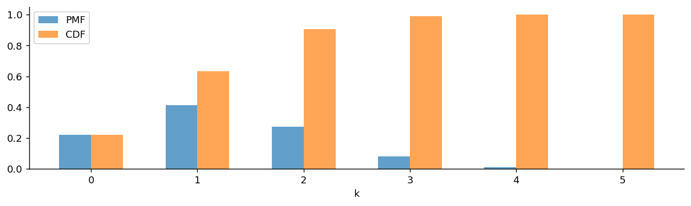
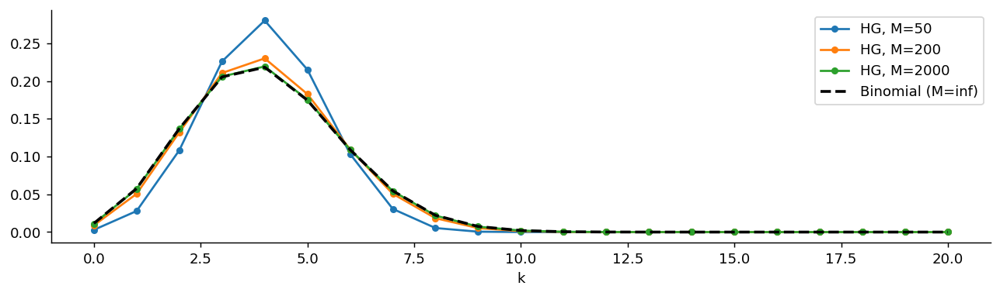

# 초기하분포

## 개요

**초기하분포**는 크기 $M$인 유한모집단에서 $n$개를 **비복원**으로 뽑을 때 나오는 성공의 개수를 모형화한다. 이항분포와 세는 대상은 같고 뽑는 방식만 다르다. 이항분포는 뽑은 것을 도로 넣고(복원), 초기하분포는 넣지 않는다(비복원). 그 한 가지 차이가 시행의 독립성을 깨뜨린다.

이 장에서 이 분포가 놓인 자리는 다음과 같다.

$$
\text{Bernoulli}(p) \;\longrightarrow\; B(n, p) \;\longrightarrow\; \text{HG}(n, N, M)
$$

베르누이 시행을 $n$번 모으면 이항분포가 되고, 그 $n$번을 **유한한 항아리에서 꺼내는 방식**으로 바꾸면 초기하분포가 된다. 항아리가 무한히 커지면 다시 이항분포로 돌아온다.

---

## 초기하분포

이 절에서는 다음 표기를 쓴다.

| 기호 | 뜻 |
|---|---|
| $M$ | 모집단의 크기 |
| $N$ | 모집단에 들어 있는 성공의 개수 |
| $n$ | 비복원으로 뽑는 표본의 크기 |
| $p = N/M$ | 모집단의 성공비율 |

<div class="defn" markdown>

### 정의 1. 초기하분포 { .dfn }

성공 $N$개와 실패 $M - N$개로 이루어진 크기 $M$의 모집단에서 $n$개를 비복원으로 뽑을 때, 표본에 든 성공의 개수 $X$는 **초기하분포**를 따른다:

$$
X \sim \text{HG}(n, N, M), \qquad P(X = k) = \frac{\dbinom{N}{k}\dbinom{M - N}{n - k}}{\dbinom{M}{n}}
$$

여기서 $k$는 다음 범위를 움직인다:

$$
\max(0,\, n - (M - N)) \;\le\; k \;\le\; \min(n,\, N)
$$

</div>

### PMF를 읽는 법

분모 $\binom{M}{n}$은 크기 $M$인 모집단에서 $n$개를 고르는 모든 방법의 수이고, 어느 방법이나 똑같이 일어날 법하다. 분자는 그중 성공이 정확히 $k$개인 방법의 수다. 성공 $N$개 중에서 $k$개를 고르는 방법이 $\binom{N}{k}$가지, 실패 $M-N$개 중에서 나머지 $n-k$개를 고르는 방법이 $\binom{M-N}{n-k}$가지이므로 둘을 곱한다. 고전적 확률의 정의를 그대로 옮긴 셈이다.

### 지지집합이 0부터 n까지가 아닌 까닭

성공이 $N$개밖에 없으므로 $k$는 $N$을 넘을 수 없다. 반대로 실패가 $M - N$개뿐이므로, 표본 $n$개 중 실패로 채울 수 있는 자리는 최대 $M - N$개다. 따라서 $k \ge n - (M - N)$이어야 한다. 예를 들어 $M = 10$, $N = 8$, $n = 5$이면 실패가 2개뿐이므로 성공은 적어도 3개가 들어온다.

범위 밖의 $k$에서는 이항계수가 0이 되므로 위의 PMF 식을 그대로 써도 자동으로 0이 나온다.

### PMF의 합이 1임을 확인하기

**방데르몽드 항등식**(Vandermonde's identity)이 필요하다:

$$
\sum_{k} \binom{N}{k}\binom{M - N}{n - k} = \binom{M}{n}
$$

좌변과 우변은 모두 "크기 $M$인 모집단에서 $n$개를 고르는 방법의 수"를 세고 있다. 우변은 한꺼번에 세고, 좌변은 고른 것 가운데 성공이 몇 개인지에 따라 경우를 나누어 센 것뿐이다. 양변을 $\binom{M}{n}$으로 나누면

$$
\sum_k P(X = k) = 1
$$

이 된다.

---

## 성질

$p = N/M$이라 두면:

$$
\begin{aligned}
E[X] &= n\,\frac{N}{M} = np \\[4pt]
\text{Var}(X) &= n\,\frac{N}{M}\left(1 - \frac{N}{M}\right)\frac{M - n}{M - 1} = np(1-p)\,\frac{M - n}{M - 1} \\[4pt]
\text{SD}(X) &= \sqrt{np(1-p)}\;\sqrt{\frac{M - n}{M - 1}}
\end{aligned}
$$

**평균은 이항분포와 완전히 같고, 분산만 인수 $\dfrac{M-n}{M-1}$만큼 작다.** 이 인수를 **유한모집단 수정계수**(finite population correction, FPC)라 부른다.

### 평균의 유도

$i$번째로 뽑은 것이 성공이면 $I_i = 1$, 아니면 $I_i = 0$인 지시함수를 두면

$$
X = I_1 + I_2 + \cdots + I_n
$$

이다. 여기서 핵심은 $I_i$들이 **독립은 아니지만 각각의 주변분포는 같다**는 점이다. 뽑는 순서에 대칭성이 있으므로, 세 번째로 뽑은 것이 성공일 확률도 첫 번째와 똑같이 $N/M$이다. 카드를 섞어 한 장씩 나눠 줄 때 몇 번째 자리에 앉든 좋은 패를 받을 확률이 같은 것과 같은 이치다.

기댓값의 선형성은 독립을 요구하지 않으므로

$$
E[X] = \sum_{i=1}^n E[I_i] = n\,\frac{N}{M} = np
$$

<div class="thmbox" markdown>

### 정리 1. 초기하분포의 분산 { .thm }

$X \sim \text{HG}(n, N, M)$이고 $p = N/M$이면

$$
\text{Var}(X) = np(1-p)\,\frac{M-n}{M-1}
$$

이다. 이항분포의 $np(1-p)$에 **유한모집단 수정계수** $\frac{M-n}{M-1}$이 곱해진 꼴이다.

</div>

??? proof "증명"

    독립이 아니므로 공분산 항을 빼놓을 수 없다:

    $$
    \text{Var}(X) = \sum_{i=1}^n \text{Var}(I_i) + \sum_{i \ne j} \text{Cov}(I_i, I_j)
    $$

    각 항을 계산한다. 먼저 $\text{Var}(I_i) = p(1-p)$이다. 다음으로 $i \ne j$이면

    $$
    E[I_i I_j] = P(I_i = 1,\, I_j = 1) = \frac{N}{M}\cdot\frac{N-1}{M-1}
    $$

    이므로

    $$
    \text{Cov}(I_i, I_j) = \frac{N(N-1)}{M(M-1)} - \frac{N^2}{M^2} = -\frac{N(M-N)}{M^2(M-1)} = -\frac{p(1-p)}{M - 1}
    $$

    **공분산이 음수**라는 사실이 이 분포의 성격을 결정한다. 앞에서 성공을 뽑으면 항아리에 남은 성공이 줄어 뒤에서 뽑힐 확률이 내려간다. 순서쌍 $(i, j)$가 $n(n-1)$개이므로

    $$
    \text{Var}(X) = np(1-p) - n(n-1)\frac{p(1-p)}{M-1} = np(1-p)\left(1 - \frac{n-1}{M-1}\right) = np(1-p)\,\frac{M-n}{M-1}
    $$

    $\square$

---

## 유한모집단 수정계수

$$
\text{FPC} = \frac{M - n}{M - 1}
$$

| 상황 | FPC | 뜻 |
|---|---|---|
| $n = 1$ | $1$ | 한 개만 뽑으면 복원이든 비복원이든 같다 |
| $n \ll M$ | $\approx 1$ | 모집단이 표본보다 훨씬 크면 이항분포와 사실상 같다 |
| $n = M$ | $0$ | 전부 뽑으면 $X = N$으로 확정되어 분산이 0이다 |

비복원추출은 **스스로를 교정한다.** 성공을 많이 뽑으면 남은 항아리는 실패가 짙어지고, 실패를 많이 뽑으면 그 반대가 된다. 이 되먹임이 총합의 흔들림을 줄이기 때문에 분산이 이항분포보다 작다. 극단적으로 모집단을 전부 뽑으면 결과가 하나로 정해져 흔들림이 사라진다.

!!! tip "실무 규칙"
    $n/M \le 0.05$이면 $\text{FPC} \ge 0.95$이므로 이항근사를 써도 무방하다. 유권자 수천만 명 중 1000명을 뽑는 여론조사에서 수정계수를 무시하는 것이 이 때문이다. 반대로 한 상자 100개 중 30개를 검사한다면 $\text{FPC} = 70/99 = 0.707$이므로 반드시 초기하분포를 써야 한다.

---

## 이항분포와의 관계

<div class="thmbox" markdown>

### 정리 2. 초기하분포의 이항극한 { .thm }

$M \to \infty$, $N \to \infty$이면서 $N/M \to p$로 고정되면, 고정된 $n$과 $k$에 대해

$$
\frac{\dbinom{N}{k}\dbinom{M-N}{n-k}}{\dbinom{M}{n}} \;\longrightarrow\; \binom{n}{k} p^k (1-p)^{n-k}
$$

</div>

??? proof "증명"

    PMF를 이항계수의 정의로 풀어쓴 뒤 $\binom{n}{k}$를 분리한다.

    $$
    P(X = k) = \binom{n}{k}\cdot\frac{N(N-1)\cdots(N-k+1)\,\cdot\,(M-N)(M-N-1)\cdots(M-N-(n-k)+1)}{M(M-1)\cdots(M-n+1)}
    $$

    분자에는 $k$개와 $n-k$개, 분모에는 $n$개의 인수가 있으므로 개수가 맞는다. 분자와 분모를 각각 $M^k$, $M^{n-k}$, $M^n$으로 나누면

    $$
    P(X = k) = \binom{n}{k}\cdot\frac{\prod_{j=0}^{k-1}\left(\frac{N}{M} - \frac{j}{M}\right)\prod_{j=0}^{n-k-1}\left(1 - \frac{N}{M} - \frac{j}{M}\right)}{\prod_{j=0}^{n-1}\left(1 - \frac{j}{M}\right)}
    $$

    이다. $n$과 $k$가 고정이므로 $j/M \to 0$이고 $N/M \to p$이다. 따라서 분자는 $p^k (1-p)^{n-k}$로, 분모는 1로 간다. $\square$

### 언제 어느 쪽인가

| | 이항분포 $B(n, p)$ | 초기하분포 $\text{HG}(n, N, M)$ |
|---|---|---|
| 추출 | 복원 | 비복원 |
| 시행 | 독립 | 종속(음의 상관) |
| 성공확률 | 매 시행 $p$로 일정 | 주변확률은 $N/M$이나 조건부로는 변함 |
| 평균 | $np$ | $np$ (같다) |
| 분산 | $np(1-p)$ | $np(1-p)\dfrac{M-n}{M-1}$ (더 작다) |
| 모수 | 2개 | 3개 |

현실의 표본추출은 거의 언제나 비복원이므로 **원칙적으로는 초기하분포가 맞다.** 그런데도 이항분포를 훨씬 더 많이 쓰는 이유는 모집단이 표본보다 충분히 크면 둘의 차이가 무시할 만하고, 이항분포 쪽이 모수가 하나 적고 다루기 쉽기 때문이다.

### 대칭성

$$
P(X = k) = \frac{\dbinom{N}{k}\dbinom{M-N}{n-k}}{\dbinom{M}{n}} = \frac{\dbinom{n}{k}\dbinom{M-n}{N-k}}{\dbinom{M}{N}}
$$

즉 $\text{HG}(n, N, M)$의 PMF는 $n$과 $N$을 맞바꾸어도 변하지 않는다. "성공 $N$개에 표시를 해 두고 $n$개를 뽑는다"와 "$n$개에 표시를 해 두고 성공 $N$개를 뽑는다"가 같은 문제라는 뜻이다. 어느 쪽을 표본으로 볼지는 보는 사람의 관점일 뿐, 겹치는 개수의 분포는 하나다.

---

## 문제

<div class="probox" markdown>

**문제:** <span class="diff easy" title="쉬움"></span> 잘 섞은 카드 52장에서 5장을 뽑는다. 스페이드가 정확히 2장일 확률은 얼마인가?

</div>

??? success "풀이"

    카드를 뽑은 뒤 도로 넣지 않으므로 비복원이다. $M = 52$, $N = 13$(스페이드), $n = 5$이므로 $X \sim \text{HG}(5, 13, 52)$이다.

    $$
    P(X = 2) = \frac{\dbinom{13}{2}\dbinom{39}{3}}{\dbinom{52}{5}} = \frac{78 \times 9139}{2598960} = \frac{712842}{2598960} = 0.2743
    $$

    스페이드 장수의 기댓값은 $E[X] = 5 \times \frac{13}{52} = 1.25$이다.

    복원추출(한 장 뽑고 확인한 뒤 도로 넣어 다시 섞기)이라면 $B(5, 0.25)$이고 $P(X=2) = \binom{5}{2}(0.25)^2(0.75)^3 = 0.2637$이다. 표본이 모집단의 10%도 되지 않으므로 두 값이 가깝다.

---

## Python: PMF, CDF, 표본추출

!!! warning "scipy의 인수 순서"
    `scipy.stats.hypergeom(M, n, N)`에서 `M`은 모집단 크기, `n`은 성공 개수, `N`은 추출 개수다. 이 책의 표기 $\text{HG}(n, N, M)$과 **문자가 서로 반대로 대응**하므로, 아래 코드에서는 혼동을 막기 위해 `pop`, `succ`, `draw`라는 이름을 따로 두고 넘긴다.

### PMF와 CDF

<div class="exbox" markdown>

**보기 1.** <span class="diff easy" title="쉬움"></span> 초기하분포의 확률질량함수와 분포함수. 카드 52장에서 5장을 뽑을 때의 스페이드 장수, 곧 $X \sim \text{HG}(5, 13, 52)$의 PMF와 CDF를 나란히 그린다.

**(1)** PMF를 가장 크게 만드는 $k$를 이웃한 확률의 비로 구하시오. 가로축이 $0$부터 $5$까지인 까닭도 함께 적으시오.

**(2)** (1)의 답을 분수로 확인하고, 문턱이 정수가 되어 **동점**이 생기는 모수 조합을 하나 찾아 확인하시오.

</div>

??? success "풀이"

    **(1) 해석적으로.** 가로축이 먼저다. 정의 1의 범위에 값을 넣으면

    $$
    \max\big(0,\, n - (M - N)\big) = \max(0,\, 5 - 39) = 0,
    \qquad \min(n,\, N) = \min(5,\, 13) = 5
    $$

    이다. 스페이드가 아닌 카드가 $39$장이나 되므로 $5$장 모두 스페이드가 아닐 수 있고, 스페이드가 $13$장이므로 $5$장 모두 스페이드일 수도 있다. 곧 $0 \le k \le 5$ 전체가 지지집합이다. 뽑는 수가 적고 모집단이 넉넉하면 이항분포와 지지집합이 같아진다.

    최빈값은 $k$가 **정수**라 미분할 수 없으므로 이웃한 두 확률의 비를 본다.

    $$
    \frac{P(X=k)}{P(X=k-1)}
    = \frac{\binom{N}{k}\binom{M-N}{n-k}}{\binom{N}{k-1}\binom{M-N}{n-k+1}}
    = \frac{(N-k+1)(n-k+1)}{k\,(M-N-n+k)}
    $$

    $\binom{N}{k}\big/\binom{N}{k-1} = (N-k+1)/k$와 $\binom{M-N}{n-k}\big/\binom{M-N}{n-k+1} = (n-k+1)/(M-N-n+k)$를 썼다. 이 비가 $1$ 이상인 조건을 정리하면(연습문제 7에 전개가 있다) $k^2$, $-kN$, $-kn$ 항이 모두 지워지고

    $$
    (N+1)(n+1) \ge k(M+2)
    \qquad \Longleftrightarrow \qquad
    k \le \frac{(n+1)(N+1)}{M+2}
    $$

    만 남는다. 분자는 $k$가 커지면 줄고 분모는 커지므로 비는 $k$에 대해 **감소**한다. 비가 $1$을 지나는 자리가 한 곳뿐이라는 뜻이고, 따라서

    $$
    \text{최빈값} = \left\lfloor \frac{(n+1)(N+1)}{M+2} \right\rfloor
    $$

    이다. $M = 52$, $N = 13$, $n = 5$에서는

    $$
    \frac{6 \times 14}{54} = \frac{14}{9} = 1.5556, \qquad \text{최빈값} = 1
    $$

    이다. 평균 $nN/M = 1.25$와 다르다는 점에 주의할 것. 이항분포의 $\lfloor (n+1)p \rfloor$와 나란히 놓으면 $p$ 자리에 $\frac{N+1}{M+2}$가 들어간 꼴이다.

    문턱 $\frac{(n+1)(N+1)}{M+2}$가 **정수**이면 그 자리에서 부등식이 등호가 되어 비가 정확히 $1$, 곧 최빈값이 **둘**이 된다. $M = 52$, $N = 13$을 그대로 두고 $n = 26$으로 하면 $\frac{27 \times 14}{54} = 7$이 정수이므로 $P(6) = P(7)$이어야 한다. 덱의 절반을 뽑는 경우다.

    **(2) 수치적으로.** 먼저 쪽의 그림을 그린다.

    ```python
    import matplotlib.pyplot as plt
    import numpy as np
    from scipy import stats

    plt.rcParams["font.sans-serif"] = ["NanumGothic", "Apple SD Gothic Neo", "Malgun Gothic"]
    plt.rcParams["font.family"] = "sans-serif"
    plt.rcParams["axes.unicode_minus"] = False

    pop, succ, draw = 52, 13, 5      # M=52장, N=13장이 스페이드, n=5장 추출
    x = np.arange(0, draw + 1)       # 가능한 성공 횟수 0~5

    # scipy 인수는 (모집단, 성공 개수, 추출 개수) 순서다.
    rv = stats.hypergeom(pop, succ, draw)

    fig, ax = plt.subplots(figsize=(12, 3))
    # PMF: "정확히 k장이 스페이드일 확률"
    # CDF: "k장 이하가 스페이드일 확률" -> PMF를 왼쪽부터 누적한 값
    ax.bar(x - 0.15, rv.pmf(x), width=0.3, label='PMF', alpha=0.7)
    ax.bar(x + 0.15, rv.cdf(x), width=0.3, label='CDF', alpha=0.7)
    ax.set_xlabel('k')
    ax.set_xticks(x)
    ax.spines[['top', 'right']].set_visible(False)
    ax.legend()
    plt.show()
    ```

    

    PMF 막대가 $k = 1$에서 가장 높고($0.4114$), 양옆의 $k = 2$($0.2743$)와 $k = 0$($0.2215$)이 그 다음이며, 그 뒤로는 급히 주저앉는다. $k = 5$의 막대($0.0005$)는 눈에 보이지 않는다. CDF 막대는 $k = 2$에서 이미 $0.9072$이고 $k = 5$에서 $1$에 닿는다.

    비를 분수로 적어 (1)을 확인한다.

    ```python
    from fractions import Fraction as F
    from math import comb
    import numpy as np
    from scipy import stats

    M, N, n = 52, 13, 5

    # 비 P(k)/P(k-1) = (N-k+1)(n-k+1) / [k(M-N-n+k)]
    for k in range(1, n + 1):
        r = F((N - k + 1) * (n - k + 1), k * (M - N - n + k))
        mark = ">1 (오름)" if r > 1 else ("=1 (동점)" if r == 1 else "<1 (내림)")
        print(f"P({k})/P({k-1}) = {str(r):>5} = {float(r):.4f}   {mark}")

    thr = F((n + 1) * (N + 1), M + 2)
    print(f"문턱 (n+1)(N+1)/(M+2) = {thr} = {float(thr):.4f},  floor = {thr.numerator // thr.denominator}")
    print(f"argmax pmf = {stats.hypergeom(M, N, n).pmf(np.arange(n + 1)).argmax()}")
    print(f"지지집합: max(0, n-(M-N)) = {max(0, n - (M - N))},  min(n, N) = {min(n, N)}")

    # 문턱이 정수가 되는 자리. n=26 이면 27*14/54 = 7 로 딱 정수다.
    n2 = 26
    thr2 = F((n2 + 1) * (N + 1), M + 2)
    a = F(comb(N, 6) * comb(M - N, n2 - 6), comb(M, n2))
    b = F(comb(N, 7) * comb(M - N, n2 - 7), comb(M, n2))
    print(f"n={n2}: 문턱 = {thr2}")
    print(f"P(6) = {a},  P(7) = {b},  같은가? {a == b}")
    pm = stats.hypergeom(M, N, n2).pmf(np.arange(0, N + 1))
    print(f"부동소수점: pmf(6) - pmf(7) = {pm[6] - pm[7]:+.3e}")
    print(f"동점으로 잡히는 자리 = {np.flatnonzero(pm == pm.max())}")
    ```

    출력:

    ```
    P(1)/P(0) =  13/7 = 1.8571   >1 (오름)
    P(2)/P(1) =   2/3 = 0.6667   <1 (내림)
    P(3)/P(2) = 11/37 = 0.2973   <1 (내림)
    P(4)/P(3) =  5/38 = 0.1316   <1 (내림)
    P(5)/P(4) =  3/65 = 0.0462   <1 (내림)
    문턱 (n+1)(N+1)/(M+2) = 14/9 = 1.5556,  floor = 1
    argmax pmf = 1
    지지집합: max(0, n-(M-N)) = 0,  min(n, N) = 5
    n=26: 문턱 = 7
    P(6) = 2351635/9860459,  P(7) = 2351635/9860459,  같은가? True
    부동소수점: pmf(6) - pmf(7) = +0.000e+00
    동점으로 잡히는 자리 = [6 7]
    ```

    비가 $k = 1$에서 $13/7$로 $1$을 넘고 $k = 2$에서 $2/3$으로 내려간다. 넘는 자리가 한 곳뿐이고 그 앞이 최빈값 $1$이다. `argmax`도 $1$을 준다. 등호가 걸리는 $k$가 없으니 여기서는 동점이 아니다.

    $n = 26$으로 바꾸면 문턱이 정확히 $7$이 되고, $P(6)$과 $P(7)$이 분수로 **한 치도 다르지 않다**($2351635/9860459$). 여기서는 부동소수점 차이도 정확히 $0$으로 나와 `flatnonzero`가 $[6, 7]$ 둘을 다 잡아낸다. 다만 이것은 **운이 좋았을 뿐**이다. 같은 일을 이항분포의 보기 1에서 하면 $1.7 \times 10^{-16}$만큼 어긋나 동점을 놓친다. 동점 여부를 가리는 믿을 만한 길은 분수뿐이다.

### 이항분포와의 비교

<div class="exbox" markdown>

**보기 2.** <span class="diff easy" title="쉬움"></span> 모집단 크기에 따른 초기하와 이항의 차이. 성공비율 $p = 0.2$와 표본크기 $n = 20$을 고정하고 $M = 50, 200, 2000$인 세 초기하 PMF를 $B(20, 0.2)$ 위에 겹쳐 그린다.

**(1)** 세 경우의 표준편차를 구하고, 이항분포와의 어긋남이 $M$이 커질 때 어떤 꼴로 줄어드는지 보이시오.

**(2)** 세 곡선의 표준편차와 최대 PMF 차이를 재어 (1)이 예측한 속도와 견주시오. $M = 50$ 곡선은 다른 둘과 다른 점이 하나 더 있다. 무엇인가.

</div>

??? success "풀이"

    **(1) 해석적으로.** 평균은 세 경우 모두 $nN/M = np = 20 \times 0.2 = 4$로 **같다.** 달라지는 것은 분산뿐이고, 본문 정리 1에 따라 이항분포의 $npq = 20 \times 0.2 \times 0.8 = 3.2$에 유한모집단 수정계수가 곱해진다.

    $$
    \text{Var}(X) = 3.2 \cdot \frac{M - 20}{M - 1}
    $$

    | $M$ | $n/M$ | $\text{FPC}$ | 분산 | 표준편차 |
    |---|---|---|---|---|
    | $50$ | $0.40$ | $30/49 = 0.6122$ | $1.9592$ | $1.3997$ |
    | $200$ | $0.10$ | $180/199 = 0.9045$ | $2.8945$ | $1.7013$ |
    | $2000$ | $0.01$ | $1980/1999 = 0.9905$ | $3.1696$ | $1.7803$ |
    | $\infty$ | $0$ | $1$ | $3.2$ | $1.7889$ |

    표준편차의 비는 $\sqrt{\text{FPC}}$다. $M = 50$에서 이항의 $78\%$, $M = 200$에서 $95\%$, $M = 2000$에서 $99.5\%$다.

    **줄어드는 속도.** 수정계수를 $1$에서 뺀 것이 어긋남의 크기를 쥐고 있다.

    $$
    1 - \text{FPC} = 1 - \frac{M-n}{M-1} = \frac{n-1}{M-1} \;\sim\; \frac{n-1}{M}
    $$

    **$1/M$ 꼴이다.** $M$을 10배로 키우면 분산의 어긋남이 10분의 1로 줄어든다. 분포 자체의 어긋남도 분산의 어긋남이 끌고 가는 것이므로 PMF 차이 역시 $1/M$ 꼴일 것이라고 예상된다. 표준편차 쪽은 제곱근이 반을 깎아 $1 - \sqrt{\text{FPC}} \approx (n-1)/(2M)$이라 절반 속도다. 연습문제 3의 "분산에서 10% 차이는 표준편차에서 5% 차이"가 이것이다.

    여기에 또 하나가 걸린다. 지지집합의 상한은 $\min(n, N)$이고 $N = pM$이므로

    $$
    \min(20,\, 0.2M) = \begin{cases} 0.2M & (M < 100) \\ 20 & (M \ge 100) \end{cases}
    $$

    이다. $M = 50$이면 성공이 $10$개뿐이라 $k$가 $10$을 넘을 수 없다. **$M = 50$ 곡선은 $k = 10$에서 끊긴다.** 이항분포가 $k = 20$까지 양의 확률을 주는 것과 질이 다른 차이다.

    **(2) 수치적으로.** 먼저 쪽의 그림을 그린다.

    ```python
    import matplotlib.pyplot as plt
    import numpy as np
    from scipy import stats

    draw, p = 20, 0.2                # 표본 20개, 모집단 성공비율은 셋 다 0.2로 같다
    x = np.arange(0, draw + 1)

    fig, ax = plt.subplots(figsize=(12, 3))
    # 성공비율 p를 고정한 채 모집단 크기만 키운다.
    #   M=50  -> n/M = 0.40. 표본이 모집단을 크게 갉아먹어 분포가 뚜렷이 좁다.
    #   M=200 -> n/M = 0.10. 차이가 줄어든다.
    #   M=2000-> n/M = 0.01. 이항분포와 거의 구별되지 않는다.
    # 세 경우 모두 평균은 np = 4로 **같고**, 달라지는 것은 퍼짐뿐이다.
    for pop in [50, 200, 2000]:
        rv = stats.hypergeom(pop, int(pop * p), draw)
        ax.plot(x, rv.pmf(x), 'o-', markersize=4, label=f'HG, M={pop}')
    ax.plot(x, stats.binom(draw, p).pmf(x), 'k--', lw=2, label='Binomial (M=inf)')
    ax.set_xlabel('k')
    ax.spines[['top', 'right']].set_visible(False)
    ax.legend()
    plt.show()
    ```

    

    네 곡선이 모두 $k = 4$ 근처에 봉우리를 두고, $M = 50$ 곡선만 뚜렷이 높고 좁다. $M = 2000$ 곡선은 검은 점선과 겹쳐 거의 구별되지 않는다. 수로 재고 $M = 20000$까지 덧붙여 속도를 본다.

    ```python
    import numpy as np
    from math import sqrt
    from scipy import stats

    draw, p = 20, 0.2
    k = np.arange(0, draw + 1)
    binom = stats.binom(draw, p).pmf(k)
    vb = draw * p * (1 - p)

    print(f"이항 B(20, 0.2):  분산 {vb:.4f}  SD {sqrt(vb):.4f}")
    print(f"{'M':>6}{'n/M':>7}{'FPC':>9}{'분산':>9}{'SD':>8}{'SD비':>8}"
          f"{'sqrt(FPC)':>11}{'지지상한':>9}{'max|PMF차|':>12}{'M x 차':>9}")
    for pop in (50, 200, 2000, 20000):
        rv = stats.hypergeom(pop, int(pop * p), draw)
        fpc = (pop - draw) / (pop - 1)
        v = vb * fpc
        d = np.abs(rv.pmf(k) - binom).max()
        print(f"{pop:>6}{draw/pop:>7.3f}{fpc:>9.4f}{v:>9.4f}{sqrt(v):>8.4f}"
              f"{sqrt(v)/sqrt(vb):>8.4f}{sqrt(fpc):>11.4f}{min(draw, int(pop*p)):>9d}"
              f"{d:>12.4f}{pop*d:>9.3f}")
    ```

    출력:

    ```
    이항 B(20, 0.2):  분산 3.2000  SD 1.7889
         M    n/M      FPC       분산      SD     SD비  sqrt(FPC)     지지상한   max|PMF차|    M x 차
        50  0.400   0.6122   1.9592  1.3997  0.7825     0.7825       10      0.0619    3.093
       200  0.100   0.9045   2.8945  1.7013  0.9511     0.9511       20      0.0117    2.349
      2000  0.010   0.9905   3.1696  1.7803  0.9952     0.9952       20      0.0011    2.198
     20000  0.001   0.9990   3.1970  1.7880  0.9995     0.9995       20      0.0001    2.184
    ```

    표의 네 줄이 (1)과 맞는다.

    **분산과 표준편차.** 분산 열이 $1.9592$, $2.8945$, $3.1696$으로 (1)의 표와 같고, `SD비` 열과 `sqrt(FPC)` 열이 소수점 넷째 자리까지 일치한다. 표준편차의 비가 분산비의 제곱근이라는 것을 수로 확인한 셈이다.

    **$1/M$ 속도.** `M x 차` 열이 $3.09 \to 2.35 \to 2.20 \to 2.18$로 거의 상수에 눕는다. 최대 PMF 차이가 $1/M$에 비례한다는 뜻이고, $M$을 $2000$에서 $20000$으로 10배 키웠을 때 차이가 $1.1 \times 10^{-3}$에서 $1.1 \times 10^{-4}$로 정확히 10분의 1이 되었다. $M = 50$ 줄만 $3.09$로 어긋나 있는데, $1 - \text{FPC} = 19/49 = 0.39$가 작지 않아 **$1/M$ 1차항만으로는 부족한** 영역이기 때문이다.

    **$M = 50$의 또 하나.** `지지상한` 열이 $M = 50$에서 $10$, 나머지에서 $20$이다. 성공이 $10$개뿐이라 $k > 10$은 **확률이 작은 것이 아니라 아예 불가능**하다. 그림에서 그 곡선이 오른쪽에서 끊기는 것은 선이 끝난 것이 아니라 분포가 끝난 것이다. 이항분포는 $k = 20$까지 $(0.2)^{20} = 1.05 \times 10^{-14}$이나마 양의 확률을 주므로 이 점에서는 두 분포가 아무리 $M$을 키워도 "거의 같다"로 메울 수 없는 차이를 안고 있다.

### 표본추출과 검증

<div class="exbox" markdown>

**보기 3.** <span class="diff easy" title="쉬움"></span> 유한모집단 수정계수 확인. $\text{HG}(20, 40, 200)$에서 $10^5$개를 뽑아 표본평균과 표본분산을 재고, 이항분포가 예측하는 분산과 견준다.

**(1)** 표본평균과 표본분산이 각각 얼마나 흔들리는지, 곧 두 표준오차를 구하시오.

**(2)** $10^5$개의 표본이 초기하의 $2.8945$와 이항의 $3.2$를 **가려낼 만큼** 정밀한지 판정하시오.

</div>

??? success "풀이"

    **(1) 해석적으로.** $p = N/M = 0.2$이고 $\text{FPC} = \frac{M-n}{M-1} = \frac{180}{199} = 0.904523$이므로 본문 정리 1에서

    $$
    E[X] = np = 4, \qquad
    \text{Var}(X) = npq \cdot \text{FPC} = 3.2 \times \frac{180}{199} = 2.8945
    $$

    이다. 표본평균의 표준오차는 곧바로 나온다($N_{\text{sim}} = 10^5$).

    $$
    \text{SE}(\bar X) = \frac{\text{SD}(X)}{\sqrt{N_{\text{sim}}}}
    = \sqrt{\frac{2.8945}{10^5}} = \sqrt{2.8945 \times 10^{-5}} = 0.005380
    $$

    표본분산 쪽은 큰 $N_{\text{sim}}$에서

    $$
    \text{Var}(S^2) \approx \frac{\mu_4 - \sigma^4}{N_{\text{sim}}}, \qquad
    \mu_4 = E\big[(X - np)^4\big]
    $$

    이고 4차 중심적률이 필요하다. **초기하분포의 $\mu_4$는 닫힌 꼴이 있지만 매우 길다.** 포아송의 $3\lambda^2+\lambda$나 이항의 $npq[1+3(n-2)pq]$처럼 한 줄로 적히지 않는다. 대신 이 분포는 지지집합이 유한하다는 이점이 있다. $k$가 $0$부터 $20$까지 스물한 값뿐이므로

    $$
    \mu_4 = \sum_{k=0}^{20} (k - 4)^4 P(X = k)
    $$

    를 **열거로 정확히** 더하면 된다. 근사도 모의실험도 아니고 정의대로 더한 값이다. 아래 코드가 $\mu_4 = 24.9456$을 주고 $\sigma^4 = 2.8945^2 = 8.3779$를 빼면 $16.5677$이므로

    $$
    \text{SE}(S^2) = \sqrt{\frac{16.5677}{10^5}} = 0.01287
    $$

    이다. 분산이 평균보다 $2.4$배 더 흔들린다.

    **(2) 해석적으로.** 두 후보값의 거리를 방금 구한 표준오차로 재면 된다.

    $$
    \frac{3.2 - 2.8945}{0.01287} = \frac{0.3055}{0.01287} = 23.7
    $$

    **$20$ SE가 넘는다.** 모의실험 하나로 두 모형을 가려내기에 충분하고도 남는다. 뒤집어 말하면 거리가 $1$ SE가 되는 표본 수는 $N_{\text{sim}} = 16.5677/0.3055^2 = 178$이고, 거리는 $\sqrt{N_{\text{sim}}}$에 비례해 자라므로 $10^4$개면 $7.5$ SE, $10^5$개면 $23.7$ SE다. $10^5$은 넉넉한 선택이다.

    **수치적으로.** 먼저 쪽의 코드를 그대로 돌린다.

    ```python
    import numpy as np
    from scipy import stats

    np.random.seed(42)
    pop, succ, draw = 200, 40, 20    # M=200, N=40 (p=0.2), n=20
    p = succ / pop
    samples = stats.hypergeom(pop, succ, draw).rvs(100_000)

    fpc = (pop - draw) / (pop - 1)   # 유한모집단 수정계수
    print(f"mean  : theory {draw*p:.4f},  sample {samples.mean():.4f}")
    print(f"var   : theory {draw*p*(1-p)*fpc:.4f},  sample {samples.var():.4f}")
    print(f"binomial var (no FPC): {draw*p*(1-p):.4f},  FPC = {fpc:.4f}")
    ```

    출력:

    ```
    mean  : theory 4.0000,  sample 4.0048
    var   : theory 2.8945,  sample 2.9099
    binomial var (no FPC): 3.2000,  FPC = 0.9045
    ```

    표본분산이 이항분포의 3.2가 아니라 수정계수를 곱한 2.89에 맞는다. 평균은 두 모형이 똑같이 4로 맞는다.

    이 "맞는다"가 얼마나 단단한지 (1)의 표준오차로 재 본다.

    ```python
    import numpy as np
    from math import sqrt
    from scipy import stats

    pop, succ, draw, Nsim = 200, 40, 20, 100_000
    p = succ / pop
    rv = stats.hypergeom(pop, succ, draw)
    fpc = (pop - draw) / (pop - 1)
    var = draw * p * (1 - p) * fpc
    np.random.seed(42)
    samples = rv.rvs(Nsim)

    # 4차 중심적률: 지지집합이 유한하므로 열거로 정확히 구한다.
    k = np.arange(0, draw + 1)
    mu4 = (((k - draw * p) ** 4) * rv.pmf(k)).sum()
    se_mean = sqrt(var / Nsim)
    se_var = sqrt((mu4 - var**2) / Nsim)

    print(f"FPC = (M-n)/(M-1) = {pop-draw}/{pop-1} = {fpc:.6f}")
    print(f"이론 분산 {var:.4f}   이항 분산 {draw*p*(1-p):.4f}")
    print(f"mu4 = {mu4:.4f},   mu4 - sigma^4 = {mu4 - var**2:.4f}")
    print(f"SE(mean) = {se_mean:.5f}   SE(var) = {se_var:.5f}")
    for name, value, theo, se in (("표본평균", samples.mean(), draw * p, se_mean),
                                  ("표본분산", samples.var(), var, se_var)):
        print(f"{name} {value:.4f}   이론값 {theo:.4f}   SE {se:.5f}   z = {(value - theo) / se:+.3f}")
    print(f"이항 분산 3.2 까지는 z = {(samples.var() - draw*p*(1-p)) / se_var:+.1f} SE")
    ```

    출력:

    ```
    FPC = (M-n)/(M-1) = 180/199 = 0.904523
    이론 분산 2.8945   이항 분산 3.2000
    mu4 = 24.9456,   mu4 - sigma^4 = 16.5677
    SE(mean) = 0.00538   SE(var) = 0.01287
    표본평균 4.0048   이론값 4.0000   SE 0.00538   z = +0.896
    표본분산 2.9099   이론값 2.8945   SE 0.01287   z = +1.198
    이항 분산 3.2 까지는 z = -22.5 SE
    ```

    표준오차가 유도한 $0.005380$과 $0.01287$을 그대로 재현한다. 두 표본값은 각각 $+0.90$ SE, $+1.20$ SE 떨어져 있으니 **몬테카를로 오차 범위 안**이다.

    **판정은 분명하다.** 같은 표본분산이 이항분포의 $3.2$로부터는 $-22.5$ SE 떨어져 있다. (1)에서 어림한 $23.7$ SE와 자리 수가 같고, 차이는 실제 표본분산이 $2.8945$가 아니라 $2.9099$로 조금 위에 앉은 데서 온다. $20$ SE가 넘는 거리는 우연으로 설명할 수 없다. **$10^5$개의 표본은 FPC가 있는지 없는지를 가려낸다.**

    주의할 점이 하나 있다. 이 판정이 선명한 것은 $n/M = 0.1$로 FPC가 $0.90$까지 내려와 있기 때문이다. 본문의 실무 규칙처럼 $n/M \le 0.05$이면 FPC가 $0.95$ 이상이라 두 분산의 차이가 절반으로 줄고, 같은 거리를 벌리려면 표본이 네 배 필요하다. **근사가 좋을수록 근사임을 들키게 하기도 어려워진다.**

---

### 손계산과 맞춰 보기

<div class="exbox" markdown>

**보기 4.** <span class="diff easy" title="쉬움"></span> 손계산과 scipy 결과 맞춰 보기. $\text{HG}(5, 20, 100)$에서 $P(X = 2)$를 손으로 세고 scipy와 맞춘다.

**(1)** $P(X = 2)$를 분수로 계산하고 평균과 분산도 분수로 구하시오.

**(2)** scipy 에 성공 개수와 추출 개수를 **거꾸로** 넘기면 결과가 틀리는가. 답을 먼저 예측한 뒤 확인하시오.

</div>

??? success "풀이"

    **(1) 해석적으로.** 정의 1에 $M = 100$, $N = 20$, $n = 5$, $k = 2$를 넣는다.

    $$
    P(X = 2) = \frac{\dbinom{20}{2}\dbinom{80}{3}}{\dbinom{100}{5}}
    = \frac{190 \times 82160}{75287520}
    = \frac{15610400}{75287520}
    = \frac{97565}{470547}
    = 0.207344
    $$

    분자를 읽으면 성공 $20$개 중 $2$개를 고르는 $190$가지와 실패 $80$개 중 $3$개를 고르는 $82160$가지의 곱이고, 분모는 $100$개 중 $5$개를 고르는 전체 $75287520$가지다. 고전적 확률의 정의를 그대로 옮긴 꼴이다.

    평균과 분산은 $p = N/M = 1/5$로 두고 성질 절의 식에 넣는다.

    $$
    E[X] = np = 5 \cdot \frac15 = 1
    $$

    $$
    \text{Var}(X) = np(1-p)\frac{M-n}{M-1}
    = 5 \cdot \frac15 \cdot \frac45 \cdot \frac{95}{99}
    = \frac45 \cdot \frac{95}{99}
    = \frac{76}{99}
    = 0.767677
    $$

    분산/평균 비가 $76/99 = 0.7677$로 $1$보다 작다. 초기하분포가 **과소산포**라는 것이고, 포아송 쪽에서 네 이산분포를 나란히 놓고 볼 때 쓰이는 수가 바로 이것이다.

    **(2) 해석적으로.** 먼저 예측한다. 본문 "대칭성" 절에 따라

    $$
    \frac{\dbinom{N}{k}\dbinom{M-N}{n-k}}{\dbinom{M}{n}}
    = \frac{\dbinom{n}{k}\dbinom{M-n}{N-k}}{\dbinom{M}{N}}
    $$

    이므로 PMF는 $n$과 $N$을 맞바꾸어도 **변하지 않는다.** 그렇다면 `stats.hypergeom(100, 20, 5)`와 `stats.hypergeom(100, 5, 20)`은 **같은 분포**를 준다. 평균도 $nN/M$이 두 문자에 대칭이라 같고, 분산도

    $$
    \text{Var}(X) = \frac{nN(M-N)(M-n)}{M^2(M-1)}
    $$

    로 적어 보면 $n$과 $N$에 대칭이라 같다. 곧 **뒤 두 인수를 맞바꾸는 실수는 결과를 바꾸지 않는다.**

    대칭이 아닌 자리는 $M$이다. $M$을 다른 것과 섞으면 "모집단보다 성공이 많다"는 모순된 모수가 되어 계산이 깨진다. 연습문제 9가 경고하는 함정이 이쪽이다.

    **수치적으로.** 먼저 쪽의 코드를 그대로 돌린다.

    ```python
    from scipy import special
    from scipy import stats

    # 이 책의 표기는 HG(n, N, M) = HG(추출 5, 성공 20, 모집단 100)인데
    # scipy 인수는 (모집단, 성공, 추출) 순서다. 이름을 따로 두어 혼동을 막는다.
    pop, succ, draw = 100, 20, 5
    p2 = stats.hypergeom.pmf(2, pop, succ, draw)
    p2_manual = (special.comb(succ, 2) * special.comb(pop - succ, draw - 2)) / special.comb(pop, draw)
    print(f"P(X = 2) = {p2:.4f}  (manual = {p2_manual:.4f})")
    print(f"E[X] = {draw*succ/pop:.2f}")
    ```

    출력:

    ```
    P(X = 2) = 0.2073  (manual = 0.2073)
    E[X] = 1.00
    ```

    손으로 세는 방법과 scipy가 정확히 같은 값을 준다. 평균 $nN/M = 5 \times 0.2 = 1.0$까지 맞으므로 인수를 제대로 넘겼다는 것도 함께 확인된다. **처음 쓰는 분포는 `mean()`이나 손계산으로 한 번 검산하는 습관**이 인수 순서 실수를 막는 가장 확실한 방법이다.

    이제 분수로 재고 (2)의 예측을 확인한다.

    ```python
    from fractions import Fraction as F
    from math import comb
    import numpy as np
    from scipy import stats

    pop, succ, draw = 100, 20, 5

    exact = F(comb(succ, 2) * comb(pop - succ, draw - 2), comb(pop, draw))
    print(f"P(X=2) = C({succ},2)C({pop-succ},3)/C({pop},5) = "
          f"{comb(succ,2)}*{comb(pop-succ,3)}/{comb(pop,draw)} = {exact} = {float(exact):.6f}")

    p = F(succ, pop)
    mean = draw * p
    var = draw * p * (1 - p) * F(pop - draw, pop - 1)
    print(f"E[X] = {mean},   Var(X) = {var} = {float(var):.6f},   분산/평균 = {var / mean}")

    rv1 = stats.hypergeom(pop, succ, draw)     # 제대로 넘긴 것: 성공 20, 추출 5
    rv2 = stats.hypergeom(pop, draw, succ)     # 뒤 두 인수를 맞바꾼 것: 성공 5, 추출 20
    k = np.arange(0, draw + 1)
    print(f"올바른 순서  pmf(2) = {rv1.pmf(2):.10f}  mean {rv1.mean():.6f}  var {rv1.var():.6f}")
    print(f"n <-> N 맞바꿈 pmf(2) = {rv2.pmf(2):.10f}  mean {rv2.mean():.6f}  var {rv2.var():.6f}")
    print(f"max|pmf 차| = {np.abs(rv1.pmf(k) - rv2.pmf(k)).max():.3e}")

    # M 을 섞으면 모수가 모순이 되어 계산이 깨진다.
    print(f"M 을 잘못 넘긴 경우 hypergeom(20, 100, 5).pmf(2) = {stats.hypergeom(20, 100, 5).pmf(2)}")
    ```

    출력:

    ```
    P(X=2) = C(20,2)C(80,3)/C(100,5) = 190*82160/75287520 = 97565/470547 = 0.207344
    E[X] = 1,   Var(X) = 76/99 = 0.767677,   분산/평균 = 76/99
    올바른 순서  pmf(2) = 0.2073437935  mean 1.000000  var 0.767677
    n <-> N 맞바꿈 pmf(2) = 0.2073437935  mean 1.000000  var 0.767677
    max|pmf 차| = 1.665e-16
    M 을 잘못 넘긴 경우 hypergeom(20, 100, 5).pmf(2) = nan
    ```

    (1)이 다 맞는다. 분수 $97565/470547$이 scipy 의 $0.2073437935$와 같고, 평균 $1$과 분산 $76/99$도 그대로다.

    **(2)의 예측도 맞는다.** 뒤 두 인수를 맞바꾼 `hypergeom(100, 5, 20)`이 올바른 `hypergeom(100, 20, 5)`과 PMF·평균·분산을 모두 똑같이 준다. 두 PMF의 최대 차이가 $1.7 \times 10^{-16}$인데 이것은 배정도 실수의 반올림이고 수학적으로는 완전히 같다. **인수 순서를 거꾸로 써도 들키지 않는다**는 뜻이다. 대칭성이 실수를 가려 주는 셈인데, 이것이 다행인지 위험한지는 보기에 따라 다르다. 같은 코드에서 `draw`를 다른 데에도 쓴다면 거기서는 틀린 값이 나올 것이다.

    마지막 줄은 `M`을 섞은 경우다. 모집단 $20$에 성공 $100$개라는 모순된 모수를 주면 scipy 는 오류를 던지지 않고 **`nan`을 돌려준다.** 조용히 틀리는 쪽이라 더 위험하다. 연습문제 9가 말하는 함정이 이것이고, `mean()`으로 검산하는 습관이 막아 주는 것도 이것이다.

---

## 다른 분포와의 관계

$$
\begin{aligned}
\text{HG}(1, N, M) &= \text{Bernoulli}(N/M) \\[4pt]
\text{HG}(n, N, M) &\;\xrightarrow[\;N/M \to p\;]{M \to \infty}\; B(n, p) \\[4pt]
\text{HG}(n, N, M) &\;\approx\; B(n, N/M) \quad (n/M \le 0.05) \\[4pt]
\text{HG}(n, N, M) &\;\approx\; \text{Poisson}(nN/M) \quad (M \text{이 크고 } nN/M \text{가 작을 때})
\end{aligned}
$$

마지막 줄은 두 근사를 이어 붙인 것이다. 모집단이 크면 초기하분포가 이항분포로 가고, 이항분포에서 $n$이 크고 $p$가 작으면 포아송분포로 간다. 이 장의 이산분포 사슬이 한 바퀴 돌아 만나는 지점이다.

---

## 연습문제

<div class="drillbox" markdown>

**연습문제 1.** <span class="diff easy" title="쉬움"></span>
제품 50개가 든 상자에 불량품이 5개 섞여 있다. 10개를 비복원으로 뽑아 검사한다. (a) 불량품 개수 $X$의 분포는? (b) $P(X = 0)$. (c) 평균과 분산. (d) 같은 문제를 이항분포로 근사하면 분산이 얼마나 어긋나는가?

</div>

??? success "풀이"
    (a) $M = 50$, $N = 5$, $n = 10$이므로 $X \sim \text{HG}(10, 5, 50)$이고 $p = 0.1$이다.

    (b) 불량품이 하나도 안 뽑히려면 정상품 45개 중에서만 10개를 골라야 한다.

    $$
    P(X = 0) = \frac{\dbinom{45}{10}}{\dbinom{50}{10}} = \frac{40 \cdot 39 \cdot 38 \cdot 37 \cdot 36}{50 \cdot 49 \cdot 48 \cdot 47 \cdot 46} = 0.3106
    $$

    (c) $E[X] = np = 10 \times 0.1 = 1$. $\text{FPC} = (50-10)/49 = 40/49 = 0.8163$이므로

    $$
    \text{Var}(X) = 10 (0.1)(0.9) \times \frac{40}{49} = 0.9 \times 0.8163 = 0.7347
    $$

    (d) 이항근사는 $\text{Var} = 0.9$를 준다. 참값 0.7347보다 22.5% 크다. $n/M = 0.2$로 5% 규칙을 크게 넘기므로 근사를 쓰면 안 되는 경우다.

<div class="drillbox" markdown>

**연습문제 2.** <span class="diff med" title="중간"></span>
지시함수 표현 $X = \sum_{i=1}^n I_i$를 써서 $E[X] = np$와 $\text{Var}(X) = np(1-p)\frac{M-n}{M-1}$를 증명하라. 특히 $P(I_3 = 1) = N/M$임을 설명하라.

</div>

??? success "풀이"
    **주변확률.** $M$개를 한 줄로 늘어놓는 모든 순열이 똑같이 일어날 법하다고 보면, 세 번째 자리에 놓이는 것이 성공일 확률은 성공 $N$개가 $M$개의 자리 중 어디에 놓이는지에 대한 대칭성에서 곧바로 $N/M$이다. 위치에 따라 달라질 이유가 전혀 없다. 카드 게임에서 몇 번째로 패를 받든 에이스를 받을 확률이 같은 것과 같은 논리다.

    **평균.** 기댓값의 선형성은 독립을 요구하지 않으므로

    $$
    E[X] = \sum_{i=1}^n E[I_i] = n \cdot \frac{N}{M} = np
    $$

    **분산.** 본문의 유도와 같다. $\text{Var}(I_i) = p(1-p)$이고

    $$
    \text{Cov}(I_i, I_j) = \frac{N(N-1)}{M(M-1)} - p^2 = -\frac{p(1-p)}{M-1} \quad (i \ne j)
    $$

    이므로 순서쌍 $n(n-1)$개를 더하면

    $$
    \text{Var}(X) = np(1-p) - \frac{n(n-1)p(1-p)}{M-1} = np(1-p)\frac{M-n}{M-1}
    $$

    $\square$

    독립이 깨졌을 때 무엇이 살아남고 무엇이 무너지는지를 보여 주는 표준 예다. **평균은 살아남고 분산은 고쳐 써야 한다.**

<div class="drillbox" markdown>

**연습문제 3.** <span class="diff med" title="중간"></span>
$M = 100$, $N = 40$, $n = 10$인 초기하분포와 $B(10, 0.4)$를 비교하라. (a) 두 분포의 $P(X = 4)$를 계산하라. (b) 표준편차의 비는 얼마인가? (c) $M$이 얼마나 커야 표준편차의 차이가 1% 이내가 되는가?

</div>

??? success "풀이"
    (a) 초기하:

    $$
    P(X = 4) = \frac{\dbinom{40}{4}\dbinom{60}{6}}{\dbinom{100}{10}} = \frac{91390 \times 50063860}{17310309456440} = 0.2643
    $$

    이항: $\binom{10}{4}(0.4)^4(0.6)^6 = 210 \times 0.0256 \times 0.046656 = 0.2508$.

    (b) $\text{FPC} = 90/99 = 0.9091$이므로 표준편차의 비는 $\sqrt{0.9091} = 0.9535$이다. 초기하 쪽이 약 4.6% 좁다.

    (c) $\sqrt{(M-10)/(M-1)} \ge 0.99$를 풀면 $(M-10)/(M-1) \ge 0.9801$, 즉 $M - 10 \ge 0.9801M - 0.9801$이므로 $0.0199M \ge 9.02$에서 $M \ge 453$이다.

    표준편차는 분산의 제곱근이라 수정계수의 영향을 절반만 받는다. **분산에서 10% 차이는 표준편차에서 5% 차이**라는 점이 실무에서 자주 쓰인다.

<div class="drillbox" markdown>

**연습문제 4.** <span class="diff med" title="중간"></span>
$\text{HG}(n, N, M)$의 PMF가 $n$과 $N$을 맞바꾸어도 같음을 대수적으로 증명하고, 그 조합적 의미를 설명하라.

</div>

??? success "풀이"
    두 식을 모두 계승으로 풀어쓴다. 좌변은

    $$
    \frac{\dbinom{N}{k}\dbinom{M-N}{n-k}}{\dbinom{M}{n}} = \frac{N!}{k!(N-k)!}\cdot\frac{(M-N)!}{(n-k)!(M-N-n+k)!}\cdot\frac{n!(M-n)!}{M!}
    $$

    이다. 이를 정리하면

    $$
    = \frac{n!\,N!\,(M-n)!\,(M-N)!}{k!\,M!\,(n-k)!\,(N-k)!\,(M-N-n+k)!}
    $$

    가 되는데, 이 식은 $n$과 $N$에 대해 완전히 **대칭**이다. 둘을 맞바꾸어도 같은 식이므로 증명이 끝난다. $\square$

    **조합적 의미.** 크기 $M$인 집합에서 크기 $n$인 부분집합 $A$와 크기 $N$인 부분집합 $B$를 무작위로 고를 때, $|A \cap B| = k$일 확률을 묻는 문제다. 어느 쪽을 먼저 골라 "표본"이라 부르고 어느 쪽을 "성공 집합"이라 부를지는 이름표에 불과하다. 교집합의 크기는 그 이름표와 무관하다.

    이 대칭성은 실무에서 계산량을 줄이는 데 쓰인다. $\text{HG}(1000, 5, 10^6)$을 계산할 때 $\text{HG}(5, 1000, 10^6)$으로 바꾸면 다루는 항이 1000개에서 5개로 줄어든다.

<div class="drillbox" markdown>

**연습문제 5.** <span class="diff med" title="중간"></span>
**포획–재포획.** 호수의 물고기 수 $M$을 모른다. 먼저 $N = 100$마리를 잡아 표시한 뒤 놓아 준다. 충분히 섞인 다음 $n = 80$마리를 잡았더니 표시된 것이 $k = 16$마리였다. $M$의 최대가능도추정값을 구하라.

</div>

??? success "풀이"
    $L(M) = P(X = k)$를 $M$의 함수로 보고 이웃한 두 값의 비를 본다.

    $$
    \frac{L(M)}{L(M-1)} = \frac{\dbinom{M-N}{n-k}\dbinom{M-1}{n}}{\dbinom{M-1-N}{n-k}\dbinom{M}{n}} = \frac{(M-N)(M-n)}{M(M-N-n+k)}
    $$

    이 비가 1보다 큰지를 따지면 $(M-N)(M-n) > M(M-N-n+k)$, 즉 전개하여 정리하면 $Nn > Mk$, 곧 $M < Nn/k$일 때 가능도가 증가한다. 따라서 최대는

    $$
    \hat M = \left\lfloor \frac{Nn}{k} \right\rfloor = \left\lfloor \frac{100 \times 80}{16} \right\rfloor = 500
    $$

    에서 일어난다.

    **직관.** 표본에서 표시된 비율 $k/n = 0.2$가 모집단에서 표시된 비율 $N/M$과 같아야 한다고 놓으면 $M = Nn/k$가 그대로 나온다. 최대가능도추정이 이 비례식과 일치한다는 점이 이 방법의 매력이다. 생태학에서 개체 수를 세는 표준 기법(링컨–피터슨 추정량)이며, 같은 원리가 소프트웨어의 남은 결함 수 추정이나 중복 명단 대조에도 쓰인다.

<div class="drillbox" markdown>

**연습문제 6.** <span class="diff med" title="중간"></span>
**Fisher의 정확검정.** 2×2 분할표에서 행합과 열합이 모두 고정되어 있으면, 표의 내용은 칸 하나만 정하면 결정된다. 이 칸의 값이 귀무가설(두 분류가 독립) 아래에서 초기하분포를 따름을 설명하라.

</div>

??? success "풀이"
    표를 다음과 같이 두자.

    |  | 성공 | 실패 | 합 |
    |---|---|---|---|
    | 처리군 | $k$ | $n - k$ | $n$ |
    | 대조군 | $N - k$ | $M - N - n + k$ | $M - n$ |
    | 합 | $N$ | $M - N$ | $M$ |

    행합 $n$, $M-n$과 열합 $N$, $M-N$을 모두 고정하면 자유도는 1이다. $k$ 하나가 정해지면 나머지 세 칸이 뺄셈으로 결정된다.

    귀무가설은 "처리가 성공률에 영향을 주지 않는다"는 것이다. 그렇다면 성공 $N$개가 어느 개체에서 나오든 마찬가지이므로, 전체 $M$명 중 처리군 $n$명을 무작위로 고른 것과 다를 바가 없다. 즉 성공 $N$개와 처리군 $n$개는 서로 독립하게 배정된 두 부분집합이고, 그 교집합의 크기가 $k$다. 이것이 바로 정의 1의 상황이므로

    $$
    P(K = k) = \frac{\dbinom{N}{k}\dbinom{M-N}{n-k}}{\dbinom{M}{n}}
    $$

    이다. $p$-값은 관측된 표보다 "더 극단적인" $k$들의 확률을 이 분포에서 더해 얻는다. 근사 없이 정확히 계산되므로 기대도수가 작아 카이제곱 검정을 못 쓰는 작은 표본에서 특히 쓸모 있다. `scipy.stats.fisher_exact`가 이 계산을 해 준다.

<div class="drillbox" markdown>

**연습문제 7.** <span class="diff hard" title="어려움"></span>
$\text{HG}(n, N, M)$의 최빈값이 $\left\lfloor \dfrac{(n+1)(N+1)}{M+2} \right\rfloor$임을 이웃한 확률의 비를 통해 보여라.

</div>

??? success "풀이"
    이웃한 두 확률의 비를 계산한다.

    $$
    \frac{P(X=k)}{P(X=k-1)} = \frac{\dbinom{N}{k}\dbinom{M-N}{n-k}}{\dbinom{N}{k-1}\dbinom{M-N}{n-k+1}} = \frac{(N-k+1)(n-k+1)}{k\,(M-N-n+k)}
    $$

    이 비가 1보다 크다는 조건을 정리한다.

    $$
    (N-k+1)(n-k+1) > k(M-N-n+k)
    $$

    좌변을 전개하면 $Nn - Nk + N - kn + k^2 - k + n - k + 1$이고 우변은 $kM - kN - kn + k^2$이다. 양변에서 $k^2$, $-kN$, $-kn$이 상쇄되므로

    $$
    Nn + N + n + 1 > kM + 2k \iff (N+1)(n+1) > k(M+2) \iff k < \frac{(n+1)(N+1)}{M+2}
    $$

    이 된다. 즉 이 임계값 아래에서는 PMF가 오르고 위에서는 내려가므로 최대는 $k = \left\lfloor \frac{(n+1)(N+1)}{M+2} \right\rfloor$에서 일어난다. $\square$

    이항분포의 최빈값 $\lfloor (n+1)p \rfloor$와 나란히 놓고 보면 구조가 같다. $p$ 자리에 $\frac{N+1}{M+2}$가 들어간 꼴인데, 이는 베이즈 추론에서 균등사전분포를 쓸 때 나오는 라플라스의 계승규칙과 같은 모양이다.

<div class="drillbox" markdown>

**연습문제 8.** <span class="diff hard" title="어려움"></span>
$M \to \infty$, $n \to \infty$, $N \to \infty$이면서 $nN/M \to \lambda$일 때 $\text{HG}(n, N, M)$이 $\text{Poisson}(\lambda)$로 수렴함을 보여라. 어떤 실제 상황이 이에 해당하는가?

</div>

??? success "풀이"
    대칭성(연습문제 4)을 써서 $n$과 $N$의 역할을 바꾸면 "$N$개를 뽑는데 성공이 $n$개 있는" 문제가 된다. 표본크기 $N$을 잠시 붙들어 두면 $M \to \infty$이고 성공비율이 $n/M$인 상황이므로 정리 2의 이항극한이 그대로 적용되어

    $$
    \text{HG}(n, N, M) = \text{HG}(N, n, M) \;\longrightarrow\; B\!\left(N, \frac{n}{M}\right)
    $$

    이다. 이제 $N$을 키운다. 이 이항분포의 성공확률은 $n/M = (nN/M)/N \to \lambda/N$이라 $N \to \infty$에서 0으로 가는데 평균 $N \cdot (n/M) \to \lambda$는 유한하게 남으므로, 이항–포아송 극한(4.1절의 포아송 페이지)에 의해 $\text{Poisson}(\lambda)$로 간다. $\square$

    **$N$이 고정이면 포아송이 아니다.** 위 계산이 보여 주듯 $N$을 붙들어 둔 채로 얻는 극한은 $B(N, \lambda/N)$이고, 거기서 $N$을 키워야 비로소 포아송이 된다. 다만 $\lambda/N$이 충분히 작으면 $B(N, \lambda/N)$이 이미 $\text{Poisson}(\lambda)$와 거의 같아서, 아래 예처럼 $N$이 작아도 실용적으로는 포아송 근사를 쓴다.

    **해당하는 상황.** 아주 큰 모집단에서 표본은 크게 뽑지만 표시된 개체는 몇 개 안 되는 경우다. 예를 들어 100만 개의 부품 중 결함품이 5개 있고 1만 개를 검사한다면 $\lambda = 10^4 \times 5 / 10^6 = 0.05$인 포아송분포로 근사된다. 검사에서 결함을 하나도 못 찾을 확률이 $e^{-0.05} = 0.951$이라는 계산이 곧바로 나온다.

<div class="drillbox" markdown>

**연습문제 9.** <span class="diff med" title="중간"></span>
`stats.hypergeom`의 인자는 `(M, n, N)`이다. 각각이 무엇을 뜻하는지 확인하고, 본문 보기의 "모집단 100개, 불량 20개, 추출 5개"를 어떻게 넘겨야 하는지 적어라. 어떤 혼동이 생기기 쉬운가?

</div>

??? success "풀이"
    SciPy의 규약은 다음과 같다.

    - `M` — 모집단 전체 크기 (이 책의 $M$)
    - `n` — 모집단 안의 성공 개수 (이 책의 $N$)
    - `N` — 뽑는 개수 (이 책의 $n$)

    따라서 본문 보기는 `stats.hypergeom(M=100, n=20, N=5)`이고, 위치 인자로는 `stats.hypergeom(100, 20, 5)`이다.

    **혼동의 원인은 같은 문자가 다른 뜻으로 쓰인다는 점이다.** 이 책은 $\text{HG}(n, N, M)$에서 $M$을 모집단, $N$을 성공 개수, $n$을 표본 크기로 쓴다. SciPy의 `M`은 다행히 모집단으로 같지만, `N`은 이 책의 $n$(뽑는 개수)을 뜻해 정반대다. 키워드 인자로 `N=100`이라고 쓰면 "100개를 뽑는다"는 뜻이 되어 엉뚱한 결과가 나온다.

    ```python
    from scipy import stats
    rv = stats.hypergeom(100, 20, 5)     # 안전: 위치 인자로 순서를 지킨다
    print(rv.pmf(2), rv.mean(), rv.var())  # 0.2073  1.0  0.7677
    ```

    이런 함정이 SciPy 곳곳에 있다. 균등분포의 `scale`은 오른쪽 끝점이 아니라 폭이고, 로그정규분포의 `scale`은 평균이 아니라 $e^\mu$이며, 정규분포의 `scale`은 분산이 아니라 표준편차다. **처음 쓰는 분포는 반드시 `mean()`과 `var()`로 검산하는 습관**이 가장 확실한 방어다. 위에서 평균 $nN/M = 5 \times 0.2 = 1.0$이 맞게 나오는 것으로 인자를 제대로 넘겼음을 확인할 수 있다.

<div class="drillbox" markdown>

**연습문제 10.** <span class="diff hard" title="어려움"></span>
**다변량 초기하분포.** 모집단 $M$개가 두 종류가 아니라 $c$종류로 나뉘어 각각 $N_1, \ldots, N_c$개 있다($\sum_j N_j = M$). 여기서 $n$개를 비복원으로 뽑을 때 종류별 개수 $(X_1, \ldots, X_c)$의 결합 PMF를 쓰고, 각 $X_j$의 주변분포와 $\operatorname{Cov}(X_j, X_l)$을 구하라. 이항분포에 대한 다항분포가 그렇듯, $c = 2$면 초기하분포로 돌아감을 확인하라.

</div>

??? success "풀이"
    **결합 PMF.** 종류 $j$에서 $x_j$개를 고르는 방법이 $\binom{N_j}{x_j}$가지이고 선택은 종류마다 따로 하므로, $\sum_j x_j = n$인 $(x_1,\ldots,x_c)$에 대해

    $$
    P(X_1 = x_1, \ldots, X_c = x_c) = \frac{\prod_{j=1}^{c}\binom{N_j}{x_j}}{\binom{M}{n}}
    $$

    이다. 분자와 분모가 모두 "고르는 방법의 수"이므로 4.1절 초기하분포 유도와 논리가 똑같다.

    **주변분포.** 종류 $j$ 하나만 보고 나머지를 전부 "종류 $j$가 아님"으로 뭉치면 두 종류짜리 문제가 된다. 따라서

    $$
    X_j \sim \text{HG}(n, N_j, M)
    $$

    이고, 곧바로

    $$
    E[X_j] = n\frac{N_j}{M}, \qquad
    \operatorname{Var}(X_j) = n\frac{N_j}{M}\left(1 - \frac{N_j}{M}\right)\frac{M-n}{M-1}
    $$

    이다. **뭉치기가 통한다는 것이 핵심이다.** 다변량 분포를 새로 계산할 필요 없이, 관심 없는 종류를 하나로 합치면 이미 아는 분포가 된다.

    **공분산.** 지시함수로 간다. $p_j = N_j/M$이라 하고 $I_{ij}$를 "$i$번째로 뽑은 것이 종류 $j$"의 지시함수라 하면 $X_j = \sum_{i=1}^n I_{ij}$이다. 같은 추출은 한 종류에만 속하므로 $I_{ij}I_{il} = 0$($j \ne l$)이고, 따라서

    $$
    E[I_{ij}I_{il}] = 0, \qquad \operatorname{Cov}(I_{ij}, I_{il}) = -p_jp_l
    $$

    이다. 서로 다른 추출 $i \ne i'$에 대해서는 비복원이므로

    $$
    E[I_{ij}I_{i'l}] = \frac{N_j}{M}\cdot\frac{N_l}{M-1},
    \qquad
    \operatorname{Cov}(I_{ij}, I_{i'l}) = \frac{N_jN_l}{M(M-1)} - p_jp_l = +\frac{p_jp_l}{M-1}
    $$

    이다. 이 항이 **양수**라는 점에 주의하라. $i$번째가 종류 $j$였다면 종류 $l$은 하나도 줄지 않은 채 모집단만 하나 줄었으므로, $i'$번째가 종류 $l$일 확률이 오히려 조금 올라간다. 앞의 것이 $n$개, 뒤의 것이 $n(n-1)$개이므로

    $$
    \operatorname{Cov}(X_j, X_l) = -np_jp_l + n(n-1)\frac{p_jp_l}{M-1}
    = -n\,p_jp_l\left(1 - \frac{n-1}{M-1}\right)
    = -n\,p_jp_l\,\frac{M-n}{M-1}
    \qquad (j \ne l)
    $$

    를 얻는다.

    **부호를 읽어라.** 공분산이 **언제나 음수**다. 뽑은 개수의 총합이 $n$으로 묶여 있으니 한 종류를 많이 뽑으면 다른 종류는 적게 뽑을 수밖에 없다. 다항분포의 $\operatorname{Cov} = -np_jp_l$과 같은 모양이고, **똑같은 유한모집단 수정계수 $\frac{M-n}{M-1}$이 한 번 더 곱해진** 것만 다르다.

    | | 복원추출 | 비복원추출 |
    |---|---|---|
    | 두 종류 | $B(n, p)$ | $\text{HG}(n, N, M)$ |
    | $c$종류 | 다항분포 | **다변량 초기하분포** |
    | $\operatorname{Cov}(X_j, X_l)$ | $-np_jp_l$ | $-np_jp_l\frac{M-n}{M-1}$ |

    $M \to \infty$면 수정계수가 1로 가서 다항분포로 수렴한다. 본문에서 본 초기하 $\to$ 이항의 극한이 종류를 늘려도 그대로 성립한다.

    ```python
    import numpy as np
    from scipy.stats import multivariate_hypergeom

    N = [30, 20, 50]          # 종류별 개수, 모집단 M = 100
    M, n = sum(N), 10
    rv = multivariate_hypergeom(N, n)

    X = rv.rvs(size=400_000, random_state=0)
    p = np.array(N) / M
    fpc = (M - n) / (M - 1)

    print(f"{'':>6}{'모의 평균':>12}{'이론':>10}{'모의 분산':>12}{'이론':>10}")
    for j in range(3):
        th_v = n * p[j] * (1 - p[j]) * fpc
        print(f"X{j+1:<5}{X[:, j].mean():>12.4f}{n*p[j]:>10.4f}"
              f"{X[:, j].var():>12.4f}{th_v:>10.4f}")

    print(f"\nCov(X1, X2) 모의 {np.cov(X[:, 0], X[:, 1])[0, 1]:>8.4f}"
          f"   이론 {-n*p[0]*p[1]*fpc:>8.4f}")
    ```

    출력:

    ```
                 모의 평균        이론       모의 분산        이론
    X1          3.0015    3.0000      1.9078    1.9091
    X2          1.9989    2.0000      1.4537    1.4545
    X3          4.9996    5.0000      2.2697    2.2727

    Cov(X1, X2) 모의  -0.5459   이론  -0.5455
    ```

    **어디에 쓰이는가.** 카드 패의 무늬별 장수, 여러 불량 유형이 섞인 로트 검사, 그리고 $r \times c$ 분할표의 **피셔 정확검정**이 모두 이 분포다. 연습문제 6에서 $2\times2$ 표의 한 칸이 초기하분포를 따른다고 했는데, 행과 열이 늘어나면 그 자리에 다변량 초기하분포가 들어선다. $\square$

---

## 정리하며

- 초기하분포는 유한모집단에서 **비복원**으로 뽑을 때의 성공 개수를 센다. 이항분포와 세는 대상은 같고 뽑는 방식만 다르다.
- 비복원이면 시행이 독립이 아니고 서로 **음의 상관**을 갖는다. 그 결과 평균은 이항분포와 같지만 분산은 유한모집단 수정계수 $\frac{M-n}{M-1}$만큼 작다.
- 평균이 그대로인 것은 기댓값의 선형성이 독립을 요구하지 않기 때문이고, 분산이 줄어드는 것은 공분산이 음수이기 때문이다.
- $n/M \le 0.05$이면 이항근사가 실용적으로 충분하다. 모집단이 무한히 커지면 정확히 이항분포로 수렴한다.
- PMF는 $n$과 $N$에 대해 대칭이다. "표본"과 "성공 집합"은 이름표일 뿐이고, 분포가 말하는 것은 두 부분집합의 교집합 크기다.
