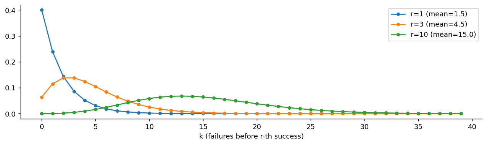

# 음이항분포

## 개요

**음이항분포**는 $r$번째 성공이 나올 때까지 걸리는 시행 횟수의 분포다. 기하분포가 첫 성공까지를 세었다면, 여기서는 목표를 $r$번으로 올린다.

$$
\text{Bernoulli}(p) \to B(n, p) \to \text{HG}(n, N, M) \to \text{Geo}(p) \;\longrightarrow\; \text{NB}(r, p) \;\longrightarrow\; \text{Poisson}(\lambda)
$$

사슬에서 이 페이지가 맡은 자리는 둘이다. 하나는 **기하분포의 일반화**($r = 1$이면 기하분포다). 다른 하나는 **포아송분포로 가는 마지막 다리**인데, 극한으로 가는 길과 혼합으로 가는 길이 따로 있어 4.1절을 닫는 자리에 놓인다.

한 가지 더 실용적인 역할이 있다. 계수 자료에서 분산이 평균보다 큰 **과대산포**가 나타날 때, 포아송을 대신하는 표준 모형이 음이항분포다.

---

## 정의

<div class="defn" markdown>

### 정의 1. 음이항분포 { .dfn }

독립 베르누이 시행에서 $r$번의 성공을 얻는 데 필요한 시행 횟수 $Y$는 **음이항분포**를 따른다:

$$
Y \sim \text{NegBin}(r, p), \qquad P(Y = k) = \binom{k-1}{r-1} p^r (1-p)^{k-r}, \quad k = r, r+1, r+2, \ldots
$$

이항계수 $\binom{k-1}{r-1}$은 처음 $k-1$번의 시행 중에 $r-1$번의 성공을 배치하는 경우의 수를 센다($k$번째 시행은 반드시 성공이어야 한다).

**참고:** $r = 1$이면 음이항분포는 [기하분포](geometric.md)로 환원된다.

</div>

### 성질

$$
\begin{aligned}
E[Y] &= \frac{r}{p} \\[4pt]
\text{Var}(Y) &= \frac{r(1-p)}{p^2}
\end{aligned}
$$

### 기하 확률변수의 합을 통한 유도

$r$번째 성공까지 걸린 시행을 **성공이 나올 때마다 끊어** 토막으로 나누어 보자. 첫 토막은 처음부터 첫 성공까지, 둘째 토막은 그 직후부터 둘째 성공까지, 이런 식이다.

$$
\underbrace{\texttt{FFS}}_{X_1}\;\underbrace{\texttt{FS}}_{X_2}\;\underbrace{\texttt{FFFFS}}_{X_3}\;\cdots
$$

$X_i$를 $i$번째 토막의 길이라 하면 정의에 따라 $Y = X_1 + \cdots + X_r$이다. 그런데 각 토막은 **"성공이 나올 때까지 던진 횟수"** 라는 같은 실험이다. 시행들이 독립이고 성공확률이 늘 $p$이므로, 앞 토막에서 무슨 일이 있었는지가 다음 토막에 아무 영향을 주지 않는다. 따라서

$$
X_1, X_2, \ldots, X_r \overset{\text{iid}}{\sim} \text{Geometric}(p), \qquad Y = \sum_{i=1}^r X_i
$$

이다. 기하분포의 무기억성을 다른 말로 한 것이기도 하다. 성공 하나를 보고 나면 계수기가 처음으로 되돌아간다.

평균은 선형성으로 곧바로 더해지고, 분산은 토막들이 독립이라 교차항 없이 더해진다.

$$
E[Y] = \sum_{i=1}^r E[X_i] = \frac{r}{p}, \qquad \text{Var}(Y) = \sum_{i=1}^r \text{Var}(X_i) = \frac{r(1-p)}{p^2}
$$

---

## 문제

<div class="probox" markdown>

**문제:** <span class="diff easy" title="쉬움"></span> 어떤 서버는 요청을 30% 확률로 처리하고 나머지는 재시도를 요구한다. 요청 3건을 처리하기까지 필요한 시도 횟수의 평균과 분산을 구하라. 정확히 7번 만에 끝날 확률은?

</div>

??? success "풀이"

    $Y \sim \text{NegBin}(r = 3, p = 0.3)$이므로

    $$
    E[Y] = \frac rp = \frac{3}{0.3} = 10, \qquad \text{Var}(Y) = \frac{r(1-p)}{p^2} = \frac{3 \times 0.7}{0.09} = 23.3
    $$

    이다. 표준편차가 $\sqrt{23.3} = 4.83$으로 평균의 절반에 가깝다. 대기 문제는 원래 흔들림이 크다.

    정확히 7번 만에 끝나려면 처음 6번 중에 성공이 2번, 7번째가 성공이어야 한다.

    $$
    P(Y = 7) = \binom{6}{2}(0.3)^3(0.7)^4 = 15 \times 0.027 \times 0.2401 = 0.0972
    $$

    평균이 10인데 최빈값은 그보다 작다. 오른쪽으로 치우친 분포라 **평균보다 빨리 끝나는 경우가 절반을 넘는다.**

---

## Python: PMF와 표본추출

<div class="codebox" markdown>

#### 예제 1. 음이항분포의 SciPy 판본 { .eg }

```python
import matplotlib.pyplot as plt
import numpy as np
from scipy import stats

# scipy의 음이항분포는 **실패 횟수**를 세는 판본이다.
# nbinom(r, p).pmf(k) = "r번째 성공이 나오기까지 실패가 k번 일어날 확률"
# 따라서 총 시행 횟수는 k + r 이고, x가 0부터 시작한다.
# 기하분포는 r = 1 인 특수한 경우다.
r, p = 5, 0.4
x = np.arange(0, 30)

fig, ax = plt.subplots(figsize=(12, 3))
# 기하분포와 달리 봉우리가 생긴다. 실패가 너무 적어도(운이 좋아도)
# 너무 많아도 확률이 낮기 때문이다.
ax.bar(x, stats.nbinom(r, p).pmf(x), alpha=0.7, label=f'NegBin(r={r}, p={p})')
ax.set_xlabel('k (number of failures before r-th success)')
ax.spines[['top', 'right']].set_visible(False)
ax.legend()
plt.show()
```


</div>

### r이 커지면 모양이 바뀐다

<div class="codebox" markdown>

#### 예제 2. 성공 횟수 r에 따른 모양 { .eg }

```python
import matplotlib.pyplot as plt
import numpy as np
from scipy import stats

p = 0.4
x = np.arange(0, 40)

fig, ax = plt.subplots(figsize=(12, 3))
# r = 1 이면 기하분포다. 단조 감소하며 최빈값이 0이다.
# r이 커질수록 봉우리가 생기고 오른쪽으로 옮겨 가며 대칭에 가까워진다.
# 독립인 기하확률변수를 r개 더한 것이므로 중심극한정리가 작동한다.
for r in [1, 3, 10]:
    ax.plot(x, stats.nbinom(r, p).pmf(x), 'o-', markersize=4,
            label=f'r={r} (mean={r*(1-p)/p:.1f})')
ax.set_xlabel('k (failures before r-th success)')
ax.spines[['top', 'right']].set_visible(False)
ax.legend()
plt.show()
```



</div>

### 기하 확률변수를 더해서 만들어 보기

<div class="codebox" markdown>

#### 예제 3. 정의대로 만들면 정말 음이항인가 { .eg }

```python
import numpy as np
from scipy import stats

np.random.seed(42)
r, p = 5, 0.4

# 정의를 그대로 실행한다. 기하분포(시행 번호 판본) r개를 더한다.
# scipy의 geom은 1부터 시작하는 시행 번호를 주므로 합의 최솟값이 r 이다.
trials = stats.geom(p).rvs(size=(r, 200_000)).sum(axis=0)
failures = trials - r          # scipy의 nbinom과 맞추려면 실패 횟수로 바꾼다

print(f"평균  : 표본 {failures.mean():.4f},  이론 {r*(1-p)/p:.4f}")
print(f"분산  : 표본 {failures.var():.4f},  이론 {r*(1-p)/p**2:.4f}")
print(f"P(K=10): 표본 {np.mean(failures == 10):.4f},  이론 {stats.nbinom(r, p).pmf(10):.4f}")
```

출력:

```
평균  : 표본 7.5096,  이론 7.5000
분산  : 표본 18.8118,  이론 18.7500
P(K=10): 표본 0.0624,  이론 0.0620
```

기하분포 $r$개의 합이 음이항분포라는 사실이 세 수치에서 모두 확인된다.

</div>

---

## 다음 고리: 음이항분포에서 포아송분포로

음이항분포는 두 가지 서로 다른 길로 포아송분포에 닿는다. 4.1절 사슬의 마지막 고리다.

- **극한으로서.** $r \to \infty$, $p \to 1$이면서 $r(1-p)/p \to \lambda$로 고정하면 실패 횟수를 세는 음이항분포가 $\text{Poisson}(\lambda)$로 수렴한다. 성공이 너무 흔해져서 실패가 드문 사건이 되는 상황이다.
- **혼합으로서.** 포아송분포의 비율 $\lambda$ 자체를 감마분포를 따르는 확률변수로 두고 섞으면 음이항분포가 나온다(연습문제 2). 방향을 거꾸로 읽으면, 음이항분포는 **포아송분포에 산포를 하나 더 얹은 것**이다. $\theta \to 0$이면 포아송으로 되돌아간다.

실제 계수 자료에서 분산이 평균보다 크면(과대산포) 포아송 대신 음이항을 쓰는 관행이 여기에서 나온다.

---

## 연습문제

<div class="drillbox" markdown>

**연습문제 1.** <span class="diff med" title="중간"></span>
**음이항분포.** i.i.d. Bernoulli($p$) 시행에서 $r$번째 성공까지의 시행 횟수를 $Z$라 하자. PMF, $\mathbb{E}[Z]$, $\mathrm{Var}(Z)$를 유도하라.

</div>

??? success "풀이"
    $Z = k$이려면 처음 $k - 1$번의 시행에서 정확히 $r - 1$번 성공하고 $k$번째 시행에서 성공해야 한다:

    $$
    P(Z = k) = \binom{k-1}{r-1} p^r (1-p)^{k-r}, \quad k = r, r+1, \ldots
    $$

    $Z$는 독립인 기하 확률변수 $Y_1, \ldots, Y_r$(각 성공까지의 대기 시간)의 합으로 쓸 수 있다. 따라서:

    $$
    \mathbb{E}[Z] = r/p, \qquad \mathrm{Var}(Z) = r(1-p)/p^2
    $$

    $r = 1$이면 기하분포로 환원된다. 음이항분포는 기하분포를 여러 번의 성공으로 일반화하며, 과대산포된 계수 자료의 모형에 바탕이 된다.

<div class="drillbox" markdown>

**연습문제 2.** <span class="diff hard" title="어려움"></span>
$Y \mid \Lambda = \lambda \sim \text{Poisson}(\lambda)$이고 $\Lambda \sim \text{Gamma}(\text{형상}=r,\ \text{척도}=\theta)$일 때 $Y$의 주변분포가 음이항분포임을 보여라. 이것이 계수 자료 분석에서 왜 중요한가?

</div>

??? success "풀이"
    조건부 확률에 사전밀도를 곱해 적분한다.

    $$
    P(Y=y) = \int_0^\infty \frac{e^{-\lambda}\lambda^y}{y!}\cdot\frac{\lambda^{r-1}e^{-\lambda/\theta}}{\Gamma(r)\theta^r}\,d\lambda = \frac{1}{y!\,\Gamma(r)\theta^r}\int_0^\infty \lambda^{y+r-1}e^{-\lambda(1+1/\theta)}\,d\lambda
    $$

    남은 적분은 감마적분이므로 $\Gamma(y+r)\,(1+1/\theta)^{-(y+r)}$이다. $p = 1/(1+\theta)$로 두면 $1-p = \theta/(1+\theta)$이고, 정리하면

    $$
    P(Y=y) = \frac{\Gamma(y+r)}{y!\,\Gamma(r)}\,p^r(1-p)^y, \qquad y = 0, 1, 2, \dots
    $$

    를 얻는다. 이것이 (실패 횟수를 세는 판본의) 음이항분포이다. $\square$

    $r$이 정수일 필요도 없다. 이항계수 대신 감마함수로 쓴 덕분에 $r > 0$인 실수면 된다.

    **왜 중요한가.** 적률을 계산하면

    $$
    E[Y] = r\theta, \qquad \operatorname{Var}(Y) = r\theta(1+\theta) = E[Y]\,(1+\theta)
    $$

    이다. 분산이 평균보다 $(1+\theta)$배 크다. 포아송분포는 평균과 분산이 같아야 하는데, 실제 계수 자료는 거의 언제나 분산이 더 크다. 이를 **과대산포**라 한다.

    이 유도가 그 원인을 말해 준다. 개체마다 사건 발생률 $\lambda$가 다르면(관측되지 않은 이질성), 전체를 뭉뚱그린 분포는 포아송이 아니라 그 혼합이 되고 분산이 부풀어 오른다. 보험 가입자마다 사고 성향이 다르고, 지역마다 감염 위험이 다르며, 유전자마다 발현량이 다르다.

    실무적 귀결은 분명하다. 과대산포된 자료에 포아송 회귀를 쓰면 계수 추정은 그런대로 나와도 **표준오차가 심하게 과소평가**되어 있지도 않은 유의성이 쏟아진다. 음이항 회귀를 쓰면 $\theta$가 이 여분의 산포를 흡수한다. RNA 시퀀싱 자료 분석 도구들이 하나같이 음이항 모형을 쓰는 이유이며, $\theta \to 0$이면 포아송으로 돌아가므로 포아송을 특수한 경우로 포함한다.

<div class="drillbox" markdown>

**연습문제 3.** <span class="diff easy" title="쉬움"></span>
음이항분포에는 "$r$번째 성공까지의 **시행 횟수**"를 세는 판본과 "$r$번째 성공 이전의 **실패 횟수**"를 세는 판본이 있다. 두 판본의 지지집합·평균·분산을 각각 적고, SciPy가 어느 쪽인지 확인하라.

</div>

??? success "풀이"
    시행 횟수 판본을 $Y$, 실패 횟수 판본을 $K$라 하면 $Y = K + r$이다. 상수만큼 평행이동한 것이므로 분산은 같고 평균만 $r$ 차이 난다.

    | | 시행 횟수 $Y$ | 실패 횟수 $K$ |
    |---|---|---|
    | 지지집합 | $r, r+1, \ldots$ | $0, 1, 2, \ldots$ |
    | PMF | $\binom{k-1}{r-1}p^r(1-p)^{k-r}$ | $\binom{k+r-1}{k}p^r(1-p)^{k}$ |
    | 평균 | $r/p$ | $r(1-p)/p$ |
    | 분산 | $r(1-p)/p^2$ | $r(1-p)/p^2$ |

    **SciPy는 실패 횟수 판본이다.** `stats.nbinom(r, p).pmf(k)`가 "$r$번째 성공까지 실패가 $k$번"일 확률을 준다. `mean()`을 찍어 보면 $r/p$가 아니라 $r(1-p)/p$가 나오는 것으로 곧바로 확인된다. $r = 5$, $p = 0.4$이면 12.5가 아니라 7.5다.

    기하분포에서 `stats.geom`이 **시행 번호** 판본이었던 것과 **반대**라는 점이 특히 헷갈린다. 같은 라이브러리 안에서 규약이 다르므로, 두 분포를 함께 쓰는 코드에서는 $r=1$일 때 `geom`과 `nbinom`의 평균이 1만큼 어긋난다는 사실을 기억해야 한다.

    ```python
    from scipy import stats
    print(stats.geom(0.4).mean())      # 2.5   = 1/p        (시행 번호)
    print(stats.nbinom(1, 0.4).mean()) # 1.5   = (1-p)/p    (실패 횟수)
    ```

<div class="drillbox" markdown>

**연습문제 4.** <span class="diff med" title="중간"></span>
실패 횟수 판본의 PMF가 모든 확률을 더해 1이 됨을 보여라. 왜 "음이항"이라는 이름이 붙었는가?

</div>

??? success "풀이"
    $q = 1-p$로 두고 더한다.

    $$
    \sum_{k=0}^\infty \binom{k+r-1}{k}p^r q^k = p^r\sum_{k=0}^\infty \binom{k+r-1}{k}q^k
    $$

    여기서 **음이항급수**

    $$
    (1 - q)^{-r} = \sum_{k=0}^\infty \binom{k+r-1}{k}q^k, \qquad |q| < 1
    $$

    를 쓰면 합이 $p^r(1-q)^{-r} = p^r p^{-r} = 1$이 된다. $\square$

    이름의 유래가 바로 이 급수다. 뉴턴의 이항정리를 **음의 지수** $-r$로 확장하면

    $$
    \binom{-r}{k} = (-1)^k\binom{k+r-1}{k}
    $$

    이므로 PMF를 $\binom{-r}{k}p^r(-q)^k$로도 쓸 수 있다. 이항계수의 위 첨자가 음수라는 데서 "음이항"이 왔다.

    이 표현은 형식적인 이름짓기에 그치지 않는다. $r$이 정수일 필요가 없다는 사실이 여기서 따라 나온다. 이항계수를 감마함수로 쓰면 $r > 0$인 어떤 실수에서도 PMF가 잘 정의되며, 이것이 계수 자료 회귀에서 $r$을 연속 모수로 추정하는 근거다(연습문제 2의 혼합 표현과 같은 이야기다).

<div class="drillbox" markdown>

**연습문제 5.** <span class="diff hard" title="어려움"></span>
$r \to \infty$, $p \to 1$이면서 $r(1-p)/p \to \lambda$로 고정하면 실패 횟수 판본의 음이항분포가 $\text{Poisson}(\lambda)$로 수렴함을 보여라.

</div>

??? success "풀이"
    $q = 1-p$이고 평균이 $rq/p = \lambda$로 고정되어 있으므로 $q = \lambda/(r+\lambda)$, $p = r/(r+\lambda)$로 두면 된다. 고정된 $k$에 대해

    $$
    P(K=k) = \binom{k+r-1}{k}p^r q^k = \underbrace{\frac{(r+k-1)(r+k-2)\cdots r}{k!}}_{(\text{가})}\left(\frac{r}{r+\lambda}\right)^r\left(\frac{\lambda}{r+\lambda}\right)^k
    $$

    이다. 세 조각으로 나누어 극한을 취한다.

    - (가)의 분자는 $r$에 대한 $k$차 다항식이므로 $r^k$로 나누면 1로 간다. 즉 (가) $\approx r^k/k!$.
    - $\left(\frac{\lambda}{r+\lambda}\right)^k \cdot r^k = \lambda^k\left(\frac{r}{r+\lambda}\right)^k \to \lambda^k$.
    - $\left(\frac{r}{r+\lambda}\right)^r = \left(1 + \frac\lambda r\right)^{-r} \to e^{-\lambda}$.

    셋을 곱하면

    $$
    P(K=k) \to \frac{\lambda^k e^{-\lambda}}{k!}
    $$

    이다. $\square$

    **뜻.** 성공이 거의 확실해지면($p \to 1$) 실패는 드문 사건이 되고, 드문 사건의 개수는 포아송을 따른다. 이항분포에서 $p \to 0$으로 포아송에 닿았던 것과 대칭을 이루는 길이다.

    모수로 보면 이 극한은 $r \to \infty$에서 **과대산포가 사라지는** 과정이기도 하다. 음이항의 분산은 평균의 $1/p = 1 + \lambda/r$배인데, $r \to \infty$면 이 배율이 1로 가서 포아송의 "평균 = 분산"이 회복된다.

<div class="drillbox" markdown>

**연습문제 6.** <span class="diff med" title="중간"></span>
어느 콜센터의 하루 불만 접수 건수를 30일 동안 기록했더니 표본평균 4.2, 표본분산 11.8이었다. 포아송과 음이항 가운데 무엇을 쓸지 판단하고, 음이항의 모수를 적률법으로 추정하라.

</div>

??? success "풀이"
    **판단.** 포아송이면 평균과 분산이 같아야 하는데 $s^2/\bar x = 11.8/4.2 = 2.81$로 세 배 가깝다. 뚜렷한 **과대산포**이므로 포아송은 부적절하다.

    **적률추정.** 실패 횟수 판본에서 평균과 분산은

    $$
    \mu = \frac{r(1-p)}{p}, \qquad \sigma^2 = \frac{r(1-p)}{p^2} = \frac{\mu}{p}
    $$

    이다. 둘째 식에서 곧바로

    $$
    \hat p = \frac{\bar x}{s^2} = \frac{4.2}{11.8} = 0.356
    $$

    이고, 첫째 식에 넣으면

    $$
    \hat r = \frac{\hat p\,\bar x}{1 - \hat p} = \frac{0.356 \times 4.2}{0.644} = 2.32
    $$

    이다. $\hat r$이 정수가 아니어도 된다는 것은 연습문제 4에서 보았다.

    **해석.** 혼합 관점(연습문제 2)으로 읽으면 $\hat r = 2.32$가 이질성의 크기를 말해 준다. $r$이 작을수록 날짜별 발생률의 편차가 크다는 뜻이고, $r \to \infty$면 포아송으로 돌아간다. 여기서는 $r$이 작으니 "어떤 날은 조용하고 어떤 날은 폭주하는" 자료다.

    다만 과대산포의 원인을 모형으로 덮기 전에 먼저 확인할 것이 있다. 요일 효과나 사건(제품 출시, 장애)처럼 **설명 가능한 변동**이 있으면 그것을 설명변수로 넣는 편이 낫다. 설명변수를 넣고도 남는 산포가 있을 때 음이항이 제 역할을 한다.


---

## 정리하며

- 음이항분포는 $r$번째 성공까지의 시행 횟수(또는 그 이전의 실패 횟수)를 센다. $r = 1$이면 기하분포다.
- 독립인 기하확률변수 $r$개의 합이므로 평균과 분산이 각각 $r$배가 되어 $r/p$와 $r(1-p)/p^2$이다.
- **분산이 평균보다 크다.** 실패 횟수 판본에서 분산은 평균의 $1/p$배이며, 이 초과분이 과대산포된 계수 자료를 다루는 힘이 된다.
- 포아송분포의 비율을 감마분포로 섞으면 음이항이 나온다. 거꾸로 $r \to \infty$면 포아송으로 되돌아간다. 4.1절 사슬은 이 두 갈래로 닫힌다.
- SciPy의 `nbinom`은 **실패 횟수** 판본이고 `geom`은 **시행 번호** 판본이라 서로 규약이 다르다. 평균을 한 번 찍어 보고 시작하는 편이 안전하다.
