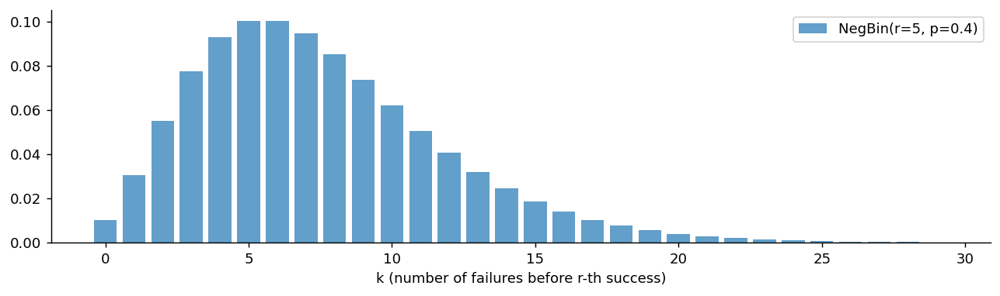
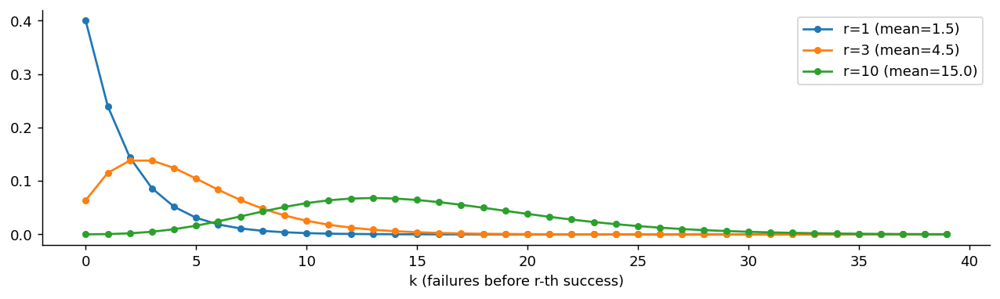

# 음이항분포

## 개요

**음이항분포**는 $r$번째 성공이 나올 때까지 걸리는 시행 횟수의 분포다. 기하분포가 첫 성공까지를 세었다면, 여기서는 목표를 $r$번으로 올린다.

$$
\text{Bernoulli}(p) \to B(n, p) \to \text{HG}(n, N, M) \to \text{Geo}(p) \;\longrightarrow\; \text{NB}(r, p) \;\longrightarrow\; \text{Poisson}(\lambda)
$$

사슬에서 이 페이지가 맡은 자리는 둘이다. 하나는 **기하분포의 일반화**($r = 1$이면 기하분포다). 다른 하나는 **포아송분포로 가는 마지막 다리**인데, 극한으로 가는 길과 혼합으로 가는 길이 따로 있어 4.1절을 닫는 자리에 놓인다.

한 가지 더 실용적인 역할이 있다. 계수 자료에서 분산이 평균보다 큰 **과대산포**가 나타날 때, 포아송을 대신하는 표준 모형이 음이항분포다.

---

## 정의

<div class="defn" markdown>

### 정의 1. 음이항분포 { .dfn }

독립 베르누이 시행에서 $r$번의 성공을 얻는 데 필요한 시행 횟수 $Y$는 **음이항분포**를 따른다:

$$
Y \sim \text{NegBin}(r, p), \qquad P(Y = k) = \binom{k-1}{r-1} p^r (1-p)^{k-r}, \quad k = r, r+1, r+2, \ldots
$$

이항계수 $\binom{k-1}{r-1}$은 처음 $k-1$번의 시행 중에 $r-1$번의 성공을 배치하는 경우의 수를 센다($k$번째 시행은 반드시 성공이어야 한다).

**참고:** $r = 1$이면 음이항분포는 [기하분포](geometric.md)로 환원된다.

</div>

### 성질

$$
\begin{aligned}
E[Y] &= \frac{r}{p} \\[4pt]
\text{Var}(Y) &= \frac{r(1-p)}{p^2}
\end{aligned}
$$

### 기하 확률변수의 합을 통한 유도

$r$번째 성공까지 걸린 시행을 **성공이 나올 때마다 끊어** 토막으로 나누어 보자. 첫 토막은 처음부터 첫 성공까지, 둘째 토막은 그 직후부터 둘째 성공까지, 이런 식이다.

$$
\underbrace{\texttt{FFS}}_{X_1}\;\underbrace{\texttt{FS}}_{X_2}\;\underbrace{\texttt{FFFFS}}_{X_3}\;\cdots
$$

$X_i$를 $i$번째 토막의 길이라 하면 정의에 따라 $Y = X_1 + \cdots + X_r$이다. 그런데 각 토막은 **"성공이 나올 때까지 던진 횟수"** 라는 같은 실험이다. 시행들이 독립이고 성공확률이 늘 $p$이므로, 앞 토막에서 무슨 일이 있었는지가 다음 토막에 아무 영향을 주지 않는다. 따라서

$$
X_1, X_2, \ldots, X_r \overset{\text{iid}}{\sim} \text{Geometric}(p), \qquad Y = \sum_{i=1}^r X_i
$$

이다. 기하분포의 무기억성을 다른 말로 한 것이기도 하다. 성공 하나를 보고 나면 계수기가 처음으로 되돌아간다.

평균은 선형성으로 곧바로 더해지고, 분산은 토막들이 독립이라 교차항 없이 더해진다.

$$
E[Y] = \sum_{i=1}^r E[X_i] = \frac{r}{p}, \qquad \text{Var}(Y) = \sum_{i=1}^r \text{Var}(X_i) = \frac{r(1-p)}{p^2}
$$

---

## 문제

<div class="probox" markdown>

**문제:** <span class="diff easy" title="쉬움"></span> 어떤 서버는 요청을 30% 확률로 처리하고 나머지는 재시도를 요구한다. 요청 3건을 처리하기까지 필요한 시도 횟수의 평균과 분산을 구하라. 정확히 7번 만에 끝날 확률은?

</div>

??? success "풀이"

    $Y \sim \text{NegBin}(r = 3, p = 0.3)$이므로

    $$
    E[Y] = \frac rp = \frac{3}{0.3} = 10, \qquad \text{Var}(Y) = \frac{r(1-p)}{p^2} = \frac{3 \times 0.7}{0.09} = 23.3
    $$

    이다. 표준편차가 $\sqrt{23.3} = 4.83$으로 평균의 절반에 가깝다. 대기 문제는 원래 흔들림이 크다.

    정확히 7번 만에 끝나려면 처음 6번 중에 성공이 2번, 7번째가 성공이어야 한다.

    $$
    P(Y = 7) = \binom{6}{2}(0.3)^3(0.7)^4 = 15 \times 0.027 \times 0.2401 = 0.0972
    $$

    평균이 10인데 최빈값은 그보다 작다. 오른쪽으로 치우친 분포라 **평균보다 빨리 끝나는 경우가 절반을 넘는다.**

---

## Python: PMF와 표본추출

<div class="exbox" markdown>

**보기 1.** <span class="diff easy" title="쉬움"></span> 음이항분포의 SciPy 판본. $r = 5$번째 성공 **이전의 실패 횟수** $K$의 PMF를 $p = 0.4$에서 $k = 0, \ldots, 29$에 그린다.

**(1)** 이웃한 두 확률의 비로 최빈값을 구하시오. 동점은 어떤 조건에서 생기며, $r = 5$, $p = 0.4$가 바로 그 경우인가.

**(2)** (1)을 분수로 확인하고, $k \ge 30$을 잘라 버린 것이 정당한지 꼬리확률로 확인하시오.

</div>

??? success "풀이"

    **(1) 해석적으로.** 실패 횟수 판본의 PMF를 먼저 적어 둔다. 정의 1은 시행 횟수 $Y$를 썼으나 SciPy 는 실패 횟수 $K = Y - r$을 쓰므로 $k = m - r$을 대입하면

    $$
    P(K = k) = \binom{k+r-1}{r-1} p^r (1-p)^k
    = \binom{k+r-1}{k} p^r (1-p)^k, \qquad k = 0, 1, 2, \ldots
    $$

    다. 이웃한 두 확률의 비를 본다. $q = 1-p$라 두면

    $$
    \frac{p(k)}{p(k-1)}
    = \frac{\binom{k+r-1}{k}q^k}{\binom{k+r-2}{k-1}q^{k-1}}
    = \frac{k+r-1}{k}\cdot q
    $$

    이다. $\binom{k+r-1}{k}\big/\binom{k+r-2}{k-1} = \frac{(k+r-1)!}{(k+r-2)!}\cdot\frac{(k-1)!}{k!} = \frac{k+r-1}{k}$를 썼고 $p^r$은 약분되었다. 이 비가 $1$ 이상인 조건은

    $$
    q(k + r - 1) \ge k
    \quad \Longleftrightarrow \quad
    q(r-1) \ge k(1-q) = kp
    \quad \Longleftrightarrow \quad
    k \le \frac{q(r-1)}{p}
    $$

    다. $\frac{k+r-1}{k} = 1 + \frac{r-1}{k}$는 $k$에 대해 **감소**하므로 비가 $1$을 지나는 자리는 한 곳뿐이고, 봉우리도 하나다. 따라서 문턱을 $m = \dfrac{q(r-1)}{p}$라 하면

    $$
    \text{최빈값} = \lfloor m \rfloor \quad (m \notin \mathbb{Z}),
    \qquad
    \text{최빈값} = \{m-1,\, m\} \quad (m \in \mathbb{Z})
    $$

    이다. $m$이 정수이면 $k = m$에서 비가 정확히 $1$이 되어 $p(m) = p(m-1)$이므로 **최빈값이 둘**이다.

    $r = 1$이면 $m = 0$이라 최빈값이 $0$이고 PMF가 처음부터 단조 감소한다. 기하분포로 환원되는 것이 식에서 그대로 읽힌다.

    $r = 5$, $p = 0.4$를 넣어 보면

    $$
    m = \frac{0.6 \times 4}{0.4} = 6
    $$

    으로 **정수다.** 곧 이 쪽의 기본 보기가 바로 동점인 경우이고, 최빈값은 $5$와 $6$ 둘이다. 평균은 $rq/p = 7.5$라 최빈값보다 크다. 본문 문제에서 "평균이 10인데 최빈값은 그보다 작다"고 한 것과 같은 치우침이다.

    **(2) 수치적으로.** 먼저 쪽의 그림을 그린다.

    ```python
    import matplotlib.pyplot as plt
    import numpy as np
    from scipy import stats

    plt.rcParams["font.sans-serif"] = ["NanumGothic", "Apple SD Gothic Neo", "Malgun Gothic"]
    plt.rcParams["font.family"] = "sans-serif"
    plt.rcParams["axes.unicode_minus"] = False

    # scipy의 음이항분포는 **실패 횟수**를 세는 판본이다.
    # nbinom(r, p).pmf(k) = "r번째 성공이 나오기까지 실패가 k번 일어날 확률"
    # 따라서 총 시행 횟수는 k + r 이고, x가 0부터 시작한다.
    # 기하분포는 r = 1 인 특수한 경우다.
    r, p = 5, 0.4
    x = np.arange(0, 30)

    fig, ax = plt.subplots(figsize=(12, 3))
    # 기하분포와 달리 봉우리가 생긴다. 실패가 너무 적어도(운이 좋아도)
    # 너무 많아도 확률이 낮기 때문이다.
    ax.bar(x, stats.nbinom(r, p).pmf(x), alpha=0.7, label=f'NegBin(r={r}, p={p})')
    ax.set_xlabel('k (number of failures before r-th success)')
    ax.spines[['top', 'right']].set_visible(False)
    ax.legend()
    plt.show()
    ```

    

    $k = 5$와 $k = 6$의 막대가 **같은 높이로 나란히** 서 있고 양옆으로 주저앉는다. 오른쪽 꼬리가 왼쪽보다 길다. 분수로 확인한다.

    ```python
    from fractions import Fraction as F
    from math import comb
    import numpy as np
    from scipy import stats

    r, p = 5, F(2, 5)        # p = 0.4 를 분수로
    q = 1 - p

    # 비 p(k)/p(k-1) = q(k+r-1)/k
    for k in range(1, 10):
        ratio = F(k + r - 1, k) * q
        mark = ">1 (오름)" if ratio > 1 else ("=1 (동점)" if ratio == 1 else "<1 (내림)")
        print(f"p({k})/p({k-1}) = {str(ratio):>6} = {float(ratio):.4f}   {mark}")

    thr = q * (r - 1) / p
    print(f"문턱 q(r-1)/p = {thr}  (정수인가? {thr.denominator == 1})")

    def exact(k):            # C(k+r-1, k) p^r q^k
        return F(comb(k + r - 1, k)) * p**r * q**k

    print(f"P(5) = {exact(5)},  P(6) = {exact(6)},  같은가? {exact(5) == exact(6)}")
    rv = stats.nbinom(5, 0.4)
    pm = rv.pmf(np.arange(0, 30))
    print(f"부동소수점: pmf(5) - pmf(6) = {pm[5] - pm[6]:+.3e}")
    print(f"동점으로 잡히는 자리 = {np.flatnonzero(pm == pm.max())}")
    print(f"평균 rq/p = {float(r*q/p)},  P(K >= 30) = {rv.sf(29):.3e}")
    ```

    출력:

    ```
    p(1)/p(0) =      3 = 3.0000   >1 (오름)
    p(2)/p(1) =    9/5 = 1.8000   >1 (오름)
    p(3)/p(2) =    7/5 = 1.4000   >1 (오름)
    p(4)/p(3) =    6/5 = 1.2000   >1 (오름)
    p(5)/p(4) =  27/25 = 1.0800   >1 (오름)
    p(6)/p(5) =      1 = 1.0000   =1 (동점)
    p(7)/p(6) =  33/35 = 0.9429   <1 (내림)
    p(8)/p(7) =   9/10 = 0.9000   <1 (내림)
    p(9)/p(8) =  13/15 = 0.8667   <1 (내림)
    문턱 q(r-1)/p = 6  (정수인가? True)
    P(5) = 979776/9765625,  P(6) = 979776/9765625,  같은가? True
    부동소수점: pmf(5) - pmf(6) = -5.551e-17
    동점으로 잡히는 자리 = [6]
    평균 rq/p = 7.5,  P(K >= 30) = 3.211e-04
    ```

    비가 $k = 5$에서 $27/25$로 아직 $1$보다 크고 $k = 6$에서 **정확히 $1$**을 찍은 뒤 $k = 7$에서 $33/35$로 내려간다. $27/25$가 $1$에 아주 가깝다는 점에도 주의할 것. 봉우리가 $k = 4$부터 $k = 7$까지 거의 평평하다는 뜻이다.

    분수로 재면 $P(5)$와 $P(6)$이 **한 치도 다르지 않다**($979776/9765625$). 그런데 부동소수점으로는 $5.6 \times 10^{-17}$만큼 어긋나 `flatnonzero`가 $6$ 하나만 집는다. 이항분포의 보기 1에서 본 것과 똑같은 일이다. **$p = 0.4$가 이진수로 딱 떨어지지 않는다는 것 하나로 동점이 가려진다.**

    꼬리는 $P(K \ge 30) = 3.21 \times 10^{-4}$이다. 포아송의 $3.45 \times 10^{-7}$보다 세 자리 크지만 그림에서 버려도 좋을 만큼은 작다. 음이항분포의 꼬리는 기하분포와 마찬가지로 지수적으로만 줄어들어 두꺼운데, 평균 $7.5$에서 $30$은 표준편차 $\sqrt{18.75} = 4.33$으로 재어 $5.2$ 표준편차 밖이다.

### r이 커지면 모양이 바뀐다

<div class="exbox" markdown>

**보기 2.** <span class="diff easy" title="쉬움"></span> 성공 횟수 r에 따른 모양. $p = 0.4$를 고정하고 $r = 1, 3, 10$인 세 음이항 PMF(실패 횟수)를 겹쳐 그린다.

**(1)** 코드 주석은 "$r$이 커질수록 대칭에 가까워진다"고 한다. 왜도를 구해 그 말을 수로 바꾸고, $r$에 대해 어떤 꼴로 줄어드는지 보이시오. 세 경우의 최빈값도 구하시오.

**(2)** 왜도를 알면 정규근사의 오차까지 어림할 수 있다. 연속성 수정을 넣은 CDF의 최대오차를 왜도로 예측하고 재어 보시오.

</div>

??? success "풀이"

    **(1) 해석적으로.** 최빈값은 보기 1의 식에 넣으면 된다. 문턱 $m = q(r-1)/p$를 $q = 0.6$, $p = 0.4$에서 계산하면

    $$
    r = 1: \; m = 0, \qquad
    r = 3: \; m = \frac{0.6 \times 2}{0.4} = 3, \qquad
    r = 10: \; m = \frac{0.6 \times 9}{0.4} = 13.5
    $$

    이다. $r = 1$은 $m = 0$이라 오르는 구간이 없어 최빈값 $0$ 하나이고 기하분포가 된다. $r = 3$은 $m = 3$이 **정수**라 최빈값이 $\{2, 3\}$ 둘이다. $r = 10$은 $m = 13.5$가 정수가 아니라 $\lfloor 13.5 \rfloor = 13$ 하나다.

    왜도는 **기하분포의 합이라는 구조**에서 바로 나온다. $K = \sum_{i=1}^r K_i$이고 $K_i$가 독립이므로 3차 중심적률(= 3차 누적률)이 더해진다.

    $$
    \mu_3(K) = r\,\mu_3(K_1), \qquad \sigma^2(K) = r\,\sigma^2(K_1)
    $$

    따라서

    $$
    \gamma_1(K) = \frac{\mu_3(K)}{\sigma^3(K)}
    = \frac{r\,\mu_3(K_1)}{\big(r\,\sigma^2(K_1)\big)^{3/2}}
    = \frac{1}{\sqrt r}\cdot\frac{\mu_3(K_1)}{\sigma^3(K_1)}
    = \frac{\gamma_1(K_1)}{\sqrt r}
    $$

    **왜도는 $1/\sqrt r$로 줄어든다.** 이것이 바로 중심극한정리가 작동하는 모습이다. 독립인 것을 $r$개 더하면 3차 누적률은 $r$배가 되지만 표준편차는 $\sqrt r$배가 되어 $r^{3/2}$로 나뉘므로, 비대칭이 $r^{-1/2}$ 속도로 씻겨 나간다.

    $r = 1$인 기하분포(실패 횟수)의 왜도는 $\gamma_1 = (2-p)/\sqrt{q}$이므로 $p = 0.4$에서

    $$
    \gamma_1(K_1) = \frac{1.6}{\sqrt{0.6}} = 2.0656,
    \qquad
    \gamma_1(K) = \frac{2.0656}{\sqrt r}
    $$

    이다. 세 $r$에 넣으면 $2.0656$, $1.1926$, $0.6532$다. **$r$을 열 배로 해야 왜도가 3분의 1이 된다.** "$r$이 커지면 대칭에 가까워진다"는 말은 맞지만 그 속도가 매우 느리다는 것이 수가 말해 주는 바다. 왜도를 $0.2$ 아래로 내리려면 $r \ge (2.0656/0.2)^2 = 107$이 필요하다.

    **(2) 해석적으로.** 왜도가 정규근사 오차의 **주항**을 쥐고 있다. 격자분포에 연속성 수정을 넣으면 에지워스 전개의 첫 보정항이 남아

    $$
    P(K \le k) \approx \Phi(z) - \frac{\gamma_1}{6}(z^2 - 1)\varphi(z),
    \qquad z = \frac{k + \tfrac12 - \mu}{\sigma}
    $$

    이다($\varphi$는 표준정규밀도). 오차 $\Phi(z) - P(K \le k)$의 크기는 $\frac{\gamma_1}{6}\lvert z^2-1 \rvert\varphi(z)$이고, 이 함수는 $z = 0$에서 최대 $\varphi(0) = 1/\sqrt{2\pi}$를 갖는다($z = \pm\sqrt3$에서 두 번째 봉우리가 있으나 $2\varphi(\sqrt3) = 0.178$로 더 작다). 따라서

    $$
    \max_k \big\lvert \Phi(z) - P(K \le k) \big\rvert
    \approx \frac{\gamma_1}{6\sqrt{2\pi}} = 0.0665\,\gamma_1
    $$

    이고, $z = 0$에서 $(z^2-1) < 0$이므로 **오차의 부호는 $-$**다. 곧 최대오차가 평균 부근에서 나타나며 정규근사가 누적확률을 **덜** 잡는다. 세 $r$에 넣으면 $-0.137$, $-0.079$, $-0.043$으로 예측된다.

    **수치적으로.** 먼저 쪽의 그림을 그린다.

    ```python
    import matplotlib.pyplot as plt
    import numpy as np
    from scipy import stats

    p = 0.4
    x = np.arange(0, 40)

    fig, ax = plt.subplots(figsize=(12, 3))
    # r = 1 이면 기하분포다. 단조 감소하며 최빈값이 0이다.
    # r이 커질수록 봉우리가 생기고 오른쪽으로 옮겨 가며 대칭에 가까워진다.
    # 독립인 기하확률변수를 r개 더한 것이므로 중심극한정리가 작동한다.
    for r in [1, 3, 10]:
        ax.plot(x, stats.nbinom(r, p).pmf(x), 'o-', markersize=4,
                label=f'r={r} (mean={r*(1-p)/p:.1f})')
    ax.set_xlabel('k (failures before r-th success)')
    ax.spines[['top', 'right']].set_visible(False)
    ax.legend()
    plt.show()
    ```

    

    $r = 1$ 곡선은 $k = 0$에서 출발해 단조 감소하고, $r = 3$은 낮은 봉우리가 왼쪽에 있으며 $r = 10$은 $k = 13$ 근처에 종 모양 봉우리가 있다. 다만 세 곡선 모두 오른쪽 꼬리가 왼쪽보다 길다. $r = 10$조차 **눈으로는 대칭처럼 보이지만** 왜도가 $0.65$나 된다. 수로 확인한다.

    ```python
    from fractions import Fraction as F
    from math import comb, pi, sqrt
    import numpy as np
    from scipy import stats

    p = F(2, 5)
    q = 1 - p
    k = np.arange(0, 2000)

    print(f"{'r':>3}{'문턱 q(r-1)/p':>15}{'정수?':>7}{'최빈값(식)':>12}{'argmax':>8}"
          f"{'평균':>8}{'분산':>9}{'왜도':>9}{'왜도x√r':>10}")
    for r in (1, 3, 10):
        thr = q * (r - 1) / p                  # 분수로 계산해야 정수 판정이 맞는다
        integral, m = thr.denominator == 1, int(thr)
        modes = f"{{{m-1}, {m}}}" if integral and m >= 1 else f"{m}"
        rv = stats.nbinom(r, float(p))
        skew = float(rv.stats("s"))
        print(f"{r:>3}{str(thr):>15}{str(integral):>7}{modes:>12}{rv.pmf(k).argmax():>8}"
              f"{float(r*q/p):>8.2f}{float(r*q/p**2):>9.2f}{skew:>9.4f}{skew*sqrt(r):>10.4f}")

    # 동점은 분수로만 보인다. r = 3 에서 P(2) 와 P(3) 을 정확히 비교한다.
    def exact(r, j):
        return F(comb(j + r - 1, j)) * p**r * q**j

    for r, a, b in ((3, 2, 3), (5, 5, 6)):
        pm = stats.nbinom(r, float(p)).pmf(np.arange(0, 40))
        print(f"r={r}: P({a}) = {exact(r,a)},  P({b}) = {exact(r,b)},  같은가? {exact(r,a)==exact(r,b)}"
              f"   부동소수점 차 {pm[a]-pm[b]:+.3e}")

    # 정규근사(연속성 수정)의 CDF 최대오차가 에지워스 예측과 맞는가.
    print(f"{'r':>5}{'왜도 g':>9}{'최대오차':>11}{'-g/(6√(2π))':>14}{'오차/g':>10}")
    for r in (1, 3, 10, 30, 100):
        rv = stats.nbinom(r, float(p))
        mu, sd = float(r*q/p), sqrt(float(r*q/p**2))
        e = stats.norm(mu, sd).cdf(k + 0.5) - rv.cdf(k)
        i = np.abs(e).argmax()
        g = float(rv.stats("s"))
        print(f"{r:>5}{g:>9.4f}{e[i]:>+11.4f}{-g/(6*sqrt(2*pi)):>+14.4f}{e[i]/g:>10.4f}")
    ```

    출력:

    ```
      r    문턱 q(r-1)/p    정수?      최빈값(식)  argmax      평균       분산       왜도     왜도x√r
      1              0   True           0       0    1.50     3.75   2.0656    2.0656
      3              3   True      {2, 3}       2    4.50    11.25   1.1926    2.0656
     10           27/2  False          13      13   15.00    37.50   0.6532    2.0656
    r=3: P(2) = 432/3125,  P(3) = 432/3125,  같은가? True   부동소수점 차 +1.110e-16
    r=5: P(5) = 979776/9765625,  P(6) = 979776/9765625,  같은가? True   부동소수점 차 -5.551e-17
        r     왜도 g       최대오차   -g/(6√(2π))      오차/g
        1   2.0656    -0.1400       -0.1373   -0.0678
        3   1.1926    -0.0801       -0.0793   -0.0672
       10   0.6532    -0.0435       -0.0434   -0.0665
       30   0.3771    -0.0251       -0.0251   -0.0665
      100   0.2066    -0.0137       -0.0137   -0.0665
    ```

    (1)과 (2)가 모두 맞는다.

    **왜도 $\times \sqrt r$.** 마지막 열이 세 줄 모두 **정확히 $2.0656$**이다. 왜도가 $r^{-1/2}$에 비례한다는 것을 소수점 넷째 자리까지 확인한 셈이고, $r = 1$의 왜도 $(2-p)/\sqrt q = 1.6/\sqrt{0.6}$이 그 비례상수다.

    **최빈값과 동점.** 식이 준 $0$, $\{2,3\}$, $13$ 가운데 `argmax`는 $0$, $2$, $13$을 준다. $r = 3$에서 동점을 놓친 것인데, 분수로 재면 $P(2) = P(3) = 432/3125$로 정확히 같고 부동소수점 차가 $1.1 \times 10^{-16}$이다. **문턱을 `float`로 계산하면 더 나쁘다.** $0.6 \times 2 / 0.4$가 배정도로는 $2.9999999999999996$이 되어 `int()`가 $2$를 돌려주고, 정수 판정 자체가 실패한다. 코드에서 `Fraction`을 쓴 이유가 그것이다.

    **정규근사 오차.** `오차/g` 열이 $-0.0678$, $-0.0672$, $-0.0665$, $-0.0665$, $-0.0665$로 예측한 $-1/(6\sqrt{2\pi}) = -0.06649$에 눕는다. $r \ge 10$에서는 소수점 넷째 자리까지 맞고 $r = 1, 3$에서 $2\%$쯤 어긋나는데, 버린 2차 보정항($\gamma_2$ 항)이 그만큼 일하기 때문이다. 부호가 모두 $-$인 것도 유도한 대로다.

    **쓸 만한가.** $r = 100$에서도 CDF 최대오차가 $0.0137$이다. 이항분포가 $np = 20$에서 $0.0039$였던 것과 견주면 **같은 "큰 표본"에서도 음이항 쪽이 네 배 가까이 나쁘다.** 왜도가 $1/\sqrt r$로만 줄기 때문이고, 과대산포 자료에 정규근사를 선뜻 들이대면 안 되는 까닭이다. 대신 에지워스 보정항을 더하거나 아예 정확한 음이항 CDF를 쓰는 편이 낫다.

### 기하 확률변수를 더해서 만들어 보기

<div class="exbox" markdown>

**보기 3.** <span class="diff easy" title="쉬움"></span> 정의대로 만들면 정말 음이항인가. 기하분포에서 뽑은 것 $r = 5$개를 더해 $2 \times 10^5$개의 표본을 만들고 평균·분산·$P(K=10)$을 이론값과 견준다.

**(1)** 세 통계량의 표준오차를 구하시오. 분산 쪽에는 음이항분포의 4차 중심적률이 필요한데, **기하분포의 합이라는 구조**를 쓰면 누적률의 가법성으로 구할 수 있다.

**(2)** 코드가 준 세 값이 (1)의 표준오차로 재어 몇 배 안에 들어오는지 확인하시오.

</div>

??? success "풀이"

    **(1) 해석적으로.** 평균 쪽은 쉽다. $\text{Var}(K) = rq/p^2 = 5 \times 0.6/0.16 = 18.75$이므로 $N = 2 \times 10^5$에서

    $$
    \text{SE}(\bar K) = \sqrt{\frac{18.75}{2 \times 10^5}} = \sqrt{9.375 \times 10^{-5}} = 0.009682
    $$

    이다. $P(K = 10)$ 쪽도 쉽다. 표본비율이므로 $\theta = P(K=10) = 0.0620$에서

    $$
    \text{SE} = \sqrt{\frac{\theta(1-\theta)}{N}} = \sqrt{\frac{0.0620 \times 0.9380}{2 \times 10^5}} = 0.000539
    $$

    이다. 분산 쪽이 일이 많다. $\text{Var}(S^2) \approx (\mu_4 - \sigma^4)/N$이고 음이항분포의 $\mu_4$가 필요한데, 닫힌 꼴을 외우는 대신 **누적률**로 간다.

    $K = \sum_{i=1}^r K_i$이고 $K_i$가 독립이므로 누적률이 더해진다.

    $$
    \kappa_2(K) = r\,\kappa_2(K_1), \qquad \kappa_4(K) = r\,\kappa_4(K_1)
    $$

    그리고 4차 중심적률과 누적률의 관계는 $\mu_4 = \kappa_4 + 3\kappa_2^2$이므로

    $$
    \mu_4(K) = r\,\kappa_4(K_1) + 3\big(r\,\kappa_2(K_1)\big)^2
    $$

    이다. **이항분포의 보기 3에서 쓴 것과 똑같은 공식**인데, 거기서는 베르누이를 $n$개 더했고 여기서는 기하를 $r$개 더했을 뿐이다. 독립인 것을 더하는 구조는 분포가 무엇이든 같은 길을 낸다.

    남은 것은 기하분포(실패 횟수) 한 토막의 중심적률이다. $p = 0.4$, $q = 0.6$에서

    $$
    \mu_2(K_1) = \frac{q}{p^2} = 3.75,
    \qquad
    \mu_4(K_1) = \frac{q(1 + 7q + q^2)}{p^4} = \frac{0.6 \times 5.56}{0.0256} = 130.3125
    $$

    이므로

    $$
    \kappa_4(K_1) = \mu_4 - 3\mu_2^2 = 130.3125 - 3 \times 14.0625 = 88.125
    $$

    이다. 이것을 넣으면

    $$
    \mu_4(K) = 5 \times 88.125 + 3\,(5 \times 3.75)^2 = 440.625 + 1054.6875 = 1495.3125
    $$

    $$
    \mu_4 - \sigma^4 = 1495.3125 - 18.75^2 = 1495.3125 - 351.5625 = 1143.75
    $$

    $$
    \text{SE}(S^2) = \sqrt{\frac{1143.75}{2 \times 10^5}} = \sqrt{5.71875 \times 10^{-3}} = 0.07562
    $$

    이다. **분산이 평균보다 일곱 배 넘게 더 흔들린다.** 꼬리가 두꺼운 분포라서 제곱의 평균이 특히 불안하다.

    **(2) 수치적으로.** 먼저 쪽의 코드를 그대로 돌린다.

    ```python
    import numpy as np
    from scipy import stats

    np.random.seed(42)
    r, p = 5, 0.4

    # 정의를 그대로 실행한다. 기하분포(시행 번호 판본) r개를 더한다.
    # scipy의 geom은 1부터 시작하는 시행 번호를 주므로 합의 최솟값이 r 이다.
    trials = stats.geom(p).rvs(size=(r, 200_000)).sum(axis=0)
    failures = trials - r          # scipy의 nbinom과 맞추려면 실패 횟수로 바꾼다

    print(f"평균  : 표본 {failures.mean():.4f},  이론 {r*(1-p)/p:.4f}")
    print(f"분산  : 표본 {failures.var():.4f},  이론 {r*(1-p)/p**2:.4f}")
    print(f"P(K=10): 표본 {np.mean(failures == 10):.4f},  이론 {stats.nbinom(r, p).pmf(10):.4f}")
    ```

    출력:

    ```
    평균  : 표본 7.5096,  이론 7.5000
    분산  : 표본 18.8118,  이론 18.7500
    P(K=10): 표본 0.0624,  이론 0.0620
    ```

    기하분포 $r$개의 합이 음이항분포라는 사실이 세 수치에서 모두 확인된다.

    이 "확인"이 얼마나 단단한지 (1)의 표준오차로 재 본다. 유도한 $\mu_4$도 열거로 검산한다.

    ```python
    import numpy as np
    from math import sqrt
    from scipy import stats

    r, p, Nsim = 5, 0.4, 200_000
    q = 1 - p
    mean, var = r * q / p, r * q / p**2

    # 기하(실패 횟수) 한 토막의 중심적률. 열거로 정확히 구하고 식과 맞춘다.
    k = np.arange(0, 600)
    g = stats.nbinom(1, p).pmf(k)
    mg = (k * g).sum()
    mu2_g, mu4_g = (((k - mg)**2) * g).sum(), (((k - mg)**4) * g).sum()
    print(f"기하: mu2 = {mu2_g:.4f} (q/p^2 = {q/p**2:.4f}),  "
          f"mu4 = {mu4_g:.4f} (q(1+7q+q^2)/p^4 = {q*(1+7*q+q*q)/p**4:.4f})")
    kappa4_g = mu4_g - 3 * mu2_g**2
    print(f"기하: kappa4 = mu4 - 3 mu2^2 = {kappa4_g:.4f}")

    # 누적률은 더해진다. K = 기하 r 개의 합.
    mu4_K = r * kappa4_g + 3 * (r * mu2_g)**2
    mu4_enum = (((k - mean)**4) * stats.nbinom(r, p).pmf(k)).sum()
    print(f"NB:   mu4 = r*kappa4 + 3(r*mu2)^2 = {mu4_K:.4f}   열거 {mu4_enum:.4f}")
    print(f"NB:   mu4 - sigma^4 = {mu4_K - var**2:.4f}")

    np.random.seed(42)
    trials = stats.geom(p).rvs(size=(r, Nsim)).sum(axis=0)
    failures = trials - r

    theta = stats.nbinom(r, p).pmf(10)
    se_mean = sqrt(var / Nsim)
    se_var = sqrt((mu4_K - var**2) / Nsim)
    se_pmf = sqrt(theta * (1 - theta) / Nsim)
    for name, value, theo, se in (("평균   ", failures.mean(), mean, se_mean),
                                  ("분산   ", failures.var(), var, se_var),
                                  ("P(K=10)", np.mean(failures == 10), theta, se_pmf)):
        print(f"{name} 표본 {value:.4f}   이론 {theo:.4f}   SE {se:.4f}   z = {(value - theo) / se:+.3f}")
    ```

    출력:

    ```
    기하: mu2 = 3.7500 (q/p^2 = 3.7500),  mu4 = 130.3125 (q(1+7q+q^2)/p^4 = 130.3125)
    기하: kappa4 = mu4 - 3 mu2^2 = 88.1250
    NB:   mu4 = r*kappa4 + 3(r*mu2)^2 = 1495.3125   열거 1495.3125
    NB:   mu4 - sigma^4 = 1143.7500
    평균    표본 7.5096   이론 7.5000   SE 0.0097   z = +0.995
    분산    표본 18.8118   이론 18.7500   SE 0.0756   z = +0.818
    P(K=10) 표본 0.0624   이론 0.0620   SE 0.0005   z = +0.753
    ```

    (1)이 다 맞는다.

    **$\mu_4$가 두 길에서 같다.** 누적률 가법성으로 계산한 $1495.3125$와 PMF를 $k = 0$부터 $599$까지 열거해 더한 $1495.3125$가 소수점 넷째 자리까지 같다. 기하 한 토막의 $\mu_4$도 열거값과 식 $q(1+7q+q^2)/p^4$가 일치한다. **유도가 맞았다는 확인이 이것이다.** 열거 쪽은 꼬리를 자른 근사이지만 $P(K \ge 600)$이 배정도 밑으로 떨어질 만큼 작아 차이가 드러나지 않는다.

    **세 $z$.** $+1.00$, $+0.82$, $+0.75$다. 모두 $1$ SE 근처이니 **몬테카를로 오차 범위 안**이고, 세 값이 다 양수인 것도 $2 \times 10^5$개 표본 하나에서 나온 값들이라 서로 상관되어 있으니 이상하지 않다. 셋 다 같은 방향으로 조금 큰 쪽에 앉은 표본을 받았을 뿐이다.

    **날 것의 차이는 오해를 부른다.** 분산의 차이 $18.8118 - 18.75 = 0.0618$은 평균의 차이 $0.0096$보다 여섯 배 크다. 그러나 표준오차로 나누면 $+0.82$ 대 $+1.00$으로 **분산 쪽이 오히려 더 잘 맞은 것**이다. 꼬리가 두꺼운 분포에서 분산의 표준오차가 크다는 것을 모르면 거꾸로 읽게 된다.

---

## 다음 고리: 음이항분포에서 포아송분포로

음이항분포는 두 가지 서로 다른 길로 포아송분포에 닿는다. 4.1절 사슬의 마지막 고리다.

- **극한으로서.** $r \to \infty$, $p \to 1$이면서 $r(1-p)/p \to \lambda$로 고정하면 실패 횟수를 세는 음이항분포가 $\text{Poisson}(\lambda)$로 수렴한다. 성공이 너무 흔해져서 실패가 드문 사건이 되는 상황이다.
- **혼합으로서.** 포아송분포의 비율 $\lambda$ 자체를 감마분포를 따르는 확률변수로 두고 섞으면 음이항분포가 나온다(연습문제 2). 방향을 거꾸로 읽으면, 음이항분포는 **포아송분포에 산포를 하나 더 얹은 것**이다. $\theta \to 0$이면 포아송으로 되돌아간다.

실제 계수 자료에서 분산이 평균보다 크면(과대산포) 포아송 대신 음이항을 쓰는 관행이 여기에서 나온다.

---

## 연습문제

<div class="drillbox" markdown>

**연습문제 1.** <span class="diff med" title="중간"></span>
**음이항분포.** i.i.d. Bernoulli($p$) 시행에서 $r$번째 성공까지의 시행 횟수를 $Z$라 하자. PMF, $\mathbb{E}[Z]$, $\mathrm{Var}(Z)$를 유도하라.

</div>

??? success "풀이"
    $Z = k$이려면 처음 $k - 1$번의 시행에서 정확히 $r - 1$번 성공하고 $k$번째 시행에서 성공해야 한다:

    $$
    P(Z = k) = \binom{k-1}{r-1} p^r (1-p)^{k-r}, \quad k = r, r+1, \ldots
    $$

    $Z$는 독립인 기하 확률변수 $Y_1, \ldots, Y_r$(각 성공까지의 대기 시간)의 합으로 쓸 수 있다. 따라서:

    $$
    \mathbb{E}[Z] = r/p, \qquad \mathrm{Var}(Z) = r(1-p)/p^2
    $$

    $r = 1$이면 기하분포로 환원된다. 음이항분포는 기하분포를 여러 번의 성공으로 일반화하며, 과대산포된 계수 자료의 모형에 바탕이 된다.

<div class="drillbox" markdown>

**연습문제 2.** <span class="diff hard" title="어려움"></span>
$Y \mid \Lambda = \lambda \sim \text{Poisson}(\lambda)$이고 $\Lambda \sim \text{Gamma}(\text{형상}=r,\ \text{척도}=\theta)$일 때 $Y$의 주변분포가 음이항분포임을 보여라. 이것이 계수 자료 분석에서 왜 중요한가?

</div>

??? success "풀이"
    조건부 확률에 사전밀도를 곱해 적분한다.

    $$
    P(Y=y) = \int_0^\infty \frac{e^{-\lambda}\lambda^y}{y!}\cdot\frac{\lambda^{r-1}e^{-\lambda/\theta}}{\Gamma(r)\theta^r}\,d\lambda = \frac{1}{y!\,\Gamma(r)\theta^r}\int_0^\infty \lambda^{y+r-1}e^{-\lambda(1+1/\theta)}\,d\lambda
    $$

    남은 적분은 감마적분이므로 $\Gamma(y+r)\,(1+1/\theta)^{-(y+r)}$이다. $p = 1/(1+\theta)$로 두면 $1-p = \theta/(1+\theta)$이고, 정리하면

    $$
    P(Y=y) = \frac{\Gamma(y+r)}{y!\,\Gamma(r)}\,p^r(1-p)^y, \qquad y = 0, 1, 2, \dots
    $$

    를 얻는다. 이것이 (실패 횟수를 세는 판본의) 음이항분포이다. $\square$

    $r$이 정수일 필요도 없다. 이항계수 대신 감마함수로 쓴 덕분에 $r > 0$인 실수면 된다.

    **왜 중요한가.** 적률을 계산하면

    $$
    E[Y] = r\theta, \qquad \operatorname{Var}(Y) = r\theta(1+\theta) = E[Y]\,(1+\theta)
    $$

    이다. 분산이 평균보다 $(1+\theta)$배 크다. 포아송분포는 평균과 분산이 같아야 하는데, 실제 계수 자료는 거의 언제나 분산이 더 크다. 이를 **과대산포**라 한다.

    이 유도가 그 원인을 말해 준다. 개체마다 사건 발생률 $\lambda$가 다르면(관측되지 않은 이질성), 전체를 뭉뚱그린 분포는 포아송이 아니라 그 혼합이 되고 분산이 부풀어 오른다. 보험 가입자마다 사고 성향이 다르고, 지역마다 감염 위험이 다르며, 유전자마다 발현량이 다르다.

    실무적 귀결은 분명하다. 과대산포된 자료에 포아송 회귀를 쓰면 계수 추정은 그런대로 나와도 **표준오차가 심하게 과소평가**되어 있지도 않은 유의성이 쏟아진다. 음이항 회귀를 쓰면 $\theta$가 이 여분의 산포를 흡수한다. RNA 시퀀싱 자료 분석 도구들이 하나같이 음이항 모형을 쓰는 이유이며, $\theta \to 0$이면 포아송으로 돌아가므로 포아송을 특수한 경우로 포함한다.

<div class="drillbox" markdown>

**연습문제 3.** <span class="diff easy" title="쉬움"></span>
음이항분포에는 "$r$번째 성공까지의 **시행 횟수**"를 세는 판본과 "$r$번째 성공 이전의 **실패 횟수**"를 세는 판본이 있다. 두 판본의 지지집합·평균·분산을 각각 적고, SciPy가 어느 쪽인지 확인하라.

</div>

??? success "풀이"
    시행 횟수 판본을 $Y$, 실패 횟수 판본을 $K$라 하면 $Y = K + r$이다. 상수만큼 평행이동한 것이므로 분산은 같고 평균만 $r$ 차이 난다.

    | | 시행 횟수 $Y$ | 실패 횟수 $K$ |
    |---|---|---|
    | 지지집합 | $r, r+1, \ldots$ | $0, 1, 2, \ldots$ |
    | PMF | $\binom{k-1}{r-1}p^r(1-p)^{k-r}$ | $\binom{k+r-1}{k}p^r(1-p)^{k}$ |
    | 평균 | $r/p$ | $r(1-p)/p$ |
    | 분산 | $r(1-p)/p^2$ | $r(1-p)/p^2$ |

    **SciPy는 실패 횟수 판본이다.** `stats.nbinom(r, p).pmf(k)`가 "$r$번째 성공까지 실패가 $k$번"일 확률을 준다. `mean()`을 찍어 보면 $r/p$가 아니라 $r(1-p)/p$가 나오는 것으로 곧바로 확인된다. $r = 5$, $p = 0.4$이면 12.5가 아니라 7.5다.

    기하분포에서 `stats.geom`이 **시행 번호** 판본이었던 것과 **반대**라는 점이 특히 헷갈린다. 같은 라이브러리 안에서 규약이 다르므로, 두 분포를 함께 쓰는 코드에서는 $r=1$일 때 `geom`과 `nbinom`의 평균이 1만큼 어긋난다는 사실을 기억해야 한다.

    ```python
    from scipy import stats
    print(stats.geom(0.4).mean())      # 2.5   = 1/p        (시행 번호)
    print(stats.nbinom(1, 0.4).mean()) # 1.5   = (1-p)/p    (실패 횟수)
    ```

<div class="drillbox" markdown>

**연습문제 4.** <span class="diff med" title="중간"></span>
실패 횟수 판본의 PMF가 모든 확률을 더해 1이 됨을 보여라. 왜 "음이항"이라는 이름이 붙었는가?

</div>

??? success "풀이"
    $q = 1-p$로 두고 더한다.

    $$
    \sum_{k=0}^\infty \binom{k+r-1}{k}p^r q^k = p^r\sum_{k=0}^\infty \binom{k+r-1}{k}q^k
    $$

    여기서 **음이항급수**

    $$
    (1 - q)^{-r} = \sum_{k=0}^\infty \binom{k+r-1}{k}q^k, \qquad |q| < 1
    $$

    를 쓰면 합이 $p^r(1-q)^{-r} = p^r p^{-r} = 1$이 된다. $\square$

    이름의 유래가 바로 이 급수다. 뉴턴의 이항정리를 **음의 지수** $-r$로 확장하면

    $$
    \binom{-r}{k} = (-1)^k\binom{k+r-1}{k}
    $$

    이므로 PMF를 $\binom{-r}{k}p^r(-q)^k$로도 쓸 수 있다. 이항계수의 위 첨자가 음수라는 데서 "음이항"이 왔다.

    이 표현은 형식적인 이름짓기에 그치지 않는다. $r$이 정수일 필요가 없다는 사실이 여기서 따라 나온다. 이항계수를 감마함수로 쓰면 $r > 0$인 어떤 실수에서도 PMF가 잘 정의되며, 이것이 계수 자료 회귀에서 $r$을 연속 모수로 추정하는 근거다(연습문제 2의 혼합 표현과 같은 이야기다).

<div class="drillbox" markdown>

**연습문제 5.** <span class="diff hard" title="어려움"></span>
$r \to \infty$, $p \to 1$이면서 $r(1-p)/p \to \lambda$로 고정하면 실패 횟수 판본의 음이항분포가 $\text{Poisson}(\lambda)$로 수렴함을 보여라.

</div>

??? success "풀이"
    $q = 1-p$이고 평균이 $rq/p = \lambda$로 고정되어 있으므로 $q = \lambda/(r+\lambda)$, $p = r/(r+\lambda)$로 두면 된다. 고정된 $k$에 대해

    $$
    P(K=k) = \binom{k+r-1}{k}p^r q^k = \underbrace{\frac{(r+k-1)(r+k-2)\cdots r}{k!}}_{(\text{가})}\left(\frac{r}{r+\lambda}\right)^r\left(\frac{\lambda}{r+\lambda}\right)^k
    $$

    이다. 세 조각으로 나누어 극한을 취한다.

    - (가)의 분자는 $r$에 대한 $k$차 다항식이므로 $r^k$로 나누면 1로 간다. 즉 (가) $\approx r^k/k!$.
    - $\left(\frac{\lambda}{r+\lambda}\right)^k \cdot r^k = \lambda^k\left(\frac{r}{r+\lambda}\right)^k \to \lambda^k$.
    - $\left(\frac{r}{r+\lambda}\right)^r = \left(1 + \frac\lambda r\right)^{-r} \to e^{-\lambda}$.

    셋을 곱하면

    $$
    P(K=k) \to \frac{\lambda^k e^{-\lambda}}{k!}
    $$

    이다. $\square$

    **뜻.** 성공이 거의 확실해지면($p \to 1$) 실패는 드문 사건이 되고, 드문 사건의 개수는 포아송을 따른다. 이항분포에서 $p \to 0$으로 포아송에 닿았던 것과 대칭을 이루는 길이다.

    모수로 보면 이 극한은 $r \to \infty$에서 **과대산포가 사라지는** 과정이기도 하다. 음이항의 분산은 평균의 $1/p = 1 + \lambda/r$배인데, $r \to \infty$면 이 배율이 1로 가서 포아송의 "평균 = 분산"이 회복된다.

<div class="drillbox" markdown>

**연습문제 6.** <span class="diff med" title="중간"></span>
어느 콜센터의 하루 불만 접수 건수를 30일 동안 기록했더니 표본평균 4.2, 표본분산 11.8이었다. 포아송과 음이항 가운데 무엇을 쓸지 판단하고, 음이항의 모수를 적률법으로 추정하라.

</div>

??? success "풀이"
    **판단.** 포아송이면 평균과 분산이 같아야 하는데 $s^2/\bar x = 11.8/4.2 = 2.81$로 세 배 가깝다. 뚜렷한 **과대산포**이므로 포아송은 부적절하다.

    **적률추정.** 실패 횟수 판본에서 평균과 분산은

    $$
    \mu = \frac{r(1-p)}{p}, \qquad \sigma^2 = \frac{r(1-p)}{p^2} = \frac{\mu}{p}
    $$

    이다. 둘째 식에서 곧바로

    $$
    \hat p = \frac{\bar x}{s^2} = \frac{4.2}{11.8} = 0.356
    $$

    이고, 첫째 식에 넣으면

    $$
    \hat r = \frac{\hat p\,\bar x}{1 - \hat p} = \frac{0.356 \times 4.2}{0.644} = 2.32
    $$

    이다. $\hat r$이 정수가 아니어도 된다는 것은 연습문제 4에서 보았다.

    **해석.** 혼합 관점(연습문제 2)으로 읽으면 $\hat r = 2.32$가 이질성의 크기를 말해 준다. $r$이 작을수록 날짜별 발생률의 편차가 크다는 뜻이고, $r \to \infty$면 포아송으로 돌아간다. 여기서는 $r$이 작으니 "어떤 날은 조용하고 어떤 날은 폭주하는" 자료다.

    다만 과대산포의 원인을 모형으로 덮기 전에 먼저 확인할 것이 있다. 요일 효과나 사건(제품 출시, 장애)처럼 **설명 가능한 변동**이 있으면 그것을 설명변수로 넣는 편이 낫다. 설명변수를 넣고도 남는 산포가 있을 때 음이항이 제 역할을 한다.

<div class="drillbox" markdown>

**연습문제 7.** <span class="diff med" title="중간"></span>
시행 횟수 판본 $Z \sim \text{NB}(r, p)$의 확률생성함수 $G_Z(s) = E[s^Z]$를 구하라. 이를 써서 (a) 평균과 분산을 다시 얻고, (b) $p$가 같은 독립인 음이항확률변수의 합이 다시 음이항분포임을 보여라. $r$이 정수가 아니어도 이 가법성이 성립하는가?

</div>

??? success "풀이"
    **생성함수.** $Z$는 독립인 기하확률변수 $Y_1, \ldots, Y_r$의 합이고(연습문제 1), 기하분포의 확률생성함수는 $ps/(1-qs)$이다(기하분포 문서 연습문제 8). 독립인 합에서는 생성함수가 곱해지므로

    $$
    G_Z(s) = \left(\frac{ps}{1-qs}\right)^{r}, \qquad |s| < \frac1q
    $$

    이다. $q = 1-p$로 썼다.

    **(a) 적률.** $\log G_Z(s) = r\log p + r\log s - r\log(1-qs)$를 미분하면

    $$
    \frac{G_Z'(s)}{G_Z(s)} = \frac{r}{s} + \frac{rq}{1-qs}
    $$

    이고 $s = 1$에서 $G_Z(1) = 1$이므로

    $$
    E[Z] = G_Z'(1) = r + \frac{rq}{p} = \frac{r(p+q)}{p} = \frac{r}{p}
    $$

    이다. 한 번 더 미분해 계승적률 $E[Z(Z-1)] = G_Z''(1)$을 구하고 정리하면 $\operatorname{Var}(Z) = rq/p^2$을 얻는다. 기하분포($r=1$)의 값에 정확히 $r$을 곱한 것으로, 독립인 합이므로 당연한 결과다.

    **(b) 가법성.** $Z_1 \sim \text{NB}(r_1, p)$, $Z_2 \sim \text{NB}(r_2, p)$가 독립이면

    $$
    G_{Z_1+Z_2}(s) = G_{Z_1}(s)\,G_{Z_2}(s)
    = \left(\frac{ps}{1-qs}\right)^{r_1}\left(\frac{ps}{1-qs}\right)^{r_2}
    = \left(\frac{ps}{1-qs}\right)^{r_1+r_2}
    $$

    이므로 $Z_1 + Z_2 \sim \text{NB}(r_1+r_2,\, p)$이다. $\square$

    **$p$가 같아야 한다는 조건이 핵심이다.** $p_1 \ne p_2$이면 지수를 합칠 수 없고, 합은 음이항분포가 아니다. 이항분포가 $p$가 같을 때만 더해지는 것과 같은 사정이다.

    **정수가 아니어도 성립한다.** 위 계산은 $r_1, r_2$가 정수라는 사실을 어디에서도 쓰지 않았다. 지수법칙 $a^{r_1}a^{r_2} = a^{r_1+r_2}$만 썼을 뿐이다. 연습문제 4에서 본 대로 $r > 0$인 실수에서 PMF가 잘 정의되므로, 가법성은 실수 $r$에서 그대로 성립한다.

    이것이 실무에서 쓰이는 방식이 있다. 계수 자료를 **합칠 때** 모형이 유지된다는 뜻이기 때문이다. 일별 사고 건수가 $\text{NB}(r, p)$이면 주간 합계는 $\text{NB}(7r, p)$다. 단, 날짜들이 독립이고 $p$가 같아야 한다. 포아송분포가 $\text{Poisson}(\lambda_1) + \text{Poisson}(\lambda_2) = \text{Poisson}(\lambda_1+\lambda_2)$로 닫혀 있는 것의 과대산포판이다.

<div class="drillbox" markdown>

**연습문제 8.** <span class="diff med" title="중간"></span>
$Z \sim \text{NB}(r,p)$(시행 횟수)이고 $X \sim B(n, p)$일 때

$$
P(Z \le n) = P(X \ge r)
$$

임을 **확률을 계산하지 말고** 사건 자체를 비교해 증명하라. 이 항등식이 실무에서 어떻게 쓰이는가?

</div>

??? success "풀이"
    **두 사건이 같은 사건이다.** 같은 베르누이 시행열을 놓고 두 확률변수를 함께 정의하자. $Z$는 $r$번째 성공이 일어나는 시행 번호이고, $X$는 처음 $n$번의 시행에서 나온 성공 횟수다. 그러면

    $$
    \{Z \le n\}
    \;=\; \{r\text{번째 성공이 } n \text{번째 시행까지 일어난다}\}
    \;=\; \{\text{처음 } n \text{번에 성공이 } r \text{번 이상}\}
    \;=\; \{X \ge r\}
    $$

    이다. 같은 표본점의 집합이므로 확률도 같다. $\square$

    **계산이 전혀 없다는 점이 요점이다.** 두 분포의 PMF를 더해 맞추려 들면 이항계수 항등식과 씨름하게 되지만, "$r$번째 성공이 $n$번 안에 일어난다"와 "$n$번 안에 성공이 $r$번 이상 나온다"가 **말만 다른 같은 문장**임을 알아채면 한 줄로 끝난다. 확률론에서 자주 통하는 수법이다.

    ```python
    import numpy as np
    from scipy import stats

    r, p = 4, 0.35
    print("쌍대성 확인:  P(Z<=n) = P(X>=r),  X~B(n,p)")
    print(f"{'n':>4}{'P(Z<=n) [nbinom]':>20}{'P(X>=r) [binom]':>19}")
    for n in (4, 6, 10, 15, 25):
        lhs = stats.nbinom(r, p).cdf(n - r)          # 실패 k=n-r 이하
        rhs = 1 - stats.binom(n, p).cdf(r - 1)
        print(f"{n:>4}{lhs:>20.8f}{rhs:>19.8f}")
    ```

    출력:

    ```
    쌍대성 확인:  P(Z<=n) = P(X>=r),  X~B(n,p)
       n    P(Z<=n) [nbinom]    P(X>=r) [binom]
       4          0.01500625         0.01500625
       6          0.11742391         0.11742391
      10          0.48617298         0.48617298
      15          0.82730351         0.82730351
      25          0.99031529         0.99031529
    ```

    소수점 여덟 자리까지 일치한다. `nbinom`이 실패 횟수 판본이므로 $Z \le n$을 실패 $\le n-r$로 옮겨 넣었다(연습문제 3).

    **어디에 쓰이는가.**

    - **표본크기 설계.** "성공 사례 $r$건을 모으려는데 $n$번 안에 끝날 확률"을 묻는 임상시험·품질검사 문제가 이항분포의 꼬리확률로 바뀐다. 익숙한 쪽으로 옮겨서 풀 수 있다.
    - **축차검정(중간 분석).** 목표 사건 수에 도달할 때까지 관측하는 설계에서, 정해진 $n$에서 멈추는 설계와 확률을 견줄 때 이 항등식이 다리가 된다.
    - **수치 계산.** 한쪽 분포의 꼬리가 수치적으로 불안정할 때 다른 쪽으로 바꿔 계산한다.

    **더 중요한 개념적 함의가 있다.** 같은 자료를 "$n$을 고정하고 성공 수를 본다"(이항)와 "$r$을 고정하고 시행 수를 본다"(음이항)로 볼 수 있으며, 이 둘은 **멈추는 규칙**만 다르다. 확률은 위처럼 맞아떨어지지만 **추론은 달라질 수 있다.** 9장에서 다룰 정지규칙 문제이며, 같은 자료에 대해 두 설계가 다른 $p$값을 주는 유명한 예가 여기서 나온다.

<div class="drillbox" markdown>

**연습문제 9.** <span class="diff hard" title="어려움"></span>
**역표본추출.** $r$번째 성공까지 관측해 $Z$를 얻었다($r \ge 2$). 자연스러워 보이는 $\hat p = r/Z$는 $p$의 불편추정량이 **아니다.** 대신

$$
\tilde p = \frac{r-1}{Z-1}
$$

이 불편임을 증명하라. $r/Z$의 편향은 어느 방향인가?

</div>

??? success "풀이"
    **불편성 증명.** 정의대로 더한다.

    $$
    E[\tilde p] = \sum_{k=r}^{\infty} \frac{r-1}{k-1}\binom{k-1}{r-1}p^r q^{k-r}
    $$

    계수를 정리하는 것이 전부다.

    $$
    \frac{r-1}{k-1}\binom{k-1}{r-1}
    = \frac{r-1}{k-1}\cdot\frac{(k-1)!}{(r-1)!\,(k-r)!}
    = \frac{(k-2)!}{(r-2)!\,(k-r)!}
    = \binom{k-2}{r-2}
    $$

    이므로

    $$
    E[\tilde p] = \sum_{k=r}^{\infty}\binom{k-2}{r-2}p^r q^{k-r}
    = p\sum_{k=r}^{\infty}\binom{k-2}{r-2}p^{\,r-1} q^{\,k-r}
    $$

    이다. $j = k-1$로 바꾸면 $j$는 $r-1$부터 시작하고 $k-r = j-(r-1)$이므로

    $$
    E[\tilde p] = p\sum_{j=r-1}^{\infty}\binom{j-1}{r-2}p^{\,r-1}q^{\,j-(r-1)} = p \cdot 1 = p
    $$

    이다. 마지막 합이 $\text{NB}(r-1, p)$의 확률을 모두 더한 것이라 $1$이 된다. $\square$

    **$r/Z$의 편향은 위쪽이다.** $g(z) = r/z$는 **볼록함수**이므로 옌센 부등식에 의해

    $$
    E\!\left[\frac{r}{Z}\right] \;>\; \frac{r}{E[Z]} = \frac{r}{r/p} = p
    $$

    이다(등호는 $Z$가 상수일 때만). 즉 $r/Z$는 $p$를 **체계적으로 과대추정**한다.

    ```python
    import numpy as np
    rng = np.random.default_rng(0)
    p, reps = 0.3, 500_000
    print(f"참값 p = {p}\n")
    print(f"{'r':>4}{'E[(r-1)/(Z-1)]':>18}{'E[r/Z]':>12}{'편향':>10}")
    for r in (2, 3, 5, 10):
        Z = rng.negative_binomial(r, p, reps) + r      # 시행 횟수 판본
        unb = np.mean((r - 1) / (Z - 1))
        naive = np.mean(r / Z)
        print(f"{r:>4}{unb:>18.5f}{naive:>12.5f}{naive - p:>+10.5f}")
    ```

    출력:

    ```
    참값 p = 0.3

       r    E[(r-1)/(Z-1)]      E[r/Z]        편향
       2           0.29989     0.41479  +0.11479
       3           0.30023     0.37638  +0.07638
       5           0.30010     0.34487  +0.04487
      10           0.30006     0.32183  +0.02183
    ```

    **$r = 2$에서 $r/Z$의 편향이 $+0.115$나 된다.** 참값 $0.3$을 $0.41$로 읽는 것이니 38% 과대추정이다. $r$이 커지면 편향이 줄지만 사라지지는 않는다. 반면 $\tilde p$는 모든 $r$에서 소수점 셋째 자리까지 $0.300$이다.

    **$r \ge 2$가 필요한 이유.** $r = 1$이면 $\tilde p = 0/(Z-1) = 0$으로 쓸모가 없다. $r = 1$(기하분포)에서 $p$의 불편추정량이 없는 것은 아니지만, **쓸 만한 것이 없다.** $E[\delta(Z)] = \sum_{k\ge1}\delta(k)p\,q^{k-1} = p$가 모든 $p$에서 성립하려면 멱급수의 계수를 맞추어야 하므로 $\delta(1) = 1$, $\delta(k) = 0\ (k \ge 2)$뿐이다. 즉 유일한 불편추정량은 지시함수 $\mathbb{1}\{Z = 1\}$이고, 이것은 $0$ 아니면 $1$만 내놓는다. **불편성만으로는 좋은 추정량이 보장되지 않는다**는 것을 보여 주는 표준적인 예이며, 6장의 추정량 품질 논의와 이어진다.

    **역표본추출이 쓰이는 자리.** 희귀사건의 비율을 추정할 때 $n$을 먼저 정하면 성공이 하나도 안 나와 $\hat p = 0$이 되는 사고가 난다. "성공 $r$건이 모일 때까지" 관측하면 그 일이 원천적으로 일어나지 않고, 덤으로 위의 불편추정량까지 얻는다. 감염병 감시나 희귀 결함 검사에서 쓰는 설계이며, 연습문제 8의 정지규칙 논의와 바로 이어진다.

<div class="drillbox" markdown>

**연습문제 10.** <span class="diff hard" title="어려움"></span>
실패 횟수 판본의 표본 $K_1, \ldots, K_n$이 주어졌다. (a) $r$을 **안다고** 할 때 $p$의 최대가능도추정량을 구하고, 연습문제 6의 적률추정량과 비교하라. (b) $r$도 모를 때 $r$에 대한 우도방정식을 적고, 왜 닫힌 형태의 해가 없는지 설명하라.

</div>

??? success "풀이"
    **(a) $r$을 알 때.** 로그가능도는 상수항을 빼면

    $$
    \ell(p) = nr\log p + \left(\sum_i k_i\right)\log(1-p)
    $$

    이고, 미분해 $0$으로 두면

    $$
    \frac{nr}{p} - \frac{\sum_i k_i}{1-p} = 0
    \;\Longrightarrow\;
    nr(1-p) = p\sum_i k_i
    \;\Longrightarrow\;
    \hat p = \frac{nr}{nr + \sum_i k_i} = \frac{r}{r + \bar k}
    $$

    를 얻는다.

    **적률추정량과 같다.** 실패 횟수 판본의 평균이 $E[K] = r(1-p)/p$이므로, 적률법은 $\bar k = r(1-\hat p)/\hat p$를 풀어 $\hat p = r/(r+\bar k)$를 준다. **정확히 같은 식이다.** $r$이 알려져 있으면 모수가 하나뿐이고 $\bar k$가 완전충분통계량이라, 두 방법이 일치한다.

    **(b) $r$도 모를 때.** 이제 $\hat p = r/(r+\bar k)$를 로그가능도에 되넣어 $r$만의 함수로 만든다(프로파일 가능도). PMF를 감마함수로 쓰면

    $$
    \ell(r) = \sum_i \left\{\log\Gamma(k_i + r) - \log\Gamma(r)\right\} + nr\log p + \left(\sum_i k_i\right)\log(1-p)
    $$

    이고 $r$로 미분하면 **디감마함수** $\psi = (\log\Gamma)'$가 나온다.

    $$
    \frac{\partial \ell}{\partial r}
    = \sum_i \left\{\psi(k_i + r) - \psi(r)\right\} + n\log p = 0
    $$

    즉 우도방정식은

    $$
    \frac1n\sum_{i=1}^{n}\psi(k_i + r) - \psi(r) + \log\frac{r}{r+\bar k} = 0
    $$

    이다.

    **왜 닫힌 형태가 없는가.** $\psi$는 초등함수로 표현되지 않고, 더구나 $\psi(k_i + r)$처럼 **자료마다 다른 점에서 평가된 $\psi$의 합**이 들어 있다. $r$을 한쪽으로 분리할 방법이 없다. 그래서 실무에서는 적률추정량을 출발점으로 수치적으로 푼다.

    ```python
    import numpy as np
    from scipy import stats, optimize, special

    rng = np.random.default_rng(1)
    r_true, p_true, n = 3.0, 0.4, 500
    K = rng.negative_binomial(r_true, p_true, n)     # 실패 횟수 판본
    kbar, s2 = K.mean(), K.var(ddof=1)

    # r 을 안다고 할 때: MLE = 적률법
    p_known = r_true / (r_true + kbar)
    print(f"r 을 알 때   MLE p_hat = {p_known:.4f}   적률법 p_hat = {r_true/(r_true+kbar):.4f}  (동일)")

    # r 도 모를 때
    p_mom = kbar / s2
    r_mom = kbar * p_mom / (1 - p_mom)
    def negll(theta):
        r, p = theta
        if r <= 0 or not (0 < p < 1): return np.inf
        return -np.sum(stats.nbinom.logpmf(K, r, p))
    res = optimize.minimize(negll, [r_mom, p_mom], method='Nelder-Mead')
    r_mle, p_mle = res.x
    print(f"\n참값        r = {r_true:.4f}   p = {p_true:.4f}")
    print(f"적률법      r = {r_mom:.4f}   p = {p_mom:.4f}")
    print(f"최대가능도  r = {r_mle:.4f}   p = {p_mle:.4f}")
    print(f"\nr 의 우도방정식 잔차: "
          f"{np.mean(special.digamma(K+r_mle))-special.digamma(r_mle)+np.log(p_mle):.2e}")
    ```

    출력:

    ```
    r 을 알 때   MLE p_hat = 0.3935   적률법 p_hat = 0.3935  (동일)

    참값        r = 3.0000   p = 0.4000
    적률법      r = 3.1492   p = 0.4051
    최대가능도  r = 3.3411   p = 0.4195

    r 의 우도방정식 잔차: 2.10e-06
    ```

    **$r$을 알 때는 두 방법이 소수점 넷째 자리까지 같고, 모를 때는 갈린다.** 잔차가 $10^{-6}$ 수준인 것은 수치해가 위 우도방정식을 실제로 만족한다는 확인이다.

    **$r$은 추정하기 어려운 모수다.** 자료에 담긴 $r$에 대한 정보가 적어서, $n = 500$인데도 참값 $3.0$에 대해 적률법 $3.15$, 최대가능도 $3.34$로 제법 흩어진다. 꼬리의 모양을 결정하는 모수라 **극단값 몇 개에 크게 휘둘리기** 때문이다. 실무에서 음이항 회귀의 산포모수 신뢰구간이 늘 넓은 것이 이 때문이며, 표본이 작으면 $r$을 아예 고정하고 쓰는 편이 안정적일 때도 있다.

    **어느 쪽을 쓸 것인가.** 최대가능도가 점근적으로 효율적이므로 기본은 최대가능도다. 다만 적률법은 닫힌 형태라 계산이 즉시 끝나고 수렴 실패가 없으므로, **최대가능도의 출발점**으로 쓰는 것이 위 코드가 보여 주는 표준적인 조합이다.


---

## 정리하며

- 음이항분포는 $r$번째 성공까지의 시행 횟수(또는 그 이전의 실패 횟수)를 센다. $r = 1$이면 기하분포다.
- 독립인 기하확률변수 $r$개의 합이므로 평균과 분산이 각각 $r$배가 되어 $r/p$와 $r(1-p)/p^2$이다.
- **분산이 평균보다 크다.** 실패 횟수 판본에서 분산은 평균의 $1/p$배이며, 이 초과분이 과대산포된 계수 자료를 다루는 힘이 된다.
- 포아송분포의 비율을 감마분포로 섞으면 음이항이 나온다. 거꾸로 $r \to \infty$면 포아송으로 되돌아간다. 4.1절 사슬은 이 두 갈래로 닫힌다.
- SciPy의 `nbinom`은 **실패 횟수** 판본이고 `geom`은 **시행 번호** 판본이라 서로 규약이 다르다. 평균을 한 번 찍어 보고 시작하는 편이 안전하다.
