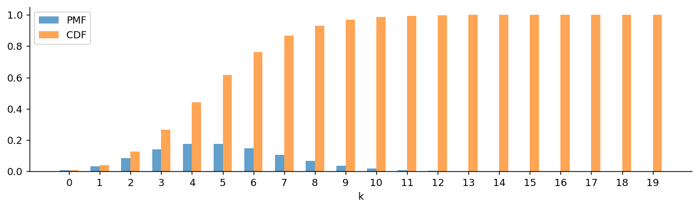
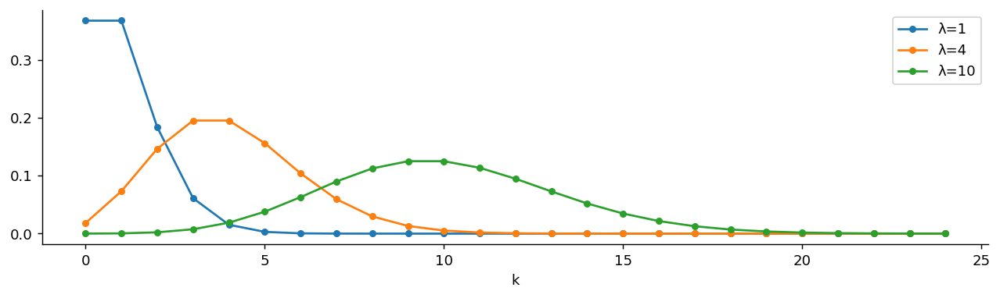
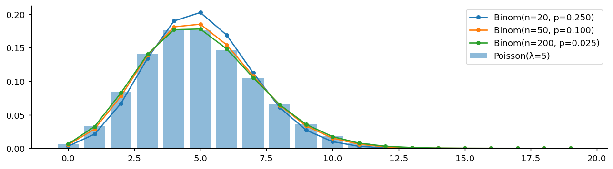

# Poisson 분포

## 개요

**Poisson 분포**는 평균 발생률이 알려져 있을 때 고정된 시간 또는 공간 구간에서 발생하는 사건의 수를 모형화한다. 금융(체결 도착, 부도 건수), 보험(청구 빈도), 대기행렬 이론에서 널리 쓰인다.

---

## 정의

확률변수 $X$가 비율 모수 $\lambda > 0$인 Poisson 분포를 따른다는 것은 다음을 뜻한다:

$$
X \sim \text{Poisson}(\lambda), \qquad P(X = k) = \frac{e^{-\lambda} \lambda^k}{k!}, \quad k = 0, 1, 2, \ldots
$$

모수 $\lambda$는 이 분포의 평균이자 분산이다.

### PMF의 합이 1임을 확인하기

$$
\sum_{k=0}^{\infty} \frac{e^{-\lambda} \lambda^k}{k!} = e^{-\lambda} \sum_{k=0}^{\infty} \frac{\lambda^k}{k!} = e^{-\lambda} \cdot e^{\lambda} = 1
$$

$e^{\lambda}$의 Taylor 전개를 사용했다.

---

## 성질

$$
\begin{aligned}
E[X] &= \lambda \\
\text{Var}(X) &= \lambda \\
\text{SD}(X) &= \sqrt{\lambda}
\end{aligned}
$$

평균과 분산이 같다는 것은 Poisson 분포를 규정하는 특징이며, 진단 점검에 자주 쓰인다.

### 평균의 유도

$$
E[X] = \sum_{k=0}^{\infty} k \cdot \frac{e^{-\lambda}\lambda^k}{k!} = \lambda e^{-\lambda} \sum_{k=1}^{\infty} \frac{\lambda^{k-1}}{(k-1)!} = \lambda e^{-\lambda} \cdot e^{\lambda} = \lambda
$$

### 분산의 유도

먼저 $E[X(X-1)]$을 계산한다:

$$
E[X(X-1)] = \sum_{k=2}^{\infty} k(k-1) \frac{e^{-\lambda}\lambda^k}{k!} = \lambda^2 e^{-\lambda} \sum_{k=2}^{\infty} \frac{\lambda^{k-2}}{(k-2)!} = \lambda^2
$$

그러면:

$$
\text{Var}(X) = E[X^2] - (E[X])^2 = E[X(X-1)] + E[X] - (E[X])^2 = \lambda^2 + \lambda - \lambda^2 = \lambda
$$

---

## Binomial 분포의 극한으로서의 Poisson 분포

Poisson 분포는 $n$이 크고 $p$가 작으며 $\lambda = np$가 일정하게 유지될 때 Binomial 분포의 극한으로 나타난다:

$$
\lim_{n \to \infty} \binom{n}{k} p^k (1-p)^{n-k} = \frac{e^{-\lambda}\lambda^k}{k!} \qquad \text{where } p = \frac{\lambda}{n}
$$

??? proof "증명 개요"


    $p = \lambda/n$으로 두면:

    $$
    \binom{n}{k}\left(\frac{\lambda}{n}\right)^k\left(1 - \frac{\lambda}{n}\right)^{n-k}
    = \frac{n!}{k!(n-k)!} \cdot \frac{\lambda^k}{n^k} \cdot \left(1 - \frac{\lambda}{n}\right)^n \cdot \left(1 - \frac{\lambda}{n}\right)^{-k}
    $$

    $n \to \infty$일 때 $\frac{n!}{(n-k)! \, n^k} \to 1$, $\left(1 - \frac{\lambda}{n}\right)^n \to e^{-\lambda}$, $\left(1 - \frac{\lambda}{n}\right)^{-k} \to 1$이다.

    **경험 법칙:** $n \geq 20$이고 $p \leq 0.05$일 때(더 보수적으로는 $n \geq 100$이고 $np \leq 10$일 때) Poisson 근사를 사용한다.

    ---

## 가법성

$X_1 \sim \text{Poisson}(\lambda_1)$과 $X_2 \sim \text{Poisson}(\lambda_2)$가 독립이면:

$$
X_1 + X_2 \sim \text{Poisson}(\lambda_1 + \lambda_2)
$$

이는 독립인 Poisson 확률변수의 임의의 유한 합으로 확장된다.

---

## Poisson 과정과의 연결

Poisson 분포는 **Poisson 과정**과 밀접하게 연결되어 있다. 사건이 단위시간당 일정한 비율 $\lambda$로 도착하고 도착들이 서로 독립이면, 길이 $t$인 구간에서의 사건 수는 $\text{Poisson}(\lambda t)$를 따르고, 연속한 사건 사이의 시간은 $\text{Exponential}(\lambda)$를 따른다.

---

## 예제

**문제:** 어떤 증권거래소는 시간당 평균 3건의 대량 블록 거래를 처리한다. 특정 한 시간 동안 정확히 5건의 블록 거래가 관측될 확률은? 2건 이하가 관측될 확률은?

**풀이:**

$$
P(X = 5) = \frac{e^{-3} \cdot 3^5}{5!} = \frac{0.0498 \cdot 243}{120} = 0.1008
$$

$$
P(X \leq 2) = \sum_{k=0}^{2} \frac{e^{-3} \cdot 3^k}{k!} = e^{-3}(1 + 3 + 4.5) = 0.0498 \cdot 8.5 = 0.4232
$$

---

## Python: PMF, CDF, 표본추출

### PMF와 CDF

```python
import matplotlib.pyplot as plt
import numpy as np
from scipy import stats

lam = 5            # 단위 시간(구간)당 평균 발생 횟수
# 포아송은 0, 1, 2, ... 로 상한이 없다. 20에서 자른 것은 그 너머의 확률이
# 무시할 만큼 작기 때문이다(lam=5에서 P(X >= 20)은 1e-6 수준).
x = np.arange(0, 20)

fig, ax = plt.subplots(figsize=(12, 3))
ax.bar(x - 0.15, stats.poisson(lam).pmf(x), width=0.3, label='PMF', alpha=0.7)
ax.bar(x + 0.15, stats.poisson(lam).cdf(x), width=0.3, label='CDF', alpha=0.7)
ax.set_xlabel('k')
ax.set_xticks(x)
ax.spines[['top', 'right']].set_visible(False)
ax.legend()
plt.show()
```



### 비율에 따른 비교

```python
import matplotlib.pyplot as plt
import numpy as np
from scipy import stats

fig, ax = plt.subplots(figsize=(12, 3))
# lam 하나가 중심과 퍼짐을 동시에 결정한다.
# 포아송은 평균 = 분산 = lam 이라 모수가 하나뿐이기 때문이다.
# lam이 커질수록 봉우리가 오른쪽으로 가면서 동시에 넓어지고,
# 모양도 점점 대칭인 종 모양(정규분포)에 가까워진다.
for lam in [1, 4, 10]:
    x = np.arange(0, 25)
    ax.plot(x, stats.poisson(lam).pmf(x), 'o-', label=f'λ={lam}', markersize=4)
ax.spines[['top', 'right']].set_visible(False)
ax.set_xlabel('k')
ax.legend()
plt.show()
```



### Binomial 극한으로서의 Poisson 분포

```python
import matplotlib.pyplot as plt
import numpy as np
from scipy import stats

lam = 5
x = np.arange(0, 20)

fig, ax = plt.subplots(figsize=(12, 3))
ax.bar(x, stats.poisson(lam).pmf(x), alpha=0.5, label='Poisson(λ=5)')

# 포아송은 이항분포의 극한이다.
# n을 키우면서 p = lam/n 으로 줄여 **곱 np = lam 을 고정**하면
# 이항분포가 포아송으로 수렴한다.
#   n=20  -> p=0.250
#   n=50  -> p=0.100
#   n=200 -> p=0.025
# "시행이 아주 많고 각각의 성공확률이 아주 작은" 상황이 포아송의 정체다.
for n in [20, 50, 200]:
    ax.plot(x, stats.binom(n, lam/n).pmf(x), 'o-', label=f'Binom(n={n}, p={lam/n:.3f})', markersize=4)
ax.spines[['top', 'right']].set_visible(False)
ax.legend()
plt.show()
```



### 표본추출과 평균–분산 점검

```python
import numpy as np
from scipy import stats

np.random.seed(42)
lam = 7
samples = stats.poisson(lam).rvs(100_000)

# 포아송의 특징: 평균과 분산이 **같다**.
# 실제 계수 자료에서 표본분산이 표본평균보다 뚜렷이 크면
# 포아송 가정이 깨졌다는 신호이며(과산포), 음이항분포 등을 고려해야 한다.

print(f"Theoretical mean: {lam},  Sample mean: {samples.mean():.4f}")
print(f"Theoretical var:  {lam},  Sample var:  {samples.var():.4f}")
print(f"Mean ≈ Var: {np.isclose(samples.mean(), samples.var(), atol=0.1)}")
```

출력:

```
Theoretical mean: 7,  Sample mean: 7.0065
Theoretical var:  7,  Sample var:  7.0213
Mean ≈ Var: True
```

---

## 핵심 요약

- Poisson 분포는 희귀 사건의 발생 횟수를 모형화하며, 비율 모수 $\lambda$가 평균이자 분산이다.
- $n$이 크고 $p$가 작을 때 Binomial 분포의 극한으로 나타난다.
- 가법성 덕분에 독립인 사건 계수들을 합칠 때 자연스럽게 쓰인다.
- Poisson 과정과의 연결은 이산적인 사건 계수와 연속적인 도착 간 시간(Exponential 분포)을 이어 준다.
- 평균과 분산이 같다는 성질은 유용한 진단 도구이다. 표본분산이 평균을 크게 넘어서면 그 자료는 Poisson 모형에 비해 **과대산포**되어 있을 수 있다.

## 연습문제

<div class="drillbox" markdown>

**연습문제 1.**
콜센터에 분당 4건의 전화가 걸려 온다. (a) $N$의 분포는? (b) $P(N = 0)$, $P(N \ge 6)$. (c) $P(2\text{분 동안 10건 초과})$. (d) $P(N \ge 8)$의 정규근사.

</div>

??? success "풀이"
    (a) $N \sim \mathrm{Poisson}(4)$.

    (b) $P(N = 0) = e^{-4} \approx 0.018$. 부분합 $P(N \le 5) \approx 0.785$를 계산하면 $P(N \ge 6) \approx 0.215$.

    (c) 2분 동안에는 가법성에 의해 $N_2 \sim \mathrm{Poisson}(8)$. $P(N_2 > 10) = 1 - P(N_2 \le 10) \approx 0.184$.

    (d) 정규근사: $\mu = 4$, $\sigma = 2$. 연속성 수정을 적용하면 $P(N \ge 8) \approx P(Z \ge (7.5 - 4)/2) = P(Z \ge 1.75) = 0.040$. 정확한 값은 $0.051$이다. $\lambda = 4$에서는 분포가 아직 오른쪽으로 치우쳐 있어 근사가 거칠다. $\lambda \ge 30$이면 정확도가 크게 좋아진다.

<div class="drillbox" markdown>

**연습문제 2.**
Poisson 근사: 500쪽의 책에서 각 쪽이 독립적으로 확률 $p = 0.004$로 오탈자를 포함한다. (a) 정확한 분포는? (b) Poisson 근사의 모수는? (c) Poisson 근사로 $P(X = 0)$, $P(X = 1)$, $P(X \ge 4)$를 구하라.

</div>

??? success "풀이"
    (a) $X \sim \mathrm{Binomial}(500, 0.004)$.

    (b) $\lambda = np = 2$. $n$이 크고 $p$가 작으므로 Poisson 근사가 타당하다.

    (c) $P(X = 0) \approx e^{-2} = 0.135$. $P(X = 1) \approx 2 e^{-2} = 0.271$. $P(X \ge 4) = 1 - e^{-2}(1 + 2 + 2 + 4/3) \approx 0.143$.

    정확한 Binomial 계산은 $P(X = 2) \approx 0.272$를 주는데 Poisson 근사는 $0.271$이다. 소수점 셋째 자리까지 일치하며, 이 영역에서 Poisson 근사가 매우 잘 작동함을 보여 준다.

<div class="drillbox" markdown>

**연습문제 3.**
**도착 간 시간의 무기억성.** 사건이 비율 $\lambda$인 Poisson 과정에 따라 발생하면 도착 간 시간이 비율 $\lambda$인 Exponential 분포를 따름을 증명하라.

</div>

??? success "풀이"
    첫 사건이 일어나는 시각을 $T_1$이라 하자. 사건 $\{T_1 > t\}$는 "$[0, t]$에서 사건이 없다"와 동치이며, 그 확률은 $P(N(t) = 0) = e^{-\lambda t}$이다.

    따라서 $P(T_1 > t) = e^{-\lambda t}$이고, 이는 $\mathrm{Exp}(\lambda)$의 생존함수이다. 그러므로 $T_1 \sim \mathrm{Exp}(\lambda)$이다.

    Poisson 과정의 정상증분 성질에 의해 $k$번째 사건과 $k+1$번째 사건 사이의 시간도 과거와 독립적으로 같은 분포를 따른다. 모든 도착 간 시간은 i.i.d. $\mathrm{Exp}(\lambda)$이다. $\square$

    이 연결 덕분에 Poisson 과정은 "완전히 무작위한" 사건 발생, 즉 과거의 기억 없이 일정한 비율로 도착하는 사건에 대한 표준 모형이 된다.

<div class="drillbox" markdown>

**연습문제 4.**
**합과 중첩.** 비율이 $\lambda_1, \lambda_2$인 독립 Poisson 과정을 중첩한다. 합쳐진 과정이 비율 $\lambda_1 + \lambda_2$인 Poisson 과정임을 보여라.

</div>

??? success "풀이"
    $N_1(t), N_2(t)$를 독립인 Poisson 과정이라 하자. 합쳐진 계수는 $N(t) = N_1(t) + N_2(t)$이다.

    주변분포: Poisson 합 성질에 의해 $N(t) = N_1(t) + N_2(t) \sim \mathrm{Poisson}(\lambda_1 t) + \mathrm{Poisson}(\lambda_2 t) \sim \mathrm{Poisson}((\lambda_1 + \lambda_2) t)$이다.

    합쳐진 도착 간 시간은 비율 $\lambda_1 + \lambda_2$인 Exponential 분포를 따르며(독립인 두 Exponential 확률변수의 최솟값은 비율의 합을 갖는 Exponential 분포이다), 도착들 사이에서 독립성이 유지된다.

    이 성질들을 종합하면 $N$은 비율 $\lambda_1 + \lambda_2$인 Poisson 과정이다. $\square$

    **응용:** 어떤 상점의 고객 도착이 두 유형(온라인과 방문)으로 나뉘고 각각이 Poisson이면, 전체 도착은 두 비율을 합한 Poisson 과정을 이룬다. 이는 여러 Poisson 원천을 하나의 모형으로 합치는 것을 정당화한다.

<div class="drillbox" markdown>

**연습문제 5.**
Poisson 분포에서 **분산이 평균과 같음**을 보여라. $X \sim \mathrm{Poisson}(\lambda)$에 대해 PMF로부터 직접 $\mathbb{E}[X], \mathbb{E}[X^2]$를 계산하라.

</div>

??? success "풀이"
    **평균:**

    $$
    \mathbb{E}[X] = \sum_{k=0}^\infty k \frac{e^{-\lambda} \lambda^k}{k!} = e^{-\lambda} \lambda \sum_{k=1}^\infty \frac{\lambda^{k-1}}{(k-1)!} = \lambda
    $$

    여기서 $\sum_{j=0}^\infty \lambda^j/j! = e^\lambda$를 사용했다.

    **2차 계승적률** $\mathbb{E}[X(X-1)] = \sum k(k-1) P(X=k) = e^{-\lambda} \lambda^2 \sum_{k=2}^\infty \lambda^{k-2}/(k-2)! = \lambda^2$.

    따라서 $\mathbb{E}[X^2] = \mathbb{E}[X(X-1)] + \mathbb{E}[X] = \lambda^2 + \lambda$이다.

    **분산:** $\mathrm{Var}(X) = \mathbb{E}[X^2] - (\mathbb{E}[X])^2 = \lambda^2 + \lambda - \lambda^2 = \lambda$. $\square$

    **구별되는 특징:** 평균 = 분산은 Poisson 분포의 표식이다. 실제 계수 자료에서 분산이 평균보다 크게 나타나면(**과대산포**) Poisson 모형은 부적절하며, 보통 Negative Binomial 모형을 대신 사용한다.

<div class="drillbox" markdown>

**연습문제 6.**
**Poisson 가정에 대한 검정.** 계수 표본 $X_1, \ldots, X_n$이 주어졌을 때, 표본분산과 표본평균의 비를 이용한 간단한 **산포 검정**을 제안하라.

</div>

??? success "풀이"
    $H_0$ 아래에서 $X_i$는 i.i.d. $\mathrm{Poisson}(\lambda)$이고 $\mathrm{Var}(X) = \lambda = \mathbb{E}[X]$이므로, **산포비** $D = s^2/\bar X$는 1에 가까워야 한다.

    검정통계량: $(n - 1) D = (n - 1) s^2 / \bar X$. $H_0$ 아래에서 이는 근사적으로 $\chi^2_{n-1}$을 따른다(**Poisson 산포 검정**이며, 표본평균이 비율에 근사한다는 가정 아래 유도된다).

    **판정 규칙:** $(n - 1)D$가 $\chi^2_{n-1}$의 $\alpha/2$ 분위수와 $1 - \alpha/2$ 분위수 밖에 있으면 Poisson 가정을 기각한다. 구체적으로:

    - $D \gg 1$ (과대산포): 분산이 평균을 넘어선다. Negative Binomial이나 준-Poisson 모형을 대안으로 고려한다.
    - $D \ll 1$ (과소산포): 분산이 평균보다 작다. Conway-Maxwell-Poisson이나 절단분포를 고려한다.

    현대의 계수 자료 분석에서는 Poisson 모형을 아예 건너뛰고 더 유연한 모형(Negative Binomial, 영과잉 Poisson, 허들 모형)을 쓰는 경우가 많다. Poisson 분포는 유연한 적합 도구라기보다 (Poisson 과정에서의) *기본 구성요소*로서 더 유용하다.
