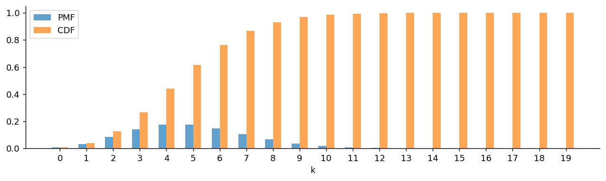
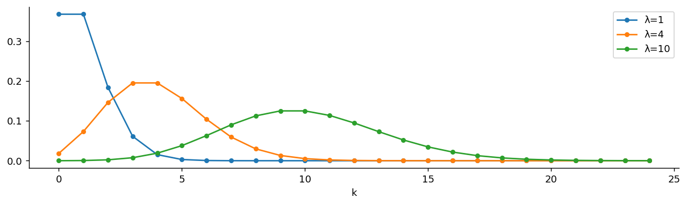
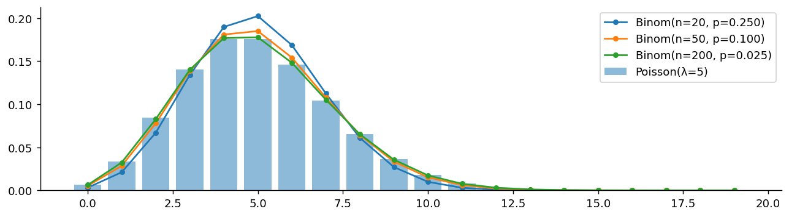
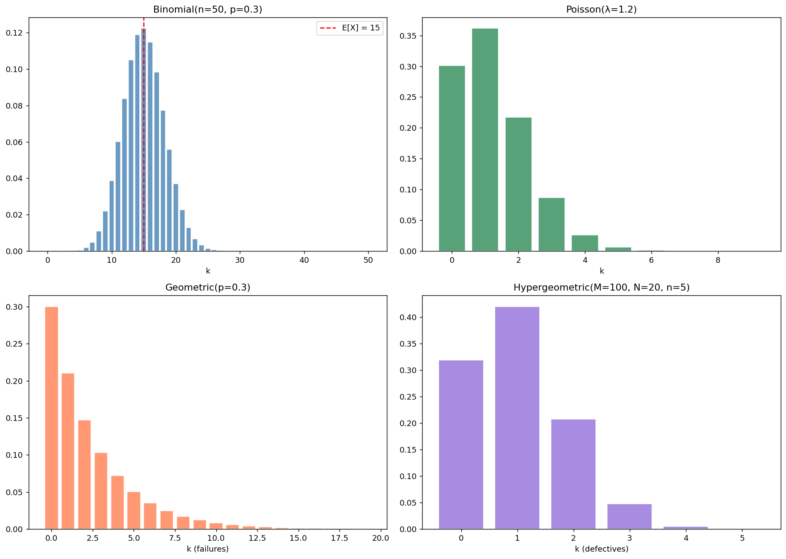

# 포아송분포

## 개요

**포아송분포**는 평균 발생률이 알려져 있을 때 고정된 시간 또는 공간 구간에서 발생하는 사건의 수를 모형화한다. 금융(체결 도착, 부도 건수), 보험(청구 빈도), 대기행렬 이론에서 널리 쓰인다.

4.1절의 이산분포 사슬은 여기서 끝난다.

$$
\text{Bernoulli}(p) \to B(n, p) \to \text{HG}(n, N, M) \to \text{Geo}(p) \to \text{NB}(r, p) \to \text{Poisson}(\lambda)
$$

앞의 다섯 분포는 모두 **시행 횟수라는 상한**을 안고 있었다. 포아송분포는 그 상한을 놓아 버린 극한이다. 시행을 무한히 잘게 쪼개고 각 시행의 성공확률을 그만큼 줄이면, 세는 대상은 "$n$번 중 몇 번"이 아니라 "구간 안에서 몇 번"이 된다.

---

## 1. 포아송분포와 PMF

<div class="defn" markdown>

### 정의 1. 포아송분포 { .dfn }

확률변수 $X$가 비율 모수 $\lambda > 0$인 포아송분포를 따른다는 것은 다음을 뜻한다:

$$
X \sim \text{Poisson}(\lambda), \qquad P(X = k) = \frac{e^{-\lambda} \lambda^k}{k!}, \quad k = 0, 1, 2, \ldots
$$

모수 $\lambda$는 이 분포의 평균이자 분산이다.

</div>

### PMF의 합이 1임을 확인하기

<div class="thmbox" markdown>

### 정리 1. 포아송분포의 PMF 는 확률분포다 { .thm }

$\lambda > 0$ 이면

$$
\sum_{k=0}^{\infty} \frac{e^{-\lambda} \lambda^k}{k!} = 1
$$

이다.

</div>

??? proof "증명"

    $e^{\lambda}$ 의 테일러 급수 $\sum_{k=0}^{\infty} \lambda^k/k! = e^{\lambda}$ 가 모든 실수 $\lambda$ 에서 수렴한다. 상수 $e^{-\lambda}$ 를 합 밖으로 빼면

    $$
    \sum_{k=0}^{\infty} \frac{e^{-\lambda} \lambda^k}{k!} = e^{-\lambda} \sum_{k=0}^{\infty} \frac{\lambda^k}{k!} = e^{-\lambda} \cdot e^{\lambda} = 1
    $$

    이다. $\square$

    **앞의 $e^{-\lambda}$ 는 정규화 상수일 뿐이다.** 분포의 모양을 정하는 것은 $\lambda^k/k!$ 이고, $e^{-\lambda}$ 는 그 합을 1 로 맞추려고 붙은 수다. 어떤 분포의 밀도든 PMF 든 **모양을 보는 부분과 눈금을 맞추는 부분**으로 갈라 읽는 습관이 여기서부터 쓸모가 있다.

<div class="exbox" markdown>

**보기 1.** <span class="diff easy" title="쉬움"></span> 포아송분포의 확률질량함수와 분포함수. $X \sim \text{Poisson}(5)$의 PMF와 CDF를 $k = 0, \ldots, 19$에서 나란히 그린다.

**(1)** PMF를 가장 크게 만드는 $k$, 곧 최빈값을 구하시오. $\lambda$가 정수일 때는 무슨 일이 일어나는가.

**(2)** $k \ge 20$을 잘라 버린 것이 정당한지 꼬리확률로 확인하고, 그림에서 (1)의 답이 읽히는지 보시오.

</div>

??? success "풀이"

    **(1) 해석적으로.** $k$는 **정수**라 미분할 수 없다. 이웃한 두 확률의 비를 본다.

    $$
    \frac{p(k)}{p(k-1)}
    = \frac{e^{-\lambda}\lambda^k / k!}{e^{-\lambda}\lambda^{k-1} / (k-1)!}
    = \frac{\lambda}{k}
    $$

    $e^{-\lambda}$와 $\lambda^{k-1}$, $(k-1)!$이 모두 약분되고 $\lambda/k$ 하나만 남는다. 이 비가 $1$ 이상인 조건은

    $$
    \frac{\lambda}{k} \ge 1 \qquad \Longleftrightarrow \qquad k \le \lambda
    $$

    다. 그리고 $\lambda/k$는 $k$에 대해 **감소**하므로 비가 $1$을 지나는 자리는 단 한 곳이다. 즉 PMF는 $k \le \lambda$까지 오르다가 그 뒤로는 계속 내려가고, 봉우리는 하나다. 따라서

    $$
    \text{최빈값} = \lfloor \lambda \rfloor
    $$

    이다. 비가 주는 문턱 $\lambda$에 **바닥함수가 붙는다**는 것이 요점이고, 그 까닭은 $k$가 정수라는 것 하나다.

    $\lambda$가 정수이면 $k = \lambda$에서 위 부등식이 **등호**가 되어 비가 정확히 $1$, 곧

    $$
    p(\lambda) = p(\lambda - 1)
    $$

    이다. 최빈값이 **둘**이고 둘 중 어느 쪽도 더 그럴듯하지 않다. $\lambda = 5$가 바로 그 경우이므로 최빈값은 $4$와 $5$이고, 공통인 $e^{-5}$를 떼어 내면

    $$
    \frac{5^4}{4!} = \frac{625}{24}, \qquad \frac{5^5}{5!} = \frac{3125}{120} = \frac{625}{24}
    $$

    로 한 치도 다르지 않다. 근삿값이 아니라 **정확한 등식**이다.

    **(2) 수치적으로.** 먼저 쪽의 그림을 그린다.

    ```python
    import matplotlib.pyplot as plt
    import numpy as np
    from scipy import stats

    lam = 5            # 단위 시간(구간)당 평균 발생 횟수
    # 포아송은 0, 1, 2, ... 로 상한이 없다. 20에서 자른 것은 그 너머의 확률이
    # 무시할 만큼 작기 때문이다(lam=5에서 P(X >= 20)은 1e-6 수준).
    x = np.arange(0, 20)

    fig, ax = plt.subplots(figsize=(12, 3))
    ax.bar(x - 0.15, stats.poisson(lam).pmf(x), width=0.3, label='PMF', alpha=0.7)
    ax.bar(x + 0.15, stats.poisson(lam).cdf(x), width=0.3, label='CDF', alpha=0.7)
    ax.set_xlabel('k')
    ax.set_xticks(x)
    ax.spines[['top', 'right']].set_visible(False)
    ax.legend()
    plt.show()
    ```

    

    왼쪽 막대가 $k = 4$와 $k = 5$에서 **같은 높이로 나란히** 서 있고, 그 뒤로는 단조롭게 주저앉는다. CDF 막대는 $k = 12$ 무렵($\text{CDF} = 0.998$)부터 눈으로는 $1$과 구별되지 않는다.

    (1)이 유도한 것을 분수로 확인한다. 이산분포의 좋은 점은 **반올림 없이** 확인할 수 있다는 것이다.

    ```python
    from fractions import Fraction
    from math import factorial
    from scipy import stats

    lam = 5

    # 비 p(k)/p(k-1) = lam/k 를 분수로 적는다. 1 을 넘는 동안 PMF 가 오른다.
    for k in range(1, 8):
        ratio = Fraction(lam, k)
        mark = ">1 (오름)" if ratio > 1 else ("=1 (동점)" if ratio == 1 else "<1 (내림)")
        print(f"p({k})/p({k-1}) = {str(ratio):>5}   {mark}")

    # lam = 5 는 정수라 p(4) 와 p(5) 가 **정확히** 같다. e^{-lam} 은 공통이므로
    # lam^k/k! 만 분수로 비교하면 반올림이 끼어들 틈이 없다.
    a, b = Fraction(lam**4, factorial(4)), Fraction(lam**5, factorial(5))
    print(f"lam^4/4! = {a},  lam^5/5! = {b},  같은가? {a == b}")
    print(f"부동소수점: pmf(4) - pmf(5) = {stats.poisson(lam).pmf(4) - stats.poisson(lam).pmf(5):+.3e}")

    # 20 에서 자른 것이 정당한가.
    print(f"P(X >= 20) = {stats.poisson(lam).sf(19):.3e}")
    ```

    출력:

    ```
    p(1)/p(0) =     5   >1 (오름)
    p(2)/p(1) =   5/2   >1 (오름)
    p(3)/p(2) =   5/3   >1 (오름)
    p(4)/p(3) =   5/4   >1 (오름)
    p(5)/p(4) =     1   =1 (동점)
    p(6)/p(5) =   5/6   <1 (내림)
    p(7)/p(6) =   5/7   <1 (내림)
    lam^4/4! = 625/24,  lam^5/5! = 625/24,  같은가? True
    부동소수점: pmf(4) - pmf(5) = -5.551e-17
    P(X >= 20) = 3.452e-07
    ```

    비가 $k = 5$에서 정확히 $1$을 찍고 돌아선다. 분수로 재면 $p(4)$와 $p(5)$가 같은데, 부동소수점으로는 $5.6 \times 10^{-17}$만큼 어긋난다. **이 어긋남은 수학이 아니라 배정도 실수의 반올림이다.** `pmf` 의 argmax 를 그대로 믿으면 동점을 못 보고 한쪽만 집게 되는데, 여기서 분수를 쓴 이유가 그것이다.

    꼬리는 $P(X \ge 20) = 3.45 \times 10^{-7}$이라 코드 주석의 "1e-6 수준"과 맞는다. 평균 $5$에서 $20$은 $(20-5)/\sqrt5 = 6.7$ 표준편차 밖이니 그림에서 잘라도 좋다.

<div class="exbox" markdown>

**보기 2.** <span class="diff easy" title="쉬움"></span> 비율모수에 따른 포아송 비교. $\lambda = 1, 4, 10$인 세 포아송 PMF를 한 그림에 겹쳐 그린다. $\lambda$가 커질수록 봉우리가 오른쪽으로 가면서 **낮아진다.**

**(1)** 봉우리가 왜 낮아지는지 설명하시오. 최대 PMF 값이 $\lambda$가 커질 때 어떤 크기로 줄어드는가.

**(2)** 세 $\lambda$에서 최빈값과 봉우리 높이를 재어 (1)의 답과 견주시오.

</div>

??? success "풀이"

    **(1) 해석적으로.** 보기 1에서 최빈값은 $\lfloor \lambda \rfloor$였다. $\lambda = 1, 4, 10$은 모두 정수이므로 세 경우 다 **동점**이고 최빈값은 각각 $\{0,1\}$, $\{3,4\}$, $\{9,10\}$이다. 봉우리가 오른쪽으로 가는 것은 이것으로 설명된다.

    낮아지는 까닭은 **분포가 퍼지는데 총합은 늘 $1$**이라는 데 있다. 표준편차가 $\sqrt{\lambda}$로 커지므로 확률이 실질적으로 올라앉는 구간의 폭이 $\sqrt{\lambda}$에 비례해 늘어난다. 넓이 $1$을 폭 $\sqrt{\lambda}$에 나누어 담으면 높이는 $1/\sqrt{\lambda}$ 꼴로 줄어야 한다.

    상수까지 적어 보자. 최빈값 $k = \lambda$($\lambda$가 정수)에서의 확률에 스털링 근사 $\lambda! \approx \sqrt{2\pi\lambda}\,\lambda^{\lambda}e^{-\lambda}$를 넣으면

    $$
    p(\lambda) = \frac{e^{-\lambda}\lambda^{\lambda}}{\lambda!}
    \approx \frac{e^{-\lambda}\lambda^{\lambda}}{\sqrt{2\pi\lambda}\,\lambda^{\lambda}e^{-\lambda}}
    = \frac{1}{\sqrt{2\pi\lambda}}
    $$

    이다. $\lambda^{\lambda}$와 $e^{-\lambda}$가 깨끗이 약분되고 스털링의 $\sqrt{2\pi\lambda}$만 남는다. **봉우리 높이는 $\lambda^{-1/2}$로 줄어든다.** $\lambda$를 $1 \to 4 \to 10$으로 키우면 높이는 대략 $1 \to 1/2 \to 1/\sqrt{10}$ 배가 된다.

    이 식은 $N(\lambda, \lambda)$ 밀도의 봉우리 높이 $1/\sqrt{2\pi\lambda}$와 **똑같다.** $\lambda$가 커질 때 포아송이 정규분포에 가까워진다는 것이 봉우리 한 점에서 미리 비친 셈이다. 다만 스털링은 큰 $\lambda$에서만 정확하므로 $\lambda = 1$에서는 어긋남이 꽤 클 것이다.

    **(2) 수치적으로.** 먼저 쪽의 그림을 그린다.

    ```python
    import matplotlib.pyplot as plt
    import numpy as np
    from scipy import stats

    fig, ax = plt.subplots(figsize=(12, 3))
    # lam 하나가 중심과 퍼짐을 동시에 결정한다.
    # 포아송은 평균 = 분산 = lam 이라 모수가 하나뿐이기 때문이다.
    # lam이 커질수록 봉우리가 오른쪽으로 가면서 동시에 넓어지고,
    # 모양도 점점 대칭인 종 모양(정규분포)에 가까워진다.
    for lam in [1, 4, 10]:
        x = np.arange(0, 25)
        ax.plot(x, stats.poisson(lam).pmf(x), 'o-', label=f'λ={lam}', markersize=4)
    ax.spines[['top', 'right']].set_visible(False)
    ax.set_xlabel('k')
    ax.legend()
    plt.show()
    ```

    

    세 곡선이 각각 어디서 가장 높은지, 그 높이가 $1/\sqrt{2\pi\lambda}$와 얼마나 맞는지 잰다.

    ```python
    import numpy as np
    from fractions import Fraction
    from math import factorial, pi, sqrt
    from scipy import stats

    for lam in (1, 4, 10):
        pmf = stats.poisson(lam).pmf(np.arange(0, 60))
        modes = np.flatnonzero(pmf == pmf.max())
        # lam 이 정수이면 lam^lam/lam! = lam^(lam-1)/(lam-1)! 이라 동점이다.
        tie = Fraction(lam**lam, factorial(lam)) == Fraction(lam**(lam - 1), factorial(lam - 1))
        approx = 1 / sqrt(2 * pi * lam)
        print(f"lam={lam:2d}:  최빈값 {modes}  (동점이 정확한가? {tie})   SD = {sqrt(lam):.4f}")
        print(f"        봉우리 {pmf.max():.6f}  vs  1/sqrt(2*pi*lam) = {approx:.6f}"
              f"   상대오차 {(pmf.max() - approx) / approx * 100:+.2f}%")
    ```

    출력:

    ```
    lam= 1:  최빈값 [0 1]  (동점이 정확한가? True)   SD = 1.0000
            봉우리 0.367879  vs  1/sqrt(2*pi*lam) = 0.398942   상대오차 -7.79%
    lam= 4:  최빈값 [3 4]  (동점이 정확한가? True)   SD = 2.0000
            봉우리 0.195367  vs  1/sqrt(2*pi*lam) = 0.199471   상대오차 -2.06%
    lam=10:  최빈값 [ 9 10]  (동점이 정확한가? True)   SD = 3.1623
            봉우리 0.125110  vs  1/sqrt(2*pi*lam) = 0.126157   상대오차 -0.83%
    ```

    최빈값은 세 경우 모두 예측대로 동점이고, 분수로 재어도 정확히 같다. $\lambda = 1$에서 두 최빈값은 $p(0) = p(1) = e^{-1} = 0.3679$이다.

    봉우리 높이도 $1/\sqrt{2\pi\lambda}$와 맞는데, **맞는 정도가 $\lambda$에 따라 달라진다.** $\lambda = 1$에서 $-7.8\%$, $\lambda = 4$에서 $-2.1\%$, $\lambda = 10$에서 $-0.8\%$다. 오차가 $\lambda$에 **반비례**해 줄어드는데, 스털링 근사의 상대오차가 $1/(12\lambda)$ 꼴이라는 것과 들어맞는다. $\lambda = 4$이면 $1/48 = 2.08\%$이고 표의 값은 $2.06\%$, $\lambda = 10$이면 $1/120 = 0.83\%$이고 표의 값도 $0.83\%$다. **근사가 어긋나는 쪽으로도 예측이 맞는다**는 것이 확인의 요점이다.

    높이가 늘 $1/\sqrt{2\pi\lambda}$보다 **작다**는 것도 우연이 아니다. 스털링 근사는 $\lambda!$를 아래로 잡으므로($\lambda! > \sqrt{2\pi\lambda}\lambda^\lambda e^{-\lambda}$) 그것으로 나눈 $p(\lambda)$는 위로 잡히게 된다.

<div class="probox" markdown>

**문제 1.** <span class="diff easy" title="쉬움"></span> 어떤 증권거래소는 시간당 평균 3건의 대량 블록 거래를 처리한다. 특정 한 시간 동안 정확히 5건의 블록 거래가 관측될 확률은? 2건 이하가 관측될 확률은?

</div>

??? success "풀이"

    $$
    P(X = 5) = \frac{e^{-3} \cdot 3^5}{5!} = \frac{0.0498 \cdot 243}{120} = 0.1008
    $$

    $$
    P(X \leq 2) = \sum_{k=0}^{2} \frac{e^{-3} \cdot 3^k}{k!} = e^{-3}(1 + 3 + 4.5) = 0.0498 \cdot 8.5 = 0.4232
    $$

---

## 2. 성질

<div class="thmbox" markdown>

### 정리 2. 포아송분포의 평균과 분산 { .thm }

$X \sim \text{Poisson}(\lambda)$ 이면

$$
E[X] = \lambda, \qquad \operatorname{Var}(X) = \lambda, \qquad \operatorname{SD}(X) = \sqrt{\lambda}
$$

이다. **평균과 분산이 같다.**

</div>

??? proof "증명"

    두 계산 모두 **계승을 깎아 테일러 급수를 되살리는 것**이 요령이다.

    **평균.** $k/k! = 1/(k-1)!$ 이므로 $k = 0$ 인 항이 사라지고 지수가 하나 내려간다.

    $$
    E[X] = \sum_{k=0}^{\infty} k \cdot \frac{e^{-\lambda}\lambda^k}{k!} = \lambda e^{-\lambda} \sum_{k=1}^{\infty} \frac{\lambda^{k-1}}{(k-1)!} = \lambda e^{-\lambda} \cdot e^{\lambda} = \lambda
    $$

    남은 합이 다시 $e^{\lambda}$ 라 정규화 상수와 약분된다.

    **분산.** $E[X^2]$ 을 직접 구하지 않고 **하강계승적률** $E[X(X-1)]$ 을 구한다. $k(k-1)/k! = 1/(k-2)!$ 로 계승을 두 번 깎을 수 있기 때문이다.

    $$
    E[X(X-1)] = \sum_{k=2}^{\infty} k(k-1) \frac{e^{-\lambda}\lambda^k}{k!} = \lambda^2 e^{-\lambda} \sum_{k=2}^{\infty} \frac{\lambda^{k-2}}{(k-2)!} = \lambda^2
    $$

    $X^2 = X(X-1) + X$ 이므로

    $$
    \operatorname{Var}(X) = E[X(X-1)] + E[X] - (E[X])^2 = \lambda^2 + \lambda - \lambda^2 = \lambda
    $$

    이다. $\square$

    **$\lambda^2$ 이 지워지는 것이 포아송의 성격을 만든다.** 이항분포에서는 $n(n-1)p^2$ 과 $n^2p^2$ 가 완전히 지워지지 않고 $-np^2$ 이 남아 분산이 평균보다 작았다. 포아송은 그 남는 항마저 없어 분산이 평균과 같아진다. 평균과 분산이 같다는 것은 포아송분포를 규정하는 특징이며, 진단 점검에 자주 쓰인다.

<div class="exbox" markdown>

**보기 3.** <span class="diff easy" title="쉬움"></span> 포아송의 평균과 분산이 같음을 확인. $\text{Poisson}(7)$에서 $n = 10^5$개를 뽑아 표본평균과 표본분산을 잰다.

**(1)** 표본평균과 표본분산이 각각 얼마나 흔들리는지, 곧 두 표준오차를 구하시오. 분산 쪽에는 포아송의 4차 중심적률이 필요하다.

**(2)** 코드가 준 두 값이 (1)의 표준오차로 재어 몇 배 안에 들어오는지 확인하시오. 코드의 `atol=0.1`은 적절한 허용폭인가.

</div>

??? success "풀이"

    **(1) 해석적으로.** 평균 쪽은 쉽다. $\text{Var}(X) = \lambda$이므로

    $$
    \text{SE}(\bar X) = \frac{\text{SD}(X)}{\sqrt n} = \sqrt{\frac{\lambda}{n}}
    = \sqrt{\frac{7}{10^5}} = 0.008367
    $$

    이다. 분산 쪽은 표본분산의 분산을 알아야 하고, 큰 $n$에서 그것은

    $$
    \text{Var}(S^2) \approx \frac{\mu_4 - \sigma^4}{n}, \qquad
    \mu_4 = E\big[(X-\lambda)^4\big]
    $$

    이다. 포아송의 4차 중심적률을 계승적률로 구한다. $E[X]=\lambda$, $E[X(X-1)]=\lambda^2$, $E[X(X-1)(X-2)]=\lambda^3$, $E[X(X-1)(X-2)(X-3)]=\lambda^4$임은 본문의 평균 유도와 같은 계산을 반복하면 나온다. 이것을 모으면

    $$
    \mu_4 = 3\lambda^2 + \lambda
    $$

    이다. 따라서 $\sigma^4 = \lambda^2$를 빼면

    $$
    \text{Var}(S^2) \approx \frac{3\lambda^2 + \lambda - \lambda^2}{n} = \frac{2\lambda^2 + \lambda}{n},
    \qquad
    \text{SE}(S^2) = \sqrt{\frac{2\lambda^2 + \lambda}{n}}
    $$

    이고 $\lambda = 7$, $n = 10^5$에서

    $$
    \text{SE}(S^2) = \sqrt{\frac{2 \cdot 49 + 7}{10^5}} = \sqrt{1.05 \times 10^{-3}} = 0.03240
    $$

    이다. **분산이 평균보다 네 배 가까이 더 흔들린다.** 분산은 제곱을 평균하므로 꼬리의 큰 값에 훨씬 민감하고, 그 비는 $\sqrt{(2\lambda^2+\lambda)/\lambda} = \sqrt{2\lambda+1}$이라 $\lambda$가 커지면 더 벌어진다.

    **(2) 수치적으로.** 먼저 쪽의 코드를 그대로 돌린다.

    ```python
    import numpy as np
    from scipy import stats

    np.random.seed(42)
    lam = 7
    samples = stats.poisson(lam).rvs(100_000)

    # 포아송의 특징: 평균과 분산이 **같다**.
    # 실제 계수 자료에서 표본분산이 표본평균보다 뚜렷이 크면
    # 포아송 가정이 깨졌다는 신호이며(과산포), 음이항분포 등을 고려해야 한다.

    print(f"Theoretical mean: {lam},  Sample mean: {samples.mean():.4f}")
    print(f"Theoretical var:  {lam},  Sample var:  {samples.var():.4f}")
    print(f"Mean ≈ Var: {np.isclose(samples.mean(), samples.var(), atol=0.1)}")
    ```

    출력:

    ```
    Theoretical mean: 7,  Sample mean: 7.0065
    Theoretical var:  7,  Sample var:  7.0213
    Mean ≈ Var: True
    ```

    이 두 값이 "가깝다"고 말할 자격이 있는지 (1)의 표준오차로 재 본다.

    ```python
    import numpy as np
    from math import sqrt
    from scipy import stats

    lam, n = 7, 100_000
    np.random.seed(42)
    samples = stats.poisson(lam).rvs(n)

    # 포아송의 4차 중심적률이 정말 3*lam^2 + lam 인지 먼저 확인한다.
    k = np.arange(0, 200)
    mu4 = (((k - lam) ** 4) * stats.poisson(lam).pmf(k)).sum()
    print(f"mu4 = {mu4:.4f},   3*lam^2 + lam = {3 * lam**2 + lam}")

    se_mean = sqrt(lam / n)                      # SD(X)/sqrt(n) = sqrt(lam/n)
    se_var = sqrt((2 * lam**2 + lam) / n)        # (mu4 - sigma^4)/n = (2 lam^2 + lam)/n

    for name, value, se in (("표본평균", samples.mean(), se_mean),
                            ("표본분산", samples.var(), se_var)):
        print(f"{name} {value:.4f}   이론값 {lam}   SE {se:.4f}   z = {(value - lam) / se:+.3f}")

    print(f"산포비 s^2/xbar = {samples.var() / samples.mean():.4f}   (SE 약 {se_var / lam:.4f})")
    ```

    출력:

    ```
    mu4 = 154.0000,   3*lam^2 + lam = 154
    표본평균 7.0065   이론값 7   SE 0.0084   z = +0.771
    표본분산 7.0213   이론값 7   SE 0.0324   z = +0.658
    산포비 s^2/xbar = 1.0021   (SE 약 0.0046)
    ```

    4차 중심적률이 $154$로 유도한 $3\lambda^2 + \lambda = 147 + 7 = 154$와 정확히 맞고, 표준오차도 유도한 $0.008367$과 $0.03240$을 그대로 재현한다. 두 표본값은 각각 $+0.77$ SE, $+0.66$ SE 떨어져 있으니 **몬테카를로 오차 범위 안**이다. 이상적인 어긋남이 아니라 있어야 할 만큼의 어긋남이다.

    **`atol=0.1`은 느슨하다.** 분산의 SE가 $0.032$이니 $0.1$은 약 $3$ SE에 해당한다. 포아송이 맞을 때 통과하기는 하지만, 평균이 $7$인데 분산이 $7.09$인 자료(산포비 $1.013$)도 통과시킨다. 산포 자체를 판정하려면 절대 허용폭 대신 **산포비** $s^2/\bar x$를 쓰고 그 표준오차 $\text{SE}(S^2)/\lambda \approx \sqrt{(2\lambda+1)/(n\lambda)} = 0.0046$으로 재는 것이 옳다. 관측된 $1.0021$은 $0.46$ SE이므로 역시 문제가 없다. 연습문제 7의 산포 검정이 이 생각을 $\chi^2$ 분포로 정식화한 것이다.

---

## 3. 이항분포의 극한으로서의 포아송분포

포아송분포는 $n$이 크고 $p$가 작으며 $\lambda = np$가 일정하게 유지될 때 이항분포의 극한으로 나타난다.

<div class="thmbox" markdown>

### 정리 3. 이항분포의 포아송 극한 { .thm }

$p = \lambda/n$으로 두면 각 $k = 0, 1, 2, \ldots$에 대해

$$
\lim_{n \to \infty} \binom{n}{k} p^k (1-p)^{n-k} = \frac{e^{-\lambda}\lambda^k}{k!}
$$

이다.

</div>

??? proof "증명 개요"

    $p = \lambda/n$으로 두면:

    $$
    \binom{n}{k}\left(\frac{\lambda}{n}\right)^k\left(1 - \frac{\lambda}{n}\right)^{n-k}
    = \frac{n!}{k!(n-k)!} \cdot \frac{\lambda^k}{n^k} \cdot \left(1 - \frac{\lambda}{n}\right)^n \cdot \left(1 - \frac{\lambda}{n}\right)^{-k}
    $$

    $n \to \infty$일 때 $\frac{n!}{(n-k)! \, n^k} \to 1$, $\left(1 - \frac{\lambda}{n}\right)^n \to e^{-\lambda}$, $\left(1 - \frac{\lambda}{n}\right)^{-k} \to 1$이다.

    **경험 법칙:** $n \geq 20$이고 $p \leq 0.05$일 때(더 보수적으로는 $n \geq 100$이고 $np \leq 10$일 때) 포아송 근사를 사용한다.

<div class="exbox" markdown>

**보기 4.** <span class="diff easy" title="쉬움"></span> 이항분포의 극한으로서의 포아송. $\lambda = 5$를 고정하고 $n = 20, 50, 200$에 대해 $B(n, \lambda/n)$의 PMF를 $\text{Poisson}(5)$ 위에 겹쳐 그린다.

**(1)** $k$를 고정하고 $n \to \infty$일 때 $B(n, \lambda/n)$의 PMF가 포아송 PMF로 간다는 것을 보이고, $k = 0$에서 **수렴 속도**가 어떤 꼴인지 구하시오.

**(2)** 세 $n$에서 두 PMF의 최대 차이를 재어 (1)이 예측한 속도와 견주시오.

</div>

??? success "풀이"

    **(1) 해석적으로.** $p = \lambda/n$으로 두고 이항 PMF를 세 덩어리로 쪼갠다.

    $$
    \binom{n}{k}\left(\frac{\lambda}{n}\right)^k\left(1 - \frac{\lambda}{n}\right)^{n-k}
    = \underbrace{\frac{n!}{(n-k)!\,n^k}}_{A_n}
    \cdot \frac{\lambda^k}{k!}
    \cdot \underbrace{\left(1 - \frac{\lambda}{n}\right)^{n}}_{B_n}
    \cdot \underbrace{\left(1 - \frac{\lambda}{n}\right)^{-k}}_{C_n}
    $$

    $k$가 고정이면 세 덩어리의 극한이 모두 쉽다. $A_n = \frac{n}{n}\cdot\frac{n-1}{n}\cdots\frac{n-k+1}{n}$은 $1$에 가까운 인수 $k$개의 곱이므로 $A_n \to 1$이고, $\log B_n = n\log(1 - \lambda/n) \to -\lambda$이므로 $B_n \to e^{-\lambda}$이며, $C_n \to 1$이다. 셋을 합쳐

    $$
    \lim_{n\to\infty} P(B = k) = \frac{e^{-\lambda}\lambda^k}{k!}
    $$

    를 얻는다.

    **속도는 $k = 0$에서 깨끗하게 읽힌다.** 그 자리에서는 $A_n = C_n = 1$이라 $B_n$만 남고

    $$
    \log \frac{P(B=0)}{P(\text{Poisson}=0)}
    = n\log\!\left(1 - \frac{\lambda}{n}\right) + \lambda
    = n\left(-\frac{\lambda}{n} - \frac{\lambda^2}{2n^2} - \frac{\lambda^3}{3n^3} - \cdots\right) + \lambda
    = -\frac{\lambda^2}{2n} - O\!\left(\frac{1}{n^2}\right)
    $$

    이다($\log(1-u) = -u - u^2/2 - u^3/3 - \cdots$를 썼다). 곧

    $$
    \frac{P(B=0)}{P(\text{Poisson}=0)} \approx \exp\!\left(-\frac{\lambda^2}{2n}\right) \approx 1 - \frac{\lambda^2}{2n}
    $$

    이다. **오차는 $1/n$에 비례한다.** $n$을 10배로 하면 오차가 대략 10분의 1이 된다는 뜻이고, 이것이 $p$를 줄이는 쪽이 아니라 $n$을 키우는 쪽이 중요한 이유다. 로그가 항상 음수이므로 이항은 포아송보다 $k = 0$을 **덜** 자주 내놓는다.

    여기서 $\lambda^2/(2n)$이 작아야 근사가 쓸 만하다는 조건이 나온다. $\lambda = 5$, $n = 20$이면 $\lambda^2/(2n) = 0.625$로 작지 않으니 $n = 20$은 아직 거친 근사일 것이다.

    **(2) 수치적으로.** 먼저 쪽의 그림을 그린다.

    ```python
    import matplotlib.pyplot as plt
    import numpy as np
    from scipy import stats

    plt.rcParams["font.sans-serif"] = ["NanumGothic", "Apple SD Gothic Neo", "Malgun Gothic"]
    plt.rcParams["font.family"] = "sans-serif"
    plt.rcParams["axes.unicode_minus"] = False

    lam = 5
    x = np.arange(0, 20)

    fig, ax = plt.subplots(figsize=(12, 3))
    ax.bar(x, stats.poisson(lam).pmf(x), alpha=0.5, label='Poisson(λ=5)')

    # 포아송은 이항분포의 극한이다.
    # n을 키우면서 p = lam/n 으로 줄여 **곱 np = lam 을 고정**하면
    # 이항분포가 포아송으로 수렴한다.
    #   n=20  -> p=0.250
    #   n=50  -> p=0.100
    #   n=200 -> p=0.025
    # "시행이 아주 많고 각각의 성공확률이 아주 작은" 상황이 포아송의 정체다.
    for n in [20, 50, 200]:
        ax.plot(x, stats.binom(n, lam/n).pmf(x), 'o-', label=f'Binom(n={n}, p={lam/n:.3f})', markersize=4)
    ax.spines[['top', 'right']].set_visible(False)
    ax.legend()
    plt.show()
    ```

    

    $n = 20$ 곡선은 봉우리가 포아송보다 눈에 띄게 높고 좁은데, $B(20, 0.25)$의 분산이 $20 \cdot 0.25 \cdot 0.75 = 3.75$로 포아송의 $5$보다 작기 때문이다. $n = 200$ 곡선은 막대와 거의 겹친다.

    오차를 수로 재고, $n$을 10배 키운 $n = 2000$까지 덧붙여 속도를 본다.

    ```python
    import numpy as np
    from math import exp
    from scipy import stats

    lam = 5
    ks = np.arange(0, 60)
    pois = stats.poisson(lam).pmf(ks)

    print(f"{'n':>6}{'max|차이|':>13}{'n x max':>10}{'P(B=0)/P(Poi=0)':>18}{'exp(-lam^2/2n)':>17}")
    for n in (20, 50, 200, 2000):
        binom = stats.binom(n, lam / n).pmf(ks)
        d = np.abs(binom - pois)
        print(f"{n:>6}{d.max():>13.3e}{n * d.max():>10.4f}"
              f"{(1 - lam / n)**n / exp(-lam):>18.6f}{exp(-lam**2 / (2 * n)):>17.6f}")
    ```

    출력:

    ```
         n      max|차이|   n x max   P(B=0)/P(Poi=0)   exp(-lam^2/2n)
        20    2.686e-02    0.5373          0.470650         0.535261
        50    9.457e-03    0.4729          0.764888         0.778801
       200    2.233e-03    0.4467          0.938416         0.939413
      2000    2.197e-04    0.4395          0.993759         0.993769
    ```

    두 예측이 모두 맞는다.

    **속도.** `n × max|차이|` 열이 $0.54 \to 0.47 \to 0.45 \to 0.44$로 거의 상수에 눕는다. 최대 차이가 $1/n$에 비례한다는 뜻이다. 실제로 $n$을 $200$에서 $2000$으로 10배 키우면 오차가 $2.23 \times 10^{-3}$에서 $2.20 \times 10^{-4}$로 정확히 10분의 1이 되었다.

    **$k = 0$의 비.** $n = 2000$에서 실제 비 $0.993759$와 근사 $\exp(-\lambda^2/2n) = 0.993769$가 소수점 다섯째 자리까지 맞는다. $n = 200$에서도 $0.9384$ 대 $0.9394$로 맞지만, $n = 20$에서는 $0.4707$ 대 $0.5353$으로 꽤 벌어진다. **(1)에서 $\lambda^2/(2n) = 0.625$가 작지 않다고 미리 말해 둔 그 경우다.** 버린 $O(1/n^2)$ 항이 일하기 시작한 것이고, 근사가 어긋나는 자리까지 유도가 맞힌 셈이다.

    모든 $n$에서 비가 $1$보다 작다는 것도 유도와 같다. 이항은 "$0$번 성공"을 포아송보다 드물게 낸다.

---

## 4. 포아송분포로 모이는 세 갈래

이항분포만 포아송분포로 가는 것이 아니다. 4.1절에서 본 분포들이 모두 조건만 맞으면 같은 자리에 모인다.

| 출발점 | 조건 | 도착점 |
|---|---|---|
| $B(n, p)$ | $n \to \infty$, $p \to 0$, $np \to \lambda$ | $\text{Poisson}(\lambda)$ |
| $\text{HG}(n, N, M)$ | $M, n, N \to \infty$, $nN/M \to \lambda$ | $\text{Poisson}(\lambda)$ |
| $\text{NB}(r, p)$ | $r \to \infty$, $p \to 1$, $r(1-p)/p \to \lambda$ | $\text{Poisson}(\lambda)$ |

초기하분포가 포아송분포로 가는 길은 두 극한을 이어 붙인 것이다. 모집단이 커지면 비복원과 복원의 차이가 사라져 이항분포가 되고, 거기서 다시 희귀사건 극한을 타면 포아송분포가 된다.

세 줄에 공통된 것은 **"기회는 아주 많고 각 기회의 확률은 아주 작은데 그 곱이 적당하다"**는 구조다. 출발점이 무엇이든 이 구조에 놓이면 같은 분포가 나온다. 3.5절에서 본 중심극한정리가 "독립인 것을 많이 더하면 정규분포"라는 보편성을 말하듯, 이것은 "드문 것을 많이 세면 포아송"이라는 보편성이다.

---

## 5. 가법성

<div class="thmbox" markdown>

### 정리 4. 포아송분포의 가법성 { .thm }

$X_1 \sim \text{Poisson}(\lambda_1)$ 과 $X_2 \sim \text{Poisson}(\lambda_2)$ 가 독립이면

$$
X_1 + X_2 \sim \text{Poisson}(\lambda_1 + \lambda_2)
$$

이다. 독립인 포아송 확률변수의 임의의 유한 합으로 확장된다.

</div>

??? proof "증명"

    **적률생성함수로.** 포아송의 MGF 는 $M(t) = \exp\bigl(\lambda(e^t - 1)\bigr)$ 이다. 독립이면 MGF 가 곱해지므로

    $$
    M_{X_1+X_2}(t) = e^{\lambda_1(e^t-1)}\,e^{\lambda_2(e^t-1)} = e^{(\lambda_1+\lambda_2)(e^t-1)}
    $$

    이고 이것이 모수 $\lambda_1 + \lambda_2$ 인 포아송의 MGF 다. MGF 가 0 의 근방에서 유한하면 분포를 하나로 결정하므로 합의 분포가 정해진다.

    **직접 더해도 같다.** $X_1 + X_2 = m$ 이 되는 길을 $X_1 = k$ 로 나누어 센다.

    $$
    P(X_1 + X_2 = m) = \sum_{k=0}^{m} \frac{e^{-\lambda_1}\lambda_1^{k}}{k!}\cdot\frac{e^{-\lambda_2}\lambda_2^{m-k}}{(m-k)!}
    = \frac{e^{-(\lambda_1+\lambda_2)}}{m!}\sum_{k=0}^{m}\binom{m}{k}\lambda_1^{k}\lambda_2^{m-k}
    $$

    $1/(k!(m-k)!) = \binom{m}{k}/m!$ 로 고쳐 쓴 것이다. 남은 합은 이항정리로 $(\lambda_1+\lambda_2)^m$ 이므로

    $$
    P(X_1+X_2 = m) = \frac{e^{-(\lambda_1+\lambda_2)}(\lambda_1+\lambda_2)^m}{m!}
    $$

    다. $\square$

    **포아송 과정의 구간을 이어 붙이는 것**이 이 정리의 뜻이다. 두 시간 구간에서 센 사건 수를 더하면 이어 붙인 구간에서 센 것과 같다. 비율 $\lambda$ 가 더해지는 까닭은 구간의 길이가 더해지기 때문이다.

---

## 6. 포아송 과정과의 연결

포아송분포는 **포아송 과정**과 밀접하게 연결되어 있다. 사건이 단위시간당 일정한 비율 $\lambda$로 도착하고 도착들이 서로 독립이면, 길이 $t$인 구간에서의 사건 수는 $\text{Poisson}(\lambda t)$를 따르고, 연속한 사건 사이의 시간은 $\text{Exponential}(\lambda)$를 따른다.

---


---

## 7. 사슬을 닫으며: 네 이산분포 한눈에

4.1절에서 다룬 분포들을 나란히 놓고 보면, 서로 다른 것은 모양이 아니라 **무엇을 세는가**임이 드러난다. 고르는 기준은 "무엇이 고정되어 있고 무엇이 확률변수인가"다.

| 분포 | 무엇을 세는가 | 고정된 것 |
|---|---|---|
| 이항 | 시행 $n$ 번의 성공 횟수 | 시행 수 $n$, 확률 $p$ |
| 포아송 | 일정 구간의 사건 수 | 평균 발생률 $\lambda$ |
| 기하 | 첫 성공까지의 시행 수 | 확률 $p$ |
| 초기하 | 비복원 추출에서의 성공 수 | 모집단 구성과 뽑는 수 |

- **이항과 초기하의 갈림길은 복원 여부다.** 모집단이 뽑는 수보다 훨씬 크면($n/M\le0.05$) 초기하가 이항에 가까워지므로 실무에서는 이항으로 근사한다.
- **이항과 포아송.** $n$ 이 크고 $p$ 가 작으며 $np=\lambda$ 가 중간 정도면 이항이 포아송으로 간다. 드문 사건을 셀 때 포아송이 등장하는 이유다.
- **기하분포의 무기억성.** 지금까지 실패했다는 사실이 앞으로 몇 번 더 해야 하는지에 아무 정보도 주지 않는다. 연속형 대응물이 지수분포다.
- **평균과 분산의 관계가 분포를 식별해 준다.** 이항은 분산이 평균보다 작고($np(1-p)<np$), 포아송은 같으며, 자료에서 분산이 평균보다 크면(과산포) 음이항 같은 다른 모형이 필요하다.

<div class="exbox" markdown>

**보기 5.** <span class="diff easy" title="쉬움"></span> 네 이산분포 한눈에 보기. $B(50, 0.3)$, $\text{Poisson}(1.2)$, $\text{Geo}(0.3)$(실패 횟수), $\text{HG}(5, 20, 100)$의 PMF를 $2 \times 2$ 격자에 그린다.

**(1)** 네 분포를 그려 보고, 그림에서 무엇을 읽어 낼 수 있는지 말하시오. 특히 위 표의 분산/평균 비를 네 모수 조합에서 구하시오.

**(2)** 이 그림이 **가리는 것**은 무엇인가.

</div>

??? success "풀이"

    **(1) 무엇을 읽는가.** 이 보기에는 유도할 답이 없다. 네 분포를 나란히 놓고 **무엇을 세는지가 다르다**는 것을 보이는 그림이고, 거기서 읽어 낼 것을 수와 함께 적는 것이 이 보기의 몫이다.

    먼저 그림을 그린다.

    ```python
    import matplotlib.pyplot as plt
    import numpy as np
    from scipy import stats

    n, p = 50, 0.3                      # 이항: 시행 50번, 성공확률 0.3
    k_vals = np.arange(0, n + 1)
    pmf = stats.binom.pmf(k_vals, n, p)
    lam = 1.2                           # 포아송: 평균 1.2건
    pop, succ, draw = 100, 20, 5        # 초기하: 모집단 100, 성공 20, 추출 5

    # 네 이산분포를 2x2 격자에 나란히 놓는다.
    # 서로 어떻게 다른지가 아니라 **무엇을 세는지가** 다르다는 데 주목하라.
    #   Binomial      : 시행 수를 정해 놓고 성공 횟수를 센다 (복원추출)
    #   Poisson       : 정해진 구간에서 사건 발생 횟수를 센다 (상한 없음)
    #   Geometric     : 첫 성공까지 걸린 시행 수를 센다
    #   Hypergeometric: 유한 모집단에서 비복원추출했을 때의 성공 횟수
    fig, axes = plt.subplots(2, 2, figsize=(14, 10))

    axes[0, 0].bar(k_vals, pmf, color="steelblue", edgecolor="white", alpha=0.8)
    axes[0, 0].axvline(n * p, color="red", linestyle="--", label=f"E[X] = {n*p:.0f}")
    axes[0, 0].set_title("Binomial(n=50, p=0.3)")
    axes[0, 0].set_xlabel("k")
    axes[0, 0].legend()

    pk = np.arange(0, 10)
    axes[0, 1].bar(pk, stats.poisson.pmf(pk, lam), color="seagreen",
                   edgecolor="white", alpha=0.8)
    axes[0, 1].set_title(f"Poisson(λ={lam})")
    axes[0, 1].set_xlabel("k")

    gk = np.arange(0, 20)
    # gk + 1 을 넣는 이유: scipy의 geom은 시행 번호(1부터)를 받는데
    # 여기서는 실패 횟수(0부터)를 가로축으로 쓰고 싶기 때문이다.
    axes[1, 0].bar(gk, stats.geom.pmf(gk + 1, 0.3), color="coral",
                   edgecolor="white", alpha=0.8)
    axes[1, 0].set_title("Geometric(p=0.3)")
    axes[1, 0].set_xlabel("k (failures)")

    hk = np.arange(0, draw + 1)
    # 초기하분포: 전체 M개 중 성공이 N개일 때, n개를 **비복원**으로 뽑아
    # 성공이 몇 개 나오는가. 뽑을 때마다 남은 구성이 바뀌므로 시행이 독립이 아니다.
    # 그 점이 이항분포와의 유일하면서도 결정적인 차이다.
    axes[1, 1].bar(hk, stats.hypergeom.pmf(hk, pop, succ, draw), color="mediumpurple",
                   edgecolor="white", alpha=0.8)
    axes[1, 1].set_title("Hypergeometric(M=100, N=20, n=5)")
    axes[1, 1].set_xlabel("k (defectives)")

    plt.tight_layout()
    plt.show()
    ```

    

    네 칸이 모두 다른 모양이다. 왼쪽 위는 $k = 15$ 근처에 거의 대칭인 종 모양, 오른쪽 위는 $k = 0$이 가장 높고 오른쪽으로 꼬리를 끄는 모양, 왼쪽 아래는 $k = 0$에서 출발해 공비 $0.7$로 **단조 감소**하는 모양, 오른쪽 아래는 $k = 0, 1$에 거의 모든 확률이 몰려 있고 $k = 5$에서는 눈에 보이지 않는 모양이다.

    그러나 **모양만 보면 포아송과 기하를 구별하기 어렵다.** 둘 다 왼쪽이 높고 오른쪽으로 꼬리를 끈다. 식별해 주는 것은 모양이 아니라 **분산/평균 비**다. 위 표의 식을 네 모수 조합에 넣어 본다.

    ```python
    from fractions import Fraction as F
    import numpy as np
    from scipy import stats

    n, p = 50, F(3, 10)                 # 이항: 시행 50, 성공확률 0.3
    lam = F(12, 10)                     # 포아송: 평균 1.2
    q = F(3, 10)                        # 기하: 성공확률 0.3
    M, N, d = 100, 20, 5                # 초기하: 모집단 M, 성공 N, 추출 d
    r = F(N, M)

    rows = [
        ("이항 B(50, 0.3)", n * p, n * p * (1 - p)),
        ("포아송 Poisson(1.2)", lam, lam),
        ("기하 Geo(0.3), 실패 횟수", (1 - q) / q, (1 - q) / q**2),
        (f"초기하 HG({d}, {N}, {M})", d * r, d * r * (1 - r) * F(M - d, M - 1)),
    ]
    for name, mean, var in rows:
        print(f"{name:26s} 평균 {float(mean):7.4f}  분산 {float(var):7.4f}"
              f"  분산/평균 {float(var / mean):.4f}  (분수 {var / mean})")

    # 네 칸의 봉우리 높이. 세로축 범위가 서로 다르다는 것을 수로 확인한다.
    print(f"봉우리 높이:  이항 {stats.binom(50, 0.3).pmf(np.arange(51)).max():.4f}"
          f"   포아송 {stats.poisson(1.2).pmf(np.arange(10)).max():.4f}"
          f"   기하 {stats.geom.pmf(np.arange(20) + 1, 0.3).max():.4f}"
          f"   초기하 {stats.hypergeom(100, 20, 5).pmf(np.arange(6)).max():.4f}")
    ```

    출력:

    ```
    이항 B(50, 0.3)              평균 15.0000  분산 10.5000  분산/평균 0.7000  (분수 7/10)
    포아송 Poisson(1.2)           평균  1.2000  분산  1.2000  분산/평균 1.0000  (분수 1)
    기하 Geo(0.3), 실패 횟수         평균  2.3333  분산  7.7778  분산/평균 3.3333  (분수 10/3)
    초기하 HG(5, 20, 100)         평균  1.0000  분산  0.7677  분산/평균 0.7677  (분수 76/99)
    봉우리 높이:  이항 0.1223   포아송 0.3614   기하 0.3000   초기하 0.4201
    ```

    분수까지 적어 두니 네 비가 어디서 오는지 그대로 읽힌다. 이항은 $1 - p = 7/10$, 포아송은 정확히 $1$, 기하는 $1/p = 10/3$, 초기하는 $(1-N/M)\frac{M-d}{M-1} = \frac45 \cdot \frac{95}{99} = \frac{76}{99}$다. **포아송의 $1$을 기준선 삼으면 이항·초기하는 그 아래(과소산포), 기하는 그 위(과대산포)로 깔끔하게 갈린다.** 계수 자료를 받았을 때 $s^2/\bar x$를 먼저 재는 이유가 이것이다.

    **(2) 그림이 가리는 것.** 셋이다.

    첫째, **네 칸의 세로축이 서로 다르다.** 봉우리 높이가 $0.12$부터 $0.42$까지 세 배 넘게 차이 나는데도 네 칸이 비슷한 크기로 보인다. 같은 축에 놓으면 이항 곡선은 거의 납작해 보일 것이다. 격자 그림에서 "비슷해 보인다"는 인상은 믿을 것이 아니다.

    둘째, **가로축의 뜻이 칸마다 다르다.** 왼쪽 위와 오른쪽 아래의 $k$는 성공 횟수이고, 오른쪽 위는 구간 안의 사건 수이며, 왼쪽 아래는 **실패 횟수**다. 코드에서 `gk + 1`을 넣은 것이 그 때문인데, SciPy 의 `geom` 은 시행 번호(1부터)를 받으므로 실패 횟수로 바꾸려면 하나를 더해 주어야 한다. 이 한 칸 차이가 평균을 $1/p = 3.33$에서 $(1-p)/p = 2.33$으로 바꾼다. **같은 "기하분포"라는 이름 아래 평균이 다른 두 관례가 있다**는 것이 그림에는 전혀 나타나지 않는다.

    셋째, **잘린 꼬리가 보이지 않는다.** 포아송과 기하는 상한이 없는데 각각 $k \le 9$, $k \le 19$에서 끊었다. 기하의 경우 $P(\text{실패} \ge 20) = 0.7^{20} = 7.98 \times 10^{-4}$라 버려도 좋지만, 그림만 보면 분포에 상한이 있는 것처럼 읽힌다. 이항·초기하의 가로축 끝은 **진짜 상한**($n = 50$, $d = 5$)이어서 성질이 전혀 다른데도 그림에서는 똑같이 "끝"으로 보인다.


---

## 연습문제

<div class="drillbox" markdown>

**연습문제 1.** <span class="diff easy" title="쉬움"></span>
콜센터에 분당 4건의 전화가 걸려 온다. (a) $N$의 분포는? (b) $P(N = 0)$, $P(N \ge 6)$. (c) $P(2\text{분 동안 10건 초과})$. (d) $P(N \ge 8)$의 정규근사.

</div>

??? success "풀이"
    (a) $N \sim \mathrm{Poisson}(4)$.

    (b) $P(N = 0) = e^{-4} \approx 0.018$. 부분합 $P(N \le 5) \approx 0.785$를 계산하면 $P(N \ge 6) \approx 0.215$.

    (c) 2분 동안에는 가법성에 의해 $N_2 \sim \mathrm{Poisson}(8)$. $P(N_2 > 10) = 1 - P(N_2 \le 10) \approx 0.184$.

    (d) 정규근사: $\mu = 4$, $\sigma = 2$. 연속성 수정을 적용하면 $P(N \ge 8) \approx P(Z \ge (7.5 - 4)/2) = P(Z \ge 1.75) = 0.040$. 정확한 값은 $0.051$이다. $\lambda = 4$에서는 분포가 아직 오른쪽으로 치우쳐 있어 근사가 거칠다. $\lambda \ge 30$이면 정확도가 크게 좋아진다.

---

<div class="drillbox" markdown>

**연습문제 2.** <span class="diff easy" title="쉬움"></span>
다음 각 상황에 알맞은 분포를 고르고 모수를 밝혀라.

1. 공장에서 하루 생산한 200개 중 불량이 몇 개인가(각 제품이 독립적으로 2% 확률로 불량).
2. 한 시간 동안 응급실에 몇 명이 오는가(평균 6명).
3. 면접에서 합격자가 나올 때까지 몇 명을 보아야 하는가(합격률 10%).
4. 로또 공 45개 중 당첨번호가 6개일 때, 내가 고른 6개 중 몇 개가 맞는가.

</div>

??? success "풀이"
    1. **이항분포** $\text{Binomial}(200, 0.02)$. 시행 수가 고정이고 각 시행이 독립이며 성공확률이 같다. 참고로 $n$이 크고 $p$가 작아 $\text{Poisson}(4)$로 근사해도 좋다.
    2. **포아송분포** $\text{Poisson}(6)$. 고정된 구간에서 상한 없이 세며, 도착이 서로 독립이다.
    3. **기하분포** $\text{Geometric}(0.1)$. 첫 성공까지의 대기 횟수다. 시행 번호를 세면 평균 10명, 실패 횟수를 세면 평균 9명이다.
    4. **초기하분포** $\text{HG}(n=6, N=6, M=45)$. 비복원추출이고 모집단이 작아 이항근사를 쓸 수 없다($n/M = 0.133$).

    **고르는 순서.** 먼저 "시행 횟수가 정해져 있는가"를 묻는다. 정해져 있으면 이항 또는 초기하이고, 그다음 "복원인가"로 갈린다. 정해져 있지 않으면 "구간당 개수를 세는가(포아송)" 아니면 "성공까지 기다리는가(기하·음이항)"로 갈린다.

---

<div class="drillbox" markdown>

**연습문제 3.** <span class="diff med" title="중간"></span>
포아송 근사: 500쪽의 책에서 각 쪽이 독립적으로 확률 $p = 0.004$로 오탈자를 포함한다. (a) 정확한 분포는? (b) 포아송 근사의 모수는? (c) 포아송 근사로 $P(X = 0)$, $P(X = 1)$, $P(X \ge 4)$를 구하라.

</div>

??? success "풀이"
    (a) $X \sim \mathrm{Binomial}(500, 0.004)$.

    (b) $\lambda = np = 2$. $n$이 크고 $p$가 작으므로 포아송 근사가 타당하다.

    (c) $P(X = 0) \approx e^{-2} = 0.135$. $P(X = 1) \approx 2 e^{-2} = 0.271$. $P(X \ge 4) = 1 - e^{-2}(1 + 2 + 2 + 4/3) \approx 0.143$.

    정확한 이항 계산은 $P(X = 2) \approx 0.2712$를 주는데 포아송 근사는 $0.2707$이다. 소수점 셋째 자리까지 일치하며, 이 영역에서 포아송 근사가 매우 잘 작동함을 보여 준다.

---

<div class="drillbox" markdown>

**연습문제 4.** <span class="diff med" title="중간"></span>
**도착 간 시간의 무기억성.** 사건이 비율 $\lambda$인 포아송 과정에 따라 발생하면 도착 간 시간이 비율 $\lambda$인 지수분포를 따름을 증명하라.

</div>

??? success "풀이"
    첫 사건이 일어나는 시각을 $T_1$이라 하자. 사건 $\{T_1 > t\}$는 "$[0, t]$에서 사건이 없다"와 동치이며, 그 확률은 $P(N(t) = 0) = e^{-\lambda t}$이다.

    따라서 $P(T_1 > t) = e^{-\lambda t}$이고, 이는 $\mathrm{Exp}(\lambda)$의 생존함수이다. 그러므로 $T_1 \sim \mathrm{Exp}(\lambda)$이다.

    포아송 과정의 정상증분 성질에 의해 $k$번째 사건과 $k+1$번째 사건 사이의 시간도 과거와 독립적으로 같은 분포를 따른다. 모든 도착 간 시간은 i.i.d. $\mathrm{Exp}(\lambda)$이다. $\square$

    이 연결 덕분에 포아송 과정은 "완전히 무작위한" 사건 발생, 즉 과거의 기억 없이 일정한 비율로 도착하는 사건에 대한 표준 모형이 된다.

---

<div class="drillbox" markdown>

**연습문제 5.** <span class="diff med" title="중간"></span>
**합과 중첩.** 비율이 $\lambda_1, \lambda_2$인 독립 포아송 과정을 중첩한다. 합쳐진 과정이 비율 $\lambda_1 + \lambda_2$인 포아송 과정임을 보여라.

</div>

??? success "풀이"
    $N_1(t), N_2(t)$를 독립인 포아송 과정이라 하자. 합쳐진 계수는 $N(t) = N_1(t) + N_2(t)$이다.

    주변분포: 포아송 합 성질에 의해 $N(t) = N_1(t) + N_2(t) \sim \mathrm{Poisson}(\lambda_1 t) + \mathrm{Poisson}(\lambda_2 t) \sim \mathrm{Poisson}((\lambda_1 + \lambda_2) t)$이다.

    합쳐진 도착 간 시간은 비율 $\lambda_1 + \lambda_2$인 지수분포를 따르며(독립인 두 지수 확률변수의 최솟값은 비율의 합을 갖는 지수분포이다), 도착들 사이에서 독립성이 유지된다.

    이 성질들을 종합하면 $N$은 비율 $\lambda_1 + \lambda_2$인 포아송 과정이다. $\square$

    **응용:** 어떤 상점의 고객 도착이 두 유형(온라인과 방문)으로 나뉘고 각각이 포아송이면, 전체 도착은 두 비율을 합한 포아송 과정을 이룬다. 이는 여러 포아송 원천을 하나의 모형으로 합치는 것을 정당화한다.

---

<div class="drillbox" markdown>

**연습문제 6.** <span class="diff med" title="중간"></span>
포아송분포에서 **분산이 평균과 같음**을 보여라. $X \sim \mathrm{Poisson}(\lambda)$에 대해 PMF로부터 직접 $\mathbb{E}[X], \mathbb{E}[X^2]$를 계산하라.

</div>

??? success "풀이"
    **평균:**

    $$
    \mathbb{E}[X] = \sum_{k=0}^\infty k \frac{e^{-\lambda} \lambda^k}{k!} = e^{-\lambda} \lambda \sum_{k=1}^\infty \frac{\lambda^{k-1}}{(k-1)!} = \lambda
    $$

    여기서 $\sum_{j=0}^\infty \lambda^j/j! = e^\lambda$를 사용했다.

    **2차 계승적률** $\mathbb{E}[X(X-1)] = \sum k(k-1) P(X=k) = e^{-\lambda} \lambda^2 \sum_{k=2}^\infty \lambda^{k-2}/(k-2)! = \lambda^2$.

    따라서 $\mathbb{E}[X^2] = \mathbb{E}[X(X-1)] + \mathbb{E}[X] = \lambda^2 + \lambda$이다.

    **분산:** $\mathrm{Var}(X) = \mathbb{E}[X^2] - (\mathbb{E}[X])^2 = \lambda^2 + \lambda - \lambda^2 = \lambda$. $\square$

    **구별되는 특징:** 평균 = 분산은 포아송분포의 표식이다. 실제 계수 자료에서 분산이 평균보다 크게 나타나면(**과대산포**) 포아송 모형은 부적절하며, 보통 음이항 모형을 대신 사용한다.

---

<div class="drillbox" markdown>

**연습문제 7.** <span class="diff med" title="중간"></span>
**포아송 가정에 대한 검정.** 계수 표본 $X_1, \ldots, X_n$이 주어졌을 때, 표본분산과 표본평균의 비를 이용한 간단한 **산포 검정**을 제안하라.

</div>

??? success "풀이"
    $H_0$ 아래에서 $X_i$는 i.i.d. $\mathrm{Poisson}(\lambda)$이고 $\mathrm{Var}(X) = \lambda = \mathbb{E}[X]$이므로, **산포비** $D = s^2/\bar X$는 1에 가까워야 한다.

    검정통계량: $(n - 1) D = (n - 1) s^2 / \bar X$. $H_0$ 아래에서 이는 근사적으로 $\chi^2_{n-1}$을 따른다(**포아송 산포 검정**이며, 표본평균이 비율에 근사한다는 가정 아래 유도된다).

    **판정 규칙:** $(n - 1)D$가 $\chi^2_{n-1}$의 $\alpha/2$ 분위수와 $1 - \alpha/2$ 분위수 밖에 있으면 포아송 가정을 기각한다. 구체적으로:

    - $D \gg 1$ (과대산포): 분산이 평균을 넘어선다. Negative 이항이나 준-포아송 모형을 대안으로 고려한다.
    - $D \ll 1$ (과소산포): 분산이 평균보다 작다. Conway-Maxwell-포아송이나 절단분포를 고려한다.

    현대의 계수 자료 분석에서는 포아송 모형을 아예 건너뛰고 더 유연한 모형(Negative Binomial, 영과잉 Poisson, 허들 모형)을 쓰는 경우가 많다. 포아송분포는 유연한 적합 도구라기보다 (포아송 과정에서의) *기본 구성요소*로서 더 유용하다.

---

<div class="drillbox" markdown>

**연습문제 8.** <span class="diff med" title="중간"></span>
**포아송 씨닝.** 비율 $\lambda$인 포아송 과정의 각 사건을 서로 독립적으로 확률 $q$로 표시한다. 표시된 사건의 개수 $Y$와 표시되지 않은 사건의 개수 $Z$의 분포를 구하고, 두 개수가 **독립**임을 보여라.

</div>

??? success "풀이"
    구간 안의 총 개수를 $N \sim \text{Poisson}(\lambda t)$라 하자. $N = n$이 주어지면 $Y \mid N = n \sim \text{Binomial}(n, q)$이다. 결합확률은

    $$
    P(Y=y,\ Z=z) = P(N = y+z)\,P(Y=y \mid N=y+z) = \frac{e^{-\mu}\mu^{y+z}}{(y+z)!}\binom{y+z}{y}q^y(1-q)^z
    $$

    이다($\mu = \lambda t$). 이항계수를 풀어 쓰면 $(y+z)!$이 약분되어

    $$
    = \frac{e^{-\mu q}(\mu q)^y}{y!}\cdot\frac{e^{-\mu(1-q)}\{\mu(1-q)\}^z}{z!}
    $$

    가 된다($e^{-\mu} = e^{-\mu q}e^{-\mu(1-q)}$로 쪼갰다). 결합확률이 $y$만의 함수와 $z$만의 함수의 **곱**이므로

    $$
    Y \sim \text{Poisson}(\lambda q t), \qquad Z \sim \text{Poisson}\{\lambda(1-q)t\}, \qquad Y \perp Z
    $$

    이다. $\square$

    **독립이라는 것이 놀랍다.** $Y$와 $Z$는 같은 $N$을 나눠 가지므로 상식적으로는 음의 상관이 있어야 할 것 같다. 이항분포에서 $Y$와 $n - Y$는 실제로 완전한 음의 상관이다. 그런데 $N$ 자체가 포아송으로 흔들리기 때문에 그 상관이 정확히 상쇄된다. 이 성질은 포아송분포만의 것이다.

    응용이 많다. 사고 중 중상과 경상, 접속 중 구매와 이탈, 방사성 붕괴 중 검출된 것과 놓친 것이 모두 이 구조다. 특히 검출 효율이 $q$인 계수기로 잰 값도 여전히 포아송을 따르므로, 검출 효율을 모르더라도 포아송 통계를 그대로 쓸 수 있다.

---

<div class="drillbox" markdown>

**연습문제 9.** <span class="diff med" title="중간"></span>
어떤 구역에서 1년 동안 12건의 사고가 있었다. $\lambda$(연간 사고율)의 정확한 95% 신뢰구간을 구하고, 왈드 구간 $\hat\lambda \pm 1.96\sqrt{\hat\lambda}$와 견주어라.

</div>

??? success "풀이"
    관측값 $x$에 대한 정확 구간은 다음과 같다.

    $$
    \lambda_{\text{하한}} = \frac{\chi^2_{2x,\,0.025}}{2}, \qquad \lambda_{\text{상한}} = \frac{\chi^2_{2(x+1),\,0.975}}{2}
    $$

    $x = 12$이므로 자유도가 각각 24와 26이고

    $$
    \lambda_{\text{하한}} = \frac{12.401}{2} = 6.20, \qquad \lambda_{\text{상한}} = \frac{41.923}{2} = 20.96
    $$

    이다. 즉 $(6.20,\ 20.96)$이다.

    **왈드 구간.** $\hat\lambda = 12$이고 $\operatorname{SE} = \sqrt{12} = 3.464$이므로

    $$
    12 \pm 1.96 \times 3.464 = (5.21,\ 18.79)
    $$

    이다.

    두 구간이 꽤 다르다. 왈드 구간은 대칭이라 아래로 너무 길고 위로 너무 짧다. 포아송분포는 오른쪽으로 치우쳐 있으므로 $\lambda$의 구간도 위로 더 길어야 하는데 그 비대칭을 담지 못한다. 사고가 12건이면 그래도 나은 편이고, 관측이 2~3건이면 왈드 구간의 하한이 **음수**가 되어 아예 쓸 수 없다.

    정확 구간의 근거는 4.2절 지수분포에서 볼 카이제곱-감마 관계다. $P(X \ge x \mid \lambda) = P(\chi^2_{2x} \le 2\lambda)$라는 항등식에서 나오며, 실제로 위 하한에서 $P(X \ge 12) = 0.025$, 상한에서 $P(X \le 12) = 0.025$임을 확인할 수 있다. 정확하다는 대가로 실제 포함확률이 0.95보다 **크게** 나오는 보수성이 있는데, 이산분포에서 정확 구간의 피할 수 없는 성질이다.

---

<div class="drillbox" markdown>

**연습문제 10.** <span class="diff med" title="중간"></span>
어떤 계수 자료의 표본평균이 2.5인데 관측값의 절반이 0이었다. 포아송 모형이 이를 설명할 수 있는가? 설명할 수 없다면 어떤 모형을 쓰겠는가?

</div>

??? success "풀이"
    $\text{Poisson}(2.5)$에서 0이 나올 확률은

    $$
    P(X=0) = e^{-2.5} \approx 0.082
    $$

    로 8.2%에 지나지 않는다. 관측된 50%와는 비교가 되지 않는다. **포아송 모형으로는 설명할 수 없다.**

    포아송분포는 모수가 하나뿐이라 평균을 2.5에 맞추면 0의 확률도 자동으로 정해진다. 그 둘을 따로 조절할 자유가 없다.

    **영과잉 포아송(ZIP) 모형.** 확률 $\pi$로 "구조적 0"이 나오고, 나머지 $1-\pi$의 경우에 $\text{Poisson}(\mu)$를 따른다고 둔다.

    $$
    P(X=0) = \pi + (1-\pi)e^{-\mu}, \qquad P(X=k) = (1-\pi)\frac{e^{-\mu}\mu^k}{k!}\ (k \ge 1)
    $$

    평균은 $(1-\pi)\mu$이다. 모수가 둘이므로 평균 2.5와 0의 비율 0.5를 동시에 맞출 수 있다. 두 식을 풀면 $\pi \approx 0.50$, $\mu \approx 4.97$이 나온다. 구조적 0을 걷어 내고 나면 나머지 절반의 평균 발생 횟수가 5에 가깝다는 뜻이다.

    **허들 모형.** 0인지 아닌지를 먼저 모형화하고(이항), 0이 아닌 경우의 크기를 0에서 절단된 분포로 따로 모형화한다. ZIP과 달리 0을 오직 한 경로로만 설명하므로 해석이 명확하다.

    **어느 쪽을 고를 것인가**는 자료의 구조가 정한다. ZIP은 "0을 만들어 내는 별도의 부류가 있다"는 그림이다. 흡연 개비 수를 조사할 때 비흡연자는 구조적 0이고, 흡연자 중에도 오늘 안 피운 사람이 있어 우연한 0이 나온다. 두 종류의 0이 섞여 있으면 ZIP이 맞다. 반면 "0이냐 아니냐"와 "얼마나 크냐"가 서로 다른 기제라면 허들이 맞다.

    한 가지 주의할 점은 **과대산포와 영과잉이 겹쳐 보인다**는 것이다. 0이 많으면 분산도 커지므로, 음이항분포만으로도 0의 초과분이 상당히 설명되는 경우가 흔하다. 먼저 음이항을 적합해 보고 그래도 0이 남으면 영과잉 음이항으로 가는 것이 순서다.

---

<div class="drillbox" markdown>

**연습문제 11.** <span class="diff med" title="중간"></span>
네 분포의 **분산 대 평균 비**를 각각 구하고, 계수 자료를 보았을 때 이 비가 분포 선택에 어떤 단서를 주는지 정리하라.

</div>

??? success "풀이"

    | 분포 | 평균 | 분산 | 분산/평균 |
    |---|---|---|---|
    | 이항 | $np$ | $np(1-p)$ | $1-p < 1$ |
    | 포아송 | $\lambda$ | $\lambda$ | $1$ |
    | 기하(실패 횟수) | $(1-p)/p$ | $(1-p)/p^2$ | $1/p > 1$ |
    | 초기하 | $nN/M$ | $np(1-p)\frac{M-n}{M-1}$ | $(1-p)\frac{M-n}{M-1} < 1$ |

    **포아송의 비가 정확히 1**이고, 이것이 기준선이 된다.

    자료에서 $s^2/\bar x$를 계산해 보면 다음과 같이 읽는다.

    - **1보다 뚜렷이 작다(과소산포).** 개수에 상한이 있거나 자기교정이 있다는 신호다. 이항이나 초기하가 맞을 수 있고, 관측 단위 안에서 사건이 서로를 밀어내는 경우(영역 방어를 하는 동물의 분포 등)도 그렇다.
    - **1에 가깝다.** 포아송이 무난하다.
    - **1보다 크다(과대산포).** 가장 흔한 경우다. 개체마다 발생률이 다르거나(이질성), 사건이 뭉쳐서 일어나거나, 0이 지나치게 많다는 뜻이다. 음이항, 영과잉 모형을 고려한다.

    다만 이 비는 **진단의 출발점이지 결론이 아니다.** 설명변수를 넣은 회귀모형에서는 조건부 분산을 보아야 하며, 설명변수가 이질성을 흡수하면 겉보기 과대산포가 사라지기도 한다.

---

<div class="drillbox" markdown>

**연습문제 12.** <span class="diff hard" title="어려움"></span>
$X \sim \text{Poisson}(\lambda_1)$과 $Y \sim \text{Poisson}(\lambda_2)$가 독립일 때, $X + Y = n$이 주어진 조건 아래 $X$의 분포를 구하라. 이 결과로 두 계수의 비율이 같은지 검정하는 방법을 설명하라.

</div>

??? success "풀이"
    $X+Y \sim \text{Poisson}(\lambda_1+\lambda_2)$이므로

    $$
    P(X = k \mid X+Y = n) = \frac{P(X=k)P(Y=n-k)}{P(X+Y=n)} = \frac{\dfrac{e^{-\lambda_1}\lambda_1^k}{k!}\cdot\dfrac{e^{-\lambda_2}\lambda_2^{n-k}}{(n-k)!}}{\dfrac{e^{-(\lambda_1+\lambda_2)}(\lambda_1+\lambda_2)^n}{n!}}
    $$

    이다. 지수항이 모두 약분되고 $n!/\{k!(n-k)!\}$을 묶으면

    $$
    = \binom{n}{k}\left(\frac{\lambda_1}{\lambda_1+\lambda_2}\right)^k\left(\frac{\lambda_2}{\lambda_1+\lambda_2}\right)^{n-k}
    $$

    로 $X \mid X+Y=n \sim \text{Binomial}\left(n,\ \dfrac{\lambda_1}{\lambda_1+\lambda_2}\right)$이다. $\square$

    조건부 분포에서 $\lambda_1$과 $\lambda_2$가 오직 **비율**로만 나타난다. 전체 규모는 사라지고 배분만 남는다.

    **검정 방법.** 두 구역에서 관측기간 $t_1$, $t_2$ 동안 각각 $x$건과 $y$건이 났다고 하자. $H_0: \lambda_1 = \lambda_2$ 아래에서

    $$
    \frac{\lambda_1 t_1}{\lambda_1 t_1 + \lambda_2 t_2} = \frac{t_1}{t_1+t_2}
    $$

    이므로, 총합 $n = x+y$를 고정하고 $x \sim \text{Binomial}\left(n,\ \frac{t_1}{t_1+t_2}\right)$인지를 **이항검정**하면 된다. 관측기간이 같으면 $p_0 = 0.5$인 동전 검정이 된다.

    이 방법을 조건부 검정 또는 이항 비율 검정이라 하며, 장점이 뚜렷하다. 성가신 모수 $\lambda_1+\lambda_2$가 조건화로 완전히 제거되므로 **정확검정**이 가능하고, 계수가 작아도(한쪽이 0이어도) 정규근사에 기대지 않는다. 같은 착상이 2×2 분할표에서 총합을 고정해 초기하분포를 얻는 피셔의 정확검정으로 이어진다.

---

## 정리하며

- 포아송분포는 희귀 사건의 발생 횟수를 모형화하며, 비율 모수 $\lambda$가 평균이자 분산이다.
- $n$이 크고 $p$가 작을 때 이항분포의 극한으로 나타난다.
- 가법성 덕분에 독립인 사건 계수들을 합칠 때 자연스럽게 쓰인다.
- 포아송 과정과의 연결은 이산적인 사건 계수와 연속적인 도착 간 시간(지수분포)을 이어 준다.
- 평균과 분산이 같다는 성질은 유용한 진단 도구이다. 표본분산이 평균을 크게 넘어서면 그 자료는 포아송 모형에 비해 **과대산포**되어 있을 수 있다.
- 4.1절의 사슬은 여기서 닫힌다. 이항·초기하·음이항이 모두 알맞은 극한에서 포아송분포로 모이며, 이 보편성이 드문 사건을 셀 때 포아송분포가 어디에나 나타나는 이유다.

다음 절부터 **연속분포**로 넘어간다. 균등분포를 준비 운동 삼은 뒤 지수 $\to$ 정규 $\to$ 카이제곱 $\to$ $t$ $\to$ $F$ 로 이어지는 사슬을 따라가며, 뒤의 셋은 정규분포에서 만들어지는 추론용 분포들이다.
