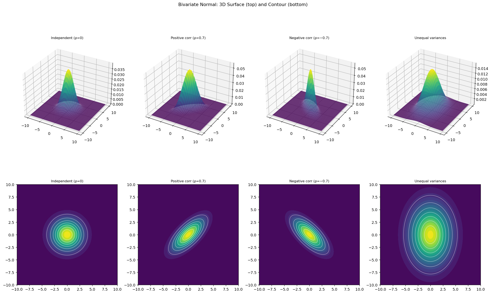

# 이변량 정규분포

## 개요

**이변량 정규분포**는 일변량 정규분포를 2차원으로 확장한 것이다. 확률벡터 $(X_1, X_2)^\top$의 PDF가 다음과 같으면 평균 $\boldsymbol{\mu}$, 공분산행렬 $\boldsymbol{\Sigma}$인 이변량 정규분포를 따른다:

$$
f(\mathbf{x}) = \frac{1}{2\pi|\boldsymbol{\Sigma}|^{1/2}} \exp\!\left(-\frac{1}{2}(\mathbf{x} - \boldsymbol{\mu})^\top \boldsymbol{\Sigma}^{-1}(\mathbf{x} - \boldsymbol{\mu})\right)
$$

밀도 등고선(타원)의 모양은 전적으로 $\boldsymbol{\Sigma}$가 결정한다.

---

## 공분산 구조의 효과

네 가지 설정을 3차원 곡면과 등고선 그림으로 시각화한다:

| 설정 | $\boldsymbol{\Sigma}$ | 상관계수 $\rho$ |
|---|---|---|
| 독립 | $\begin{pmatrix}4&0\\0&4\end{pmatrix}$ | 0 |
| 양의 상관 | $\begin{pmatrix}4&2.8\\2.8&4\end{pmatrix}$ | 0.7 |
| 음의 상관 | $\begin{pmatrix}4&-2.8\\-2.8&4\end{pmatrix}$ | $-0.7$ |
| 분산이 다름 | $\begin{pmatrix}7&0\\0&15\end{pmatrix}$ | 0 |

---

## 코드

```python
import numpy as np
import matplotlib.pyplot as plt
from scipy.stats import multivariate_normal

# 공분산행렬 [[var_X, cov], [cov, var_Y]] 를 네 가지로 바꿔 가며 본다.
# 분산이 4일 때 rho = cov/4 이므로 cov = 2.8 이면 rho = 0.7 이다.
#   1) 비대각이 0     -> 독립. 등고선이 원이 된다.
#   2) 비대각이 양수  -> 등고선이 우상향 타원으로 기운다.
#   3) 비대각이 음수  -> 좌상향으로 기운다.
#   4) 대각이 서로 다름 -> 기울지는 않지만 세로로 늘어난 타원이 된다.
# 4번이 중요하다. **타원이 늘어난 것과 기운 것은 다른 이야기다.**
configs = [
    {"label": "Independent (ρ=0)", "mu": [0, 0], "cov": [[4, 0], [0, 4]]},
    {"label": "Positive corr (ρ=0.7)", "mu": [0, 0], "cov": [[4, 2.8], [2.8, 4]]},
    {"label": "Negative corr (ρ=−0.7)", "mu": [0, 0], "cov": [[4, -2.8], [-2.8, 4]]},
    {"label": "Unequal variances", "mu": [0, 0], "cov": [[7, 0], [0, 15]]},
]

x = np.linspace(-10, 10, 200)
# meshgrid: 1차원 격자 두 개를 2차원 좌표판으로 펼친다.
# X[i,j], Y[i,j] 가 (i,j) 칸의 좌표가 된다.
X, Y = np.meshgrid(x, x)

fig = plt.figure(figsize=(18, 12))
for i, cfg in enumerate(configs):
    # dstack으로 (X, Y)를 마지막 축에 쌓아 (200, 200, 2) 모양을 만든다.
    # scipy의 다변량 pdf는 "마지막 축이 좌표"인 배열을 받는다.
    pos = np.dstack((X, Y))
    rv = multivariate_normal(mean=cfg["mu"], cov=cfg["cov"])
    Z = rv.pdf(pos)      # 각 격자점에서의 밀도. (200, 200) 모양

    # 3D surface
    ax = fig.add_subplot(2, 4, i + 1, projection="3d")
    ax.plot_surface(X, Y, Z, cmap="viridis", alpha=0.85, edgecolor="none")
    ax.set_title(cfg["label"], fontsize=9)

    # Contour
    ax2 = fig.add_subplot(2, 4, i + 5)
    ax2.contourf(X, Y, Z, levels=20, cmap="viridis")
    ax2.contour(X, Y, Z, levels=8, colors="white", linewidths=0.5)
    ax2.set_title(cfg["label"], fontsize=9)
    ax2.set_aspect("equal")

plt.suptitle("Bivariate Normal: 3D Surface (top) and Contour (bottom)")
plt.tight_layout()
plt.show()
```



---

## 해석

- **$\rho = 0$이고 분산이 같을 때:** 등고선이 원이다. $X_1$과 $X_2$가 독립이며 퍼짐이 동일하다.
- **$\rho > 0$:** 타원이 $X_1 = X_2$ 대각선 방향으로 기운다. 양의 연관성이다.
- **$\rho < 0$:** 타원이 $X_1 = -X_2$ 방향으로 기운다. 음의 연관성이다.
- **분산이 다를 때:** 분산이 큰 축 방향으로 타원이 길쭉해진다.

등고선 타원은 상수 $c$에 대해 $(\mathbf{x} - \boldsymbol{\mu})^\top\boldsymbol{\Sigma}^{-1}(\mathbf{x} - \boldsymbol{\mu}) = c$를 만족한다. 축은 $\boldsymbol{\Sigma}$의 고유벡터 방향과 일치하고, 축의 길이는 $\sqrt{\lambda_i}$(고윳값의 제곱근)에 비례한다.

---

## 연습문제

<div class="drillbox" markdown>

**연습문제 1.**
$\boldsymbol{\Sigma} = \begin{pmatrix}4&2.8\\2.8&4\end{pmatrix}$인 이변량 정규분포의 상관계수 $\rho$를 계산하라.

</div>

??? success "풀이"
    $$
    \rho = \frac{\text{Cov}(X_1, X_2)}{\sigma_1 \sigma_2} = \frac{2.8}{\sqrt{4}\sqrt{4}} = \frac{2.8}{4} = 0.7
    $$

<div class="drillbox" markdown>

**연습문제 2.**
이변량 정규분포에서 무상관성이 독립성을 함의함을 보여라.

</div>

??? success "풀이"
    $\rho = 0$이면 공분산행렬이 대각행렬 $\boldsymbol{\Sigma} = \text{diag}(\sigma_1^2, \sigma_2^2)$이다. 그러면:

    $$
    f(x_1, x_2) = \frac{1}{2\pi\sigma_1\sigma_2}\exp\!\left(-\frac{x_1^2}{2\sigma_1^2} - \frac{x_2^2}{2\sigma_2^2}\right) = f_1(x_1)\cdot f_2(x_2)
    $$

    결합밀도가 주변밀도의 곱으로 인수분해되므로 $X_1$과 $X_2$는 독립이다.

    !!! warning "이변량 정규분포에서만"
        무상관성이 독립성을 함의하는 것은 이변량 정규분포에서**만** 성립한다. 일반적으로 무상관인 확률변수도 의존적일 수 있다.

    $\square$

<div class="drillbox" markdown>

**연습문제 3.**
$\boldsymbol{\Sigma} = \begin{pmatrix}4&2.8\\2.8&4\end{pmatrix}$의 고윳값과 고유벡터를 계산하고 등고선 타원의 방향을 서술하라.

</div>

??? success "풀이"
    특성방정식은 $(4-\lambda)^2 - 2.8^2 = 0$이다:

    $$
    \lambda^2 - 8\lambda + 16 - 7.84 = 0 \implies \lambda^2 - 8\lambda + 8.16 = 0
    $$

    $$
    \lambda = \frac{8 \pm \sqrt{64 - 32.64}}{2} = \frac{8 \pm 5.6}{2}
    $$

    따라서 $\lambda_1 = 6.8$, $\lambda_2 = 1.2$이다.

    $\lambda_1 = 6.8$에 대한 고유벡터는 $(1, 1)^\top/\sqrt{2}$이다($X_1 = X_2$ 방향).
    $\lambda_2 = 1.2$에 대한 고유벡터는 $(1, -1)^\top/\sqrt{2}$이다($X_1 = -X_2$ 방향).

    타원의 장축은 $(1,1)$ 방향이고 반길이가 $\sqrt{6.8} \approx 2.61$이며, 단축은 $(1,-1)$ 방향이고 반길이가 $\sqrt{1.2} \approx 1.10$이다.

<div class="drillbox" markdown>

**연습문제 4.**
이변량 정규 $(\boldsymbol{\mu}, \boldsymbol{\Sigma})$에서 $X_1$의 주변분포가 $N(\mu_1, \sigma_1^2)$임을 증명하라.

</div>

??? success "풀이"
    결합밀도에서 $X_2$를 적분해 없앤다. 지수부를 $(x_1, x_2)$의 이차형식으로 쓰고 $x_2$에 대해 완전제곱식을 만든다. $x_2$에 대한 적분은 Gaussian 적분이므로 상수가 되어 다음이 남는다:

    $$
    f_{X_1}(x_1) = \frac{1}{\sigma_1\sqrt{2\pi}}\exp\!\left(-\frac{(x_1 - \mu_1)^2}{2\sigma_1^2}\right)
    $$

    다른 방법으로, $X_1 = (1, 0)\mathbf{X}$임에 주목하자. 다변량 정규분포의 임의의 선형변환은 정규분포이며 평균이 $(1,0)\boldsymbol{\mu} = \mu_1$, 분산이 $(1,0)\boldsymbol{\Sigma}(1,0)^\top = \sigma_1^2$이다. $\square$

---

## 정리하며

이변량 정규분포는 평균벡터 $\boldsymbol\mu$ 와 공분산행렬 $\boldsymbol\Sigma$ 로 완전히 결정된다.

- **모양은 전적으로 $\boldsymbol\Sigma$ 가 정한다.** 등밀도 등고선이 타원이고, $\rho=0$ 이면 축에 나란한 타원(원), $\rho\ne0$ 이면 기울어진 타원이다. $|\rho|$ 가 1 에 가까울수록 타원이 납작해진다.
- **지수 안의 $(\mathbf{x}-\boldsymbol\mu)^\top\boldsymbol\Sigma^{-1}(\mathbf{x}-\boldsymbol\mu)$ 가 마할라노비스 거리의 제곱**이다. 상관을 고려한 거리이며, 이 값이 일정한 곳이 곧 등고선이다.
- **다변량 정규에서만 무상관이 독립을 함의한다.** $\rho=0$ 이면 밀도가 두 일변량 밀도의 곱으로 쪼개진다. 일반 분포에서는 성립하지 않는 특별한 성질이다(3장 독립 문서 참조).
- **$\boldsymbol\Sigma$ 는 양정치여야 한다.** 그렇지 않으면 역행렬도 밀도도 존재하지 않으며, 상관계수를 임의로 정할 수 없는 이유가 그것이다.

이어지는 두 절이 이 분포를 두 방향에서 해부한다. **조건부분포**는 한 변수를 고정했을 때 남는 분포를 보고, **고유분해**는 타원의 축을 직접 찾는다.

다음 절 **2차원 정규분포 조건부분포**부터 시작한다. 회귀직선이 어디서 나오는지가 거기서 드러난다.
