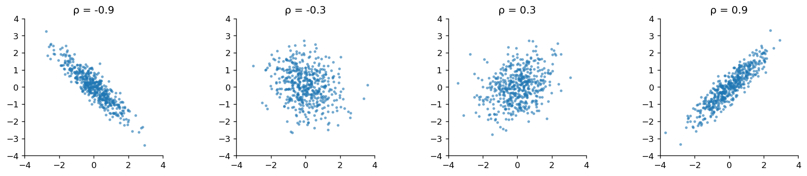
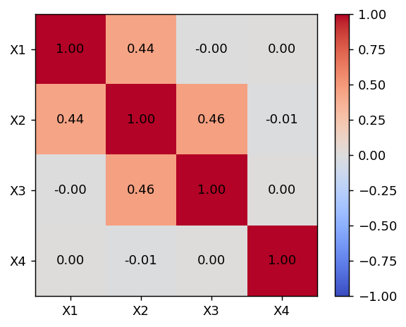

# 공분산과 상관계수

## 개요

**공분산**과 **상관계수**는 두 확률변수 사이의 선형 관계를 정량화한다. 공분산은 (원래 단위로) 동조 움직임의 방향과 크기를 재고, 상관계수는 이를 $-1$과 $+1$ 사이의 무차원 양으로 표준화한다.

---

## 공분산

<div class="defn" markdown>

### 정의 1. 공분산 { .dfn }

$$
\text{Cov}(X, Y) = E[(X - \mu_X)(Y - \mu_Y)] = E[XY] - E[X]E[Y]
$$

</div>

### 두 표현이 같음을 증명

$$
\begin{aligned}
\text{Cov}(X,Y) &= E[(X - \mu_X)(Y - \mu_Y)] \\
&= E[XY - X\mu_Y - \mu_X Y + \mu_X \mu_Y] \\
&= E[XY] - \mu_Y E[X] - \mu_X E[Y] + \mu_X \mu_Y \\
&= E[XY] - E[X]E[Y]
\end{aligned}
$$

### 성질

$$
\begin{aligned}
(1) &\quad \text{Cov}(X, X) = \text{Var}(X) \\[4pt]
(2) &\quad \text{Cov}(X, Y) = \text{Cov}(Y, X) \quad \text{(대칭성)} \\[4pt]
(3) &\quad \text{Cov}(aX + b, \, cY + d) = ac \cdot \text{Cov}(X, Y) \\[4pt]
(4) &\quad \text{Cov}\left(\sum_i X_i, \sum_j Y_j\right) = \sum_i \sum_j \text{Cov}(X_i, Y_j) \quad \text{(쌍선형성)} \\[4pt]
(5) &\quad X \perp Y \implies \text{Cov}(X, Y) = 0
\end{aligned}
$$

**주의:** (5)의 역은 일반적으로 **성립하지 않는다**. 공분산이 0이라고 해서 독립인 것은 아니다.

### 합의 분산

합의 분산에 대한 일반 공식은 쌍선형성으로부터 따라 나온다:

$$
\text{Var}\left(\sum_{i=1}^n X_i\right) = \sum_{i=1}^n \text{Var}(X_i) + 2\sum_{i < j} \text{Cov}(X_i, X_j)
$$

변수가 두 개일 때:

$$
\text{Var}(X + Y) = \text{Var}(X) + \text{Var}(Y) + 2\text{Cov}(X, Y)
$$

$$
\text{Var}(X - Y) = \text{Var}(X) + \text{Var}(Y) - 2\text{Cov}(X, Y)
$$

---

## 상관계수

<div class="defn" markdown>

### 정의 2. Pearson 상관계수 { .dfn }

**Pearson 상관계수**는 공분산을 표준편차로 나누어 표준화한다:

$$
\rho(X, Y) = \text{Corr}(X, Y) = \frac{\text{Cov}(X, Y)}{\sigma_X \sigma_Y} = \frac{\text{Cov}(X, Y)}{\sqrt{\text{Var}(X)\,\text{Var}(Y)}}
$$

</div>

### 성질

$$
\begin{aligned}
(1) &\quad -1 \leq \rho(X, Y) \leq 1 \\[4pt]
(2) &\quad \rho(X, Y) = \pm 1 \iff Y = aX + b \text{ for some } a \neq 0 \\[4pt]
(3) &\quad \rho(aX + b, \, cY + d) = \text{sign}(ac) \cdot \rho(X, Y) \\[4pt]
(4) &\quad \rho(X, Y) = 0 \text{ 이면 } X, Y \text{ 는 무상관이다 (선형 관계가 없다)}
\end{aligned}
$$

### |rho| <= 1의 증명 (Cauchy–Schwarz)

Cauchy–Schwarz 부등식에 의해:

$$
|E[UV]|^2 \leq E[U^2] \cdot E[V^2]
$$

$U = X - \mu_X$, $V = Y - \mu_Y$로 두면:

$$
|\text{Cov}(X,Y)|^2 \leq \text{Var}(X) \cdot \text{Var}(Y) \implies |\rho(X,Y)| \leq 1
$$

---

## 상관계수의 해석

| $\rho$ | 해석 |
|:---|:---|
| $\rho = +1$ | 완전한 양의 선형 관계 |
| $0.7 \leq \rho < 1$ | 강한 양의 연관성 |
| $0.3 \leq \rho < 0.7$ | 중간 정도의 양의 연관성 |
| $0 < \rho < 0.3$ | 약한 양의 연관성 |
| $\rho = 0$ | 선형 관계 없음 |
| $\rho < 0$ | 음의 연관성 (마찬가지로 해석) |
| $\rho = -1$ | 완전한 음의 선형 관계 |

**주의:** 상관계수는 **선형** 의존성만 측정한다. 관계가 비선형이면 변수들이 강하게 의존하면서도 상관계수가 0일 수 있다.

---

## 공분산행렬

확률벡터 $\mathbf{X} = (X_1, X_2, \ldots, X_n)^\top$에 대해 **공분산행렬**은 다음과 같다:

$$
\boldsymbol{\Sigma} = \text{Cov}(\mathbf{X}) = E[(\mathbf{X} - \boldsymbol{\mu})(\mathbf{X} - \boldsymbol{\mu})^\top]
$$

$$
\Sigma_{ij} = \text{Cov}(X_i, X_j), \qquad \Sigma_{ii} = \text{Var}(X_i)
$$

공분산행렬은 언제나 대칭이고 양의 준정부호이다.

### 상관행렬

$$
R_{ij} = \frac{\Sigma_{ij}}{\sqrt{\Sigma_{ii} \Sigma_{jj}}} = \rho(X_i, X_j)
$$

$\mathbf{R}$의 대각 성분은 모두 1이다.

---

## 문제

<div class="probox" markdown>

**문제:** <span class="diff easy" title="쉬움"></span> 다음 결합 PMF로부터 공분산과 상관계수를 계산하라:

| | $Y=0$ | $Y=1$ |
|:---|:---:|:---:|
| $X=0$ | 0.2 | 0.1 |
| $X=1$ | 0.3 | 0.4 |

</div>

??? success "풀이"

    $$
    E[X] = 0(0.3) + 1(0.7) = 0.7, \quad E[Y] = 0(0.5) + 1(0.5) = 0.5
    $$

    $$
    E[XY] = 0(0) \cdot 0.2 + 0(1) \cdot 0.1 + 1(0) \cdot 0.3 + 1(1) \cdot 0.4 = 0.4
    $$

    $$
    \text{Cov}(X,Y) = E[XY] - E[X]E[Y] = 0.4 - 0.7 \cdot 0.5 = 0.05
    $$

    $$
    \text{Var}(X) = E[X^2] - (E[X])^2 = 0.7 - 0.49 = 0.21
    $$

    $$
    \text{Var}(Y) = E[Y^2] - (E[Y])^2 = 0.5 - 0.25 = 0.25
    $$

    $$
    \rho(X,Y) = \frac{0.05}{\sqrt{0.21 \cdot 0.25}} = \frac{0.05}{0.2291} \approx 0.218
    $$
---

## Python: 계산과 시각화

### 자료로부터 공분산과 상관계수 구하기

<div class="codebox" markdown>

**예제 1.** 자료에서 공분산과 상관계수 구하기

```python
import numpy as np

np.random.seed(42)
n = 10_000
X = np.random.normal(0, 1, n)
# Y = 0.7X + 잡음.  Var(Y) = 0.7^2 * 1 + 0.5^2 = 0.74 이므로
# Cov(X,Y) = 0.7 이고 Corr = 0.7 / sqrt(1 * 0.74) ≈ 0.814 로 예측된다.
Y = 0.7 * X + np.random.normal(0, 0.5, n)

# np.cov / np.corrcoef 는 스칼라가 아니라 **행렬**을 돌려준다.
#   대각원소  = 각 변수의 분산 (상관행렬에서는 항상 1)
#   비대각원소 = 두 변수 사이의 공분산(또는 상관)
# 그래서 [0,1] 로 꺼내야 우리가 원하는 값이 나온다.
cov_matrix = np.cov(X, Y)
corr_matrix = np.corrcoef(X, Y)

print(f"Cov(X,Y) = {cov_matrix[0,1]:.4f}")
print(f"Corr(X,Y) = {corr_matrix[0,1]:.4f}")
print(f"\nCovariance matrix:\n{cov_matrix}")
print(f"\nCorrelation matrix:\n{corr_matrix}")
```

출력:

```
Cov(X,Y) = 0.7006
Corr(X,Y) = 0.8127

Covariance matrix:
[[1.00693675 0.70055986]
 [0.70055986 0.73789018]]

Correlation matrix:
[[1.         0.81273374]
 [0.81273374 1.        ]]
```

</div>

### 여러 상관계수 시각화

<div class="codebox" markdown>

**예제 2.** 여러 상관계수를 그림으로 보기

```python
import numpy as np
import matplotlib.pyplot as plt

np.random.seed(42)
n = 500
fig, axes = plt.subplots(1, 4, figsize=(14, 3))

for ax, rho in zip(axes, [-0.9, -0.3, 0.3, 0.9]):
    # 분산을 둘 다 1로 두면 공분산행렬의 비대각원소가 곧 상관계수가 된다.
    # 상관 = 공분산 / (sd_X * sd_Y) 인데 분모가 1이기 때문이다.
    cov = [[1, rho], [rho, 1]]
    data = np.random.multivariate_normal([0, 0], cov, n)
    ax.scatter(data[:, 0], data[:, 1], s=5, alpha=0.5)
    ax.set_title(f'ρ = {rho}')
    # set_aspect('equal') 이 중요하다. 가로세로 비가 다르면
    # 같은 rho라도 점구름이 더 납작하거나 둥글게 보여 오해를 부른다.
    ax.set_aspect('equal')
    ax.set_xlim(-4, 4)
    ax.set_ylim(-4, 4)
    ax.spines[['top', 'right']].set_visible(False)

plt.tight_layout()
plt.show()
```

</div>



### 상관계수 열지도

<div class="codebox" markdown>

**예제 3.** 상관계수 열지도

```python
import numpy as np
import matplotlib.pyplot as plt

np.random.seed(42)
n = 5000
# 변수 넷을 사슬처럼 엮는다.
#   X1 : 독립
#   X2 : X1에 의존
#   X3 : X1과 X2 모두에 의존
#   X4 : 아무것과도 무관 (대조군)
# 열지도에서 X4의 행/열만 0에 가깝게 나오는지 확인해 보라.
X1 = np.random.normal(0, 1, n)
X2 = 0.5 * X1 + np.random.normal(0, 1, n)
X3 = -0.3 * X1 + 0.6 * X2 + np.random.normal(0, 1, n)
X4 = np.random.normal(0, 1, n)

data = np.column_stack([X1, X2, X3, X4])
# rowvar=False: 열이 변수이고 행이 관측이라는 뜻.
# numpy의 기본값은 반대(rowvar=True)라서 빠뜨리면 5000x5000 행렬이 나온다.
corr = np.corrcoef(data, rowvar=False)

fig, ax = plt.subplots(figsize=(5, 4))
im = ax.imshow(corr, cmap='coolwarm', vmin=-1, vmax=1)
labels = ['X1', 'X2', 'X3', 'X4']
ax.set_xticks(range(4))
ax.set_xticklabels(labels)
ax.set_yticks(range(4))
ax.set_yticklabels(labels)
for i in range(4):
    for j in range(4):
        ax.text(j, i, f'{corr[i,j]:.2f}', ha='center', va='center', fontsize=10)
fig.colorbar(im, ax=ax)
plt.show()
```

</div>



### 결합 PMF로부터 공분산 구하기

<div class="codebox" markdown>

**예제 4.** 결합 확률질량함수에서 공분산 구하기

```python
import numpy as np

# 결합 PMF 표. pmf[i, j] = P(X = x_vals[i], Y = y_vals[j]) 이고 합이 1이다.
pmf = np.array([[0.2, 0.1],
                [0.3, 0.4]])
x_vals = np.array([0, 1])
y_vals = np.array([0, 1])

# 브로드캐스팅으로 표 전체를 한 번에 가중합한다.
#   x_vals[:, None] 은 세로 벡터 (행 방향으로 퍼진다)  -> X의 값
#   y_vals[None, :] 은 가로 벡터 (열 방향으로 퍼진다)  -> Y의 값
# 이렇게 하면 이중 반복문 없이 sum(x * P(x,y)) 를 그대로 쓸 수 있다.
E_X = np.sum(x_vals[:, None] * pmf)
E_Y = np.sum(y_vals[None, :] * pmf)
E_XY = np.sum(x_vals[:, None] * y_vals[None, :] * pmf)

# Cov(X,Y) = E[XY] - E[X]E[Y]
cov_XY = E_XY - E_X * E_Y
var_X = np.sum(x_vals[:, None]**2 * pmf) - E_X**2
var_Y = np.sum(y_vals[None, :]**2 * pmf) - E_Y**2
# 상관계수는 공분산을 두 표준편차로 나눈 것. 단위가 없어져 [-1, 1]에 들어간다.
corr_XY = cov_XY / np.sqrt(var_X * var_Y)

print(f"E[X] = {E_X:.4f}, E[Y] = {E_Y:.4f}, E[XY] = {E_XY:.4f}")
print(f"Cov(X,Y) = {cov_XY:.4f}")
print(f"Corr(X,Y) = {corr_XY:.4f}")
```

출력:

```
E[X] = 0.7000, E[Y] = 0.5000, E[XY] = 0.4000
Cov(X,Y) = 0.0500
Corr(X,Y) = 0.2182
```

</div>

---

## 연습문제

<div class="drillbox" markdown>

**연습문제 1.** <span class="diff easy" title="쉬움"></span>
$X$와 $Y$의 결합분포가 $P(X=0,Y=0) = 0.2$, $P(X=0,Y=1) = 0.1$, $P(X=1,Y=0) = 0.3$, $P(X=1,Y=1) = 0.4$로 주어진다. $\text{Cov}(X,Y)$와 $\rho(X,Y)$를 계산하라.

</div>

??? success "풀이"
    먼저 주변분포와 기댓값을 계산한다:

    $$
    E[X] = 0 \cdot 0.3 + 1 \cdot 0.7 = 0.7, \quad E[Y] = 0 \cdot 0.5 + 1 \cdot 0.5 = 0.5
    $$

    $$
    E[XY] = 0 \cdot 0 \cdot 0.2 + 0 \cdot 1 \cdot 0.1 + 1 \cdot 0 \cdot 0.3 + 1 \cdot 1 \cdot 0.4 = 0.4
    $$

    $$
    \text{Cov}(X,Y) = E[XY] - E[X]E[Y] = 0.4 - 0.7 \times 0.5 = 0.4 - 0.35 = 0.05
    $$

    상관계수를 구하려면 분산이 필요하다:

    $$
    \text{Var}(X) = E[X^2] - (E[X])^2 = 0.7 - 0.49 = 0.21
    $$

    $$
    \text{Var}(Y) = E[Y^2] - (E[Y])^2 = 0.5 - 0.25 = 0.25
    $$

    $$
    \rho(X,Y) = \frac{0.05}{\sqrt{0.21 \times 0.25}} = \frac{0.05}{\sqrt{0.0525}} = \frac{0.05}{0.2291} \approx 0.218
    $$

<div class="drillbox" markdown>

**연습문제 2.** <span class="diff med" title="중간"></span>
분산의 정의와 기댓값의 선형성을 사용하여 $\text{Var}(aX + bY) = a^2\text{Var}(X) + b^2\text{Var}(Y) + 2ab\,\text{Cov}(X,Y)$를 증명하라.

</div>

??? success "풀이"
    $\mu_X = E[X]$, $\mu_Y = E[Y]$라 하자. 그러면 $E[aX + bY] = a\mu_X + b\mu_Y$이다. 정의에 의해:

    $$
    \text{Var}(aX + bY) = E\!\left[(aX + bY - a\mu_X - b\mu_Y)^2\right] = E\!\left[(a(X - \mu_X) + b(Y - \mu_Y))^2\right]
    $$

    제곱을 전개하면:

    $$
    = E\!\left[a^2(X-\mu_X)^2 + 2ab(X-\mu_X)(Y-\mu_Y) + b^2(Y-\mu_Y)^2\right]
    $$

    기댓값의 선형성에 의해:

    $$
    = a^2 E[(X-\mu_X)^2] + 2ab\,E[(X-\mu_X)(Y-\mu_Y)] + b^2 E[(Y-\mu_Y)^2]
    $$

    $$
    = a^2\text{Var}(X) + 2ab\,\text{Cov}(X,Y) + b^2\text{Var}(Y)
    $$

    $\square$

<div class="drillbox" markdown>

**연습문제 3.** <span class="diff med" title="중간"></span>
$X \sim \text{Uniform}(-1,1)$이고 $Y = X^2$이라 하자. $\text{Cov}(X,Y) = 0$이지만 $X$와 $Y$가 독립이 아님을 보여라.

</div>

??? success "풀이"
    Uniform$(-1,1)$ 분포의 대칭성에 의해 $E[X] = 0$이다. 간편식을 사용하면:

    $$
    \text{Cov}(X,Y) = E[XY] - E[X]E[Y] = E[X \cdot X^2] - 0 \cdot E[Y] = E[X^3]
    $$

    $g(x) = x^3$은 기함수이고 $X$는 0을 중심으로 대칭인 분포를 가지므로:

    $$
    E[X^3] = \int_{-1}^{1} x^3 \cdot \frac{1}{2}\,dx = \frac{1}{2}\left[\frac{x^4}{4}\right]_{-1}^{1} = \frac{1}{2}\left(\frac{1}{4} - \frac{1}{4}\right) = 0
    $$

    따라서 $\text{Cov}(X,Y) = 0$이다. 그러나 $Y$가 $X$의 결정론적 함수이므로 $X$와 $Y$는 분명히 **독립이 아니다**. $X$를 알면 $Y = X^2$이 완전히 결정된다. 이는 상관계수가 0이라고 해서 독립인 것은 아님을 보여 준다.

<div class="drillbox" markdown>

**연습문제 4.** <span class="diff med" title="중간"></span>
어떤 포트폴리오가 수익률 $R_1$과 $R_2$인 두 자산으로 이루어져 있고 비중은 각각 $w$와 $1-w$이다. $R_p = wR_1 + (1-w)R_2$일 때 포트폴리오 분산 $\text{Var}(R_p)$를 유도하고, $\text{Var}(R_1) = \sigma_1^2$, $\text{Var}(R_2) = \sigma_2^2$, $\text{Cov}(R_1, R_2) = \sigma_{12}$일 때 포트폴리오 분산을 최소화하는 비중 $w^*$를 구하라.

</div>

??? success "풀이"
    선형결합의 분산 공식을 사용하면:

    $$
    \text{Var}(R_p) = w^2 \sigma_1^2 + (1-w)^2 \sigma_2^2 + 2w(1-w)\sigma_{12}
    $$

    최소화하기 위해 $w$에 대해 미분하고 0으로 둔다:

    $$
    \frac{d}{dw}\text{Var}(R_p) = 2w\sigma_1^2 - 2(1-w)\sigma_2^2 + 2(1-2w)\sigma_{12} = 0
    $$

    $$
    w\sigma_1^2 - \sigma_2^2 + w\sigma_2^2 + \sigma_{12} - 2w\sigma_{12} = 0
    $$

    $$
    w(\sigma_1^2 + \sigma_2^2 - 2\sigma_{12}) = \sigma_2^2 - \sigma_{12}
    $$

    $$
    w^* = \frac{\sigma_2^2 - \sigma_{12}}{\sigma_1^2 + \sigma_2^2 - 2\sigma_{12}}
    $$

    이것이 **최소분산 포트폴리오 비중**이다. $\sigma_{12} < 0$(음의 상관)일 때 분산투자가 특히 효과적이며, 최소분산 포트폴리오는 개별 자산 어느 것보다도 위험이 낮다.

---

## 정리하며

- 공분산은 선형적 동조 움직임의 방향과 크기를 측정하고, 상관계수는 이를 $[-1, 1]$로 표준화한다.
- 계산에는 보통 간편식 $\text{Cov}(X,Y) = E[XY] - E[X]E[Y]$가 가장 효율적이다.
- 상관계수는 **선형** 의존성만 포착한다. 상관계수가 0이라고 해서 독립인 것은 아니다.
- 공분산행렬은 쌍별 공분산을 벡터값 확률변수로 일반화하며, 포트폴리오 이론, 주성분분석, 다변량 통계학의 기초가 된다.
- 합의 분산 공식 $\text{Var}(X + Y) = \text{Var}(X) + \text{Var}(Y) + 2\text{Cov}(X,Y)$는 독립이거나 무상관일 때만 분산의 단순 합으로 간단해진다.
