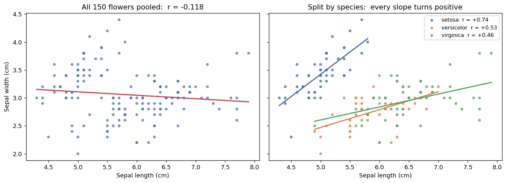

# 공분산과 상관계수

## 개요

**공분산**과 **상관계수**는 두 확률변수 사이의 선형 관계를 정량화한다. 공분산은 (원래 단위로) 동조 움직임의 방향과 크기를 재고, 상관계수는 이를 $-1$과 $+1$ 사이의 무차원 양으로 표준화한다.

---

## 공분산

<div class="defn" markdown>

### 정의 1. 공분산 { .dfn }

$$
\text{Cov}(X, Y) = E[(X - \mu_X)(Y - \mu_Y)] = E[XY] - E[X]E[Y]
$$

</div>

### 두 표현이 같음을 증명

$$
\begin{aligned}
\text{Cov}(X,Y) &= E[(X - \mu_X)(Y - \mu_Y)] \\
&= E[XY - X\mu_Y - \mu_X Y + \mu_X \mu_Y] \\
&= E[XY] - \mu_Y E[X] - \mu_X E[Y] + \mu_X \mu_Y \\
&= E[XY] - E[X]E[Y]
\end{aligned}
$$

### 성질

$$
\begin{aligned}
(1) &\quad \text{Cov}(X, X) = \text{Var}(X) \\[4pt]
(2) &\quad \text{Cov}(X, Y) = \text{Cov}(Y, X) \quad \text{(대칭성)} \\[4pt]
(3) &\quad \text{Cov}(aX + b, \, cY + d) = ac \cdot \text{Cov}(X, Y) \\[4pt]
(4) &\quad \text{Cov}\left(\sum_i X_i, \sum_j Y_j\right) = \sum_i \sum_j \text{Cov}(X_i, Y_j) \quad \text{(쌍선형성)} \\[4pt]
(5) &\quad X \perp Y \implies \text{Cov}(X, Y) = 0
\end{aligned}
$$

**주의:** (5)의 역은 일반적으로 **성립하지 않는다**. 공분산이 0이라고 해서 독립인 것은 아니다.

### 합의 분산

합의 분산에 대한 일반 공식은 쌍선형성으로부터 따라 나온다:

$$
\text{Var}\left(\sum_{i=1}^n X_i\right) = \sum_{i=1}^n \text{Var}(X_i) + 2\sum_{i < j} \text{Cov}(X_i, X_j)
$$

변수가 두 개일 때:

$$
\text{Var}(X + Y) = \text{Var}(X) + \text{Var}(Y) + 2\text{Cov}(X, Y)
$$

$$
\text{Var}(X - Y) = \text{Var}(X) + \text{Var}(Y) - 2\text{Cov}(X, Y)
$$

---

## 상관계수

<div class="defn" markdown>

### 정의 2. Pearson 상관계수 { .dfn }

**Pearson 상관계수**는 공분산을 표준편차로 나누어 표준화한다:

$$
\rho(X, Y) = \text{Corr}(X, Y) = \frac{\text{Cov}(X, Y)}{\sigma_X \sigma_Y} = \frac{\text{Cov}(X, Y)}{\sqrt{\text{Var}(X)\,\text{Var}(Y)}}
$$

</div>

### 성질

$$
\begin{aligned}
(1) &\quad -1 \leq \rho(X, Y) \leq 1 \\[4pt]
(2) &\quad \rho(X, Y) = \pm 1 \iff Y = aX + b \text{ for some } a \neq 0 \\[4pt]
(3) &\quad \rho(aX + b, \, cY + d) = \text{sign}(ac) \cdot \rho(X, Y) \\[4pt]
(4) &\quad \rho(X, Y) = 0 \text{ 이면 } X, Y \text{ 는 무상관이다 (선형 관계가 없다)}
\end{aligned}
$$

### |rho| <= 1의 증명 (Cauchy–Schwarz)

Cauchy–Schwarz 부등식에 의해:

$$
|E[UV]|^2 \leq E[U^2] \cdot E[V^2]
$$

$U = X - \mu_X$, $V = Y - \mu_Y$로 두면:

$$
|\text{Cov}(X,Y)|^2 \leq \text{Var}(X) \cdot \text{Var}(Y) \implies |\rho(X,Y)| \leq 1
$$

---

## 상관계수의 해석

| $\rho$ | 해석 |
|:---|:---|
| $\rho = +1$ | 완전한 양의 선형 관계 |
| $0.7 \leq \rho < 1$ | 강한 양의 연관성 |
| $0.3 \leq \rho < 0.7$ | 중간 정도의 양의 연관성 |
| $0 < \rho < 0.3$ | 약한 양의 연관성 |
| $\rho = 0$ | 선형 관계 없음 |
| $\rho < 0$ | 음의 연관성 (마찬가지로 해석) |
| $\rho = -1$ | 완전한 음의 선형 관계 |

**주의:** 상관계수는 **선형** 의존성만 측정한다. 관계가 비선형이면 변수들이 강하게 의존하면서도 상관계수가 0일 수 있다.

주의할 것이 하나 더 있다. **상관계수는 두 변수의 성질이 아니라 "어떤 집단에서 쟀는가"에 달린 값**이라는 점이다. 표를 그대로 외워서 부호만 읽으면 낭패를 보기 쉽다. 실제 자료로 보는 편이 빠르다.

### 실제 자료에서: 집단을 섞으면 부호가 뒤집힌다

붓꽃 150송이를 재어 놓은 자료가 있다. setosa, versicolor, virginica 세 품종이 50송이씩이고, 송이마다 꽃받침의 길이와 너비가 기록되어 있다. 꽃받침이 길수록 넓을 것 같지만 실제로 계산해 보면 그렇지 않다.

<div class="codebox" markdown>

#### 예제 1. 상관계수는 집단을 탄다 { .eg }

```python
import seaborn as sns

# 붓꽃 150송이의 실측 자료. 세 품종이 50송이씩 들어 있다.
iris = sns.load_dataset("iris")

print("꽃받침 길이와 너비의 상관계수")
print(f"  {'전체 150송이':<16}{iris['sepal_length'].corr(iris['sepal_width']):+.3f}")
for name, g in iris.groupby("species"):
    print(f"  {name:<16}{g['sepal_length'].corr(g['sepal_width']):+.3f}")

print("\n품종별 평균")
print(iris.groupby("species")[["sepal_length", "sepal_width"]].mean().round(2))
```

출력:

```
꽃받침 길이와 너비의 상관계수
  전체 150송이        -0.118
  setosa          +0.743
  versicolor      +0.526
  virginica       +0.457

품종별 평균
            sepal_length  sepal_width
species                              
setosa              5.01         3.43
versicolor          5.94         2.77
virginica           6.59         2.97
```



</div>

150송이를 한 덩어리로 놓고 재면 $r = -0.118$로 **음의 상관**이다. 길수록 오히려 좁다는 말이 된다. 그런데 품종별로 나누어 재면 $+0.743$, $+0.526$, $+0.457$로 셋 다 **뚜렷한 양의 상관**이다. 부호가 뒤집힌다.

품종별 평균을 보면 까닭이 드러난다. setosa는 꽃받침이 짧고($5.01$) 넓은($3.43$) 반면 versicolor와 virginica는 길고($5.94$, $6.59$) 좁다($2.77$, $2.97$). 품종이라는 숨은 변수가 길이와 너비를 **서로 반대 방향으로** 밀어 놓은 것이다. 세 덩어리를 한데 섞으면 이 품종 간의 차이가 품종 안의 관계를 압도해 버린다.

오른쪽 그림이 이 사정을 그대로 보여 준다. 세 무리가 각각 오른쪽 위로 기울어 있는데, 무리들의 **위치**가 왼쪽 위에서 오른쪽 아래로 늘어서 있다. 무리를 무시하고 직선 하나를 그으면 무리 사이의 배치를 따라가므로 기울기가 음수가 된다.

!!! warning "상관계수를 보고할 때 함께 물을 것"

    **누구를 재었는가.** 같은 두 변수라도 모집단을 바꾸면 값이, 때로는 부호까지 달라진다.

    **섞인 집단은 아닌가.** 성질이 다른 무리를 합쳐 재면 무리 간 차이가 무리 안 관계를 가릴 수 있다. 이 현상은 회귀에서 **심프슨의 역설**이라는 이름으로 다시 만난다(13장).

    **범위를 잘라내지 않았는가.** 자료의 일부만 보면 상관이 약해진다. 붓꽃에서도 품종 하나만 보면 길이의 범위가 좁아져 그 안의 상관은 전체보다 작게 나올 수 있다.

    이것은 자료를 나누어야 한다는 뜻도, 합쳐야 한다는 뜻도 아니다. **무엇을 묻고 있는지에 따라 답이 달라진다**는 뜻이다. "이 붓꽃의 꽃받침이 길면 넓을까"를 묻는다면 품종 안에서 재야 하고, "임의의 붓꽃 한 송이를 집었을 때"를 묻는다면 전체에서 재야 한다.

---

## 공분산행렬

확률벡터 $\mathbf{X} = (X_1, X_2, \ldots, X_n)^\top$에 대해 **공분산행렬**은 다음과 같다:

$$
\boldsymbol{\Sigma} = \text{Cov}(\mathbf{X}) = E[(\mathbf{X} - \boldsymbol{\mu})(\mathbf{X} - \boldsymbol{\mu})^\top]
$$

$$
\Sigma_{ij} = \text{Cov}(X_i, X_j), \qquad \Sigma_{ii} = \text{Var}(X_i)
$$

공분산행렬은 언제나 대칭이고 양의 준정부호이다.

### 상관행렬

$$
R_{ij} = \frac{\Sigma_{ij}}{\sqrt{\Sigma_{ii} \Sigma_{jj}}} = \rho(X_i, X_j)
$$

$\mathbf{R}$의 대각 성분은 모두 1이다.

---

## 문제

<div class="probox" markdown>

**문제:** <span class="diff easy" title="쉬움"></span> 다음 결합 PMF로부터 공분산과 상관계수를 계산하라:

| | $Y=0$ | $Y=1$ |
|:---|:---:|:---:|
| $X=0$ | 0.2 | 0.1 |
| $X=1$ | 0.3 | 0.4 |

</div>

??? success "풀이"

    $$
    E[X] = 0(0.3) + 1(0.7) = 0.7, \quad E[Y] = 0(0.5) + 1(0.5) = 0.5
    $$

    $$
    E[XY] = 0(0) \cdot 0.2 + 0(1) \cdot 0.1 + 1(0) \cdot 0.3 + 1(1) \cdot 0.4 = 0.4
    $$

    $$
    \text{Cov}(X,Y) = E[XY] - E[X]E[Y] = 0.4 - 0.7 \cdot 0.5 = 0.05
    $$

    $$
    \text{Var}(X) = E[X^2] - (E[X])^2 = 0.7 - 0.49 = 0.21
    $$

    $$
    \text{Var}(Y) = E[Y^2] - (E[Y])^2 = 0.5 - 0.25 = 0.25
    $$

    $$
    \rho(X,Y) = \frac{0.05}{\sqrt{0.21 \cdot 0.25}} = \frac{0.05}{0.2291} \approx 0.218
    $$
---

## Python: 계산과 시각화

### 자료로부터 공분산과 상관계수 구하기

<div class="codebox" markdown>

#### 예제 2. 자료에서 공분산과 상관계수 구하기 { .eg }

```python
import numpy as np

np.random.seed(42)
n = 10_000
X = np.random.normal(0, 1, n)
# Y = 0.7X + 잡음.  Var(Y) = 0.7^2 * 1 + 0.5^2 = 0.74 이므로
# Cov(X,Y) = 0.7 이고 Corr = 0.7 / sqrt(1 * 0.74) ≈ 0.814 로 예측된다.
Y = 0.7 * X + np.random.normal(0, 0.5, n)

# np.cov / np.corrcoef 는 스칼라가 아니라 **행렬**을 돌려준다.
#   대각원소  = 각 변수의 분산 (상관행렬에서는 항상 1)
#   비대각원소 = 두 변수 사이의 공분산(또는 상관)
# 그래서 [0,1] 로 꺼내야 우리가 원하는 값이 나온다.
cov_matrix = np.cov(X, Y)
corr_matrix = np.corrcoef(X, Y)

print(f"Cov(X,Y) = {cov_matrix[0,1]:.4f}")
print(f"Corr(X,Y) = {corr_matrix[0,1]:.4f}")
print(f"\nCovariance matrix:\n{cov_matrix}")
print(f"\nCorrelation matrix:\n{corr_matrix}")
```

출력:

```
Cov(X,Y) = 0.7006
Corr(X,Y) = 0.8127

Covariance matrix:
[[1.00693675 0.70055986]
 [0.70055986 0.73789018]]

Correlation matrix:
[[1.         0.81273374]
 [0.81273374 1.        ]]
```

</div>

### 여러 상관계수 시각화

<div class="codebox" markdown>

#### 예제 3. 여러 상관계수를 그림으로 보기 { .eg }

```python
import numpy as np
import matplotlib.pyplot as plt

np.random.seed(42)
n = 500
fig, axes = plt.subplots(1, 4, figsize=(14, 3))

for ax, rho in zip(axes, [-0.9, -0.3, 0.3, 0.9]):
    # 분산을 둘 다 1로 두면 공분산행렬의 비대각원소가 곧 상관계수가 된다.
    # 상관 = 공분산 / (sd_X * sd_Y) 인데 분모가 1이기 때문이다.
    cov = [[1, rho], [rho, 1]]
    data = np.random.multivariate_normal([0, 0], cov, n)
    ax.scatter(data[:, 0], data[:, 1], s=5, alpha=0.5)
    ax.set_title(f'ρ = {rho}')
    # set_aspect('equal') 이 중요하다. 가로세로 비가 다르면
    # 같은 rho라도 점구름이 더 납작하거나 둥글게 보여 오해를 부른다.
    ax.set_aspect('equal')
    ax.set_xlim(-4, 4)
    ax.set_ylim(-4, 4)
    ax.spines[['top', 'right']].set_visible(False)

plt.tight_layout()
plt.show()
```


</div>

### 상관계수 열지도

<div class="codebox" markdown>

#### 예제 4. 상관계수 열지도 { .eg }

```python
import numpy as np
import matplotlib.pyplot as plt

np.random.seed(42)
n = 5000
# 변수 넷을 사슬처럼 엮는다.
#   X1 : 독립
#   X2 : X1에 의존
#   X3 : X1과 X2 모두에 의존
#   X4 : 아무것과도 무관 (대조군)
# 열지도에서 X4의 행/열만 0에 가깝게 나오는지 확인해 보라.
X1 = np.random.normal(0, 1, n)
X2 = 0.5 * X1 + np.random.normal(0, 1, n)
X3 = -0.3 * X1 + 0.6 * X2 + np.random.normal(0, 1, n)
X4 = np.random.normal(0, 1, n)

data = np.column_stack([X1, X2, X3, X4])
# rowvar=False: 열이 변수이고 행이 관측이라는 뜻.
# numpy의 기본값은 반대(rowvar=True)라서 빠뜨리면 5000x5000 행렬이 나온다.
corr = np.corrcoef(data, rowvar=False)

fig, ax = plt.subplots(figsize=(5, 4))
im = ax.imshow(corr, cmap='coolwarm', vmin=-1, vmax=1)
labels = ['X1', 'X2', 'X3', 'X4']
ax.set_xticks(range(4))
ax.set_xticklabels(labels)
ax.set_yticks(range(4))
ax.set_yticklabels(labels)
for i in range(4):
    for j in range(4):
        ax.text(j, i, f'{corr[i,j]:.2f}', ha='center', va='center', fontsize=10)
fig.colorbar(im, ax=ax)
plt.show()
```


</div>

### 결합 PMF로부터 공분산 구하기

<div class="codebox" markdown>

#### 예제 5. 결합 확률질량함수에서 공분산 구하기 { .eg }

```python
import numpy as np

# 결합 PMF 표. pmf[i, j] = P(X = x_vals[i], Y = y_vals[j]) 이고 합이 1이다.
pmf = np.array([[0.2, 0.1],
                [0.3, 0.4]])
x_vals = np.array([0, 1])
y_vals = np.array([0, 1])

# 브로드캐스팅으로 표 전체를 한 번에 가중합한다.
#   x_vals[:, None] 은 세로 벡터 (행 방향으로 퍼진다)  -> X의 값
#   y_vals[None, :] 은 가로 벡터 (열 방향으로 퍼진다)  -> Y의 값
# 이렇게 하면 이중 반복문 없이 sum(x * P(x,y)) 를 그대로 쓸 수 있다.
E_X = np.sum(x_vals[:, None] * pmf)
E_Y = np.sum(y_vals[None, :] * pmf)
E_XY = np.sum(x_vals[:, None] * y_vals[None, :] * pmf)

# Cov(X,Y) = E[XY] - E[X]E[Y]
cov_XY = E_XY - E_X * E_Y
var_X = np.sum(x_vals[:, None]**2 * pmf) - E_X**2
var_Y = np.sum(y_vals[None, :]**2 * pmf) - E_Y**2
# 상관계수는 공분산을 두 표준편차로 나눈 것. 단위가 없어져 [-1, 1]에 들어간다.
corr_XY = cov_XY / np.sqrt(var_X * var_Y)

print(f"E[X] = {E_X:.4f}, E[Y] = {E_Y:.4f}, E[XY] = {E_XY:.4f}")
print(f"Cov(X,Y) = {cov_XY:.4f}")
print(f"Corr(X,Y) = {corr_XY:.4f}")
```

출력:

```
E[X] = 0.7000, E[Y] = 0.5000, E[XY] = 0.4000
Cov(X,Y) = 0.0500
Corr(X,Y) = 0.2182
```

</div>

---

## 연습문제

<div class="drillbox" markdown>

**연습문제 1.** <span class="diff easy" title="쉬움"></span>
$X$와 $Y$의 결합분포가 $P(X=0,Y=0) = 0.2$, $P(X=0,Y=1) = 0.1$, $P(X=1,Y=0) = 0.3$, $P(X=1,Y=1) = 0.4$로 주어진다. $\text{Cov}(X,Y)$와 $\rho(X,Y)$를 계산하라.

</div>

??? success "풀이"
    먼저 주변분포와 기댓값을 계산한다:

    $$
    E[X] = 0 \cdot 0.3 + 1 \cdot 0.7 = 0.7, \quad E[Y] = 0 \cdot 0.5 + 1 \cdot 0.5 = 0.5
    $$

    $$
    E[XY] = 0 \cdot 0 \cdot 0.2 + 0 \cdot 1 \cdot 0.1 + 1 \cdot 0 \cdot 0.3 + 1 \cdot 1 \cdot 0.4 = 0.4
    $$

    $$
    \text{Cov}(X,Y) = E[XY] - E[X]E[Y] = 0.4 - 0.7 \times 0.5 = 0.4 - 0.35 = 0.05
    $$

    상관계수를 구하려면 분산이 필요하다:

    $$
    \text{Var}(X) = E[X^2] - (E[X])^2 = 0.7 - 0.49 = 0.21
    $$

    $$
    \text{Var}(Y) = E[Y^2] - (E[Y])^2 = 0.5 - 0.25 = 0.25
    $$

    $$
    \rho(X,Y) = \frac{0.05}{\sqrt{0.21 \times 0.25}} = \frac{0.05}{\sqrt{0.0525}} = \frac{0.05}{0.2291} \approx 0.218
    $$

<div class="drillbox" markdown>

**연습문제 2.** <span class="diff med" title="중간"></span>
분산의 정의와 기댓값의 선형성을 사용하여 $\text{Var}(aX + bY) = a^2\text{Var}(X) + b^2\text{Var}(Y) + 2ab\,\text{Cov}(X,Y)$를 증명하라.

</div>

??? success "풀이"
    $\mu_X = E[X]$, $\mu_Y = E[Y]$라 하자. 그러면 $E[aX + bY] = a\mu_X + b\mu_Y$이다. 정의에 의해:

    $$
    \text{Var}(aX + bY) = E\!\left[(aX + bY - a\mu_X - b\mu_Y)^2\right] = E\!\left[(a(X - \mu_X) + b(Y - \mu_Y))^2\right]
    $$

    제곱을 전개하면:

    $$
    = E\!\left[a^2(X-\mu_X)^2 + 2ab(X-\mu_X)(Y-\mu_Y) + b^2(Y-\mu_Y)^2\right]
    $$

    기댓값의 선형성에 의해:

    $$
    = a^2 E[(X-\mu_X)^2] + 2ab\,E[(X-\mu_X)(Y-\mu_Y)] + b^2 E[(Y-\mu_Y)^2]
    $$

    $$
    = a^2\text{Var}(X) + 2ab\,\text{Cov}(X,Y) + b^2\text{Var}(Y)
    $$

    $\square$

<div class="drillbox" markdown>

**연습문제 3.** <span class="diff med" title="중간"></span>
$X \sim \text{Uniform}(-1,1)$이고 $Y = X^2$이라 하자. $\text{Cov}(X,Y) = 0$이지만 $X$와 $Y$가 독립이 아님을 보여라.

</div>

??? success "풀이"
    Uniform$(-1,1)$ 분포의 대칭성에 의해 $E[X] = 0$이다. 간편식을 사용하면:

    $$
    \text{Cov}(X,Y) = E[XY] - E[X]E[Y] = E[X \cdot X^2] - 0 \cdot E[Y] = E[X^3]
    $$

    $g(x) = x^3$은 기함수이고 $X$는 0을 중심으로 대칭인 분포를 가지므로:

    $$
    E[X^3] = \int_{-1}^{1} x^3 \cdot \frac{1}{2}\,dx = \frac{1}{2}\left[\frac{x^4}{4}\right]_{-1}^{1} = \frac{1}{2}\left(\frac{1}{4} - \frac{1}{4}\right) = 0
    $$

    따라서 $\text{Cov}(X,Y) = 0$이다. 그러나 $Y$가 $X$의 결정론적 함수이므로 $X$와 $Y$는 분명히 **독립이 아니다**. $X$를 알면 $Y = X^2$이 완전히 결정된다. 이는 상관계수가 0이라고 해서 독립인 것은 아님을 보여 준다.

<div class="drillbox" markdown>

**연습문제 4.** <span class="diff med" title="중간"></span>
어떤 포트폴리오가 수익률 $R_1$과 $R_2$인 두 자산으로 이루어져 있고 비중은 각각 $w$와 $1-w$이다. $R_p = wR_1 + (1-w)R_2$일 때 포트폴리오 분산 $\text{Var}(R_p)$를 유도하고, $\text{Var}(R_1) = \sigma_1^2$, $\text{Var}(R_2) = \sigma_2^2$, $\text{Cov}(R_1, R_2) = \sigma_{12}$일 때 포트폴리오 분산을 최소화하는 비중 $w^*$를 구하라.

</div>

??? success "풀이"
    선형결합의 분산 공식을 사용하면:

    $$
    \text{Var}(R_p) = w^2 \sigma_1^2 + (1-w)^2 \sigma_2^2 + 2w(1-w)\sigma_{12}
    $$

    최소화하기 위해 $w$에 대해 미분하고 0으로 둔다:

    $$
    \frac{d}{dw}\text{Var}(R_p) = 2w\sigma_1^2 - 2(1-w)\sigma_2^2 + 2(1-2w)\sigma_{12} = 0
    $$

    $$
    w\sigma_1^2 - \sigma_2^2 + w\sigma_2^2 + \sigma_{12} - 2w\sigma_{12} = 0
    $$

    $$
    w(\sigma_1^2 + \sigma_2^2 - 2\sigma_{12}) = \sigma_2^2 - \sigma_{12}
    $$

    $$
    w^* = \frac{\sigma_2^2 - \sigma_{12}}{\sigma_1^2 + \sigma_2^2 - 2\sigma_{12}}
    $$

    이것이 **최소분산 포트폴리오 비중**이다. $\sigma_{12} < 0$(음의 상관)일 때 분산투자가 특히 효과적이며, 최소분산 포트폴리오는 개별 자산 어느 것보다도 위험이 낮다.

<div class="drillbox" markdown>

**연습문제 5.** <span class="diff easy" title="쉬움"></span>
$\operatorname{Cov}(aX+b,\ cY+d) = ac\operatorname{Cov}(X,Y)$이고 $a,c > 0$이면 상관계수가 변하지 않음을 보여라. 기온을 섭씨에서 화씨로 바꾸면 기온과 아이스크림 판매량의 공분산과 상관계수는 각각 어떻게 되는가?

</div>

??? success "풀이"
    상수를 더해도 편차가 변하지 않으므로

    $$
    \operatorname{Cov}(aX+b,\ cY+d) = E[(aX+b - a\mu_X - b)(cY+d-c\mu_Y-d)] = ac\,E[(X-\mu_X)(Y-\mu_Y)]
    $$

    이다. 한편 $\operatorname{SD}(aX+b) = |a|\sigma_X$이므로

    $$
    \rho(aX+b,\ cY+d) = \frac{ac\operatorname{Cov}(X,Y)}{|a|\sigma_X\,|c|\sigma_Y} = \frac{ac}{|ac|}\rho(X,Y)
    $$

    이다. $a, c > 0$이면 $\rho$가 그대로다. 하나만 음수이면 부호가 뒤집힌다. $\square$

    **기온 예.** $F = 1.8C + 32$이므로 공분산은 $1.8$배가 된다. 단위가 "섭씨도·개"에서 "화씨도·개"로 바뀌었으니 당연한 일이다.

    상관계수는 $1.8 > 0$이므로 **전혀 변하지 않는다.**

    이것이 상관계수를 쓰는 이유다. 공분산은 단위에 딸려 있어 크기만 보고는 관계가 강한지 알 수 없다. 공분산이 1000이라는 말은 단위를 모르면 아무 뜻이 없다. 상관계수는 단위를 지워 $[-1,1]$에 넣으므로 서로 다른 변수쌍끼리 비교할 수 있다. 대가는 정보의 손실이다. 상관계수만으로는 회귀 기울기를 복원할 수 없고 두 표준편차를 함께 알아야 한다.

<div class="drillbox" markdown>

**연습문제 6.** <span class="diff med" title="중간"></span>
$n = 25$인 이변량 정규 표본에서 $r = 0.6$을 얻었다. 피셔의 $z$ 변환 $z = \operatorname{arctanh}(r)$을 이용해 $\rho$의 95% 신뢰구간을 구하라. 왜 $r$에 직접 정규근사를 쓰지 않는가?

</div>

??? success "풀이"
    피셔 변환은 $z = \frac12\ln\frac{1+r}{1-r} = \operatorname{arctanh}(r)$이며, 근사적으로

    $$
    z \sim N\!\left(\operatorname{arctanh}(\rho),\ \frac{1}{n-3}\right)
    $$

    를 따른다. $r = 0.6$이면 $z = 0.6931$이고 표준오차는 $1/\sqrt{22} = 0.2132$이므로

    $$
    z \pm 1.96 \times 0.2132 = (0.2753,\ 1.1110)
    $$

    이다. $\tanh$로 되돌리면

    $$
    \rho \in (0.269,\ 0.804)
    $$

    이다.

    **왜 직접 쓰지 않는가.** $r$은 $[-1,1]$에 갇혀 있어 $\rho$가 0에서 멀어질수록 표집분포가 심하게 치우친다. $\rho = 0.9$이면 $r$이 위로는 1까지밖에 못 가지만 아래로는 여유가 있어 왼쪽으로 긴 꼬리를 갖는다. 대칭인 정규근사로는 이를 담을 수 없고, 구간이 1을 넘어가는 일도 생긴다.

    피셔 변환은 이 문제를 두 가지로 해결한다. 첫째, $\operatorname{arctanh}$가 $(-1,1)$을 $\mathbb{R}$ 전체로 펴 주므로 경계 문제가 사라진다. 둘째, **분산이 $\rho$에 의존하지 않게 된다**($1/(n-3)$). 이런 변환을 분산안정화 변환이라 하며, 포아송의 $\sqrt{X}$나 비율의 $\arcsin\sqrt{p}$도 같은 발상이다.

    구간이 $(0.269, 0.804)$로 상당히 넓다는 점도 눈여겨볼 만하다. 표본 25개로는 상관이 약한지 강한지조차 가리기 어렵다. 상관계수를 소수점 둘째 자리까지 보고하면서 표본크기를 밝히지 않는 것은 좋지 않은 관행이다.

<div class="drillbox" markdown>

**연습문제 7.** <span class="diff med" title="중간"></span>
$X \sim \text{Uniform}(0,1)$이고 $Y = X^5$일 때 피어슨 상관계수와 스피어만 순위상관계수를 각각 구하라. 어느 쪽이 "관계의 강도"를 더 잘 나타내는가?

</div>

??? success "풀이"
    **피어슨.** $E[X] = 1/2$, $E[Y] = E[X^5] = 1/6$, $E[XY] = E[X^6] = 1/7$이므로

    $$
    \operatorname{Cov}(X,Y) = \frac17 - \frac12\cdot\frac16 = \frac17-\frac1{12} = \frac{5}{84}
    $$

    이고 $\operatorname{Var}(X) = 1/12$, $\operatorname{Var}(Y) = E[X^{10}]-(1/6)^2 = 1/11 - 1/36 = 25/396$이다. 따라서

    $$
    \rho = \frac{5/84}{\sqrt{(1/12)(25/396)}} \approx \frac{0.05952}{0.07255} \approx 0.820
    $$

    **스피어만.** $Y = X^5$은 $(0,1)$에서 **순증가**하므로 $X$의 순위와 $Y$의 순위가 완전히 같다. 따라서

    $$
    \rho_s = 1
    $$

    **어느 쪽이 나은가.** 이 경우 스피어만이 옳다. $X$를 알면 $Y$가 완전히 결정되므로 관계의 강도는 최대인데, 피어슨은 0.82밖에 주지 못한다. 관계가 **직선이 아니라는** 이유로 깎인 것이다.

    두 계수의 성격이 다르다. 피어슨은 **선형** 관계를, 스피어만은 **단조** 관계를 잰다. 관계가 단조이되 굽어 있으면 스피어만이 더 적절하고, 관계가 단조가 아니면(예: $Y = X^2$, $X$가 0 대칭) 둘 다 0 근처가 나온다.

    실무에서 스피어만을 쓰는 다른 이유도 있다. 순위만 쓰므로 **이상치에 강건하고**, 변수의 단조 변환(로그, 제곱근)에 불변이다. 다만 검정력은 자료가 실제로 이변량 정규일 때 피어슨보다 조금 낮고, 계수의 값 자체를 회귀 기울기 같은 것으로 해석할 수 없다는 단점이 있다. 켄달의 $\tau$는 스피어만과 비슷하되 작은 표본에서 표집분포가 더 다루기 쉽다.

<div class="drillbox" markdown>

**연습문제 8.** <span class="diff med" title="중간"></span>
어떤 도시의 자료에서 아이스크림 판매량과 익사 사고 건수의 상관계수가 $0.8$로 나왔다. 이를 어떻게 해석해야 하는가? 상관이 인과를 뜻하지 않는 경로를 세 가지 들어라.

</div>

??? success "풀이"
    기온이라는 **혼란변수**가 둘 모두를 밀어 올린 것이다. 더운 날 아이스크림이 많이 팔리고, 같은 날 물놀이가 늘어 사고도 는다. 기온을 통제하면(예를 들어 같은 기온대끼리 묶어 보면) 두 변수의 상관은 거의 사라진다.

    **상관이 인과가 아닌 경로.**

    1. **혼란(confounding).** 제3의 변수 $Z$가 $X$와 $Y$를 모두 일으킨다. 위의 기온이 그렇다. 관측연구에서 가장 흔한 경우이며, $Z$를 측정하지 못하면 통제할 수도 없다.
    2. **역인과.** $Y$가 $X$를 일으키는데 반대로 읽는다. "병원에 오래 입원한 환자일수록 예후가 나쁘다"에서 입원이 예후를 나쁘게 한 것이 아니라 상태가 나쁜 환자가 오래 입원한 것이다.
    3. **선택 편향(충돌부에 대한 조건화).** $X$와 $Y$가 모두 영향을 주는 변수를 기준으로 표본을 골랐을 때 없던 상관이 생긴다. 대학 합격자만 보면 내신과 수능 점수가 음의 상관을 보이는 현상(벅슨의 역설)이 그렇다. 둘 다 낮은 학생은 애초에 표본에 없기 때문이다.

    그 밖에 **우연**도 있다. 변수쌍을 충분히 많이 훑으면 아무 관계 없는 쌍에서도 큰 상관이 나온다.

    인과를 말하려면 무작위 배정 실험을 하거나, 그것이 불가능하면 도구변수·이중차분·성향점수처럼 인과 추론을 위해 설계된 방법과 **명시적인 인과 가정**이 필요하다. 상관계수는 그 자체로 연관의 존재만 말해 줄 뿐이다.

<div class="drillbox" markdown>

**연습문제 9.** <span class="diff hard" title="어려움"></span>
코시-슈바르츠 부등식의 등호조건을 이용해 $|\rho(X,Y)| = 1$일 필요충분조건이 확률 1로 $Y = aX + b$($a \ne 0$)인 것임을 보여라.

</div>

??? success "풀이"
    $U = X-\mu_X$, $V = Y-\mu_Y$로 두고 $t \in \mathbb{R}$에 대해

    $$
    g(t) = E[(V - tU)^2] = \sigma_Y^2 - 2t\operatorname{Cov}(X,Y) + t^2\sigma_X^2 \ge 0
    $$

    을 생각한다. $t$에 대한 이차식이 항상 0 이상이므로 판별식이 0 이하이고

    $$
    \{\operatorname{Cov}(X,Y)\}^2 \le \sigma_X^2\sigma_Y^2 \iff |\rho| \le 1
    $$

    이다. 이것이 코시-슈바르츠 부등식이다.

    **등호조건.** $|\rho| = 1$은 판별식이 정확히 0이라는 뜻이고, 그때 $g(t_0) = 0$인 $t_0$가 (유일하게) 존재한다. 즉

    $$
    E[(V-t_0U)^2] = 0
    $$

    이다. 음이 아닌 확률변수의 기대값이 0이면 그 확률변수는 확률 1로 0이므로

    $$
    Y - \mu_Y = t_0(X-\mu_X) \quad \text{확률 1로}
    $$

    이고, $a = t_0$, $b = \mu_Y - t_0\mu_X$로 두면 $Y = aX+b$이다. 판별식에서 $t_0 = \operatorname{Cov}(X,Y)/\sigma_X^2 = \rho\sigma_Y/\sigma_X$이므로 $\rho = 1$이면 $a > 0$, $\rho = -1$이면 $a < 0$이다.

    **역방향.** $Y = aX+b$이면 연습문제 5에서 $\rho(X, aX+b) = \operatorname{sgn}(a)\,\rho(X,X) = \pm1$이다. $\square$

    "확률 1로"라는 단서를 빼면 안 된다. 확률 0인 집합에서는 관계가 깨져도 상관계수는 1이다. 또 $a \ne 0$이 필요한 것은 $a=0$이면 $Y$가 상수가 되어 $\sigma_Y = 0$이고 $\rho$가 아예 정의되지 않기 때문이다.

<div class="drillbox" markdown>

**연습문제 10.** <span class="diff med" title="중간"></span>
세 변수의 상관계수를 $\rho_{12} = \rho_{13} = 0.9$로 정했다. $\rho_{23}$을 아무 값이나 쓸 수 있는가? 가능한 범위를 구하라.

</div>

??? success "풀이"
    쓸 수 없다. 상관행렬은 공분산행렬을 표준화한 것이므로 반드시 **양반정부호**여야 한다. 그렇지 않으면 어떤 선형결합의 분산이 음수가 되어 모순이다.

    $\rho_{23} = r$로 두고 행렬식을 계산한다.

    $$
    \det\begin{pmatrix}1&0.9&0.9\\0.9&1&r\\0.9&r&1\end{pmatrix} = 1 + 2(0.9)(0.9)r - 0.81 - 0.81 - r^2 = -r^2 + 1.62r - 0.62
    $$

    양반정부호이려면 이 값이 0 이상이어야 한다. $r^2 - 1.62r + 0.62 \le 0$을 풀면

    $$
    r = \frac{1.62 \pm \sqrt{1.62^2 - 4(0.62)}}{2} = \frac{1.62 \pm 0.38}{2} = 0.62 \ \text{또는}\ 1
    $$

    이므로

    $$
    0.62 \le \rho_{23} \le 1
    $$

    이다. 예를 들어 $\rho_{23} = 0.5$로 두면 행렬의 고윳값 하나가 음수가 되어($-0.047$) 그런 분포가 존재하지 않는다.

    **직관.** 변수 1이 2와도 3과도 매우 가깝다면, 2와 3도 서로 가까울 수밖에 없다. 상관계수에는 일종의 삼각부등식이 성립하는 셈이다. 일반적으로

    $$
    \rho_{12}\rho_{13} - \sqrt{(1-\rho_{12}^2)(1-\rho_{13}^2)} \le \rho_{23} \le \rho_{12}\rho_{13} + \sqrt{(1-\rho_{12}^2)(1-\rho_{13}^2)}
    $$

    이며, 가운데 항 $\rho_{12}\rho_{13}$이 부분상관이 0일 때의 값이다.

    실무에서 이 제약이 문제가 되는 경우가 있다. 전문가에게 물어 상관행렬을 손으로 채우거나, 결측이 서로 다른 변수쌍에서 따로 계산한 상관을 모으면(쌍별 완전 관측) 양반정부호가 깨지기 쉽다. 그때는 가장 가까운 양반정부호 행렬로 사영하는 보정이 필요하다.

---

## 정리하며

- 공분산은 선형적 동조 움직임의 방향과 크기를 측정하고, 상관계수는 이를 $[-1, 1]$로 표준화한다.
- 계산에는 보통 간편식 $\text{Cov}(X,Y) = E[XY] - E[X]E[Y]$가 가장 효율적이다.
- 상관계수는 **선형** 의존성만 포착한다. 상관계수가 0이라고 해서 독립인 것은 아니다.
- 공분산행렬은 쌍별 공분산을 벡터값 확률변수로 일반화하며, 포트폴리오 이론, 주성분분석, 다변량 통계학의 기초가 된다.
- 합의 분산 공식 $\text{Var}(X + Y) = \text{Var}(X) + \text{Var}(Y) + 2\text{Cov}(X,Y)$는 독립이거나 무상관일 때만 분산의 단순 합으로 간단해진다.
