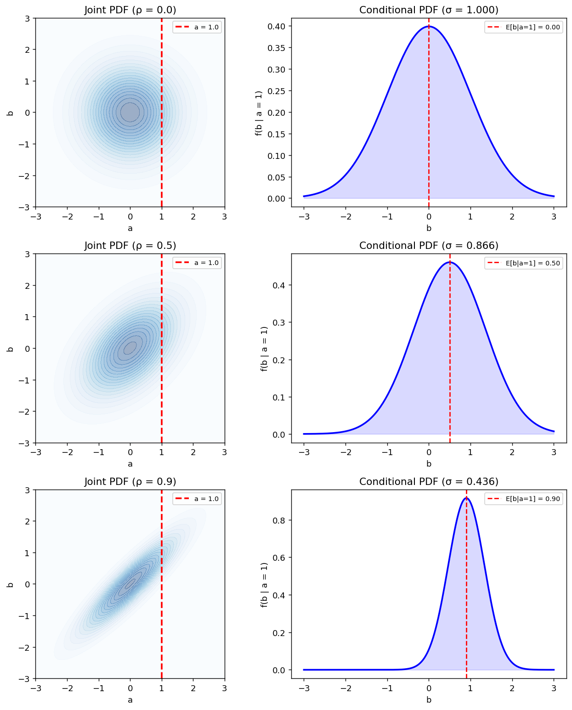

# 2차원 Gaussian 조건부분포

## 개요

이변량 정규분포의 강력한 성질 하나는 **조건부분포도 정규분포**라는 것이다. $(a, b)^\top$가 상관계수 $\rho$인 표준 이변량 정규분포를 따르면:

$$
b \mid a = a_0 \;\sim\; N\!\left(\rho\, a_0,\; 1 - \rho^2\right)
$$

조건부 평균은 $a_0$의 선형함수이고, 조건부 분산 $1 - \rho^2$은 $a_0$에 의존하지 않고 오직 $\rho$에만 의존한다.

---

## 일반적인 경우

평균이 $\mu_a, \mu_b$, 분산이 $\sigma_a^2, \sigma_b^2$, 상관계수가 $\rho$인 이변량 정규분포에 대해:

$$
b \mid a = a_0 \;\sim\; N\!\left(\mu_b + \rho\frac{\sigma_b}{\sigma_a}(a_0 - \mu_a),\; \sigma_b^2(1 - \rho^2)\right)
$$

!!! tip "핵심 통찰"
    조건부 평균은 정확히 $a$에 대한 $b$의 **회귀직선**이다. 조건부 분산은 선형 관계를 반영하고 남은 잔차분산이다.

---

## 코드

<div class="codebox" markdown>

**예제 1.** 이변량 정규분포의 조건부분포

```python
import numpy as np
import matplotlib.pyplot as plt

def bivariate_gaussian_pdf(x, y, rho):
    """표준화된 이변량 정규분포의 밀도. 두 주변분포가 모두 N(0,1)이고
    상관계수만 rho 인 경우다."""
    return (np.exp(-(x**2 - 2*rho*x*y + y**2) / (2*(1 - rho**2)))
            / (2 * np.pi * np.sqrt(1 - rho**2)))


def conditional_pdf(x0, y, rho):
    """X = x0 으로 조건을 걸었을 때 Y의 분포.

    이변량 정규분포의 핵심 성질 두 가지가 여기 들어 있다.
      1. 조건부분포도 **정규분포**다. (다른 분포에서는 일반적으로 성립하지 않는다.)
      2. 조건부 평균은 x0에 **선형**으로 의존한다: mu = rho * x0.
         이것이 선형회귀가 왜 정규분포 가정과 잘 맞는지의 뿌리다.
      3. 조건부 분산 1 - rho^2 은 **x0에 의존하지 않는다.**
         어디를 잘라도 폭이 같다는 뜻이며, 회귀의 등분산 가정에 대응한다.
    """
    sigma_cond = np.sqrt(1 - rho**2)
    mu_cond = rho * x0
    return (1 / (np.sqrt(2*np.pi) * sigma_cond)
            * np.exp(-0.5 * ((y - mu_cond) / sigma_cond)**2))

x = np.linspace(-3, 3, 200)
y = np.linspace(-3, 3, 200)
X, Y = np.meshgrid(x, y)

rho_vals = [0.0, 0.5, 0.9]
cond_val = 1.0  # condition on a = 1

fig, axes = plt.subplots(len(rho_vals), 2, figsize=(10, 4 * len(rho_vals)))

for i, rho in enumerate(rho_vals):
    Z = bivariate_gaussian_pdf(X, Y, rho)
    mu_cond = rho * cond_val
    sigma_cond = np.sqrt(1 - rho**2)

    # 결합분포 등고선에 자른 면을 표시
    ax = axes[i, 0]
    ax.contourf(X, Y, Z, levels=20, cmap="Blues", alpha=0.4)
    ax.axvline(cond_val, color="red", linestyle="--", lw=2, label=f"a = {cond_val}")
    ax.set_xlabel("a")
    ax.set_ylabel("b")
    ax.set_title(f"Joint PDF (ρ = {rho})")
    ax.legend(fontsize=8)
    ax.set_aspect("equal")

    # 조건부 밀도함수
    ax = axes[i, 1]
    cond_y = conditional_pdf(cond_val, y, rho)
    ax.plot(y, cond_y, "b-", lw=2)
    ax.axvline(mu_cond, color="red", linestyle="--", lw=1.5,
               label=f"E[b|a=1] = {mu_cond:.2f}")
    ax.fill_between(y, cond_y, alpha=0.15, color="blue")
    ax.set_xlabel("b")
    ax.set_ylabel("f(b | a = 1)")
    ax.set_title(f"Conditional PDF (σ = {sigma_cond:.3f})")
    ax.legend(fontsize=8)

plt.tight_layout()
plt.show()
```



</div>

---

## 해석

| $\rho$ | $E[b \mid a=1]$ | $\text{Var}(b \mid a=1)$ | 효과 |
|---|---|---|---|
| 0 | 0 | 1 | $a$로 조건화해도 $b$에 대한 정보가 없다 |
| 0.5 | 0.5 | 0.75 | 불확실성이 중간 정도로 줄어든다 |
| 0.9 | 0.9 | 0.19 | $a$를 알면 $b$가 거의 결정된다 |

$|\rho| \to 1$일 때 조건부분포는 회귀직선 주위로 모이고 조건부 분산은 0에 가까워진다.

---

## 연습문제

<div class="drillbox" markdown>

**연습문제 1.** <span class="diff easy" title="쉬움"></span>
$\rho = 0.8$인 표준 이변량 정규분포에서 $a = 2$가 주어졌을 때 $b$의 조건부 평균과 분산을 계산하라.

</div>

??? success "풀이"
    $$
    E[b \mid a = 2] = \rho \cdot 2 = 0.8 \times 2 = 1.6
    $$

    $$
    \text{Var}(b \mid a = 2) = 1 - \rho^2 = 1 - 0.64 = 0.36
    $$

    따라서 $b \mid a = 2 \sim N(1.6, 0.36)$이고 조건부 표준편차는 $0.6$이다.

<div class="drillbox" markdown>

**연습문제 2.** <span class="diff med" title="중간"></span>
표준 이변량 정규분포의 조건부분포 공식 $b \mid a = a_0 \sim N(\rho a_0, 1 - \rho^2)$을 증명하라.

</div>

??? success "풀이"
    결합밀도는:

    $$
    f(a, b) = \frac{1}{2\pi\sqrt{1-\rho^2}}\exp\!\left(-\frac{a^2 - 2\rho ab + b^2}{2(1-\rho^2)}\right)
    $$

    $a$의 주변분포는 $f_a(a) = \frac{1}{\sqrt{2\pi}}e^{-a^2/2}$이다. 따라서 $b$에 대해 완전제곱식을 만들면:

    $$
    f(b \mid a = a_0) = \frac{f(a_0, b)}{f_a(a_0)} \propto \exp\!\left(-\frac{(b - \rho a_0)^2}{2(1-\rho^2)}\right)
    $$

    이는 $N(\rho a_0, 1-\rho^2)$의 핵이다. $\square$

<div class="drillbox" markdown>

**연습문제 3.** <span class="diff med" title="중간"></span>
조건부 평균 $E[b \mid a] = \rho \cdot a$와 $a$에 대한 $b$의 단순선형회귀 사이의 연결을 설명하라.

</div>

??? success "풀이"
    표준화된 변수(평균 0, 분산 1)에 대해 $a$에 대한 $b$의 단순선형회귀에서 회귀직선은 $\hat{b} = \rho \cdot a$이며 $\rho$는 상관계수이다. 이변량 정규분포에서는 이 회귀직선이 단지 최선의 선형 예측자인 데 그치지 않고 **조건부 기댓값** $E[b \mid a]$ 그 자체이다. 일반적으로 $E[Y \mid X]$는 비선형일 수 있지만, 이변량 정규분포에서는 정확히 선형이다.

<div class="drillbox" markdown>

**연습문제 4.** <span class="diff easy" title="쉬움"></span>
$\rho = 0$이면 조건부분포는 무엇이 되는가? 이를 독립성 개념과 연결하라.

</div>

??? success "풀이"
    $\rho = 0$이면 $E[b \mid a = a_0] = 0$이고 $\text{Var}(b \mid a = a_0) = 1$이다. 조건부분포 $b \mid a \sim N(0, 1)$은 $a_0$에 전혀 의존하지 않으며, $b$의 주변분포와 같다.

    이것이 독립성의 정의이다. 모든 $a$에 대해 $f(b \mid a) = f(b)$인 것이다. 이변량 정규분포에서 $\rho = 0$은 독립성의 필요충분조건이다.

---

## 정리하며

이변량 정규분포의 조건부분포도 **정규분포**이며, 이 사실 하나에서 회귀가 통째로 나온다.

$$
b \mid a = a_0 \;\sim\; N\!\left(\mu_b + \rho\frac{\sigma_b}{\sigma_a}(a_0 - \mu_a),\; \sigma_b^2(1-\rho^2)\right)
$$

- **조건부 평균이 곧 회귀직선이다.** 기울기 $\rho\,\sigma_b/\sigma_a$ 는 최소제곱 기울기와 정확히 같다. 3장에서 $\mathbb{E}[Y\mid X]$ 가 최적 예측임을 보았는데, 정규분포에서는 그 최적 예측이 마침 **선형**이다.
- **조건부 분산 $\sigma_b^2(1-\rho^2)$ 은 $a_0$ 에 의존하지 않는다.** 회귀분석이 가정하는 **등분산성**이 여기서는 결과로 따라 나온다.
- **$1-\rho^2$ 이 설명되지 않고 남은 비율**이다. 회귀의 $R^2=\rho^2$ 라는 익숙한 관계가 그대로 읽힌다.
- **조건을 걸면 분산이 줄어든다.** $|\rho|$ 가 클수록 많이 줄고, $\rho=0$ 이면 전혀 줄지 않는다. 정보를 얻는다는 것이 곧 불확실성이 준다는 뜻임을 정량적으로 보여 준다.

다음 절 **2차원 정규분포 고유분해**는 같은 분포를 좌표 없이 본다. 타원의 축이 어디를 향하고 얼마나 긴지를 공분산행렬의 고유벡터와 고윳값이 직접 알려 준다.
