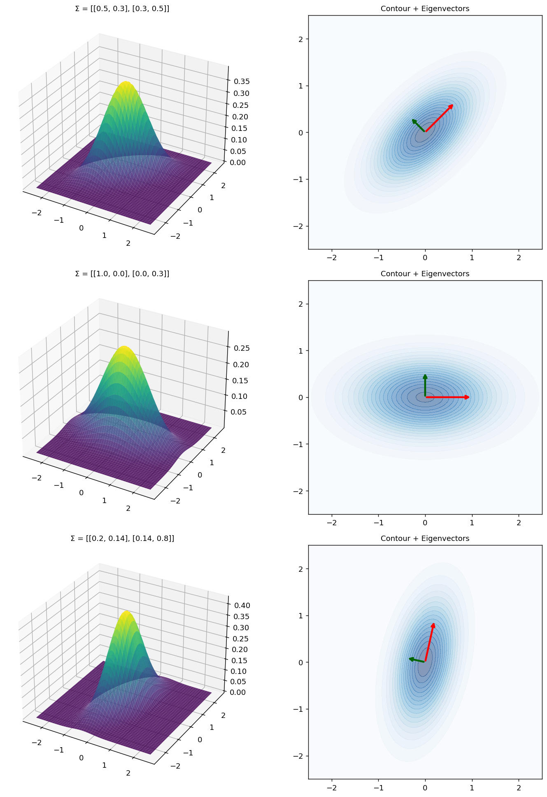

# 2차원 Gaussian 고유분해

## 개요

이변량 Gaussian의 공분산행렬 $\boldsymbol{\Sigma}$는 다음과 같이 분해할 수 있다:

$$
\boldsymbol{\Sigma} = \mathbf{U}\mathbf{D}\mathbf{U}^\top
$$

여기서 $\mathbf{U}$는 고유벡터(주방향)로 이루어진 행렬이고 $\mathbf{D} = \text{diag}(\lambda_1, \lambda_2)$는 고윳값의 대각행렬이다. 고유벡터는 확률타원의 축 방향을 가리키며, $\sqrt{\lambda_i}$는 각 주방향의 표준편차를 준다.

---

## 기하적 해석

이변량 정규분포의 등밀도 등고선은 다음을 만족한다:

$$
(\mathbf{x} - \boldsymbol{\mu})^\top \boldsymbol{\Sigma}^{-1} (\mathbf{x} - \boldsymbol{\mu}) = c
$$

이 타원들은:

- **축 방향**이 $\boldsymbol{\Sigma}$의 고유벡터와 일치하고
- **축의 반길이**가 $\sqrt{\lambda_i}$에 비례한다

이는 고유분해의 직접적인 결과이다. $\mathbf{U}$가 정의하는 회전된 좌표계에서 공분산행렬은 대각행렬이 되고 타원은 좌표축에 정렬된다.

---

## 코드

```python
import numpy as np
import matplotlib.pyplot as plt

def bivariate_normal_pdf(X, Y, inv_Sigma, det_Sigma):
    """평균이 0인 이변량 정규분포의 밀도를 정의대로 계산한다.

    지수의 어깨에 있는 것이 이차형식 z' Sigma^{-1} z 이고,
    이를 전개하면 아래처럼 X^2, XY, Y^2 항이 나온다.
    분모의 sqrt(det Sigma) 는 전체 적분을 1로 만드는 정규화 상수다.
    """
    return (np.exp(-(inv_Sigma[0,0]*X**2 + 2*inv_Sigma[0,1]*X*Y
                     + inv_Sigma[1,1]*Y**2) / 2)
            / (2 * np.pi * np.sqrt(det_Sigma)))

# 공분산행렬 셋. 고유분해가 무엇을 알려 주는지 비교하기 위한 것이다.
#   1) 비대각이 0이 아님  -> 타원이 45도로 기운다. 고유벡터도 기운다.
#   2) 대각행렬          -> 타원이 축에 나란하다. 고유벡터가 곧 좌표축이다.
#   3) 비대각도 있고 분산도 다름 -> 기울기와 늘어남이 함께 나타난다.
configs = [
    {"label": "Σ = [[0.5, 0.3], [0.3, 0.5]]",
     "Sigma": np.array([[0.5, 0.3], [0.3, 0.5]])},
    {"label": "Σ = [[1.0, 0.0], [0.0, 0.3]]",
     "Sigma": np.array([[1.0, 0.0], [0.0, 0.3]])},
    {"label": "Σ = [[0.2, 0.14], [0.14, 0.8]]",
     "Sigma": np.array([[0.2, 0.14], [0.14, 0.8]])},
]

x = np.linspace(-2.5, 2.5, 200)
X, Y = np.meshgrid(x, x)

fig, axes = plt.subplots(len(configs), 2, figsize=(12, 5 * len(configs)))

for i, cfg in enumerate(configs):
    Sigma = cfg["Sigma"]
    inv_Sigma = np.linalg.inv(Sigma)
    det_Sigma = np.linalg.det(Sigma)

    # eigh 는 **대칭행렬 전용** 고유분해다. 공분산행렬은 언제나 대칭이므로
    # 일반용 eig 보다 빠르고 수치적으로 안정하며, 고윳값이 실수로 나온다.
    # 결과의 기하학적 의미:
    #   고유벡터 = 타원의 주축 방향
    #   고윳값   = 그 방향의 분산. sqrt(고윳값)이 그 축의 반지름이다.
    eigenvalues, eigenvectors = np.linalg.eigh(Sigma)

    Z = bivariate_normal_pdf(X, Y, inv_Sigma, det_Sigma)

    # eigh는 고윳값을 오름차순으로 준다. 큰 것(장축)이 먼저 오도록 뒤집는다.
    # eigenvectors는 **열**이 고유벡터이므로 [:, idx] 로 열을 재배열한다.
    idx = eigenvalues.argsort()[::-1]
    eigenvalues = eigenvalues[idx]
    eigenvectors = eigenvectors[:, idx]

    # 3D surface
    axes[i, 0].remove()
    ax3d = fig.add_subplot(len(configs), 2, 2*i + 1, projection="3d")
    ax3d.plot_surface(X, Y, Z, cmap="viridis", alpha=0.85, edgecolor="none")
    ax3d.set_title(cfg["label"], fontsize=10)

    # Contour with eigenvectors
    ax = axes[i, 1]
    ax.contourf(X, Y, Z, levels=20, cmap="Blues", alpha=0.5)
    colors_ev = ["red", "darkgreen"]
    for j in range(2):
        scale = np.sqrt(eigenvalues[j])
        dx = eigenvectors[0, j] * scale
        dy = eigenvectors[1, j] * scale
        ax.annotate("", xy=(dx, dy), xytext=(0, 0),
                    arrowprops=dict(arrowstyle="->", color=colors_ev[j], lw=2.5))
    ax.set_title("Contour + Eigenvectors", fontsize=10)
    ax.set_aspect("equal")

plt.tight_layout()
plt.show()
```



---

## 해석

$\boldsymbol{\Sigma} = \begin{pmatrix}0.5 & 0.3 \\ 0.3 & 0.5\end{pmatrix}$에 대해:

- 고윳값: $\lambda_1 = 0.8$, $\lambda_2 = 0.2$
- 주된 고유벡터는 $(1, 1)/\sqrt{2}$ 방향(양의 상관 방향)을 가리킨다
- 비 $\sqrt{\lambda_1/\lambda_2} = 2$가 타원의 이심 정도를 준다

$\boldsymbol{\Sigma}$가 대각행렬이면(상관이 없으면) 고유벡터가 좌표축과 일치하고 등고선은 좌표축에 정렬된 타원(분산이 같으면 원)이 된다.

---

## 연습문제

<div class="drillbox" markdown>

**연습문제 1.**
$\boldsymbol{\Sigma} = \begin{pmatrix}1 & 0 \\ 0 & 0.3\end{pmatrix}$의 고윳값과 고유벡터를 계산하고 등고선 모양을 서술하라.

</div>

??? success "풀이"
    $\boldsymbol{\Sigma}$가 대각행렬이므로 고윳값은 $\lambda_1 = 1$, $\lambda_2 = 0.3$이고 고유벡터는 $\mathbf{e}_1 = (1, 0)^\top$, $\mathbf{e}_2 = (0, 1)^\top$이다. 등고선은 좌표축에 정렬된 타원이며 ($\lambda_1 > \lambda_2$이므로) $x_1$ 축 방향으로 길쭉하다. 축 길이의 비는 $\sqrt{1/0.3} \approx 1.83$이다.

<div class="drillbox" markdown>

**연습문제 2.**
공분산행렬의 고윳값이 항상 음이 아님을 증명하라.

</div>

??? success "풀이"
    공분산행렬 $\boldsymbol{\Sigma}$는 양의 준정부호이다. 즉 모든 $\mathbf{v}$에 대해 $\mathbf{v}^\top\boldsymbol{\Sigma}\mathbf{v} \ge 0$이다. $\lambda$가 고유벡터 $\mathbf{u}$($\|\mathbf{u}\| = 1$)에 대응하는 고윳값이면:

    $$
    0 \le \mathbf{u}^\top\boldsymbol{\Sigma}\mathbf{u} = \mathbf{u}^\top(\lambda\mathbf{u}) = \lambda
    $$

    따라서 $\lambda \ge 0$이다. $\square$

<div class="drillbox" markdown>

**연습문제 3.**
$\text{tr}(\boldsymbol{\Sigma}) = \lambda_1 + \lambda_2$이고 $|\boldsymbol{\Sigma}| = \lambda_1\lambda_2$임을 보여라. $\boldsymbol{\Sigma} = \begin{pmatrix}0.5 & 0.3 \\ 0.3 & 0.5\end{pmatrix}$에 대해 둘 다 확인하라.

</div>

??? success "풀이"
    $\boldsymbol{\Sigma} = \mathbf{U}\mathbf{D}\mathbf{U}^\top$이므로:

    $$
    \text{tr}(\boldsymbol{\Sigma}) = \text{tr}(\mathbf{U}\mathbf{D}\mathbf{U}^\top) = \text{tr}(\mathbf{D}) = \lambda_1 + \lambda_2
    $$

    $$
    |\boldsymbol{\Sigma}| = |\mathbf{U}||\mathbf{D}||\mathbf{U}^\top| = \lambda_1\lambda_2
    $$

    주어진 행렬에 대해 $\text{tr} = 0.5 + 0.5 = 1.0$이고 $\lambda_1 + \lambda_2 = 0.8 + 0.2 = 1.0$이다. 또한 $|\boldsymbol{\Sigma}| = 0.25 - 0.09 = 0.16$이고 $\lambda_1\lambda_2 = 0.8 \times 0.2 = 0.16$이다. 두 항등식 모두 성립한다.

<div class="drillbox" markdown>

**연습문제 4.**
점 $\mathbf{x}$에서 평균 $\boldsymbol{\mu}$까지의 **Mahalanobis 거리**는 $d_M = \sqrt{(\mathbf{x}-\boldsymbol{\mu})^\top\boldsymbol{\Sigma}^{-1}(\mathbf{x}-\boldsymbol{\mu})}$이다. 주성분 좌표계(고유벡터 기저)에서 이것이 각 축을 $1/\sqrt{\lambda_i}$로 척도조정한 유클리드 거리로 환원됨을 보여라.

</div>

??? success "풀이"
    회전된 좌표 $\mathbf{z} = \mathbf{U}^\top(\mathbf{x} - \boldsymbol{\mu})$에서:

    $$
    d_M^2 = \mathbf{z}^\top \mathbf{D}^{-1} \mathbf{z} = \frac{z_1^2}{\lambda_1} + \frac{z_2^2}{\lambda_2}
    $$

    이는 각 성분을 $\sqrt{\lambda_i}$로 나눈 유클리드 거리의 제곱이다. Mahalanobis 거리는 각 주방향을 그 표준편차로 "표준화"하므로 척도와 상관에 불변이 된다. $\square$
