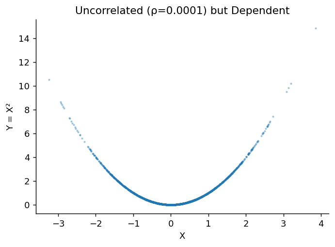
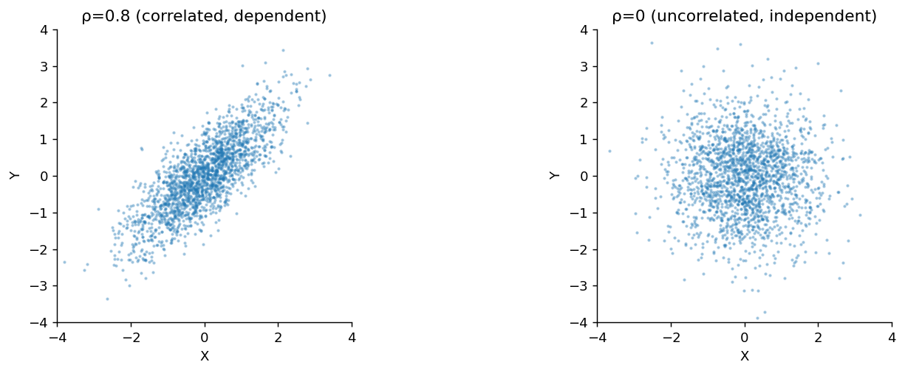

# 독립성과 무상관성의 차이

## 개요

무상관인 확률변수는 독립이라는 오해가 흔하다. **독립이면 상관계수가 0이지만**, 그 역은 일반적으로 **성립하지 않는다**. 이 절에서는 증명과 반례, 그리고 두 개념이 일치하는 특수한 경우를 통해 이 구별을 명확히 한다.

---

## 독립성과 무상관성


<div class="defn" markdown>

**정의 1.** [독립성]

$X$와 $Y$가 **독립**($X \perp Y$)이라는 것은 다음을 뜻한다:

$$
P(X \in A, Y \in B) = P(X \in A) \cdot P(Y \in B) \quad \text{for all sets } A, B
$$

동등하게, 결합 밀도/PMF가 인수분해된다: $f_{X,Y}(x,y) = f_X(x) \cdot f_Y(y)$.

</div>

<div class="defn" markdown>

**정의 2.** [무상관성]

$X$와 $Y$가 **무상관**이라는 것은 다음을 뜻한다:

$$
\text{Cov}(X, Y) = E[XY] - E[X]E[Y] = 0
$$

동등하게, $\rho(X,Y) = 0$ 또는 $E[XY] = E[X]E[Y]$이다.

---

</div>

## 독립이면 상관계수가 0이다

**정리:** $X \perp Y$이면 $\text{Cov}(X,Y) = 0$이다.

??? proof "증명"


    $X$와 $Y$가 독립이면 $E[XY] = E[X] \cdot E[Y]$이다(곱의 기댓값이 기댓값의 곱과 같다). 따라서:

    $$
    \text{Cov}(X,Y) = E[XY] - E[X]E[Y] = E[X]E[Y] - E[X]E[Y] = 0
    $$

    더 일반적으로, 독립성은 **모든** 가측함수 $g, h$에 대해 $E[g(X)h(Y)] = E[g(X)]E[h(Y)]$임을 함의한다. 무상관성은 $g(x) = x$와 $h(y) = y$인 경우만 요구한다.

    ---

## 상관계수가 0이어도 독립은 아니다

### 반례 1: 대칭적인 비선형 의존성

$X \sim N(0, 1)$이고 $Y = X^2$이라 하자. 그러면 $Y$는 $X$에 의해 완전히 결정되지만(최대한의 의존성), 다음이 성립한다:

$$
\text{Cov}(X, Y) = E[XY] - E[X]E[Y] = E[X^3] - 0 \cdot E[X^2] = 0
$$

표준정규분포의 대칭성에 의해 $E[X^3] = 0$이기 때문이다.

**왜 이렇게 되는가:** 상관계수는 **선형** 의존성만 측정한다. $Y = X^2$이라는 관계는 완전히 비선형이면서 대칭이므로, 공분산 계산에서 양의 편차와 음의 편차가 상쇄된다.

### 반례 2: 이산형 예

$X \sim \text{Uniform}\{-1, 0, 1\}$이고 $Y = |X|$라 하자:

| $X$ | $Y = \|X\|$ | $P$ |
|:---:|:---:|:---:|
| $-1$ | $1$ | $1/3$ |
| $0$ | $0$ | $1/3$ |
| $1$ | $1$ | $1/3$ |

$$
E[X] = 0, \quad E[Y] = \tfrac{2}{3}, \quad E[XY] = (-1)(1)\tfrac{1}{3} + 0 + (1)(1)\tfrac{1}{3} = 0
$$

$$
\text{Cov}(X,Y) = 0 - 0 \cdot \tfrac{2}{3} = 0
$$

그러나 $X$와 $Y$는 **독립이 아니다**: $P(Y = 0 \mid X = 0) = 1 \neq P(Y = 0) = 1/3$이다.

### 반례 3: 단위원

$(X, Y)$가 단위원 위에 균등하게 분포한다고 하자. 대칭성에 의해 $\text{Cov}(X,Y) = 0$이지만, $X^2 + Y^2 = 1$이므로 둘은 완전히 의존적이다.

---

## 언제 두 개념이 동등한가?

### 결합정규 확률변수

**정리:** $(X, Y)$가 **이변량 정규분포**를 따르면:

$$
\text{Cov}(X, Y) = 0 \iff X \perp Y
$$

이는 다변량 정규분포의 특별하고도 매우 중요한 성질이다. 이변량 정규 PDF는 다음과 같다:

$$
f(x,y) = \frac{1}{2\pi\sigma_X\sigma_Y\sqrt{1-\rho^2}} \exp\left(-\frac{1}{2(1-\rho^2)}\left[\frac{(x-\mu_X)^2}{\sigma_X^2} - \frac{2\rho(x-\mu_X)(y-\mu_Y)}{\sigma_X\sigma_Y} + \frac{(y-\mu_Y)^2}{\sigma_Y^2}\right]\right)
$$

$\rho = 0$이면 교차항이 사라지고 결합 PDF가 두 주변 정규 PDF의 곱으로 인수분해된다.

### 이항 확률변수

각각 두 값만 취하는 확률변수에 대해서도 공분산이 0이면 독립이다.

---

## 요약 도식

$$
\boxed{
\text{Independence} \implies \text{Zero Correlation} \implies E[XY] = E[X]E[Y]
}
$$

$$
\text{Zero Correlation} \;\not\!\!\!\implies \text{Independence} \quad \text{(일반적으로)}
$$

$$
\text{Zero Correlation} \iff \text{Independence} \quad \text{(결합정규일 때)}
$$

---

## 의존성 개념의 위계

강한 것부터 약한 것 순으로:

$$
\begin{aligned}
&\textbf{Functional dependence:} \quad Y = g(X) \\[4pt]
&\textbf{Statistical dependence:} \quad f_{X,Y} \neq f_X \cdot f_Y \\[4pt]
&\textbf{Correlation:} \quad \rho \neq 0 \\[4pt]
&\textbf{Uncorrelated:} \quad \rho = 0 \\[4pt]
&\textbf{Independence:} \quad f_{X,Y} = f_X \cdot f_Y
\end{aligned}
$$

상관계수는 선형적인 양상을 잡아낸다. 의존성은 어떤 형태든 취할 수 있다. 어떤 변수가 다른 변수의 함수로 완전히 결정되면서도 무상관일 수 있다(위의 반례들이 보여 준 대로).

---

## Python: 차이를 보이기

### 무상관이지만 의존적인 경우: Y = X의 제곱

```python
import numpy as np
import matplotlib.pyplot as plt

np.random.seed(42)
n = 100_000
X = np.random.normal(0, 1, n)
Y = X**2        # X만 알면 Y가 완전히 결정된다. 이보다 강한 종속은 없다.

# 그런데 상관계수는 0이 나온다.
# Cov(X, X^2) = E[X^3] - E[X]E[X^2] 인데, X가 0을 중심으로 대칭이면
# E[X] = 0 이고 E[X^3] = 0 이므로 공분산이 정확히 0이다.
# 상관은 **직선 관계만** 재기 때문에 포물선 관계를 전혀 보지 못한다.
corr = np.corrcoef(X, Y)[0, 1]
print(f"Correlation(X, X²) = {corr:.6f}")
print(f"But Y is completely determined by X!")

fig, ax = plt.subplots(figsize=(6, 4))
ax.scatter(X[:2000], Y[:2000], s=2, alpha=0.3)
ax.set_xlabel('X')
ax.set_ylabel('Y = X²')
ax.set_title(f'Uncorrelated (ρ={corr:.4f}) but Dependent')
ax.spines[['top', 'right']].set_visible(False)
plt.show()
```

출력:

```
Correlation(X, X²) = 0.000122
But Y is completely determined by X!
```



### 독립성 검정: 결합분포와 주변분포의 곱 비교

독립의 정의는 **모든** 사건 쌍에 대해 $P(A \cap B) = P(A)P(B)$가 성립하는 것이다. 따라서 사건을 하나 골라 확인하는 것으로는 독립을 증명할 수 없고, **반례를 하나 찾으면 종속을 증명할 수 있다.**

```python
import numpy as np

np.random.seed(42)
n = 100_000
X = np.random.normal(0, 1, n)
Y = X**2


def check(name, A, B):
    """P(A ∩ B) 와 P(A)P(B) 를 비교한다. 다르면 독립이 아니다."""
    p_joint = np.mean(A & B)
    p_prod = np.mean(A) * np.mean(B)
    same = np.isclose(p_joint, p_prod, atol=0.01)
    print(f"{name}\n  P(A∩B) = {p_joint:.4f},  P(A)P(B) = {p_prod:.4f}"
          f"  ->  {'같다' if same else '다르다'}")


# 사건을 잘못 고르면 종속인데도 통과한다.
# X>0 과 X^2>1 은 X의 대칭성 때문에 우연히 곱셈 규칙을 만족한다.
check("A: X>0,      B: Y>1", X > 0, Y > 1)

# 반례를 제대로 고르면 곧바로 드러난다.
# |X| < 0.5 이면 Y = X^2 < 0.25 이므로 Y > 1 일 수가 없다. 결합확률이 0이다.
check("A: |X|<0.5,  B: Y>1", np.abs(X) < 0.5, Y > 1)
```

출력:

```
A: X>0,      B: Y>1
  P(A∩B) = 0.1599,  P(A)P(B) = 0.1596  ->  같다
A: |X|<0.5,  B: Y>1
  P(A∩B) = 0.0000,  P(A)P(B) = 0.1218  ->  다르다
```

**첫 번째 쌍이 통과했다고 독립인 것이 아니다.** 두 번째 쌍이 곱셈 규칙을 깨뜨리므로 $X$와 $Y$는 독립이 아니다. 반례 하나면 충분하다.

이것이 상관계수만 보는 것의 위험과 같은 구조다. 상관은 사실상 "한 가지 방식으로만" 관계를 확인하는 것이고, 위의 첫 번째 검사도 한 가지 사건 쌍만 확인한 것이다. 어느 쪽이든 **통과했다는 사실은 아무것도 보장하지 않는다.**

### 결합정규일 때: 무상관 ↔ 독립

```python
import numpy as np
import matplotlib.pyplot as plt

np.random.seed(42)
n = 100_000

# 결합정규분포에서는 앞의 반례가 통하지 않는다.
# 이 경우에만 "무상관 = 독립"이 성립하기 때문이다.
# 주의: 두 변수가 **각각** 정규분포인 것으로는 부족하고,
#       둘의 **결합분포**가 정규여야 한다.
rho = 0.8
cov = [[1, rho], [rho, 1]]
corr_data = np.random.multivariate_normal([0, 0], cov, n)

# rho = 0 인 결합정규. 무상관이면서 동시에 독립이다.
indep_data = np.random.multivariate_normal([0, 0], [[1, 0], [0, 1]], n)

fig, axes = plt.subplots(1, 2, figsize=(12, 4))
for ax, data, title in zip(axes,
    [corr_data, indep_data],
    [f'ρ={rho} (correlated, dependent)', 'ρ=0 (uncorrelated, independent)']):
    ax.scatter(data[:2000, 0], data[:2000, 1], s=2, alpha=0.3)
    ax.set_xlabel('X')
    ax.set_ylabel('Y')
    ax.set_title(title)
    ax.set_aspect('equal')
    ax.set_xlim(-4, 4)
    ax.set_ylim(-4, 4)
    ax.spines[['top', 'right']].set_visible(False)
plt.tight_layout()
plt.show()

# Verify independence for uncorrelated normals
p_joint = np.mean((indep_data[:, 0] > 1) & (indep_data[:, 1] > 1))
p_prod = np.mean(indep_data[:, 0] > 1) * np.mean(indep_data[:, 1] > 1)
print(f"Jointly normal, ρ=0:")
print(f"  P(X>1,Y>1) = {p_joint:.4f}, P(X>1)P(Y>1) = {p_prod:.4f}")
print(f"  Independent? {np.isclose(p_joint, p_prod, atol=0.005)}")
```

출력:

```
Jointly normal, ρ=0:
  P(X>1,Y>1) = 0.0255, P(X>1)P(Y>1) = 0.0253
  Independent? True
```



---

## 연습문제

<div class="drillbox" markdown>

**연습문제 1.** <span class="diff med" title="중간"></span>
$X$가 대칭이고 $\mathbb{E}[X] = 0$, $\mathbb{E}[X^2] = 1$, $\mathbb{E}[X^3] = 0$이다. $Y = X^2$이라 하자. (a) $\mathrm{Cov}(X, Y)$. (b) $\rho(X, Y)$. (c) 둘은 독립인가?

</div>

??? success "풀이"
    (a) $\mathrm{Cov}(X, Y) = \mathbb{E}[XY] - \mathbb{E}[X]\mathbb{E}[Y] = \mathbb{E}[X^3] - 0 = 0$.

    (b) $\rho(X, Y) = 0/(\sigma_X \sigma_Y) = 0$.

    (c) **독립이 아니다.** $Y = X^2$은 $X$의 결정론적 함수이다. $X = 3$을 알면 $Y = 9$가 결정된다. 상관계수는 관계의 *선형* 성분만 잡아내는데, 양수와 음수인 $X$가 같은 $Y$ 값을 주기 때문에 이 이차 의존성의 선형 성분은 0이다.

    **교훈:** 무상관성은 독립성의 필요조건이지 충분조건이 아니다. 항상 자료를 그려 보라.

<div class="drillbox" markdown>

**연습문제 2.** <span class="diff med" title="중간"></span>
**무상관성이 독립성을 함의하는 경우.** 무상관성이 독립성을 보장하는 경우를 밝히고 증명하라.

</div>

??? success "풀이"
    **특수한 경우:** $(X, Y)$가 **결합정규**이면 무상관성이 독립성을 함의한다.

    **증명:** 이변량 정규분포에 대해

    $$
    f(x, y) = \frac{1}{2\pi\sigma_X\sigma_Y\sqrt{1-\rho^2}}\exp\!\left(-\frac{Q(x, y)}{2(1-\rho^2)}\right)
    $$

    이며 $Q$는 교차항 $-2\rho(x - \mu_X)(y - \mu_Y)/(\sigma_X \sigma_Y)$를 포함한다. $\rho = 0$이면 이 교차항이 사라지고 $Q$는 $x$만 포함하는 항과 $y$만 포함하는 항의 합으로 갈라진다. 그러면 밀도가 인수분해된다:

    $$
    f(x, y) = f_X(x) \cdot f_Y(y)
    $$

    이것이 독립성의 정의이다. $\square$

    **참고:** *결합* 정규성 가정이 결정적이다. $X$와 $Y$가 각각 주변적으로 정규인 것만으로는 충분하지 않다. $X, Y$가 각각 $N(0, 1)$이지만 결합정규가 아니어서 무상관성이 독립성을 함의하지 않는 반례들이 존재한다.

<div class="drillbox" markdown>

**연습문제 3.** <span class="diff hard" title="어려움"></span>
**거리 상관계수**는 독립일 때 그리고 그때만 0이 되어 Pearson 상관계수의 한계를 보완한다. 거리 상관계수를 개념적으로 정의하고 주된 장점을 서술하라.

</div>

??? success "풀이"
    **거리 상관계수**(Székely, Rizzo, Bakirov 2007)는 다음을 만족하는 의존성 측도이다:

    $$
    \mathrm{dCor}(X, Y) = 0 \iff X \perp\!\!\!\perp Y
    $$

    **정의(비형식적):** $X$ 표본들 사이의 쌍별 거리와 $Y$ 표본들 사이의 쌍별 거리를 계산하고, 각 거리행렬을 이중 중심화한 다음, 중심화된 두 거리행렬 사이의 "상관계수"를 계산한다.

    **Pearson 상관계수에 대한 장점:**

    - **비선형** 의존성을 탐지한다(예: $Y = X^2$).
    - $X$와 $Y$의 차원이 달라도 의존성을 탐지한다.
    - 항상 $[0, 1]$에 속한다(Pearson의 절댓값과 비슷하지만 언제나 음이 아니다).
    - $\mathrm{dCor} = 0$일 필요충분조건이 독립성이다(Pearson과 달리 완전한 진단이 된다).

    **비용:** 표본크기에 대해 계산복잡도가 $O(n^2)$이며, Pearson의 $O(n)$과 대비된다. $n < 10^4$인 탐색적 분석에서는 거리 상관계수가 점점 더 권장되는 의존성 측도가 되고 있다.

<div class="drillbox" markdown>

**연습문제 4.** <span class="diff hard" title="어려움"></span>
**상호정보량** $I(X; Y) = \mathbb{E}\!\left[\log \frac{p(X, Y)}{p(X) p(Y)}\right]$에 대해, $I(X; Y) \ge 0$이고 $I(X; Y) = 0$일 필요충분조건이 $X \perp\!\!\!\perp Y$임을 보여라.

</div>

??? success "풀이"
    상호정보량은 결합분포 $p(X, Y)$와 주변분포의 곱 $p(X) p(Y)$ 사이의 **Kullback-Leibler 발산**이다:

    $$
    I(X; Y) = D_{KL}(p(X, Y) \| p(X) p(Y))
    $$

    KL 발산은 음이 아니며(볼록함수 $-\log$에 Jensen 부등식을 적용하면 $D_{KL}(p \| q) \ge 0$), 등호는 거의 어디서나 $p = q$일 때만 성립한다.

    따라서 $I(X; Y) \ge 0$이고, 등호는 $p(X, Y) = p(X) p(Y)$일 때만 성립하는데 이것이 바로 독립성이다.

    $\square$

    **활용:** 상호정보량은 정보이론적 의존성 측도이다. 임의의 비선형 의존성과 고차 의존성을 탐지한다. 자료로부터 $I$를 추정하는 것은 (특히 연속변수에서) 까다롭지만 방법들이 존재한다(k-최근접이웃 추정량, 커널밀도추정, 신경망 기반 상호정보량 추정).

<div class="drillbox" markdown>

**연습문제 5.** <span class="diff med" title="중간"></span>
**순위 상관계수.** Spearman의 $\rho_S$는 순위들 사이의 Pearson 상관계수이다. Spearman의 $\rho_S$가 (선형 의존성만 잡는 Pearson과 달리) *단조* 의존성을 포착하며 임의의 단조변환에 불변임을 보여라.

</div>

??? success "풀이"
    각 $X_i$를 그 순위 $R_i^X$(1부터 $n$까지)로 바꾸고 $Y_i$에도 같은 작업을 한다. Spearman 상관계수는

    $$
    \rho_S = \frac{\mathrm{Cov}(R^X, R^Y)}{\sigma_{R^X} \sigma_{R^Y}}
    $$

    **단조 의존성:** 단조증가함수 $g$에 대해 $Y = g(X)$이면 순위가 보존되어 $R^Y = R^X$이므로 $\rho_S = 1$이다. $g$가 단조감소이면 $R^Y = n + 1 - R^X$이므로 $\rho_S = -1$이다. *어떤* 단조 관계든 포착한다.

    **Pearson과의 대비:** Pearson의 $\rho$는 $g$가 선형일 때만 1이 된다. $X$가 $[-1, 1]$ 위의 균등분포일 때 $Y = X^3$이면 Pearson $\rho < 1$이지만, 관계가 완전히 단조이므로 Spearman $\rho_S = 1$이다.

    **불변성:** $X$에 임의의 단조변환 $f$를 적용해도 $R^X$가 보존되므로 $\rho_S$는 그런 변환에 불변이다. 이 때문에 이상점이 선형 상관계수를 왜곡할 수 있을 때 Spearman이 로버스트한 상관 측도가 된다.

    Spearman은 (1) 관계가 비선형이지만 단조일 수 있을 때, (2) 이상점이 있을 때, (3) 변수가 순서형일 때 선호된다.

<div class="drillbox" markdown>

**연습문제 6.** <span class="diff med" title="중간"></span>
**독립성에 대한 실용적 검정.** 표본 $(X_i, Y_i)_{i=1}^n$이 주어졌을 때 서로 보완하는 두 가지 독립성 검정을 제안하고 각각이 언제 적절한지 논하라.

</div>

??? success "풀이"
    **검정 1 — Pearson 상관 검정:** $H_0$ 아래에서(그리고 결합정규성 아래에서) 통계량 $t = \rho\sqrt{n-2}/\sqrt{1 - \rho^2}$는 $t_{n-2}$를 따른다. $|t|$가 임계값을 넘으면 기각한다.

    *적절한 경우:* 관계가 선형이라고 볼 만하고 자료가 근사적으로 이변량 정규일 때.

    **검정 2 — 거리 상관 검정:** 표본에 대해 $\mathrm{dCor}^2$를 계산하고 $n$을 곱해 척도를 맞춘다. $H_0$ 아래에서 점근분포는 가중된 카이제곱 확률변수들의 합을 포함하며, 검정은 순열로 보정한다($Y$ 값을 무작위로 섞어 $\mathrm{dCor}^2$를 다시 계산하여 귀무분포를 만든다).

    *적절한 경우:* 관계가 비선형일 수 있을 때, 주변분포에 대한 가정을 두지 않을 때, 또는 거리 상관계수가 의미를 갖는 충분히 큰 $n$일 때.

    **로버스트성을 위한 병용:** Pearson은 강한 선형 신호를 값싸게 잡아내고, 거리 상관계수는 더 미묘한 비선형 신호를 잡아내지만 계산 비용이 크다. 표준적인 작업 흐름은 다음과 같다. 먼저 Pearson으로 많은 변수 쌍을 훑고, "무상관"으로 보이는 쌍들을 거리 상관계수나 상호정보량으로 다시 살핀다.

    실용적 고려사항: 두 검정 모두 검정력이 $n$에 따라 커진다. $n < 30$이면 상당한 의존성이 있어도 통계적 유의성을 얻기 어렵다. 산점도로 시각화하는 것이 어떤 형식적 검정보다 의존성을 빨리 진단해 주는 경우가 많다.

---

## 정리하며

- 독립성은 무상관성보다 강한 조건이다. 독립이면 상관계수가 0이지만 그 역은 성립하지 않는다.
- 상관계수는 **선형** 관계만 포착한다. 비선형 의존성을 갖는 변수들(예: $Y = X^2$)은 상관계수가 0일 수 있다.
- 결합정규 확률변수에서는 무상관성이 독립성을 **함의한다**. 정규분포만의 강력한 성질이다.
- 무상관을 독립과 동일시하기 전에 결합정규성 가정이 성립하는지 항상 따져 보아야 한다.
- 실무에서 독립성을 확인하려면 상관계수 하나가 아니라 결합분포 전체를 살펴야 한다.
