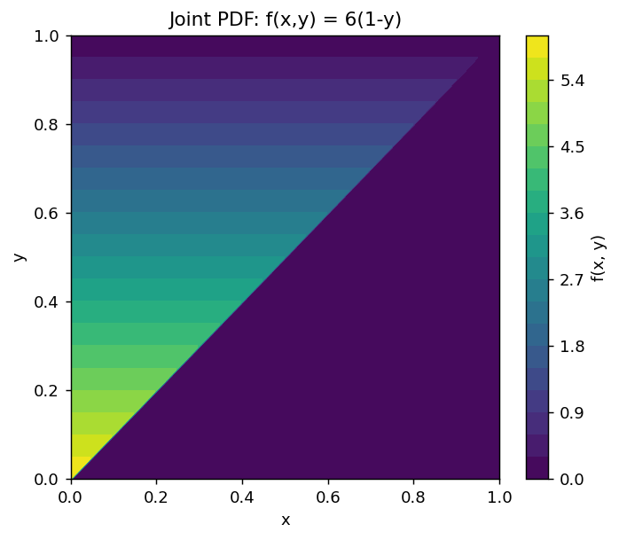
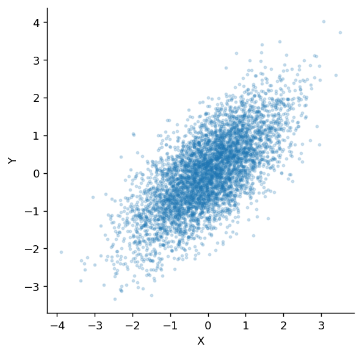

# 결합분포

## 개요

**결합분포**는 둘 이상의 확률변수의 확률적 거동을 동시에 기술한다. 개별 (주변) 분포가 각 변수를 따로 떼어 놓고 알려 주는 데 비해, 결합분포는 변수들이 서로 어떻게 관련되고 의존하는지를 포착한다.

---

## 결합 PMF (이산형)

이산확률변수 $X$와 $Y$에 대해 **결합확률질량함수**는 다음과 같다:

$$
p_{X,Y}(x, y) = P(X = x, Y = y)
$$

### 요건

$$
\begin{aligned}
(1) &\quad p_{X,Y}(x, y) \geq 0 \quad \text{for all } (x, y) \\
(2) &\quad \sum_x \sum_y p_{X,Y}(x, y) = 1
\end{aligned}
$$

### 확률 계산

임의의 영역 $A \subseteq \mathbb{R}^2$에 대해:

$$
P((X, Y) \in A) = \sum_{(x,y) \in A} p_{X,Y}(x, y)
$$

---

## 결합 PDF (연속형)

연속확률변수 $X$와 $Y$에 대해 **결합확률밀도함수** $f_{X,Y}(x, y)$는 다음을 만족한다:

$$
P((X, Y) \in A) = \iint_A f_{X,Y}(x, y)\,dx\,dy
$$

### 요건

$$
\begin{aligned}
(1) &\quad f_{X,Y}(x, y) \geq 0 \quad \text{for all } (x, y) \\
(2) &\quad \int_{-\infty}^{\infty}\int_{-\infty}^{\infty} f_{X,Y}(x, y)\,dx\,dy = 1
\end{aligned}
$$

### 결합 CDF

$$
F_{X,Y}(x, y) = P(X \leq x, Y \leq y) = \int_{-\infty}^x \int_{-\infty}^y f_{X,Y}(s, t)\,dt\,ds
$$

미분하면 PDF를 되찾는다:

$$
f_{X,Y}(x, y) = \frac{\partial^2}{\partial x \, \partial y} F_{X,Y}(x, y)
$$

---

## 독립성

두 확률변수 $X$와 $Y$가 **독립**일 필요충분조건은 결합분포가 인수분해되는 것이다:

$$
\text{Discrete:} \quad p_{X,Y}(x, y) = p_X(x) \cdot p_Y(y) \quad \text{for all } x, y
$$

$$
\text{Continuous:} \quad f_{X,Y}(x, y) = f_X(x) \cdot f_Y(y) \quad \text{for all } x, y
$$

동등하게, 모든 $x, y$에 대해 $F_{X,Y}(x,y) = F_X(x) \cdot F_Y(y)$이다.

**핵심 함의:** 독립이면 임의의 함수 $g, h$에 대해 $E[g(X)h(Y)] = E[g(X)] \cdot E[h(Y)]$이다.

---

## 결합분포로부터의 기댓값

함수 $g(X, Y)$에 대해:

$$
\text{Discrete:} \quad E[g(X,Y)] = \sum_x \sum_y g(x,y) \cdot p_{X,Y}(x,y)
$$

$$
\text{Continuous:} \quad E[g(X,Y)] = \int\!\!\int g(x,y) \cdot f_{X,Y}(x,y)\,dx\,dy
$$

### 선형성 (항상 성립)

$$
E[aX + bY + c] = aE[X] + bE[Y] + c
$$

### 합의 분산

$$
\text{Var}(X + Y) = \text{Var}(X) + \text{Var}(Y) + 2\text{Cov}(X, Y)
$$

$X \perp Y$이면 $\text{Var}(X + Y) = \text{Var}(X) + \text{Var}(Y)$이다.

---

## 예제: 이산 결합분포

<div class="probox" markdown>

**문제:** 두 자산 $X$와 $Y$의 결합 PMF가 다음과 같다:

| | $Y=0$ | $Y=1$ | $Y=2$ |
|:---|:---:|:---:|:---:|
| $X=0$ | 0.10 | 0.15 | 0.05 |
| $X=1$ | 0.10 | 0.25 | 0.10 |
| $X=2$ | 0.05 | 0.10 | 0.10 |

$P(X + Y \leq 2)$와 $E[XY]$를 계산하라.

</div>

**풀이:**

$$
P(X+Y \leq 2) = p(0,0) + p(0,1) + p(0,2) + p(1,0) + p(1,1) + p(2,0) = 0.10 + 0.15 + 0.05 + 0.10 + 0.25 + 0.05 = 0.70
$$

$$
E[XY] = \sum_x \sum_y xy \cdot p(x,y) = 0 + 0 + 0 + 0 + 1(1)(0.25) + 1(2)(0.10) + 0 + 2(1)(0.10) + 2(2)(0.10) = 0.85
$$

---

## 예제: 연속 결합분포

<div class="probox" markdown>

**문제:** $0 \leq x \leq y \leq 1$에서 $f_{X,Y}(x,y) = 6(1-y)$라 하자. 이것이 올바른 PDF임을 확인하고 $P(X < 1/2, Y < 1/2)$를 구하라.

</div>

**풀이:** 먼저 확인한다:

$$
\int_0^1 \int_0^y 6(1-y)\,dx\,dy = \int_0^1 6y(1-y)\,dy = 6\left[\frac{y^2}{2} - \frac{y^3}{3}\right]_0^1 = 6\left(\frac{1}{2} - \frac{1}{3}\right) = 1 \checkmark
$$

이제 확률을 구한다:

$$
P\left(X < \tfrac{1}{2}, Y < \tfrac{1}{2}\right) = \int_0^{1/2}\!\int_0^y 6(1-y)\,dx\,dy = \int_0^{1/2} 6y(1-y)\,dy = 6\left[\frac{y^2}{2} - \frac{y^3}{3}\right]_0^{1/2} = 6\left(\frac{1}{8} - \frac{1}{24}\right) = 6 \cdot \frac{2}{24} = \frac{1}{2}
$$

따라서 $P(X < 1/2, Y < 1/2) = 1/2$이다.

---

## Python: 결합분포

### 이산 결합 PMF 표

```python
import numpy as np
import pandas as pd

# 결합 PMF를 2차원 배열로 적는다. pmf[i, j] = P(X=i, Y=j) 이고 전체 합이 1이다.
pmf = np.array([
    [0.10, 0.15, 0.05],
    [0.10, 0.25, 0.10],
    [0.05, 0.10, 0.10]
])

df = pd.DataFrame(pmf, index=['X=0', 'X=1', 'X=2'], columns=['Y=0', 'Y=1', 'Y=2'])

# 주변분포는 표의 "가장자리(margin)"에 놓인다. 이름의 유래가 그것이다.
#   행 방향으로 더하면(axis=1) Y를 지워 P(X=x)가 남고,
#   열 방향으로 더하면(axis=0) X를 지워 P(Y=y)가 남는다.
# 이것이 주변화 p(x) = sum_y p(x,y) 를 표에서 실행한 것이다.
df['P(X=x)'] = pmf.sum(axis=1)
df.loc['P(Y=y)'] = pmf.sum(axis=0).tolist() + [1.0]   # 맨 끝 1.0은 전체 합
print(df)
```

출력:

```
         Y=0   Y=1   Y=2  P(X=x)
X=0     0.10  0.15  0.05    0.30
X=1     0.10  0.25  0.10    0.45
X=2     0.05  0.10  0.10    0.25
P(Y=y)  0.25  0.50  0.25    1.00
```

### 연속 결합 PDF 시각화

```python
import numpy as np
import matplotlib.pyplot as plt

x = np.linspace(0, 1, 200)
y = np.linspace(0, 1, 200)
X, Y = np.meshgrid(x, y)

# 이 결합밀도는 삼각형 영역 0 <= x <= y <= 1 위에서만 0이 아니다.
# where로 그 조건을 걸어 바깥을 0으로 만든다.
# **정의역이 사각형이 아니라는 점이 핵심이다.** X의 범위가 Y에 달려 있으므로
# 두 변수는 종속이며, 결합밀도를 주변밀도의 곱으로 쪼갤 수 없다.
Z = np.where(X <= Y, 6 * (1 - Y), 0)

fig, ax = plt.subplots(figsize=(6, 5))
c = ax.contourf(X, Y, Z, levels=20, cmap='viridis')
fig.colorbar(c, ax=ax, label='f(x, y)')
ax.set_xlabel('x')
ax.set_ylabel('y')
ax.set_title('Joint PDF: f(x,y) = 6(1-y)')
plt.show()
```



### 이변량 정규분포 표본추출

```python
import numpy as np
import matplotlib.pyplot as plt

np.random.seed(42)
mean = [0, 0]
# 분산이 둘 다 1이므로 비대각원소 0.7이 곧 상관계수다.
cov = [[1, 0.7], [0.7, 1]]
# 5000개의 (x, y) 쌍을 뽑는다. 결과는 (5000, 2) 모양이다.
samples = np.random.multivariate_normal(mean, cov, 5000)

fig, ax = plt.subplots(figsize=(6, 5))
# alpha를 낮춰 겹침을 푼다. 5000개를 그대로 찍으면 가운데가 뭉개진다.
ax.scatter(samples[:, 0], samples[:, 1], alpha=0.2, s=5)
ax.set_xlabel('X')
ax.set_ylabel('Y')
# 가로세로 비를 맞춰야 타원의 기울기를 정직하게 볼 수 있다
ax.set_aspect('equal')
ax.spines[['top', 'right']].set_visible(False)
plt.show()
```



---

## 핵심 요약

- 결합분포는 여러 확률변수의 동시적 거동을 기술한다.
- 결합 PMF/PDF는 음이 아니어야 하고 지지집합 전체에서 합 또는 적분이 1이어야 한다.
- 독립성은 결합분포가 주변분포들의 곱으로 인수분해되는 것과 동치이다.
- 여러 변수의 함수에 대한 기댓값은 결합분포에 대해 합하거나 적분하여 계산한다.
- 합의 분산은 변수들 사이의 공분산에 의존하며, 독립이면 단순히 분산의 합이 된다.

## 연습문제

<div class="drillbox" markdown>

**연습문제 1.**
결합 PMF가 $p(0,0)=0.10, p(0,1)=0.15, p(0,2)=0.05, p(1,0)=0.10, p(1,1)=0.20, p(1,2)=0.10, p(2,0)=0.05, p(2,1)=0.10, p(2,2)=0.15$이다. (a) 올바른 PMF인가? (b) 주변분포. (c) $\mathbb{E}[X], \mathbb{E}[Y], \mathbb{E}[XY]$. (d) $\mathrm{Cov}, \rho$. (e) 독립인가?

</div>

??? success "풀이"
    (a) 합 = 1이고 모두 음이 아니다 ✓.

    (b) 행의 합: $p_X(0,1,2) = (0.30, 0.40, 0.30)$. 열의 합: $p_Y(0,1,2) = (0.25, 0.45, 0.30)$.

    (c) $\mathbb{E}[X] = 1.0$, $\mathbb{E}[Y] = 1.05$, $\mathbb{E}[XY] = 0.20 + 0.20 + 0.20 + 0.60 = 1.20$.

    (d) $\mathrm{Cov} = 1.20 - 1.0 \cdot 1.05 = 0.15$. $\mathrm{Var}(X) = 0.60$, $\mathrm{Var}(Y) = 0.5475$. $\rho = 0.15/\sqrt{0.60 \cdot 0.5475} \approx 0.262$.

    (e) 독립이 아니다: $p(0,0) = 0.10 \ne p_X(0) p_Y(0) = 0.075$.

<div class="drillbox" markdown>

**연습문제 2.**
**결합 CDF.** 결합 PDF가 $f(x, y)$인 연속확률변수 $(X, Y)$에 대해 결합 CDF를 $F(x, y) = P(X \le x, Y \le y)$로 정의한다. $f$를 $F$로 표현하라.

</div>

??? success "풀이"
    결합 CDF는 왼쪽 아래 사분면에서 결합 PDF를 적분한 것이다:

    $$
    F(x, y) = \int_{-\infty}^x \int_{-\infty}^y f(s, t) ds\, dt
    $$

    (충분한 매끄러움을 가정하고) 두 변수 모두에 대해 미분하면:

    $$
    f(x, y) = \frac{\partial^2 F(x, y)}{\partial x \partial y}
    $$

    이는 1차원 관계 $f = F'$의 결합분포 판이다.

    결합 CDF의 성질: 두 인수 각각에 대해 비감소이고, $F(-\infty, y) = F(x, -\infty) = 0$, $F(\infty, \infty) = 1$이며, 주변분포는 $F_X(x) = F(x, \infty)$와 $F_Y(y) = F(\infty, y)$로 되찾는다.

<div class="drillbox" markdown>

**연습문제 3.**
**조건부분포로부터 결합분포 구하기.** $f_{X|Y}(x \mid y) = (1/y) \mathbf 1\{0 \le x \le y\}$($[0, y]$ 위의 균등분포)이고 $y \ge 0$에 대해 $f_Y(y) = e^{-y}$이다. 결합분포와 $X$의 주변분포를 구하라.

</div>

??? success "풀이"
    결합분포: $f_{X, Y}(x, y) = f_{X|Y}(x|y) f_Y(y) = (1/y) e^{-y} \mathbf 1\{0 \le x \le y\}$.

    $X$의 주변분포: $y \ge x$인 영역에서 $y$에 대해 적분한다:

    $$
    f_X(x) = \int_x^\infty \frac{e^{-y}}{y} dy
    $$

    이 적분은 초등함수로 표현되지 않는다(**지수적분** $E_1(x)$와 같다). $x$가 작으면 $-\ln x$처럼 발산하고, $x$가 크면 $e^{-x}/x$처럼 행동한다. $X$는 알려져 있지만 초등함수가 아닌 분포를 갖는다.

    **교훈:** 주변분포가 복잡하더라도 조건부 구조는 단순할 수 있다. 이러한 인수분해 관점이 계층적 베이즈 모형의 토대이다.

<div class="drillbox" markdown>

**연습문제 4.**
**독립인 정규확률변수의 합과 차.** $X_1, X_2 \sim N(\mu, \sigma^2)$가 i.i.d.이다. $X_1 + X_2$와 $X_1 - X_2$가 독립임을 보여라.

</div>

??? success "풀이"
    둘 다 정규확률변수의 선형결합이므로 정규분포를 따른다. 공분산을 계산하면:

    $$
    \mathrm{Cov}(X_1 + X_2, X_1 - X_2) = \mathrm{Var}(X_1) - \mathrm{Var}(X_2) + \mathrm{Cov}(X_1, X_2) - \mathrm{Cov}(X_2, X_1) = \sigma^2 - \sigma^2 + 0 - 0 = 0
    $$

    여기서 독립성에 의한 $\mathrm{Cov}(X_1, X_2) = 0$과 공분산의 쌍선형성을 사용했다.

    *결합정규* 확률변수에서는 공분산이 0이면 독립이다. $(X_1 + X_2, X_1 - X_2)$는 이변량 정규인 $(X_1, X_2)$의 선형변환이므로 결합정규이다. 따라서 독립이다.

    **정규분포의 특별한 성질:** 이는 정규성이 선형적 독립성을 보존하는 방식을 보여 주는 예이다. 표본평균 $\bar X$와 편차 $X_i - \bar X$는 무상관이고, 결합정규이므로 독립이다. 이 사실이 Student $t$ 분포 유도의 바탕이 된다.

<div class="drillbox" markdown>

**연습문제 5.**
**다항분포.** Binomial 분포를 $k$개의 범주로 일반화한다. $n$번의 시행에서 각 시행이 독립적으로 확률 $p_j$로 결과 $j$를 내고 $\sum_j p_j = 1$이다. $X_j$를 결과 $j$의 횟수라 할 때 결합 PMF를 유도하라.

</div>

??? success "풀이"
    특정한 결과 열 하나가 나올 확률은 $\prod_j p_j^{X_j}$이다. 계수 벡터 $(X_1, \ldots, X_k)$를 주는 열의 개수는 다항계수 $\binom{n}{X_1, X_2, \ldots, X_k} = n!/(X_1! X_2! \cdots X_k!)$이다.

    결합 PMF:

    $$
    P(X_1 = x_1, \ldots, X_k = x_k) = \frac{n!}{x_1! x_2! \cdots x_k!} \prod_{j=1}^k p_j^{x_j}
    $$

    이는 $x_j \ge 0$이고 $\sum_j x_j = n$일 때 성립한다.

    **$X_j$의 주변분포**는 $\mathrm{Binomial}(n, p_j)$이다($j$ 이외의 범주를 하나로 묶으면 된다).

    $i \ne j$일 때 $X_i, X_j$ 사이의 **공분산**은 $\mathrm{Cov}(X_i, X_j) = -np_i p_j$이다. 음수인 이유는 한 계수가 늘어나면 제약 $\sum = n$ 때문에 다른 계수가 줄어들어야 하기 때문이다.

<div class="drillbox" markdown>

**연습문제 6.**
**이변량 정규분포.** 평균이 $\mu_X, \mu_Y$, 분산이 $\sigma_X^2, \sigma_Y^2$, 상관계수가 $\rho$인 이변량 정규 $(X, Y)$의 결합 PDF 공식을 쓰라. 조건부분포는 무엇인가?

</div>

??? success "풀이"
    PDF:

    $$
    f(x, y) = \frac{1}{2\pi\sigma_X\sigma_Y\sqrt{1-\rho^2}} \exp\!\left(-\frac{1}{2(1-\rho^2)}\!\left[\frac{(x-\mu_X)^2}{\sigma_X^2} - \frac{2\rho(x-\mu_X)(y-\mu_Y)}{\sigma_X\sigma_Y} + \frac{(y-\mu_Y)^2}{\sigma_Y^2}\right]\right)
    $$

    **조건부분포:** $Y \mid X = x$는 정규분포이며

    $$
    \mathbb{E}[Y \mid X = x] = \mu_Y + \rho\frac{\sigma_Y}{\sigma_X}(x - \mu_X)
    $$

    $$
    \mathrm{Var}(Y \mid X = x) = \sigma_Y^2(1 - \rho^2)
    $$

    **주목할 특징:**

    - 조건부 평균이 $x$에 대해 **선형**이며, 이것이 *회귀직선*이다. 기울기 $\rho\sigma_Y/\sigma_X$는 정확히 OLS 회귀계수이다.
    - 조건부 분산이 $x$에 의존하지 *않는다*. 등분산성이다.
    - $\rho = 0$이면 독립이다(결합정규일 때의 특별한 성질이며, 일반적으로는 성립하지 않는다).

    이변량 정규분포는 상관분석의 토대이며, 닫힌 형태의 회귀 구조를 갖는 다변량 분포의 가장 단순하고 자명하지 않은 예이다.
