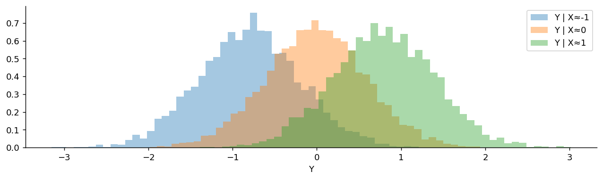

# 주변분포와 조건부분포

## 개요

두 확률변수의 결합분포가 주어졌을 때, **주변분포**는 각 변수의 개별 분포를 되찾아 주고 **조건부분포**는 다른 변수의 값이 정해졌을 때 한 변수를 기술한다. 이 개념들은 베이즈 추론, 회귀분석, 의존성 이해에 필수적이다.

---

## 주변분포

### 이산형

결합 PMF $p_{X,Y}(x,y)$로부터 다른 변수에 대해 합하여 주변 PMF를 얻는다:

$$
p_X(x) = \sum_y p_{X,Y}(x, y), \qquad p_Y(y) = \sum_x p_{X,Y}(x, y)
$$

### 연속형

결합 PDF $f_{X,Y}(x,y)$로부터 주변 PDF는 다음과 같다:

$$
f_X(x) = \int_{-\infty}^{\infty} f_{X,Y}(x, y)\,dy, \qquad f_Y(y) = \int_{-\infty}^{\infty} f_{X,Y}(x, y)\,dx
$$

**직관:** 주변화는 다른 변수를 "적분해 없애는" 것으로, 결합분포를 하나의 축으로 사영하는 셈이다.

---

## 조건부분포

### 이산형

$X = x$가 주어졌을 때 $Y$의 조건부 PMF는 다음과 같다:

$$
p_{Y|X}(y \mid x) = \frac{p_{X,Y}(x, y)}{p_X(x)}, \qquad p_X(x) > 0
$$

### 연속형

$X = x$가 주어졌을 때 $Y$의 조건부 PDF는 다음과 같다:

$$
f_{Y|X}(y \mid x) = \frac{f_{X,Y}(x, y)}{f_X(x)}, \qquad f_X(x) > 0
$$

### 조건부 기댓값

$$
E[Y \mid X = x] = \begin{cases} \sum_y y \cdot p_{Y|X}(y \mid x) & \text{(discrete)} \\ \int_{-\infty}^{\infty} y \cdot f_{Y|X}(y \mid x)\,dy & \text{(continuous)} \end{cases}
$$

### 조건부 분산

$$
\text{Var}(Y \mid X = x) = E[Y^2 \mid X = x] - (E[Y \mid X = x])^2
$$

---

## 기본 관계식

### 곱셈 법칙

결합분포는 언제나 다음과 같이 인수분해할 수 있다:

$$
f_{X,Y}(x, y) = f_{Y|X}(y \mid x) \cdot f_X(x) = f_{X|Y}(x \mid y) \cdot f_Y(y)
$$

### 전체 기댓값의 법칙

$$
E[Y] = E[E[Y \mid X]] = \begin{cases} \sum_x E[Y \mid X = x] \cdot p_X(x) & \text{(discrete)} \\ \int E[Y \mid X = x] \cdot f_X(x)\,dx & \text{(continuous)} \end{cases}
$$

### 전체 분산의 법칙 (Eve의 법칙)

$$
\text{Var}(Y) = E[\text{Var}(Y \mid X)] + \text{Var}(E[Y \mid X])
$$

전체 분산은 조건부 분산들의 평균(설명되지 않은 분산)과 조건부 평균들의 분산(설명된 분산)으로 분해된다.

---

## 분포에 대한 베이즈 정리

곱셈 법칙과 주변분포를 결합하면 베이즈 정리를 얻는다:

$$
f_{X|Y}(x \mid y) = \frac{f_{Y|X}(y \mid x) \cdot f_X(x)}{f_Y(y)} = \frac{f_{Y|X}(y \mid x) \cdot f_X(x)}{\int f_{Y|X}(y \mid x) \cdot f_X(x)\,dx}
$$

이것이 베이즈 추론의 토대이다. 사전분포 $f_X(x)$를 가능도 $f_{Y|X}(y \mid x)$로 갱신하여 사후분포 $f_{X|Y}(x \mid y)$를 얻는다.

---

## 문제: 이산형

<div class="probox" markdown>

**문제:** <span class="diff easy" title="쉬움"></span> 다음 결합 PMF를 사용한다:

| | $Y=0$ | $Y=1$ | $Y=2$ | $p_X(x)$ |
|:---|:---:|:---:|:---:|:---:|
| $X=0$ | 0.10 | 0.15 | 0.05 | 0.30 |
| $X=1$ | 0.10 | 0.25 | 0.10 | 0.45 |
| $X=2$ | 0.05 | 0.10 | 0.10 | 0.25 |
| $p_Y(y)$ | 0.25 | 0.50 | 0.25 | 1.00 |

$P(Y = 1 \mid X = 1)$과 $E[Y \mid X = 1]$을 구하라.

</div>

??? success "풀이"

    $$
    P(Y = 1 \mid X = 1) = \frac{p_{X,Y}(1,1)}{p_X(1)} = \frac{0.25}{0.45} = \frac{5}{9} \approx 0.556
    $$

    $$
    E[Y \mid X = 1] = 0 \cdot \frac{0.10}{0.45} + 1 \cdot \frac{0.25}{0.45} + 2 \cdot \frac{0.10}{0.45} = \frac{0.45}{0.45} = 1.0
    $$
---

## 문제: 연속형

<div class="probox" markdown>

**문제:** <span class="diff med" title="중간"></span> $0 \leq x \leq y \leq 1$에서 $f_{X,Y}(x,y) = 2$라 하자. $f_X(x)$, $f_{Y|X}(y \mid x)$, $E[Y \mid X = x]$를 구하라.

</div>

??? success "풀이"

    **$X$의 주변분포:**

    $$
    f_X(x) = \int_x^1 2\,dy = 2(1 - x), \quad 0 \leq x \leq 1
    $$

    **$X = x$가 주어졌을 때 $Y$의 조건부 PDF:**

    $$
    f_{Y|X}(y \mid x) = \frac{f_{X,Y}(x,y)}{f_X(x)} = \frac{2}{2(1-x)} = \frac{1}{1-x}, \quad x \leq y \leq 1
    $$

    이는 $\text{Uniform}(x, 1)$이다.

    **조건부 기댓값:**

    $$
    E[Y \mid X = x] = \frac{x + 1}{2}
    $$

    **전체 기댓값의 법칙으로 확인:**

    $$
    E[Y] = \int_0^1 \frac{x+1}{2} \cdot 2(1-x)\,dx = \int_0^1 (x+1)(1-x)\,dx = \int_0^1 (1 - x^2)\,dx = \frac{2}{3}
    $$
---

## Python: 주변분포와 조건부분포

### 이산형 주변분포와 조건부분포

```python
import numpy as np
import pandas as pd

pmf = np.array([
    [0.10, 0.15, 0.05],
    [0.10, 0.25, 0.10],
    [0.05, 0.10, 0.10]
])

# 주변분포: 관심 없는 변수를 **합해서 지운다**.
#   axis=1 로 더하면 Y가 사라져 P(X=x)만 남는다.
#   axis=0 로 더하면 X가 사라져 P(Y=y)만 남는다.
p_X = pmf.sum(axis=1)
p_Y = pmf.sum(axis=0)
print("Marginal of X:", p_X)
print("Marginal of Y:", p_Y)

# 조건부분포: X=1 인 **행 하나만** 떼어 낸 뒤 그 행의 합으로 나눈다.
# 나누는 이유는 떼어 낸 행의 합이 P(X=1)이라 1이 아니기 때문이다.
# 확률로 쓰려면 합이 1이 되게 다시 정규화해야 한다.
# 이것이 P(Y|X) = P(X,Y)/P(X) 를 표에서 실행한 것이다.
x_val = 1
cond_Y_given_X1 = pmf[x_val, :] / p_X[x_val]
print(f"\nP(Y|X={x_val}):", cond_Y_given_X1)

# 조건부기댓값은 조건부분포로 가중평균한 것이다.
# 주변분포가 아니라 **조건부분포**로 가중해야 한다는 점이 요점이다.
y_vals = np.array([0, 1, 2])
E_Y_given_X1 = np.sum(y_vals * cond_Y_given_X1)
print(f"E[Y|X={x_val}] = {E_Y_given_X1:.4f}")
```

출력:

```
Marginal of X: [0.3  0.45 0.25]
Marginal of Y: [0.25 0.5  0.25]

P(Y|X=1): [0.22222222 0.55555556 0.22222222]
E[Y|X=1] = 1.0000
```

### 적분을 통한 연속형 주변분포

```python
import numpy as np
from scipy import integrate

# f(x,y) = 2 for 0 <= x <= y <= 1
def joint_pdf(x, y):
    return 2.0 if 0 <= x <= y <= 1 else 0.0

# Marginal f_X(x) = integral of f(x,y) dy from x to 1
def marginal_X(x):
    result, _ = integrate.quad(lambda y: joint_pdf(x, y), x, 1)
    return result

# E[Y | X=x] via conditional
def E_Y_given_X(x):
    fx = marginal_X(x)
    if fx == 0:
        return 0
    result, _ = integrate.quad(lambda y: y * joint_pdf(x, y) / fx, x, 1)
    return result

# Verify Law of Total Expectation
E_Y, _ = integrate.quad(lambda x: E_Y_given_X(x) * marginal_X(x), 0, 1)
print(f"E[Y] via Law of Total Expectation: {E_Y:.4f}")  # Should be 2/3
```

출력:

```
E[Y] via Law of Total Expectation: 0.6667
```

### 조건부분포 시각화

```python
import numpy as np
import matplotlib.pyplot as plt
from scipy import stats

np.random.seed(42)
mean = [0, 0]
cov = [[1, 0.8], [0.8, 1]]      # 상관 0.8
samples = np.random.multivariate_normal(mean, cov, 100_000)

fig, ax = plt.subplots(figsize=(12, 3))

# 연속변수에서는 P(X = 1)이 0이므로 "정확히 X=1"로 조건을 걸 수 없다.
# 대신 얇은 띠 |X - x0| < 0.1 안에 든 표본만 골라 근사한다.
# 띠가 좁을수록 참 조건부분포에 가깝지만 표본 수가 줄어 잡음이 커진다.
for x_cond in [-1, 0, 1]:
    mask = np.abs(samples[:, 0] - x_cond) < 0.1
    # 이론이 예측하는 바를 그림에서 확인하라.
    #   중심: rho * x0 = 0.8 * x0  ->  -0.8, 0, +0.8 로 이동한다
    #   폭  : sqrt(1 - rho^2) = 0.6  ->  세 히스토그램의 폭이 **모두 같다**
    ax.hist(samples[mask, 1], bins=50, density=True, alpha=0.4,
            label=f'Y | X≈{x_cond}')

ax.spines[['top', 'right']].set_visible(False)
ax.set_xlabel('Y')
ax.legend()
plt.show()
```



---

## 연습문제

<div class="drillbox" markdown>

**연습문제 1.** <span class="diff med" title="중간"></span>
$0 \le x \le y \le 1$에서 결합 PDF가 $f(x, y) = 6(1 - y)$이다. (a) $\int f = 1$임을 확인하라. (b) $f_Y$를 구하라. (c) $f_{X \mid Y}$를 구하라. (d) $\mathbb{E}[X \mid Y = y]$를 계산하라.

</div>

??? success "풀이"
    (a) $\int_0^1 \int_0^y 6(1-y) dx \, dy = \int_0^1 6y(1-y) dy = 1$. ✓

    (b) $[0, 1]$ 위에서 $f_Y(y) = \int_0^y 6(1-y) dx = 6y(1-y)$. (이는 $\mathrm{Beta}(2, 2)$이다.)

    (c) $[0, y]$ 위에서 $f_{X \mid Y}(x \mid y) = 6(1-y)/[6y(1-y)] = 1/y$. 따라서 $X \mid Y = y \sim \mathrm{Uniform}(0, y)$.

    (d) $\mathbb{E}[X \mid Y = y] = y/2$.

<div class="drillbox" markdown>

**연습문제 2.** <span class="diff med" title="중간"></span>
**전체 기댓값의 법칙.** 연습문제 1의 분포를 사용하여 $\mathbb{E}[X] = \mathbb{E}[\mathbb{E}[X \mid Y]]$로 $\mathbb{E}[X]$를 계산하고, 직접 계산으로 확인하라.

</div>

??? success "풀이"
    반복 기댓값으로 $\mathbb{E}[X] = \mathbb{E}[\mathbb{E}[X \mid Y]] = \mathbb{E}[Y/2] = \mathbb{E}[Y]/2$.

    $\mathbb{E}[Y] = \int_0^1 y \cdot 6y(1-y) dy = 6\int_0^1(y^2 - y^3) dy = 6(1/3 - 1/4) = 1/2$.

    따라서 $\mathbb{E}[X] = 1/4$.

    **직접 확인:** $\mathbb{E}[X] = \int_0^1 \int_0^y x \cdot 6(1-y) dx \, dy = \int_0^1 3 y^2 (1-y) dy = 3(1/3 - 1/4) = 1/4$. ✓

    두 방법이 일치하여 전체 기댓값의 법칙을 확인해 준다. 반복 기댓값 방식이 계산상 더 쉬운 경우가 많다.

<div class="drillbox" markdown>

**연습문제 3.** <span class="diff med" title="중간"></span>
**전체 분산의 법칙.** $\mathrm{Var}(X) = \mathbb{E}[\mathrm{Var}(X \mid Y)] + \mathrm{Var}(\mathbb{E}[X \mid Y])$를 유도하고 연습문제 1에 적용하라.

</div>

??? success "풀이"
    **유도:**

    $\mathrm{Var}(X) = \mathbb{E}[X^2] - (\mathbb{E}[X])^2$.

    $\mathbb{E}[X^2] = \mathbb{E}[\mathbb{E}[X^2 \mid Y]] = \mathbb{E}[\mathrm{Var}(X \mid Y) + (\mathbb{E}[X \mid Y])^2]$.

    따라서 $\mathrm{Var}(X) = \mathbb{E}[\mathrm{Var}(X \mid Y)] + \mathbb{E}[(\mathbb{E}[X \mid Y])^2] - (\mathbb{E}[X])^2 = \mathbb{E}[\mathrm{Var}(X \mid Y)] + \mathrm{Var}(\mathbb{E}[X \mid Y])$. $\square$

    **적용:** $\mathrm{Var}(X \mid Y = y) = y^2/12$이다(Uniform(0, y)의 분산). 따라서 $\mathbb{E}[\mathrm{Var}(X \mid Y)] = \mathbb{E}[Y^2]/12$.

    $\mathbb{E}[Y^2] = \int_0^1 y^2 \cdot 6y(1-y) dy = 6\int_0^1(y^3 - y^4) dy = 6(1/4 - 1/5) = 3/10$.

    $\mathrm{Var}(\mathbb{E}[X \mid Y]) = \mathrm{Var}(Y/2) = \mathrm{Var}(Y)/4 = (3/10 - 1/4)/4 = (1/20)/4 = 1/80$.

    $\mathrm{Var}(X) = (3/10)/12 + 1/80 = 1/40 + 1/80 = 3/80$.

    이 분해는 전체 분산을 "집단 내" 성분 $\mathbb{E}[\mathrm{Var}(X \mid Y)]$와 "집단 간" 성분 $\mathrm{Var}(\mathbb{E}[X \mid Y])$로 나누며, 이것이 분산분석(ANOVA)의 바탕이다.

<div class="drillbox" markdown>

**연습문제 4.** <span class="diff hard" title="어려움"></span>
**주변분포는 오해를 부를 수 있다.** $X$의 주변분포는 대칭이지만 모든 $y$에 대해 조건부분포 $X \mid Y = y$는 비대칭인 예를 구성하라.

</div>

??? success "풀이"
    $Y \sim \mathrm{Bernoulli}(0.5)$로 두고:

    - $X \mid Y = 0 \sim \mathrm{Exp}(1)$ (오른쪽으로 치우침, 지지집합 $[0, \infty)$).
    - $X \mid Y = 1 \sim -\mathrm{Exp}(1)$ (왼쪽으로 치우침, 지지집합 $(-\infty, 0]$).

    $X$의 주변분포는 $f_X(x) = 0.5 \cdot \mathbf 1\{x \ge 0\} e^{-x} + 0.5 \cdot \mathbf 1\{x \le 0\} e^x$이며, 이는 0을 중심으로 대칭인 **Laplace 분포**이다.

    그러나 $Y$의 어느 값으로 조건화하든 $X$는 심하게 비대칭이다. 비대칭인 두 분포의 혼합이 대칭인 주변분포를 만들어 낼 수 있다.

    **교훈:** 주변분포는 구조를 감춘다. 특히 조건화 변수를 고려하지 않고 $X$의 주변분포만 모형화하면 밑바탕의 메커니즘에 대해 오해를 부르는 그림을 얻을 수 있다. 어떤 변수로 조건화할지 항상 생각해야 한다.

<div class="drillbox" markdown>

**연습문제 5.** <span class="diff med" title="중간"></span>
**이변량 정규분포의 주변분포와 조건부분포.** 평균이 $(\mu_X, \mu_Y)$, 분산이 $(\sigma_X^2, \sigma_Y^2)$, 상관계수가 $\rho$인 이변량 정규 $(X, Y)$에 대해 $X$의 주변분포와 조건부분포 $Y \mid X = x$를 쓰라.

</div>

??? success "풀이"
    **주변분포:** $X \sim N(\mu_X, \sigma_X^2)$. 결합정규분포의 주변분포는 정규분포이다(다변량 정규분포의 성질).

    **조건부분포:**

    $$
    Y \mid X = x \sim N\!\left(\mu_Y + \rho\frac{\sigma_Y}{\sigma_X}(x - \mu_X), \, \sigma_Y^2(1 - \rho^2)\right)
    $$

    핵심 관찰:

    - 조건부 평균이 $x$에 대해 **선형**이다. 이것이 회귀직선 $\mathbb{E}[Y \mid X = x] = \alpha + \beta x$이며 $\beta = \rho \sigma_Y/\sigma_X$이다.
    - 조건부 분산이 $x$에 의존하지 *않는다*. **등분산성**이며, 이변량 정규분포를 구별짓는 특징이다.
    - 조건부 분산은 $(1 - \rho^2)$배로 줄어든다. $X$를 알면 분산의 $\rho^2$만큼이 설명된다는 뜻이며, 이것이 정확히 $R^2$이다.

    입문 통계학의 선형회귀 이론은 본질적으로 이변량 정규 가정 아래에서 이 공식들로부터 유도된다.

<div class="drillbox" markdown>

**연습문제 6.** <span class="diff med" title="중간"></span>
**연속형 베이즈 정리.** 밀도함수에 대한 베이즈 정리를 쓰고, 사전분포 $\pi(\theta)$와 가능도 $f(x \mid \theta)$로부터 사후분포 $\pi(\theta \mid x)$를 유도하라.

</div>

??? success "풀이"
    **밀도함수에 대한 베이즈 정리:**

    $$
    \pi(\theta \mid x) = \frac{f(x \mid \theta) \pi(\theta)}{\int f(x \mid \theta) \pi(\theta) d\theta} = \frac{f(x \mid \theta) \pi(\theta)}{f(x)}
    $$

    분모 $f(x) = \int f(x \mid \theta) \pi(\theta) d\theta$는 **주변가능도** 또는 **증거**이며, 기계학습 문헌에서는 흔히 $Z$로 표기한다.

    **말로 하면:** 사후분포는 가능도 곱하기 사전분포에 비례한다. 비례상수는 정규화를 보장한다.

    **흔히 쓰는 축약형:** $\pi(\theta \mid x) \propto f(x \mid \theta) \pi(\theta)$. $Z$를 계산하는 것이 대개 어려운 부분이며(보통 수치적분이 필요하다), 비례 관계만으로 충분한 경우도 있다(예: $Z$를 필요로 하지 않는 MCMC 표본추출).

    베이즈 추론은 자료가 들어올 때마다 이 공식을 반복 적용한다. 사전분포 → (자료 1 이후의) 사후분포 → (자료 1, 2 이후의) 사후분포 → ⋯ 로 이어지며, 매번 직전의 사후분포를 새로운 사전분포로 삼는다.

---

## 정리하며

- 주변분포는 결합분포를 다른 변수에 대해 합하거나 적분하여 얻는다.
- 조건부분포는 다른 변수의 값이 알려졌을 때 한 변수를 기술하며, 결합분포를 주변분포로 나누어 계산한다.
- 전체 기댓값의 법칙과 전체 분산의 법칙은 주변 적률과 조건부 적률을 이어 준다.
- 곱셈 법칙 $f_{X,Y} = f_{Y|X} \cdot f_X$는 베이즈 정리와 베이즈 추론의 토대가 된다.
- 조건부 기댓값 $E[Y \mid X]$는 그 자체가 ($X$의 함수인) 확률변수이며, $X$가 주어졌을 때 $Y$에 대한 최선의 예측을 나타낸다.
