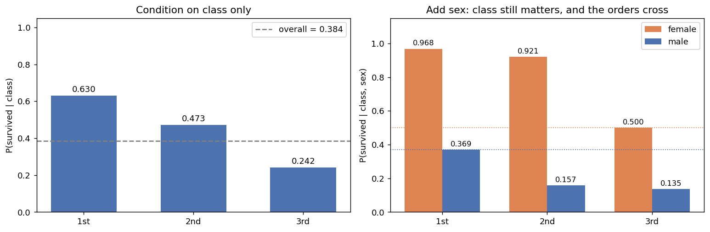

# 주변분포와 조건부분포

## 개요

두 확률변수의 결합분포가 주어졌을 때, **주변분포**는 각 변수의 개별 분포를 되찾아 주고 **조건부분포**는 다른 변수의 값이 정해졌을 때 한 변수를 기술한다. 이 개념들은 베이즈 추론, 회귀분석, 의존성 이해에 필수적이다.

---

## 주변분포

### 이산형

결합 PMF $p_{X,Y}(x,y)$로부터 다른 변수에 대해 합하여 주변 PMF를 얻는다:

$$
p_X(x) = \sum_y p_{X,Y}(x, y), \qquad p_Y(y) = \sum_x p_{X,Y}(x, y)
$$

### 연속형

결합 PDF $f_{X,Y}(x,y)$로부터 주변 PDF는 다음과 같다:

$$
f_X(x) = \int_{-\infty}^{\infty} f_{X,Y}(x, y)\,dy, \qquad f_Y(y) = \int_{-\infty}^{\infty} f_{X,Y}(x, y)\,dx
$$

**직관:** 주변화는 다른 변수를 "적분해 없애는" 것으로, 결합분포를 하나의 축으로 사영하는 셈이다.

---

## 조건부분포

### 이산형

$X = x$가 주어졌을 때 $Y$의 조건부 PMF는 다음과 같다:

$$
p_{Y|X}(y \mid x) = \frac{p_{X,Y}(x, y)}{p_X(x)}, \qquad p_X(x) > 0
$$

### 연속형

$X = x$가 주어졌을 때 $Y$의 조건부 PDF는 다음과 같다:

$$
f_{Y|X}(y \mid x) = \frac{f_{X,Y}(x, y)}{f_X(x)}, \qquad f_X(x) > 0
$$

### 조건부 기댓값

$$
E[Y \mid X = x] = \begin{cases} \sum_y y \cdot p_{Y|X}(y \mid x) & \text{(discrete)} \\ \int_{-\infty}^{\infty} y \cdot f_{Y|X}(y \mid x)\,dy & \text{(continuous)} \end{cases}
$$

### 조건부 분산

$$
\text{Var}(Y \mid X = x) = E[Y^2 \mid X = x] - (E[Y \mid X = x])^2
$$

---

## 실제 자료에서: 조건을 하나 더 걸면 무엇이 달라지는가

[결합분포](joint.md) 쪽에서 타이타닉 승객 891명의 객실등급과 생존이 독립이 아님을 보았다. 이제 같은 자료를 조건부분포의 눈으로 본다. 조건부분포가 결합분포보다 읽기 쉬운 까닭과, **조건을 하나 더 걸었을 때 앞의 결론이 어떻게 되는지**가 이 절의 주제다.

<div class="codebox" markdown>

#### 예제 1. 조건을 더할수록 이야기가 달라진다 { .eg }

```python
import pandas as pd

URL = "https://raw.githubusercontent.com/datasciencedojo/datasets/master/titanic.csv"
t = pd.read_csv(URL)

# 조건부분포는 결합을 조건 변수의 주변으로 나눈 것이다.
# 여기서는 P(생존=1 | 등급) 이므로 등급별 생존 비율이 곧 그 값이다.
print("P(생존 | 등급)")
print(t.groupby("Pclass").Survived.mean().round(3).to_string())
print(f"{'전체':>6}  {t.Survived.mean():.3f}")

# 성별을 하나 더 조건에 넣는다. 등급의 효과가 사라질까?
print("\nP(생존 | 등급, 성별)")
tab = t.pivot_table(index="Sex", columns="Pclass", values="Survived", aggfunc="mean")
print(tab.round(3).to_string())

print("\n인원")
print(t.pivot_table(index="Sex", columns="Pclass", values="Survived", aggfunc="size").to_string())
```

출력:

```
P(생존 | 등급)
Pclass
1    0.630
2    0.473
3    0.242
    전체  0.384

P(생존 | 등급, 성별)
Pclass      1      2      3
Sex                        
female  0.968  0.921  0.500
male    0.369  0.157  0.135

인원
Pclass    1    2    3
Sex                  
female   94   76  144
male    122  108  347
```



</div>

### 조건부분포가 읽기 쉬운 이유

앞 쪽의 결합분포 표에서 1등석·생존 칸의 값은 $0.1526$이었다. 이 숫자만으로는 1등석 승객이 잘 살아남았는지 알기 어렵다. 1등석 승객이 애초에 많았을 수도 있기 때문이다. 조건부확률은 그 혼동을 없앤다.

$$
P(\text{생존} \mid \text{1등석}) = \frac{P(\text{1등석}, \text{생존})}{P(\text{1등석})} = \frac{0.1526}{0.2424} = 0.630
$$

분모로 나누면서 **"1등석이 몇 명이었는가"가 지워지고 "1등석 안에서 어떠했는가"만 남는다.** 세 값을 나란히 놓으면 $0.630$, $0.473$, $0.242$로 전체 생존율 $0.384$를 사이에 두고 갈라진다. 독립이었다면 세 값이 모두 $0.384$로 같았을 것이다. **조건부분포가 조건에 따라 달라진다는 것이 곧 종속이다.**

### 조건을 하나 더 걸면

여기서 멈추면 "등급이 생존을 갈랐다"로 끝난다. 성별을 조건에 더해 보면 이야기가 더 나온다.

먼저, **등급의 효과는 사라지지 않는다.** 여성 안에서도 $0.968 \to 0.921 \to 0.500$으로 내려가고 남성 안에서도 $0.369 \to 0.157 \to 0.135$로 내려간다. 성별을 고정해도 등급이 여전히 갈라 놓으므로, 등급과 생존은 **성별이 주어진 조건에서도 독립이 아니다.**

$$
P(\text{생존} \mid \text{등급}, \text{성별}) \ne P(\text{생존} \mid \text{성별})
$$

이것을 **조건부 종속**이라 한다. 조건을 걸면 종속이 사라지는 경우도 있는데(그때는 조건부 독립이라 한다), 여기서는 그렇지 않다는 것이 자료의 답이다.

둘째, 훨씬 흥미로운 것이 있다. 두 조건을 함께 보면 **순서가 교차한다.**

| | 생존율 |
|---|---|
| 3등석 **여성** | $0.500$ |
| 1등석 **남성** | $0.369$ |

등급만 보면 1등석이 3등석보다 유리하다. 그런데 3등석 여성이 1등석 남성보다 살아남을 확률이 높다. **한 변수의 조건부분포만으로는 예측이 뒤집힐 수 있다**는 뜻이며, 그림 오른쪽의 두 점선이 이 교차를 보여 준다.

!!! note "두 변수가 함께 작용하는 방식"

    성별의 효과가 등급보다 크다는 것만이 아니다. 효과의 **크기 자체가 등급에 따라 다르다.** 1등석에서 여성과 남성의 격차는 $0.968 - 0.369 = 0.599$인데 3등석에서는 $0.500 - 0.135 = 0.365$다. 2등석은 $0.764$로 가장 크다.

    두 설명변수가 서로의 효과를 바꾸어 놓는 이 현상을 **교호작용**이라 부르며, 11장 이원배치 분산분석과 13장 회귀에서 정면으로 다룬다. 여기서 기억할 것은 하나다. **"$X$가 $Y$에 미치는 영향"이라는 말이 무조건 뜻을 갖는 것은 아니며, 무엇을 조건으로 걸었는지에 따라 달라진다.**

    조건을 더했더니 결론의 **부호까지** 뒤집히는 경우도 있다. 그것이 심프슨의 역설이며 12장에서 다룬다. 타이타닉에서는 부호가 뒤집히지는 않고 순서가 교차하는 데 그쳤다.

### 조건을 걸면 사라지는 연관

앞의 예에서는 조건을 더해도 등급의 효과가 남았다. 반대 경우, 곧 **조건을 걸면 연관이 옅어지거나 사라지는** 경우가 훨씬 흔하고 실무에서 더 중요하다. 같은 자료로 볼 수 있다. 이번에는 **승선항**과 생존이다.

<div class="codebox" markdown>

#### 예제 2. 조건을 걸면 사라지는 연관 { .eg }

```python
import pandas as pd
from scipy import stats

URL = "https://raw.githubusercontent.com/datasciencedojo/datasets/master/titanic.csv"
t = pd.read_csv(URL).dropna(subset=["Embarked"])

# 승선항(C 셰르부르, Q 퀸스타운, S 사우샘프턴)과 생존.
print("P(생존 | 승선항)")
print(t.groupby("Embarked").Survived.agg(["mean", "size"]).round(3).to_string())
chi2, p, _, _ = stats.chi2_contingency(pd.crosstab(t.Embarked, t.Survived))
print(f"  독립성 검정: chi2 = {chi2:.2f}, p = {p:.2e}")

# 승선항은 객실등급과 심하게 얽혀 있다.
print("\nP(등급 | 승선항)")
print(pd.crosstab(t.Embarked, t.Pclass, normalize="index").round(3).to_string())

# 등급을 조건에 넣으면 승선항의 효과가 남는가?
print("\n등급을 고정한 뒤의 승선항 효과")
for c, g in t.groupby("Pclass"):
    chi2, p, _, _ = stats.chi2_contingency(pd.crosstab(g.Embarked, g.Survived))
    rates = g.groupby("Embarked").Survived.mean().round(3).to_dict()
    print(f"  {c}등석  {rates}   p = {p:.3f}")
```

출력:

```
P(생존 | 승선항)
           mean  size
Embarked             
C         0.554   168
Q         0.390    77
S         0.337   644
  독립성 검정: chi2 = 26.49, p = 1.77e-06

P(등급 | 승선항)
Pclass        1      2      3
Embarked                     
C         0.506  0.101  0.393
Q         0.026  0.039  0.935
S         0.197  0.255  0.548

등급을 고정한 뒤의 승선항 효과
  1등석  {'C': 0.694, 'Q': 0.5, 'S': 0.583}   p = 0.242
  2등석  {'C': 0.529, 'Q': 0.667, 'S': 0.463}   p = 0.695
  3등석  {'C': 0.379, 'Q': 0.375, 'S': 0.19}   p = 0.000
```

</div>

주변만 보면 연관이 뚜렷하다. 셰르부르에서 탄 승객의 생존율이 $55.4\%$인데 사우샘프턴은 $33.7\%$다. 독립성 검정의 $p$값이 $1.8 \times 10^{-6}$이니 우연으로 넘기기 어렵다. "셰르부르에서 타는 것이 안전했다"고 말하고 싶어진다.

두 번째 표가 그 해석을 흔든다. 셰르부르 승객의 절반 이상($50.6\%$)이 1등석이었던 반면 사우샘프턴은 $19.7\%$뿐이고, 퀸스타운은 무려 $93.5\%$가 3등석이었다. **승선항이 객실등급과 심하게 얽혀 있다.** 그렇다면 앞의 차이는 항구의 효과가 아니라 등급의 효과가 항구를 통해 비쳐 보인 것일 수 있다.

등급을 고정하고 다시 재면 답이 나온다. 1등석 안에서는 $p = 0.242$, 2등석 안에서는 $p = 0.695$로 **승선항의 효과가 사라진다.** 1등석에 탄 승객에게는 어느 항구에서 탔는지가 생존과 거의 무관했다는 뜻이다.

다만 3등석에서는 $p < 0.001$로 차이가 남는다($0.379$, $0.375$ 대 $0.190$). 그러니 이 자료가 보여 주는 것은 완전한 조건부 독립이 아니라 **대부분이 등급으로 설명되는 부분적 교란**이다. 실제 자료에서 $X \perp Y \mid Z$가 딱 떨어지는 일은 드물다. 교과서의 깔끔한 예는 이 상황을 극단까지 이상화한 것이다.

### 조건을 걸었을 때 일어날 수 있는 네 가지

지금까지 본 것을 한자리에 모으면 조건화가 연관에 하는 일의 지도가 그려진다.

| 조건을 걸면 | 뜻 | 보기 |
|---|---|---|
| 그대로 남는다 | 조건부로도 종속 | 등급 $\to$ 생존 (성별을 고정해도 남음) |
| 옅어진다 | 부분적 교란 | 승선항 $\to$ 생존 (3등석에만 남음) |
| 사라진다 | **조건부 독립** $X \perp Y \mid Z$ | 승선항 $\to$ 생존 (1·2등석 안에서) |
| 뒤집힌다 | **심프슨의 역설** | 버클리 대학원 입학 (12장) |

네 칸이 별개의 현상이 아니라 **하나의 눈금 위에 있다는 점**이 중요하다. 넷 모두 "$Z$가 $X$와 $Y$ 양쪽에 얽혀 있다"는 같은 사정에서 나오며, $Z$의 영향력이 커질수록 남는다 $\to$ 옅어진다 $\to$ 사라진다 $\to$ 뒤집힌다로 옮겨 간다. 승선항 예가 그 중간 어딘가에 있다.

!!! warning "조건부 독립은 독립이 아니다"

    승선항과 생존은 1등석 안에서 독립처럼 보이지만 **주변적으로는 명백히 종속**이다($p = 1.8\times 10^{-6}$). 반대 방향도 성립하지 않는다. 주변적으로 독립인 두 변수가 조건을 걸면 종속이 되기도 한다. 조건부 독립과 독립 사이에는 어느 쪽으로도 함의가 없으며, [3.2절 조건부 독립](../../ch03/probability/conditional_independence.md)이 이 두 방향을 모두 반례로 보인다.

    실무적 교훈은 단순하다. **"$A$와 $B$가 연관되어 있다"는 보고를 받으면 무엇을 고정한 채 쟀는지 물어야 한다.** 아무것도 고정하지 않은 주변 연관은 숨은 제3의 변수를 통해 만들어진 것일 수 있다.

### 같은 변수를 두 번 뽑아도 얽힌다

지금까지는 **서로 다른 두 변수**가 제3의 변수를 통해 얽히는 경우를 보았다. 그런데 조건부 독립이 실무에서 문제를 일으키는 더 흔한 방식은 따로 있다. **같은 변수를 두 번 뽑았는데 그 둘이 독립이 아닌** 경우다.

대통령 지지율 조사를 생각해 보자. 어떤 사람에게 지지 여부를 물어 지지하면 1, 아니면 0인 값을 얻는다. 지역마다 지지율이 다르다는 것은 누구나 안다. 어떤 도는 $60\%$, 어떤 도는 $30\%$라고 하자.

**지역을 고정하면** 같은 지역 두 사람의 응답은 독립으로 볼 만하다. 한 사람이 지지한다고 해서 옆 사람이 따라 지지하는 것은 아니니, 그 지역의 지지율 $\theta$를 성공확률로 하는 독립 동전 던지기 둘이라 해도 무리가 없다.

**그런데 지역을 모르면 사정이 달라진다.** 전국에서 무작위로 두 사람을 뽑되 둘이 같은 지역 사람이라 하자. 첫 사람이 지지한다는 것을 알면 그 지역이 지지율 높은 쪽일 가능성이 올라가고, 따라서 **둘째 사람도 지지할 확률이 올라간다.** 첫 응답이 둘째 응답에 대한 정보를 준 것이다. 독립이 아니다.

$$
X_1 \perp X_2 \mid \theta \quad\text{이지만}\quad X_1 \not\perp X_2
$$

계산하면 얼마나 얽히는지가 정확히 나온다. $\theta$가 주어지면 $X_i$가 독립인 $\text{Bernoulli}(\theta)$이므로 $E[X_1X_2 \mid \theta] = \theta^2$이고, 전체 기댓값의 법칙을 쓰면

$$
E[X_1X_2] = E[\theta^2], \qquad E[X_i] = E[\theta] = \mu
$$

이다. 따라서

$$
\text{Cov}(X_1, X_2) = E[\theta^2] - \mu^2 = \text{Var}(\theta)
$$

가 된다. **두 응답의 공분산이 정확히 지역 간 지지율의 분산과 같다.** 지역마다 지지율이 똑같다면($\text{Var}(\theta) = 0$) 두 응답이 독립이고, 지역 차가 클수록 더 얽힌다. 이 상관을 **급내상관**이라 하며 $\rho = \text{Var}(\theta) / \{\mu(1-\mu)\}$로 적는다.

타이타닉 자료로 숫자를 붙여 보자. 지역을 객실등급으로, 지지를 생존으로 바꾸면 구조가 똑같다.

<div class="codebox" markdown>

#### 예제 3. 공유된 잠재 요인이 만드는 종속 { .eg }

```python
import numpy as np
import pandas as pd

URL = "https://raw.githubusercontent.com/datasciencedojo/datasets/master/titanic.csv"
t = pd.read_csv(URL)

theta = t.groupby("Pclass").Survived.mean()          # 등급별 생존율
w = t.Pclass.value_counts(normalize=True).sort_index()  # 등급별 인원 비중
mu = t.Survived.mean()

var_theta = float((w * theta**2).sum() - mu**2)      # 등급 간 분산
rho = var_theta / (mu * (1 - mu))                    # 급내상관

print(f"전체 생존율 mu        = {mu:.4f}")
print(f"등급 간 분산 Var(theta) = {var_theta:.4f}")
print(f"급내상관 rho          = {rho:.4f}")

print("\n같은 등급에서 두 명을 뽑을 때")
print(f"  P(둘 다 생존) = E[theta^2] = {float((w * theta**2).sum()):.4f}")
print(f"  독립이라면     mu^2        = {mu**2:.4f}")
print(f"  차이                       = {var_theta:.4f}")

print("\n설계효과 DEFF = 1 + (m-1)rho")
for m in (2, 10, 50, 100):
    print(f"  한 등급에서 {m:3d}명 → DEFF {1 + (m - 1) * rho:5.2f}"
          f"   유효표본 {m / (1 + (m - 1) * rho):5.1f}명")
```

출력:

```
전체 생존율 mu        = 0.3838
등급 간 분산 Var(theta) = 0.0273
급내상관 rho          = 0.1155

같은 등급에서 두 명을 뽑을 때
  P(둘 다 생존) = E[theta^2] = 0.1746
  독립이라면     mu^2        = 0.1473
  차이                       = 0.0273

설계효과 DEFF = 1 + (m-1)rho
  한 등급에서   2명 → DEFF  1.12   유효표본   1.8명
  한 등급에서  10명 → DEFF  2.04   유효표본   4.9명
  한 등급에서  50명 → DEFF  6.66   유효표본   7.5명
  한 등급에서 100명 → DEFF 12.43   유효표본   8.0명
```

</div>

같은 등급에서 두 명을 뽑으면 둘 다 살아남을 확률이 $0.1746$인데, 독립이라면 $0.3838^2 = 0.1473$이어야 한다. 차이 $0.0273$이 정확히 등급 간 분산 $\text{Var}(\theta)$다. 유도한 식이 그대로 맞는다.

!!! danger "이것이 i.i.d. 가정이 깨지는 가장 흔한 방식이다"

    5장부터 이 책은 표본이 **독립이고 같은 분포를 따른다**고 가정한다. 표준오차 $\sigma/\sqrt n$도, 신뢰구간도, 검정도 모두 그 위에 서 있다. 그런데 현실의 조사는 한 사람씩 무작위로 뽑는 것이 아니라 **동네, 학교, 병원, 사업장 단위로 묶어서** 뽑는 일이 많다. 그 순간 같은 군집에 속한 응답들이 위처럼 얽힌다.

    대가는 마지막 표에 있다. 한 등급에서 100명을 뽑으면 **실질적으로 8명분의 정보**밖에 되지 않는다. 표준오차를 $\sigma/\sqrt{100}$으로 계산하면 참값의 $1/\sqrt{12.43} \approx 0.28$배로 과소평가하는 셈이고, 신뢰구간은 그만큼 좁아지며, 검정은 있지도 않은 유의성을 낸다.

    이 부풀림 $1 + (m-1)\rho$를 **설계효과**라 부른다. 5.3절에서 시계열의 자기상관을 다룰 때 같은 양이 다시 나오며, 거기서는 $Z$의 자리에 "시간"이 들어간다. 얽히는 통로가 지역이든 시간이든 공통 요인이든, 공유된 무언가가 있으면 유효 표본크기가 줄어든다는 결론은 같다.

    5.1절의 [금융위기와 중심극한정리](../../ch05/foundations/financial_crisis_clt.md)가 이 구조를 극단까지 밀어붙인 사례다. 주택저당증권의 부도를 서로 독립이라 가정했는데 실제로는 공통의 경기 요인 $\theta$를 공유하고 있었고, 그 결과 $10^{-8}$로 계산된 사건이 실제로는 $10^{-2}$ 확률로 일어났다.

## 기본 관계식

### 곱셈 법칙

결합분포는 언제나 다음과 같이 인수분해할 수 있다:

$$
f_{X,Y}(x, y) = f_{Y|X}(y \mid x) \cdot f_X(x) = f_{X|Y}(x \mid y) \cdot f_Y(y)
$$

### 전체 기댓값의 법칙

$$
E[Y] = E[E[Y \mid X]] = \begin{cases} \sum_x E[Y \mid X = x] \cdot p_X(x) & \text{(discrete)} \\ \int E[Y \mid X = x] \cdot f_X(x)\,dx & \text{(continuous)} \end{cases}
$$

### 전체 분산의 법칙 (Eve의 법칙)

$$
\text{Var}(Y) = E[\text{Var}(Y \mid X)] + \text{Var}(E[Y \mid X])
$$

전체 분산은 조건부 분산들의 평균(설명되지 않은 분산)과 조건부 평균들의 분산(설명된 분산)으로 분해된다.

---

## 분포에 대한 베이즈 정리

곱셈 법칙과 주변분포를 결합하면 베이즈 정리를 얻는다:

$$
f_{X|Y}(x \mid y) = \frac{f_{Y|X}(y \mid x) \cdot f_X(x)}{f_Y(y)} = \frac{f_{Y|X}(y \mid x) \cdot f_X(x)}{\int f_{Y|X}(y \mid x) \cdot f_X(x)\,dx}
$$

이것이 베이즈 추론의 토대이다. 사전분포 $f_X(x)$를 가능도 $f_{Y|X}(y \mid x)$로 갱신하여 사후분포 $f_{X|Y}(x \mid y)$를 얻는다.

---

## 문제: 이산형

<div class="probox" markdown>

**문제:** <span class="diff easy" title="쉬움"></span> 다음 결합 PMF를 사용한다:

| | $Y=0$ | $Y=1$ | $Y=2$ | $p_X(x)$ |
|:---|:---:|:---:|:---:|:---:|
| $X=0$ | 0.10 | 0.15 | 0.05 | 0.30 |
| $X=1$ | 0.10 | 0.25 | 0.10 | 0.45 |
| $X=2$ | 0.05 | 0.10 | 0.10 | 0.25 |
| $p_Y(y)$ | 0.25 | 0.50 | 0.25 | 1.00 |

$P(Y = 1 \mid X = 1)$과 $E[Y \mid X = 1]$을 구하라.

</div>

??? success "풀이"

    $$
    P(Y = 1 \mid X = 1) = \frac{p_{X,Y}(1,1)}{p_X(1)} = \frac{0.25}{0.45} = \frac{5}{9} \approx 0.556
    $$

    $$
    E[Y \mid X = 1] = 0 \cdot \frac{0.10}{0.45} + 1 \cdot \frac{0.25}{0.45} + 2 \cdot \frac{0.10}{0.45} = \frac{0.45}{0.45} = 1.0
    $$
---

## 문제: 연속형

<div class="probox" markdown>

**문제:** <span class="diff med" title="중간"></span> $0 \leq x \leq y \leq 1$에서 $f_{X,Y}(x,y) = 2$라 하자. $f_X(x)$, $f_{Y|X}(y \mid x)$, $E[Y \mid X = x]$를 구하라.

</div>

??? success "풀이"

    **$X$의 주변분포:**

    $$
    f_X(x) = \int_x^1 2\,dy = 2(1 - x), \quad 0 \leq x \leq 1
    $$

    **$X = x$가 주어졌을 때 $Y$의 조건부 PDF:**

    $$
    f_{Y|X}(y \mid x) = \frac{f_{X,Y}(x,y)}{f_X(x)} = \frac{2}{2(1-x)} = \frac{1}{1-x}, \quad x \leq y \leq 1
    $$

    이는 $\text{Uniform}(x, 1)$이다.

    **조건부 기댓값:**

    $$
    E[Y \mid X = x] = \frac{x + 1}{2}
    $$

    **전체 기댓값의 법칙으로 확인:**

    $$
    E[Y] = \int_0^1 \frac{x+1}{2} \cdot 2(1-x)\,dx = \int_0^1 (x+1)(1-x)\,dx = \int_0^1 (1 - x^2)\,dx = \frac{2}{3}
    $$
---

## Python: 주변분포와 조건부분포

### 이산형 주변분포와 조건부분포

<div class="codebox" markdown>

#### 예제 4. 이산형 주변분포와 조건부분포 { .eg }

```python
import numpy as np
import pandas as pd

pmf = np.array([
    [0.10, 0.15, 0.05],
    [0.10, 0.25, 0.10],
    [0.05, 0.10, 0.10]
])

# 주변분포: 관심 없는 변수를 **합해서 지운다**.
#   axis=1 로 더하면 Y가 사라져 P(X=x)만 남는다.
#   axis=0 로 더하면 X가 사라져 P(Y=y)만 남는다.
p_X = pmf.sum(axis=1)
p_Y = pmf.sum(axis=0)
print("Marginal of X:", p_X)
print("Marginal of Y:", p_Y)

# 조건부분포: X=1 인 **행 하나만** 떼어 낸 뒤 그 행의 합으로 나눈다.
# 나누는 이유는 떼어 낸 행의 합이 P(X=1)이라 1이 아니기 때문이다.
# 확률로 쓰려면 합이 1이 되게 다시 정규화해야 한다.
# 이것이 P(Y|X) = P(X,Y)/P(X) 를 표에서 실행한 것이다.
x_val = 1
cond_Y_given_X1 = pmf[x_val, :] / p_X[x_val]
print(f"\nP(Y|X={x_val}):", cond_Y_given_X1)

# 조건부기댓값은 조건부분포로 가중평균한 것이다.
# 주변분포가 아니라 **조건부분포**로 가중해야 한다는 점이 요점이다.
y_vals = np.array([0, 1, 2])
E_Y_given_X1 = np.sum(y_vals * cond_Y_given_X1)
print(f"E[Y|X={x_val}] = {E_Y_given_X1:.4f}")
```

출력:

```
Marginal of X: [0.3  0.45 0.25]
Marginal of Y: [0.25 0.5  0.25]

P(Y|X=1): [0.22222222 0.55555556 0.22222222]
E[Y|X=1] = 1.0000
```

</div>

### 적분을 통한 연속형 주변분포

<div class="codebox" markdown>

#### 예제 5. 적분으로 구하는 연속형 주변분포 { .eg }

```python
import numpy as np
from scipy import integrate

# f(x,y) = 2 for 0 <= x <= y <= 1
def joint_pdf(x, y):
    return 2.0 if 0 <= x <= y <= 1 else 0.0

# 주변밀도 f_X(x) 는 f(x,y) 를 y 에 대해 x 에서 1 까지 적분한 것이다
def marginal_X(x):
    result, _ = integrate.quad(lambda y: joint_pdf(x, y), x, 1)
    return result

# 조건부분포로 구한 E[Y | X=x]
def E_Y_given_X(x):
    fx = marginal_X(x)
    if fx == 0:
        return 0
    result, _ = integrate.quad(lambda y: y * joint_pdf(x, y) / fx, x, 1)
    return result

# 전체기댓값의 법칙 확인
E_Y, _ = integrate.quad(lambda x: E_Y_given_X(x) * marginal_X(x), 0, 1)
print(f"E[Y] via Law of Total Expectation: {E_Y:.4f}")  # Should be 2/3
```

출력:

```
E[Y] via Law of Total Expectation: 0.6667
```

</div>

### 조건부분포 시각화

<div class="codebox" markdown>

#### 예제 6. 조건부분포 시각화 { .eg }

```python
import numpy as np
import matplotlib.pyplot as plt
from scipy import stats

np.random.seed(42)
mean = [0, 0]
cov = [[1, 0.8], [0.8, 1]]      # 상관 0.8
samples = np.random.multivariate_normal(mean, cov, 100_000)

fig, ax = plt.subplots(figsize=(12, 3))

# 연속변수에서는 P(X = 1)이 0이므로 "정확히 X=1"로 조건을 걸 수 없다.
# 대신 얇은 띠 |X - x0| < 0.1 안에 든 표본만 골라 근사한다.
# 띠가 좁을수록 참 조건부분포에 가깝지만 표본 수가 줄어 잡음이 커진다.
for x_cond in [-1, 0, 1]:
    mask = np.abs(samples[:, 0] - x_cond) < 0.1
    # 이론이 예측하는 바를 그림에서 확인하라.
    #   중심: rho * x0 = 0.8 * x0  ->  -0.8, 0, +0.8 로 이동한다
    #   폭  : sqrt(1 - rho^2) = 0.6  ->  세 히스토그램의 폭이 **모두 같다**
    ax.hist(samples[mask, 1], bins=50, density=True, alpha=0.4,
            label=f'Y | X≈{x_cond}')

ax.spines[['top', 'right']].set_visible(False)
ax.set_xlabel('Y')
ax.legend()
plt.show()
```


</div>

---

## 연습문제

<div class="drillbox" markdown>

**연습문제 1.** <span class="diff med" title="중간"></span>
$0 \le x \le y \le 1$에서 결합 PDF가 $f(x, y) = 6(1 - y)$이다. (a) $\int f = 1$임을 확인하라. (b) $f_Y$를 구하라. (c) $f_{X \mid Y}$를 구하라. (d) $\mathbb{E}[X \mid Y = y]$를 계산하라.

</div>

??? success "풀이"
    (a) $\int_0^1 \int_0^y 6(1-y) dx \, dy = \int_0^1 6y(1-y) dy = 1$. ✓

    (b) $[0, 1]$ 위에서 $f_Y(y) = \int_0^y 6(1-y) dx = 6y(1-y)$. (이는 $\mathrm{Beta}(2, 2)$이다.)

    (c) $[0, y]$ 위에서 $f_{X \mid Y}(x \mid y) = 6(1-y)/[6y(1-y)] = 1/y$. 따라서 $X \mid Y = y \sim \mathrm{Uniform}(0, y)$.

    (d) $\mathbb{E}[X \mid Y = y] = y/2$.

<div class="drillbox" markdown>

**연습문제 2.** <span class="diff med" title="중간"></span>
**전체 기댓값의 법칙.** 연습문제 1의 분포를 사용하여 $\mathbb{E}[X] = \mathbb{E}[\mathbb{E}[X \mid Y]]$로 $\mathbb{E}[X]$를 계산하고, 직접 계산으로 확인하라.

</div>

??? success "풀이"
    반복 기댓값으로 $\mathbb{E}[X] = \mathbb{E}[\mathbb{E}[X \mid Y]] = \mathbb{E}[Y/2] = \mathbb{E}[Y]/2$.

    $\mathbb{E}[Y] = \int_0^1 y \cdot 6y(1-y) dy = 6\int_0^1(y^2 - y^3) dy = 6(1/3 - 1/4) = 1/2$.

    따라서 $\mathbb{E}[X] = 1/4$.

    **직접 확인:** $\mathbb{E}[X] = \int_0^1 \int_0^y x \cdot 6(1-y) dx \, dy = \int_0^1 3 y^2 (1-y) dy = 3(1/3 - 1/4) = 1/4$. ✓

    두 방법이 일치하여 전체 기댓값의 법칙을 확인해 준다. 반복 기댓값 방식이 계산상 더 쉬운 경우가 많다.

<div class="drillbox" markdown>

**연습문제 3.** <span class="diff med" title="중간"></span>
**전체 분산의 법칙.** $\mathrm{Var}(X) = \mathbb{E}[\mathrm{Var}(X \mid Y)] + \mathrm{Var}(\mathbb{E}[X \mid Y])$를 유도하고 연습문제 1에 적용하라.

</div>

??? success "풀이"
    **유도:**

    $\mathrm{Var}(X) = \mathbb{E}[X^2] - (\mathbb{E}[X])^2$.

    $\mathbb{E}[X^2] = \mathbb{E}[\mathbb{E}[X^2 \mid Y]] = \mathbb{E}[\mathrm{Var}(X \mid Y) + (\mathbb{E}[X \mid Y])^2]$.

    따라서 $\mathrm{Var}(X) = \mathbb{E}[\mathrm{Var}(X \mid Y)] + \mathbb{E}[(\mathbb{E}[X \mid Y])^2] - (\mathbb{E}[X])^2 = \mathbb{E}[\mathrm{Var}(X \mid Y)] + \mathrm{Var}(\mathbb{E}[X \mid Y])$. $\square$

    **적용:** $\mathrm{Var}(X \mid Y = y) = y^2/12$이다(Uniform(0, y)의 분산). 따라서 $\mathbb{E}[\mathrm{Var}(X \mid Y)] = \mathbb{E}[Y^2]/12$.

    $\mathbb{E}[Y^2] = \int_0^1 y^2 \cdot 6y(1-y) dy = 6\int_0^1(y^3 - y^4) dy = 6(1/4 - 1/5) = 3/10$.

    $\mathrm{Var}(\mathbb{E}[X \mid Y]) = \mathrm{Var}(Y/2) = \mathrm{Var}(Y)/4 = (3/10 - 1/4)/4 = (1/20)/4 = 1/80$.

    $\mathrm{Var}(X) = (3/10)/12 + 1/80 = 1/40 + 1/80 = 3/80$.

    이 분해는 전체 분산을 "집단 내" 성분 $\mathbb{E}[\mathrm{Var}(X \mid Y)]$와 "집단 간" 성분 $\mathrm{Var}(\mathbb{E}[X \mid Y])$로 나누며, 이것이 분산분석(ANOVA)의 바탕이다.

<div class="drillbox" markdown>

**연습문제 4.** <span class="diff hard" title="어려움"></span>
**주변분포는 오해를 부를 수 있다.** $X$의 주변분포는 대칭이지만 모든 $y$에 대해 조건부분포 $X \mid Y = y$는 비대칭인 예를 구성하라.

</div>

??? success "풀이"
    $Y \sim \mathrm{Bernoulli}(0.5)$로 두고:

    - $X \mid Y = 0 \sim \mathrm{Exp}(1)$ (오른쪽으로 치우침, 지지집합 $[0, \infty)$).
    - $X \mid Y = 1 \sim -\mathrm{Exp}(1)$ (왼쪽으로 치우침, 지지집합 $(-\infty, 0]$).

    $X$의 주변분포는 $f_X(x) = 0.5 \cdot \mathbf 1\{x \ge 0\} e^{-x} + 0.5 \cdot \mathbf 1\{x \le 0\} e^x$이며, 이는 0을 중심으로 대칭인 **라플라스분포**이다.

    그러나 $Y$의 어느 값으로 조건화하든 $X$는 심하게 비대칭이다. 비대칭인 두 분포의 혼합이 대칭인 주변분포를 만들어 낼 수 있다.

    **교훈:** 주변분포는 구조를 감춘다. 특히 조건화 변수를 고려하지 않고 $X$의 주변분포만 모형화하면 밑바탕의 메커니즘에 대해 오해를 부르는 그림을 얻을 수 있다. 어떤 변수로 조건화할지 항상 생각해야 한다.

<div class="drillbox" markdown>

**연습문제 5.** <span class="diff med" title="중간"></span>
**이변량 정규분포의 주변분포와 조건부분포.** 평균이 $(\mu_X, \mu_Y)$, 분산이 $(\sigma_X^2, \sigma_Y^2)$, 상관계수가 $\rho$인 이변량 정규 $(X, Y)$에 대해 $X$의 주변분포와 조건부분포 $Y \mid X = x$를 쓰라.

</div>

??? success "풀이"
    **주변분포:** $X \sim N(\mu_X, \sigma_X^2)$. 결합정규분포의 주변분포는 정규분포이다(다변량 정규분포의 성질).

    **조건부분포:**

    $$
    Y \mid X = x \sim N\!\left(\mu_Y + \rho\frac{\sigma_Y}{\sigma_X}(x - \mu_X), \, \sigma_Y^2(1 - \rho^2)\right)
    $$

    핵심 관찰:

    - 조건부 평균이 $x$에 대해 **선형**이다. 이것이 회귀직선 $\mathbb{E}[Y \mid X = x] = \alpha + \beta x$이며 $\beta = \rho \sigma_Y/\sigma_X$이다.
    - 조건부 분산이 $x$에 의존하지 *않는다*. **등분산성**이며, 이변량 정규분포를 구별짓는 특징이다.
    - 조건부 분산은 $(1 - \rho^2)$배로 줄어든다. $X$를 알면 분산의 $\rho^2$만큼이 설명된다는 뜻이며, 이것이 정확히 $R^2$이다.

    입문 통계학의 선형회귀 이론은 본질적으로 이변량 정규 가정 아래에서 이 공식들로부터 유도된다.

<div class="drillbox" markdown>

**연습문제 6.** <span class="diff med" title="중간"></span>
**연속형 베이즈 정리.** 밀도함수에 대한 베이즈 정리를 쓰고, 사전분포 $\pi(\theta)$와 가능도 $f(x \mid \theta)$로부터 사후분포 $\pi(\theta \mid x)$를 유도하라.

</div>

??? success "풀이"
    **밀도함수에 대한 베이즈 정리:**

    $$
    \pi(\theta \mid x) = \frac{f(x \mid \theta) \pi(\theta)}{\int f(x \mid \theta) \pi(\theta) d\theta} = \frac{f(x \mid \theta) \pi(\theta)}{f(x)}
    $$

    분모 $f(x) = \int f(x \mid \theta) \pi(\theta) d\theta$는 **주변가능도** 또는 **증거**이며, 기계학습 문헌에서는 흔히 $Z$로 표기한다.

    **말로 하면:** 사후분포는 가능도 곱하기 사전분포에 비례한다. 비례상수는 정규화를 보장한다.

    **흔히 쓰는 축약형:** $\pi(\theta \mid x) \propto f(x \mid \theta) \pi(\theta)$. $Z$를 계산하는 것이 대개 어려운 부분이며(보통 수치적분이 필요하다), 비례 관계만으로 충분한 경우도 있다(예: $Z$를 필요로 하지 않는 MCMC 표본추출).

    베이즈 추론은 자료가 들어올 때마다 이 공식을 반복 적용한다. 사전분포 → (자료 1 이후의) 사후분포 → (자료 1, 2 이후의) 사후분포 → ⋯ 로 이어지며, 매번 직전의 사후분포를 새로운 사전분포로 삼는다.

<div class="drillbox" markdown>

**연습문제 7.** <span class="diff med" title="중간"></span>
신장결석 치료법 두 가지의 성공률이 다음과 같다.

| | 작은 결석 | 큰 결석 | 전체 |
|---|---|---|---|
| 치료 A | 81/87 | 192/263 | 273/350 |
| 치료 B | 234/270 | 55/80 | 289/350 |

각 칸의 성공률을 계산하고, 주변분포와 조건부분포가 반대 결론을 주는 현상을 설명하라. 어느 쪽을 믿어야 하는가?

</div>

??? success "풀이"
    성공률을 계산하면 다음과 같다.

    | | 작은 결석 | 큰 결석 | 전체 |
    |---|---|---|---|
    | 치료 A | **93.1%** | **73.0%** | 78.0% |
    | 치료 B | 86.7% | 68.8% | **82.6%** |

    **결석 크기로 조건을 걸면 두 경우 모두 A가 낫다. 그런데 합쳐 놓으면 B가 낫다.** 이것이 심프슨의 역설이다.

    **왜 뒤집히는가.** 결석 크기가 두 가지 역할을 동시에 한다.

    - **성공률에 영향을 준다.** 큰 결석은 어느 치료든 성공률이 낮다(약 70%대 대 90%대).
    - **치료 배정에 영향을 준다.** A는 주로 큰 결석에(263/350 = 75%), B는 주로 작은 결석에(270/350 = 77%) 쓰였다.

    그 결과 A의 전체 성공률은 "어려운 환자를 많이 맡았다"는 이유로 끌어내려지고, B는 "쉬운 환자를 많이 맡았다"는 이유로 올라간다. 전체 비율은 치료의 효과와 환자 구성을 뒤섞은 값이다.

    수식으로 보면 전체 성공률은 조건부 성공률의 가중평균이다.

    $$
    P(\text{성공}\mid T) = \sum_{s} P(\text{성공}\mid T, S=s)\,P(S=s \mid T)
    $$

    두 치료에서 앞의 항은 A가 크지만 뒤의 **가중치** $P(S\mid T)$가 서로 달라 순서가 뒤집혔다.

    **어느 쪽을 믿는가.** 이 경우에는 **조건부 쪽, 즉 A**다. 결석 크기는 치료를 고르기 **전에** 이미 결정되어 있는 환자의 특성이므로 혼란변수이고, 통제해야 옳다.

    그러나 언제나 조건부가 옳은 것은 아니다. 만약 나눈 변수가 치료의 **결과로** 생긴 것이라면(예: 약을 먹은 뒤 변한 혈압으로 나눈다면) 조건을 거는 것이 치료 효과의 일부를 잘라내 버린다. **자료만으로는 어느 쪽이 옳은지 알 수 없고, 변수들의 인과 순서를 알아야 한다.**

<div class="drillbox" markdown>

**연습문제 8.** <span class="diff med" title="중간"></span>
$X$의 함수 $g(X)$ 가운데 $E[(Y-g(X))^2]$을 최소로 하는 것이 $g(X) = E[Y\mid X]$임을 보여라.

</div>

??? success "풀이"
    $m(X) = E[Y\mid X]$로 두고 임의의 $g$에 대해 항을 더하고 빼면

    $$
    E[(Y-g(X))^2] = E\left[\{(Y - m(X)) + (m(X)-g(X))\}^2\right]
    $$

    이다. 전개하면 세 항이 나오는데, 교차항이 사라진다.

    $$
    E[(Y-m(X))(m(X)-g(X))] = E\Big[E\big[(Y-m(X))(m(X)-g(X)) \,\big|\, X\big]\Big]
    $$

    이고, 안쪽 조건부기대에서 $m(X)-g(X)$는 $X$의 함수이므로 상수처럼 밖으로 나온다.

    $$
    = E\Big[(m(X)-g(X))\underbrace{E[Y - m(X)\mid X]}_{=\,0}\Big] = 0
    $$

    따라서

    $$
    E[(Y-g(X))^2] = \underbrace{E[(Y-m(X))^2]}_{g\text{와 무관}} + \underbrace{E[(m(X)-g(X))^2]}_{\ge\,0}
    $$

    이고, 둘째 항이 0이 될 때, 즉 $g = m$일 때(확률 1로) 최소가 된다. $\square$

    **뜻.** 조건부기대는 **제곱오차 기준에서 최선의 예측**이다. 선형함수 중에서가 아니라 $X$의 **모든** 함수 중에서 최선이다. 회귀분석이 $E[Y\mid X]$를 추정하려 하는 이유가 여기 있고, 선형회귀는 그중 선형인 것만 찾는 제한된 시도다. 이변량 정규분포에서는 참 $E[Y\mid X]$가 마침 선형이라 이 제한이 손해가 아니다.

    기하적으로는 사영이다. 교차항이 0이라는 것이 곧 직교성이고, 위 등식은 피타고라스 정리다. $E[Y\mid X]$는 $X$로 만들 수 있는 모든 확률변수가 이루는 공간 위로 $Y$를 수직으로 내린 그림자다.

    덧붙여, 기준을 절대오차 $E|Y-g(X)|$로 바꾸면 답이 조건부 **중앙값**이 되고, 분위수 손실을 쓰면 조건부 분위수가 된다. 분위수회귀가 그것이다.

<div class="drillbox" markdown>

**연습문제 9.** <span class="diff med" title="중간"></span>
동전의 앞면 확률 $\theta$에 사전분포 $\text{Beta}(2,2)$를 주었다. 10번 던져 앞면이 7번 나왔을 때 사후분포를 구하고, 사후평균이 사전평균과 표본비율의 가중평균임을 보여라.

</div>

??? success "풀이"
    가능도는 $f(x\mid\theta) \propto \theta^7(1-\theta)^3$이고 사전분포는 $\pi(\theta)\propto\theta^{1}(1-\theta)^{1}$이므로

    $$
    \pi(\theta\mid x) \propto \theta^{7+1}(1-\theta)^{3+1} = \theta^{8}(1-\theta)^{4}
    $$

    이다. 이는 $\text{Beta}(9, 5)$의 핵이다. 일반적으로 $\text{Beta}(a,b)$ 사전분포에 $n$번 중 $k$번 성공이면

    $$
    \theta \mid x \sim \text{Beta}(a+k,\ b+n-k)
    $$

    이다. 사전분포의 모수가 "가상의 성공·실패 횟수"처럼 더해진다. **켤레**라는 말은 사후분포가 사전분포와 같은 족에 머문다는 뜻이다.

    **가중평균.** 사후평균은

    $$
    E[\theta\mid x] = \frac{a+k}{a+b+n} = \frac{9}{14} \approx 0.643
    $$

    이다. 이를 쪼개면

    $$
    \frac{a+k}{a+b+n} = \underbrace{\frac{a+b}{a+b+n}}_{w}\cdot\underbrace{\frac{a}{a+b}}_{\text{사전평균}} + \underbrace{\frac{n}{a+b+n}}_{1-w}\cdot\underbrace{\frac{k}{n}}_{\text{표본비율}}
    $$

    이다. 값을 넣으면 $\frac{4}{14}(0.5) + \frac{10}{14}(0.7) = 0.1429+0.5 = 0.643$으로 확인된다. $\square$

    가중치 $w = (a+b)/(a+b+n)$이 사전분포의 "표본크기 상당량"과 실제 표본크기의 비로 정해진다. $n$이 커지면 $w \to 0$이 되어 사후평균이 표본비율로 수렴한다. **자료가 쌓이면 사전분포의 영향이 사라진다**는 사실이 이 한 줄에 들어 있다.

    거꾸로 $n$이 작으면 사전분포가 추정을 안정시킨다. 10번 중 10번 앞면이 나왔을 때 최대가능도추정은 $\hat\theta = 1$로 "다음에도 반드시 앞면"이라 말하지만, $\text{Beta}(2,2)$ 사후평균은 $12/14 = 0.857$로 훨씬 온건하다. 이런 축소가 극단적인 결론을 막아 준다.

<div class="drillbox" markdown>

**연습문제 10.** <span class="diff hard" title="어려움"></span>
조건부기대의 **탑 성질** $E\big[E[Y\mid X, Z]\,\big|\,X\big] = E[Y\mid X]$를 설명하고, 이 성질이 왜 "정보를 더 쓴 예측을 덜 쓴 정보로 평균내면 덜 쓴 예측이 된다"는 뜻인지 밝혀라. 또 $\operatorname{Var}(E[Y\mid X]) \le \operatorname{Var}(E[Y\mid X,Z])$임을 보여라.

</div>

??? success "풀이"
    **탑 성질.** $W = E[Y\mid X,Z]$라 하자. 임의의 유계함수 $h$에 대해 조건부기대의 정의에서

    $$
    E[W\,h(X)] = E\big[E[Y\mid X,Z]\,h(X)\big] = E[Y\,h(X)]
    $$

    이다(두 번째 등식은 $h(X)$가 $(X,Z)$의 함수이기도 하므로 조건부기대의 정의를 그대로 쓴 것이다). 한편 $E[W\mid X]$ 역시 모든 $h$에 대해 $E\big[E[W\mid X]h(X)\big] = E[Wh(X)]$를 만족한다. 두 결과를 합치면 $E[W\mid X]$와 $E[Y\mid X]$가 같은 정의 조건을 만족하므로 (확률 1로) 같다. $\square$

    **뜻.** $E[Y\mid X,Z]$는 $X$와 $Z$를 **둘 다** 알 때의 최선의 예측이고, $E[Y\mid X]$는 $X$**만** 알 때의 최선의 예측이다. 탑 성질은 앞의 것을 $Z$에 대해 평균내면 뒤의 것이 된다고 말한다. 아직 모르는 정보 $Z$를 그 조건부분포로 적분해 없애면, 정확히 그 정보가 없을 때의 예측으로 돌아온다는 뜻이다.

    **분산 부등식.** $X$에 조건을 걸고 전체분산 정리를 $W$에 적용하면

    $$
    \operatorname{Var}(W) = E\big[\operatorname{Var}(W\mid X)\big] + \operatorname{Var}\big(E[W\mid X]\big)
    $$

    이다. 탑 성질에서 둘째 항이 $\operatorname{Var}(E[Y\mid X])$이고 첫째 항은 음이 아니므로

    $$
    \operatorname{Var}\big(E[Y\mid X,Z]\big) \ge \operatorname{Var}\big(E[Y\mid X]\big)
    $$

    이다. $\square$

    **읽는 법.** 정보를 더 쓸수록 예측값 자체는 **더 많이 움직인다**. 그리고 전체분산 정리에 따라 $\operatorname{Var}(Y)$는 고정되어 있으므로, 예측의 분산이 커진 만큼 남은 오차의 분산 $E[\operatorname{Var}(Y\mid \cdot)]$은 줄어든다. 즉 변수를 더 넣으면 설명된 분산이 늘고 잔차분산이 준다. 회귀에서 설명변수를 추가하면 $R^2$이 결코 줄지 않는다는 사실의 모집단 판이다.

    여기서 **과적합의 뿌리**도 보인다. 이 부등식은 참 조건부기대에 대한 이야기이고 표본에서 추정한 것에는 그대로 적용되지 않는다. 쓸모없는 $Z$를 넣어도 표본 $R^2$은 오르는데, 이는 모집단에서 설명력이 늘어서가 아니라 추정오차가 잡음에 맞춰지기 때문이다. 수정 $R^2$이나 AIC 같은 벌점 기준이 필요한 이유다.

---

## 정리하며

- 주변분포는 결합분포를 다른 변수에 대해 합하거나 적분하여 얻는다.
- 조건부분포는 다른 변수의 값이 알려졌을 때 한 변수를 기술하며, 결합분포를 주변분포로 나누어 계산한다.
- 전체 기댓값의 법칙과 전체 분산의 법칙은 주변 적률과 조건부 적률을 이어 준다.
- 곱셈 법칙 $f_{X,Y} = f_{Y|X} \cdot f_X$는 베이즈 정리와 베이즈 추론의 토대가 된다.
- 조건부 기댓값 $E[Y \mid X]$는 그 자체가 ($X$의 함수인) 확률변수이며, $X$가 주어졌을 때 $Y$에 대한 최선의 예측을 나타낸다.
