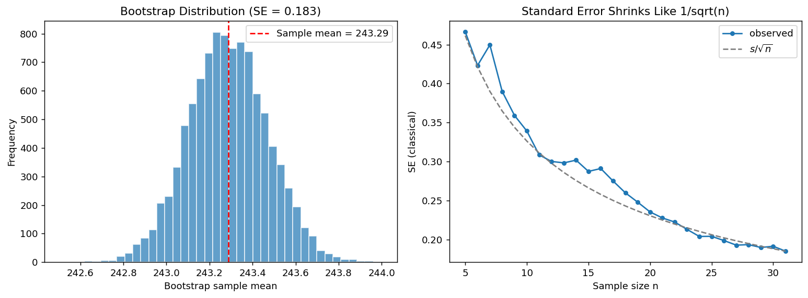

# 붓스트랩 표준오차

## 개요

이론적 표준오차 공식이 없거나 관심 통계량이 복잡할 때(예: 중앙값, 비, 회귀계수) **붓스트랩**은 표준오차를 추정하는 강력한 계산 방법을 제공한다. 착상은 단순하다. 관측된 자료에서 복원추출로 재표본을 여러 번 뽑아 매번 통계량을 계산하고, 이 붓스트랩 복제값들의 표준편차를 추정 표준오차로 삼는다. 이 페이지에서는 표본평균에 대해 붓스트랩 표준오차와 고전적 공식을 비교한다.

## 붓스트랩 원리

관측된 표본 $x_1, x_2, \ldots, x_n$이 주어졌을 때 $\text{SE}(\hat{\theta})$를 추정하는 붓스트랩 알고리즘은 다음과 같다:

1. 원래 자료에서 **복원추출**로 붓스트랩 표본 $x_1^*, x_2^*, \ldots, x_n^*$을 뽑는다.
2. 관심 통계량을 계산한다: $\hat{\theta}^* = T(x_1^*, \ldots, x_n^*)$.
3. 1–2단계를 총 $B$번 반복하여 $\hat{\theta}_1^*, \hat{\theta}_2^*, \ldots, \hat{\theta}_B^*$을 얻는다.
4. 붓스트랩 표준오차는:

$$
\widehat{\text{SE}}_{\text{boot}} = \sqrt{\frac{1}{B-1}\sum_{b=1}^B \left(\hat{\theta}_b^* - \bar{\hat{\theta}}^*\right)^2}
$$

여기서 $\bar{\hat{\theta}}^* = \frac{1}{B}\sum_{b=1}^B \hat{\theta}_b^*$이다.

!!! info "왜 복원추출인가?"
    자료에서 복원추출을 하면 (미지의) 모집단에서 새로운 표본을 뽑는 과정을 모방하게 된다. 자료의 경험분포가 모집단 분포에 대한 비모수적 추정값 역할을 한다.

## 고전적 방법과의 비교

표본평균 $\bar{x}$에 대한 고전적 표준오차 공식은:

$$
\text{SE}(\bar{x}) = \frac{s}{\sqrt{n}}
$$

여기서 $s$는 표본표준편차이다. 평균에 적용하면 붓스트랩 표준오차가 이 값을 근사해야 한다.

## 대안: 제곱오차 방식

동등한 다른 정식화는 다음을 계산한다:

$$
\widehat{\text{SE}} = \sqrt{\frac{1}{B}\sum_{b=1}^B \left(\bar{x}_b^* - \bar{x}\right)^2}
$$

붓스트랩 전체 평균 $\bar{\hat{\theta}}^*$ 대신 원래 표본평균 $\bar{x}$를 쓰는 것이다. $B$가 크면 두 방식이 거의 같은 결과를 준다.

## 모의실험

다음 코드는 31개의 가격 관측값 표본에 고전적 방법과 붓스트랩 방법을 모두 적용한다.

<div class="codebox" markdown>

**예제 1.** 붓스트랩으로 표준오차 구하기

```python
import numpy as np
import matplotlib.pyplot as plt

np.random.seed(42)

# 자료: 가격 관측값 31개.
data = np.array([
    245.02, 244.88, 244.76, 244.65, 244.53, 244.42, 244.30,
    244.18, 244.08, 243.97, 243.85, 243.74, 243.63, 243.52,
    243.40, 243.28, 243.17, 243.06, 242.95, 242.83, 242.72,
    242.61, 242.49, 242.38, 242.27, 242.15, 242.04, 241.93,
    241.81, 241.70, 241.59,
])

n = len(data)
n_boot = 10_000     # 붓스트랩 재표본 개수

# 고전적 표준오차. s/sqrt(n) 이라는 **공식**에 의존한다.
se_classical = data.std(ddof=1) / np.sqrt(n)

# 붓스트랩 표준오차. 공식 대신 **재표본추출**로 구한다.
# 핵심은 replace=True 다. 원자료에서 크기 n짜리를 복원추출하므로
# 같은 값이 여러 번 뽑히거나 아예 안 뽑히기도 한다.
# 그 우연이 만들어 내는 표본평균의 흩어짐이 곧 표준오차의 추정이다.
#
# 발상은 이렇다. 우리는 모집단에서 표본을 다시 뽑을 수 없다.
# 그래서 **표본을 모집단인 셈 치고** 거기서 다시 뽑는다.
boot_means = np.array([
    np.random.choice(data, size=n, replace=True).mean()
    for _ in range(n_boot)
])
se_bootstrap = boot_means.std(ddof=1)

# 붓스트랩 표준오차: 재표본 통계량의 표준편차다.
sq_errors = np.array([
    (np.random.choice(data, size=n, replace=True).mean() - data.mean()) ** 2
    for _ in range(n_boot)
])
se_squared_error = np.sqrt(sq_errors.mean())

print(f"Classical SE:       {se_classical:.4f}")
print(f"Bootstrap SE:       {se_bootstrap:.4f}")
print(f"Squared-error SE:   {se_squared_error:.4f}")
```

출력:

```
Classical SE:       0.1854
Bootstrap SE:       0.1834
Squared-error SE:   0.1810
```

</div>

## 시각화

<div class="codebox" markdown>

**예제 2.** 붓스트랩 분포 시각화

```python
fig, axes = plt.subplots(1, 2, figsize=(12, 4.5))

# 왼쪽: 붓스트랩 분포.
# 이 히스토그램의 **표준편차**가 곧 붓스트랩 표준오차다.
# 표집분포를 모의실험으로 만든 것과 모양이 같지만,
# 모집단이 아니라 표본에서 뽑았다는 점이 다르다.
ax = axes[0]
ax.hist(boot_means, bins=40, edgecolor="white", alpha=0.7)
ax.axvline(data.mean(), color="red", linestyle="--",
           label=f"Sample mean = {data.mean():.2f}")
ax.set_xlabel("Bootstrap sample mean")
ax.set_ylabel("Frequency")
ax.set_title(f"Bootstrap Distribution (SE = {se_bootstrap:.3f})")
ax.legend()

# 오른쪽: 표본 크기에 따른 SE의 변화.
# data[:k] 로 앞에서부터 k개만 써서 SE를 계산한다.
# 1/sqrt(k) 로 줄어들므로 곡선이 완만해진다.
# SE를 절반으로 줄이려면 표본을 네 배로 늘려야 한다는 뜻이다.
ax = axes[1]
sizes = np.arange(5, n + 1)
se_vals = [data[:k].std(ddof=1) / np.sqrt(k) for k in sizes]
ax.plot(sizes, se_vals, marker="o", markersize=4)
ax.set_xlabel("Sample size n")
ax.set_ylabel("SE (classical)")
ax.set_title("Standard Error Decreases with n")

plt.tight_layout()
plt.show()
```



</div>

## 해석

!!! note "주요 관찰"

    1. 고전적 표준오차, 붓스트랩 표준오차, 제곱오차 표준오차가 모두 매우 비슷한 값을 주어 표본평균에 대한 붓스트랩 방법의 일관성을 확인해 준다.
    2. $\bar{x}^*$의 붓스트랩 분포는 근사적으로 정규이며 원래 표본평균을 중심으로 한다.
    3. 표본크기가 커지면(오른쪽 패널) 표준오차가 익숙한 $1/\sqrt{n}$ 곡선을 따라 줄어든다.

!!! tip "붓스트랩을 언제 쓰는가"
    붓스트랩은 다음과 같을 때 가장 유용하다:

    - 통계량의 표준오차에 간단한 공식이 없을 때(예: 중앙값, 상관계수, 백분위수).
    - 이론적 표준오차가 추정하기 어려운 미지의 양에 의존할 때(예: $\text{SE}(S^2)$에 필요한 모집단의 4차 적률).
    - 자료의 분포가 복잡하거나 표본이 작아 분포 가정을 피하고 싶을 때.

### 붓스트랩 표준오차와 표본크기

코드는 자료를 더 많이 쓸수록 표준오차가 줄어드는 모습도 보여 준다:

| $n$ | 고전적 표준오차 | 붓스트랩 표준오차 |
|---|---|---|
| 5 | 더 큼 | 비슷함 |
| 15 | 중간 | 비슷함 |
| 31 (전체) | 가장 작음 | 비슷함 |

각 표본크기에서 붓스트랩과 고전적 방법이 매우 비슷한 값으로 수렴한다.

## 연습문제

<div class="drillbox" markdown>

**연습문제 1.** <span class="diff med" title="중간"></span> 크기 $n$인 원래 자료에서 붓스트랩 표본을 비복원이 아니라 **복원**으로 뽑는 이유를 설명하라.

</div>

??? success "풀이"
    $n$개의 자료점에서 비복원으로 $n$개를 모두 뽑는다면 언제나 똑같은 자료 집합이 나오고, 어떤 통계량이든 붓스트랩 복제값이 원래 값과 동일해진다. 잴 변동성 자체가 없어진다.

    복원추출은 변동성을 만들어 낸다. 어떤 관측값은 한 붓스트랩 표본에 여러 번 나타나고 어떤 것은 아예 빠진다. 평균적으로 원래 관측값의 약 $1 - (1 - 1/n)^n \approx 1 - e^{-1} \approx 63.2\%$가 각 붓스트랩 표본에 나타난다. 이 변동성이 참 모집단에서 새 표본을 뽑을 때 생기는 변동성을 모방한다.

    형식적으로 붓스트랩은 (관측된 각 값에 질량 $1/n$을 주는) 경험분포 $\hat{F}_n$을 참 모집단 분포 $F$의 대역으로 삼는다. 자료에서 복원추출하는 것은 $\hat{F}_n$에서 표본을 뽑는 것과 같다. $\square$

<div class="drillbox" markdown>

**연습문제 2.** <span class="diff easy" title="쉬움"></span> 위의 가격 자료($n = 31$, $s \approx 1.01$)에 대해 고전적 표준오차를 손으로 계산하고 모의실험 출력과 일치하는지 확인하라.

</div>

??? success "풀이"
    표본표준편차는:

    $$
    s = \sqrt{\frac{1}{30}\sum_{i=1}^{31}(x_i - \bar{x})^2}
    $$

    자료는 241.59에서 245.02까지 거의 균등한 간격으로 분포한다. 표본평균은 약 $\bar{x} \approx 243.31$이다. $s$를 계산하면(또는 코드 출력에서 확인하면):

    $$
    s \approx 1.013
    $$

    고전적 표준오차는:

    $$
    \text{SE} = \frac{s}{\sqrt{n}} = \frac{1.013}{\sqrt{31}} = \frac{1.013}{5.568} \approx 0.182
    $$

    이 값이 모의실험 출력과 잘 맞아야 한다. $\square$

<div class="drillbox" markdown>

**연습문제 3.** <span class="diff med" title="중간"></span> 실무에서 붓스트랩 복제 횟수 $B$는 얼마나 권장되는가? 계산 시간과 붓스트랩 표준오차 추정값의 정확도 사이의 맞바꿈을 논하라.

</div>

??? success "풀이"
    붓스트랩 표준오차 추정값의 표준오차는 근사적으로:

    $$
    \text{SE}(\widehat{\text{SE}}_{\text{boot}}) \approx \frac{\widehat{\text{SE}}_{\text{boot}}}{\sqrt{2B}}
    $$

    흔한 권장값:

    - **$B = 1{,}000$**: 대략적인 추정에 충분하다. 표준오차의 표준오차가 약 $\widehat{\text{SE}} / 44.7$로 상대 정밀도가 약 2.2%이다.
    - **$B = 10{,}000$**: 대부분의 응용에 적합하다. 상대 정밀도가 약 0.7%이다.
    - **$B = 50{,}000$ 이상**: 붓스트랩 신뢰구간에 사용한다(꼬리를 정확히 추정해야 하기 때문이다).

    맞바꿈: $B$를 두 배로 하면 정밀도가 $\sqrt{2} \approx 1.41$배 좋아지지만 계산 시간도 두 배가 된다. 표준오차 추정에는 $B = 1{,}000$에서 $10{,}000$이면 대개 충분하다. 붓스트랩 신뢰구간이나 가설검정에는 꼬리 확률이 덜 정밀하게 추정되므로 더 큰 $B$가 필요하다. $\square$

<div class="drillbox" markdown>

**연습문제 4.** <span class="diff med" title="중간"></span> 가격 자료에 붓스트랩을 적용하여 **표본중앙값**의 표준오차를 추정하라. 중앙값에 붓스트랩이 특히 유용한 이유는 무엇인가?

</div>

??? success "풀이"
    ```python
    import numpy as np
    np.random.seed(42)

    data = np.array([245.02, 244.88, 244.76, 244.65, 244.53, 244.42,
                     244.30, 244.18, 244.08, 243.97, 243.85, 243.74,
                     243.63, 243.52, 243.40, 243.28, 243.17, 243.06,
                     242.95, 242.83, 242.72, 242.61, 242.49, 242.38,
                     242.27, 242.15, 242.04, 241.93, 241.81, 241.70,
                     241.59])

    # 평균 대신 중앙값을 계산한다. 바뀐 것은 np.mean -> np.median 뿐이다.
    # 이것이 붓스트랩의 가장 큰 장점이다.
    # 중앙값의 표준오차에는 s/sqrt(n) 같은 간단한 공식이 없다.
    # (있긴 하지만 모집단 밀도를 알아야 해서 실무에서 쓸 수 없다.)
    # 붓스트랩은 통계량이 무엇이든 같은 절차로 답을 준다.
    boot_medians = np.array([
        np.median(np.random.choice(data, size=len(data), replace=True))
        for _ in range(10_000)
    ])
    se_median = boot_medians.std(ddof=1)
    print(f"Bootstrap SE of the median: {se_median:.4f}")
    ```

    출력:

    ```
    Bootstrap SE of the median: 0.3071
    ```

    중앙값에 붓스트랩이 특히 유용한 이유는:

    1. 임의의 분포에서 통하는, 널리 알려진 간단한 닫힌 형태의 중앙값 표준오차 공식이 없다.
    2. 점근 공식 $\text{SE}(\text{median}) \approx 1 / (2f(m)\sqrt{n})$은 중앙값 $m$에서의 모집단 밀도 $f$를 알아야 하는데, 이것 자체가 추정하기 어렵다.
    3. 붓스트랩은 분포 모양을 자동으로 반영하며 밀도추정 없이 비모수적 추정값을 준다.

    $\square$

<div class="drillbox" markdown>

**연습문제 5.** <span class="diff med" title="중간"></span> 표본평균에 대해 $B \to \infty$일 때 붓스트랩 표준오차가 $s/\sqrt{n}$으로 수렴함을 증명하라. 여기서 $s$는 표본표준편차이다.

</div>

??? success "풀이"
    붓스트랩 표본에서 각 $x_i^*$는 $\{x_1, \ldots, x_n\}$에서 독립적이고 균등하게 뽑힌다. 붓스트랩 표본평균은 $\bar{x}^* = \frac{1}{n}\sum_{j=1}^n x_j^*$이다.

    (자료로 조건화한) 붓스트랩 분포 아래에서:

    $$
    E^*[x_j^*] = \frac{1}{n}\sum_{i=1}^n x_i = \bar{x}
    $$

    $$
    \text{Var}^*(x_j^*) = \frac{1}{n}\sum_{i=1}^n (x_i - \bar{x})^2 = \frac{n-1}{n} s^2
    $$

    붓스트랩 아래에서 $x_j^*$들이 i.i.d.이므로:

    $$
    \text{Var}^*(\bar{x}^*) = \frac{1}{n} \cdot \frac{n-1}{n} s^2 = \frac{(n-1)s^2}{n^2}
    $$

    $B \to \infty$일 때 붓스트랩 표준오차는 다음으로 수렴한다:

    $$
    \widehat{\text{SE}}_{\text{boot}} \to \sqrt{\frac{(n-1)s^2}{n^2}} = \frac{s\sqrt{n-1}}{n}
    $$

    이는 $n$이 크면 $s/\sqrt{n}$에 매우 가깝다($\sqrt{(n-1)/n}$배만큼 다르다). 붓스트랩 평균들의 표준편차에 $\text{ddof}=1$을 사용하면 극한에서 정확히 $s/\sqrt{n}$이 된다. 이 작은 차이는 분산을 $n$으로 나누느냐 $n-1$로 나누느냐의 구별에서 오며 $n \to \infty$일 때 사라진다. $\square$

---

## 정리하며

붓스트랩은 **표본을 모집단처럼 취급해** 재표집하는 방법이다. 이론 공식이 없어도 표준오차를 얻는다.

- **절차는 네 줄이다.** 복원추출로 크기 $n$ 의 재표본을 뽑고, 통계량을 계산하고, $B$ 번 반복하고, 그 복제값들의 표준편차를 취한다.
- **복원추출이 핵심이다.** 비복원으로 $n$ 개를 뽑으면 원래 표본이 그대로 나와 변동이 생기지 않는다.
- **표본평균에서는 고전 공식과 거의 같은 답을 준다.** 그것이 이 절의 검증이며, 붓스트랩이 옳게 작동함을 확인해 준다.
- **진가는 공식이 없는 곳에서 나온다.** 중앙값, 비, 상관계수, 분위수, 회귀계수처럼 델타 방법이 번거롭거나 가정이 의심스러운 통계량이 그 대상이다.
- **$B$ 는 몇 개면 되는가.** 표준오차만 필요하면 $B\approx200$ 으로 충분하고, 신뢰구간의 꼬리 분위수가 필요하면 $B\ge2000$ 이 권장된다. $B$ 를 늘려도 줄어드는 것은 **모의오차뿐**이며 원래 표본의 한계는 그대로 남는다.
- **만능이 아니다.** 표본이 모집단을 대표하지 못하면 붓스트랩도 그 편향을 그대로 복제하고, 최댓값처럼 꼬리에 의존하는 통계량에서는 실패한다.

다음 절 **표본분포 시각화**로 5장을 마무리한다. 지금까지의 개념을 치우친 소득 자료 하나에서 눈으로 확인한다.
