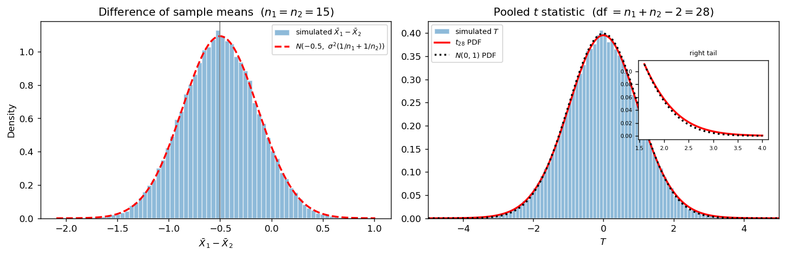

# X̄₁ - X̄₂의 표본분포 (등분산 정규모집단)

## 개요

두 집단을 비교하는 일은 통계학에서 가장 자주 하는 일이다. 그 중심에 $\bar X_1 - \bar X_2$의 표본분포가 있다.

이 페이지는 **모든 가정이 맞는 경우**를 본다. 두 모집단이 정규이고 분산이 같다. 이 자리에서는 근사가 하나도 필요하지 않다. 표본크기는 견주기 쉽도록 같게 잡았을 뿐 정리가 요구하는 것이 아니며, 연습문제 6에서 $n_1 \ne n_2$여도 결과가 그대로임을 확인한다.

- $\bar X_1 - \bar X_2$가 **정확히** 정규분포를 따른다.
- 합동분산 $S_p^2$을 쓴 $t$ 통계량이 **정확히** $t_{n_1+n_2-2}$를 따른다.
- 명목 95% 신뢰구간의 실제 포함률이 **정확히** 0.95다.

"정확히"라는 말이 세 번 나온다. 5.4절에서 $\bar X$가 정규모집단에서 정확히 정규였고, 5.6절에서 $(n-1)S^2/\sigma^2$이 정확히 카이제곱이었던 두 결과가 여기서 하나로 합쳐지기 때문이다. 이 페이지는 그 합쳐지는 과정을 따라가고, 모의실험으로 "정확히"를 확인한다.

이 쪽이 기준선이다. 이어지는 두 쪽에서 가정을 하나씩 깨뜨리며 그 대가를 수치로 잰다. 등분산을 깨면(다음 쪽) 표본을 키워도 고쳐지지 않는 문제가 생기고, 정규성을 깨면(그다음 쪽) 표본을 키우면 고쳐진다. 그 차이를 보려면 먼저 아무것도 깨지지 않은 자리를 알아 두어야 한다.

## 설정

두 모집단에서 서로 독립인 확률표본을 뽑는다.

$$
X_1, \ldots, X_{n_1} \overset{\text{iid}}{\sim} N(\mu_1, \sigma^2), \qquad
Y_1, \ldots, Y_{n_2} \overset{\text{iid}}{\sim} N(\mu_2, \sigma^2)
$$

두 모집단의 분산이 **같은 값 $\sigma^2$**이라는 것이 이 쪽의 핵심 가정이다. 모의실험에서 쓸 구체적인 값은 다음과 같다.

| 항목 | 모집단 1 | 모집단 2 |
|---|---|---|
| 분포 | $N(0, 1)$ | $N(0.5, 1)$ |
| 평균 | $\mu_1 = 0$ | $\mu_2 = 0.5$ |
| 표준편차 | $\sigma_1 = 1$ | $\sigma_2 = 1$ |
| 표본크기 | $n_1 = 15$ | $n_2 = 15$ |

따라서 참 차이는 $\mu_1 - \mu_2 = -0.5$이고, 효과크기는 $(\mu_1-\mu_2)/\sigma = -0.5$로 코헨 기준의 "중간"이다. 두 표본분산을

$$
S_1^2 = \frac{1}{n_1-1}\sum_{i}(X_i - \bar X_1)^2, \qquad
S_2^2 = \frac{1}{n_2-1}\sum_{j}(Y_j - \bar X_2)^2
$$

로 쓴다.

## 표본분포 이론

### 차는 정확히 정규

$\bar X_1$과 $\bar X_2$는 각각 정규이고 서로 독립이다. 독립인 정규확률변수의 선형결합은 정규이므로

$$
\bar X_1 - \bar X_2 \sim N\!\left(\mu_1 - \mu_2,\ \sigma^2\!\left(\frac{1}{n_1} + \frac{1}{n_2}\right)\right)
$$

이다. 근사가 아니라 등식이다. 표준오차는

$$
\text{SE}(\bar X_1 - \bar X_2) = \sigma\sqrt{\frac{1}{n_1} + \frac{1}{n_2}} = 1 \cdot \sqrt{\frac{2}{15}} = 0.3651
$$

이다. $1/n_1 + 1/n_2$라는 꼴에 주목하라. 전체 표본수 $n_1 + n_2$를 고정하면 이 값은 $n_1 = n_2$에서 최소가 된다(산술-조화 평균 부등식). **등분산이면 반씩 나누는 것이 가장 정밀하다.**

### 분산을 하나로 모은다

$\sigma^2$을 모르면 추정해야 한다. 두 모집단의 분산이 같으므로 $S_1^2$과 $S_2^2$은 **같은 값을 겨누는 두 개의 추정량**이다. 버릴 이유가 없으니 둘을 합친다.

$$
S_p^2 = \frac{(n_1-1)S_1^2 + (n_2-1)S_2^2}{n_1 + n_2 - 2}
$$

자유도를 가중값으로 쓴 가중평균이다. 분자를 제곱합으로 다시 쓰면 무엇을 하고 있는지가 더 분명해진다.

$$
S_p^2 = \frac{\sum_i (X_i - \bar X_1)^2 + \sum_j (Y_j - \bar X_2)^2}{n_1 + n_2 - 2}
$$

즉 **두 집단의 편차제곱합을 한데 모아 전체 자유도로 나눈 것**이다. 자유도가 $n_1 + n_2 - 2$인 이유는 두 평균을 각각 추정하는 데 하나씩 썼기 때문이다.

<div class="thmbox" markdown>

### 정리 1. 합동 t 통계량의 표본분포 { .thm }

두 표본이 독립이고 각각 $N(\mu_1,\sigma^2)$, $N(\mu_2,\sigma^2)$에서 나왔으면

$$
\frac{(n_1+n_2-2)S_p^2}{\sigma^2} \sim \chi^2_{n_1+n_2-2}
$$

이고, 이는 $\bar X_1 - \bar X_2$와 독립이다. 따라서

$$
T = \frac{(\bar X_1 - \bar X_2) - (\mu_1 - \mu_2)}{S_p\sqrt{\dfrac{1}{n_1} + \dfrac{1}{n_2}}} \sim t_{n_1+n_2-2}
$$

이다.

</div>

??? proof "증명"
    5.6절의 정리에 의해 각 표본에서

    $$
    \frac{(n_1-1)S_1^2}{\sigma^2} \sim \chi^2_{n_1-1}, \qquad \frac{(n_2-1)S_2^2}{\sigma^2} \sim \chi^2_{n_2-1}
    $$

    이고 두 표본이 독립이므로 두 카이제곱도 독립이다. 독립인 카이제곱의 합은 자유도가 더해진 카이제곱이므로

    $$
    \frac{(n_1+n_2-2)S_p^2}{\sigma^2} = \frac{(n_1-1)S_1^2}{\sigma^2} + \frac{(n_2-1)S_2^2}{\sigma^2} \sim \chi^2_{n_1+n_2-2}
    $$

    이다. **여기서 등분산 가정이 쓰였다.** 두 분산이 다르면 두 항을 같은 $\sigma^2$으로 나눌 수 없어 이 합이 카이제곱이 되지 않는다.

    독립성은 다음과 같이 확인한다. 5.6절에서 각 표본 안의 $\bar X_i$와 $S_i^2$이 독립이고, 두 표본은 서로 독립이다. 따라서 네 통계량 $\bar X_1, S_1^2, \bar X_2, S_2^2$이 모두 독립이며, 앞의 둘로 만든 $\bar X_1 - \bar X_2$와 뒤의 둘로 만든 $S_p^2$도 독립이다.

    이제

    $$
    Z = \frac{(\bar X_1 - \bar X_2) - (\mu_1-\mu_2)}{\sigma\sqrt{1/n_1 + 1/n_2}} \sim N(0,1),
    \qquad W = \frac{(n_1+n_2-2)S_p^2}{\sigma^2} \sim \chi^2_{n_1+n_2-2}
    $$

    로 두면 $Z$와 $W$가 독립이고

    $$
    T = \frac{Z}{\sqrt{W/(n_1+n_2-2)}}
    $$

    인데, $\sigma$가 분자와 분모에서 약분되어 $T$가 앞의 식과 같아진다. $t$ 분포의 정의에 의해 $T \sim t_{n_1+n_2-2}$이다. $\square$

$\sigma$가 약분되어 사라졌다는 점이 결정적이다. $T$의 분포에 **모르는 모수가 하나도 남지 않으므로** 관측값만으로 추론을 할 수 있다. 추축량(pivotal quantity)이 하는 일이다.

### 왜 z가 아니고 t인가

$n_1 = n_2 = 15$이면 자유도가 $28$이다. $t_{28}$은 표준정규와 꽤 비슷해 보이지만 꼬리가 더 무겁다.

$$
\text{SD}(t_{28}) = \sqrt{\frac{28}{26}} = 1.0377
$$

$$
t_{0.975,\,28} = 2.0484, \qquad z_{0.975} = 1.9600
$$

임계값이 4.5% 더 크다. 이 차이를 무시하고 $z$를 쓰면 구간이 좁아져 포함률이 떨어진다. 실제로

$$
P(|t_{28}| > 1.96) = 0.0600
$$

이므로 명목 5% 검정이 실제로는 6% 검정이 된다. 예제 2에서 포함률로 확인한다.

## 모의실험

<div class="codebox" markdown>

#### 예제 1. 차와 t 통계량의 표집분포 { .eg }

```python
import matplotlib.pyplot as plt
import numpy as np
from scipy import stats

rng = np.random.default_rng(1)

n1 = n2 = 15
mu1, mu2, sigma = 0.0, 0.5, 1.0
B = 100_000

x1 = rng.normal(mu1, sigma, size=(B, n1))
x2 = rng.normal(mu2, sigma, size=(B, n2))

d = x1.mean(axis=1) - x2.mean(axis=1)
v1 = x1.var(axis=1, ddof=1)
v2 = x2.var(axis=1, ddof=1)
sp2 = ((n1 - 1) * v1 + (n2 - 1) * v2) / (n1 + n2 - 2)
t = (d - (mu1 - mu2)) / np.sqrt(sp2 * (1 / n1 + 1 / n2))

fig, axes = plt.subplots(1, 2, figsize=(12, 4))

# 왼쪽: 차 자체의 표집분포. 이론 정규밀도를 겹쳐 그린다.
se = sigma * np.sqrt(1 / n1 + 1 / n2)
g = np.linspace(d.min(), d.max(), 400)
axes[0].hist(d, bins=70, density=True, alpha=0.5, edgecolor="white",
             label=r"simulated $\bar X_1-\bar X_2$")
axes[0].plot(g, stats.norm(mu1 - mu2, se).pdf(g), "--r", lw=2,
             label=r"$N(-0.5,\ \sigma^2(1/n_1+1/n_2))$")
axes[0].axvline(mu1 - mu2, color="gray", lw=1)
axes[0].set_title(r"Difference of sample means  ($n_1=n_2=15$)")
axes[0].set_xlabel(r"$\bar X_1-\bar X_2$")
axes[0].set_ylabel("Density")
axes[0].legend(fontsize=8)

# 오른쪽: sigma 를 Sp 로 바꾼 t 통계량. t(28)과 N(0,1)을 함께 겹친다.
df = n1 + n2 - 2
g = np.linspace(-5, 5, 400)
axes[1].hist(t, bins=100, range=(-5, 5), density=True, alpha=0.5,
             edgecolor="white", label=r"simulated $T$")
axes[1].plot(g, stats.t(df).pdf(g), "-r", lw=2, label=r"$t_{28}$ PDF")
axes[1].plot(g, stats.norm.pdf(g), ":k", lw=2, label=r"$N(0,1)$ PDF")
axes[1].set_title(r"Pooled $t$ statistic  (df $=n_1+n_2-2=28$)")
axes[1].set_xlabel(r"$T$")
axes[1].set_xlim(-5, 5)
axes[1].legend(fontsize=8, loc="upper left")

# 두 밀도의 차이는 꼬리에서만 보인다. 확대해 둔다.
inset = axes[1].inset_axes([0.60, 0.40, 0.37, 0.40])
g2 = np.linspace(1.6, 4.0, 200)
inset.plot(g2, stats.t(df).pdf(g2), "-r", lw=2)
inset.plot(g2, stats.norm.pdf(g2), ":k", lw=2)
inset.set_title("right tail", fontsize=7)
inset.tick_params(labelsize=6)

plt.tight_layout()
plt.show()
```



왼쪽에서 히스토그램과 빨간 곡선이 거의 완전히 겹친다. 중심도 폭도 맞는다. 5.6절의 $S^2$ 페이지들에서 폭이 어긋나던 그림과 대조적이다.

오른쪽에서 히스토그램은 $t_{28}$ 곡선(실선)에 맞고 표준정규(점선)와는 미세하게 다르다. 가운데 부분만 보면 두 곡선을 구별하기 어렵지만, 확대한 꼬리에서는 $t_{28}$이 위에 있다. **기각 여부가 갈리는 자리가 바로 이 꼬리**이므로 이 작은 차이를 무시할 수 없다.

</div>

<div class="codebox" markdown>

#### 예제 2. 이론값과 포함률을 숫자로 확인 { .eg }

```python
# 예제 1에서 만든 d, sp2 를 그대로 쓴다.
se_hat = np.sqrt(sp2 * (1 / n1 + 1 / n2))       # 추정된 표준오차
se_true = sigma * np.sqrt(1 / n1 + 1 / n2)      # 참 표준오차

print(f"E[X1bar - X2bar]  이론 {mu1 - mu2:+.4f}   모의 {d.mean():+.4f}")
print(f"SD[X1bar - X2bar] 이론 {se_true:.4f}   모의 {d.std(ddof=1):.4f}")
print(f"E[Sp^2]           이론 {sigma**2:.4f}   모의 {sp2.mean():.4f}")

df = n1 + n2 - 2
t_crit = stats.t(df).ppf(0.975)
z_crit = stats.norm.ppf(0.975)
lo = d - t_crit * se_hat
hi = d + t_crit * se_hat
print()
print(f"임계값  t(28) = {t_crit:.4f},  z = {z_crit:.4f}")
print(f"명목 95% 구간의 실제 포함률")
print(f"  t(28) 임계값: {np.mean((lo <= mu1 - mu2) & (mu1 - mu2 <= hi)):.4f}")
print(f"  z 임계값:     {np.mean(np.abs(d - (mu1 - mu2)) <= z_crit * se_hat):.4f}")
```

출력:

```
E[X1bar - X2bar]  이론 -0.5000   모의 -0.5017
SD[X1bar - X2bar] 이론 0.3651   모의 0.3637
E[Sp^2]           이론 1.0000   모의 0.9991

임계값  t(28) = 2.0484,  z = 1.9600
명목 95% 구간의 실제 포함률
  t(28) 임계값: 0.9513
  z 임계값:     0.9411
```

평균, 표준편차, $E[S_p^2]$이 모두 이론값과 맞는다. 포함률은 $t$ 임계값으로 0.951, $z$ 임계값으로 0.941이다. 반복 10만 회에서 포함률 추정의 표준오차가 $\sqrt{0.95 \times 0.05/100000} = 0.0007$이므로 0.951은 0.95와 구별되지 않고, 0.941은 분명히 낮다. **$t$가 맞고 $z$는 틀렸다**는 것이 숫자로 갈린다.

</div>

<div class="codebox" markdown>

#### 예제 3. 표본크기를 바꿔도 포함률은 그대로다 { .eg }

```python
import numpy as np
from scipy import stats

rng = np.random.default_rng(1)
B = 100_000
delta = -0.5          # 참 차이 mu1 - mu2
sigma = 1.0

print("  n   포함률   검정력(모의)  검정력(비중심 t)")
for n in (5, 15, 50):
    x1 = rng.normal(0.0, sigma, size=(B, n))
    x2 = rng.normal(0.5, sigma, size=(B, n))
    d = x1.mean(axis=1) - x2.mean(axis=1)
    v1, v2 = x1.var(axis=1, ddof=1), x2.var(axis=1, ddof=1)
    sp2 = (v1 + v2) / 2
    se = np.sqrt(sp2 * 2 / n)

    df = 2 * n - 2
    crit = stats.t(df).ppf(0.975)
    cover = np.mean(np.abs(d - delta) <= crit * se)     # 명목 95% 구간
    power = np.mean(np.abs(d / se) > crit)              # H0: mu1 = mu2 기각률

    ncp = delta / (sigma * np.sqrt(2 / n))
    exact = stats.nct(df, ncp).sf(crit) + stats.nct(df, ncp).cdf(-crit)
    print(f"{n:>3}   {cover:.4f}     {power:.4f}       {exact:.4f}")
```

출력:

```
  n   포함률   검정력(모의)  검정력(비중심 t)
  5   0.9508     0.1080       0.1077
 15   0.9503     0.2626       0.2624
 50   0.9521     0.6968       0.6969
```

두 가지를 읽을 수 있다.

첫째, **포함률이 $n$에 전혀 의존하지 않는다.** $n = 5$에서도 0.95다. 정리 1이 근사가 아니라 등식이므로 당연한 결과이며, 표본이 작을 때 정규근사에 기대는 방법들과 결정적으로 다른 점이다.

둘째, **검정력은 $n$에 크게 의존한다.** 효과크기 $0.5$를 집단당 15개로 잡아낼 확률은 0.26밖에 안 된다. 모의실험 값이 비중심 $t$ 분포로 계산한 이론값과 소수 셋째 자리까지 맞는다. 유효성(포함률)과 검정력은 다른 문제이며, 이 페이지의 "정확함"은 앞의 것만 보장한다.

</div>

## 해석

!!! note "주요 관찰"

    1. **세 결과가 모두 정확하다.** 차는 정확히 정규, 합동 $t$는 정확히 $t_{28}$, 포함률은 정확히 0.95다. 근사가 들어갈 자리가 없다. 이 장에서 이만큼 깔끔한 자리는 드물다.
    2. **$\sigma$가 약분된다.** $T$의 분포에 모르는 모수가 남지 않으므로 $\sigma$를 몰라도 추론이 된다. 이 약분은 두 모집단의 분산이 **같을 때만** 일어난다.
    3. **$z$를 쓰면 안 된다.** $t_{28}$과 $N(0,1)$은 가운데서는 거의 같지만 꼬리에서 다르고, 검정은 꼬리에서 이뤄진다. 임계값 4.5%의 차이가 포함률 0.951과 0.941로 나타난다.
    4. **표본크기가 정확성을 바꾸지 않는다.** $n = 5$에서도 포함률이 0.95다. 바뀌는 것은 검정력뿐이다.
    5. **여기서 쓴 가정은 셋이다.** 정규성, 등분산, 독립. 다음 쪽에서 등분산을 깨고 그다음 쪽에서 정규성을 깬다. 두 실패의 성격이 전혀 다르다는 것이 5.7절의 결론이다.

## 이 결과가 기대는 것

세 가정이 각각 어느 단계에서 쓰였는지 증명을 따라가며 짚어 두면, 뒤에서 하나씩 깨뜨릴 때 무엇이 어긋나는지 미리 알 수 있다.

**독립성**은 두 번 쓰인다. 두 표본이 독립이어야 두 카이제곱이 독립이고 그래야 자유도가 더해진다. 그리고 각 표본 안에서 $\bar X_i$와 $S_i^2$이 독립이어야 $Z$와 $W$의 비가 $t$ 분포의 정의에 맞는다. 독립성이 깨지면 자유도부터 틀리므로 어느 $t$ 곡선을 그려야 할지조차 정해지지 않는다.

**정규성**은 두 자리에 쓰인다. $\bar X_1 - \bar X_2$가 **정확히** 정규가 되는 데 한 번, $(n_i-1)S_i^2/\sigma^2$이 카이제곱이 되는 데 한 번이다. 앞의 쓰임은 $n$이 커지면 중심극한정리가 대신해 준다. 뒤의 쓰임에는 중심극한정리가 듣지 않지만, $S_p^2$은 $T$의 분모에 들어가는 **척도**일 뿐이고 $n$이 커지면 $\sigma^2$으로 수렴하므로 그 영향도 함께 사라진다. 그래서 정규성의 실패는 표본이 고쳐 주는 종류의 실패다. 그 과정은 그다음 쪽에서 수치로 본다.

**등분산**은 오직 한 자리, 두 카이제곱을 합치는 단계에 쓰인다. 두 분산이 다르면 분모에 넣을 공통 $\sigma^2$이 없으므로 합이 카이제곱이 아니게 된다. 표본크기의 균형은 이 단계 어디에도 들어가지 않는다는 점이 중요하다. 등분산이 지켜지는 한 $n_1 \ne n_2$여도 정리 1은 그대로 정확하다(연습문제 6).

그래서 **이 쪽은 어긋남이 0인 자리**다. 포함률이 $n = 5$에서도 0.95이고 $E[S_p^2]$이 정확히 $\sigma^2$이다. 뒤에서 재는 모든 어긋남은 이 0을 기준으로 잰 거리이며, 그 기준이 있어야 "명목 5%가 실제로는 29%"라는 말이 의미를 갖는다. 등분산을 깨면 그 어긋남은 표본을 키워도 남고, 정규성을 깨면 표본이 고쳐 준다. **두 실패의 성격이 다르다는 것을 보려면 먼저 아무것도 어긋나지 않은 자리를 알아야 한다.**

## 연습문제

<div class="drillbox" markdown>

**연습문제 1.** <span class="diff easy" title="쉬움"></span>
$n_1 = n_2 = 15$, $s_1^2 = 1.10$, $s_2^2 = 0.86$인 자료에서 $S_p^2$과 추정된 표준오차를 구하고, 참 표준오차 $0.3651$과 견주어라. 이 추정값은 표본이 바뀌면 얼마나 흔들리는가?

</div>

??? success "풀이"
    자유도가 같으므로 합동분산은 단순평균이다.

    $$
    s_p^2 = \frac{14(1.10) + 14(0.86)}{28} = \frac{1.10 + 0.86}{2} = 0.98, \qquad s_p = 0.9899
    $$

    추정된 표준오차는

    $$
    \widehat{\text{SE}} = s_p\sqrt{\frac{1}{15}+\frac{1}{15}} = 0.9899 \times 0.3651 = 0.3615
    $$

    로 참값 $0.3651$과 1%밖에 차이 나지 않는다. 그러나 이만큼 가까운 것은 이 표본이 운이 좋았기 때문이다.

    **흔들림의 크기.** 정규모집단에서 $\text{Var}(S_p^2) = 2\sigma^4/(n_1+n_2-2) = 2/28$이므로 $\text{SD}(S_p^2) = 0.2673$이다. $\sqrt{\cdot}$에 델타법을 쓰면 $\text{SD}(S_p) \approx 0.2673/2 = 0.1336$이고, 여기에 $\sqrt{2/15} = 0.3651$을 곱해

    $$
    \text{SD}(\widehat{\text{SE}}) \approx 0.1336 \times 0.3651 = 0.0488
    $$

    을 얻는다. 참값의 13%다. 모의실험으로 확인하면 $\widehat{\text{SE}}$의 표준편차가 $0.0486$, 가운데 90%가 $[0.284,\ 0.444]$에 들어간다. **집단당 15개에서는 표준오차 자체가 참값의 0.78배에서 1.22배 사이를 오간다.**

    이 흔들림이 곧 $t$ 분포가 필요한 이유다. $z$를 쓴다는 것은 분모가 참값 $0.3651$로 고정되어 있다고 보는 것인데, 실제로는 분모가 저만큼 흔들린다. 그 흔들림을 셈에 넣어 주는 것이 $t_{28}$의 두꺼운 꼬리다.

<div class="drillbox" markdown>

**연습문제 2.** <span class="diff easy" title="쉬움"></span>
$S_p^2$이 $\sigma^2$의 불편추정량임을 보이고, 왜 $(S_1^2+S_2^2)/2$이 아니라 자유도로 가중하는지 설명하라.

</div>

??? success "풀이"
    $E[S_i^2] = \sigma^2$이므로

    $$
    E[S_p^2] = \frac{(n_1-1)E[S_1^2] + (n_2-1)E[S_2^2]}{n_1+n_2-2} = \frac{(n_1-1)\sigma^2 + (n_2-1)\sigma^2}{n_1+n_2-2} = \sigma^2
    $$

    이다. $\square$ 사실 가중값의 합이 1이면 어떤 가중평균도 불편이다. 단순평균 $(S_1^2+S_2^2)/2$도 불편이다.

    **자유도 가중을 쓰는 이유는 분산이 가장 작아지기 때문이다.** 정규모집단에서 $\text{Var}(S_i^2) = 2\sigma^4/(n_i-1)$이므로, 가중값 $w$와 $1-w$를 쓴 추정량의 분산은

    $$
    w^2\frac{2\sigma^4}{n_1-1} + (1-w)^2\frac{2\sigma^4}{n_2-1}
    $$

    이다. $w$로 미분해 0으로 두면 $w = (n_1-1)/(n_1+n_2-2)$를 얻는다. **분산의 역수에 비례하는 가중값이 최적**이라는 일반 원리의 한 경우이며, 여기서 분산의 역수가 자유도에 비례한다.

    $n_1 = n_2$이면 두 방식이 같아진다. 연습문제 1에서 단순평균으로 계산한 것이 정당했던 이유다.

<div class="drillbox" markdown>

**연습문제 3.** <span class="diff med" title="중간"></span>
정리 1의 증명에서 등분산 가정과 독립성 가정이 각각 어디에 쓰였는지 짚고, 두 모분산이 다르면 무엇이 깨지는지 설명하라.

</div>

??? success "풀이"
    **등분산은 카이제곱을 합칠 때 쓰인다.** 각 표본에서 얻는 것은

    $$
    \frac{(n_i-1)S_i^2}{\sigma_i^2} \sim \chi^2_{n_i-1}
    $$

    이다. 분산이 같아서 $\sigma_1^2 = \sigma_2^2 = \sigma^2$일 때만 두 항을 같은 수로 나눈 것이 되어 합이 $\chi^2_{n_1+n_2-2}$가 된다. 분산이 다르면

    $$
    \frac{(n_1-1)S_1^2 + (n_2-1)S_2^2}{\sigma^2}
    $$

    의 분모에 넣을 "$\sigma^2$"이 아예 없다. 서로 다른 척도를 가진 두 카이제곱의 합은 카이제곱이 아니다.

    **독립성은 두 곳에 쓰인다.** 첫째, 두 카이제곱이 독립이어야 자유도가 더해진다. 둘째, $\bar X_1 - \bar X_2$와 $S_p^2$이 독립이어야 $Z$와 $W$의 비가 $t$ 분포가 된다.

    **분산이 다르면 무엇이 깨지는가.** 분자의 참 분산은 $\sigma_1^2/n_1 + \sigma_2^2/n_2$인데 분모는 $S_p^2(1/n_1+1/n_2)$을 추정한다. 두 양이 일치하지 않으므로 $T$는 중심도 폭도 $t$ 분포와 맞지 않는다. 그 어긋남의 크기와 방향이 다음 쪽의 주제다.

<div class="drillbox" markdown>

**연습문제 4.** <span class="diff med" title="중간"></span>
$n_1 = n_2 = 15$인 표본에서 $s_1^2 = 1.2$, $s_2^2 = 0.8$이 나왔다. Welch–Satterthwaite 자유도

$$
\nu = \frac{\left(\dfrac{s_1^2}{n_1} + \dfrac{s_2^2}{n_2}\right)^2}{\dfrac{(s_1^2/n_1)^2}{n_1-1} + \dfrac{(s_2^2/n_2)^2}{n_2-1}}
$$

를 직접 계산하고 합동 자유도 28과 비교하라. 등분산이 맞는 상황에서 두 방법의 임계값이 얼마나 다른가?

</div>

??? success "풀이"
    $a = s_1^2/n_1$, $b = s_2^2/n_2$로 두면

    $$
    a = \frac{1.2}{15} = 0.08, \qquad b = \frac{0.8}{15} = 0.053333, \qquad a + b = 0.133333
    $$

    이다. 분자는 $(a+b)^2 = 0.0177778$이고 분모는

    $$
    \frac{a^2}{14} + \frac{b^2}{14} = \frac{0.0064}{14} + \frac{0.00284444}{14} = 0.00045714 + 0.00020317 = 0.00066032
    $$

    이므로

    $$
    \nu = \frac{0.0177778}{0.00066032} = 26.92
    $$

    이다. 합동 자유도 28보다 약간 작다.

    임계값은 $t_{0.975,\,26.92} = 2.0521$과 $t_{0.975,\,28} = 2.0484$로 **0.2% 차이**에 불과하다. 등분산이 실제로 맞고 표본크기가 같으면 두 방법이 사실상 같은 답을 준다는 뜻이다.

    이것이 중요한 관찰이다. 등분산이 맞을 때 Welch를 써서 잃는 것이 거의 없다면, 등분산이 틀렸을 때 잃는 것이 큰 쪽을 피하는 편이 낫다. 다음 쪽에서 그 "잃는 것"의 크기를 잰다.

<div class="drillbox" markdown>

**연습문제 5.** <span class="diff med" title="중간"></span>
$P(|t_{28}| > 1.96) = 0.0600$이다. $z$ 임계값을 써서 얻은 포함률 0.9411을 이 값으로 설명하라. 자유도가 얼마쯤 되면 이 차이를 무시할 수 있는가?

</div>

??? success "풀이"
    포함률과 기각률은 동전의 양면이다. $z$ 임계값으로 만든 구간이 참값을 담지 못할 확률은

    $$
    P\!\left(\left|T\right| > 1.96\right) = P(|t_{28}| > 1.96) = 0.0600
    $$

    이므로 포함률은 $1 - 0.0600 = 0.9400$이어야 한다. 모의실험 값 0.9411은 표준오차 0.0007의 두 배 안쪽이다. **이론과 모의가 맞는다.**

    자유도에 따른 실제 기각률은 다음과 같다.

    | 자유도 | $P(\lvert t_\nu\rvert > 1.96)$ | 포함률 |
    |---|---|---|
    | 10 | 0.0784 | 0.922 |
    | 28 | 0.0600 | 0.940 |
    | 60 | 0.0546 | 0.945 |
    | 200 | 0.0514 | 0.949 |
    | $\infty$ | 0.0500 | 0.950 |

    자유도가 60을 넘으면 어긋남이 0.5%포인트 아래로 떨어지고, 200쯤 되면 실무적으로 구별되지 않는다. 그러나 굳이 근사할 이유가 없다. $t$ 분위수는 계산기로 바로 나오므로 자유도가 클 때도 $t$를 쓰면 된다.

<div class="drillbox" markdown>

**연습문제 6.** <span class="diff med" title="중간"></span>
이 쪽은 $n_1 = n_2$까지 가정했다. **등분산은 그대로 두고 표본크기만 어긋나게** 하면 정리 1이 깨지는가? $(n_1,n_2) = (15,15),\ (5,25),\ (10,40),\ (3,50)$에서 명목 95% 구간의 포함률을 모의실험으로 재어 답하라.

</div>

??? success "풀이"
    두 모집단을 모두 $N(0,1)$로 두고 합동 $t$ 구간의 포함률을 20만 번씩 세면 다음과 같다.

    | $(n_1, n_2)$ | 포함률 | 명목에서의 어긋남 |
    |---|---|---|
    | (15, 15) | 0.9499 | $-0.0001$ |
    | (5, 25) | 0.9492 | $-0.0008$ |
    | (10, 40) | 0.9503 | $+0.0003$ |
    | (3, 50) | 0.9503 | $+0.0003$ |

    반복 20만 회에서 포함률 추정의 표준오차가 $\sqrt{0.95\times0.05/200000} = 0.0005$이므로 네 값 모두 0.95와 구별되지 않는다. **깨지지 않는다.**

    **왜 그런가.** 정리 1의 증명 어디에도 $n_1 = n_2$가 쓰이지 않았다. 필요한 것은 두 카이제곱을 **같은 $\sigma^2$으로 나눌 수 있다**는 것뿐이고, 그것은 등분산이 주는 조건이지 표본크기가 주는 조건이 아니다. 자유도가 $n_1 + n_2 - 2$로 합쳐지는 것도 표본크기의 균형과 무관하다.

    이 관찰이 5.7절 전체의 열쇠다. 불균형만으로는 아무 일도 일어나지 않고, 이분산만으로도 어긋남이 작다. **둘이 겹칠 때만** 합동분산의 자유도 가중과 차의 분산의 $1/n_i$ 가중이 반대 방향으로 어긋나면서 무너진다. 그 결과가 다음 쪽의 주제다.

    다만 불균형이 공짜는 아니다. 전체 표본수가 같다면 $1/n_1 + 1/n_2$는 $n_1 = n_2$에서 최소이므로, $(3,50)$은 $(26,27)$보다 훨씬 넓은 구간을 준다. **정확성은 잃지 않지만 정밀도는 잃는다.**

<div class="drillbox" markdown>

**연습문제 7.** <span class="diff hard" title="어려움"></span>
예제 3에서 집단당 15개일 때 기각률이 0.26이었다. 이 값이 0.80이 되려면 $n$이 얼마여야 하는가? $\sigma$를 안다고 본 정규근사로 먼저 구한 뒤 비중심 $t$ 분포로 다시 구하고, 두 값이 다른 이유를 $T$의 분포로 설명하라.

</div>

??? success "풀이"
    **정규근사.** $\sigma$를 안다고 보고 $n_1 = n_2 = n$이라 하면 차의 표준오차가 $\sigma\sqrt{2/n}$이므로, 검정통계량의 중심이 임계값보다 $z_{0.80}$만큼 더 멀리 있어야 한다.

    $$
    \frac{0.5}{\sqrt{2/n}} \ge z_{0.975} + z_{0.80} = 1.960 + 0.8416 = 2.8016
    $$

    $$
    n \ge \frac{2(2.8016)^2}{0.5^2} = \frac{2 \times 7.849}{0.25} = 62.79
    $$

    따라서 집단당 **63개**다.

    **비중심 $t$ 보정.** $\sigma$를 모르고 $S_p$로 추정하면 $T$는 $H_1$ 아래에서 비중심 $t$ 분포를 따른다. 비중심모수는

    $$
    \text{ncp} = \frac{\mu_1-\mu_2}{\sigma\sqrt{2/n}}
    $$

    이고 검정력은 $P(|T| > t_{0.975,\,2n-2})$이다. $n$을 하나씩 늘려 계산하면 $n = 64$에서 검정력 0.8015가 되어 처음으로 80%를 넘는다. 집단당 **64개**다.

    **차이의 이유는 두 가지다.** 첫째, 임계값이 $z_{0.975} = 1.960$이 아니라 $t_{0.975,\,126} = 1.979$로 약간 크다. 둘째, 분모 $S_p$ 자체가 흔들리므로 검정통계량의 산포가 커진다. 두 효과가 모두 검정력을 깎으므로 표본을 조금 더 써야 한다.

    자유도가 126이나 되는 큰 표본이라 보정이 1개에 그쳤다. 자유도가 작으면 차이가 더 커지며, 그래서 소표본 설계에서는 정규근사로 구한 값을 그대로 쓰지 말아야 한다.

    **덧붙임.** 이 계산은 $\sigma$를 안다고 가정한다. 실무에서는 예비자료로 $\sigma$를 추정하므로 그 불확실성 때문에 여유를 더 두는 것이 안전하다. 또 5.4절에서 본 일표본 검정에 32개가 필요했던 것과 비교하면 두 배가 넘는데, 차의 분산에 두 집단의 몫이 함께 들어가기 때문이다.

---

## 정리하며

- 등분산 정규모집단에서 $\bar X_1 - \bar X_2$는 **정확히** $N(\mu_1-\mu_2,\ \sigma^2(1/n_1+1/n_2))$를 따르고, 표준오차는 $\sigma\sqrt{1/n_1+1/n_2} = 0.3651$이다.
- 합동분산 $S_p^2$은 두 집단의 편차제곱합을 모아 전체 자유도로 나눈 것이며, $(n_1+n_2-2)S_p^2/\sigma^2 \sim \chi^2_{n_1+n_2-2}$이다. 이 단계에서 **등분산 가정이 쓰인다.**
- 분자와 분모가 독립이므로 합동 $t$ 통계량이 **정확히** $t_{n_1+n_2-2}$를 따른다. $\sigma$가 약분되어 모르는 모수가 남지 않는다.
- 명목 95% 구간의 실제 포함률이 $n = 5$에서도 0.95다. $z$ 임계값을 쓰면 0.940으로 떨어진다.
- 정확성은 표본크기와 무관하지만 검정력은 그렇지 않다. 효과크기 0.5를 집단당 15개로 잡아낼 확률은 0.26뿐이고, 80%를 얻으려면 집단당 64개가 필요하다.
- 등분산이 지켜지면 표본크기가 어긋나도 정리 1은 그대로 정확하다. 잃는 것은 정확성이 아니라 정밀도다.
- 다음 쪽에서 등분산 가정을 깬다. 그 실패는 표본을 키워도 사라지지 않는다.

## 그래서 이 기준선 다음에는

이 쪽이 답한 것은 여기까지다. **등분산 정규모집단에서 합동 $t$ 통계량의 표본분포는 정확히 $t_{n_1+n_2-2}$이고, 그 정확함은 표본크기에도 표본크기의 균형에도 의존하지 않는다.** 표본분포를 묻는 이 장의 일은 그것으로 끝난다.

여기서 잰 0이 잣대가 된다. 이어지는 두 쪽은 이 잣대로 등분산과 정규성이 깨졌을 때의 거리를 재고, 그 분포로 실제 구간을 세우고 판정하는 일은 [8.3절 μ₁−μ₂의 신뢰구간](../../ch08/two_sample_intervals/ci_mu_diff.md)과 [9.3절 이표본 t 검정(합동과 Welch)](../../ch09/two_sample_tests/t_test_two_means.md)이 맡는다.
