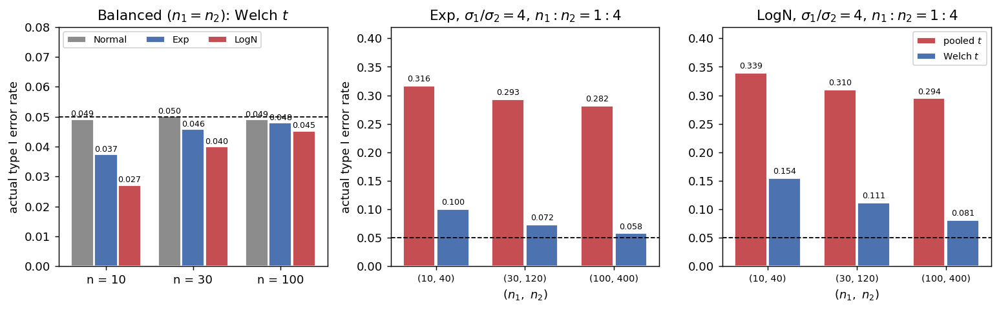

# X̄₁ - X̄₂의 표본분포 (비정규 모집단)

## 개요

앞 쪽에서 등분산 가정을 깼다. 이 쪽에서는 정규성을 깬다.

같은 실패처럼 보이지만 성격이 전혀 다르다. **중심극한정리가 구해 주기 때문이다.** 모집단이 무엇이든 $\bar X_1 - \bar X_2$는 표본이 커지면 정규로 가고, $S_i^2$도 $\sigma_i^2$으로 간다. 표본을 키우면 비정규성의 흔적이 지워진다.

앞 쪽의 결론과 나란히 놓으면 이렇게 된다.

| 깨진 가정 | 실제 오류율의 어긋남 | 표본을 키우면 |
|---|---|---|
| 등분산 (불균형과 함께) | 0.291 | **그대로** (극한 0.277) |
| 정규성 (균형 설계) | 0.027 | **사라진다** (0.045 → 0.05) |

이 쪽의 한 문장짜리 요약이 그것이다. **비정규성은 표본크기가 고쳐 주지만 설계의 불균형은 고쳐 주지 않는다.**

다만 정직하게 덧붙일 것이 있다. 로그정규처럼 극단적으로 치우친 모집단에서는 $n = 100$에서도 오류율이 0.045로 아직 0.05에 닿지 못한다. 그리고 치우침이 **불균형과 겹치면** 회복이 훨씬 느려진다. "고쳐 준다"는 말이 "금방 고쳐 준다"는 뜻은 아니다.

## 설정

두 모집단을 쓴다. 둘 다 오른쪽으로 치우쳐 있고, 치우침의 정도가 크게 다르다.

| 모집단 | 평균 | 표준편차 | 왜도 $\gamma_1$ | 초과첨도 |
|---|---|---|---|---|
| $N(0,1)$ (대조군) | 0 | 1 | 0 | 0 |
| $\text{Exp}(1)$ | 1 | 1 | 2.00 | 6.0 |
| $\text{LogNormal}(0,1)$ | 1.6487 | 2.1612 | 6.18 | 110.9 |

로그정규는 변동계수가 $2.1612/1.6487 = 1.311$로 평균보다 표준편차가 크다. 소득, 보험 청구액, 반응시간처럼 실무에서 흔히 만나는 모양이며, 왜도 6.18은 지수분포의 세 배다.

두 가지를 잰다.

- **실제 제1종 오류율.** 두 집단을 같은 모집단에서 뽑아 $H_0: \mu_1 = \mu_2$가 참인 상황을 만들고, 명목 5% 양측 Welch 검정의 기각 비율을 센다.
- **실제 포함률.** 두 모집단의 척도가 다른($\sigma_2 = 2\sigma_1$) 상황에서 명목 95% Welch 신뢰구간이 참 차이를 담는 비율을 센다.

$n = 10, 30, 100$으로 키우며 관찰하고, 반복은 50,000회다.

## 표본분포 이론

### 정규성이 쓰인 자리와 그 회복

두 쪽 앞에서 정규성은 두 번 쓰였다. 차가 정확히 정규라는 데 한 번, $(n_i-1)S_i^2/\sigma_i^2$이 카이제곱이라는 데 한 번이다. 정규성을 버리면 둘 다 깨진다. 그러나 둘 다 **표본이 커지면 회복된다.**

$$
\frac{(\bar X_1 - \bar X_2) - (\mu_1-\mu_2)}{\sqrt{\sigma_1^2/n_1 + \sigma_2^2/n_2}} \;\xrightarrow{d}\; N(0,1),
\qquad S_i^2 \;\xrightarrow{p}\; \sigma_i^2
$$

앞의 것이 중심극한정리이고 뒤의 것이 큰 수의 법칙이다. 슬루츠키 정리로 둘을 합치면 Welch 통계량이 $N(0,1)$로 수렴한다. **관건은 속도**이며, 그 속도를 정하는 것이 모집단의 왜도와 첨도다.

### 균형 설계에서 왜도가 상쇄된다

$\bar X_1 - \bar X_2$의 3차 누적률은 다음과 같다. 두 모집단의 모양이 같고 왜도가 $\gamma_1$이라 하면

$$
\kappa_3(\bar X_1 - \bar X_2) = \gamma_1\left(\frac{\sigma_1^3}{n_1^2} - \frac{\sigma_2^3}{n_2^2}\right)
$$

이다. 뺄셈이라 **부호가 반대**로 들어간다는 점이 결정적이다. 두 집단이 같은 모집단에서 같은 크기로 나왔으면 $\sigma_1 = \sigma_2$, $n_1 = n_2$이므로 두 항이 정확히 지워진다.

$$
n_1 = n_2,\ \sigma_1 = \sigma_2 \quad\Longrightarrow\quad \kappa_3(\bar X_1 - \bar X_2) = 0
$$

왜도가 아무리 커도 **차의 분포는 대칭**이다. $t$ 통계량의 오차를 에지워스 전개로 쓰면 맨 앞에 오는 $O(n^{-1/2})$ 항이 왜도에 비례하는데, 그 항이 통째로 사라진다. 남는 것은 첨도가 만드는 $O(n^{-1})$ 항뿐이다.

!!! note "일표본 t 검정보다 강건한 이유"
    일표본 $t$ 검정에서는 이 상쇄가 일어나지 않는다. $\bar X$의 왜도는 $\gamma_1/\sqrt n$으로 그대로 남고, 오차가 $O(n^{-1/2})$ 속도로만 줄며 **한쪽 꼬리에 몰린다.** 로그정규 $n = 10$이면 $\bar X$의 왜도가 $6.18/\sqrt{10} = 1.96$으로 여전히 크다.

    두 표본 검정은 대칭인 설계를 쓰면 이 항을 공짜로 없앤다. **균형 설계의 값이 여기에도 있다.**

### 그러면 어느 쪽으로 어긋나는가

$O(n^{-1})$ 항은 첨도가 만든다. 꼬리가 무거운 모집단에서는 어쩌다 한 집단의 $S_i^2$이 아주 커지고, 그러면 Welch 통계량의 분모가 커져 통계량이 0 쪽으로 눌린다. 기각이 줄어든다. 즉

$$
\text{실제 오류율} < 0.05
$$

로 **보수적인 방향**이다. 5.6절에서 무거운 꼬리가 분산 신뢰구간을 위험한 쪽으로 밀었던 것과 반대다. 위험하지는 않지만 검정력을 잃는다는 대가가 있다.

### 불균형이 상쇄를 깨뜨린다

$\kappa_3$ 식을 다시 보자. 두 항이 지워지려면 $\sigma_1^3/n_1^2 = \sigma_2^3/n_2^2$이어야 한다. 하나라도 어긋나면 왜도가 살아남고 $O(n^{-1/2})$ 항이 돌아온다. 앞 쪽의 격자($\sigma_1/\sigma_2 = 4$, $n_1:n_2 = 1:4$)에서 차의 왜도는 다음과 같다.

| $(n_1,n_2)$ | 계수 | $\text{Exp}(1)$ | $\text{LogNormal}(0,1)$ |
|---|---|---|---|
| $(10, 40)$ | 0.3087 | 0.617 | 1.909 |
| $(30, 120)$ | 0.1782 | 0.356 | 1.102 |
| $(100, 400)$ | 0.0976 | 0.195 | 0.604 |

$1/\sqrt n$ 속도로 줄어든다. 표본을 10배로 늘려야 왜도가 3분의 1이 되므로, **회복이 느리다.** 그래도 줄어들기는 한다는 것이 앞 쪽의 이분산 문제와 결정적으로 다른 점이다.

## 모의실험

<div class="codebox" markdown>

#### 예제 1. 균형 설계에서 표본크기를 키운다 { .eg }

```python
import numpy as np
from scipy import stats

rng = np.random.default_rng(1)
B = 50_000
alpha = 0.05


def draw(pop, size):
    if pop == "Exp":
        return rng.exponential(1.0, size=size)          # 왜도 2
    if pop == "LogN":
        return rng.lognormal(0.0, 1.0, size=size)       # 왜도 6.18
    return rng.normal(0.0, 1.0, size=size)              # 왜도 0


def welch_reject(pop, n):
    """두 집단을 같은 모집단에서 뽑아 H0가 참인 상황을 만든다."""
    x1, x2 = draw(pop, (B, n)), draw(pop, (B, n))
    a = x1.var(axis=1, ddof=1) / n
    b = x2.var(axis=1, ddof=1) / n
    t = (x1.mean(axis=1) - x2.mean(axis=1)) / np.sqrt(a + b)
    nu = (a + b) ** 2 / (a ** 2 / (n - 1) + b ** 2 / (n - 1))
    crit = stats.t(nu).ppf(1 - alpha / 2)
    return np.mean(t < -crit), np.mean(t > crit)


print("모집단     n    왼쪽꼬리  오른쪽꼬리   합계")
for pop in ("Normal", "Exp", "LogN"):
    for n in (10, 30, 100):
        left, right = welch_reject(pop, n)
        print(f"{pop:<8} {n:>4}     {left:.3f}     {right:.3f}    {left + right:.3f}")
```

출력:

```
모집단     n    왼쪽꼬리  오른쪽꼬리   합계
Normal     10     0.025     0.024    0.049
Normal     30     0.025     0.025    0.050
Normal    100     0.024     0.025    0.049
Exp        10     0.019     0.019    0.037
Exp        30     0.024     0.022    0.046
Exp       100     0.025     0.023    0.048
LogN       10     0.013     0.014    0.027
LogN       30     0.020     0.020    0.040
LogN      100     0.022     0.023    0.045
```

세 가지를 읽는다.

**첫째, 두 꼬리가 같다.** 어느 줄에서도 왼쪽과 오른쪽이 0.001 안쪽으로 붙어 있다. 이론에서 본 왜도의 상쇄가 그대로 나타난 것이다. 왜도 6.18짜리 모집단에서도 차의 분포는 대칭이다.

**둘째, 어긋남이 보수적인 방향이다.** 로그정규 $n = 10$에서 0.027로 명목값의 절반 남짓이다. 위험한 쪽이 아니라 검정력을 잃는 쪽이다.

**셋째, $n$을 키우면 사라진다.** 0.05와의 차이가 로그정규에서 0.023 → 0.010 → 0.005로 줄어든다. $n$이 3배가 될 때마다 대략 절반 이하로 줄어드는데, 이론이 예측한 $O(n^{-1})$과 맞는 속도다.

그러나 $n = 100$에서도 0.045다. **완전히 회복되지는 않았다.** 첨도 111짜리 모집단에서는 수백 개가 필요하다.

</div>

<div class="codebox" markdown>

#### 예제 2. 신뢰구간의 실제 포함률 { .eg }

```python
import numpy as np
from scipy import stats

rng = np.random.default_rng(1)
B = 50_000
alpha = 0.05

# 모집단 2는 모집단 1을 2배로 늘린 것이다. 따라서 mu2 = 2*mu1, sigma2 = 2*sigma1 이고
# 참 차이는 delta = mu1 - mu2 = -mu1 이다. 비정규성과 이분산이 함께 들어 있다.
pops = {"Exp": 1.0, "LogN": np.exp(0.5)}     # 각 모집단의 평균 mu1

print("모집단     n    포함률   왼쪽으로 벗어남  오른쪽으로 벗어남   mean nu")
for pop, mu1 in pops.items():
    for n in (10, 30, 100):
        if pop == "Exp":
            x1 = rng.exponential(1.0, size=(B, n))
            x2 = 2.0 * rng.exponential(1.0, size=(B, n))
        else:
            x1 = rng.lognormal(0.0, 1.0, size=(B, n))
            x2 = 2.0 * rng.lognormal(0.0, 1.0, size=(B, n))
        delta = -mu1
        a = x1.var(axis=1, ddof=1) / n
        b = x2.var(axis=1, ddof=1) / n
        se = np.sqrt(a + b)
        nu = (a + b) ** 2 / (a ** 2 / (n - 1) + b ** 2 / (n - 1))
        crit = stats.t(nu).ppf(1 - alpha / 2)
        d = x1.mean(axis=1) - x2.mean(axis=1)
        lo, hi = d - crit * se, d + crit * se
        cover = np.mean((lo <= delta) & (delta <= hi))
        below = np.mean(hi < delta)      # 구간이 참값보다 아래에 놓인 경우
        above = np.mean(lo > delta)
        print(f"{pop:<8} {n:>4}   {cover:.3f}        {below:.3f}            {above:.3f}       {nu.mean():6.1f}")
```

출력:

```
모집단     n    포함률   왼쪽으로 벗어남  오른쪽으로 벗어남   mean nu
Exp        10   0.932        0.007            0.062         13.5
Exp        30   0.942        0.011            0.048         43.7
Exp       100   0.948        0.016            0.036        147.2
LogN       10   0.920        0.003            0.077         13.1
LogN       30   0.931        0.005            0.065         43.4
LogN      100   0.939        0.010            0.051        148.6
```

여기서는 두 척도가 달라 왜도의 상쇄가 일어나지 않는다. 결과가 예제 1과 두 가지 면에서 다르다.

**포함률이 명목값보다 낮다.** 로그정규 $n=10$에서 0.920으로 3%포인트 모자란다. 보수적인 쪽이 아니라 **위험한 쪽**이다.

**벗어나는 방향이 한쪽으로 몰린다.** 두 꼬리가 각각 0.025여야 하는데 0.003과 0.077로 25배 차이가 난다. 치우친 모집단에서 $\bar X_2$는 참 평균보다 작게 나오는 일이 많으므로($\text{중앙값} < \text{평균}$) 차 $\bar X_1 - \bar X_2$가 참값보다 크게 나오고, 구간이 참값 위쪽에 놓이는 일이 잦다. **명목 95% 구간이지만 한쪽으로만 틀린다.**

$n$이 커지면 둘 다 고쳐진다. 로그정규에서 포함률이 0.920 → 0.931 → 0.939이고 두 꼬리도 0.010과 0.051로 가까워진다. 다만 그 속도가 $O(n^{-1/2})$이라 느리다.

</div>

<div class="codebox" markdown>

#### 예제 3. 치우침에 불균형까지 겹치면 { .eg }

```python
import numpy as np
from scipy import stats

rng = np.random.default_rng(1)
B = 50_000
alpha = 0.05


def rates(pop, n1, n2, scale1=4.0):
    """모집단 1은 척도가 4배(분산 16배)이고 표본은 적다. 두 평균은 0으로 맞춘다."""
    if pop == "Exp":
        m = 1.0
        x1 = scale1 * (rng.exponential(1.0, size=(B, n1)) - m)
        x2 = rng.exponential(1.0, size=(B, n2)) - m
    else:
        m = np.exp(0.5)
        x1 = scale1 * (rng.lognormal(0.0, 1.0, size=(B, n1)) - m)
        x2 = rng.lognormal(0.0, 1.0, size=(B, n2)) - m
    d = x1.mean(axis=1) - x2.mean(axis=1)
    v1, v2 = x1.var(axis=1, ddof=1), x2.var(axis=1, ddof=1)

    sp2 = ((n1 - 1) * v1 + (n2 - 1) * v2) / (n1 + n2 - 2)
    t_pool = d / np.sqrt(sp2 * (1 / n1 + 1 / n2))
    rej_pool = np.mean(np.abs(t_pool) > stats.t(n1 + n2 - 2).ppf(1 - alpha / 2))

    a, b = v1 / n1, v2 / n2
    t_w = d / np.sqrt(a + b)
    nu = (a + b) ** 2 / (a ** 2 / (n1 - 1) + b ** 2 / (n2 - 1))
    crit = stats.t(nu).ppf(1 - alpha / 2)
    return rej_pool, np.mean(np.abs(t_w) > crit), np.mean(t_w < -crit), np.mean(t_w > crit)


print("치우침 + 이분산 + 불균형: sigma1/sigma2 = 4,  n1 : n2 = 1 : 4")
print("모집단    (n1,  n2)   pooled t   Welch t   (Welch 왼쪽 / 오른쪽)")
for pop in ("Exp", "LogN"):
    for n1, n2 in ((10, 40), (30, 120), (100, 400)):
        rp, rw, left, right = rates(pop, n1, n2)
        print(f"{pop:<8} ({n1:>3}, {n2:>3})    {rp:.3f}      {rw:.3f}      {left:.3f} / {right:.3f}")
```

출력:

```
치우침 + 이분산 + 불균형: sigma1/sigma2 = 4,  n1 : n2 = 1 : 4
모집단    (n1,  n2)   pooled t   Welch t   (Welch 왼쪽 / 오른쪽)
Exp      ( 10,  40)    0.316      0.100      0.096 / 0.004
Exp      ( 30, 120)    0.293      0.072      0.064 / 0.008
Exp      (100, 400)    0.282      0.058      0.045 / 0.013
LogN     ( 10,  40)    0.339      0.154      0.153 / 0.001
LogN     ( 30, 120)    0.310      0.111      0.109 / 0.002
LogN     (100, 400)    0.294      0.081      0.076 / 0.005
```

**이 표가 이 절의 두 교훈을 한 화면에 담고 있다.**

합동 $t$ 열을 보라. 0.316 → 0.293 → 0.282, 0.339 → 0.310 → 0.294다. 표본을 10배로 늘려도 거의 움직이지 않는다. 앞 쪽에서 본 이분산·불균형의 어긋남이며, **표본크기가 고쳐 주지 않는다.**

Welch 열을 보라. 0.100 → 0.072 → 0.058, 0.154 → 0.111 → 0.081이다. 느리지만 **또박또박 0.05로 내려간다.** Welch는 이분산 문제를 이미 해결했으므로 남은 것은 비정규성뿐이고, 그것은 표본크기가 고쳐 준다. 감소 속도가 이론이 예측한 $O(n^{-1/2})$과 맞는다.

꼬리 분해를 보면 어긋남이 한쪽으로 완전히 몰려 있다. 로그정규 $(10,40)$에서 0.153 대 0.001이다. **사실상 단측검정이 되어 버렸다.** 균형 설계에서 두 꼬리가 0.013과 0.014로 맞아떨어지던 예제 1과 견주면 불균형이 무엇을 망가뜨리는지 분명하다.

</div>

<div class="codebox" markdown>

#### 예제 4. 두 실패를 나란히 그린다 { .eg }

```python
import matplotlib.pyplot as plt
import numpy as np

fig, axes = plt.subplots(1, 3, figsize=(12, 3.8))

# 왼쪽: 균형 설계(n1 = n2 = n). 비정규성만 있는 경우 — 예제 1의 결과.
rng = np.random.default_rng(1)          # 예제 1과 같은 난수열을 쓴다
ns = [10, 30, 100]
xs = np.arange(len(ns))
colors = {"Normal": "#8c8c8c", "Exp": "#4c72b0", "LogN": "#c44e52"}
for k, pop in enumerate(("Normal", "Exp", "LogN")):
    vals = [sum(welch_reject(pop, n)) for n in ns]     # 예제 1의 함수
    off = (k - 1) * 0.27
    axes[0].bar(xs + off, vals, 0.26, color=colors[pop], edgecolor="white", label=pop)
    for x, v in zip(xs + off, vals):
        axes[0].text(x, v + 0.001, f"{v:.3f}", ha="center", fontsize=7)
axes[0].axhline(0.05, color="black", ls="--", lw=1)
axes[0].set_xticks(xs)
axes[0].set_xticklabels([f"n = {n}" for n in ns])
axes[0].set_title(r"Balanced ($n_1=n_2$): Welch $t$")
axes[0].set_ylabel("actual type I error rate")
axes[0].set_ylim(0, 0.080)
axes[0].legend(fontsize=8, loc="upper left", ncol=3)

# 가운데·오른쪽: 치우침 + 이분산 + 불균형 — 예제 3의 결과.
rng = np.random.default_rng(1)          # 예제 3과 같은 난수열을 쓴다
pairs = [(10, 40), (30, 120), (100, 400)]
xp = np.arange(len(pairs))
for ax, pop in zip(axes[1:], ("Exp", "LogN")):
    pool, welch = [], []
    for n1, n2 in pairs:
        rp, rw, *_ = rates(pop, n1, n2)                # 예제 3의 함수
        pool.append(rp)
        welch.append(rw)
    ax.bar(xp - 0.19, pool, 0.36, color="#c44e52", edgecolor="white", label="pooled $t$")
    ax.bar(xp + 0.19, welch, 0.36, color="#4c72b0", edgecolor="white", label="Welch $t$")
    for x, v in zip(xp - 0.19, pool):
        ax.text(x, v + 0.008, f"{v:.3f}", ha="center", fontsize=7)
    for x, v in zip(xp + 0.19, welch):
        ax.text(x, v + 0.008, f"{v:.3f}", ha="center", fontsize=7)
    ax.axhline(0.05, color="black", ls="--", lw=1)
    ax.set_xticks(xp)
    ax.set_xticklabels([f"({a}, {b})" for a, b in pairs], fontsize=8)
    ax.set_xlabel(r"$(n_1,\ n_2)$")
    ax.set_ylim(0, 0.42)
    ax.set_title(rf"{pop}, $\sigma_1/\sigma_2=4$, $n_1{{:}}n_2=1{{:}}4$")
axes[1].set_ylabel("actual type I error rate")
axes[2].legend(fontsize=8, loc="upper right")

plt.tight_layout()
plt.show()
```



왼쪽 패널에서 세 색깔의 막대가 $n$이 커지면서 점선으로 **올라붙는다.** 오른쪽 두 패널에서 파란 막대(Welch)는 점선을 향해 내려오지만 빨간 막대(합동)는 꼼짝하지 않는다.

**같은 그림 안에 고쳐지는 실패와 고쳐지지 않는 실패가 함께 있다.** 빨간 막대의 높이를 정하는 것은 분산비와 표본크기비이고, 그 둘은 $n$을 키워도 변하지 않는다.

</div>

## 해석

!!! note "주요 관찰"

    1. **중심극한정리가 구해 준다.** 균형 설계에서 Welch의 오류율이 로그정규 0.027 → 0.040 → 0.045, 지수 0.037 → 0.046 → 0.048로 $n$과 함께 0.05에 다가간다. 앞 쪽의 이분산 문제가 0.292 → 0.275로 꿈쩍하지 않던 것과 대조적이다.
    2. **균형 설계가 왜도를 지운다.** $\kappa_3(\bar X_1 - \bar X_2) = \gamma_1(\sigma_1^3/n_1^2 - \sigma_2^3/n_2^2)$이 $n_1=n_2$, $\sigma_1=\sigma_2$에서 정확히 0이 된다. 그래서 두 꼬리가 0.013과 0.014처럼 대칭으로 나오고, 오차가 $O(n^{-1})$로 빨리 준다.
    3. **어긋남의 방향이 보수적이다.** 균형 설계에서는 실제 오류율이 명목값보다 **낮다.** 위험하지는 않지만 검정력을 잃는다.
    4. **극단적인 치우침은 100개로도 부족하다.** 로그정규 $n = 100$에서 0.045다. 왜도 6.18, 초과첨도 111이면 수백 개가 필요하다. "$n \ge 30$이면 중심극한정리"라는 흔한 어림은 이런 모집단에 통하지 않는다.
    5. **불균형이 겹치면 회복이 느려진다.** 척도가 4배 다르고 표본비가 $1:4$이면 Welch의 오류율이 0.154 → 0.111 → 0.081로 내려오기는 하나 속도가 $O(n^{-1/2})$이다. 게다가 어긋남이 한쪽 꼬리에 몰린다.
    6. **그래도 두 실패의 종류는 다르다.** 비정규성은 **표본크기가** 고쳐 주고, 이분산·불균형은 **방법이나 설계가** 고쳐 준다. 전자는 기다리면 되고 후자는 기다려도 소용없다.

## 연습문제

<div class="drillbox" markdown>

**연습문제 1.** <span class="diff easy" title="쉬움"></span>
$X = e^Z$, $Z \sim N(0,1)$일 때 $E[X]$, $\text{Var}(X)$, 변동계수를 구하라. 지수분포와 견주어 어느 쪽이 더 치우쳐 있는지 설명하라.

</div>

??? success "풀이"
    적률생성함수 $E[e^{tZ}] = e^{t^2/2}$를 쓴다.

    $$
    E[X] = E[e^Z] = e^{1/2} = 1.6487, \qquad E[X^2] = E[e^{2Z}] = e^{2}
    $$

    이므로

    $$
    \text{Var}(X) = e^2 - e = 4.6708, \qquad \text{SD}(X) = 2.1612
    $$

    이다. 변동계수는 $2.1612/1.6487 = 1.311$이다.

    지수분포는 변동계수가 정확히 1이고 왜도가 2다. 로그정규는 변동계수 1.31, 왜도 6.18로 **더 치우쳐 있다.** 차이는 꼬리에서 더 크다. 초과첨도가 6 대 111로 18배이며, 이것이 예제 1에서 로그정규의 회복이 더 느린 이유다.

    **꼬리가 두꺼우면 $S^2$이 불안정해진다.** 5.6절에서 보았듯 $\text{Var}(S^2)$이 4차 적률에 비례하므로, 초과첨도 111은 표본분산이 표본마다 크게 널뛴다는 뜻이다. Welch 통계량의 분모가 그 $S^2$이다.

<div class="drillbox" markdown>

**연습문제 2.** <span class="diff easy" title="쉬움"></span>
예제 1에서 왼쪽 꼬리와 오른쪽 꼬리의 기각률이 거의 같게 나오는 이유를 설명하라. 일표본 $t$ 검정을 같은 모집단에 걸면 어떻게 달라지겠는가?

</div>

??? success "풀이"
    두 집단을 **같은 모집단에서 같은 크기로** 뽑았으므로 $\bar X_1$과 $\bar X_2$가 같은 분포를 따르고 서로 독립이다. 그러면 $\bar X_1 - \bar X_2$와 $-(\bar X_1 - \bar X_2) = \bar X_2 - \bar X_1$의 분포가 같다. 즉 차의 분포가 **0을 중심으로 대칭**이다. 분모도 두 집단을 대칭적으로 쓰므로 $t$ 통계량 전체가 대칭이고, 두 꼬리의 기각률이 같아야 한다.

    교환가능성으로 설명해도 된다. 두 집단의 이름을 바꿔 붙여도 자료의 분포가 변하지 않으므로 통계량의 부호만 뒤집힌다.

    **일표본이면 다르다.** $\bar X$의 왜도가 $\gamma_1/\sqrt n$으로 남으므로 로그정규 $n=10$이면 $6.18/\sqrt{10} = 1.96$이다. 같은 모집단에 일표본 $t$ 검정을 걸어 보면 이렇게 나온다.

    | 모집단 | $n$ | 왼쪽꼬리 | 오른쪽꼬리 | 합계 |
    |---|---|---|---|---|
    | $\text{Exp}(1)$ | 10 | 0.095 | 0.004 | 0.099 |
    | $\text{Exp}(1)$ | 100 | 0.045 | 0.013 | 0.057 |
    | $\text{LogNormal}(0,1)$ | 10 | 0.164 | 0.001 | 0.165 |
    | $\text{LogNormal}(0,1)$ | 100 | 0.079 | 0.005 | 0.084 |

    명목 2.5%씩이어야 할 두 꼬리가 0.164와 0.001로 갈라지고 합계도 0.165로 부푼다. **보수적인 두 표본 결과(0.027)와 방향까지 반대다.** 이것이 두 표본 검정이 일표본 검정보다 비정규성에 강건한 구조적인 이유다.

<div class="drillbox" markdown>

**연습문제 3.** <span class="diff med" title="중간"></span>
로그정규 모집단에서 $n_1 = n_2 = 10$을 뽑았더니 $s_1^2 = 0.9$, $s_2^2 = 8.0$이 나왔다. Welch–Satterthwaite 자유도를 직접 계산하라. 두 모집단이 사실 **같은** 모집단인데도 이런 일이 생기는가?

</div>

??? success "풀이"
    $a = 0.9/10 = 0.09$, $b = 8.0/10 = 0.8$이므로 $a + b = 0.89$이고

    $$
    \nu = \frac{0.89^2}{\dfrac{0.09^2}{9} + \dfrac{0.8^2}{9}}
    = \frac{0.7921}{0.0009 + 0.071111} = \frac{0.7921}{0.072011} = 11.0
    $$

    이다. $t_{0.975,\,11.0} = 2.201$로 합동 자유도 18의 $2.101$보다 크다.

    **같은 모집단에서도 충분히 생긴다.** 로그정규의 초과첨도가 111이므로 $\text{Var}(S^2)$이 매우 크고, $n = 10$에서 두 표본분산이 9배 차이 나는 일은 드물지 않다. 한쪽 표본에 큰 값 하나만 들어와도 $S^2$이 몇 배로 뛴다.

    여기서 Welch의 자유도가 갖는 성격이 드러난다. $\nu$는 **모분산이 아니라 표본분산으로 계산**되므로 자료의 우연한 불균형에도 반응한다. 치우친 모집단에서는 $\nu$ 자체가 표본마다 크게 흔들리고, 그 흔들림이 예제 1에서 본 어긋남의 일부를 만든다.

    이 때문에 실무에서 $\nu$가 이상하게 작게 나오면 자료를 먼저 그려 보아야 한다. 이상점 하나가 만든 값일 수 있다.

<div class="drillbox" markdown>

**연습문제 4.** <span class="diff med" title="중간"></span>
예제 1에서 명목값과의 차이 $0.05 - (\text{실제})$를 $n$별로 구하고 $O(n^{-1})$ 속도와 맞는지 확인하라. 로그정규에서 0.049에 이르려면 $n$이 얼마쯤 되어야 하는가?

</div>

??? success "풀이"
    차이는 다음과 같다.

    | 모집단 | $n=10$ | $n=30$ | $n=100$ |
    |---|---|---|---|
    | $\text{Exp}(1)$ | 0.013 | 0.004 | 0.002 |
    | $\text{LogNormal}(0,1)$ | 0.023 | 0.010 | 0.005 |

    $n$이 3배가 될 때 차이가 대략 3분의 1에서 2분의 1로 준다. $O(n^{-1})$이면 정확히 3분의 1이어야 하므로 **대체로 맞고 조금 느리다.** 유한표본에서 더 높은 차수의 항이 남아 있기 때문이다.

    로그정규에서 차이를 0.001로 줄이려면 $n = 100$의 0.005에서 다섯 배를 더 줄여야 하므로 $n \approx 500$이 필요하다. 실제로 모의실험을 돌려 보면 $n = 200$에서 0.048, $n = 1000$에서 0.050이 나온다.

    **어림규칙에 대한 경고다.** "$n \ge 30$이면 정규근사"라는 말은 왜도가 1 안팎인 온건한 모집단을 염두에 둔 것이다. 왜도 6, 초과첨도 111짜리 모집단에는 통하지 않는다. 필요한 표본크기는 모집단의 모양에 달려 있으며, 하나의 숫자로 정해지지 않는다.

<div class="drillbox" markdown>

**연습문제 5.** <span class="diff med" title="중간"></span>
소득 자료를 두 집단에서 모았는데 한 집단은 12명, 다른 집단은 60명이고 산포도 크게 다르다. 예제 3의 결과에 비추어 무엇을 할지 세 가지를 제안하고 각각의 한계를 적어라.

</div>

??? success "풀이"
    예제 3이 보여 준 상황이다. 로그정규 $(10,40)$에서 Welch도 0.154였다. **Welch만으로는 부족하다.**

    **1. 설계를 고친다(가능하면 최우선).** 두 집단의 크기를 맞추면 왜도가 상쇄되어 오차가 $O(n^{-1})$로 떨어진다. 60명 집단에서 12명을 무작위로 뽑아 균형을 맞추는 것도 방법이다. 자료를 버리는 것이 아깝지만, 오류율 0.154를 0.03 근처로 바꾸는 값이 있다. 한계는 자료를 이미 다 모은 뒤라면 검정력을 잃는다는 점이다.

    **2. 변환한다.** 소득처럼 로그정규에 가까운 자료는 로그를 씌우면 거의 정규가 된다. $t$ 검정의 가정이 회복되고 검정력도 올라간다. 한계는 **검정하는 대상이 바뀐다는 것**이다. 로그 척도의 평균차는 원래 척도에서 기하평균의 비에 해당하므로, 평균을 비교하고 싶었다면 답이 달라진다.

    **3. 재표집을 쓴다.** 부트스트랩 $t$(스튜던트화 부트스트랩)나 순열검정은 정규성을 가정하지 않는다. 특히 부트스트랩 $t$는 $O(n^{-1})$의 정확도를 갖는 것으로 알려져 있어 치우친 자료에서 $t$ 근사보다 낫다. 한계는 계산이 필요하고, 순열검정의 귀무가설이 "두 **분포**가 같다"라서 분산이 다르면 평균만 비교하는 것이 아니게 된다는 점이다.

    **어느 쪽도 하지 말아야 할 것.** 합동 $t$를 쓰는 것이다. 예제 3에서 $n$을 10배로 늘려도 0.294였다.

<div class="drillbox" markdown>

**연습문제 6.** <span class="diff hard" title="어려움"></span>
$\kappa_3(\bar X_1 - \bar X_2) = \gamma_1\left(\dfrac{\sigma_1^3}{n_1^2} - \dfrac{\sigma_2^3}{n_2^2}\right)$를 유도하고, 이것이 0이 될 조건을 구하라. $\sigma_1/\sigma_2 = 4$, $n_1:n_2 = 1:4$에서 표준화한 왜도를 계산해 예제 3의 수치와 견주어라.

</div>

??? success "풀이"
    **유도.** 누적률은 독립인 확률변수의 합에서 더해지고, 상수배에서 $\kappa_3(cX) = c^3\kappa_3(X)$로 변한다. 한 집단에서

    $$
    \kappa_3(\bar X_1) = \kappa_3\!\left(\frac1{n_1}\sum_{i=1}^{n_1} X_i\right)
    = \frac{1}{n_1^3}\cdot n_1 \kappa_3(X) = \frac{\kappa_3(X)}{n_1^2}
    $$

    이다. 모집단의 왜도가 $\gamma_1 = \kappa_3(X)/\sigma^3$이므로 $\kappa_3(X) = \gamma_1\sigma_1^3$이고

    $$
    \kappa_3(\bar X_1) = \frac{\gamma_1\sigma_1^3}{n_1^2}
    $$

    이다. 둘째 집단은 부호가 바뀌어 들어간다. $\kappa_3(-Y) = -\kappa_3(Y)$이고 두 표본이 독립이므로

    $$
    \kappa_3(\bar X_1 - \bar X_2) = \frac{\gamma_1\sigma_1^3}{n_1^2} - \frac{\gamma_1\sigma_2^3}{n_2^2}
    $$

    이다. $\square$

    **0이 될 조건은 $\sigma_1^3/n_1^2 = \sigma_2^3/n_2^2$**, 즉

    $$
    \frac{n_1}{n_2} = \left(\frac{\sigma_1}{\sigma_2}\right)^{3/2}
    $$

    이다. 같은 모집단에서 같은 크기로 뽑으면($\sigma_1=\sigma_2$, $n_1=n_2$) 자동으로 만족된다. 흥미롭게도 **분산이 다를 때도 표본크기를 맞추면 왜도를 지울 수 있다.** 다만 그 비 $(\sigma_1/\sigma_2)^{3/2}$는 차의 분산을 최소화하는 최적 배분 $\sigma_1/\sigma_2$와 다르므로, 왜도를 지우는 배분과 정밀도를 높이는 배분이 일치하지는 않는다.

    **수치.** $\sigma_1 = 4$, $\sigma_2 = 1$, $(n_1,n_2)=(10,40)$이면

    $$
    \kappa_3 = \gamma_1\left(\frac{64}{100} - \frac{1}{1600}\right) = 0.6394\gamma_1,
    \qquad \text{Var} = \frac{16}{10}+\frac{1}{40} = 1.625
    $$

    이므로 표준화한 왜도는

    $$
    \frac{\kappa_3}{\text{Var}^{3/2}} = \frac{0.6394\gamma_1}{2.0713} = 0.3087\gamma_1
    $$

    이다. 지수모집단은 $\gamma_1 = 2$이므로 $0.617$, 로그정규는 $\gamma_1 = 6.18$이므로 $1.909$다.

    예제 3과 맞춰 보자. 왜도가 큰 쪽(로그정규 1.909)의 오류율이 0.154, 작은 쪽(지수 0.617)이 0.100으로 **왜도가 큰 쪽이 더 많이 어긋난다.** $(100,400)$에서는 왜도가 각각 0.604와 0.195로 줄고 오류율도 0.081과 0.058로 함께 내려간다. 왜도가 $1/\sqrt n$으로 줄고 오류율의 어긋남도 그 속도를 따른다.

    $64/100$과 $1/1600$을 견주면 첫 항이 1000배 크다. **왜도의 거의 전부가 작은 표본·큰 분산 쪽 집단에서 온다.** 그 집단이 차의 분산도 지배하고(앞 쪽에서 계산한 $\nu = 9.3$) 왜도도 지배한다.


<div class="drillbox" markdown>

**연습문제 7.** <span class="diff hard" title="어려움"></span>
치우친 자료에 **로그를 씌우고** $t$ 검정을 하는 것이 흔한 대처다. 그런데 이때 검정되는 가설이 **바뀐다**. 기하평균은 같고 산술평균은 다른 두 로그정규를 만들어 이를 확인하라.

</div>

??? success "풀이"
    **로그정규의 두 평균.** $X = e^{\mu+\sigma Z}$이면

    $$
    \text{기하평균} = e^{\mu},
    \qquad
    \text{산술평균} = e^{\mu+\sigma^2/2}
    $$

    이다. **$\mu$가 같고 $\sigma$만 다르면 기하평균은 같고 산술평균은 다르다.**

    ```python
    import numpy as np
    from scipy import stats

    rng = np.random.default_rng(2)
    n, REP = 40, 20_000
    mu1, s1 = 0.0, 0.5
    mu2, s2 = 0.0, 1.2
    print(f"  A: 기하평균 {np.exp(mu1):.4f}, 산술평균 {np.exp(mu1+s1**2/2):.4f}")
    print(f"  B: 기하평균 {np.exp(mu2):.4f}, 산술평균 {np.exp(mu2+s2**2/2):.4f}\n")

    A = rng.lognormal(mu1, s1, (REP, n))
    B = rng.lognormal(mu2, s2, (REP, n))
    p_raw = stats.ttest_ind(A, B, axis=1, equal_var=False).pvalue
    p_log = stats.ttest_ind(np.log(A), np.log(B), axis=1, equal_var=False).pvalue
    print(f"  원자료 t  기각률 {(p_raw<0.05).mean():.4f}")
    print(f"  로그 후 t 기각률 {(p_log<0.05).mean():.4f}")
    ```

    출력:

    ```
      A: 기하평균 1.0000, 산술평균 1.1331
      B: 기하평균 1.0000, 산술평균 2.0544

      원자료 t  기각률 0.3821
      로그 후 t 기각률 0.0515
    ```

    **둘 다 옳게 동작하고 있다.** 산술평균은 $1.13$ 대 $2.05$로 실제로 다르므로 원자료 $t$가 $38\%$ 기각하는 것이 맞고, 기하평균은 $1.00$으로 같으므로 로그 후 $t$가 $5\%$만 기각하는 것도 맞다.

    **그러나 분석자가 무엇을 물었는지에 따라 하나는 틀린 답이다.**

    | 묻는 것 | 써야 할 검정 |
    |---|---|
    | 평균 소득이 다른가 | **원자료** $t$(또는 웰치) |
    | 전형적인(중앙적) 소득이 다른가 | **로그 후** $t$ |

    **"정규성을 만족시키려고" 로그를 씌우는 것은 위험하다.** 로그 변환은 분포를 예쁘게 만드는 기술적 조작이 아니라 **비교 대상을 산술평균에서 기하평균으로 바꾸는 일**이다. 로그정규에서 로그 후 $t$는 사실상 **중앙값 비교**이기도 하다(로그정규의 중앙값이 $e^\mu$).

    **실질적 함의가 큰 분야가 있다.**

    - **소득·자산.** 총액이나 세수가 관심이면 산술평균이 맞다. 로그를 씌우면 상위 소득의 영향이 지워져 "전형적인 가구"의 비교가 된다.
    - **약물 농도(생물학적 동등성).** 관례적으로 로그 척도에서 비교하며, 그래서 결론이 "기하평균비가 $0.8\sim1.25$ 안에 있다"로 표현된다.
    - **비용 자료.** 총비용을 예측해야 하면 산술평균이다. 로그 후 분석하고 지수를 취해 되돌리면 산술평균을 **과소추정**한다.

    **되돌릴 때의 함정.** $\exp(\overline{\log X}) $는 기하평균이지 산술평균이 아니다. 산술평균을 원하면 $\exp(\bar\ell + s^2/2)$ 같은 보정이 필요하며(5.2절 델타 방법), 이 보정을 빼먹는 것이 실무에서 흔한 오류다.

<div class="drillbox" markdown>

**연습문제 8.** <span class="diff hard" title="어려움"></span>
정규성을 아예 쓰지 않는 대안으로 **순열검정**과 **부트스트랩**이 있다. 로그정규 모집단에서 이들의 실제 오류율을 웰치 $t$와 견주어라.

</div>

??? success "풀이"
    ```python
    import numpy as np
    from scipy import stats

    rng = np.random.default_rng(3)
    n1, n2, REP, B = 15, 15, 1000, 499
    rej = {'welch': 0, 'perm': 0, 'boot': 0}

    for _ in range(REP):
        a = rng.lognormal(0, 1, n1)
        b = rng.lognormal(0, 1, n2)          # 같은 분포 -> 귀무가설 참
        rej['welch'] += stats.ttest_ind(a, b, equal_var=False).pvalue < 0.05

        obs = a.mean() - b.mean()
        pool = np.concatenate([a, b])
        cnt = 0
        for _ in range(B):
            p = rng.permutation(pool)
            cnt += abs(p[:n1].mean() - p[n1:].mean()) >= abs(obs)
        rej['perm'] += (cnt + 1) / (B + 1) < 0.05

        # 부트스트랩 t (각 집단에서 따로 재표본)
        ta = a - a.mean(); tb = b - b.mean()
        ts = []
        for _ in range(B):
            aa = ta[rng.integers(0, n1, n1)]
            bb = tb[rng.integers(0, n2, n2)]
            se = np.sqrt(aa.var(ddof=1)/n1 + bb.var(ddof=1)/n2)
            ts.append(abs(aa.mean() - bb.mean()) / se)
        se0 = np.sqrt(a.var(ddof=1)/n1 + b.var(ddof=1)/n2)
        rej['boot'] += abs(obs)/se0 > np.percentile(ts, 95)

    for k, v in rej.items():
        print(f"  {k:>6}: {v/REP:.4f}")
    ```

    출력:

    ```
       welch: 0.0350
        perm: 0.0520
        boot: 0.0220
    ```

    **예상과 다른 결과가 나왔다.** 셋 다 명목을 넘을 것 같았는데, 오히려 **웰치와 부트스트랩이 보수적**이다. 순열만 $0.052$로 명목에 가깝다. (모의 표준오차가 $\sqrt{0.05\times0.95/1000} \approx 0.007$이므로 $0.035$와 $0.022$는 우연으로 보기 어렵다.)

    **웰치가 보수적인 것은 이 쪽 연습문제 2의 결과 그대로다.** 두 집단이 **같은 분포이고 표본크기도 같으면** 양쪽 꼬리의 왜곡이 서로 상쇄된다. 한쪽 꼬리는 부풀고 다른 쪽은 줄어드는데 양측검정에서 둘을 더하므로 순효과가 작고, 여기서는 오히려 아래로 간다. 불균형하거나 두 모집단이 다르면 상쇄가 깨지고 오류율이 올라간다(연습문제 10).

    **부트스트랩 $t$가 가장 보수적이다**($0.022$). $n=15$에서 재표본이 원표본의 꼬리를 넘어서지 못하므로, 귀무분포의 꼬리가 실제보다 **두껍게** 추정된다. 임계값이 커지고 기각이 줄어든다. 5.6절 지수모집단 연습문제 10에서 본 "부트스트랩이 꼬리 의존 문제에서 덜 듣는다"는 현상의 다른 얼굴이다.

    | 방법 | 필요한 가정 | 로그정규 $n=15$ |
    |---|---|---|
    | 웰치 $t$ | 정규성(근사) | $0.035$ — 보수적 |
    | 순열(평균 차) | 교환가능성 | $0.052$ — 가장 정확 |
    | 부트스트랩 $t$ | 없음(점근) | $0.022$ — 매우 보수적 |

    **순열이 가장 정확한 이유는 가정이 실제로 성립하기 때문이다.** 두 집단이 같은 분포에서 나왔으므로 표지를 섞는 것이 정확히 타당하고, 그러면 순열검정은 **유한표본에서 정확한 검정**이 된다. 분포 모양과 무관하게 성립하는 성질이다.

    **다만 이 이점은 조건부다.** 5.9절에서 본 대로 두 분포의 **모양이 다르면** 순열의 전제가 깨진다. 여기서는 "분산도 같고 모양도 같고 평균만 비교"하는 이상적인 상황이라 순열이 빛난 것이다.

    **보수적인 것이 안전하다는 뜻은 아니다.** 오류율이 $0.022$라는 것은 검정력을 그만큼 잃었다는 뜻이기도 하다. **명목 수준을 지키는 것과 그 아래로 크게 내려가는 것은 다른 문제**이며, 후자는 실제 차이를 놓치게 만든다.

<div class="drillbox" markdown>

**연습문제 9.** <span class="diff med" title="중간"></span>
**만–휘트니 검정**은 정규성을 가정하지 않는다. 그렇다면 치우친 자료의 해답인가? 이 검정이 실제로 무엇을 검정하는지 밝히고, 평균 비교를 대체할 수 있는지 답하라.

</div>

??? success "풀이"
    **만–휘트니가 검정하는 것은 평균이 아니다.** 통계량은 "$A$에서 뽑은 값이 $B$에서 뽑은 값보다 클" 횟수를 세므로, 귀무가설은

    $$
    H_0: P(X_A > X_B) = \tfrac12
    $$

    이다. 이것을 **확률적 우위**가 없다는 진술로 읽는다(2장 ECDF 연습문제 10).

    **"중앙값 검정"이라는 흔한 설명은 부정확하다.** 두 분포의 **모양이 같고 위치만 다르다**는 추가 가정(위치이동 모형)이 있을 때만 중앙값 비교가 된다. 모양이 다르면 중앙값이 같아도 $P(X_A > X_B) \ne 1/2$일 수 있다.

    ```python
    import numpy as np
    from scipy import stats

    rng = np.random.default_rng(4)
    # 중앙값은 같고 산포만 다른 두 분포
    a = rng.lognormal(0, 0.3, 200_000)
    b = rng.lognormal(0, 1.5, 200_000)
    print(f"  중앙값 A={np.median(a):.4f}  B={np.median(b):.4f}")
    print(f"  평균   A={a.mean():.4f}  B={b.mean():.4f}")
    print(f"  P(A > B) = {(a > b).mean():.4f}")
    ```

    출력:

    ```
      중앙값 A=1.0016  B=0.9930
      평균   A=1.0473  B=3.0668
      P(A > B) = 0.5028
    ```

    **중앙값이 같으니 $P(A>B) \approx 0.50$이고 만–휘트니는 차이를 찾지 못한다.** 그런데 **산술평균은 $1.05$ 대 $3.07$로 세 배 차이 난다.** 만–휘트니로 "차이 없음"을 얻고 "평균이 같다"고 읽으면 완전히 틀린다.

    **정리하면.**

    | 검정 | 귀무가설 | 치우친 자료에서 |
    |---|---|---|
    | $t$(웰치) | $\mu_A = \mu_B$ | 유의수준이 다소 어긋남 |
    | 만–휘트니 | $P(X_A>X_B)=1/2$ | 타당하지만 **다른 질문** |
    | 로그 후 $t$ | 기하평균 비교 | 또 **다른 질문**(연습문제 7) |

    **"비모수가 안전하다"는 말이 오해를 부른다.** 만–휘트니는 정규성 가정을 없애는 대신 **검정 대상을 바꾼다.** 총액·합계가 중요한 문제(소득세, 총비용, 총수요)에서는 산술평균이 관심사이므로 만–휘트니가 답이 되지 않는다.

    **선택 기준은 통계적 성질이 아니라 질문이다.** 무엇을 비교하고 싶은지 먼저 정하고, 그다음에 그 양에 맞는 방법 중 가정이 덜 까다로운 것을 고른다. 16장에서 비모수 방법을 다룰 때 이 원칙을 반복한다.

<div class="drillbox" markdown>

**연습문제 10.** <span class="diff hard" title="어려움"></span>
이 쪽의 두 문제 — **비정규성**과 **표본크기 불균형** — 가 겹치면 어떻게 되는가? 로그정규에서 $(n_1,n_2)$와 배분 방향을 바꿔 가며 웰치의 실제 오류율을 재어라.

</div>

??? success "풀이"
    ```python
    import numpy as np
    from scipy import stats

    rng = np.random.default_rng(5)
    REP = 40_000
    print(f"{'n1,n2':>10}{'치우친 쪽':>12}{'실제 오류율':>14}")
    for n1, n2 in [(15,15), (10,40), (40,10), (5,45), (45,5)]:
        a = rng.lognormal(0, 1, (REP, n1))       # 치우친 쪽은 늘 1번
        b = rng.normal(np.exp(0.5), np.sqrt((np.e-1)*np.e), (REP, n2))
        p = stats.ttest_ind(a, b, axis=1, equal_var=False).pvalue
        who = "작은 표본" if n1 < n2 else ("큰 표본" if n1 > n2 else "동일")
        print(f"{f'{n1},{n2}':>10}{who:>12}{(p<0.05).mean():>14.4f}")
    ```

    출력:

    ```
         n1,n2      치우친 쪽      실제 오류율
         15,15          동일        0.0530
         10,40       작은 표본        0.0933
         40,10        큰 표본        0.0507
          5,45       작은 표본        0.1409
          45,5        큰 표본        0.0564
    ```

    **치우친 모집단이 작은 표본 쪽에 있으면 훨씬 나쁘다.** $(5,45)$에서 오류율이 $0.141$로 명목의 **거의 세 배**인데, 표본크기만 뒤집은 $(45,5)$에서는 $0.056$으로 거의 정상이다.

    **이유는 중심극한정리가 어디에 적용되는가다.** 차 $\bar X_1 - \bar X_2$의 왜도는 연습문제 6의

    $$
    \kappa_3 \propto \frac{\gamma_1\sigma_1^3}{n_1^2} - \frac{\gamma_2\sigma_2^3}{n_2^2}
    $$

    에서 오는데, **치우친 집단의 $n$이 분모에 제곱으로 들어간다.** 그 집단의 표본이 작으면 왜도가 거의 그대로 남는다. 반대로 치우친 집단에 표본을 많이 주면 $\bar X_1$이 충분히 정규화되어 문제가 사라진다.

    | 배분 | 결과 |
    |---|---|
    | 치우친 쪽에 **적게** | 최악 — $(5,45)$에서 $0.141$ |
    | 균등 | 중간 — $0.053$ |
    | 치우친 쪽에 **많이** | 거의 정상 — $0.056$ |

    **실무 지침 셋.**

    - **치우친 집단에 표본을 더 배정하라.** 5.7절 연습문제 10의 비용·분산 기반 배분에 "왜도"라는 기준이 하나 더 붙는 셈이다.
    - **왜도를 먼저 진단하라.** 두 집단의 왜도와 표본크기를 함께 보고, 위험한 조합인지 판단한다.
    - **위험하면 재표본 방법으로 옮겨라.** 연습문제 8의 부트스트랩 $t$가 이런 상황에서 가장 견딘다.

    **한 줄로.** 비정규성과 불균형은 따로 있을 때보다 **함께 있을 때 훨씬 위험하며**, 특히 **치우친 집단의 표본이 작을 때** 그렇다. $\square$

---

## 정리하며

- 비정규 모집단에서도 Welch $t$는 표본이 커지면 명목 수준을 회복한다. 균형 설계에서 로그정규 0.027 → 0.040 → 0.045, 지수 0.037 → 0.046 → 0.048이다.
- 균형 설계는 차의 3차 누적률을 **정확히 0으로 만든다.** 그래서 두 꼬리가 대칭이고 오차가 $O(n^{-1})$로 빨리 준다. 일표본 $t$ 검정이 $O(n^{-1/2})$인 것과 다르다.
- 어긋남의 방향은 보수적이다. 무거운 꼬리가 $S_i^2$을 이따금 크게 만들어 통계량을 0 쪽으로 누르기 때문이다.
- 그러나 **완전히 회복되지는 않는다.** 로그정규 $n=100$에서 0.045이고, 0.049에 닿으려면 수백 개가 필요하다. "$n \ge 30$이면 충분"이라는 어림은 왜도 6짜리 모집단에 통하지 않는다.
- 치우침에 이분산과 불균형이 겹치면 Welch도 0.154에서 시작한다. 그래도 $n$과 함께 0.081까지 내려오는 반면, 합동 $t$는 0.339에서 0.294로 꿈쩍하지 않는다.
- **비정규성은 표본크기가 고쳐 주지만 설계의 불균형은 고쳐 주지 않는다.** 5.7절의 세 쪽을 한 문장으로 줄이면 이것이다.
