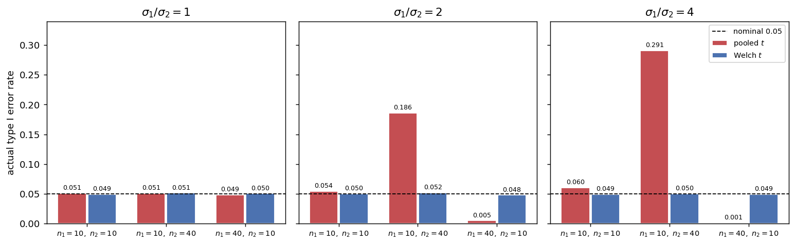

# X̄₁ - X̄₂의 표본분포 (이분산과 불균형)

## 개요

앞 쪽에서는 모든 것이 정확했다. 그 정확함은 **두 모분산이 같다**는 가정 위에 서 있었다. 이 쪽에서는 그 가정을 깬다.

깨뜨려 보면 두 가지를 알게 된다.

- 이분산 하나만으로는 큰일이 나지 않는다. **표본크기가 같으면** 합동 $t$가 그럭저럭 버틴다.
- 이분산과 **불균형**이 겹치면 무너진다. 분산이 큰 쪽에 표본이 적으면 명목 5% 검정의 실제 오류율이 29%까지 오르고, 반대면 0.1%까지 내려간다.

그리고 이 문제의 성질이 고약하다. **표본을 키워도 사라지지 않는다.** 표본을 10배로 늘려도 비만 유지되면 오류율은 그대로다. 5.6절에서 $S^2$의 카이제곱 근사가 첨도 때문에 어긋나던 것과 같은 종류의 실패다. 표본크기가 고쳐 주는 문제가 아니다.

Welch의 $t$는 이 문제를 거의 완전히 해결한다. 이 쪽의 결론은 단순하다. **처음부터 Welch를 쓰라.**

## 설정

두 모집단은 정규이고 평균이 같다.

$$
X_1,\ldots,X_{n_1} \overset{\text{iid}}{\sim} N(0, \sigma_1^2), \qquad
Y_1,\ldots,Y_{n_2} \overset{\text{iid}}{\sim} N(0, \sigma_2^2)
$$

두 평균을 같게 두었으므로 **$H_0: \mu_1 = \mu_2$가 참이다.** 이 자료에 명목 유의수준 5%의 양측검정을 걸고 기각하는 비율을 센다. 그 비율이 곧 **실제 제1종 오류율**이며, 0.05에서 얼마나 벗어나는지가 이 쪽의 측정 대상이다.

격자는 다음과 같다.

| 축 | 값 |
|---|---|
| 분산비 $\sigma_1/\sigma_2$ | $1,\ 2,\ 4$ (즉 $\sigma_2 = 1$ 고정) |
| 표본크기 $(n_1, n_2)$ | $(10,10)$ 균형, $(10,40)$ 큰 분산에 적은 표본, $(40,10)$ 큰 분산에 많은 표본 |
| 검정 | 합동 $t$ (자유도 $n_1+n_2-2$), Welch $t$ (자유도 $\nu$) |

각 칸에서 반복 50,000회를 돌린다. 오류율 추정의 표준오차는 $\sqrt{0.05 \times 0.95/50000} = 0.001$이므로 소수 셋째 자리까지 읽어도 된다.

## 표본분포 이론

### 분자는 여전히 정확하다

이분산이어도 차의 분포는 정확하다.

$$
\bar X_1 - \bar X_2 \sim N\!\left(\mu_1-\mu_2,\ \frac{\sigma_1^2}{n_1} + \frac{\sigma_2^2}{n_2}\right)
$$

정규성만 있으면 되는 결과이고 등분산은 쓰이지 않았다. **문제는 전부 분모에 있다.** 이 참 분산을 무엇으로 추정하느냐가 두 검정을 가른다.

### 합동분산은 무엇을 추정하는가

$$
E[S_p^2] = \frac{(n_1-1)\sigma_1^2 + (n_2-1)\sigma_2^2}{n_1+n_2-2}
$$

이므로 합동 $t$가 쓰는 분산의 기댓값은

$$
E\!\left[S_p^2\!\left(\frac{1}{n_1}+\frac{1}{n_2}\right)\right]
= \frac{(n_1-1)\sigma_1^2 + (n_2-1)\sigma_2^2}{n_1+n_2-2}\left(\frac{1}{n_1}+\frac{1}{n_2}\right)
$$

이다. 이것을 참 분산 $\sigma_1^2/n_1 + \sigma_2^2/n_2$와 견주자. 비를

$$
R = \frac{E\!\left[S_p^2(1/n_1+1/n_2)\right]}{\sigma_1^2/n_1 + \sigma_2^2/n_2}
$$

로 두면 격자에서 다음과 같다.

| $\sigma_1/\sigma_2$ | $(n_1,n_2)$ | 참 분산 | 합동이 겨누는 값 | $R$ | $\sqrt R$ |
|---|---|---|---|---|---|
| 2 | $(10,10)$ | 0.500 | 0.500 | 1.000 | 1.000 |
| 2 | $(10,40)$ | 0.425 | 0.195 | 0.460 | 0.678 |
| 2 | $(40,10)$ | 0.200 | 0.430 | 2.148 | 1.466 |
| 4 | $(10,10)$ | 1.700 | 1.700 | 1.000 | 1.000 |
| 4 | $(10,40)$ | 1.625 | 0.477 | 0.293 | 0.542 |
| 4 | $(40,10)$ | 0.500 | 1.648 | 3.297 | 1.816 |

$\sqrt R$이 표준오차의 배율이므로 합동 $t$ 통계량은 참값보다 $1/\sqrt R$배로 커진다. $\sigma_1/\sigma_2 = 4$, $(n_1,n_2)=(10,40)$이면 $1/0.542 = 1.85$배다. **통계량이 1.85배로 부풀어 있으니 기각이 쏟아진다.** 거칠게 계산하면

$$
P\!\left(|Z| > t_{0.975,\,48}\sqrt R\right) = P(|Z| > 2.011 \times 0.542) = 0.276
$$

이고 모의실험 값 0.291과 가깝다($S_p^2$ 자체의 흔들림을 무시한 근사라 조금 작게 나온다). 반대쪽 $(40,10)$에서는 $\sqrt R = 1.816$이라 같은 계산이 0.0003을 준다. 모의실험 값은 0.001이다.

!!! danger "가중값의 방향이 반대다"
    합동분산은 **자유도로 가중**하므로 표본이 큰 집단의 분산을 더 반영한다. 그런데 차의 참 분산 $\sigma_1^2/n_1 + \sigma_2^2/n_2$에서는 **표본이 작은 집단의 분산이 더 큰 몫**을 갖는다($1/n_i$로 나누므로).

    두 가중이 정확히 반대 방향이다. 그래서 큰 분산이 작은 표본과 짝지어지면 합동분산이 참값을 **과소평가**하고, 큰 분산이 큰 표본과 짝지어지면 **과대평가**한다.

### 표본크기가 같으면 정확히 맞는다

$n_1 = n_2 = n$을 넣어 보자.

$$
E\!\left[S_p^2\!\left(\frac2n\right)\right] = \frac{(n-1)\sigma_1^2+(n-1)\sigma_2^2}{2n-2}\cdot\frac2n = \frac{\sigma_1^2+\sigma_2^2}{2}\cdot\frac2n = \frac{\sigma_1^2}{n}+\frac{\sigma_2^2}{n}
$$

참 분산과 **정확히 같다.** 분산비가 무엇이든 상관없다. 위 표에서 $(10,10)$ 행의 $R$이 둘 다 1인 것이 이것이다.

물론 기댓값만 맞을 뿐 분포가 완전히 같지는 않으므로 오류율이 정확히 0.05가 되지는 않는다. 실제로 $\sigma_1/\sigma_2 = 4$에서 0.060으로 약간 부푼다. 그러나 0.291과 견주면 무시할 만한 어긋남이다. **균형 설계가 합동 $t$를 구해 준다.**

### Welch의 해법

Welch는 분모를 바꾼다. 합동하지 않고 각 집단의 분산을 따로 쓴다.

$$
\widehat{\text{Var}}(\bar X_1 - \bar X_2) = \frac{S_1^2}{n_1} + \frac{S_2^2}{n_2}
$$

이 추정량은 $E[S_i^2] = \sigma_i^2$이므로 분산비와 표본크기에 관계없이 **언제나 불편**이다. 앞의 $R$이 항상 1이 되는 셈이다.

대가는 분포다. 서로 다른 척도를 가진 두 카이제곱의 합은 카이제곱이 아니므로 이 통계량은 정확한 $t$ 분포를 따르지 않는다. Satterthwaite의 방법은 그 합을 **적률이 맞는 카이제곱으로 근사**한다. $S_1^2/n_1 + S_2^2/n_2$의 평균과 분산을 자유도 $\nu$인 척도화 카이제곱의 것과 맞추면

$$
\nu = \frac{\left(\dfrac{S_1^2}{n_1} + \dfrac{S_2^2}{n_2}\right)^2}
{\dfrac{(S_1^2/n_1)^2}{n_1-1} + \dfrac{(S_2^2/n_2)^2}{n_2-1}}
$$

을 얻는다. 이것이 **Welch–Satterthwaite 자유도**다. 성질 두 가지를 기억하면 된다.

- $\min(n_1-1,\ n_2-1) \le \nu \le n_1+n_2-2$. 자유도가 합동보다 절대 크지 않다.
- $\nu$는 **자료에 따라 달라지는 확률변수**다. 정수도 아니다. 보고할 때 소수점을 그대로 적는 것이 관례다.

격자에서 $\nu$가 얼마로 나오는지 보자.

| $\sigma_1/\sigma_2$ | $(n_1,n_2)$ | 참 분산을 넣은 $\nu$ | 모의실험 평균 $\nu$ | 합동 자유도 |
|---|---|---|---|---|
| 1 | $(10,10)$ | 18.0 | 16.5 | 18 |
| 1 | $(10,40)$ | 13.9 | 15.4 | 48 |
| 1 | $(40,10)$ | 13.9 | 15.4 | 48 |
| 2 | $(10,10)$ | 13.2 | 13.6 | 18 |
| 2 | $(10,40)$ | 10.2 | 10.5 | 48 |
| 2 | $(40,10)$ | 29.2 | 31.1 | 48 |
| 4 | $(10,10)$ | 10.1 | 10.4 | 18 |
| 4 | $(10,40)$ | 9.3 | 9.4 | 48 |
| 4 | $(40,10)$ | 48.0 | 46.1 | 48 |

읽을 것이 셋이다. 첫째, 분산비가 커질수록 자유도가 줄어든다. $\sigma_1/\sigma_2 = 4$, $(10,40)$에서 $\nu = 9.3$인데, 전체 50개를 관측하고도 **작은 쪽 표본 10개가 가진 만큼의 정보밖에 없다.** 큰 분산을 가진 집단이 차의 분산을 지배하기 때문이며, 정직한 계산이다.

둘째, 반대 배치 $(40,10)$에서는 $\nu = 48$로 합동 자유도와 같아진다. 이때는 분산이 작은 집단이 표본도 적어 차의 분산에 거의 기여하지 않으므로 사실상 한쪽 집단의 문제가 된다.

셋째, **등분산($\sigma_1/\sigma_2=1$)이어도 불균형이면 $\nu$가 13.9로 줄어든다.** 이것이 Welch를 쓰는 값이다. 다만 뒤에서 보듯 그 대가는 매우 작다.

## 모의실험

<div class="codebox" markdown>

#### 예제 1. 격자 전체의 실제 오류율 { .eg }

```python
import numpy as np
from scipy import stats

rng = np.random.default_rng(1)
B = 50_000          # 반복 횟수. 오류율 추정의 표준오차는 약 0.001이다.
alpha = 0.05


def error_rates(n1, n2, s1, s2):
    """H0(mu1 = mu2)가 참인 자료를 B번 만들어 두 검정의 기각 비율을 센다."""
    x1 = rng.normal(0, s1, size=(B, n1))
    x2 = rng.normal(0, s2, size=(B, n2))
    d = x1.mean(axis=1) - x2.mean(axis=1)
    v1, v2 = x1.var(axis=1, ddof=1), x2.var(axis=1, ddof=1)

    # 합동 t: 자유도가 n1+n2-2로 고정된다.
    sp2 = ((n1 - 1) * v1 + (n2 - 1) * v2) / (n1 + n2 - 2)
    t_pool = d / np.sqrt(sp2 * (1 / n1 + 1 / n2))
    rej_pool = np.mean(np.abs(t_pool) > stats.t(n1 + n2 - 2).ppf(1 - alpha / 2))

    # Welch t: 표본마다 자유도가 달라진다.
    a, b = v1 / n1, v2 / n2
    t_welch = d / np.sqrt(a + b)
    nu = (a + b) ** 2 / (a ** 2 / (n1 - 1) + b ** 2 / (n2 - 1))
    rej_welch = np.mean(np.abs(t_welch) > stats.t(nu).ppf(1 - alpha / 2))
    return rej_pool, rej_welch, nu.mean()


print("sigma1/sigma2  (n1, n2)   pooled t   Welch t   mean nu")
for r in (1, 2, 4):
    for n1, n2 in ((10, 10), (10, 40), (40, 10)):
        rp, rw, nu = error_rates(n1, n2, r, 1.0)
        print(f"{r:>13}  ({n1:>2}, {n2:>2})     {rp:.3f}      {rw:.3f}     {nu:5.1f}")
```

출력:

```
sigma1/sigma2  (n1, n2)   pooled t   Welch t   mean nu
            1  (10, 10)     0.051      0.049      16.5
            1  (10, 40)     0.051      0.051      15.4
            1  (40, 10)     0.049      0.050      15.4
            2  (10, 10)     0.054      0.050      13.6
            2  (10, 40)     0.186      0.052      10.5
            2  (40, 10)     0.005      0.048      31.1
            4  (10, 10)     0.060      0.049      10.4
            4  (10, 40)     0.291      0.050       9.4
            4  (40, 10)     0.001      0.049      46.1
```

첫 세 줄이 등분산 기준선이다. 두 검정이 모두 0.05를 지킨다. 아래로 내려가면서 합동 $t$의 값이 좌우로 벌어지는데, **Welch 열은 아홉 칸 모두 0.048에서 0.052 사이**에 머문다.

</div>

<div class="codebox" markdown>

#### 예제 2. 격자를 그림으로 { .eg }

```python
import matplotlib.pyplot as plt
import numpy as np

sizes = [(10, 10), (10, 40), (40, 10)]
ratios = [1, 2, 4]
labels = [f"$n_1={a},\\ n_2={b}$" for a, b in sizes]

fig, axes = plt.subplots(1, 3, figsize=(12, 3.8), sharey=True)
xs = np.arange(len(sizes))
for ax, r in zip(axes, ratios):
    pool, welch = [], []
    for n1, n2 in sizes:
        rp, rw, nu = error_rates(n1, n2, r, 1.0)     # 예제 1의 함수
        pool.append(rp)
        welch.append(rw)
    ax.bar(xs - 0.19, pool, 0.36, color="#c44e52", edgecolor="white", label="pooled $t$")
    ax.bar(xs + 0.19, welch, 0.36, color="#4c72b0", edgecolor="white", label="Welch $t$")
    for x, v in zip(xs - 0.19, pool):
        ax.text(x, v + 0.006, f"{v:.3f}", ha="center", fontsize=7)
    for x, v in zip(xs + 0.19, welch):
        ax.text(x, v + 0.006, f"{v:.3f}", ha="center", fontsize=7)
    ax.axhline(0.05, color="black", ls="--", lw=1, label="nominal 0.05")
    ax.set_xticks(xs)
    ax.set_xticklabels(labels, fontsize=8)
    ax.set_title(rf"$\sigma_1/\sigma_2 = {r}$")
    ax.set_ylim(0, 0.34)

axes[0].set_ylabel("actual type I error rate")
axes[2].legend(fontsize=8)
plt.tight_layout()
plt.show()
```



왼쪽 패널(등분산)에서는 여섯 개의 막대가 모두 점선 위에 나란히 있다. 오른쪽으로 갈수록 빨간 막대만 튀어 오르거나 주저앉고 파란 막대는 점선에 붙어 있다. **파란 막대가 아홉 칸 내내 같은 높이라는 것**이 이 그림의 요점이다.

</div>

<div class="codebox" markdown>

#### 예제 3. 표본을 키워도 사라지지 않는다 { .eg }

```python
import numpy as np
from scipy import stats

rng = np.random.default_rng(1)
B = 50_000
alpha = 0.05

# error_rates 는 예제 1과 같다(생략).

print("sigma1/sigma2 = 4,  n1 : n2 = 1 : 4 를 유지하며 표본을 키운다")
print(" (n1,  n2)    pooled t   Welch t   mean nu")
for n1, n2 in ((10, 40), (20, 80), (40, 160), (100, 400)):
    rp, rw, nu = error_rates(n1, n2, 4.0, 1.0)
    print(f"({n1:>3}, {n2:>3})     {rp:.3f}      {rw:.3f}    {nu:6.1f}")

print()
print("sigma1/sigma2 = 4,  n1 : n2 = 4 : 1 을 유지하며 표본을 키운다")
print(" (n1,  n2)    pooled t   Welch t   mean nu")
for n1, n2 in ((40, 10), (80, 20), (160, 40), (400, 100)):
    rp, rw, nu = error_rates(n1, n2, 4.0, 1.0)
    print(f"({n1:>3}, {n2:>3})     {rp:.3f}      {rw:.3f}    {nu:6.1f}")
```

출력:

```
sigma1/sigma2 = 4,  n1 : n2 = 1 : 4 를 유지하며 표본을 키운다
 (n1,  n2)    pooled t   Welch t   mean nu
( 10,  40)     0.292      0.050       9.4
( 20,  80)     0.286      0.050      19.7
( 40, 160)     0.282      0.050      40.3
(100, 400)     0.275      0.050     102.2

sigma1/sigma2 = 4,  n1 : n2 = 4 : 1 을 유지하며 표본을 키운다
 (n1,  n2)    pooled t   Welch t   mean nu
( 40,  10)     0.001      0.051      46.1
( 80,  20)     0.001      0.049      96.0
(160,  40)     0.001      0.052     196.0
(400, 100)     0.000      0.050     496.0
```

표본을 10배로 늘려도 합동 $t$의 오류율이 0.292에서 0.275로 움직일 뿐이다. **줄어드는 것이 아니라 극한값으로 다가가는 중**이다. $n_1 = c_1N$, $n_2 = c_2N$으로 두고 $N \to \infty$를 취하면

$$
R \;\longrightarrow\; \frac{(c_1\sigma_1^2 + c_2\sigma_2^2)\left(\dfrac{1}{c_1}+\dfrac{1}{c_2}\right)}{(c_1+c_2)\left(\dfrac{\sigma_1^2}{c_1}+\dfrac{\sigma_2^2}{c_2}\right)}
$$

인데 이 값에 $N$이 없다. $c_1:c_2 = 1:4$, $\sigma_1^2:\sigma_2^2 = 16:1$이면 $R \to 0.308$이고, 대응하는 오류율의 극한은 $P(|Z| > 1.96\sqrt{0.308}) = 0.277$이다. 표에서 실제로 그 값으로 수렴하고 있다.

반대 방향도 마찬가지다. $4:1$ 배치의 오류율은 0.001 근처에 머물다 극한 0.0004로 간다. **검정이 사실상 아무것도 기각하지 않는다.**

</div>

<div class="codebox" markdown>

#### 예제 4. 등분산일 때 Welch를 쓰는 비용 { .eg }

```python
import numpy as np
from scipy import stats

rng = np.random.default_rng(1)
B = 50_000
alpha = 0.05

print("등분산 정규모집단에서 Welch를 쓰는 값: 크기와 검정력")
print("  n     size(pool) size(Welch)   power(pool) power(Welch)  mean nu")
for n in (5, 10, 20, 50):
    x1 = rng.normal(0, 1, size=(B, n))
    x2 = rng.normal(0, 1, size=(B, n))
    v1, v2 = x1.var(axis=1, ddof=1), x2.var(axis=1, ddof=1)
    sp2, a, b = (v1 + v2) / 2, v1 / n, v2 / n
    nu = (a + b) ** 2 / (a ** 2 / (n - 1) + b ** 2 / (n - 1))
    c_pool = stats.t(2 * n - 2).ppf(1 - alpha / 2)
    c_welch = stats.t(nu).ppf(1 - alpha / 2)

    # H0가 참인 경우(크기)와 참 차이가 1인 경우(검정력)를 같은 표본으로 비교한다.
    d0 = x1.mean(axis=1) - x2.mean(axis=1)
    out = []
    for d in (d0, d0 + 1.0):
        out += [np.mean(np.abs(d / np.sqrt(sp2 * 2 / n)) > c_pool),
                np.mean(np.abs(d / np.sqrt(a + b)) > c_welch)]
    print(f"{n:>4}      {out[0]:.3f}       {out[1]:.3f}         "
          f"{out[2]:.3f}       {out[3]:.3f}    {nu.mean():5.1f}")
```

출력:

```
등분산 정규모집단에서 Welch를 쓰는 값: 크기와 검정력
  n     size(pool) size(Welch)   power(pool) power(Welch)  mean nu
   5      0.048       0.042         0.287       0.265      6.9
  10      0.049       0.048         0.563       0.557     16.5
  20      0.051       0.051         0.868       0.867     36.3
  50      0.049       0.049         0.998       0.998     96.1
```

등분산이 **실제로 맞는** 상황에서 Welch가 잃는 것을 잰 표다. 집단당 5개일 때 검정력이 0.287에서 0.265로 2.2%포인트 떨어지고, 10개면 0.6%포인트, 20개 이상이면 차이가 사라진다.

**잃는 것은 이만큼이고 얻는 것은 0.291 대 0.050이다.** 저울이 한쪽으로 완전히 기운다.

</div>

## 해석

!!! note "주요 관찰"

    1. **불균형이 문제를 만든다.** 이분산만으로는 $(10,10)$에서 오류율이 0.060에 그친다. 이분산에 불균형이 겹친 $(10,40)$에서 0.291이 된다. 두 조건이 함께 있어야 무너진다.
    2. **방향은 짝짓기가 정한다.** 큰 분산 + 작은 표본이면 오류율이 **부푼다**(0.291, 위험하다). 큰 분산 + 큰 표본이면 **주저앉는다**(0.001, 검정력을 다 잃는다). 합동분산의 가중값과 참 분산의 가중값이 반대 방향이기 때문이다.
    3. **표본크기가 고쳐 주지 않는다.** 비를 유지하며 표본을 10배로 늘려도 0.292에서 0.275로 갈 뿐이다. 배율 $R$의 극한에 표본크기가 들어 있지 않기 때문이며, 5.6절에서 $S^2$의 어긋남이 $n$과 무관했던 것과 같은 구조다.
    4. **Welch는 격자 전체에서 0.05를 지킨다.** 분모를 불편추정량으로 바꾸고 자유도를 적률맞춤으로 정하면 그것으로 충분하다. 아홉 칸 모두 0.048~0.052다.
    5. **Welch의 비용은 거의 0이다.** 등분산이 실제로 맞을 때 잃는 검정력이 집단당 10개에서 0.6%포인트, 20개 이상에서는 0이다.

!!! danger "등분산 검정을 먼저 하고 t를 고르는 절차를 권하지 않는다"
    교과서에 오래 실려 있던 2단계 절차가 있다. 먼저 $F$ 검정으로 $H_0:\sigma_1^2=\sigma_2^2$을 검정하고, 기각하지 못하면 합동 $t$를, 기각하면 Welch를 쓰는 방식이다. 요즘은 권하지 않는다. 이유는 셋이다.

    - **예비검정의 검정력이 낮다.** 표본이 작을 때 $F$ 검정은 $\sigma_1/\sigma_2 = 2$ 정도를 잘 잡아내지 못한다. 그런데 합동 $t$가 위험해지는 것이 바로 그 소표본·불균형 상황이다. 필요할 때 경보가 울리지 않는다.
    - **전체 유의수준이 왜곡된다.** 자료를 보고 검정을 고르면 최종 절차의 실제 오류율은 두 검정 어느 쪽의 것도 아니다. 조건부 선택이 만든 제3의 절차이며, 그 성질은 아무도 보장하지 않는다.
    - **얻는 것이 없다.** 예제 4가 보여 주듯 등분산이 맞을 때 Welch의 손해는 무시할 만하다. 위험을 감수하고 고를 이유가 없다.

    그래서 현대의 권고는 단순하다. **두 표본 평균 비교에는 언제나 Welch를 먼저 놓는다.** R의 `t.test()`가 `var.equal = FALSE`를 기본값으로 두는 이유이며, 기본값이 합동 $t$인 SciPy의 `ttest_ind`에 `equal_var=False`를 명시하라고 권하는 이유이기도 하다.

## 연습문제

<div class="drillbox" markdown>

**연습문제 1.** <span class="diff easy" title="쉬움"></span>
$n_1 = 10$, $s_1^2 = 16$, $n_2 = 40$, $s_2^2 = 1$인 자료에서 Welch–Satterthwaite 자유도를 직접 계산하라. 합동 자유도 48, 보수적 자유도 $\min(n_1-1,n_2-1)=9$와 견주고 임계값이 얼마나 다른지 적어라.

</div>

??? success "풀이"
    $a = s_1^2/n_1 = 1.6$, $b = s_2^2/n_2 = 0.025$로 두면 $a + b = 1.625$이므로 분자는

    $$
    (a+b)^2 = 1.625^2 = 2.640625
    $$

    이고 분모는

    $$
    \frac{a^2}{n_1-1} + \frac{b^2}{n_2-1} = \frac{2.56}{9} + \frac{0.000625}{39} = 0.284444 + 0.000016 = 0.284460
    $$

    이다. 따라서

    $$
    \nu = \frac{2.640625}{0.284460} = 9.28
    $$

    이다. 임계값은 다음과 같다.

    | 자유도 | 값 | $t_{0.975}$ |
    |---|---|---|
    | 합동 | 48 | 2.011 |
    | Welch | 9.28 | 2.252 |
    | 보수적 | 9 | 2.262 |

    **Welch 자유도가 9.28로 보수적 자유도 9에 거의 붙어 있다.** 관측값 50개를 썼는데 정보는 10개짜리 표본만큼이라는 뜻이다. 두 번째 집단이 40개나 되지만 분산이 16분의 1이라 차의 분산에 $0.025/1.625 = 1.5\%$밖에 기여하지 않기 때문이다.

    이것이 합동 $t$가 오류율 0.291을 내는 이유이기도 하다. 합동 $t$는 이 상황에서 자유도가 48이라고 주장한다. 없는 정보를 있다고 세는 것이다.

<div class="drillbox" markdown>

**연습문제 2.** <span class="diff easy" title="쉬움"></span>
$\sigma_1 = 4$, $\sigma_2 = 1$, $(n_1,n_2) = (10,40)$에서 차의 참 분산과 $E[S_p^2(1/n_1+1/n_2)]$을 각각 계산하고, 합동 $t$ 통계량이 참값보다 몇 배 커지는지 구하라.

</div>

??? success "풀이"
    참 분산은

    $$
    \frac{\sigma_1^2}{n_1} + \frac{\sigma_2^2}{n_2} = \frac{16}{10} + \frac{1}{40} = 1.6 + 0.025 = 1.625
    $$

    이고, 합동분산이 겨누는 값은

    $$
    \frac{9(16) + 39(1)}{48}\left(\frac{1}{10}+\frac{1}{40}\right) = \frac{144+39}{48} \times 0.125 = 3.8125 \times 0.125 = 0.4766
    $$

    이다. 비는 $R = 0.4766/1.625 = 0.293$이고 $\sqrt R = 0.542$이다.

    분모가 참값의 0.542배이므로 $t$ 통계량은 평균적으로 **$1/0.542 = 1.85$배**로 부푼다. 임계값 2.011을 넘기가 그만큼 쉬워진다. 실제로 기각률을 근사하면

    $$
    P(|Z| > 2.011 \times 0.542) = P(|Z| > 1.090) = 0.276
    $$

    이고 모의실험 값 0.291과 가깝다. 근사가 조금 작게 나오는 것은 $S_p^2$ 자체의 흔들림을 무시했기 때문이다.

    **관측값 50개 중 40개가 분산이 작은 집단에 있다는 사실이 합동분산을 작게 만든다.** 그런데 차의 분산은 표본이 적은 집단이 지배한다. 이 어긋남이 전부다.

<div class="drillbox" markdown>

**연습문제 3.** <span class="diff med" title="중간"></span>
$n_1 = n_2 = n$이면 분산비가 무엇이든 $E[S_p^2(1/n_1+1/n_2)]$이 차의 참 분산과 정확히 같음을 보여라. 그런데도 오류율이 0.050이 아니라 0.060으로 나오는 까닭은 무엇인가?

</div>

??? success "풀이"
    $n_1 = n_2 = n$을 넣으면

    $$
    E\!\left[S_p^2\left(\frac1n+\frac1n\right)\right]
    = \frac{(n-1)\sigma_1^2 + (n-1)\sigma_2^2}{2n-2}\cdot\frac2n
    = \frac{\sigma_1^2+\sigma_2^2}{2}\cdot\frac{2}{n}
    = \frac{\sigma_1^2}{n} + \frac{\sigma_2^2}{n}
    $$

    이고 이것이 참 분산이다. $\square$ 자유도 가중과 $1/n_i$ 가중이 둘 다 대칭이 되어 서로 상쇄된다.

    **기댓값이 맞는다고 분포가 같은 것은 아니다.** 합동 $t$가 정확히 $t_{2n-2}$가 되려면 분모가 참 분산에 비례하는 카이제곱이어야 하는데, 이분산이면

    $$
    (n-1)S_1^2 + (n-1)S_2^2 = \sigma_1^2 \chi^2_{n-1} + \sigma_2^2 \chi^2_{n-1}
    $$

    처럼 척도가 다른 두 카이제곱의 합이 되어 카이제곱이 아니다. 평균은 맞지만 **분산이 카이제곱보다 크다.** 분모가 더 흔들리면 통계량의 꼬리가 무거워지고 기각이 조금 늘어난다.

    분산비가 커질수록 이 효과가 커진다. 표에서 $\sigma_1/\sigma_2$가 1, 2, 4일 때 $(10,10)$의 오류율이 0.051, 0.054, 0.060으로 서서히 오르는 것이 그것이다. 그러나 이 정도는 실무에서 감당할 만한 어긋남이며, 부등한 표본크기가 만드는 0.291과는 종류가 다르다.

<div class="drillbox" markdown>

**연습문제 4.** <span class="diff med" title="중간"></span>
Welch–Satterthwaite 자유도가 $\min(n_1-1,\,n_2-1) \le \nu \le n_1+n_2-2$를 만족함을 보여라. 두 부등호에서 등호는 언제 성립하는가?

</div>

??? success "풀이"
    $a = S_1^2/n_1$, $b = S_2^2/n_2$, $d_i = n_i - 1$로 두면

    $$
    \nu = \frac{(a+b)^2}{\dfrac{a^2}{d_1} + \dfrac{b^2}{d_2}}
    $$

    이다.

    **위쪽 한계.** 코시-슈바르츠 부등식을 쓴다.

    $$
    (a+b)^2 = \left(\frac{a}{\sqrt{d_1}}\sqrt{d_1} + \frac{b}{\sqrt{d_2}}\sqrt{d_2}\right)^2
    \le \left(\frac{a^2}{d_1}+\frac{b^2}{d_2}\right)(d_1+d_2)
    $$

    양변을 분모로 나누면 $\nu \le d_1+d_2 = n_1+n_2-2$이다. 등호는 $a/d_1 = b/d_2$일 때, 즉 두 집단이 분산과 자유도 면에서 균형을 이룰 때다.

    **아래쪽 한계.** 일반성을 잃지 않고 $d_1 \le d_2$라 하자. 그러면

    $$
    \frac{a^2}{d_1} + \frac{b^2}{d_2} \le \frac{a^2 + b^2 + 2ab}{d_1} = \frac{(a+b)^2}{d_1}
    $$

    이 성립하므로($b^2/d_2 \le b^2/d_1 \le (b^2+2ab)/d_1$) $\nu \ge d_1 = \min(n_1-1, n_2-1)$이다. $\square$ 등호는 한쪽이 전부를 지배할 때, 즉 $b \to 0$일 때 극한으로 다가간다.

    연습문제 1이 그 극한에 가까운 예다. $b/a = 0.0156$이라 $\nu = 9.28$로 하한 9에 거의 붙었다.

<div class="drillbox" markdown>

**연습문제 5.** <span class="diff med" title="중간"></span>
Satterthwaite의 자유도 공식을 적률맞춤으로 유도하라. $V = S_1^2/n_1 + S_2^2/n_2$의 평균과 분산을 계산하고, 척도화 카이제곱 $\theta\chi^2_\nu/\nu$와 두 적률을 맞추면 된다.

</div>

??? success "풀이"
    정규모집단에서 $(n_i-1)S_i^2/\sigma_i^2 \sim \chi^2_{n_i-1}$이므로

    $$
    E[S_i^2] = \sigma_i^2, \qquad \text{Var}(S_i^2) = \frac{2\sigma_i^4}{n_i-1}
    $$

    이다. $a_i = \sigma_i^2/n_i$로 두면 두 표본이 독립이므로

    $$
    E[V] = a_1 + a_2, \qquad
    \text{Var}(V) = \frac{2a_1^2}{n_1-1} + \frac{2a_2^2}{n_2-1}
    $$

    이다.

    이제 $V \approx \theta\chi^2_\nu/\nu$로 두자. 이 근사분포는

    $$
    E = \theta, \qquad \text{Var} = \frac{\theta^2}{\nu^2}\cdot 2\nu = \frac{2\theta^2}{\nu}
    $$

    를 갖는다. 평균을 맞추면 $\theta = a_1+a_2$이고, 분산을 맞추면

    $$
    \frac{2(a_1+a_2)^2}{\nu} = \frac{2a_1^2}{n_1-1} + \frac{2a_2^2}{n_2-1}
    $$

    이므로

    $$
    \nu = \frac{(a_1+a_2)^2}{\dfrac{a_1^2}{n_1-1} + \dfrac{a_2^2}{n_2-1}}
    $$

    이다. $\square$ 실제로는 $\sigma_i^2$을 모르므로 $S_i^2$을 대입하며, 그래서 $\nu$가 확률변수가 된다.

    **검산.** $\sigma_1 = \sigma_2$이고 $n_1 = n_2 = n$이면 $a_1 = a_2 = a$이므로

    $$
    \nu = \frac{4a^2}{2a^2/(n-1)} = 2(n-1) = n_1+n_2-2
    $$

    로 합동 자유도와 같아진다. 등분산·균형 설계에서 Welch가 합동 $t$로 되돌아온다는 뜻이다.

<div class="drillbox" markdown>

**연습문제 6.** <span class="diff hard" title="어려움"></span>
$n_1 = c_1 N$, $n_2 = c_2 N$으로 두고 $N \to \infty$를 취해 배율 $R$의 극한이 $N$에 의존하지 않음을 보여라. $c_1:c_2 = 1:4$, $\sigma_1:\sigma_2 = 4:1$에서 극한값과 대응하는 오류율을 계산하고 예제 3의 표와 견주어라.

</div>

??? success "풀이"
    $n_i$가 크면 $n_i - 1 \approx n_i$, $n_1+n_2-2 \approx n_1+n_2$로 두어도 극한은 바뀌지 않는다. 그러면

    $$
    E\!\left[S_p^2\left(\frac{1}{n_1}+\frac{1}{n_2}\right)\right]
    \approx \frac{n_1\sigma_1^2 + n_2\sigma_2^2}{n_1+n_2}\left(\frac{1}{n_1}+\frac{1}{n_2}\right)
    $$

    이고 $n_i = c_i N$을 넣으면 $N$이 분자와 분모에서 한 번씩 약분되어

    $$
    \frac{c_1\sigma_1^2+c_2\sigma_2^2}{c_1+c_2}\cdot\frac{1}{N}\left(\frac{1}{c_1}+\frac{1}{c_2}\right)
    $$

    이 된다. 참 분산도 $\frac{1}{N}\left(\frac{\sigma_1^2}{c_1}+\frac{\sigma_2^2}{c_2}\right)$이므로 비를 잡으면 $1/N$이 약분되어

    $$
    R \to \frac{(c_1\sigma_1^2+c_2\sigma_2^2)\left(\dfrac{1}{c_1}+\dfrac{1}{c_2}\right)}{(c_1+c_2)\left(\dfrac{\sigma_1^2}{c_1}+\dfrac{\sigma_2^2}{c_2}\right)}
    $$

    이 남는다. **표본크기 $N$이 사라졌다.** $\square$ $R$을 정하는 것은 두 비 $c_1:c_2$와 $\sigma_1:\sigma_2$뿐이다.

    **수치.** $c_1=1$, $c_2=4$, $\sigma_1^2=16$, $\sigma_2^2=1$을 넣으면

    $$
    R \to \frac{(16 + 4)(1 + 0.25)}{5\,(16 + 0.25)} = \frac{25}{81.25} = 0.3077, \qquad \sqrt R = 0.5547
    $$

    이다. 표본이 크면 $t$가 $Z$로 가므로 오류율의 극한은

    $$
    P(|Z| > 1.96 \times 0.5547) = P(|Z| > 1.087) = 0.277
    $$

    이다. 예제 3의 표에서 0.292, 0.286, 0.282, 0.275로 이 값 근처로 다가가고 있다. **0.05로 가지 않는다.**

    반대 배치 $c_1:c_2 = 4:1$이면 $R \to 3.25$이고 오류율의 극한은 $P(|Z| > 1.96\times1.803) = 0.0004$다. 표의 0.001, 0.001, 0.001, 0.000과 맞는다.

    **이 성질이 이 쪽의 핵심이다.** 비정규성이라면 중심극한정리가 표본크기로 구해 주지만, 설계의 불균형은 표본크기로 고칠 수 없다. 고치려면 **설계를 바꾸거나**($n_1 = n_2$로 맞추거나) **방법을 바꿔야**(Welch를 쓰거나) 한다. 다음 쪽에서 이 대조를 정면으로 다룬다.

---

## 정리하며

- 이분산 자체는 큰 문제가 아니다. $n_1 = n_2$이면 $E[S_p^2(1/n_1+1/n_2)]$이 참 분산과 **정확히 같아** 합동 $t$의 오류율이 0.051~0.060에 머문다.
- 이분산과 불균형이 겹치면 무너진다. $\sigma_1/\sigma_2 = 4$일 때 큰 분산에 표본이 적으면($10$ 대 $40$) 오류율이 **0.291**, 많으면($40$ 대 $10$) **0.001**이다. 합동분산의 자유도 가중과 차의 분산의 $1/n$ 가중이 반대 방향이기 때문이다.
- 이 어긋남은 **표본크기와 무관하다.** 비를 유지하며 표본을 10배로 키워도 오류율은 극한 0.277로 갈 뿐이다. 배율 $R$의 극한에 $N$이 들어 있지 않다.
- Welch는 분모를 불편추정량 $S_1^2/n_1 + S_2^2/n_2$으로 바꾸고 자유도를 적률맞춤으로 정한다. 격자 아홉 칸 모두에서 오류율이 0.048~0.052다.
- 등분산이 실제로 맞을 때 Welch가 잃는 검정력은 집단당 10개에서 0.6%포인트, 20개 이상에서는 0이다. **등분산 예비검정을 거치느니 처음부터 Welch를 쓰는 것이 낫다.**
- 다음 쪽에서는 정규성을 깬다. 그 실패는 성격이 다르다. 표본을 키우면 사라진다.
