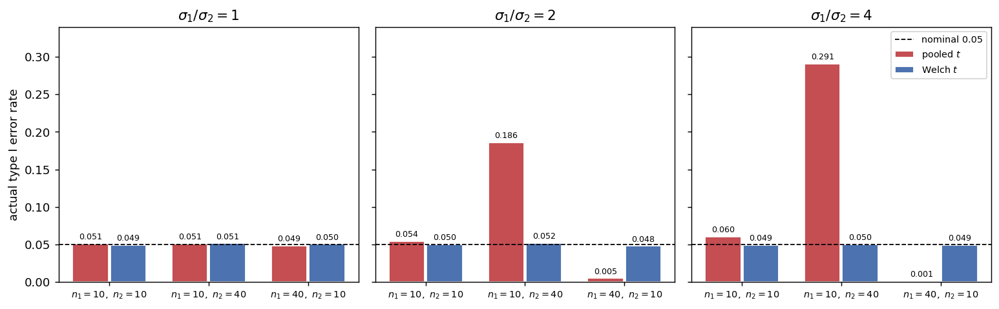

# X̄₁ - X̄₂의 표본분포 (이분산과 불균형)

## 개요

앞 쪽에서는 모든 것이 정확했다. 그 정확함은 **두 모분산이 같다**는 가정 위에 서 있었다. 이 쪽에서는 그 가정을 깬다.

깨뜨려 보면 두 가지를 알게 된다.

- 이분산 하나만으로는 큰일이 나지 않는다. **표본크기가 같으면** 합동 $t$가 그럭저럭 버틴다.
- 이분산과 **불균형**이 겹치면 무너진다. 분산이 큰 쪽에 표본이 적으면 명목 5% 검정의 실제 오류율이 29%까지 오르고, 반대면 0.1%까지 내려간다.

그리고 이 문제의 성질이 고약하다. **표본을 키워도 사라지지 않는다.** 표본을 10배로 늘려도 비만 유지되면 오류율은 그대로다. 5.6절에서 $S^2$의 카이제곱 근사가 첨도 때문에 어긋나던 것과 같은 종류의 실패다. 표본크기가 고쳐 주는 문제가 아니다.

Welch의 $t$는 이 문제를 거의 완전히 해결한다. 이 쪽의 결론은 단순하다. **처음부터 Welch를 쓰라.**

---

## 1. 설정

두 모집단은 정규이고 평균이 같다.

$$
X_1,\ldots,X_{n_1} \overset{\text{iid}}{\sim} N(0, \sigma_1^2), \qquad
Y_1,\ldots,Y_{n_2} \overset{\text{iid}}{\sim} N(0, \sigma_2^2)
$$

두 평균을 같게 두었으므로 **$H_0: \mu_1 = \mu_2$가 참이다.** 이 자료에 명목 유의수준 5%의 양측검정을 걸고 기각하는 비율을 센다. 그 비율이 곧 **실제 제1종 오류율**이며, 0.05에서 얼마나 벗어나는지가 이 쪽의 측정 대상이다.

격자는 다음과 같다.

| 축 | 값 |
|---|---|
| 분산비 $\sigma_1/\sigma_2$ | $1,\ 2,\ 4$ (즉 $\sigma_2 = 1$ 고정) |
| 표본크기 $(n_1, n_2)$ | $(10,10)$ 균형, $(10,40)$ 큰 분산에 적은 표본, $(40,10)$ 큰 분산에 많은 표본 |
| 검정 | 합동 $t$ (자유도 $n_1+n_2-2$), Welch $t$ (자유도 $\nu$) |

각 칸에서 반복 50,000회를 돌린다. 오류율 추정의 표준오차는 $\sqrt{0.05 \times 0.95/50000} = 0.001$이므로 소수 셋째 자리까지 읽어도 된다.

---

## 2. 표본분포 이론

### 분자는 여전히 정확하다

이분산이어도 차의 분포는 정확하다.

$$
\bar X_1 - \bar X_2 \sim N\!\left(\mu_1-\mu_2,\ \frac{\sigma_1^2}{n_1} + \frac{\sigma_2^2}{n_2}\right)
$$

정규성만 있으면 되는 결과이고 등분산은 쓰이지 않았다. **문제는 전부 분모에 있다.** 이 참 분산을 무엇으로 추정하느냐가 두 검정을 가른다.

### 합동분산은 무엇을 추정하는가

<div class="thmbox" markdown>

### 정리 1. 합동분산은 표본크기가 같을 때에만 참 분산을 겨눈다 { .thm }

합동 $t$ 가 쓰는 분모의 기댓값과 참 분산의 비를

$$
R = \frac{E\bigl[S_p^2(1/n_1+1/n_2)\bigr]}{\sigma_1^2/n_1 + \sigma_2^2/n_2}
$$

라 하자. $n_1 = n_2$ 이면 **분산비가 무엇이든 $R = 1$** 이다. $n_1 \ne n_2$ 이고 $\sigma_1^2 \ne \sigma_2^2$ 이면 $R \ne 1$ 이며, 방향은 이렇게 갈린다.

- 큰 분산이 **작은** 표본과 짝지어지면 $R < 1$ — 합동분산이 참값을 **과소평가**하고 오류율이 부푼다.
- 큰 분산이 **큰** 표본과 짝지어지면 $R > 1$ — 과대평가하고 검정이 보수적이 된다.

</div>

??? proof "증명"

    합동분산의 기댓값은 두 표본분산의 자유도 가중평균이다.

    $$
    E[S_p^2] = \frac{(n_1-1)\sigma_1^2 + (n_2-1)\sigma_2^2}{n_1+n_2-2}
    $$

    각 $E[S_i^2] = \sigma_i^2$ 이기 때문이다([표본분산](sample_variance.md) 정리 1).

    **$n_1 = n_2 = n$ 인 경우.** 가중치가 같아지므로 단순평균이 되고

    $$
    E\!\left[S_p^2\cdot\frac2n\right]
    = \frac{(n-1)(\sigma_1^2+\sigma_2^2)}{2n-2}\cdot\frac2n
    = \frac{\sigma_1^2+\sigma_2^2}{2}\cdot\frac{2}{n}
    = \frac{\sigma_1^2}{n} + \frac{\sigma_2^2}{n}
    $$

    인데 오른쪽이 바로 참 분산이다. 곧 $R = 1$ 이고 **$\sigma_1, \sigma_2$ 가 어떤 값이든 상관없다.**

    **일반적인 경우.** 두 식을 나란히 놓고 보면 가중의 방향이 드러난다.

    $$
    \underbrace{\frac{(n_1-1)\sigma_1^2 + (n_2-1)\sigma_2^2}{n_1+n_2-2}}_{\text{자유도로 가중 — 큰 표본에 무게}}
    \quad\text{vs}\quad
    \underbrace{\frac{\sigma_1^2}{n_1} + \frac{\sigma_2^2}{n_2}}_{\text{1/n 으로 가중 — 작은 표본에 무게}}
    $$

    **두 가중이 정확히 반대 방향이다.** 합동분산은 $\sigma_i^2$ 에 $n_i-1$ 을 걸어 큰 표본 쪽을 더 반영하고, 참 분산은 $1/n_i$ 를 걸어 작은 표본 쪽을 더 반영한다. 그러므로 큰 분산이 작은 표본과 짝지어지면 합동 쪽이 그 큰 분산을 **덜** 반영해 참값보다 작아지고($R<1$), 반대로 짝지어지면 커진다($R>1$). $n_1 = n_2$ 일 때에만 두 가중이 일치해 어긋남이 사라진다. $\square$

    **$\sqrt R$ 이 표준오차의 배율이다.** 합동 $t$ 통계량은 참값보다 $1/\sqrt R$ 배로 커지므로, $R < 1$ 이면 통계량이 부풀려져 **실제 오류율이 명목값을 넘는다.** 아래 표의 $\sigma_1/\sigma_2 = 4$, $(n_1,n_2) = (10,40)$ 에서 $\sqrt R = 0.542$ 이고 오류율이 $0.05$ 가 아니라 $0.29$ 로 나오는 것이 그 값이다.

    등분산 가정이 **표본크기가 같을 때 가장 너그럽다**는 것이 실무의 교훈이다. 균형설계가 좋은 설계인 까닭 가운데 하나가 이것이고, 그래도 Welch 를 쓰면 이 걱정 자체가 없어진다.

이다. 이것을 참 분산 $\sigma_1^2/n_1 + \sigma_2^2/n_2$와 견주자. 비를

$$
R = \frac{E\!\left[S_p^2(1/n_1+1/n_2)\right]}{\sigma_1^2/n_1 + \sigma_2^2/n_2}
$$

로 두면 격자에서 다음과 같다.

| $\sigma_1/\sigma_2$ | $(n_1,n_2)$ | 참 분산 | 합동이 겨누는 값 | $R$ | $\sqrt R$ |
|---|---|---|---|---|---|
| 2 | $(10,10)$ | 0.500 | 0.500 | 1.000 | 1.000 |
| 2 | $(10,40)$ | 0.425 | 0.195 | 0.460 | 0.678 |
| 2 | $(40,10)$ | 0.200 | 0.430 | 2.148 | 1.466 |
| 4 | $(10,10)$ | 1.700 | 1.700 | 1.000 | 1.000 |
| 4 | $(10,40)$ | 1.625 | 0.477 | 0.293 | 0.542 |
| 4 | $(40,10)$ | 0.500 | 1.648 | 3.297 | 1.816 |

$\sqrt R$이 표준오차의 배율이므로 합동 $t$ 통계량은 참값보다 $1/\sqrt R$배로 커진다. $\sigma_1/\sigma_2 = 4$, $(n_1,n_2)=(10,40)$이면 $1/0.542 = 1.85$배다. **통계량이 1.85배로 부풀어 있으니 기각이 쏟아진다.** 거칠게 계산하면

$$
P\!\left(|Z| > t_{0.975,\,48}\sqrt R\right) = P(|Z| > 2.011 \times 0.542) = 0.276
$$

이고 모의실험 값 0.291과 가깝다($S_p^2$ 자체의 흔들림을 무시한 근사라 조금 작게 나온다). 반대쪽 $(40,10)$에서는 $\sqrt R = 1.816$이라 같은 계산이 0.0003을 준다. 모의실험 값은 0.001이다.

!!! danger "가중값의 방향이 반대다"
    합동분산은 **자유도로 가중**하므로 표본이 큰 집단의 분산을 더 반영한다. 그런데 차의 참 분산 $\sigma_1^2/n_1 + \sigma_2^2/n_2$에서는 **표본이 작은 집단의 분산이 더 큰 몫**을 갖는다($1/n_i$로 나누므로).

    두 가중이 정확히 반대 방향이다. 그래서 큰 분산이 작은 표본과 짝지어지면 합동분산이 참값을 **과소평가**하고, 큰 분산이 큰 표본과 짝지어지면 **과대평가**한다.

### 표본크기가 같으면 정확히 맞는다

$n_1 = n_2 = n$을 넣어 보자.

$$
E\!\left[S_p^2\!\left(\frac2n\right)\right] = \frac{(n-1)\sigma_1^2+(n-1)\sigma_2^2}{2n-2}\cdot\frac2n = \frac{\sigma_1^2+\sigma_2^2}{2}\cdot\frac2n = \frac{\sigma_1^2}{n}+\frac{\sigma_2^2}{n}
$$

참 분산과 **정확히 같다.** 분산비가 무엇이든 상관없다. 위 표에서 $(10,10)$ 행의 $R$이 둘 다 1인 것이 이것이다.

물론 기댓값만 맞을 뿐 분포가 완전히 같지는 않으므로 오류율이 정확히 0.05가 되지는 않는다. 실제로 $\sigma_1/\sigma_2 = 4$에서 0.060으로 약간 부푼다. 그러나 0.291과 견주면 무시할 만한 어긋남이다. **균형 설계가 합동 $t$를 구해 준다.**

### Welch의 해법

Welch는 분모를 바꾼다. 합동하지 않고 각 집단의 분산을 따로 쓴다.

$$
\widehat{\text{Var}}(\bar X_1 - \bar X_2) = \frac{S_1^2}{n_1} + \frac{S_2^2}{n_2}
$$

이 추정량은 $E[S_i^2] = \sigma_i^2$이므로 분산비와 표본크기에 관계없이 **언제나 불편**이다. 앞의 $R$이 항상 1이 되는 셈이다.

대가는 분포다. 서로 다른 척도를 가진 두 카이제곱의 합은 카이제곱이 아니므로 이 통계량은 정확한 $t$ 분포를 따르지 않는다. Satterthwaite의 방법은 그 합을 **적률이 맞는 카이제곱으로 근사**한다. $S_1^2/n_1 + S_2^2/n_2$의 평균과 분산을 자유도 $\nu$인 척도화 카이제곱의 것과 맞추면

$$
\nu = \frac{\left(\dfrac{S_1^2}{n_1} + \dfrac{S_2^2}{n_2}\right)^2}
{\dfrac{(S_1^2/n_1)^2}{n_1-1} + \dfrac{(S_2^2/n_2)^2}{n_2-1}}
$$

을 얻는다. 이것이 **Welch–Satterthwaite 자유도**다. 성질 두 가지를 기억하면 된다.

- $\min(n_1-1,\ n_2-1) \le \nu \le n_1+n_2-2$. 자유도가 합동보다 절대 크지 않다.
- $\nu$는 **자료에 따라 달라지는 확률변수**다. 정수도 아니다. 보고할 때 소수점을 그대로 적는 것이 관례다.

격자에서 $\nu$가 얼마로 나오는지 보자.

| $\sigma_1/\sigma_2$ | $(n_1,n_2)$ | 참 분산을 넣은 $\nu$ | 모의실험 평균 $\nu$ | 합동 자유도 |
|---|---|---|---|---|
| 1 | $(10,10)$ | 18.0 | 16.5 | 18 |
| 1 | $(10,40)$ | 13.9 | 15.4 | 48 |
| 1 | $(40,10)$ | 13.9 | 15.4 | 48 |
| 2 | $(10,10)$ | 13.2 | 13.6 | 18 |
| 2 | $(10,40)$ | 10.2 | 10.5 | 48 |
| 2 | $(40,10)$ | 29.2 | 31.1 | 48 |
| 4 | $(10,10)$ | 10.1 | 10.4 | 18 |
| 4 | $(10,40)$ | 9.3 | 9.4 | 48 |
| 4 | $(40,10)$ | 48.0 | 46.1 | 48 |

읽을 것이 셋이다. 첫째, 분산비가 커질수록 자유도가 줄어든다. $\sigma_1/\sigma_2 = 4$, $(10,40)$에서 $\nu = 9.3$인데, 전체 50개를 관측하고도 **작은 쪽 표본 10개가 가진 만큼의 정보밖에 없다.** 큰 분산을 가진 집단이 차의 분산을 지배하기 때문이며, 정직한 계산이다.

둘째, 반대 배치 $(40,10)$에서는 $\nu = 48$로 합동 자유도와 같아진다. 두 집단이 차의 분산에 기여하는 몫 $a : b = 0.4 : 0.1$이 자유도의 비 $39 : 9$와 거의 맞아떨어져, 연습문제 4에서 볼 상한의 등호 조건 $a/(n_1-1) = b/(n_2-1)$이 사실상 성립하기 때문이다. 큰 분산 쪽에 표본이 많으면 자유도를 잃을 일이 없다.

셋째, **등분산($\sigma_1/\sigma_2=1$)이어도 불균형이면 $\nu$가 13.9로 줄어든다.** 이것이 Welch를 쓰는 값이다. 다만 뒤에서 보듯 그 대가는 매우 작다.

---

## 3. 모의실험

<div class="exbox" markdown>

**보기 1.** <span class="diff easy" title="쉬움"></span> 격자 전체의 실제 오류율. 분산비 $\sigma_1/\sigma_2 \in \{1,2,4\}$와 표본크기 $(n_1,n_2) \in \{(10,10),(10,40),(40,10)\}$의 아홉 칸에서, $H_0$가 참인 자료에 명목 5% 양측검정을 걸고 기각 비율을 5만 번씩 센다.

**(1)** 아홉 칸 각각에서 합동 $t$의 오류율이 얼마가 되어야 하는지 미리 계산하시오. 본문의 배율 $R$만으로는 모자라고 분모의 **흔들림**까지 셈에 넣어야 한다.

**(2)** 모의실험으로 (1)을 확인하고, Welch 열이 아홉 칸 내내 0.05를 지키는 까닭을 적으시오.

</div>

??? success "풀이"

    **(1) 해석적으로.** $c = 1/n_1 + 1/n_2$, $d_i = n_i-1$로 두자. 분자는 이분산이어도 정확히 정규이므로

    $$
    \bar X_1 - \bar X_2 = \tau Z, \qquad \tau^2 = \frac{\sigma_1^2}{n_1}+\frac{\sigma_2^2}{n_2}, \quad Z \sim N(0,1)
    $$

    이다. 분모의 제곱 $V_p = S_p^2 c$는 서로 독립인 두 카이제곱의 **척도가 다른** 합이다.

    $$
    V_p = \frac{c}{d_1+d_2}\left(\sigma_1^2\chi^2_{d_1} + \sigma_2^2\chi^2_{d_2}\right)
    $$

    이 합은 카이제곱이 아니다. 그래서 Satterthwaite의 방법을 **합동분산 쪽에** 그대로 적용한다. 평균과 분산을 계산하면

    $$
    E[V_p] = \frac{c\,(d_1\sigma_1^2+d_2\sigma_2^2)}{d_1+d_2},
    \qquad
    \operatorname{Var}(V_p) = \frac{2c^2(d_1\sigma_1^4+d_2\sigma_2^4)}{(d_1+d_2)^2}
    $$

    이고, $V_p \approx \theta\chi^2_m/m$에 두 적률을 맞추면 $\theta = E[V_p]$와

    $$
    m = \frac{2E[V_p]^2}{\operatorname{Var}(V_p)}
    = \frac{(d_1\sigma_1^2+d_2\sigma_2^2)^2}{d_1\sigma_1^4+d_2\sigma_2^4}
    $$

    를 얻는다. $c$가 약분되어 사라지는 것에 주목하라. **$m$은 분산비와 자유도만으로 정해진다.** 등분산이면 $m = d_1+d_2$로 합동 자유도와 같아진다.

    이제 $R = E[V_p]/\tau^2$이 본문의 배율이므로 $V_p \approx \tau^2 R\,\chi^2_m/m$이고, 분자와 분모가 독립이므로

    $$
    T_{\text{pool}} = \frac{\tau Z}{\sqrt{V_p}} \;\approx\; \frac{Z}{\sqrt{R\,\chi^2_m/m}} = \frac{t_m}{\sqrt R}
    $$

    이다. 따라서 명목 5% 검정의 실제 오류율은

    $$
    P\!\left(|T_{\text{pool}}| > t_{0.975,\,d_1+d_2}\right)
    \;\approx\;
    P\!\left(|t_m| > t_{0.975,\,d_1+d_2}\sqrt R\right)
    $$

    가 된다. **고장 난 손잡이가 둘**이라는 것이 이 식의 요점이다. $R \ne 1$이면 통계량의 **척도**가 틀리고, $m < d_1+d_2$이면 합동 자유도가 주장하는 것보다 분모가 **더 흔들려** 꼬리가 무거워진다. 본문이 쓴 거친 어림 $P(|Z| > t_{0.975}\sqrt R)$은 뒤의 손잡이를 빠뜨린 것이며, 그래서 체계적으로 작게 나온다.

    격자에 넣어 두 어림을 나란히 둔다.

    | $\sigma_1/\sigma_2$ | $(n_1,n_2)$ | $R$ | $m$ | 거친 어림 | 다듬은 어림 |
    |---:|:---|---:|---:|---:|---:|
    | 1 | (10, 10) | 1.000 | 18.0 | 0.036 | 0.0500 |
    | 1 | (10, 40) | 1.000 | 48.0 | 0.044 | 0.0500 |
    | 1 | (40, 10) | 1.000 | 48.0 | 0.044 | 0.0500 |
    | 2 | (10, 10) | 1.000 | 13.2 | 0.036 | 0.0554 |
    | 2 | (10, 40) | 0.460 | 30.7 | 0.173 | 0.1828 |
    | 2 | (40, 10) | 2.148 | 43.0 | 0.003 | 0.0052 |
    | 4 | (10, 10) | 1.000 | 10.1 | 0.036 | 0.0617 |
    | 4 | (10, 40) | 0.293 | 14.3 | 0.276 | 0.2942 |
    | 4 | (40, 10) | 3.297 | 40.1 | 0.0003 | 0.0007 |

    거친 어림은 등분산 세 줄에서 이미 $0.036$과 $0.044$를 주어 $0.05$를 맞히지 못한다. **아무것도 고장 나지 않은 자리에서 틀리는 어림**이니 고장 난 자리의 숫자도 믿을 수 없다. 다듬은 어림은 그 세 줄에서 $0.0500$을 정확히 주고, 균형 설계의 $R = 1$ 줄에서도 $0.0554$와 $0.0617$로 **$m$이 줄어든 몫만큼** 부푼다.

    **(2) 모의실험.**

    ```python
    import numpy as np
    from scipy import stats

    rng = np.random.default_rng(1)
    B = 50_000          # 반복 횟수. 오류율 추정의 표준오차는 약 0.001이다.
    alpha = 0.05


    def error_rates(n1, n2, s1, s2):
        """H0(mu1 = mu2)가 참인 자료를 B번 만들어 두 검정의 기각 비율을 센다."""
        x1 = rng.normal(0, s1, size=(B, n1))
        x2 = rng.normal(0, s2, size=(B, n2))
        d = x1.mean(axis=1) - x2.mean(axis=1)
        v1, v2 = x1.var(axis=1, ddof=1), x2.var(axis=1, ddof=1)

        # 합동 t: 자유도가 n1+n2-2로 고정된다.
        sp2 = ((n1 - 1) * v1 + (n2 - 1) * v2) / (n1 + n2 - 2)
        t_pool = d / np.sqrt(sp2 * (1 / n1 + 1 / n2))
        rej_pool = np.mean(np.abs(t_pool) > stats.t(n1 + n2 - 2).ppf(1 - alpha / 2))

        # Welch t: 표본마다 자유도가 달라진다.
        a, b = v1 / n1, v2 / n2
        t_welch = d / np.sqrt(a + b)
        nu = (a + b) ** 2 / (a ** 2 / (n1 - 1) + b ** 2 / (n2 - 1))
        rej_welch = np.mean(np.abs(t_welch) > stats.t(nu).ppf(1 - alpha / 2))
        return rej_pool, rej_welch, nu.mean()


    print("sigma1/sigma2  (n1, n2)   pooled t   Welch t   mean nu")
    for r in (1, 2, 4):
        for n1, n2 in ((10, 10), (10, 40), (40, 10)):
            rp, rw, nu = error_rates(n1, n2, r, 1.0)
            print(f"{r:>13}  ({n1:>2}, {n2:>2})     {rp:.3f}      {rw:.3f}     {nu:5.1f}")
    ```

    출력:

    ```
    sigma1/sigma2  (n1, n2)   pooled t   Welch t   mean nu
                1  (10, 10)     0.051      0.049      16.5
                1  (10, 40)     0.051      0.051      15.4
                1  (40, 10)     0.049      0.050      15.4
                2  (10, 10)     0.054      0.050      13.6
                2  (10, 40)     0.186      0.052      10.5
                2  (40, 10)     0.005      0.048      31.1
                4  (10, 10)     0.060      0.049      10.4
                4  (10, 40)     0.291      0.050       9.4
                4  (40, 10)     0.001      0.049      46.1
    ```

    첫 세 줄이 등분산 기준선이다. 두 검정이 모두 0.05를 지킨다. 아래로 내려가면서 합동 $t$의 값이 좌우로 벌어지는데, **Welch 열은 아홉 칸 모두 0.048에서 0.052 사이**에 머문다.

    **아홉 칸이 모두 맞는다.** 반복 5만 회에서 $p = 0.05$ 둘레의 몬테카를로 오차가 $0.0010$, $p = 0.29$ 둘레에서 $0.0020$이다.

    | $\sigma_1/\sigma_2$ | $(n_1,n_2)$ | 다듬은 어림 | 모의(합동) | 어긋남 | 모의(Welch) |
    |---:|:---|---:|---:|---:|---:|
    | 1 | (10, 10) | 0.0500 | 0.051 | $+0.001$ | 0.049 |
    | 1 | (10, 40) | 0.0500 | 0.051 | $+0.001$ | 0.051 |
    | 1 | (40, 10) | 0.0500 | 0.049 | $-0.001$ | 0.050 |
    | 2 | (10, 10) | 0.0554 | 0.054 | $-0.001$ | 0.050 |
    | 2 | (10, 40) | 0.1828 | 0.186 | $+0.003$ | 0.052 |
    | 2 | (40, 10) | 0.0052 | 0.005 | $-0.000$ | 0.048 |
    | 4 | (10, 10) | 0.0617 | 0.060 | $-0.002$ | 0.049 |
    | 4 | (10, 40) | 0.2942 | 0.291 | $-0.003$ | 0.050 |
    | 4 | (40, 10) | 0.0007 | 0.001 | $+0.000$ | 0.049 |

    아홉 줄의 어긋남이 모두 몬테카를로 오차의 두 배 안이다. **표의 모든 수가 두 손잡이 $R$과 $m$에서 나왔다.**

    **두 손잡이가 각각 무엇을 하는지 줄별로 읽힌다.** $(10,10)$ 세 줄은 $R = 1$이라 척도는 멀쩡한데 $m$이 $18.0 \to 13.2 \to 10.1$로 줄어 오류율이 $0.050 \to 0.055 \to 0.062$로 민다. 분산비 하나만으로 생기는 어긋남은 이만큼이고, 실무에서 감당할 만하다. $(10,40)$ 줄은 $R$이 $0.46$과 $0.29$로 무너지면서 $0.183$과 $0.294$가 된다. **같은 분산비인데 표본크기의 배치만 바꿔 어긋남이 다섯 배가 되었다.** $(40,10)$ 줄은 $R > 1$이라 반대로 $0.005$와 $0.0007$로 주저앉는다.

    **Welch 열은 왜 아홉 칸 모두 0.05인가.** 두 손잡이를 다 잠갔기 때문이다. 분모를 $S_1^2/n_1+S_2^2/n_2$로 바꾸면 $E[S_i^2] = \sigma_i^2$이므로 겨누는 값이 참 분산과 정확히 같아 $R \equiv 1$이 된다. 그리고 자유도를 고정하지 않고 같은 적률맞춤으로 $\nu$를 자료마다 다시 계산하므로, 위에서 합동 자유도가 틀렸던 $m$의 몫까지 제자리를 찾는다. 본문의 표에서 $\nu$가 $\sigma_1/\sigma_2 = 4$, $(10,40)$에서 $9.4$까지 내려가는 것이 그 값이다. **관측값 50개를 썼지만 정보는 10개짜리 표본만큼이라고 정직하게 세는 것**이고, 합동 $t$는 같은 자리에서 48개라고 주장한다.

<div class="exbox" markdown>

**보기 2.** <span class="diff easy" title="쉬움"></span> 격자를 그림으로. 보기 1의 아홉 칸을 분산비마다 한 패널씩 묶어 막대로 그린다.

**(1)** 보기 1의 표를 그림으로 옮기면 어떤 모양이 되어야 하는지 미리 적으시오. 세 패널을 가로로 훑을 때 빨간 막대와 파란 막대가 각각 어떻게 움직이는가.

**(2)** 그려서 확인하고, 이 막대그림이 **가리는 것**을 하나 짚으시오.

</div>

??? success "풀이"

    **(1) 그림이 될 모양은 표에 이미 적혀 있다.** 보기 1의 아홉 칸을 분산비로 묶으면 이렇게 된다.

    - **왼쪽 패널($\sigma_1/\sigma_2 = 1$).** 여섯 막대가 모두 $0.049 \sim 0.051$이므로 점선 위에 나란히 선다. **높이차가 눈에 보이지 않아야 한다.**
    - **가운데와 오른쪽 패널.** 파란 막대(Welch)는 여전히 여섯 개 모두 $0.048 \sim 0.052$라 점선에 붙어 있고, 빨간 막대(합동)만 가운데 칸에서 솟고($0.186 \to 0.291$) 오른쪽 칸에서 주저앉는다($0.005 \to 0.001$).
    - **왼쪽 칸의 빨간 막대는 조금씩만 오른다.** $0.051 \to 0.054 \to 0.060$이다. 균형 설계에서는 $R = 1$이라 합동 $t$가 버티기 때문이고, 이분산 **하나만**으로는 큰일이 나지 않는다는 보기 1의 결론이 여기에 그림으로 남는다.

    한 문장으로 줄이면, **빨간 막대는 패널을 지날수록 좌우로 찢어지고 파란 막대는 아홉 칸 내내 같은 높이**여야 한다.

    **(2) 그려서 확인한다.**

    ```python
    import matplotlib.pyplot as plt
    import numpy as np

    rng = np.random.default_rng(1)   # 보기 1과 같은 난수열을 다시 쓴다

    sizes = [(10, 10), (10, 40), (40, 10)]
    ratios = [1, 2, 4]
    labels = [f"$n_1={a},\\ n_2={b}$" for a, b in sizes]

    fig, axes = plt.subplots(1, 3, figsize=(12, 3.8), sharey=True)
    xs = np.arange(len(sizes))
    for ax, r in zip(axes, ratios):
        pool, welch = [], []
        for n1, n2 in sizes:
            rp, rw, nu = error_rates(n1, n2, r, 1.0)     # 보기 1의 함수
            pool.append(rp)
            welch.append(rw)
        ax.bar(xs - 0.19, pool, 0.36, color="#c44e52", edgecolor="white", label="pooled $t$")
        ax.bar(xs + 0.19, welch, 0.36, color="#4c72b0", edgecolor="white", label="Welch $t$")
        for x, v in zip(xs - 0.19, pool):
            ax.text(x, v + 0.006, f"{v:.3f}", ha="center", fontsize=7)
        for x, v in zip(xs + 0.19, welch):
            ax.text(x, v + 0.006, f"{v:.3f}", ha="center", fontsize=7)
        ax.axhline(0.05, color="black", ls="--", lw=1, label="nominal 0.05")
        ax.set_xticks(xs)
        ax.set_xticklabels(labels, fontsize=8)
        ax.set_title(rf"$\sigma_1/\sigma_2 = {r}$")
        ax.set_ylim(0, 0.34)

    axes[0].set_ylabel("actual type I error rate")
    axes[2].legend(fontsize=8)
    plt.tight_layout()
    plt.show()
    ```

    

    왼쪽 패널(등분산)에서는 여섯 개의 막대가 모두 점선 위에 나란히 있다. 오른쪽으로 갈수록 빨간 막대만 튀어 오르거나 주저앉고 파란 막대는 점선에 붙어 있다. **파란 막대가 아홉 칸 내내 같은 높이라는 것**이 이 그림의 요점이다.

    **예측한 모양 그대로다.** 막대 위에 찍힌 수가 보기 1의 표와 한 자리도 다르지 않다. 같은 씨앗으로 같은 격자를 다시 돈 것이니 그래야 맞다.

    **이 그림이 가리는 것이 하나 있다.** 세로축이 $0$에서 $0.34$까지의 선형 눈금이므로 **$0.005$와 $0.001$이 바닥에 깔려 구별되지 않는다.** 오른쪽 패널의 $(40,10)$ 칸에서 빨간 막대는 아예 보이지 않는다. 그런데 거기서 일어난 일은 "별일 없음"이 아니라 **명목 5% 검정의 실제 오류율이 0.1%로 내려앉은 것**이고, 그만큼 검정력을 통째로 잃었다는 뜻이다. 보수적인 고장은 그림에서 지워지고 관대한 고장만 솟아 보인다.

    막대그림이 보이지 않는 것이 하나 더 있다. **몬테카를로 오차**다. 5만 번에서 $0.05$ 둘레의 오차가 $\pm 0.001$인데 막대 두께에 묻혀 사라진다. 파란 막대들이 "정확히 같은 높이"로 보이는 것은 사실 $\pm 0.002$ 안에서 같다는 뜻이며, 그 구별은 보기 1의 표로 돌아가야 읽힌다. **그림은 패턴을 보이고 표는 크기를 보인다.**

<div class="exbox" markdown>

**보기 3.** <span class="diff easy" title="쉬움"></span> 표본을 키워도 사라지지 않는다. $\sigma_1/\sigma_2 = 4$를 고정하고 $n_1:n_2$를 $1:4$와 $4:1$로 유지한 채 표본을 10배까지 키운다.

**(1)** $n_1 = c_1N$, $n_2 = c_2N$으로 두고 $N \to \infty$에서 배율 $R$의 극한을 구하시오. 두 배치의 극한 오류율은 얼마인가.

**(2)** 네 표본크기 각각에서 오류율을 미리 계산한 뒤 모의실험과 견주고, 수렴하는 **방향**을 읽으시오.

</div>

??? success "풀이"

    **(1) 극한에 $N$이 남지 않는다.** $n_i$가 크면 $n_i - 1 \approx n_i$로 두어도 극한이 바뀌지 않으므로

    $$
    E\!\left[S_p^2\!\left(\frac{1}{n_1}+\frac{1}{n_2}\right)\right]
    \approx \frac{n_1\sigma_1^2+n_2\sigma_2^2}{n_1+n_2}\left(\frac{1}{n_1}+\frac{1}{n_2}\right)
    $$

    이고 $n_i = c_iN$을 넣으면 앞 분수에서 $N$이 약분되고 뒤 괄호에서 $1/N$이 떨어져 나온다. 참 분산 $\frac{1}{N}\!\left(\frac{\sigma_1^2}{c_1}+\frac{\sigma_2^2}{c_2}\right)$에도 같은 $1/N$이 있으므로 비를 잡으면

    $$
    R \;\longrightarrow\; \frac{(c_1\sigma_1^2+c_2\sigma_2^2)\left(\dfrac{1}{c_1}+\dfrac{1}{c_2}\right)}
    {(c_1+c_2)\left(\dfrac{\sigma_1^2}{c_1}+\dfrac{\sigma_2^2}{c_2}\right)}
    $$

    이 남는다. **$N$이 사라졌다.** $R$을 정하는 것은 두 비 $c_1:c_2$와 $\sigma_1^2:\sigma_2^2$뿐이다.

    $\sigma_1^2:\sigma_2^2 = 16:1$을 넣어 두 배치를 계산한다.

    $$
    c_1:c_2 = 1:4 \;\Rightarrow\; R \to \frac{(1\cdot 16+4\cdot 1)\left(\frac11+\frac14\right)}{5\left(\frac{16}{1}+\frac14\right)} = \frac{25}{81.25} = 0.3077,
    \qquad \sqrt R = 0.5547
    $$

    $$
    c_1:c_2 = 4:1 \;\Rightarrow\; R \to \frac{(4\cdot 16+1\cdot 1)\left(\frac14+\frac11\right)}{5\left(\frac{16}{4}+\frac11\right)} = \frac{81.25}{25} = 3.2500,
    \qquad \sqrt R = 1.8028
    $$

    표본이 크면 자유도도 함께 커져 $t$가 $Z$로 가므로, 극한 오류율은

    $$
    2\left[1-\Phi(1.96\sqrt R)\right]
    = \begin{cases}
    2[1-\Phi(1.087)] = 0.2769 & (1:4)\\[2pt]
    2[1-\Phi(3.533)] = 0.0004 & (4:1)
    \end{cases}
    $$

    이다. **어느 쪽도 $0.05$로 가지 않는다.**

    **(2) 유한한 $N$에서의 예측.** 보기 1에서 쓴 $T_{\text{pool}} \approx t_m/\sqrt R$을 그대로 적용하면 네 줄의 예측값이 나온다($m$은 합동분산을 맞춘 카이제곱의 자유도다).

    | $(n_1,n_2)$ | $R$ | $m$ | 어림 오류율 | $(n_1,n_2)$ | $R$ | $m$ | 어림 오류율 |
    |---:|---:|---:|---:|---:|---:|---:|---:|
    | (10, 40) | 0.2933 | 14.3 | 0.2942 | (40, 10) | 3.2969 | 40.1 | 0.0007 |
    | (20, 80) | 0.3006 | 29.7 | 0.2853 | (80, 20) | 3.2730 | 81.3 | 0.0006 |
    | (40, 160) | 0.3042 | 60.4 | 0.2811 | (160, 40) | 3.2614 | 163.8 | 0.0005 |
    | (100, 400) | 0.3063 | 152.8 | 0.2786 | (400, 100) | 3.2545 | 411.1 | 0.0004 |

    **$R$이 극한 $0.3077$과 $3.2500$을 향해 옆걸음으로 다가가고**, 오류율은 $0.2942 \to 0.2786$과 $0.0007 \to 0.0004$로 움직인다. 줄어드는 것이 아니라 극한값에 **가 닿는 중**이다.

    **이제 모의실험.**

    ```python
    import numpy as np
    from scipy import stats

    rng = np.random.default_rng(1)
    B = 50_000
    alpha = 0.05

    # error_rates 는 보기 1과 같다(생략).

    print("sigma1/sigma2 = 4,  n1 : n2 = 1 : 4 를 유지하며 표본을 키운다")
    print(" (n1,  n2)    pooled t   Welch t   mean nu")
    for n1, n2 in ((10, 40), (20, 80), (40, 160), (100, 400)):
        rp, rw, nu = error_rates(n1, n2, 4.0, 1.0)
        print(f"({n1:>3}, {n2:>3})     {rp:.3f}      {rw:.3f}    {nu:6.1f}")

    print()
    print("sigma1/sigma2 = 4,  n1 : n2 = 4 : 1 을 유지하며 표본을 키운다")
    print(" (n1,  n2)    pooled t   Welch t   mean nu")
    for n1, n2 in ((40, 10), (80, 20), (160, 40), (400, 100)):
        rp, rw, nu = error_rates(n1, n2, 4.0, 1.0)
        print(f"({n1:>3}, {n2:>3})     {rp:.3f}      {rw:.3f}    {nu:6.1f}")
    ```

    출력:

    ```
    sigma1/sigma2 = 4,  n1 : n2 = 1 : 4 를 유지하며 표본을 키운다
     (n1,  n2)    pooled t   Welch t   mean nu
    ( 10,  40)     0.292      0.050       9.4
    ( 20,  80)     0.286      0.050      19.7
    ( 40, 160)     0.282      0.050      40.3
    (100, 400)     0.275      0.050     102.2

    sigma1/sigma2 = 4,  n1 : n2 = 4 : 1 을 유지하며 표본을 키운다
     (n1,  n2)    pooled t   Welch t   mean nu
    ( 40,  10)     0.001      0.051      46.1
    ( 80,  20)     0.001      0.049      96.0
    (160,  40)     0.001      0.052     196.0
    (400, 100)     0.000      0.050     496.0
    ```

    표본을 10배로 늘려도 합동 $t$의 오류율이 0.292에서 0.275로 움직일 뿐이다. **줄어드는 것이 아니라 극한값으로 다가가는 중**이다. $n_1 = c_1N$, $n_2 = c_2N$으로 두고 $N \to \infty$를 취하면

    $$
    R \;\longrightarrow\; \frac{(c_1\sigma_1^2 + c_2\sigma_2^2)\left(\dfrac{1}{c_1}+\dfrac{1}{c_2}\right)}{(c_1+c_2)\left(\dfrac{\sigma_1^2}{c_1}+\dfrac{\sigma_2^2}{c_2}\right)}
    $$

    인데 이 값에 $N$이 없다. $c_1:c_2 = 1:4$, $\sigma_1^2:\sigma_2^2 = 16:1$이면 $R \to 0.308$이고, 대응하는 오류율의 극한은 $P(|Z| > 1.96\sqrt{0.308}) = 0.277$이다. 표에서 실제로 그 값으로 수렴하고 있다.

    반대 방향도 마찬가지다. $4:1$ 배치의 오류율은 0.001 근처에 머물다 극한 0.0004로 간다. **검정이 사실상 아무것도 기각하지 않는다.**

    **예측과 모의가 네 줄씩 맞는다.** 소수 넷째 자리까지 다시 찍으면 위 블록이 $0.2924,\ 0.2856,\ 0.2819,\ 0.2748$을, 아래 블록이 $0.0010,\ 0.0007,\ 0.0005,\ 0.0004$를 준다.

    | $(n_1,n_2)$ | 어림 | 모의 | $(n_1,n_2)$ | 어림 | 모의 |
    |---:|---:|---:|---:|---:|---:|
    | (10, 40) | 0.2942 | 0.2924 | (40, 10) | 0.0007 | 0.0010 |
    | (20, 80) | 0.2853 | 0.2856 | (80, 20) | 0.0006 | 0.0007 |
    | (40, 160) | 0.2811 | 0.2819 | (160, 40) | 0.0005 | 0.0005 |
    | (100, 400) | 0.2786 | 0.2748 | (400, 100) | 0.0004 | 0.0004 |

    반복 5만 회에서 $p \approx 0.28$의 몬테카를로 오차가 $\sqrt{0.28 \times 0.72/50000} = 0.0020$이므로 왼쪽 네 줄은 모두 $2$ 오차 안이다. 오른쪽은 극한 $0.0004$에 자리까지 맞춰 내려간다.

    **읽어야 할 것은 수렴하는 방향이다.** 표본을 10배로 늘려 $0.292$가 $0.275$가 되었다. 이것을 "좋아지고 있다"로 읽으면 안 된다. $0.05$가 아니라 $0.277$로 가는 중이고, 100배를 더 써도 $0.277$에서 멈춘다. **극한식에 $N$이 들어 있지 않기 때문**이다. 반대 배치는 $0.0004$로 내려가 검정이 사실상 아무것도 기각하지 않는 자리로 간다.

    **이것이 다음 쪽과 갈리는 지점이다.** 비정규성이라면 중심극한정리가 표본크기로 구해 준다. 설계의 불균형은 표본크기가 손댈 수 없다. 고치려면 **설계를 바꾸거나**($n_1 = n_2$로 맞추거나) **방법을 바꿔야**(Welch를 쓰거나) 한다. Welch 열이 여덟 줄 내내 $0.049$에서 $0.052$ 사이에 머무는 것이 뒤쪽 답이다.

<div class="exbox" markdown>

**보기 4.** <span class="diff easy" title="쉬움"></span> 등분산일 때 Welch를 쓰는 비용. 두 모집단을 모두 $N(0,1)$로 두고 집단당 $n = 5, 10, 20, 50$에서 두 검정의 크기와, 참 차이가 $1$일 때의 검정력을 나란히 잰다.

**(1)** 등분산·균형 설계에서 Welch 자유도 $\nu$가 어느 구간에 갇히는지 보이고, $E[\nu]$를 네 표본크기에서 구하시오.

**(2)** 합동 $t$의 검정력을 비중심 $t$로 정확히 계산한 뒤, 모의실험이 두 열을 재현하는지 확인하시오. Welch 쪽은 어디서 어긋나며 왜 그런가.

</div>

??? success "풀이"

    **(1) $\nu$가 갇히는 구간.** $n_1 = n_2 = n$이고 $\sigma_1 = \sigma_2$이면 $a = S_1^2/n$과 $b = S_2^2/n$이 독립이고 같은 분포를 따른다. $d = n-1$로 두고 $u = a/(a+b)$라 하면

    $$
    \nu = \frac{(a+b)^2}{\dfrac{a^2+b^2}{d}} = \frac{d}{u^2 + (1-u)^2}
    $$

    이다. $a$와 $b$가 각각 척도가 같은 $\chi^2_d$에 비례하므로 $u \sim \text{Beta}(d/2,\, d/2)$이고, 척도는 $u$에서 약분되어 사라진다. 분모 $u^2+(1-u)^2 = 1 - 2u(1-u)$는 $u \in [0,1]$에서 $1/2$(가운데)과 $1$(끝점) 사이를 움직이므로

    $$
    n-1 \;\le\; \nu \;\le\; 2(n-1)
    $$

    이다. **위쪽 끝은 두 표본분산이 정확히 같을 때**, 아래쪽 끝은 한쪽이 전부를 지배할 때다. 연습문제 4의 일반 한계 $\min(n_i-1) \le \nu \le n_1+n_2-2$가 균형 설계에서 $[n-1,\ 2n-2]$로 좁혀진 꼴이다.

    $E[\nu] = d\,E\!\left[1/(1-2u(1-u))\right]$은 초기하함수로 적을 수 있지만, 베타밀도를 한 번 적분해 수로 내는 편이 빠르다.

    ```python
    import numpy as np
    from scipy import integrate, stats

    # 등분산·균형(n1 = n2 = n)에서 웰치 자유도는 u ~ Beta(d/2, d/2) 하나로 줄어든다.
    #   nu = (n-1) / (u^2 + (1-u)^2),   u = a/(a+b)
    # 분모가 1/2 과 1 사이이므로 nu 는 n-1 과 2(n-1) 사이에 갇힌다.
    print(f"{'n':>4}{'하한 n-1':>10}{'E[nu] 이론':>12}{'상한 2(n-1)':>12}{'t_.975(E nu)':>14}{'t_.975(2n-2)':>14}")
    for n in (5, 10, 20, 50):
        d = n - 1
        f = lambda u: stats.beta(d / 2, d / 2).pdf(u) / (u ** 2 + (1 - u) ** 2)
        val, _ = integrate.quad(f, 0, 1)
        Enu = d * val
        print(f"{n:>4}{d:>10}{Enu:>12.2f}{2 * d:>12}"
              f"{stats.t(Enu).ppf(0.975):>14.4f}{stats.t(2 * n - 2).ppf(0.975):>14.4f}")
    ```

    출력:

    ```
       n    하한 n-1    E[nu] 이론   상한 2(n-1)  t_.975(E nu)  t_.975(2n-2)
       5         4        6.85           8        2.3752        2.3060
      10         9       16.54          18        2.1143        2.1009
      20        19       36.32          38        2.0275        2.0244
      50        49       96.14          98        1.9849        1.9845
    ```

    **$E[\nu]$가 상한 $2(n-1)$에 바짝 붙어 있다.** $n = 10$에서 $16.54$ 대 $18$, $n = 50$에서 $96.14$ 대 $98$이다. 등분산이면 $u$가 $1/2$ 둘레에 몰려 $\nu$가 위쪽 끝으로 쏠리기 때문이다. 그 결과 임계값의 차이도 작다. $n = 5$에서 $2.3752$ 대 $2.3060$으로 $3.0\%$, $n = 10$에서 $0.6\%$, $n = 50$에서 $0.02\%$다. **Welch가 치르는 비용은 이 임계값 차이가 전부**이므로 표본과 함께 빠르게 사라질 것이라 예측된다.

    **(2) 합동 $t$의 검정력은 정확히 계산된다.** 등분산이 실제로 맞으므로 $H_1$ 아래에서 합동 $t$는 비중심 $t$를 따르고, 비중심모수는 $\mathrm{ncp} = 1/\sqrt{2/n}$이다. Welch 쪽은 $\nu$가 확률변수라 정확한 식이 없으므로, $E[\nu]$를 꽂아 넣은 **어림**으로 둔다.

    | $n$ | $\mathrm{ncp}$ | 합동 검정력(정확) | Welch 검정력(어림) |
    |---:|---:|---:|---:|
    | 5 | 1.5811 | 0.2863 | 0.2762 |
    | 10 | 2.2361 | 0.5620 | 0.5578 |
    | 20 | 3.1623 | 0.8690 | 0.8681 |
    | 50 | 5.0000 | 0.9986 | 0.9986 |

    **이제 모의실험.**

    ```python
    import numpy as np
    from scipy import stats

    rng = np.random.default_rng(1)
    B = 50_000
    alpha = 0.05

    print("등분산 정규모집단에서 Welch를 쓰는 값: 크기와 검정력")
    print("  n     size(pool) size(Welch)   power(pool) power(Welch)  mean nu")
    for n in (5, 10, 20, 50):
        x1 = rng.normal(0, 1, size=(B, n))
        x2 = rng.normal(0, 1, size=(B, n))
        v1, v2 = x1.var(axis=1, ddof=1), x2.var(axis=1, ddof=1)
        sp2, a, b = (v1 + v2) / 2, v1 / n, v2 / n
        nu = (a + b) ** 2 / (a ** 2 / (n - 1) + b ** 2 / (n - 1))
        c_pool = stats.t(2 * n - 2).ppf(1 - alpha / 2)
        c_welch = stats.t(nu).ppf(1 - alpha / 2)

        # H0가 참인 경우(크기)와 참 차이가 1인 경우(검정력)를 같은 표본으로 비교한다.
        d0 = x1.mean(axis=1) - x2.mean(axis=1)
        out = []
        for d in (d0, d0 + 1.0):
            out += [np.mean(np.abs(d / np.sqrt(sp2 * 2 / n)) > c_pool),
                    np.mean(np.abs(d / np.sqrt(a + b)) > c_welch)]
        print(f"{n:>4}      {out[0]:.3f}       {out[1]:.3f}         "
              f"{out[2]:.3f}       {out[3]:.3f}    {nu.mean():5.1f}")
    ```

    출력:

    ```
    등분산 정규모집단에서 Welch를 쓰는 값: 크기와 검정력
      n     size(pool) size(Welch)   power(pool) power(Welch)  mean nu
       5      0.048       0.042         0.287       0.265      6.9
      10      0.049       0.048         0.563       0.557     16.5
      20      0.051       0.051         0.868       0.867     36.3
      50      0.049       0.049         0.998       0.998     96.1
    ```

    등분산이 **실제로 맞는** 상황에서 Welch가 잃는 것을 잰 표다. 집단당 5개일 때 검정력이 0.287에서 0.265로 2.2%포인트 떨어지고, 10개면 0.6%포인트, 20개 이상이면 차이가 사라진다.

    **잃는 것은 이만큼이고 얻는 것은 0.291 대 0.050이다.** 저울이 한쪽으로 완전히 기운다.

    **합동 열은 정확히 맞고 Welch 열은 한 자리에서 어긋난다.**

    | $n$ | 합동 이론 | 합동 모의 | Welch 어림 | Welch 모의 |
    |---:|---:|---:|---:|---:|
    | 5 | 0.2863 | 0.287 | 0.2762 | 0.265 |
    | 10 | 0.5620 | 0.563 | 0.5578 | 0.557 |
    | 20 | 0.8690 | 0.868 | 0.8681 | 0.867 |
    | 50 | 0.9986 | 0.998 | 0.9986 | 0.998 |

    합동 열은 네 줄 모두 소수 셋째 자리까지 맞는다. 등분산·정규에서 그 분포가 **정확히** 비중심 $t$이므로 당연하다.

    **Welch 열은 $n = 5$에서 $0.2762$를 예측했으나 모의는 $0.265$를 주어 $0.011$ 어긋난다.** 나머지 세 줄은 $0.001$ 안에서 맞는다. 까닭은 같은 표에 이미 적혀 있다. $n = 5$에서 Welch의 **크기**가 $0.042$로 명목 $0.05$에 못 미친다. 보수적인 검정은 검정력도 함께 잃는다. 어림은 "크기가 $0.05$인 $t_{6.85}$ 검정"을 가정했는데 실제 검정은 그렇지 않은 것이다. 더 근본적으로 $\nu$는 **확률변수**이고 분모 $S_1^2/n+S_2^2/n$과 같은 자료에서 나와 서로 얽혀 있으므로, 평균 $E[\nu]$를 꽂아 넣는 어림이 자유도가 한 자릿수일 때 깨진다. **$n = 10$부터는 그 얽힘이 보이지 않을 만큼 작아진다.**

    **저울의 두 접시를 같은 표에서 읽는다.** 등분산이 실제로 맞을 때 Welch가 잃는 것은 집단당 5개에서 검정력 $2.2$%포인트, 10개에서 $0.6$%포인트, 20개 이상에서 $0$이다. 등분산이 틀렸을 때 합동 $t$가 잃는 것은 보기 1의 $0.291$ 대 $0.050$, 곧 **오류율 자체**다. 앞은 정도의 문제이고 뒤는 타당성의 문제다.

---

## 4. 해석

!!! note "주요 관찰"

    1. **불균형이 문제를 만든다.** 이분산만으로는 $(10,10)$에서 오류율이 0.060에 그친다. 이분산에 불균형이 겹친 $(10,40)$에서 0.291이 된다. 두 조건이 함께 있어야 무너진다.
    2. **방향은 짝짓기가 정한다.** 큰 분산 + 작은 표본이면 오류율이 **부푼다**(0.291, 위험하다). 큰 분산 + 큰 표본이면 **주저앉는다**(0.001, 검정력을 다 잃는다). 합동분산의 가중값과 참 분산의 가중값이 반대 방향이기 때문이다.
    3. **표본크기가 고쳐 주지 않는다.** 비를 유지하며 표본을 10배로 늘려도 0.292에서 0.275로 갈 뿐이다. 배율 $R$의 극한에 표본크기가 들어 있지 않기 때문이며, 5.6절에서 $S^2$의 어긋남이 $n$과 무관했던 것과 같은 구조다.
    4. **Welch는 격자 전체에서 0.05를 지킨다.** 분모를 불편추정량으로 바꾸고 자유도를 적률맞춤으로 정하면 그것으로 충분하다. 아홉 칸 모두 0.048~0.052다.
    5. **Welch의 비용은 거의 0이다.** 등분산이 실제로 맞을 때 잃는 검정력이 집단당 10개에서 0.6%포인트, 20개 이상에서는 0이다.

!!! danger "등분산 검정을 먼저 하고 t를 고르는 절차를 권하지 않는다"
    교과서에 오래 실려 있던 2단계 절차가 있다. 먼저 $F$ 검정으로 $H_0:\sigma_1^2=\sigma_2^2$을 검정하고, 기각하지 못하면 합동 $t$를, 기각하면 Welch를 쓰는 방식이다. 요즘은 권하지 않는다. 이유는 셋이다.

    - **예비검정의 검정력이 낮다.** 표본이 작을 때 $F$ 검정은 $\sigma_1/\sigma_2 = 2$ 정도를 잘 잡아내지 못한다. 그런데 합동 $t$가 위험해지는 것이 바로 그 소표본·불균형 상황이다. 필요할 때 경보가 울리지 않는다.
    - **전체 유의수준이 왜곡된다.** 자료를 보고 검정을 고르면 최종 절차의 실제 오류율은 두 검정 어느 쪽의 것도 아니다. 조건부 선택이 만든 제3의 절차이며, 그 성질은 아무도 보장하지 않는다.
    - **얻는 것이 없다.** 보기 4가 보여 주듯 등분산이 맞을 때 Welch의 손해는 무시할 만하다. 위험을 감수하고 고를 이유가 없다.

    그래서 현대의 권고는 단순하다. **두 표본 평균 비교에는 언제나 Welch를 먼저 놓는다.** R의 `t.test()`가 `var.equal = FALSE`를 기본값으로 두는 이유이며, 기본값이 합동 $t$인 SciPy의 `ttest_ind`에 `equal_var=False`를 명시하라고 권하는 이유이기도 하다.

---

## 연습문제

<div class="drillbox" markdown>

**연습문제 1.** <span class="diff easy" title="쉬움"></span>
$n_1 = 10$, $s_1^2 = 16$, $n_2 = 40$, $s_2^2 = 1$인 자료에서 Welch–Satterthwaite 자유도를 직접 계산하라. 합동 자유도 48, 보수적 자유도 $\min(n_1-1,n_2-1)=9$와 견주고 임계값이 얼마나 다른지 적어라.

</div>

??? success "풀이"
    $a = s_1^2/n_1 = 1.6$, $b = s_2^2/n_2 = 0.025$로 두면 $a + b = 1.625$이므로 분자는

    $$
    (a+b)^2 = 1.625^2 = 2.640625
    $$

    이고 분모는

    $$
    \frac{a^2}{n_1-1} + \frac{b^2}{n_2-1} = \frac{2.56}{9} + \frac{0.000625}{39} = 0.284444 + 0.000016 = 0.284460
    $$

    이다. 따라서

    $$
    \nu = \frac{2.640625}{0.284460} = 9.28
    $$

    이다. 임계값은 다음과 같다.

    | 자유도 | 값 | $t_{0.975}$ |
    |---|---|---|
    | 합동 | 48 | 2.011 |
    | Welch | 9.28 | 2.252 |
    | 보수적 | 9 | 2.262 |

    **Welch 자유도가 9.28로 보수적 자유도 9에 거의 붙어 있다.** 관측값 50개를 썼는데 정보는 10개짜리 표본만큼이라는 뜻이다. 두 번째 집단이 40개나 되지만 분산이 16분의 1이라 차의 분산에 $0.025/1.625 = 1.5\%$밖에 기여하지 않기 때문이다.

    이것이 합동 $t$가 오류율 0.291을 내는 이유이기도 하다. 합동 $t$는 이 상황에서 자유도가 48이라고 주장한다. 없는 정보를 있다고 세는 것이다.

---

<div class="drillbox" markdown>

**연습문제 2.** <span class="diff easy" title="쉬움"></span>
$\sigma_1 = 4$, $\sigma_2 = 1$, $(n_1,n_2) = (10,40)$에서 차의 참 분산과 $E[S_p^2(1/n_1+1/n_2)]$을 각각 계산하고, 합동 $t$ 통계량이 참값보다 몇 배 커지는지 구하라.

</div>

??? success "풀이"
    참 분산은

    $$
    \frac{\sigma_1^2}{n_1} + \frac{\sigma_2^2}{n_2} = \frac{16}{10} + \frac{1}{40} = 1.6 + 0.025 = 1.625
    $$

    이고, 합동분산이 겨누는 값은

    $$
    \frac{9(16) + 39(1)}{48}\left(\frac{1}{10}+\frac{1}{40}\right) = \frac{144+39}{48} \times 0.125 = 3.8125 \times 0.125 = 0.4766
    $$

    이다. 비는 $R = 0.4766/1.625 = 0.293$이고 $\sqrt R = 0.542$이다.

    분모가 참값의 0.542배이므로 $t$ 통계량은 평균적으로 **$1/0.542 = 1.85$배**로 부푼다. 임계값 2.011을 넘기가 그만큼 쉬워진다. 실제로 기각률을 근사하면

    $$
    P(|Z| > 2.011 \times 0.542) = P(|Z| > 1.090) = 0.276
    $$

    이고 모의실험 값 0.291과 가깝다. 근사가 조금 작게 나오는 것은 $S_p^2$ 자체의 흔들림을 무시했기 때문이다.

    **관측값 50개 중 40개가 분산이 작은 집단에 있다는 사실이 합동분산을 작게 만든다.** 그런데 차의 분산은 표본이 적은 집단이 지배한다. 이 어긋남이 전부다.

---

<div class="drillbox" markdown>

**연습문제 3.** <span class="diff med" title="중간"></span>
$n_1 = n_2 = n$이면 분산비가 무엇이든 $E[S_p^2(1/n_1+1/n_2)]$이 차의 참 분산과 정확히 같음을 보여라. 그런데도 오류율이 0.050이 아니라 0.060으로 나오는 까닭은 무엇인가?

</div>

??? success "풀이"
    $n_1 = n_2 = n$을 넣으면

    $$
    E\!\left[S_p^2\left(\frac1n+\frac1n\right)\right]
    = \frac{(n-1)\sigma_1^2 + (n-1)\sigma_2^2}{2n-2}\cdot\frac2n
    = \frac{\sigma_1^2+\sigma_2^2}{2}\cdot\frac{2}{n}
    = \frac{\sigma_1^2}{n} + \frac{\sigma_2^2}{n}
    $$

    이고 이것이 참 분산이다. $\square$ 자유도 가중과 $1/n_i$ 가중이 둘 다 대칭이 되어 서로 상쇄된다.

    **기댓값이 맞는다고 분포가 같은 것은 아니다.** 합동 $t$가 정확히 $t_{2n-2}$가 되려면 분모가 참 분산에 비례하는 카이제곱이어야 하는데, 이분산이면

    $$
    (n-1)S_1^2 + (n-1)S_2^2 = \sigma_1^2 \chi^2_{n-1} + \sigma_2^2 \chi^2_{n-1}
    $$

    처럼 척도가 다른 두 카이제곱의 합이 되어 카이제곱이 아니다. 평균은 맞지만 **분산이 카이제곱보다 크다.** 분모가 더 흔들리면 통계량의 꼬리가 무거워지고 기각이 조금 늘어난다.

    분산비가 커질수록 이 효과가 커진다. 표에서 $\sigma_1/\sigma_2$가 1, 2, 4일 때 $(10,10)$의 오류율이 0.051, 0.054, 0.060으로 서서히 오르는 것이 그것이다. 그러나 이 정도는 실무에서 감당할 만한 어긋남이며, 부등한 표본크기가 만드는 0.291과는 종류가 다르다.

---

<div class="drillbox" markdown>

**연습문제 4.** <span class="diff med" title="중간"></span>
Welch–Satterthwaite 자유도가 $\min(n_1-1,\,n_2-1) \le \nu \le n_1+n_2-2$를 만족함을 보여라. 두 부등호에서 등호는 언제 성립하는가?

</div>

??? success "풀이"
    $a = S_1^2/n_1$, $b = S_2^2/n_2$, $d_i = n_i - 1$로 두면

    $$
    \nu = \frac{(a+b)^2}{\dfrac{a^2}{d_1} + \dfrac{b^2}{d_2}}
    $$

    이다.

    **위쪽 한계.** 코시-슈바르츠 부등식을 쓴다.

    $$
    (a+b)^2 = \left(\frac{a}{\sqrt{d_1}}\sqrt{d_1} + \frac{b}{\sqrt{d_2}}\sqrt{d_2}\right)^2
    \le \left(\frac{a^2}{d_1}+\frac{b^2}{d_2}\right)(d_1+d_2)
    $$

    양변을 분모로 나누면 $\nu \le d_1+d_2 = n_1+n_2-2$이다. 등호는 $a/d_1 = b/d_2$일 때, 즉 두 집단이 분산과 자유도 면에서 균형을 이룰 때다.

    **아래쪽 한계.** 일반성을 잃지 않고 $d_1 \le d_2$라 하자. 그러면

    $$
    \frac{a^2}{d_1} + \frac{b^2}{d_2} \le \frac{a^2 + b^2 + 2ab}{d_1} = \frac{(a+b)^2}{d_1}
    $$

    이 성립하므로($b^2/d_2 \le b^2/d_1 \le (b^2+2ab)/d_1$) $\nu \ge d_1 = \min(n_1-1, n_2-1)$이다. $\square$ 등호는 한쪽이 전부를 지배할 때, 즉 $b \to 0$일 때 극한으로 다가간다.

    연습문제 1이 그 극한에 가까운 예다. $b/a = 0.0156$이라 $\nu = 9.28$로 하한 9에 거의 붙었다.

---

<div class="drillbox" markdown>

**연습문제 5.** <span class="diff med" title="중간"></span>
Satterthwaite의 자유도 공식을 적률맞춤으로 유도하라. $V = S_1^2/n_1 + S_2^2/n_2$의 평균과 분산을 계산하고, 척도화 카이제곱 $\theta\chi^2_\nu/\nu$와 두 적률을 맞추면 된다.

</div>

??? success "풀이"
    정규모집단에서 $(n_i-1)S_i^2/\sigma_i^2 \sim \chi^2_{n_i-1}$이므로

    $$
    E[S_i^2] = \sigma_i^2, \qquad \text{Var}(S_i^2) = \frac{2\sigma_i^4}{n_i-1}
    $$

    이다. $a_i = \sigma_i^2/n_i$로 두면 두 표본이 독립이므로

    $$
    E[V] = a_1 + a_2, \qquad
    \text{Var}(V) = \frac{2a_1^2}{n_1-1} + \frac{2a_2^2}{n_2-1}
    $$

    이다.

    이제 $V \approx \theta\chi^2_\nu/\nu$로 두자. 이 근사분포는

    $$
    E = \theta, \qquad \text{Var} = \frac{\theta^2}{\nu^2}\cdot 2\nu = \frac{2\theta^2}{\nu}
    $$

    를 갖는다. 평균을 맞추면 $\theta = a_1+a_2$이고, 분산을 맞추면

    $$
    \frac{2(a_1+a_2)^2}{\nu} = \frac{2a_1^2}{n_1-1} + \frac{2a_2^2}{n_2-1}
    $$

    이므로

    $$
    \nu = \frac{(a_1+a_2)^2}{\dfrac{a_1^2}{n_1-1} + \dfrac{a_2^2}{n_2-1}}
    $$

    이다. $\square$ 실제로는 $\sigma_i^2$을 모르므로 $S_i^2$을 대입하며, 그래서 $\nu$가 확률변수가 된다.

    **검산.** $\sigma_1 = \sigma_2$이고 $n_1 = n_2 = n$이면 $a_1 = a_2 = a$이므로

    $$
    \nu = \frac{4a^2}{2a^2/(n-1)} = 2(n-1) = n_1+n_2-2
    $$

    로 합동 자유도와 같아진다. 등분산·균형 설계에서 Welch가 합동 $t$로 되돌아온다는 뜻이다.

---

<div class="drillbox" markdown>

**연습문제 6.** <span class="diff med" title="중간"></span>
등분산이 **실제로 성립할 때** 웰치를 쓰면 검정력을 얼마나 잃는가? 여러 표본크기 조합에서 합동 $t$와 웰치의 검정력을 견주어라.

</div>

??? success "풀이"
    ```python
    import numpy as np
    from scipy import stats

    rng = np.random.default_rng(0)
    REP, d = 40_000, 0.8
    print(f"{'n1,n2':>10}{'합동 t':>12}{'웰치':>10}{'손실':>10}")
    for n1, n2 in [(10,10), (20,20), (10,30), (5,45)]:
        a = rng.normal(0, 1, (REP, n1))
        b = rng.normal(d, 1, (REP, n2))
        p1 = stats.ttest_ind(a, b, axis=1, equal_var=True).pvalue
        p2 = stats.ttest_ind(a, b, axis=1, equal_var=False).pvalue
        r1, r2 = (p1 < 0.05).mean(), (p2 < 0.05).mean()
        print(f"{f'{n1},{n2}':>10}{r1:>12.4f}{r2:>10.4f}{r1-r2:>+10.4f}")
    ```

    출력:

    ```
         n1,n2        합동 t        웰치        손실
         10,10      0.3968    0.3917   +0.0051
         20,20      0.6964    0.6953   +0.0011
         10,30      0.5690    0.5374   +0.0315
          5,45      0.3838    0.3001   +0.0837
    ```

    **표본크기가 같으면 손실이 사실상 없다.** $(10,10)$에서 $0.005$, $(20,20)$에서 $0.001$이다. 연습문제 3에서 본 대로 $n_1=n_2$이면 두 방법의 통계량이 같고 자유도만 조금 다르기 때문이다.

    **불균형하면 손실이 커진다.** $(5,45)$에서 $0.084$로, 검정력의 $22\%$를 잃는다. 웰치–새터스웨이트 자유도가 작은 쪽으로 끌려가($\nu \approx 4.9$) 임계값이 커지기 때문이다(연습문제 4).

    **그래도 웰치를 기본으로 쓰는 이유.**

    | | 등분산일 때 | 이분산일 때 |
    |---|---|---|
    | 합동 $t$ | 검정력 최적 | **유의수준이 무너진다**(연습문제 2) |
    | 웰치 | 검정력 약간 손실 | 유의수준 유지 |

    **잃는 것과 지키는 것의 크기가 다르다.** 등분산일 때 웰치가 잃는 것은 검정력 $0.005 \sim 0.08$이고, 이분산일 때 합동이 잃는 것은 **유의수준 자체**다(다음 연습문제에서 $0.21$까지 치솟는다). 전자는 정도의 문제이고 후자는 타당성의 문제다.

    **불균형이 심하면 설계를 고치는 편이 낫다.** $(5,45)$처럼 극단적인 배분은 검정력 면에서도 나쁘다(연습문제 8의 최적 배분). 웰치의 손실을 걱정하기 전에 배분을 균등에 가깝게 만드는 것이 먼저다.

---

<div class="drillbox" markdown>

**연습문제 7.** <span class="diff med" title="중간"></span>
웰치–새터스웨이트 자유도는 대개 **정수가 아니다**. 소수 자유도가 무슨 뜻인지 설명하고, 이를 **보수적으로 내림**하는 관행과 그대로 쓰는 것의 차이를 확인하라.

</div>

??? success "풀이"
    **소수 자유도는 근사의 산물이다.** 연습문제 5에서 본 대로 $V = S_1^2/n_1 + S_2^2/n_2$의 분포를 척도화 카이제곱 $\theta\chi^2_\nu/\nu$로 **적률맞춤**했는데, 평균과 분산 두 개를 맞추다 보면 $\nu$가 실수로 나온다. 실제로 $V$가 카이제곱을 따르는 것이 아니라 **가장 닮은 카이제곱을 고른 것**이다.

    **$t$ 분포는 실수 자유도에서도 잘 정의된다.** 밀도함수가 감마함수로 쓰이므로 $\nu = 12.7$ 같은 값을 그대로 넣을 수 있다. `scipy.stats.t.ppf(0.975, 12.7)`이 문제없이 계산된다.

    ```python
    import numpy as np
    from scipy import stats

    n1, n2, s1, s2 = 10, 40, 4.0, 1.0
    v1, v2 = s1**2/n1, s2**2/n2
    nu = (v1 + v2)**2 / (v1**2/(n1-1) + v2**2/(n2-1))
    print(f"  웰치 자유도 nu = {nu:.4f}")
    for lab, d in [("그대로", nu), ("내림", np.floor(nu)),
                   ("보수적 min(n-1)", min(n1-1, n2-1)), ("합동", n1+n2-2)]:
        print(f"    {lab:>16}: df={d:>7.3f}  t_0.975={stats.t.ppf(0.975, d):.4f}")
    ```

    출력:

    ```
      웰치 자유도 nu = 9.2829
                     그대로: df=  9.283  t_0.975=2.2517
                      내림: df=  9.000  t_0.975=2.2622
            보수적 min(n-1): df=  9.000  t_0.975=2.2622
                      합동: df= 48.000  t_0.975=2.0106
    ```

    **내림과 그대로 쓰기의 차이가 미미하다.** 임계값이 $2.2517$ 대 $2.2622$로 $0.5\%$ 차이다. 자유도가 클수록 차이는 더 줄어든다.

    **내림은 표를 보던 시절의 유물이다.** 자유도 표에 정수만 있었으므로 보수적인 쪽(작은 자유도)으로 내려 읽었다. 컴퓨터로 계산하는 지금은 **그대로 쓰는 것이 표준**이며 `scipy`, R, SAS 모두 그렇게 한다.

    **보수적 자유도 $\min(n_1-1, n_2-1)$는 다른 물건이다.** 이것은 근사가 아니라 **하한**(연습문제 4)이라 언제나 안전하지만 검정력을 더 잃는다. 이 예에서는 $\nu = 9.28$이 이미 하한 $9$에 거의 붙어 있어 둘이 같은 $2.2622$를 주지만, 분산비가 덜 극단적이면 둘이 벌어진다. 계산기 없이 손으로 빠르게 판단해야 할 때의 어림이며, 정식 보고에는 쓰지 않는다.

    **합동 자유도 $48$을 쓰면 임계값이 $2.0106$으로 크게 작아진다.** 이 자료는 $\sigma_1 = 4\sigma_2$로 분산이 크게 다르므로 이 임계값은 **부당하게 관대**하다. 연습문제 2에서 본 오류율 폭증이 바로 이 차이에서 온다.

---

<div class="drillbox" markdown>

**연습문제 8.** <span class="diff med" title="중간"></span>
웰치의 발상은 집단이 셋 이상일 때로 확장된다. **웰치 분산분석**의 통계량을 개략적으로 적고, 통상의 $F$ 검정과 무엇이 다른지 설명하라.

</div>

??? success "풀이"
    **통상의 $F$는 모든 집단이 같은 $\sigma^2$을 갖는다고 가정한다.** 집단 내 제곱합을 합쳐 하나의 $S_p^2$을 만들고 그것으로 나눈다. 집단마다 분산이 다르면 이 합치기가 부당해진다.

    **웰치 분산분석은 가중치를 분산의 역수로 준다.**

    $$
    w_i = \frac{n_i}{S_i^2},
    \qquad
    \tilde X = \frac{\sum_i w_i\bar X_i}{\sum_i w_i}
    $$

    로 **정밀한 집단에 큰 가중치**를 주어 전체 평균을 잡고, 통계량은

    $$
    F_W = \frac{\frac{1}{k-1}\sum_i w_i(\bar X_i - \tilde X)^2}{1 + \frac{2(k-2)}{k^2-1}\Lambda}
    $$

    형태가 된다. 분모의 $\Lambda$는 표본크기와 가중치의 불균형을 반영하는 보정항이고, 자유도도 새터스웨이트 방식으로 근사한다.

    **두 표본에서 웰치 $t$로 환원된다.** $k=2$면 위 식이 $t_W^2$이 되며, 연습문제 10에서 본 $F = t^2$ 관계의 웰치판이다.

    **무엇이 달라지는가.**

    | | 통상 $F$ | 웰치 $F$ |
    |---|---|---|
    | 가정 | 모든 집단 등분산 | 분산이 달라도 됨 |
    | 가중치 | 표본크기 $n_i$ | **정밀도 $n_i/S_i^2$** |
    | 자유도 | $(k-1,\ N-k)$ | 근사(실수) |
    | 등분산일 때 | 최적 | 약간 손실 |

    **실무 권장도 두 표본에서와 같다.** 집단별 분산이 비슷하다는 확신이 없으면 웰치 분산분석을 쓴다. R의 `oneway.test(var.equal=FALSE)`가 이것이며, 11장에서 자세히 다룬다.

    **다만 사후비교가 까다로워진다.** 통상의 투키 방법은 등분산을 전제하므로, 웰치 틀에서는 게임스–하웰 같은 별도 절차를 써야 한다. **가정을 느슨하게 하면 뒤따르는 도구도 전부 바뀐다**는 점이 이분산 문제의 성가신 면이다.

---

<div class="drillbox" markdown>

**연습문제 9.** <span class="diff hard" title="어려움"></span>
$n_1 = c_1 N$, $n_2 = c_2 N$으로 두고 $N \to \infty$를 취해 배율 $R$의 극한이 $N$에 의존하지 않음을 보여라. $c_1:c_2 = 1:4$, $\sigma_1:\sigma_2 = 4:1$에서 극한값과 대응하는 오류율을 계산하고 보기 3의 표와 견주어라.

</div>

??? success "풀이"
    $n_i$가 크면 $n_i - 1 \approx n_i$, $n_1+n_2-2 \approx n_1+n_2$로 두어도 극한은 바뀌지 않는다. 그러면

    $$
    E\!\left[S_p^2\left(\frac{1}{n_1}+\frac{1}{n_2}\right)\right]
    \approx \frac{n_1\sigma_1^2 + n_2\sigma_2^2}{n_1+n_2}\left(\frac{1}{n_1}+\frac{1}{n_2}\right)
    $$

    이고 $n_i = c_i N$을 넣으면 $N$이 분자와 분모에서 한 번씩 약분되어

    $$
    \frac{c_1\sigma_1^2+c_2\sigma_2^2}{c_1+c_2}\cdot\frac{1}{N}\left(\frac{1}{c_1}+\frac{1}{c_2}\right)
    $$

    이 된다. 참 분산도 $\frac{1}{N}\left(\frac{\sigma_1^2}{c_1}+\frac{\sigma_2^2}{c_2}\right)$이므로 비를 잡으면 $1/N$이 약분되어

    $$
    R \to \frac{(c_1\sigma_1^2+c_2\sigma_2^2)\left(\dfrac{1}{c_1}+\dfrac{1}{c_2}\right)}{(c_1+c_2)\left(\dfrac{\sigma_1^2}{c_1}+\dfrac{\sigma_2^2}{c_2}\right)}
    $$

    이 남는다. **표본크기 $N$이 사라졌다.** $\square$ $R$을 정하는 것은 두 비 $c_1:c_2$와 $\sigma_1:\sigma_2$뿐이다.

    **수치.** $c_1=1$, $c_2=4$, $\sigma_1^2=16$, $\sigma_2^2=1$을 넣으면

    $$
    R \to \frac{(16 + 4)(1 + 0.25)}{5\,(16 + 0.25)} = \frac{25}{81.25} = 0.3077, \qquad \sqrt R = 0.5547
    $$

    이다. 표본이 크면 $t$가 $Z$로 가므로 오류율의 극한은

    $$
    P(|Z| > 1.96 \times 0.5547) = P(|Z| > 1.087) = 0.277
    $$

    이다. 보기 3의 표에서 0.292, 0.286, 0.282, 0.275로 이 값 근처로 다가가고 있다. **0.05로 가지 않는다.**

    반대 배치 $c_1:c_2 = 4:1$이면 $R \to 3.25$이고 오류율의 극한은 $P(|Z| > 1.96\times1.803) = 0.0004$다. 표의 0.001, 0.001, 0.001, 0.000과 맞는다.

    **이 성질이 이 쪽의 핵심이다.** 비정규성이라면 중심극한정리가 표본크기로 구해 주지만, 설계의 불균형은 표본크기로 고칠 수 없다. 고치려면 **설계를 바꾸거나**($n_1 = n_2$로 맞추거나) **방법을 바꿔야**(Welch를 쓰거나) 한다. 다음 쪽에서 이 대조를 정면으로 다룬다.

---

<div class="drillbox" markdown>

**연습문제 10.** <span class="diff hard" title="어려움"></span>
"등분산 검정을 먼저 하고 결과에 따라 합동 $t$와 웰치 중 하나를 고른다"는 **2단계 절차**가 널리 쓰인다. 이 절차의 실제 제1종 오류율을 모의실험으로 확인하고, 권장되지 않는 이유를 설명하라.

</div>

??? success "풀이"
    ```python
    import numpy as np
    from scipy import stats

    rng = np.random.default_rng(0)
    REP = 40_000
    print(f"{'n1,n2':>9}{'s1/s2':>7}{'항상 합동':>12}{'항상 웰치':>12}{'사전검정 후':>14}")
    for n1, n2, r in [(10,30,1.0), (10,30,3.0), (30,10,3.0)]:
        a = rng.normal(0, r, (REP, n1))
        b = rng.normal(0, 1, (REP, n2))
        pp = stats.ttest_ind(a, b, axis=1, equal_var=True).pvalue
        pw = stats.ttest_ind(a, b, axis=1, equal_var=False).pvalue
        F = a.var(1, ddof=1) / b.var(1, ddof=1)
        lo, hi = stats.f.ppf(0.025, n1-1, n2-1), stats.f.ppf(0.975, n1-1, n2-1)
        two = np.where((F >= lo) & (F <= hi), pp, pw)     # 사전검정 후 선택
        print(f"{f'{n1},{n2}':>9}{r:>7.1f}{(pp<0.05).mean():>12.4f}"
              f"{(pw<0.05).mean():>12.4f}{(two<0.05).mean():>14.4f}")
    ```

    출력:

    ```
        n1,n2  s1/s2       항상 합동       항상 웰치        사전검정 후
        10,30    1.0      0.0488      0.0497        0.0498
        10,30    3.0      0.2114      0.0520        0.0549
        30,10    3.0      0.0042      0.0503        0.0494
    ```

    **항상 합동이 최악이다.** 작은 표본 쪽 분산이 크면($10,30$에 $\sigma$비 $3$) 오류율이 $0.21$로 명목의 **네 배**다. 반대로 큰 표본 쪽 분산이 크면($30,10$) $0.0042$로 지나치게 보수적이다. 어느 쪽이든 명목 수준을 지키지 못한다.

    **항상 웰치가 세 상황 모두에서 $0.05$ 근처다**($0.0497 \sim 0.0520$).

    **사전검정 절차는 웰치보다 나을 것이 없다.** $0.0549$로 약간 부풀었고, 등분산일 때도 웰치와 사실상 같은 $0.0498$이다. **번거로움만 늘고 얻는 것이 없다.**

    **왜 사전검정이 도움이 안 되는가.**

    - **사전검정의 검정력이 낮다.** 5.9절에서 본 대로 $F$ 검정은 표본이 작을 때 분산비 $3$도 절반쯤밖에 못 잡는다. 못 잡으면 합동 $t$로 넘어가 오류율이 오른다.
    - **조건부 분포가 달라진다.** "$F$ 검정을 통과했다"는 조건 아래에서 $S_p^2$의 분포는 원래 분포가 아니다. 선택 자체가 자료에 의존하므로 두 번째 단계의 이론이 깨진다. 9장의 선택 후 추론 문제와 같은 구조다.
    - **$F$ 검정 자체가 정규성에 취약하다.** 비정규 자료에서는 사전검정이 엉뚱한 판정을 내린다(5.9절).

    **결론은 단순하다. 그냥 웰치를 쓴다.** 등분산일 때 잃는 검정력은 미미하고(연습문제 6), 이분산일 때 지키는 것은 검정의 타당성 자체다. R의 `t.test`가 웰치를 기본값으로 두는 이유이며, 15장에서 이 논점을 등분산 검정 전반으로 확장한다.

---

## 정리하며

- 이분산 자체는 큰 문제가 아니다. $n_1 = n_2$이면 $E[S_p^2(1/n_1+1/n_2)]$이 참 분산과 **정확히 같아** 합동 $t$의 오류율이 0.051~0.060에 머문다.
- 이분산과 불균형이 겹치면 무너진다. $\sigma_1/\sigma_2 = 4$일 때 큰 분산에 표본이 적으면($10$ 대 $40$) 오류율이 **0.291**, 많으면($40$ 대 $10$) **0.001**이다. 합동분산의 자유도 가중과 차의 분산의 $1/n$ 가중이 반대 방향이기 때문이다.
- 이 어긋남은 **표본크기와 무관하다.** 비를 유지하며 표본을 10배로 키워도 오류율은 극한 0.277로 갈 뿐이다. 배율 $R$의 극한에 $N$이 들어 있지 않다.
- Welch는 분모를 불편추정량 $S_1^2/n_1 + S_2^2/n_2$으로 바꾸고 자유도를 적률맞춤으로 정한다. 격자 아홉 칸 모두에서 오류율이 0.048~0.052다.
- 등분산이 실제로 맞을 때 Welch가 잃는 검정력은 집단당 10개에서 0.6%포인트, 20개 이상에서는 0이다. **등분산 예비검정을 거치느니 처음부터 Welch를 쓰는 것이 낫다.**
- 다음 쪽에서는 정규성을 깬다. 그 실패는 성격이 다르다. 표본을 키우면 사라진다.
