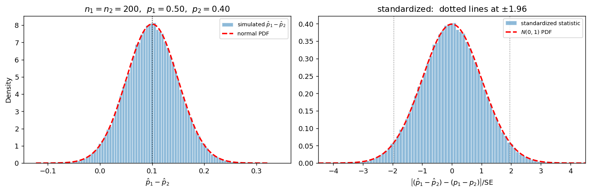

# p̂₁ - p̂₂의 표본분포 (정규근사가 듣는 경우)

## 개요

두 집단의 비율을 비교하는 일은 통계학에서 가장 자주 하는 일 가운데 하나다. 신약과 위약, 새 화면과 옛 화면, 두 지역의 지지율. 이때 관심 통계량은 차 $\hat p_1 - \hat p_2$이고, 그 표본분포를 알아야 신뢰구간과 검정을 만들 수 있다.

[이론 페이지](diff_proportions.md)에서 공식을 이미 정리했다. 이 페이지는 그 공식이 **정말로 맞는지**를 수치로 확인한다. 중심이 $p_1 - p_2$에 있는가, 폭이 $\sqrt{p_1q_1/n_1 + p_2q_2/n_2}$인가, 모양이 정규라서 명목 95% 구간이 실제로 95%를 담는가.

기대도수가 모두 충분히 크면 세 가지가 모두 잘 맞는다. 이 페이지는 그 "잘 맞는" 쪽을 본다. [다음 페이지](diff_props_small.md)는 반대쪽, 곧 기대도수가 작아 모든 것이 어긋나는 경우를 본다.

## 설정

$$
X_1 \sim \text{Binomial}(200,\ 0.50), \qquad X_2 \sim \text{Binomial}(200,\ 0.40)
$$

두 표본은 독립이고 $\hat p_i = X_i/n_i$이며 참 차는 $p_1 - p_2 = 0.10$이다. 기대도수 네 개를 먼저 본다.

$$
n_1p_1 = 100, \quad n_1q_1 = 100, \quad n_2p_2 = 80, \quad n_2q_2 = 120
$$

네 값이 모두 5보다 훨씬 크다. 흔히 쓰는 타당성 조건을 넉넉히 만족하므로 정규근사가 잘 들을 것으로 기대된다.

## 표본분포 이론

### 평균과 분산

$\hat p_i$는 이항을 $n_i$로 나눈 것이므로

$$
E[\hat p_i] = p_i, \qquad \text{Var}(\hat p_i) = \frac{p_iq_i}{n_i}
$$

이다($q_i = 1 - p_i$). 두 표본이 **독립**이므로 차의 분산은 분산의 합이다.

$$
E[\hat p_1 - \hat p_2] = p_1 - p_2, \qquad \text{Var}(\hat p_1 - \hat p_2) = \frac{p_1q_1}{n_1} + \frac{p_2q_2}{n_2}
$$

뺄셈인데 더하는 것이 어색해 보이지만 $\text{Var}(aX + bY) = a^2\text{Var}(X) + b^2\text{Var}(Y)$에 $a = 1$, $b = -1$을 넣으면 $(-1)^2 = 1$이므로 부호가 사라진다. **두 추정값의 불확실성은 어떻게 결합하든 쌓인다.**

이 설정에서는

$$
\text{Var} = \frac{0.50 \times 0.50}{200} + \frac{0.40 \times 0.60}{200} = 0.00245, \qquad \text{SE} = \sqrt{0.00245} = 0.04950
$$

### 정규근사

$X_i$는 베르누이 $n_i$개의 합이므로 중심극한정리가 각 표본에 따로 적용되고, 두 정규의 차는 다시 정규다. 따라서

$$
Z = \frac{(\hat p_1 - \hat p_2) - (p_1 - p_2)}{\sqrt{\dfrac{p_1q_1}{n_1} + \dfrac{p_2q_2}{n_2}}} \;\dot\sim\; N(0,1)
$$

이다. 실무에서는 $p_i$를 모르므로 분모의 $p_i$ 자리에 $\hat p_i$를 끼워 넣는다. 그렇게 추정한 표준오차로 폭을 잰 구간을 **왈드 구간**이라 부른다. 아래 예제들은 그 구간이 실제로 얼마를 담는지를 재어 근사의 품질을 진단한다.

### 합동과 비합동

신뢰구간과 검정이 **서로 다른 표준오차**를 쓴다는 점이 이 절에서 가장 혼란스러운 부분이다.

**신뢰구간에서는 비합동 표준오차를 쓴다.**

$$
\widehat{\text{SE}}_{\text{unpool}} = \sqrt{\frac{\hat p_1\hat q_1}{n_1} + \frac{\hat p_2\hat q_2}{n_2}}
$$

**$H_0: p_1 = p_2$ 검정에서는 합동 표준오차를 쓴다.**

$$
\hat p = \frac{X_1 + X_2}{n_1 + n_2}, \qquad \widehat{\text{SE}}_{\text{pool}} = \sqrt{\hat p(1-\hat p)\left(\frac{1}{n_1} + \frac{1}{n_2}\right)}
$$

이유는 한 문장으로 줄일 수 있다. **표준오차는 귀무가설이 참일 때의 흔들림을 재야 하고, 귀무가설은 $p_1 = p_2$를 주장한다.** 두 비율이 같다면 그 공통값 $p$의 가장 좋은 추정값은 두 표본을 합친 $\hat p = (X_1+X_2)/(n_1+n_2)$이다. 표본 하나만 쓰는 것보다 정보가 많으므로 더 정확한 표준오차가 된다.

반면 신뢰구간에는 귀무가설이 없다. $p_1 = p_2$라고 가정할 근거가 어디에도 없으므로 각 표본에서 각자의 비율을 추정해야 한다. **$p_1 = p_2$를 쓸 수 있는 것은 귀무가설 아래에서뿐이다.**

!!! note "그러면 얼마나 다른가"
    $p_1 = p_2$에 가까우면 두 표준오차가 거의 같다. $p_1 = 0.50$, $p_2 = 0.40$, $n = 200$에서 $\text{SE}_{\text{unpool}} = 0.04950$이고 $\text{SE}_{\text{pool}}\big|_{p=0.45} = 0.04975$로 0.5% 차이에 불과하다.

    그러나 두 비율이 멀어지면 크게 갈라진다. $p_1 = 0.90$, $p_2 = 0.10$이면 참 표준오차는 $0.03000$인데 합동 표준오차는 $0.05000$으로 **1.67배**다. 합동으로 신뢰구간을 만들면 구간이 지나치게 넓어진다(예제 4에서 확인한다).

    검정에서 합동을 쓰는 것은 귀무가설이 참일 때만 계산이 필요하므로 **정당하다**. 신뢰구간에서 합동을 쓰는 것은 검정하지 않을 것을 가정하는 셈이므로 **정당하지 않다**.

## 모의실험

<div class="codebox" markdown>

#### 예제 1. 표본분포를 눈으로 확인한다 { .eg }

```python
import matplotlib.pyplot as plt
import numpy as np
from scipy import stats

rng = np.random.default_rng(1)

n1 = n2 = 200
p1, p2 = 0.50, 0.40
mu = p1 - p2
sd = np.sqrt(p1 * (1 - p1) / n1 + p2 * (1 - p2) / n2)

B = 200_000
x1 = rng.binomial(n1, p1, B)
x2 = rng.binomial(n2, p2, B)
d = x1 / n1 - x2 / n2

fig, axes = plt.subplots(1, 2, figsize=(12, 4))

# (좌) 차 자체의 분포. n1 = n2 이므로 가능한 값은 1/200 = 0.005 의 배수다.
# 계급폭을 그 격자에 맞추어야 막대가 들쭉날쭉해지지 않는다.
ax = axes[0]
ax.hist(d, bins=np.arange(d.min() - 0.0025, d.max() + 0.0075, 0.005),
        density=True, alpha=0.5, edgecolor="white",
        label=r"simulated $\hat p_1-\hat p_2$")
g = np.linspace(mu - 4.5 * sd, mu + 4.5 * sd, 400)
ax.plot(g, stats.norm(mu, sd).pdf(g), "--r", lw=2, label="normal PDF")
ax.axvline(mu, color="k", lw=1, ls=":")
ax.set_xlabel(r"$\hat p_1 - \hat p_2$")
ax.set_ylabel("Density")
ax.set_title(r"$n_1=n_2=200$,  $p_1=0.50$,  $p_2=0.40$")
ax.legend(fontsize=8)

# (우) 참 표준오차로 표준화한 통계량. 계급폭 0.101 = 0.005 / SE 는
# 격자 간격을 z 눈금으로 옮긴 값이다.
ax = axes[1]
ax.hist((d - mu) / sd, bins=np.arange(-4.5, 4.55, 0.101), density=True,
        alpha=0.5, edgecolor="white", label="standardized statistic")
g = np.linspace(-4.5, 4.5, 400)
ax.plot(g, stats.norm.pdf(g), "--r", lw=2, label=r"$N(0,1)$ PDF")
for c in (-1.96, 1.96):
    ax.axvline(c, color="gray", lw=1, ls=":")
ax.set_xlabel(r"$\left[(\hat p_1-\hat p_2)-(p_1-p_2)\right]/\mathrm{SE}$")
ax.set_xlim(-4.5, 4.5)
ax.set_title("standardized:  dotted lines at $\\pm 1.96$")
ax.legend(fontsize=8)

plt.tight_layout()
plt.show()
```



히스토그램과 빨간 곡선이 사실상 구분되지 않는다. 왼쪽 그림에서 중심이 $0.10$에 있고, 오른쪽 그림에서 표준화한 통계량이 $N(0,1)$과 겹친다. 오른쪽 계급폭 $0.101$은 우연한 값이 아니다. 가능한 $\hat p_1 - \hat p_2$ 값의 간격 $0.005$를 표준오차 $0.04950$으로 나눈 값이며, **이 통계량이 실은 격자 위의 이산확률변수**라는 사실을 계급폭이 그대로 반영한다.

</div>

<div class="codebox" markdown>

#### 예제 2. 정확한 포함률 (모의실험이 아니라 전수 계산) { .eg }

$n_1 = n_2 = 200$이면 $(X_1, X_2)$의 조합이 $201 \times 201 = 40401$개뿐이다. 모의실험을 돌릴 필요 없이 **모든 조합에 이항 확률을 곱해** 정확한 값을 얻을 수 있다.

```python
import numpy as np
from scipy import stats

n1 = n2 = 200
p1, p2 = 0.50, 0.40
mu = p1 - p2
sd = np.sqrt(p1 * (1 - p1) / n1 + p2 * (1 - p2) / n2)
z975 = stats.norm.ppf(0.975)

k1 = np.arange(n1 + 1)
k2 = np.arange(n2 + 1)

# W[i, j] = P(X1 = i) * P(X2 = j). 두 표본이 독립이므로 곱이 된다.
W = np.outer(stats.binom.pmf(k1, n1, p1), stats.binom.pmf(k2, n2, p2))

X1, X2 = np.meshgrid(k1, k2, indexing="ij")
ph1, ph2 = X1 / n1, X2 / n2
d = ph1 - ph2

# 비합동 표준오차를 쓴 왈드 구간이 참값 mu 를 담는 칸을 골라낸다.
se = np.sqrt(ph1 * (1 - ph1) / n1 + ph2 * (1 - ph2) / n2)
inside = (d - z975 * se <= mu) & (mu <= d + z975 * se)

print(f"이론 평균 {mu:.4f},  실제 평균 {(W * d).sum():.4f}")
print(f"이론 표준오차 {sd:.5f},  실제 표준편차 {np.sqrt((W * (d - mu) ** 2).sum()):.5f}")
print(f"명목 95% 구간의 정확 포함률 {W[inside].sum():.4f}")
print(f"구간의 평균 폭 {(W * 2 * z975 * se).sum():.4f}")
```

출력:

```
이론 평균 0.1000,  실제 평균 0.1000
이론 표준오차 0.04950,  실제 표준편차 0.04950
명목 95% 구간의 정확 포함률 0.9504
구간의 평균 폭 0.1935
```

평균과 표준편차는 **근사가 아니라 정확히** 이론값과 같다. 애초에 근사가 들어간 곳은 모양뿐이기 때문이다. 포함률 $0.9504$는 명목 $0.95$와 0.04퍼센트포인트밖에 차이 나지 않는다.

</div>

<div class="codebox" markdown>

#### 예제 3. 꼬리는 얼마나 잘 맞는가 { .eg }

포함률은 하나의 숫자이므로 안쪽과 꼬리의 오차가 서로를 가려 줄 수 있다. 꼬리확률을 여러 지점에서 따로 본다.

```python
zstat = (d - mu) / sd

print("표준화한 통계량의 꼬리확률")
for c in (1.000, 1.960, 2.576):
    exact = W[np.abs(zstat) > c].sum()
    print(f"  P(|Z| > {c:.3f}) = {exact:.4f}   표준정규 {2 * (1 - stats.norm.cdf(c)):.4f}")
```

출력:

```
표준화한 통계량의 꼬리확률
  P(|Z| > 1.000) = 0.3372   표준정규 0.3173
  P(|Z| > 1.960) = 0.0487   표준정규 0.0500
  P(|Z| > 2.576) = 0.0099   표준정규 0.0100
```

실무에서 쓰는 두 지점($1.96$, $2.576$)은 소수 셋째 자리까지 맞는다. 그런데 $c = 1$에서는 $0.3372$ 대 $0.3173$으로 2퍼센트포인트나 어긋난다.

원인은 정규근사의 실패가 아니라 **이산성**이다. $c = 1$에 해당하는 경계 $0.10 + 0.04950 = 0.14950$은 격자점 $0.150 = 30/200$의 바로 왼쪽($0.00050$ 차이)에 있다. 그래서 $P(\hat p_1 - \hat p_2 = 0.150) = 0.0243$이라는 **덩어리 하나가 통째로 꼬리에 들어간다.** 이 덩어리를 폭 $0.005$에 고르게 펴 놓았다면 경계 오른쪽으로 넘어갈 몫은 60%뿐이므로 약 $0.0243 \times 0.4 = 0.0097$이 초과된다. 양쪽 꼬리를 합치면 $0.0194$이고, 관측된 차이 $0.3372 - 0.3173 = 0.0199$와 같은 크기다.

기대도수가 충분히 커도 이산성은 이렇게 남아 있다. [다음 페이지](diff_props_small.md)에서는 이 덩어리가 통계량 전체를 지배하게 된다.

</div>

<div class="codebox" markdown>

#### 예제 4. 합동과 비합동, 어느 쪽이 어디에 맞는가 { .eg }

$H_0: p_1 = p_2$ 검정의 실제 1종오류율과, 신뢰구간에 합동 표준오차를 잘못 썼을 때의 포함률을 함께 계산한다.

```python
ppool = (X1 + X2) / (n1 + n2)
se_pool = np.sqrt(ppool * (1 - ppool) * (1 / n1 + 1 / n2))

# 표준오차가 0 인 칸(두 표본이 모두 전원 성공 또는 전원 실패)은
# 차도 0 이므로 기각하지 않는 것으로 둔다.
z_pool = np.divide(d, se_pool, out=np.zeros_like(d), where=se_pool > 0)
z_unpool = np.divide(d, se, out=np.zeros_like(d), where=se > 0)

print("검정: 명목 유의수준 5% 의 실제 1종오류율")
for p in (0.05, 0.20, 0.40, 0.50):
    W0 = np.outer(stats.binom.pmf(k1, n1, p), stats.binom.pmf(k2, n2, p))
    print(f"  p1 = p2 = {p:.2f}:  합동 {W0[np.abs(z_pool) > z975].sum():.4f}"
          f"   비합동 {W0[np.abs(z_unpool) > z975].sum():.4f}")

print("신뢰구간: 명목 95% 의 실제 포함률")
for a, b in [(0.50, 0.40), (0.60, 0.40), (0.80, 0.20), (0.90, 0.10)]:
    Wab = np.outer(stats.binom.pmf(k1, n1, a), stats.binom.pmf(k2, n2, b))
    t = a - b
    ok = Wab[(d - z975 * se <= t) & (t <= d + z975 * se)].sum()
    bad = Wab[(d - z975 * se_pool <= t) & (t <= d + z975 * se_pool)].sum()
    print(f"  p1 = {a:.2f}, p2 = {b:.2f}:  비합동 {ok:.4f}   합동 {bad:.4f}")
```

출력:

```
검정: 명목 유의수준 5% 의 실제 1종오류율
  p1 = p2 = 0.05:  합동 0.0481   비합동 0.0489
  p1 = p2 = 0.20:  합동 0.0508   비합동 0.0509
  p1 = p2 = 0.40:  합동 0.0482   비합동 0.0497
  p1 = p2 = 0.50:  합동 0.0510   비합동 0.0510
신뢰구간: 명목 95% 의 실제 포함률
  p1 = 0.50, p2 = 0.40:  비합동 0.9504   합동 0.9513
  p1 = 0.60, p2 = 0.40:  비합동 0.9474   합동 0.9536
  p1 = 0.80, p2 = 0.20:  비합동 0.9460   합동 0.9853
  p1 = 0.90, p2 = 0.10:  비합동 0.9494   합동 0.9987
```

**검정에서는 두 방식이 사실상 같다.** $H_0$가 참이면 $\hat p_1$과 $\hat p_2$가 모두 공통값 $p$에 가까우므로 합동과 비합동이 같은 값으로 수렴하기 때문이다. 합동을 권하는 이유는 그 수렴이 더 빠르다는 것뿐이다.

**신뢰구간에서는 사정이 다르다.** 비합동 구간은 어느 조합에서든 $0.95$ 근처를 지키지만, 합동 구간은 두 비율이 멀어질수록 $0.9853$, $0.9987$로 치솟는다. 구간이 명목보다 훨씬 넓다는 뜻이다. 필요 이상으로 넓은 구간은 안전해 보이지만 **아무것도 말해 주지 않는 구간**이기도 하다.

</div>

## 해석

!!! note "주요 관찰"

    1. **중심과 폭은 근사가 아니다.** $E[\hat p_1 - \hat p_2] = p_1 - p_2$와 $\text{Var} = p_1q_1/n_1 + p_2q_2/n_2$는 표본크기와 무관하게 정확히 성립한다. 정규근사가 개입하는 곳은 **모양**뿐이다.
    2. **기대도수가 크면 모양도 잘 맞는다.** 네 기대도수가 $80$ 이상인 이 설정에서 명목 95% 왈드 구간의 정확 포함률이 $0.9504$, 명목 5% 검정의 정확 크기가 $0.048$에서 $0.051$ 사이다. 실용적으로는 완벽하다.
    3. **이산성은 사라지지 않고 숨어 있을 뿐이다.** $c = 1.96$에서는 보이지 않던 오차가 $c = 1$에서는 2퍼센트포인트로 나타난다. 임계값이 격자점 옆에 놓이면 덩어리 하나가 통째로 움직이기 때문이다.
    4. **합동과 비합동은 쓰는 자리가 다르다.** 합동은 $p_1 = p_2$를 **가정**하므로 그 가정을 검정할 때만 쓸 수 있다. 신뢰구간에 합동을 쓰면 두 비율이 멀어질수록 구간이 부풀어 포함률이 $0.999$에 이른다.

## 이 근사가 기대는 것

수치가 이렇게 좋았던 것은 설정이 좋았기 때문이다. 무엇을 전제했고 그 전제가 무너지면 무엇이 달라지는지 정리해 두자.

전제는 셋이다. 각 표본 안에서 관측이 독립이고 성공확률이 일정할 것($X_i$가 이항이 되는 근거다), 두 표본이 서로 독립일 것(분산을 더하는 단 한 단계에서 쓰인다), 그리고 기대도수가 정규근사를 견딜 만큼 클 것. 앞의 둘이 깨지면 중심이나 폭 자체가 틀리므로 계산을 처음부터 다시 해야 한다. 반면 셋째가 깨져도 **중심과 폭은 그대로 맞고 모양만 어긋난다.** 예제 2에서 평균과 표준편차가 이론값과 소수점까지 같았던 것이 그 증거다.

그러면 모양은 표본을 키우면 좋아지는가. 좋아진다. $\hat p_1 - \hat p_2$는 관측값을 그대로 더해 만든 1차 적률 계열의 통계량이라 **중심극한정리가 구해 준다.** 5.6절의 $S^2$이나 5.9절의 $S_1^2/S_2^2$처럼 정리의 전제가 어그러져 표본을 키울수록 오히려 나빠지는 통계량과는 처지가 다르다. 여기서는 표본이 답이다.

다만 단서가 둘 붙는다. 이 쪽의 수치가 이미 그것을 보여 주었다.

첫째, **이산성이 남는다.** 기대도수가 $80$ 이상인 이 넉넉한 설정에서도 $P(|Z| > 1)$이 $0.3372$ 대 $0.3173$으로 2퍼센트포인트 어긋났다. 가능한 값이 $0.005$ 간격의 격자 위에만 놓이고 임계값이 하필 격자점 바로 옆에 떨어졌기 때문이다. 격자 간격은 $z$ 눈금에서 $1/\sqrt n$에 비례해 줄어들 뿐 0이 되지는 않으므로, 이 어긋남은 작아질 뿐 없어지지 않는다.

둘째, **오차가 두 집단에서 더해진다.** 조건이 $n_ip_i$와 $n_iq_i$ 네 개 모두에 걸리는 이유가 이것이다. 한 집단이 아무리 넉넉해도 다른 집단이 부실하면 차의 표본분포는 부실한 쪽을 따라간다. 차의 분산이 두 분산의 합이라는 사실이 근사의 오차에도 그대로 적용되는 셈이다.

문턱값은 [4.2절의 약속](../../ch04/discrete_distributions/binomial.md#언제-쓸-수-있는가-5와-10)을 따른다. 봉우리의 모양만 눈으로 보려면 $n_ip_i \geq 5$로 족하지만, 구간의 포함률이나 검정의 오류율까지 명목값에 맞추려면 $10$을 본다. 연습문제 5에서 기대도수를 낮춰 가며 그 경계를 직접 확인한다. 두 비율의 차는 오차가 두 겹이므로 한 비율일 때보다 넉넉하게 잡는 편이 안전하다.

어긋남의 대가는 이 쪽의 수치가 그대로 말해 준다. 기대도수가 클 때 명목 95% 구간은 $0.9504$를 담고 명목 5% 검정은 $0.048$에서 $0.051$을 쓴다. 이 값들이 명목에서 멀어지는 만큼이 대가이며, 조건을 아래로 내려가면 얼마나 멀어지는지를 [다음 쪽](diff_props_small.md)에서 본다.

## 연습문제

<div class="drillbox" markdown>

**연습문제 1.** <span class="diff easy" title="쉬움"></span>
$n_1 = n_2 = 200$, $p_1 = 0.50$, $p_2 = 0.40$에서 $\text{SE}(\hat p_1 - \hat p_2)$를 손으로 계산하고, 네 기대도수를 적어 정규근사의 타당성 조건을 확인하라.

</div>

??? success "풀이"
    분산을 더한다.

    $$
    \text{Var}(\hat p_1 - \hat p_2) = \frac{0.50 \times 0.50}{200} + \frac{0.40 \times 0.60}{200} = \frac{0.25 + 0.24}{200} = \frac{0.49}{200} = 0.00245
    $$

    $$
    \text{SE} = \sqrt{0.00245} = 0.04950
    $$

    기대도수는

    $$
    n_1p_1 = 100,\quad n_1q_1 = 100,\quad n_2p_2 = 80,\quad n_2q_2 = 120
    $$

    으로 네 값이 모두 5보다 훨씬 크다. 조건이 넉넉히 충족된다.

    **눈여겨볼 점.** $p(1-p)$는 $p = 0.5$에서 최대 $0.25$이고 $p = 0.4$에서 $0.24$로 거의 차이가 없다. $p$가 $0.3$과 $0.7$ 사이이면 $0.21$에서 $0.25$ 사이에 머물므로 표준오차가 $p$에 거의 의존하지 않는다. 표본크기 계산에서 $p$를 모를 때 $0.5$를 쓰는 관행이 여기서 나온다.

<div class="drillbox" markdown>

**연습문제 2.** <span class="diff med" title="중간"></span>
$E[\hat p_1 - \hat p_2] = p_1 - p_2$와 $\text{Var}(\hat p_1 - \hat p_2) = p_1q_1/n_1 + p_2q_2/n_2$가 표본크기에 관계없이 **정확히** 성립함을 보여라. 그렇다면 정규근사는 정확히 무엇을 근사하는가?

</div>

??? success "풀이"
    $X_i \sim \text{Binomial}(n_i, p_i)$이므로 $E[X_i] = n_ip_i$, $\text{Var}(X_i) = n_ip_iq_i$이고

    $$
    E[\hat p_i] = \frac{E[X_i]}{n_i} = p_i, \qquad \text{Var}(\hat p_i) = \frac{\text{Var}(X_i)}{n_i^2} = \frac{p_iq_i}{n_i}
    $$

    이다. 기댓값은 선형이고 독립이면 공분산이 0이므로

    $$
    E[\hat p_1 - \hat p_2] = p_1 - p_2, \qquad \text{Var}(\hat p_1 - \hat p_2) = \frac{p_1q_1}{n_1} + \frac{p_2q_2}{n_2}
    $$

    이다. 어디에도 근사가 없으며 $n_i = 1$이어도 성립한다. $\square$

    **근사는 모양에만 쓰인다.** $\hat p_1 - \hat p_2$의 참 분포는 두 이항분포의 차를 척도변환한 것으로, $n_1 = n_2 = n$이면 $\{-1, -1+1/n, \dots, 1\}$ 위의 이산분포다. 이 이산분포를 연속분포로 바꾸어 읽는 것이 근사의 전부다. 예제 2에서 평균과 표준편차는 소수점까지 맞고 포함률만 $0.9504$로 어긋난 이유가 이것이며, 어긋나는 것은 언제나 **확률을 읽는 방식**이다.

<div class="drillbox" markdown>

**연습문제 3.** <span class="diff med" title="중간"></span>
검정에서는 합동 표준오차를 쓰는데 신뢰구간에서는 쓰지 않는 이유를 설명하라. 신뢰구간에 합동을 쓰면 무엇이 잘못되는가?

</div>

??? success "풀이"
    **검정.** 검정은 "$H_0$가 참이라면 이만한 차가 얼마나 흔한가"를 묻는다. 확률을 계산하는 무대가 $H_0$ 아래이므로 표준오차도 $H_0$ 아래에서 재야 한다. $H_0: p_1 = p_2 = p$라면 공통값 $p$의 최량 추정값은 두 표본을 합친 $\hat p = (X_1+X_2)/(n_1+n_2)$이며, 자료를 두 배 쓰므로 표준오차가 더 안정적이다.

    **신뢰구간.** 신뢰구간은 $p_1 - p_2$가 무엇이든 $95\%$를 담아야 하는 물건이므로 어떤 값도 가정할 수 없다. 특히 $p_1 - p_2 = 0$은 신뢰구간이 **판정해야 할 대상**이니, 그것을 재료로 쓰면 순환논법이 된다.

    **무엇이 잘못되는가.** $n_1 = n_2$이면 합동 표준오차는 $\bar p = (p_1+p_2)/2$를 써서 $\sqrt{2\bar p\bar q/n}$에 수렴한다. $p(1-p)$가 오목함수이므로 옌센 부등식에 따라

    $$
    \bar p\bar q \ge \frac{p_1q_1 + p_2q_2}{2}
    $$

    이고, 등호는 $p_1 = p_2$에서만 성립한다. **합동 표준오차는 언제나 참 표준오차보다 크거나 같다.** 따라서 합동으로 만든 구간은 항상 지나치게 넓고 두 비율이 멀어질수록 더 넓어진다($p_1=0.80$, $p_2=0.20$에서 $\bar p\bar q = 0.25$ 대 $0.16$, 포함률 $0.9853$).

    넓은 구간은 무해하지 않다. 대응하는 검정의 검정력이 낮아지고, 보고된 불확실성이 실제보다 커져 자료가 준 정보를 버리게 된다.

<div class="drillbox" markdown>

**연습문제 4.** <span class="diff med" title="중간"></span>
예제 3에서 $P(|Z| > 1) = 0.3372$가 표준정규의 $0.3173$보다 큰 이유를 설명하라. 이 오차를 줄이는 방법이 있는가?

</div>

??? success "풀이"
    $n_1 = n_2 = 200$이면 $\hat p_1 - \hat p_2 = (X_1 - X_2)/200$이므로 가능한 값이 $0.005$ 간격의 격자 위에 있고, 표준오차 $0.04950$으로 나누면 격자 간격이 $z$ 눈금으로 $0.005/0.04950 = 0.1010$이 된다. 경계 $0.14950$은 격자점 $0.150$의 왼쪽, 간격의 10%밖에 안 되는 거리에 놓인다. 그래서 확률 $0.0243$짜리 덩어리가 통째로 꼬리로 넘어가고, 예제 3에서 본 $0.0194$의 초과가 생긴다.

    **줄이는 방법.** 첫째, **연속성 수정**으로 경계를 격자 반칸만큼 밀어 덩어리를 나눈다. 다만 평균적으로 지나치게 보수적이라는 비판을 받는다. 둘째, **표본을 키운다.** $z$ 눈금의 격자 간격은 $1/\sqrt n$에 비례해 줄어들므로 $n = 200$의 $0.101$이 $n = 2000$에서는 $0.032$가 된다. 셋째, **이항 확률을 그대로 쓴다.** 예제 2와 4가 한 일이다.

    **오차는 근사의 질이 아니라 임계값의 위치에 달렸다.** 임계값이 격자점 중간에 떨어지면 오차가 거의 0이 되고, 격자점 옆에 떨어지면 최대가 된다. 그래서 $c = 1.96$에서는 잘 맞고 $c = 1$에서는 어긋난다. 이 현상이 극단으로 치달으면 다음 페이지의 톱니 그래프가 된다.

<div class="drillbox" markdown>

**연습문제 5.** <span class="diff med" title="중간"></span>
예제 4는 $p_1 = p_2$를 $0.05$까지만 낮추어 보았다. $n_1 = n_2 = 200$을 그대로 두고 $p$를 더 낮춰 기대도수 $np$를 $10, 5, 2, 1$로 만들면 명목 5% 검정의 정확 크기는 어떻게 되는가? 4.2절의 두 문턱값이 이 표에서 어떻게 확인되는가?

</div>

??? success "풀이"
    예제 4의 코드에서 $p$만 바꾸면 된다. 전수 계산이므로 모의오차가 없다.

    | $p$ | $np$ | 합동 | 비합동 |
    |---|---|---|---|
    | 0.050 | 10 | 0.0481 | 0.0489 |
    | 0.025 | 5 | 0.0459 | 0.0459 |
    | 0.010 | 2 | 0.0405 | 0.0405 |
    | 0.005 | 1 | 0.0138 | 0.0138 |

    첫 줄이 예제 4의 출력과 일치하는 것이 검산이다.

    **문턱값이 그대로 확인된다.** $np = 10$에서는 $0.048$로 명목 $0.05$와 사실상 같다. $5$로 내려가면 $0.046$, $2$에서 $0.041$, $1$에서 $0.014$다. 모양만 눈으로 볼 때는 5로 족하지만 **오류율을 명목에 맞추려면 10이 필요하다**는 4.2절의 약속이 숫자로 나타난 것이다.

    **방향은 보수적이다.** 명목보다 덜 기각하므로 1종오류만 보면 안전해 보인다. 그러나 안전한 것이 아니라 **자기가 몇 %짜리 검정인지 모르는 것**이다. 실제 수준이 $0.014$라면 기각역이 명목보다 훨씬 좁다는 뜻이고, 참으로 두 비율이 다를 때 그것을 잡아낼 힘도 그만큼 줄어든다.

    원인은 정규근사의 실패라기보다 **이산성**이다. $np$가 작으면 $\hat p_1 - \hat p_2$가 실질적으로 취하는 값이 0 언저리의 몇 개로 줄어들어 달성 가능한 확률이 띄엄띄엄해진다. 그 띄엄띄엄한 값 가운데 명목 $0.05$에 맞아떨어지는 것이 있을 이유가 없다.

    표의 두 열이 거의 같다는 점도 눈여겨볼 만하다. 귀무가설이 참인 자리에서는 합동과 비합동이 같은 값으로 모이므로, 어긋남은 두 표준오차의 선택이 아니라 이산성에서 온다.

<div class="drillbox" markdown>

**연습문제 6.** <span class="diff hard" title="어려움"></span>
$n_1 = n_2 = 200$이면 $\hat p_1 - \hat p_2$가 $0.005$ 간격의 격자 위에 놓인다. $n_1 = 200$, $n_2 = 150$이면 격자가 어떻게 되는가? 그 경우의 $P(|Z| > 1)$을 등크기일 때와 견주어라($p_1 = 0.50$, $p_2 = 0.40$은 그대로 둔다).

</div>

??? success "풀이"
    **격자.** 통분하면

    $$
    \hat p_1 - \hat p_2 = \frac{k_1}{200} - \frac{k_2}{150} = \frac{3k_1 - 4k_2}{600}
    $$

    이고 $3k_1 - 4k_2$는 정수를 모두 만들 수 있으므로($3 \times (-1) - 4 \times (-1) = 1$) 격자 간격이 $1/600 = 0.001667$이다. $200$과 $150$의 최소공배수가 $600$이기 때문이며, 등크기일 때의 $1/200$보다 세 배 촘촘하다.

    표준오차는 $\sqrt{0.25/200 + 0.24/150} = 0.05339$이므로 $z$ 눈금으로 옮긴 격자 간격은 $0.001667/0.05339 = 0.0312$다. 전수 계산으로 꼬리확률을 재면 다음과 같다.

    | 설정 | $z$ 눈금의 격자 간격 | $P(\lvert Z\rvert > 1)$ | 표준정규 $0.3173$과의 차 |
    |---|---|---|---|
    | $n_1 = n_2 = 200$ | 0.1010 | 0.3372 | $+0.0199$ |
    | $n_1 = 200,\ n_2 = 150$ | 0.0312 | 0.3105 | $-0.0068$ |
    | $n_1 = n_2 = 2000$ | 0.0319 | 0.3143 | $-0.0030$ |

    **표본을 늘리지 않고도 이산성이 줄었다.** 오히려 $n_2$를 $50$명 줄였는데 어긋남이 $0.0199$에서 $0.0068$로 작아졌다. 격자가 촘촘해지면 어느 한 덩어리도 경계를 통째로 넘나들지 못하기 때문이다. 표본을 열 배로 키워 얻는 격자 간격 $0.032$를 $n_2$를 줄이는 것만으로 얻은 셈이다.

    **그렇다고 불균형 설계를 권하는 것은 아니다.** 이산성은 근사의 한 축일 뿐이다. $n_2$를 줄이면 표준오차가 $0.04950$에서 $0.05339$로 커지고 기대도수도 함께 줄어드니, 표본분포의 폭은 넓어지고 조건은 빠듯해진다. 여기서 얻을 교훈은 설계 지침이 아니라 원인의 정체다. **이산성에서 오는 오차는 근사의 질이 아니라 격자의 성김과 임계값의 위치가 정한다.**


<div class="drillbox" markdown>

**연습문제 7.** <span class="diff hard" title="어려움"></span>
$\hat p$ 하나에서는 **연속성 수정**이 근사를 개선했다(5.5절). 두 비율의 차에서도 그런가? $n_1=n_2=25$에서 수정 유무에 따른 실제 제1종 오류율을 비교하라.

</div>

??? success "풀이"
    차에 대한 연속성 수정은 $|\hat p_1-\hat p_2|$에서 $\frac12(1/n_1+1/n_2)$를 빼는 형태다.

    ```python
    import numpy as np

    rng = np.random.default_rng(0)
    z = 1.959964
    n1 = n2 = 25
    REP = 200_000
    for p in (0.3, 0.5):
        a = rng.binomial(n1, p, REP) / n1
        b = rng.binomial(n2, p, REP) / n2
        pool = (a*n1 + b*n2) / (n1 + n2)
        se = np.sqrt(pool*(1-pool)*(1/n1 + 1/n2))
        ok = se > 0
        Z = np.zeros(REP); Z[ok] = (a[ok] - b[ok]) / se[ok]
        cc = np.zeros(REP)
        d = np.abs(a - b) - 0.5*(1/n1 + 1/n2)
        cc[ok] = np.maximum(d[ok], 0) / se[ok]
        print(f"  p={p}: 수정없음 {np.mean(np.abs(Z)>z):.4f}   "
              f"연속성수정 {np.mean(cc>z):.4f}")
    ```

    출력:

    ```
      p=0.3: 수정없음 0.0536   연속성수정 0.0228
      p=0.5: 수정없음 0.0655   연속성수정 0.0335
    ```

    **연속성 수정이 지나치게 보수적이다.** $p=0.3$에서 $0.0536$이던 오류율이 $0.0228$로 **명목의 절반 이하**로 떨어진다. 수정하지 않은 쪽이 오히려 $0.05$에 가깝다.

    **하나짜리 비율과 사정이 다른 이유.** $\hat p$ 하나에서는 격자 간격이 $1/n$이고 수정량 $\frac{1}{2n}$이 정확히 격자의 절반이라 잘 맞았다. 그런데 **차 $\hat p_1-\hat p_2$의 격자는 훨씬 촘촘하다.** $n_1=n_2=25$이면 차가 $1/25 = 0.04$ 간격이 아니라 두 격자의 차이라 더 조밀하고, 게다가 값마다 확률이 다르다. $\frac12(1/n_1+1/n_2) = 0.04$를 빼는 것은 **과한 보정**이다.

    | | 격자 간격 | 수정량 | 결과 |
    |---|---|---|---|
    | $\hat p$ 하나 | $1/n$ | $\frac{1}{2n}$ | 잘 맞음 |
    | 차 $\hat p_1-\hat p_2$ | 더 조밀 | $\frac12(1/n_1+1/n_2)$ | **과보정** |

    **실무 권고.** 두 비율의 차에는 연속성 수정을 쓰지 않는 것이 일반적이다. 정확한 판정이 필요하면 수정 대신 **피셔 정확검정**이나 **바너드 검정**으로 가는 것이 낫다(다음 쪽). `scipy.stats.chi2_contingency`가 $2\times2$에서 예이츠 보정을 기본으로 걸어 두는 것도 같은 이유로 논란이 있으며, 많은 통계학자가 `correction=False`를 권한다.

    **일반 교훈.** 한 상황에서 잘 듣는 보정이 비슷해 보이는 다른 상황에서도 잘 들으리라는 보장이 없다. **보정은 그것이 유도된 조건 안에서만 타당하다.**

<div class="drillbox" markdown>

**연습문제 8.** <span class="diff med" title="중간"></span>
$\hat p_1 - \hat p_2$의 정규근사는 **차**의 척도에서 평가했다. 같은 자료를 **로그 오즈비** 척도에서 보면 근사가 나아지는가? $n_1=n_2=50$, $p_1=p_2=0.1$에서 두 통계량의 왜도를 비교하라.

</div>

??? success "풀이"
    ```python
    import numpy as np
    from scipy import stats

    rng = np.random.default_rng(1)
    n1 = n2 = 50
    p = 0.1
    REP = 300_000
    k1 = rng.binomial(n1, p, REP)
    k2 = rng.binomial(n2, p, REP)

    d = k1/n1 - k2/n2
    ok = (k1 > 0) & (k1 < n1) & (k2 > 0) & (k2 < n2)
    lor = np.log((k1[ok]*(n2-k2[ok])) / ((n1-k1[ok])*k2[ok]))

    print(f"  차      : 왜도 {stats.skew(d):+.4f}   첨도 {stats.kurtosis(d, fisher=False):.4f}")
    print(f"  로그오즈비: 왜도 {stats.skew(lor):+.4f}   첨도 {stats.kurtosis(lor, fisher=False):.4f}")
    print(f"  (로그오즈비 계산 가능한 비율: {ok.mean():.4f})")
    ```

    출력:

    ```
      차      : 왜도 +0.0024   첨도 3.0380
      로그오즈비: 왜도 +0.0057   첨도 3.3970
      (로그오즈비 계산 가능한 비율: 0.9897)
    ```

    **$p_1 = p_2$이면 둘 다 거의 대칭이다.** 왜도가 $0.006$ 이하로, 두 집단이 대칭적으로 들어가므로 차의 왜도가 상쇄된다. 이 쪽 연습문제 2에서 본 성질이다.

    **그런데 첨도는 로그 오즈비 쪽이 더 크다**($3.40$ 대 $3.04$). 분모에 들어가는 $k_2$가 작을 때 로그 오즈비가 크게 튀기 때문이며, $p=0.1$이라 $k_2$가 한 자릿수인 경우가 흔하다. **로그 변환이 왜도는 잡아도 꼬리까지 얇게 만들지는 않는다.**

    **그리고 로그 오즈비에는 계산 자체의 문제가 있다.** $k_1$이나 $k_2$가 $0$이면 오즈비가 $0$ 또는 $\infty$가 되어 **로그를 취할 수 없다.** 위에서 계산 가능한 비율이 $0.9897$로 $100\%$가 아닌 것이 그 때문이며, $p$가 더 작거나 $n$이 작으면 이 비율이 크게 떨어진다.

    | | 차 | 로그 오즈비 |
    |---|---|---|
    | 언제나 계산되나 | **그렇다** | 아니다($k=0$ 문제) |
    | 범위 | $[-1,1]$ — 경계 있음 | $(-\infty,\infty)$ |
    | $p_1 \ne p_2$일 때 대칭성 | 나빠진다 | **유지된다** |

    **$p_1 \ne p_2$일 때 차이가 드러난다.** 차는 참값이 $0$에서 멀어질수록 경계 효과로 분포가 치우치지만, 로그 오즈비는 그렇지 않다. 그래서 **연구 간 통합이나 회귀에서는 로그 오즈비**를 쓰고, **단일 연구의 보고에는 차**를 쓰는 관행이 자리 잡았다.

    **$k=0$ 문제의 표준 대처는 $0.5$씩 더하는 것이다**(하네스–헐 보정). 5.5절 희귀사건 문서 연습문제 10에서 쓴 방법이며, 편향을 조금 넣는 대신 계산 가능성을 얻는다.

<div class="drillbox" markdown>

**연습문제 9.** <span class="diff med" title="중간"></span>
두 비율의 차를 검정할 때 **합동 표준오차**를 쓰면(이 쪽 연습문제 3) 검정력이 어떻게 달라지는가? 합동과 비합동 표준오차를 쓴 두 검정의 오류율과 검정력을 비교하라.

</div>

??? success "풀이"
    ```python
    import numpy as np

    rng = np.random.default_rng(2)
    z = 1.959964
    n1 = n2 = 100
    REP = 200_000

    def rates(p1, p2):
        k1 = rng.binomial(n1, p1, REP); k2 = rng.binomial(n2, p2, REP)
        a, b = k1/n1, k2/n2
        pool = (k1 + k2) / (n1 + n2)
        se_p = np.sqrt(pool*(1-pool)*(1/n1 + 1/n2))
        se_u = np.sqrt(a*(1-a)/n1 + b*(1-b)/n2)
        rp = np.mean(np.abs(a-b) > z*np.where(se_p > 0, se_p, np.inf))
        ru = np.mean(np.abs(a-b) > z*np.where(se_u > 0, se_u, np.inf))
        return rp, ru

    print(f"{'p1,p2':>12}{'합동':>10}{'비합동':>10}")
    for p1, p2 in [(0.3,0.3), (0.5,0.5), (0.3,0.45), (0.1,0.2)]:
        rp, ru = rates(p1, p2)
        print(f"{f'{p1},{p2}':>12}{rp:>10.4f}{ru:>10.4f}")
    ```

    출력:

    ```
           p1,p2        합동       비합동
         0.3,0.3    0.0508    0.0527
         0.5,0.5    0.0560    0.0560
        0.3,0.45    0.5947    0.5982
         0.1,0.2    0.5184    0.5184
    ```

    **차이가 생각보다 작다.** $(0.3,0.3)$에서 합동 $0.0508$, 비합동 $0.0527$로 합동이 조금 낫지만, $(0.5,0.5)$에서는 **두 값이 똑같이 $0.0560$**이다. $n_1=n_2$이고 $p=0.5$이면 두 표준오차가 거의 같아져 판정이 갈리는 표가 사실상 없기 때문이다.

    **이유는 귀무가설을 실제로 쓰기 때문이다.** $H_0: p_1=p_2$가 참이면 두 표본이 같은 모집단에서 온 것이므로, 둘을 합쳐 $p$를 추정하는 편이 **자유도를 더 쓰는 것**이라 정밀하다. 5.6절 윌슨 구간에서 본 "추정값 대신 가설값으로 표준오차를 계산하라"는 점수 검정의 원리와 같다.

    **대립가설 아래에서도 거의 같다.** 검정력이 $0.5947$ 대 $0.5982$이고, $(0.1,0.2)$에서는 완전히 같다. **실무적으로는 어느 쪽을 써도 결과가 거의 달라지지 않는다.**

    **그래서 관행이 갈린다.**

    | | 검정 | 신뢰구간 |
    |---|---|---|
    | 표준오차 | **합동**($H_0$ 아래) | **비합동** |
    | 이유 | 귀무가설이 참이라는 전제에서 계산 | 특정 $H_0$를 전제하지 않음 |

    **이 불일치가 혼란을 부른다.** 검정은 유의한데 신뢰구간은 $0$을 포함하는(또는 그 반대의) 일이 드물게 생긴다. 두 절차가 **다른 표준오차**를 쓰기 때문이며, 논리적 모순이 아니라 설계의 차이다. 보고할 때는 어느 쪽을 썼는지 밝히는 것이 좋다.

<div class="drillbox" markdown>

**연습문제 10.** <span class="diff hard" title="어려움"></span>
$\hat p_1 - \hat p_2$이 놓이는 **격자**를 따져 보자. $n_1=n_2=200$이면 간격이 $0.005$로 고르지만 $n_1=200$, $n_2=150$이면 어떻게 되는가? 이 불균일이 신뢰구간에 어떤 영향을 주는가?

</div>

??? success "풀이"
    **격자는 두 분모의 최소공배수가 정한다.** $\hat p_1 - \hat p_2 = k_1/n_1 - k_2/n_2$이므로 가능한 값은

    $$
    \frac{k_1 n_2 - k_2 n_1}{n_1n_2}
    $$

    의 형태다. $n_1=n_2=200$이면 분모가 $200$으로 약분되어 간격 $1/200 = 0.005$의 **균일 격자**다.

    ```python
    from math import gcd

    # 부동소수점으로 세면 수학적으로 같은 값이 미세하게 달라져 과대계수된다.
    # 정수 산술로 (k1*n2 - k2*n1)/(n1*n2) 를 약분해 센다.
    for n1, n2 in [(200,200), (200,150), (200,151)]:
        g = gcd(n1, n2)
        L = n1 * n2 // g
        vals = {(k1*n2 - k2*n1) // g
                for k1 in range(n1+1) for k2 in range(n2+1)}
        print(f"  n1={n1}, n2={n2}: gcd={g:>3}  간격 1/{L} = {1/L:.6f}  "
              f"서로 다른 값 {len(vals):,}개")
    ```

    출력:

    ```
      n1=200, n2=200: gcd=200  간격 1/200 = 0.005000  서로 다른 값 401개
      n1=200, n2=150: gcd= 50  간격 1/600 = 0.001667  서로 다른 값 1,195개
      n1=200, n2=151: gcd=  1  간격 1/30200 = 0.000033  서로 다른 값 30,551개
    ```

    (부동소수점 `np.unique`로 세면 수학적으로 같은 값이 미세하게 달라져 $200,200$에서도 $1{,}293$개가 나온다. **이산 구조를 다룰 때는 정수 산술로 세야 한다.**)

    **$n_2$를 $150$에서 $151$로 하나만 바꾸면 격자가 $50$배 조밀해진다.** $\gcd(200,150)=50$인데 $\gcd(200,151)=1$이기 때문이다. **표본크기의 정수론적 성질이 격자를 좌우한다.**

    **그러나 격자가 조밀하다고 포함률이 좋아지지는 않는다.** 값의 개수는 늘어나도 **확률질량은 여전히 몇 개 값에 몰려 있다.** $30{,}401$개 값 중 대부분은 확률이 사실상 $0$이고, 실제로 일어나는 것은 $\hat p_1$과 $\hat p_2$가 각자의 평균 근처일 때의 조합뿐이다.

    **포함률의 톱니는 사라지지 않는다.** 5.6절에서 본 대로 톱니는 "어떤 $k$의 구간이 참값을 담느냐 마느냐"가 갑자기 바뀌는 데서 생기는데, 그 $k$들이 가진 **확률질량**이 문제이지 격자의 조밀함이 문제가 아니다.

    | | $n_2=150$ | $n_2=151$ |
    |---|---|---|
    | 격자 간격 | $0.00167$ | $0.000033$ |
    | 서로 다른 값 | $1{,}195$ | $30{,}551$ |
    | 포함률 톱니 | 있음 | **여전히 있음** |

    **실무적 함의는 소박하다.** 표본크기를 정할 때 $\gcd$를 신경 쓸 필요는 없다. 다만 **"$n$을 조금 늘렸는데 결과가 이상하게 달라졌다"**는 경험의 배경에 이런 이산 구조가 있다는 것은 알아 둘 만하다. 근본적인 해결은 격자를 조작하는 것이 아니라 **이산성을 제대로 다루는 구간**(윌슨, 뉴콤)을 쓰는 것이다.

---

## 정리하며

- $\hat p_1 - \hat p_2$의 평균 $p_1 - p_2$와 분산 $p_1q_1/n_1 + p_2q_2/n_2$는 **모든 표본크기에서 정확**하다. 정규근사는 모양에만 개입한다.
- 기대도수 네 개가 모두 충분히 크면($80$ 이상) 명목 95% 왈드 구간의 정확 포함률이 $0.9504$, 명목 5% 검정의 정확 크기가 $0.048$에서 $0.051$ 사이다. 실무에서 걱정할 것이 없다.
- 이산성은 없어지지 않는다. 임계값이 확률 덩어리 옆에 놓이면 $c = 1$에서처럼 2퍼센트포인트가 어긋난다. 격자 간격은 $z$ 눈금으로 $1/\sqrt n$에 비례해 줄어든다.
- 기대도수를 낮추면 어긋남이 오류율로 나타난다. $np = 10$에서 명목 5% 검정의 정확 크기가 $0.048$이지만 $np = 5$에서 $0.046$, $np = 1$에서 $0.014$다. 모양을 보는 기준 5와 오류율까지 맞추는 기준 10의 차이가 여기에 있다.
- 검정의 **합동** 표준오차와 신뢰구간의 **비합동** 표준오차는 혼용할 수 없다. 합동은 $p_1 = p_2$를 가정하므로 그 가정을 검정할 때만 정당하고, 신뢰구간에 쓰면 구간이 부풀어 포함률이 $0.999$에 이른다.
- [다음 페이지](diff_props_small.md)에서는 $n_1 = n_2 = 30$, $p$가 작은 경우를 본다. 거기서는 여기서 잘 작동한 모든 것이 무너진다.

## 구간과 검정은 어디에서 다루는가

이 쪽이 한 일은 표본분포를 진단한 것이다. 중심과 폭이 이론값과 맞는지, 모양을 정규로 읽어도 되는지, 그 판단을 뒷받침하는 포함률과 오류율이 명목값을 지키는지까지다. 왈드 구간과 합동 표준오차가 여기 등장한 것도 그것들이 표본분포를 읽는 두 가지 방식이기 때문이지, 절차를 가르치려는 것이 아니다.

그 표본분포를 받아 실제로 구간을 벌리고 판정을 내리는 일은 [8.3절 $p_1-p_2$의 신뢰구간](../../ch08/two_sample_intervals/ci_p_diff.md)과 [9.3절 이표본 비율 검정](../../ch09/two_sample_tests/test_two_props.md)에서 한다. 근사가 완벽해도 검정이 유용하다는 보장은 없으므로, 주어진 표본으로 얼마만 한 차를 잡아낼 수 있는가 하는 물음은 따로 답해야 한다. 그것이 [9.5절 검정력 분석](../../ch09/errors_and_power/power.md)과 [8.5절 두 집단 비교를 위한 표본크기](../../ch08/sample_size/two_group_sample_size.md)의 몫이다.
