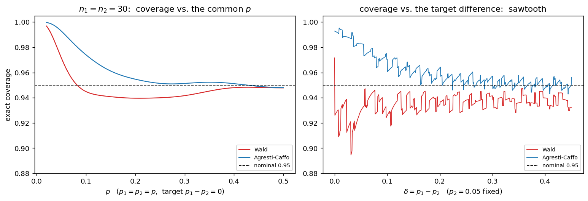
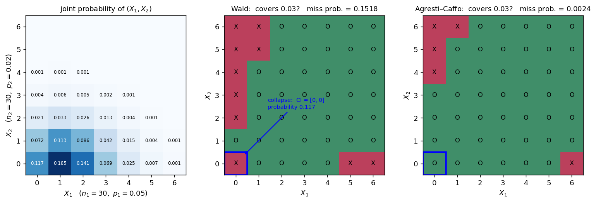

# p̂₁ - p̂₂의 표본분포 (작은 기대도수)

## 개요

[앞 페이지](diff_props_normal.md)에서는 $n_1 = n_2 = 200$, 기대도수 $80$ 이상인 설정에서 모든 것이 잘 맞았다. 명목 95% 구간의 정확 포함률이 $0.9504$, 명목 5% 검정의 정확 크기가 $0.05$ 근처였다.

이 페이지는 반대쪽이다. $n_1 = n_2 = 30$이고 $p$가 작으면 기대도수가 $1$에서 $2$ 사이로 떨어진다. 가장 너그럽게 잡은 느슨한 기준 $n_ip_i \ge 5$조차 명백히 깨지는 영역이며, 부작용 발생률·희귀사건·소규모 예비시험에서 실제로 자주 마주치는 상황이다.

여기서 벌어지는 일은 세 가지다.

1. 왈드 구간이 **한 점 $[0,0]$으로 붕괴**한다. 확률이 무시할 만큼 작지 않다.
2. 포함률이 참값의 위치에 따라 **톱니처럼 진동**한다.
3. 실제 오류율이 명목 $5\%$에서 크게 벗어난다. **보수적일 때도 있고 위험할 때도 있다.**

그리고 놀랍도록 값싼 처방이 있다. **각 표본에 성공 하나와 실패 하나를 더하는 것**만으로 거의 모든 문제가 해결된다.

## 설정

$$
X_1 \sim \text{Binomial}(30,\ p_1), \qquad X_2 \sim \text{Binomial}(30,\ p_2)
$$

기준 설정은 $p_1 = p_2 = 0.05$다. 기대도수를 보면 $n_ip_i = 1.5$, $n_iq_i = 28.5$로 성공 쪽이 $1.5$에 불과하다. 모양만 보는 느슨한 기준인 $5$조차 세 배 넘게 모자라고, 구간과 검정에 대야 할 보수적 기준 $10$과 견주면 여섯 배 넘게 모자란다. 이 페이지가 재는 것이 바로 그 포함률과 오류율이므로, 실제로 깨진 것은 더 엄한 쪽이다.

이보다 더 중요한 수가 하나 있다.

$$
P(X_i = 0) = 0.95^{30} = 0.2146, \qquad P(X_1 = X_2 = 0) = 0.2146^2 = 0.0461
$$

**한 표본에서 사건이 하나도 관측되지 않을 확률이 21%, 두 표본 모두 그럴 확률이 약 4.6%다.** 20번 중 한 번꼴로 일어나는 일이며, 이때 왈드 구간이 무너진다.

## 표본분포 이론

### 무엇이 고장 나고 무엇이 살아남는가

평균과 분산은 살아남는다. 앞 페이지에서 보았듯 이 두 식은 근사가 아니다.

$$
E[\hat p_1 - \hat p_2] = p_1 - p_2, \qquad \text{Var}(\hat p_1 - \hat p_2) = \frac{p_1q_1}{n_1} + \frac{p_2q_2}{n_2}
$$

고장 나는 것은 **모양**과, 모양에 기대어 만든 **구간과 검정**이다. 특히 왈드 구간은 참 표준오차 대신 $\widehat{\text{SE}} = \sqrt{\hat p_1\hat q_1/n_1 + \hat p_2\hat q_2/n_2}$를 쓰는데, $\hat p_i$가 0이면 그 항이 0이 된다. **두 표본 모두 0이면 $\widehat{\text{SE}} = 0$이고 구간이 한 점 $[0,0]$이 된다.**

!!! danger "붕괴한 구간이 뜻하는 것"
    $X_1 = X_2 = 0$일 때 왈드 구간은 $[0,\ 0]$이다. 문자 그대로 읽으면 "두 비율의 차가 정확히 0이라고 95% 확신한다"는 주장이다.

    각 군 30명으로는 참 비율이 $0$인지 $5\%$인지도 가릴 수 없다. 그런데도 구간은 폭이 0이다. **자료가 가장 적게 말해 주는 순간에 구간이 가장 확신한다.** 왈드 방법의 구조적 결함이며, $\hat p(1-\hat p)$를 표준오차의 재료로 쓴 데서 온 필연적 결과다.

    한 가지 더 나쁜 점이 있다. $p_1 = p_2$라면 $[0,0]$이 참값 0을 담으므로 **포함률 계산에서는 성공으로 세어진다.** 붕괴가 포함률을 오히려 올려 주는 것이다. 그래서 $p_1 = p_2$만 보면 왈드가 멀쩡해 보인다. $p_1 \ne p_2$로 옮기는 순간 이 칸은 반드시 실패가 되고, 붕괴 확률이 그대로 포함률 손실이 된다.

### 대안 세 가지

**(1) 아그레스티-카포.** 각 표본에 성공 하나와 실패 하나를 더한 뒤 왈드 공식을 그대로 쓴다.

$$
\tilde p_i = \frac{X_i + 1}{n_i + 2}, \qquad (\tilde p_1 - \tilde p_2) \pm z_{\alpha/2}\sqrt{\frac{\tilde p_1\tilde q_1}{n_1+2} + \frac{\tilde p_2\tilde q_2}{n_2+2}}
$$

$\tilde p_i$는 결코 0이나 1이 될 수 없으므로 **붕괴가 원천적으로 불가능하다.** 두 표본을 합치면 성공 2개와 실패 2개를 더한 셈이 되어, 한 표본에서 쓰는 "더하기 4" 규칙과 총량이 맞는다.

**(2) 윌슨 기반(뉴컴 혼합 점수 구간).** 각 표본에 윌슨 점수 구간 $(\ell_i, u_i)$를 따로 만든 뒤 차의 구간을 조립한다.

$$
L = (\hat p_1 - \hat p_2) - \sqrt{(\hat p_1 - \ell_1)^2 + (u_2 - \hat p_2)^2}, \qquad
U = (\hat p_1 - \hat p_2) + \sqrt{(u_1 - \hat p_1)^2 + (\hat p_2 - \ell_2)^2}
$$

각 비율의 불확실성을 **비대칭 그대로** 반영한다는 것이 요점이다. $\hat p$가 0에 가까우면 아래쪽 여유는 거의 없고 위쪽 여유만 크다.

**(3) 피셔 정확검정(검정만).** 두 주변합을 모두 고정하면 $H_0$ 아래에서 한 칸의 값이 초기하분포를 따른다. 이 사실로 정확한 $p$-값을 계산한다. 근사가 전혀 없지만 신뢰구간을 직접 주지는 않는다.

## 모의실험

이 페이지에서는 **모의실험을 쓰지 않는다.** $(X_1, X_2)$의 조합이 $31 \times 31 = 961$개뿐이므로 각 칸에 이항 확률을 곱해 **정확한 포함률과 정확한 오류율**을 계산할 수 있다. 몬테카를로 오차가 없으니 소수 넷째 자리까지 믿을 수 있다.

<div class="codebox" markdown>

#### 예제 1. 구간이 무너지는 순간 { .eg }

```python
import numpy as np
from scipy import stats

n1 = n2 = 30
z975 = stats.norm.ppf(0.975)

k1 = np.arange(n1 + 1)
k2 = np.arange(n2 + 1)
X1, X2 = np.meshgrid(k1, k2, indexing="ij")
ph1, ph2 = X1 / n1, X2 / n2
d = ph1 - ph2

def weight(pa, pb):
    """(X1, X2) = (i, j) 가 나올 확률을 담은 31 x 31 행렬."""
    return np.outer(stats.binom.pmf(k1, n1, pa), stats.binom.pmf(k2, n2, pb))

# --- 왈드 ---
se_w = np.sqrt(ph1 * (1 - ph1) / n1 + ph2 * (1 - ph2) / n2)
wald_lo, wald_hi = d - z975 * se_w, d + z975 * se_w

# --- 아그레스티-카포: 각 칸에 1 씩 더한 뒤 왈드 공식을 그대로 ---
t1, t2 = (X1 + 1) / (n1 + 2), (X2 + 1) / (n2 + 2)
se_ac = np.sqrt(t1 * (1 - t1) / (n1 + 2) + t2 * (1 - t2) / (n2 + 2))
ac_lo, ac_hi = (t1 - t2) - z975 * se_ac, (t1 - t2) + z975 * se_ac

# --- 윌슨 기반(뉴컴 혼합 점수 구간) ---
def wilson(x, n, z=z975):
    m = n + z ** 2
    center = (x + z ** 2 / 2) / m
    half = z / m * np.sqrt(x * (n - x) / n + z ** 2 / 4)
    return center - half, center + half

l1, u1 = wilson(X1, n1)
l2, u2 = wilson(X2, n2)
nc_lo = d - np.sqrt((ph1 - l1) ** 2 + (u2 - ph2) ** 2)
nc_hi = d + np.sqrt((u1 - ph1) ** 2 + (ph2 - l2) ** 2)

print(f"P(X = 0) = 0.95^30 = {0.95 ** 30:.4f}")
print(f"두 표본 모두 0    = {0.95 ** 60:.4f}")
print()
print("p1 = p2 = p 일 때 왈드 구간의 폭이 0 이 될 확률")
for p in (0.02, 0.05, 0.10, 0.20):
    print(f"  p = {p:.2f}:  {weight(p, p)[se_w == 0].sum():.4f}")
print()
print("관측값별 구간 (n1 = n2 = 30)")
for a, b in [(0, 0), (1, 0), (2, 1)]:
    print(f"  (x1, x2) = ({a}, {b}):"
          f"  왈드 [{wald_lo[a,b]:+.4f}, {wald_hi[a,b]:+.4f}]"
          f"  AC [{ac_lo[a,b]:+.4f}, {ac_hi[a,b]:+.4f}]"
          f"  윌슨 [{nc_lo[a,b]:+.4f}, {nc_hi[a,b]:+.4f}]")
```

출력:

```
P(X = 0) = 0.95^30 = 0.2146
두 표본 모두 0    = 0.0461

p1 = p2 = p 일 때 왈드 구간의 폭이 0 이 될 확률
  p = 0.02:  0.2976
  p = 0.05:  0.0461
  p = 0.10:  0.0018
  p = 0.20:  0.0000

관측값별 구간 (n1 = n2 = 30)
  (x1, x2) = (0, 0):  왈드 [+0.0000, +0.0000]  AC [-0.0853, +0.0853]  윌슨 [-0.1135, +0.1135]
  (x1, x2) = (1, 0):  왈드 [-0.0309, +0.0976]  AC [-0.0720, +0.1345]  윌슨 [-0.0834, +0.1667]
  (x1, x2) = (2, 1):  왈드 [-0.0766, +0.1433]  AC [-0.1000, +0.1625]  윌슨 [-0.1085, +0.1824]
```

$p = 0.02$이면 붕괴 확률이 **30%에 이른다.** $p = 0.05$에서도 4.6%다. 드문 사고가 아니라 흔한 결과다.

$(0,0)$ 칸을 보면 세 방법의 성격이 한눈에 드러난다. 왈드는 폭 0, 아그레스티-카포는 $\pm 0.085$, 윌슨은 $\pm 0.114$다. 뒤의 두 값은 "각 군 30명으로 알 수 있는 정도"와 잘 맞는다. 한 표본에서 $0/30$이면 참 비율의 95% 상한이 대략 $3/30 = 0.10$이라는 **3의 법칙**과도 일관된다.

</div>

<div class="codebox" markdown>

#### 예제 2. 명목 95% 구간의 정확 포함률 { .eg }

```python
print("명목 95% 구간의 정확 포함률")
print(f"{'':>14}{'왈드':>9}{'AC':>9}{'윌슨':>9}")
for pa, pb in [(0.05, 0.05), (0.05, 0.02), (0.10, 0.05), (0.15, 0.05),
               (0.20, 0.20), (0.30, 0.10), (0.50, 0.20)]:
    W = weight(pa, pb)
    t = pa - pb          # 담아야 할 참값
    cw = W[(wald_lo <= t) & (t <= wald_hi)].sum()
    ca = W[(ac_lo <= t) & (t <= ac_hi)].sum()
    cn = W[(nc_lo <= t) & (t <= nc_hi)].sum()
    print(f"  ({pa:.2f}, {pb:.2f}) {cw:9.4f}{ca:9.4f}{cn:9.4f}")
```

출력:

```
명목 95% 구간의 정확 포함률
                     왈드       AC       윌슨
  (0.05, 0.05)    0.9716   0.9929   0.9929
  (0.05, 0.02)    0.8482   0.9976   0.9975
  (0.10, 0.05)    0.9298   0.9833   0.9807
  (0.15, 0.05)    0.9260   0.9707   0.9748
  (0.20, 0.20)    0.9396   0.9547   0.9547
  (0.30, 0.10)    0.9374   0.9593   0.9552
  (0.50, 0.20)    0.9412   0.9515   0.9484
```

가장 극적인 줄은 $(p_1, p_2) = (0.05,\ 0.02)$다. 왈드의 포함률이 **$0.8482$**로 명목 $0.95$에서 6.5퍼센트포인트나 내려간다. 같은 자리에서 아그레스티-카포는 $0.9976$이다.

왜 이렇게 벌어지는가. 이 설정에서 두 표본이 모두 0일 확률은

$$
0.95^{30} \times 0.98^{30} = 0.2146 \times 0.5455 = 0.1171
$$

이다. 이때 왈드 구간은 $[0,0]$인데 담아야 할 참값은 $0.03$이므로 **반드시 실패한다.** 붕괴 확률 $0.1171$이 그대로 포함률 손실로 돌아온다.

반면 첫 줄 $(0.05,\ 0.05)$에서는 왈드가 $0.9716$으로 오히려 명목을 넘는다. $[0,0]$이 참값 $0$을 담기 때문이다. **같은 붕괴가 참값이 0이면 성공으로, 0이 아니면 실패로 세어진다.** 왈드의 결함을 $p_1 = p_2$만 보고 판단하면 안 되는 이유다.

아그레스티-카포와 윌슨은 $p_1 = p_2$인 두 줄에서 값이 완전히 같다. 우연이 아니다. 목표값이 $0$일 때 두 방법의 채택 영역이 $961$개 칸 전부에서 일치한다(왈드는 $353$칸, 나머지 둘은 같은 $369$칸을 채택한다). $p_1 \ne p_2$인 줄에서는 갈라진다.

</div>

<div class="codebox" markdown>

#### 예제 3. 명목 5% 검정의 정확한 크기 { .eg }

```python
ppool = (X1 + X2) / (n1 + n2)
se0 = np.sqrt(ppool * (1 - ppool) * (1 / n1 + 1 / n2))
zstat = np.divide(d, se0, out=np.zeros_like(d), where=se0 > 0)
rej_z = np.abs(zstat) > z975

# 961 개 칸마다 피셔 정확검정의 p-값을 미리 계산해 둔다.
fisher = np.empty_like(d)
for a in k1:
    for b in k2:
        fisher[a, b] = stats.fisher_exact([[a, n1 - a], [b, n2 - b]])[1]
rej_f = fisher <= 0.05

print("명목 유의수준 5% 의 실제 1종오류율")
for p in (0.02, 0.05, 0.10, 0.20, 0.30, 0.50):
    W = weight(p, p)
    print(f"  p1 = p2 = {p:.2f}:  z 검정 {W[rej_z].sum():.4f}   피셔 {W[rej_f].sum():.4f}")
```

출력:

```
명목 유의수준 5% 의 실제 1종오류율
  p1 = p2 = 0.02:  z 검정 0.0032   피셔 0.0000
  p1 = p2 = 0.05:  z 검정 0.0284   피셔 0.0015
  p1 = p2 = 0.10:  z 검정 0.0544   피셔 0.0094
  p1 = p2 = 0.20:  z 검정 0.0490   피셔 0.0222
  p1 = p2 = 0.30:  z 검정 0.0487   피셔 0.0261
  p1 = p2 = 0.50:  z 검정 0.0519   피셔 0.0274
```

$z$ 검정의 실제 크기가 $p$에 따라 $0.0032$에서 $0.0554$까지 움직인다($p$를 $0.02$에서 $0.50$까지 훑었을 때의 최솟값과 최댓값이며, 최댓값은 $p = 0.116$ 부근에서 나온다). **$p$가 아주 작으면 극단적으로 보수적이고, $p = 0.1$ 근처에서는 명목 $0.05$를 넘는다.** 한쪽에서는 검정력을 버리고 다른 쪽에서는 거짓 유의성을 낸다.

피셔 정확검정은 **언제나 명목보다 작다.** 최댓값이 $0.0274$로 명목의 절반을 겨우 넘는다. "정확검정"이라는 이름은 $p$-값 계산이 정확하다는 뜻이지 크기가 $0.05$에 맞는다는 뜻이 아니다. 주변합을 모두 고정하는 조건화와 이산성 때문에 달성 가능한 $p$-값이 띄엄띄엄하고, 그래서 실제 크기가 명목에 결코 도달하지 못한다. 안전하지만 검정력이 낮다.

</div>

<div class="codebox" markdown>

#### 예제 4. 포함률 곡선과 톱니 { .eg }

포함률을 한두 점이 아니라 연속적으로 훑어 본다. 왼쪽은 $p_1 = p_2 = p$로 두고 $p$를 움직인 것이고, 오른쪽은 $p_2 = 0.05$로 고정한 채 **담아야 할 참값** $\delta = p_1 - p_2$를 움직인 것이다.

```python
import matplotlib.pyplot as plt

# 왼쪽: 참값을 0 에 고정하고 공통 비율 p 를 움직인다.
g = np.arange(0.02, 0.5001, 0.001)
cw = [weight(p, p)[(wald_lo <= 0) & (0 <= wald_hi)].sum() for p in g]
ca = [weight(p, p)[(ac_lo <= 0) & (0 <= ac_hi)].sum() for p in g]

# 오른쪽: p2 를 0.05 에 고정하고 담아야 할 참값 delta 를 움직인다.
D = np.arange(0.0, 0.4501, 0.0005)
cw2 = [weight(0.05 + t, 0.05)[(wald_lo <= t) & (t <= wald_hi)].sum() for t in D]
ca2 = [weight(0.05 + t, 0.05)[(ac_lo <= t) & (t <= ac_hi)].sum() for t in D]

fig, axes = plt.subplots(1, 2, figsize=(12, 4.2))
panels = [(g, cw, ca, r"$p$   ($p_1=p_2=p$,  target $p_1-p_2=0$)",
           r"$n_1=n_2=30$:  coverage vs. the common $p$", 1.3),
          (D, cw2, ca2, r"$\delta = p_1 - p_2$   ($p_2 = 0.05$ fixed)",
           "coverage vs. the target difference:  sawtooth", 1.0)]
for ax, (xs, a, b, xlab, title, lw) in zip(axes, panels):
    ax.plot(xs, a, color="C3", lw=lw, label="Wald")
    ax.plot(xs, b, color="C0", lw=lw, label="Agresti-Caffo")
    ax.axhline(0.95, color="k", ls="--", lw=1, label="nominal 0.95")
    ax.set_xlabel(xlab)
    ax.set_title(title)
    ax.set_ylim(0.88, 1.005)
    ax.legend(fontsize=8, loc="lower right")
axes[0].set_ylabel("exact coverage")

plt.tight_layout()
plt.show()
```



**왼쪽 그림.** $p_1 = p_2$인 축을 따라가면 곡선이 매끄럽다. 두 이항의 차는 격자가 촘촘해 한 표본일 때만큼 들쭉날쭉하지 않다. 왈드는 $p < 0.083$에서 붕괴 덕에 명목을 넘고($p = 0.02$에서 $0.9968$), 그 뒤로는 계속 명목 아래에 머문다(최저 $0.9396$, $p = 0.21$ 부근). 아그레스티-카포는 작은 $p$에서 보수적이고 큰 $p$에서 $0.95$에 붙는다(최저 $0.9481$).

**오른쪽 그림.** 참값 $\delta$를 움직이면 **톱니가 드러난다.** 구간의 끝이 놓일 수 있는 자리가 유한하므로, $\delta$가 어떤 칸의 구간 경계를 지나는 순간 그 칸의 확률이 통째로 빠지고 곡선이 수직으로 떨어진다. 왈드는 $0.8946$에서 $0.9716$ 사이를 오가며 평균 $0.9351$, 아그레스티-카포는 $0.9428$에서 $0.9952$ 사이를 오가며 평균 $0.9606$이다.

포함률이 참값의 위치에 따라 이렇게 뛴다는 것은 **"명목 95%"가 하나의 수가 아니라 참값에 따라 달라지는 함수**임을 뜻한다. 이산자료에서는 피할 수 없는 성질이며, 좋은 방법은 진동의 중심을 $0.95$에 두고 아래쪽으로 깊이 파이지 않게 하는 방법이다.

</div>

<div class="codebox" markdown>

#### 예제 5. 붕괴가 일어나는 자리 { .eg }

$(p_1, p_2) = (0.05,\ 0.02)$에서 각 칸의 확률과, 그 칸에서 구간이 참값 $0.03$을 담는지를 나란히 본다.



왼쪽 격자를 보면 확률이 왼쪽 아래 구석에 몰려 있다. $(0,0)$ 한 칸이 $0.117$, $(1,0)$이 $0.185$, $(2,0)$이 $0.141$이다. 앞 페이지의 매끄러운 종 모양과는 전혀 다른 그림이다.

가운데가 왈드다. 파란 테두리를 두른 $(0,0)$ 칸이 붕괴 지점이며, 여기서만 확률 $0.117$이 통째로 실패로 넘어간다. 실패 확률의 합은 $0.1518$이고 그중 77%가 이 한 칸에서 나온다.

오른쪽이 아그레스티-카포다. $(0,0)$ 칸이 성공으로 바뀌었고, 실패 영역 전체가 확률이 거의 없는 바깥쪽으로 밀려났다. 실패 확률의 합이 $0.0024$로 **63분의 1**이다.

</div>

## 해석

!!! note "주요 관찰"

    1. **왈드 구간은 붕괴한다.** $n = 30$, $p = 0.05$에서 두 표본이 모두 0일 확률이 $0.95^{60} = 0.0461$, $p = 0.02$에서는 $0.2976$이다. 이때 구간은 $[0,0]$이며 폭이 0이다. 자료가 가장 적게 말해 주는 순간에 구간이 가장 확신한다.
    2. **붕괴의 대가는 참값이 0이 아닐 때 청구된다.** $p_1 = p_2 = 0.05$에서는 $[0,0]$이 참값을 담아 포함률이 $0.9716$으로 멀쩡해 보이지만, $(p_1, p_2) = (0.05, 0.02)$에서는 붕괴 확률 $0.1171$이 그대로 손실이 되어 포함률이 **$0.8482$**로 떨어진다.
    3. **포함률은 톱니처럼 진동한다.** $p_2 = 0.05$를 고정하고 참값 $\delta$를 훑으면 왈드가 $0.8946$에서 $0.9716$ 사이를 오간다. 구간의 끝이 놓일 자리가 유한하므로, $\delta$가 그 자리를 지날 때마다 칸 하나의 확률이 통째로 빠진다.
    4. **검정의 크기도 명목을 지키지 않는다.** $z$ 검정의 실제 크기가 $p$에 따라 $0.0032$에서 $0.0554$까지 움직인다. $p$가 작으면 지나치게 보수적이고 $p = 0.1$ 근처에서는 명목을 넘는다. 피셔 정확검정은 최대 $0.0274$로 언제나 보수적이다.
    5. **각 표본에 하나씩 더하는 것만으로 거의 해결된다.** 예제 2 표의 모든 설정에서 아그레스티-카포의 포함률이 $0.95$ 이상이고, $(0.05, 0.02)$에서는 $0.9976$이다. 참값을 훑은 예제 4에서도 최저가 $0.9428$로 왈드의 $0.8946$보다 훨씬 얕다. 붕괴가 원천적으로 불가능하고, 구현은 왈드 코드에서 $\hat p_i$를 $\tilde p_i$로 바꾸는 한 줄이다. 윌슨 기반 구간도 거의 같은 성능을 낸다.

## 연습문제

<div class="drillbox" markdown>

**연습문제 1.** <span class="diff easy" title="쉬움"></span>
$n_1 = n_2 = 30$, $p_1 = p_2 = 0.05$에서 두 표본이 모두 0일 확률을 계산하라. 그때 왈드 구간은 무엇이 되는가?

</div>

??? success "풀이"
    한 표본에서 사건이 하나도 없을 확률은

    $$
    P(X_i = 0) = \binom{30}{0}0.05^0\,0.95^{30} = 0.95^{30} = 0.2146
    $$

    이다. 두 표본이 독립이므로

    $$
    P(X_1 = 0 \text{ 이고 } X_2 = 0) = 0.2146^2 = 0.0461
    $$

    곧 약 4.6%다. 이때 $\hat p_1 = \hat p_2 = 0$이므로

    $$
    \widehat{\text{SE}} = \sqrt{\frac{0 \times 1}{30} + \frac{0 \times 1}{30}} = 0
    $$

    이고 구간은 $0 \pm 1.96 \times 0 = [0,\ 0]$이다.

    $p$가 더 작으면 훨씬 자주 일어난다. $p = 0.02$이면 $0.98^{60} = 0.2976$으로 **세 번에 한 번 가까이** 붕괴한다.

<div class="drillbox" markdown>

**연습문제 2.** <span class="diff easy" title="쉬움"></span>
$X_1 = 0$, $X_2 = 0$이 관측되었다($n_1 = n_2 = 30$). 아그레스티-카포 구간을 손으로 계산하라.

</div>

??? success "풀이"
    각 표본에 성공 하나와 실패 하나를 더한다.

    $$
    \tilde p_1 = \tilde p_2 = \frac{0+1}{30+2} = \frac{1}{32} = 0.03125, \qquad \tilde n_1 = \tilde n_2 = 32
    $$

    차의 중심은 $\tilde p_1 - \tilde p_2 = 0$이고 표준오차는

    $$
    \widetilde{\text{SE}} = \sqrt{2 \times \frac{0.03125 \times 0.96875}{32}} = \sqrt{2 \times 0.00094604} = 0.04350
    $$

    이므로

    $$
    0 \pm 1.96 \times 0.04351 = (-0.0853,\ +0.0853)
    $$

    이다. 예제 1의 출력과 일치한다.

    **해석.** "참 차가 대략 $\pm 8.5$퍼센트포인트 안에 있다"는 말이며, 각 군 30명으로 알 수 있는 정도와 잘 맞는다. 폭 0인 왈드 구간과 비교하면 차이가 분명하다.

<div class="drillbox" markdown>

**연습문제 3.** <span class="diff med" title="중간"></span>
$(p_1, p_2) = (0.05,\ 0.05)$에서 왈드의 포함률이 $0.9716$인데 $(0.05,\ 0.02)$에서는 $0.8482$로 떨어진다. 같은 방법인데 왜 이렇게 다른가?

</div>

??? success "풀이"
    차이를 만드는 것은 **붕괴 칸이 성공으로 세어지느냐 실패로 세어지느냐**다.

    $(0.05, 0.05)$에서 담아야 할 참값은 $0$이다. $X_1 = X_2 = 0$이면 구간은 $[0,0]$이고 이 구간은 $0$을 담는다. 확률 $0.0461$이 **성공**으로 들어간다.

    $(0.05, 0.02)$에서 담아야 할 참값은 $0.03$이다. 같은 칸의 구간 $[0,0]$은 $0.03$을 담지 못한다. 이 경우 붕괴 확률은

    $$
    0.95^{30} \times 0.98^{30} = 0.2146 \times 0.5455 = 0.1171
    $$

    로 더 크고, 그것이 통째로 **실패**로 들어간다. 예제 5의 그림에서 이 한 칸이 전체 실패 확률 $0.1518$의 77%를 차지하는 것을 볼 수 있다.

    **교훈.** $p_1 = p_2$에서만 포함률을 재면 왈드가 멀쩡해 보인다. 신뢰구간은 **모든** $(p_1, p_2)$에서 명목 수준을 지켜야 하는 물건이므로, 귀무가설 위에서만 평가하는 것은 의미가 없다. 신뢰구간의 존재 이유가 $p_1 - p_2$가 0이 아닐 가능성을 다루는 데 있기 때문이다.

<div class="drillbox" markdown>

**연습문제 4.** <span class="diff med" title="중간"></span>
아그레스티-카포가 왜 잘 듣는지 설명하라. 더하는 값이 1인 이유는 무엇인가?

</div>

??? success "풀이"
    **첫째, 경계에서 밀어낸다.** $\tilde p_i = (X_i+1)/(n_i+2)$는 $X_i$가 무엇이든 $1/(n_i+2)$와 $(n_i+1)/(n_i+2)$ 사이에 있다. 결코 0이나 1이 되지 않으므로 $\tilde p_i\tilde q_i > 0$이고 **표준오차가 0이 될 수 없다.** 붕괴가 구조적으로 불가능하다.

    **둘째, 왈드의 편향을 상쇄한다.** $\hat p\hat q$는 평균적으로 $pq$보다 작다. 실제로

    $$
    E[\hat p(1-\hat p)] = p - \left(\frac{pq}{n} + p^2\right) = \frac{n-1}{n}\,pq
    $$

    이고, $\hat p$가 경계에 가까우면 어긋남이 특히 심하다($\hat p = 0$이면 $0$). 그래서 왈드 구간이 좁아진다. $\tilde p$는 $\hat p$를 $0.5$ 쪽으로 당기므로($\tilde p - \hat p = \frac{n-2X}{n(n+2)}$) $\tilde p\tilde q \ge \hat p\hat q$가 되어 구간이 적절히 넓어진다.

    **셋째, $1$인 이유.** 한 표본의 $p$에 대한 95% 윌슨 구간의 중심은

    $$
    \frac{X + z^2/2}{n + z^2}
    $$

    이며 $z = 1.96$이면 $z^2/2 = 1.92$, $z^2 = 3.84$다. 곧 "성공 약 2개와 실패 약 2개를 더한" 자리다. 이것이 한 표본의 **더하기 4 규칙**이다.

    두 표본의 차에서는 사정이 다르다. 두 표본 각각에 2씩 더하면 보정이 겹쳐 지나치게 보수적이 된다. 아그레스티와 카포는 각 표본에 **1씩만** 더했을 때 포함률이 $0.95$에 가장 가깝게 유지된다는 것을 보였다. 합치면 성공 2개와 실패 2개가 더해지는 셈이니, 한 표본의 더하기 4 규칙과 총량이 맞는다.

    **대가.** 구간이 넓어진다. $p_1 = p_2 = 0.05$에서 평균 폭이 왈드 $0.2055$, 아그레스티-카포 $0.2573$, 윌슨 $0.2876$이다. 그러나 $p_1 = p_2 = 0.20$에서는 각각 $0.3960$, $0.3982$, $0.3991$로 거의 같아진다. **작은 $p$에서만 값을 치르고, 그 자리가 정확히 왈드가 실패하는 자리다.**

<div class="drillbox" markdown>

**연습문제 5.** <span class="diff med" title="중간"></span>
피셔 정확검정의 실제 크기가 명목 $0.05$에 결코 도달하지 못하는 이유를 설명하라. "정확"검정인데 왜 크기가 정확하지 않은가?

</div>

??? success "풀이"
    **이름의 뜻.** "정확"은 $p$-값을 근사 없이 계산한다는 뜻이다. 주변합을 모두 고정하면 $H_0$ 아래에서 $X_1$이 초기하분포를 따르고, 그 확률을 그대로 더해 $p$-값을 얻는다. 정규근사가 개입하지 않는다.

    **왜 크기가 맞지 않는가.** 검정통계량이 이산이므로 **달성 가능한 $p$-값이 띄엄띄엄하다.** $p$-값이 $0.05$ 바로 아래에 오는 자료 구성은 몇 개 없고, 대부분은 $0.05$를 훌쩍 넘거나 훨씬 밑돈다. "$p \le 0.05$"라는 규칙이 실제로 뽑아내는 확률은 $0.05$가 아니라 그보다 작은 어떤 값이다.

    여기에 **조건화**가 더해진다. 주변합을 둘 다 고정하는 것은 실제 설계와 맞지 않는 경우가 많다. 보통은 $n_1$과 $n_2$만 고정되고 성공의 총합은 고정되지 않는다. 필요 이상으로 조건을 걸면 쓸 수 있는 자료 구성이 줄어들어 검정이 더 보수적이 된다. 예제 3에서 최댓값이 $0.0274$이고 $p = 0.05$에서는 $0.0015$로 명목의 3%에 불과한 이유다.

    **실무적 함의.** 피셔 검정은 1종오류를 절대 초과하지 않지만 그 대가로 검정력을 잃는다. 검정력이 중요하면 주변합을 하나만 고정하는 **무조건부 정확검정**(바너드 검정)을 쓰거나, $p$-값의 덩어리를 절반만 세는 **중간 $p$-값**을 쓴다. 어느 쪽도 이산성을 없애지는 못하고 완화할 뿐이다.

<div class="drillbox" markdown>

**연습문제 6.** <span class="diff hard" title="어려움"></span>
예제 4의 오른쪽 그림에서 포함률이 톱니 모양이 되는 이유를 수학적으로 설명하라. 왼쪽 그림은 왜 매끄러운가?

</div>

??? success "풀이"
    **톱니의 기원.** 포함률은 참값 $\delta$의 함수로

    $$
    C(\delta) = \sum_{(i,j)\,:\;L_{ij}\,\le\,\delta\,\le\,U_{ij}} P(X_1 = i)\,P(X_2 = j)
    $$

    이다. 여기서 $(L_{ij}, U_{ij})$는 자료 $(i,j)$에서 만든 구간이며, **$961$개의 칸마다 하나씩, 모두 유한개**다.

    $\delta$를 연속으로 움직이면 각 칸의 조건 $L_{ij} \le \delta \le U_{ij}$는 $\delta$가 $L_{ij}$나 $U_{ij}$를 지나는 **그 순간에만** 바뀌고, 그때 그 칸의 확률이 합에서 통째로 빠지거나 들어온다. 곧 $C(\delta)$는 조각마다 매끄럽고 유한개의 점에서 **뛰는** 함수이며, 뛰는 폭이 그 칸의 확률이다. 작은 $p$에서 진폭이 큰 이유도 여기 있다. 확률이 몇 칸에 몰려 있어 한 칸이 빠질 때의 낙차가 크다. $\square$

    **왼쪽 그림이 매끄러운 이유는 두 가지다.** 첫째, 왼쪽에서는 참값이 $\delta = 0$으로 **고정**되어 있다. 뛰게 만드는 것은 $\delta$의 이동이므로, $\delta$가 멈춰 있으면 칸의 포함 여부도 바뀌지 않는다. 움직이는 것은 확률 $P(X_1=i)P(X_2=j)$뿐이고 이것은 $p$의 다항식이므로 $C(p)$가 연속이다. 둘째, 두 이항의 차는 격자가 촘촘하다. 한 표본의 $\hat p$는 $31$개 값만 가지지만 $\hat p_1 - \hat p_2$는 $61$개 값을 가지며 각 값에 여러 칸이 대응한다. 한 표본의 포함률 곡선에서 보이는 거친 톱니가 두 표본에서 상당 부분 완화되는 까닭이다.

    **진동의 원인은 자료의 이산성이지만, 드러나는 방향은 무엇을 축으로 놓느냐에 달려 있다.** 참값을 축으로 놓으면 톱니가 보이고 공통 비율을 축으로 놓으면 숨는다. 한 방향만 보고 "이 방법은 괜찮다"고 결론 내리면 안 된다.


<div class="drillbox" markdown>

**연습문제 7.** <span class="diff hard" title="어려움"></span>
**뉴콤 하이브리드 점수 구간**은 각 비율의 윌슨 구간을 먼저 구한 뒤 그 끝점으로 차의 구간을 만든다. 공식을 적고, $n_1=n_2=30$에서 왈드·아그레스티–카포와 포함률을 견주어라.

</div>

??? success "풀이"
    **각 비율의 윌슨 구간 $[l_i,\ u_i]$를 구한 뒤**

    $$
    \left[\ (\hat p_1-\hat p_2) - z\sqrt{\frac{l_1(1-l_1)}{n_1}+\frac{u_2(1-u_2)}{n_2}},\quad
    (\hat p_1-\hat p_2) + z\sqrt{\frac{u_1(1-u_1)}{n_1}+\frac{l_2(1-l_2)}{n_2}}\ \right]
    $$

    로 둔다. **하한에는 $l_1$과 $u_2$를, 상한에는 $u_1$과 $l_2$를** 쓴다는 점이 핵심이다. 차가 가장 작아지는 조합과 가장 커지는 조합을 각각 쓰는 것이다.

    ```python
    import numpy as np
    from scipy import stats

    z = 1.959964

    def wilson(k, n):
        ph = k/n; c = 1 + z**2/n
        ctr = (ph + z**2/(2*n))/c
        half = z*np.sqrt(ph*(1-ph)/n + z**2/(4*n**2))/c
        return ctr-half, ctr+half

    def wald(k1,n1,k2,n2):
        p1,p2 = k1/n1, k2/n2
        s = z*np.sqrt(p1*(1-p1)/n1 + p2*(1-p2)/n2)
        return p1-p2-s, p1-p2+s

    def ac(k1,n1,k2,n2):
        p1,p2 = (k1+1)/(n1+2), (k2+1)/(n2+2)
        s = z*np.sqrt(p1*(1-p1)/(n1+2) + p2*(1-p2)/(n2+2))
        return p1-p2-s, p1-p2+s

    def newcombe(k1,n1,k2,n2):
        l1,u1 = wilson(k1,n1); l2,u2 = wilson(k2,n2)
        d = k1/n1 - k2/n2
        return (d - z*np.sqrt(l1*(1-l1)/n1 + u2*(1-u2)/n2),
                d + z*np.sqrt(u1*(1-u1)/n1 + l2*(1-l2)/n2))

    def cover(n1,n2,p1,p2,f):
        tot = 0.0; d0 = p1-p2
        for k1 in range(n1+1):
            w1 = stats.binom.pmf(k1,n1,p1)
            for k2 in range(n2+1):
                lo,hi = f(k1,n1,k2,n2)
                if lo <= d0 <= hi:
                    tot += w1*stats.binom.pmf(k2,n2,p2)
        return tot

    print(f"{'p1,p2':>12}{'Wald':>9}{'AC':>9}{'Newcombe':>11}")
    for p1,p2 in [(0.05,0.05),(0.05,0.02),(0.2,0.1),(0.5,0.5)]:
        print(f"{f'{p1},{p2}':>12}" +
              "".join(f"{cover(30,30,p1,p2,f):>9.4f}" for f in (wald,ac,newcombe)))
    ```

    출력:

    ```
           p1,p2     Wald       AC   Newcombe
       0.05,0.05   0.9716   0.9929     0.9929
       0.05,0.02   0.8482   0.9976     0.9975
         0.2,0.1   0.9425   0.9622     0.9631
         0.5,0.5   0.9478   0.9481     0.9481
    ```

    **왈드가 무너지는 자리에서 둘 다 살아난다.** $(0.05,\ 0.02)$에서 왈드 $0.8482$인데 AC와 뉴콤은 $0.9975$ 안팎이다.

    **AC와 뉴콤이 거의 같다.** 네 상황 모두에서 소수 셋째 자리까지 일치한다. 이 표본크기에서는 **둘 중 아무거나 써도 좋다**는 뜻이다.

    **그러면 왜 뉴콤을 따로 아는가.** 표본크기가 크게 불균형하거나 $p$가 극단으로 갈 때 뉴콤이 조금 더 안정적이고, 무엇보다 **윌슨 구간이라는 하나의 원리에서 일관되게 유도된다.** AC의 "$+1$씩 더한다"는 어림에 가까운 반면, 뉴콤은 5.6절 연습문제 9의 점수 검정 논리를 두 표본으로 확장한 것이다.

    **둘 다 보수적이라는 점은 유의하라.** $p$가 작을 때 포함률이 $0.99$를 넘는다. 명목 $0.95$보다 안전하지만 구간이 그만큼 넓다. 이산성 때문에 정확히 $0.95$를 맞추는 것은 불가능하며(5.6절 연습문제 10), **어느 방향으로 틀릴지 고르는 문제**다.

<div class="drillbox" markdown>

**연습문제 8.** <span class="diff hard" title="어려움"></span>
연습문제 5는 피셔 정확검정이 지나치게 보수적이라고 했다. **바너드 검정**은 그 보수성을 줄인다. 두 검정의 차이를 설명하고, 작은 표에서 실제 크기와 검정력을 비교하라.

</div>

??? success "풀이"
    **차이는 무엇을 고정하는가에 있다.**

    | | 고정하는 것 | 귀무분포 |
    |---|---|---|
    | 피셔 | 행합과 **열합 모두** | 초기하 — 모수 없음 |
    | 바너드 | 행합만(각 군의 $n_i$) | 이항 곱 — **공통 $p$가 남는다** |

    피셔는 열합까지 고정해 조건부 분포를 쓰므로 계산이 간단하지만, **실제로는 열합이 고정된 설계가 아닌 경우가 대부분**이다. 두 군에 각각 $n_1$, $n_2$명을 배정했을 뿐 전체 성공 수를 정해 둔 것이 아니다. 불필요하게 조건을 걸어 정보를 버리는 셈이라 보수적이 된다.

    **바너드는 조건을 걸지 않는 대신 성가신 모수 $p$를 남긴다.** 이를 처리하려고 $p$에 대해 **최댓값을 취한다**(최대화 $p$값).

    $$
    p\text{값} = \max_{0\le p\le 1}\ P\big(T(\mathbf{X}) \ge t_{\text{obs}} \mid p\big)
    $$

    ```python
    import numpy as np
    from scipy import stats

    n1 = n2 = 12
    tab = [[9, 3], [4, 8]]      # 관측: 1군 9/12 성공, 2군 4/12 성공
    print(f"  피셔  양측 p = {stats.fisher_exact(tab)[1]:.4f}")
    try:
        print(f"  바너드 양측 p = {stats.barnard_exact(tab).pvalue:.4f}")
        print(f"  보슈루프 p    = {stats.boschloo_exact(tab).pvalue:.4f}")
    except AttributeError:
        print("  (scipy 1.7+ 필요)")
    ```

    출력:

    ```
      피셔  양측 p = 0.0995
      바너드 양측 p = 0.0485
      보슈루프 p    = 0.0494
    ```

    **같은 자료에서 피셔는 $0.0995$, 바너드는 $0.0485$다.** $\alpha=0.05$ 기준으로 **결론이 갈린다**(피셔는 기각 못 하고 바너드는 기각한다). 피셔의 보수성이 실질적인 검정력 손실을 낳는다는 것이 이 한 예로 드러난다.

    **그러면 왜 피셔가 표준처럼 쓰이는가.**

    - **역사와 관성.** 손으로 계산할 수 있었고 교과서에 먼저 실렸다.
    - **계산 비용.** 바너드는 $p$에 대한 최대화를 해야 해서 표가 커지면 느리다.
    - **조건부 논증에 대한 철학적 선호.** 열합이 성가신 모수에 대한 보조통계량이므로 조건을 거는 것이 옳다는 견해도 있다.

    **오늘날의 권고는 바뀌고 있다.** $2\times2$ 표에서 두 군의 크기만 고정된 설계라면 **바너드(또는 보슈루프)가 더 강력하면서도 크기를 지킨다**는 것이 다수 의견이다. `scipy.stats.barnard_exact`, `boschloo_exact`로 바로 쓸 수 있다.

<div class="drillbox" markdown>

**연습문제 9.** <span class="diff med" title="중간"></span>
보수성을 줄이는 또 하나의 방법이 **중간 $p$값**(mid-$p$)이다. 정의를 적고, 피셔 검정에 적용했을 때 실제 크기가 어떻게 달라지는지 확인하라. 어떤 대가가 있는가?

</div>

??? success "풀이"
    **정의.** 통상의 $p$값은 "관측값만큼 또는 그보다 극단적인" 확률인데, 중간 $p$값은 **관측값 자체의 확률을 절반만** 센다.

    $$
    p_{\text{mid}} = P(T > t_{\text{obs}}) + \tfrac12 P(T = t_{\text{obs}})
    $$

    ```python
    import numpy as np
    from scipy import stats

    def fisher_mid(k1, n1, k2, n2):
        """단측 중간 p값 (초기하)."""
        m, nn, N = k1 + k2, n1, n1 + n2
        rv = stats.hypergeom(N, m, nn)
        return rv.sf(k1) + 0.5 * rv.pmf(k1)

    rng = np.random.default_rng(0)
    n1 = n2 = 15
    REP = 40_000
    for p in (0.3, 0.5):
        a = rng.binomial(n1, p, REP); b = rng.binomial(n2, p, REP)
        pf = np.array([stats.fisher_exact([[x, n1-x], [y, n2-y]],
                                          alternative='greater')[1]
                       for x, y in zip(a[:4000], b[:4000])])
        pm = np.array([fisher_mid(x, n1, y, n2)
                       for x, y in zip(a[:4000], b[:4000])])
        print(f"  p={p}: 피셔 단측 크기 {np.mean(pf<0.05):.4f}   "
              f"중간 p값 {np.mean(pm<0.05):.4f}")
    ```

    출력:

    ```
      p=0.3: 피셔 단측 크기 0.0213   중간 p값 0.0428
      p=0.5: 피셔 단측 크기 0.0217   중간 p값 0.0490
    ```

    **피셔가 명목 $0.05$의 절반도 안 된다**($0.021 \sim 0.022$). 중간 $p$값을 쓰면 $0.043 \sim 0.049$로 명목에 훨씬 가까워진다.

    **왜 듣는가.** 이산분포에서는 "$p$값 $\le 0.05$"를 만족하는 표가 듬성듬성해서, 실제 기각 확률이 $0.05$에 한참 못 미친다. 관측값의 확률을 절반만 세면 경계에 있는 표들이 기각역에 포함되어 **틈이 메워진다.**

    **대가는 보장을 잃는다는 것이다.**

    | | 크기 보장 | 실제 크기 |
    |---|---|---|
    | 피셔 | $\le \alpha$ **보장** | $0.021$ — 지나치게 작다 |
    | 중간 $p$값 | 보장 **없음** | $0.049$ — 명목에 가깝다 |

    **여기서는 두 $p$ 모두에서 $0.05$를 넘지 않았지만 보장은 없다.** 다른 $p$나 표본크기에서는 명목을 넘을 수 있으며, 그 순간 엄밀한 의미의 "수준 $\alpha$ 검정"이 아니게 된다.

    **그래서 쓰임이 갈린다.** 규제·안전성 판정처럼 보장이 필요하면 피셔를, 역학이나 유전체 연구처럼 **여러 검정을 합쳐 평균적 성질이 중요하면** 중간 $p$값을 쓴다. 특히 다중검정 보정과 결합할 때 피셔의 보수성이 누적되면 검정력이 거의 사라지므로, 중간 $p$값이 실질적인 대안이 된다.

<div class="drillbox" markdown>

**연습문제 10.** <span class="diff med" title="중간"></span>
지금까지 본 방법이 많다. $2\times2$ 표를 받았을 때 **무엇을 쓸지 정하는 절차**를 정리하라.

</div>

??? success "풀이"
    **먼저 설계를 확인한다.** 어떤 주변합이 **설계에 의해** 고정되었는지가 방법을 정한다.

    ```text
    1. 두 군의 크기 n1, n2 가 설계로 정해졌는가?
         예  -> 행합 고정. 바너드/보슈루프 또는 근사 검정
         아니오(전체 N 만 정함) -> 다항 모형
    2. 전체 성공 수도 설계로 고정되었는가?
         예  -> 피셔가 자연스럽다(드물다)
         아니오 -> 피셔는 보수적임을 감수하는 선택
    ```

    **그다음 표본크기와 기대도수를 본다.**

    | 상황 | 검정 | 구간 |
    |---|---|---|
    | 모든 기대도수 $\ge 5$ | 카이제곱(보정 없이) 또는 $Z$ | **뉴콤** 또는 AC |
    | 일부 기대도수 $< 5$ | **바너드/보슈루프**, 또는 피셔 | 뉴콤/AC |
    | 사건이 $0$인 칸이 있다 | 정확검정 | 뉴콤(왈드는 금지) |
    | 다중검정과 결합 | 중간 $p$값 고려 | — |

    **쓰지 말아야 할 것도 분명하다.**

    - **왈드 구간.** $p$가 극단이면 포함률이 $0.85$까지 떨어진다(연습문제 3). 대안이 있는데 쓸 이유가 없다.
    - **연속성 수정한 $Z$ 검정.** 앞 쪽 연습문제 7에서 보았듯 과보정으로 크기가 절반이 된다.
    - **기대도수가 작은데 쓰는 카이제곱 근사.** 예이츠 보정으로 가리려 하지 말고 정확검정으로 옮긴다.

    **보고할 때 함께 적을 것.**

    ```text
    - 네 칸의 도수 (비율만 적지 않는다)
    - 쓴 방법의 이름 (피셔/바너드/카이제곱, 보정 여부)
    - 효과크기와 구간 (차 또는 오즈비, 어느 쪽인지 명시)
    - 표본이 작으면 그 사실과 한계
    ```

    **마지막으로 검정보다 구간이 낫다.** $p$값은 "차이가 있는가"에만 답하지만 구간은 **"얼마나 다른가"와 "얼마나 모르는가"를 함께** 말한다. 앞 쪽 연습문제 10에서 두 군 모두 $0$건일 때 $p$값이 $1.000$이었지만 구간은 $2{,}600$배에 걸쳐 있었다. **$p$값만 보았다면 "차이 없음"으로 오독했을 자리**였다. $\square$

---

## 정리하며

- $n_1 = n_2 = 30$이고 $p$가 작으면 $P(X_i = 0) = 0.95^{30} = 0.2146$이라 **두 표본이 모두 0일 확률이 4.6%**다($p = 0.02$이면 29.8%). 이때 왈드 구간은 한 점 $[0,0]$으로 붕괴한다.
- 붕괴의 대가는 참값이 0이 아닐 때 드러난다. $(p_1, p_2) = (0.05,\ 0.02)$에서 왈드의 정확 포함률이 **$0.8482$**이고, 손실의 대부분이 $(0,0)$ 칸 하나에서 나온다.
- 포함률은 참값의 위치에 따라 톱니처럼 진동한다. 구간의 끝이 놓일 자리가 유한하므로, 참값이 그 자리를 지날 때마다 칸 하나의 확률이 통째로 빠진다. 왈드는 $0.8946$에서 $0.9716$ 사이를 오간다.
- 검정도 명목을 지키지 않는다. $z$ 검정의 실제 크기가 $0.0032$에서 $0.0554$ 사이를 오가고, 피셔 정확검정은 최대 $0.0274$로 언제나 보수적이다.
- **각 표본에 성공 하나와 실패 하나를 더하는 아그레스티-카포가 놀랄 만큼 잘 듣는다.** 표의 모든 설정에서 포함률이 $0.95$ 이상이고 $(0.05,\ 0.02)$에서 $0.9976$이다. 왈드 코드에서 $\hat p_i$를 $\tilde p_i = (X_i+1)/(n_i+2)$로 바꾸는 한 줄이면 된다. 기대도수가 작을 때 왈드를 쓸 이유가 없다.
