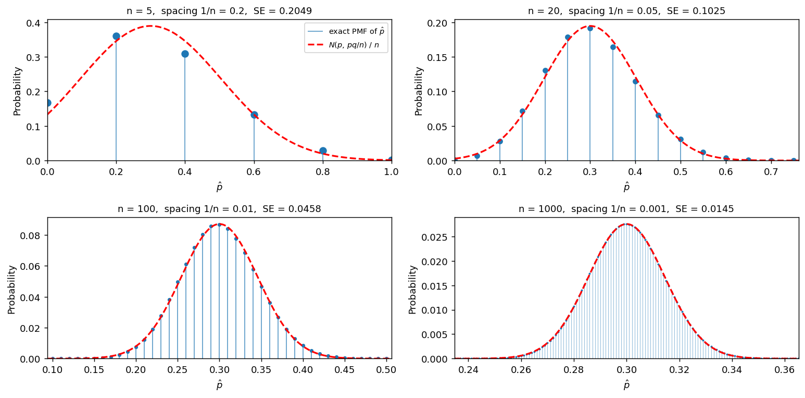

# p̂의 표본분포 (표본크기의 효과)

## 개요

표본비율 $\hat p$은 새로운 통계량이 아니다. 자료가 0과 1뿐인 베르누이 모집단에서 **표본평균**이 곧 성공 비율이므로

$$
\hat p = \frac{1}{n}\sum_{i=1}^n X_i = \bar X
$$

이다. 따라서 5.4절에서 $\bar X$에 대해 얻은 결과가 전부 그대로 적용된다. 불편성도, 표준오차 $\sigma/\sqrt n$도, 중심극한정리도 손댈 것이 없다.

그런데 한 가지가 남는다. **이산성**이다. $\bar X$가 연속모집단에서 나왔다면 표본분포도 연속이지만, $\hat p$은 어떤 $n$에서도 $n+1$개의 값만 갖는다. 정규분포는 연속이므로 근사의 대상과 근사하는 것 사이에 메울 수 없는 간격이 있다.

이 페이지는 $p = 0.3$을 고정하고 $n$을 $5, 20, 100, 1000$으로 키우며 그 간격이 어떻게 좁아지는지를 본다. 결론을 미리 적으면 이렇다. 정규근사의 오차는 두 갈래로 나뉜다. 하나는 **격자에서 오는 오차**이고 다른 하나는 **왜도에서 오는 오차**다. 앞의 것은 연속성 수정으로 거의 없앨 수 있고, 뒤의 것은 $n$을 키우는 수밖에 없다.

## 모집단 모형

$$
X \sim \text{Bernoulli}(p), \qquad P(X=1) = p, \quad P(X=0) = q = 1 - p
$$

$$
\mu = p, \qquad \sigma^2 = pq
$$

이 페이지에서는 $p = 0.3$이므로 $\sigma^2 = 0.21$, $\sigma = 0.4583$이다.

모집단은 막대 두 개뿐이다. 정규분포와 닮은 구석이 없는 가장 극단적인 비정규 모집단인데, 그럼에도 $\bar X$는 종 모양으로 간다. 이것이 중심극한정리의 힘이다.

## 표본분포 이론

### 정확한 분포

성공 횟수가 $n\hat p \sim \text{Binomial}(n, p)$이므로 $\hat p$의 분포는 근사가 아니라 **정확히** 알려져 있다.

$$
P\!\left(\hat p = \frac kn\right) = \binom nk p^k q^{n-k}, \qquad k = 0, 1, \ldots, n
$$

$$
E[\hat p] = p, \qquad \text{Var}(\hat p) = \frac{pq}{n}, \qquad \text{SE}(\hat p) = \sqrt{\frac{pq}{n}}
$$

정규근사를 쓰는 이유는 계산이 어려워서가 아니다. 이항계수는 컴퓨터가 순식간에 계산한다. 정규근사를 쓰는 이유는 **$p$를 모르는 상태에서 추론**을 하려면 분포를 모수와 분리해 표준화해야 하기 때문이다.

### 이산성: 격자와 점질량

$\hat p$이 가질 수 있는 값은 간격 $1/n$의 격자 위에 놓인 $n+1$개다.

| $n$ | 격자 간격 $1/n$ | 가능한 값의 개수 | $\text{SE} = \sqrt{pq/n}$ | 격자 간격 / SE |
|---|---|---|---|---|
| 5 | 0.2 | 6 | 0.20494 | 0.976 |
| 20 | 0.05 | 21 | 0.10247 | 0.488 |
| 100 | 0.01 | 101 | 0.04583 | 0.218 |
| 1000 | 0.001 | 1001 | 0.01449 | 0.069 |

마지막 열이 핵심이다. 격자 간격은 $1/n$으로 줄고 표준오차는 $1/\sqrt n$으로 줄므로, **둘의 비가 $1/\sqrt n$의 속도로 0으로 간다.** 분포가 퍼져 있는 폭에 비해 격자가 점점 촘촘해진다는 뜻이다. $n = 5$에서는 격자 한 칸이 표준오차만큼 커서 분포가 막대 몇 개로 보이지만, $n = 1000$에서는 한 칸이 표준오차의 7%에 불과해 눈으로는 연속과 구별되지 않는다.

같은 사실을 개수로 말할 수도 있다. $p \pm \text{SE}$ 안에 있는 격자점은 약 $2\sqrt{npq}$개이므로 $n = 5$에서 2개, $n = 1000$에서 29개다(연습문제 5). **$\sqrt n$의 속도로만 늘어난다.**

### 국소극한정리

정규근사는 보통 확률의 합(CDF)에 대해 말하지만, 점질량 하나하나에 대해서도 성립한다. $f$를 $N(p, pq/n)$의 밀도라 하면

$$
P\!\left(\hat p = \frac kn\right) \approx \frac{1}{n}\,f\!\left(\frac kn\right)
$$

이다. 격자 한 칸의 폭 $1/n$에 그 자리의 밀도를 곱한 것이 그 칸의 확률이라는 자연스러운 해석이다. $n = 100$, $k = 30$에서 확인하면 정확값이 $0.086784$이고 근사값이 $0.087056$으로 셋째 자리까지 맞는다.

이 관계 때문에 모의실험 그림에서 점질량과 정규 곡선을 같은 축에 올릴 수 있다. 밀도를 $n$으로 나누면 확률의 눈금이 된다.

### 왜도

$\hat p$이 정규와 갈라지는 진짜 이유는 격자가 아니라 **비대칭**이다. $\hat p$의 왜도는

$$
\gamma_1 = \frac{q - p}{\sqrt{npq}} = \frac{1 - 2p}{\sqrt{npq}}
$$

이다. $p = 0.3$에서 계산하면 다음과 같다.

| $n$ | 5 | 20 | 100 | 1000 |
|---|---|---|---|---|
| 왜도 $\gamma_1$ | 0.3904 | 0.1952 | 0.0873 | 0.0276 |

$1/\sqrt n$으로 0에 간다. $p$가 $1/2$에서 멀면 분자가 커지므로 같은 $n$에서도 왜도가 크다. 이것이 다음 페이지에서 볼 느슨한 기준 "$np \ge 5$"의 뿌리다. 그 규칙이 붙잡는 것은 왜도, 곧 분포의 모양이다.

!!! note "두 종류의 오차"
    정규근사의 오차는 성질이 다른 두 항의 합이다.

    - **격자 항.** $\hat p$의 CDF는 계단이고 정규 CDF는 매끄럽다. 계단의 어느 쪽에서 재느냐에 따라 최대 점질량만큼 어긋난다. 이 항은 **연속성 수정**으로 거의 제거된다.
    - **왜도 항.** 이항분포가 한쪽으로 기울어 있다는 사실에서 온다. 에지워스 전개에서 이 항은 $\frac{\gamma_1}{6}\phi(z)(1-z^2)$의 꼴이고, 연속성 수정으로는 없앨 수 없다.

    두 항 모두 $n^{-1/2}$ 차수로 줄지만 **상수가 크게 다르다.** 아래 모의실험에서 연속성 수정이 오차를 8배 이상 줄이는 것이 그 때문이다.

### 연속성 수정

정수값 확률을 정규분포로 옮길 때 경계를 반 칸 밖으로 미는 것이 연속성 수정이다. $X = n\hat p$에 대해

$$
P(X \le k) \approx \Phi\!\left(\frac{k + 0.5 - np}{\sqrt{npq}}\right)
$$

로 계산한다. $\hat p$의 눈금으로 쓰면 경계 $c$를 $c + \frac{1}{2n}$으로 바꾸는 것과 같다. 격자 간격의 절반을 더한다는 점이 바로 이 수정이 **격자 항을 겨냥한다**는 증거다.

## 모의실험

<div class="codebox" markdown>

#### 예제 1. 점질량과 정규근사를 겹쳐 본다 { .eg }

```python
import matplotlib.pyplot as plt
import numpy as np
from scipy import stats

p = 0.3

fig, axes = plt.subplots(2, 2, figsize=(12, 6))
for ax, n, ms in zip(axes.ravel(), (5, 20, 100, 1000), (7, 5, 3, 1.2)):
    se = np.sqrt(p * (1 - p) / n)

    # p-hat 의 정확한 분포. 이항 PMF 를 격자 k/n 위에 올린 점질량이다.
    k = np.arange(n + 1)
    pmf = stats.binom(n, p).pmf(k)
    x = k / n

    lo, hi = max(0.0, p - 4.5 * se), min(1.0, p + 4.5 * se)
    m = (x >= lo) & (x <= hi)
    ax.vlines(x[m], 0, pmf[m], color="tab:blue", lw=1.0 if n < 500 else 0.4,
              alpha=0.7, label=r"exact PMF of $\hat p$")
    ax.plot(x[m], pmf[m], "o", color="tab:blue", ms=ms)

    # 정규 밀도를 n 으로 나누면 확률의 눈금이 된다(국소극한정리).
    g = np.linspace(lo, hi, 400)
    ax.plot(g, stats.norm(p, se).pdf(g) / n, "--r", lw=1.8,
            label=r"$N(p,\,pq/n)$ / $n$")

    ax.set_title(f"n = {n},  spacing 1/n = {1/n:g},  SE = {se:.4f}", fontsize=10)
    ax.set_xlim(lo, hi)
    ax.set_ylim(bottom=0)
    ax.set_xlabel(r"$\hat p$")
    ax.set_ylabel("Probability")

axes[0, 0].legend(fontsize=8)
plt.tight_layout()
plt.show()
```



$n = 5$ 패널은 막대 여섯 개다. 정규 곡선이 그 위를 지나가기는 하지만 두 대상이 같은 것이라고 말하기 어렵다. $\hat p = 0.2$의 점질량이 0.36으로 몰려 있고 $\hat p = 0$에도 0.168이 남아 있다.

$n = 20$에서는 막대가 21개로 늘고 곡선이 꼭대기를 잘 따라간다. $n = 100$에서는 점들이 곡선 위에 정확히 얹히고, $n = 1000$에서는 격자가 너무 촘촘해 점질량들이 하나의 면처럼 보인다. 그림만 보면 $n = 100$에서 이미 근사가 완성된 듯하지만, 다음 예제가 그렇지 않다는 것을 보여 준다.

</div>

<div class="codebox" markdown>

#### 예제 2. 근사 오차를 수치로 잰다 { .eg }

```python
import numpy as np
from scipy import stats

p, q = 0.3, 0.7

print(" n     1/n    #values      SE     skew   sup|F-Phi|   with c.c.")
for n in (5, 20, 100, 1000):
    se = np.sqrt(p * q / n)
    skew = (1 - 2 * p) / np.sqrt(n * p * q)

    # 격자점 k/n 에서 정확한 CDF 와 두 정규근사를 견준다.
    k = np.arange(n + 1)
    F_exact = stats.binom(n, p).cdf(k)
    F_plain = stats.norm.cdf((k / n - p) / se)                       # 수정 없음
    F_cc = stats.norm.cdf((k + 0.5 - n * p) / np.sqrt(n * p * q))    # 연속성 수정

    d_plain = np.max(np.abs(F_exact - F_plain))
    d_cc = np.max(np.abs(F_exact - F_cc))
    print(f"{n:>4} {1/n:>7.3f} {n+1:>8} {se:>9.5f} {skew:>8.4f} "
          f"{d_plain:>10.4f} {d_cc:>11.4f}")
```

출력:

```
 n     1/n    #values      SE     skew   sup|F-Phi|   with c.c.
   5   0.200        6   0.20494   0.3904     0.2154      0.0282
  20   0.050       21   0.10247   0.1952     0.1080      0.0127
 100   0.010      101   0.04583   0.0873     0.0491      0.0058
1000   0.001     1001   0.01449   0.0276     0.0156      0.0018
```

수정하지 않은 정규근사의 최대 오차가 $n = 100$에서도 **0.0491**이다. 그림에서는 완벽해 보였는데 확률로는 5퍼센트포인트나 어긋난다. $n = 1000$에서 겨우 0.0156으로 줄어든다.

연속성 수정을 넣으면 같은 $n = 100$에서 0.0058이다. **$n$을 100배 키우는 것보다 수정 한 줄이 낫다.**

</div>

## 해석

!!! note "주요 관찰"

    1. **$\hat p$은 $\bar X$다.** 베르누이 모집단의 표본평균이므로 중심극한정리가 그대로 적용되고, $\text{SE} = \sqrt{pq/n}$이 $1/\sqrt n$으로 줄어든다. $\bar X$에 관해 배운 것을 다시 배울 필요가 없다.
    2. **이산성은 사라지지 않고 상대적으로 작아질 뿐이다.** 어떤 $n$에서도 가능한 값은 $n+1$개이고 격자 간격은 $1/n$이다. 다만 그 간격이 표준오차에 비해 $1/\sqrt n$의 속도로 작아진다.
    3. **왜도가 $1/\sqrt n$으로 0에 간다.** $\gamma_1 = (1-2p)/\sqrt{npq}$이므로 $p$가 $1/2$에서 멀면 같은 $n$에서도 비대칭이 크다. $p = 0.3$에서는 $n = 100$이면 0.0873으로 무시할 만하다.
    4. **그림으로 본 근사와 수치로 잰 근사는 다르다.** $n = 100$ 패널은 눈에 완벽해 보이지만 CDF의 최대 오차가 0.0491이다. 유의수준 0.05를 다루는 자리에서는 치명적인 크기다.
    5. **연속성 수정은 값이 싸고 효과가 크다.** 격자 항을 제거해 오차를 8배 이상 줄인다. 남는 것은 왜도 항이고, 그것은 $n$을 키우거나 정확한 이항 계산으로만 해결된다.

## 연습문제

<div class="drillbox" markdown>

**연습문제 1.** <span class="diff easy" title="쉬움"></span>
$p = 0.3$, $n = 20$일 때 $\hat p$이 가질 수 있는 값을 모두 적고, $\text{SE}(\hat p)$와 격자 간격을 비교하라. $\hat p = 0.31$이라는 관측이 가능한가?

</div>

??? success "풀이"
    가능한 값은 $0, 0.05, 0.10, \ldots, 0.95, 1$의 **21개**다. 격자 간격은 $1/20 = 0.05$이고

    $$
    \text{SE} = \sqrt{\frac{0.3 \times 0.7}{20}} = \sqrt{0.0105} = 0.10247
    $$

    이므로 격자 한 칸이 표준오차의 $0.05/0.10247 = 0.488$, 즉 절반쯤 된다. 분포가 퍼진 폭 안에 격자점이 네댓 개밖에 들어가지 않는다는 뜻이다.

    $\hat p = 0.31$은 **불가능하다.** $20 \times 0.31 = 6.2$는 정수가 아니므로 그런 표본은 존재하지 않는다. $\hat p$의 표본분포를 연속으로 취급하면 이런 값에 0이 아닌 확률을 주게 된다. $n = 20$인 조사에서 "지지율 31%"라는 보고는 있을 수 없다.

<div class="drillbox" markdown>

**연습문제 2.** <span class="diff easy" title="쉬움"></span>
$p = 0.3$, $n = 20$에서 $P(\hat p \le 0.4)$를 (가) 정확한 이항, (나) 수정 없는 정규근사, (다) 연속성 수정한 정규근사로 각각 구하고 비교하라.

</div>

??? success "풀이"
    $\hat p \le 0.4$는 $X \le 8$과 같다($X \sim \text{Binomial}(20, 0.3)$).

    **(가) 정확한 값.** $P(X \le 8) = 0.8867$이다.

    **(나) 수정 없는 정규근사.** $\text{SE} = 0.10247$이므로

    $$
    z = \frac{0.4 - 0.3}{0.10247} = 0.9759, \qquad \Phi(0.9759) = 0.8354
    $$

    **(다) 연속성 수정.** $np = 6$, $\sqrt{npq} = 2.0494$이므로

    $$
    z = \frac{8 + 0.5 - 6}{2.0494} = 1.2199, \qquad \Phi(1.2199) = 0.8887
    $$

    | 방법 | 값 | 오차 |
    |---|---|---|
    | 정확한 이항 | 0.8867 | — |
    | 정규근사 | 0.8354 | $-0.0513$ |
    | 연속성 수정 | 0.8887 | $+0.0020$ |

    수정 없는 근사가 5퍼센트포인트 어긋나는 것을 수정 한 번으로 0.2퍼센트포인트로 줄였다. 어긋남의 방향에 주목할 만하다. 수정하지 않으면 $P(X \le k)$를 **과소평가**한다. 계단의 왼쪽 끝에서 재기 때문이다.

<div class="drillbox" markdown>

**연습문제 3.** <span class="diff med" title="중간"></span>
$\hat p$의 왜도가 $\gamma_1 = (1-2p)/\sqrt{npq}$임을 유도하라.

</div>

??? success "풀이"
    왜도는 위치와 척도에 불변이므로 $X = n\hat p \sim \text{Binomial}(n, p)$의 왜도를 구하면 된다. $X = \sum_i X_i$이고 $X_i$는 i.i.d. 베르누이다.

    먼저 베르누이 하나의 3차 중심적률을 구한다. $\mu = p$이므로

    $$
    \mu_3 = E[(X_1 - p)^3] = p(1-p)^3 + q(0-p)^3 = pq^3 - qp^3 = pq(q^2 - p^2) = pq(q-p)
    $$

    독립인 확률변수의 합에서 **3차 중심적률은 더해진다**(누적률의 가법성). 따라서

    $$
    E[(X - np)^3] = n\,pq(q-p), \qquad \text{Var}(X) = npq
    $$

    이고

    $$
    \gamma_1 = \frac{E[(X-np)^3]}{\{\text{Var}(X)\}^{3/2}} = \frac{npq(q-p)}{(npq)^{3/2}} = \frac{q-p}{\sqrt{npq}} = \frac{1-2p}{\sqrt{npq}}
    $$

    이다. $\square$

    **읽는 법.** 분자 $1-2p$는 모집단의 비대칭을, 분모 $\sqrt{npq}$는 표본크기의 완화 효과를 담는다. $p = 1/2$이면 분자가 0이 되어 어떤 $n$에서도 왜도가 정확히 0이다. 이항분포가 $p = 1/2$에서 완벽히 대칭이라는 사실과 같은 말이다.

<div class="drillbox" markdown>

**연습문제 4.** <span class="diff med" title="중간"></span>
왜도가 0.1보다 작아지려면 $n$이 얼마여야 하는가? $p = 0.3$과 $p = 0.02$에서 각각 구하고 차이를 설명하라.

</div>

??? success "풀이"
    $\gamma_1 = (1-2p)/\sqrt{npq} < 0.1$을 $n$에 대해 풀면

    $$
    n > \frac{(1-2p)^2}{0.01\,pq}
    $$

    이다.

    **$p = 0.3$:** $(0.4)^2 / (0.01 \times 0.21) = 0.16/0.0021 = 76.19$이므로 $n \ge 77$이다. 검산하면 $n = 77$에서 $\gamma_1 = 0.0995$다.

    **$p = 0.02$:** $(0.96)^2 / (0.01 \times 0.0196) = 0.9216/0.000196 = 4702.0$이므로 $n \ge 4703$이다.

    **60배 차이다.** 같은 수준의 대칭성을 얻는 데 필요한 표본이 $p$에 따라 이렇게 달라진다. 이유는 식에 그대로 드러나 있다. $p$가 0에 가까우면 분자는 1에 가까워지고 분모의 $pq$는 0으로 가므로, 두 방향으로 동시에 나빠진다.

    이 계산이 다음 페이지의 주제를 예고한다. "$n$이 크면 정규근사가 된다"는 말은 **$p$를 고정하고 $n \to \infty$**를 보낼 때만 참이다. 실무에서 $n$은 유한하고 $p$는 작을 수 있으므로, 판단의 기준이 $n$ 하나가 아니라 $np$여야 한다.

<div class="drillbox" markdown>

**연습문제 5.** <span class="diff med" title="중간"></span>
$\hat p$이 $p \pm \text{SE}$ 안에 들어가는 격자점의 개수가 약 $2\sqrt{npq}$임을 보이고, $p = 0.3$에서 $n = 5, 20, 100, 1000$에 대해 계산하라. 이산성이 사라지는 속도에 대해 무엇을 말해 주는가?

</div>

??? success "풀이"
    구간 $[p - \text{SE},\ p + \text{SE}]$의 길이는 $2\text{SE} = 2\sqrt{pq/n}$이고 격자 간격은 $1/n$이므로 개수는 대략

    $$
    \frac{2\sqrt{pq/n}}{1/n} = 2n \cdot \frac{\sqrt{pq}}{\sqrt n} = 2\sqrt{npq}
    $$

    이다. $\square$

    | $n$ | $2\sqrt{npq}$ | 실제 개수 |
    |---|---|---|
    | 5 | 2.05 | 2 |
    | 20 | 4.10 | 5 |
    | 100 | 9.17 | 9 |
    | 1000 | 28.98 | 29 |

    **$\sqrt n$의 속도로만 늘어난다.** $n$을 100배 키워야 격자점이 10배 촘촘해진다는 뜻이다. $n = 1000$에서도 표준오차 하나의 폭 안에 격자점이 29개뿐이다.

    이것이 "이산성은 사라지지 않는다"는 말의 정량적 내용이다. 연속분포에서 나온 $\bar X$라면 이 개수가 처음부터 무한이다. $\hat p$에서는 유한하고, 그 유한한 개수가 느리게 늘어난다. 그래서 정확한 계산과 연속성 수정이 큰 $n$에서도 쓸모가 있다.

<div class="drillbox" markdown>

**연습문제 6.** <span class="diff hard" title="어려움"></span>
예제 2의 표에서 두 오차가 모두 $n^{-1/2}$ 차수로 줄어드는 것을 확인하라. 그렇다면 연속성 수정이 무엇을 없앤 것인가? 수정 후 남은 오차의 크기를 왜도로 예측해 보라.

</div>

??? success "풀이"
    **차수 확인.** $n$이 $k$배가 되면 오차가 $\sqrt k$배로 줄어야 한다.

    | $n$ 변화 | 배수 $k$ | $\sqrt k$ | 수정 없음 | 연속성 수정 |
    |---|---|---|---|---|
    | $5 \to 20$ | 4 | 2.00 | $0.2154/0.1080 = 1.99$ | $0.0282/0.0127 = 2.22$ |
    | $20 \to 100$ | 5 | 2.24 | $0.1080/0.0491 = 2.20$ | $0.0127/0.0058 = 2.19$ |
    | $100 \to 1000$ | 10 | 3.16 | $0.0491/0.0156 = 3.15$ | $0.0058/0.0018 = 3.22$ |

    **둘 다 $n^{-1/2}$다.** 베리-에센 정리가 보장하는 차수이며, 연속성 수정은 이 차수를 바꾸지 못한다.

    **그러면 수정은 무엇을 없앴는가.** 상수를 줄였다. 두 열의 비를 보면

    $$
    \frac{0.2154}{0.0282} = 7.6, \quad \frac{0.1080}{0.0127} = 8.5, \quad \frac{0.0491}{0.0058} = 8.5, \quad \frac{0.0156}{0.0018} = 8.7
    $$

    로 **일정하게 8.5배쯤**이다. 에지워스 전개에서 $n^{-1/2}$ 항은 두 조각이다. 하나는 격자의 계단에서 오는 톱니 모양 항이고 다른 하나는 왜도 항이다. 반 칸 밀기가 앞의 조각을 상쇄한다.

    **남은 오차를 왜도로 예측한다.** 왜도 항은

    $$
    -\frac{\gamma_1}{6}\,\phi(z)\,(z^2 - 1)
    $$

    이고 $z$에 대한 최댓값은 $z = 0$에서 $\phi(0)\gamma_1/6 = 0.3989\,\gamma_1/6$이다. 계산하면

    | $n$ | $\gamma_1$ | $0.3989\gamma_1/6$ | 실제 수정 후 오차 |
    |---|---|---|---|
    | 5 | 0.3904 | 0.0260 | 0.0282 |
    | 20 | 0.1952 | 0.0130 | 0.0127 |
    | 100 | 0.0873 | 0.0058 | 0.0058 |
    | 1000 | 0.0276 | 0.0018 | 0.0018 |

    **거의 정확히 맞는다.** 연속성 수정을 한 뒤 남는 오차가 전적으로 왜도에서 온다는 사실이 수치로 확인된다.

    실무적 결론은 두 가지다. 첫째, 연속성 수정을 한 뒤에도 오차가 남고 그 크기는 $\gamma_1/15$ 정도로 어림할 수 있다. 둘째, 그 오차를 더 줄이려면 왜도를 줄여야 하며 방법은 $n$을 키우거나 정확한 이항 계산을 쓰는 것뿐이다. 왜도가 큰 상황, 즉 $p$가 극단인 상황이 다음 페이지의 주제다.

---

## 정리하며

- $\hat p$은 베르누이 모집단의 $\bar X$이므로 불편성, $\text{SE} = \sqrt{pq/n}$, 중심극한정리가 모두 그대로 적용된다.
- 다른 점은 **이산성**이다. 가능한 값이 $n+1$개이고 격자 간격이 $1/n$이다. 표준오차에 대한 상대적 간격이 $1/\sqrt n$으로 줄지만 결코 0이 되지 않는다.
- 왜도는 $\gamma_1 = (1-2p)/\sqrt{npq}$로 $1/\sqrt n$의 속도로 0에 간다. $p = 0.3$에서 $n = 100$이면 0.0873이다.
- 정규근사의 오차는 격자 항과 왜도 항으로 나뉜다. **연속성 수정은 격자 항을 제거해 오차를 8배 이상 줄이지만** 왜도 항은 남긴다. $n = 100$에서 0.0491이 0.0058로 준다.
- 왜도가 $1/\sqrt{npq}$에 비례하므로 판단의 기준은 $n$이 아니라 $np$와 $nq$여야 한다. 다음 페이지에서 $n = 100$을 고정하고 $p$를 줄이며 이 점을 확인한다.
