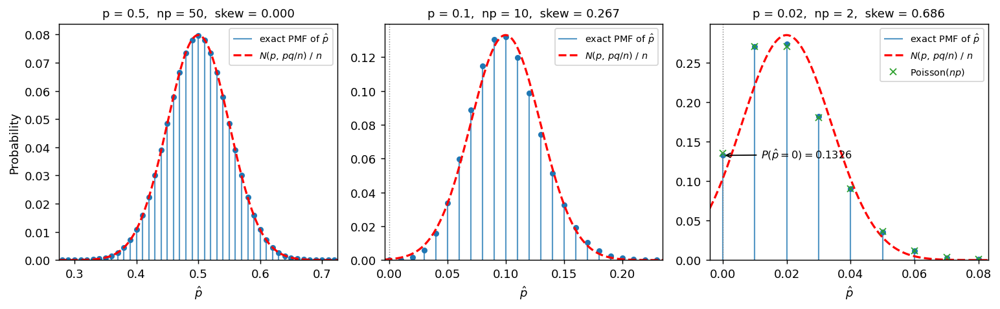

# p̂의 표본분포 (희귀사건)

## 개요

앞 페이지에서 $p = 0.3$을 고정하고 $n$을 키웠다. 왜도 $\gamma_1 = (1-2p)/\sqrt{npq}$가 $1/\sqrt n$으로 0에 가고, 정규근사도 그 속도로 좋아졌다.

이제 반대로 한다. $n = 100$을 고정하고 $p$를 $0.5 \to 0.1 \to 0.02$로 줄인다. 표본크기는 그대로인데 근사가 무너진다. 왜도의 분모가 $\sqrt{npq}$이므로 $p$가 작아지면 $n$이 커도 소용이 없기 때문이다.

교과서가 "$np \ge 5$이고 $n(1-p) \ge 5$"라는 느슨한 기준을 내세우는 것은 이 때문이다. 판단의 기준이 표본크기 $n$이 아니라 **성공 횟수의 기댓값 $np$**라는 것이 이 규칙의 내용이다. 이 페이지는 내내 분포의 **모양**을, 구체적으로는 왜도를 따지므로 느슨한 기준 쪽을 쓴다. 구간이나 검정을 다룰 때 왜 $10$까지 올려 잡는지는 [이항분포의 정규근사](../../ch04/discrete_distributions/binomial.md#언제-쓸-수-있는가-5와-10)에 있다. $n = 100$이면 큰 표본처럼 들리지만 $p = 0.02$에서는 성공이 평균 두 번만 나온다.

$p = 0.02$에서는 더 노골적인 문제가 생긴다.

$$
P(\hat p = 0) = (1 - 0.02)^{100} = 0.1326
$$

**표본의 13%가 성공을 한 번도 보지 못한다.** 정규분포는 어느 한 점에도 확률을 주지 못하므로 이 사실을 표현할 방법이 없다. 이때 쓸 근사는 정규가 아니라 포아송이다.

## 설정

$$
X_1, \ldots, X_{100} \overset{\text{i.i.d.}}{\sim} \text{Bernoulli}(p), \qquad \hat p = \bar X
$$

세 경우를 본다.

| $p$ | $np$ | $n(1-p)$ | 느슨한 기준 $np \ge 5,\ nq \ge 5$ | $\text{SE} = \sqrt{pq/n}$ | 왜도 $\gamma_1$ |
|---|---|---|---|---|---|
| 0.50 | 50 | 50 | 넉넉히 만족 | 0.05000 | 0.0000 |
| 0.10 | 10 | 90 | 만족 | 0.03000 | 0.2667 |
| 0.02 | 2 | 98 | **위반** | 0.01400 | 0.6857 |

$n$은 셋 다 100이다. 달라지는 것은 $np$뿐이다.

## 표본분포 이론

### 왜도를 정하는 것은 np다

왜도를 $np$로 다시 쓰면 무엇이 지배하는지 분명해진다.

$$
\gamma_1 = \frac{1 - 2p}{\sqrt{npq}} \approx \frac{1}{\sqrt{np}} \qquad (p \text{ 가 작을 때})
$$

$p$가 작으면 $1 - 2p \approx 1$이고 $q \approx 1$이므로 왜도가 거의 정확히 $1/\sqrt{np}$다. $p = 0.02$, $n = 100$에서는 $1/\sqrt 2 = 0.707$이고 실제 값은 0.6857이다.

**$n$은 홀로 등장하지 않는다.** 언제나 $np$의 형태로만 나타난다. 그래서 $n$을 100에서 1000으로 늘리면서 $p$를 0.02에서 0.002로 줄이면 왜도가 그대로 0.6857 근처에 머문다. 표본을 키운 것이 헛수고가 되는 상황이다.

느슨한 기준 "$np \ge 5$"를 넣으면 $\gamma_1 \lesssim 1/\sqrt 5 = 0.447$이다. 이 기준이 실제로 통제하는 양이 왜도라는 것을 알 수 있다. 문턱값 5는 모양에 관한 약속이지 구간의 포함률에 관한 약속이 아니다.

### 경계에서 확률이 새어 나간다

$p = 0.02$, $n = 100$에서 정규근사 $N(0.02,\ 0.0140^2)$은 하한이 $0.02 - 1.96 \times 0.0140 = -0.0074$로 음수다. 더 정확히 말하면

$$
P_{\text{normal}}(\hat p < 0) = \Phi\!\left(\frac{0 - 0.02}{0.0140}\right) = \Phi(-1.4286) = 0.0766
$$

이므로 근사분포가 **존재하지 않는 영역에 7.7%의 확률을 흘린다.**

!!! danger "정규근사는 0의 점질량을 표현할 수 없다"
    $p = 0.02$, $n = 100$에서 $\hat p = 0$일 확률은 $0.98^{100} = 0.1326$이다. 여덟 표본 중 한 번꼴로 성공이 한 번도 나오지 않는다.

    정규분포는 연속이므로 어떤 점에서도 확률이 0이다. 점질량 13%를 0으로 보는 근사가 좋을 수 없다. 대신 정규근사는 그 확률의 절반쯤을 음수 영역에 흘리고, 나머지를 0 부근의 작은 구간에 퍼뜨린다.

    이것은 왜도가 좀 큰 정도의 문제가 아니다. **근사의 지지집합이 틀렸다.** 연속성 수정으로도 고쳐지지 않는다.

### 포아송 근사

$p$가 작고 $np$가 적당할 때 쓸 근사는 정규가 아니라 포아송이다.

$$
n\hat p \;\dot\sim\; \text{Poisson}(\lambda), \qquad \lambda = np
$$

정규근사와 결정적으로 다른 점은 포아송이 **이산분포**라는 것이다. $0, 1, 2, \ldots$에 점질량을 주므로 $\hat p = 0$을 제대로 다룬다.

$$
P_{\text{Poisson}}(\hat p = 0) = e^{-\lambda} = e^{-2} = 0.1353
$$

정확값 0.1326과 0.003 차이다. 정규근사가 준 0(또는 음수 영역의 0.0766)과 비교할 것이 아니다.

근사의 정확도에도 이론적 보장이 있다. 르캉 부등식에 따르면 $\text{Binomial}(n,p)$와 $\text{Poisson}(np)$의 총변동거리는

$$
d_{TV} \le n p^2 = \lambda p
$$

를 넘지 않는다. $p = 0.02$, $n = 100$에서 $100 \times 0.0004 = 0.04$다. $p = 0.1$이면 $100 \times 0.01 = 1$로 아무 정보가 없는 값이 된다.

**두 근사는 서로 다른 극한을 본다.**

| | 정규근사 | 포아송 근사 |
|---|---|---|
| 극한 | $np \to \infty$ | $p \to 0$, $np \to \lambda$ 고정 |
| 오차를 지배하는 양 | $1/\sqrt{np}$ (왜도) | $np^2$ |
| 분포의 종류 | 연속 | 이산 |
| 잘 듣는 범위 | $np \ge 5$ (느슨한 기준) | $p \le 0.05$ 정도 |

$p = 0.1$은 어느 쪽에도 딱 맞지 않는 어중간한 자리다. 아래 모의실험이 그 사실을 수치로 보여 준다.

## 모의실험

<div class="codebox" markdown>

#### 예제 1. np가 줄면서 무너지는 정규근사 { .eg }

```python
import matplotlib.pyplot as plt
import numpy as np
from scipy import stats

n = 100

fig, axes = plt.subplots(1, 3, figsize=(12, 3.8))
for ax, p in zip(axes, (0.5, 0.1, 0.02)):
    se = np.sqrt(p * (1 - p) / n)
    k = np.arange(n + 1)
    pmf = stats.binom(n, p).pmf(k)
    x = k / n

    lo, hi = p - 4.5 * se, p + 4.5 * se
    if lo < 0.02:            # 0 의 점질량이 보이도록 왼쪽을 0 아래까지 연다
        lo = -0.004
    m = (x >= lo) & (x <= hi)
    ax.vlines(x[m], 0, pmf[m], color="tab:blue", lw=1.2, alpha=0.75,
              label=r"exact PMF of $\hat p$")
    ax.plot(x[m], pmf[m], "o", color="tab:blue", ms=4)

    g = np.linspace(lo, hi, 400)
    ax.plot(g, stats.norm(p, se).pdf(g) / n, "--r", lw=1.8,
            label=r"$N(p,\,pq/n)$ / $n$")

    if p == 0.02:
        # 이 패널에서만 포아송 근사를 함께 올린다. 이산분포라 0 을 다룰 수 있다.
        ax.plot(x[m], stats.poisson(n * p).pmf(k[m]), "x", color="tab:green",
                ms=6, label=r"Poisson($np$)")
        ax.annotate(f"$P(\\hat p = 0) = {(1-p)**n:.4f}$",
                    xy=(0, pmf[0]), xytext=(0.012, pmf[0] * 0.97),
                    fontsize=9, arrowprops=dict(arrowstyle="->", lw=1))

    ax.axvline(0, color="gray", lw=0.8, ls=":")
    ax.set_title(f"p = {p},  np = {n*p:g},  "
                 f"skew = {(1-2*p)/np.sqrt(n*p*(1-p)):.3f}", fontsize=10)
    ax.set_xlim(lo, hi)
    ax.set_ylim(bottom=0)
    ax.set_xlabel(r"$\hat p$")
    ax.legend(fontsize=8)

axes[0].set_ylabel("Probability")
plt.tight_layout()
plt.show()
```



$p = 0.5$ 패널은 교과서 그림이다. 점들이 곡선 위에 정확히 얹히고 좌우가 대칭이다.

$p = 0.1$ 패널에서는 이미 어긋남이 보인다. 왼쪽 꼬리에서 점들이 곡선보다 낮고, 오른쪽 꼬리에서는 곡선보다 높다. 오른쪽으로 끌린 꼬리, 즉 왜도 0.2667의 모습이다.

$p = 0.02$ 패널에서 근사가 무너진다. 가능한 값이 실질적으로 $\hat p = 0, 0.01, \ldots, 0.07$의 여덟 개뿐이고, 왼쪽 끝 $\hat p = 0$에 0.1326이 쌓여 있다. 정규 곡선은 그 자리를 지나면서 점선(0의 위치) 왼쪽, 즉 존재하지 않는 영역으로 계속 뻗는다. 반면 초록색 $\times$로 표시한 포아송은 점질량들 위에 거의 정확히 겹친다.

</div>

<div class="codebox" markdown>

#### 예제 2. 세 근사의 오차를 잰다 { .eg }

```python
import numpy as np
from scipy import stats

n = 100
k = np.arange(n + 1)

print("   p    np      SE    skew   P(p^=0)  Normal  Poisson  sup|F-Phi|  sup|F-Pois|")
for p in (0.5, 0.1, 0.02):
    q = 1 - p
    se = np.sqrt(p * q / n)
    skew = (1 - 2 * p) / np.sqrt(n * p * q)

    binom = stats.binom(n, p)
    pois = stats.poisson(n * p)

    # p^ = 0 이 될 확률을 세 방법으로 구한다.
    exact0 = binom.pmf(0)                     # (1-p)^n
    normal0 = stats.norm.cdf((0 - p) / se)    # 정규근사가 주는 P(p^ <= 0)
    pois0 = pois.pmf(0)                       # e^{-np}

    # 격자점에서 CDF 의 최대 어긋남
    F = binom.cdf(k)
    d_norm = np.max(np.abs(F - stats.norm.cdf((k / n - p) / se)))
    d_pois = np.max(np.abs(F - pois.cdf(k)))

    print(f"{p:>5} {n*p:>5.0f} {se:>7.4f} {skew:>7.4f} {exact0:>9.4f} "
          f"{normal0:>7.4f} {pois0:>8.4f} {d_norm:>11.4f} {d_pois:>12.4f}")
```

출력:

```
   p    np      SE    skew   P(p^=0)  Normal  Poisson  sup|F-Phi|  sup|F-Pois|
  0.5    50  0.0500  0.0000    0.0000  0.0000   0.0000      0.0398       0.0854
  0.1    10  0.0300  0.2667    0.0000  0.0004   0.0000      0.0832       0.0142
 0.02     2  0.0140  0.6857    0.1326  0.0766   0.1353      0.1767       0.0027
```

읽을 것이 여러 개다.

- **정규근사의 오차가 $p$와 함께 커진다.** 0.0398 → 0.0832 → **0.1767**이다. $n$은 셋 다 100인데 최대 오차가 4배 넘게 벌어진다.
- **포아송은 반대 방향으로 움직인다.** 0.0854 → 0.0142 → **0.0027**이다. $p = 0.02$에서 정규근사보다 **65배** 정확하다.
- **두 근사가 자리를 바꾸는 지점이 $p = 0.1$ 근처다.** 거기서 이미 포아송(0.0142)이 정규(0.0832)보다 낫다.
- **$P(\hat p = 0)$ 열이 결정적이다.** $p = 0.02$의 정확값 0.1326에 대해 포아송은 0.1353을 주고, 정규는 음수 영역의 확률 0.0766을 준다. 정규근사가 이 13%를 어디에도 배치하지 못한다.

</div>

## 해석

!!! note "주요 관찰"

    1. **표본크기가 아니라 $np$가 기준이다.** $n = 100$을 고정한 채 $p$만 줄여도 정규근사가 무너진다. 왜도가 $\gamma_1 \approx 1/\sqrt{np}$이므로 $n$은 $np$의 형태로만 작용한다.
    2. **느슨한 기준 "$np \ge 5$, $nq \ge 5$"가 통제하는 양은 왜도다.** $np = 5$에서 $\gamma_1 \approx 0.447$이다. $p = 0.02$, $n = 100$이면 $np = 2$로 규칙을 위반하고 왜도가 0.6857까지 오른다.
    3. **경계의 점질량이 가장 큰 문제다.** $p = 0.02$에서 $P(\hat p = 0) = 0.1326$인데, 정규근사는 이 13%를 표현하지 못하고 대신 존재하지 않는 음수 영역에 7.66%를 흘린다. 연속성 수정으로도 고칠 수 없다.
    4. **희귀사건에서는 포아송이 낫다.** CDF의 최대 오차가 $p = 0.02$에서 0.0027로 정규근사의 0.1767에 비해 65배 작다. 르캉 부등식이 오차를 $np^2 = 0.04$ 이하로 보장한다.
    5. **두 근사의 역할이 뒤집힌다.** $p = 0.5$에서는 정규(0.0398)가 포아송(0.0854)보다 낫고, $p = 0.1$부터 순서가 바뀐다. 어느 쪽을 쓸지는 $n$이 아니라 $np$와 $p$를 함께 보고 정한다.

## 연습문제

<div class="drillbox" markdown>

**연습문제 1.** <span class="diff easy" title="쉬움"></span>
$n = 100$, $p = 0.02$에서 $P(\hat p = 0)$을 계산하라. 정규근사는 이 확률을 어떻게 다루는가?

</div>

??? success "풀이"
    $\hat p = 0$은 100번 모두 실패한다는 뜻이므로

    $$
    P(\hat p = 0) = (1-p)^n = 0.98^{100} = 0.1326
    $$

    이다. $e^{-np} = e^{-2} = 0.1353$과 가깝다($\log 0.98 = -0.0202$이므로 $0.98^{100} = e^{-2.02}$다).

    **정규근사는 이 확률을 다루지 못한다.** 연속분포이므로 한 점의 확률이 0이다. 굳이 대응시키자면 근사분포가 $\hat p \le 0$에 주는 확률

    $$
    \Phi\!\left(\frac{0 - 0.02}{0.0140}\right) = \Phi(-1.4286) = 0.0766
    $$

    이 그 자리를 대신하지만, 정확값 0.1326의 6할에도 못 미치고 그마저도 **음수 영역**에 놓인다.

    현실적 함의가 있다. 100명을 검사해 아무도 양성이 아니었다는 결과는 $p = 0.02$인 모집단에서 13%의 확률로 벌어지는 일이다. "아무도 없었으니 $p = 0$"이라고 결론지을 수 없다.

<div class="drillbox" markdown>

**연습문제 2.** <span class="diff easy" title="쉬움"></span>
$p = 0.02$일 때 "$np \ge 5$이고 $n(1-p) \ge 5$"를 만족하려면 $n$이 얼마여야 하는가? $p = 0.5$와 비교하라.

</div>

??? success "풀이"
    두 조건 중 더 까다로운 쪽이 결정한다.

    $$
    np \ge 5 \;\Rightarrow\; n \ge \frac{5}{0.02} = 250, \qquad
    n(1-p) \ge 5 \;\Rightarrow\; n \ge \frac{5}{0.98} = 5.1
    $$

    따라서 $n \ge 250$이다. $p$가 작을 때 걸리는 조건은 언제나 $np \ge 5$다.

    $p = 0.5$에서는 두 조건이 모두 $n \ge 10$이다. **25배 차이**다. 일반적으로 $n \ge 5/\min(p, 1-p)$이며 $p$가 0이나 1에 가까울수록 발산한다.

    다만 $n = 250$은 느슨한 기준을 겨우 채운 값일 뿐 좋은 근사라는 보장은 아니다. $np = 5$에서 왜도는 여전히 0.44다. 신뢰구간을 세울 작정이라면 보수적 기준 $np \ge 10$을 써야 하고, 그러면 $p = 0.02$에서 $n \ge 500$으로 요구가 두 배가 된다.

<div class="drillbox" markdown>

**연습문제 3.** <span class="diff med" title="중간"></span>
$n = 100$에서 세 $p$의 왜도를 계산해 표의 값을 확인하고, $p = 0.02$에서 왜도가 0.1보다 작아지려면 $n$이 얼마여야 하는지 구하라.

</div>

??? success "풀이"
    $\gamma_1 = (1-2p)/\sqrt{npq}$에 $n = 100$을 넣는다.

    | $p$ | $1-2p$ | $\sqrt{npq}$ | $\gamma_1$ |
    |---|---|---|---|
    | 0.50 | 0.00 | $\sqrt{25} = 5.000$ | 0.0000 |
    | 0.10 | 0.80 | $\sqrt 9 = 3.000$ | 0.2667 |
    | 0.02 | 0.96 | $\sqrt{1.96} = 1.400$ | 0.6857 |

    $\gamma_1 < 0.1$을 $n$에 대해 풀면

    $$
    n > \frac{(1-2p)^2}{0.01\,pq} = \frac{0.9216}{0.01 \times 0.0196} = 4702.0
    $$

    이므로 $n \ge 4703$이 필요하다.

    **앞 페이지의 $p = 0.3$에서는 $n = 77$이면 충분했다.** 같은 대칭성을 얻는 데 표본이 61배 더 든다. $np$로 바꿔 읽으면 두 경우 모두 $np \approx 23 \sim 94$쯤에서 왜도가 0.1 아래로 내려가며, 결국 하나의 기준 $np$로 통일된다는 것을 알 수 있다.

<div class="drillbox" markdown>

**연습문제 4.** <span class="diff med" title="중간"></span>
르캉 부등식 $d_{TV} \le np^2$을 세 $p$에 대해 계산하고, 예제 2의 `sup|F-Pois|` 값과 비교하라. 부등식이 언제 쓸모가 있는가?

</div>

??? success "풀이"
    | $p$ | 상한 $np^2$ | 실제 최대 오차 |
    |---|---|---|
    | 0.50 | $100 \times 0.25 = 25.0$ | 0.0854 |
    | 0.10 | $100 \times 0.01 = 1.0$ | 0.0142 |
    | 0.02 | $100 \times 0.0004 = 0.04$ | 0.0027 |

    총변동거리는 정의상 1을 넘지 않으므로 상한 25나 1은 **아무 정보가 없다.** 부등식이 쓸모 있는 것은 $np^2 < 1$, 즉 $p < 1/\sqrt n$일 때다. $n = 100$이면 $p < 0.1$이다.

    $p = 0.02$에서 상한 0.04는 실제 0.0027의 15배쯤으로 느슨하지만, **자료를 보지 않고 미리 보장되는 값**이라는 점이 중요하다. 정규근사에는 이런 형태의 보장이 없다. 베리-에센 상한은 $C\gamma_1$의 꼴이어서 $p$가 작으면 함께 커진다.

    $np^2 = \lambda p$로 쓰면 부등식의 의미가 잘 보인다. 포아송 근사의 오차는 $\lambda = np$가 아니라 **개별 성공확률 $p$가 작은지**에 달려 있다. $\lambda$는 아무리 커도 좋고, $p$만 작으면 된다.

<div class="drillbox" markdown>

**연습문제 5.** <span class="diff med" title="중간"></span>
$n = 100$, $p = 0.02$에서 $P(\hat p \ge 0.05)$를 정확한 이항, 포아송, 정규근사로 각각 구하라. 유의수준 0.05로 판단할 때 어떤 일이 벌어지는가?

</div>

??? success "풀이"
    $\hat p \ge 0.05$는 $X \ge 5$와 같다.

    | 방법 | 계산 | 값 |
    |---|---|---|
    | 정확한 이항 | $1 - F_{\text{Bin}(100,\,0.02)}(4)$ | **0.0508** |
    | 포아송 | $1 - F_{\text{Poisson}(2)}(4)$ | 0.0527 |
    | 정규근사 | $1 - \Phi\!\left(\frac{0.05-0.02}{0.0140}\right) = 1 - \Phi(2.143)$ | **0.0161** |

    포아송은 정확값과 0.002 차이지만 정규근사는 **3배 이상 작다.**

    **결론이 뒤집힌다.** $H_0: p = 0.02$를 단측 유의수준 0.05로 검정한다고 하자.

    - 정확한 계산: $p\text{-값} = 0.0508 > 0.05$이므로 **기각하지 못한다.**
    - 정규근사: $p\text{-값} = 0.0161 < 0.05$이므로 **기각한다.**

    같은 자료에서 정반대의 결론이 나온다. 정규근사가 오른쪽 꼬리를 과소평가하기 때문이다. 왜도가 양수인 분포의 오른쪽 꼬리는 정규보다 두껍다.

    **방향이 위험한 쪽이다.** 희귀사건 자료에서 정규근사를 쓰면 $p$값이 실제보다 작게 나와 **없는 유의성을 만들어 낸다.** 이것이 5.5절의 규칙을 지켜야 하는 실무적 이유다.

<div class="drillbox" markdown>

**연습문제 6.** <span class="diff hard" title="어려움"></span>
$n = 100$을 검사해 성공이 하나도 없었다($\hat p = 0$). $p$의 95% 상한을 (가) 삼의 법칙, (나) 정확한 방법으로 구하고, 두 결과가 왜 거의 같은지 보여라.

</div>

??? success "풀이"
    **(나) 정확한 방법부터.** 상한 $p_U$는 "$p = p_U$였다면 지금처럼 0을 볼 확률이 겨우 5%"가 되는 값으로 정한다.

    $$
    P_{p_U}(X = 0) = (1 - p_U)^n = 0.05
    $$

    풀면

    $$
    p_U = 1 - 0.05^{1/n} = 1 - 0.05^{0.01} = 0.0295
    $$

    이다. 이것이 $x = 0$에서의 클로퍼-피어슨 상한이다.

    **(가) 삼의 법칙.** 위 식의 로그를 취한다.

    $$
    n \log(1 - p_U) = \log 0.05 = -2.996
    $$

    $p_U$가 작으면 $\log(1-p_U) \approx -p_U$이므로

    $$
    n\,p_U \approx 2.996 \approx 3 \qquad\Longrightarrow\qquad p_U \approx \frac 3n
    $$

    이다. $\square$ $n = 100$이면 $3/100 = 0.03$이다.

    **두 값의 비교.** 정확값 0.0295와 어림값 0.0300의 차이는 0.0005다. 근사에 쓰인 것은 $\log(1-p) \approx -p$뿐이고 그 오차가 $O(p^2)$이므로, $p_U$가 작을수록, 즉 $n$이 클수록 더 잘 맞는다. 이름의 3은 $-\log 0.05 = 2.996$에서 왔다.

    참고로 같은 상황에서 다음 페이지에 나올 윌슨 구간의 상한은

    $$
    \frac{z^2}{n + z^2} = \frac{3.8416}{103.8416} = 0.0370
    $$

    이고, 발드 구간은 $\hat p \pm 1.96\sqrt{0 \times 1/100} = [0, 0]$으로 **붕괴한다.** 성공이 0이라는 자료에서 발드 구간은 "$p$는 정확히 0"이라고 주장한다.

    **읽는 법.** 성공이 하나도 없다는 자료가 말해 주는 것은 "$p = 0$"이 아니라 "$p$는 대략 $3/n$보다 작다"다. 약물 부작용, 제품 결함, 희귀질환 검사처럼 0을 관측하는 일이 흔한 분야에서 이 어림법이 널리 쓰인다.

---

## 정리하며

- 정규근사의 기준은 $n$이 아니라 $np$와 $nq$다. $n = 100$을 고정하고 $p$만 0.5에서 0.02로 줄이면 CDF의 최대 오차가 0.0398에서 0.1767로 커진다.
- 왜도가 $\gamma_1 \approx 1/\sqrt{np}$이므로 느슨한 기준 "$np \ge 5$, $nq \ge 5$"는 왜도를 0.45 정도 아래로 묶는 장치다. $p = 0.02$에서 이 기준은 $n \ge 250$을 요구한다. 모양이 아니라 구간의 포함률을 보장하려면 보수적 기준 $np \ge 10$으로 올려 $n \ge 500$을 요구해야 한다.
- $p = 0.02$, $n = 100$에서 $P(\hat p = 0) = 0.1326$이다. 정규근사는 이 점질량을 표현하지 못하고 음수 영역에 7.66%를 흘린다. 근사의 지지집합 자체가 틀렸으므로 연속성 수정으로도 고쳐지지 않는다.
- 희귀사건에서는 포아송 근사가 낫다. $p = 0.02$에서 CDF 최대 오차가 0.0027로 정규근사의 65분의 1이고, 오차가 $np^2 = 0.04$ 이하로 보장된다.
- 근사가 어긋나는 방향이 위험하다. 오른쪽 꼬리를 과소평가하므로 $p$값이 작게 나온다. $P(\hat p \ge 0.05)$의 정확값 0.0508을 정규근사가 0.0161로 주어 유의수준 0.05의 결론이 뒤집힌다.
