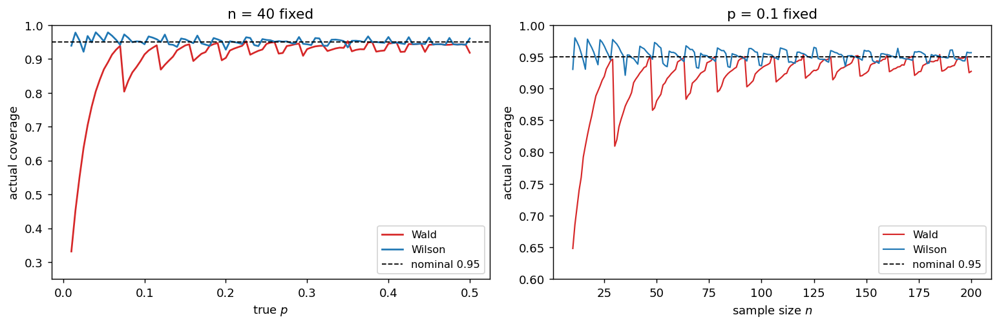

# 비율 신뢰구간의 실제 포함률

## 개요

앞의 두 페이지는 $\hat p$의 표본분포가 정규에서 얼마나 벗어나는지를 보았다. 이 페이지는 그 벗어남이 실제 추론에서 어떤 값을 치르게 하는지를 본다. 대상은 명목 95% 신뢰구간 두 개다.

$$
\text{Wald:}\quad \hat p \pm 1.96\sqrt{\frac{\hat p(1-\hat p)}{n}}
$$

$$
\text{Wilson:}\quad \frac{\hat p + \frac{z^2}{2n} \pm z\sqrt{\frac{\hat p(1-\hat p)}{n} + \frac{z^2}{4n^2}}}{1 + \frac{z^2}{n}}
$$

두 구간의 **유도**와 대수적 차이는 4장 이항분포의 연습문제에서 다루었다. 여기서 다루는 것은 하나뿐이다. 명목 95%라고 적힌 구간이 **실제로 몇 퍼센트의 확률로 참값을 담는가.**

미리 말하면 발드 구간은 $p$가 극단일 때 처참하게 무너진다. $n = 40$, $p = 0.01$에서 실제 포함률이 **0.331**이다. 95%라고 적고 33%를 담는다. 윌슨 구간은 같은 자리에서 0.939를 유지한다.

그리고 한 가지가 더 있다. 포함률은 $n$이 커질 때 0.95로 **매끄럽게 수렴하지 않는다.** 톱니처럼 오르내리며 수렴한다. 원인은 앞 페이지들에서 본 이산성이다.

## 설정

$X \sim \text{Binomial}(n, p)$, $\hat p = X/n$, $z = 1.96$으로 둔다. 구간은 $\hat p$의 함수이므로 $\hat p$이 가질 수 있는 값이 $n+1$개면 구간도 $n+1$개뿐이다.

**포함률**을 정의한다. 참값 $p$와 표본크기 $n$이 주어졌을 때

$$
C(n, p) = P\big(L(\hat p) \le p \le U(\hat p)\big) = \sum_{k=0}^{n} \binom nk p^k q^{n-k} \cdot \mathbb 1\{L(k/n) \le p \le U(k/n)\}
$$

이다. 이 값이 명목 수준 0.95와 얼마나 다른지가 관심사다. 합이 유한하므로 원리적으로는 정확히 계산할 수 있지만(연습문제 3), 이 페이지는 모의실험으로 구한다.

!!! note "포함률은 $p$의 함수다"
    "95% 신뢰구간"이라는 이름은 $p$가 무엇이든 포함률이 0.95라는 약속으로 들린다. 이항 자료에서 그 약속은 지킬 수 없다. $\hat p$의 분포가 이산이므로 포함률은 $p$에 따라 계단처럼 움직이며, 어떤 방법도 모든 $p$에서 정확히 0.95를 낼 수 없다.

    그래서 평가는 두 가지 기준으로 한다. 포함률이 0.95 **근처에 있는가**(평균적 성질), 그리고 **어디서도 크게 밑돌지 않는가**(최악의 경우). 발드 구간은 두 번째 기준에서 실패한다.

## 표본분포 이론

### 발드 구간이 붕괴하는 방식

발드 구간의 폭은 $\hat p(1-\hat p)$에 의해 정해진다. 그런데 이 값은 **표준오차의 추정값**이지 표준오차가 아니다. $\hat p$이 0에 가까우면 추정된 표준오차도 함께 작아져 구간이 지나치게 좁아진다.

극단은 $\hat p = 0$이다.

$$
\hat p = 0 \;\Longrightarrow\; \sqrt{\frac{0 \times 1}{n}} = 0 \;\Longrightarrow\; \text{구간} = [0,\ 0]
$$

**구간이 한 점으로 붕괴한다.** 성공을 한 번도 보지 못한 자료에서 "$p$는 정확히 0이다"라고 주장하는 셈이다. $p > 0$인 모든 모집단에서 이 구간은 참값을 담지 못한다. $\hat p = 1$에서도 대칭적으로 같은 일이 벌어진다.

앞 페이지에서 보았듯 $\hat p = 0$은 드문 일이 아니다. $P(\hat p = 0) = (1-p)^n$이므로 $n = 40$, $p = 0.01$이면 $0.99^{40} = 0.6690$이다. **표본의 67%에서 구간이 붕괴한다.** 따라서 포함률은 아무리 커도

$$
C(40,\ 0.01) \le 1 - 0.6690 = 0.3310
$$

이다. 뒤의 모의실험이 0.3313을 준다. 상한이 그대로 달성된다는 뜻이며, $\hat p \ge 1/40$인 나머지 표본에서는 구간이 참값을 담는다는 것이다.

### 윌슨 구간이 붕괴하지 않는 이유

윌슨 구간은 표준오차에 $\hat p$을 꽂는 대신 **검정을 역으로 푼다.** 즉

$$
\left|\frac{\hat p - p}{\sqrt{p(1-p)/n}}\right| \le z
$$

를 $p$에 대해 푼 집합이다. 분모에 $\hat p$이 아니라 **$p$ 자신**이 들어 있다는 것이 결정적이다. $\hat p = 0$이어도 분모는 0이 되지 않는다.

$\hat p = 0$을 넣어 보면

$$
\frac{p^2}{p(1-p)/n} \le z^2 \;\Longrightarrow\; \frac{np}{1-p} \le z^2 \;\Longrightarrow\; p \le \frac{z^2}{n + z^2}
$$

으로 구간이 $\left[0,\ \dfrac{z^2}{n+z^2}\right]$이다. $n = 40$이면 $[0,\ 0.0876]$이다. **폭이 있는 구간**이고 $p = 0.01$을 담는다.

윌슨 구간의 중심도 $\hat p$이 아니라

$$
\tilde p = \frac{\hat p + \frac{z^2}{2n}}{1 + \frac{z^2}{n}} = \frac{X + \frac{z^2}{2}}{n + z^2}
$$

로, 성공 $z^2/2 \approx 1.92$회와 실패 $z^2/2$회를 가상으로 더한 비율이다. 중심이 $1/2$ 쪽으로 조금 당겨진다. 아그레스티-콜 구간은 이 아이디어를 "성공 2회, 실패 2회를 더하고 발드 공식을 쓴다"로 단순화한 것이다.

### 이산성이 만드는 톱니

포함률이 $n$에 대해 매끄럽게 수렴하지 않는 이유는 $C(n,p)$가 **유한한 점질량들의 합**이라는 데 있다. $n$이 1 늘어나면 격자 $k/n$이 전부 조금씩 이동하고, 그러다 어떤 $k$의 구간이 $p$를 담는 상태에서 담지 못하는 상태로 **갑자기** 넘어간다. 그 $k$의 점질량이 통째로 포함률에서 빠진다.

구체적인 예가 $p = 0.1$에서 $n = 29 \to 30$이다. $k = 1$의 발드 구간 상한이 $0.10089$에서 $0.09757$로 내려가 $p = 0.1$을 넘지 못하게 된다(연습문제 4). 그런데 $n = 30$, $p = 0.1$에서 $P(X = 1) = 0.1413$이다. **이 점질량 하나가 빠지면서 포함률이 0.947에서 0.809로 떨어진다.**

표본을 하나 늘렸는데 신뢰구간이 나빠졌다. 포함률이 $n$의 **단조함수가 아니라는** 사실이 여기서 드러난다.

## 모의실험

<div class="codebox" markdown>

#### 예제 1. 포함률 곡선 { .eg }

```python
import matplotlib.pyplot as plt
import numpy as np

rng = np.random.default_rng(1)
z, REP = 1.96, 100_000


def coverage(n, p):
    """명목 95% Wald 구간과 Wilson 구간의 실제 포함률을 모의실험으로 구한다."""
    phat = rng.binomial(n, p, size=REP) / n

    # Wald: 표준오차에 p 대신 p^ 를 그대로 꽂는다. p^ = 0 이면 구간이 [0, 0].
    half = z * np.sqrt(phat * (1 - phat) / n)
    wald = np.mean((phat - half <= p) & (p <= phat + half))

    # Wilson: |p - p^| <= z sqrt(p(1-p)/n) 을 p 에 대해 풀어 얻는다.
    c = 1 + z**2 / n
    center = (phat + z**2 / (2 * n)) / c
    half_w = z * np.sqrt(phat * (1 - phat) / n + z**2 / (4 * n**2)) / c
    wilson = np.mean((center - half_w <= p) & (p <= center + half_w))

    return wald, wilson


fig, (ax1, ax2) = plt.subplots(1, 2, figsize=(12, 4))

# (좌) n 을 40 으로 고정하고 참값 p 를 훑는다.
ps = np.arange(0.01, 0.5001, 0.005)
cov = np.array([coverage(40, q) for q in ps])
ax1.plot(ps, cov[:, 0], "-", color="tab:red", lw=1.5, label="Wald")
ax1.plot(ps, cov[:, 1], "-", color="tab:blue", lw=1.5, label="Wilson")
ax1.axhline(0.95, color="black", ls="--", lw=1, label="nominal 0.95")
ax1.set_xlabel("true $p$")
ax1.set_ylabel("actual coverage")
ax1.set_title("n = 40 fixed")
ax1.set_ylim(0.25, 1.0)
ax1.legend(fontsize=9, loc="lower right")

# (우) p 를 0.1 로 고정하고 표본크기를 키운다. 톱니 진동을 보려면 n 을 1 씩 늘려야 한다.
ns = np.arange(10, 201)
cov2 = np.array([coverage(int(m), 0.1) for m in ns])
ax2.plot(ns, cov2[:, 0], "-", color="tab:red", lw=1.2, label="Wald")
ax2.plot(ns, cov2[:, 1], "-", color="tab:blue", lw=1.2, label="Wilson")
ax2.axhline(0.95, color="black", ls="--", lw=1, label="nominal 0.95")
ax2.set_xlabel("sample size $n$")
ax2.set_ylabel("actual coverage")
ax2.set_title("p = 0.1 fixed")
ax2.set_ylim(0.6, 1.0)
ax2.legend(fontsize=9, loc="lower right")

plt.tight_layout()
plt.show()
```



**왼쪽 패널.** 빨간 선(발드)이 $p$가 작은 쪽에서 절벽처럼 떨어진다. $p = 0.01$에서 0.33이고, $p = 0.1$에 가도 0.91을 넘지 못한다. $p = 0.5$에 이르러서야 0.92쯤이다. 파란 선(윌슨)은 전 구간에서 0.95 수평선 주위에 붙어 있다.

**오른쪽 패널.** $p = 0.1$을 고정하고 $n$을 1씩 늘렸다. 두 곡선 모두 매끄럽지 않다. 발드는 톱니의 골이 깊어 $n = 30$에서 0.81까지 떨어지고, 바로 앞 $n = 29$에서는 0.947이었다. $n = 200$에서도 0.93 근처를 오르내리며 0.95에 닿지 못한다. 윌슨은 진동하되 진폭이 작고 대체로 0.95 위에 머문다.

</div>

<div class="codebox" markdown>

#### 예제 2. 대표값을 표로 정리한다 { .eg }

```python
import numpy as np

# coverage() 는 예제 1 과 같다. 난수열을 처음부터 다시 쓰려고 rng 를 새로 만든다.
rng = np.random.default_rng(1)

print("n = 40 고정")
print("    p     Wald   Wilson   P(p^=0)")
for p in (0.01, 0.02, 0.05, 0.10, 0.20, 0.30, 0.50):
    w, s = coverage(40, p)
    print(f"{p:>5.2f}   {w:.4f}   {s:.4f}   {(1-p)**40:>7.4f}")

print()
print("p = 0.1 고정")
print("   n     Wald   Wilson")
for n in (10, 20, 29, 30, 40, 50, 100, 200):
    w, s = coverage(n, 0.1)
    print(f"{n:>4}   {w:.4f}   {s:.4f}")
```

출력:

```
n = 40 고정
    p     Wald   Wilson   P(p^=0)
 0.01   0.3313   0.9393    0.6690
 0.02   0.5525   0.9549    0.4457
 0.05   0.8670   0.9528    0.1285
 0.10   0.9133   0.9432    0.0148
 0.20   0.9036   0.9275    0.0001
 0.30   0.9300   0.9442    0.0000
 0.50   0.9191   0.9614    0.0000

p = 0.1 고정
   n     Wald   Wilson
  10   0.6496   0.9294
  20   0.8774   0.9572
  29   0.9466   0.9783
  30   0.8093   0.9741
  40   0.9134   0.9431
  50   0.8779   0.9702
 100   0.9325   0.9375
 200   0.9267   0.9551
```

위쪽 표의 마지막 열이 발드 구간의 실패를 설명한다. $P(\hat p = 0)$과 발드 포함률의 합이 $p = 0.01$에서 $0.3313 + 0.6690 = 1.0003$으로 거의 정확히 1이다. $p = 0.02$에서도 $0.5525 + 0.4457 = 0.9982$다. **발드 구간이 놓치는 표본이 곧 $\hat p = 0$인 표본**이라는 뜻이다.

아래쪽 표에서 $n = 29 \to 30$의 낙차(0.9466 → 0.8093)가 톱니의 크기를 보여 준다. 표본을 하나 더 얻고 포함률 14퍼센트포인트를 잃었다.

$n = 200$에서도 발드가 0.9267이다. **표본을 다섯 배로 늘려도 0.95에 도달하지 못한다.**

</div>

## 해석

!!! note "주요 관찰"

    1. **발드 구간은 $\hat p = 0$에서 붕괴한다.** 추정된 표준오차가 0이 되어 구간이 한 점 $[0,0]$으로 줄어든다. $p > 0$이면 결코 참값을 담지 못한다. $n = 40$, $p = 0.01$에서 이 일이 표본의 67%에서 벌어지므로 포함률이 0.331에 묶인다.
    2. **발드 구간은 $p$가 극단이 아니어도 명목 수준을 밑돈다.** $n = 40$에서 $p = 0.2$일 때 0.9036, $p = 0.5$일 때 0.9191이다. 0.95를 넘는 곳이 거의 없다. 평균적으로도 0.95가 아니라 0.90 근처다.
    3. **윌슨 구간은 전 구간에서 0.95 근처를 유지한다.** $p = 0.01$에서도 0.9393이고 최악의 경우가 0.92를 크게 밑돌지 않는다. 표준오차에 $\hat p$ 대신 $p$를 두고 역으로 풀었기 때문에 경계에서도 폭이 남는다.
    4. **포함률은 $n$에 대해 매끄럽게 수렴하지 않는다.** $p = 0.1$에서 $n = 29$의 0.9466이 $n = 30$에서 0.8093으로 떨어진다. $k = 1$의 구간 상한이 $p$를 넘지 못하게 되면서 점질량 $P(X=1) = 0.1413$이 통째로 빠지기 때문이다. 이산성의 직접적인 결과다.
    5. **명목 수준은 약속이 아니라 이름일 뿐이다.** 이항 자료에서 포함률이 정확히 0.95인 방법은 없다. 그러므로 방법의 선택은 "평균 포함률이 0.95에 가까운가"와 "최악의 경우가 얼마나 나쁜가"로 판단해야 하며, 발드 구간은 두 기준에서 모두 밀린다.

## 연습문제

<div class="drillbox" markdown>

**연습문제 1.** <span class="diff easy" title="쉬움"></span>
$\hat p = 0$일 때 발드 구간이 무엇인지 구하고, $n = 40$, $p = 0.01$에서 발드 포함률의 상한을 계산하라.

</div>

??? success "풀이"
    발드 구간은

    $$
    0 \pm 1.96\sqrt{\frac{0 \times (1-0)}{40}} = 0 \pm 0 = [0,\ 0]
    $$

    으로 **한 점**이다. $p = 0.01 > 0$이므로 이 구간은 참값을 담지 못한다.

    $\hat p = 0$이 될 확률은

    $$
    P(\hat p = 0) = (1 - 0.01)^{40} = 0.99^{40} = 0.6690
    $$

    이므로 포함률은 나머지 표본에서 전부 성공한다 해도

    $$
    C(40,\ 0.01) \le 1 - 0.6690 = 0.3310
    $$

    을 넘지 못한다. 모의실험이 0.3313을 주었으므로 이 상한이 실제로 달성된다.

    **명목 95%라고 적힌 구간이 33%를 담는다.** 신뢰구간이 틀렸다기보다, 근사의 전제가 무너진 자리에서 공식을 기계적으로 쓴 결과다.

<div class="drillbox" markdown>

**연습문제 2.** <span class="diff easy" title="쉬움"></span>
$\hat p = 0$일 때 윌슨 구간이 $\left[0,\ \dfrac{z^2}{n+z^2}\right]$임을 보이고 $n = 40$과 $n = 100$에서 계산하라.

</div>

??? success "풀이"
    윌슨 구간의 정의는 $|\hat p - p| \le z\sqrt{p(1-p)/n}$을 만족하는 $p$의 집합이다. $\hat p = 0$을 넣고 양변을 제곱하면

    $$
    p^2 \le \frac{z^2 p(1-p)}{n}
    $$

    이다. $p = 0$은 항상 성립하므로 $p > 0$에서 양변을 $p$로 나눈다.

    $$
    p \le \frac{z^2(1-p)}{n} \;\Longrightarrow\; np \le z^2 - z^2 p \;\Longrightarrow\; p(n + z^2) \le z^2
    $$

    $$
    p \le \frac{z^2}{n + z^2}
    $$

    따라서 구간은 $\left[0,\ \dfrac{z^2}{n+z^2}\right]$이다. $\square$

    $$
    n = 40:\ \frac{3.8416}{43.8416} = 0.0876, \qquad n = 100:\ \frac{3.8416}{103.8416} = 0.0370
    $$

    **상한이 대략 $z^2/n \approx 3.84/n$이다.** 앞 페이지에서 본 삼의 법칙 $3/n$과 같은 차수이며, 윌슨 구간이 양측이라 조금 더 크다.

<div class="drillbox" markdown>

**연습문제 3.** <span class="diff med" title="중간"></span>
포함률은 모의실험 없이 정확히 계산할 수 있다. 그 방법을 설명하고, 왜 그럼에도 모의실험이 쓸모 있는지 논하라.

</div>

??? success "풀이"
    $\hat p$이 $n+1$개의 값만 가지므로 모든 경우를 열거하면 된다.

    ```python
    import numpy as np
    from scipy import stats

    def coverage_exact(n, p, z=1.96):
        k = np.arange(n + 1)
        phat = k / n
        pmf = stats.binom(n, p).pmf(k)          # 각 경우의 확률
        half = z * np.sqrt(phat * (1 - phat) / n)
        return pmf[(phat - half <= p) & (p <= phat + half)].sum()
    ```

    $n = 40$, $p = 0.01$에서 이 함수는 $0.3310$을 준다. 모의실험이 준 0.3313과 0.0003 차이이며, 10만 회 반복의 표준오차 $\sqrt{0.33 \times 0.67/100000} = 0.0015$ 안에 있다.

    **정확 계산이 더 나은 점.** 오차가 없고, 계산이 $O(n)$으로 빠르며, 그림의 톱니가 진짜 톱니인지 모의실험 잡음인지 구별해 준다.

    **그럼에도 모의실험이 쓸모 있는 이유.** 구간이 $\hat p$의 닫힌 함수로 적히지 않으면 열거할 수가 없다. 붓스트랩 구간이나 베이즈 신용구간이 그렇고, 표본추출 구조가 복잡해지면(층화, 군집, 무응답) 더욱 그렇다. 게다가 "많이 반복해서 몇 번 담는지 센다"는 코드가 포함률의 정의 그 자체다.

    실무 지침은 이렇다. **정확히 계산할 수 있으면 하고, 없으면 모의실험한다.** 이 페이지에서 두 방법이 일치하는 것을 확인했으므로 뒤이어 나올 복잡한 구간에서도 모의실험을 믿을 수 있다.

<div class="drillbox" markdown>

**연습문제 4.** <span class="diff med" title="중간"></span>
오른쪽 패널의 톱니에서 $n = 29 \to 30$의 낙차를 설명하라. $p = 0.1$에서 어떤 $k$가 탈락하는가?

</div>

??? success "풀이"
    $k = 1$이 탈락한다. 발드 구간의 상한을 계산하면

    $$
    n = 29:\quad \frac{1}{29} + 1.96\sqrt{\frac{(1/29)(28/29)}{29}} = 0.03448 + 0.06641 = 0.10089
    $$

    $$
    n = 30:\quad \frac{1}{30} + 1.96\sqrt{\frac{(1/30)(29/30)}{30}} = 0.03333 + 0.06424 = 0.09757
    $$

    이다. $n = 29$에서는 상한이 0.1을 아슬아슬하게 넘지만 $n = 30$에서는 넘지 못한다.

    **빠지는 확률의 크기.** $n = 30$, $p = 0.1$에서

    $$
    P(X = 1) = \binom{30}{1}(0.1)(0.9)^{29} = 0.1413
    $$

    이 통째로 포함률에서 빠진다. 실제 낙차는 $0.9466 - 0.8093 = 0.1373$으로 이 값에 가깝다($k = 0$의 탈락 여부 등 다른 변화가 조금 섞여 있다).

    **일반적인 그림.** $k = 1$의 상한은 $n$에 대해 $\approx 2.96/n$으로 **연속적으로 감소**하는데, 포함률은 이 값이 $p$를 지나는 순간 **불연속적으로** 떨어진다. $k = 2, 3, \ldots$도 각각 자기 지점에서 같은 일을 일으키므로 톱니가 여러 개 생긴다. $n$이 커지면 개별 점질량이 작아져 진폭이 줄지만 그 감소가 $1/\sqrt n$ 속도로 느리다.

<div class="drillbox" markdown>

**연습문제 5.** <span class="diff med" title="중간"></span>
윌슨 구간의 공식을 $\left|\hat p - p\right| \le z\sqrt{p(1-p)/n}$에서 직접 유도하라.

</div>

??? success "풀이"
    양변을 제곱하고 정리한다.

    $$
    (\hat p - p)^2 \le \frac{z^2 p(1-p)}{n}
    $$

    $$
    \hat p^2 - 2\hat p p + p^2 \le \frac{z^2}{n}p - \frac{z^2}{n}p^2
    $$

    $p$에 대한 이차부등식으로 모은다.

    $$
    \left(1 + \frac{z^2}{n}\right)p^2 - \left(2\hat p + \frac{z^2}{n}\right)p + \hat p^2 \le 0
    $$

    $a = 1 + z^2/n$, $b = -(2\hat p + z^2/n)$, $c = \hat p^2$으로 두면 위로 열린 포물선이므로 두 근 사이가 해집합이다. 근의 공식에서

    $$
    p = \frac{\hat p + \frac{z^2}{2n} \pm \sqrt{\left(\hat p + \frac{z^2}{2n}\right)^2 - \left(1 + \frac{z^2}{n}\right)\hat p^2}}{1 + \frac{z^2}{n}}
    $$

    이고 근호 안을 전개하면

    $$
    \hat p^2 + \frac{z^2}{n}\hat p + \frac{z^4}{4n^2} - \hat p^2 - \frac{z^2}{n}\hat p^2
    = \frac{z^2}{n}\,\hat p(1 - \hat p) + \frac{z^4}{4n^2}
    = z^2\left(\frac{\hat p(1-\hat p)}{n} + \frac{z^2}{4n^2}\right)
    $$

    이 되어 근호가 $z\sqrt{\dfrac{\hat p(1-\hat p)}{n} + \dfrac{z^2}{4n^2}}$이다. 정리하면 개요의 공식이다. $\square$

    **구조를 읽는다.** 중심 $\dfrac{\hat p + z^2/(2n)}{1 + z^2/n}$은 $\hat p$과 $1/2$의 가중평균이고, $n$이 크면 $\hat p$에 수렴한다. 반폭도 $z\sqrt{\hat p(1-\hat p)/n}$에 수렴하므로 **$n$이 크면 윌슨과 발드가 같아진다.** 두 구간의 차이는 오직 작은 $n$과 극단적인 $\hat p$에서 나타나는데, 그것이 바로 발드가 실패하는 자리다.

<div class="drillbox" markdown>

**연습문제 6.** <span class="diff hard" title="어려움"></span>
"발드 구간도 $n \to \infty$이면 포함률이 0.95로 간다"는 말은 참이다. 그런데도 발드 구간이 부적절하다고 하는 이유는 무엇인가? 어떤 $n$을 잡아도 발드가 실패하는 $p$가 존재함을 보여라.

</div>

??? success "풀이"
    **점근적으로는 참이다.** $p$를 고정하고 $n \to \infty$를 보내면 $\hat p \overset{p}{\to} p$이고 $\sqrt{\hat p(1-\hat p)} \to \sqrt{p(1-p)}$이므로 슬러츠키 정리에 의해

    $$
    \frac{\hat p - p}{\sqrt{\hat p(1-\hat p)/n}} \xrightarrow{d} N(0,1)
    $$

    이고 포함률이 0.95로 간다. 문제는 이 수렴이 **$p$에 대해 균일하지 않다**는 것이다.

    **반례의 구성.** 주어진 $n$에 대해 $p = \dfrac{1}{2n}$으로 잡는다. 그러면

    $$
    P(\hat p = 0) = \left(1 - \frac{1}{2n}\right)^n \longrightarrow e^{-1/2} = 0.6065
    $$

    이므로 $\hat p = 0$일 확률이 $n$과 무관하게 60% 남는다. 발드 구간은 그때 붕괴하므로 포함률이

    $$
    C\!\left(n,\ \frac{1}{2n}\right) \le 1 - \left(1 - \frac{1}{2n}\right)^n \longrightarrow 1 - e^{-1/2} = 0.3935
    $$

    를 넘지 못한다. 정확히 계산하면 다음과 같다.

    | $n$ | $p = 1/(2n)$ | $P(\hat p = 0)$ | 발드 포함률 |
    |---|---|---|---|
    | 40 | 0.012500 | 0.6046 | 0.3952 |
    | 100 | 0.005000 | 0.6058 | 0.3941 |
    | 1000 | 0.000500 | 0.6065 | 0.3934 |
    | 10000 | 0.000050 | 0.6065 | 0.3933 |

    **$n = 10{,}000$에서도 0.393이다.** $\square$

    사실 $p \to 0$으로 더 보내면 $\inf_p C(n,p) \to 0$이다. 점별 수렴은 있으나 **균일 수렴이 없다.**

    **왜 이것이 실무적으로 중요한가.** 우리는 $p$를 모른다. 신뢰구간을 쓰는 목적이 바로 $p$를 모르는 상태에서 판단하는 것이다. "$p$가 0.2와 0.8 사이면 발드도 괜찮다"는 조건부 보장은, 그 조건을 확인할 수 없는 상황에서 쓸모가 없다.

    **대안의 비교.** $n = 40$에서 몇 가지 방법의 정확한 포함률을 계산하면 이렇다.

    | $p$ | 발드 | 윌슨 | 아그레스티-콜 | 클로퍼-피어슨 |
    |---|---|---|---|---|
    | 0.01 | 0.3310 | 0.9393 | 0.9925 | 0.9925 |
    | 0.05 | 0.8681 | 0.9520 | 0.9861 | 0.9861 |
    | 0.10 | 0.9145 | 0.9433 | 0.9581 | 0.9697 |
    | 0.30 | 0.9299 | 0.9443 | 0.9443 | 0.9615 |
    | 0.50 | 0.9193 | 0.9615 | 0.9615 | 0.9615 |

    $p \in [0.01, 0.5]$에서 평균 포함률은 발드 0.9018, 윌슨 0.9522이고 최솟값은 발드 0.3310, 윌슨 0.9221이다. 클로퍼-피어슨은 모든 $p$에서 0.95 이상을 **보장**하지만 그 대가로 구간이 넓다(보수적). 윌슨은 0.95를 조금 밑도는 곳이 있으나 평균적으로 가장 0.95에 가깝다. 발드는 어느 기준에서도 선택할 이유가 없다. 계산이 쉽다는 것이 유일한 장점이고, 그 장점은 컴퓨터가 있는 시대에 장점이 아니다.

---

## 정리하며

- 명목 95% 발드 구간의 실제 포함률은 $n = 40$, $p = 0.01$에서 **0.331**이다. 원인은 $\hat p = 0$일 때 구간이 한 점 $[0,0]$으로 붕괴하는 데 있고, 그 일이 표본의 66.9%에서 벌어진다.
- 발드 구간은 $p$가 극단이 아니어도 명목 수준을 밑돈다. $n = 40$에서 $p = 0.2$일 때 0.9036, $p = 0.5$일 때 0.9191이다. $p \in [0.01, 0.5]$의 평균 포함률이 0.90이다.
- 윌슨 구간은 표준오차에 $\hat p$ 대신 $p$를 두고 역으로 풀기 때문에 경계에서 붕괴하지 않는다. $\hat p = 0$에서도 구간이 $[0,\ z^2/(n+z^2)]$로 폭을 갖는다. $p$ 전 구간에서 0.95 근처를 유지하고 최솟값이 0.922다.
- 포함률은 $n$에 대해 **매끄럽게 수렴하지 않고 톱니처럼 진동한다.** $p = 0.1$에서 $n = 29$의 0.9466이 $n = 30$에서 0.8093으로 떨어지는데, $k = 1$의 구간 상한이 $p$를 넘지 못하게 되면서 점질량 0.1413이 통째로 빠지기 때문이다. 이산성의 직접적인 결과다.
- 발드의 점근적 타당성은 $p$를 고정했을 때만 성립한다. 어떤 $n$을 잡아도 $p = 1/(2n)$에서 포함률이 0.393에 머문다. $p$를 모르는 상태에서 쓰는 도구에 점별 수렴만으로는 부족하다.
