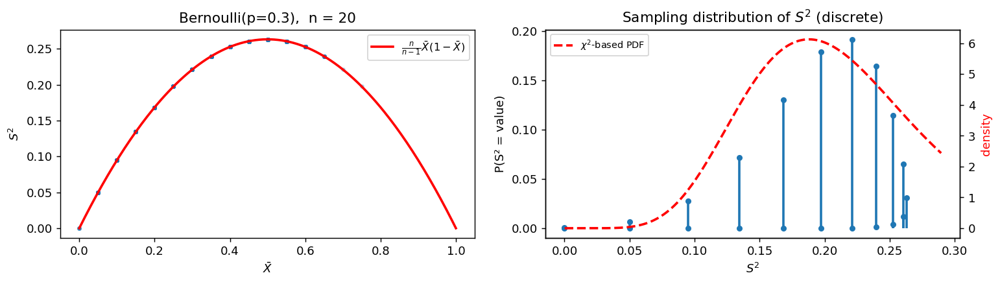

# S²의 표본분포 (Bernoulli)

## 개요

앞의 세 페이지에서 $S^2$의 표본분포가 모집단에 따라 카이제곱 예측보다 좁아지거나(균등), 넓어지거나(지수), 정확히 맞는(정규) 것을 보았다. 베르누이모집단에서는 더 극단적인 일이 벌어진다.

**$S^2$이 $\bar X$의 함수가 되어 버린다.**

$$
S^2 = \frac{n}{n-1}\,\bar X\,(1 - \bar X)
$$

우연이 아니고 근사도 아니라 **항등식**이다. 0과 1만 갖는 자료에서는 표본분산에 새로운 정보가 없다. 표본평균만 알면 표본분산이 계산되어 나온다.

이 사실에서 두 가지가 따라 나온다. 첫째, $S^2$의 표본분포가 연속이 아니라 **이산 점질량**들이다. 둘째, $\bar X$와 $S^2$은 **완전히 종속**인데 $p = 1/2$에서는 **상관계수가 0**이다. 4.3절의 "무상관이라고 독립은 아니다"가 이보다 깔끔한 예를 찾기 어렵다.

## 모집단 모형

$$
X \sim \text{Bernoulli}(p), \qquad P(X=1) = p, \quad P(X=0) = q = 1-p
$$

$$
\mu = p, \qquad \sigma^2 = pq
$$

중심적률을 직접 계산하면 닫힌 꼴이 나온다.

$$
\mu_3 = pq\,(q - p), \qquad \mu_4 = pq\,(1 - 3pq), \qquad \beta_2 = \frac{\mu_4}{\sigma^4} = 1 + \frac{(q-p)^2}{pq}
$$

| $p$ | $\sigma^2$ | 첨도 $\beta_2$ | 배율 $(\beta_2-1)/2$ |
|---|---|---|---|
| 0.5 | 0.250 | **1.00** | **0** |
| 0.3 | 0.210 | 1.76 | 0.38 |
| 0.2 | 0.160 | 3.25 | 1.13 |
| 0.1 | 0.090 | 8.11 | 3.56 |

!!! note "$p = 1/2$는 첨도의 보편 하한을 달성한다"
    어떤 분포에서도 옌센 부등식에 의해 $\mu_4 = E[(X-\mu)^4] \ge \{E[(X-\mu)^2]\}^2 = \sigma^4$이므로 $\beta_2 \ge 1$이다. 등호는 $(X-\mu)^2$이 **상수**일 때만 성립하고, 그것은 $X$가 평균에서 같은 거리에 있는 두 값만 갖는다는 뜻이다. 즉 $\text{Bernoulli}(1/2)$가 세상에서 첨도가 가장 작은 분포다.

    $p$가 0이나 1로 갈수록 반대편 극단이 된다. $p = 0.1$이면 첨도가 8.11로 지수분포(9)에 가까워진다. 희귀사건은 꼬리가 무거운 자료처럼 행동한다.

## 표본분포 이론

### 항등식

0/1 자료에서는 $X_i^2 = X_i$이므로 $\sum_i X_i^2 = \sum_i X_i = n\bar X$다. 따라서

$$
(n-1)S^2 = \sum_i X_i^2 - n\bar X^2 = n\bar X - n\bar X^2 = n\bar X(1-\bar X)
$$

가 되어 위의 항등식을 얻는다. $\square$

그러므로 $\bar X$의 표본분포를 알면 $S^2$의 표본분포도 안다. $n\bar X \sim \text{Binomial}(n, p)$이므로 $S^2$은

$$
S^2 = \frac{n}{n-1}\cdot\frac kn\left(1 - \frac kn\right), \qquad k = 0, 1, \ldots, n
$$

이라는 **$n+1$개의 값만** 가지며, 각 값의 확률은 이항 PMF가 준다.

### 분산과 특이한 p = 1/2

일반 공식은 그대로 쓰인다.

$$
\text{Var}(S^2) = \frac{1}{n}\left(\beta_2 - \frac{n-3}{n-1}\right)\sigma^4
$$

$p = 1/2$에서는 $\beta_2 = 1$이라 이 식이 무너진다.

$$
\text{Var}(S^2) = \frac{\sigma^4}{n}\left(1 - \frac{n-3}{n-1}\right) = \frac{2\sigma^4}{n(n-1)}
$$

**$1/n$이 아니라 $1/n^2$의 속도다.** 카이제곱 예측 $2\sigma^4/(n-1)$과의 배율이 정확히 $1/n$이 되어, $n$이 커질수록 0으로 간다.

??? note "왜 차수가 달라지는가"
    $S^2 = c\,g(\bar X)$로 보면 $g(t) = t(1-t)$이고 $g'(t) = 1-2t$다. 델타법은

    $$
    \text{Var}\{g(\bar X)\} \approx \{g'(p)\}^2\,\text{Var}(\bar X) = (1-2p)^2\frac{pq}{n}
    $$

    을 주는데, $p = 1/2$에서 $g'(1/2) = 0$이라 **1차항이 사라진다.** 그러면 2차항이 주항이 되어

    $$
    S^2 = c\left\{\frac14 - \left(\bar X - \frac12\right)^2\right\}
    $$

    에서 $(\bar X - 1/2)^2$이 $O(1/n)$이므로 흔들림이 $O(1/n)$, 분산이 $O(1/n^2)$가 된다.

    $p = 1/2$는 $\sigma^2 = pq$가 최대가 되는 지점이기도 하다. 최댓값 근처에서는 $\bar X$가 흔들려도 $\bar X(1-\bar X)$가 거의 변하지 않는다. **최댓값의 평평함**이 분산을 한 차수 낮추는 것이다.

### 상관계수는 ±1로 간다

$$
\text{corr}(\bar X, S^2) \to \frac{\mu_3}{\sigma^3\sqrt{\beta_2-1}}
= \frac{pq(q-p)}{(pq)^{3/2}\cdot\frac{|q-p|}{\sqrt{pq}}} = \frac{q-p}{|q-p|} = \text{sign}(q-p)
$$

$p \ne 1/2$이면 **상관계수의 절댓값이 1로 수렴한다.** 표본이 커지면 $\bar X$가 $p$ 근처에 모이고, 그 근처에서 $g(t) = t(1-t)$는 기울기 $1-2p \ne 0$의 직선과 거의 같기 때문이다. 즉 $S^2$이 $\bar X$의 **일차함수**처럼 행동한다.

$p = 1/2$에서는 위 식이 $0/0$이 되고 실제 상관계수는 0이다. 포물선의 꼭대기에서는 선형 성분이 없다.

## 모의실험

<div class="codebox" markdown>

### 예제 1. S²이 X̄의 함수라는 것과 이산 표집분포 { .eg }

```python
import matplotlib.pyplot as plt
import numpy as np
from scipy import stats

rng = np.random.default_rng(1)
n, p = 20, 0.3

X = rng.binomial(1, p, size=(5000, n))
xbar = X.mean(axis=1)
s2 = X.var(axis=1, ddof=1)

fig, (ax1, ax2) = plt.subplots(1, 2, figsize=(12, 3.5))

# 왼쪽: (X-bar, S^2) 산점도. 5천 개 점이 모두 포물선 위에 정확히 얹힌다.
# 두 통계량이 함수 관계라는 것을 그림 하나로 보여 준다.
ax1.scatter(xbar, s2, s=8, alpha=0.25)
g = np.linspace(0, 1, 200)
ax1.plot(g, n / (n - 1) * g * (1 - g), 'r-', lw=2,
         label=r"$\frac{n}{n-1}\bar X(1-\bar X)$")
ax1.set_xlabel(r"$\bar X$")
ax1.set_ylabel(r"$S^2$")
ax1.set_title(f"Bernoulli(p={p}),  n = {n}")
ax1.legend(fontsize=9)

# 오른쪽: S^2 의 표집분포. 연속밀도가 아니라 n+1 개의 점질량이다.
# 이항 PMF를 그대로 S^2 의 눈금으로 옮겨 그린다.
k = np.arange(0, n + 1)
pmf = stats.binom(n, p).pmf(k)
s2_vals = n / (n - 1) * (k / n) * (1 - k / n)
ax2.vlines(s2_vals, 0, pmf, lw=2)
ax2.plot(s2_vals, pmf, 'o', ms=4)

# 카이제곱 기반 밀도를 오른쪽 축에 겹친다. 눈금이 다르므로 축을 나눈다.
sigma2 = p * (1 - p)
c = (n - 1) / sigma2
gg = np.linspace(1e-4, s2_vals.max() * 1.1, 300)
ax2b = ax2.twinx()
ax2b.plot(gg, stats.chi2(n - 1).pdf(gg * c) * c, '--r', lw=2,
          label=r"$\chi^2$-based PDF")
ax2b.set_ylabel("density", color='r')
ax2b.legend(fontsize=8, loc='upper left')
ax2.set_xlabel(r"$S^2$")
ax2.set_ylabel("P(S² = value)")
ax2.set_title("Sampling distribution of $S^2$ (discrete)")

plt.tight_layout()
plt.show()
```



왼쪽 그림에서 점들이 흩어지지 않고 **곡선 위에 정확히 놓인다.** 오른쪽 그림에서는 $S^2$의 값들이 최댓값 $0.263$ 근처에 촘촘히 몰려 있는데, 포물선의 꼭대기가 평평해서 서로 다른 $\bar X$가 거의 같은 $S^2$으로 옮겨 가기 때문이다.

</div>

<div class="codebox" markdown>

### 예제 2. 항등식과 상관계수를 수치로 확인 { .eg }

```python
import numpy as np

rng = np.random.default_rng(1)
n = 100

print(f"{'p':>5}{'max|S² - 항등식|':>20}{'corr(X̄, S²)':>16}")
for p in (0.5, 0.3, 0.2):
    X = rng.binomial(1, p, size=(100_000, n))
    xbar = X.mean(axis=1)
    s2 = X.var(axis=1, ddof=1)
    gap = np.abs(s2 - n / (n - 1) * xbar * (1 - xbar)).max()
    print(f"{p:>5}{gap:>20.2e}{np.corrcoef(xbar, s2)[0, 1]:>+16.3f}")
```

출력:

```
    p     max|S² - 항등식|     corr(X̄, S²)
  0.5            1.67e-16          -0.002
  0.3            1.67e-16          +0.987
  0.2            1.67e-16          +0.995
```

항등식의 오차가 $10^{-16}$으로 **부동소수점 한계**다. 수치오차만 남았을 뿐 정확히 같다는 뜻이다.

그런데 $p = 0.5$의 상관계수가 $-0.002$다. **완전히 종속인 두 통계량의 상관계수가 0이다.**

</div>

## 해석

!!! note "주요 관찰"

    1. **$S^2$에 새 정보가 없다.** $S^2 = \frac{n}{n-1}\bar X(1-\bar X)$이므로 $\bar X$가 충분통계량이고 $S^2$은 그 함수다. 베르누이 자료에서 평균과 분산을 "따로" 추정한다는 말은 성립하지 않는다.
    2. **표집분포가 이산이다.** $n+1$개의 점질량이며, 카이제곱 같은 연속분포로 근사한다는 것이 애초에 어색하다.
    3. **$p = 1/2$에서 차수가 다르다.** $\text{Var}(S^2) = 2\sigma^4/\{n(n-1)\}$로 $O(n^{-2})$이며, 카이제곱 예측과의 배율이 $1/n$이다.
    4. **상관 0과 독립은 다르다.** $p = 1/2$에서 $\text{corr}(\bar X, S^2) = 0$이지만 한쪽이 다른 쪽의 함수다. $p \ne 1/2$에서는 상관계수가 $\pm 1$로 간다.

!!! tip "비율의 표준오차와 이어진다"
    비율 추론에서 쓰는 표준오차

    $$
    \text{SE}(\hat p) = \sqrt{\frac{\hat p(1-\hat p)}{n}}
    $$

    의 분자가 바로 이 페이지의 항등식이다. $\hat p(1-\hat p) = \frac{n-1}{n}S^2$이므로, **비율의 표준오차는 곧 표본분산을 꽂아 넣은 것**이다. 5.5절의 "비율의 표본분포"에서 $\sigma^2$을 따로 추정하지 않고 $\hat p$에서 바로 계산했던 이유가 여기에 있다.

## 연습문제

<div class="drillbox" markdown>

**연습문제 1.** <span class="diff easy" title="쉬움"></span>
$X_i \in \{0, 1\}$일 때 $S^2 = \frac{n}{n-1}\bar X(1-\bar X)$임을 보여라. $n = 5$이고 표본이 $(1,0,1,1,0)$일 때 양변을 직접 계산해 확인하라.

</div>

??? success "풀이"
    $X_i$가 0 또는 1이므로 $X_i^2 = X_i$다. 따라서

    $$
    (n-1)S^2 = \sum_i (X_i - \bar X)^2 = \sum_i X_i^2 - n\bar X^2 = n\bar X - n\bar X^2 = n\bar X(1-\bar X)
    $$

    이고 양변을 $n-1$로 나누면 된다. $\square$

    **수치 확인.** $\bar X = 3/5 = 0.6$이므로 오른쪽은

    $$
    \frac{5}{4}(0.6)(0.4) = \frac{5}{4}(0.24) = 0.3
    $$

    이다. 왼쪽은 편차가 $(0.4, -0.6, 0.4, 0.4, -0.6)$이므로 제곱합이 $0.16 \times 3 + 0.36 \times 2 = 0.48 + 0.72 = 1.2$이고, $1.2/4 = 0.3$이다. 일치한다.

    이 항등식이 성립하는 것은 **두 값만 갖는 자료**이기 때문이다. 세 값 이상을 가지면 $X_i^2 = X_i$가 깨지고 $S^2$은 $\bar X$의 함수가 아니게 된다.

<div class="drillbox" markdown>

**연습문제 2.** <span class="diff med" title="중간"></span>
$\text{Bernoulli}(p)$의 첨도가 $\beta_2 = 1 + \dfrac{(q-p)^2}{pq}$임을 보이고, $\beta_2 \ge 1$이 모든 분포에서 성립하는 보편 하한임을 설명하라.

</div>

??? success "풀이"
    **첨도.** 4차 중심적률을 직접 계산한다. $X$가 확률 $p$로 1, 확률 $q$로 0이므로

    $$
    \mu_4 = q(0-p)^4 + p(1-p)^4 = qp^4 + pq^4 = pq(p^3 + q^3)
    $$

    이다. $p^3 + q^3 = (p+q)^3 - 3pq(p+q) = 1 - 3pq$이므로 $\mu_4 = pq(1-3pq)$이고

    $$
    \beta_2 = \frac{pq(1-3pq)}{(pq)^2} = \frac{1-3pq}{pq} = \frac{1 - 4pq + pq}{pq} = \frac{(q-p)^2}{pq} + 1
    $$

    이다. 마지막 단계에서 $1 - 4pq = (p+q)^2 - 4pq = (q-p)^2$을 썼다. $\square$

    **보편 하한.** $Y = (X-\mu)^2 \ge 0$에 옌센 부등식(또는 $\text{Var}(Y) \ge 0$)을 적용하면

    $$
    \mu_4 = E[Y^2] \ge (E[Y])^2 = \sigma^4 \implies \beta_2 \ge 1
    $$

    이다. 등호는 $\text{Var}(Y) = 0$, 즉 $(X-\mu)^2$이 **상수**일 때만 성립한다. 그러면 $X$는 $\mu \pm c$ 두 값만 가지며 두 값의 확률이 같아야 평균이 $\mu$가 되므로, 위치와 척도를 빼면 $\text{Bernoulli}(1/2)$다.

    **정규분포의 $\beta_2 = 3$이 기준선이라는 관행**을 다시 보게 하는 결과다. 첨도는 아래로 1에서 막혀 있고 위로는 무한히 열려 있다. 그래서 초과첨도는 $-2$ 아래로 내려갈 수 없다.

<div class="drillbox" markdown>

**연습문제 3.** <span class="diff med" title="중간"></span>
$p = 1/2$에서 $\text{Var}(S^2) = \dfrac{2\sigma^4}{n(n-1)}$임을 보이고, 카이제곱 예측과의 배율이 $1/n$임을 확인하라. $n = 100$에서 두 값을 구하라.

</div>

??? success "풀이"
    $p = 1/2$이면 $\beta_2 = 1$이므로 일반 공식에 넣으면

    $$
    \text{Var}(S^2) = \frac{\sigma^4}{n}\left(1 - \frac{n-3}{n-1}\right) = \frac{\sigma^4}{n}\cdot\frac{(n-1)-(n-3)}{n-1} = \frac{2\sigma^4}{n(n-1)}
    $$

    이다. 카이제곱 예측이 $2\sigma^4/(n-1)$이므로 배율은

    $$
    \frac{2\sigma^4/\{n(n-1)\}}{2\sigma^4/(n-1)} = \frac 1n
    $$

    이다. $\square$

    **$n = 100$, $\sigma^2 = 0.25$에서.**

    $$
    \text{Var}(S^2) = \frac{2(0.0625)}{100 \times 99} = 1.26 \times 10^{-5}, \qquad \text{카이제곱 예측} = \frac{2(0.0625)}{99} = 1.26 \times 10^{-3}
    $$

    로 100배 차이 난다. 모의실험 값도 $1.26 \times 10^{-5}$로 공식과 맞는다.

    다른 모집단에서는 배율이 $(\beta_2-1)/2$라는 **상수**였는데 여기서는 $1/n$로 **0으로 간다.** 어긋남의 성질이 질적으로 다르다는 뜻이다. 앞의 두 페이지에서는 카이제곱 구간의 폭이 일정 비율로 틀렸지만, $\text{Bernoulli}(1/2)$에서는 $n$이 커질수록 무한히 더 틀린다.

<div class="drillbox" markdown>

**연습문제 4.** <span class="diff med" title="중간"></span>
$p \ne 1/2$일 때 $\text{corr}(\bar X, S^2) \to \text{sign}(q-p)$임을 보여라. 왜 상관계수가 1에 가까워지는지 기하적으로 설명하라.

</div>

??? success "풀이"
    $\text{Cov}(\bar X, S^2) = \mu_3/n$, $\text{Var}(\bar X) = \sigma^2/n$, $\text{Var}(S^2) \approx (\beta_2-1)\sigma^4/n$을 넣으면

    $$
    \text{corr} \to \frac{\mu_3}{\sigma^3\sqrt{\beta_2 - 1}}
    $$

    이다. 베르누이에서 $\mu_3 = pq(q-p)$, $\sigma^3 = (pq)^{3/2}$, $\beta_2 - 1 = (q-p)^2/(pq)$이므로

    $$
    \sigma^3\sqrt{\beta_2-1} = (pq)^{3/2}\cdot\frac{|q-p|}{(pq)^{1/2}} = pq\,|q-p|
    $$

    이고 따라서 $\text{corr} \to \dfrac{pq(q-p)}{pq|q-p|} = \text{sign}(q-p)$다. $\square$

    **기하적 설명.** $S^2 = c\,g(\bar X)$이고 $g(t) = t(1-t)$는 포물선이다. $n$이 커지면 $\bar X$가 폭 $O(1/\sqrt n)$의 좁은 구간에 갇히고, 그 좁은 구간에서 포물선은 **접선과 거의 구별되지 않는다.** 즉 국소적으로 $S^2$이 $\bar X$의 일차함수가 되고, 일차함수 관계의 상관계수는 기울기의 부호에 따라 $\pm 1$이다.

    $p < 1/2$이면 기울기 $1-2p > 0$이라 $+1$, $p > 1/2$이면 $-1$이다. $p = 1/2$은 꼭대기라서 접선이 수평이고, 일차항이 없어 상관계수가 0이 된다.

    모의실험에서 $n = 10$일 때 $+0.954$였다가 $n = 100$에서 $+0.995$로 오르는 것이 이 "국소 선형화"가 진행되는 모습이다.

<div class="drillbox" markdown>

**연습문제 5.** <span class="diff med" title="중간"></span>
$p = 1/2$인 베르누이모집단에서 $\bar X$와 $S^2$이 **무상관이지만 독립이 아님**을 보여라. 정규모집단과 무엇이 다른가?

</div>

??? success "풀이"
    **무상관.** $p = 1/2$이면 분포가 대칭이라 $\mu_3 = pq(q-p) = 0$이고, 따라서

    $$
    \text{Cov}(\bar X, S^2) = \frac{\mu_3}{n} = 0
    $$

    이다.

    **독립이 아님.** $S^2 = \frac{n}{n-1}\bar X(1-\bar X)$이므로 $\bar X$의 값을 알면 $S^2$의 값이 **하나로 정해진다.** 예를 들어 $n = 20$에서 $\bar X = 0.5$를 관측했다면 $S^2 = \frac{20}{19}(0.25) = 0.263$임이 확실하다. 조건부분포가 한 점에 몰리므로 독립일 수 없다. $\square$

    **정규모집단과의 차이.** 정규모집단에서 $\bar X \perp S^2$이 성립하는 것은 정규분포의 특별한 성질이다(회전불변성에서 나온다). 그 성질은 다음 세 가지를 동시에 준다.

    | | 정규모집단 | $\text{Bernoulli}(1/2)$ |
    |---|---|---|
    | 상관 | 0 | 0 |
    | 독립 | **그렇다** | 아니다(함수 관계) |
    | $t$ 통계량 | 정확히 $t_{n-1}$ | 아니다 |

    상관 0은 대칭성만으로 얻지만 독립은 정규성이 필요하다. **$t$ 분포가 성립하려면 상관 0이 아니라 독립이 필요하다**는 점이 이 표의 요점이며, 4장 $t$ 분포 페이지의 연습문제 7에서 다룬 "독립성이 왜 정의에 필수인가"와 같은 이야기다.

<div class="drillbox" markdown>

**연습문제 6.** <span class="diff med" title="중간"></span>
0/1 자료에서 분산에 대한 카이제곱 신뢰구간을 쓰는 것이 왜 뜻이 없는지 세 가지 이유를 들어라. 대신 무엇을 하겠는가?

</div>

??? success "풀이"
    **(1) 모수가 하나뿐이다.** 베르누이 모형에는 $p$ 하나만 있고 $\sigma^2 = pq$는 그 함수다. 분산을 따로 추정할 대상으로 두는 것 자체가 모형과 맞지 않는다. $p$의 구간을 구하고 $pq$로 옮기면 된다.

    **(2) 표집분포가 이산이고 유계다.** $S^2$은 $n+1$개의 값만 가지며 $0 \le S^2 \le \frac{n}{4(n-1)}$로 위가 막혀 있다. 지지집합이 $(0,\infty)$인 카이제곱으로 근사하면 있을 수 없는 값에 확률을 주게 된다.

    **(3) 분산 구조가 완전히 다르다.** 연습문제 3에서 보았듯 $p = 1/2$ 근처에서는 $\text{Var}(S^2)$이 $O(n^{-2})$인데 카이제곱은 $O(n^{-1})$을 가정한다. **차수부터 틀린다.**

    **대신 할 일.** $p$에 대한 구간을 먼저 만들고 필요하면 $\sigma^2 = p(1-p)$로 변환한다. $p$의 구간으로는 4장에서 본 윌슨 점수구간이나 클로퍼–피어슨 정확구간이 좋다. 다만 $\sigma^2 = pq$가 $p = 1/2$에서 최댓값을 갖는 **단조가 아닌** 함수이므로, 변환할 때 구간이 $1/2$을 담는지 확인해야 한다. 담고 있으면 상한이 $p$의 끝점이 아니라 $1/4$이 된다.

    이 마지막 주의점은 변환된 구간을 다룰 때의 일반적인 교훈이다. **단조함수라면 끝점을 그냥 옮기면 되지만, 그렇지 않으면 최댓값·최솟값을 따로 확인해야 한다.**

---

## 정리하며

- 0/1 자료에서는 $X_i^2 = X_i$이므로 $S^2 = \frac{n}{n-1}\bar X(1-\bar X)$라는 **항등식**이 성립한다. $S^2$은 $\bar X$의 함수이며 새로운 정보를 담지 않는다.
- 따라서 $S^2$의 표집분포는 이항분포를 옮겨 놓은 **$n+1$개의 점질량**이다. 연속분포로 근사한다는 발상 자체가 어색하다.
- 첨도는 $\beta_2 = 1 + (q-p)^2/(pq)$로, $p = 1/2$에서 **모든 분포의 하한인 1**을 달성한다. 그때 $\text{Var}(S^2)$은 $O(n^{-2})$로 카이제곱 예측과 차수부터 다르다.
- $p = 1/2$에서 $\text{corr}(\bar X, S^2) = 0$이지만 두 통계량은 **함수 관계**다. 무상관과 독립이 다르다는 것을 이보다 분명히 보여 주는 예가 드물다. $p \ne 1/2$에서는 상관계수가 $\pm 1$로 수렴한다.
- 비율의 표준오차 $\sqrt{\hat p(1-\hat p)/n}$이 곧 이 항등식이다. 비율 추론에서 분산을 따로 추정하지 않는 이유다.

네 모집단을 나란히 놓으면 이 절의 결론이 나온다. **$\bar X$의 표본분포는 모집단을 가리지 않지만 $S^2$의 표본분포는 모집단마다 다른 이야기를 한다.**

다음 절 **두 표본평균의 차**로 넘어간다. 지금까지 한 표본을 보았다면 이제 두 표본을 비교하며, 거기서는 모집단 모양뿐 아니라 **두 집단의 분산과 표본크기가 어떻게 짝을 이루는가**가 새로운 문제로 등장한다.
