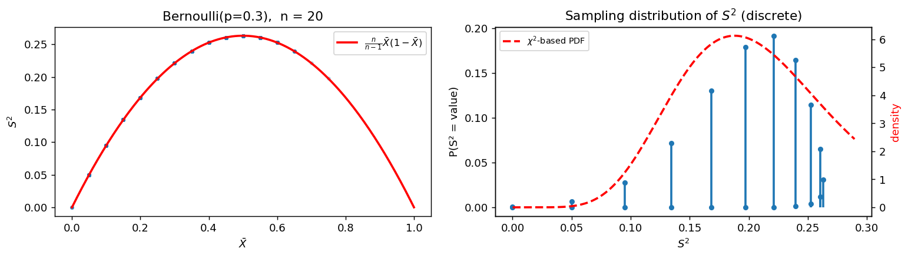

# S²의 표본분포 (Bernoulli)

## 개요

앞의 세 페이지에서 $S^2$의 표본분포가 모집단에 따라 카이제곱 예측보다 좁아지거나(균등), 넓어지거나(지수), 정확히 맞는(정규) 것을 보았다. 베르누이모집단에서는 더 극단적인 일이 벌어진다.

**$S^2$이 $\bar X$의 함수가 되어 버린다.**

$$
S^2 = \frac{n}{n-1}\,\bar X\,(1 - \bar X)
$$

우연이 아니고 근사도 아니라 **항등식**이다. 0과 1만 갖는 자료에서는 표본분산에 새로운 정보가 없다. 표본평균만 알면 표본분산이 계산되어 나온다.

이 사실에서 두 가지가 따라 나온다. 첫째, $S^2$의 표본분포가 연속이 아니라 **이산 점질량**들이다. 둘째, $\bar X$와 $S^2$은 **완전히 종속**인데 $p = 1/2$에서는 **상관계수가 0**이다. [3.4절 독립성과 무상관성의 차이](../../ch03/rv/independence_vs_zero_corr.md)의 "무상관이라고 독립은 아니다"가 이보다 깔끔한 예를 찾기 어렵다.

---

## 1. 모집단 모형

$$
X \sim \text{Bernoulli}(p), \qquad P(X=1) = p, \quad P(X=0) = q = 1-p
$$

$$
\mu = p, \qquad \sigma^2 = pq
$$

중심적률을 직접 계산하면 닫힌 꼴이 나온다.

$$
\mu_3 = pq\,(q - p), \qquad \mu_4 = pq\,(1 - 3pq), \qquad \beta_2 = \frac{\mu_4}{\sigma^4} = 1 + \frac{(q-p)^2}{pq}
$$

| $p$ | $\sigma^2$ | 첨도 $\beta_2$ | 배율 $(\beta_2-1)/2$ |
|---|---|---|---|
| 0.5 | 0.250 | **1.00** | **0** |
| 0.3 | 0.210 | 1.76 | 0.38 |
| 0.2 | 0.160 | 3.25 | 1.13 |
| 0.1 | 0.090 | 8.11 | 3.56 |

!!! note "$p = 1/2$는 첨도의 보편 하한을 달성한다"
    어떤 분포에서도 옌센 부등식에 의해 $\mu_4 = E[(X-\mu)^4] \ge \{E[(X-\mu)^2]\}^2 = \sigma^4$이므로 $\beta_2 \ge 1$이다. 등호는 $(X-\mu)^2$이 **상수**일 때만 성립하고, 그것은 $X$가 평균에서 같은 거리에 있는 두 값만 갖는다는 뜻이다. 즉 $\text{Bernoulli}(1/2)$가 세상에서 첨도가 가장 작은 분포다.

    $p$가 0이나 1로 갈수록 반대편 극단이 된다. $p = 0.1$이면 첨도가 8.11로 지수분포(9)에 가까워진다. 희귀사건은 꼬리가 무거운 자료처럼 행동한다.

---

## 2. 표본분포 이론

<div class="thmbox" markdown>

### 정리 1. 베르누이에서 표본분산은 표본평균의 함수다 { .thm }

$X_i \overset{\text{iid}}{\sim} \text{Bernoulli}(p)$ 이면

$$
S^2 = \frac{n}{n-1}\,\bar X\,(1 - \bar X)
$$

이다. 곧 $S^2$ 은 $\bar X$ 의 **함수일 뿐**이며 새로운 정보를 담지 않는다. 따라서 $S^2$ 의 분포가 이항분포로 완전히 정해진다.

$$
S^2 = \frac{n}{n-1}\cdot\frac kn\left(1-\frac kn\right),
\qquad
P(\cdot) = \binom nk p^k(1-p)^{n-k}
$$

</div>

??? proof "증명"

    **0/1 자료에서는 $X_i^2 = X_i$ 다.** 이 한 가지가 전부다. 그러므로 $\sum_i X_i^2 = \sum_i X_i = n\bar X$ 이고

    $$
    (n-1)S^2 = \sum_i X_i^2 - n\bar X^2 = n\bar X - n\bar X^2 = n\bar X(1-\bar X)
    $$

    다. 양변을 $n-1$ 로 나누면 결론이다.

    분포는 $n\bar X \sim \text{Binomial}(n,p)$ 에서 따라온다([X-bar, 베르누이](xbar_bernoulli.md) 정리 1). $S^2$ 이 $\bar X$ 의 함수이므로 $\bar X = k/n$ 인 사건과 $S^2$ 이 대응하는 값을 갖는 사건이 같고, 확률도 같다. $\square$

    **다른 모집단에서는 일어나지 않는 일이다.** 보통 $\bar X$ 와 $S^2$ 은 서로 다른 정보를 담고, 정규모집단에서는 아예 독립이다([표본분산](sample_variance.md) 정리 2). 베르누이에서는 모수가 하나뿐이라 **두 통계량이 같은 것을 재고** 있다.

    **$S^2$ 이 갖는 서로 다른 값은 $n+1$ 개보다도 적다.** $x(1-x)$ 가 $1/2$ 에 대해 대칭이므로 성공이 $k$ 개일 때와 $n-k$ 개일 때의 $S^2$ 이 **같은 값**이다. $n = 9$ 라면 $k = 0, \ldots, 9$ 열 가지가 다섯 값으로 겹쳐진다. 분포가 $S^2$ 쪽으로 넘어가면서 **성공과 실패를 가르는 정보가 사라지는** 셈이다.

    한 가지 귀결이 눈에 띈다. $x(1-x)$ 가 $x = 1/2$ 에서 최대이므로 $S^2$ 은 $\bar X$ 가 $1/2$ 에서 멀어질수록 작아진다. $p = 1/2$ 근방에서는 $\bar X$ 가 조금 움직여도 $S^2$ 이 거의 변하지 않고(도함수가 0), 그래서 **$p = 1/2$ 에서 $\operatorname{Var}(S^2)$ 이 유난히 작아진다** — 아래에서 보는 $O(1/n^2)$ 가 그것이다.

그러므로 $\bar X$의 표본분포를 알면 $S^2$의 표본분포도 안다. $n\bar X \sim \text{Binomial}(n, p)$이므로 $S^2$은

$$
S^2 = \frac{n}{n-1}\cdot\frac kn\left(1 - \frac kn\right), \qquad k = 0, 1, \ldots, n
$$

이라는 **$n+1$개의 값만** 가지며, 각 값의 확률은 이항 PMF가 준다.

### 분산과 특이한 p = 1/2

일반 공식은 그대로 쓰인다.

$$
\text{Var}(S^2) = \frac{1}{n}\left(\beta_2 - \frac{n-3}{n-1}\right)\sigma^4
$$

$p = 1/2$에서는 $\beta_2 = 1$이라 괄호 안에서 주도항이 사라진다.

$$
\text{Var}(S^2) = \frac{\sigma^4}{n}\left(1 - \frac{n-3}{n-1}\right) = \frac{2\sigma^4}{n(n-1)}
$$

**$1/n$이 아니라 $1/n^2$의 속도다.** 카이제곱 예측 $2\sigma^4/(n-1)$과의 배율이 정확히 $1/n$이 되어, $n$이 커질수록 0으로 간다.

??? note "왜 차수가 달라지는가"
    $S^2 = c\,g(\bar X)$로 보면 $g(t) = t(1-t)$이고 $g'(t) = 1-2t$다. 델타법은

    $$
    \text{Var}\{g(\bar X)\} \approx \{g'(p)\}^2\,\text{Var}(\bar X) = (1-2p)^2\frac{pq}{n}
    $$

    을 주는데, $p = 1/2$에서 $g'(1/2) = 0$이라 **1차항이 사라진다.** 그러면 2차항이 주항이 되어

    $$
    S^2 = c\left\{\frac14 - \left(\bar X - \frac12\right)^2\right\}
    $$

    에서 $(\bar X - 1/2)^2$이 $O(1/n)$이므로 흔들림이 $O(1/n)$, 분산이 $O(1/n^2)$가 된다.

    $p = 1/2$는 $\sigma^2 = pq$가 최대가 되는 지점이기도 하다. 최댓값 근처에서는 $\bar X$가 흔들려도 $\bar X(1-\bar X)$가 거의 변하지 않는다. **최댓값의 평평함**이 분산을 한 차수 낮추는 것이다.

### 상관계수는 ±1로 간다

$$
\text{corr}(\bar X, S^2) \to \frac{\mu_3}{\sigma^3\sqrt{\beta_2-1}}
= \frac{pq(q-p)}{(pq)^{3/2}\cdot\frac{|q-p|}{\sqrt{pq}}} = \frac{q-p}{|q-p|} = \text{sign}(q-p)
$$

$p \ne 1/2$이면 **상관계수의 절댓값이 1로 수렴한다.** 표본이 커지면 $\bar X$가 $p$ 근처에 모이고, 그 근처에서 $g(t) = t(1-t)$는 기울기 $1-2p \ne 0$의 직선과 거의 같기 때문이다. 즉 $S^2$이 $\bar X$의 **일차함수**처럼 행동한다.

$p = 1/2$에서는 위 식이 $0/0$이 되고 실제 상관계수는 0이다. 포물선의 꼭대기에서는 선형 성분이 없다.

---

## 3. 모의실험

<div class="exbox" markdown>

**보기 1.** <span class="diff easy" title="쉬움"></span> S²이 X̄의 함수라는 것과 이산 표집분포. $\text{Bernoulli}(0.3)$에서 $n = 20$인 표본을 5천 번 뽑아 $\bar X$와 $S^2$을 함께 기록한다.

**(1)** $S^2$이 가질 수 있는 **서로 다른** 값의 개수와 그 최댓값을 구하고, $E[S^2]$, $\operatorname{sd}(S^2)$, 카이제곱 예측과의 분산 배율, $\operatorname{corr}(\bar X, S^2)$을 이론으로 적으시오.

**(2)** 모의실험으로 (1)을 확인하시오. 왼쪽 그림의 점들이 흩어지지 않는 까닭과, 오른쪽 그림에서 점질량의 **간격**이 오른쪽 끝으로 가며 좁아지는 까닭을 말하시오.

</div>

??? success "풀이"

    **(1) 해석적으로.** 위에서 얻은 항등식 $S^2 = \frac{n}{n-1}\bar X(1-\bar X)$에 $n\bar X = k$를 넣으면

    $$
    S^2 = \frac{n}{n-1}\cdot\frac{k}{n}\left(1 - \frac{k}{n}\right)
    = \frac{k(n-k)}{n(n-1)}, \qquad k = 0, 1, \ldots, n
    $$

    이다. 여기서 $k(n-k)$는 $k \mapsto n-k$에 대해 **대칭**이므로 $S^2(k) = S^2(n-k)$가 되어, $n+1$개의 $k$가 주는 값 가운데 서로 다른 것은

    $$
    \left\lfloor \frac{n}{2} \right\rfloor + 1 = 11 \ \text{개}
    $$

    뿐이다. 최댓값은 $k = n/2 = 10$에서

    $$
    \max S^2 = \frac{n}{n-1}\cdot\frac14 = \frac{20}{19 \cdot 4} = \frac{5}{19} = 0.26316
    $$

    이다. 표본비율이 $0.1$일 때와 $0.9$일 때 분산이 같다는, 당연하지만 눈에 띄는 성질이 이 대칭이다.

    적률은 베르누이의 중심적률에서 나온다. $X - p$가 확률 $p$로 $q$, 확률 $q$로 $-p$를 취하므로

    $$
    \mu_3 = pq^3 - qp^3 = pq(q^2 - p^2) = pq(q-p), \qquad
    \mu_4 = pq^4 + qp^4 = pq(p^3 + q^3) = pq(1 - 3pq)
    $$

    이고($p^3+q^3 = (p+q)^3 - 3pq(p+q) = 1-3pq$), 따라서

    $$
    \beta_2 = \frac{\mu_4}{\sigma^4} = \frac{pq(1-3pq)}{(pq)^2} = \frac{1 - 3pq}{pq}
    $$

    다. $p = 0.3$이면 $pq = 0.21$이므로 $\mu_3 = 0.084$, $\beta_2 = 0.37/0.21 = 1.76190$이다($p = 1/2$에 넣으면 $\beta_2 = 0.25/0.25 = 1$로 본문의 값이 나온다).

    이제 일반 공식에 넣는다.

    $$
    E[S^2] = \sigma^2 = pq = 0.21
    $$

    $$
    \operatorname{Var}(S^2) = \frac{1}{20}\left(1.76190 - \frac{17}{19}\right)(0.21)^4 \cdot \frac{1}{(0.21)^2}
    $$

    꼴로 쓰면 지저분하니 $\sigma^4 = 0.0441$을 그대로 곱해

    $$
    \operatorname{Var}(S^2) = \frac{(1.76190 - 0.89474) \times 0.0441}{20} = 0.00191211,
    \qquad \operatorname{sd}(S^2) = 0.043728
    $$

    를 얻는다. 카이제곱 예측은 $\sqrt{2/19} \times 0.21 = 0.068133$이므로 분산 배율은

    $$
    \frac{19}{40}\left(1.76190 - \frac{17}{19}\right) = 0.41190
    $$

    이다. **$1$보다 작다.** 상관계수는

    $$
    \operatorname{corr}(\bar X, S^2) = \frac{\mu_3}{\sigma^3\sqrt{\beta_2 - \frac{n-3}{n-1}}}
    = \frac{0.084}{0.21^{3/2}\sqrt{0.86717}} = \frac{0.084}{0.089616} = 0.93734
    $$

    로 $1$에 가깝지만 아직 $1$은 아니다. $n$을 키우면 $\operatorname{sign}(q-p) = +1$로 간다.

    **(2) 모의실험.**

    ```python
    import matplotlib.pyplot as plt
    import numpy as np
    from scipy import stats

    plt.rcParams["font.sans-serif"] = ["NanumGothic", "Apple SD Gothic Neo", "Malgun Gothic"]
    plt.rcParams["font.family"] = "sans-serif"
    plt.rcParams["axes.unicode_minus"] = False

    rng = np.random.default_rng(1)
    n, p = 20, 0.3

    X = rng.binomial(1, p, size=(5000, n))
    xbar = X.mean(axis=1)
    s2 = X.var(axis=1, ddof=1)

    # 항등식, 적률, 상관을 이론과 맞춰 본다.
    q = 1 - p
    pq = p * q
    beta2 = (1 - 3 * pq) / pq            # 베르누이의 첨도 mu4/sigma^4
    mu3 = pq * (q - p)                   # 3차 중심적률
    var_s2 = (beta2 - (n - 3) / (n - 1)) * pq ** 2 / n
    corr_s2 = mu3 / (pq ** 1.5 * np.sqrt(beta2 - (n - 3) / (n - 1)))

    # 정확한 표집분포는 이항 PMF 를 S^2 의 눈금으로 옮긴 점질량이다.
    kk = np.arange(n + 1)
    pmf_exact = stats.binom(n, p).pmf(kk)
    s2_exact = n / (n - 1) * (kk / n) * (1 - kk / n)

    print(f"베르누이(p={p}),  n = {n}:  beta2 = {beta2:.6f},  mu3 = {mu3:.4f}")
    print(f"max |S^2 - (n/(n-1)) X-bar(1-X-bar)| = {np.abs(s2 - n / (n - 1) * xbar * (1 - xbar)).max():.2e}")
    print(f"k = 0..{n} 이 주는 값 {n + 1} 개 가운데 서로 다른 것은 {len(np.unique(s2_exact.round(12)))} 개 "
          f"(S^2(k) = S^2(n-k) 이므로),  모의에서 관측된 것 {len(np.unique(s2.round(12)))} 개")
    print(f"S^2 의 최댓값 = {s2_exact.max():.5f}")
    print(f"E[S^2]   공식 {pq:.6f}   정확 {(pmf_exact * s2_exact).sum():.6f}   모의 {s2.mean():.6f}")
    print(f"sd(S^2)  공식 {np.sqrt(var_s2):.6f}   정확 {np.sqrt((pmf_exact * (s2_exact - pq) ** 2).sum()):.6f}   모의 {s2.std(ddof=1):.6f}")
    print(f"카이제곱이 예측하는 sd = {np.sqrt(2 / (n - 1)) * pq:.6f},  분산 배율 = {(n - 1) / (2 * n) * (beta2 - (n - 3) / (n - 1)):.5f}")
    print(f"corr(X-bar, S^2)  이론 {corr_s2:.5f}   모의 {np.corrcoef(xbar, s2)[0, 1]:.5f}")

    fig, (ax1, ax2) = plt.subplots(1, 2, figsize=(12, 3.5))

    # 왼쪽: (X-bar, S^2) 산점도. 5천 개 점이 모두 포물선 위에 정확히 얹힌다.
    # 두 통계량이 함수 관계라는 것을 그림 하나로 보여 준다.
    ax1.scatter(xbar, s2, s=8, alpha=0.25)
    g = np.linspace(0, 1, 200)
    ax1.plot(g, n / (n - 1) * g * (1 - g), 'r-', lw=2,
             label=r"$\frac{n}{n-1}\bar X(1-\bar X)$")
    ax1.set_xlabel(r"$\bar X$")
    ax1.set_ylabel(r"$S^2$")
    ax1.set_title(f"Bernoulli(p={p}),  n = {n}")
    ax1.legend(fontsize=9)

    # 오른쪽: S^2 의 표집분포. 연속밀도가 아니라 점질량이다.
    # S^2(k) = S^2(n-k) 이므로 서로 다른 값은 n+1 개가 아니라 floor(n/2)+1 개다.
    # 이항 PMF를 그대로 S^2 의 눈금으로 옮겨 그린다.
    k = np.arange(0, n + 1)
    pmf = stats.binom(n, p).pmf(k)
    s2_vals = n / (n - 1) * (k / n) * (1 - k / n)
    ax2.vlines(s2_vals, 0, pmf, lw=2)
    ax2.plot(s2_vals, pmf, 'o', ms=4)

    # 카이제곱 기반 밀도를 오른쪽 축에 겹친다. 눈금이 다르므로 축을 나눈다.
    sigma2 = p * (1 - p)
    c = (n - 1) / sigma2
    gg = np.linspace(1e-4, s2_vals.max() * 1.1, 300)
    ax2b = ax2.twinx()
    ax2b.plot(gg, stats.chi2(n - 1).pdf(gg * c) * c, '--r', lw=2,
              label=r"$\chi^2$-based PDF")
    ax2b.set_ylabel("density", color='r')
    ax2b.legend(fontsize=8, loc='upper left')
    ax2.set_xlabel(r"$S^2$")
    ax2.set_ylabel("P(S² = value)")
    ax2.set_title("Sampling distribution of $S^2$ (discrete)")

    plt.tight_layout()
    plt.show()
    ```

    출력:

    ```
    베르누이(p=0.3),  n = 20:  beta2 = 1.761905,  mu3 = 0.0840
    max |S^2 - (n/(n-1)) X-bar(1-X-bar)| = 1.11e-16
    k = 0..20 이 주는 값 21 개 가운데 서로 다른 것은 11 개 (S^2(k) = S^2(n-k) 이므로),  모의에서 관측된 것 11 개
    S^2 의 최댓값 = 0.26316
    E[S^2]   공식 0.210000   정확 0.210000   모의 0.210273
    sd(S^2)  공식 0.043728   정확 0.043728   모의 0.043696
    카이제곱이 예측하는 sd = 0.068133,  분산 배율 = 0.41190
    corr(X-bar, S^2)  이론 0.93734   모의 0.94034
    ```

    

    **항등식이 수치로 확인된다.** 5천 개 표본 전부에서 $S^2$과 $\frac{n}{n-1}\bar X(1-\bar X)$의 차가 최대 $1.11 \times 10^{-16}$이다. 배정밀도 부동소수의 기계 입실론이 $2.2 \times 10^{-16}$이므로 **마지막 비트 하나의 차이**이고, 수학적으로는 등호다. 왼쪽 그림에서 점들이 흩어지지 않는 것이 같은 사실의 그림 버전이다. 두 통계량의 산점도가 보통 구름처럼 퍼지는 데 반해 여기서는 곡선 하나로 눌려 있다.

    **값의 개수.** 서로 다른 값이 $11$개라는 예측이 그대로 확인되고, 5천 번 가운데 $11$개가 모두 관측되었다. $k$를 세어 보면 $0$부터 $13$까지 나왔는데 $k = 11, 12, 13$이 각각 $k = 9, 8, 7$과 같은 $S^2$을 주므로 서로 다른 값은 늘지 않는다.

    **적률.** 공식으로 구한 $E[S^2] = 0.21$과 $\operatorname{sd}(S^2) = 0.043728$이, 이항 PMF를 직접 합해 얻은 **정확값**과 소수 여섯째 자리까지 똑같다. 일반 공식이 이산분포에서도 그대로 통한다는 확인이다. 모의값은 $0.210273$과 $0.043696$으로, 평균의 몬테카를로 오차 $0.043728/\sqrt{5000} = 0.000618$ 단위로 $0.44$배, 표준편차 쪽은 $0.07\%$ 차이다.

    **배율 $0.41$.** 카이제곱 예측 $0.068133$에 비해 실제 폭이 $0.043728$로 $64\%$다. 베르누이의 첨도가 $1.76$으로 정규의 $3$보다 작으니 균등모집단과 같은 방향이고, 그래서 분산 신뢰구간은 지나치게 넓어진다.

    **점질량의 간격.** 오른쪽 그림에서 막대들이 오른쪽 끝으로 가며 촘촘해진다. $S^2(k) = k(n-k)/\{n(n-1)\}$을 차분하면

    $$
    S^2(k+1) - S^2(k) = \frac{n - 1 - 2k}{n(n-1)}
    $$

    이고, $k$가 $n/2$에 가까워지면 분자가 $0$으로 간다. $k = 0 \to 1$에서 간격이 $19/380 = 0.05$인데 $k = 9 \to 10$에서는 $1/380 = 0.00263$으로 **$19$배 좁다.** 포물선 꼭대기가 평평하다는 말의 정확한 뜻이 이것이며, $p = 1/2$에서 $\operatorname{Var}(S^2)$이 한 차수 떨어지는 까닭도 같다.

    질량이 어디에 있는지는 또 다른 이야기다. $p = 0.3$이니 $k$는 $6$ 근처에 모이고 $S^2$도 $0.2211$ 근처에 모인다. **간격이 촘촘한 곳은 오른쪽 끝이지만 확률이 몰린 곳은 가운데**다. 붉은 카이제곱 곡선은 오른쪽 축에 따로 그린 것이라 높이를 막대와 직접 견줄 수 없고, 폭과 치우침만 읽을 수 있다.


왼쪽 그림에서 점들이 흩어지지 않고 **곡선 위에 정확히 놓인다.** 오른쪽 그림에서는 $S^2$의 값들이 최댓값 $0.263$ 근처에 촘촘히 몰려 있는데, 포물선의 꼭대기가 평평해서 서로 다른 $\bar X$가 거의 같은 $S^2$으로 옮겨 가기 때문이다.

<div class="exbox" markdown>

**보기 2.** <span class="diff easy" title="쉬움"></span> 항등식과 상관계수를 수치로 확인. $n = 100$으로 고정하고 $p = 0.5,\, 0.3,\, 0.2$에서 각각 10만 번 표본을 뽑는다.

**(1)** 세 $p$에서 $\operatorname{corr}(\bar X, S^2)$과 $\operatorname{sd}(S^2)$, 그리고 카이제곱 예측과의 분산 배율을 이론으로 적으시오.

**(2)** 모의실험으로 확인하시오. $p = 1/2$에서 상관계수가 $0$인데도 $S^2$이 $\bar X$의 함수인 것이 모순이 아닌 까닭을 설명하시오.

</div>

??? success "풀이"

    **(1) 해석적으로.** 앞 보기에서 얻은 $\mu_3 = pq(q-p)$, $\beta_2 = (1-3pq)/pq$를 쓴다. $n = 100$이므로 $(n-3)/(n-1) = 97/99 = 0.979798$이고

    $$
    A \equiv \beta_2 - \frac{97}{99}, \qquad
    \operatorname{sd}(S^2) = \sqrt{\frac{A\,(pq)^2}{100}}, \qquad
    \operatorname{corr}(\bar X, S^2) = \frac{pq(q-p)}{(pq)^{3/2}\sqrt{A}},
    \qquad \text{배율} = \frac{99}{200}A
    $$

    세 $p$에 넣으면 다음과 같다.

    | $p$ | $pq$ | $\beta_2$ | $\mu_3$ | $A$ | $\operatorname{sd}(S^2)$ | 배율 | $\operatorname{corr}$ |
    |---|---|---|---|---|---|---|---|
    | $0.5$ | $0.25$ | $1.0000$ | $0$ | $0.020202$ | $0.003553$ | $0.0100$ | $0$ |
    | $0.3$ | $0.21$ | $1.7619$ | $0.084$ | $0.782107$ | $0.018572$ | $0.3871$ | $+0.98700$ |
    | $0.2$ | $0.16$ | $3.2500$ | $0.096$ | $2.270202$ | $0.024108$ | $1.1237$ | $+0.99554$ |

    세 줄이 각각 다른 것을 말한다. $p = 0.5$에서는 $\beta_2 = 1$이라 $A = 1 - 97/99 = 2/99$로 **주도항이 소멸**하고 배율이 정확히 $0.01 = 1/n$이 된다. $p = 0.3$은 $\beta_2 < 3$이라 배율이 $1$보다 작고, $p = 0.2$는 $\beta_2 = 3.25 > 3$이라 배율이 $1$을 **넘는다.** 베르누이가 $p$에 따라 정규보다 가벼운 쪽과 무거운 쪽을 모두 지나간다는 뜻이다. 경계는 $\beta_2 = 3$, 곧 $pq = 1/6$에서 $p = 0.2113$이다.

    상관계수는 $p = 0.5$에서 $\mu_3 = pq(q-p) = 0$이므로 정확히 $0$이고, 나머지 둘은 $1$에 거의 닿는다.

    **(2) 모의실험.**

    ```python
    import numpy as np

    rng = np.random.default_rng(1)
    n = 100

    print(f"{'p':>5}{'max|S² - 항등식|':>20}{'corr 이론':>12}{'corr 모의':>12}"
          f"{'sd(S²) 이론':>14}{'sd(S²) 모의':>14}{'배율':>9}")
    for p in (0.5, 0.3, 0.2):
        X = rng.binomial(1, p, size=(100_000, n))
        xbar = X.mean(axis=1)
        s2 = X.var(axis=1, ddof=1)
        gap = np.abs(s2 - n / (n - 1) * xbar * (1 - xbar)).max()

        # 베르누이의 첨도와 3차 중심적률에서 이론값을 만든다.
        pq = p * (1 - p)
        beta2 = (1 - 3 * pq) / pq
        mu3 = pq * (1 - 2 * p)
        adj = beta2 - (n - 3) / (n - 1)
        corr_th = mu3 / (pq ** 1.5 * np.sqrt(adj))
        sd_th = np.sqrt(adj * pq ** 2 / n)
        ratio = (n - 1) / (2 * n) * adj
        print(f"{p:>5}{gap:>20.2e}{corr_th:>+12.3f}{np.corrcoef(xbar, s2)[0, 1]:>+12.3f}"
              f"{sd_th:>14.6f}{s2.std(ddof=1):>14.6f}{ratio:>9.3f}")
    ```

    출력:

    ```
        p       max|S² - 항등식|     corr 이론     corr 모의     sd(S²) 이론     sd(S²) 모의       배율
      0.5            1.67e-16      +0.000      +0.005      0.003553      0.003554    0.010
      0.3            1.67e-16      +0.987      +0.987      0.018572      0.018545    0.387
      0.2            1.67e-16      +0.996      +0.995      0.024108      0.024130    1.124
    ```

    세 $p$에서 이론과 모의가 모두 맞는다. $\operatorname{sd}(S^2)$의 상대차가 $+0.03\%$, $-0.15\%$, $+0.09\%$이고, 10만 번에서 표준편차의 몬테카를로 요동이 $1/\sqrt{2 \times 10^5} = 0.22\%$이므로 셋 다 그 안에 든다. 상관계수는 소수 셋째 자리까지 일치한다. $p = 0.5$의 모의 상관 $+0.005$는 이론 $0$에서 상관계수의 몬테카를로 오차 $1/\sqrt{10^5} = 0.0032$의 $1.6$배 떨어진 값이다.

    항등식의 오차가 $1.67 \times 10^{-16}$이라는 것이 여기서도 그대로다. $n = 100$이라 중간 계산이 더 많은데도 기계 입실론의 한 배 안에 머문다.

    **$p = 1/2$의 모순 아닌 모순.** $S^2 = \frac{n}{n-1}\bar X(1-\bar X)$이므로 $\bar X$를 알면 $S^2$이 **완전히** 정해진다. 그런데 상관계수가 $0$이다. 상관계수가 재는 것은 두 변수 사이의 **일차** 관계뿐이기 때문이다.

    $\bar X = \frac12 + U$로 놓으면

    $$
    S^2 = \frac{n}{n-1}\left(\frac12 + U\right)\left(\frac12 - U\right)
    = \frac{n}{n-1}\left(\frac14 - U^2\right)
    $$

    이다. $S^2$이 $U$의 **짝함수**이고, $p = 1/2$에서 $U$의 분포는 $0$을 중심으로 대칭이다. 따라서 $\operatorname{Cov}(\bar X, S^2) = -\frac{n}{n-1}E[U^3] = 0$이 된다. $U^3$이 홀함수이고 $U$가 대칭이니 그 기댓값이 $0$인 것이다. 일반 공식 $\operatorname{Cov}(\bar X, S^2) = \mu_3/n$이 말하는 바도 정확히 이것이다.

    그림으로 보면 더 분명하다. 앞 보기의 왼쪽 패널에서 점들은 포물선 위에 놓여 있었다. $p = 1/2$이면 점들이 꼭대기 $\bar X = 1/2$ 양쪽에 **대칭으로** 흩어지므로, 그 구름에 가장 잘 맞는 직선은 기울기 $0$의 수평선이다. 상관계수가 $0$이라는 것은 그 수평선을 가리키는 것이지 관계가 없다는 뜻이 아니다. $p = 0.3$이나 $0.2$에서는 점들이 꼭대기 한쪽 옆에만 모여 거의 직선처럼 보이고, 그래서 상관계수가 $0.99$에 닿는다. **같은 포물선인데 어디를 보는지가 상관계수를 정한다.**

항등식의 오차가 $10^{-16}$으로 **부동소수점 한계**다. 수치오차만 남았을 뿐 정확히 같다는 뜻이다.

그런데 $p = 0.5$의 상관계수가 $+0.005$다. **완전히 종속인 두 통계량의 상관계수가 0이다.**

---

## 4. 해석

!!! note "주요 관찰"

    1. **$S^2$에 새 정보가 없다.** $S^2 = \frac{n}{n-1}\bar X(1-\bar X)$이므로 $\bar X$가 충분통계량이고 $S^2$은 그 함수다. 베르누이 자료에서 평균과 분산을 "따로" 추정한다는 말은 성립하지 않는다.
    2. **표집분포가 이산이다.** $n+1$개의 점질량이며, 카이제곱 같은 연속분포로 근사한다는 것이 애초에 어색하다.
    3. **$p = 1/2$에서 차수가 다르다.** $\text{Var}(S^2) = 2\sigma^4/\{n(n-1)\}$로 $O(n^{-2})$이며, 카이제곱 예측과의 배율이 $1/n$이다.
    4. **상관 0과 독립은 다르다.** $p = 1/2$에서 $\text{corr}(\bar X, S^2) = 0$이지만 한쪽이 다른 쪽의 함수다. $p \ne 1/2$에서는 상관계수가 $\pm 1$로 간다.

!!! tip "비율의 표준오차와 이어진다"
    비율 추론에서 쓰는 표준오차

    $$
    \text{SE}(\hat p) = \sqrt{\frac{\hat p(1-\hat p)}{n}}
    $$

    의 분자가 바로 이 페이지의 항등식이다. $\hat p(1-\hat p) = \frac{n-1}{n}S^2$이므로, **비율의 표준오차는 곧 표본분산을 꽂아 넣은 것**이다. 5.5절의 "비율의 표본분포"에서 $\sigma^2$을 따로 추정하지 않고 $\hat p$에서 바로 계산했던 이유가 여기에 있다.

---

## 연습문제

<div class="drillbox" markdown>

**연습문제 1.** <span class="diff easy" title="쉬움"></span>
$X_i \in \{0, 1\}$일 때 $S^2 = \frac{n}{n-1}\bar X(1-\bar X)$임을 보여라. $n = 5$이고 표본이 $(1,0,1,1,0)$일 때 양변을 직접 계산해 확인하라.

</div>

??? success "풀이"
    $X_i$가 0 또는 1이므로 $X_i^2 = X_i$다. 따라서

    $$
    (n-1)S^2 = \sum_i (X_i - \bar X)^2 = \sum_i X_i^2 - n\bar X^2 = n\bar X - n\bar X^2 = n\bar X(1-\bar X)
    $$

    이고 양변을 $n-1$로 나누면 된다. $\square$

    **수치 확인.** $\bar X = 3/5 = 0.6$이므로 오른쪽은

    $$
    \frac{5}{4}(0.6)(0.4) = \frac{5}{4}(0.24) = 0.3
    $$

    이다. 왼쪽은 편차가 $(0.4, -0.6, 0.4, 0.4, -0.6)$이므로 제곱합이 $0.16 \times 3 + 0.36 \times 2 = 0.48 + 0.72 = 1.2$이고, $1.2/4 = 0.3$이다. 일치한다.

    이 항등식이 성립하는 것은 **두 값만 갖는 자료**이기 때문이다. 세 값 이상을 가지면 $X_i^2 = X_i$가 깨지고 $S^2$은 $\bar X$의 함수가 아니게 된다.

---

<div class="drillbox" markdown>

**연습문제 2.** <span class="diff med" title="중간"></span>
$\text{Bernoulli}(p)$의 첨도가 $\beta_2 = 1 + \dfrac{(q-p)^2}{pq}$임을 보이고, $\beta_2 \ge 1$이 모든 분포에서 성립하는 보편 하한임을 설명하라.

</div>

??? success "풀이"
    **첨도.** 4차 중심적률을 직접 계산한다. $X$가 확률 $p$로 1, 확률 $q$로 0이므로

    $$
    \mu_4 = q(0-p)^4 + p(1-p)^4 = qp^4 + pq^4 = pq(p^3 + q^3)
    $$

    이다. $p^3 + q^3 = (p+q)^3 - 3pq(p+q) = 1 - 3pq$이므로 $\mu_4 = pq(1-3pq)$이고

    $$
    \beta_2 = \frac{pq(1-3pq)}{(pq)^2} = \frac{1-3pq}{pq} = \frac{1 - 4pq + pq}{pq} = \frac{(q-p)^2}{pq} + 1
    $$

    이다. 마지막 단계에서 $1 - 4pq = (p+q)^2 - 4pq = (q-p)^2$을 썼다. $\square$

    **보편 하한.** $Y = (X-\mu)^2 \ge 0$에 옌센 부등식(또는 $\text{Var}(Y) \ge 0$)을 적용하면

    $$
    \mu_4 = E[Y^2] \ge (E[Y])^2 = \sigma^4 \implies \beta_2 \ge 1
    $$

    이다. 등호는 $\text{Var}(Y) = 0$, 즉 $(X-\mu)^2$이 **상수**일 때만 성립한다. 그러면 $X$는 $\mu \pm c$ 두 값만 가지며 두 값의 확률이 같아야 평균이 $\mu$가 되므로, 위치와 척도를 빼면 $\text{Bernoulli}(1/2)$다.

    **정규분포의 $\beta_2 = 3$이 기준선이라는 관행**을 다시 보게 하는 결과다. 첨도는 아래로 1에서 막혀 있고 위로는 무한히 열려 있다. 그래서 초과첨도는 $-2$ 아래로 내려갈 수 없다.

---

<div class="drillbox" markdown>

**연습문제 3.** <span class="diff med" title="중간"></span>
$p = 1/2$에서 $\text{Var}(S^2) = \dfrac{2\sigma^4}{n(n-1)}$임을 보이고, 카이제곱 예측과의 배율이 $1/n$임을 확인하라. $n = 100$에서 두 값을 구하라.

</div>

??? success "풀이"
    $p = 1/2$이면 $\beta_2 = 1$이므로 일반 공식에 넣으면

    $$
    \text{Var}(S^2) = \frac{\sigma^4}{n}\left(1 - \frac{n-3}{n-1}\right) = \frac{\sigma^4}{n}\cdot\frac{(n-1)-(n-3)}{n-1} = \frac{2\sigma^4}{n(n-1)}
    $$

    이다. 카이제곱 예측이 $2\sigma^4/(n-1)$이므로 배율은

    $$
    \frac{2\sigma^4/\{n(n-1)\}}{2\sigma^4/(n-1)} = \frac 1n
    $$

    이다. $\square$

    **$n = 100$, $\sigma^2 = 0.25$에서.**

    $$
    \text{Var}(S^2) = \frac{2(0.0625)}{100 \times 99} = 1.26 \times 10^{-5}, \qquad \text{카이제곱 예측} = \frac{2(0.0625)}{99} = 1.26 \times 10^{-3}
    $$

    로 100배 차이 난다. 모의실험 값도 $1.26 \times 10^{-5}$로 공식과 맞는다.

    다른 모집단에서는 배율이 $(\beta_2-1)/2$라는 **상수**였는데 여기서는 $1/n$로 **0으로 간다.** 어긋남의 성질이 질적으로 다르다는 뜻이다. 앞의 두 페이지에서는 카이제곱 구간의 폭이 일정 비율로 틀렸지만, $\text{Bernoulli}(1/2)$에서는 $n$이 커질수록 무한히 더 틀린다.

---

<div class="drillbox" markdown>

**연습문제 4.** <span class="diff med" title="중간"></span>
$p \ne 1/2$일 때 $\text{corr}(\bar X, S^2) \to \text{sign}(q-p)$임을 보여라. 왜 상관계수가 1에 가까워지는지 기하적으로 설명하라.

</div>

??? success "풀이"
    $\text{Cov}(\bar X, S^2) = \mu_3/n$, $\text{Var}(\bar X) = \sigma^2/n$, $\text{Var}(S^2) \approx (\beta_2-1)\sigma^4/n$을 넣으면

    $$
    \text{corr} \to \frac{\mu_3}{\sigma^3\sqrt{\beta_2 - 1}}
    $$

    이다. 베르누이에서 $\mu_3 = pq(q-p)$, $\sigma^3 = (pq)^{3/2}$, $\beta_2 - 1 = (q-p)^2/(pq)$이므로

    $$
    \sigma^3\sqrt{\beta_2-1} = (pq)^{3/2}\cdot\frac{|q-p|}{(pq)^{1/2}} = pq\,|q-p|
    $$

    이고 따라서 $\text{corr} \to \dfrac{pq(q-p)}{pq|q-p|} = \text{sign}(q-p)$다. $\square$

    **기하적 설명.** $S^2 = c\,g(\bar X)$이고 $g(t) = t(1-t)$는 포물선이다. $n$이 커지면 $\bar X$가 폭 $O(1/\sqrt n)$의 좁은 구간에 갇히고, 그 좁은 구간에서 포물선은 **접선과 거의 구별되지 않는다.** 즉 국소적으로 $S^2$이 $\bar X$의 일차함수가 되고, 일차함수 관계의 상관계수는 기울기의 부호에 따라 $\pm 1$이다.

    $p < 1/2$이면 기울기 $1-2p > 0$이라 $+1$, $p > 1/2$이면 $-1$이다. $p = 1/2$은 꼭대기라서 접선이 수평이고, 일차항이 없어 상관계수가 0이 된다.

    모의실험에서 $n = 10$일 때 $+0.954$였다가 $n = 100$에서 $+0.995$로 오르는 것이 이 "국소 선형화"가 진행되는 모습이다.

---

<div class="drillbox" markdown>

**연습문제 5.** <span class="diff med" title="중간"></span>
$p = 1/2$인 베르누이모집단에서 $\bar X$와 $S^2$이 **무상관이지만 독립이 아님**을 보여라. 정규모집단과 무엇이 다른가?

</div>

??? success "풀이"
    **무상관.** $p = 1/2$이면 분포가 대칭이라 $\mu_3 = pq(q-p) = 0$이고, 따라서

    $$
    \text{Cov}(\bar X, S^2) = \frac{\mu_3}{n} = 0
    $$

    이다.

    **독립이 아님.** $S^2 = \frac{n}{n-1}\bar X(1-\bar X)$이므로 $\bar X$의 값을 알면 $S^2$의 값이 **하나로 정해진다.** 예를 들어 $n = 20$에서 $\bar X = 0.5$를 관측했다면 $S^2 = \frac{20}{19}(0.25) = 0.263$임이 확실하다. 조건부분포가 한 점에 몰리므로 독립일 수 없다. $\square$

    **정규모집단과의 차이.** 정규모집단에서 $\bar X \perp S^2$이 성립하는 것은 정규분포의 특별한 성질이다(회전불변성에서 나온다). 그 성질은 다음 세 가지를 동시에 준다.

    | | 정규모집단 | $\text{Bernoulli}(1/2)$ |
    |---|---|---|
    | 상관 | 0 | 0 |
    | 독립 | **그렇다** | 아니다(함수 관계) |
    | $t$ 통계량 | 정확히 $t_{n-1}$ | 아니다 |

    상관 0은 대칭성만으로 얻지만 독립은 정규성이 필요하다. **$t$ 분포가 성립하려면 상관 0이 아니라 독립이 필요하다**는 점이 이 표의 요점이며, 4장 $t$ 분포 페이지의 연습문제 9에서 다룬 "독립성이 왜 정의에 필수인가"와 같은 이야기다.

---

<div class="drillbox" markdown>

**연습문제 6.** <span class="diff med" title="중간"></span>
0/1 자료에서 분산에 대한 카이제곱 신뢰구간을 쓰는 것이 왜 뜻이 없는지 세 가지 이유를 들어라. 대신 무엇을 하겠는가?

</div>

??? success "풀이"
    **(1) 모수가 하나뿐이다.** 베르누이 모형에는 $p$ 하나만 있고 $\sigma^2 = pq$는 그 함수다. 분산을 따로 추정할 대상으로 두는 것 자체가 모형과 맞지 않는다. $p$의 구간을 구하고 $pq$로 옮기면 된다.

    **(2) 표집분포가 이산이고 유계다.** $S^2$은 $n+1$개의 값만 가지며 $0 \le S^2 \le \frac{n}{4(n-1)}$로 위가 막혀 있다. 지지집합이 $(0,\infty)$인 카이제곱으로 근사하면 있을 수 없는 값에 확률을 주게 된다.

    **(3) 분산 구조가 완전히 다르다.** 연습문제 3에서 보았듯 $p = 1/2$ 근처에서는 $\text{Var}(S^2)$이 $O(n^{-2})$인데 카이제곱은 $O(n^{-1})$을 가정한다. **차수부터 틀린다.**

    **대신 할 일.** $p$에 대한 구간을 먼저 만들고 필요하면 $\sigma^2 = p(1-p)$로 변환한다. $p$의 구간으로는 4장에서 본 윌슨 점수구간이나 클로퍼–피어슨 정확구간이 좋다. 다만 $\sigma^2 = pq$가 $p = 1/2$에서 최댓값을 갖는 **단조가 아닌** 함수이므로, 변환할 때 구간이 $1/2$을 담는지 확인해야 한다. 담고 있으면 상한이 $p$의 끝점이 아니라 $1/4$이 된다.

    이 마지막 주의점은 변환된 구간을 다룰 때의 일반적인 교훈이다. **단조함수라면 끝점을 그냥 옮기면 되지만, 그렇지 않으면 최댓값·최솟값을 따로 확인해야 한다.**

---

<div class="drillbox" markdown>

**연습문제 7.** <span class="diff med" title="중간"></span>
$\sigma^2 = pq$의 추정에서 **어떤 분모가 최선인가?** $\sum_i(X_i-\bar X)^2$을 $n-1$, $n$, $n+1$로 나눈 세 추정량의 편향·분산·평균제곱오차를 $n=10$, $p=0.3$에서 비교하라.

</div>

??? success "풀이"
    ```python
    import numpy as np

    rng = np.random.default_rng(0)
    p, n = 0.3, 10
    s2t = p * (1 - p)
    ph = rng.binomial(n, p, 400_000) / n

    print(f"  참 pq = {s2t:.4f},  n={n}, p={p}")
    print(f"{'추정량':>22}{'평균':>10}{'편향':>10}{'분산':>10}{'MSE':>10}")
    for lab, est in [("S^2 (n-1 로 나눔)", n / (n - 1) * ph * (1 - ph)),
                     ("V  (n 으로 나눔)",  ph * (1 - ph)),
                     ("n/(n+1) 배",        n / (n + 1) * ph * (1 - ph))]:
        b = est.mean() - s2t
        print(f"{lab:>22}{est.mean():>10.5f}{b:>+10.5f}"
              f"{est.var():>10.6f}{est.var() + b**2:>10.6f}")
    ```

    출력:

    ```
      참 pq = 0.2100,  n=10, p=0.3
                       추정량        평균        편향        분산       MSE
            S^2 (n-1 로 나눔)   0.21001  +0.00001  0.004333  0.004333
              V  (n 으로 나눔)   0.18901  -0.02099  0.003510  0.003951
                 n/(n+1) 배   0.17183  -0.03817  0.002901  0.004358
    ```

    **불편추정량이 최선이 아니다.** $n$으로 나눈 **편향된** 추정량의 MSE가 $0.003951$로 불편추정량의 $0.004333$보다 **작다.** 편향을 $-0.021$ 받아들이는 대신 분산을 $0.00433$에서 $0.00351$로 줄여, 순이득을 본다.

    **더 줄이면 오히려 나빠진다.** $n+1$로 나누면 분산은 더 작아지지만($0.002901$) 편향이 $-0.038$로 커져 MSE가 $0.004358$로 되돌아간다. **최적점이 $n$ 근처 어딘가에 있다**는 뜻이다.

    | 분모 | 편향 | 분산 | MSE |
    |---|---:|---:|---:|
    | $n-1$ | $\approx 0$ | $0.00433$ | $0.00433$ |
    | $n$ | $-0.021$ | $0.00351$ | **$0.00395$** |
    | $n+1$ | $-0.038$ | $0.00290$ | $0.00436$ |

    **이것이 편향–분산 맞바꿈이다.** 불편성은 "평균적으로 맞다"는 성질이지 "평균적으로 가깝다"는 성질이 아니다. 실제로 참값에 가까운 값을 원한다면 MSE를 봐야 하고, MSE 기준에서는 약간의 편향이 대개 이득이다.

    **그런데도 $n-1$을 쓰는 이유.**

    - **최적 분모가 모집단에 따라 다르다.** 정규모집단에서 MSE를 최소화하는 분모는 $n+1$이고, 여기 베르누이에서는 $n$ 근처다. 첨도에 의존하므로 **모집단을 모르면 최적값도 모른다.**
    - **불편성은 더해도 유지된다.** 여러 집단의 분산을 합치거나 분산분석에서 제곱합을 쌓을 때, 불편추정량끼리 더하면 결과도 불편이다. 편향된 것들을 더하면 편향이 누적된다.
    - **$t$ 분포 같은 표본분포 이론이 $n-1$ 위에 세워져 있다.** 분모를 바꾸면 임계값 표를 전부 다시 만들어야 한다.

    **요약하면 $n-1$은 "가장 정확해서"가 아니라 "가장 다루기 좋아서" 쓰는 관행**이며, 6장에서 추정량의 좋음을 여러 기준으로 견줄 때 이 문제를 본격적으로 다룬다.

---

<div class="drillbox" markdown>

**연습문제 8.** <span class="diff med" title="중간"></span>
$\sigma^2 = pq$를 **상대오차 $10\%$ 이내**로 추정하려면 표본이 얼마나 필요한가? $p = 0.5, 0.3, 0.1, 0.05$에서 계산하라. $p = 0.5$에서 이상한 일이 생기는데, 왜인가?

</div>

??? success "풀이"
    일반 공식 $\operatorname{Var}(S^2) \approx \sigma^4(\beta_2-1)/n$과 연습문제 2의 $\beta_2 = 1 + (q-p)^2/(pq)$를 쓰면

    $$
    \frac{\operatorname{sd}(S^2)}{\sigma^2} \approx \sqrt{\frac{\beta_2-1}{n}} = \sqrt{\frac{(q-p)^2}{npq}}
    = \frac{|q-p|}{\sqrt{npq}}
    $$

    이다. 이것을 $0.10$ 이하로 만드는 $n$을 찾는다.

    ```python
    import numpy as np

    print(f"{'p':>6}{'beta2 - 1':>12}{'필요 n':>10}")
    for p in (0.5, 0.3, 0.1, 0.05):
        q = 1 - p
        b2m1 = (q - p) ** 2 / (p * q)
        n = 2
        while np.sqrt(b2m1 / n) > 0.10:
            n += 1
        print(f"{p:>6}{b2m1:>12.6f}{n:>10}")
    ```

    출력:

    ```
         p   beta2 - 1      필요 n
       0.5    0.000000         2
       0.3    0.761905        77
       0.1    7.111111       712
      0.05   17.052632      1706
    ```

    **$p$가 극단으로 갈수록 급격히 어려워진다.** $p=0.3$이면 $77$명이면 되는데 $p=0.05$이면 $1{,}706$명이 필요하다. 희귀사건일수록 분산 추정이 어렵다는 뜻이며, 평균(비율) 추정에서도 같은 일이 일어난다(4장 베르누이 연습문제 7).

    **$p = 0.5$의 "$n = 2$"는 믿으면 안 된다.** $\beta_2 - 1 = (q-p)^2/(pq)$가 $p = q$에서 정확히 $0$이 되므로, **위 근사식의 주도항이 통째로 사라진다.** 근사가 "분산이 $0$"이라고 말하는 셈인데 물론 사실이 아니다.

    **연습문제 3이 정답을 이미 준다.** $p = 1/2$에서는 주도항이 아니라 그다음 항이 살아남아

    $$
    \operatorname{Var}(S^2) = \frac{2\sigma^4}{n(n-1)}
    $$

    이다. $1/n$이 아니라 $1/n^2$ 차수다. 이것으로 다시 계산하면

    $$
    \frac{\operatorname{sd}(S^2)}{\sigma^2} = \sqrt{\frac{2}{n(n-1)}} \le 0.10
    \;\Longrightarrow\;
    n \ge 15
    $$

    로 $n = 15$가 답이다.

    **교훈은 "주도항이 사라지는 자리를 조심하라"는 것이다.** 점근 공식은 주도항이 $0$이 아닐 때만 쓸 수 있다. $p = 0.5$는 베르누이 분포가 **대칭**이 되는 지점이고, 대칭이면 왜도가 $0$이라 $(q-p)$가 사라진다. 이런 특이점에서는 한 차수 더 전개해야 한다.

    **덤으로 얻는 사실 하나.** $p = 0.5$에서 분산 추정이 **가장 쉽다**($n=15$면 충분). 분산이 최대인 지점인데도 그렇다. 상대오차로 재면 $\sigma^2$이 분모에 들어가므로, $\sigma^2$이 클수록 유리하기 때문이다.

---

<div class="drillbox" markdown>

**연습문제 9.** <span class="diff hard" title="어려움"></span>
연습문제 1의 항등식 $S^2 = \frac{n}{n-1}\bar X(1-\bar X)$ 덕분에 $S^2$의 분포를 **정확히** 구할 수 있다. $n = 5$, $p = 0.4$에서 $S^2$이 취할 수 있는 값과 각각의 확률을 모두 적어라. 값이 몇 개인가? 이것이 연습문제 6의 결론을 어떻게 강화하는가?

</div>

??? success "풀이"
    $K = \sum_i X_i \sim B(n,p)$이고 $\bar X = K/n$이므로

    $$
    S^2 = \frac{n}{n-1}\cdot\frac{K}{n}\left(1-\frac{K}{n}\right)
    = \frac{K(n-K)}{n(n-1)}
    $$

    이다. **$S^2$은 $K$의 함수이므로 분포가 이항분포에서 곧바로 나온다.**

    ```python
    from scipy import stats

    n, p = 5, 0.4
    for k in range(n + 1):
        s2 = k * (n - k) / (n * (n - 1))
        print(f"  K={k}  S^2={s2:.4f}   P={stats.binom.pmf(k, n, p):.5f}")
    ```

    출력:

    ```
      K=0  S^2=0.0000   P=0.07776
      K=1  S^2=0.2000   P=0.25920
      K=2  S^2=0.3000   P=0.34560
      K=3  S^2=0.3000   P=0.23040
      K=4  S^2=0.2000   P=0.07680
      K=5  S^2=0.0000   P=0.01024
    ```

    **서로 다른 값이 셋뿐이다.** $K$와 $n-K$가 같은 $S^2$을 주기 때문이다($K(n-K)$가 대칭). 따라서

    $$
    P(S^2=0) = 0.0880, \qquad
    P(S^2=0.2) = 0.3360, \qquad
    P(S^2=0.3) = 0.5760
    $$

    이다.

    **연습문제 6의 결론이 이보다 더 분명할 수 없다.** 카이제곱 신뢰구간은 $S^2$이 **연속분포**를 따른다고 전제하는데, 여기서는 세 점에만 질량이 있는 **이산분포**다. 연속분포용 분위수를 이산분포에 적용하는 것은 개념적으로 성립하지 않는다.

    **게다가 $S^2 = 0$이 확률 $0.088$로 일어난다.** 다섯 번 던져 전부 같은 면이 나오면 표본분산이 정확히 $0$이고, 이때 카이제곱 구간은 $[0, 0]$이라는 무의미한 답을 준다. 연속분포에서는 확률 $0$인 사건이 여기서는 $9\%$나 된다.

    **$n$이 커지면 나아지는가.** 값의 개수는 $\lfloor n/2 \rfloor + 1$로 늘어나니 점점 촘촘해지고, $P(S^2=0) = p^n + q^n$은 빠르게 $0$으로 간다. 그래서 $n$이 크면 근사가 나아지기는 한다. **그러나 그것은 이산성 문제일 뿐이고, 연습문제 6의 다른 두 이유** — $\bar X$와 $S^2$이 함수관계라 독립이 아니라는 것, 첨도가 정규와 전혀 다르다는 것 — **은 $n$을 키워도 사라지지 않는다.**

    **한 줄로.** 베르누이 자료에서 분산은 평균이 결정하므로, 분산을 따로 추정하는 일 자체가 정보를 새로 주지 않는다. $p$에 대한 구간을 만들고 필요하면 $pq$로 옮기는 것이 옳은 순서다.

---

<div class="drillbox" markdown>

**연습문제 10.** <span class="diff hard" title="어려움"></span>
$0/1$ 자료에서 $S^2$은 $\bar X$가 결정하므로 새 정보가 없다. 그런데 **묶음 이항 자료**에서는 사정이 다르다. $m$명씩 $g$개 묶음에서 각 묶음의 성공 수 $K_j$를 관측할 때, 관측된 묶음 간 분산이 이항이 예측하는 값보다 크면 무엇을 뜻하는가? 수치로 진단하라.

</div>

??? success "풀이"
    **이항이라면 분산이 정해져 있다.** $K_j \sim B(m, p)$이면

    $$
    \operatorname{Var}(K_j) = mp(1-p)
    $$

    이고, 이것은 평균 $mp$가 정해지는 순간 **함께 정해진다.** 따라서 관측된 묶음 간 분산을 이 값과 견주면 모형이 맞는지 검사할 수 있다. 비를

    $$
    \widehat\phi = \frac{s_K^2}{m\bar p(1-\bar p)}, \qquad \bar p = \frac{\sum_j K_j}{gm}
    $$

    로 두면 이항이 맞을 때 $\widehat\phi \approx 1$이다.

    ```python
    import numpy as np

    rng = np.random.default_rng(0)
    m, g = 20, 200

    # (1) 진짜 이항
    K1 = rng.binomial(m, 0.3, g)
    # (2) 묶음마다 p 가 다름 (베타-이항)
    p_j = rng.beta(3, 7, g)                    # 평균 0.3, 묶음 간 변동
    K2 = rng.binomial(m, p_j)
    # (3) 유한모집단에서 비복원추출 — 음의 상관이 생긴다
    K3 = rng.hypergeometric(30, 70, m, g)      # 100개 중 성공 30개, 20개 추출

    print(f"{'자료':>16}{'평균':>9}{'분산':>10}{'이항 예측':>12}{'phi':>8}")
    for name, K in [("이항", K1), ("베타-이항", K2), ("초기하(비복원)", K3)]:
        pbar = K.mean() / m
        pred = m * pbar * (1 - pbar)
        print(f"{name:>16}{K.mean():>9.3f}{K.var(ddof=1):>10.3f}"
              f"{pred:>12.3f}{K.var(ddof=1)/pred:>8.3f}")
    ```

    출력:

    ```
                  자료       평균        분산       이항 예측     phi
                  이항    6.275     4.914       4.306   1.141
               베타-이항    6.210    11.302       4.282   2.640
            초기하(비복원)    5.855     3.692       4.141   0.892
    ```

    **$\widehat\phi$가 진단을 준다.**

    | $\widehat\phi$ | 뜻 | 원인 |
    |---|---|---|
    | $\approx 1$ | 이항이 맞는다 | — |
    | $> 1$ (**과대산포**) | 묶음 간 분산이 크다 | 묶음마다 $p$가 다름, 묶음 안 양의 상관 |
    | $< 1$ (**과소산포**) | 묶음 간 분산이 작다 | 묶음 안 음의 상관, 비복원추출 |

    **과대산포가 압도적으로 흔하다.** 위에서 $p_j \sim \text{Beta}(3,7)$로 묶음마다 성공률이 다르게 했더니 $\widehat\phi = 2.64$가 되었다. 학급마다 합격률이 다르고, 병원마다 감염률이 다르고, 지역마다 투표율이 다른 것이 모두 이 구조다.

    **무시하면 표준오차가 크게 과소평가된다.** $\widehat\phi = 2.64$이면 참 분산이 이항 가정의 $2.64$배이므로 표준오차는 $\sqrt{2.64} = 1.6$배다. 이항을 그대로 믿으면 신뢰구간이 $1.6$배 좁아지고, 유의하지 않은 것이 유의해진다.

    **과소산포 쪽은 4장에서 이미 본 구조다.** 초기하 행의 $\widehat\phi = 0.892$는 유한모집단 수정계수 $(N-n)/(N-1) = 0.808$이 만드는 것이다(모의값이 이론값보다 약간 큰 것은 $g=200$의 표본 변동이다). 비복원추출이 관측 사이에 음의 상관을 만들어 분산을 줄인다는 초기하분포의 성질이 여기서 $\widehat\phi < 1$로 나타난다.

    (이항 행의 $\widehat\phi$도 정확히 $1$이 아니라 $1.141$이다. $g = 200$개 묶음으로 분산을 추정한 것이라 표본 변동이 있다. **$\widehat\phi$ 자체가 추정량이므로 $1$에서 조금 벗어난 값을 과대산포의 증거로 읽으면 안 된다.**)

    **대처.**

    - **베타–이항 모형.** $p_j$가 베타분포를 따른다고 명시적으로 모형화한다. 4장 음이항분포 연습문제 2의 감마–포아송 혼합과 같은 발상이다.
    - **준이항.** 분산을 $\phi\, mp(1-p)$로 두고 $\phi$를 자료에서 추정해 표준오차만 부풀린다. 분포를 새로 가정하지 않아 간편하다.
    - **묶음을 설명변수로.** 묶음 간 차이를 설명할 변수가 있으면 회귀에 넣는 것이 가장 낫다. 남는 산포만 위 방법으로 다룬다.

    **이 절의 주제와 이어 읽으면.** 단일 $0/1$ 자료에서 $S^2$은 $\bar X$의 함수라 쓸모가 없었지만, **묶음 구조가 생기는 순간 분산이 독립적인 정보가 된다.** 평균은 "얼마나 자주"를 말하고 분산은 "얼마나 고르게"를 말하며, 후자는 이항 모형이 맞는지를 검사하는 데 쓰인다. $\square$

---

## 정리하며

- 0/1 자료에서는 $X_i^2 = X_i$이므로 $S^2 = \frac{n}{n-1}\bar X(1-\bar X)$라는 **항등식**이 성립한다. $S^2$은 $\bar X$의 함수이며 새로운 정보를 담지 않는다.
- 따라서 $S^2$의 표집분포는 이항분포를 옮겨 놓은 **$n+1$개의 점질량**이다. 연속분포로 근사한다는 발상 자체가 어색하다.
- 첨도는 $\beta_2 = 1 + (q-p)^2/(pq)$로, $p = 1/2$에서 **모든 분포의 하한인 1**을 달성한다. 그때 $\text{Var}(S^2)$은 $O(n^{-2})$로 카이제곱 예측과 차수부터 다르다.
- $p = 1/2$에서 $\text{corr}(\bar X, S^2) = 0$이지만 두 통계량은 **함수 관계**다. 무상관과 독립이 다르다는 것을 이보다 분명히 보여 주는 예가 드물다. $p \ne 1/2$에서는 상관계수가 $\pm 1$로 수렴한다.
- 비율의 표준오차 $\sqrt{\hat p(1-\hat p)/n}$이 곧 이 항등식이다. 비율 추론에서 분산을 따로 추정하지 않는 이유다.

네 모집단을 나란히 놓으면 이 절의 결론이 나온다. **$\bar X$의 표본분포는 모집단을 가리지 않지만 $S^2$의 표본분포는 모집단마다 다른 이야기를 한다.**

다음 절 **두 표본평균의 차**로 넘어간다. 지금까지 한 표본을 보았다면 이제 두 표본을 비교하며, 거기서는 모집단 모양뿐 아니라 **두 집단의 분산과 표본크기가 어떻게 짝을 이루는가**가 새로운 문제로 등장한다.
