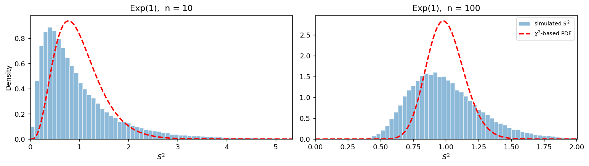

# S²의 표본분포 (Exponential)

## 개요

앞 페이지의 균등모집단에서는 $S^2$의 흔들림이 카이제곱 예측보다 **작았다.** 여기서는 방향이 뒤집힌다.

지수분포는 오른쪽으로 심하게 치우쳐 있고 첨도가 정규분포의 세 배다. 그래서 $S^2$의 분산이 카이제곱 예측의 **네 배**가 되고, 명목 95% 분산 신뢰구간이 실제로는 69%만 포함한다. **그리고 표본을 키우면 더 나빠진다.**

$\bar X$ 쪽 페이지와 나란히 놓고 읽으면 5장의 핵심이 드러난다. 같은 지수모집단에서 $\bar X$는 중심극한정리 덕분에 $n \ge 30$ 정도면 정규근사가 쓸 만해지는데, $S^2$은 $n = 1000$에서도 카이제곱 근사가 회복되지 않는다.

## 모집단 모형

$$
X \sim \text{Exp}(1), \qquad f(x) = e^{-x}, \quad x \ge 0
$$

$$
\mu = 1, \qquad \sigma^2 = 1
$$

$\text{Exp}(\lambda)$의 $k$차 원점적률이 $E[X^k] = k!/\lambda^k$이므로, $\lambda = 1$에서 중심적률을 계산하면

$$
\mu_3 = 2, \qquad \mu_4 = 9, \qquad \kappa = \frac{\mu_4}{\sigma^4} = 9
$$

이다. 초과첨도가 $6$으로 정규분포보다 꼬리가 훨씬 무겁다. 이 하나의 수가 이 페이지의 모든 결과를 결정한다.

## 표본분포 이론

불편성은 여기서도 유지된다.

$$
E[S^2] = \sigma^2 = 1
$$

분산은 첨도를 통해 어긋난다.

$$
\text{Var}(S^2) = \frac{1}{n}\left(\kappa - \frac{n-3}{n-1}\right)\sigma^4, \qquad
\frac{\text{Var}(S^2)}{2\sigma^4/(n-1)} \;\xrightarrow{\;n \to \infty\;}\; \frac{\kappa-1}{2} = 4
$$

!!! danger "폭이 두 배, 그리고 표본을 키워도 그대로다"
    분산이 네 배이므로 표준편차는 **두 배**다. 카이제곱 모형은 $S^2$이 실제보다 절반만 흔들린다고 믿고 구간을 짜므로, 구간이 절반 폭으로 좁다.

    배율 4는 $n$과 무관하다. $\bar X$의 정규근사는 $n$을 키우면 좋아지지만, $S^2$의 카이제곱 근사는 **좋아지지 않는다.**

### $\bar X$와 $S^2$이 양의 상관을 갖는다

$$
\text{Cov}(\bar X, S^2) = \frac{\mu_3}{n} = \frac{2}{n}
$$

치우친 모집단에서는 $\mu_3 \ne 0$이므로 두 통계량이 상관을 갖는다. 상관계수는

$$
\text{corr}(\bar X, S^2) = \frac{\mu_3/n}{\sqrt{\sigma^2/n}\sqrt{(\kappa-1)\sigma^4/n}} = \frac{\mu_3}{\sigma\sqrt{(\kappa-1)\sigma^4}} = \frac{2}{\sqrt 8} = 0.707
$$

로 **$n$에 의존하지 않는다.** 모의실험에서도 $n = 10$과 $n = 100$에서 모두 $+0.70$ 근처로 나온다.

실무적으로 뼈아픈 결과다. 큰 표본이 우연히 큰 $\bar X$를 주면 $S^2$도 함께 커지므로, $t$ 통계량의 분자와 분모가 같은 방향으로 움직인다. 치우친 자료에서 $t$ 검정이 한쪽으로 치우친 오류를 내는 원인이 여기에 있다. 정규모집단에서 $\bar X \perp S^2$이라는 성질이 왜 그렇게 중요한지를 거꾸로 보여 준다.

## 모의실험

<div class="codebox" markdown>

### 예제 1. 지수모집단에서 S²의 표집분포 { .eg }

```python
import matplotlib.pyplot as plt
import numpy as np
from scipy import stats

rng = np.random.default_rng(1)

fig, axes = plt.subplots(1, 2, figsize=(12, 3.5))
for ax, n in zip(axes, (10, 100)):
    s2 = rng.exponential(size=(100_000, n)).var(axis=1, ddof=1)

    # 꼬리가 아주 길다. n=10 에서는 S^2 이 18을 넘는 표본도 나오므로
    # 99.5백분위에서 자르지 않으면 가운데가 뭉개져 보이지 않는다.
    hi = np.percentile(s2, 99.5)
    _, bins, _ = ax.hist(s2, bins=60, range=(0, hi), density=True,
                         alpha=0.5, edgecolor="white", label=r"simulated $S^2$")

    df, sigma2 = n - 1, 1.0
    c = df / sigma2
    g = np.linspace(1e-6, hi, 300)
    ax.plot(g, stats.chi2(df).pdf(g * c) * c, "--r", lw=2, label=r"$\chi^2$-based PDF")

    ax.set_title(f"Exp(1),  n = {n}")
    ax.set_xlabel(r"$S^2$")
    ax.set_xlim(0, hi)

axes[0].set_ylabel("Density")
axes[1].legend(fontsize=8)
plt.tight_layout()
plt.show()
```



$n = 100$ 패널을 보라. 히스토그램이 빨간 곡선보다 **뚜렷이 낮고 넓다.** 두 분포 모두 종 모양에 가까워졌지만 폭이 두 배 차이 난다. **모양이 닮아 가는 것과 폭이 맞는 것은 다른 이야기**임을 보여 주는 그림이다.

</div>

<div class="codebox" markdown>

### 예제 2. 포함률은 표본을 키우면 더 나빠진다 { .eg }

```python
import numpy as np
from scipy import stats

rng = np.random.default_rng(1)
sigma2 = 1.0             # Exp(1)의 참 분산

print("명목 신뢰수준 95%")
for n in (10, 30, 100, 1000):
    s2 = rng.exponential(size=(100_000, n)).var(axis=1, ddof=1)
    lo, hi = stats.chi2(n - 1).ppf([0.025, 0.975])
    cover = np.mean(((n - 1) * s2 / hi <= sigma2) & (sigma2 <= (n - 1) * s2 / lo))
    print(f"n = {n:>4}:  실제 포함률 {cover:.3f}")
```

출력:

```
명목 신뢰수준 95%
n =   10:  실제 포함률 0.766
n =   30:  실제 포함률 0.718
n =  100:  실제 포함률 0.689
n = 1000:  실제 포함률 0.674
```

**포함률이 표본크기와 함께 내려간다.** $n$이 작을 때는 카이제곱분포 자체가 넓어서 어긋남이 일부 가려지는데, $n$이 커지면 그 완충이 사라지고 첨도로 인한 어긋남만 남는다. 극한값은 정규근사로 계산할 수 있다(연습문제 3).

</div>

## 해석

!!! note "주요 관찰"

    1. **중심은 맞고 폭이 틀렸다.** $E[S^2] = 1$은 정확하지만 표준편차가 카이제곱 예측의 두 배다.
    2. **어긋남의 방향이 위험하다.** 구간이 너무 좁아 명목 95%가 실제 69%다. 실제로는 다르지 않은 분산을 "유의하게 다르다"고 판정하게 된다.
    3. **표본크기가 해결해 주지 않는다.** 균등모집단에서는 0.998로 굳었고 여기서는 0.674로 내려간다. 어느 쪽이든 0.95로 돌아오지 않는다.
    4. **$\bar X$와 $S^2$이 상관 $+0.71$로 얽혀 있다.** 정규모집단의 독립성이 깨지며, 이 상관도 $n$에 의존하지 않는다.

!!! warning "$\bar X$와 $S^2$은 가정에 대한 민감도가 다르다"
    같은 지수모집단에서

    - $\bar X$: 중심극한정리가 모집단의 치우침을 씻어 낸다. $n$을 키우면 좋아진다.
    - $S^2$: 카이제곱 결과가 정규성 자체에 기대고 있다. $n$을 키워도 좋아지지 않는다.

    **평균에 관한 추론은 웬만큼 강건하지만 분산에 관한 추론은 그렇지 않다.** 4장에서 $F$ 검정(등분산 검정)을 권하지 않은 이유이고, 실무에서 분산 비교에 르빈 검정이나 부트스트랩을 쓰는 이유다.

## 연습문제

<div class="drillbox" markdown>

**연습문제 1.** <span class="diff med" title="중간"></span>
$X \sim \text{Exp}(1)$에 대해 $E[X^k] = k!$임을 이용해 $\mu_3 = 2$, $\mu_4 = 9$를 구하고 첨도 $\kappa = 9$를 확인하라. 이 값이 $\lambda$에 의존하는가?

</div>

??? success "풀이"
    $\mu = 1$이므로 중심적률을 원점적률로 전개한다. $E[X^k] = k!$이므로 $E[X]=1$, $E[X^2]=2$, $E[X^3]=6$, $E[X^4]=24$이고

    $$
    \mu_3 = E[X^3] - 3\mu E[X^2] + 2\mu^3 = 6 - 6 + 2 = 2
    $$

    $$
    \mu_4 = E[X^4] - 4\mu E[X^3] + 6\mu^2E[X^2] - 3\mu^4 = 24 - 24 + 12 - 3 = 9
    $$

    이다. $\sigma^2 = 1$이므로 $\kappa = 9$, 왜도는 $\mu_3/\sigma^3 = 2$다.

    **$\lambda$에 의존하지 않는다.** 왜도와 첨도는 척도에 불변이고 $\text{Exp}(\lambda)$는 $\text{Exp}(1)$을 $1/\lambda$배 한 것이기 때문이다. 어떤 비율모수를 쓰든 배율은 언제나 4다.

<div class="drillbox" markdown>

**연습문제 2.** <span class="diff med" title="중간"></span>
$n = 100$에서 $S^2$의 표준편차를 (a) 참 공식과 (b) 카이제곱 예측으로 각각 구해 비교하라. 카이제곱 기반 95% 구간의 폭은 실제 필요한 것의 몇 배인가?

</div>

??? success "풀이"
    **(a) 참값.** $\kappa = 9$, $\sigma^4 = 1$, $n = 100$이므로

    $$
    \text{Var}(S^2) = \frac{1}{100}\left(9 - \frac{97}{99}\right) = \frac{8.0202}{100} = 0.0802, \qquad \text{SD} = 0.283
    $$

    **(b) 카이제곱 예측.**

    $$
    \frac{2\sigma^4}{n-1} = \frac{2}{99} = 0.0202, \qquad \text{SD} = 0.142
    $$

    비가 $0.283/0.142 = 1.99$로 두 배다. 모의실험에서 얻은 $\text{Var}(S^2) = 0.0805$와도 맞는다.

    **구간 폭.** 카이제곱 구간은 실제 필요한 폭의 **절반**이다. 거꾸로 말하면 제대로 된 구간은 카이제곱 구간보다 두 배 넓어야 한다. 포함률이 0.95에서 0.69로 떨어지는 크기가 이 정도 왜곡에서 나온다.

<div class="drillbox" markdown>

**연습문제 3.** <span class="diff hard" title="어려움"></span>
$n \to \infty$에서 카이제곱 기반 95% 구간의 포함률이 어떤 값으로 수렴하는지 계산하라. 예제 2의 0.674와 맞는가?

</div>

??? success "풀이"
    $n$이 크면 두 분포 모두 정규로 근사된다. 참 분포는

    $$
    S^2 \;\dot\sim\; N\!\left(\sigma^2,\ \frac{(\kappa-1)\sigma^4}{n}\right), \qquad \text{SD}_{\text{참}} = \sigma^2\sqrt{\frac{\kappa-1}{n}}
    $$

    이고, 카이제곱 구간은 $S^2$의 표준편차를 $\text{SD}_{\chi^2} = \sigma^2\sqrt{2/n}$로 믿고 $\pm 1.96\,\text{SD}_{\chi^2}$만큼 뻗는다. 따라서 구간이 참 표준편차 단위로는

    $$
    \pm 1.96\cdot\frac{\text{SD}_{\chi^2}}{\text{SD}_{\text{참}}} = \pm 1.96\sqrt{\frac{2}{\kappa-1}} = \pm\frac{1.96}{2} = \pm 0.98
    $$

    만큼만 뻗는다. 그러므로 포함률의 극한은

    $$
    P(|Z| \le 0.98) = 2\Phi(0.98) - 1 = 0.673
    $$

    이다. **예제 2의 $n = 1000$ 값 0.674와 소수 셋째 자리까지 맞는다.** $\square$

    이 계산은 일반적인 공식을 준다. 명목 신뢰수준 $1-\alpha$에서 극한 포함률은

    $$
    2\Phi\!\left(z_{1-\alpha/2}\sqrt{\frac{2}{\kappa-1}}\right) - 1
    $$

    이다. 균등분포($\kappa = 1.8$)를 넣으면 $2\Phi(1.96\sqrt{2.5}) - 1 = 2\Phi(3.10) - 1 = 0.998$로 앞 페이지의 값이 나온다. **첨도 하나만 알면 카이제곱 구간이 얼마나 망가지는지 미리 계산할 수 있다.**

<div class="drillbox" markdown>

**연습문제 4.** <span class="diff med" title="중간"></span>
$\text{corr}(\bar X, S^2) = 0.707$이 $n$과 무관함을 보이고, 이것이 $t$ 통계량에 어떤 영향을 주는지 설명하라.

</div>

??? success "풀이"
    $\text{Cov}(\bar X, S^2) = \mu_3/n$이고 $\text{Var}(\bar X) = \sigma^2/n$, $\text{Var}(S^2) \approx (\kappa-1)\sigma^4/n$이므로

    $$
    \text{corr} = \frac{\mu_3/n}{\sqrt{\sigma^2/n}\cdot\sqrt{(\kappa-1)\sigma^4/n}} = \frac{\mu_3}{\sigma^3\sqrt{\kappa-1}}
    $$

    이다. 분자와 분모가 모두 $1/n$이라 **$n$이 약분된다.** 지수분포는 $\mu_3 = 2$, $\sigma = 1$, $\kappa = 9$이므로 $2/\sqrt 8 = 0.707$이다. $\square$

    분자의 $\mu_3/\sigma^3$은 왜도이므로, 이 상관계수는 왜도를 $\sqrt{\kappa-1}$로 나눈 것이다. **모집단이 치우친 만큼 $\bar X$와 $S^2$이 얽힌다.**

    **$t$ 통계량에 미치는 영향.** $t = (\bar X - \mu)/(S/\sqrt n)$에서 분자가 크면 분모도 함께 커진다. 오른쪽으로 치우친 모집단에서 $\bar X$가 우연히 크게 나온 표본은 $S$도 크므로 $t$가 그만큼 커지지 못하고, 반대로 $\bar X$가 작으면 $S$도 작아 $t$가 더 음수 쪽으로 간다. 그 결과 $t$의 분포가 **왼쪽으로 치우친다.** 단측검정의 실제 유의수준이 한쪽은 명목보다 높고 다른 쪽은 낮아진다.

    치우친 자료에서 $t$ 검정의 양측 오류율이 그럭저럭 맞는 것도 이 때문이다. 두 꼬리의 오차가 서로 상쇄되기 때문이며, 단측검정에서는 상쇄가 일어나지 않아 문제가 드러난다.

<div class="drillbox" markdown>

**연습문제 5.** <span class="diff med" title="중간"></span>
지수모집단의 분산에 대한 신뢰구간이 꼭 필요하다면 어떤 방법을 쓰겠는가? 세 가지를 들고 각각의 전제를 밝혀라.

</div>

??? success "풀이"
    **(1) 모집단이 지수라는 것을 안다면 정확한 방법이 있다.** 4장 지수분포 연습문제에서 본 $2\lambda\sum_i X_i \sim \chi^2_{2n}$을 쓰면 $\lambda$의 정확한 구간을 얻고, 지수분포에서는 $\sigma^2 = 1/\lambda^2$이므로 변환해서 분산의 구간으로 옮길 수 있다. **전제가 강하다**(분포족을 알아야 한다).

    **(2) 첨도를 추정해 정규근사를 쓴다.**

    $$
    s^2 \pm z_{1-\alpha/2}\,s^2\sqrt{\frac{\hat\kappa - 1}{n}}
    $$

    전제는 $n$이 충분히 커서 $S^2$의 정규근사가 통하고 $\hat\kappa$가 안정적이라는 것이다. 문제는 **$\hat\kappa$ 자체가 4차 적률 추정이라 매우 불안정**하다는 점이다. 꼬리가 두꺼운 자료에서 표본첨도는 표본크기에 따라 계속 커지기도 한다.

    **(3) 부트스트랩.** $S^2$의 표집분포를 재표집으로 직접 추정한다. 분포족도 첨도 공식도 필요 없고, 전제는 표본이 모집단을 대표한다는 것과 4차 적률이 유한하다는 것뿐이다. 5장의 부트스트랩 표준오차 페이지에서 다룬다. 실무의 기본 선택이다.

    한 가지 덧붙이면, 애초에 **분산 자체가 관심사인지 되물을 필요**가 있다. 치우친 자료에서는 분산보다 사분위범위나 로그 변환 후의 산포가 더 뜻 있는 요약일 때가 많다.

<div class="drillbox" markdown>

**연습문제 6.** <span class="diff med" title="중간"></span>
지수모집단에서 $\bar X$와 $S^2$의 민감도 차이를 표로 정리하고, "$n \ge 30$이면 괜찮다"는 규칙이 어느 쪽에 적용되는지 밝혀라.

</div>

??? success "풀이"

    | | $\bar X$ | $S^2$ |
    |---|---|---|
    | 기대는 정리 | 중심극한정리 | $(n-1)S^2/\sigma^2 \sim \chi^2_{n-1}$ |
    | 정리의 전제 | 유한한 분산만 | **정규모집단** |
    | 모집단 치우침의 영향 | $n$이 커지면 사라진다 | $n$과 무관하게 남는다 |
    | 관련 적률 | 2차(분산) | **4차(첨도)** |
    | $n = 1000$에서 | 정규근사 정확 | 포함률 0.674 |

    **"$n \ge 30$" 규칙은 $\bar X$에만 적용된다.** 이 규칙은 중심극한정리의 수렴 속도에 관한 경험칙이고, $S^2$의 카이제곱 관계는 수렴의 문제가 아니라 **전제의 문제**다. 정규성이 깨지면 $n$을 늘려도 다른 분포로 수렴하는 것이 아니라 애초에 틀린 분포를 쓰고 있는 것이다.

    한 걸음 더 나아가면, 규칙 자체도 $\bar X$에 대해서조차 무비판적으로 쓸 수 없다. 4장에서 본 것처럼 지수모집단의 합은 왜도가 $2/\sqrt n$로 줄어들어 $n = 30$에서 0.37이 남고, **꼬리 확률**을 다루는 경우에는 그 정도로도 부족하다.

---

## 정리하며

- 지수모집단에서 $S^2$의 분산은 카이제곱 예측의 **4배**(표준편차 2배)다. 첨도 $\kappa = 9$ 하나가 이 배율 $(\kappa-1)/2$를 정한다.
- 어긋남의 방향이 위험한 쪽이다. 명목 95% 분산 신뢰구간의 실제 포함률이 **0.69**이고, $n$을 키우면 극한값 $2\Phi(0.98)-1 = 0.673$으로 오히려 내려간다.
- $\text{Cov}(\bar X, S^2) = \mu_3/n \ne 0$이라 두 통계량이 상관 $+0.71$로 얽힌다. 정규모집단의 독립성이 깨지고, 그 결과 $t$ 통계량의 분포가 치우친다.
- **$\bar X$는 정리의 수렴이 문제이고 $S^2$은 정리의 전제가 문제다.** 그래서 표본크기가 $\bar X$는 구해 주지만 $S^2$은 구해 주지 못한다.
- 다음 페이지에서는 카이제곱 결과가 **정확한** 정규모집단으로 돌아가 기준선을 확인하고, 그다음 베르누이모집단에서 가장 극단적인 경우를 본다. 거기서는 $S^2$이 $\bar X$의 **함수**가 되어 버린다.
