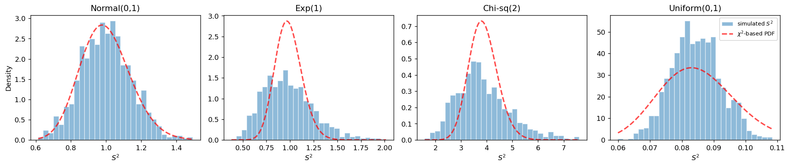

# S-squared의 표본분포 (Normal)

## 개요

$\bar{X}$의 표본분포가 평균의 추정에서 중심이 된다면, 표본분산 $S^2$의 표본분포는 변동성에 관한 추론에 필수적이다. 모집단이 정규이면 $S^2$의 분포가 카이제곱 분포와 정확히 연결된다. 정규가 아닌 모집단에서는 카이제곱 관계가 근사에 그치지만 표본크기가 커질수록 좋아진다. 이 페이지에서는 정확한 이론과 모의실험 증거를 모두 살펴본다.

## 정의

평균이 $\mu$, 분산이 $\sigma^2$인 모집단에서 뽑은 확률표본 $X_1, \ldots, X_n$에 대해 **표본분산**은:

$$
S^2 = \frac{1}{n-1}\sum_{i=1}^n (X_i - \bar{X})^2
$$

($n$이 아닌) $n - 1$이라는 인수가 $S^2$을 $\sigma^2$의 불편추정량으로 만든다:

$$
E[S^2] = \sigma^2
$$

## 정규모집단에 대한 정확한 결과

<div class="thmbox" markdown>

### 정리 1. { .thm }

$X_1, \ldots, X_n \overset{\text{iid}}{\sim} N(\mu, \sigma^2)$이면:

$$
\frac{(n-1)S^2}{\sigma^2} \sim \chi^2(n-1)
$$

또한 $\bar{X}$와 $S^2$은 독립이다.

</div>

이 결과로부터 $S^2$ 자체의 분포는 다음과 같이 쓸 수 있다:

$$
S^2 \sim \frac{\sigma^2}{n-1} \cdot \chi^2(n-1)
$$

(정규인 경우) $S^2$의 평균과 분산은:

$$
E[S^2] = \sigma^2, \qquad \text{Var}(S^2) = \frac{2\sigma^4}{n-1}
$$

## 정규가 아닌 모집단

정규가 아닌 모집단에서는 카이제곱 관계가 정확히 성립하지 않는다. 다만:

- $S^2$은 여전히 불편이다: $E[S^2] = \sigma^2$.
- $S^2$의 분산은 모집단 첨도 $\kappa$에 의존한다:

$$
\text{Var}(S^2) = \frac{1}{n}\left(\kappa - \frac{n-3}{n-1}\right)\sigma^4
$$

여기서 $\kappa = E[(X - \mu)^4] / \sigma^4$는 첨도이다. 정규분포에서는 $\kappa = 3$이므로 이 식은 $2\sigma^4/(n-1)$로 간단해진다.

## 모의실험

아래 코드는 네 가지 서로 다른 모집단(Normal, Exponential, Chi-squared, Uniform)에서 각각 $n = 100$으로 $S^2$의 표본분포를 모의실험하고 이론적 카이제곱 밀도를 겹쳐 그린다.

```python
import matplotlib.pyplot as plt
import numpy as np
import scipy.stats as stats

np.random.seed(1)

n_population = 10_000
n_sample = 100
n_sim = 1_000

# 모집단 넷을 준비한다. 정규 하나와 정규가 아닌 셋이다.
# 카이제곱 결과는 정규모집단에서만 정확하므로,
# 나머지 셋에서 어긋나는 모습을 보는 것이 이 그림의 목적이다.
# random_state를 각각 다르게 주어 네 모집단이 서로 무관하게 만든다.
populations = {
    "Normal(0,1)":  stats.norm().rvs(n_population, random_state=1),
    "Exp(1)":       stats.expon().rvs(n_population, random_state=2),
    "Chi-sq(2)":    stats.chi2(df=2).rvs(n_population, random_state=3),
    "Uniform(0,1)": stats.uniform().rvs(n_population, random_state=4),
}

fig, axes = plt.subplots(1, len(populations), figsize=(16, 3.5))

for ax, (name, population) in zip(axes, populations.items()):
    # Simulate sampling distribution of S^2
    s2_sims = np.array([
        np.random.choice(population, size=n_sample, replace=False).var(ddof=1)
        for _ in range(n_sim)
    ])

    # Histogram
    _, bins, _ = ax.hist(s2_sims, density=True, bins=30,
                         alpha=0.5, edgecolor="white",
                         label=r"simulated $S^2$")

    # 이론적 카이제곱 밀도를 S^2 의 눈금으로 옮겨 그린다.
    # 정리는 (n-1)S^2/sigma^2 ~ chi^2(n-1) 이므로
    # S^2 = (sigma^2/(n-1)) * chi^2 = X/c  (단, c = (n-1)/sigma^2) 이다.
    #
    # 변수변환 Y = X/c 의 밀도는 f_Y(y) = f_X(cy) * c 다.
    # 마지막에 곱하는 c 가 그 야코비안이며, 이것을 빠뜨리면
    # 곡선의 넓이가 1이 되지 않아 히스토그램과 눈금이 어긋난다.
    df = n_sample - 1
    sigma2 = population.var()
    c = df / sigma2
    x_grid = np.linspace(bins[0], bins[-1], 300)
    pdf = stats.chi2(df).pdf(x_grid * c) * c
    ax.plot(x_grid, pdf, "--r", lw=2, alpha=0.7,
            label=r"$\chi^2$-based PDF")

    ax.set_title(name)
    ax.set_xlabel(r"$S^2$")

axes[0].set_ylabel("Density")
axes[-1].legend(fontsize=8)
plt.tight_layout()
plt.show()
```



## 해석

!!! note "주요 관찰"

    1. **정규모집단**: 모의실험한 $S^2$의 분포가 카이제곱 기반 밀도와 거의 완벽하게 일치한다. 정확한 이론적 결과를 확인해 준다.
    2. **Exponential과 Chi-squared 모집단**: 오른쪽으로 치우쳐 있어 $S^2$의 표본분포가 더 넓게 퍼지고 카이제곱 곡선은 근사에 그친다. $n$이 커지면 적합이 좋아진다.
    3. **Uniform 모집단**: 균등분포는 꼬리가 가벼워(첨도 $< 3$) $S^2$의 변동성이 카이제곱 모형이 예측하는 것보다 **작다**. 적합은 그럭저럭 괜찮지만 정확하지는 않다.
    4. $n = 100$에서는 네 모집단 모두에서 카이제곱 근사를 쓸 만하며, $S^2$에 대해서도 중심극한정리와 비슷한 수렴이 나타남을 보여 준다.

## 연습문제

<div class="drillbox" markdown>

**연습문제 1.** $X_1, \ldots, X_{10} \overset{\text{iid}}{\sim} N(0, 4)$일 때 $P(S^2 > 6)$을 구하라.

</div>

??? success "풀이"
    여기서 $\sigma^2 = 4$, $n = 10$이므로 $\frac{(n-1)S^2}{\sigma^2} = \frac{9S^2}{4} \sim \chi^2(9)$이다.

    구해야 할 것은:

    $$
    P(S^2 > 6) = P\!\left(\frac{9S^2}{4} > \frac{9 \cdot 6}{4}\right) = P(\chi^2(9) > 13.5)
    $$

    Python으로:

    ```python
    from scipy import stats
    p = 1 - stats.chi2.cdf(13.5, df=9)
    print(f"P(S^2 > 6) = {p:.4f}")
    ```

    출력:

    ```
    P(S^2 > 6) = 0.1413
    ```

    결과는 $P(\chi^2(9) > 13.5) \approx 0.1415$이다. $\square$

<div class="drillbox" markdown>

**연습문제 2.** (정규분포뿐 아니라) 임의의 모집단에 대해 $E[S^2] = \sigma^2$임을 증명하라.

</div>

??? success "풀이"
    정의에서 출발한다:

    $$
    S^2 = \frac{1}{n-1}\sum_{i=1}^n (X_i - \bar{X})^2
    $$

    합을 전개하면:

    $$
    \sum_{i=1}^n (X_i - \bar{X})^2 = \sum_{i=1}^n X_i^2 - n\bar{X}^2
    $$

    기댓값을 취하면:

    $$
    E\!\left[\sum_{i=1}^n X_i^2\right] = n E[X_i^2] = n(\sigma^2 + \mu^2)
    $$

    $$
    E[n\bar{X}^2] = n\!\left(\text{Var}(\bar{X}) + (E[\bar{X}])^2\right) = n\!\left(\frac{\sigma^2}{n} + \mu^2\right) = \sigma^2 + n\mu^2
    $$

    따라서:

    $$
    E\!\left[\sum_{i=1}^n (X_i - \bar{X})^2\right] = n(\sigma^2 + \mu^2) - \sigma^2 - n\mu^2 = (n-1)\sigma^2
    $$

    $n - 1$로 나누면:

    $$
    E[S^2] = \sigma^2
    $$

    $\square$

<div class="drillbox" markdown>

**연습문제 3.** $\text{Var}(\chi^2(k)) = 2k$라는 사실을 사용하여 모집단이 정규일 때 $\text{Var}(S^2) = 2\sigma^4/(n-1)$임을 보여라.

</div>

??? success "풀이"
    정리에 의해 $\frac{(n-1)S^2}{\sigma^2} \sim \chi^2(n-1)$이다.

    $Q = \frac{(n-1)S^2}{\sigma^2}$라 하면 $S^2 = \frac{\sigma^2 Q}{n-1}$이므로:

    $$
    \text{Var}(S^2) = \frac{\sigma^4}{(n-1)^2} \cdot \text{Var}(Q) = \frac{\sigma^4}{(n-1)^2} \cdot 2(n-1) = \frac{2\sigma^4}{n-1}
    $$

    $\square$

<div class="drillbox" markdown>

**연습문제 4.** $\lambda = 1$인 Exponential 모집단의 첨도는 $\kappa = 9$이다. $n = 100$에서 이론적 $\text{Var}(S^2)$을 계산하고 (정규이론 값인) $2\sigma^4/(n-1)$과 비교하라.

</div>

??? success "풀이"
    $\text{Exp}(1)$에서 $\sigma^2 = 1$, $\kappa = 9$이다.

    $S^2$의 분산에 대한 일반 공식은:

    $$
    \text{Var}(S^2) = \frac{1}{n}\left(\kappa - \frac{n-3}{n-1}\right)\sigma^4
    $$

    $n = 100$이면:

    $$
    \text{Var}(S^2) = \frac{1}{100}\left(9 - \frac{97}{99}\right) \cdot 1 = \frac{1}{100}\left(9 - 0.9798\right) = \frac{8.0202}{100} = 0.08020
    $$

    정규이론 값은:

    $$
    \frac{2\sigma^4}{n-1} = \frac{2}{99} \approx 0.02020
    $$

    Exponential 모집단에서 $S^2$의 분산이 정규이론 값보다 약 4배 크다. Exponential 분포의 두꺼운 꼬리(초과첨도 $= 6$) 때문에 $S^2$의 변동성이 커지기 때문이다. $\square$

<div class="drillbox" markdown>

**연습문제 5.** 카이제곱 분포를 사용하여 $\sigma^2$에 대한 95% 신뢰구간을 구성하라. 정규모집단에서 $n = 25$개의 관측값으로 $S^2 = 12$를 얻었다고 하자.

</div>

??? success "풀이"
    $(n-1)S^2/\sigma^2 \sim \chi^2(n-1)$이므로:

    $$
    P\!\left(\chi^2_{0.025}(24) \le \frac{24 S^2}{\sigma^2} \le \chi^2_{0.975}(24)\right) = 0.95
    $$

    $\sigma^2$에 대해 정리하면:

    $$
    \frac{24 S^2}{\chi^2_{0.975}(24)} \le \sigma^2 \le \frac{24 S^2}{\chi^2_{0.025}(24)}
    $$

    카이제곱 분포표(또는 Python)에서:

    ```python
    from scipy import stats

    # 자유도 24인 카이제곱 분포의 양쪽 2.5% 지점.
    # 정규분포와 달리 두 값이 0을 중심으로 대칭이 아니다.
    lower_chi2 = stats.chi2.ppf(0.025, df=24)
    upper_chi2 = stats.chi2.ppf(0.975, df=24)
    print(f"chi2_0.025(24) = {lower_chi2:.4f}")
    print(f"chi2_0.975(24) = {upper_chi2:.4f}")

    # 신뢰구간. 큰 분위수가 **아래쪽** 한계를 만든다는 점에 주의하라.
    # sigma^2 이 분모에 있으므로 부등식을 뒤집으면 순서가 바뀐다.
    S2, n = 12, 25
    print(f"95% CI = ({(n-1)*S2/upper_chi2:.2f}, {(n-1)*S2/lower_chi2:.2f})")
    ```

    출력:

    ```
    chi2_0.025(24) = 12.4012
    chi2_0.975(24) = 39.3641
    95% CI = (7.32, 23.22)
    ```

    $$
    \frac{24 \times 12}{39.36} \le \sigma^2 \le \frac{24 \times 12}{12.40}
    $$

    $$
    7.32 \le \sigma^2 \le 23.22
    $$

    $\sigma^2$에 대한 95% 신뢰구간은 약 $(7.32, 23.22)$이다. 카이제곱 분포가 치우쳐 있으므로 이 구간이 $S^2 = 12$를 중심으로 대칭이 아님에 유의하라. $\square$

---

## 정리하며

$S^2$ 의 표본분포는 정규모집단에서 **카이제곱과 정확히 연결된다.**

$$
\frac{(n-1)S^2}{\sigma^2} \sim \chi^2_{n-1}
$$

- **$n-1$ 로 나누는 이유가 불편성이다.** $\mathbb{E}[S^2]=\sigma^2$ 이며, 자유도 하나를 잃는 것은 $\bar X$ 를 자료에서 정하느라 편차들이 $\sum(X_i-\bar X)=0$ 이라는 제약을 받기 때문이다.
- **불편이라고 좋기만 한 것은 아니다.** $S$ 는 $\sigma$ 의 불편추정량이 **아니다**. 제곱근이 비선형이라 $\mathbb{E}[S]<\sigma$ 이며, 불편성은 제곱 척도에서만 성립한다.
- **정규가 아니면 근사로 내려앉는다.** 카이제곱 관계는 정규모집단에서만 정확하고, 일반적으로는 $\sqrt n(S^2-\sigma^2)$ 이 점근적으로 정규이되 그 분산이 **4차적률**에 의존한다.
- **그래서 $S^2$ 은 $\bar X$ 보다 가정에 훨씬 민감하다.** 꼬리가 두꺼운 자료에서는 4차적률이 무한할 수 있고, 그러면 어떤 근사도 성립하지 않는다.

다음 절 **$\bar X$ 의 표준오차**로 넘어간다. 표본분포의 폭을 하나의 수로 요약하는 양이며, 표본크기 설계가 모두 여기서 나온다.
