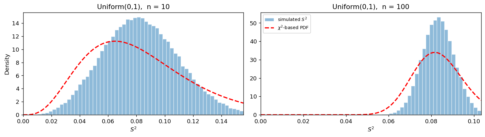

# S²의 표본분포 (Uniform)

## 개요

$\bar X$의 표본분포는 모집단이 무엇이든 중심극한정리를 타고 정규분포로 간다. $S^2$은 그렇지 않다. 카이제곱 결과

$$
\frac{(n-1)S^2}{\sigma^2} \sim \chi^2_{n-1}
$$

는 **정규모집단에서만** 성립하며, 다른 모집단에서는 모집단의 4차 적률이 그대로 드러난다.

이 페이지는 균등모집단을 본다. 균등분포는 **꼬리가 가벼워**(첨도가 정규보다 작다) $S^2$의 흔들림이 카이제곱이 예측하는 것보다 **작다.** 그래서 카이제곱에 기댄 분산 신뢰구간은 지나치게 넓어지고, 명목 95% 구간이 실제로는 99%를 넘게 포함한다.

## 모집단 모형

$$
X \sim \text{Uniform}(0, 1), \qquad f(x) = 1, \quad 0 \le x \le 1
$$

$$
\mu = \frac12, \qquad \sigma^2 = \frac{1}{12} = 0.0833
$$

$S^2$의 거동을 정하는 것은 평균이나 분산이 아니라 **4차 적률**이다.

$$
\mu_4 = E[(X-\mu)^4] = \int_0^1 \left(x - \tfrac12\right)^4 dx = \frac{1}{80}, \qquad \beta_2 = \frac{\mu_4}{\sigma^4} = \frac{144}{80} = 1.8
$$

정규분포의 첨도 3보다 한참 작다(초과첨도 $-1.2$). 균등분포에는 꼬리라 할 것이 아예 없으니 당연하다.

## 표본분포 이론

불편성은 모집단을 가리지 않는다. 어떤 모집단에서도

$$
E[S^2] = \sigma^2
$$

이다. 달라지는 것은 분산이다.

$$
\text{Var}(S^2) = \frac{1}{n}\left(\beta_2 - \frac{n-3}{n-1}\right)\sigma^4
$$

카이제곱 모형이 예측하는 값은 $2\sigma^4/(n-1)$이므로, 둘의 비는

$$
\frac{\text{Var}(S^2)}{2\sigma^4/(n-1)} = \frac{n-1}{2n}\left(\beta_2 - \frac{n-3}{n-1}\right) \;\xrightarrow{\;n \to \infty\;}\; \frac{\beta_2 - 1}{2}
$$

이다. 균등분포는 $\beta_2 = 1.8$이므로 **배율이 $0.4$**다.

!!! danger "이 어긋남은 표본을 키워도 사라지지 않는다"
    극한이 $(\beta_2-1)/2$로 **$n$에 의존하지 않는다.** 정규모집단이면 $\beta_2 = 3$이라 배율이 정확히 1이 되지만, 균등모집단에서는 $n$이 아무리 커져도 $S^2$의 분산이 카이제곱 예측의 40%에 머문다. 표준편차로는 $\sqrt{0.4} = 0.63$배다.

    $\bar X$와 대조적이다. $\bar X$는 모집단이 무엇이든 정규로 수렴하지만, $S^2$의 **분포 모양**은 정규로 가도 그 **폭**은 끝까지 첨도에 매여 있다.

### X̄와 S²의 상관

일반적으로

$$
\text{Cov}(\bar X, S^2) = \frac{\mu_3}{n}
$$

이며 $\mu_3$은 모집단의 3차 중심적률이다. 균등분포는 대칭이라 $\mu_3 = 0$이므로 **$\bar X$와 $S^2$은 무상관**이다.

그러나 **독립은 아니다.** $\bar X$가 0 근처에 있다면 표본의 모든 값이 0 근처에 몰려 있다는 뜻이므로 $S^2$도 작을 수밖에 없다. 상관계수는 선형 관계만 재기 때문에 이 관계를 놓친다. 4.3절에서 본 "무상관이라고 독립은 아니다"가 실물로 나타난 것이며, $\bar X$와 $S^2$이 정말로 독립인 것은 **정규모집단뿐**이다.

## 모의실험

<div class="codebox" markdown>

### 예제 1. 균등모집단에서 S²의 표집분포 { .eg }

```python
import matplotlib.pyplot as plt
import numpy as np
from scipy import stats

rng = np.random.default_rng(1)

fig, axes = plt.subplots(1, 2, figsize=(12, 3.5))
for ax, n in zip(axes, (10, 100)):
    # 표본을 10만 번 뽑아 매번 S^2 을 기록한다. 이 값들의 분포가 표집분포다.
    s2 = rng.uniform(size=(100_000, n)).var(axis=1, ddof=1)

    # 오른쪽 꼬리의 극단값 때문에 가로축이 늘어나지 않도록 99.5백분위에서 자른다.
    hi = np.percentile(s2, 99.5)
    _, bins, _ = ax.hist(s2, bins=60, range=(0, hi), density=True,
                         alpha=0.5, edgecolor="white", label=r"simulated $S^2$")

    # 카이제곱이 예측하는 밀도를 S^2 의 눈금으로 옮겨 그린다.
    #   (n-1)S^2/sigma^2 ~ chi^2(n-1)  =>  S^2 = X/c,  c = (n-1)/sigma^2
    # 변수변환 Y = X/c 의 밀도는 f_X(cy)*c 이므로 마지막 c 가 야코비안이다.
    df, sigma2 = n - 1, 1 / 12
    c = df / sigma2
    g = np.linspace(1e-6, hi, 300)
    ax.plot(g, stats.chi2(df).pdf(g * c) * c, "--r", lw=2, label=r"$\chi^2$-based PDF")

    ax.set_title(f"Uniform(0,1),  n = {n}")
    ax.set_xlabel(r"$S^2$")
    ax.set_xlim(0, hi)

axes[0].set_ylabel("Density")
axes[1].legend(fontsize=8)
plt.tight_layout()
plt.show()
```



히스토그램이 빨간 곡선보다 **좁고 높다.** $n = 100$에서는 두 곡선이 같은 자리에 중심을 두면서도 폭이 뚜렷이 다르다는 것이 한눈에 보인다.

</div>

<div class="codebox" markdown>

### 예제 2. 분산 신뢰구간의 실제 포함률 { .eg }

```python
import numpy as np
from scipy import stats

rng = np.random.default_rng(1)
sigma2 = 1 / 12          # Uniform(0,1)의 참 분산

print("명목 신뢰수준 95%")
for n in (10, 30, 100, 1000):
    s2 = rng.uniform(size=(100_000, n)).var(axis=1, ddof=1)
    lo, hi = stats.chi2(n - 1).ppf([0.025, 0.975])
    # 카이제곱 구간: [(n-1)s^2/hi, (n-1)s^2/lo]
    cover = np.mean(((n - 1) * s2 / hi <= sigma2) & (sigma2 <= (n - 1) * s2 / lo))
    print(f"n = {n:>4}:  실제 포함률 {cover:.3f}")
```

출력:

```
명목 신뢰수준 95%
n =   10:  실제 포함률 0.992
n =   30:  실제 포함률 0.997
n =  100:  실제 포함률 0.998
n = 1000:  실제 포함률 0.998
```

**표본을 100배 키워도 0.95로 돌아오지 않는다.** 오히려 0.998에서 굳어 버린다. 구간이 실제 필요한 것보다 넓기 때문이며, 그 넓이의 비가 $n$과 무관한 $1/\sqrt{0.4} = 1.58$배이기 때문이다.

</div>

## 해석

!!! note "주요 관찰"

    1. **불편성은 살아남는다.** $E[S^2] = \sigma^2 = 1/12$이 모든 $n$에서 성립한다. 어긋나는 것은 중심이 아니라 **폭**이다.
    2. **카이제곱은 지나치게 넓다.** 균등분포는 꼬리가 가벼워 극단적인 $S^2$이 잘 나오지 않으므로, 실제 분산이 예측의 40%에 그친다.
    3. **$n$을 키워도 고쳐지지 않는다.** 배율 $(\beta_2-1)/2 = 0.4$는 표본크기와 무관하다.
    4. **방향이 안전한 쪽이다.** 포함률이 명목보다 **높으므로** 신뢰구간이 보수적이다. 다음 페이지의 지수모집단은 반대 방향으로 어긋나 훨씬 위험하다.

## 연습문제

<div class="drillbox" markdown>

**연습문제 1.** <span class="diff easy" title="쉬움"></span>
$X \sim \text{Uniform}(0,1)$의 4차 중심적률을 직접 적분해 $\mu_4 = 1/80$임을 보이고 첨도 $\beta_2 = 1.8$을 확인하라. $\text{Uniform}(a,b)$에서도 같은 값인가?

</div>

??? success "풀이"
    $\mu = 1/2$이므로 $u = x - 1/2$로 치환하면

    $$
    \mu_4 = \int_0^1\left(x-\tfrac12\right)^4 dx = \int_{-1/2}^{1/2} u^4\,du = \left[\frac{u^5}{5}\right]_{-1/2}^{1/2} = \frac{2}{5}\cdot\frac{1}{32} = \frac{1}{80}
    $$

    이고 $\sigma^2 = 1/12$이므로 $\sigma^4 = 1/144$이다. 따라서

    $$
    \beta_2 = \frac{1/80}{1/144} = \frac{144}{80} = 1.8
    $$

    **$\text{Uniform}(a,b)$에서도 같다.** 첨도는 위치와 척도에 불변인 양이기 때문이다. $X' = a + (b-a)X$로 두면 $\mu_4$와 $\sigma^4$이 모두 $(b-a)^4$배가 되어 비율은 변하지 않는다.

    이것이 이 페이지의 결론이 구간과 무관한 이유다. 어떤 균등분포를 쓰든 배율은 언제나 0.4다.

<div class="drillbox" markdown>

**연습문제 2.** <span class="diff med" title="중간"></span>
$\text{Var}(S^2)$과 카이제곱이 예측하는 값의 비가 $n \to \infty$에서 $(\beta_2-1)/2$로 감을 보여라. 정규모집단에서 이 값이 1이 되는지 확인하라.

</div>

??? success "풀이"
    두 식을 나눈다.

    $$
    \frac{\frac{1}{n}\left(\beta_2 - \frac{n-3}{n-1}\right)\sigma^4}{\frac{2\sigma^4}{n-1}} = \frac{n-1}{2n}\left(\beta_2 - \frac{n-3}{n-1}\right)
    $$

    $n \to \infty$이면 $\frac{n-1}{2n} \to \frac12$이고 $\frac{n-3}{n-1} \to 1$이므로 극한은 $\frac{\beta_2-1}{2}$이다. $\square$

    정규모집단은 $\beta_2 = 3$이므로 $(3-1)/2 = 1$이다. 두 식이 일치한다. 사실 정규분포에서는 극한이 아니라 **모든 $n$에서 정확히** 1이다. $\beta_2 = 3$을 넣으면

    $$
    \frac{n-1}{2n}\left(3 - \frac{n-3}{n-1}\right) = \frac{n-1}{2n}\cdot\frac{3n-3-n+3}{n-1} = \frac{n-1}{2n}\cdot\frac{2n}{n-1} = 1
    $$

    이 되기 때문이다. 카이제곱 결과가 정규모집단에서 **정확한 정리**이지 근사가 아니라는 사실이 여기서도 드러난다.

<div class="drillbox" markdown>

**연습문제 3.** <span class="diff med" title="중간"></span>
예제 2에서 포함률이 0.95보다 **큰** 이유를 설명하라. 포함률이 높으면 무조건 좋은가?

</div>

??? success "풀이"
    카이제곱 구간의 폭은 $S^2$의 분포가 $\chi^2_{n-1}$을 따른다는 가정으로 정해진다. 그 가정이 예측하는 흔들림이 실제보다 크므로 구간이 필요 이상으로 넓고, 넓은 구간은 참값을 더 자주 담는다. 그래서 포함률이 0.95를 넘는다.

    **좋기만 한 것은 아니다.** 신뢰구간과 검정은 동전의 양면이므로, 구간이 넓다는 것은 대응하는 검정의 **유의수준이 명목보다 낮다**는 뜻이다. 즉 실제로 다른 분산을 가진 모집단을 놓고도 기각하지 못한다. **검정력을 잃는다.**

    | 어긋나는 방향 | 포함률 | 위험 |
    |---|---|---|
    | 가벼운 꼬리($\beta_2 < 3$) | 0.95보다 높다 | 검정력 손실(보수적) |
    | 무거운 꼬리($\beta_2 > 3$) | 0.95보다 낮다 | 잘못된 유의성(위험) |

    둘 다 "명목 수준이 지켜지지 않는다"는 같은 문제이고, 방향만 다르다. 실무에서 더 겁나는 쪽은 아래 줄이다.

<div class="drillbox" markdown>

**연습문제 4.** <span class="diff med" title="중간"></span>
균등모집단에서 $\bar X$와 $S^2$의 상관계수가 0임을 $\text{Cov}(\bar X, S^2) = \mu_3/n$로 설명하고, 그럼에도 두 통계량이 독립이 아님을 보여라.

</div>

??? success "풀이"
    균등분포는 $\mu = 1/2$을 중심으로 대칭이므로 홀수차 중심적률이 모두 0이다. 특히 $\mu_3 = 0$이고 따라서

    $$
    \text{Cov}(\bar X, S^2) = \frac{\mu_3}{n} = 0
    $$

    이다. 모의실험에서도 $n = 100$일 때 상관계수가 $-0.000$으로 나온다.

    **독립이 아님을 보이는 가장 쉬운 방법은 극단을 보는 것이다.** $\bar X$가 $0.02$처럼 아주 작다고 하자. 모든 관측값이 $[0,1]$ 안에 있으므로 표본의 값들은 전부 0 근처에 몰려 있어야 하고, 그러면 $S^2$도 작을 수밖에 없다. 실제로 $0 \le X_i \le 1$이면

    $$
    S^2 \le \frac{n}{n-1}\,\bar X(1 - \bar X)
    $$

    라는 부등식이 성립한다([베르누이 페이지](s2_bernoulli.md)에서는 이 부등식이 **등식**이 된다). 즉 $\bar X$가 $S^2$이 가질 수 있는 값의 범위를 제한하므로 두 통계량은 결코 독립일 수 없다. $\square$

    **무상관과 독립은 다르다.** 상관계수는 선형 관계만 재는데 여기서는 $\bar X$가 $S^2$의 **상한**을 통해 영향을 주므로 관계가 비선형이다. 대칭성이 선형 성분을 정확히 0으로 만들었을 뿐이다.

<div class="drillbox" markdown>

**연습문제 5.** <span class="diff med" title="중간"></span>
$n$이 크면 $S^2$의 분포가 어떤 정규분포로 수렴하는지 적고, 예제 1의 $n = 100$ 그림에서 그 근사가 얼마나 잘 맞는지 설명하라.

</div>

??? success "풀이"
    $S^2$은 사실상 $(X_i - \mu)^2$들의 평균이므로 중심극한정리가 적용된다.

    $$
    \sqrt n\,(S^2 - \sigma^2) \;\xrightarrow{d}\; N\!\left(0,\ \mu_4 - \sigma^4\right) = N\!\left(0,\ (\beta_2-1)\sigma^4\right)
    $$

    균등분포에서는 $(\beta_2 - 1)\sigma^4 = 0.8/144 = 0.00556$이므로 $n = 100$에서

    $$
    S^2 \;\dot\sim\; N(0.0833,\ 0.0000556), \qquad \text{SD} = 0.00745
    $$

    이다.

    **그림에서 히스토그램이 이미 좌우 대칭인 종 모양**인 것이 이 수렴을 보여 준다. 반면 빨간 카이제곱 곡선도 $n$이 크면 종 모양이 되지만 **폭이 다르다**($\text{SD} = 0.0118$로 1.58배). 즉 두 분포는 모양에서 가까워지고 폭에서 갈라진다.

    $S^2$의 극한이 정규라는 사실은 실무적 대안을 준다. 첨도를 자료에서 추정해 $\widehat{\text{Var}}(S^2) = (\hat\beta_2 - 1)s^4/n$으로 두고 정규 기반 구간을 만들면 모집단 모양에 덜 민감하다. 다만 $\hat\beta_2$ 자체가 불안정하므로 실무에서는 부트스트랩을 더 흔히 쓴다.

<div class="drillbox" markdown>

**연습문제 6.** <span class="diff hard" title="어려움"></span>
$\text{Var}(S^2) = \frac{1}{n}\left(\mu_4 - \frac{n-3}{n-1}\sigma^4\right)$를 유도하라.

</div>

??? success "풀이"
    일반성을 잃지 않고 $\mu = 0$으로 둔다($S^2$은 위치이동에 불변이다). 항등식

    $$
    (n-1)S^2 = \sum_i X_i^2 - n\bar X^2
    $$

    에서 시작해 $E[\{(n-1)S^2\}^2]$을 계산한다. 전개하면

    $$
    E\!\left[\left(\sum_i X_i^2\right)^2\right] - 2nE\!\left[\bar X^2\sum_i X_i^2\right] + n^2E[\bar X^4]
    $$

    이고, 각 항을 독립성을 써서 적률로 바꾼다. $E[X_i^2] = \sigma^2$, $E[X_i^4] = \mu_4$이므로

    $$
    E\!\left[\left(\sum_i X_i^2\right)^2\right] = n\mu_4 + n(n-1)\sigma^4
    $$

    이고, 나머지 두 항도 같은 방식으로 $\mu_4$와 $\sigma^4$의 조합으로 정리된다. 모으면

    $$
    \text{Var}\{(n-1)S^2\} = (n-1)\left\{(n-1)\mu_4 - (n-3)\sigma^4\right\}
    $$

    을 얻고, 양변을 $(n-1)^2$으로 나누면

    $$
    \text{Var}(S^2) = \frac{1}{n}\left(\mu_4 - \frac{n-3}{n-1}\sigma^4\right)
    $$

    이다. $\square$

    **검산.** 정규모집단에서 $\mu_4 = 3\sigma^4$을 넣으면

    $$
    \frac{1}{n}\left(3 - \frac{n-3}{n-1}\right)\sigma^4 = \frac{1}{n}\cdot\frac{2n}{n-1}\sigma^4 = \frac{2\sigma^4}{n-1}
    $$

    로 카이제곱이 주는 값과 정확히 같다. 이 유도에서 정규성은 **어디에도 쓰이지 않았다.** 쓰인 것은 독립성과 4차 적률의 존재뿐이며, 그래서 이 식은 어떤 모집단에서도 성립한다.

---

## 정리하며

- 균등모집단에서 $S^2$은 여전히 불편이지만($E[S^2] = \sigma^2$), 그 **분산이 카이제곱 예측의 0.4배**다.
- 배율 $(\beta_2-1)/2$는 **표본크기와 무관**하다. $n$을 키워도 어긋남이 사라지지 않는다는 점이 $\bar X$와 결정적으로 다르다.
- 명목 95% 분산 신뢰구간의 실제 포함률이 99% 이상으로, 구간이 지나치게 넓다. 안전한 방향이지만 검정력을 잃는다.
- 대칭 모집단이라 $\text{Cov}(\bar X, S^2) = \mu_3/n = 0$이지만 **독립은 아니다.** $\bar X$가 $S^2$의 상한을 제한한다.
- 다음 페이지에서는 반대쪽 극단인 지수모집단을 본다. 거기서는 어긋남의 방향이 뒤집히고, 위험도 커진다.
